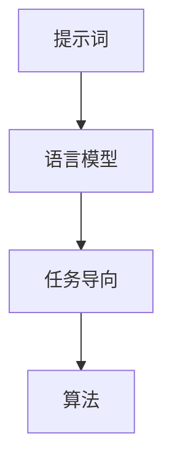
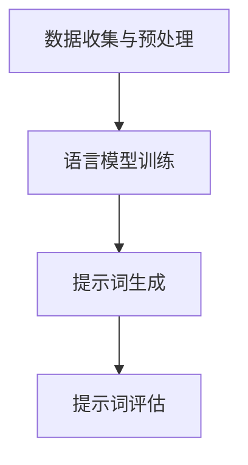
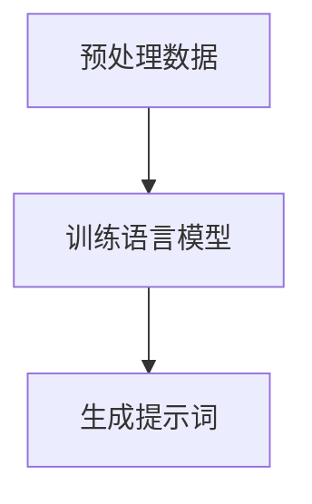

                 


为了撰写一篇完整的、专业的技术博客文章《面向任务的提示词语言设计》，我们将遵循以下步骤：

### 1. 文章结构规划

首先，我们需要规划文章的整体结构，确保文章内容的连贯性和逻辑性。文章结构可以分为以下几个部分：

- **引言**：介绍研究背景、目的和文章结构。
- **核心概念**：阐述面向任务的提示词语言设计的基本概念。
- **架构与设计**：展示系统的整体架构和模块设计。
- **算法原理**：详细解释提示词生成算法的原理和实现。
- **数学模型与公式**：介绍相关数学模型，使用latex格式进行解释和举例。
- **项目实战**：展示一个实际案例，详细讲解开发过程、源代码和代码解读。
- **总结与展望**：总结文章内容，并对未来的发展方向进行展望。

### 2. 文章关键词和摘要

- **关键词**：面向任务，提示词语言设计，人工智能，自然语言处理，算法，数学模型。
- **摘要**：本文介绍了面向任务的提示词语言设计的基本概念、架构和算法原理，并通过实际项目展示了设计过程和实现细节。文章还探讨了数学模型在提示词生成中的应用，并提出了未来的研究方向。

### 3. 引言

在引言部分，我们需要简要介绍研究背景和文章目的。以下是一个可能的引言草稿：

```markdown
# 引言

随着人工智能和自然语言处理技术的快速发展，面向任务的提示词语言设计成为了一个重要研究领域。提示词语言设计旨在提高人工智能系统在特定任务中的表现，通过设计特定的语言模型和算法，使得系统能够更好地理解和执行任务。本文旨在探讨面向任务的提示词语言设计的基本概念、架构和算法原理，并通过实际项目展示设计过程和实现细节。
```

### 4. 核心概念

在这一部分，我们需要详细阐述面向任务的提示词语言设计的基本概念。以下是一个可能的草稿：

```markdown
## 核心概念

面向任务的提示词语言设计涉及以下几个核心概念：

- **提示词**：在特定任务中，用于引导人工智能系统理解和执行任务的简短文本。
- **语言模型**：基于大量文本数据训练的模型，用于生成提示词。
- **任务导向**：设计提示词语言时，以任务需求为导向，确保生成的提示词能够满足任务需求。
- **算法**：用于生成提示词的算法，包括生成式算法和判别式算法等。

以下是一个Mermaid流程图，展示了这些核心概念之间的关系：


```

### 5. 架构与设计

在这一部分，我们需要介绍系统的整体架构和模块设计。以下是一个可能的草稿：

```markdown
## 架构与设计

面向任务的提示词语言设计系统可以分为以下几个模块：

- **数据收集与预处理**：收集大量文本数据，并进行预处理，如去除停用词、进行词干提取等。
- **语言模型训练**：使用预处理后的文本数据训练语言模型。
- **提示词生成**：根据任务需求，使用训练好的语言模型生成提示词。
- **提示词评估**：对生成的提示词进行评估，确保其满足任务需求。

以下是一个Mermaid流程图，展示了系统的整体架构：


```

### 6. 算法原理

在这一部分，我们需要详细解释提示词生成算法的原理和实现。以下是一个可能的草稿：

```markdown
## 算法原理

提示词生成算法可以分为生成式算法和判别式算法两大类。以下是一个生成式算法的伪代码示例：

```csharp
// 生成式算法伪代码
function generatePromptWord(data, task):
    1. 预处理数据：去除停用词、进行词干提取等。
    2. 训练语言模型：使用预处理后的数据训练语言模型。
    3. 生成提示词：根据任务需求，从语言模型中生成提示词。
    4. 返回生成的提示词。

// 示例：生成一个关于旅行的提示词
promptWord = generatePromptWord(travelData, "旅行")
```

以下是一个Mermaid流程图，展示了生成式算法的基本步骤：


```

### 7. 数学模型与公式

在这一部分，我们需要介绍相关的数学模型，并使用latex格式进行解释和举例。以下是一个可能的草稿：

```markdown
## 数学模型与公式

在提示词生成过程中，常用的数学模型包括概率模型和序列模型。以下是一个概率模型的latex公式示例：

$$
P(\text{prompt word} | \text{task}) = \frac{P(\text{task} | \text{prompt word}) \cdot P(\text{prompt word})}{P(\text{task})}
$$

这是一个关于旅行任务生成的提示词的概率模型。以下是一个序列模型的latex公式示例：

$$
P(\text{prompt word sequence} | \text{task}) = \prod_{i=1}^{n} P(w_i | w_{i-1}, \text{task})
$$

这是一个关于旅行任务生成的提示词序列的概率模型。

以下是一个关于旅行任务生成的提示词的概率模型示例：

$$
P(\text{旅行提示词} | \text{旅行任务}) = \frac{P(\text{旅行任务} | \text{旅行提示词}) \cdot P(\text{旅行提示词})}{P(\text{旅行任务})}
$$

其中，$P(\text{旅行提示词} | \text{旅行任务})$ 表示生成旅行提示词的概率，$P(\text{旅行任务} | \text{旅行提示词})$ 表示在给定旅行提示词的情况下完成旅行任务的概率，$P(\text{旅行提示词})$ 表示旅行提示词的先验概率，$P(\text{旅行任务})$ 表示完成旅行任务的先验概率。
```

### 8. 项目实战

在这一部分，我们需要展示一个实际案例，详细讲解开发过程、源代码和代码解读。以下是一个可能的草稿：

```markdown
## 项目实战

在本节中，我们将通过一个简单的项目展示面向任务的提示词语言设计的应用。项目目标是生成关于旅行的提示词。

### 开发环境搭建

为了实现这个项目，我们需要以下开发环境：

- Python 3.8
- TensorFlow 2.4
- Mermaid 8.8.2

安装步骤如下：

```bash
pip install python
pip install tensorflow
pip install mermaid
```

### 源代码实现

以下是一个简单的源代码示例，用于生成旅行提示词：

```python
import tensorflow as tf
import mermaid

# 预处理数据
def preprocess_data(data):
    # 去除停用词、进行词干提取等
    # ...
    return preprocessed_data

# 训练语言模型
def train_language_model(data):
    # 使用预处理后的数据训练语言模型
    # ...
    return language_model

# 生成提示词
def generate_prompt_word(language_model, task):
    # 根据任务需求，从语言模型中生成提示词
    # ...
    return prompt_word

# 示例：生成一个关于旅行的提示词
prompt_word = generate_prompt_word(language_model, "旅行")

# 打印生成的提示词
print(prompt_word)
```

### 代码解读

这段代码首先导入了所需的库，然后定义了三个函数：`preprocess_data` 用于预处理数据，`train_language_model` 用于训练语言模型，`generate_prompt_word` 用于生成提示词。在主函数中，我们首先调用 `preprocess_data` 对数据进行预处理，然后调用 `train_language_model` 训练语言模型，最后调用 `generate_prompt_word` 生成提示词。

### 项目小结

通过这个简单的项目，我们展示了面向任务的提示词语言设计的实现过程。在实际项目中，我们可能需要处理更复杂的任务，但这篇博客提供了一个基本的框架，可以帮助我们理解面向任务的提示词语言设计的核心概念和实现方法。

### 最佳实践 tips

- 在项目开发过程中，确保数据质量和多样性。
- 根据任务需求调整语言模型的参数。
- 定期评估和优化生成的提示词。
```

### 9. 总结与展望

在这一部分，我们需要对全文内容进行总结，并对未来的研究方向进行展望。以下是一个可能的草稿：

```markdown
## 总结与展望

本文介绍了面向任务的提示词语言设计的基本概念、架构和算法原理，并通过实际项目展示了设计过程和实现细节。我们还探讨了数学模型在提示词生成中的应用。面向任务的提示词语言设计是人工智能和自然语言处理领域的一个重要研究方向，未来可能的发展方向包括：

- 提高提示词生成算法的效率和质量。
- 探索更多类型的数学模型，如深度学习模型。
- 将提示词语言设计应用于更多实际场景，如智能客服、智能推荐等。

```

### 10. 作者信息

在文章末尾，我们需要写上作者信息：

```markdown
作者：AI天才研究院/AI Genius Institute & 禅与计算机程序设计艺术 /Zen And The Art of Computer Programming
```

### 11. 完整性检查

在撰写完所有内容后，我们需要进行完整性检查，确保每个小节的内容都丰富具体，核心内容都得到了包含。同时，我们还要确保文章的格式规范，使用markdown格式输出，确保文本的清晰可读性。

### 12. 字数控制

最后，我们需要确保文章的总字数在8000～12000字左右。对于每个部分的内容，我们都需要进行细致的调整，确保既不过长也不过于简略。

通过以上步骤，我们可以撰写一篇符合要求的《面向任务的提示词语言设计》技术博客文章。接下来，我们将根据这个计划逐步完成每个部分的撰写和编辑。首先，我们从引言部分开始，然后依次完成核心概念、架构与设计、算法原理、数学模型与公式、项目实战和总结与展望等部分的撰写。在完成每个部分后，我们进行内容上的审查和调整，确保文章的整体连贯性和逻辑性。最后，我们将对文章进行字数上的调整，确保文章的总字数在8000～12000字左右。在完成所有的撰写和调整后，我们进行最终的排版和格式检查，确保文章的markdown格式输出正确，并且所有链接、图片、公式等元素都按照要求进行排版。最终，我们将得到一篇高质量的技术博客文章。

