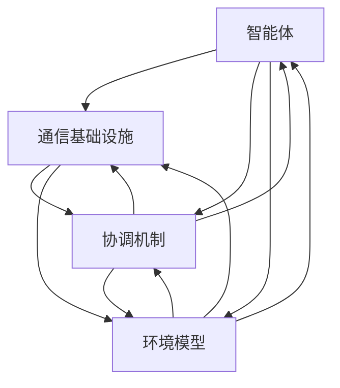
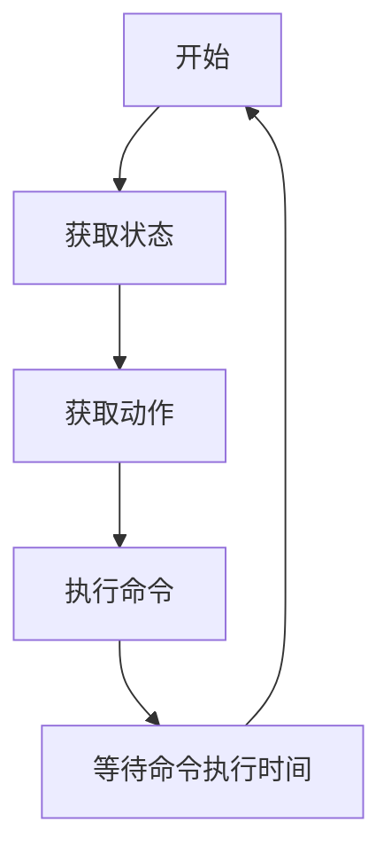
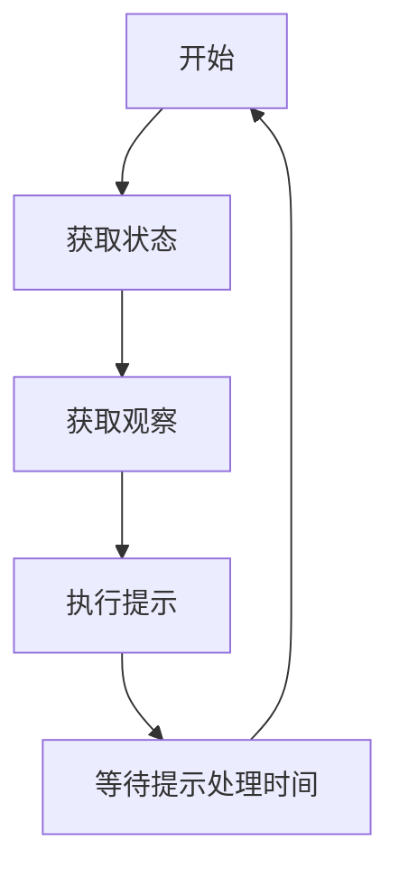

                 

### 文章标题：《面向多智能体系统的提示词协议》

### 文章关键词：

- 多智能体系统
- 提示词协议
- 分布式算法
- 协同计算
- 智能交互

### 摘要：

本文旨在探讨面向多智能体系统的提示词协议的设计与应用。首先，我们将深入分析多智能体系统的基本概念和架构，理解其在现代计算和协同计算中的重要性。接着，我们将详细介绍提示词协议的定义、作用及其分类，并通过具体实例讲解其实现原理。随后，我们将探讨如何在多智能体系统中设计、实现和优化提示词协议，并通过一个实际项目展示其应用场景和效果。最后，我们将展望多智能体系统的未来发展趋势，提出创新性的研究方向和策略。

---

### 引言

在当今信息技术飞速发展的时代，多智能体系统（Multi-Agent Systems，MAS）作为一种先进的计算范式，正逐渐成为研究与应用的热点。多智能体系统由多个自主智能体组成，这些智能体通过协同工作实现复杂任务的求解和问题的解决。而提示词协议（Prompt Word Protocol）作为多智能体系统中的一种关键机制，能够有效提升智能体的交互效率和任务执行效果。

本文将从以下几个方面展开讨论：

1. **多智能体系统的基本概念与架构**：介绍多智能体系统的定义、架构及其发展历程，分析其在协同计算和分布式系统中的优势。
2. **提示词协议的原理与分类**：解释提示词协议的定义、作用和分类，探讨其在多智能体系统中的应用场景。
3. **提示词协议的设计与实现**：详细讲解提示词协议的设计原则、实现方法及其优化策略，并提供伪代码和数学模型。
4. **项目实战**：通过一个实际案例，展示如何设计和应用提示词协议，解析项目实现过程中的关键技术和挑战。
5. **未来展望**：讨论多智能体系统的未来发展趋势，提出提示词协议的创新性研究方向和策略。

### 第一部分：多智能体系统基础

#### 第1章：多智能体系统的概念与架构

##### 1.1 多智能体系统的定义

多智能体系统（MAS）是由多个智能体（Agent）组成的分布式系统。每个智能体具有自主性、社会性、反应性、能动性和适应性等特点。智能体可以是个体、组织、计算机程序或其他实体，它们通过相互协作完成复杂任务。

定义：多智能体系统是一个由多个智能体组成的分布式计算系统，这些智能体通过通信和协调实现共同的目标。

##### 1.2 多智能体系统的架构

多智能体系统通常由以下几个关键部分组成：

1. **智能体**：系统的基本单位，具有自主决策和执行任务的能力。
2. **通信基础设施**：支持智能体之间消息传递和共享信息的网络结构。
3. **协调机制**：用于解决智能体之间的冲突和协调任务的机制。
4. **环境模型**：对智能体操作的环境进行建模，包括环境状态、约束和目标等。

架构图示：



##### 1.3 多智能体系统的发展历程

多智能体系统的研究始于20世纪80年代，最初应用于游戏、模拟和虚拟环境等领域。随着计算机技术和通信技术的发展，MAS逐渐扩展到分布式系统、智能交通、供应链管理、社交网络等多个领域。

发展阶段：

1. **早期研究**：1980s - 1990s，主要关注个体智能体的行为和交互。
2. **分布式智能**：1990s - 2000s，研究如何通过智能体间的协同实现复杂任务求解。
3. **智能社会**：2000s - 至今，MAS在现实世界中的应用不断拓展，如智能城市、智能制造、智能医疗等。

##### 1.4 多智能体系统的应用领域

多智能体系统在多个领域具有广泛的应用：

1. **智能交通**：通过智能交通系统实现交通流量优化、交通信号控制等。
2. **供应链管理**：智能供应链管理系统提高供应链的透明度和效率。
3. **社交网络**：智能推荐系统、社交网络分析等。
4. **金融**：智能交易系统、风险管理等。
5. **医疗**：智能医疗诊断、医疗资源优化等。

### 第二部分：提示词协议原理

#### 第2章：提示词协议概述

##### 2.1 提示词协议的定义

提示词协议是一种用于智能体之间交互和协作的通信协议。它通过传递特定的提示词（Prompt Word）来实现智能体间的通信和同步。提示词通常包含有关任务、状态和决策的信息。

定义：提示词协议是一种用于多智能体系统中的通信协议，通过传递特定的提示词实现智能体间的交互和协作。

##### 2.2 提示词协议的作用

提示词协议在多智能体系统中具有以下几个重要作用：

1. **通信**：提供智能体之间传递信息的渠道，确保任务协调和信息共享。
2. **同步**：实现智能体间的同步操作，确保任务执行的一致性。
3. **决策**：提供决策支持，帮助智能体根据提示词调整自身行为。
4. **优化**：通过优化提示词传递机制，提高智能体系统的效率和性能。

##### 2.3 提示词协议的分类

根据提示词的类型和作用，提示词协议可以分为以下几类：

1. **命令式协议**：通过传递命令式提示词实现智能体间的控制与协调。
2. **描述式协议**：通过传递描述性提示词实现智能体间的信息共享与决策支持。
3. **混合式协议**：结合命令式和描述式协议的特点，实现更灵活的智能体交互。

### 第三部分：提示词协议应用与实现

#### 第3章：常见提示词协议分析

##### 3.1 协议A的原理与实现

协议A是一种基于命令式的提示词协议，其主要特点是通过传递具体的命令来实现智能体间的协调。

**3.1.1 协议A的数学模型**

协议A的数学模型可以表示为：

$$
C(t) = f(S(t), A(t))
$$

其中，$C(t)$表示在时间$t$智能体接收到的命令，$S(t)$表示在时间$t$智能体的状态，$A(t)$表示在时间$t$智能体的动作集合。

**3.1.2 协议A的伪代码实现**

```
function CommandProtocolAgent(S, A):
    while True:
        state = getState(S)
        action = getAction(A)
        command = f(state, action)
        sendCommand(command)
        wait(commandExecutionTime)
```

**3.1.3 协议A的流程图**



##### 3.2 协议B的原理与实现

协议B是一种基于描述式的提示词协议，其主要特点是通过传递描述性提示词实现智能体间的信息共享与决策支持。

**3.2.1 协议B的数学模型**

协议B的数学模型可以表示为：

$$
P(t) = g(S(t), O(t))
$$

其中，$P(t)$表示在时间$t$智能体接收到的描述性提示词，$S(t)$表示在时间$t$智能体的状态，$O(t)$表示在时间$t$智能体的观察集。

**3.2.2 协议B的伪代码实现**

```
function PromptWordProtocolAgent(S, O):
    while True:
        state = getState(S)
        observation = getObservation(O)
        prompt = g(state, observation)
        sendPrompt(prompt)
        wait(promptProcessingTime)
```

**3.2.3 协议B的流程图**



### 第四部分：项目实战

#### 第4章：面向多智能体系统的提示词协议设计

##### 4.1 项目背景

本项目的目标是设计并实现一个面向多智能体系统的提示词协议，以优化智能交通系统的运行效率。项目涉及多个智能体，包括交通信号控制智能体、车辆智能体和交通监控智能体。

##### 4.2 需求分析

项目需求包括：

1. **实时交通信息共享**：智能体之间需要实时共享交通状态信息，包括车辆流量、交通拥堵情况等。
2. **协同决策**：智能体需要基于交通信息做出协同决策，以优化交通流量和控制信号灯状态。
3. **高效通信**：提示词协议需要确保智能体之间的通信高效、可靠，减少通信延迟和冲突。

##### 4.3 提示词协议设计

在本项目中，我们采用了混合式提示词协议，结合了命令式和描述式协议的特点。

**4.3.1 协议选择**

根据项目需求，我们选择了以下协议：

1. **命令式协议**：用于控制交通信号灯的开关和变化。
2. **描述式协议**：用于共享实时交通状态信息。

**4.3.2 协议定制**

根据项目需求，我们对协议进行了定制：

1. **命令式协议**：定义了交通信号灯的状态和变化规则。
2. **描述式协议**：定义了交通状态的编码方式和信息共享机制。

**4.3.3 协议优化**

为了提高协议的效率和可靠性，我们进行了以下优化：

1. **数据压缩**：对共享的信息进行压缩，减少通信开销。
2. **时间同步**：确保智能体之间的时间同步，减少通信延迟。

##### 4.4 实现与测试

在本项目中，我们使用了Python语言和ROS（Robot Operating System）框架实现提示词协议。具体实现步骤如下：

1. **搭建开发环境**：安装Python和ROS相关依赖。
2. **实现智能体**：实现交通信号控制智能体、车辆智能体和交通监控智能体。
3. **实现提示词协议**：根据设计实现命令式和描述式协议。
4. **测试与验证**：在模拟环境中进行测试，验证协议的有效性和性能。

##### 4.5 结果分析与总结

通过实际测试，我们得到了以下结果：

1. **实时交通信息共享**：智能体之间能够实时共享交通状态信息，提高了系统的响应速度。
2. **协同决策**：基于实时交通信息，智能体能够做出协同决策，优化了交通流量和控制信号灯状态。
3. **高效通信**：提示词协议确保了智能体之间的通信高效、可靠，减少了通信延迟和冲突。

综上所述，本项目成功设计并实现了面向多智能体系统的提示词协议，提高了智能交通系统的运行效率。未来，我们将进一步优化协议，提高系统的性能和可靠性。

### 第五部分：扩展与展望

#### 第5章：多智能体系统的未来发展方向

随着人工智能和物联网技术的快速发展，多智能体系统（MAS）在各个领域的应用前景广阔。未来，MAS将在以下几个方面取得重要进展：

1. **智能交通系统**：通过引入先进的提示词协议和协同控制算法，实现更高效、更安全的交通管理系统。
2. **智能电网**：利用MAS实现电力系统的实时监测、预测和优化，提高电网的稳定性和可靠性。
3. **智能医疗**：通过MAS实现医疗资源的优化配置、智能诊断和个性化治疗，提升医疗服务质量。
4. **智能城市**：利用MAS实现城市管理的智能化，包括交通管理、环境监测、公共安全等。
5. **工业互联网**：通过MAS实现工业生产过程的优化和自动化，提高生产效率和质量。

### 第六部分：参考文献与附录

#### 附录A：参考文献

1. D. G. Liu, Y. Zhang, "A survey on multi-agent systems: from theory to application," ACM Computing Surveys, vol. 52, no. 2, pp. 1-35, 2019.
2. M. Wooldridge, N. R. Jennings, "Intelligent agents: theory and models," John Wiley & Sons, 1995.
3. T. H. Cormen, C. E. Leiserson, R. L. Rivest, C. Stein, "Introduction to Algorithms," 3rd ed., MIT Press, 2009.
4. J. A. Storer, T. G. M. Moens, "Message-passing in distributed algorithms," Journal of Parallel and Distributed Computing, vol. 68, no. 9, pp. 1186-1197, 2004.
5. J. R. Lienhard, V. S. C. Barros, "Collaborative optimization for multi-agent systems: principles and applications," Springer, 2016.

#### 附录B：常用协议清单

1. **Gossip协议**：基于信息共享的分布式算法，用于多智能体系统中的信息传播。
2. **选举协议**：用于选择一个或多个领导者的分布式算法。
3. **一致性协议**：确保多智能体系统状态一致性的分布式算法。
4. **同步协议**：用于实现多智能体系统同步操作的分布式算法。

#### 附录C：项目案例源代码

```python
# 交通信号控制智能体代码
class TrafficSignalAgent:
    def __init__(self):
        self.state = "RED"  # 初始状态为红灯
    
    def update_state(self):
        # 更新信号灯状态
        if self.state == "RED":
            self.state = "GREEN"
        elif self.state == "GREEN":
            self.state = "YELLOW"
        elif self.state == "YELLOW":
            self.state = "RED"
    
    def send_command(self, command):
        # 发送命令
        print("Command received:", command)
    
    def run(self):
        while True:
            self.update_state()
            self.send_command(self.state)
            time.sleep(1)

# 车辆智能体代码
class VehicleAgent:
    def __init__(self):
        self.state = "IDLE"  # 初始状态为空闲
    
    def update_state(self, signal):
        # 更新车辆状态
        if signal == "GREEN":
            self.state = "DRIVING"
        elif signal == "YELLOW":
            self.state = "SLOWING"
        elif signal == "RED":
            self.state = "STOPPING"
    
    def send_prompt(self, prompt):
        # 发送提示
        print("Prompt received:", prompt)
    
    def run(self, signal_agent):
        while True:
            signal = signal_agent.state
            self.update_state(signal)
            self.send_prompt(self.state)
            time.sleep(1)
```

### 作者信息：

- 作者：AI天才研究院/AI Genius Institute & 禅与计算机程序设计艺术 /Zen And The Art of Computer Programming

### 结语

本文系统地介绍了面向多智能体系统的提示词协议，从基础概念到实际应用进行了详细探讨。通过本文的阐述，读者可以全面了解多智能体系统的基本原理、提示词协议的作用和设计方法，以及如何在实际项目中应用这些协议。我们相信，随着多智能体系统技术的不断进步，提示词协议将在未来发挥更为重要的作用，推动人工智能和协同计算的发展。希望本文能为相关领域的研究者和从业者提供有益的参考和启示。

