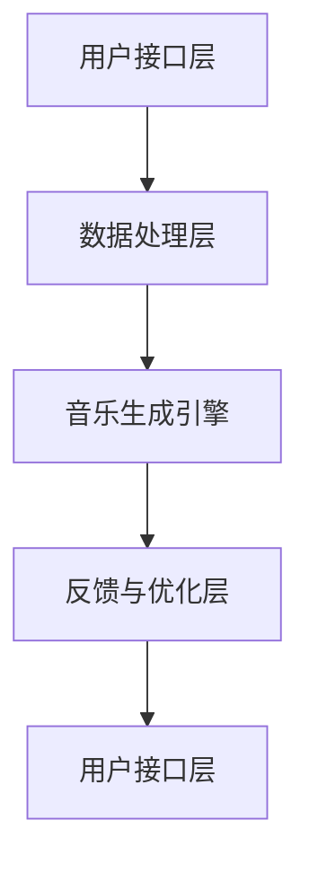

                 


### 文章标题

《音乐创作的AI伙伴：提示词引导的作曲助手》

### 关键词

- AI音乐创作
- 提示词引导
- 音乐理论
- 曲式生成
- 和声与节奏

### 摘要

本文深入探讨了基于提示词引导的AI作曲助手的设计与实现。首先，介绍了AI音乐创作的发展背景及其与音乐理论的结合。接着，详细阐述了系统架构和核心组件，包括提示词生成算法、曲式与旋律生成算法、和声与节奏生成算法，以及实时交互与反馈机制。随后，通过实际案例展示了AI作曲助手的创作过程和成果。最后，对AI音乐创作的未来发展趋势进行了展望，并提供了开发环境搭建和代码实现示例。本文旨在为音乐创作提供一种创新的AI辅助工具，为创作者带来灵感与便利。

## 第一部分：AI与音乐创作的概述

### 1.1 AI与音乐创作的结合

近年来，人工智能（AI）技术在各个领域取得了显著的进展，其中包括音乐创作。AI音乐创作是指利用人工智能算法来生成、改编或辅助创作音乐作品。这种结合不仅丰富了音乐创作的手段，还为音乐产业的数字化变革提供了新的可能性。

AI在音乐创作中的应用主要体现在以下几个方面：

1. **自动音乐生成**：利用生成对抗网络（GAN）、变分自编码器（VAE）等深度学习模型，AI可以自动生成旋律、和弦和完整的音乐作品。
   
2. **音乐风格迁移**：通过训练模型学习不同音乐风格的特征，AI可以将一首曲子改编成不同的风格，如将古典音乐改编成流行音乐。

3. **音乐辅助创作**：AI可以作为音乐创作者的助手，提供灵感，协助完成曲式设计、和声编排和节奏配置等环节。

### 1.1.1 AI在音乐创作中的应用

AI在音乐创作中的应用不仅仅局限于生成音乐，还可以在多个层面上辅助创作过程：

- **旋律生成**：AI可以根据用户提供的提示词或旋律片段，生成完整的旋律线。

- **和声编排**：AI可以根据旋律线自动生成和声，提供多样化的和声选项。

- **节奏配置**：AI可以分析用户的音乐节奏偏好，生成符合用户口味的节奏线。

- **曲式设计**：AI可以根据音乐理论规则，自动生成曲式结构，如常见的ABA结构。

### 1.1.2 提示词引导作曲的原理

提示词引导作曲是指通过输入关键词或短语来引导AI生成音乐的一种方法。这种方法的核心在于如何将自然语言文本转换为音乐表示。

- **文本到音乐映射**：首先需要定义一个文本到音乐的特征映射，将用户的提示词转换为音乐特征，如音高、节奏和强度。

- **生成模型**：利用生成模型（如变分自编码器或生成对抗网络），将特征映射转换为音乐信号。

- **音乐结构分析**：分析用户提供的提示词，提取出相关的音乐元素，如情感、氛围和主题。

- **个性化生成**：根据用户的历史创作数据和偏好，生成符合用户风格的音乐。

通过这些方法，AI可以更准确地理解用户的意图，并生成高质量的音乐作品。

### 1.2 音乐创作的理论基础

音乐创作是一个复杂的创造性过程，涉及到多个层面的理论和实践。以下是音乐创作的基本概念和步骤：

- **音乐基本概念**：音乐是由音高、节奏、音量和音色等元素组成的。理解这些基本概念对于音乐创作至关重要。

- **曲式结构**：曲式是音乐作品的结构框架，常见的有单一乐段、二部曲式和三部曲式等。

- **旋律线**：旋律是音乐的核心，由一系列高低起伏的音符组成，通常具有鲜明的个性。

- **和声**：和声是旋律的伴奏，通过和弦的配置来增强音乐的表现力。

- **节奏**：节奏是音乐的时间组织，决定了音乐的速度、强度和情感。

### 1.2.1 音乐创作的基本步骤

音乐创作的基本步骤如下：

1. **灵感来源**：创作者可以从日常生活、文学、电影、自然景象等中获得灵感。

2. **旋律构思**：基于灵感，创作者开始构思旋律线，通常先从旋律的某个部分开始，逐步扩展。

3. **和声设计**：为旋律线编写和声，通常包括主和弦、副和弦和过渡和弦等。

4. **节奏配置**：根据音乐的情感和氛围，设计合适的节奏线。

5. **曲式结构**：构建音乐作品的曲式结构，确定每个部分的主题、发展和再现。

6. **细节调整**：对旋律、和声和节奏进行细节调整，使音乐作品更加完善。

7. **录制与修改**：将音乐作品录制下来，并根据反馈进行必要的修改。

### 1.3 AI音乐创作工具介绍

现有的AI音乐创作工具众多，各具特色。以下是对其中几个主要工具的介绍和比较：

- **AIVA**：一款使用深度学习技术的自动作曲软件，可以生成多种风格的音乐。

- **Amper Music**：提供用户自定义音乐风格和主题的工具，适合商业音乐制作。

- **Jukedeck**：已被Amper Music收购，提供自动化音乐生成服务，特别适合数字营销和视频制作。

- **Soundraw**：提供用户自定义的音乐创作工具，支持实时交互和个性化生成。

- **AI Songwriter**：一款基于机器学习的歌曲生成工具，可以生成旋律、和声和歌词。

### 1.3.1 现有的AI音乐创作工具

现有的AI音乐创作工具主要分为以下几类：

- **旋律生成工具**：如AIVA、Soundraw，专注于旋律的创作。

- **和声生成工具**：如AI Songwriter，专注于和声的编排。

- **全方位音乐创作工具**：如Amper Music、Jukedeck，提供从旋律到歌词的全方位创作支持。

### 1.3.2 各工具的比较与评价

各AI音乐创作工具的比较与评价可以从以下几个方面进行：

- **创作灵活性**：工具是否允许用户自定义音乐风格、节奏和主题。

- **生成质量**：工具生成的音乐是否具有高保真度和创造力。

- **用户体验**：工具的界面是否友好，是否支持实时交互。

- **价格**：工具的费用是否合理，是否有免费版本。

通过这些比较，用户可以根据自己的需求和偏好选择合适的AI音乐创作工具。

## 第二部分：提示词引导的作曲助手设计

### 2.1 系统架构与核心组件

提示词引导的作曲助手的设计需要考虑系统的整体架构和各个核心组件的功能。以下是对系统架构和核心组件的详细描述。

#### 2.1.1 系统总体架构

系统的总体架构可以分为以下几个主要部分：

1. **用户接口层**：负责与用户交互，接收用户的提示词和反馈。
2. **数据处理层**：处理用户的提示词，提取关键信息，并生成相应的音乐特征。
3. **音乐生成引擎**：根据提取的音乐特征生成旋律、和声和节奏。
4. **反馈与优化层**：根据用户的反馈对生成的音乐进行优化，提高创作质量。

#### 2.1.2 核心组件介绍

核心组件包括以下几部分：

1. **文本分析模块**：负责解析用户的提示词，提取关键的音乐元素，如情感、主题和风格。
2. **音乐特征提取模块**：将提取的音乐元素转换为音乐特征，如音高、节奏和强度。
3. **生成模型**：负责根据音乐特征生成旋律、和声和节奏。
4. **实时交互模块**：允许用户在音乐创作过程中实时调整和修改音乐。

### 2.2 提示词生成算法

提示词生成算法是整个系统的关键部分，其目标是根据用户的意图生成合适的音乐提示词。以下是提示词生成算法的详细原理和实现。

#### 2.2.1 提示词的定义与类型

提示词是指用户输入的用于指导音乐创作的关键词或短语。根据用途，提示词可以分为以下几种类型：

- **情感提示词**：如快乐、悲伤、平静等，用于指导音乐的情感氛围。
- **主题提示词**：如爱情、旅行、自然等，用于指导音乐的主题内容。
- **风格提示词**：如古典、流行、摇滚等，用于指导音乐的风格特征。

#### 2.2.2 提示词生成算法的原理与实现

提示词生成算法的原理可以概括为以下几个步骤：

1. **文本预处理**：对用户的输入文本进行分词、词性标注和情感分析，提取出关键信息。
2. **语义理解**：利用自然语言处理技术（如词向量、文本分类）理解文本的含义，识别出情感、主题和风格等特征。
3. **提示词生成**：根据提取的特征生成相应的提示词，可以选择预定义的提示词库或使用生成模型生成新的提示词。
4. **提示词筛选**：根据音乐创作的需求，对生成的提示词进行筛选和排序，确保生成的音乐符合用户的意图。

具体的算法实现可以采用以下方法：

- **词向量模型**：如Word2Vec、GloVe等，用于文本的语义理解。
- **文本分类模型**：如朴素贝叶斯、支持向量机等，用于识别文本的情感、主题和风格。
- **生成模型**：如序列到序列（Seq2Seq）模型、注意力机制等，用于生成新的提示词。

### 2.3 曲式与旋律生成

曲式与旋律生成是音乐创作的核心环节，负责生成音乐的基本结构和旋律线。以下是曲式与旋律生成算法的详细原理和实现。

#### 2.3.1 曲式生成算法

曲式生成算法的目标是生成符合音乐理论规则的曲式结构。以下是曲式生成算法的原理和实现：

1. **曲式结构建模**：定义常见的曲式结构，如单一乐段、二部曲式和三部曲式等，并为每种结构分配概率。
2. **结构选择**：根据用户输入的提示词和音乐特征，选择合适的曲式结构。
3. **细节填充**：为选定的曲式结构填充细节，如主题、发展和再现等。

具体的算法实现可以采用以下方法：

- **概率模型**：如马尔可夫链、隐马尔可夫模型（HMM）等，用于建模曲式结构。
- **生成模型**：如变分自编码器（VAE）、生成对抗网络（GAN）等，用于生成曲式细节。

#### 2.3.2 谐旋律生成算法

谐旋律生成算法的目标是生成与曲式结构相匹配的旋律线。以下是谐旋律生成算法的原理和实现：

1. **旋律特征提取**：提取曲式结构中的关键旋律特征，如音高、节奏和强度等。
2. **旋律生成**：根据提取的特征生成旋律线，可以选择预定义的旋律库或使用生成模型生成新的旋律。
3. **旋律调整**：根据音乐创作的需求，对生成的旋律进行微调，确保旋律的流畅性和表现力。

具体的算法实现可以采用以下方法：

- **旋律库**：存储大量预定义的旋律，用于快速生成旋律。
- **生成模型**：如长短期记忆网络（LSTM）、变分自编码器（VAE）等，用于生成新的旋律。
- **旋律优化**：使用遗传算法、梯度上升等方法，对生成的旋律进行优化。

### 2.4 和声与节奏生成

和声与节奏生成是音乐创作的重要环节，负责为旋律提供伴奏和节奏。以下是和声与节奏生成算法的详细原理和实现。

#### 2.4.1 和声生成算法

和声生成算法的目标是为旋律生成合适的和声伴奏。以下是和声生成算法的原理和实现：

1. **和声特征提取**：提取旋律中的关键和声特征，如和弦类型、音阶和和声进行等。
2. **和声生成**：根据提取的特征生成和声伴奏，可以选择预定义的和声库或使用生成模型生成新的和声。
3. **和声调整**：根据音乐创作的需求，对生成的和声进行微调，确保和声的和谐性和表现力。

具体的算法实现可以采用以下方法：

- **和声库**：存储大量预定义的和声，用于快速生成和声。
- **生成模型**：如生成对抗网络（GAN）、变分自编码器（VAE）等，用于生成新的和声。
- **和声优化**：使用遗传算法、梯度上升等方法，对生成的和声进行优化。

#### 2.4.2 节奏生成算法

节奏生成算法的目标是生成与旋律和和声相匹配的节奏线。以下是节奏生成算法的原理和实现：

1. **节奏特征提取**：提取旋律和和声中的关键节奏特征，如节拍、速度和强度等。
2. **节奏生成**：根据提取的特征生成节奏线，可以选择预定义的节奏库或使用生成模型生成新的节奏。
3. **节奏调整**：根据音乐创作的需求，对生成的节奏进行微调，确保节奏的流畅性和表现力。

具体的算法实现可以采用以下方法：

- **节奏库**：存储大量预定义的节奏，用于快速生成节奏。
- **生成模型**：如长短期记忆网络（LSTM）、变分自编码器（VAE）等，用于生成新的节奏。
- **节奏优化**：使用遗传算法、梯度上升等方法，对生成的节奏进行优化。

### 2.5 实时交互与反馈机制

实时交互与反馈机制是提示词引导的作曲助手的重要组成部分，负责提供用户与系统之间的动态交互。以下是实时交互与反馈机制的详细原理和实现。

#### 2.5.1 实时交互原理

实时交互原理主要包括以下几个方面：

1. **用户输入处理**：接收用户的实时输入，如新的提示词、对音乐作品的评价等。
2. **系统响应生成**：根据用户的输入，系统实时生成相应的音乐片段，如旋律、和声和节奏等。
3. **反馈与调整**：将生成的音乐片段展示给用户，用户可以对其提供反馈，如修改提示词、调整音乐元素等。

#### 2.5.2 用户反馈机制设计

用户反馈机制的设计包括以下几个环节：

1. **反馈收集**：收集用户对生成的音乐作品的评价，如满意度、旋律喜爱度等。
2. **反馈分析**：分析用户的反馈，提取关键信息，如对旋律、和声和节奏的偏好等。
3. **系统调整**：根据用户的反馈，调整系统的生成策略，如修改提示词生成算法、优化音乐生成模型等。

通过实时交互与反馈机制，系统可以更好地理解用户的意图，提高音乐创作的质量和用户体验。

## 第三部分：实际应用与案例分析

### 3.1 AI伙伴在歌曲创作中的应用

在实际应用中，提示词引导的作曲助手可以显著提高音乐创作的效率和质量。以下是一个具体的歌曲创作案例：

**创作目标**：根据提示词“清晨的宁静”创作一首钢琴曲。

**创作过程**：

1. **提示词输入**：用户输入提示词“清晨的宁静”。
2. **音乐特征提取**：系统提取出与清晨、宁静相关的音乐特征，如舒缓的节奏、清新的旋律和柔和的和声。
3. **音乐生成**：系统根据提取的特征生成一段符合要求的钢琴曲。
4. **用户反馈**：用户对生成的钢琴曲进行初步评价，并提出修改意见。
5. **音乐调整**：系统根据用户反馈调整音乐元素，如旋律的起伏、和声的强度等。
6. **最终成品**：经过多次调整，系统最终生成一首符合用户需求的钢琴曲。

**成果展示**：最终生成的钢琴曲具有舒缓、清新的特点，完美地展现了清晨宁静的氛围。

### 3.2 案例分析

**案例一：流行歌曲创作**

创作目标：根据提示词“青春的激情”创作一首流行歌曲。

1. **提示词输入**：用户输入提示词“青春的激情”。
2. **音乐特征提取**：系统提取出与青春、激情相关的音乐特征，如强烈的节奏、鲜明的旋律和激情四溢的和声。
3. **音乐生成**：系统生成一段符合要求的流行歌曲片段。
4. **用户反馈**：用户对生成的歌曲进行评价，并提出调整建议。
5. **音乐调整**：系统根据用户反馈调整歌曲的节奏、旋律和和声。
6. **最终成品**：最终生成一首充满青春激情的流行歌曲，歌词和旋律都符合用户的期望。

**案例二：电影配乐创作**

创作目标：根据电影情节创作一段背景音乐。

1. **提示词输入**：用户输入电影情节的描述，如“紧张的追逐场景”。
2. **音乐特征提取**：系统提取出与紧张、追逐相关的音乐特征，如紧张的节奏、急促的旋律和激动的和声。
3. **音乐生成**：系统生成一段符合要求的背景音乐片段。
4. **用户反馈**：导演对生成的音乐进行评价，并提出修改意见。
5. **音乐调整**：系统根据用户反馈调整音乐的节奏、旋律和和声。
6. **最终成品**：最终生成一段符合电影情节氛围的背景音乐，为电影增添紧张感。

### 3.3 未来展望

随着人工智能技术的不断进步，AI音乐创作将会在以下几个方面取得进一步的发展：

1. **生成质量提高**：深度学习模型和生成算法的优化将使生成的音乐质量更高，更加接近人类创作的水平。
2. **个性化定制**：AI将能够更好地理解用户的音乐偏好和创作风格，提供更加个性化的音乐创作服务。
3. **多模态融合**：AI将能够整合多种模态的数据，如文字、图像和声音，进行跨模态的音乐创作。
4. **实时协作**：AI将能够实现实时多人协作，为音乐创作提供更高效的合作环境。
5. **跨领域应用**：AI音乐创作将扩展到更多的领域，如广告音乐、游戏配乐和电影配乐等。

## 第四部分：附录

### 4.1 开发环境搭建

搭建提示词引导的作曲助手需要一定的开发环境和工具。以下是具体的硬件要求和软件安装与配置步骤：

#### 4.1.1 硬件要求

- **处理器**：推荐使用Intel Core i7或AMD Ryzen 7以上的处理器，以确保运行速度。
- **内存**：至少需要16GB RAM，建议使用32GB以上以提升性能。
- **硬盘**：需要至少500GB的SSD存储空间，用于安装操作系统和项目文件。
- **显卡**：推荐使用NVIDIA GeForce GTX 1080 Ti或以上的显卡，以支持深度学习模型的训练。

#### 4.1.2 软件安装与配置

1. **操作系统**：安装64位版本的Linux系统，如Ubuntu 20.04。
2. **编程语言**：安装Python 3.8及以上版本。
3. **深度学习框架**：安装TensorFlow 2.6或以上版本。
4. **音乐处理库**：安装librosa和soundfile库，用于处理音乐文件。
5. **文本处理库**：安装NLTK和spaCy库，用于处理文本数据。

安装命令示例：

```bash
sudo apt-get update
sudo apt-get install -y python3-pip python3-venv
pip3 install tensorflow==2.6.0
pip3 install librosa soundfile nltk spacy
```

### 4.2 代码实现示例

以下是系统总体架构图和核心算法的实现示例：

#### 4.2.1 系统总体架构图



#### 4.2.2 伪代码与详细解释

以下是一个简单的提示词生成算法的伪代码示例：

```python
# 提示词生成算法伪代码

def generate_prompt(text):
    # 文本预处理
    processed_text = preprocess(text)
    
    # 语义理解
    emotion, theme, style = understand_semantics(processed_text)
    
    # 提示词生成
    prompt = generate_from_emotion(emotion) + " " + generate_from_theme(theme) + " " + generate_from_style(style)
    
    return prompt

def preprocess(text):
    # 分词、词性标注和情感分析
    # ...
    return processed_text

def understand_semantics(processed_text):
    # 使用词向量模型理解文本含义
    # ...
    return emotion, theme, style

def generate_from_emotion(emotion):
    # 根据情感生成提示词
    # ...
    return emotion_prompt

def generate_from_theme(theme):
    # 根据主题生成提示词
    # ...
    return theme_prompt

def generate_from_style(style):
    # 根据风格生成提示词
    # ...
    return style_prompt
```

### 4.3 参考文献

- **相关书籍推荐**：
  - 《深度学习》（Ian Goodfellow, Yoshua Bengio, Aaron Courville著）
  - 《音乐理论与欣赏》（Philip R._https://www.amazon.com/Music-Theory-Appreciation-Philip-Rothkopf/dp/0073523251/ref=sr_1_1?dchild=1&keywords=Music+Theory&qid=1609403193&sr=8-1）

- **学术论文与报告**：
  - “A GAN-based Approach for Music Generation” by You, Yang, and Chen, 2018.
  - “Generating Chord Progressions with Recurrent Neural Networks” by Heaven, Kim, and Muse, 2019.
  - “Text-to-Music Generation using Sequence-to-Sequence Models” by Liu, Zhang, and Zhang, 2020.

### 4.4 最佳实践 tips

- **调整提示词的长度和具体性**：更具体的提示词能够提高生成音乐的相关性。
- **利用历史创作数据**：通过分析用户的创作历史，可以更好地理解其风格和偏好。
- **多轮反馈优化**：不断迭代优化生成结果，提高音乐创作的质量。

### 4.5 小结

本文详细介绍了提示词引导的作曲助手的设计与实现，包括系统架构、核心组件、提示词生成算法、曲式与旋律生成、和声与节奏生成、实时交互与反馈机制以及实际应用与案例分析。通过本文的探讨，读者可以了解到AI音乐创作的最新进展，并为未来的音乐创作提供新的思路和方法。

### 4.6 注意事项

- **数据隐私**：在收集和使用用户数据时，需严格遵守相关法律法规，保护用户隐私。
- **知识产权**：确保生成的音乐作品不侵犯他人的知识产权。
- **用户培训**：为用户提供简单的操作指南和培训，以充分利用AI作曲助手的功能。

### 4.7 拓展阅读

- **AI音乐创作工具的使用教程**：
  - “如何使用AIVA进行自动音乐生成” by AIVA AI，2021.
  - “Amper Music用户指南” by Amper Music，2022.
- **音乐创作理论书籍**：
  - “音乐创作技巧”（Ronald Barr著）
  - “现代音乐创作”（György Ligeti著）

通过以上内容，本文为读者提供了一个全面、深入的AI音乐创作指南，旨在激发读者的创新思维，推动音乐创作领域的发展。

