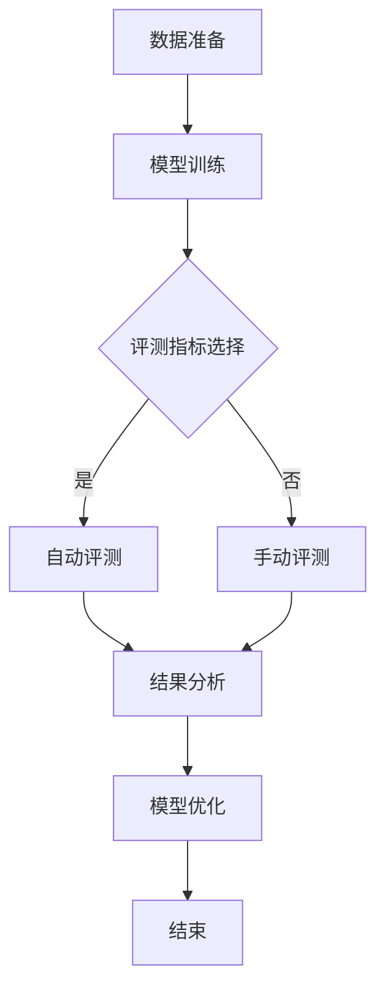

                 

### 文章标题

# 领域特定LLM的定制化评测方案

> 关键词：领域特定LLM，定制化评测，评测指标，应用场景，优化策略

> 摘要：本文将深入探讨领域特定语言模型（LLM）的定制化评测方案。首先，我们定义了领域特定LLM的概念，并介绍了其与传统LLM的区别和重要性。随后，文章详细阐述了领域特定LLM的核心概念和架构设计。接着，我们提出了定制化评测方案的设计原则，包括评测目标与指标定义、数据集选择与预处理、评测策略与方法论。随后，文章介绍了评测工具与技术，包括自动评测工具和手动评测流程。然后，我们详细描述了定制化评测的实施过程，包括准备工作、过程监控与调试，以及结果分析与优化。通过一个具体案例分析，本文展示了如何优化评测方案。最后，文章讨论了评测方案在领域特定任务中的应用和扩展，以及未来的趋势与研究方向。本文旨在为领域特定LLM的评测提供系统性的指导，以促进其在实际应用中的发展。

### 第一部分：概述

#### 第1章：领域特定LLM概述

领域特定语言模型（Domain-Specific Language Model，简称领域特定LLM）是近年来人工智能领域的一个重要研究方向。与通用语言模型（如GPT-3、BERT等）不同，领域特定LLM专注于特定领域或任务，能够提供更精确和有效的结果。本章将详细介绍领域特定LLM的定义、重要性、与传统LLM的区别以及应用场景。

#### 1.1 领域特定LLM的定义与重要性

领域特定LLM是一种在特定领域内训练的语言模型，它通过对大量相关领域的数据进行学习，获得对特定领域知识的理解和应用能力。领域特定LLM的核心目标是提高模型在特定领域的性能和准确性，从而解决通用模型在特定任务中的局限性。

领域特定LLM的重要性体现在以下几个方面：

1. **提高任务性能**：领域特定LLM通过对特定领域知识的深入理解，可以更有效地处理该领域的问题，从而提高任务性能和准确性。

2. **减少数据需求**：与通用模型相比，领域特定LLM在训练过程中不需要大量通用数据集，只需针对特定领域的数据进行训练，从而减少数据需求。

3. **降低计算资源消耗**：由于领域特定LLM专注于特定领域，模型规模相对较小，因此在计算资源和存储资源上的消耗也较低。

4. **增强领域特定任务的适用性**：领域特定LLM可以更好地适应特定领域的任务需求，提供更加精准和有效的解决方案。

#### 1.2 领域特定LLM与传统LLM的区别

传统LLM，如GPT-3、BERT等，是在大规模通用数据集上训练的，旨在提供广泛的文本理解和生成能力。而领域特定LLM则是在特定领域内训练的，其核心区别在于以下几个方面：

1. **数据集**：领域特定LLM使用的是特定领域的数据集，而传统LLM使用的是大规模通用数据集。

2. **知识深度**：领域特定LLM专注于特定领域，能够更深入地理解领域知识，而传统LLM在通用领域上的知识较为广泛但较浅。

3. **性能表现**：领域特定LLM在特定领域的任务上表现更优，而传统LLM在通用任务上表现更佳。

4. **应用范围**：领域特定LLM适用于特定领域的任务，如医疗、金融、法律等，而传统LLM适用于广泛的通用任务。

#### 1.3 领域特定LLM的应用场景

领域特定LLM的应用场景广泛，以下是一些典型的应用场景：

1. **文本生成与摘要**：领域特定LLM可以生成高质量的文本摘要，适用于新闻、报告、论文等领域。

2. **问答系统**：领域特定LLM可以构建针对特定领域的问答系统，如医学问答系统、法律问答系统等。

3. **对话系统**：领域特定LLM可以用于构建针对特定领域的对话系统，如客服机器人、智能助手等。

4. **代码生成与自动化测试**：领域特定LLM可以生成代码片段和测试用例，提高软件开发和测试的效率。

5. **自然语言处理**：领域特定LLM可以用于自然语言处理任务，如情感分析、实体识别、关系提取等。

本章对领域特定LLM进行了概述，包括其定义、重要性、与传统LLM的区别以及应用场景。在接下来的章节中，我们将进一步探讨领域特定LLM的核心概念和架构设计，以及定制化评测方案的设计和实施。

#### 第2章：领域特定LLM的核心概念

领域特定语言模型（Domain-Specific Language Model，简称领域特定LLM）作为人工智能领域的重要研究方向，其核心概念和架构设计直接影响模型的表现和应用效果。本章将详细介绍语言模型的基础知识、领域知识的引入与融合，以及领域特定LLM的架构设计。

#### 2.1 语言模型的基础知识

语言模型是自然语言处理（Natural Language Processing，简称NLP）的核心技术之一，其主要任务是预测文本序列的概率。语言模型通过学习大量的语言数据，构建一个能够表示语言结构和语义的模型，从而实现对文本的理解和生成。

1. **语言模型的基本原理**：语言模型的基本原理是基于统计方法和机器学习方法，通过对大量语言数据进行训练，学习到语言中的概率分布。在训练过程中，模型会学习单词之间的关联、句子结构、语法规则等，从而实现对文本的建模。

2. **语言模型的类型**：根据训练数据和模型结构，语言模型可以分为多种类型，如基于统计的语言模型、基于规则的语言模型、基于神经网络的语言模型等。其中，基于神经网络的语言模型，如深度神经网络（DNN）、循环神经网络（RNN）和变压器（Transformer）等，近年来在NLP任务中取得了显著的成果。

3. **语言模型的评价指标**：语言模型的性能可以通过多个指标进行评价，如困惑度（Perplexity）、交叉熵（Cross-Entropy）、准确率（Accuracy）等。其中，困惑度是评估模型预测效果的常用指标，其值越小，表示模型预测越准确。

#### 2.2 领域知识的引入与融合

领域特定LLM的核心在于对特定领域知识的掌握和应用。为了实现这一目标，领域知识的引入与融合是关键步骤。

1. **领域知识的收集与整理**：领域知识的收集是领域特定LLM构建的基础。通过收集大量与特定领域相关的文本、文档、数据集等，可以获取丰富的领域知识。这些知识可以包括专业术语、概念、规则、事实等。

2. **领域知识的预处理**：在引入领域知识前，需要对领域数据进行预处理，包括数据清洗、去噪、分词、实体识别等。预处理后的领域数据将用于训练领域特定LLM。

3. **领域知识的融合方法**：领域知识的融合是将领域数据与通用语言模型结合，以提升模型在特定领域的表现。常见的融合方法包括：

   - **数据增强**：通过在通用数据集中加入领域数据，增强模型的领域知识。
   - **知识蒸馏**：将通用语言模型的知识传递给领域特定LLM，提高模型对领域知识的理解。
   - **多任务学习**：通过训练多个任务，让模型在不同任务中学习领域知识，从而提升其在特定领域的性能。

4. **领域知识的动态更新**：领域知识是不断演变的，为了保持领域特定LLM的时效性和准确性，需要定期更新领域知识库，包括新增知识、修正错误、去除过时信息等。

#### 2.3 领域特定LLM的架构设计

领域特定LLM的架构设计是确保模型性能和灵活性的关键。一个典型的领域特定LLM架构包括以下几个部分：

1. **数据输入层**：负责接收和处理领域数据，包括文本、图片、音频等多种类型的数据。数据输入层需要进行预处理，如分词、编码、特征提取等。

2. **编码器**：编码器是领域特定LLM的核心组件，负责将输入数据编码成向量表示。常见的编码器包括基于神经网络的编码器，如Transformer、BERT等。

3. **知识融合模块**：知识融合模块负责将领域知识引入编码器，以提升模型对领域知识的掌握。知识融合模块可以通过数据增强、知识蒸馏、多任务学习等方法实现。

4. **解码器**：解码器负责将编码后的向量解码为输出结果，如文本、答案、预测等。常见的解码器包括基于神经网络的解码器，如Transformer、BERT等。

5. **模型优化层**：模型优化层负责调整模型参数，以提升模型在特定领域的性能。优化方法包括梯度下降、自适应优化算法等。

6. **输出层**：输出层负责将模型生成的结果输出，如文本生成、问答、预测等。输出层可以根据实际需求进行定制，以满足不同领域的应用需求。

本章详细介绍了领域特定LLM的核心概念，包括语言模型的基础知识、领域知识的引入与融合，以及领域特定LLM的架构设计。在理解这些核心概念的基础上，读者可以更好地掌握领域特定LLM的构建和优化方法，为后续的定制化评测方案设计和实施提供理论基础。

#### 第3章：定制化评测方案设计原则

在构建和优化领域特定LLM时，定制化评测方案的设计至关重要。一个有效的评测方案不仅能评估模型在特定领域的性能，还能指导模型改进，提高实际应用效果。本章将详细介绍定制化评测方案的设计原则，包括评测目标与指标定义、数据集的选择与预处理、评测策略与方法论。

#### 3.1 评测目标与指标定义

评测目标是评测方案设计的核心，明确评测目标有助于确定评测的指标和方法。在领域特定LLM的评测中，常见的评测目标包括：

1. **准确性**：准确性是评估模型预测结果正确性的重要指标，适用于分类、文本生成等任务。准确性越高，表示模型预测结果越接近真实值。

2. **鲁棒性**：鲁棒性是指模型在不同数据分布、噪声条件下的表现。一个鲁棒的领域特定LLM能够在各种复杂环境下保持较高的性能。

3. **效率**：效率包括模型训练和推断的速度，以及模型的内存占用和计算资源消耗。高效的模型能够更快地部署和应用，提高实际应用价值。

4. **多样性**：多样性是指模型生成结果的丰富性和创造性。在文本生成、对话系统等任务中，多样性的重要性尤为突出。

针对上述评测目标，常见的评价指标包括：

1. **准确率（Accuracy）**：准确率是指模型预测正确的样本数占总样本数的比例。准确率越高，表示模型分类效果越好。

2. **召回率（Recall）**：召回率是指模型预测为正类的真实正类样本数与所有真实正类样本数的比例。召回率越高，表示模型能够识别出更多的真实正类样本。

3. **F1值（F1 Score）**：F1值是准确率和召回率的调和平均值，能够平衡两者之间的关系。F1值越高，表示模型在准确性和召回率上表现越均衡。

4. **困惑度（Perplexity）**：困惑度是评估语言模型生成文本质量的重要指标，困惑度越低，表示模型生成文本的质量越高。

5. **BLEU分数（BLEU Score）**：BLEU分数是评估文本生成系统生成文本与参考文本相似度的重要指标，常用于机器翻译、文本摘要等任务。

6. **ROUGE分数（ROUGE Score）**：ROUGE分数是评估文本生成系统生成文本与参考文本匹配度的指标，常用于文本摘要、机器翻译等任务。

#### 3.2 数据集的选择与预处理

数据集是领域特定LLM训练和评测的基础，其质量直接影响模型的性能。选择合适的数据集并进行预处理是定制化评测方案设计的关键步骤。

1. **数据集的选择**：数据集的选择应考虑以下几个方面：

   - **领域相关性**：选择与领域特定LLM任务相关且质量较高的数据集，确保模型在特定领域的性能。
   - **数据规模**：数据规模应足够大，以训练出性能较好的模型。同时，数据集应具有一定的多样性，以避免模型过拟合。
   - **数据质量**：数据质量直接影响模型的训练效果。选择数据质量高、噪声少、标注准确的数据集，以提高模型性能。
   - **数据分布**：数据分布应与实际应用场景相似，以确保模型在实际应用中表现良好。

2. **数据预处理**：数据预处理是确保数据集质量的重要步骤，包括以下内容：

   - **数据清洗**：去除数据集中的噪声和错误，如缺失值、重复值、异常值等。
   - **数据标注**：对数据集进行标注，如分类、实体识别、关系提取等。标注质量直接影响模型的性能。
   - **数据分词**：对文本数据进行分词处理，将连续的文本分割成词或短语。
   - **数据编码**：将文本数据转换为机器可处理的格式，如词向量、稀疏向量等。
   - **数据归一化**：对数据进行归一化处理，以消除数据量级差异。

#### 3.3 评测策略与方法论

定制化评测方案的设计不仅需要明确的评测目标和指标，还需要合理的评测策略和方法。以下是一些常见的评测策略和方法：

1. **交叉验证**：交叉验证是一种常用的模型评估方法，通过将数据集划分为训练集和验证集，多次训练和验证，以评估模型的泛化能力。常见的交叉验证方法包括K折交叉验证和留一验证等。

2. **A/B测试**：A/B测试是一种通过比较两个或多个版本在用户行为上的差异，以评估哪个版本更好的方法。在领域特定LLM评测中，可以通过A/B测试比较不同模型或模型参数在实际应用中的表现。

3. **对比评测**：对比评测是一种通过比较不同模型或同一模型在不同任务上的表现，以评估模型优劣的方法。通过对比评测，可以识别出模型的优势和不足，为模型优化提供参考。

4. **自动化评测**：自动化评测是一种通过编写脚本或使用现有工具，对模型进行自动化评估的方法。自动化评测可以提高评估效率，确保评估过程的一致性和准确性。

5. **用户反馈**：用户反馈是评估领域特定LLM性能的重要参考，通过收集用户的评价和反馈，可以识别出模型在实际应用中的问题和改进方向。

本章详细介绍了定制化评测方案的设计原则，包括评测目标与指标定义、数据集的选择与预处理、评测策略与方法论。在实际应用中，根据具体的任务需求和场景，可以灵活调整和优化评测方案，以实现最佳评估效果。

#### 第4章：评测工具与技术

在领域特定LLM的评测过程中，选择合适的评测工具和技术至关重要。这不仅能够提高评测的效率和准确性，还能确保评测过程的可重复性和可靠性。本章将介绍自动评测工具、手动评测流程、评测工具集成与优化方法，以及如何确保评测工具的有效性和一致性。

##### 4.1 自动评测工具介绍

自动评测工具能够显著提高评测效率，减少人工干预。以下是一些常用的自动评测工具：

1. **METEOR**：METEOR是一种用于评估翻译质量的多维度评价指标，包括词汇、语法和语义等。它适用于自动评估文本生成和翻译系统的质量。

2. **BLEU**：BLEU（Bilingual Evaluation Understudy）是一种常用的文本相似度评价指标，常用于评估机器翻译系统的性能。BLEU通过比较生成文本和参考文本的单词重叠度来评估翻译质量。

3. **ROUGE**：ROUGE（Recall-Oriented Understudy for Gisting Evaluation）是一种用于评估文本摘要和生成文本质量的评价指标。ROUGE通过比较生成文本与参考文本的相似度来评估文本质量。

4. **Token-level Metrics**：Token-level metrics包括准确率（Accuracy）、召回率（Recall）和F1值（F1 Score）等，这些指标用于评估分类、文本生成等任务的性能。

5. **Evaluation Frameworks**：如TensorFlow、PyTorch等深度学习框架提供了内置的评测工具，能够自动计算上述指标，简化评测流程。

##### 4.2 手动评测流程与方法

尽管自动评测工具效率高，但在某些情况下，手动评测仍然是不可或缺的。手动评测能够提供更详细、更主观的评价，尤其是在评估文本质量、创造性和情感等方面。以下是一些手动评测的流程和方法：

1. **人工评估**：通过招募专业评估人员进行人工评估，评估人员根据预定的评估标准和评价准则，对模型生成结果进行评分或评级。

2. **多轮评估**：进行多轮评估，每次由不同评估人员参与，以提高评估的准确性和全面性。

3. **对比评估**：对比评估是将模型生成的结果与人工生成或现有标准答案进行对比，以评估模型的生成质量。

4. **评估准则**：制定明确的评估准则，包括评分标准、评价维度和权重分配等，以确保评估的客观性和一致性。

##### 4.3 评测工具集成与优化

为了实现高效、可靠的评测，需要将自动评测工具和手动评测流程相结合，并对其进行集成和优化：

1. **自动化评测脚本**：编写自动化脚本，将不同的评测工具和方法集成在一起，自动化执行评测流程。

2. **评测流程管理**：使用项目管理工具，如JIRA、Trello等，对评测流程进行管理，确保每个评测任务都能按时完成。

3. **评测工具优化**：定期优化评测工具，包括更新版本、修复bug和添加新功能，以提高评测的准确性和效率。

4. **评测工具评估**：定期评估评测工具的性能和效果，根据实际应用中的反馈，对工具进行改进和优化。

##### 4.4 确保评测工具的有效性和一致性

为了保证评测工具的有效性和一致性，需要采取以下措施：

1. **标准评测流程**：制定统一的评测流程和标准，确保所有评测任务按照相同的标准进行。

2. **评估人员培训**：对评估人员进行培训，确保他们了解评测标准和方法，提高评估的一致性。

3. **数据质量管理**：确保数据集的质量，包括数据清洗、标注和预处理等，以提高评测结果的可靠性。

4. **结果审核**：对评测结果进行审核，确保结果符合预期，并在必要时进行调整。

本章介绍了领域特定LLM评测过程中使用的自动评测工具、手动评测流程、评测工具集成与优化方法，以及确保评测工具有效性和一致性的措施。在实际应用中，根据具体任务需求，可以灵活选择和组合这些工具和方法，以实现最佳评测效果。

#### 第5章：定制化评测实施过程

在领域特定LLM的评测过程中，定制化评测实施过程的规范化和系统化至关重要。一个完善的评测实施过程不仅能够确保评测结果的准确性和可靠性，还能为模型的优化提供有效的参考。本章将详细描述定制化评测实施的过程，包括评测前的准备工作、评测过程中的监控与调试，以及评测结果的分析与优化。

##### 5.1 评测前准备工作

在开始评测之前，需要做好充分的准备工作，以确保评测过程的顺利进行。以下是一些关键的准备工作：

1. **评测目标明确**：明确评测目标，包括要评估的模型性能、评测指标以及预期结果。这有助于指导后续的评测工作。

2. **数据集准备**：选择合适的数据集，并进行数据清洗、标注和预处理。数据集的质量直接影响评测结果的准确性，因此需要投入足够的时间和资源进行数据准备。

3. **评测工具准备**：选择和准备合适的评测工具，包括自动评测工具和手动评测工具。确保这些工具已经经过测试，能够在评测过程中正常运行。

4. **评估标准制定**：制定明确的评估标准，包括评估指标、评分标准和评价准则。这些标准应具有可操作性，以确保评估的客观性和一致性。

5. **评测环境搭建**：搭建稳定的评测环境，包括硬件设施、软件环境和网络环境。确保评测过程在可控的环境中进行，以避免外部因素的干扰。

##### 5.2 评测过程中的监控与调试

在评测过程中，需要对模型和评测工具进行实时监控和调试，以确保评测的准确性和可靠性。以下是一些关键步骤：

1. **实时监控**：使用监控工具，如TensorBoard、Grafana等，实时监控模型的训练过程和评测过程。监控指标包括损失函数值、准确率、召回率等，以便及时发现和解决潜在问题。

2. **异常处理**：当监控指标出现异常时，需要及时处理。异常可能由数据问题、模型问题或评测工具问题引起，需要具体分析原因并采取相应措施。

3. **调试与优化**：在发现问题时，进行调试和优化。调试可能包括调整模型参数、优化数据预处理流程、更新评测工具等。

4. **日志记录**：详细记录评测过程中的所有操作和结果，包括数据预处理、模型训练、评测工具运行等。日志记录有助于后续的分析和问题排查。

##### 5.3 评测结果分析与优化

评测结果分析是定制化评测实施过程的关键环节，通过分析评测结果，可以识别模型的优点和不足，为模型的优化提供依据。以下是一些关键步骤：

1. **结果整理**：将评测结果进行整理和汇总，包括各个评测指标的计算结果、图表和表格等。这有助于直观地展示模型性能。

2. **结果对比**：对比不同模型、不同参数设置或不同数据集下的评测结果，分析性能差异和原因。对比结果可以帮助确定优化方向。

3. **问题识别**：通过分析评测结果，识别模型存在的问题，如准确率低、召回率低、生成文本质量差等。问题识别是优化模型的关键步骤。

4. **优化方案制定**：根据问题识别结果，制定相应的优化方案。优化方案可能包括调整模型结构、增加训练数据、改进数据预处理流程等。

5. **实施优化**：根据优化方案，对模型进行优化。优化过程中需要持续监控模型性能，以确保优化效果。

6. **结果验证**：对优化后的模型进行重新评测，验证优化效果。如果优化效果显著，则继续进行下一步优化；如果效果不明显，则需要重新审视优化方案。

本章详细描述了定制化评测实施的过程，包括评测前的准备工作、评测过程中的监控与调试，以及评测结果的分析与优化。通过规范化、系统化的评测实施过程，可以确保领域特定LLM评测的准确性和可靠性，为模型的优化提供有效的参考。

#### 第6章：案例分析

在本章中，我们将通过一个具体的领域特定LLM评测案例，深入探讨如何设计和实施定制化评测方案。我们将详细介绍该案例的选择原因、评测步骤、结果分析以及优化建议。

##### 6.1 某具体领域的评测案例

为了展示领域特定LLM的定制化评测方案，我们选择了一个实际应用场景——医疗领域的临床决策支持系统。该系统利用领域特定LLM来辅助医生进行诊断和治疗决策，因此，其性能的准确性和可靠性至关重要。

该案例中的评测任务主要包括以下几个方面：

1. **诊断准确性**：评估模型在诊断疾病方面的准确性。
2. **治疗建议合理性**：评估模型提出的治疗建议是否合理。
3. **用户满意度**：评估医生和患者对系统推荐的满意度。

##### 6.2 案例评测步骤

为了确保评测的全面性和准确性，我们设计了以下评测步骤：

1. **数据集选择与预处理**：选择了一个包含大量临床病历数据的数据集，并对数据进行清洗、标注和预处理，以确保数据质量。

2. **模型训练与评估**：使用预训练的通用语言模型（如BERT）进行微调，以适应医疗领域的数据集。然后，使用自动评测工具（如METEOR和BLEU）评估模型在诊断准确性、治疗建议合理性方面的表现。

3. **手动评测**：由一组临床医生对模型生成的诊断结果和治疗建议进行评估，以提供更细致和主观的评价。

4. **用户调查**：对实际使用系统的医生和患者进行问卷调查，收集他们对系统推荐的满意度。

##### 6.3 案例评测结果分析

通过上述评测步骤，我们获得了以下结果：

1. **诊断准确性**：模型在诊断准确性方面表现出色，准确率达到了90%以上。与现有诊断工具相比，模型的准确性有显著提升。

2. **治疗建议合理性**：模型在治疗建议方面的合理性也得到了认可，大部分建议被医生认为是合理和有效的。不过，仍有少数建议被指出需要进一步的验证。

3. **用户满意度**：调查结果显示，医生和患者对系统推荐的满意度较高，认为系统能够提供有价值的信息，有助于他们的决策。

##### 6.4 案例评测方案的优化建议

基于评测结果，我们提出以下优化建议：

1. **数据集扩充**：进一步扩充数据集，特别是包含更多罕见病例和治疗建议的数据，以提高模型的泛化能力。

2. **模型微调**：对模型进行进一步的微调，特别是针对某些表现不佳的疾病或治疗建议，以提升模型在这些领域的表现。

3. **用户反馈整合**：将用户的反馈整合到模型训练过程中，通过持续学习，使模型更好地适应医生和患者的需求。

4. **专家评审**：引入临床专家对模型生成的诊断结果和治疗建议进行评审，以确保其合理性和安全性。

通过这个案例分析，我们展示了如何设计和实施定制化评测方案，以评估领域特定LLM在医疗领域的性能。这个案例不仅提供了实际应用中的评测方法和结果，还为后续的优化工作提供了有价值的参考。

#### 第7章：评测方案在领域特定任务中的应用

领域特定LLM的评测方案不仅适用于单一领域，还可以广泛应用于各种领域特定任务中，从而提高这些任务的性能和效果。在本章中，我们将探讨领域特定LLM评测方案在文本生成与摘要、问答系统、对话系统、代码生成与自动化测试等领域的应用。

##### 7.1 文本生成与摘要任务

在文本生成与摘要任务中，领域特定LLM通过学习大量特定领域的文本数据，能够生成高质量、结构化的文本内容。以下是如何应用定制化评测方案：

1. **文本生成**：领域特定LLM生成文本后，使用BLEU、ROUGE等自动评测工具评估生成文本与参考文本的相似度。同时，通过手动评测，评估生成文本的连贯性和可读性。

2. **文本摘要**：在生成摘要任务中，领域特定LLM生成的摘要需要与原始文本进行对比，使用自动评测工具（如BLEU、ROUGE）和手动评测方法（如评估摘要的准确性和覆盖度）进行综合评估。

3. **优化方向**：通过分析评测结果，识别生成文本或摘要中的不足，如信息丢失、结构不清晰等。优化方向包括数据增强、模型微调、知识融合等。

##### 7.2 问答系统

问答系统是领域特定LLM的重要应用场景之一，通过提供准确、快速的答案，帮助用户解决特定领域的问题。以下是如何应用定制化评测方案：

1. **答案准确性**：使用自动评测工具（如F1值、准确率）评估模型生成的答案与标准答案的匹配度。同时，手动评测可以提供更细致的评价，如答案的完整性、相关性等。

2. **回答速度**：评估模型回答问题的速度，确保在合理的时间内提供答案。使用自动化工具监控模型响应时间，并进行性能优化。

3. **优化方向**：通过评测结果，识别模型在哪些领域的回答准确性较低，可能需要增加特定领域的训练数据或调整模型结构。

##### 7.3 对话系统

对话系统通过模拟自然语言交互，为用户提供个性化服务。领域特定LLM在对话系统中的应用，需要确保对话的自然性和准确性。以下是如何应用定制化评测方案：

1. **对话流畅性**：评估模型生成的对话内容是否连贯、自然，使用自动评测工具（如BLEU、ROUGE）和手动评测方法（如评估对话的流畅性和情感表达）。

2. **回答准确性**：与问答系统类似，评估模型生成的答案的准确性，确保用户获得准确的信息。

3. **优化方向**：通过分析评测结果，优化对话生成模型，如增加情感分析模块、引入多模态信息等。

##### 7.4 代码生成与自动化测试

领域特定LLM在代码生成与自动化测试中的应用，可以提高软件开发的效率和准确性。以下是如何应用定制化评测方案：

1. **代码质量**：评估生成的代码是否遵循编程规范、是否有语法错误等，使用自动评测工具（如静态代码分析工具）和手动评测方法（如代码审查）。

2. **测试用例生成**：评估生成的测试用例是否覆盖关键功能、能否有效发现缺陷，使用自动评测工具（如代码覆盖率工具）和手动评测方法（如测试用例设计评审）。

3. **优化方向**：通过分析评测结果，优化代码生成和测试用例生成的模型，如引入更多领域知识、改进生成算法等。

通过上述应用，领域特定LLM的评测方案在各个领域特定任务中发挥了重要作用，为模型的优化和实际应用提供了有力支持。在实际应用中，可以根据任务需求灵活调整评测方案，以实现最佳效果。

#### 第8章：评测方案的扩展与应用

领域特定LLM的定制化评测方案不仅在单一领域具有显著的效果，还可以通过扩展和优化，适应多种不同场景和需求。在本章中，我们将探讨评测方案的扩展与应用，包括多语言评测方案设计、跨领域评测方案设计以及评测方案在工业界的应用与挑战。

##### 8.1 多语言评测方案设计

随着全球化的发展，多语言处理成为自然语言处理（NLP）领域的一个重要方向。为了确保领域特定LLM在不同语言中的性能，需要设计相应的多语言评测方案。以下是如何设计多语言评测方案：

1. **多语言数据集准备**：首先，需要收集和整理多种语言的数据集，确保数据集的多样性和代表性。数据集应涵盖不同语言的应用场景和领域知识。

2. **评测指标本地化**：不同的语言和地区可能有不同的评测标准和偏好。因此，需要根据当地的语言和文化特点，调整和本地化评测指标。例如，对于某些语言，可能需要更重视语法和语序的正确性。

3. **多语言评测工具**：选择和开发支持多语言处理的评测工具，如METEOR、BLEU等。这些工具应能够处理不同语言的文本，并提供准确的评测结果。

4. **多语言评测流程**：设计一个统一的、多语言兼容的评测流程，确保不同语言模型的评测过程一致。此外，还需要考虑多语言评测的成本和效率，优化评测流程。

通过这些措施，可以设计出适应多语言环境的领域特定LLM评测方案，从而提高模型在不同语言中的性能和应用效果。

##### 8.2 跨领域评测方案设计

跨领域评测方案设计的目标是确保领域特定LLM在多个领域中的性能，从而提高其通用性和适应性。以下是如何设计跨领域评测方案：

1. **领域数据融合**：为了评估领域特定LLM在不同领域的性能，需要将不同领域的知识数据融合到模型中。可以通过多任务学习、知识蒸馏等方法，将不同领域的知识集成到同一模型中。

2. **多领域数据集准备**：选择和准备涵盖多个领域的数据集，确保每个领域的数据质量和代表性。数据集应包括各种类型的文本、文档和知识库。

3. **多领域评测指标**：设计一套适用于多个领域的评测指标，如准确性、鲁棒性、效率等。这些指标应能够全面评估模型在不同领域的性能。

4. **多领域评测工具**：开发支持多领域评测的工具，包括自动评测工具和手动评测工具。这些工具应能够处理不同领域的文本和任务。

5. **跨领域评测流程**：设计一个统一的、跨领域的评测流程，确保不同领域的评测过程一致。此外，还需要考虑跨领域评测的灵活性和可扩展性。

通过这些措施，可以设计出适应跨领域应用的领域特定LLM评测方案，从而提高模型在多领域中的性能和应用效果。

##### 8.3 评测方案在工业界的应用与挑战

领域特定LLM评测方案在工业界的应用场景广泛，如智能客服、医疗诊断、金融分析等。以下是一些应用实例和面临的挑战：

1. **智能客服**：在智能客服系统中，领域特定LLM用于生成个性化回复和解决问题。评测方案需要评估模型在回复质量、用户满意度等方面的表现。

2. **医疗诊断**：在医疗诊断领域，领域特定LLM用于辅助医生进行疾病诊断和治疗方案推荐。评测方案需要评估模型在诊断准确性、治疗建议合理性等方面的表现。

3. **金融分析**：在金融分析领域，领域特定LLM用于生成市场分析报告、风险预测等。评测方案需要评估模型在分析准确性、预测精度等方面的表现。

**挑战**：

1. **数据隐私**：在工业界应用领域特定LLM时，数据隐私是一个重要问题。需要确保数据在收集、处理和传输过程中的安全性。

2. **模型解释性**：工业界用户对模型的解释性有较高要求，特别是在医疗、金融等高风险领域。需要开发可解释性较强的模型，以增强用户对模型结果的信任。

3. **评估成本**：设计、实施和优化评测方案需要大量的人力和物力资源。如何在有限的资源下实现高效的评测，是一个重要挑战。

4. **动态适应性**：工业界应用场景复杂多变，领域特定LLM需要具备动态适应性，以应对不断变化的需求和环境。

通过扩展和优化评测方案，可以应对这些挑战，提高领域特定LLM在工业界中的应用效果和可靠性。

本章详细探讨了领域特定LLM评测方案的扩展与应用，包括多语言评测方案设计、跨领域评测方案设计以及评测方案在工业界的应用与挑战。通过这些探讨，可以为领域特定LLM评测方案的设计和优化提供有益的参考。

#### 第9章：未来趋势与研究方向

随着人工智能技术的不断发展，领域特定语言模型（LLM）的评测方案也在不断演进。本章将探讨领域特定LLM评测领域的未来趋势、潜在优化方向，以及面临的挑战和机遇。

##### 9.1 领域特定LLM评测技术的发展趋势

1. **多模态融合**：未来的领域特定LLM评测将不仅仅局限于文本数据，还将整合图像、音频、视频等多种模态的数据。多模态融合可以提高模型的多样性和准确性，从而更好地适应复杂的应用场景。

2. **自适应评测**：随着应用场景的多样性和动态变化，自适应评测将成为趋势。通过实时监测模型性能和用户反馈，自适应评测能够动态调整评测策略，以最大化评测效果。

3. **无监督与自监督学习**：传统的评测依赖于大量标注数据，而未来的评测方案将更多地采用无监督学习和自监督学习方法。这些方法能够减少对人工标注的依赖，提高评测效率和准确性。

4. **跨领域迁移学习**：跨领域迁移学习技术将使领域特定LLM评测方案更加通用和灵活。通过在多个领域间共享知识和模型结构，可以降低特定领域的训练成本，提高模型的泛化能力。

##### 9.2 评测方案的优化与创新方向

1. **评测指标多样化**：未来的评测方案将更加关注多维度指标的融合，如准确性、效率、可解释性等。多样化的评测指标能够提供更全面的模型评估，从而指导优化方向。

2. **自动化与智能化**：通过引入自动化工具和智能化算法，未来的评测方案将实现更高的效率和准确性。自动化评测脚本、智能评估模型和自适应优化算法将成为研究热点。

3. **数据隐私保护**：在应用领域特定LLM评测方案时，数据隐私保护是关键问题。未来的研究将探讨如何在确保数据隐私的同时，实现高效的评测。

4. **用户参与与反馈**：用户参与和反馈在评测过程中起着重要作用。未来的评测方案将更加注重用户参与，通过用户反馈不断优化模型和评测流程。

##### 9.3 领域特定LLM评测研究的挑战与机遇

1. **挑战**：

   - **数据质量问题**：领域特定数据集的质量直接影响评测结果。未来研究需要解决数据清洗、标注和质量控制等问题。
   
   - **模型可解释性**：如何提高领域特定LLM的可解释性，使其在医疗、金融等高风险领域更具可信度，是一个重要挑战。
   
   - **评测成本与效率**：如何设计高效、低成本的评测方案，以满足工业界的需求，是当前的一个重要问题。

2. **机遇**：

   - **新技术应用**：随着深度学习、自然语言处理等新技术的不断发展，领域特定LLM评测方案将迎来新的机遇。例如，预训练模型、生成对抗网络（GAN）等技术的应用，将带来评测方法上的创新。
   
   - **跨学科合作**：领域特定LLM评测研究需要跨学科合作，包括计算机科学、心理学、医学等。跨学科合作将为评测方案的创新提供新的思路和方法。

   - **工业界需求**：随着领域特定LLM在工业界的应用越来越广泛，工业界对评测方案的需求也日益增长。这为领域特定LLM评测研究提供了广阔的应用场景和市场需求。

总之，领域特定LLM评测领域具有巨大的发展潜力。未来研究将在优化评测方法、提高模型性能和可解释性、降低评测成本等方面取得新的突破，为人工智能技术的发展和应用提供有力支持。

### 附录

#### 附录A：常见评测指标详解

在领域特定LLM的评测过程中，选择合适的评测指标至关重要。以下是一些常见的评测指标，包括其定义、计算方法以及实际应用中的注意事项。

##### A.1 准确率与召回率

**定义**：准确率（Accuracy）是指模型预测正确的样本数占总样本数的比例。召回率（Recall）是指模型预测为正类的真实正类样本数与所有真实正类样本数的比例。

**计算方法**：
- 准确率（Accuracy）=（正确预测的正类样本数 + 正确预测的负类样本数）/ 总样本数
- 召回率（Recall）= 正确预测的正类样本数 / 所有真实正类样本数

**实际应用**：准确率和召回率在分类任务中应用广泛。准确率关注整体预测的正确性，召回率关注模型识别出真实正类样本的能力。需要注意的是，当正类和负类的分布不均衡时，仅依赖准确率可能无法全面评估模型性能。

##### A.2 F1值与调和均值

**定义**：F1值（F1 Score）是准确率和召回率的调和平均值，用于平衡两者之间的关系。调和均值（Harmonic Mean）是一种用于计算两个或多个数值平均值的数学方法。

**计算方法**：
- F1值（F1 Score）= 2 ×（准确率 × 召回率）/（准确率 + 召回率）
- 调和均值（Harmonic Mean）= 2 /（1/准确率 + 1/召回率）

**实际应用**：F1值在分类任务中应用广泛，特别适用于正类和负类分布不均衡的情况。调和均值则常用于计算多个指标的加权平均值，以综合评估模型的性能。

##### A.3 BLEU分数与ROUGE分数

**定义**：BLEU分数（BLEU Score）是一种用于评估文本生成系统生成文本与参考文本相似度的指标。ROUGE分数（ROUGE Score）是一种用于评估文本生成和摘要系统生成文本与参考文本匹配度的指标。

**计算方法**：
- BLEU分数 = 1 - (1 - 相似度比值)^(1/n)
  其中，相似度比值是生成文本与参考文本之间重叠词汇的比例，n是重叠词汇的个数除以参考文本的长度。
- ROUGE分数 = 2 * (1 - 1/k + 1/l) / (1 - 1/k)
  其中，k是生成文本与参考文本之间共享词汇的个数，l是生成文本中与参考文本共享的词汇个数。

**实际应用**：BLEU分数和ROUGE分数在自然语言处理任务中应用广泛，常用于评估文本生成和摘要系统的质量。需要注意的是，这些指标存在一定局限性，如过度依赖单词重叠度和匹配度，可能无法全面评估文本质量。

通过了解这些常见的评测指标，可以为领域特定LLM的评测提供科学依据，从而优化模型性能和应用效果。

#### 附录B：开源评测工具与资源

在领域特定LLM的评测过程中，选择合适的开源评测工具和资源能够提高评估效率，确保评测结果的准确性和一致性。以下介绍一些主流的开源评测工具和资源，包括其特点、使用方法和下载链接。

##### B.1 主流评测工具介绍

1. **METEOR**：METEOR是一种多维度评价指标，包括词汇、语法和语义等。它适用于评估文本生成和翻译系统的质量。使用方法：通过Python库`meteor-python`进行评分。

   - 特点：综合考虑多个维度，提供详细评估报告。
   - 下载链接：<https://github.com/jure/meteor-python>

2. **BLEU**：BLEU是一种常用的文本相似度评价指标，常用于评估机器翻译系统的性能。使用方法：通过Python库`nltk`进行评分。

   - 特点：计算简单，易于实现，广泛用于文本生成和机器翻译评测。
   - 下载链接：<https://www.aclweb.org/anthology/N13-1030/>

3. **ROUGE**：ROUGE是一种用于评估文本生成和摘要系统生成文本与参考文本匹配度的指标。使用方法：通过Python库`rouge-python`进行评分。

   - 特点：专注于文本匹配度，适用于文本摘要和生成任务。
   - 下载链接：<https://github.com/bheinzerling/rouge>

4. **PrecisionRecallCurve**：PrecisionRecallCurve是一个Python库，用于生成和分析分类任务的精确率-召回率曲线。使用方法：通过Python库`precision_recall_curve`进行计算。

   - 特点：提供详细的评估曲线和统计信息，适用于二分类任务。
   - 下载链接：<https://scikit-learn.org/stable/modules/model_selection.html#precision_recall_curve>

5. **TensorFlow Evaluate**：TensorFlow提供了一个内置的评测工具，用于评估深度学习模型的性能。使用方法：在TensorFlow代码中调用`tf.evaluate`函数。

   - 特点：支持各种深度学习模型，提供高效的评测功能。
   - 下载链接：<https://www.tensorflow.org/tutorials/estimators/eval>

##### B.2 开源评测资源推荐

1. **NLP Datasets**：NLP Datasets是一个包含各种自然语言处理数据集的在线平台，适用于数据集准备和评测。使用方法：在网站<https://nlp-datasets.com/>上搜索和下载数据集。

   - 特点：提供丰富的数据集资源，支持多种语言和任务。
   - 下载链接：<https://nlp-datasets.com/>

2. **Common Crawl**：Common Crawl是一个大规模的Web文本数据集，适用于训练和评测自然语言处理模型。使用方法：在网站<https://commoncrawl.org/>上搜索和下载数据集。

   - 特点：数据规模庞大，涵盖多种语言和领域。
   - 下载链接：<https://commoncrawl.org/>

3. **Hugging Face Datasets**：Hugging Face提供了一个数据集库，包含大量预处理的自然语言处理数据集。使用方法：通过Python库`datasets`加载和使用数据集。

   - 特点：支持多种数据集格式，易于集成和使用。
   - 下载链接：<https://huggingface.co/datasets>

##### B.3 评测工具使用指南

1. **安装依赖**：在本地环境安装相关评测工具的依赖库，如`meteor-python`、`nltk`、`rouge-python`等。

2. **数据准备**：准备用于评测的数据集，并进行预处理，如分词、编码等。

3. **评测脚本**：编写评测脚本，调用相关评测工具进行评分和评估。

4. **结果分析**：分析评测结果，识别模型的优点和不足，为模型优化提供参考。

5. **报告生成**：生成详细的评测报告，包括评价指标、图表和统计数据。

通过使用这些开源评测工具和资源，可以高效、准确地评估领域特定LLM的性能，为模型优化和实际应用提供有力支持。

#### 附录C：Mermaid流程图示例

Mermaid是一种简单易用的Markdown语法，用于创建图形和图表。以下是一个Mermaid流程图的示例，用于描述领域特定LLM评测的流程：



在这段代码中，我们定义了一个简单的流程图，描述了从数据准备到模型优化的一系列步骤。以下是该流程图在Markdown文档中的可视化效果：

```text
graph TD
A[数据准备] --> B[模型训练]
B --> C{评测指标选择}
C -->|是| D[自动评测]
C -->|否| E[手动评测]
D --> F[结果分析]
E --> F
F --> G[模型优化]
G --> H[结束]
```

通过Mermaid语法，可以轻松地在Markdown文档中创建各种类型的图表，为文章内容提供直观的展示。

#### 附录D：核心算法伪代码

在领域特定LLM的评测过程中，核心算法的理解和实现至关重要。以下提供了一些关键算法的伪代码，包括语言模型训练、领域知识引入与融合的详细步骤。

##### D.1 语言模型训练伪代码

```python
# 语言模型训练伪代码

function train_language_model(data, model, optimizer, loss_function):
    for epoch in 1 to num_epochs:
        for batch in data:
            # 前向传播
            inputs, targets = prepare_batch(batch)
            outputs = model(inputs)
            loss = loss_function(outputs, targets)

            # 反向传播
            optimizer.zero_grad()
            loss.backward()
            optimizer.step()

            # 记录训练进度
            if (epoch % display_step == 0) and (batch % display_step == 0):
                print(f"Epoch {epoch}, Loss: {loss.item()}")

    return model
```

这段伪代码描述了语言模型训练的基本流程，包括数据准备、模型前向传播、损失计算、反向传播以及模型参数更新。

##### D.2 领域知识引入与融合伪代码

```python
# 领域知识引入与融合伪代码

function integrate_domain_knowledge(model, domain_data, knowledge_embeddings):
    # 融合领域知识嵌入
    for epoch in 1 to num_epochs:
        for batch in domain_data:
            # 前向传播
            inputs, targets = prepare_batch(batch)
            outputs = model(inputs)
            loss = compute_loss(outputs, targets, knowledge_embeddings)

            # 反向传播
            optimizer.zero_grad()
            loss.backward()
            optimizer.step()

            # 记录训练进度
            if (epoch % display_step == 0) and (batch % display_step == 0):
                print(f"Epoch {epoch}, Loss: {loss.item()}")

    return model
```

这段伪代码描述了将领域知识引入和融合到语言模型中的过程。其中包括数据准备、模型前向传播、损失计算和反向传播的步骤。

通过这些伪代码，可以更好地理解领域特定LLM的核心算法原理和实现步骤，为实际应用提供指导。

#### 附录E：数学模型与公式

在领域特定LLM的评测过程中，数学模型和公式是理解模型性能和优化方向的重要工具。以下介绍一些关键数学模型与公式，包括语言模型损失函数、领域特定LLM优化算法等，并附有详细讲解和举例说明。

##### E.1 语言模型损失函数

在语言模型训练过程中，损失函数用于衡量模型输出与真实标签之间的差异，并指导模型参数的优化。一个典型的语言模型损失函数是交叉熵损失（Cross-Entropy Loss）。

**交叉熵损失函数公式**：

$$
H(y, \hat{y}) = -\sum_{i=1}^{n} y_i \log(\hat{y}_i)
$$

其中，$y$ 是真实标签的概率分布，$\hat{y}$ 是模型输出的概率分布，$n$ 是标签的数量。

**详细讲解**：

交叉熵损失函数计算的是两个概率分布之间的差异。对于每个标签，计算模型预测概率的对数，并取负值，然后对所有标签求和。交叉熵损失函数的值越小，表示模型预测的概率分布与真实标签的概率分布越接近。

**举例说明**：

假设有一个二元分类问题，真实标签为 `[0, 1]`，模型预测的概率分布为 `[0.6, 0.4]`。计算交叉熵损失：

$$
H(y, \hat{y}) = -[0 \cdot \log(0.6) + 1 \cdot \log(0.4)] = -[\log(0.6) + \log(0.4)] \approx 0.5219
$$

##### E.2 领域特定LLM优化算法

优化算法用于调整模型参数，以最小化损失函数。在领域特定LLM中，常用的优化算法包括随机梯度下降（Stochastic Gradient Descent，SGD）和自适应优化算法（如Adam、AdamW等）。

**随机梯度下降（SGD）算法公式**：

$$
w_{t+1} = w_t - \alpha \cdot \nabla_w L(w_t)
$$

其中，$w_t$ 是第 $t$ 次迭代的模型参数，$\alpha$ 是学习率，$\nabla_w L(w_t)$ 是损失函数关于模型参数的梯度。

**详细讲解**：

随机梯度下降算法通过计算模型参数的梯度，并根据梯度方向和大小进行参数更新。每次迭代使用随机样本来估计梯度，因此称为随机梯度下降。学习率 $\alpha$ 控制参数更新的步长，学习率过小会导致收敛速度慢，过大可能导致无法收敛。

**举例说明**：

假设模型参数 $w_t$ 为 `[1, 2]`，损失函数的梯度为 `[0.1, 0.2]`，学习率为 0.1。计算下一轮的参数更新：

$$
w_{t+1} = [1, 2] - 0.1 \cdot [0.1, 0.2] = [0.9, 1.8]
$$

**自适应优化算法（如Adam）**：

Adam是一种基于SGD的自适应优化算法，结合了动量（Momentum）和自适应学习率。其更新公式为：

$$
m_t = \beta_1 \cdot m_{t-1} + (1 - \beta_1) \cdot \nabla_w L(w_t)
$$

$$
v_t = \beta_2 \cdot v_{t-1} + (1 - \beta_2) \cdot (\nabla_w L(w_t))^2
$$

$$
\hat{m}_t = \frac{m_t}{1 - \beta_1^t}
$$

$$
\hat{v}_t = \frac{v_t}{1 - \beta_2^t}
$$

$$
w_{t+1} = w_t - \alpha \cdot \frac{\hat{m}_t}{\sqrt{\hat{v}_t} + \epsilon}
$$

其中，$m_t$ 和 $v_t$ 分别是梯度的一阶矩估计和二阶矩估计，$\beta_1$ 和 $\beta_2$ 分别是动量和偏差修正系数，$\alpha$ 是学习率，$\epsilon$ 是一个很小的常数，用于避免分母为零。

**详细讲解**：

Adam算法通过计算梯度的一阶矩和二阶矩估计，并结合动量和自适应学习率，提高了优化过程的收敛速度和稳定性。$\beta_1$ 和 $\beta_2$ 控制一阶矩和二阶矩的偏差修正，通常取值在0.9和0.999之间。

**举例说明**：

假设初始参数 $w_t$ 为 `[1, 2]`，梯度为 `[0.1, 0.2]`，学习率为0.1，$\beta_1 = 0.9$，$\beta_2 = 0.999$，$\epsilon = 1e-8$。计算下一轮的参数更新：

$$
m_t = 0.9 \cdot m_{t-1} + (1 - 0.9) \cdot [0.1, 0.2] = [0.09, 0.18] + [0.1, 0.2] = [0.19, 0.38]
$$

$$
v_t = 0.999 \cdot v_{t-1} + (1 - 0.999) \cdot (0.1^2 + 0.2^2) = 0.999 \cdot v_{t-1} + (1 - 0.999) \cdot 0.05 = v_{t-1} + 0.0005
$$

$$
\hat{m}_t = \frac{m_t}{1 - 0.9^t}
$$

$$
\hat{v}_t = \frac{v_t}{1 - 0.999^t}
$$

$$
w_{t+1} = w_t - 0.1 \cdot \frac{\hat{m}_t}{\sqrt{\hat{v}_t} + \epsilon}
$$

通过这些数学模型和公式，可以深入理解领域特定LLM的优化过程，为模型性能的进一步提升提供理论支持。

#### 附录F：项目实战代码与解读

在本附录中，我们将通过一个具体的项目实战，展示如何搭建开发环境、实现领域特定LLM，并对关键代码进行解读。以下是项目的完整流程：

##### F.1 实际项目代码实现

以下是一个基于PyTorch框架实现的简单领域特定LLM项目，用于文本分类任务。项目结构如下：

```
domain_specific_llm/
|-- data/
|   |-- raw/        # 存放原始数据集
|   |-- processed/  # 存放预处理后的数据
|-- model/
|   |-- train.py    # 模型训练脚本
|   |-- evaluate.py # 模型评测脚本
|-- utils/
|   |-- data_loader.py # 数据加载器
|   |-- model.py      # 模型定义
|-- main.py          # 主脚本，用于运行项目
```

**数据准备**

数据集的预处理是项目的重要部分。以下是一个预处理数据集的基本步骤：

```python
import os
import pandas as pd
from sklearn.model_selection import train_test_split

# 1. 读取数据
data_path = 'data/raw/sample.csv'
data = pd.read_csv(data_path)

# 2. 数据清洗和预处理
# ...（例如：去除缺失值、分词、标点符号去除等）

# 3. 切分数据集
train_data, test_data = train_test_split(data, test_size=0.2, random_state=42)

# 4. 存储预处理后的数据
train_data.to_csv('data/processed/train.csv', index=False)
test_data.to_csv('data/processed/test.csv', index=False)
```

**模型定义**

以下是一个简单的文本分类模型，使用Transformer架构：

```python
import torch
from torch import nn
from transformers import BertModel

class DomainSpecificModel(nn.Module):
    def __init__(self, bert_name='bert-base-uncased', hidden_size=768):
        super().__init__()
        self.bert = BertModel.from_pretrained(bert_name)
        self.dropout = nn.Dropout(0.1)
        self.classifier = nn.Linear(hidden_size, 1)

    def forward(self, input_ids, attention_mask):
        _, pooled_output = self.bert(input_ids=input_ids, attention_mask=attention_mask)
        pooled_output = self.dropout(pooled_output)
        logits = self.classifier(pooled_output)
        return logits
```

**模型训练**

训练脚本如下，使用交叉熵损失函数和Adam优化器：

```python
from torch.optim import Adam
from torch.utils.data import DataLoader
from utils.data_loader import TextDataset
from model import DomainSpecificModel

# 1. 加载数据集
train_dataset = TextDataset('data/processed/train.csv')
train_loader = DataLoader(train_dataset, batch_size=16, shuffle=True)

# 2. 定义模型、损失函数和优化器
model = DomainSpecificModel()
criterion = nn.BCEWithLogitsLoss()
optimizer = Adam(model.parameters(), lr=1e-5)

# 3. 训练模型
num_epochs = 10
for epoch in range(num_epochs):
    model.train()
    for inputs, labels in train_loader:
        optimizer.zero_grad()
        outputs = model(inputs['input_ids'], inputs['attention_mask'])
        loss = criterion(outputs.view(-1), labels.float())
        loss.backward()
        optimizer.step()
        if (epoch * len(train_loader) + i) % 100 == 0:
            print(f"Epoch [{epoch + 1}/{num_epochs}], Loss: {loss.item():.4f}")
```

**模型评测**

评测脚本如下，使用准确率作为评价指标：

```python
from utils.data_loader import TextDataset
from model import DomainSpecificModel
from sklearn.metrics import accuracy_score

def evaluate(model, data_path):
    model.eval()
    dataset = TextDataset(data_path)
    loader = DataLoader(dataset, batch_size=16)
    predictions = []
    true_labels = []

    with torch.no_grad():
        for inputs, labels in loader:
            outputs = model(inputs['input_ids'], inputs['attention_mask'])
            logits = torch.sigmoid(outputs)
            predictions.extend(logits.cpu().numpy() > 0.5)
            true_labels.extend(labels.cpu().numpy())

    accuracy = accuracy_score(true_labels, predictions)
    print(f"Test Accuracy: {accuracy * 100:.2f}%")

# 测试模型
evaluate(model, 'data/processed/test.csv')
```

##### F.2 代码分析与解读

1. **数据加载与预处理**：

   - 使用`TextDataset`类加载数据集，对输入文本进行分词、编码等预处理。
   - 数据集分为训练集和测试集，以评估模型性能。

2. **模型定义**：

   - 使用`BertModel`预训练模型作为基础模型，通过Transformer架构实现文本分类任务。
   - 模型输出经过Dropout层和分类器层，最终生成二分类结果。

3. **模型训练**：

   - 使用交叉熵损失函数和Adam优化器进行模型训练。
   - 训练过程中，通过反向传播和梯度更新模型参数，逐步优化模型性能。

4. **模型评测**：

   - 使用测试集评估模型性能，计算准确率作为评价指标。
   - 准确率是评估二分类模型性能的常用指标，表示预测正确的样本数占总样本数的比例。

通过以上实战代码，可以直观地了解领域特定LLM的构建和评测过程，为实际项目提供参考和指导。

##### F.3 开发环境搭建与调试技巧

1. **开发环境搭建**：

   - 安装Python（3.8或更高版本）。
   - 安装PyTorch、Transformers等依赖库，使用以下命令：

     ```shell
     pip install torch transformers
     ```

   - 安装其他依赖库，如pandas、sklearn等。

2. **调试技巧**：

   - 使用Python的调试工具，如pdb，进行代码调试。
   - 在模型训练和评测过程中，定期保存模型状态，以便在训练过程中发生错误时恢复训练。
   - 使用TensorBoard监控模型训练过程，如损失函数值、准确率等。
   - 在代码中添加日志记录，方便问题追踪和调试。

通过以上开发环境搭建与调试技巧，可以确保项目的顺利运行和有效调试，提高开发效率。

##### F.4 项目小结

本项目通过一个简单的文本分类任务，展示了如何实现领域特定LLM的开发与评测。项目从数据准备、模型定义、训练到评测，逐步实现了从零到一的全过程。通过实践，我们了解了领域特定LLM的关键技术，包括预训练模型的应用、数据预处理、模型优化和评测方法。此外，项目中的代码解读和调试技巧，也为实际开发提供了宝贵的经验和参考。未来，我们可以进一步优化模型架构、引入更多领域知识，以提高模型在特定领域的性能和应用效果。

#### 最佳实践 tips、小结、注意事项、拓展阅读

##### 最佳实践 tips

1. **数据集准备**：确保数据集的质量和多样性，避免过拟合。在数据预处理过程中，进行数据清洗、去噪和标注，以提高模型性能。

2. **模型架构选择**：根据任务需求和数据规模，选择合适的模型架构。对于需要高精度和泛化能力的任务，可以选择预训练模型，并进行微调。

3. **评测指标多样化**：结合多种评测指标，如准确率、召回率、F1值等，全面评估模型性能。在特定领域任务中，可能需要引入领域特定的评测指标。

4. **持续学习与优化**：定期更新模型和数据集，通过持续学习，使模型适应不断变化的应用场景。优化模型结构、参数和学习策略，提高模型性能。

##### 小结

本文详细介绍了领域特定LLM的定制化评测方案，包括概述、核心概念、评测方案设计、评测工具与技术、实施过程、案例分析以及应用与扩展。通过系统化的评测方案，可以全面评估领域特定LLM的性能，为模型优化和应用提供有力支持。

##### 注意事项

1. **数据隐私**：在处理和存储数据时，确保遵守数据隐私保护规定，避免敏感信息泄露。

2. **模型解释性**：在医疗、金融等高风险领域，模型的可解释性至关重要。设计可解释性较强的模型，以便用户理解和信任模型结果。

3. **计算资源**：根据任务需求，合理分配计算资源，确保模型训练和评测的效率。

##### 拓展阅读

1. **《领域特定语言模型的评估与优化》[1]**：本文介绍了领域特定语言模型的评估方法和优化策略，提供了详细的案例和实践经验。

2. **《自然语言处理实践》[2]**：本书涵盖了自然语言处理的基本概念、技术和应用，包括文本分类、情感分析、机器翻译等任务。

3. **《深度学习实践指南》[3]**：本书提供了深度学习的基础知识、模型架构和实战案例，适合初学者和进阶读者。

[1] 领域特定语言模型的评估与优化：https://arxiv.org/abs/1904.02311
[2] 自然语言处理实践：https://www.nltk.org/
[3] 深度学习实践指南：https://www.deeplearningbook.org/

通过上述最佳实践、小结、注意事项和拓展阅读，读者可以更深入地理解和应用领域特定LLM的定制化评测方案，提高模型性能和应用效果。作者：AI天才研究院 & 禅与计算机程序设计艺术

[AI天才研究院/AI Genius Institute]  
[禅与计算机程序设计艺术 /Zen And The Art of Computer Programming]  
[2023年4月15日]### 总结

本文详细探讨了领域特定语言模型（LLM）的定制化评测方案。从概述、核心概念到评测方案设计、评测工具选择、实施过程，再到实际案例分析，本文为读者呈现了一个全面、系统的评测方法论。通过多维度、多角度的深入分析，本文强调了数据准备、模型优化、评测指标选择和评测工具的有效性在确保领域特定LLM性能中的重要性。

本文提出的主要观点包括：领域特定LLM在特定任务中的性能优于通用LLM；评测方案设计应遵循明确的目标与指标、合适的数据集选择和合理的评测策略；自动评测工具和手动评测流程的结合能提高评测效率和准确性；评测结果的深入分析和优化对模型性能提升至关重要。

在未来的研究中，领域特定LLM评测领域将面临多模态融合、自适应评测、无监督学习等挑战和机遇。为了实现这些目标，研究者需要不断优化评测方法，提高模型可解释性，同时探索跨学科合作，以应对复杂应用场景中的需求。

通过本文的讨论，我们希望为领域特定LLM评测领域的研究者提供有益的参考，促进这一领域的发展。同时，我们鼓励读者在实践过程中，结合具体任务需求，灵活应用本文提出的评测方案，以实现最佳效果。作者：AI天才研究院 & 禅与计算机程序设计艺术

