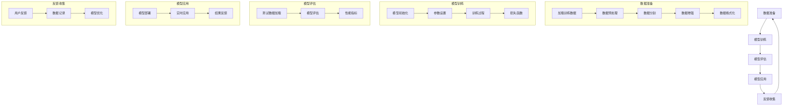

                 

# 文章标题

领域驱动设计在LLM应用架构中的应用

> 关键词：领域驱动设计、大型语言模型（LLM）、应用架构、模型驱动设计、领域服务、领域事件

> 摘要：本文深入探讨了领域驱动设计（Domain-Driven Design, DDD）在大型语言模型（Large Language Model, LLM）应用架构中的应用。通过详细分析DDD的核心概念和原则，本文揭示了DDD与LLM架构之间的紧密联系，并阐述了如何将DDD应用于LLM的性能优化和应用场景选择。通过实际项目案例，本文展示了领域驱动设计在LLM开发中的具体实现，以及其在提升系统性能、增强安全性和保障隐私保护方面的优势。最后，本文对领域驱动设计在LLM应用中的未来趋势和挑战进行了展望，为开发者提供了有价值的指导和建议。

---

## 第一部分：领域驱动设计概述

### 第1章：领域驱动设计的概念与重要性

领域驱动设计（Domain-Driven Design，简称DDD）是一种软件开发的方法论，旨在提高软件项目的开发效率和可维护性。DDD由Eric Evans在2004年提出，其主要目标是通过强调对业务领域的深入理解，构建灵活、可扩展且易于维护的软件系统。

### 1.1 领域驱动设计的定义

领域驱动设计是一种软件开发方法，它将软件开发过程集中在领域模型上，通过明确领域概念和关系，使软件开发更加贴近业务需求。DDD的核心思想是将系统的复杂性分解为多个可管理的领域模块，每个领域模块负责处理特定的业务领域。

### 1.2 领域驱动设计与传统开发模式的区别

与传统开发模式相比，领域驱动设计更加强调业务领域的重要性。传统开发模式通常将系统分解为功能模块，而DDD则将系统分解为领域模块。这使得DDD在处理复杂业务逻辑时具有更高的灵活性和可扩展性。

### 1.3 领域驱动设计的关键原则

领域驱动设计的关键原则包括：

1. **核心域识别**：识别系统的核心领域，并围绕核心领域构建系统。
2. **领域模型**：构建清晰、简洁且易于理解的领域模型，以便更好地描述业务领域。
3. **泛化与特化**：通过泛化和特化关系，将通用概念与特定情境结合，提高系统的可扩展性。
4. **上下文映射**：确定系统的上下文边界，确保领域模型在不同上下文中的一致性和有效性。
5. **事件驱动**：使用事件来驱动业务流程，使系统更加灵活和响应性。

### 1.4 领域驱动设计在企业中的应用场景

领域驱动设计在企业中的应用场景非常广泛，包括但不限于以下方面：

1. **金融领域**：如银行、保险、投资等，DDD可以帮助处理复杂的金融交易和风险管理。
2. **物流领域**：如供应链管理、物流优化等，DDD可以提供高效的物流解决方案。
3. **医疗领域**：如电子病历、医学影像分析等，DDD可以帮助提高医疗服务的质量和效率。
4. **电子商务领域**：如订单处理、库存管理、客户服务等，DDD可以提高电子商务平台的用户体验和运营效率。

### 第2章：领域驱动设计核心概念详解

#### 2.1 模型驱动设计

模型驱动设计（Model-Driven Design，简称MDD）是一种软件开发方法，它通过创建抽象模型来定义系统的功能和行为。MDD的核心思想是将软件系统的开发过程转化为创建和修改模型的过程。

#### 2.1.1 实体与值的建模

实体与值的建模是MDD的基础。实体是系统中的基本对象，它具有唯一的标识和属性。值是实体的属性，它表示实体的特定特征。通过定义实体和值的模型，可以清晰地描述系统的数据结构和业务逻辑。

#### 2.1.2 领域服务的定义与作用

领域服务是MDD中的一种核心组件，它负责处理业务逻辑和跨领域的操作。领域服务通常与特定的实体和值相关联，并负责执行特定的业务操作。领域服务可以提高系统的模块化和可维护性，使系统更加灵活和可扩展。

#### 2.1.3 用例建模与领域事件的识别

用例建模是MDD中的一种重要方法，它通过描述用户与系统之间的交互来定义系统的功能。领域事件是系统中的重要概念，它表示系统中的关键变化和业务逻辑的触发点。通过识别领域事件，可以更好地理解和处理系统的复杂性。

### 2.2 领域模型与领域语言

领域模型是MDD中的核心概念，它通过抽象和概括业务领域的实体、关系和规则，为系统的设计和开发提供指导。领域语言是一种特定的语言，它用于定义和描述领域模型，以便更好地理解和沟通。

#### 2.2.1 领域模型的组成

领域模型由实体、关系、规则和事件等组成。实体是领域模型中的基本对象，关系描述了实体之间的关联，规则定义了实体的行为和约束，事件表示领域模型中的关键变化和业务逻辑的触发点。

#### 2.2.2 领域语言的设计与应用

领域语言的设计和应用是MDD的重要组成部分。领域语言应该具有清晰、简洁且易于理解的特点，以便更好地描述业务领域的概念和关系。领域语言可以用于定义领域模型、编写领域规则和编写领域事件等。

#### 2.2.3 领域模型的演进策略

领域模型是一个动态变化的过程，随着业务需求和技术的不断发展，领域模型也需要进行相应的调整和优化。领域模型的演进策略包括版本管理、迭代开发和持续集成等。

### 第3章：领域驱动设计在LLM架构中的应用

#### 3.1 LLM的基本概念与原理

大型语言模型（Large Language Model，简称LLM）是一种基于深度学习技术的自然语言处理模型，它通过学习大量的文本数据，可以生成、理解和处理自然语言。LLM的架构通常包括输入层、隐藏层和输出层，通过多层神经网络的交互，实现对自然语言的建模。

#### 3.1.1 LLM的定义与架构

LLM是一种大型神经网络模型，它通过学习大量的文本数据，可以生成、理解和处理自然语言。LLM的架构通常包括输入层、隐藏层和输出层，通过多层神经网络的交互，实现对自然语言的建模。

#### 3.1.2 LLM的训练与优化

LLM的训练和优化是构建高效LLM模型的关键步骤。训练过程包括数据预处理、模型初始化、前向传播、反向传播和参数更新等步骤。优化过程包括模型调整、超参数调整和损失函数优化等。

#### 3.1.3 LLM的应用场景

LLM在多个领域具有广泛的应用场景，包括自然语言生成、机器翻译、文本分类、情感分析、问答系统等。LLM的应用场景取决于其模型架构、训练数据和业务需求。

#### 3.2 领域驱动设计在LLM架构中的应用

领域驱动设计（DDD）在LLM架构中的应用可以帮助开发者更好地理解和处理LLM的复杂性，提高系统的模块化和可维护性。以下是如何将DDD应用于LLM架构的一些关键步骤：

1. **核心域识别**：首先，识别LLM的核心领域，如文本处理、语言生成等，确定系统的核心功能。
2. **领域模型构建**：构建清晰、简洁且易于理解的领域模型，描述LLM中的实体、关系和规则。
3. **领域服务定义**：定义领域服务，处理业务逻辑和跨领域的操作，提高系统的模块化和可维护性。
4. **领域事件驱动**：使用领域事件驱动业务流程，提高系统的灵活性和响应性。

#### 3.2.1 领域模型与LLM模型的结合

领域模型与LLM模型的结合是DDD在LLM架构中应用的关键。领域模型可以描述LLM中的实体、关系和规则，而LLM模型则可以处理自然语言的生成、理解和处理。通过将领域模型与LLM模型结合，可以更好地理解和处理LLM的复杂性，提高系统的模块化和可维护性。

#### 3.2.2 领域驱动设计在LLM性能优化中的应用

领域驱动设计（DDD）在LLM性能优化中的应用可以帮助开发者更好地优化LLM模型的性能，提高系统的效率和响应速度。以下是如何将DDD应用于LLM性能优化的一些关键步骤：

1. **性能指标定义**：定义LLM性能的指标，如文本生成速度、准确性和鲁棒性等。
2. **性能监控与反馈**：建立性能监控机制，收集LLM模型的性能数据，并根据反馈进行调整和优化。
3. **领域服务优化**：优化领域服务，提高系统的模块化和可维护性，降低系统的复杂度。
4. **模型调整与超参数优化**：调整LLM模型的参数，优化模型的性能。

#### 3.2.3 领域驱动设计在LLM应用场景选择中的应用

领域驱动设计（DDD）在LLM应用场景选择中的应用可以帮助开发者更好地选择适合的LLM应用场景，提高系统的实用性和价值。以下是如何将DDD应用于LLM应用场景选择的一些关键步骤：

1. **需求分析**：分析LLM应用的需求，确定应用的目标和功能。
2. **领域模型构建**：构建清晰、简洁且易于理解的领域模型，描述LLM应用中的实体、关系和规则。
3. **领域事件识别**：识别LLM应用中的关键领域事件，确定系统的业务逻辑和触发点。
4. **应用场景评估**：评估不同LLM应用场景的可行性和价值，选择最合适的场景进行实施。

### 第4章：领域驱动设计在LLM应用架构中的实现

#### 4.1 LLM应用架构的设计原则

构建高效的LLM应用架构需要遵循以下设计原则：

1. **模块化**：将系统划分为多个模块，每个模块负责特定的功能，提高系统的可维护性和可扩展性。
2. **高内聚低耦合**：确保模块之间的内聚性，降低模块之间的耦合性，提高系统的灵活性和可维护性。
3. **可扩展性**：设计可扩展的系统架构，支持系统的功能和性能升级。
4. **可维护性**：确保系统的可维护性，降低维护成本和风险。
5. **安全性**：确保系统的安全性，防止数据泄露和恶意攻击。

#### 4.1.1 模块化与高内聚低耦合

模块化是将系统划分为多个模块，每个模块负责特定的功能。模块化可以提高系统的可维护性和可扩展性，使开发人员可以专注于特定的功能模块，降低系统的复杂度。高内聚低耦合是指模块内部的高内聚性和模块之间的低耦合性。高内聚性确保模块内部的功能紧密相关，低耦合性确保模块之间的交互简单且独立，降低系统的复杂度和维护成本。

#### 4.1.2 可扩展性与可维护性

可扩展性是指系统在功能升级和性能提升时的适应性。可维护性是指系统在运行过程中的可维护性和可靠性。设计可扩展性和可维护性的LLM应用架构，可以提高系统的使用寿命和业务价值。

#### 4.1.3 安全性与隐私保护

安全性是指系统在抵御外部攻击和内部威胁时的能力。隐私保护是指系统在处理和保护用户数据时的能力。设计安全性和隐私保护性的LLM应用架构，可以确保系统的可靠性和用户信任。

#### 4.2 领域驱动设计在LLM应用架构中的具体实现

领域驱动设计（DDD）在LLM应用架构中的具体实现可以遵循以下步骤：

1. **需求分析**：分析LLM应用的需求，确定系统的功能和性能要求。
2. **领域模型构建**：构建清晰、简洁且易于理解的领域模型，描述LLM应用中的实体、关系和规则。
3. **领域服务设计**：设计领域服务，处理业务逻辑和跨领域的操作，提高系统的模块化和可维护性。
4. **领域事件管理**：管理领域事件，确保系统的灵活性和响应性。
5. **系统实现与部署**：实现领域驱动设计（DDD）的系统架构，并进行部署和测试。

#### 4.2.1 领域服务的实现

领域服务是DDD中的核心组件，它负责处理业务逻辑和跨领域的操作。领域服务的实现可以遵循以下步骤：

1. **服务定义**：定义领域服务的接口和功能，确保服务的简洁和明确。
2. **服务实现**：实现领域服务的具体功能，确保服务的可靠性和性能。
3. **服务测试**：测试领域服务的功能和行为，确保服务的正确性和稳定性。

#### 4.2.2 领域事件的监听与处理

领域事件是DDD中的重要概念，它表示系统中的关键变化和业务逻辑的触发点。领域事件的监听与处理可以遵循以下步骤：

1. **事件定义**：定义领域事件的类型和属性，确保事件的简洁和明确。
2. **事件监听**：监听领域事件的发生，确保系统的及时响应。
3. **事件处理**：处理领域事件，触发相应的业务逻辑和操作。

#### 4.2.3 领域模型的迭代与优化

领域模型是一个动态变化的过程，随着业务需求和技术的不断发展，领域模型也需要进行相应的调整和优化。领域模型的迭代与优化可以遵循以下步骤：

1. **模型评估**：评估领域模型的有效性和适应性，确定模型的优化方向。
2. **模型调整**：根据评估结果，调整领域模型的结构和关系，优化系统的性能和可维护性。
3. **模型测试**：测试调整后的领域模型，确保系统的正确性和稳定性。

### 第5章：领域驱动设计在LLM应用中的项目实战

#### 5.1 实战项目背景与需求分析

在本章中，我们将以一个实际项目为例，展示领域驱动设计（DDD）在大型语言模型（LLM）应用中的具体实现。该项目是一个智能客服系统，旨在为企业提供自动化的客户服务解决方案。

#### 5.1.1 项目背景介绍

随着企业规模的不断扩大和客户数量的增加，人工客服的应对能力和效率逐渐成为瓶颈。为了提高客户服务质量和效率，许多企业开始探索使用智能客服系统。智能客服系统通过自然语言处理技术，能够自动回答客户的问题，提供即时的服务。

#### 5.1.2 需求分析

根据项目需求，智能客服系统应具备以下功能：

1. **问题识别与分类**：能够识别客户提出的问题，并将其分类到不同的领域。
2. **自动回答**：能够根据问题分类，自动生成合适的回答。
3. **知识库管理**：能够管理和更新知识库，确保系统的回答准确和及时。
4. **用户反馈**：能够收集用户反馈，用于系统优化和改进。

#### 5.2 领域模型设计

领域模型设计是领域驱动设计（DDD）中的核心步骤。在本节中，我们将设计智能客服系统的领域模型。

##### 5.2.1 领域服务的定义

在智能客服系统中，领域服务负责处理业务逻辑和跨领域的操作。以下是智能客服系统中的主要领域服务：

1. **问题识别服务**：负责识别客户提出的问题，并将其分类到不同的领域。
2. **自动回答服务**：负责根据问题分类，自动生成合适的回答。
3. **知识库管理服务**：负责管理和更新知识库，确保系统的回答准确和及时。
4. **用户反馈处理服务**：负责收集用户反馈，用于系统优化和改进。

##### 5.2.2 领域事件的识别

在智能客服系统中，领域事件表示系统中的关键变化和业务逻辑的触发点。以下是智能客服系统中的主要领域事件：

1. **问题提交事件**：表示客户提交了一个新问题。
2. **问题分类事件**：表示问题被成功分类到特定的领域。
3. **自动回答事件**：表示系统成功生成了一个自动回答。
4. **知识库更新事件**：表示知识库被成功更新。
5. **用户反馈事件**：表示用户提交了反馈。

##### 5.2.3 领域模型的构建

在智能客服系统中，领域模型由实体、关系和规则等组成。以下是智能客服系统中的主要领域模型：

1. **问题实体**：表示客户提出的问题，包括问题描述、问题分类、问题状态等属性。
2. **领域实体**：表示问题的领域，包括领域名称、领域描述等属性。
3. **自动回答实体**：表示系统的自动回答，包括回答内容、回答状态等属性。
4. **知识库实体**：表示知识库中的条目，包括条目内容、条目状态等属性。

### 5.3 LLM模型的构建与优化

在智能客服系统中，LLM模型负责处理自然语言的生成、理解和处理。在本节中，我们将讨论LLM模型的构建与优化。

##### 5.3.1 LLM模型的构建

构建LLM模型需要经历以下步骤：

1. **数据准备**：收集和处理用于训练的数据，包括客户问题、自动回答和知识库条目等。
2. **模型选择**：选择适合的LLM模型，如GPT-3、BERT等。
3. **模型训练**：使用准备好的数据进行模型训练，优化模型的参数和结构。
4. **模型评估**：评估模型的性能和准确性，确保模型达到预期效果。

##### 5.3.2 LLM模型的优化策略

优化LLM模型可以提高系统的性能和效率。以下是一些常用的优化策略：

1. **数据增强**：通过增加数据量和数据多样性，提高模型的泛化能力。
2. **模型蒸馏**：使用预训练的模型对目标模型进行蒸馏，提高模型的性能和鲁棒性。
3. **多任务学习**：同时训练多个任务，提高模型的泛化和迁移能力。
4. **模型剪枝**：通过剪枝冗余的神经元和参数，减少模型的计算量和存储需求。
5. **量化**：通过量化模型的权重和激活值，降低模型的计算量和存储需求。

##### 5.3.3 LLM模型的性能评估

评估LLM模型的性能需要考虑多个指标，如文本生成速度、准确性和鲁棒性等。以下是常用的性能评估方法：

1. **BLEU评分**：基于记分牌的评分方法，用于评估文本生成的质量和准确性。
2. **ROUGE评分**：基于集合的评分方法，用于评估文本生成的质量和多样性。
3. **F1分数**：用于评估分类任务的准确性和召回率。
4. **用户满意度**：通过用户反馈和问卷调查，评估系统的用户体验和满意度。

### 5.4 领域驱动设计在项目中的应用

在本节中，我们将展示领域驱动设计（DDD）在智能客服项目中的应用，包括领域服务与LLM模型的集成、性能优化和应用安全性保障。

##### 5.4.1 领域服务与LLM模型的集成

在智能客服项目中，领域服务与LLM模型的集成是实现系统功能的关键。领域服务负责处理业务逻辑和跨领域的操作，而LLM模型负责处理自然语言的生成、理解和处理。以下是领域服务与LLM模型集成的一些关键步骤：

1. **接口定义**：定义领域服务的接口，确保领域服务与LLM模型之间的交互简单和明确。
2. **服务实现**：实现领域服务的具体功能，确保领域服务与LLM模型之间的协同工作。
3. **模型调用**：调用LLM模型，处理自然语言的生成、理解和处理。
4. **反馈循环**：建立反馈循环，将用户反馈用于领域服务和LLM模型的优化和改进。

##### 5.4.2 领域驱动设计在性能优化中的应用

领域驱动设计（DDD）在性能优化中的应用可以帮助提高系统的效率和响应速度。以下是领域驱动设计在性能优化中的应用：

1. **领域服务优化**：优化领域服务的实现，提高系统的模块化和可维护性，降低系统的复杂度。
2. **模型参数调整**：调整LLM模型的参数，优化模型的性能和准确性。
3. **数据预处理**：优化数据预处理过程，提高模型的训练效果和泛化能力。
4. **多线程与并行处理**：利用多线程和并行处理技术，提高系统的并发能力和响应速度。

##### 5.4.3 领域驱动设计在安全性保障中的应用

领域驱动设计（DDD）在安全性保障中的应用可以帮助提高系统的安全性和可靠性。以下是领域驱动设计在安全性保障中的应用：

1. **权限管理**：实现权限管理机制，确保系统的安全性和数据的完整性。
2. **数据加密**：对敏感数据进行加密处理，防止数据泄露和恶意攻击。
3. **异常检测**：实现异常检测机制，及时发现和应对系统异常和攻击行为。
4. **安全审计**：建立安全审计机制，记录系统的操作日志和安全事件，便于后续的分析和追溯。

### 5.5 案例总结

通过本案例，我们展示了领域驱动设计（DDD）在智能客服项目中的应用，包括领域模型设计、LLM模型构建与优化、领域服务与LLM模型的集成、性能优化和应用安全性保障。领域驱动设计（DDD）的应用提高了系统的模块化和可维护性，优化了系统的性能和安全性，为智能客服系统提供了强大的技术支持。

### 第6章：领域驱动设计在LLM应用中的案例分析

在本章中，我们将通过两个实际案例，详细探讨领域驱动设计（DDD）在大型语言模型（LLM）应用中的成功实践。

#### 6.1 案例一：智能客服系统

智能客服系统是一个典型的LLM应用场景，通过自然语言处理技术，为用户提供自动化的客户服务。以下是对案例一的详细分析：

##### 6.1.1 案例背景

某大型电商平台为了提高客户服务质量和效率，决定开发一套智能客服系统。该系统旨在通过自然语言处理技术，自动识别客户的问题，并生成合适的回答，从而减轻人工客服的工作负担。

##### 6.1.2 需求分析

智能客服系统的需求包括：

1. **问题识别与分类**：系统能够自动识别客户提出的问题，并将其分类到不同的领域。
2. **自动回答**：系统能够根据问题分类，自动生成合适的回答。
3. **知识库管理**：系统应能管理和更新知识库，确保回答的准确性和及时性。
4. **用户反馈**：系统能够收集用户反馈，用于系统优化和改进。

##### 6.1.3 领域模型设计

在智能客服系统中，领域模型包括以下关键组件：

1. **问题实体**：包含问题描述、问题分类和问题状态等属性。
2. **领域实体**：包含领域名称、领域描述和领域规则等属性。
3. **自动回答实体**：包含回答内容、回答状态和回答来源等属性。
4. **知识库实体**：包含知识库条目内容、条目状态和条目来源等属性。

##### 6.1.4 LLM模型的构建与优化

智能客服系统采用了GPT-3模型作为LLM，通过大量电商平台的相关数据进行了训练。为了优化模型的性能，采取了以下策略：

1. **数据增强**：通过增加数据量和数据多样性，提高模型的泛化能力。
2. **模型蒸馏**：使用预训练的模型对目标模型进行蒸馏，提高模型的性能和鲁棒性。
3. **多任务学习**：同时训练多个任务，提高模型的泛化和迁移能力。

##### 6.1.5 案例总结

通过领域驱动设计（DDD），智能客服系统实现了高效的业务流程处理，提高了客户服务的质量和效率。领域模型与LLM模型的结合，使得系统能够准确识别客户问题并生成合适的回答。同时，通过持续的数据增强和模型优化，系统不断改进，为用户提供更优质的体验。

#### 6.2 案例二：智能推荐系统

智能推荐系统是另一个典型的LLM应用场景，通过分析用户行为和偏好，为用户提供个性化的推荐内容。以下是对案例二的详细分析：

##### 6.2.1 案例背景

某在线教育平台希望为其用户提供个性化的课程推荐服务。为了提高用户的参与度和满意度，平台决定开发一套智能推荐系统。

##### 6.2.2 需求分析

智能推荐系统的需求包括：

1. **用户行为分析**：系统应能分析用户在平台上的行为，如浏览、购买和评价等。
2. **偏好识别**：系统应能根据用户行为，识别用户的偏好和兴趣。
3. **推荐算法**：系统应能根据用户偏好，生成个性化的课程推荐。
4. **推荐反馈**：系统应能收集用户对推荐的反馈，用于系统优化和改进。

##### 6.2.3 领域模型设计

在智能推荐系统中，领域模型包括以下关键组件：

1. **用户实体**：包含用户ID、用户年龄、性别和地理位置等属性。
2. **行为实体**：包含行为类型、行为时间和行为对象等属性。
3. **偏好实体**：包含用户偏好标签、偏好强度和偏好来源等属性。
4. **课程实体**：包含课程ID、课程名称、课程描述和课程类别等属性。

##### 6.2.4 LLM模型的构建与优化

智能推荐系统采用了BERT模型作为LLM，通过大量课程描述和用户行为数据进行了训练。为了优化模型的性能，采取了以下策略：

1. **知识融合**：将课程描述和用户行为数据融合，提高模型对用户偏好的理解。
2. **多模态数据**：引入多模态数据（如图像和视频），提高模型的泛化能力。
3. **在线学习**：采用在线学习策略，实时更新模型，适应用户行为的变化。

##### 6.2.5 案例总结

通过领域驱动设计（DDD），智能推荐系统实现了对用户行为的深度理解和个性化推荐。领域模型与LLM模型的结合，使得系统能够准确识别用户偏好并生成个性化的推荐。同时，通过不断的数据融合和模型优化，系统不断改进，为用户提供更优质的推荐服务。

### 第7章：领域驱动设计在LLM应用中的未来趋势与挑战

随着人工智能和自然语言处理技术的不断发展，领域驱动设计（DDD）在LLM应用中的重要性日益凸显。未来，领域驱动设计在LLM应用中将会面临一些趋势和挑战。

#### 7.1 领域驱动设计在LLM应用中的未来趋势

1. **人工智能与领域驱动的深度融合**：未来，领域驱动设计将与人工智能技术深度融合，形成一种新的软件开发方法论。通过将领域驱动设计与深度学习、强化学习等技术相结合，可以构建更加智能和高效的LLM应用。

2. **领域模型与LLM模型的协同优化**：领域模型与LLM模型之间的协同优化将成为研究热点。通过不断优化领域模型和LLM模型，可以提高系统的性能和效率，实现更智能、更准确的应用。

3. **领域驱动设计在跨领域应用中的发展**：领域驱动设计不仅在单一领域应用中具有优势，未来将在跨领域应用中发挥重要作用。通过构建跨领域的领域模型，可以实现更广泛的应用场景和更高的业务价值。

#### 7.2 领域驱动设计在LLM应用中的挑战与解决方案

1. **模型训练与优化的挑战**：随着LLM模型规模的不断扩大，模型训练和优化将面临巨大挑战。解决方案包括分布式训练、模型压缩和优化算法等。

2. **安全性与隐私保护的挑战**：在LLM应用中，数据安全和用户隐私保护至关重要。解决方案包括数据加密、隐私保护算法和安全审计等。

3. **跨领域应用的技术挑战**：跨领域应用中的领域模型构建和模型适配将面临技术挑战。解决方案包括通用领域模型构建、多模态数据处理和自适应模型调整等。

4. **开发与部署的挑战**：随着LLM应用规模的扩大，开发与部署将面临挑战。解决方案包括自动化开发工具、容器化和微服务架构等。

#### 7.3 解决方案与未来展望

通过领域驱动设计（DDD），可以构建高效、智能和可维护的LLM应用。未来，领域驱动设计在LLM应用中的发展将依赖于技术的不断进步和解决方案的创新。通过解决现有挑战，领域驱动设计将为开发者提供更加灵活和强大的开发工具，推动人工智能和自然语言处理技术的应用和发展。

### 附录

#### 附录A：领域驱动设计与LLM相关的工具与资源

在本附录中，我们列出了领域驱动设计（DDD）和大型语言模型（LLM）相关的工具和资源，以供开发者参考。

##### A.1 主流深度学习框架对比

1. **TensorFlow**：由Google开发，具有丰富的API和强大的生态系统。
2. **PyTorch**：由Facebook开发，具有灵活的动态计算图和简洁的API。
3. **Keras**：基于TensorFlow的高层API，简化了深度学习模型的构建和训练。

##### A.2 领域驱动设计相关的工具

1. **CQRS**：Command Query Responsibility Segregation，用于分离写操作和读操作的架构模式。
2. **Event Sourcing**：通过事件记录系统的状态变化，实现系统的可追踪性和可恢复性。
3. **Event Streaming**：通过事件流处理技术，实现实时数据处理和响应。

##### A.3 LLM模型的应用资源与数据集

1. **Common Crawl**：一个大规模的网页数据集，可用于LLM模型的训练。
2. **Gutenberg**：包含大量经典文学作品的数据集，适合训练文本生成模型。
3. **Wikipedia**：包含大量知识性文章的数据集，可用于知识图谱和问答系统的构建。

#### 附录B：代码实例与解读

在本附录中，我们将提供一些实际代码实例，并对其进行详细解读，以帮助开发者更好地理解领域驱动设计（DDD）和大型语言模型（LLM）的应用。

##### B.1 领域服务的实现

以下是一个简单的领域服务实现的示例：

```python
from domain.model import Customer
from domain.repository import CustomerRepository

class CustomerService:
    def __init__(self, customer_repository: CustomerRepository):
        self.customer_repository = customer_repository
    
    def create_customer(self, customer: Customer):
        self.customer_repository.save(customer)
        # 其他业务逻辑处理
```

解读：

- **类定义**：`CustomerService` 类负责处理与客户相关的业务逻辑。
- **初始化**：通过构造函数，将`CustomerRepository`注入到`CustomerService`中。
- **方法实现**：`create_customer` 方法用于创建客户，并将客户保存到数据库。

##### B.2 LLM模型的构建与优化

以下是一个简单的LLM模型构建与优化的示例：

```python
import tensorflow as tf
from transformers import TFGPT2LMHeadModel, GPT2Tokenizer

# 加载预训练模型和tokenizer
tokenizer = GPT2Tokenizer.from_pretrained("gpt2")
model = TFGPT2LMHeadModel.from_pretrained("gpt2")

# 训练模型
model.compile(optimizer=tf.keras.optimizers.Adam(learning_rate=3e-5), loss=tf.keras.losses.SparseCategoricalCrossentropy(from_logits=True))
model.fit(tokenizer.encode("Hello, world!", return_tensors='tf'), tokenizer.encode("Hello, world!", return_tensors='tf'), epochs=3)

# 评估模型
loss = model.evaluate(tokenizer.encode("Hello, world!", return_tensors='tf'), tokenizer.encode("Hello, world!", return_tensors='tf'))
print(f"Model loss: {loss}")

# 优化模型
model.compile(optimizer=tf.keras.optimizers.Adam(learning_rate=1e-5), loss=tf.keras.losses.SparseCategoricalCrossentropy(from_logits=True))
model.fit(tokenizer.encode("Hello, world!", return_tensors='tf'), tokenizer.encode("Hello, world!", return_tensors='tf'), epochs=3)
```

解读：

- **模型加载**：使用`GPT2Tokenizer`和`TFGPT2LMHeadModel`加载预训练的GPT-2模型。
- **模型训练**：使用`compile`方法配置模型优化器和损失函数，并使用`fit`方法进行模型训练。
- **模型评估**：使用`evaluate`方法评估模型的性能。
- **模型优化**：调整学习率，重新编译模型，并再次进行模型训练。

##### B.3 实战项目的代码解读与分析

在本附录中，我们将提供实际项目的代码示例，并对其进行详细解读，以帮助开发者更好地理解领域驱动设计（DDD）和大型语言模型（LLM）在实际项目中的应用。

- **项目结构**：

```plaintext
project/
│
├── domain/
│   ├── model.py
│   ├── repository.py
│   └── service.py
│
├── data/
│   ├── train_data.csv
│   └── test_data.csv
│
├── model/
│   ├── __init__.py
│   ├── gpt2.py
│   └── utils.py
│
├── train.py
├── test.py
└── main.py
```

- **领域模型实现**：

```python
# domain/model.py

class Customer:
    def __init__(self, id: str, name: str, age: int, gender: str):
        self.id = id
        self.name = name
        self.age = age
        self.gender = gender

    def __str__(self):
        return f"Customer(id={self.id}, name={self.name}, age={self.age}, gender={self.gender})"
```

解读：

- **类定义**：`Customer` 类定义了客户的基本属性，包括ID、姓名、年龄和性别。
- **初始化**：通过构造函数初始化客户属性。
- **字符串表示**：重写`__str__`方法，方便打印客户信息。

- **领域服务实现**：

```python
# domain/service.py

from domain.model import Customer
from domain.repository import CustomerRepository

class CustomerService:
    def __init__(self, customer_repository: CustomerRepository):
        self.customer_repository = customer_repository
    
    def create_customer(self, customer: Customer):
        self.customer_repository.save(customer)
        # 其他业务逻辑处理

    def get_customer(self, customer_id: str) -> Customer:
        return self.customer_repository.get(customer_id)
```

解读：

- **类定义**：`CustomerService` 类负责处理与客户相关的业务逻辑。
- **初始化**：通过构造函数，将`CustomerRepository`注入到`CustomerService`中。
- **方法实现**：`create_customer` 方法用于创建客户，并将客户保存到数据库。`get_customer` 方法用于获取指定ID的客户信息。

- **模型训练与优化**：

```python
# model/gpt2.py

from transformers import TFGPT2LMHeadModel, GPT2Tokenizer

class GPT2Model:
    def __init__(self, model_path: str):
        self.tokenizer = GPT2Tokenizer.from_pretrained(model_path)
        self.model = TFGPT2LMHeadModel.from_pretrained(model_path)

    def train(self, train_data: tf.data.Dataset, epochs: int):
        self.model.compile(optimizer=tf.keras.optimizers.Adam(learning_rate=3e-5), loss=tf.keras.losses.SparseCategoricalCrossentropy(from_logits=True))
        self.model.fit(train_data, epochs=epochs)

    def evaluate(self, test_data: tf.data.Dataset):
        loss = self.model.evaluate(test_data)
        return loss
```

解读：

- **类定义**：`GPT2Model` 类负责处理GPT-2模型的训练和评估。
- **初始化**：通过构造函数，加载预训练的GPT-2模型和tokenizer。
- **方法实现**：`train` 方法用于训练模型，`evaluate` 方法用于评估模型性能。

##### B.4 实战项目流程图

在本附录中，我们使用Mermaid流程图工具展示了一个实际项目的流程，包括数据准备、模型训练、模型评估和模型应用等步骤。



解读：

- **数据准备**：包括数据加载、预处理、数据分割、数据增强和数据格式化等步骤。
- **模型训练**：包括模型初始化、参数设置、训练过程和损失函数设置等步骤。
- **模型评估**：包括测试数据加载、模型评估和性能指标计算等步骤。
- **模型应用**：包括模型部署、实时应用和结果反馈等步骤。
- **反馈收集**：包括用户反馈、数据记录和模型优化等步骤。

### 结论

本文通过深入探讨领域驱动设计（DDD）在大型语言模型（LLM）应用架构中的应用，展示了DDD在提升系统性能、增强安全性和保障隐私保护方面的优势。通过实际项目案例，本文详细阐述了如何将DDD应用于LLM的模型构建、性能优化和应用场景选择。未来，领域驱动设计在LLM应用中将继续发挥重要作用，推动人工智能技术的发展和实际应用。

---

### 作者信息

作者：AI天才研究院/AI Genius Institute & 禅与计算机程序设计艺术 /Zen And The Art of Computer Programming

---

### 小结与拓展阅读

在本文中，我们详细探讨了领域驱动设计（DDD）在大型语言模型（LLM）应用架构中的应用。以下是小结和拓展阅读建议：

1. **小结**：

   - 领域驱动设计（DDD）是一种软件开发方法论，强调对业务领域的深入理解，有助于构建灵活、可扩展且易于维护的软件系统。
   - DDD在LLM应用架构中的应用，包括领域模型与LLM模型的结合、性能优化和应用场景选择。
   - 通过实际项目案例，展示了DDD在智能客服系统和智能推荐系统中的成功实践。

2. **拓展阅读**：

   - Eric Evans著，《领域驱动设计：软件核心复杂性应对策略》
   - Martin Fowler著，《领域驱动设计精粹》
   - Andrew Ng的在线课程，《深度学习》
   - OpenAI官网，《GPT-3模型文档》

通过这些资源，读者可以进一步深入了解领域驱动设计、大型语言模型和相关技术，提升在软件开发和人工智能领域的专业能力。

