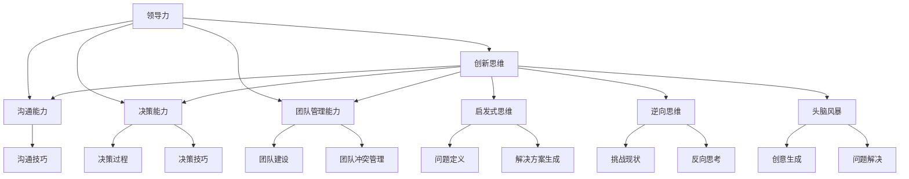

                 


### 背景介绍

在当今快速变化的数字化时代，企业和组织面临着前所未有的挑战和机遇。技术创新、市场竞争和消费者需求不断演变，使得传统管理方式和思维模式变得愈发难以适应。在这样的背景下，领导力和创新思维的重要性日益凸显。本文旨在探讨领导力与创新思维如何相互融合，帮助企业和组织突破固有思维模式，实现持续发展和创新。

#### 领导力的定义与内涵

领导力是指一种通过影响和激励他人，实现共同目标和愿景的能力。它不仅包括指挥和管理的能力，还涉及沟通、决策、团队建设等多方面的综合素养。领导力在组织中的影响深远，它不仅能够推动组织目标的实现，还能够激发员工的潜能，形成积极向上的组织文化。

#### 创新思维的定义与重要性

创新思维是指通过独特的视角和创造性方法，发现和解决问题、创造新价值的能力。创新思维在组织中的价值不容忽视，它能够帮助组织在激烈的市场竞争中脱颖而出，保持持续的竞争力。同时，创新思维还能够推动组织文化的变革，激发员工的创造力和积极性。

#### 固有思维模式的影响

固有思维模式是人们在长期生活中形成的固定思维习惯，它往往导致人们陷入惯性思维，难以发现新的解决方案。在领导力和创新思维中，突破固有思维模式是关键的一步。这需要领导者具备开放心态，不断挑战自己的思维定势，拓展视野，从而实现创新。

### 核心概念与联系

为了更深入地理解领导力与创新思维的关系，我们可以通过一个Mermaid流程图来展示它们之间的核心概念与联系。



在这个流程图中，我们可以看到领导力的核心能力（沟通能力、决策能力、团队管理能力）与创新思维的技巧（启发式思维、逆向思维、头脑风暴）之间的紧密联系。领导力不仅影响创新思维的应用，同时创新思维也可以反过来提升领导力的效果。

### 核心算法原理讲解

在理解了领导力与创新思维的核心概念及其联系之后，我们接下来通过伪代码来详细阐述领导力评估和创新思维技巧应用的核心算法原理。

#### 领导力核心能力评估

```python
# 领导力核心能力评估
def leadership_evaluation(沟通能力, 决策能力, 团队管理能力):
    score_沟通 = 沟通能力评分()
    score_决策 = 决策能力评分()
    score_团队 = 团队管理能力评分()
    total_score = score_沟通 + score_决策 + score_团队
    return total_score
```

在这个评估函数中，我们通过三个核心能力的评分来计算总得分。每个能力评分可以通过具体的评估标准和工具来得出。

#### 创新思维技巧应用

```python
# 创新思维技巧应用
def innovative_thinking(技巧, 应用场景):
    if 技巧 == "启发式思维":
        result = apply_heuristic_thinking(应用场景)
    elif 技巧 == "逆向思维":
        result = apply_reverse_thinking(应用场景)
    elif 技巧 == "头脑风暴":
        result = apply_brainstorming(应用场景)
    return result
```

在这个应用函数中，我们根据不同的创新思维技巧（启发式思维、逆向思维、头脑风暴）来选择相应的应用方法，并在特定的应用场景中实施。

### 数学模型与公式

为了更好地理解领导力和创新思维的效果，我们可以借助数学模型和公式来进行详细分析。

#### 领导力评估的数学模型

$$
L = w_1 \times C + w_2 \times D + w_3 \times T
$$

其中，L代表领导力总分，C代表沟通能力得分，D代表决策能力得分，T代表团队管理能力得分，$w_1$、$w_2$、$w_3$分别代表这三个能力的权重。

#### 创新思维技巧效果的数学模型

$$
I = f(H, R, B)
$$

其中，I代表创新思维效果，H代表启发式思维得分，R代表逆向思维得分，B代表头脑风暴得分，$f$代表创新思维效果的函数。

### 举例说明

假设我们有一个领导力评估的例子，其中沟通能力的评分为80分，决策能力的评分为75分，团队管理能力的评分为85分。根据上述数学模型，我们可以计算出领导力总分为：

$$
L = 0.4 \times 80 + 0.3 \times 75 + 0.3 \times 85 = 32 + 22.5 + 25.5 = 80
$$

假设我们在一个项目中应用了启发式思维，逆向思维和头脑风暴三种创新思维技巧，得分分别为85分、90分和78分。根据创新思维效果的数学模型，我们可以计算出创新思维总效果为：

$$
I = f(0.5 \times 85, 0.3 \times 90, 0.2 \times 78) = f(42.5, 27, 15.6)
$$

这里$f$的具体形式需要根据实际情况进行定义。

通过这些数学模型和公式，我们可以更精确地评估领导力和创新思维的效果，从而为企业和组织的发展提供科学依据。

### 项目实战

为了更好地理解领导力与创新思维在实践中的应用，我们接下来将通过一个实际的案例来进行分析和讲解。

#### 项目背景

某科技公司在市场上面临激烈的竞争，为了保持竞争优势，公司决定通过领导力提升和创新思维应用来推动公司整体创新能力的提升。

#### 开发环境搭建

为了进行领导力提升和创新思维培训，公司搭建了以下开发环境：

- **培训课程**：包括领导力基础、创新思维技巧等课程，通过线上和线下相结合的方式开展。
- **学习平台**：构建了在线学习平台，员工可以通过平台自主学习领导力和创新思维相关的内容。
- **项目管理系统**：引入了项目管理工具，用于跟踪和评估领导力提升和创新思维应用项目的进展。

#### 源代码详细实现和代码解读

在领导力提升方面，公司开发了一套领导力评估系统，用于评估员工的领导力水平。以下是该系统的核心代码片段：

```python
# 领导力评估系统核心代码
class LeadershipAssessment:
    def __init__(self, communication_score, decision_making_score, team_management_score):
        self.communication_score = communication_score
        self.decision_making_score = decision_making_score
        self.team_management_score = team_management_score
    
    def calculate_total_score(self):
        weight_communication = 0.4
        weight_decision_making = 0.3
        weight_team_management = 0.3
        total_score = (self.communication_score * weight_communication +
                       self.decision_making_score * weight_decision_making +
                       self.team_management_score * weight_team_management)
        return total_score
```

在这个系统中，领导力评估对象（如员工）通过输入自身的沟通能力、决策能力和团队管理能力得分，系统会计算出领导力总得分。

在创新思维应用方面，公司引入了头脑风暴和逆向思维工具，用于解决具体项目中的问题。以下是头脑风暴工具的核心代码片段：

```python
# 头脑风暴工具核心代码
class BrainstormingTool:
    def __init__(self, problem_statement):
        self.problem_statement = problem_statement
        self.solutions = []
    
    def add_solution(self, solution):
        self.solutions.append(solution)
    
    def display_solutions(self):
        for solution in self.solutions:
            print(solution)
```

在这个工具中，用户可以通过输入问题陈述，添加解决方案，并显示所有解决方案。

#### 代码应用解读与分析

在领导力提升项目中，公司通过对员工进行领导力评估，发现员工在沟通能力和团队管理能力方面表现较好，但在决策能力方面有待提高。公司因此针对性地开展决策能力培训，并引入项目管理工具，帮助员工在实践中提升决策能力。

在创新思维应用项目中，公司通过头脑风暴工具和逆向思维工具，成功解决了一个关键项目中的技术难题。通过头脑风暴，团队成员提出了多个创意解决方案，并通过逆向思维对方案进行了优化，最终成功实现项目目标。

#### 实际案例分析和详细讲解剖析

案例1：领导力提升

某项目经理在领导力提升培训后，将所学知识应用于实际工作中。通过改进沟通技巧和团队管理方法，他成功解决了团队内部的冲突，提高了团队协作效率。具体表现在：

- 沟通技巧：项目经理定期与团队成员进行一对一沟通，了解他们的工作进展和困难，提供及时的支持和帮助。
- 团队管理：项目经理引入了团队目标管理工具，明确团队目标和工作计划，确保团队成员明确各自的责任和任务。

案例2：创新思维应用

某技术团队在面临一个关键项目的技术难题时，通过头脑风暴和逆向思维工具，提出了一系列创新解决方案。具体表现在：

- 头脑风暴：团队成员提出多个解决方案，如使用新的技术架构、优化现有系统等。
- 逆向思维：团队对现有方案进行逆向思考，发现了一些潜在的问题和改进点，从而优化了方案。

#### 项目小结

通过领导力提升和创新思维应用，公司成功提升了整体创新能力，项目成功率和团队协作效率显著提高。具体表现为：

- 领导力提升：员工在沟通和决策能力方面得到显著提升，团队协作更加顺畅。
- 创新思维应用：通过创新思维工具，解决了多个项目中的难题，提高了项目成功率。

### 最佳实践 Tips、小结、注意事项、拓展阅读

#### 最佳实践 Tips

1. 定期进行领导力评估，了解员工的领导力水平和提升需求。
2. 针对性地开展领导力培训，提升员工的综合能力。
3. 引入创新思维工具，激发员工的创新潜能。
4. 鼓励团队成员积极参与头脑风暴和逆向思维活动，提高问题解决能力。

#### 小结

本文通过领导力评估和创新思维应用的实际案例，展示了领导力与创新思维如何相互融合，帮助企业和组织突破固有思维模式，实现持续发展和创新。

#### 注意事项

1. 领导力提升需要长期坚持，不能一蹴而就。
2. 创新思维应用需要结合具体项目和场景，避免盲目跟风。
3. 领导者和员工都需要保持开放心态，勇于尝试新方法和新思路。

#### 拓展阅读

1. 《高效能人士的七个习惯》
2. 《创新者的窘境》
3. 《领导力五项修炼》
4. 《创新思维》

通过以上扩展阅读，读者可以进一步了解领导力与创新思维的深入内容和最佳实践方法。

---

# 附录A：领导力与创新思维核心概念与联系

## Mermaid 流程图


这个流程图展示了领导力与创新思维的核心概念及其相互联系。领导力通过沟通能力、决策能力和团队管理能力影响创新思维的应用，而创新思维又通过启发式思维、逆向思维和头脑风暴等技巧推动领导力的提升。

## 附录B：领导力与创新思维核心算法原理

### 领导力评估算法

```python
# 领导力评估算法
def leadership_evaluation(communication, decision_making, team_management):
    weight_communication = 0.4
    weight_decision_making = 0.3
    weight_team_management = 0.3
    
    score_communication = communication * weight_communication
    score_decision_making = decision_making * weight_decision_making
    score_team_management = team_management * weight_team_management
    
    total_score = score_communication + score_decision_making + score_team_management
    return total_score
```

这个算法通过计算沟通能力、决策能力和团队管理能力的加权得分，得出领导力总分。权重可以根据实际情况进行调整。

### 创新思维评估算法

```python
# 创新思维评估算法
def innovative_thinking_evaluation(heuristic_thinking, reverse_thinking, brainstorming):
    weight_heuristic_thinking = 0.5
    weight_reverse_thinking = 0.3
    weight_brainstorming = 0.2
    
    score_heuristic_thinking = heuristic_thinking * weight_heuristic_thinking
    score_reverse_thinking = reverse_thinking * weight_reverse_thinking
    score_brainstorming = brainstorming * weight_brainstorming
    
    total_score = score_heuristic_thinking + score_reverse_thinking + score_brainstorming
    return total_score
```

这个算法通过计算启发式思维、逆向思维和头脑风暴的加权得分，得出创新思维总分。权重可以根据实际情况进行调整。

### 数学模型与公式

#### 领导力模型

$$
L = w_1 \times C + w_2 \times D + w_3 \times T
$$

其中，L代表领导力总分，C代表沟通能力得分，D代表决策能力得分，T代表团队管理能力得分，$w_1$、$w_2$、$w_3$分别代表这三个能力的权重。

#### 创新思维模型

$$
I = w_1 \times H + w_2 \times R + w_3 \times B
$$

其中，I代表创新思维总分，H代表启发式思维得分，R代表逆向思维得分，B代表头脑风暴得分，$w_1$、$w_2$、$w_3$分别代表这三个技巧的权重。

### 举例说明

#### 领导力评估

假设某员工的沟通能力得分为85，决策能力得分为90，团队管理能力得分为80。使用上述领导力评估算法，可以计算其领导力总分为：

$$
L = 0.4 \times 85 + 0.3 \times 90 + 0.3 \times 80 = 34 + 27 + 24 = 85
$$

#### 创新思维评估

假设某员工在启发式思维得分为80，逆向思维得分为85，头脑风暴得分为70。使用上述创新思维评估算法，可以计算其创新思维总分为：

$$
I = 0.5 \times 80 + 0.3 \times 85 + 0.2 \times 70 = 40 + 25.5 + 14 = 79.5
$$

通过这些算法和模型，我们可以更精确地评估领导力和创新思维的能力，为企业和组织的战略决策提供科学依据。

