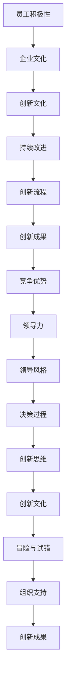

                 

# 领导力与创新文化：鼓励冒险和试错

## 关键词
领导力，创新文化，冒险精神，试错哲学，组织实践，案例分析

## 摘要
在数字化和全球化的时代背景下，创新成为企业保持竞争优势的关键。领导力与创新文化的关系愈发紧密，领导者的角色不仅在于提供方向，更在于营造鼓励冒险和试错的环境。本文通过深入探讨领导力与创新文化的定义、联系及其在企业中的实践，提出了鼓励冒险和试错的策略，并通过案例分析展示了成功的企业如何在实践中实现这一理念。

## 第一部分：领导力与创新文化概述

### 第1章：领导力与创新文化的定义

#### 1.1 领导力的定义与作用
领导力是引导和激励人们实现共同目标的能力。它不仅仅关注任务完成，更强调团队协作和目标共同体的建设。领导力在组织中起到方向引导、资源调配和问题解决的关键作用，是实现组织目标的重要保障。

- **核心概念**：领导力涉及权力、影响力、决策和愿景等要素。它不仅仅是一种技能，更是一种态度和价值观的传递。
- **作用**：领导力能够激发员工的潜能，提高团队效率，增强组织的凝聚力，推动组织持续发展。

#### 1.2 创新文化的概念
创新文化是一种重视创新、容忍失败、鼓励尝试和持续学习的组织氛围。它强调个体和团队在创新过程中的自由探索和协同合作，是推动企业不断进步和发展的动力源泉。

- **定义**：创新文化是一种以创新为核心价值观的组织氛围，它鼓励员工跳出传统思维，勇于尝试新的想法和方法。
- **重要性**：创新文化能够激发员工的创造力，提升企业的竞争力，帮助企业在快速变化的市场中保持领先地位。

### 第2章：领导力与创新文化的联系

#### 2.1 领导力与创新文化的互动
领导力与创新文化之间存在紧密的互动关系。领导力不仅塑造创新文化，创新文化也反过来影响领导力。

- **领导力如何塑造创新文化**：领导者通过设定愿景、制定策略、提供资源和支持，引导组织形成创新文化。
- **创新文化如何影响领导力**：创新文化要求领导者具备更高的适应性、更强的学习能力和更开放的思维方式，从而促进领导力的提升。

#### 2.2 企业中的领导力与创新文化实践
在实践中，领导力与创新文化相互促进，共同推动企业的持续创新和发展。

- **领导风格与创新能力**：不同的领导风格对创新文化有不同的影响。民主型领导风格鼓励员工参与决策，增加创新的可能性。
- **企业文化对创新的影响**：企业文化中的价值观和行为规范对创新文化的形成和发展起到关键作用。

### 第3章：建立和推动创新文化的策略

#### 3.1 领导者在推动创新文化中的角色
领导者在推动创新文化中扮演着关键角色，他们需要从以下几个方面着手：

- **设定愿景和目标**：领导者需要明确组织的愿景和目标，将创新作为核心战略，并确保所有员工都了解并认同。
- **提供资源和支持**：领导者需要为创新提供必要的资源和支持，包括资金、时间和人力等。

#### 3.2 实施创新文化的步骤和方法
要建立和推动创新文化，企业可以采取以下步骤和方法：

- **构建创新团队**：建立跨职能的创新团队，鼓励不同部门和背景的员工合作。
- **建立试错机制**：鼓励员工勇于尝试新事物，容忍失败，并从中学习和成长。
- **提供培训和激励**：为员工提供创新培训，建立激励机制，鼓励他们提出创新想法。

## 第二部分：鼓励冒险和试错的理念

### 第4章：冒险与试错的核心概念

#### 4.1 冒险精神的定义
冒险精神是指在面对不确定性和风险时，愿意尝试新事物、挑战自我和突破传统思维的能力。

- **内涵**：冒险精神不仅包括勇于尝试的勇气，还包括对失败和挑战的包容心态。
- **重要性**：冒险精神是推动创新和实现突破的重要动力，它能够激发个体的潜能，带来意想不到的成果。

#### 4.2 试错的哲学
试错是创新过程中不可或缺的一部分，它是一种通过实践不断调整和优化的方法。

- **意义**：试错能够帮助个体和组织快速发现和解决问题，减少风险，提高成功的可能性。
- **与学习的关系**：试错过程中，个体和组织能够从失败中吸取教训，不断改进和优化，实现持续成长。

### 第5章：冒险与试错的策略

#### 5.1 冒险的规划与风险管理
为了有效实施冒险，企业需要制定详细的规划，并建立完善的风险管理机制。

- **如何制定冒险计划**：明确冒险的目标、时间表和资源需求，制定详细的实施步骤。
- **风险评估与管理策略**：对可能的失败风险进行评估，并制定相应的应对策略，确保冒险过程可控。

#### 5.2 试错的实践与优化
在试错过程中，企业需要注重实践和优化，以实现最佳效果。

- **如何有效试错**：通过实验和测试，快速验证和调整创新想法，确保方向正确。
- **试错过程中的优化与反馈**：不断收集试错过程中的数据和信息，进行分析和总结，以便进行进一步的优化。

### 第6章：领导力在鼓励冒险和试错中的作用

#### 6.1 领导者的角色
领导者是鼓励冒险和试错的关键推动者，他们需要扮演以下角色：

- **激励员工**：领导者需要激励员工勇于冒险，鼓励他们尝试新事物，并对失败保持积极态度。
- **处理失败**：领导者需要为员工提供支持和鼓励，帮助他们在失败中找到经验教训，并从中成长。

#### 6.2 领导者如何激励冒险和试错
领导者可以通过以下方法激励员工冒险和试错：

- **建立信任**：建立信任和开放的沟通环境，鼓励员工分享想法和反馈。
- **提供资源**：为员工提供必要的资源和支持，帮助他们克服困难和挑战。

## 第三部分：构建创新文化

### 第7章：建立创新文化的组织环境

#### 7.1 创新文化的组织要素
建立创新文化需要组织在多个方面进行努力，包括：

- **支持系统**：建立支持创新的系统和流程，如项目管理、资源分配和风险管理等。
- **组织结构和流程**：优化组织结构和流程，减少官僚主义，提高决策效率和灵活性。

#### 7.2 创新文化的激励机制
为了鼓励创新，组织需要建立有效的激励机制：

- **如何激励员工创新**：通过奖励机制、晋升机会和荣誉表彰等方式，激励员工积极创新。
- **创新奖励机制的设计**：设计科学合理的创新奖励机制，确保奖励与员工的实际贡献相匹配。

### 第8章：领导力在构建创新文化中的关键作用

#### 8.1 领导者的责任
领导者在构建创新文化中承担着重要责任，他们需要：

- **在组织中建立创新文化**：通过设定愿景、制定策略和提供资源，引导组织形成创新文化。
- **营造支持创新的氛围**：建立开放、包容和支持的领导风格，鼓励员工勇于尝试和创新。

### 第9章：培养创新型人才

#### 9.1 创新型人才的特征
创新型人才具备以下特征：

- **勇于挑战**：敢于挑战传统思维和现状，不断寻求新的解决方案。
- **持续学习**：具备强烈的学习欲望和持续学习的能力，不断更新知识和技能。

#### 9.2 创新型人才的识别与培养
企业需要通过以下方法识别和培养创新型人才：

- **识别创新型人才**：通过评估员工的能力、潜力和创新记录，识别出具有创新潜力的人才。
- **培养创新型人才**：提供针对性的培训和培养计划，帮助他们提升创新能力和综合素质。

### 第10章：持续改进与创新

#### 10.1 创新流程的持续优化
企业需要建立持续改进的机制，不断优化创新流程：

- **如何建立持续改进的机制**：通过建立反馈循环、持续监测和创新评估，确保创新过程的持续优化。
- **创新反馈循环的实施**：通过收集反馈、分析数据和调整策略，实现创新流程的持续改进。

## 附录：参考资料与案例研究

### 附录A：参考资料
- 相关书籍推荐：
  - 《创新者的窘境》（Clayton M. Christensen）
  - 《精益创业》（Eric Ries）
  - 《创意的规律》（Steven Johnson）
- 学术文章和报告精选：
  - 《领导力与创新：理论与实践》（Leadership and Innovation: Theory and Practice）
  - 《企业创新文化：构建与优化》（Corporate Innovation Culture: Building and Optimization）

### 附录B：案例研究
- 国际知名企业的创新文化实践：
  - 谷歌（Google）的创新文化：谷歌通过“20% 时间制”鼓励员工探索新的项目，推动了一系列创新产品的诞生。
  - 亚马逊（Amazon）的创新文化：亚马逊建立了“失败基金”，为员工提供资金支持，鼓励他们尝试创新项目。
- 国内企业的创新文化实践：
  - 阿里巴巴（Alibaba）的创新文化：阿里巴巴通过建立“创新实验室”，鼓励员工进行跨领域合作，推动技术创新。
  - 腾讯（Tencent）的创新文化：腾讯通过设立“创新基金”，支持员工提出创新项目，并为他们提供资源和支持。

通过以上案例研究，我们可以看到，无论是国际巨头还是国内企业，成功的创新文化实践都需要领导者的正确引导和全员的共同努力。在领导力的推动下，企业可以建立起鼓励冒险和试错的文化，从而在竞争激烈的市场中保持持续的创新能力和竞争优势。

## Mermaid 流程图：领导力与创新文化的联系



## 决策树算法伪代码

```python
def build_decision_tree(data, attributes):
    if all_examples_classify(data):
        return leaf_node(data)
    if no_attributes_left(attributes):
        return leaf_node(majority_class(data))
    current_attribute = choose_best_attribute(attributes, data)
    true_branch = build_decision_tree(exclude_current_attribute(data, current_attribute), attributes)
    false_branch = build_decision_tree(exclude_current_attribute(data, current_attribute), attributes)
    return Decision_Node(current_attribute, true_branch, false_branch)
```

本文通过详细的探讨和分析，揭示了领导力与创新文化之间的密切联系，提出了鼓励冒险和试错的策略，并通过案例研究展示了成功的企业如何在实践中应用这些理念。希望本文能为企业在构建创新文化和鼓励冒险试错方面提供有价值的参考和指导。

## 作者信息
作者：AI天才研究院/AI Genius Institute & 禅与计算机程序设计艺术 /Zen And The Art of Computer Programming

## 拓展阅读
- [《创新者的窘境》（Clayton M. Christensen）](https://www.amazon.com/dp/0814417937)
- [《精益创业》（Eric Ries）](https://www.amazon.com/dp/0596156800)
- [《创意的规律》（Steven Johnson）](https://www.amazon.com/dp/0307278984)
- [《领导力与创新：理论与实践》（Leadership and Innovation: Theory and Practice）](https://www.amazon.com/dp/1138564253)
- [《企业创新文化：构建与优化》（Corporate Innovation Culture: Building and Optimization）](https://www.amazon.com/dp/1138913667)

