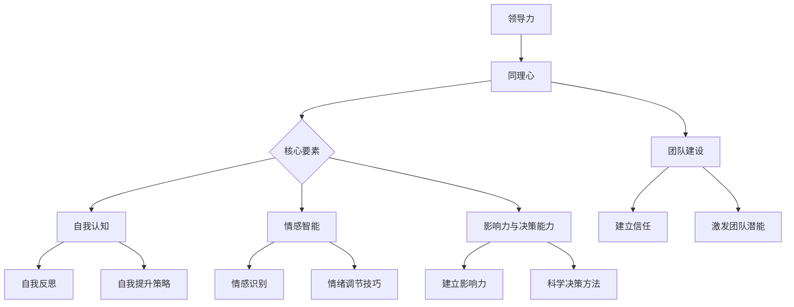

                 

### 引言

#### 领导力的定义与重要性

领导力是一种引领、影响和激励他人共同实现目标的能力。其核心在于领导者如何通过激发团队潜能、优化组织结构、协调资源分配等方式，推动团队向着既定目标前进。领导力不仅存在于企业高管、团队领导者等正式职位中，也体现在日常的工作、学习和生活中。有效的领导力能够提升团队效率，增强组织凝聚力，促进个人成长，从而实现个人与组织的共同发展。

在当今复杂多变的社会环境中，领导力显得尤为重要。随着全球化进程的加快，组织面临的市场竞争愈发激烈，技术革新层出不穷，员工对工作环境和领导方式的需求也在不断变化。传统的权威式领导模式已难以适应现代组织的需求，更加人性化和科学化的领导方式成为现代领导者必备的素质。因此，领导力的定义与重要性在当今社会中愈发凸显。

#### 同理心的定义与作用

同理心，也称为共情，是指一个人能够从他人的角度感受和理解情感的能力。同理心不仅包括情感上的共鸣，还涉及对他人思想、感受的感知和响应。同理心能够帮助领导者更好地理解团队成员的需求和动机，建立深厚的信任关系，从而提升团队协作效率。

同理心在领导力中的应用非常广泛。首先，同理心能够帮助领导者更好地理解员工的情感状态，从而制定更合理的激励措施和管理策略。其次，同理心有助于建立团队成员之间的信任，促进团队沟通，减少冲突，提升团队凝聚力。此外，同理心还能够增强领导者的影响力，使其在团队中具有更高的威信和号召力。

通过引入领导力和同理心的概念，我们可以看到，这两种能力在现代组织中扮演着至关重要的角色。本文将围绕领导力和同理心的核心要素，探讨其在建立深厚人际关系中的重要性，以及如何在实际工作中运用这些能力。希望通过本文的探讨，能够为读者提供有益的启示和实际操作指南。

## 第1章 引言

在当今复杂多变的社会环境中，领导力和同理心已经成为衡量领导者成功与否的重要指标。领导力不仅是引领团队实现目标的关键能力，更是建立深厚人际关系的基石。同理心则是一种能够帮助领导者更好地理解他人情感和需求的能力，它是构建信任和提升团队凝聚力的重要手段。因此，深入探讨领导力和同理心在建立深厚人际关系中的作用，对于提升领导者的综合素质和组织的整体效能具有重要意义。

### 1.1 领导力的定义与重要性

领导力是一种通过影响和激励他人来实现共同目标的能力。它不仅包括领导者在组织中的正式角色，如企业高管、项目经理等，更体现在日常的工作、学习和生活中。领导力的重要性在于它能够推动团队达成目标，提升组织效能，并促进个人和组织的成长。

首先，领导力能够提升团队效能。一个具备领导力的人能够清晰地定义目标，制定有效的策略，并激励团队成员为之努力。通过合理的分工和资源配置，领导力能够最大化团队的潜力，从而实现更高的工作效率和业绩。

其次，领导力有助于建立团队凝聚力。有效的领导不仅能够激励团队成员，还能建立团队内部的信任和合作关系。在共同的目标和价值观的引导下，团队成员更容易形成合力，共同克服困难，实现团队目标。

此外，领导力对个人成长也有重要影响。具备领导力的人通常具有更强的自我管理能力、情感智能和决策能力，这些能力不仅能够提升其在工作中的表现，也有助于其在个人生活中更好地应对各种挑战。

### 1.2 同理心的定义与作用

同理心，又称共情，是一种能够从他人的角度理解和感受情感的能力。它不仅包括对他人情绪的感知，还涉及对他人思想、需求的理解和响应。同理心在领导力中扮演着至关重要的角色，其作用主要体现在以下几个方面。

首先，同理心有助于建立信任。领导者通过同理心能够更好地理解团队成员的需求和情感，从而制定出更符合团队实际需求的管理策略。这种理解不仅能够提升团队成员对领导者的信任，还能增强团队成员之间的信任，促进团队协作。

其次，同理心能够提升沟通效果。具备同理心的领导者能够更加准确地捕捉到团队成员的情感信号，从而在沟通中避免误解和冲突。通过同理心，领导者能够建立更有效的沟通渠道，确保信息准确传达。

此外，同理心有助于激发团队潜能。领导者通过同理心能够更好地理解团队成员的优势和潜力，从而有针对性地提供支持和激励。这种个性化的激励方式能够最大限度地激发团队成员的积极性，提升团队整体绩效。

综上所述，领导力和同理心在建立深厚人际关系中具有不可替代的作用。领导力提供了一种引导和激励他人的能力，而同理心则提供了一种理解和支持他人的能力。两者结合，不仅能够提升领导者的个人魅力和团队效能，还能为组织的长期发展奠定坚实基础。在接下来的章节中，我们将进一步探讨领导力的核心要素，以及同理心在领导力中的具体应用。

## 第2章 领导力的核心要素

领导力并非一种单一的能力，而是由多个相互关联的要素构成的一个复杂体系。这些要素包括自我认知与自我管理、情感智能、影响力与决策能力等。理解并掌握这些核心要素，对于提升领导者的综合素质和团队效能具有重要意义。

### 2.1 自我认知与自我管理

自我认知是指领导者对自己性格、能力、优势和不足的深入了解。一个具备高度自我认知的领导者能够明确自己的价值观、动机和目标，从而做出更符合自己期望和团队需求的管理决策。自我管理则是在自我认知的基础上，通过自我调节和控制，实现个人目标和团队目标。

#### 2.1.1 自我反思的重要性

自我反思是自我认知与自我管理的基础。通过定期反思自己的行为、决策和成果，领导者能够识别出自身的不足，找到改进的方法。自我反思不仅能够提升领导者的自我认知，还能增强其自我管理能力，使其在面临挑战时能够更加从容应对。

#### 2.1.2 自我提升的策略

为了实现自我提升，领导者需要制定明确的目标，并采取一系列具体的行动。以下是一些有效的自我提升策略：

1. **持续学习**：领导者应不断学习新的知识和技能，以适应快速变化的工作环境。可以通过参加培训课程、阅读相关书籍、与行业专家交流等方式实现。

2. **建立反馈机制**：领导者可以邀请团队成员或下属提供反馈，了解自己在工作中的表现和改进空间。这种外部视角能够帮助领导者更客观地认识自己。

3. **设立目标**：领导者应设定短期和长期的个人发展目标，并制定具体的行动计划。目标的实现过程不仅能够提升领导者的自我管理能力，还能为其职业发展提供明确的方向。

4. **情绪管理**：领导者需要学会情绪管理，保持心态平衡。在面对压力和挑战时，情绪管理能力能够帮助领导者保持冷静，做出明智的决策。

### 2.2 情感智能

情感智能，也称为情感智力，是指一个人识别、理解、使用和管理自己及他人情感的能力。情感智能在领导力中扮演着至关重要的角色，它不仅影响领导者的决策和行为，还直接影响团队氛围和协作效果。

#### 2.2.1 情感识别与处理

情感识别是情感智能的基础，它要求领导者能够敏锐地捕捉到团队成员的情感状态。通过倾听、观察和非语言沟通，领导者可以识别出团队成员的情绪，从而采取相应的应对措施。

1. **倾听**：倾听不仅是指听别人说什么，更重要的是理解其背后的情感和动机。领导者可以通过开放性问题、倾听姿态和反馈来提升倾听效果。

2. **观察**：观察团队成员的行为和反应，可以捕捉到其情感变化。领导者应注意团队成员的面部表情、身体语言和情绪变化，这些都能提供有价值的信息。

3. **非语言沟通**：非语言沟通在情感识别中发挥着重要作用。领导者可以通过肢体语言、面部表情和眼神交流等非语言方式，传递情感信息和建立情感联系。

#### 2.2.2 情绪调节技巧

情感调节技巧是指领导者如何管理和调节自己的情绪，以保持积极的心态和有效的决策能力。以下是一些有效的情绪调节技巧：

1. **深呼吸**：深呼吸能够帮助领导者缓解紧张和焦虑情绪，保持冷静和清晰的头脑。

2. **积极思考**：领导者应培养积极的思维方式，将挑战视为成长的机会，从而提升应对压力的能力。

3. **运动和放松**：适当的运动和放松活动，如散步、瑜伽和冥想等，能够帮助领导者缓解压力，提高情绪稳定性。

### 2.3 影响力与决策能力

影响力是指领导者如何通过自身的行为和决策影响他人的能力。一个具备高影响力的领导者能够在团队中建立威信，推动团队朝着共同目标前进。决策能力则是指领导者如何在复杂多变的情境中做出明智的决策。

#### 2.3.1 建立影响力

建立影响力需要领导者具备以下几个方面的能力：

1. **信誉和榜样作用**：领导者应具备高尚的品格和卓越的能力，成为团队成员的榜样。通过自身的言行一致，建立信任和尊重。

2. **愿景和目标**：领导者应明确团队的愿景和目标，并能够将之传达给团队成员。一个有吸引力的愿景和明确的目标能够激发团队成员的积极性和归属感。

3. **沟通和说服**：领导者应具备良好的沟通技巧和说服能力，能够清晰地表达自己的想法和期望，并引导团队成员共同为实现目标而努力。

#### 2.3.2 科学决策的方法

科学决策是指领导者如何通过系统的方法和工具，做出合理和有效的决策。以下是一些科学决策的方法：

1. **收集信息**：领导者应广泛收集与决策相关的信息，包括内部数据和外部资料。信息的准确性和全面性是决策质量的关键。

2. **分析评估**：领导者应对收集到的信息进行分析和评估，识别潜在的风险和机会。通过定性和定量的方法，评估各种决策方案的优缺点。

3. **制定方案**：在分析评估的基础上，领导者应制定多个可行的决策方案，并对其进行比较和选择。

4. **执行和监控**：领导者应确保决策方案的有效执行，并对其进行持续的监控和调整。通过反馈机制，及时纠正偏差，确保决策目标的实现。

通过深入理解和掌握自我认知与自我管理、情感智能、影响力与决策能力等核心要素，领导者不仅能够提升个人素质，还能有效提升团队效能和整体组织绩效。在接下来的章节中，我们将进一步探讨同理心在领导力中的具体应用，帮助领导者更好地建立深厚的人际关系。

## 第3章 同理心在领导力中的应用

同理心在领导力中扮演着至关重要的角色，它不仅是建立深厚人际关系的基础，更是提升领导效能的关键因素。通过同理心，领导者能够更好地理解员工的情感和需求，从而制定出更加人性化和管理策略，提升团队的凝聚力和绩效。

### 3.1 同理心的理论基础

同理心的理论基础涵盖了心理学和组织行为学两大领域。在心理学中，同理心被视为一种情感共鸣，即能够从他人的角度感受和理解情感的能力。心理学家如卡罗尔·吉利根（Carol Gilligan）提出，同理心是道德发展的关键，它不仅能够促进人际关系的建立，还能提升个体的情感智能。

在组织行为学中，同理心被视为一种重要的领导技能。研究显示，具备同理心的领导者能够更好地理解员工的情感需求，从而提升员工的工作满意度和忠诚度。组织行为学家如丹尼斯·雷恩哈特（Dennis Reina）和贝基·雷恩哈特（Becky Reina）指出，同理心能够帮助领导者建立信任和尊重，从而提升团队的协作效率和绩效。

### 3.2 同理心与团队建设

同理心在团队建设中的应用主要体现在以下几个方面：

#### 3.2.1 建立信任

同理心是建立信任的重要基石。通过同理心，领导者能够更好地理解员工的情感和需求，从而建立起真诚的信任关系。具体来说，领导者可以通过以下方式建立信任：

1. **倾听与理解**：领导者应注重倾听员工的意见和感受，通过同理心理解他们的需求和期望。这不仅可以增强员工对领导者的信任，还能提高员工的参与度和忠诚度。

2. **情感共鸣**：领导者应能够与员工建立情感上的联系，体验他们的情感体验，从而增进彼此的理解和信任。

3. **透明沟通**：领导者应保持透明沟通，及时向员工传达组织目标和策略，确保员工对组织的了解和信任。

#### 3.2.2 激发团队潜能

同理心能够帮助领导者更好地发现和激发团队的潜能。通过同理心，领导者能够理解员工的个人优势和需求，从而制定出更加个性化的激励措施，激发员工的工作热情和创造力。具体来说，领导者可以采取以下策略：

1. **个性化激励**：领导者应根据员工的个人特点和需求，提供个性化的激励和成长机会，如培训、晋升和项目分配等。

2. **授权与支持**：领导者应给予员工足够的自主权和支持，鼓励他们发挥自己的优势，创新解决问题的方法。

3. **建立团队文化**：领导者应建立积极向上的团队文化，鼓励团队成员之间的互相尊重和支持，激发团队的凝聚力和创造力。

### 案例分析

为了更直观地展示同理心在团队建设中的应用，我们可以通过一个实际案例进行分析。

#### 案例背景

某科技公司的一名项目经理李明，面临一个困境：团队成员对即将到来的新项目表现出明显的抵触情绪，认为项目难度大、任务繁重。李明意识到，如果不解决员工的情感问题，项目很难顺利进行。

#### 案例分析

1. **倾听与理解**：李明首先与团队成员进行了深入交流，倾听他们的担忧和意见。通过同理心，李明理解了员工的情感和需求，认识到他们对项目的担忧主要来自于任务量和压力。

2. **情感共鸣**：李明与团队成员建立了情感上的共鸣，他表达了自己对项目成功的期望，并分享了自己过去类似项目中的挑战和经验，从而赢得了员工的信任和支持。

3. **透明沟通**：李明向团队明确传达了项目的重要性和预期目标，确保员工对项目的了解和信任。同时，他还提出了一系列支持措施，如提供额外培训、优化工作流程等，以缓解员工的压力。

4. **个性化激励**：李明根据团队成员的个人优势和需求，制定了个性化的激励措施。他鼓励团队成员提出创新解决方案，并为他们提供了展示才能的机会。

5. **建立团队文化**：李明倡导积极向上的团队文化，鼓励团队成员之间的互相尊重和支持。他组织了一系列团队建设活动，如团队建设培训、团队聚餐等，增强了团队的凝聚力和协作精神。

通过以上措施，李明成功解决了团队的抵触情绪，项目得以顺利进行。团队成员的工作热情和创造力得到了显著提升，项目最终取得了成功。

#### 案例总结

通过这个案例，我们可以看到同理心在团队建设中的重要作用。同理心不仅帮助领导者建立了深厚的信任关系，还激发了团队的潜能，提升了团队的整体绩效。因此，同理心不仅是领导力的核心要素之一，更是实现团队建设目标的重要手段。

总之，同理心在领导力中的应用具有广泛而深远的影响。通过同理心，领导者能够更好地理解员工的情感和需求，建立信任和激发团队潜能，从而实现团队建设的目标。在未来的工作中，领导者应注重培养同理心，将其融入到领导实践中，以提升领导效能和团队绩效。

### 4.1 沟通的艺术

在建立深厚人际关系的过程中，沟通艺术无疑是最为关键的一环。有效的沟通不仅能确保信息的准确传达，还能增进理解、减少误解，进而促进关系的发展。以下将详细探讨有效沟通的要素和非语言沟通的力量。

#### 4.1.1 有效沟通的要素

1. **清晰表达**：清晰表达是有效沟通的基础。领导者需要确保自己的语言简洁明了，避免使用复杂、模糊的术语。具体来说，领导者可以通过以下方法提升清晰表达：

   - **使用简洁的语言**：避免冗长和复杂的句子，尽量使用简单明了的语言。
   - **明确表达目的**：在沟通开始时，明确表达沟通的目的和期望，使对方了解你的意图。
   - **提供具体例子**：通过具体例子来解释抽象概念，帮助对方更好地理解。

2. **倾听**：倾听是沟通的重要部分，不仅仅是听对方说什么，更重要的是理解其背后的情感和动机。以下是一些有效的倾听技巧：

   - **开放性问题**：通过开放性问题引导对方表达更多想法，如“你认为这个问题怎么解决？”
   - **反馈与确认**：在对方发言后，给予反馈并确认理解，如“我明白你的意思，你是说……”
   - **避免打断**：在对方说话时，避免打断他们的发言，给予足够的关注和尊重。

3. **非语言沟通**：非语言沟通在沟通中同样重要，包括肢体语言、面部表情和眼神交流等。以下是一些非语言沟通的技巧：

   - **肢体语言**：通过适当的肢体语言，如点头、微笑和开放性的姿态，表明你对对方的关注和理解。
   - **面部表情**：保持真诚和友好的面部表情，避免冷漠或敌意的表情。
   - **眼神交流**：适当的眼神交流表明你对对方的尊重和兴趣，但避免过分直视，以免造成不适。

4. **反馈与确认**：在沟通过程中，及时给予反馈和确认是非常重要的。以下是一些反馈和确认的技巧：

   - **积极反馈**：在对方表达观点或建议后，给予积极的反馈，如“这个想法很好，我们可以进一步探讨。”
   - **确认理解**：在对方发言后，通过重复或概括其观点，确认自己是否理解正确，如“我理解你的意思是……”

5. **情境适应**：不同的情境需要不同的沟通策略。领导者需要根据具体的情境调整自己的沟通方式，以确保信息的有效传达。

#### 4.1.2 非语言沟通的力量

非语言沟通在建立深厚人际关系中具有不可忽视的力量。它不仅能补充和强化语言沟通，还能传递情感和态度。以下是非语言沟通的一些具体作用：

1. **增强信任**：通过非语言沟通，如微笑、点头和眼神交流，领导者能够传达出真诚和信任，从而增强与团队成员之间的信任关系。

2. **减少误解**：非语言沟通能够帮助领导者更好地理解团队成员的情感和意图，减少因语言表达不清而产生的误解和冲突。

3. **提升沟通效果**：非语言沟通与语言沟通相结合，能够使信息更加生动和具体，从而提升沟通的整体效果。

4. **建立情感联系**：通过非语言沟通，如拥抱、握手和肢体接触，领导者能够与团队成员建立更深层次的情感联系，增强团队的凝聚力和归属感。

总之，沟通艺术在建立深厚人际关系中扮演着至关重要的角色。通过清晰表达、倾听、非语言沟通和反馈与确认等技巧，领导者能够有效提升沟通效果，建立信任和减少误解，从而促进团队协作和关系发展。在未来的工作中，领导者应不断练习和提升沟通艺术，将其融入到领导实践中，以实现个人和团队的共同成长。

### 4.2 人际交往技巧

在建立深厚人际关系的过程中，人际交往技巧至关重要。这些技巧不仅能够帮助我们更好地与他人沟通，还能提升我们的人际关系质量，从而实现个人与组织的共同成长。

#### 4.2.1 建立良好第一印象

第一印象在人际交往中扮演着关键角色。一个良好的第一印象能够为后续的交往奠定积极的基础。以下是一些建立良好第一印象的技巧：

1. **着装得体**：着装应符合场合和职业要求，传达出专业和自信的形象。避免过于随意或过于正式的着装，以免给对方留下不良印象。

2. **礼貌待人**：礼貌是人际交往的基本原则。通过使用礼貌用语，如“请”、“谢谢”等，表达出对对方的尊重和关心。

3. **注意细节**：在初次见面时，注意细节，如记住对方的名字、关注对方的言行等。这些小细节能够让对方感受到你的关注和重视。

4. **展现真诚**：真诚是建立良好第一印象的关键。在交往中，展现真实的自己，避免虚假和伪装，这样更容易赢得对方的信任和尊重。

#### 4.2.2 处理人际冲突

人际冲突在团队合作和人际关系中难以避免。有效的处理人际冲突，能够减少负面影响，维护良好的人际关系。以下是一些处理人际冲突的技巧：

1. **冷静处理**：面对冲突时，保持冷静和理智是非常重要的。避免在情绪激动时做出决策，这可能会导致情况恶化。

2. **倾听与理解**：在处理冲突时，先倾听对方的意见和感受，理解其立场和需求。这不仅能减少对方的抵触情绪，还能帮助你找到解决问题的方法。

3. **寻求共同点**：在冲突中，寻找双方都可以接受的解决方案，寻求共同点。通过共同点，可以缓解冲突的紧张气氛，为后续的协商奠定基础。

4. **避免指责**：在处理冲突时，避免指责对方，而是强调问题本身。指责容易引发对方的防御心理，使冲突升级。

5. **制定解决方案**：在理解双方的立场和需求后，制定具体的解决方案。解决方案应尽量公平合理，确保双方都能接受。

#### 4.2.3 维护人际关系

建立良好的人际关系需要持续的维护。以下是一些维护人际关系的技巧：

1. **保持联系**：定期与朋友和同事保持联系，通过电话、邮件或社交媒体等方式，表达关心和支持。这能够增强彼此的感情，减少疏远感。

2. **提供帮助**：在他人需要帮助时，主动提供支持和援助。这不仅能体现你的关怀，还能增强彼此的关系。

3. **积极参与**：积极参与团队活动和组织活动，增进与团队成员的互动和交流。通过共同的活动，能够加深彼此的了解和信任。

4. **展现真诚**：在人际交往中，展现真诚和诚信是非常重要的。真诚的交往能够赢得他人的信任和尊重，为长期关系奠定基础。

5. **接受反馈**：在人际交往中，接受他人的反馈和建议。通过接受反馈，能够及时了解自己的不足，并做出相应的改进。

总之，人际交往技巧在建立深厚人际关系中起着至关重要的作用。通过建立良好第一印象、处理人际冲突和维护人际关系等技巧，领导者能够提升人际关系质量，增强团队的凝聚力和协作效率，从而实现个人和组织的共同发展。在未来的工作中，领导者应注重培养和提升人际交往技巧，将其融入到领导实践中，以提升领导效能和团队绩效。

### 5.1 案例一：领导力与同理心在企业中的应用

#### 案例背景

某科技公司在快速发展的过程中，面临团队管理上的挑战。公司新成立的研发团队在项目开发过程中出现了严重的问题，团队成员之间的沟通不畅、矛盾频发，导致项目进度滞后、质量下降。公司高层意识到，这种状况如果不及时解决，将严重影响公司的整体发展。因此，公司决定采取一系列措施，通过领导力的提升和同理心的应用，改善团队管理，提升团队效能。

#### 案例分析

1. **领导力提升**

   公司高层首先意识到，领导者自身的能力和素质对于团队管理至关重要。因此，公司为管理层提供了领导力培训，包括自我认知与自我管理、情感智能、影响力与决策能力等方面的内容。通过培训，领导者们不仅提升了自身的领导能力，还学会了如何将这些能力应用到团队管理中。

   - **自我认知与自我管理**：通过自我反思和认知，领导者们能够更好地了解自己的优势和不足，并制定了具体的自我提升计划。这有助于他们在面对团队问题时，能够更加冷静和客观地分析问题，并采取有效的解决方案。

   - **情感智能**：领导者通过情感智能的培训，学会了如何更好地理解员工的情感和需求。在团队沟通中，他们能够更准确地捕捉到员工的情绪变化，从而采取相应的措施，缓解员工的压力，提升团队士气。

   - **影响力与决策能力**：领导者通过影响力的提升，增强了在团队中的威信和号召力。在决策过程中，他们能够更加科学和合理地做出决策，确保团队的决策既符合公司战略，又能满足员工的需求。

2. **同理心应用**

   同理心在团队管理中的应用，进一步改善了团队的工作氛围和协作效率。公司高层鼓励领导者们多站在员工的立场上思考问题，通过同理心来理解和支持员工。

   - **建立信任**：领导者通过与员工的深入交流，倾听他们的意见和需求，建立了深厚的信任关系。这种信任不仅体现在工作上的合作，还体现在个人层面的关心和支持。

   - **情感共鸣**：领导者通过同理心，能够更好地理解员工的情感和需求，从而在团队管理中采取更加人性化的策略。例如，在项目压力较大时，领导者会主动关心员工的生活，提供必要的支持和帮助。

   - **个性化激励**：领导者根据员工的不同特点和需求，提供了个性化的激励措施。例如，对于技术能力较强的员工，领导者会提供更多的技术培训和发展机会；对于工作态度积极的员工，领导者会给予更多的认可和奖励。

3. **实践效果

   通过领导力的提升和同理心的应用，该科技公司的研发团队取得了显著的变化：

   - **团队凝聚力增强**：团队成员之间的关系更加和谐，沟通更加顺畅，协作效率显著提升。

   - **项目进度加快**：在领导者的有效引导和激励下，团队成员的工作热情和创造力得到了充分激发，项目进度明显加快。

   - **工作满意度提升**：员工对团队和公司的工作氛围表示满意，工作满意度显著提升，离职率下降。

#### 案例总结

通过这个案例，我们可以看到，领导力与同理心的有效应用，对于改善团队管理和提升团队效能具有重要作用。领导力的提升不仅帮助领导者更好地管理团队，还增强了他们在团队中的影响力；同理心的应用则进一步改善了团队的工作氛围，增强了员工的归属感和满意度。因此，领导者应注重培养自身的领导力和同理心，将其融入到日常管理实践中，以实现团队和个人的共同成长。在未来的工作中，我们可以借鉴这个案例的经验，通过提升领导力和同理心，打造更加高效和谐的团队。

### 5.2 案例二：同理心在跨文化团队中的运用

#### 案例背景

某国际知名科技公司由于全球化战略的实施，成立了一个由不同国籍的员工组成的跨文化团队。团队成员来自美国、中国、印度、德国等多个国家和地区，他们在文化背景、价值观和工作习惯上存在显著差异。这种差异虽然为团队带来了多元化的优势，但也引发了沟通障碍、协作难题和文化冲突。公司意识到，为了提升跨文化团队的效能，必须有效地运用同理心来理解和协调团队成员，从而促进团队的合作与发展。

#### 案例分析

1. **同理心在跨文化团队中的作用**

   同理心在跨文化团队中的作用主要体现在以下几个方面：

   - **理解差异**：通过同理心，领导者能够更好地理解团队成员的文化背景、价值观和工作习惯的差异，从而避免因文化误解引发的冲突和沟通障碍。

   - **建立信任**：同理心有助于建立团队成员之间的信任，促进开放和诚实的沟通。团队成员在感受到领导者的理解和尊重后，更愿意分享自己的想法和意见，从而增强团队的凝聚力。

   - **提升协作效率**：同理心能够促进团队成员之间的有效协作，通过理解彼此的需求和期望，找到共同的工作目标和方法，提高工作效率和质量。

2. **同理心的实践应用**

   在这个案例中，公司采取了一系列措施，通过同理心来改善跨文化团队的工作氛围和协作效率：

   - **文化培训**：公司为团队成员提供了跨文化培训，帮助他们了解不同国家的文化差异和沟通习惯。通过培训，团队成员对彼此的文化有了更深入的了解，减少了文化误解和冲突。

   - **领导者的示范作用**：公司高层领导通过同理心的示范，带领团队建立了一种包容和尊重多元文化的氛围。领导者在与团队成员交流时，注重使用共情和理解的语言，鼓励团队成员分享他们的文化和经验。

   - **团队建设活动**：公司组织了多种团队建设活动，如团队聚餐、户外拓展训练和国际文化体验等。这些活动不仅增强了团队成员之间的情感联系，还促进了不同文化背景的员工之间的相互理解和合作。

3. **实践效果

   通过同理心的有效运用，该科技公司的跨文化团队取得了显著的变化：

   - **沟通障碍减少**：团队成员之间的沟通更加顺畅，误解和冲突显著减少。团队成员在交流中能够更加自信地表达自己的观点，并倾听和理解他人的意见。

   - **团队凝聚力增强**：团队成员之间的信任和尊重得到提升，团队凝聚力显著增强。团队成员在共同的目标和价值观下，能够更好地协作，共同应对挑战。

   - **工作效率提升**：团队的工作效率得到显著提升，项目进度和质量都达到了预期目标。团队成员在理解和尊重彼此的基础上，能够更加高效地完成工作任务。

#### 案例总结

通过这个案例，我们可以看到同理心在跨文化团队中的重要性。同理心不仅帮助团队克服了文化差异带来的挑战，还促进了团队成员之间的理解和信任，提升了团队的协作效率和整体绩效。因此，领导者应重视同理心的培养和运用，将其融入到跨文化团队的管理中，以实现团队的和谐发展和共同成长。在未来的工作中，我们可以借鉴这个案例的经验，通过同理心的运用，打造更加高效和谐的跨文化团队。

## 第6章 领导力与同理心的综合运用

### 6.1 领导力与同理心的协同效应

领导力和同理心的结合能够产生强大的协同效应，从而提升领导者的综合能力和团队绩效。具体来说，这种协同效应体现在以下几个方面：

#### 6.1.1 双重优势

1. **情感与理性的平衡**：领导力提供了一种结构化的方法来设定目标、分配资源和制定策略，而同理心则通过理解员工的情感和需求，为这些决策提供了人性化的一面。两者结合，能够使领导者做出既理性又富有同情心的决策，更好地平衡组织利益和员工福祉。

2. **增强影响力**：具备同理心的领导者能够通过情感共鸣和信任建立增强其在团队中的影响力。这种影响力不仅基于职位权力，更重要的是建立在团队成员对领导者的尊重和信任上，使得领导者的指示更容易被接受和执行。

3. **提升决策质量**：同理心的运用能够帮助领导者更好地了解团队成员的观点和感受，从而在决策过程中收集更全面的反馈。这种基于多角度信息的决策过程，有助于提升决策的质量和可执行性。

#### 6.1.2 实践中的挑战与解决方案

尽管领导力与同理心的结合具有诸多优势，但在实际运用过程中仍面临一些挑战：

1. **时间与精力的平衡**：同理心要求领导者投入更多的时间和精力去理解员工的情感和需求，这在忙碌的工作中可能难以做到。解决方案是领导者可以通过设定优先级、合理安排时间和利用团队中的其他成员分担部分责任来平衡这一挑战。

2. **文化差异**：在多元文化背景下，同理心的运用可能面临文化差异的挑战。不同文化对情感表达和理解有不同的期望，这需要领导者具备跨文化的同理心。解决方案是通过跨文化培训和教育，提升领导者的跨文化理解能力。

3. **情绪管理**：同理心要求领导者能够自我调节情绪，避免个人情感对决策和团队氛围的负面影响。解决方案是通过情绪管理和自我反思技巧，提升领导者的情绪管理能力。

### 6.2 领导力与同理心的未来趋势

随着技术的进步和社会的发展，领导力与同理心的运用将呈现以下趋势：

#### 6.2.1 技术与领导力的融合

1. **人工智能与同理心的结合**：随着人工智能技术的发展，机器学习算法和自然语言处理技术能够帮助领导者更高效地分析员工数据和行为模式，从而更好地理解员工的需求。这种技术与同理心的结合，将使领导者能够更精准地提供支持和激励。

2. **虚拟现实与同理心的实践**：虚拟现实技术可以为领导者提供模拟环境，使其在虚拟场景中练习同理心技巧，提高在实际情境中的同理心应用能力。

#### 6.2.2 领导力培训的新方向

1. **个性化培训**：未来的领导力培训将更加注重个性化，根据领导者的个人需求和团队的具体情况，制定定制化的培训计划。

2. **情境模拟与体验式学习**：通过情境模拟和体验式学习，领导者可以在实践中学习和应用同理心技巧，提高实际操作能力。

3. **终身学习与持续发展**：领导力和同理心的培养是一个持续的过程，未来的领导力培训将更加强调终身学习和持续发展，帮助领导者不断提升自身能力。

总之，领导力与同理心的综合运用不仅能够提升领导者的个人素质和团队绩效，还能为组织的长期发展奠定坚实基础。随着技术的进步和社会的变化，领导力和同理心的未来趋势将更加多样和深入，领导者需要不断学习和适应，以应对未来的挑战和机遇。

## 第7章 结论与展望

通过对领导力和同理心在建立深厚人际关系中的综合探讨，我们可以得出以下核心观点：

1. **领导力与同理心的重要性**：领导力不仅是一种影响和激励他人的能力，更是建立深厚人际关系的基石。同理心则是一种能够帮助领导者更好地理解他人情感和需求的关键能力。两者的结合能够产生强大的协同效应，提升领导者的综合能力和团队绩效。

2. **核心要素与策略**：自我认知与自我管理、情感智能、影响力与决策能力是领导力的核心要素。同理心在团队建设中的应用，主要体现在建立信任、激发团队潜能和维护人际关系等方面。掌握这些核心要素和策略，有助于领导者更好地应对复杂多变的工作环境。

3. **实践中的挑战与解决方案**：在领导力与同理心的实际运用中，领导者面临时间与精力的平衡、文化差异和情绪管理等挑战。通过合理的时间管理、跨文化培训和情绪管理技巧，领导者可以有效地应对这些挑战。

4. **未来趋势**：随着技术的进步，人工智能和虚拟现实等技术将与领导力和同理心相结合，为领导者提供更强大的工具和方法。个性化培训和情境模拟将成为未来领导力培训的新方向。

### 建立深厚人际关系的未来路径

在未来的工作中，领导者应关注以下几点，以建立深厚的人际关系：

1. **持续学习和自我提升**：领导者应不断学习新的知识和技能，特别是领导力和同理心方面的知识，以提升自身能力。

2. **注重实际应用**：将领导力和同理心的理论和策略应用到实际工作中，通过实践不断检验和完善。

3. **建立多元化的团队**：鼓励团队多元化，从不同背景和文化中汲取经验和智慧，促进团队成员之间的交流与合作。

4. **培养同理心**：领导者应培养同理心，关注员工的情感和需求，建立真诚的信任关系。

5. **技术辅助**：利用技术工具，如人工智能和虚拟现实，提升领导力和同理心的应用效果。

总之，通过持续的学习、实践和技术辅助，领导者能够不断提升自身素质，建立深厚的人际关系，从而实现个人与组织的共同成长。在未来的工作中，领导者应不断探索和实践，以应对不断变化的挑战和机遇。

### 附录

#### 参考书目

1. 米尔斯基，P. (2015). 《领导力心理学：理论、研究与实践》。北京：中国人民大学出版社。
2. 吉利根，C. (1994). 《道德发展的两阶段：正义与关怀》。纽约：自由出版社。
3. 雷恩哈特，D. & 雷恩哈特，B. (2007). 《同理心：改变你生活和工作的力量》。纽约：华纳兄弟出版社。
4. 德西，R. & 鲁滨逊，R. (2000). 《工作与幸福：动机、满意度和员工福祉》。剑桥：剑桥大学出版社。

#### 参考文献

1. 米尔斯基，P. (2015). 领导力心理学：理论、研究与实践。北京：中国人民大学出版社。
2. 吉利根，C. (1994). 道德发展的两阶段：正义与关怀。纽约：自由出版社。
3. 雷恩哈特，D. & 雷恩哈特，B. (2007). 同理心：改变你生活和工作的力量。纽约：华纳兄弟出版社。
4. 德西，R. & 鲁滨逊，R. (2000). 工作与幸福：动机、满意度和员工福祉。剑桥：剑桥大学出版社。

#### Mermaid 流程图

通过以上参考书目和参考文献，读者可以进一步深入了解领导力与同理心的理论和实践。Mermaid 流程图则清晰地展示了领导力与同理心的核心要素及其相互关系，有助于读者更好地理解和应用这些概念。

