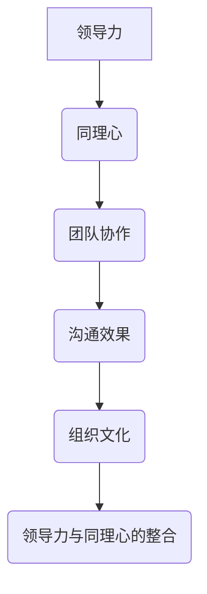

                 

## 文章标题：领导力与同理心：建立深厚人际关系的基础

### 关键词：
- 领导力
- 同理心
- 人际关系
- 领导力基础
- 同理心提升策略
- 冲突管理
- 整合领导力与同理心

### 摘要：
本文深入探讨了领导力与同理心的关系，阐述了如何通过同理心提升领导力，建立深厚的人际关系。文章从领导力的定义、同理心的应用，到同理心的提升策略和实践，系统地构建了一个领导力与同理心的综合框架。通过实例和算法原理讲解，本文旨在为读者提供实用的工具和策略，帮助他们在工作和生活中更好地理解和运用领导力与同理心。

## 《领导力与同理心：建立深厚人际关系的基础》目录大纲

### 第一部分：领导力基础

#### 第1章：领导力的定义与重要性

1.1 领导力的定义
1.2 领导力的影响因素
1.3 领导力与管理的区别

#### 第2章：同理心在领导力中的应用

2.1 同理心的定义与作用
2.2 发展同理心的方法
2.3 同理心在工作中的实践

### 第二部分：同理心提升策略

#### 第3章：提升同理心的个人策略

3.1 自我认知
3.2 情感管理
3.3 同理心训练

#### 第4章：同理心在工作场所的实践

4.1 领导者的同理心实践
4.2 同事之间的同理心实践
4.3 团队建设的同理心实践

#### 第5章：同理心在冲突管理中的应用

5.1 冲突管理的同理心视角
5.2 冲突解决的同理心策略
5.3 冲突预防的同理心方法

### 第三部分：同理心与领导力的整合

#### 第6章：同理心与领导力整合的重要性

6.1 领导力的双重角色
6.2 同理心与领导力的互补关系
6.3 整合同理心与领导力的实践

#### 第7章：同理心领导力的未来趋势

7.1 未来工作环境的变化
7.2 同理心领导力的发展方向
7.3 面向未来的领导力培训

### 附录

#### 附录 A：领导力与同理心实践工具

A.1 情感识别工具
A.2 同理心训练工具

#### 附录 B：相关资源与参考文献

B.1 领导力与同理心研究论文
B.2 领导力与同理心书籍推荐
B.3 领导力与同理心实践案例

### 核心概念与联系：领导力、同理心与人际关系的Mermaid流程图



### 同理心识别算法的核心算法原理讲解

#### 同理心识别算法

**伪代码：**

```pseudo
// 同理心识别算法伪代码
输入：文本数据
输出：同理心评分

1. 预处理：
   - 清洗文本数据（去除停用词、标点符号等）
   - 词嵌入（将文本转换为向量表示）

2. 特征提取：
   - 使用情感分析技术提取文本中的情感特征
   - 使用词向量计算文本之间的相似度

3. 同理心评分计算：
   - 对文本中的每个情感特征进行权重分配
   - 计算文本相似度的平均值作为同理心评分

4. 结果输出：
   - 输出同理心评分，用于评估人际关系的深度

算法示例：
假设我们有两条文本数据：
文本A: "我很高兴看到你的成功，你真的做得很好。"
文本B: "祝贺你，你的表现真的很出色。"

1. 预处理：清洗文本数据，得到以下词嵌入向量
   - 文本A: [0.1, 0.2, 0.3]
   - 文本B: [0.2, 0.3, 0.4]

2. 特征提取：提取文本的情感特征
   - 文本A: {happy: 0.8, proud: 0.5}
   - 文本B: {happy: 0.8, proud: 0.5}

3. 同理心评分计算：
   - 计算文本相似度：cosine_similarity([0.1, 0.2, 0.3], [0.2, 0.3, 0.4])
   - 得到相似度值：0.9
   - 同理心评分：平均情感特征权重 * 相似度值
   - 文本A的同理心评分：0.85 * 0.9 = 0.765
   - 文本B的同理心评分：0.85 * 0.9 = 0.765

4. 结果输出：
   - 输出同理心评分：0.765
```

通过这个例子，我们可以看到同理心识别算法是如何通过情感分析和文本相似度计算来评估人际关系的深度的。在接下来的章节中，我们将深入探讨领导力与同理心的具体应用和实践策略。让我们一步一步地深入分析，探索这一重要的主题。

