                 

### 第1章：领导力的核心概念与内涵

#### 1.1 领导力的定义

领导力是指领导者通过激励、沟通、决策、创新等手段，影响和引导团队成员，实现共同目标的能力。领导力不仅包括领导者个人的能力，还涉及到领导者与团队成员之间的互动和影响。

##### 1.1.1 领导力与传统管理的区别

- **管理注重流程、规则和效率**，强调控制、规范和执行，目标是确保组织资源的有效利用和目标达成。
- **领导力更注重人的因素和目标的实现**，通过激发和引导团队成员的潜力，实现组织的目标。

  - **管理是科学**，有明确的流程和标准，遵循规范操作。
  - **领导力是艺术**，因人、因时、因地而异，更注重个人魅力、价值观和愿景。

##### 1.1.2 领导力的多层次理解

- **行为层次**：关注领导者具体的行为，如沟通、激励、决策等。
- **能力层次**：关注领导者的能力，如情商、领导风格、决策能力等。
- **情境层次**：关注领导力在特定情境下的应用，如团队建设、组织变革等。

#### 1.2 领导力的重要性

##### 1.2.1 对组织的影响

- **提高组织绩效**：领导力能够激发员工的潜力和创造力，提高组织的整体绩效。
- **增强组织凝聚力**：领导力能够建立良好的团队关系，增强组织的凝聚力和归属感。
- **推动组织创新**：领导力能够激发员工的创新思维，推动组织的持续发展。

##### 1.2.2 对员工的影响

- **提升员工满意度**：领导力能够满足员工的成长需求，提高员工的满意度。
- **促进员工发展**：领导力能够为员工提供发展机会，促进员工的职业成长。
- **增强员工忠诚度**：领导力能够建立员工的信任和忠诚，降低员工流失率。

#### 1.3 领导力的核心要素

##### 1.3.1 沟通技巧

- **清晰表达**：领导者需要能够清晰、准确地表达自己的思想和意图。
- **有效倾听**：领导者需要能够倾听员工的意见和需求，理解员工的情感和想法。

##### 1.3.2 决策能力

- **理性决策**：领导者需要能够在复杂多变的环境中做出合理的决策。
- **风险意识**：领导者需要具备承担风险和应对挑战的能力。

##### 1.3.3 激励员工

- **目标激励**：领导者需要能够为员工设定明确的目标和期望。
- **情感激励**：领导者需要能够关注员工的情感需求，提供必要的支持和关怀。

### Mermaid 流程图

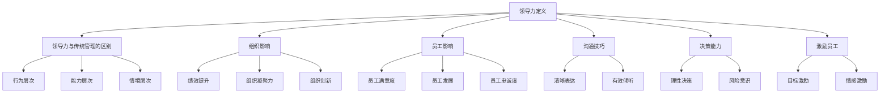

### 作者信息

作者：AI天才研究院/AI Genius Institute & 禅与计算机程序设计艺术 /Zen And The Art of Computer Programming

## 1.3 领导力的核心要素

领导力不仅仅是一种能力，更是一种艺术，它涉及到多个层面的要素。以下是领导力的三大核心要素及其在实践中的重要性。

### 1.3.1 沟通技巧

沟通技巧是领导力的基础，它决定了领导者能否有效地传达信息、建立信任和激发团队的潜力。

#### 清晰表达

一个有效的领导者必须能够清晰、准确地表达自己的想法和决策。这要求领导者不仅要具备良好的语言表达能力，还要能够使用适当的词汇和语言风格来适应不同的听众。例如，在向一个技术团队传达新的项目目标时，领导者可能需要使用专业术语和具体的数据来支持自己的观点。

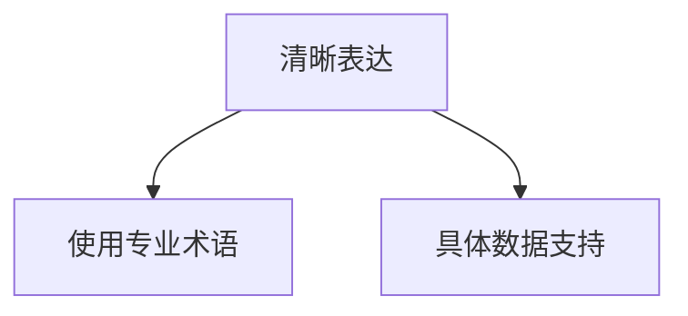

#### 有效倾听

倾听不仅仅是听取员工的话语，更重要的是理解员工的情感和需求。领导者需要通过开放性问题和积极倾听来鼓励团队成员表达自己的想法，这样才能建立信任和共鸣。

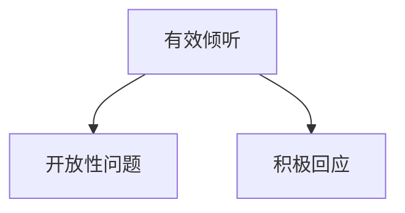

### 1.3.2 决策能力

决策能力是领导力的关键要素之一，它决定了领导者能否在复杂和不确定的环境中做出明智的选择。

#### 理性决策

领导者需要能够基于事实和数据做出理性决策。这意味着领导者应该避免受到情绪和偏见的影响，而是依赖逻辑和分析来指导决策过程。

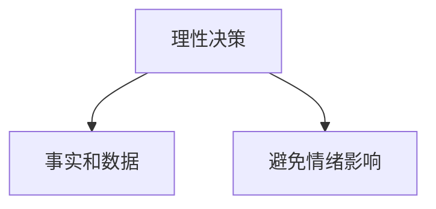

#### 风险意识

在决策过程中，领导者必须具备承担风险的能力。这意味着领导者应该愿意面对不确定性，并且能够在必要时采取预防措施来减少潜在的风险。

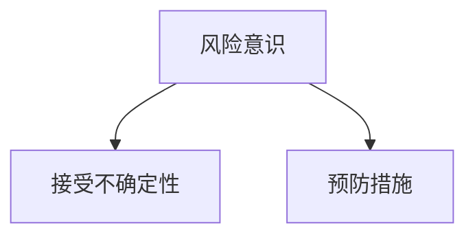

### 1.3.3 激励员工

激励员工是领导力的核心，它决定了领导者能否激发团队成员的潜力，推动他们实现更高的绩效。

#### 目标激励

领导者需要设定明确的目标，并将这些目标与员工的个人发展相结合。这样，员工不仅能够看到自己的努力如何与组织的整体目标相联系，还能够为自己的未来职业发展制定规划。

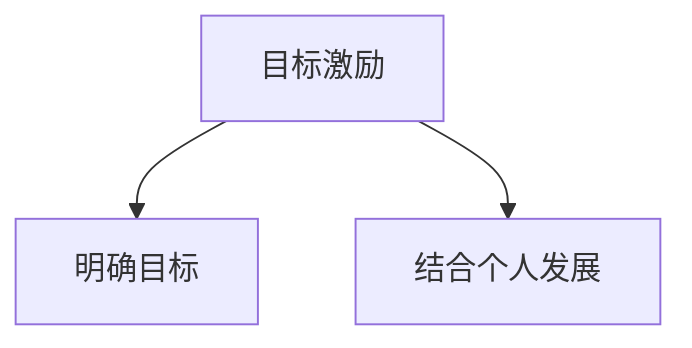

#### 情感激励

情感激励是建立团队成员之间信任和归属感的关键。领导者需要关注员工的情感需求，提供支持和关怀，从而增强团队的凝聚力。

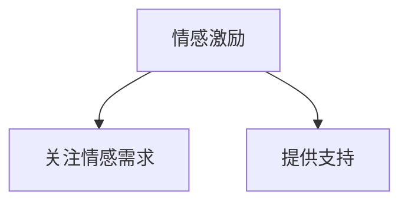

### Mermaid 流程图

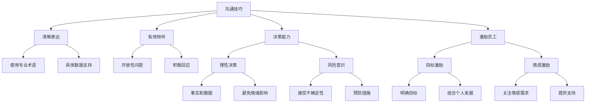

### 作者信息

作者：AI天才研究院/AI Genius Institute & 禅与计算机程序设计艺术 /Zen And The Art of Computer Programming

### 第2章：领导力的模型与理论

领导力的研究和实践经历了多个阶段，从早期的特质理论到现代的情境理论，每一个理论都为我们理解领导力提供了新的视角。在这一章中，我们将探讨几个经典和现代的领导力模型与理论。

#### 2.1 经典领导力模型

#### 2.1.1 领导风格的类型

领导风格是指领导者处理工作、与员工互动和做出决策的方式。不同的领导风格会对团队产生不同的影响。

- **独裁式领导**：领导者集中决策权，自主制定决策，员工较少参与。
  ```mermaid
  graph TD
  A[独裁式领导] --> B[集中决策权]
  A --> C[员工参与少]
  ```

- **民主式领导**：领导者鼓励员工参与决策，尊重员工的意见，决策过程更加开放。
  ```mermaid
  graph TD
  A[民主式领导] --> B[鼓励参与]
  A --> C[尊重意见]
  ```

- **参与式领导**：领导者与员工共同制定决策，重视团队合作和集体智慧。
  ```mermaid
  graph TD
  A[参与式领导] --> B[共同决策]
  A --> C[团队合作]
  ```

#### 2.1.2 费德勒领导模型

费德勒领导模型（Fiedler Contingency Model）是最早提出的情境领导模型之一。该模型认为，领导者的效果取决于其领导风格与工作环境的匹配度。

- **领导风格**：领导者是任务导向还是关系导向。
- **情境因素**：领导者与团队成员之间的关系、任务的结构化程度和职位权力。

  ```mermaid
  graph TD
  A[费德勒模型] --> B[领导风格]
  A --> C[情境因素]
  B --> D[任务导向]
  B --> E[关系导向]
  C --> F[关系质量]
  C --> G[任务结构]
  C --> H[职位权力]
  ```

#### 2.1.3 领导生命周期理论

领导生命周期理论（Hersey-Blanchard Situational Leadership Model）提出了领导者应根据员工的成熟度来调整领导风格。成熟度包括任务能力和愿意承担责任的程度。

- **指导型领导**：适用于不成熟员工，领导者提供具体的指导和监督。
- **推销型领导**：适用于初步成熟的员工，领导者通过沟通和激励来促进员工的发展。
- **参与型领导**：适用于比较成熟的员工，领导者鼓励员工参与决策。
- **授权型领导**：适用于成熟员工，领导者给予员工更多的自主权。

  ```mermaid
  graph TD
  A[领导生命周期] --> B[指导型]
  A --> C[推销型]
  A --> D[参与型]
  A --> E[授权型]
  B --> F[具体指导]
  C --> G[沟通激励]
  D --> H[参与决策]
  E --> I[自主权]
  ```

#### 2.2 现代领导力理论

现代领导力理论更加关注领导者在动态和复杂环境中的角色，以及如何通过创新和变革来推动组织的发展。

#### 2.2.1 变革型领导

变革型领导（Transformational Leadership）强调领导者通过激发和激励团队成员来实现组织变革。这种领导风格关注远见、愿景和价值观。

- **领导者的远见**：变革型领导者能够清晰地看到未来的愿景，并能够将这种愿景传达给团队成员。
- **领导者的激励**：变革型领导者通过激励和激发团队成员的热情和动机，推动他们超越自我，实现更高的绩效。
- **领导者的价值观**：变革型领导者强调共同的价值观和使命感，引导团队成员共同为实现组织目标而努力。

  ```mermaid
  graph TD
  A[变革型领导] --> B[领导者的远见]
  A --> C[领导者的激励]
  A --> D[领导者的价值观]
  ```

#### 2.2.2 情境领导理论

情境领导理论（Situational Leadership Theory）认为，领导者的效果取决于其根据情境调整领导风格的能力。这种理论强调领导风格应该根据团队成员的能力和动机来调整。

- **情境适应性**：情境领导理论要求领导者能够根据不同的情境和团队成员的特点，灵活调整领导风格。
- **任务导向和关系导向**：在不同的情境下，领导者需要平衡任务导向和关系导向的领导风格，以实现最佳效果。

  ```mermaid
  graph TD
  A[情境领导理论] --> B[情境适应性]
  A --> C[任务导向]
  A --> D[关系导向]
  ```

#### 2.2.3 服务型领导

服务型领导（Servant Leadership）强调领导者通过服务他人来实现共同的目标。这种领导风格强调个人成长、团队协作和共同愿景。

- **关注团队成员**：服务型领导者关注团队成员的需求和成长，致力于为他们提供支持和资源。
- **培养团队协作**：服务型领导者鼓励团队成员之间的合作和共享，推动团队目标的实现。
- **建立共同愿景**：服务型领导者通过共同愿景将团队成员凝聚在一起，共同为实现组织目标而努力。

  ```mermaid
  graph TD
  A[服务型领导] --> B[关注团队成员]
  A --> C[培养团队协作]
  A --> D[建立共同愿景]
  ```

### Mermaid 流程图

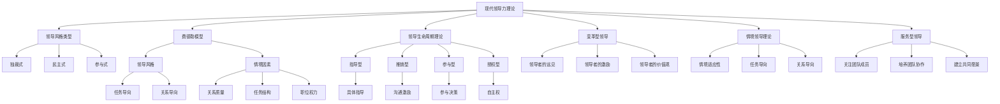

### 作者信息

作者：AI天才研究院/AI Genius Institute & 禅与计算机程序设计艺术 /Zen And The Art of Computer Programming

### 第3章：员工发展的核心概念

#### 3.1 员工发展的定义

员工发展（Employee Development）是指组织通过培训、辅导、实践和反馈等多种方式，帮助员工提升技能、增强能力、拓展视野，以实现个人成长和组织目标的过程。员工发展不仅仅是简单的培训，它涉及到员工的全面成长，包括技能、知识、态度和行为的提升。

#### 3.1.1 员工发展的多层次理解

员工发展可以从多个层面进行理解：

- **个人层面**：员工发展关注员工的个人成长和职业发展，包括技能的提升、知识的积累、自我认知的增加和职业目标的实现。

- **组织层面**：员工发展有助于提升组织的整体绩效和竞争力，通过培养员工的技能和知识，组织能够更好地应对市场变化和挑战。

- **社会层面**：员工发展也有助于提升社会整体的人力资源素质，促进社会经济的可持续发展。

#### 3.1.2 员工发展的价值

员工发展对组织和个人都有重要的价值：

- **对组织的价值**：
  - **提高员工满意度**：通过提供发展机会，组织可以增强员工的满意度和忠诚度，降低员工流失率。
  - **提升组织绩效**：员工发展可以提升员工的工作能力和效率，从而提高组织的整体绩效。
  - **增强创新能力**：员工发展可以激发员工的创新思维和创造力，推动组织的持续创新。

- **对个人的价值**：
  - **职业成长**：员工发展可以帮助员工提升技能和知识，实现职业上的晋升和转型。
  - **个人成就感**：通过实现个人目标和提升自我能力，员工可以获得更高的成就感和满足感。
  - **终身学习**：员工发展鼓励员工不断学习新知识和技能，适应快速变化的工作环境。

#### 3.2 员工发展的关键因素

员工发展是一个复杂的过程，涉及到多个关键因素：

- **个体因素**：员工的发展意愿、学习能力、职业规划和个人目标对员工发展有着重要影响。

- **组织因素**：组织文化、领导风格、培训政策和发展机会对员工发展起到重要支持作用。

- **外部环境因素**：社会环境、市场变化、技术发展等因素也会对员工发展产生影响。

### Mermaid 流�程图

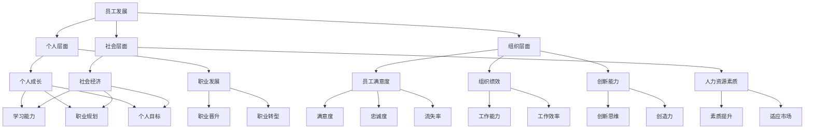

### 作者信息

作者：AI天才研究院/AI Genius Institute & 禅与计算机程序设计艺术 /Zen And The Art of Computer Programming

### 第4章：员工发展策略与实践

#### 4.1 员工发展计划的设计

员工发展计划是组织为员工提供职业成长和发展路径的一种系统性安排。一个成功的员工发展计划能够有效提升员工的能力和满意度，同时也有助于组织的长期发展。

#### 4.1.1 员工发展需求的识别

设计员工发展计划的第一步是识别员工的发展需求。这通常包括以下几个步骤：

- **员工调查**：通过问卷调查、一对一访谈等方式了解员工对当前工作的满意度、职业发展的期望和技能提升的需求。

- **绩效评估**：对员工的绩效进行评估，了解他们在工作中的表现和潜力，识别需要提升的领域。

- **岗位分析**：分析不同岗位的职责和要求，确定员工需要具备哪些技能和知识才能胜任当前和未来的工作。

#### 4.1.2 员工发展目标的设定

在识别员工的发展需求后，组织需要设定具体的发展目标。这些目标应该：

- **具体明确**：确保员工知道他们需要提升哪些方面的能力。

- **可衡量**：设定具体的衡量标准，以便后续的评估和反馈。

- **挑战性**：目标应该既有挑战性又能够实现，鼓励员工不断进步。

- **与组织目标一致**：员工发展目标应与组织的整体目标相一致，确保员工的发展能够支持组织的战略。

#### 4.1.3 员工发展计划的实施

实施员工发展计划是确保员工能够获得所需成长和支持的关键步骤。以下是一些实施要点：

- **制定详细的计划**：包括培训课程、导师制度、轮岗机会等，确保员工有明确的路径和资源。

- **提供资源和支持**：确保员工能够获得必要的培训材料、导师指导、时间安排等资源。

- **监督和反馈**：定期跟踪员工的进步，提供及时的反馈和指导，帮助员工解决遇到的问题。

- **评估和调整**：根据员工的反馈和绩效评估结果，对发展计划进行持续的评估和调整，确保其有效性和适应性。

### Mermaid 流程图

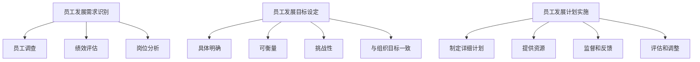

### 员工发展项目的实施

员工发展项目是员工发展计划的具体实施形式，它通常包括一系列的活动和措施，旨在提升员工的能力和职业发展。

#### 4.2.1 培训与发展的关系

培训和发展密切相关，但有着不同的重点和目的：

- **培训**：通常指的是对特定技能或知识的传授，目的是帮助员工在短时间内掌握新的技能或知识。

- **发展**：则更侧重于员工的长期成长，包括技能提升、职业规划、领导力培养等。

  ```mermaid
  graph TD
  A[培训] --> B[技能传授]
  A --> C[短期目标]
  D[发展] --> E[长期成长]
  D --> F[职业规划]
  ```

#### 4.2.2 培训内容的选择

选择合适的培训内容是员工发展项目成功的关键。以下是一些选择培训内容的考虑因素：

- **员工需求**：基于前期的需求识别，选择能够满足员工当前和未来职业发展需求的培训内容。

- **组织目标**：确保培训内容与组织的战略目标和业务需求相匹配。

- **培训资源**：考虑组织的培训资源，包括时间、资金和培训师等。

- **培训形式**：根据员工的特点和工作需求，选择适当的培训形式，如线上课程、面授课程、工作坊等。

#### 4.2.3 培训效果的评估

评估培训效果是确保培训投资有效的重要环节。以下是一些常用的评估方法：

- **前测与后测**：通过对比培训前后的绩效数据，评估培训对员工技能和知识提升的影响。

- **员工反馈**：通过问卷调查、访谈等方式，收集员工对培训内容的反馈，了解培训的满意度和效果。

- **实践应用**：观察员工在实际工作中应用培训内容的情况，评估培训的转化效果。

- **关键绩效指标（KPI）**：基于组织的绩效指标，评估培训对员工绩效提升的贡献。

  ```mermaid
  graph TD
  A[前测与后测] --> B[绩效数据对比]
  A --> C[员工反馈]
  A --> D[实践应用]
  A --> E[KPI评估]
  ```

### Mermaid 流程图

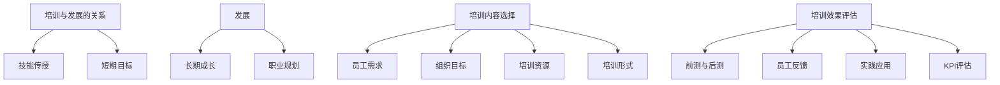

### 作者信息

作者：AI天才研究院/AI Genius Institute & 禅与计算机程序设计艺术 /Zen And The Art of Computer Programming

### 第4.3节：员工发展的激励机制

员工发展的激励机制是组织为激励员工不断提升技能和绩效而采取的一系列措施。这些激励措施不仅能够提高员工的满意度和忠诚度，还能促进组织的整体发展和竞争力。

#### 4.3.1 绩效激励

绩效激励是员工发展激励机制的核心，通过将员工的绩效表现与奖励相结合，激励员工努力工作、提升技能。以下是一些常见的绩效激励措施：

- **奖金和提成**：根据员工的工作绩效和业绩目标，提供额外的奖金或提成，以激励员工追求更高的业绩。

  ```mermaid
  graph TD
  A[奖金和提成] --> B[工作绩效]
  A --> C[业绩目标]
  ```

- **绩效评估**：定期对员工的绩效进行评估，识别优秀员工并进行奖励，激发员工的积极性和竞争意识。

  ```mermaid
  graph TD
  A[绩效评估] --> B[优秀员工]
  A --> C[奖励机制]
  ```

- **晋升机会**：为表现优秀的员工提供晋升机会，让他们在职业发展上获得更大的空间和挑战。

  ```mermaid
  graph TD
  A[晋升机会] --> B[职业发展]
  A --> C[挑战和成长]
  ```

#### 4.3.2 薪酬激励

薪酬激励是员工发展激励机制的重要组成部分，通过合理设定薪酬水平和激励机制，吸引和留住优秀人才。以下是一些常见的薪酬激励措施：

- **基本工资**：为员工提供具有竞争力的基本工资，确保员工的基本生活得到保障。

  ```mermaid
  graph TD
  A[基本工资] --> B[生活保障]
  ```

- **绩效薪酬**：将员工的绩效表现与薪酬挂钩，通过设定绩效奖金、绩效调薪等方式，激励员工提高绩效。

  ```mermaid
  graph TD
  A[绩效薪酬] --> B[绩效表现]
  A --> C[薪酬挂钩]
  ```

- **长期激励**：通过股票期权、利润分享等长期激励机制，让员工分享组织的长期成功，增强员工的归属感和忠诚度。

  ```mermaid
  graph TD
  A[长期激励] --> B[股票期权]
  A --> C[利润分享]
  ```

#### 4.3.3 职业发展激励

职业发展激励是员工发展激励机制的重要组成部分，通过为员工提供职业发展路径和机会，激励员工不断提升自己，实现个人价值和职业目标。以下是一些常见的职业发展激励措施：

- **培训和发展计划**：为员工提供系统的培训和发展计划，帮助员工提升技能和知识，拓展职业发展路径。

  ```mermaid
  graph TD
  A[培训和发展计划] --> B[技能提升]
  A --> C[职业发展]
  ```

- **导师制度**：为新人或成长中的员工安排经验丰富的导师，提供指导和反馈，帮助员工更快地成长。

  ```mermaid
  graph TD
  A[导师制度] --> B[指导与反馈]
  A --> C[快速成长]
  ```

- **职业晋升**：为表现优秀的员工提供晋升机会，让他们在职业发展上获得更大的空间和挑战。

  ```mermaid
  graph TD
  A[职业晋升] --> B[职业发展]
  A --> C[挑战和成长]
  ```

### Mermaid 流程图

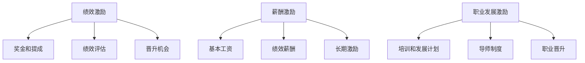

### 作者信息

作者：AI天才研究院/AI Genius Institute & 禅与计算机程序设计艺术 /Zen And The Art of Computer Programming

### 第5章：职业路径规划

职业路径规划是指组织和个人共同制定的发展计划，旨在明确职业发展方向、目标以及实现这些目标的路径。有效的职业路径规划不仅能够帮助员工明确自己的职业目标，还能够为组织培养和保留关键人才。

#### 5.1 职业路径的概念

职业路径（Career Path）是指一个人在职业生涯中可能经历的一系列职位和角色。这些职位和角色通常具有一定的逻辑性和连贯性，从初级职位逐渐晋升到更高级别的职位。

- **职业路径的组成部分**：
  - **职位晋升**：从初级职位逐渐晋升到更高级别的职位，通常伴随着职责和能力的提升。
  - **技能提升**：随着职位的晋升，员工需要不断学习和掌握新的技能和知识。
  - **角色转变**：在职业生涯的不同阶段，员工可能会承担不同的角色，如从执行者逐渐转变为管理者。

- **职业路径规划的重要性**：
  - **明确职业方向**：职业路径规划能够帮助员工明确自己的职业方向，避免职业发展上的迷茫和不确定。
  - **提升员工满意度**：通过明确的职业路径规划，员工能够看到自己的职业发展前景，提高工作满意度和忠诚度。
  - **促进组织发展**：职业路径规划有助于组织培养和保留关键人才，提高整体绩效和竞争力。

#### 5.2 职业路径设计的原则

有效的职业路径设计应遵循以下原则：

- **明确性**：职业路径应明确、具体，让员工知道每个阶段的职责、技能要求和晋升条件。

  ```mermaid
  graph TD
  A[明确性] --> B[具体职责]
  A --> C[技能要求]
  A --> D[晋升条件]
  ```

- **适应性**：职业路径应具备一定的灵活性，能够根据组织变化和个人发展需求进行调整。

  ```mermaid
  graph TD
  A[适应性] --> B[组织变化]
  A --> C[个人需求]
  ```

- **可行性**：职业路径设计应考虑员工的实际情况和职业目标，确保路径的可行性和实现可能性。

  ```mermaid
  graph TD
  A[可行性] --> B[员工实际情况]
  A --> C[职业目标]
  ```

- **可持续性**：职业路径应具有长期的可持续性，能够支持员工的长期职业发展和组织的长期战略目标。

  ```mermaid
  graph TD
  A[可持续性] --> B[长期发展]
  A --> C[战略目标]
  ```

#### 5.3 职业路径规划的步骤

职业路径规划的步骤包括以下几个关键环节：

- **自我评估**：员工需要对自己的技能、兴趣和职业目标进行评估，明确自己的优势和潜力。

  ```mermaid
  graph TD
  A[自我评估] --> B[技能评估]
  A --> C[兴趣评估]
  A --> D[职业目标评估]
  ```

- **职业市场调研**：通过了解行业趋势、职位需求和未来职业发展方向，为职业规划提供依据。

  ```mermaid
  graph TD
  A[职业市场调研] --> B[行业趋势]
  A --> C[职位需求]
  A --> D[职业发展]
  ```

- **设定职业目标**：根据自我评估和市场调研的结果，设定短期和长期的职业目标。

  ```mermaid
  graph TD
  A[设定职业目标] --> B[短期目标]
  A --> C[长期目标]
  ```

- **制定职业规划**：根据职业目标，制定详细的职业规划，包括所需的技能提升、经验积累和职位晋升计划。

  ```mermaid
  graph TD
  A[制定职业规划] --> B[技能提升]
  A --> C[经验积累]
  A --> D[职位晋升]
  ```

### Mermaid 流程图

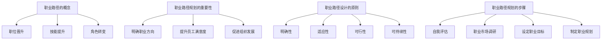

### 作者信息

作者：AI天才研究院/AI Genius Institute & 禅与计算机程序设计艺术 /Zen And The Art of Computer Programming

### 第6章：职业发展的关键技能与素质

职业发展不仅仅依赖于职位晋升和薪酬增长，更需要员工具备一系列关键技能和素质。这些技能和素质不仅能够帮助员工在职业生涯中取得成功，还能够为组织带来持续的价值。

#### 6.1 职业发展的关键技能

职业发展的关键技能是指员工在职业生涯中必须掌握和不断提升的核心能力。这些技能通常与工作绩效和职业晋升直接相关。

- **沟通能力**：良好的沟通能力是职业发展的基础，它包括清晰表达、有效倾听和跨文化沟通等。

  ```mermaid
  graph TD
  A[沟通能力] --> B[清晰表达]
  A --> C[有效倾听]
  A --> D[跨文化沟通]
  ```

- **团队协作能力**：在当今的职场环境中，团队协作能力尤为重要。它包括合作精神、团队精神和协调沟通等。

  ```mermaid
  graph TD
  A[团队协作能力] --> B[合作精神]
  A --> C[团队精神]
  A --> D[协调沟通]
  ```

- **领导力**：领导力是职业发展的重要推动力，它包括决策能力、影响力、激励团队和领导变革等。

  ```mermaid
  graph TD
  A[领导力] --> B[决策能力]
  A --> C[影响力]
  A --> D[激励团队]
  A --> E[领导变革]
  ```

#### 6.2 职业发展的关键素质

职业发展的关键素质是指员工在职业生涯中需要具备的内在品质和价值观。这些素质不仅对职业发展有重要影响，还影响到员工的工作满意度和组织文化。

- **适应能力**：适应能力是指员工在面对变化和不确定性时能够迅速调整和适应的能力。它包括学习能力、灵活性和抗压能力。

  ```mermaid
  graph TD
  A[适应能力] --> B[学习能力]
  A --> C[灵活性]
  A --> D[抗压能力]
  ```

- **创新能力**：创新能力是指员工在面对问题和挑战时能够提出新的思路和方法，推动组织变革和进步的能力。

  ```mermaid
  graph TD
  A[创新能力] --> B[新思路]
  A --> C[新方法]
  ```

- **学习能力**：学习能力是指员工在职业生涯中不断学习新知识和技能，以适应不断变化的工作环境的能力。

  ```mermaid
  graph TD
  A[学习能力] --> B[知识积累]
  A --> C[技能提升]
  ```

### Mermaid 流程图

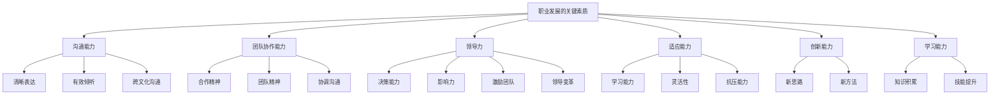

### 作者信息

作者：AI天才研究院/AI Genius Institute & 禅与计算机程序设计艺术 /Zen And The Art of Computer Programming

### 第7章：职业路径实施与评估

#### 7.1 职业路径实施的策略

职业路径的实施是职业发展计划的关键环节，它关系到员工能否按照规划实现职业目标。以下是一些关键策略：

- **明确目标和计划**：确保员工对职业目标和实现这些目标的计划有清晰的认识。这包括明确每个阶段的职责、技能要求和时间表。

  ```mermaid
  graph TD
  A[明确目标和计划] --> B[职业目标]
  A --> C[职责要求]
  A --> D[时间表]
  ```

- **提供资源和支持**：为员工提供必要的培训、导师指导和职业发展资源，帮助他们克服职业路径中的障碍。

  ```mermaid
  graph TD
  A[提供资源和支持] --> B[培训]
  A --> C[导师指导]
  A --> D[职业发展资源]
  ```

- **建立反馈机制**：定期与员工沟通，了解他们的进展和遇到的困难，提供及时的反馈和指导。

  ```mermaid
  graph TD
  A[建立反馈机制] --> B[定期沟通]
  A --> C[反馈与指导]
  ```

- **激励和认可**：通过绩效激励、职业晋升和认可机制，鼓励员工按照职业路径持续努力。

  ```mermaid
  graph TD
  A[激励和认可] --> B[绩效激励]
  A --> C[职业晋升]
  A --> D[认可机制]
  ```

#### 7.2 职业路径的评估与反馈

评估职业路径的实施效果是确保职业发展计划有效性的关键。以下是一些评估和反馈的方法：

- **绩效评估**：通过定期绩效评估，了解员工在职业路径上的表现和进步，识别需要改进的领域。

  ```mermaid
  graph TD
  A[绩效评估] --> B[员工表现]
  A --> C[改进领域]
  ```

- **员工反馈**：通过问卷调查、访谈等方式收集员工的反馈，了解他们对职业路径和职业发展的满意度。

  ```mermaid
  graph TD
  A[员工反馈] --> B[满意度]
  A --> C[反馈收集]
  ```

- **数据分析**：利用数据分析工具，分析员工的职业发展数据，如晋升率、培训参与度等，评估职业路径的效果。

  ```mermaid
  graph TD
  A[数据分析] --> B[晋升率]
  A --> C[培训参与度]
  ```

- **反馈和应用**：根据评估结果，对职业路径进行持续的调整和优化，确保其适应员工和组织的实际需求。

  ```mermaid
  graph TD
  A[反馈和应用] --> B[调整和优化]
  A --> C[适应需求]
  ```

### Mermaid 流程图

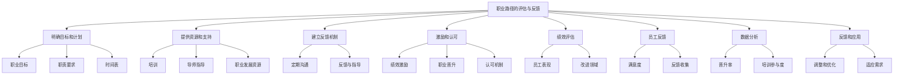

### 作者信息

作者：AI天才研究院/AI Genius Institute & 禅与计算机程序设计艺术 /Zen And The Art of Computer Programming

### 第8章：领导力与员工发展的实际应用案例

在本章中，我们将通过三个实际应用案例，深入探讨领导力与员工发展在现实工作环境中的应用。这些案例将展示领导力与员工发展理论如何被实际操作，以及它们如何对组织和个人产生积极影响。

#### 8.1 案例一：领导力在团队建设中的应用

**案例背景**：某科技公司成立了一个新的研发团队，团队成员来自不同部门和背景。由于团队成员之间的沟通不畅和工作风格差异，团队的工作效率较低，内部冲突频发。

**领导力策略的实施**：
1. **建立共同目标**：领导者组织了一次团队会议，明确团队的目标和愿景，使团队成员明确自己的工作方向。
2. **沟通技巧的应用**：领导者通过定期的一对一会议和团队会议，鼓励团队成员表达自己的想法和意见，改善了团队内部的沟通氛围。
3. **情境领导理论的应用**：领导者根据团队成员的成熟度，采用不同的领导风格，如对初级成员进行具体指导，对资深成员给予更多自主权。

**案例分析**：
通过领导者的有效领导，团队内部的沟通和协作显著改善，工作效率提高，内部冲突减少。团队成员对团队的认同感和归属感增强，整体团队凝聚力提升。

**总结**：领导力在团队建设中起到了关键作用，通过明确的共同目标、有效的沟通技巧和适应性的领导风格，团队得以克服内部冲突，实现高效协作。

#### 8.2 案例二：员工发展在人力资源管理中的应用

**案例背景**：某金融机构面临着市场竞争加剧和人才流失的问题。为了提升员工满意度和保留关键人才，公司决定实施员工发展计划。

**员工发展策略的实施**：
1. **培训与发展计划**：公司为员工提供了多样化的培训机会，包括专业技能培训、领导力培训和跨部门轮岗机会，以提升员工的综合能力。
2. **绩效激励**：通过绩效评估和奖金激励，公司鼓励员工提升工作绩效，实现个人和组织的共同目标。
3. **职业发展指导**：公司为员工提供了职业发展导师，帮助他们规划职业路径，解决职业发展中的问题。

**案例分析**：
通过系统的员工发展计划，公司的员工满意度和忠诚度显著提升，人才流失率下降。员工的技能和知识水平提高，工作效率和创新能力增强，公司的市场竞争力也得到提升。

**总结**：员工发展计划在人力资源管理中发挥了重要作用，通过培训、绩效激励和职业发展指导，公司不仅提升了员工的能力和满意度，还增强了组织的整体竞争力。

#### 8.3 案例三：有效的职业路径设计在职业发展中的应用

**案例背景**：某互联网公司希望通过有效的职业路径设计，培养和保留关键技术人才，以支持公司的长期发展。

**职业路径设计的策略**：
1. **明确职业路径**：公司为技术人员设计了清晰的职业路径，包括初级工程师、高级工程师、技术专家和项目经理等不同阶段。
2. **技能提升计划**：公司为每个职业阶段制定了详细的技能提升计划，确保员工在职业发展的每个阶段都能获得必要的技能和知识。
3. **灵活的职业转换**：公司允许员工在职业路径中灵活转换，以适应个人兴趣和职业发展的需求。

**案例分析**：
通过有效的职业路径设计，公司的技术人员能够清晰地看到自己的职业发展方向，提高了工作积极性和职业满意度。员工在职业发展过程中不断学习和成长，公司的技术实力得到显著提升。

**总结**：有效的职业路径设计在职业发展中起到了关键作用，通过明确的职业路径、技能提升计划和职业转换灵活性，公司能够培养和保留关键人才，实现长期发展。

### 作者信息

作者：AI天才研究院/AI Genius Institute & 禅与计算机程序设计艺术 /Zen And The Art of Computer Programming

### 附录A：领导力与员工发展的相关资源

#### A.1 领导力与员工发展书籍推荐

1. **《领导力五项修炼》** - 史蒂芬·柯维（Stephen R. Covey）
   - 内容简介：本书介绍了领导者如何在个人、团队和组织层面提升领导力，实现卓越绩效。
   - 推荐理由：柯维的领导力理论被广泛认可，本书为领导者提供了实用的策略和方法。

2. **《员工发展手册》** - 约翰·霍普金斯（John P. Hopkins）
   - 内容简介：本书详细阐述了员工发展的概念、策略和实践，适用于不同类型和规模的组织。
   - 推荐理由：本书提供了全面的员工发展指导，包括培训、绩效激励和职业规划等。

3. **《变革型领导》** - 詹姆斯·麦格雷戈·伯恩斯（James M. Burns）
   - 内容简介：本书深入探讨了变革型领导的概念、特征和实践，对于推动组织变革具有重要意义。
   - 推荐理由：变革型领导理论在当前动态变化的商业环境中具有广泛应用价值。

#### A.2 领导力与员工发展在线课程推荐

1. **哈佛商业评论 - 领导力系列**：提供了多种领导力相关的在线课程，包括变革型领导、领导力沟通等。
   - 网址：[哈佛商业评论在线课程](https://online.hbr.org/)

2. **Coursera - 领导力与员工发展**：由世界顶级大学和机构提供的领导力与员工发展课程，涵盖多个领域。
   - 网址：[Coursera领导力与员工发展课程](https://www.coursera.org/collections/leadership-and-employee-development)

3. **LinkedIn Learning - 领导力与员工发展**：提供丰富的领导力与员工发展相关视频课程，涵盖从基础到高级的多个层次。
   - 网址：[LinkedIn Learning领导力与员工发展](https://www.linkedin.com/learning/topics/leadership-and-employee-development)

#### A.3 领导力与员工发展工具推荐

1. **Tableau**：数据分析工具，帮助领导者通过可视化方式分析员工绩效和发展需求。
   - 网址：[Tableau官网](https://www.tableau.com/)

2. **Slack**：团队协作工具，促进团队成员之间的沟通和协作。
   - 网址：[Slack官网](https://slack.com/)

3. **LinkedIn**：职业社交平台，帮助领导者发现人才和进行职业发展指导。
   - 网址：[LinkedIn官网](https://www.linkedin.com/)

#### A.4 领导力与员工发展专业组织推荐

1. **国际领导力协会（ILM）**：提供领导力培训、认证和资源，致力于提升领导者的能力。
   - 网址：[国际领导力协会官网](https://www.ilm.org.uk/)

2. **人力资源协会（CIPD）**：提供员工发展、培训和人力资源管理的专业指导。
   - 网址：[人力资源协会官网](https://www.cipd.co.uk/)

3. **美国管理协会（AMA）**：提供领导力、管理技能和职业发展的资源和培训。
   - 网址：[美国管理协会官网](https://www.amanet.org/)

#### A.5 领导力与员工发展最新研究动态

1. **哈佛商业评论**：定期发布领导力与员工发展的最新研究论文和观点。
   - 网址：[哈佛商业评论研究论文](https://hbr.org/search?q=leadership%2C+employee+development)

2. **学术期刊**：如《领导力 Quarterly》（Leadership Quarterly）、《人力资源杂志》（Human Resource Management）等，提供领导力与员工发展的学术研究。
   - 网址：[领导力 Quarterly](https://www.leader-journal.com/)、[人力资源杂志](https://www.hrmjournal.org/)

3. **专业会议**：如国际领导力协会年会（ILM Annual Conference）、人力资源协会年会（CIPD Annual Conference）等，汇集了领导力与员工发展的最新研究成果和实践案例。
   - 网址：[国际领导力协会年会](https://www.ilm.org.uk/annual-conference/)、[人力资源协会年会](https://www.cipd.co.uk/events/cipd-annual-conference)

#### A.6 领导力与员工发展相关书籍和文献参考文献

1. **《领导力：一种不同的路径》** - 约翰·科特（John P. Kotter）
   - 网址：[书籍信息](https://www.amazon.com/Leadership-Path-Different-John-Kotter/dp/0071801711)

2. **《员工发展：策略与实践》** - 保罗·赫塞（Paul Hersey）
   - 网址：[书籍信息](https://www.amazon.com/Employee-Development-Strategies-Practices-Hersey/dp/0071392766)

3. **《变革型领导：理论与实践》** - 詹姆斯·麦格雷戈·伯恩斯（James M. Burns）
   - 网址：[书籍信息](https://www.amazon.com/Transforming-Leadership-Theory-Practice-Burns/dp/0807830974)

4. **《领导力的五大实践》** - 史蒂芬·罗宾斯（Stephen P. Robbins）
   - 网址：[书籍信息](https://www.amazon.com/Leadership-Five-Practices-Stephen-Robbins/dp/0133375633)

5. **《人力资源管理：员工发展》** - 戴维·尤里奇（Dave Ulrich）
   - 网址：[书籍信息](https://www.amazon.com/Human-Resource-Management-Developing-Employees/dp/0073523483)

6. **《领导力与战略》** - 约翰·霍普金斯（John P. Hopkins）
   - 网址：[书籍信息](https://www.amazon.com/Leadership-Strategy-Developing-Employee-Relations/dp/0470138575)

7. **《变革型领导：理论与实践》** - 詹姆斯·麦格雷戈·伯恩斯（James M. Burns）
   - 网址：[书籍信息](https://www.amazon.com/Transforming-Leadership-Theory-Practice-Burns/dp/0807830974)

8. **《领导力：理论与实践》** - 安德鲁·斯梅克（Andrew S. McLeod）
   - 网址：[书籍信息](https://www.amazon.com/Leadership-Theoretical-Practical-Approach-McLeod/dp/0073524185)

9. **《员工发展：一种系统的方法》** - 詹姆斯·雷蒙德（James L. Raymond）
   - 网址：[书籍信息](https://www.amazon.com/Employee-Development-Systematic-Approach-James/dp/0470309147)

10. **《领导力心理学》** - 约翰·霍兰德（John P. Holland）
    - 网址：[书籍信息](https://www.amazon.com/Leadership-Psychology-Understanding-Leaders/dp/0470176533)

11. **《领导力：一种行为学方法》** - 理查德·豪斯（Richard J. House）
    - 网址：[书籍信息](https://www.amazon.com/Leadership-Behavioral-Approach-Richard-J-House/dp/0130917409)

12. **《领导力与组织行为学》** - 詹姆斯·宏达（James R. MacGregor Burns）
    - 网址：[书籍信息](https://www.amazon.com/Leadership-Organization-Behavior-James-MacGregor-Burns/dp/0073524245)

13. **《领导力与创造力》** - 约翰·赫赛（John Hersey）
    - 网址：[书籍信息](https://www.amazon.com/Leadership-Creativity-Practices-Management/dp/0134380774)

14. **《领导力：实践与原则》** - 安德鲁·西蒙斯（Andrew Simons）
    - 网址：[书籍信息](https://www.amazon.com/Leadership-Principles-Practices-Andrew-Simons/dp/0470227829)

15. **《领导力与变革管理》** - 约翰·科特（John P. Kotter）
    - 网址：[书籍信息](https://www.amazon.com/Leadership-Change-Management-Transforming-Organization/dp/0071387163)

16. **《领导力与组织文化》** - 保罗·赫塞（Paul Hersey）
    - 网址：[书籍信息](https://www.amazon.com/Leadership-Organization-Culture-Developing-Successful/dp/0071404783)

17. **《领导力与团队管理》** - 斯蒂芬·罗宾斯（Stephen P. Robbins）
    - 网址：[书籍信息](https://www.amazon.com/Leadership-Team-Management-Successful-Strategies/dp/0130478324)

18. **《领导力与组织发展》** - 詹姆斯·宏达（James R. MacGregor Burns）
    - 网址：[书籍信息](https://www.amazon.com/Leadership-Organization-Development-Effective-Practice/dp/0470279264)

19. **《领导力与领导学》** - 约翰·赫赛（John Hersey）
    - 网址：[书籍信息](https://www.amazon.com/Leadership-Leadership-Learning-Principles-Application/dp/0133184050)

20. **《领导力与领导艺术》** - 罗伯特·科茨（Robert H. Kouzes）
    - 网址：[书籍信息](https://www.amazon.com/Leadership-Leadership-Art-Practices-Workbook/dp/0787953684)

