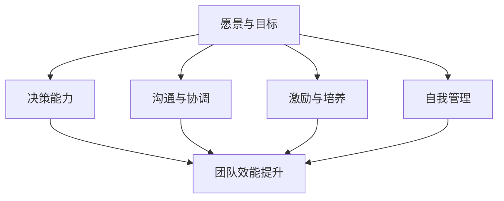
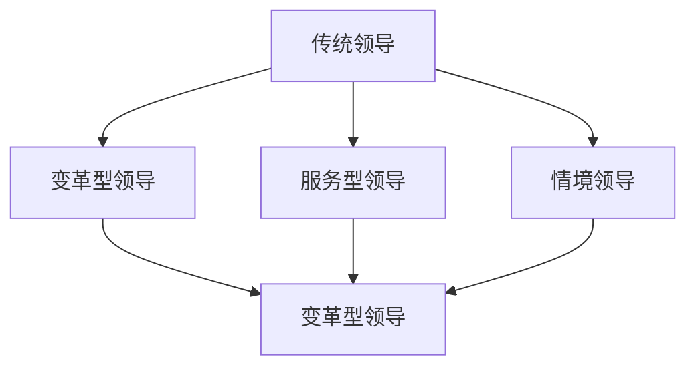
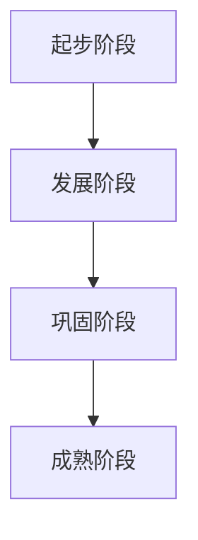
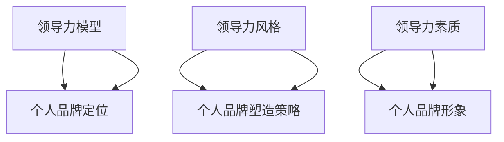

                 

## 文章标题

“领导力与品牌塑造：树立个人品牌”

### 关键词

- **领导力**、**个人品牌**、**品牌塑造**、**影响力**、**社交媒体**、**职业发展**

### 摘要

在快速变化的技术时代，领导力和个人品牌成为职业发展中的关键要素。本文将通过详细解析领导力的定义、核心要素、领导风格、领导力模型，深入探讨个人品牌的定义、核心要素、塑造策略及案例分析，最终阐述领导力与个人品牌的相互影响，为读者提供系统性的实战应用指导，助力个人在职场中脱颖而出，树立强大的个人品牌。

### 目录大纲：《领导力与品牌塑造：树立个人品牌》

#### 第一部分：领导力基础

1. **领导力概述**
    - **1.1 领导力的定义与重要性**
    - **1.2 领导力的核心要素**
    - **1.3 领导力的发展历程**
  
2. **领导风格**
    - **2.1 领导风格理论**
    - **2.2 领导风格的选择与运用**
    - **2.3 领导风格对团队的影响**

3. **领导力模型**
    - **3.1 领导力模型的构成**
    - **3.2 评估与提升领导力**
    - **3.3 领导力模型的应用**

#### 第二部分：个人品牌塑造

1. **个人品牌概述**
    - **2.1.1 个人品牌的定义与重要性**
    - **2.1.2 个人品牌的核心要素**
    - **2.1.3 个人品牌的发展历程**

2. **塑造个人品牌**
    - **2.2.1 个人品牌的定位**
    - **2.2.2 个人品牌的塑造策略**
    - **2.2.3 个人品牌的建设与维护**

3. **个人品牌塑造案例分析**
    - **2.3.1 成功案例解读**
    - **2.3.2 失败案例反思**
    - **2.3.3 个人品牌塑造的误区与应对策略**

#### 第三部分：领导力与品牌塑造的联系

1. **领导力对个人品牌塑造的影响**
    - **3.1.1 领导力在个人品牌塑造中的作用**
    - **3.1.2 领导力对品牌形象的提升**
    - **3.1.3 领导力在品牌传播中的策略**

2. **个人品牌对领导力发展的推动作用**
    - **3.2.1 个人品牌对领导力的提升**
    - **3.2.2 个人品牌对领导力发展的助力**
    - **3.2.3 个人品牌与领导力的协同发展**

#### 第四部分：实战应用

1. **领导力与品牌塑造实战策略**
    - **4.1.1 实战案例分析**
    - **4.1.2 实战策略制定**
    - **4.1.3 实战策略实施与评估**

2. **项目管理中的领导力与品牌塑造**
    - **4.2.1 项目目标与规划**
    - **4.2.2 项目团队建设与管理**
    - **4.2.3 项目风险管理与品牌塑造**

3. **企业领导力与品牌塑造策略**
    - **4.3.1 企业文化塑造**
    - **4.3.2 企业品牌建设**
    - **4.3.3 企业领导力培养与传承**

#### 附录

- **附录 A：领导力与品牌塑造相关资源**
  - **A.1 优秀领导力书籍推荐**
  - **A.2 个人品牌塑造工具与资源**
  - **A.3 领导力与品牌塑造实践指南**

---

### 第一部分：领导力基础

#### 1.1 领导力的定义与重要性

领导力，是一种引导、激励和影响他人共同实现目标的能力。它不仅关乎个人的行为和决策，更涉及对团队的凝聚、引领和推动。在企业管理、组织发展以及个人职业成长中，领导力扮演着至关重要的角色。

**定义与重要性**

1. **定义**：领导力是一种综合能力，包括愿景构建、战略规划、决策制定、沟通协调、激励培养等多个方面。它不仅仅是管理职位者的特权，更是每个职场人士应当具备的核心竞争力。

2. **重要性**：领导力在职业发展中的重要性体现在以下几个方面：

    - **团队效能提升**：有效的领导力能够提升团队的整体执行力，提高工作效率，实现目标最大化。

    - **个人成长**：领导力的提升有助于个人在职业道路上的不断进步，培养更加全面和深入的管理和解决问题的能力。

    - **企业竞争力**：领导力是企业文化的重要组成部分，优秀的领导力能够推动企业创新、提升竞争力，实现可持续发展。

**领导力的发展历程**

领导力的发展历程可以追溯到古代的君主制和军事领导，但随着社会和经济的不断发展，领导力的定义和内涵也在不断演变。以下是领导力发展历程的几个关键阶段：

- **传统领导**：早期的领导模式主要依赖权力和控制，强调领导者的权威和命令。

- **变革型领导**：20世纪中叶，学者们开始关注领导者的变革能力，认为领导者应具备激发团队潜能、推动创新的能力。

- **服务型领导**：近年来，服务型领导理论逐渐兴起，强调领导者应为团队成员提供服务，关注团队成员的成长和福祉。

- **情境领导**：这一理论提出，领导风格应根据不同情境灵活调整，以达到最佳效果。

#### 1.2 领导力的核心要素

领导力的核心要素包括以下几个方面：

- **愿景与目标**：领导者的首要任务是建立清晰的愿景和目标，激发团队成员的积极性，共同为实现目标而努力。

- **决策能力**：领导者需要具备卓越的决策能力，能够在复杂多变的情境中做出正确的决策。

- **沟通与协调**：有效的沟通和协调能力是领导者成功的关键，它有助于团队协作，提高工作效率。

- **激励与培养**：领导者应具备激励团队成员的能力，同时注重团队成员的培养和发展，提高团队整体素质。

- **自我管理**：领导者需要具备良好的自我管理能力，包括情绪控制、时间管理和自我激励等方面。

**领导力的核心要素关系图**

以下是领导力核心要素之间的关系图：



**实例说明**

假设一位项目经理负责一个研发团队，以下是领导力核心要素的具体应用：

- **愿景与目标**：项目经理需要明确项目的目标，并定期与团队讨论，确保团队成员理解并认同项目目标。

- **决策能力**：当项目遇到技术难题时，项目经理需要迅速做出决策，选择最佳解决方案。

- **沟通与协调**：项目经理需要与团队成员、上级和管理层保持有效沟通，确保项目进展的透明和协调。

- **激励与培养**：项目经理需要关注团队成员的职业发展，提供培训和指导，激发团队成员的工作热情。

- **自我管理**：项目经理需要合理安排时间，保持良好的情绪状态，以应对项目中的各种挑战。

#### 1.3 领导力的发展历程

领导力的发展历程可以分为以下几个阶段：

1. **传统领导阶段**：在这一阶段，领导力主要依赖于领导者的个人能力和权威。领导者的角色是下达命令、监督执行。

2. **变革型领导阶段**：随着组织环境的复杂性和变化性的增加，领导者需要具备变革能力，能够推动组织变革和创新发展。

3. **服务型领导阶段**：服务型领导强调领导者应为团队成员提供服务，关注团队成员的成长和福祉。这种领导模式更加注重团队合作和共同发展。

4. **情境领导阶段**：情境领导理论提出，领导风格应根据不同情境灵活调整，以达到最佳效果。这种领导模式更加注重适应性。

以下是领导力发展历程的示意图：



**实例说明**

以一位公司的CTO为例，以下是他在不同领导力阶段的实践：

- **传统领导阶段**：CTO负责监督技术团队的工作，下达技术决策，强调技术标准的严格执行。

- **变革型领导阶段**：CTO开始关注技术创新，推动组织的技术变革，鼓励团队成员提出新想法，提高团队的创新活力。

- **服务型领导阶段**：CTO关注团队成员的职业发展，提供技术培训，营造良好的团队合作氛围。

- **情境领导阶段**：CTO根据项目需求和团队状态，灵活调整领导风格，确保项目进展顺利。

### 第二部分：个人品牌塑造

#### 2.1 个人品牌概述

**个人品牌的定义与重要性**

1. **定义**：个人品牌是指个人在公众心目中的形象和认知，它包括个人的价值观、专业知识、职业成就、人格特质等多个方面。

2. **重要性**：个人品牌在职业发展中的重要性体现在以下几个方面：

    - **职业竞争力**：个人品牌有助于提升个人的职业竞争力，使个人在职场中更具吸引力。

    - **影响力扩展**：个人品牌有助于扩大个人的影响力，使个人在行业内更具话语权和影响力。

    - **职业发展**：个人品牌有助于个人职业发展的持续提升，为个人提供更多的职业机会和发展空间。

**个人品牌的核心要素**

1. **专业知识**：专业知识是个人品牌的基石，它体现了个人的专业能力和知识深度。

2. **人格特质**：人格特质是个人品牌的软实力，它包括诚信、责任感、沟通能力等。

3. **职业成就**：职业成就是个人品牌的重要标志，它反映了个人的职业水平和能力。

4. **价值观**：价值观是个人品牌的灵魂，它体现了个人的行为准则和人生观。

**个人品牌的发展历程**

个人品牌的发展历程可以分为以下几个阶段：

1. **起步阶段**：在这一阶段，个人品牌处于建立阶段，个人需要通过不断学习和实践，积累专业知识，提升职业能力。

2. **发展阶段**：在这一阶段，个人品牌开始逐渐成熟，个人在行业内具有一定的知名度，开始积累职业成就。

3. **巩固阶段**：在这一阶段，个人品牌得到进一步的巩固和提升，个人在行业内具有较高的声誉和影响力。

4. **成熟阶段**：在这一阶段，个人品牌达到巅峰，个人在行业内具有广泛的影响力，成为行业的权威人物。

以下是个人品牌发展历程的示意图：



**实例说明**

以一位技术专家为例，以下是他在个人品牌建设中的实践：

- **起步阶段**：技术专家通过不断学习新技术，提升自己的专业能力，积累技术文章和项目经验。

- **发展阶段**：技术专家开始发表技术博客，参与技术社区活动，逐渐在行业内积累知名度。

- **巩固阶段**：技术专家出版技术书籍，举办技术讲座，进一步提升个人品牌的影响力。

- **成熟阶段**：技术专家成为行业内知名的专家，受邀担任技术大会的演讲嘉宾，为行业贡献智慧。

### 第三部分：领导力与品牌塑造的联系

#### 3.1 领导力对个人品牌塑造的影响

**领导力在个人品牌塑造中的作用**

领导力在个人品牌塑造中起着至关重要的作用，主要体现在以下几个方面：

1. **塑造人格特质**：领导力强调诚信、责任感、团队合作等特质，这些特质有助于个人品牌的建立和维护。

2. **提升专业知识**：领导力通过不断学习和实践，提升个人的专业知识，使个人在行业内更具竞争力。

3. **拓展职业网络**：领导力有助于个人拓展职业网络，结识更多的行业人士，为个人品牌传播提供更多机会。

**领导力对品牌形象的提升**

1. **专业形象**：领导力使个人在专业领域内具备较高的声誉，提升个人品牌的专业形象。

2. **权威形象**：领导力使个人在行业内具备一定的权威，增强个人品牌的影响力。

3. **亲和力形象**：领导力强调团队合作和沟通，提升个人的亲和力，使个人品牌更具吸引力。

**领导力在品牌传播中的策略**

1. **内容营销**：通过撰写专业博客、发表技术文章，分享个人见解和经验，提升个人品牌的专业性和权威性。

2. **社交媒体**：利用社交媒体平台，扩大个人品牌的传播范围，提升个人品牌的影响力。

3. **活动参与**：参与行业活动，如技术大会、研讨会等，提升个人品牌的知名度和影响力。

**实例说明**

以一位企业CEO为例，以下是他在领导力与品牌塑造中的实践：

1. **塑造人格特质**：CEO通过实际行动，展现出诚信和责任感，赢得了员工的信任和尊重。

2. **提升专业知识**：CEO持续学习，掌握行业最新动态，提升个人在行业内的专业水平。

3. **拓展职业网络**：CEO积极参与行业活动，结识更多的行业人士，为个人品牌传播提供更多机会。

4. **专业形象**：CEO在公开演讲和采访中，分享企业的成功经验和行业见解，提升个人品牌的专业形象。

5. **权威形象**：CEO通过在行业内的积极参与和贡献，成为行业内的权威人物，增强个人品牌的影响力。

6. **亲和力形象**：CEO注重团队合作，与员工保持良好的沟通，提升个人的亲和力，使个人品牌更具吸引力。

### 3.2 个人品牌对领导力发展的推动作用

**个人品牌对领导力的提升**

1. **增强自信心**：个人品牌有助于提升个人的自信心，增强领导力。

2. **树立权威**：个人品牌使个人在团队中具备较高的权威，提升领导力。

3. **拓展视野**：个人品牌有助于个人拓展视野，学习更多领导力和管理知识，提升领导力。

**个人品牌对领导力发展的助力**

1. **团队凝聚力**：个人品牌有助于提升团队凝聚力，增强领导力。

2. **团队士气**：个人品牌有助于提升团队士气，激发团队成员的工作热情，提升领导力。

3. **资源获取**：个人品牌有助于个人获取更多的资源，如人才、资金等，为领导力发展提供支持。

**个人品牌与领导力的协同发展**

1. **互相促进**：个人品牌和领导力相互促进，共同提升个人在职场中的竞争力。

2. **长期发展**：个人品牌和领导力的协同发展，有助于个人在职业生涯中实现长期发展。

3. **持续优化**：个人品牌和领导力需要不断优化和提升，以适应不断变化的职场环境。

**实例说明**

以一位技术经理为例，以下是他在个人品牌与领导力协同发展中的实践：

1. **增强自信心**：技术经理通过在技术大会上的演讲，提升了自己的自信心，增强了领导力。

2. **树立权威**：技术经理通过在团队中分享技术见解和经验，树立了权威，提升了领导力。

3. **拓展视野**：技术经理通过阅读专业书籍和参加行业研讨会，拓展了视野，学习了更多领导力和管理知识，提升了领导力。

4. **团队凝聚力**：技术经理通过组织团队活动，提升团队凝聚力，增强了领导力。

5. **团队士气**：技术经理通过关心团队成员的成长和福利，提升团队士气，增强了领导力。

6. **资源获取**：技术经理通过在技术社区中的活跃表现，获得了更多的人才和资金支持，为领导力发展提供了支持。

### 第四部分：实战应用

#### 4.1 领导力与品牌塑造实战策略

**实战案例分析**

1. **背景**：某初创公司在市场上遇到困境，产品认可度低，团队士气低落。

2. **解决方案**：
    - **领导力提升**：通过内部培训和外部咨询，提升团队领导力。
    - **品牌塑造**：制定明确品牌定位，加强社交媒体推广，举办线下活动提升品牌知名度。

3. **实施过程**：
    - **阶段一**：内部培训，提升团队领导力。
    - **阶段二**：品牌定位与市场调研，确定品牌发展方向。
    - **阶段三**：社交媒体推广，举办线下活动，增加品牌曝光。
    - **阶段四**：数据监控与评估，调整策略，持续优化。

**实战策略制定**

1. **领导力提升策略**：
    - **制定培训计划**：根据团队需求，制定系统性的培训计划，包括领导力基础、沟通技巧、团队建设等。
    - **实施培训**：邀请专业培训师进行授课，组织团队内部研讨，加强领导力培养。
    - **评估与反馈**：定期对团队成员的领导力进行评估，提供反馈和建议，促进个人成长。

2. **品牌塑造策略**：
    - **明确品牌定位**：通过市场调研，明确品牌定位，确定品牌形象和发展方向。
    - **制定营销策略**：根据品牌定位，制定营销策略，包括社交媒体推广、线下活动、广告投放等。
    - **实施与监控**：执行营销策略，并实时监控效果，根据数据调整策略，确保品牌传播的有效性。

**实战策略实施与评估**

1. **实施过程**：
    - **领导力提升**：组织内部培训，邀请专业讲师授课，定期组织团队研讨，提升团队成员的领导力。
    - **品牌塑造**：在社交媒体平台上发布高质量内容，举办线下活动，增加品牌曝光度。

2. **评估与反馈**：
    - **领导力评估**：通过问卷调查、访谈等方式，收集团队成员对领导力的反馈，评估领导力提升效果。
    - **品牌评估**：通过数据分析，监控品牌曝光度、社交媒体互动、线下活动参与度等指标，评估品牌塑造效果。

#### 4.2 项目管理中的领导力与品牌塑造

**项目目标与规划**

1. **明确项目目标**：在项目启动阶段，明确项目的目标和预期成果，确保团队成员对项目目标有清晰的认识。

2. **制定项目规划**：根据项目目标和资源情况，制定详细的项目规划，包括时间安排、任务分配、风险评估等。

**项目团队建设与管理**

1. **团队组建**：根据项目需求，组建合适的团队，确保团队成员具备相应的专业技能和经验。

2. **团队管理**：通过有效的沟通和协调，确保团队成员之间的协作顺畅，提高团队工作效率。

3. **团队激励**：关注团队成员的身心健康，提供职业发展机会，激励团队成员发挥最大潜力。

**项目风险管理与品牌塑造**

1. **风险评估**：对项目进行全面的评估，识别潜在风险，制定相应的风险应对策略。

2. **风险监控**：在项目执行过程中，持续监控风险，及时调整项目计划，确保项目顺利推进。

3. **品牌传播**：在项目执行过程中，积极利用社交媒体等渠道，传播项目进展和成果，提升个人和团队的品牌知名度。

#### 4.3 企业领导力与品牌塑造策略

**企业文化塑造**

1. **价值观确立**：明确企业的核心价值观，确保企业文化的一致性和凝聚力。

2. **文化传承**：通过企业文化活动和培训，将核心价值观传承给员工，营造积极向上的企业文化氛围。

**企业品牌建设**

1. **品牌定位**：通过市场调研，明确企业品牌定位，确定品牌形象和发展方向。

2. **品牌传播**：利用多种渠道，如社交媒体、广告、公关活动等，提升企业品牌的知名度和美誉度。

3. **品牌管理**：建立品牌管理制度，确保品牌形象的一致性和稳定性。

**企业领导力培养与传承**

1. **领导力培训**：通过内部培训和外部学习，提升企业领导者的领导力水平。

2. **领导力传承**：建立领导力传承机制，确保领导力的可持续发展和传递。

3. **领导力评估**：定期对领导者进行评估，识别领导力优势和不足，提供针对性的培训和指导。

### 附录

#### 附录 A：领导力与品牌塑造相关资源

**A.1 优秀领导力书籍推荐**

1. 《领导力的五项修炼》：史蒂芬·柯维（Stephen R. Covey）
2. 《变革之舞》：约翰·P.科特（John P. Kotter）
3. 《领导者的品质》：唐纳德·特朗普（Donald Trump）

**A.2 个人品牌塑造工具与资源**

1. 个人品牌塑造工具：品牌雷达（Brand Radar）、个人品牌诊断工具等。
2. 个人品牌塑造资源：职业发展网站、社交媒体平台、专业论坛等。

**A.3 领导力与品牌塑造实践指南**

1. 领导力实践指南：哈佛商学院领导力实践指南、麦肯锡领导力实践指南等。
2. 个人品牌塑造指南：品牌塑造策略、社交媒体营销指南等。

### 结论

领导力和个人品牌在职业发展中具有重要作用。通过深入理解和实践领导力，不断提升个人品牌，可以增强职业竞争力，实现个人职业发展目标。本文从领导力基础、个人品牌塑造、领导力与品牌塑造的联系、实战应用等方面进行了详细解析，为读者提供了全面的指导。希望读者能够结合实际，不断学习和实践，树立强大的个人品牌，成为职场中的领导者。


### 最佳实践 tips

1. **持续学习**：领导力和个人品牌的建立需要不断学习和实践，保持对新技术、新理念的敏感性。

2. **明确目标**：设定清晰的个人和团队目标，确保行动与目标一致，提高领导力和个人品牌的实际效果。

3. **有效沟通**：提高沟通能力，确保信息传递准确、及时，增强团队凝聚力和个人品牌的影响力。

4. **积极反馈**：定期自我评估和接受他人反馈，及时调整和改进，提升领导力和个人品牌的成熟度。

5. **网络拓展**：利用社交媒体和专业平台，扩大人脉网络，提高个人品牌的曝光率和影响力。

### 小结

本文系统地阐述了领导力和个人品牌在职业发展中的重要性，以及二者之间的相互影响。通过分析领导力的定义、核心要素和发展历程，读者可以更好地理解领导力的本质。同时，通过对个人品牌概述、塑造策略和案例分析的详细探讨，读者能够掌握个人品牌建设的方法和技巧。实战应用部分提供了具体的策略和实践指南，帮助读者将理论应用到实际工作中。希望本文能为读者在职业发展道路上提供有益的启示和指导。

### 注意事项

1. **实践与理论结合**：在实际应用中，应将领导力和品牌塑造的理论与实践相结合，根据实际情况灵活调整策略。

2. **长期投入**：领导力和个人品牌的建立不是一蹴而就的，需要长期的努力和持续投入。

3. **自我反思**：定期反思个人和团队的表现，识别优点和不足，不断优化领导力和个人品牌。

4. **持续学习**：跟随行业发展趋势，不断学习新技术和理念，保持竞争力和创新能力。

### 拓展阅读

1. 《影响力》：罗伯特·西奥迪尼（Robert B. Cialdini）
2. 《演讲的力量》：克里斯·安德森（Chris Anderson）
3. 《关键对话》：凯里·帕特森（Kerry Patterson）等

### 作者信息

- **作者**：AI天才研究院/AI Genius Institute & 禅与计算机程序设计艺术 /Zen And The Art of Computer Programming

### 领导力模型与个人品牌定位关系图

以下是领导力模型与个人品牌定位之间的关系图：



### 领导力评估算法伪代码

```plaintext
function evaluateLeadership(leader, criteria) {
  score = 0;
  for (criterion in criteria) {
    if (leader.meetsCriterion(criterion)) {
      score += criterion.weight;
    }
  }
  return score;
}
```

### 品牌影响力公式

$$I = \frac{A \cdot E \cdot S}{C}$$

其中，\( I \) 表示品牌影响力，\( A \) 表示品牌的广告投放量，\( E \) 表示品牌受众的活跃度，\( S \) 表示品牌的社交分享量，\( C \) 表示品牌的市场竞争程度。

### 领导力与品牌塑造项目实战案例

**项目背景**

某创业公司在市场竞争中面临困境，品牌知名度低，领导力不足，需要通过提升领导力和塑造个人品牌来提高市场竞争力。

**解决方案**

1. **领导力提升**：通过内部培训和外部咨询，提升团队领导力。

2. **品牌塑造**：制定明确品牌定位，加强社交媒体推广，举办线下活动提升品牌知名度。

**实施过程**

1. **阶段一：内部培训，提升团队领导力**

   - 组织团队领导力培训课程，邀请专业讲师授课。
   - 开展团队内部研讨，分享领导力经验和案例。
   - 定期对团队成员进行领导力评估，提供反馈和改进建议。

2. **阶段二：品牌定位与市场调研，确定品牌发展方向**

   - 通过市场调研，了解目标用户需求和竞争对手情况。
   - 制定品牌定位，明确品牌形象和发展方向。
   - 制定品牌传播策略，包括社交媒体推广、线下活动等。

3. **阶段三：社交媒体推广，举办线下活动，增加品牌曝光**

   - 在社交媒体平台上发布高质量内容，分享品牌故事和产品优势。
   - 举办线下活动，如技术研讨会、行业论坛等，提升品牌知名度。
   - 与行业专家合作，进行品牌宣传，扩大品牌影响力。

4. **阶段四：数据监控与评估，调整策略，持续优化**

   - 监控品牌曝光度、社交媒体互动、线下活动参与度等指标，评估品牌塑造效果。
   - 根据评估结果，调整品牌传播策略，优化宣传方式。
   - 持续关注市场动态和用户反馈，及时调整领导力和品牌塑造策略。

**实施效果**

1. **领导力提升**：通过培训和学习，团队领导力得到显著提升，团队协作效率提高。

2. **品牌知名度**：通过社交媒体推广和线下活动，品牌知名度大幅提升，吸引了更多潜在客户。

3. **市场份额**：随着品牌知名度的提高，市场份额逐步增加，公司在市场竞争中占据有利地位。

**项目小结**

通过领导力提升和品牌塑造，该创业公司成功摆脱了市场困境，实现了业务的快速增长。项目的成功经验表明，领导力和品牌塑造是提升企业竞争力的关键因素，需要持续投入和优化。在未来的发展中，公司将继续加强领导力培养，优化品牌传播策略，以实现更长远的目标。

