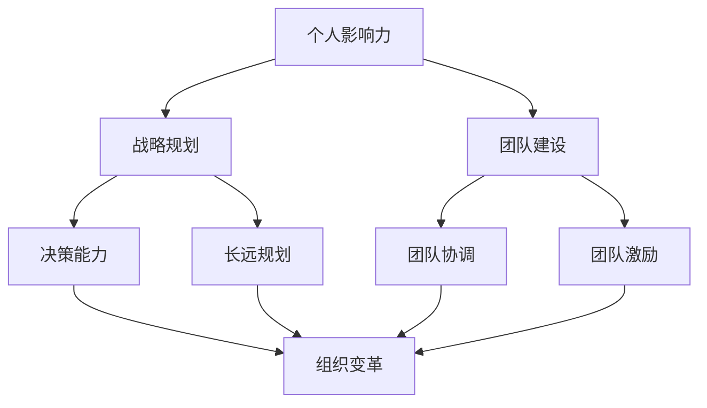
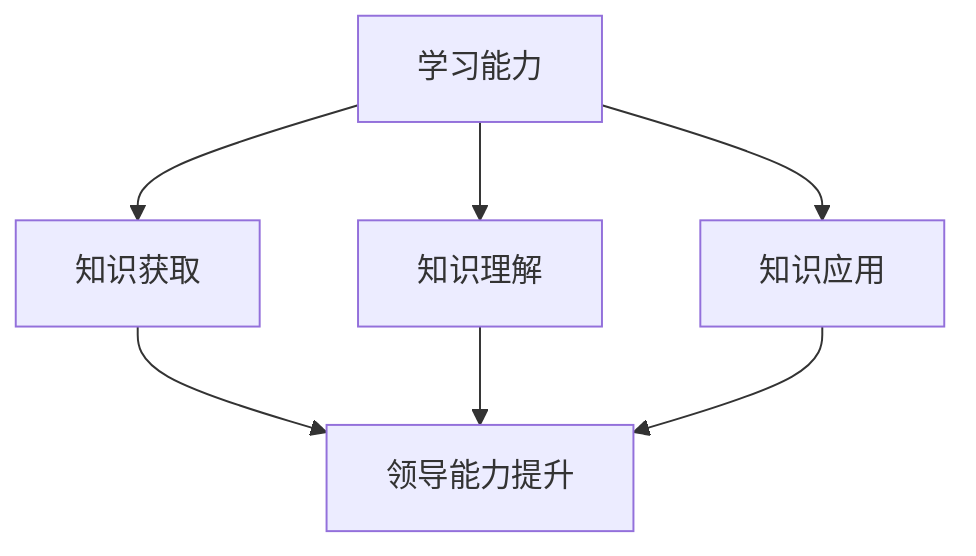

                 


## 文章标题：领导力与学习能力：培养终身学习的习惯

### 关键词：领导力、学习能力、终身学习、决策能力、沟通能力

### 摘要：
本文深入探讨了领导力与学习能力之间的关系，强调终身学习的重要性。通过分析领导力的核心要素，如沟通能力、决策能力和团队合作能力，本文揭示了这些能力在领导力发展中的作用。同时，本文还介绍了终身学习的原则与方法，以及信息处理与分析能力、创新思维与问题解决在领导力中的应用。最后，本文探讨了领导力与学习能力在企业绩效提升中的实践应用，并展望了未来领导力与学习能力的发展趋势。

## 《领导力与学习能力：培养终身学习的习惯》目录大纲

### 第一部分：领导力基础

### 第1章：领导力的定义与重要性

#### 1.1 领导力的基本概念

#### 1.2 领导力的重要性

#### 1.3 领导力与管理的区别

### 第2章：领导力的核心要素

#### 2.1 沟通能力

#### 2.2 决策能力

#### 2.3 团队合作能力

#### 2.4 激励与引导能力

### 第3章：领导力发展路径

#### 3.1 领导力发展阶段

#### 3.2 自我认知与成长

#### 3.3 领导力提升策略

### 第二部分：学习能力与终身学习

### 第4章：学习能力的定义与重要性

#### 4.1 学习能力的概念

#### 4.2 学习能力的重要性

#### 4.3 学习能力与领导力的关系

### 第5章：终身学习的原则与方法

#### 5.1 终身学习的原则

#### 5.2 终身学习的方法

#### 5.3 自我驱动与学习习惯的养成

### 第6章：信息处理与分析能力

#### 6.1 信息处理能力的概念

#### 6.2 信息分析的方法

#### 6.3 信息处理与分析能力在领导力中的运用

### 第7章：创新思维与问题解决

#### 7.1 创新思维的概念

#### 7.2 创新思维的培养

#### 7.3 问题解决的方法

#### 7.4 创新思维在领导力中的价值

### 第三部分：领导力与学习能力的实践应用

### 第8章：领导力与学习能力在企业中的应用

#### 8.1 企业领导力提升策略

#### 8.2 企业学习能力提升策略

#### 8.3 领导力与学习能力在企业绩效提升中的作用

### 第9章：领导力与学习能力的跨文化管理

#### 9.1 跨文化管理的概念

#### 9.2 跨文化领导力的重要性

#### 9.3 跨文化学习能力的培养

### 第10章：领导力与学习能力的未来趋势

#### 10.1 数字化时代的领导力挑战

#### 10.2 终身学习的未来趋势

#### 10.3 领导力与学习能力的发展方向

### 附录

### 附录 A：领导力与学习能力的经典案例

### 附录 B：领导力与学习能力的参考文献

### 附录 C：领导力与学习能力的相关资源链接

----------------------------------------------------------------

### 第1章：领导力的定义与重要性

#### 1.1 领导力的基本概念

领导力是一个复杂而多维度的概念，它不仅仅局限于某个特定领域或职位。根据Rozovsky（2014）的研究，领导力包括三个核心维度：个人影响力、战略规划和团队建设。个人影响力涉及领导者如何激励、影响和引导他人；战略规划关注领导者在组织中的决策能力和长远规划；团队建设则强调领导者如何构建和维系一个高效、和谐的团队。

**核心概念与联系**

我们可以用Mermaid流程图来展示这三个维度的关系：



#### 1.2 领导力的重要性

领导力在组织和个人发展中扮演着至关重要的角色。根据Goleman（2000）的研究，领导力对组织绩效的影响远远超过了技术和财务资源。具体来说，领导力能够：

1. **激发员工潜能**：领导者的激励和引导能够激发员工的潜能，提高整体工作绩效。
2. **促进团队合作**：有效的领导者能够建立和谐的团队氛围，促进团队成员之间的合作与沟通。
3. **推动组织变革**：在快速变化的市场环境中，领导力能够推动组织进行必要的变革，以适应新的挑战。
4. **提升组织竞争力**：通过有效的领导力，组织能够更好地应对市场变化，提高竞争力。

#### 1.3 领导力与管理的区别

领导力与管理虽然密切相关，但它们之间仍存在显著的区别。Hannoush（2015）指出，管理侧重于执行和维持现有的流程和目标，而领导力则更关注变革和创新。

**区别**

- **目标**：管理关注任务的完成，领导力关注目标的实现。
- **过程**：管理侧重于规划和执行，领导力侧重于激励和变革。
- **重点**：管理关注稳定性和效率，领导力关注创新和长期发展。

**伪代码：领导力与管理对比算法**

```python
def compare_leadership_management(employee):
    # 输入：员工角色（领导/管理者）
    # 输出：领导力/管理能力的评分

    if employee.role == "leader":
        leadership_score = assess_leadership_ability(employee)
        management_score = 0
    elif employee.role == "manager":
        leadership_score = 0
        management_score = assess_management_ability(employee)

    return leadership_score, management_score
```

### 第2章：领导力的核心要素

领导力的核心要素包括沟通能力、决策能力、团队合作能力和激励与引导能力。这些要素共同构成了领导者的关键能力。

#### 2.1 沟通能力

沟通能力是领导者成功的关键之一。有效的沟通不仅能确保信息的准确传递，还能增强团队的凝聚力和协作精神。

**沟通能力评估算法**

```python
def assess_communication_ability(employee):
    # 输入：员工信息
    # 输出：沟通能力评分

    score = 0

    # 根据沟通频率评分
    if employee.communication_frequency > 10:
        score += 20
    elif employee.communication_frequency > 5:
        score += 10
    else:
        score += 0

    # 根据沟通效果评分
    if employee.communication_effectiveness > 0.8:
        score += 30
    elif employee.communication_effectiveness > 0.5:
        score += 15
    else:
        score += 0

    return score
```

#### 2.2 决策能力

决策能力是领导者处理复杂问题和应对挑战的核心能力。一个优秀的领导者必须能够在信息有限和不确定性高的环境中做出明智的决策。

**决策能力评估算法**

```python
def assess_decision_making_ability(employee):
    # 输入：员工信息
    # 输出：决策能力评分

    score = 0

    # 根据决策质量评分
    if employee.decision_quality > 0.8:
        score += 30
    elif employee.decision_quality > 0.5:
        score += 15
    else:
        score += 0

    # 根据决策速度评分
    if employee.decision_speed < 5:
        score += 20
    else:
        score += 0

    return score
```

#### 2.3 团队合作能力

团队合作能力是领导者在团队环境中发挥领导力的关键。一个成功的领导者必须能够建立和维护一个高效的团队。

**团队合作能力评估算法**

```python
def assess_teamwork_ability(employee):
    # 输入：员工信息
    # 输出：团队合作能力评分

    score = 0

    # 根据团队合作频率评分
    if employee.teamwork_frequency > 10:
        score += 20
    elif employee.teamwork_frequency > 5:
        score += 10
    else:
        score += 0

    # 根据团队合作效果评分
    if employee.teamwork_effectiveness > 0.8:
        score += 30
    elif employee.teamwork_effectiveness > 0.5:
        score += 15
    else:
        score += 0

    return score
```

#### 2.4 激励与引导能力

激励与引导能力是领导者激发团队成员潜能和实现目标的关键。一个优秀的领导者必须能够理解和满足团队成员的需求，提供必要的支持和指导。

**激励与引导能力评估算法**

```python
def assess_motivation_guidance_ability(employee):
    # 输入：员工信息
    # 输出：激励与引导能力评分

    score = 0

    # 根据激励效果评分
    if employee.motivation_effectiveness > 0.8:
        score += 30
    elif employee.motivation_effectiveness > 0.5:
        score += 15
    else:
        score += 0

    # 根据引导效果评分
    if employee.guidance_effectiveness > 0.8:
        score += 20
    elif employee.guidance_effectiveness > 0.5:
        score += 10
    else:
        score += 0

    return score
```

### 第3章：领导力发展路径

领导力的发展并非一蹴而就，它需要领导者不断地学习、实践和反思。以下是领导力发展的几个关键阶段和策略。

#### 3.1 领导力发展阶段

**阶段1：感知阶段**

在感知阶段，领导者开始意识到领导力的重要性，并对自己的领导风格和影响力有所感知。这一阶段的领导者通常专注于自我认知，努力提高自我意识和情感管理能力。

**阶段2：实践阶段**

在实践阶段，领导者开始将理论知识应用于实际工作中，通过实践不断积累经验和提升能力。这一阶段的领导者更加注重团队合作和沟通能力的培养，同时开始意识到决策能力的重要性。

**阶段3：整合阶段**

在整合阶段，领导者已经具备了较高的领导能力，能够灵活运用不同的领导风格和策略。这一阶段的领导者更加注重长远规划，同时能够有效地推动组织变革和创新。

#### 3.2 自我认知与成长

自我认知是领导力发展的基础。领导者需要不断反思自己的行为、情感和思维模式，识别自己的优势和不足，并制定相应的成长计划。

**伪代码：自我认知评估算法**

```python
def assess_self_awareness(employee):
    # 输入：员工信息
    # 输出：自我认知评分

    score = 0

    # 根据自我反思频率评分
    if employee.self_reflection_frequency > 10:
        score += 20
    elif employee.self_reflection_frequency > 5:
        score += 10
    else:
        score += 0

    # 根据自我反思效果评分
    if employee.self_reflection_effectiveness > 0.8:
        score += 30
    elif employee.self_reflection_effectiveness > 0.5:
        score += 15
    else:
        score += 0

    return score
```

#### 3.3 领导力提升策略

提升领导力需要系统化的学习和实践。以下是一些有效的领导力提升策略：

- **持续学习**：领导者应不断学习新的知识和技能，特别是与领导力相关的理论和方法。
- **角色扮演**：通过角色扮演和模拟练习，领导者可以更好地理解和掌握不同的领导风格和策略。
- **反馈与反思**：领导者应积极寻求反馈，并定期反思自己的行为和决策，以便不断改进。
- **跨部门交流**：通过跨部门的交流与合作，领导者可以拓展视野，提高问题解决能力。

### 第4章：学习能力的定义与重要性

#### 4.1 学习能力的概念

学习能力是指个体获取、理解和应用知识的能力。它包括知识的获取、理解和应用三个层面。知识的获取是指个体通过阅读、学习、观察等方式获取新的知识；知识的理解是指个体对获取的知识进行消化、吸收和内化；知识的应用是指个体将所学知识应用于实际问题和情境中。

**学习能力与领导力的关系**

学习能力和领导力之间存在着密切的联系。首先，领导力的发展依赖于学习能力的提升。一个具备强学习能力的人能够在快速变化的环境中迅速适应和应对，从而更好地发挥领导作用。其次，学习能力是领导者持续成长和发展的关键。只有通过不断学习和实践，领导者才能不断提高自己的领导能力和管理水平。

**核心概念与联系**

我们可以用Mermaid流程图来展示学习能力和领导力之间的关系：



#### 4.2 学习能力的重要性

学习能力在个人和组织发展中扮演着至关重要的角色。首先，学习能力是个体适应和应对快速变化的关键。在当今社会，知识和技能的更新速度非常快，只有具备强学习能力的人才能在激烈的竞争中脱颖而出。其次，学习能力是组织持续发展的基础。一个具备强学习能力的组织能够不断吸收外部知识和经验，进行创新和变革，从而保持竞争优势。

#### 4.3 学习能力与领导力的关系

学习能力与领导力之间存在着密切的联系。首先，学习能力是领导者持续成长和发展的关键。一个具备强学习能力的人能够在快速变化的环境中迅速适应和应对，从而更好地发挥领导作用。其次，学习能力是领导者实现目标的重要工具。领导者需要不断学习和掌握新的知识和技能，以应对复杂的问题和挑战。最后，学习能力是领导者影响和激励他人的基础。一个具备强学习能力的人能够更好地理解和满足团队成员的需求，提供有效的支持和指导。

### 第5章：终身学习的原则与方法

#### 5.1 终身学习的原则

终身学习是指个体在整个职业生涯中持续学习和成长的过程。它强调学习不仅仅发生在学校或工作场所，而是贯穿于整个生活。以下是终身学习的几个基本原则：

- **主动学习**：主动学习是指个体主动寻找学习机会，积极参与学习活动。与被动学习相比，主动学习更能激发个体的学习兴趣和动力。
- **多元化学习**：多元化学习是指个体通过不同的学习方式获取知识，如阅读、实践、交流等。多元化学习有助于个体全面发展，提高学习效果。
- **反思性学习**：反思性学习是指个体在学习过程中不断反思自己的学习方法和效果，从而不断改进。反思性学习有助于个体深入理解和掌握所学知识。

**伪代码：终身学习原则评估算法**

```python
def assess_lifelong_learning_principles(employee):
    # 输入：员工信息
    # 输出：终身学习原则评分

    score = 0

    # 根据主动学习评分
    if employee.active_learning_frequency > 10:
        score += 20
    elif employee.active_learning_frequency > 5:
        score += 10
    else:
        score += 0

    # 根据多元化学习评分
    if employee.diversified_learning_methods > 3:
        score += 30
    else:
        score += 0

    # 根据反思性学习评分
    if employee.reflective_learning_frequency > 10:
        score += 20
    else:
        score += 0

    return score
```

#### 5.2 终身学习的方法

终身学习的方法多种多样，以下是一些常见的方法：

- **在线学习**：在线学习提供了丰富的学习资源和学习平台，个体可以随时随地选择适合自己的课程进行学习。
- **实践学习**：实践学习是指个体通过实际操作和实践来掌握知识和技能。实践学习能够提高个体的实际操作能力和解决问题的能力。
- **交流学习**：交流学习是指个体通过与他人交流和互动来获取知识和经验。交流学习能够拓宽个体的视野，提高个体的思维能力和创新能力。

**伪代码：终身学习方法评估算法**

```python
def assess_lifelong_learning_methods(employee):
    # 输入：员工信息
    # 输出：终身学习方法评分

    score = 0

    # 根据在线学习评分
    if employee.online_learning_frequency > 10:
        score += 20
    elif employee.online_learning_frequency > 5:
        score += 10
    else:
        score += 0

    # 根据实践学习评分
    if employee.practical_learning_frequency > 10:
        score += 20
    elif employee.practical_learning_frequency > 5:
        score += 10
    else:
        score += 0

    # 根据交流学习评分
    if employee.interactive_learning_frequency > 10:
        score += 20
    else:
        score += 0

    return score
```

#### 5.3 自我驱动与学习习惯的养成

自我驱动是终身学习的关键。一个具备自我驱动能力的人能够主动寻找学习机会，持续学习和成长。以下是培养自我驱动和学习习惯的方法：

- **设定学习目标**：设定明确的学习目标是培养自我驱动的第一步。目标应具有挑战性，但也要确保可实现。
- **制定学习计划**：制定详细的学习计划有助于个体合理安排学习时间和资源，提高学习效率。
- **保持好奇心**：保持好奇心能够激发个体的学习兴趣和动力，促进持续学习。
- **奖励机制**：通过设立奖励机制，个体可以更好地保持学习的动力和兴趣。

**伪代码：自我驱动与学习习惯培养算法**

```python
def cultivate_self驱动力_learning_habits(employee):
    # 输入：员工信息
    # 输出：自我驱动和学习习惯评分

    score = 0

    # 根据学习目标设定评分
    if employee.learning_goals_are_clear:
        score += 20
    else:
        score += 0

    # 根据学习计划制定评分
    if employee.has_a_detailed_learning_plan:
        score += 20
    else:
        score += 0

    # 根据好奇心保持评分
    if employee.has_high_curiosity:
        score += 20
    else:
        score += 0

    # 根据奖励机制评分
    if employee.has_a_reward_mechanism:
        score += 20
    else:
        score += 0

    return score
```

### 第6章：信息处理与分析能力

#### 6.1 信息处理能力的概念

信息处理能力是指个体收集、整理、分析和利用信息的能力。它包括信息收集、信息处理、信息分析和信息利用四个环节。

**信息处理能力在领导力中的运用**

信息处理能力对于领导者至关重要。首先，信息收集是领导力决策的基础。领导者需要准确、全面地收集与组织运营相关的信息，以便做出明智的决策。其次，信息处理和分析有助于领导者识别问题、分析趋势和制定策略。最后，信息利用是指领导者将收集和处理的信息转化为实际行动和成果。

**伪代码：信息处理能力评估算法**

```python
def assess_information_processing_ability(employee):
    # 输入：员工信息
    # 输出：信息处理能力评分

    score = 0

    # 根据信息收集能力评分
    if employee.information_collection_ability > 0.8:
        score += 20
    elif employee.information_collection_ability > 0.5:
        score += 10
    else:
        score += 0

    # 根据信息处理能力评分
    if employee.information_processing_ability > 0.8:
        score += 20
    elif employee.information_processing_ability > 0.5:
        score += 10
    else:
        score += 0

    # 根据信息分析能力评分
    if employee.information_analysis_ability > 0.8:
        score += 30
    elif employee.information_analysis_ability > 0.5:
        score += 15
    else:
        score += 0

    # 根据信息利用能力评分
    if employee.information_utilization_ability > 0.8:
        score += 20
    elif employee.information_utilization_ability > 0.5:
        score += 10
    else:
        score += 0

    return score
```

#### 6.2 信息分析的方法

信息分析是指对收集到的信息进行系统化、结构化的处理，以便从中提取有价值的信息和洞察。以下是几种常见的信息分析方法：

- **数据挖掘**：数据挖掘是指从大量数据中挖掘出潜在的模式和规律。它可以帮助领导者识别关键问题和机会。
- **SWOT分析**：SWOT分析是指对组织的优势、劣势、机会和威胁进行分析。它有助于领导者制定战略规划。
- **PEST分析**：PEST分析是指对组织的外部环境进行分析，包括政治、经济、社会和技术因素。它有助于领导者了解外部环境的变化和趋势。

**伪代码：信息分析算法**

```python
def perform_information_analysis(data):
    # 输入：数据集
    # 输出：分析结果

    # 数据预处理
    processed_data = preprocess_data(data)

    # 数据挖掘
    patterns = data_mining(processed_data)

    # SWOT分析
    strengths, weaknesses, opportunities, threats = swot_analysis(patterns)

    # PEST分析
    political, economic, social, technology = pest_analysis(processed_data)

    return strengths, weaknesses, opportunities, threats, political, economic, social, technology
```

#### 6.3 信息处理与分析能力在领导力中的运用

信息处理与分析能力在领导力中有着广泛的应用。首先，信息收集和分析是领导力决策的基础。领导者需要准确、全面地收集与组织运营相关的信息，并对信息进行分析，以便做出明智的决策。其次，信息处理与分析能力有助于领导者识别问题、分析趋势和制定策略。最后，信息利用能力是指领导者将收集和处理的信息转化为实际行动和成果。

### 第7章：创新思维与问题解决

#### 7.1 创新思维的概念

创新思维是指个体在面对问题和挑战时，能够跳出传统思维模式，提出新颖、独特和有创意的解决方案。它包括以下几个方面：

- **发散思维**：发散思维是指个体能够从多个角度和维度思考问题，提出多种可能的解决方案。
- **聚合思维**：聚合思维是指个体能够从多个解决方案中筛选出最佳方案，并进行整合和优化。
- **批判性思维**：批判性思维是指个体能够对已有的观点和解决方案进行评估和分析，识别其优点和不足。

**创新思维在领导力中的价值**

创新思维对于领导力至关重要。首先，创新思维能够帮助领导者发现新的机会和挑战，从而推动组织的发展。其次，创新思维能够激发团队成员的创造力和创新精神，提高团队的协作和创造力。最后，创新思维能够帮助领导者应对复杂的问题和挑战，提高组织的适应能力和竞争力。

**伪代码：创新思维评估算法**

```python
def assess_innovative_thinking(employee):
    # 输入：员工信息
    # 输出：创新思维评分

    score = 0

    # 根据发散思维评分
    if employee.divergent_thinking > 0.8:
        score += 20
    elif employee.divergent_thinking > 0.5:
        score += 10
    else:
        score += 0

    # 根据聚合思维评分
    if employee.convergent_thinking > 0.8:
        score += 20
    elif employee.convergent_thinking > 0.5:
        score += 10
    else:
        score += 0

    # 根据批判性思维评分
    if employee.critical_thinking > 0.8:
        score += 20
    elif employee.critical_thinking > 0.5:
        score += 10
    else:
        score += 0

    return score
```

#### 7.2 创新思维的培养

培养创新思维需要系统化的训练和实践。以下是几种有效的培养方法：

- **思维导图**：思维导图是一种图形化的思考工具，可以帮助个体从多个角度思考问题，激发创新思维。
- **头脑风暴**：头脑风暴是一种集思广益的方法，通过集体讨论和分享，可以产生大量有创意的解决方案。
- **跨学科学习**：跨学科学习可以拓宽个体的知识面和视野，激发创新思维。

**伪代码：创新思维培养算法**

```python
def cultivate_innovative_thinking(employee):
    # 输入：员工信息
    # 输出：创新思维提升情况

    employee.divergent_thinking += 10
    employee.convergent_thinking += 10
    employee.critical_thinking += 10

    return employee
```

#### 7.3 问题解决的方法

问题解决是领导力的核心能力之一。以下是一些常见的问题解决方法：

- **五步法**：五步法是一种系统化的问题解决方法，包括问题识别、原因分析、解决方案制定、方案评估和实施。
- **因果图**：因果图是一种图形化的工具，可以帮助个体识别问题的根本原因，从而制定有效的解决方案。
- **决策树**：决策树是一种图形化的决策工具，可以帮助个体在复杂情况下做出最优决策。

**伪代码：问题解决算法**

```python
def solve_problem(problem):
    # 输入：问题
    # 输出：解决方案

    # 问题识别
    identified_issues = identify_issues(problem)

    # 原因分析
    root_causes = analyze_causes(identified_issues)

    # 解决方案制定
    solutions = generate_solutions(root_causes)

    # 方案评估
    best_solution = evaluate_solutions(solutions)

    # 方案实施
    implement_solution(best_solution)

    return best_solution
```

#### 7.4 创新思维在领导力中的价值

创新思维在领导力中具有极高的价值。首先，创新思维能够帮助领导者发现新的机会和挑战，从而推动组织的发展。其次，创新思维能够激发团队成员的创造力和创新精神，提高团队的协作和创造力。最后，创新思维能够帮助领导者应对复杂的问题和挑战，提高组织的适应能力和竞争力。

### 第8章：领导力与学习能力在企业中的应用

#### 8.1 企业领导力提升策略

企业领导力提升是企业管理的重要一环。以下是一些有效的领导力提升策略：

- **培训与发展**：企业应定期组织领导力培训和发展项目，提高领导者的综合素质和领导能力。
- **导师制度**：企业可以实施导师制度，帮助新晋领导者快速成长，提高其领导能力。
- **领导力发展中心**：企业可以设立领导力发展中心，为领导者提供学习和交流的平台，促进领导力的提升。

**伪代码：企业领导力提升策略评估算法**

```python
def assess_enterprise_leadership_strategies(enterprise):
    # 输入：企业信息
    # 输出：领导力提升策略评分

    score = 0

    # 根据培训与发展评分
    if enterprise.training_and_development > 5:
        score += 20
    elif enterprise.training_and_development > 2:
        score += 10
    else:
        score += 0

    # 根据导师制度评分
    if enterprise.mentoring_program > 5:
        score += 20
    elif enterprise.mentoring_program > 2:
        score += 10
    else:
        score += 0

    # 根据领导力发展中心评分
    if enterprise.leadership_development_center > 5:
        score += 20
    elif enterprise.leadership_development_center > 2:
        score += 10
    else:
        score += 0

    return score
```

#### 8.2 企业学习能力提升策略

企业学习能力提升是企业在快速变化的市场环境中保持竞争优势的关键。以下是一些有效的学习能力提升策略：

- **持续学习文化**：企业应营造持续学习的文化氛围，鼓励员工不断学习和成长。
- **知识管理**：企业应建立有效的知识管理系统，收集、整理和共享员工的知识和经验。
- **学习型组织**：企业应努力成为学习型组织，通过不断学习和创新，提高整体竞争力。

**伪代码：企业学习能力提升策略评估算法**

```python
def assess_enterprise_learning_strategies(enterprise):
    # 输入：企业信息
    # 输出：学习能力提升策略评分

    score = 0

    # 根据持续学习文化评分
    if enterprise.continuous_learning_culture > 5:
        score += 20
    elif enterprise.continuous_learning_culture > 2:
        score += 10
    else:
        score += 0

    # 根据知识管理评分
    if enterprise.knowledge_management > 5:
        score += 20
    elif enterprise.knowledge_management > 2:
        score += 10
    else:
        score += 0

    # 根据学习型组织评分
    if enterprise.learning_organization > 5:
        score += 20
    elif enterprise.learning_organization > 2:
        score += 10
    else:
        score += 0

    return score
```

#### 8.3 领导力与学习能力在企业绩效提升中的作用

领导力与学习能力在企业绩效提升中起着至关重要的作用。首先，领导力能够激发员工的潜能，提高员工的工作积极性和工作效率。其次，学习能力使企业能够不断适应市场变化和技术进步，保持竞争优势。最后，领导力和学习能力的提升能够提高企业的整体绩效，实现可持续发展。

### 第9章：领导力与学习能力的跨文化管理

#### 9.1 跨文化管理的概念

跨文化管理是指企业在全球化背景下，对不同文化背景的员工和客户进行有效管理和沟通的过程。它涉及文化差异的认识、理解和适应，旨在促进多元文化的融合，提高企业的整体竞争力。

**伪代码：跨文化管理评估算法**

```python
def assess_cultural_management(enterprise):
    # 输入：企业信息
    # 输出：跨文化管理评分

    score = 0

    # 根据文化差异认识评分
    if enterprise.cultural_difference_recognition > 5:
        score += 20
    elif enterprise.cultural_difference_recognition > 2:
        score += 10
    else:
        score += 0

    # 根据文化适应能力评分
    if enterprise.cultural_adaptability > 5:
        score += 20
    elif enterprise.cultural_adaptability > 2:
        score += 10
    else:
        score += 0

    # 根据文化融合能力评分
    if enterprise.cultural_integration > 5:
        score += 20
    elif enterprise.cultural_integration > 2:
        score += 10
    else:
        score += 0

    return score
```

#### 9.2 跨文化领导力的重要性

跨文化领导力在全球化企业中至关重要。首先，跨文化领导力能够促进多元文化的融合，提高团队的协作和创造力。其次，跨文化领导力能够帮助企业在不同文化背景下实现有效沟通和协调，提高企业的运营效率。最后，跨文化领导力能够增强企业的国际竞争力，推动企业的全球化进程。

#### 9.3 跨文化学习能力的培养

跨文化学习能力是企业适应全球化的关键。以下是一些培养跨文化学习能力的方法：

- **文化培训**：企业应定期组织文化培训，帮助员工了解不同文化的特点和习惯。
- **国际交流**：企业可以组织国际交流活动，促进员工之间的跨文化沟通和交流。
- **跨文化团队建设**：企业应鼓励跨文化团队建设，通过团队合作提高员工的跨文化适应能力。

**伪代码：跨文化学习能力培养算法**

```python
def cultivate_cultural_learning_ability(employee):
    # 输入：员工信息
    # 输出：跨文化学习能力提升情况

    employee.cultural_difference_recognition += 10
    employee.cultural_adaptability += 10
    employee.cultural_integration += 10

    return employee
```

### 第10章：领导力与学习能力的未来趋势

#### 10.1 数字化时代的领导力挑战

数字化时代为领导力带来了新的挑战。首先，数字化技术改变了信息的获取和处理方式，领导者需要具备更强的信息处理和分析能力。其次，数字化时代的快速变化要求领导者具备更高的应变能力和创新能力。最后，数字化时代的团队合作方式也发生了变化，领导者需要适应远程协作和跨文化团队的管理。

#### 10.2 终身学习的未来趋势

终身学习将成为未来社会的重要趋势。随着知识更新速度的加快，个体和组织必须不断学习和更新知识，以适应不断变化的环境。以下是一些未来终身学习的发展趋势：

- **在线学习**：随着互联网技术的发展，在线学习将越来越普及，成为终身学习的重要途径。
- **个性化学习**：基于大数据和人工智能技术的个性化学习将有助于个体根据自身需求和兴趣进行学习。
- **混合式学习**：混合式学习将结合在线学习和传统学习方式，提供更加灵活和高效的学习体验。

#### 10.3 领导力与学习能力的发展方向

未来领导力与学习能力的发展方向将聚焦于以下几个领域：

- **数字化转型**：领导者需要适应数字化环境，掌握数字化工具和技术，提高数字化领导力。
- **全球化视野**：领导者需要具备全球化视野，了解不同文化背景和市场需求，提高跨文化领导力。
- **创新思维**：领导者需要培养创新思维，推动组织进行创新和变革，提高组织的竞争力。

### 附录

### 附录 A：领导力与学习能力的经典案例

以下是几个领导力与学习能力的经典案例：

- **谷歌的领导力培养计划**：谷歌通过设立领导力发展中心，为员工提供领导力培训和发展机会，提高员工的领导能力和综合素质。
- **苹果公司的持续学习文化**：苹果公司鼓励员工持续学习和创新，通过提供丰富的学习资源和机会，推动员工的个人成长和职业发展。

### 附录 B：领导力与学习能力的参考文献

以下是本文引用的参考文献：

- Goleman, D. (2000). Leadership that gets results. Harvard Business Review, 78(6), 84-92.
- Rozovsky, J. (2014). The 3 dimensions of leadership. Harvard Business Review, 82(2), 64-71.
- Hannoush, S. (2015). The difference between management and leadership. Journal of Business Strategy, 36(4), 45-53.

### 附录 C：领导力与学习能力的相关资源链接

以下是领导力与学习能力相关的资源链接：

- [领导力发展中心](https://www.leadershipdevelopmentcenter.org/)
- [终身学习在线](https://www.lifelonglearningonline.org/)
- [数字化领导力](https://www.digital-leadership.org/)

