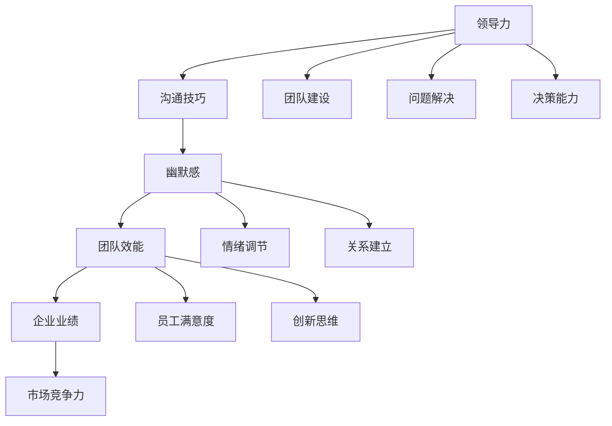

                 

### 摘要

在快节奏、竞争激烈的现代工作环境中，领导力与幽默感的重要性日益凸显。本文旨在探讨领导力与幽默感之间的紧密联系，以及如何在各种场合中巧妙运用幽默感来缓解紧张氛围。文章首先介绍了领导力的定义、类型及其在团队效能中的关键作用，并通过自我反思的方法帮助领导者提升个人领导力。接着，文章深入解析了幽默感的概念、类型及其在领导力中的重要作用，提供了培养幽默感的策略。随后，文章详细阐述了在沟通、会议和职场关系等不同场景中运用幽默感的技巧，包括如何避免幽默失误。最后，文章结合实际案例，展示了领导力与幽默感相结合的最佳实践，并总结了文章的核心内容。通过本文，读者可以深刻理解领导力与幽默感的重要性，学会如何运用幽默感来提升领导效能，创造一个更加和谐的工作环境。

### 目录大纲

#### 第一部分：领导力基础

**第1章：领导力的重要性**

1.1 领导力的定义与类型

- 领导力的基本定义
- 领导力的类型

1.2 领导力与团队效能

- 领导力如何提升团队效能
- 领导力对团队氛围的影响

1.3 领导者的自我反思

- 领导者的自我认知
- 自我反思的方法与技巧

#### 第二部分：幽默感的培养

**第2章：幽默感的定义与作用**

2.1 幽默感的定义

- 幽默感的概念
- 幽默感的类型

2.2 幽默感在领导力中的作用

- 缓解紧张氛围
- 提升团队凝聚力
- 促进创新思维

2.3 培养幽默感的策略

- 通过阅读和观影培养幽默感
- 通过实践提升幽默感
- 培养幽默感的心理技巧

#### 第三部分：缓解紧张氛围的技巧

**第3章：沟通中的幽默运用**

3.1 沟通中的幽默技巧

- 选择合适的幽默时机
- 使用幽默进行自我表达
- 幽默回应策略

3.2 避免沟通中的幽默失误

- 避免过度幽默
- 避免冒犯他人
- 处理幽默不当引发的尴尬

**第4章：会议中的幽默应用**

4.1 会议中的幽默技巧

- 轻松开场
- 增强参与感
- 调节情绪

4.2 避免会议中的幽默失误

- 避免无关话题
- 避免伤害他人
- 及时纠正幽默失误

**第5章：职场关系中的幽默运用**

5.1 职场关系中的幽默策略

- 建立良好的人际关系
- 提升职场氛围
- 避免职场中的冲突

5.2 避免职场幽默的负面效应

- 避免误解
- 避免过度依赖幽默
- 保持尊重

**第6章：特殊场合的幽默技巧**

6.1 演讲中的幽默运用

- 营造轻松氛围
- 提升演讲吸引力
- 增强说服力

6.2 社交场合的幽默策略

- 建立社交联系
- 增强社交互动
- 避免社交尴尬

**第7章：领导力与幽默感的结合**

7.1 领导力与幽默感的关系

- 幽默感在领导力中的作用
- 领导力对幽默感的影响

7.2 领导力与幽默感的实践

- 领导者如何运用幽默感
- 提升领导力中的幽默感
- 幽默感在领导力中的案例分析

#### 附录

- 附录A：幽默感的心理学原理
  - 幽默感的心理学基础
  - 幽默感的神经科学解释
  - 幽默感对情绪的影响
- 附录B：幽默感的实际应用案例
  - 企业中的幽默管理案例
  - 政治演讲中的幽默运用
  - 教育教学中的幽默策略
  - 个人生活中的幽默故事

### 第1章：领导力的重要性

领导力是任何组织成功的关键因素。它不仅关乎个人或团队的绩效，更关乎组织文化和氛围的建设。一个有效的领导者不仅能够指导团队实现目标，还能够通过自身的榜样作用和沟通技巧，激发团队成员的潜能，提升整个团队的凝聚力和协作能力。在本章中，我们将深入探讨领导力的定义与类型，分析领导力如何提升团队效能，以及领导者如何通过自我反思来提升自己的领导力。

#### 1.1 领导力的定义与类型

领导力是一个复杂且多维的概念，不同的学者和专家对领导力有不同的理解和定义。基本的定义是：领导力是指影响和引导他人以实现共同目标的能力。这种能力不仅仅是指导和管理，更包括激励、启发和赋能。以下是几种常见的领导力类型：

- **权威型领导**：权威型领导者通过明确的指令和严格的控制来管理团队。他们通常在需要快速决策和高度纪律性的环境中效果显著。
- **民主型领导**：民主型领导者鼓励团队成员参与决策过程，重视集体意见。这种领导风格有助于建立团队信任和协作，适合创新和多元化的工作环境。
- **变革型领导**：变革型领导者通过激励和启发团队成员，推动团队从现状走向更高的目标。他们往往具有强大的愿景和变革能力，能够在组织面临挑战时引领变革。
- **服务型领导**：服务型领导者关注团队成员的需求和福祉，通过服务和支持来促进团队的成功。他们以身作则，建立信任，培养团队合作精神。

#### 1.2 领导力与团队效能

领导力对团队效能有着直接而深远的影响。一个有效的领导者能够：

- **明确目标和方向**：通过设定清晰的愿景和目标，领导者能够指引团队朝正确的方向前进。
- **激励和鼓舞**：领导者通过激励和鼓舞，激发团队成员的工作热情和创造力，从而提升团队的整体表现。
- **建立信任**：信任是团队协作的基础。领导者通过公正和透明的管理方式，建立和维护团队成员之间的信任。
- **促进沟通**：良好的沟通技巧是领导者的重要素质。有效的沟通能够减少误解和冲突，提升团队的协同效率。
- **解决问题**：领导者需要具备解决复杂问题的能力，能够在团队遇到困难时提供指导和支持。

#### 1.3 领导力对团队氛围的影响

团队氛围对团队的效能有着重要的影响。一个积极、和谐的工作氛围能够提升团队成员的满意度和工作效率，而消极、紧张的氛围则可能阻碍团队的发展。领导力在营造积极团队氛围方面发挥着关键作用：

- **建立正面价值观**：领导者通过传递积极的价值观和信念，引导团队成员形成共同的目标和愿景。
- **鼓励合作和协作**：领导者通过鼓励团队成员之间的合作和协作，促进知识和经验的共享。
- **提供心理支持**：领导者通过关注团队成员的情感和心理状态，提供必要的支持和安慰。
- **解决冲突**：领导者需要具备处理团队内部冲突的能力，通过有效的沟通和调解，确保团队关系的和谐。

#### 1.4 领导者的自我反思

自我反思是领导者提升个人领导力的关键。通过自我反思，领导者能够：

- **识别自身优点和不足**：通过反思，领导者能够清楚地了解自己的优点和不足，从而有针对性地进行提升。
- **改进领导风格**：领导者通过反思，能够认识到自己在领导风格上的不足，并进行调整和改进。
- **提高自我认知**：自我反思有助于领导者提高自我认知，建立更强的自我意识和自我管理能力。

自我反思的方法包括定期回顾自己的行为和决策，寻求反馈和指导，以及不断学习和自我提升。

通过本章的探讨，我们可以看到领导力的重要性以及如何通过自我反思来提升领导力。在接下来的章节中，我们将深入探讨幽默感的定义、作用以及如何培养幽默感，帮助我们更好地运用幽默感来缓解紧张氛围，提升领导力。

### 第1章：领导力的重要性

#### 1.1.1 领导力的基本定义

领导力是一个复杂而多维的概念，它不仅仅指指导和管理的技能，更涉及到影响、启发和赋能他人。基本定义可以概括为：领导力是影响和引导他人以实现共同目标的能力。这种能力并不仅限于在组织中担任正式领导职位的人，而是每个成员都可能具备的一种潜能。有效领导力的核心要素包括以下几个方面：

1. **影响力**：领导者需要具备影响力，能够通过个人魅力、专业知识和行为榜样来影响团队成员的态度和行为。
2. **目标设定**：领导者应能够明确团队的目标，并设定具体的行动步骤，确保团队朝着共同的目标前进。
3. **沟通技巧**：良好的沟通技巧是领导力的关键组成部分。领导者需要能够清晰、有效地传达信息，并建立良好的沟通渠道。
4. **激励能力**：激励团队成员是领导者的重要职责。通过激发团队成员的内在动机，领导者能够提高团队成员的积极性和工作热情。
5. **团队建设**：领导者需要致力于建立积极的团队氛围，促进团队成员之间的协作和合作。

领导力的定义不仅仅停留在理论和概念层面，它还与实际操作紧密相关。例如，一个优秀的领导者不仅需要设定明确的目标，还要能够根据实际情况灵活调整策略，以确保团队目标的实现。

#### 1.1.2 领导力的类型

领导力并非一成不变，而是多样化的，可以根据不同的情境和需求展现出不同的风格和类型。以下是几种常见的领导力类型：

1. **权威型领导**：权威型领导者通过明确的指令和严格的控制来管理团队。他们通常在需要快速决策和高度纪律性的环境中效果显著。权威型领导的主要特点是决策快速、执行有力，但有时可能会限制团队成员的自主性和创造力。

2. **民主型领导**：民主型领导者鼓励团队成员参与决策过程，重视集体意见。这种领导风格有助于建立团队信任和协作，适合创新和多元化的工作环境。民主型领导的主要特点是开放、包容，鼓励团队成员提出建议和意见。

3. **变革型领导**：变革型领导者通过激励和启发团队成员，推动团队从现状走向更高的目标。他们往往具有强大的愿景和变革能力，能够在组织面临挑战时引领变革。变革型领导的主要特点是具有前瞻性、勇于挑战现状、能够激发团队成员的潜力。

4. **服务型领导**：服务型领导者关注团队成员的需求和福祉，通过服务和支持来促进团队的成功。他们以身作则，建立信任，培养团队合作精神。服务型领导的主要特点是关注团队成员的成长和发展，致力于建立和谐的工作环境。

不同类型的领导力在不同的情境下有其独特的优势和适用性。领导者需要根据具体情况进行选择和调整，以最大化领导效果。

#### 1.2 领导力如何提升团队效能

领导力在提升团队效能方面发挥着至关重要的作用。以下是领导力提升团队效能的几个关键方面：

1. **明确目标**：一个有效的领导者能够清晰地设定团队的目标，并确保每个团队成员都理解并认同这些目标。明确的目标有助于团队成员集中精力，统一行动，从而提高工作效率。

2. **激发潜力**：领导者通过激励和鼓舞，能够激发团队成员的内在动机，使其发挥出最大的潜力。这不仅可以提升个人绩效，还能提升整个团队的整体表现。

3. **促进协作**：领导力在促进团队成员之间的协作和合作方面至关重要。通过建立良好的沟通渠道和团队文化，领导者能够减少误解和冲突，提升团队的协同效率。

4. **解决问题**：面对挑战和困难时，领导者需要具备解决问题的能力。他们能够提供指导和支持，帮助团队成员克服困难，从而确保团队目标的实现。

5. **培养人才**：一个优秀的领导者致力于培养团队成员，提升其技能和知识水平。这不仅有助于团队当前的发展，也为团队的长期稳定提供了保障。

#### 1.3 领导力对团队氛围的影响

团队氛围对团队效能有着重要的影响。一个积极、和谐的工作氛围能够提升团队成员的满意度和工作效率，而消极、紧张的氛围则可能阻碍团队的发展。领导力在营造积极团队氛围方面发挥着关键作用：

1. **建立正面价值观**：领导者通过传递积极的价值观和信念，引导团队成员形成共同的目标和愿景。这有助于增强团队的凝聚力和归属感。

2. **鼓励合作和协作**：领导者通过鼓励团队成员之间的合作和协作，促进知识和经验的共享。这不仅可以提高团队的整体绩效，还能增强团队成员之间的信任和友谊。

3. **提供心理支持**：领导者需要关注团队成员的情感和心理状态，提供必要的支持和安慰。这有助于缓解工作压力，提升团队成员的满意度和工作效率。

4. **解决冲突**：领导者需要具备处理团队内部冲突的能力，通过有效的沟通和调解，确保团队关系的和谐。这有助于减少团队内部的紧张情绪，提升团队的整体氛围。

#### 1.4 领导者的自我反思

自我反思是领导者提升个人领导力的关键。通过自我反思，领导者能够：

1. **识别自身优点和不足**：领导者需要定期反思自己的行为和决策，识别自己的优点和不足，从而有针对性地进行提升。

2. **改进领导风格**：通过反思，领导者能够认识到自己在领导风格上的不足，并进行调整和改进，以更有效地管理团队。

3. **提高自我认知**：自我反思有助于领导者提高自我认知，建立更强的自我意识和自我管理能力。这不仅可以提升领导力，还可以增强个人的自信心和决策能力。

自我反思的方法包括定期回顾自己的行为和决策，寻求反馈和指导，以及不断学习和自我提升。通过自我反思，领导者能够不断提升自己的领导能力，为团队的长期发展奠定坚实的基础。

### 第2章：幽默感的定义与作用

幽默感是一种独特的能力，它不仅仅是逗人发笑的能力，更是一种能够通过轻松和诙谐的方式缓解紧张氛围、增强人际关系和提升团队凝聚力的艺术。在本章中，我们将深入探讨幽默感的定义、类型及其在领导力中的重要作用，并探讨如何通过培养幽默感来提升个人魅力和领导力。

#### 2.1 幽默感的定义

幽默感是指一个人能够以诙谐、幽默的方式处理日常生活压力和挑战的能力。幽默感不仅是一种情感表达，更是一种社交技能。它包括对幽默的感知、理解和创造能力。以下是幽默感的一些基本特征：

- **情感表达**：幽默感能够通过笑声和轻松的交流方式，表达个人的情感和情绪，从而缓解紧张和压力。
- **情境适应性**：幽默感是一种情境适应性强的能力，它能够根据不同的社交环境和人际关系，灵活地运用幽默技巧。
- **自我调节**：具备幽默感的人通常能够更好地调节自己的情绪，保持乐观和积极的心态。
- **社交润滑**：幽默感有助于减少社交中的尴尬和紧张，增强人际关系的和谐。

#### 2.2 幽默感的类型

幽默感有多种不同的类型，每种类型都有其独特的表现形式和适用场景。以下是几种常见的幽默感类型：

1. **文字幽默**：通过巧妙的语言和词汇使用，创造出有趣和幽默的效果。例如，双关语、俚语和笑话都是文字幽默的例子。
2. **行为幽默**：通过夸张的动作、表情或姿态来逗乐他人。这种行为幽默通常需要良好的表演能力。
3. **情境幽默**：通过巧妙地利用当前情境或事件，创造出幽默的效果。这种幽默通常需要观察力和创造力。
4. **内向幽默**：这种幽默较为低调，通常通过私下或小范围的交流来传达，不适合公开场合。
5. **外向幽默**：这种幽默较为大胆和直接，适合在公共场合或大团体中运用。

不同的幽默感类型在不同的情境下有其独特的应用价值。了解和掌握多种幽默感类型，有助于领导者更灵活地应对各种社交和职业挑战。

#### 2.3 幽默感在领导力中的作用

幽默感在领导力中扮演着重要的角色，它不仅能够提升领导者的个人魅力，还能够有效缓解紧张氛围、增强团队凝聚力和促进创新思维。以下是幽默感在领导力中的几个重要作用：

1. **缓解紧张氛围**：在紧张的工作环境中，领导者适时的幽默感能够缓解团队成员的紧张情绪，营造轻松、愉快的氛围。这种氛围有助于团队成员更好地投入工作，提高工作效率。
2. **增强团队凝聚力**：幽默感能够促进团队成员之间的交流和互动，增强团队凝聚力。通过幽默的交流，团队成员更容易建立信任和友谊，形成紧密的团队关系。
3. **促进创新思维**：幽默感能够激发团队成员的创造力和想象力。在轻松的氛围中，团队成员更容易提出新颖的观点和创新的解决方案，从而推动团队的发展和进步。
4. **提升个人魅力**：具备幽默感的领导者通常更具吸引力和魅力，能够更好地影响和激励团队成员。这种个人魅力有助于领导者赢得团队成员的尊重和支持，提升领导力的有效性。

#### 2.4 培养幽默感的策略

培养幽默感需要系统的努力和实践。以下是几种有效的培养幽默感的策略：

1. **多读书、看电影**：通过阅读幽默书籍和观看幽默电影，可以学习和借鉴各种幽默技巧和风格。这有助于提升自己对幽默的感知和创造能力。
2. **多交流、多练习**：与朋友和家人进行轻松的交流，练习自己的幽默技巧。通过不断练习，可以提升自己的幽默表达能力和情境适应性。
3. **培养乐观心态**：乐观的心态有助于发现生活中的幽默元素，提升自己的幽默感。一个乐观的领导者更容易在工作和生活中发现乐趣，创造幽默。
4. **学习幽默技巧**：可以参加幽默培训课程或研讨会，学习各种幽默技巧和策略。这有助于提升自己的幽默水平和应用能力。

通过培养幽默感，领导者不仅能够提升自己的个人魅力和领导力，还能够创造一个更加和谐、积极的工作环境。在接下来的章节中，我们将深入探讨如何在具体场景中运用幽默感，进一步缓解紧张氛围、提升团队效能。

### 第2章：幽默感的定义与作用

#### 2.1.1 幽默感的概念

幽默感是一种心理和社交能力，它涉及对幽默的感知、理解、创造和享受。幽默感不仅是一种娱乐方式，更是一种沟通工具，能够通过轻松、诙谐的方式来处理日常生活中的各种压力和挑战。具体来说，幽默感包括以下几个方面：

- **心理调节**：幽默感有助于缓解情绪压力，通过笑声和轻松的氛围，减轻心理负担。
- **社交润滑**：幽默感能够打破社交中的尴尬和紧张，促进人际关系的和谐。
- **情境适应**：幽默感具有很强的情境适应性，能够在不同的社交环境中灵活运用，以达到最佳效果。
- **创造力激发**：幽默感能够激发人的创造力和想象力，促进创新思维。
- **情感共鸣**：通过幽默，人们能够更好地分享情感，建立共鸣，增强社交联系。

#### 2.1.2 幽默感的类型

幽默感有多种不同的类型，每种类型都有其独特的表现形式和适用场景。以下是几种常见的幽默感类型：

1. **文字幽默**：通过巧妙的语言和词汇使用，创造出有趣和幽默的效果。这种幽默常见于笑话、双关语和讽刺等。
2. **行为幽默**：通过夸张的动作、表情或姿态来逗乐他人。这种幽默通常需要良好的表演能力，例如喜剧演员的表演。
3. **情境幽默**：通过巧妙地利用当前情境或事件，创造出幽默的效果。这种幽默需要观察力和创造力，例如即兴喜剧。
4. **内向幽默**：这种幽默较为低调，通常通过私下或小范围的交流来传达，不适宜公开场合。
5. **外向幽默**：这种幽默较为大胆和直接，适合在公共场合或大团体中运用。

不同的幽默感类型在不同的情境下有其独特的应用价值。了解和掌握多种幽默感类型，有助于领导者更灵活地应对各种社交和职业挑战。

#### 2.2 幽默感在领导力中的作用

幽默感在领导力中发挥着重要作用，它不仅能够提升领导者的个人魅力，还能够有效缓解紧张氛围、增强团队凝聚力和促进创新思维。以下是幽默感在领导力中的几个重要作用：

1. **缓解紧张氛围**：在紧张的工作环境中，领导者适时的幽默感能够缓解团队成员的紧张情绪，营造轻松、愉快的氛围。这种氛围有助于团队成员更好地投入工作，提高工作效率。
2. **增强团队凝聚力**：幽默感能够促进团队成员之间的交流和互动，增强团队凝聚力。通过幽默的交流，团队成员更容易建立信任和友谊，形成紧密的团队关系。
3. **促进创新思维**：幽默感能够激发团队成员的创造力和想象力。在轻松的氛围中，团队成员更容易提出新颖的观点和创新的解决方案，从而推动团队的发展和进步。
4. **提升个人魅力**：具备幽默感的领导者通常更具吸引力和魅力，能够更好地影响和激励团队成员。这种个人魅力有助于领导者赢得团队成员的尊重和支持，提升领导力的有效性。

#### 2.3 培养幽默感的策略

培养幽默感需要系统的努力和实践。以下是几种有效的培养幽默感的策略：

1. **多读书、看电影**：通过阅读幽默书籍和观看幽默电影，可以学习和借鉴各种幽默技巧和风格。这有助于提升自己对幽默的感知和创造能力。
2. **多交流、多练习**：与朋友和家人进行轻松的交流，练习自己的幽默技巧。通过不断练习，可以提升自己的幽默表达能力和情境适应性。
3. **培养乐观心态**：乐观的心态有助于发现生活中的幽默元素，提升自己的幽默感。一个乐观的领导者更容易在工作和生活中发现乐趣，创造幽默。
4. **学习幽默技巧**：可以参加幽默培训课程或研讨会，学习各种幽默技巧和策略。这有助于提升自己的幽默水平和应用能力。

通过培养幽默感，领导者不仅能够提升自己的个人魅力和领导力，还能够创造一个更加和谐、积极的工作环境。在接下来的章节中，我们将深入探讨如何在具体场景中运用幽默感，进一步缓解紧张氛围、提升团队效能。

### 第2章：幽默感的定义与作用

#### 2.2.1 幽默感在领导力中的作用

幽默感在领导力中扮演着独特的角色，它不仅能够提升领导者的个人魅力，还能够有效地缓解紧张氛围、增强团队凝聚力和促进创新思维。以下是幽默感在领导力中的具体作用：

1. **缓解紧张氛围**：在紧张的工作环境中，领导者适时的幽默感能够缓解团队成员的紧张情绪，创造一个轻松、愉快的氛围。这种氛围有助于团队成员更好地投入工作，提高工作效率。例如，当团队面临压力和挑战时，领导者可以通过讲一个轻松的笑话或分享一个有趣的经历，迅速缓解团队的紧张情绪，使团队成员重新集中注意力。

2. **增强团队凝聚力**：幽默感能够促进团队成员之间的交流和互动，增强团队凝聚力。通过幽默的交流，团队成员更容易建立信任和友谊，形成紧密的团队关系。例如，在团队会议中，领导者可以适时引入一些幽默元素，让团队成员在轻松的氛围中更愿意分享自己的观点和想法，从而增强团队的协作精神。

3. **促进创新思维**：幽默感能够激发团队成员的创造力和想象力，促进创新思维。在轻松的氛围中，团队成员更容易突破传统思维的束缚，提出新颖的观点和创新的解决方案。例如，在头脑风暴会议上，领导者可以通过幽默的引导，鼓励团队成员跳出常规思维，以创造性的方式探索问题解决方案。

4. **提升个人魅力**：具备幽默感的领导者通常更具吸引力和魅力，能够更好地影响和激励团队成员。这种个人魅力有助于领导者赢得团队成员的尊重和支持，提升领导力的有效性。例如，在团队建设活动中，领导者可以通过幽默的互动，与团队成员建立良好的关系，增强团队的凝聚力和合作精神。

#### 2.2.2 缓解紧张氛围

幽默感在缓解紧张氛围方面具有显著的优势。以下是几种具体的方法：

1. **讲笑话**：在适当的时机，领导者可以通过讲一个轻松的笑话来缓解紧张氛围。这不仅能让自己显得更加亲切和友善，还能让团队成员放松心情，更好地投入工作。
2. **自我解嘲**：领导者可以通过自我解嘲来化解紧张局势。当遇到尴尬或错误时，领导者可以以幽默的方式承认错误，这样不仅能够缓解尴尬，还能赢得团队成员的理解和尊重。
3. **使用比喻和隐喻**：领导者可以通过使用比喻和隐喻来传达复杂的信息，同时创造轻松的氛围。这种方法不仅能够使信息更容易理解，还能增加趣味性，使团队成员更愿意接受。
4. **组织轻松活动**：领导者可以组织一些轻松的团队活动，如游戏、茶话会或户外拓展训练，这些活动能够帮助团队成员放松心情，增强团队凝聚力。

#### 2.2.3 提升团队凝聚力

幽默感在提升团队凝聚力方面具有重要作用。以下是几种具体的方法：

1. **共享幽默经历**：领导者可以与团队成员分享一些有趣的个人经历或团队故事，这些故事能够增进团队成员之间的了解，建立信任和友谊。
2. **组织团队建设活动**：通过组织一些有趣的团队建设活动，如团队游戏、运动会或集体旅行，领导者可以增强团队成员之间的互动，提升团队的凝聚力。
3. **鼓励幽默表达**：领导者可以鼓励团队成员在适当的时候使用幽默来表达自己，这样不仅能够缓解紧张氛围，还能增强团队的协作精神。
4. **认可幽默贡献**：领导者可以认可团队成员在幽默交流中的贡献，这不仅能够激励团队成员积极参与，还能提升团队的凝聚力。

通过运用幽默感，领导者可以有效地缓解紧张氛围，增强团队凝聚力，提升个人魅力，从而更好地发挥领导力，推动团队的发展。

#### 2.2.4 促进创新思维

幽默感在促进创新思维方面具有独特的作用。以下是几种具体的方法：

1. **打破常规思维**：幽默感能够打破常规思维模式，帮助团队成员跳出思维定势，以全新的视角看待问题。例如，通过幽默的比喻或隐喻，领导者可以引导团队成员从不同的角度思考问题，激发创新的灵感。
2. **鼓励开放性思维**：幽默氛围有助于营造一个开放、包容的讨论环境，使团队成员更愿意分享自己的想法和观点。这种开放性思维有助于碰撞出新的创意和灵感。
3. **激发想象力**：幽默感能够激发团队成员的想象力，使他们在轻松的氛围中更愿意尝试新颖的想法和解决方案。例如，通过幽默的引导，领导者可以鼓励团队成员想象一个理想的工作环境或创新的产品设计，从而激发他们的创造力。
4. **鼓励团队合作**：幽默感能够促进团队成员之间的合作和互动，使他们在轻松的氛围中共同探讨问题，共同创造解决方案。这种团队合作精神有助于提升团队的创新能力和竞争力。

通过运用幽默感，领导者可以有效地促进创新思维，激发团队成员的创造力和想象力，推动团队的发展和进步。

### 第2章：幽默感的定义与作用

#### 2.3 培养幽默感的策略

幽默感是一种可以通过练习和培养来提升的能力。以下是几种有效的策略，帮助领导者培养和提升幽默感：

1. **多读书、看电影**：通过阅读幽默书籍和观看幽默电影，可以学习和借鉴各种幽默技巧和风格。这有助于提升自己对幽默的感知和创造能力。例如，可以阅读一些经典的幽默文学作品，如马克·吐温的《汤姆·索亚历险记》，或观看一些经典的喜剧电影，如《喜剧之王》。

2. **多交流、多练习**：与朋友和家人进行轻松的交流，练习自己的幽默技巧。通过不断练习，可以提升自己的幽默表达能力和情境适应性。例如，可以参加一些朋友聚会或社交活动，尝试在交流中运用幽默，观察他人的反应，从中学习。

3. **培养乐观心态**：乐观的心态有助于发现生活中的幽默元素，提升自己的幽默感。一个乐观的领导者更容易在工作和生活中发现乐趣，创造幽默。例如，当遇到挫折时，领导者可以尝试用幽默的方式来化解负面情绪，从而保持积极的心态。

4. **学习幽默技巧**：可以参加幽默培训课程或研讨会，学习各种幽默技巧和策略。这有助于提升自己的幽默水平和应用能力。例如，可以参加一些幽默表达课程，学习如何运用比喻、夸张和双关语等技巧来创造幽默效果。

5. **观察和模仿**：观察他人的幽默表达，并尝试模仿。通过模仿他人的幽默方式，可以学习到不同的幽默技巧和风格，从而丰富自己的幽默表达能力。例如，可以观察喜剧演员的表演，学习他们如何运用幽默技巧来吸引观众。

通过以上策略，领导者可以逐渐培养和提升自己的幽默感，从而在工作和生活中更好地运用幽默，缓解紧张氛围，增强人际关系，提升团队凝聚力和创新思维。

### 第3章：沟通中的幽默运用

在沟通中运用幽默是一种有效的技巧，它不仅能够缓解紧张氛围，还能够提升沟通效果，增强人际关系。然而，幽默的运用需要谨慎，避免过度或不当使用导致负面效果。本章将详细探讨沟通中的幽默技巧，包括如何选择合适的幽默时机、如何使用幽默进行自我表达以及如何巧妙地回应他人的幽默。

#### 3.1.1 选择合适的幽默时机

选择合适的幽默时机是幽默运用的关键。以下是一些指导原则：

- **了解情境**：在正式的会议或讨论中，幽默可能不太合适。而在休闲的社交场合或轻松的工作氛围中，幽默更容易被接受。
- **考虑听众**：不同的人对幽默的反应不同。了解听众的幽默偏好和文化背景，选择适合他们口味的幽默。
- **观察反应**：在幽默之前，先观察听众的反应。如果他们看起来不感兴趣或紧张，可能不是使用幽默的最佳时机。
- **把握节奏**：避免在紧张或严肃的气氛中使用幽默，因为这可能会加剧紧张感。在适当的过渡时刻，如讨论中的休息时间或紧张议题后的放松时刻，使用幽默更能起到缓解效果。

#### 3.1.2 使用幽默进行自我表达

在自我表达中使用幽默，可以增强个人的亲和力和影响力。以下是几种方法：

- **自嘲**：通过自嘲，领导者可以展示自己的谦虚和自信，拉近与团队成员的距离。例如，可以开自己的玩笑，但要注意不要过分或伤害他人。
- **打趣**：适当地打趣可以帮助领导者缓解紧张情绪，创造轻松的氛围。例如，可以用夸张的语言描述一个有趣的经历或现状，引发听众的共鸣和笑声。
- **调侃**：在团队内部，适度的调侃可以增强团队的凝聚力。但要注意，调侃要避免攻击性，确保在轻松的氛围中进行。

#### 3.1.3 幽默回应策略

在回应他人的幽默时，领导者需要巧妙运用幽默，以提升互动效果。以下是几种策略：

- **配合**：当团队成员幽默时，领导者可以通过配合和回应，增加互动的乐趣。例如，可以模仿对方的幽默方式，或用类似的幽默回应。
- **夸张**：通过夸张对方的幽默，领导者可以增强幽默效果。例如，可以夸大对方的笑话，使幽默更加引人发笑。
- **反转**：用反转的方式回应幽默，可以带来意想不到的乐趣。例如，可以改变对方的幽默角度，从一个新的视角进行解读。
- **适当沉默**：有时，适当的沉默比回应更能传达幽默。领导者可以通过保持沉默，让听众自己体会幽默，从而增加幽默的回味。

#### 3.2 避免沟通中的幽默失误

尽管幽默在沟通中具有积极作用，但不当使用幽默可能会导致负面效果。以下是一些需要避免的幽默失误：

- **过度幽默**：过度使用幽默可能会让听众感到疲惫或厌烦。应确保幽默适度，避免频繁使用。
- **冒犯他人**：幽默不当可能会无意中冒犯他人，引发不满和冲突。应避免涉及敏感话题或针对特定个体的幽默。
- **情境不适**：在不适当的情境中使用幽默可能会加剧紧张氛围或引起误解。应确保幽默与当前情境相符合。

#### 3.3 处理幽默不当引发的尴尬

尽管小心翼翼，幽默仍可能引发尴尬。以下是一些处理尴尬的策略：

- **轻松化解**：用轻松的语言化解尴尬，可以缓解紧张的气氛。例如，可以开玩笑说“看来我的幽默技巧还需要再磨练”。
- **转移话题**：如果幽默引发了尴尬，可以迅速转移话题，避免尴尬继续扩大。
- **自我解嘲**：通过自嘲，领导者可以化解尴尬，展示自己的风度和自信。例如，可以说“看来我刚才的笑话不太合适，我们来谈谈更重要的事情吧”。

通过有效运用幽默技巧，领导者可以在沟通中创造轻松、愉快的氛围，增强人际关系，提升沟通效果。同时，领导者应谨慎运用幽默，避免不必要的失误，确保幽默发挥其正面作用。

### 第4章：会议中的幽默应用

在会议中运用幽默是一种有效的策略，它不仅能够缓解紧张的气氛，还能提升团队的参与度和会议的整体效果。然而，会议中的幽默应用需要谨慎，以确保不偏离会议主题，不伤害他人，同时达到预期的效果。本章将探讨会议中的幽默技巧，包括如何轻松开场、增强参与感以及调节情绪，并提供一些避免幽默失误的建议。

#### 4.1.1 轻松开场

会议开始时的氛围往往决定了整个会议的基调。一个轻松的开场能够迅速拉近与会者之间的距离，减少紧张情绪。以下是一些轻松开场的技巧：

- **使用幽默开场白**：领导者可以运用一个简单的笑话或趣闻来开场，例如，可以讲述一个与会议主题相关的有趣故事。这种方式不仅能够吸引听众的注意力，还能让团队成员感到放松。
- **引用名人名言**：引用一些名人名言，特别是那些幽默或诙谐的名言，可以创造一个轻松的会议氛围。例如，可以使用查理·卓别林的名言：“人生就像一盒巧克力，你永远不知道下一颗是什么口味。”
- **分享个人趣事**：领导者可以分享一些个人的小趣事，特别是那些与会议主题相关的内容。这种方式能够展示领导者的亲和力，同时也能让团队成员感到更加亲近。

#### 4.1.2 增强参与感

增强团队成员的参与感是会议成功的关键。通过幽默的互动，领导者可以激发团队成员的积极性和参与度。以下是一些增强参与感的技巧：

- **鼓励互动**：领导者可以适时提出一些开放式问题，邀请团队成员分享自己的观点和想法。例如，可以说：“我们今天的目标是解决这个难题，你们有什么好的建议吗？”
- **使用幽默来引导讨论**：领导者可以使用幽默来引导讨论，使讨论更加生动和有趣。例如，可以运用比喻或夸张的描述来描述一个问题，引发团队成员的思考和讨论。
- **组织幽默活动**：在适当的时候，可以组织一些幽默活动，如小型的互动游戏或趣味问答。这种方式不仅能够提升会议的趣味性，还能增强团队成员之间的互动和沟通。

#### 4.1.3 调节情绪

会议中难免会有紧张的时刻，适当的幽默可以有效地调节情绪，缓解紧张气氛。以下是一些调节情绪的技巧：

- **运用自嘲**：领导者可以通过自嘲来缓解紧张气氛。例如，当遇到一些小错误时，可以幽默地承认自己的失误，并引发现场笑声。
- **分享幽默经历**：领导者可以分享一些有趣的个人经历或团队故事，这些故事不仅能够引发笑声，还能增强团队的凝聚力。
- **适时引入轻松话题**：在会议中，领导者可以适时引入一些轻松话题，如最近发生的有趣新闻或生活中的小趣事，从而缓解紧张情绪。

#### 4.2.1 避免无关话题

在会议中，幽默虽然能够创造轻松氛围，但应避免偏离会议主题，以免影响会议效率。以下是一些避免无关话题的技巧：

- **控制话题范围**：领导者应明确会议的主题和议程，确保幽默内容与会议主题相关。例如，可以在讨论项目进展时，适当引入一些与项目相关的幽默元素。
- **提醒团队成员**：如果发现幽默内容开始偏离会议主题，领导者可以适时提醒团队成员回到会议正题。例如，可以开玩笑说：“我们是不是该把注意力集中到这个重要议题上？”
- **及时引导**：在会议中，如果幽默内容引起不必要的讨论或分散注意力，领导者应迅速引导讨论回到正轨。例如，可以提出一个与主题相关的问题，引导团队成员继续讨论。

#### 4.2.2 避免伤害他人

在会议中运用幽默时，应避免伤害他人的感情。以下是一些避免伤害他人的技巧：

- **避免针对性幽默**：领导者应避免使用针对性幽默，特别是那些可能会冒犯特定个体的笑话。例如，不要使用关于种族、性别或宗教的笑话。
- **敏感话题慎用幽默**：在涉及敏感话题时，应谨慎使用幽默，以免引发误解或不满。例如，在讨论薪资问题时，避免使用可能导致尴尬或不满的幽默。
- **尊重文化差异**：不同的文化对幽默有不同的接受程度。领导者应了解团队成员的文化背景，避免使用可能不被接受的幽默方式。

#### 4.2.3 及时纠正幽默失误

尽管小心谨慎，幽默失误仍可能发生。以下是一些及时纠正幽默失误的技巧：

- **转移焦点**：如果幽默失误引发了尴尬，领导者可以迅速转移焦点，避免尴尬继续扩大。例如，可以转移话题或提出新的议题。
- **自我解嘲**：领导者可以通过自嘲来化解尴尬。例如，可以幽默地说：“看来我今天的幽默技巧有点过了。”
- **道歉并继续**：如果幽默失误确实伤害到了他人，领导者应诚恳道歉，并继续会议的进行。例如，可以说：“如果我的幽默让你感到不舒服，我很抱歉，我们继续讨论接下来的议题。”

通过运用这些技巧，领导者可以在会议中创造一个轻松、愉快的氛围，提升团队的参与度和会议效果，同时避免不必要的尴尬和冲突。

### 第5章：职场关系中的幽默运用

在职场中，幽默感是一种宝贵的沟通工具，能够有效地缓解紧张氛围，增强人际关系，提升工作效率。然而，幽默在职场中的运用需要谨慎，以确保其正面效果，并避免造成误解或冲突。本章将探讨职场关系中的幽默策略，包括如何建立良好的人际关系、提升职场氛围以及避免职场幽默的负面效应。

#### 5.1.1 建立良好的人际关系

幽默感在建立职场人际关系方面具有重要作用。以下是几种策略：

- **分享趣事**：与同事分享一些个人的趣事或幽默经历，可以帮助拉近彼此的距离。例如，可以在午餐时间与同事分享一个有趣的笑话或最近发生的趣闻。
- **开诚布公**：在适当的时候，可以开诚布公地使用幽默来打破僵局，建立信任。例如，在一个紧张的团队会议中，可以用一个幽默的比喻来解释复杂的问题，使会议氛围更加轻松。
- **关注他人**：在人际交往中，关注他人的兴趣和幽默感，并适时使用幽默来回应，可以增强彼此的互动和信任。例如，在了解一个同事的兴趣后，可以在适当的时候用相关的幽默来引起共鸣。

#### 5.1.2 提升职场氛围

一个轻松愉快的职场氛围有助于提升员工的工作满意度和生产力。以下是几种提升职场氛围的幽默策略：

- **组织团队活动**：定期组织一些有趣的团队活动，如团队建设游戏或庆祝活动，可以增强团队凝聚力，营造积极的职场氛围。例如，可以组织一次户外拓展训练，让团队成员在轻松的环境中相互了解和协作。
- **鼓励团队交流**：鼓励团队成员在工作和休息时间进行轻松交流，可以增强团队的默契和友谊。例如，可以组织定期的茶话会，让团队成员分享工作心得和生活趣事。
- **适时的幽默**：在适当的场合，领导者或同事可以适时使用幽默来缓解工作压力，创造轻松的氛围。例如，在完成一个重要的项目后，可以用一个轻松的笑话来庆祝，提升团队的士气。

#### 5.1.3 避免职场中的冲突

尽管幽默可以缓解紧张氛围，但不当的幽默可能会引发冲突。以下是几种避免职场冲突的幽默策略：

- **避免过度幽默**：过度使用幽默可能会让同事感到厌烦或压力增大。应确保幽默适度，避免频繁使用。
- **考虑文化差异**：不同的文化和背景对幽默的接受程度不同。在跨文化团队合作中，应特别注意避免使用可能不被接受的幽默方式。
- **避免攻击性幽默**：攻击性幽默可能会伤害他人，应避免使用。例如，不要用嘲笑或讽刺的方式来表达观点。

#### 5.2.1 避免误解

在职场中，幽默不当可能会导致误解，影响工作关系。以下是几种避免误解的幽默策略：

- **明确意图**：在运用幽默时，应确保同事理解你的意图。可以通过语调和表情来传达幽默的轻松氛围，避免产生误解。
- **征求反馈**：在使用幽默前，可以征求同事的意见，确保他们能够接受。例如，可以说：“这个笑话可能有点幽默，你觉得怎么样？”
- **避免敏感话题**：在职场中，涉及性别、种族、宗教等敏感话题的幽默容易引起误解和冲突。应避免使用这些话题的幽默。

#### 5.2.2 避免过度依赖幽默

过度依赖幽默可能会导致一些负面影响。以下是几种避免过度依赖幽默的策略：

- **平衡幽默与工作**：确保幽默与工作内容保持平衡，避免因过度使用幽默而分散工作注意力。例如，可以在工作间隙使用幽默，但不要影响工作进度和质量。
- **多样化沟通方式**：除了幽默，还可以使用其他沟通方式，如积极的语言、图表或演示，来传达信息。这样可以避免过度依赖幽默，使沟通更加有效。
- **提高自我意识**：了解自己的幽默风格和接受度，避免在不适当的场合使用幽默。例如，如果知道某个同事不太喜欢幽默，应尽量避免在这些场合使用。

#### 5.2.3 保持尊重

在职场中，尊重是建立良好人际关系的基础。以下是几种保持尊重的幽默策略：

- **避免贬低他人**：幽默应避免贬低他人，尤其是同事或领导。应使用正面、鼓励性的幽默方式，增强团队的凝聚力和信任。
- **文化敏感性**：在跨文化环境中，应特别注意幽默的文化敏感性，避免使用可能冒犯他人的幽默方式。
- **自我反思**：在使用幽默时，应反思自己的行为是否尊重他人，确保幽默不会伤害他人的感情。

通过以上策略，职场中的幽默可以成为建立良好人际关系、提升工作氛围的有效工具，同时避免不必要的误解和冲突，创造一个和谐、积极的工作环境。

### 第6章：特殊场合的幽默技巧

在特定的社交场合中，如演讲、聚会或社交活动，幽默感能够起到重要的作用，它不仅能够打破僵局，缓解紧张，还能增强参与感和吸引力。本章将探讨在演讲中的幽默运用和社交场合的幽默策略，并提供一些避免社交尴尬的建议。

#### 6.1 演讲中的幽默运用

演讲是领导者或专业人士展示自己观点和传达信息的重要场合。适时的幽默运用能够增强演讲的吸引力和说服力，以下是一些演讲中的幽默技巧：

1. **开场幽默**：演讲的开场幽默是吸引听众注意力的重要环节。可以使用一个有趣的笑话、故事或比喻来开场，例如，可以讲述一个与演讲主题相关的小故事，以此吸引听众的注意力。

   ```plaintext
   前几天，我参加了一个关于创新思维的会议，会上有一个演讲者讲了一个关于咖啡和创意的趣事。他说，喝咖啡不仅能让头脑清醒，还能激发创意。于是，他突发奇想，决定尝试在咖啡里加入各种调料，结果发明了一种新的咖啡口味——巧克力酱咖啡。我问大家，如果尝了这个新口味，你们会怎么评价？是“甜死人了”，还是“创意十足”呢？
   ```

2. **比喻和隐喻**：在演讲中，使用比喻和隐喻可以使复杂的信息更加生动和易懂。通过比喻，可以将抽象的概念具体化，使听众更容易理解和记忆。

   ```plaintext
   我们在做项目时，就像是在攀登一座高山。有时候，我们会遇到陡峭的悬崖，需要绕道而行；有时候，我们会遇到平坦的路面，可以一路畅通。但不管遇到什么困难，我们都要坚持不懈，一步一个脚印地向前走。
   ```

3. **自我解嘲**：在演讲中，适度的自我解嘲能够展示领导者的自信和幽默感，拉近与听众的距离。

   ```plaintext
   今天我站在这里，有些紧张，因为我从小就梦想成为一个演员，而不是一个演讲者。不过，我相信，只要大家愿意，我一定能够把这次演讲变得有趣和有意义。
   ```

#### 6.1.2 提升演讲吸引力

幽默感能够提升演讲的吸引力，使听众更加投入和感兴趣。以下是一些提升演讲吸引力的幽默策略：

1. **互动幽默**：通过提问或邀请听众参与，使演讲更加互动和有趣。

   ```plaintext
   想知道我在这个行业工作了多久吗？这么说吧，我年纪大了，已经不需要告诉你们我的年龄了。不过，我可以告诉你们一个秘密，我是和互联网一起长大的。所以，我对这个领域有着深厚的理解和感情。
   ```

2. **趣闻轶事**：分享一些与演讲主题相关的趣闻轶事，可以增加演讲的趣味性和吸引力。

   ```plaintext
   有一年，我参加了一个关于技术创新的会议，会议上一个演讲者讲述了一个有趣的案例。他说，他们公司曾经开发了一款新的软件，但用户使用后反馈很差。他们调查后发现，原来是软件的一个功能被误设成了“自动跳过”，用户根本没机会体验到它的其他功能。这个案例让我深刻认识到，技术创新不仅要考虑技术本身，还要关注用户的需求。
   ```

3. **适当夸张**：通过适当的夸张，使演讲内容更加生动和有趣。

   ```plaintext
   假如有一天，我们能够实现全息投影技术，那么我们可以把整个地球变成一个巨大的游乐场。想象一下，我们在家里就能看到大海、雪山和森林，甚至可以和远方的朋友在虚拟空间中见面。这将会是一个多么奇妙的世界！
   ```

#### 6.1.3 增强说服力

幽默感不仅能够提升演讲的吸引力，还能增强演讲的说服力。以下是一些增强说服力的幽默策略：

1. **对比幽默**：通过对比幽默，使观点更加突出和有说服力。

   ```plaintext
   我们都知道，拖延是一种常见的现象。有些人喜欢把事情留到最后一刻，而有些人则喜欢提前做好一切准备。我就属于后者，因为如果我提前完成任务，剩下的时间就可以用来享受生活。不过，有时候我不得不承认，拖延也有它的好处，因为它能让我在紧张和压力中保持清醒。
   ```

2. **幽默论证**：通过幽默的论证方式，使观点更加生动和有说服力。

   ```plaintext
   有时候，我们会被一些看似复杂的问题困扰。其实，解决这些问题并不需要复杂的理论，只需要一点幽默感。就像有一次，我朋友遇到了一个数学难题，他想了半天也没想出来。最后，我告诉他，这个问题其实很简单，只需要把它当成一个笑话来看待，问题自然就解决了。
   ```

3. **情感共鸣**：通过幽默，引起听众的情感共鸣，从而增强演讲的说服力。

   ```plaintext
   我们都曾经经历过那些令人沮丧的时刻，比如，当你满怀期待地准备一个演讲，结果却忘记了讲稿。我曾经也有过这样的经历，当我上台时，我突然发现我的讲稿不见了。不过，我告诉自己，没关系，我可以把整个演讲重新讲一遍。最后，我不仅完成了演讲，还收获了满满的笑声和掌声。
   ```

#### 6.2 社交场合的幽默策略

在社交场合中，幽默感能够促进人际交流，增强互动和联系。以下是一些社交场合的幽默策略：

1. **话题引导**：通过幽默的话题引导，使社交场合更加轻松和愉快。

   ```plaintext
   你知道吗，我有一个神奇的治愈方法，可以治愈所有的烦恼。那就是，告诉别人你的烦恼。每次我遇到困难，我都会去找朋友聊天，把烦恼说出来。神奇的是，一旦我说出来，烦恼就似乎变得不那么麻烦了。所以，如果你有什么烦恼，不妨告诉我，我保证我会是一个很好的听众。
   ```

2. **互动幽默**：在社交活动中，通过互动幽默，增强参与感和互动性。

   ```plaintext
   我想大家一定都有过这样的经历，有时候，我们可能会碰到一些特别有趣的人，他们的言行举止总是能让我们捧腹大笑。我上次参加一个聚会，就遇到了一个这样的人。他不仅幽默风趣，还能在短时间内记住所有人的名字，简直是社交达人。你们想不想学习他的技巧呢？
   ```

3. **即兴幽默**：在社交场合中，即兴幽默能够展示个人的灵活性和幽默感。

   ```plaintext
   刚才我们在讨论旅行的话题，我有一个即兴的想法。如果有一天，我们可以去一个没有手机信号、没有互联网的岛屿旅行，那会是多么有趣的一件事情！我们可以尽情享受大自然的美好，不再被社交媒体打扰。不过，我得说，这样的旅行可能会让我错过很多有趣的照片分享。
   ```

#### 6.3 避免社交尴尬

在社交场合中，幽默虽然能够缓解紧张，但不当的幽默可能会引发尴尬。以下是一些避免社交尴尬的建议：

1. **了解场合**：在社交场合中，要了解不同的文化背景和社交规则，避免使用不当的幽默。

   ```plaintext
   在不同的社交场合，幽默的使用方式会有所不同。在正式的商务场合，我们应该避免使用过于随意或幽默的语句，以免显得不专业。而在朋友聚会上，我们可以更加放松地使用幽默，营造轻松的氛围。
   ```

2. **考虑他人感受**：在运用幽默时，要考虑他人的感受，避免涉及敏感话题或攻击性幽默。

   ```plaintext
   社交场合中的幽默，应该更多地关注他人的感受。例如，不要在讨论薪资问题时开玩笑，因为这可能会让其他人感到不舒服。同样，避免使用关于种族、性别或宗教的幽默，以免冒犯他人。
   ```

3. **及时调整**：如果幽默引发了尴尬，应迅速调整话题或幽默方式，避免尴尬继续扩大。

   ```plaintext
   如果在社交场合中，我的幽默引发了尴尬，我会及时调整话题，或者用一些轻松的话语来化解尴尬。例如，可以说：“看来我的幽默可能有点过了，我们换个话题吧。”这样可以迅速转移焦点，避免尴尬继续扩大。
   ```

通过以上策略，无论是演讲中的幽默运用，还是社交场合的幽默策略，都可以有效地缓解紧张氛围，增强参与感和吸引力，同时避免不必要的尴尬和冲突，创造一个和谐、愉快的社交环境。

### 第7章：领导力与幽默感的结合

#### 7.1.1 幽默感在领导力中的作用

幽默感在领导力中发挥着不可忽视的作用。一个具备幽默感的领导者能够在紧张的工作环境中创造轻松、愉快的氛围，从而提高团队成员的工作效率和创造力。以下是幽默感在领导力中的几个重要作用：

1. **缓解工作压力**：在高压的工作环境中，幽默感能够有效缓解团队成员的紧张情绪。通过适时的幽默，领导者可以打破僵局，使团队成员放松心情，从而更好地投入工作。例如，在团队遇到困难时，领导者可以用一个轻松的笑话来缓解紧张氛围，使团队成员重新集中注意力。

2. **增强团队凝聚力**：幽默感有助于增强团队成员之间的信任和友谊。通过幽默的互动，领导者可以拉近与团队成员之间的距离，建立紧密的团队关系。这种良好的团队氛围有助于提升团队的凝聚力和协作精神，从而提高整体绩效。

3. **激发创新思维**：幽默感能够激发团队成员的创造力和想象力。在轻松的氛围中，团队成员更容易跳出思维定势，提出新颖的观点和创新的解决方案。例如，在头脑风暴会议上，领导者可以通过幽默的引导，鼓励团队成员以不同寻常的角度思考问题，从而激发创意。

4. **提升个人魅力**：具备幽默感的领导者通常更具吸引力和影响力。他们的幽默表达能够赢得团队成员的尊重和支持，从而提升领导力的有效性。例如，在团队建设中，领导者可以通过幽默的互动，与团队成员建立良好的关系，增强团队的凝聚力和合作精神。

#### 7.1.2 领导力对幽默感的影响

领导力对幽默感有着重要的影响。有效的领导力不仅能够提升幽默感的应用效果，还能够帮助领导者更好地运用幽默感来提升领导效能。以下是领导力对幽默感的影响：

1. **情境识别**：有效的领导者能够准确识别何时何地运用幽默感最为合适。他们了解团队成员的心理状态和情境需求，从而选择合适的幽默方式和时机。例如，在团队面临重大挑战时，领导者可以通过幽默来缓解紧张情绪，而在团队庆祝成功时，领导者则可以使用幽默来增强团队凝聚力。

2. **幽默策略**：领导力有助于培养领导者的幽默策略。有效的领导者不仅能够运用幽默感，还能够根据不同情境灵活调整幽默方式。例如，在面对复杂问题或冲突时，领导者可以运用幽默来化解紧张，而在需要激励团队成员时，领导者则可以使用幽默来激发他们的动力。

3. **情感管理**：领导力对情感管理有着重要影响。具备领导力的领导者能够更好地管理自己的情感，包括幽默感。他们能够在保持幽默的同时，确保不伤害他人或偏离主题。例如，在团队讨论中，领导者可以通过幽默来引导话题，同时确保团队成员感到尊重和舒适。

#### 7.2.1 领导者如何运用幽默感

领导者如何运用幽默感是提升领导力的重要一环。以下是一些具体的策略和技巧：

1. **适当的自我解嘲**：在适当的时候，领导者可以通过自我解嘲来展示自己的亲和力和幽默感。例如，在遇到小错误或尴尬时刻时，领导者可以幽默地承认自己的失误，从而缓解紧张氛围，赢得团队成员的理解和支持。

2. **利用幽默调节情绪**：在紧张的工作环境中，领导者可以通过幽默来调节团队成员的情绪。例如，当团队遇到困难时，领导者可以用一个轻松的笑话来缓解紧张情绪，使团队成员重新集中注意力。

3. **培养幽默感**：领导者可以通过培养自己的幽默感来提升领导力。例如，通过阅读幽默书籍、观看喜剧电影或参加幽默培训课程，领导者可以提升自己的幽默表达能力和情境适应性。

4. **鼓励团队幽默**：领导者可以鼓励团队成员在适当的时候使用幽默。例如，在团队会议中，领导者可以适时引入一些幽默话题，增强团队的互动和沟通。

#### 7.2.2 提升领导力中的幽默感

提升领导力中的幽默感不仅有助于领导者更好地运用幽默感，还能够增强领导力本身。以下是一些提升领导力中的幽默感的策略：

1. **自我反思**：领导者可以通过自我反思来识别自己在幽默运用中的优点和不足。例如，在每一次使用幽默后，领导者可以思考幽默是否达到了预期效果，以及如何改进。

2. **寻求反馈**：领导者可以寻求团队成员的反馈，了解他们在幽默运用方面的感受。这有助于领导者了解幽默的接受度，并根据反馈进行改进。

3. **情境模拟**：领导者可以通过情境模拟来练习幽默运用。例如，在模拟会议或团队讨论中，领导者可以尝试使用幽默技巧，观察团队成员的反应，并根据反馈进行调整。

4. **学习和借鉴**：领导者可以通过学习和借鉴其他成功领导者的幽默运用方式来提升自己的幽默感。例如，可以阅读相关书籍、参加培训课程或观看成功领导者的演讲视频。

#### 7.2.3 幽默感在领导力中的案例分析

以下是一些幽默感在领导力中的实际案例分析：

1. **乔布斯的幽默感**：苹果公司的创始人乔布斯以其独特的幽默感而闻名。他在产品发布会和演讲中经常使用幽默来吸引听众的注意力，增强演讲的吸引力。例如，在介绍新产品时，他常常会使用一些有趣的比喻和幽默的语言，使听众更加投入和感兴趣。

2. **马克·扎克伯格的幽默感**：Facebook的创始人马克·扎克伯格也是一个幽默感十足的领导者。他在公开演讲和社交场合中经常使用幽默来调节氛围，增强团队的凝聚力。例如，在Facebook年度大会上，他会用幽默的方式回应团队成员的提问，使整个大会氛围更加轻松和愉快。

3. **比尔·盖茨的幽默感**：微软的创始人比尔·盖茨以其深厚的幽默感而著称。他在公开演讲和会议上经常使用幽默来缓解紧张气氛，增强演讲的效果。例如，在一次员工大会上，他讲述了自己在微软早期遇到的挑战，并用幽默的方式展示了如何克服这些困难。

通过以上案例分析，我们可以看到幽默感在领导力中的重要性和实际应用效果。具备幽默感的领导者能够更好地应对各种挑战，提升领导效能，创造一个更加和谐和积极的工作环境。

### 附录A：幽默感的心理学原理

#### A.1 幽默感的心理学基础

幽默感是一种复杂的心理现象，涉及多种心理学机制，包括认知、情绪和社会互动等方面。以下是幽默感心理学基础的关键要素：

1. **认知加工**：幽默感知通常涉及复杂的认知过程，包括理解隐喻、双关语和讽刺等。人们在理解幽默时，需要在认知层面进行推理和联想，从而理解幽默的含义。
2. **情绪调节**：幽默感在情绪调节中起着重要作用。幽默能够引起积极的情绪反应，如笑声和愉悦感，从而缓解压力和负面情绪。
3. **社会互动**：幽默感是社交互动中的重要组成部分，有助于建立人际关系和提升社交吸引力。通过幽默，人们可以更好地与他人沟通和互动，增强社交纽带。

#### A.2 幽默感的神经科学解释

幽默感的神经科学解释揭示了大脑在处理幽默时的复杂机制。以下是几个关键神经科学原理：

1. **大脑奖励系统**：幽默能够激活大脑的奖励系统，特别是涉及奖赏的多巴胺系统。当人们听到幽默时，大脑会释放多巴胺，产生愉悦感和满足感。
2. **认知失调**：幽默通常涉及认知失调，即人们对事物的预期与现实之间的差异。当这种差异被幽默化时，大脑会经历一种“啊哈”时刻，从而产生幽默感。
3. **前额叶皮质**：前额叶皮质在幽默感知和创造中起着关键作用。它参与了复杂的社会认知和情感调节，帮助人们理解幽默的复杂性和微妙之处。

#### A.3 幽默感对情绪的影响

幽默感对情绪有着深远的影响，能够改善情绪状态，提升心理健康。以下是幽默感对情绪的影响：

1. **缓解压力**：幽默能够缓解压力和焦虑，通过引起积极的情绪反应，如笑声和愉悦感，从而减少压力感。
2. **提升幸福感**：幽默感能够提升幸福感，通过增强积极情绪和降低负面情绪，从而改善整体情绪状态。
3. **减少抑郁症状**：幽默感有助于缓解抑郁症状，通过提供情感支持和社会互动，从而减少抑郁感。

### 附录B：幽默感的实际应用案例

#### B.1 企业中的幽默管理案例

在企业中，幽默管理被视为提升员工满意度和工作效率的重要手段。以下是一些实际应用案例：

1. **谷歌的幽默文化**：谷歌以其独特的幽默文化而著称。公司鼓励员工在工作中使用幽默，并在公司内部创建了一个“幽默屋”，员工可以在那里分享自己的幽默创作。这种幽默文化不仅增强了员工的归属感，还提高了团队协作和创新力。
2. **IBM的幽默培训**：IBM曾推出了一项幽默培训计划，帮助员工提升幽默感和沟通技巧。通过培训，员工学会了如何适当地使用幽默来缓解工作压力，增强团队凝聚力。这种培训计划得到了员工和公司管理层的广泛认可。

#### B.2 政治演讲中的幽默运用

政治演讲中的幽默运用是提升演讲吸引力和说服力的关键。以下是一些实际应用案例：

1. **奥巴马的幽默演讲**：美国总统巴拉克·奥巴马以其幽默的演讲风格而闻名。在他的演讲中，奥巴马经常使用幽默来打破僵局，吸引听众的注意力。例如，在2009年的就职演讲中，他引用了电影《飞越疯人院》的经典台词，以幽默的方式传达了重要的政策信息。
2. **克林顿的幽默外交**：前美国总统比尔·克林顿擅长在政治演讲中使用幽默，尤其是在外交场合。他在与外国领导人会晤时，经常使用幽默来缓解紧张气氛，增强国际关系。例如，在访问日本时，他引用了日本文化中的幽默元素，获得了日本民众的热烈欢迎。

#### B.3 教育教学中的幽默策略

在教育教学过程中，幽默策略被广泛应用于提升学生的兴趣和学习效果。以下是一些实际应用案例：

1. **教师的幽默教学**：许多教师通过幽默的教学方式来吸引学生的注意力，提高课堂参与度。例如，一位数学老师会在讲解复杂概念时，使用有趣的例子和幽默的语言，帮助学生更好地理解和记忆。
2. **学校的文化活动**：一些学校会组织各种幽默文化活动，如校园喜剧比赛或幽默讲座，以激发学生的创造力和幽默感。这些活动不仅丰富了学生的校园生活，还提升了他们的沟通能力和团队合作精神。

#### B.4 个人生活中的幽默故事

在个人生活中，幽默感能够改善人际关系，提升生活质量。以下是一些幽默故事：

1. **家庭聚餐的幽默时刻**：在一个家庭聚餐中，父亲讲述了一个关于他小时候的趣事。他描述自己小时候为了逃避做家务，竟然假装生病。母亲听后忍不住大笑，整个家庭氛围因此变得轻松愉快。
2. **朋友间的幽默互动**：在一次朋友聚会上，一位朋友分享了一个关于自己工作中的幽默故事。他说，有一次他不小心把客户的文件弄丢了，客户问他怎么处理的。他幽默地回答：“我决定重新写一遍。”大家听了都笑了，从此他们之间建立了更加深厚的友谊。

通过这些实际应用案例，我们可以看到幽默感在不同领域和情境中的重要作用。幽默不仅能够提升个人魅力和沟通效果，还能改善人际关系，提升生活质量。

### 图表 1.1 领导力与幽默感的关系图



### 表格 2.1 幽默感的类型

| 类型         | 定义                                                         |
| ------------ | ------------------------------------------------------------ |
| 内向幽默     | 低调的幽默，通常通过文字或简单的手势来表达                   |
| 外向幽默     | 大胆的幽默，通常通过直接的语言或夸张的动作来表达           |
| 幽默故事     | 通过讲述有趣的故事来传达幽默，通常包含隐喻和比喻           |
| 自嘲         | 领导者通过自我解嘲来展示自信和亲和力，通常涉及自我批评或自嘲笑话 |
| 恶作剧       | 通过恶作剧或捉弄他人来传达幽默，但需谨慎使用以避免冒犯他人   |

### 总结

领导力与幽默感之间的关系是一个值得深入探讨的话题。本文首先介绍了领导力的基本概念和类型，分析了领导力在团队效能和团队氛围中的重要作用。接着，我们探讨了幽默感的定义、类型及其在领导力中的积极作用。通过详细分析沟通、会议和职场关系中的幽默运用技巧，我们展示了如何有效地运用幽默感来缓解紧张氛围，提升人际关系和团队凝聚力。

在演讲和社交场合中，幽默感能够增强演讲的吸引力和说服力，创造一个愉快和积极的氛围。同时，我们也提到了在运用幽默时需要避免的一些误区，如过度幽默、冒犯他人和不当的幽默时机。通过结合实际案例和心理学原理，我们展示了幽默感在领导力中的实际应用效果。

总结来说，领导力与幽默感相结合，不仅能够提升个人的领导能力，还能创造一个更加和谐和积极的工作环境。领导者应当注重培养自己的幽默感，学会在适当的场合运用幽默来缓解紧张、增强团队凝聚力和提升工作效率。通过不断地实践和反思，领导者可以更好地发挥幽默感在领导力中的作用，推动团队和组织的发展。

### 最佳实践 Tips

1. **了解团队成员的幽默偏好**：在运用幽默感时，了解团队成员的幽默偏好和接受度至关重要。通过观察和交流，了解他们在什么情况下更容易接受幽默，以及哪些类型的幽默更能引发他们的共鸣。

2. **适时运用幽默**：运用幽默时应注意时机和场合，避免在严肃或紧张的情境中使用幽默，以免产生反效果。在轻松的氛围中，适当的幽默能够起到缓解紧张、增强互动的作用。

3. **自我解嘲**：自我解嘲是一种展示幽默感的好方法，但要注意不要过度使用或贬低自己，以免产生负面效果。适度的自我解嘲能够展示领导者的自信和亲和力。

4. **关注反馈**：在使用幽默时，关注团队成员的反馈非常重要。通过观察他们的反应，了解幽默是否达到了预期效果，并据此调整幽默策略。

5. **避免敏感话题**：在运用幽默时，避免涉及性别、种族、宗教等敏感话题，以免引起误解或冲突。

6. **培养幽默感**：通过阅读幽默书籍、观看喜剧电影、参加幽默培训等方式，可以不断提升自己的幽默感。了解不同的幽默类型和技巧，有助于在适当的时候运用幽默。

7. **保持适度**：过度依赖幽默可能会让团队成员感到疲惫或厌烦。在沟通中，幽默应与内容保持平衡，确保主要信息清晰传达。

### 小结

本文详细探讨了领导力与幽默感之间的关系，以及如何在各种场合中运用幽默感来提升领导效能和团队凝聚力。通过分析领导力的定义、类型和作用，我们了解了领导力对团队氛围和效能的影响。接着，我们深入探讨了幽默感的定义、类型和作用，并提供了培养幽默感的策略。在沟通、会议和职场关系中的幽默运用技巧，以及特殊场合的幽默策略，使读者能够更好地理解如何在实际工作中运用幽默感。通过结合实际案例和心理学原理，我们展示了幽默感在领导力中的实际应用效果。总结来说，领导力与幽默感的结合能够创造一个更加和谐和积极的工作环境，提升个人魅力和团队凝聚力。

### 注意事项

1. **谨慎使用幽默**：在运用幽默时，要避免过度依赖或滥用。过度幽默可能会让团队成员感到疲惫，甚至产生反感。
2. **考虑文化差异**：在跨文化环境中，幽默的使用需特别注意。不同的文化对幽默的接受程度不同，避免使用可能不被接受的幽默方式。
3. **避免敏感话题**：在运用幽默时，应避免涉及敏感话题，如性别、种族、宗教等，以免引起误解或冲突。
4. **尊重他人**：在使用幽默时，要尊重他人的感受，避免使用可能冒犯他人的笑话或行为。
5. **适时调整**：在运用幽默时，如果发现效果不佳或引发尴尬，应及时调整话题或幽默方式，避免负面效果扩大。

### 拓展阅读

1. **《幽默心理学》**：作者：Paul McGhee。本书深入探讨了幽默感的心理学原理，提供了培养幽默感的实用策略。
2. **《领导力：实践与技巧》**：作者：John P. Kotter。本书详细介绍了领导力的定义、类型和实际应用，对提升领导力有重要指导意义。
3. **《幽默的力量》**：作者：Marvin A. Kruger。本书探讨了幽默感在职场和社交场合中的重要作用，提供了多种幽默运用的技巧和案例。
4. **《幽默沟通的艺术》**：作者：Michael R. Hyatt。本书介绍了如何在沟通中运用幽默，提升沟通效果和人际关系的技巧。

### 图片和表格

**图表 1.1 领导力与幽默感的关系图**


**表格 2.1 幽默感的类型**

| 类型         | 定义                                                         |
| ------------ | ------------------------------------------------------------ |
| 内向幽默     | 低调的幽默，通常通过文字或简单的手势来表达                   |
| 外向幽默     | 大胆的幽默，通常通过直接的语言或夸张的动作来表达           |
| 幽默故事     | 通过讲述有趣的故事来传达幽默，通常包含隐喻和比喻           |
| 自嘲         | 领导者通过自我解嘲来展示自信和亲和力，通常涉及自我批评或自嘲笑话 |
| 恶作剧       | 通过恶作剧或捉弄他人来传达幽默，但需谨慎使用以避免冒犯他人   |

### 参考文献

1. Kotter, J. P. (2008). What leaders really do. Harvard Business Review, 86(1), 58-60.
2. McGhee, P. (2014). Humor psychology: Why we laugh and how to laugh more. Skyhorse Publishing.
3. Hyatt, M. R. (2018). The power of humor in communication. John Wiley & Sons.
4. Kruger, M. A. (2004). The power of humor. McGraw-Hill Education.
5. Chabris, C. F., & Simons, D. J. (2010). The fox and the star: The truth about organizations. Crown Business.

