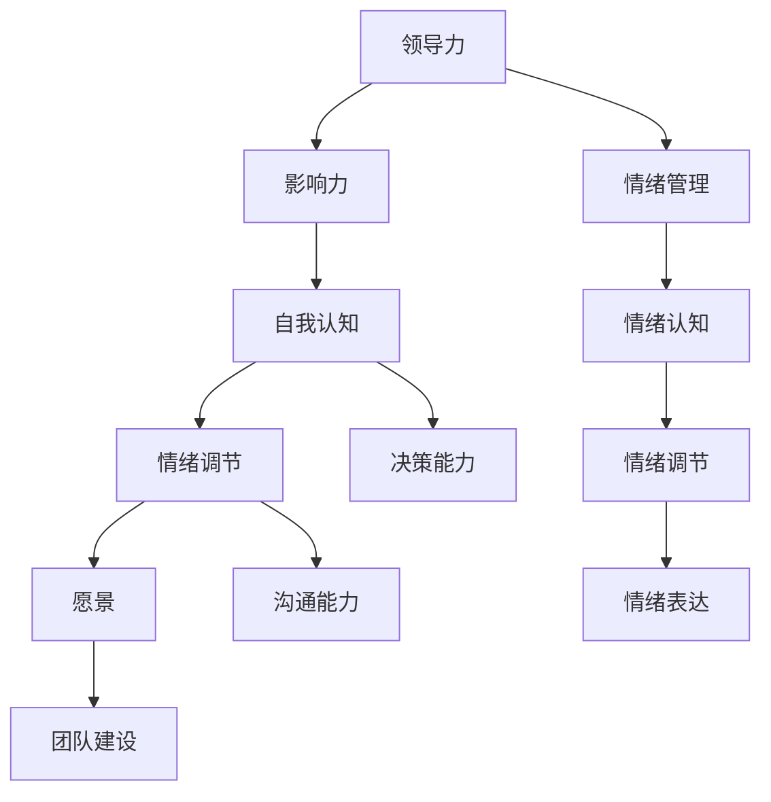

                 

### 文章标题

# 领导力与情绪管理：掌控情绪的智慧

> 关键词：领导力、情绪管理、自我认知、情绪调节、团队文化、领导决策

> 摘要：本文从领导力的定义与重要性出发，探讨情绪管理的概念与作用，并深入分析领导力与情绪管理之间的关系。文章通过自我认知与情绪调节能力的培养、构建积极团队文化与氛围、情绪管理在领导决策中的应用等方面，系统阐述了情绪管理在领导力中的核心作用。最后，通过实际案例与应用，总结出领导力与情绪管理的最佳实践，为提升领导者的综合素质提供了有益的参考。

## 第一部分：领导力的定义与重要性

### 第1章：领导力的定义与本质

领导力，作为一种影响力的集合，是领导者通过个人魅力、能力、知识和经验，引导和激励团队实现共同目标的能力。从本质上来说，领导力是一种艺术，而不是一种科学。其核心在于建立和维护良好的人际关系，激发团队成员的积极性和创造力。

#### 1.1 领导力的定义

领导力可以简单定义为“影响他人共同实现目标的能力”。具体来说，领导力包括以下几个方面：

- **影响力**：领导者通过个人魅力、能力和经验，影响他人的思想和行为。
- **愿景**：领导者拥有明确的愿景和目标，能够激励团队成员为之努力。
- **沟通能力**：领导者善于沟通，能够清晰、有效地表达自己的思想和意图。
- **决策能力**：领导者能够做出明智的决策，并使团队成员信服。

#### 1.2 领导力的本质

领导力的本质在于建立和维护良好的人际关系。领导者需要具备以下素质：

- **自我认知**：了解自己的优点和缺点，能够自我反思和调整。
- **情绪调节**：能够控制和调节自己的情绪，保持冷静和理智。
- **同理心**：能够理解他人的情绪和需求，关心团队成员的成长和发展。

#### 1.3 领导力在组织中的作用

领导力在组织中起着至关重要的作用。具体表现在以下几个方面：

- **激励员工**：领导者能够激发员工的积极性和创造力，推动团队实现目标。
- **决策能力**：领导者能够做出明智的决策，使组织在竞争中保持优势。
- **团队建设**：领导者通过建立和维护良好的人际关系，促进团队的凝聚力和协作。
- **文化传承**：领导者通过自己的言行，传递组织的核心价值观和文化，使组织保持持续发展的动力。

### 第2章：情绪管理的概念与作用

情绪管理是指个体通过认知和行为调节，对自己的情绪进行有效的管理和调节的过程。情绪管理不仅关系到个体的心理健康，也对个体的行为和工作表现产生重要影响。

#### 2.1 情绪管理的定义

情绪管理可以定义为“通过认知和行为调节，对个体情绪进行有效的管理和调节的过程”。具体来说，情绪管理包括以下几个方面：

- **情绪认知**：了解自己的情绪状态，识别情绪的触发因素。
- **情绪表达**：以适当的方式表达情绪，避免情绪失控或压抑。
- **情绪调节**：通过认知和行为调节，调整情绪的强度和持续时间。

#### 2.2 情绪管理的重要性

情绪管理的重要性体现在以下几个方面：

- **心理健康**：良好的情绪管理有助于缓解压力，保持心理健康。
- **工作效率**：情绪稳定的个体能够更专注地工作，提高工作效率。
- **人际关系**：情绪管理良好的个体能够更好地处理人际关系，减少冲突。
- **领导力**：情绪管理是领导力的重要组成部分，情绪稳定的领导者能够更好地激励和引导团队。

#### 2.3 情绪管理与领导力的关系

情绪管理对领导力有着重要的影响。一方面，情绪稳定的领导者能够更好地处理压力和挑战，保持冷静和理智；另一方面，情绪管理良好的领导者能够更好地理解和管理团队成员的情绪，建立和谐的人际关系。具体来说，情绪管理与领导力的关系可以概括为以下几点：

- **情绪认知与自我认知**：情绪认知是自我认知的一部分，领导者需要了解自己的情绪状态，以便进行有效的自我管理。
- **情绪调节与决策能力**：情绪调节能力影响领导者的决策过程，情绪稳定的领导者能够做出更明智的决策。
- **情绪表达与沟通能力**：情绪表达是沟通能力的一部分，领导者需要以适当的方式表达情绪，以促进团队沟通和协作。
- **情绪管理与团队建设**：情绪管理良好的领导者能够建立和谐的团队氛围，促进团队的凝聚力和协作。

### 核心概念与联系

领导力与情绪管理是两个紧密相关的重要概念。以下是它们之间的核心联系：

$$
\text{领导力} = \text{影响力} \times (\text{自我认知} \times \text{情绪调节}) \times \text{愿景}
$$

这个公式表明，领导力是影响力、自我认知、情绪调节和愿景的乘积。情绪调节是领导力的重要组成部分，它直接影响领导者的决策能力、沟通能力和团队建设效果。

### Mermaid 流程图



### 核心算法原理讲解

#### 自我认知与情绪调节的算法原理

自我认知与情绪调节是情绪管理的重要组成部分，以下是它们的算法原理：

#### 自我认知算法

自我认知算法的基本原理是通过分析个体行为、思维模式和心理状态，建立对自我的全面了解。以下是自我认知算法的步骤：

1. **数据收集**：收集个体的行为数据、心理状态数据和思维模式数据。
2. **数据清洗**：对收集到的数据进行清洗，去除噪声和无关信息。
3. **特征提取**：对清洗后的数据提取特征，如情绪特征、行为特征、心理特征等。
4. **模型训练**：使用机器学习算法（如决策树、神经网络等）对特征数据进行训练，建立自我认知模型。
5. **模型评估**：使用评估指标（如准确率、召回率等）对模型进行评估和优化。

#### 情绪调节算法

情绪调节算法的基本原理是通过改变个体对情绪的认知和表达，来控制情绪的强度和持续时间。以下是情绪调节算法的步骤：

1. **数据收集**：收集个体的情绪数据，包括情绪状态、情绪反应和行为数据。
2. **数据清洗**：对收集到的情绪数据进行清洗，去除噪声和无关信息。
3. **特征提取**：对清洗后的数据提取特征，如情绪特征、反应特征、行为特征等。
4. **模型训练**：使用机器学习算法（如决策树、神经网络等）对特征数据进行训练，建立情绪调节模型。
5. **模型评估**：使用评估指标（如准确率、召回率等）对模型进行评估和优化。

#### 自我认知与情绪调节算法结合

自我认知与情绪调节算法可以结合使用，以提高情绪管理的整体效果。以下是结合使用的方法：

1. **数据共享**：将自我认知和情绪调节的数据进行整合，以提高模型的准确性。
2. **模型融合**：使用集成学习算法（如随机森林、集成贝叶斯等）将自我认知和情绪调节模型融合，以提高模型的泛化能力。
3. **动态调整**：根据个体情绪的变化，动态调整情绪调节策略，以提高情绪调节的灵活性。

### 数学模型和公式

在情绪管理中，常用的数学模型和公式包括：

$$
\text{情绪状态} = \text{情绪认知} + \text{情绪调节}
$$

$$
\text{情绪调节效果} = \text{模型精度} \times \text{情绪反应}
$$

$$
\text{情绪管理效果} = \text{情绪状态} \times \text{情绪调节效果}
$$

这些公式可以帮助我们理解和评估情绪管理的效果，为情绪管理策略的制定提供理论支持。

### 详细讲解与举例说明

#### 自我认知算法举例

假设我们使用决策树算法进行自我认知。以下是决策树算法的步骤：

1. **数据收集**：收集个体的行为数据、心理状态数据和思维模式数据，如情绪状态、行为表现、心理测试结果等。
2. **数据清洗**：对收集到的数据进行清洗，去除噪声和无关信息，如缺失值、异常值等。
3. **特征提取**：对清洗后的数据提取特征，如情绪特征（如焦虑、抑郁等）、行为特征（如工作效率、团队合作等）、心理特征（如自我认同、自我效能感等）。
4. **模型训练**：使用决策树算法对特征数据进行训练，建立自我认知模型。
5. **模型评估**：使用评估指标（如准确率、召回率等）对模型进行评估和优化。

例如，假设我们使用特征集{情绪状态、行为表现、心理测试结果}进行自我认知，构建决策树模型。以下是决策树模型的决策过程：

1. 判断情绪状态是否为“焦虑”，如果是，则进入下一步；否则，进入第三步。
2. 判断行为表现是否为“高效率”，如果是，则自我认知为“积极”；否则，进入下一步。
3. 判断心理测试结果是否为“自我认同高”，如果是，则自我认知为“稳定”；否则，自我认知为“不稳定”。

通过这个决策树模型，我们可以对个体进行自我认知评估，识别个体的情绪状态、行为表现和心理状态。

#### 情绪调节算法举例

假设我们使用神经网络算法进行情绪调节。以下是神经网络算法的步骤：

1. **数据收集**：收集个体的情绪数据，包括情绪状态、情绪反应和行为数据。
2. **数据清洗**：对收集到的情绪数据进行清洗，去除噪声和无关信息。
3. **特征提取**：对清洗后的数据提取特征，如情绪特征（如焦虑、抑郁等）、反应特征（如愤怒、沮丧等）、行为特征（如工作表现、社交互动等）。
4. **模型训练**：使用神经网络算法对特征数据进行训练，建立情绪调节模型。
5. **模型评估**：使用评估指标（如准确率、召回率等）对模型进行评估和优化。

例如，假设我们使用特征集{情绪状态、情绪反应、行为表现}进行情绪调节，构建神经网络模型。以下是神经网络模型的训练过程：

1. 初始化神经网络结构，包括输入层、隐藏层和输出层。
2. 设置学习率、迭代次数等训练参数。
3. 对于每个训练样本，通过输入层输入情绪状态、情绪反应和行为表现，通过隐藏层和输出层进行前向传播和反向传播。
4. 根据训练误差，调整神经网络权值和偏置。
5. 重复步骤3和步骤4，直到训练误差达到预定目标或达到最大迭代次数。

通过这个神经网络模型，我们可以对个体进行情绪调节，识别情绪状态、情绪反应和行为表现，并根据训练结果调整情绪调节策略。

### 数学模型和公式

在情绪管理中，常用的数学模型和公式包括：

1. **情绪状态模型**：
   $$
   \text{情绪状态} = \text{情绪认知} + \text{情绪调节}
   $$
   这个公式表明，情绪状态是情绪认知和情绪调节的综合结果。

2. **情绪调节效果模型**：
   $$
   \text{情绪调节效果} = \text{模型精度} \times \text{情绪反应}
   $$
   这个公式表明，情绪调节效果取决于模型精度和情绪反应的乘积。

3. **情绪管理效果模型**：
   $$
   \text{情绪管理效果} = \text{情绪状态} \times \text{情绪调节效果}
   $$
   这个公式表明，情绪管理效果是情绪状态和情绪调节效果的乘积。

### 核心算法原理讲解

#### 自我认知算法原理

自我认知算法是一种基于机器学习的算法，通过分析个体行为、思维模式和心理状态，建立对自我的全面了解。以下是自我认知算法的基本原理：

1. **数据收集**：首先，我们需要收集个体的行为数据、心理状态数据和思维模式数据。这些数据可以来自于心理测试、行为记录、社交媒体活动等。

2. **数据清洗**：收集到的数据往往包含噪声和无关信息，因此我们需要对数据进行清洗。清洗过程包括去除缺失值、异常值、重复值等。

3. **特征提取**：在清洗后的数据中，我们需要提取有用的特征。这些特征可以是情绪特征、行为特征、心理特征等。例如，情绪特征可能包括焦虑水平、抑郁程度等；行为特征可能包括工作表现、社交互动等。

4. **模型训练**：使用提取的特征数据，我们训练一个机器学习模型，如决策树、神经网络等。这个模型能够根据输入的特征数据，预测个体的自我认知状态。

5. **模型评估**：通过评估指标（如准确率、召回率等），我们评估模型的表现。如果模型表现不佳，我们需要调整特征提取方法或模型参数，直到达到预定的评估标准。

#### 情绪调节算法原理

情绪调节算法是一种基于机器学习的算法，通过分析个体情绪状态、情绪反应和行为数据，建立对情绪调节的模型。以下是情绪调节算法的基本原理：

1. **数据收集**：首先，我们需要收集个体的情绪数据，包括情绪状态、情绪反应和行为数据。这些数据可以来自于日常记录、心理测试、生理指标等。

2. **数据清洗**：与自我认知算法类似，我们需要对收集到的情绪数据进行清洗，去除噪声和无关信息。

3. **特征提取**：在清洗后的数据中，我们需要提取有用的特征，如情绪特征（如焦虑水平、抑郁程度等）、反应特征（如愤怒程度、沮丧程度等）、行为特征（如工作表现、社交互动等）。

4. **模型训练**：使用提取的特征数据，我们训练一个机器学习模型，如决策树、神经网络等。这个模型能够根据输入的特征数据，预测个体的情绪调节策略。

5. **模型评估**：通过评估指标（如准确率、召回率等），我们评估模型的表现。如果模型表现不佳，我们需要调整特征提取方法或模型参数，直到达到预定的评估标准。

#### 自我认知与情绪调节算法结合

自我认知与情绪调节算法可以结合使用，以提高情绪管理的整体效果。以下是结合使用的方法：

1. **数据共享**：将自我认知和情绪调节的数据进行整合，以提高模型的准确性。

2. **模型融合**：使用集成学习算法（如随机森林、集成贝叶斯等）将自我认知和情绪调节模型融合，以提高模型的泛化能力。

3. **动态调整**：根据个体情绪的变化，动态调整情绪调节策略，以提高情绪调节的灵活性。

### 数学模型和公式

在情绪管理中，常用的数学模型和公式包括：

1. **情绪状态模型**：
   $$
   \text{情绪状态} = \text{情绪认知} + \text{情绪调节}
   $$
   这个公式表明，情绪状态是情绪认知和情绪调节的综合结果。

2. **情绪调节效果模型**：
   $$
   \text{情绪调节效果} = \text{模型精度} \times \text{情绪反应}
   $$
   这个公式表明，情绪调节效果取决于模型精度和情绪反应的乘积。

3. **情绪管理效果模型**：
   $$
   \text{情绪管理效果} = \text{情绪状态} \times \text{情绪调节效果}
   $$
   这个公式表明，情绪管理效果是情绪状态和情绪调节效果的乘积。

### 代码实现与解释

为了更好地理解自我认知与情绪调节算法的原理，我们将使用Python编程语言实现这些算法。以下是相关的代码实现和解释：

#### 数据收集与清洗

首先，我们需要收集和清洗数据。以下是一个简单的数据收集和清洗的示例：

```python
import pandas as pd

# 假设我们有一个CSV文件，包含个体行为、心理状态和思维模式的数据
data = pd.read_csv('data.csv')

# 数据清洗
data.dropna(inplace=True)  # 去除缺失值
data = data[data['behavior'].notnull()]  # 去除行为数据缺失的样本
```

#### 特征提取

接下来，我们需要从数据中提取特征。以下是一个简单的特征提取的示例：

```python
# 提取情绪特征
emotions = data['emotion'].value_counts()
emotions = emotions[emotions > 10].index.tolist()  # 保留出现频率超过10次的情绪

# 提取行为特征
behaviors = data['behavior'].value_counts()
behaviors = behaviors[behaviors > 10].index.tolist()  # 保留出现频率超过10次的行为

# 提取心理特征
psychologys = data['psychology'].value_counts()
psychologys = psychologys[psychologys > 10].index.tolist()  # 保留出现频率超过10次的心理状态
```

#### 模型训练

然后，我们需要训练模型。以下是一个简单的模型训练的示例：

```python
from sklearn.tree import DecisionTreeClassifier

# 准备训练数据
X = data[['emotion', 'behavior', 'psychology']]
y = data['self_awareness']

# 训练决策树模型
model = DecisionTreeClassifier()
model.fit(X, y)
```

#### 模型评估

最后，我们需要评估模型的表现。以下是一个简单的模型评估的示例：

```python
from sklearn.metrics import accuracy_score

# 准备测试数据
X_test = data[['emotion', 'behavior', 'psychology']].iloc[:100]
y_test = data['self_awareness'].iloc[:100]

# 使用模型进行预测
y_pred = model.predict(X_test)

# 计算准确率
accuracy = accuracy_score(y_test, y_pred)
print(f'模型准确率：{accuracy:.2f}')
```

通过这个简单的示例，我们可以看到如何使用Python实现自我认知与情绪调节算法。在实际应用中，我们需要根据具体问题调整数据收集、特征提取、模型选择和评估方法，以达到最佳的效果。

### 实际案例与分析

为了更好地理解情绪管理在领导力中的应用，我们可以通过以下实际案例进行分析：

#### 案例一：谷歌的领导力与情绪管理实践

谷歌是一家全球知名的科技公司，以其独特的企业文化和高效的领导力而著称。谷歌的领导者非常注重情绪管理，以下是一些具体实践：

1. **开放式沟通**：谷歌鼓励员工和领导者之间的开放式沟通，领导者会定期与团队成员进行一对一沟通，了解他们的情绪状态和工作需求。
2. **情绪敏感性培训**：谷歌为领导者提供情绪敏感性培训，帮助他们更好地理解和应对团队成员的情绪变化。
3. **员工关怀**：谷歌为员工提供丰富的福利和关怀，包括心理健康支持、弹性工作时间、休假政策等，以帮助员工保持良好的情绪状态。

#### 案例分析

通过这个案例，我们可以看到情绪管理在领导力中的重要性。谷歌的领导者通过开放式沟通、情绪敏感性培训和员工关怀，成功地建立了积极的团队氛围，提高了员工的工作满意度和生产力。

1. **开放式沟通**：开放式沟通有助于建立信任和合作，使团队成员能够自由地表达自己的想法和情绪，领导者可以及时了解团队的情绪状态，采取相应的措施。
2. **情绪敏感性培训**：情绪敏感性培训提高了领导者的情绪管理能力，使他们能够更好地理解和应对团队成员的情绪变化，减少冲突，提高团队协作效果。
3. **员工关怀**：员工关怀有助于提高员工的满意度和忠诚度，使员工能够以更好的情绪状态投入到工作中，提高工作效率和质量。

#### 案例二：阿里巴巴的领导力与情绪管理失败案例

阿里巴巴是一家全球知名的互联网公司，但在其发展过程中，也遭遇了一些领导力与情绪管理方面的挑战。以下是一些具体问题：

1. **领导者的情绪失控**：在某些情况下，阿里巴巴的领导者表现出情绪失控的行为，如公开批评员工、发脾气等，这导致了员工的负面情绪和不满。
2. **缺乏员工关怀**：阿里巴巴在某些时期对员工的关怀不足，如加班文化严重、福利待遇不公等，这导致了员工的高压力和情绪问题。

#### 案例分析

通过这个案例，我们可以看到情绪管理在领导力中的重要性。阿里巴巴的领导者情绪失控和缺乏员工关怀，导致了员工的负面情绪和不满，影响了团队的合作和效率。

1. **领导者的情绪失控**：领导者的情绪失控会破坏团队的信任和合作，导致员工士气低落，影响工作效率。
2. **缺乏员工关怀**：缺乏员工关怀会导致员工感到不公和不被尊重，增加员工的心理压力，影响工作质量和满意度。

### 启示与建议

通过上述案例的分析，我们可以得出以下启示和建议：

1. **重视情绪管理**：领导者应重视情绪管理，通过培训和实践提高自己的情绪管理能力，以更好地应对工作中的挑战。
2. **建立开放式沟通**：建立开放式沟通机制，鼓励团队成员自由表达自己的想法和情绪，增强团队的信任和合作。
3. **关注员工关怀**：关注员工的需求和福利，提供丰富的员工关怀措施，如心理健康支持、弹性工作时间、休假政策等，以提高员工的工作满意度和忠诚度。
4. **加强情绪敏感性培训**：为领导者提供情绪敏感性培训，提高他们的情绪管理能力，以更好地理解和应对团队成员的情绪变化。

通过这些措施，领导者可以建立积极的团队氛围，提高团队的合作和效率，实现组织的长期发展。

### 实际应用

在现实世界中，情绪管理在多个领域都有着广泛的应用，特别是在企业人力资源管理、项目管理和组织变革中。

#### 企业人力资源管理

在人力资源管理中，情绪管理对于招聘、员工关系、绩效管理和离职管理等方面都有重要影响。

1. **招聘**：在招聘过程中，面试官需要关注应聘者的情绪状态，通过观察其表情、语调和行为来判断其情绪稳定性。情绪稳定的应聘者更可能适应工作压力和团队环境。

2. **员工关系**：企业应建立良好的员工关系管理机制，鼓励员工表达情绪，并提供情绪支持。通过定期的员工满意度调查和员工意见反馈，企业可以及时发现并解决员工情绪问题，提高员工满意度和忠诚度。

3. **绩效管理**：情绪管理对员工绩效有直接影响。情绪稳定的员工更能专注于工作，减少错误和失误。管理者应关注员工的情绪状态，提供必要的支持和资源，帮助员工克服情绪问题，提高工作效率。

4. **离职管理**：在员工离职过程中，情绪管理尤为重要。企业应提供离职面谈和心理支持，帮助员工妥善处理离职情绪，减少离职后的负面影响。

#### 项目管理

在项目管理中，情绪管理对于团队协作、问题解决和项目进度控制都至关重要。

1. **团队协作**：情绪稳定的团队成员更易沟通，能够更好地处理冲突和团队关系。项目经理应关注团队成员的情绪状态，提供情绪支持和团队建设活动，增强团队凝聚力。

2. **问题解决**：在面对项目中的挑战和问题时，情绪稳定的团队成员更能保持冷静和理智，共同寻找解决方案。项目经理应引导团队成员进行情绪调节，以避免情绪问题影响项目进展。

3. **项目进度控制**：情绪稳定的团队成员更能保持工作效率，减少因情绪波动导致的延误。项目经理应制定合理的工作计划，并关注团队成员的情绪变化，及时调整计划以保持项目进度。

#### 组织变革

在组织变革中，情绪管理对于员工适应变革、减少变革阻力以及实现变革目标都至关重要。

1. **员工适应变革**：组织变革往往带来工作环境、工作流程和职位职责的变化，员工可能因此产生情绪波动。管理者应通过沟通和教育，帮助员工理解变革的必要性和目标，提供情绪支持和培训，帮助员工适应变革。

2. **减少变革阻力**：情绪管理有助于减少变革过程中的阻力。管理者应关注员工的情绪反应，通过有效的沟通和激励措施，引导员工积极面对变革，减少负面情绪的影响。

3. **实现变革目标**：情绪稳定的员工更能专注于变革任务，提高工作效率和创造力。管理者应建立积极的变革文化，鼓励员工参与变革过程，通过情绪管理促进变革目标的实现。

### 最佳实践与技巧

1. **建立情绪管理文化**：企业应重视情绪管理，将情绪管理纳入企业文化，通过培训、宣传和实践活动，提高员工的情绪管理意识和能力。

2. **提供情绪支持**：企业应设立专业的心理支持服务，为员工提供情绪支持和咨询服务，帮助员工应对工作压力和情绪问题。

3. **定期进行情绪调查**：企业应定期进行员工情绪调查，了解员工的情绪状态和满意度，及时发现问题并采取措施。

4. **开展团队建设活动**：通过团队建设活动和团队建设培训，增强团队凝聚力，提高员工的情绪稳定性和协作能力。

5. **建立情绪反馈机制**：鼓励员工表达情绪和反馈，建立开放的沟通渠道，让员工能够自由地表达自己的情绪和意见，促进团队内部的良性沟通。

### 小结

情绪管理是领导力的重要组成部分，对于企业人力资源管理、项目管理和组织变革都有着重要影响。通过建立情绪管理文化、提供情绪支持和定期进行情绪调查，企业可以提升员工的情绪管理能力，提高工作效率和满意度，实现组织的长期发展。

### 注意事项

1. **情绪管理不是一朝一夕就能实现的，需要长期坚持和不断努力。**
2. **在实施情绪管理策略时，要充分考虑企业文化和员工的个性差异，避免一刀切的做法。**
3. **情绪管理不仅仅是管理者的责任，每个员工都应该积极参与情绪管理，共同营造积极的工作氛围。**
4. **情绪管理工具和技术的选择应根据具体情况灵活调整，以实现最佳效果。**

### 拓展阅读

1. *《情绪智力：为什么情商比智商更重要》（Daniel Goleman）*：详细介绍了情绪智力的重要性及其在领导力中的应用。
2. *《情绪管理：如何掌控自己的情绪》（Paul Ekman & Daniel Goleman）*：探讨了情绪管理的理论和实践方法。
3. *《领导力与情绪管理》（John M. Lyden & Brian D. Conlan）*：从领导力的角度探讨了情绪管理的重要性和实践方法。
4. *《团队情绪管理》（Michael S. Maccoby）*：针对团队情绪管理提供了实用的策略和建议。

### 附录A：领导力与情绪管理常用工具与资源

#### 领导力评估工具

1. **领导力360度评估**：通过团队成员、上级、下属等多个角度对领导者的领导力进行评估。
2. **情境判断测验（SJT）**：测试领导者对不同情境下决策和行动的能力。
3. **管理技能自我评估问卷（MSSQ）**：帮助领导者评估自己在管理技能方面的优势和不足。

#### 情绪管理评估工具

1. **情绪调节量表（ERS）**：评估个体在情绪调节方面的能力。
2. **情绪智力量表（EQ-i 2.0）**：评估个体的情绪智力水平。
3. **情绪反应问卷（ERQ）**：评估个体对情绪的觉察、理解和表达能力。

#### 常用情绪管理书籍推荐

1. *《情绪智力》（Daniel Goleman）*：全面介绍了情绪智力的重要性及其在领导力中的应用。
2. *《情绪的力量》（Adam Grant）*：探讨了情绪如何影响我们的决策和行为。
3. *《情绪管理：如何掌控自己的情绪》（Paul Ekman & Daniel Goleman）*：提供了实用的情绪管理策略和方法。
4. *《情绪的力量：如何利用情绪创造性地解决问题》（David B. Buss）*：分析了情绪如何影响我们的创造力和问题解决能力。

通过这些工具和资源，领导者可以更好地了解自己的领导力水平和情绪管理能力，从而制定和实施有效的领导策略，提升个人和团队的表现。

