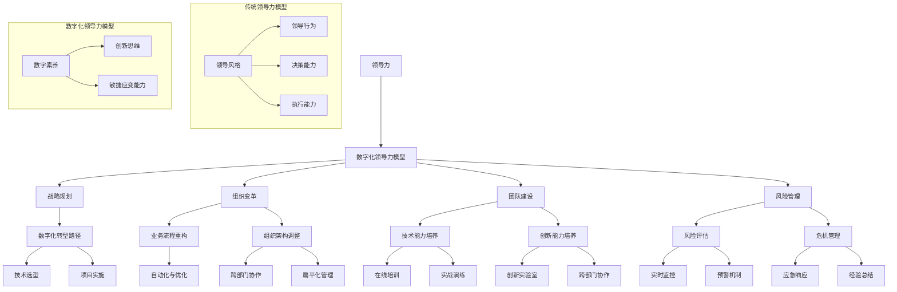

                 

### 《领导力与数字化转型：引领团队适应新技术》

> 关键词：领导力、数字化转型、技术适应性、团队建设、管理创新

> 摘要：本文旨在探讨领导力在数字化转型中的关键作用，分析数字化转型的本质与趋势，揭示领导力与数字化转型之间的内在联系。文章从传统领导力模型出发，逐步引入数字化领导力模型，解析数字化领导力特质与行为。随后，文章讨论了数字化转型策略的制定、数字化团队建设与管理，以及实践案例中的成功与失败经验。最后，文章展望了数字化转型的未来趋势与挑战，并提供了相关工具与资源推荐，为领导者提供实用的指导与启示。

---

## 《领导力与数字化转型：引领团队适应新技术》目录大纲

### 第一部分：引言与背景

#### 第1章 领导力与数字化转型概述
- 1.1 领导力的本质与作用
  - 1.1.1 领导力的定义
  - 1.1.2 领导力的作用
- 1.2 数字化转型的定义与趋势
  - 1.2.1 数字化转型的概念
  - 1.2.2 数字化转型的趋势
- 1.3 数字化转型与领导力的关系
  - 1.3.1 领导力对数字化转型的推动作用
  - 1.3.2 数字化转型对领导力的影响

### 第二部分：领导力框架与数字化转型策略

#### 第2章 领导力框架解析
- 2.1 传统领导力模型
  - 2.1.1 领导风格
  - 2.1.2 领导行为
- 2.2 数字化领导力模型
  - 2.2.1 数字化领导力特质
  - 2.2.2 数字化领导力行为
- 2.3 领导力框架与数字化转型结合
  - 2.3.1 数字化领导力能力模型

#### 第3章 数字化转型策略制定
- 3.1 数字化转型战略规划
  - 3.1.1 战略规划流程
  - 3.1.2 战略规划工具
- 3.2 数字化转型路径选择
  - 3.2.1 业务流程重构
  - 3.2.2 组织架构调整
- 3.3 风险管理与应对策略
  - 3.3.1 风险评估方法
  - 3.3.2 风险管理策略

### 第三部分：数字化团队建设与管理

#### 第4章 数字化团队建设
- 4.1 团队成员能力提升
  - 4.1.1 技术能力培养
  - 4.1.2 创新能力培养
- 4.2 数字化团队合作与沟通
  - 4.2.1 团队协作工具
  - 4.2.2 沟通技巧提升
- 4.3 团队文化塑造
  - 4.3.1 数字化团队价值观
  - 4.3.2 数字化团队激励机制

#### 第5章 数字化团队管理
- 5.1 管理模式与领导风格适应
  - 5.1.1 传统管理模式的局限
  - 5.1.2 数字化管理模式的创新
- 5.2 绩效评估与反馈机制
  - 5.2.1 绩效评估指标
  - 5.2.2 绩效反馈与改进
- 5.3 团队危机管理与应对
  - 5.3.1 危机识别与预警
  - 5.3.2 危机应对策略

### 第四部分：实践与案例分析

#### 第6章 数字化转型实践案例
- 6.1 案例分析
  - 6.1.1 案例一：企业A的数字化转型之路
  - 6.1.2 案例二：企业B的数字化转型实践
- 6.2 经验与教训总结
  - 6.2.1 成功经验
  - 6.2.2 失败教训

#### 第7章 数字化转型的未来趋势与挑战
- 7.1 未来趋势分析
  - 7.1.1 新技术的影响
  - 7.1.2 行业发展动向
- 7.2 挑战与应对
  - 7.2.1 技术挑战
  - 7.2.2 组织与人才挑战

### 第五部分：附录

#### 附录A：数字化转型工具与资源
- A.1 常用数字化转型工具
  - A.1.1 云计算服务
  - A.1.2 数据分析工具
- A.2 数字化转型资源推荐
  - A.2.1 书籍推荐
  - A.2.2 网络资源推荐

#### 参考文献

- [1] 相关书籍、论文、报告等引用。

---

通过上述目录结构，我们可以清晰地看到文章的布局和内容分布。接下来，我们将逐章深入分析领导力与数字化转型之间的关系，探讨领导力在数字化转型中的具体应用和策略。在这个过程中，我们将结合实际案例和数学模型，帮助读者更好地理解和应用相关概念和原理。

### 第一部分：引言与背景

#### 第1章 领导力与数字化转型概述

在当今快速发展的数字化时代，领导力与数字化转型已成为企业管理与发展的关键议题。领导力作为企业成功的重要基石，其作用在数字化转型过程中尤为凸显。数字化转型不仅是技术变革，更是企业战略层面的转变，它要求领导者具备新的思维模式、领导方式和组织能力。本章将首先探讨领导力的本质与作用，接着介绍数字化转型的定义与趋势，最后分析领导力与数字化转型之间的内在联系。

#### 1.1 领导力的本质与作用

领导力是一种能够激励和引导他人实现共同目标的能力。它不仅包括个人的品质和风格，还涉及组织的文化和行为模式。领导力的本质在于其核心要素，包括愿景、影响力、决策能力和执行能力。以下是领导力几个关键方面的详细解释：

1. **愿景（Vision）**：领导者需要具备远见，能够看到未来的发展趋势和机遇，并以此为基础制定企业的发展战略。愿景是团队的指南针，为团队成员提供明确的方向和目标。

2. **影响力（Influence）**：领导者通过言行和价值观影响他人，使之认同并追随领导者的愿景。影响力不仅体现在个人魅力上，还包括沟通技巧、情感共鸣和建立信任的能力。

3. **决策能力（Decision-making）**：在数字化时代，领导者需要迅速做出明智的决策，以应对市场变化和技术革新。这要求领导者具备数据驱动的决策能力，能够利用大数据和分析工具做出更精准的判断。

4. **执行能力（Execution）**：领导力不仅仅在于制定战略，更重要的是确保战略的有效执行。领导者需要协调各方资源，确保团队能够高效协作，达成目标。

领导力的作用主要体现在以下几个方面：

- **激励团队**：领导者通过激励手段，激发团队成员的工作热情和创造力，使团队保持高度的工作效率和创新能力。

- **指导方向**：领导者为团队提供明确的指导方向，确保团队在正确的轨道上前进，避免迷失在复杂的市场和技术环境中。

- **建立信任**：领导者的信任和诚信是团队协作的基础。通过建立信任关系，领导者可以增强团队的凝聚力和协同效应。

- **推动变革**：在数字化时代，变革已成为不可避免的趋势。领导者需要具备推动变革的能力，引导企业适应新技术、新模式，保持持续竞争力。

#### 1.2 数字化转型的定义与趋势

数字化转型是指企业利用数字技术来重塑业务模式、工作流程和组织结构，以实现更高的效率、更好的客户体验和更灵活的运营能力。数字化转型不仅仅是技术升级，更是一次全方位的变革，它要求企业在战略、组织、文化和技术等多个层面进行调整和优化。

**数字化转型的主要趋势包括：**

1. **云计算与大数据**：云计算提供了弹性、灵活的计算资源，大数据技术则为企业提供了深入的数据分析和洞察力。这两者的结合使得企业能够更好地处理海量数据，提升业务决策的精准度。

2. **人工智能与机器学习**：人工智能和机器学习技术正在改变企业运营的方方面面，从自动化生产到智能客服，再到个性化推荐，这些技术为企业带来了更高的效率和更优质的客户体验。

3. **物联网（IoT）**：物联网技术将物理设备和系统连接到互联网，实现了实时数据收集和分析，为智能制造、智能城市等领域提供了强大的技术支撑。

4. **区块链**：区块链技术以其去中心化、不可篡改的特点，为数据安全和信任机制提供了新的解决方案。在供应链管理、金融服务等领域，区块链技术正逐步得到应用。

5. **移动性与社交媒体**：移动设备的普及和社交媒体的兴起，改变了人们的沟通方式和消费习惯。企业需要通过移动应用和社交媒体平台，与客户建立更加紧密的联系，提升品牌影响力和客户满意度。

#### 1.3 数字化转型与领导力的关系

数字化转型与领导力之间存在着密切的内在联系。首先，领导力是推动数字化转型的重要动力。一个优秀的领导者能够激发团队的创新精神和适应能力，带领企业顺利实现数字化转型。以下是从两个方面分析领导力与数字化转型之间的关系：

1. **领导力对数字化转型的推动作用**

- **愿景与决策**：领导者的远见和决策能力是推动数字化转型的基础。领导者需要洞察行业趋势，制定清晰的数字化战略，并迅速做出决策，确保企业能够抓住市场机遇。

- **组织变革**：数字化转型往往涉及组织结构的调整和文化变革。领导者需要具备变革管理的能力，引导员工适应新的工作方式，建立适应数字化时代的组织文化。

- **人才培养**：数字化转型的成功离不开人才的支持。领导者需要识别和培养具有数字化技能和思维的优秀人才，为企业的数字化转型提供强大的人力资源保障。

2. **数字化转型对领导力的影响**

- **领导方式变革**：随着数字化技术的广泛应用，领导方式也在发生变革。领导者需要从传统的指令性管理转向赋能型管理，鼓励团队成员发挥创造力，共同推动数字化转型。

- **领导力模型更新**：数字化时代对领导者的要求越来越高。领导者需要具备跨领域的知识结构、敏捷的应变能力和持续学习的态度，以适应快速变化的商业环境。

- **领导风格多样化**：在数字化时代，领导风格需要更加多样化，以适应不同类型的团队成员。领导者需要运用不同的领导风格，激发团队成员的积极性和创造力。

总之，领导力与数字化转型之间是相辅相成的关系。领导力能够推动数字化转型，而数字化转型又对领导力提出了更高的要求。领导者需要不断更新自己的知识和技能，提升领导力水平，以应对数字化时代的挑战。

在下一章中，我们将深入探讨领导力框架的解析，分析传统领导力模型与数字化领导力模型之间的差异与联系，为数字化转型提供更加具体和实用的指导。

### 第二部分：领导力框架与数字化转型策略

#### 第2章 领导力框架解析

在数字化时代，传统的领导力框架面临着新的挑战和变革。本章将首先解析传统领导力模型，包括领导风格和领导行为，接着介绍数字化领导力模型，强调数字化领导力的特质和行为，最后讨论如何将传统领导力框架与数字化领导力模型相结合，构建适应数字化转型的领导力能力模型。

#### 2.1 传统领导力模型

传统领导力模型主要基于领导风格和领导行为的理论，这些理论有助于理解领导者如何影响和激励团队成员。以下是几种常见的传统领导力模型：

1. **领导风格模型**

- **独裁式领导（Authoritarian Leadership）**：领导者作出所有决策，团队成员只负责执行。这种风格在快速决策和控制力强的环境中可能有效，但在需要创新和协作的数字化时代，其局限性日益明显。

- **民主式领导（Democratic Leadership）**：领导者鼓励团队成员参与决策，重视团队的意见和建议。这种风格有助于增强团队成员的参与感和责任感，但在决策速度和一致性上可能存在挑战。

- **放任式领导（Laissez-Faire Leadership）**：领导者给予团队成员最大的自由度，让他们自主决策和执行。这种风格适用于高度自主和创新的团队，但可能导致目标和执行的一致性降低。

2. **领导行为模型**

- **任务导向（Task-Oriented）**：领导者注重任务的完成和目标达成，强调效率、流程和结果。这种行为有助于确保团队的工作高效有序，但在激发创新和团队成员的主动性方面可能有所欠缺。

- **关系导向（People-Oriented）**：领导者关注团队成员的需求和情感，注重建立良好的团队关系和协作氛围。这种行为有助于增强团队的凝聚力和协作精神，但在任务导向的环境下可能影响工作效率。

传统领导力模型在一定程度上适用于数字化转型的早期阶段，但在面对快速变化、高度不确定性和需要创新思维的环境时，其局限性逐渐显现。因此，领导者需要发展新的领导力框架，以更好地应对数字化转型的挑战。

#### 2.2 数字化领导力模型

数字化领导力是适应数字化时代的一种新型领导力，它要求领导者具备数字素养、创新思维和敏捷应变能力。以下是数字化领导力的几个关键特质和行为：

1. **数字素养（Digital Literacy）**

- **技术理解力**：领导者需要具备对数字技术和平台的基本理解，能够运用数据分析、人工智能等技术手段进行决策。

- **数字安全意识**：领导者需要重视数字安全，了解网络安全、数据隐私等方面的知识，确保企业的数字资产安全。

- **数字化转型推动力**：领导者需要具备推动企业数字化转型的意愿和决心，能够在组织内部倡导数字文化，推动技术变革。

2. **创新思维（Innovative Thinking）**

- **开放性**：领导者需要保持开放的心态，鼓励团队成员提出新的想法和创新方案，推动组织持续创新。

- **敏捷性**：领导者需要具备快速响应变化的能力，能够灵活调整战略和计划，以适应市场和技术环境的变化。

- **实验精神**：领导者需要勇于尝试新事物，鼓励团队成员在实验和试错中学习，积累经验。

3. **敏捷应变能力（Agile Response）**

- **适应能力**：领导者需要具备快速适应新环境和变化的能力，能够灵活调整团队结构和角色，以应对数字化时代的挑战。

- **学习意愿**：领导者需要具备持续学习的意愿，不断提升自己的数字技能和领导力水平，以保持竞争力。

- **跨职能协作**：领导者需要促进跨部门、跨团队的协作，打破组织壁垒，实现资源的最佳配置。

数字化领导力模型不仅强调领导者的数字素养和创新思维，还强调领导者需要具备敏捷应变能力，以应对数字化时代的不确定性和复杂性。这种领导力模型有助于企业更好地适应数字化转型，实现持续创新和竞争优势。

#### 2.3 领导力框架与数字化转型结合

将传统领导力框架与数字化领导力模型相结合，构建适应数字化转型的领导力能力模型，是领导者在数字化转型过程中的重要任务。以下是将两者结合的几个关键步骤：

1. **能力识别与培养**

- **领导者的数字素养**：通过培训和学习，提升领导者的数字素养，包括技术理解力、数字安全意识和数字化转型推动力。

- **领导者的创新思维**：鼓励领导者发展开放性、敏捷性和实验精神，以推动组织的持续创新。

- **领导者的敏捷应变能力**：通过实践和模拟，提升领导者的适应能力和跨职能协作能力。

2. **领导方式调整**

- **从指令性管理转向赋能型管理**：领导者需要从传统的指令性管理转向赋能型管理，给予团队成员更多的自主权和责任，激发他们的创造力和主动性。

- **从任务导向转向关系导向**：领导者需要关注团队成员的需求和情感，建立良好的团队关系和协作氛围，提高团队的整体绩效。

3. **组织文化重塑**

- **推动数字文化**：领导者需要推动数字文化的形成，倡导创新思维、敏捷应变和持续学习的价值观，营造一个鼓励创新和包容失败的企业环境。

- **建立数字化价值观**：领导者需要明确企业的数字化价值观，并将其融入到企业的战略、政策和日常运营中，确保全体员工都认同并践行这些价值观。

4. **能力评估与反馈**

- **建立能力评估机制**：通过定期的能力评估，识别领导者的优势和不足，提供个性化的培训和发展计划。

- **反馈与改进**：领导者需要接受团队的反馈，不断改进自己的领导方式和管理能力，以适应数字化转型的要求。

通过将传统领导力框架与数字化领导力模型相结合，领导者可以更好地应对数字化转型的挑战，带领企业实现数字化转型和持续发展。在下一章中，我们将探讨数字化转型策略的制定，分析战略规划流程、路径选择和风险管理策略，为领导者提供实用的数字化转型指南。

#### 第3章 数字化转型策略制定

在数字化转型的道路上，策略的制定是至关重要的一步。它不仅决定了企业数字化转型的方向和速度，还直接影响到转型的成功与否。本章将详细探讨数字化转型战略规划的流程、数字化转型的路径选择以及风险管理与应对策略。

#### 3.1 数字化转型战略规划

战略规划是数字化转型的第一步，它为企业提供明确的方向和目标。以下是一个典型的数字化转型战略规划流程：

1. **现状评估**：

- **内部评估**：评估企业的现有资源、技术能力、组织结构和企业文化，识别优势和劣势。

- **外部评估**：分析市场趋势、竞争对手、客户需求和行业动态，了解外部环境对企业的影响。

2. **目标设定**：

- **长期目标**：设定企业在数字化转型后的长期目标，如提升市场竞争力、实现业务增长等。

- **短期目标**：根据长期目标，设定短期可量化的目标，如提升运营效率、降低成本等。

3. **方案设计**：

- **技术选型**：根据业务需求和资源情况，选择合适的技术平台和工具，如云计算、大数据、人工智能等。

- **业务流程重构**：重新设计企业的业务流程，使其更适应数字化环境，提高效率和灵活性。

4. **资源分配**：

- **人力配置**：确定数字化转型所需的人力资源，包括数字技能和跨职能协作能力。

- **资金投入**：根据战略规划，制定数字化转型所需的资金预算，确保项目顺利进行。

5. **时间安排**：

- **项目分期**：将数字化转型项目分解为多个阶段，明确每个阶段的时间安排和目标。

- **进度监控**：建立项目进度监控机制，定期评估项目进展，及时调整策略。

6. **风险评估**：

- **风险识别**：识别数字化转型过程中可能面临的风险，如技术风险、市场风险、人力资源风险等。

- **风险应对**：制定相应的风险应对策略，确保项目能够顺利实施。

#### 3.2 数字化转型的路径选择

数字化转型不是一蹴而就的过程，而是需要根据企业的具体情况选择合适的路径。以下是一些常见的数字化转型路径：

1. **业务流程重构**：

- **自动化**：通过自动化工具，如机器人流程自动化（RPA），简化重复性、低价值的业务流程。

- **优化**：运用数据分析技术，优化业务流程，提高效率和准确性。

- **创新**：探索新的业务模式，如基于大数据的个性化服务、智能供应链管理等。

2. **组织架构调整**：

- **扁平化**：减少管理层级，提高决策速度和灵活性。

- **跨职能协作**：打破部门壁垒，建立跨职能团队，促进资源整合和协同创新。

- **多元化**：吸引和培养具有数字素养和创新思维的多元化人才，提升企业的创新能力和竞争力。

3. **文化变革**：

- **数字文化**：推动数字文化的形成，鼓励创新思维、实验精神和持续学习。

- **价值观重塑**：将数字文化融入到企业的核心价值观中，确保全体员工都认同并践行。

- **激励机制**：建立与数字化转型目标相一致的激励机制，鼓励团队成员积极参与和贡献。

#### 3.3 风险管理与应对策略

数字化转型过程中不可避免地会面临各种风险，如技术风险、市场风险和人力资源风险。以下是一些常见的风险管理和应对策略：

1. **风险评估方法**：

- **定性分析**：通过专家评估、头脑风暴等方法，识别潜在的风险和影响。

- **定量分析**：运用统计分析和模型预测等方法，评估风险的可能性和影响程度。

2. **风险管理策略**：

- **风险规避**：通过调整战略或业务模式，避免高风险的业务领域。

- **风险转移**：通过购买保险或签订合同等方式，将风险转移给第三方。

- **风险减轻**：通过改进技术、加强监控和管理等方法，减轻风险的影响。

- **风险接受**：在风险可控的情况下，选择接受风险，以避免过度的风险规避带来的成本。

3. **风险应对策略**：

- **预防措施**：在项目规划和实施阶段，采取预防措施，降低风险发生的概率。

- **应急响应**：制定应急预案，确保在风险发生时能够迅速响应，减少损失。

- **持续监控**：建立风险监控机制，定期评估风险状况，及时调整应对策略。

通过科学的战略规划、合适的路径选择和有效的风险管理，企业可以更好地应对数字化转型的挑战，实现数字化转型的目标。在下一章中，我们将探讨数字化团队建设与管理，分析如何提升团队成员的能力、促进团队合作和沟通，以及塑造数字化团队文化。

### 第三部分：数字化团队建设与管理

#### 第4章 数字化团队建设

在数字化转型的过程中，团队建设至关重要。一个高效的数字化团队不仅需要具备技术能力，还需要具备创新能力和团队合作精神。本章将探讨如何提升团队成员的能力、促进团队合作和沟通，以及塑造数字化团队文化。

#### 4.1 团队成员能力提升

团队成员的能力提升是数字化团队建设的基础。以下是一些关键措施：

1. **技术能力培养**

- **培训计划**：制定系统化的培训计划，包括技术基础课程、专业技能培训、最新技术趋势等。

- **在线学习平台**：利用在线学习平台，提供丰富的学习资源和课程，支持团队成员自主学习。

- **实战演练**：通过实际项目演练，提高团队成员的技术应用能力和问题解决能力。

2. **创新能力培养**

- **鼓励创新思维**：营造鼓励创新的企业文化，鼓励团队成员提出新的想法和解决方案。

- **建立创新实验室**：设立创新实验室，为团队成员提供实验空间和资源，支持创新项目的实践。

- **跨部门协作**：促进跨部门协作，鼓励团队成员与其他部门的同事合作，拓宽视野，激发创新。

3. **领导力培养**

- **领导力培训**：为团队成员提供领导力培训，提高他们的管理和领导能力。

- **角色轮换**：通过角色轮换，让团队成员有机会尝试不同的工作角色，提升他们的综合素质。

- **导师制度**：建立导师制度，为团队成员提供指导和帮助，帮助他们快速成长。

#### 4.2 数字化团队合作与沟通

数字化团队合作与沟通的成功是实现数字化转型目标的关键。以下是一些有效的方法：

1. **团队协作工具**

- **即时通讯工具**：使用即时通讯工具，如Slack、Microsoft Teams等，促进团队成员之间的实时沟通。

- **协作平台**：利用协作平台，如Trello、Asana等，实现任务的分配、进度追踪和协作管理。

- **视频会议系统**：采用视频会议系统，如Zoom、Google Meet等，支持远程团队的高效沟通和协作。

2. **沟通技巧提升**

- **明确沟通目标**：每次沟通前明确沟通的目标和内容，确保沟通的针对性和有效性。

- **有效倾听**：在沟通中注重倾听，理解团队成员的观点和需求，促进共识的形成。

- **反馈机制**：建立有效的反馈机制，鼓励团队成员提出意见和建议，不断改进沟通方式。

3. **跨部门协作**

- **建立跨部门协作机制**：通过设置跨部门项目经理或协作小组，确保不同部门之间的有效沟通和协作。

- **共享信息平台**：建立共享信息平台，确保各部门之间的信息畅通，支持跨部门的合作。

- **定期会议**：定期举行跨部门会议，讨论项目进展、问题和解决方案，确保各部门之间的协同作战。

#### 4.3 团队文化塑造

数字化团队文化是团队凝聚力和创新力的源泉。以下是一些塑造数字化团队文化的方法：

1. **数字化价值观**：

- **创新与实验**：鼓励团队成员勇于尝试新事物，从失败中学习，培养创新意识和实验精神。

- **敏捷与适应**：倡导敏捷工作方法，培养团队成员快速响应变化的能力。

- **协作与共赢**：强调团队合作的重要性，鼓励团队成员共享资源、知识，实现共赢。

2. **激励机制**：

- **绩效考核**：建立与数字化价值观相一致的绩效考核机制，激励团队成员朝着企业目标努力。

- **奖金与奖励**：为在数字化转型中表现突出的团队成员提供奖金和其他奖励，激励他们的积极性和创造力。

- **职业发展**：提供职业发展机会，帮助团队成员不断提升自己的能力和技能。

3. **员工参与**：

- **员工建议**：鼓励员工参与企业的战略决策和项目规划，增强他们的主人翁意识。

- **团队建设活动**：定期组织团队建设活动，增强团队成员之间的信任和凝聚力。

- **透明沟通**：保持与团队成员的透明沟通，让员工了解企业的目标和进展，增强他们的归属感和责任感。

通过提升团队成员能力、促进团队合作和沟通、塑造数字化团队文化，企业可以打造一个高效、创新、协作的数字化团队，为数字化转型提供坚实的支撑。在下一章中，我们将探讨数字化团队管理，分析如何适应数字化时代的管理模式与领导风格，以及如何进行绩效评估与团队危机管理。

#### 第5章 数字化团队管理

在数字化时代，团队管理面临着前所未有的挑战和机遇。传统的管理模式往往难以适应快速变化的市场和技术环境，而数字化团队管理则需要更加灵活、创新和适应性的管理模式。本章将探讨数字化团队管理中的几个关键方面，包括管理模式与领导风格的适应、绩效评估与反馈机制，以及团队危机管理与应对策略。

#### 5.1 管理模式与领导风格的适应

数字化时代的团队管理需要从传统的指令性管理转向赋能型管理，以更好地适应快速变化的环境和激发团队成员的潜力。以下是一些关键点：

1. **指令性管理的局限**

- **决策速度慢**：在传统指令性管理模式下，决策往往需要经过多个层级的审批和讨论，导致决策速度缓慢，无法快速响应市场变化。

- **沟通效率低**：层级化的组织结构导致信息流通不畅，上级管理层往往难以了解基层员工的真实情况和需求，导致沟通效率低下。

- **创新能力不足**：传统管理模式倾向于稳定和保守，对创新和实验持谨慎态度，容易扼杀员工的创新思维。

2. **赋能型管理的优势**

- **决策速度加快**：在赋能型管理模式下，决策权更贴近一线员工，能够快速响应市场变化和客户需求。

- **沟通效率提高**：通过扁平化的组织结构和透明的沟通渠道，信息能够更加顺畅地传递，员工之间的协作更加紧密。

- **创新能力增强**：赋能型管理鼓励员工大胆尝试和实验，从失败中学习，不断推动组织的创新和发展。

3. **领导风格的适应**

- **从指令型转向指导型**：领导者需要从单一的指令性管理转向更加注重指导和支持，帮助团队成员解决问题和实现目标。

- **从控制型转向支持型**：领导者需要从过度控制转向提供支持，为团队成员提供必要的资源和帮助，鼓励他们自主决策和承担责任。

- **从权威型转向合作型**：领导者需要与团队成员建立合作关系，共同探讨解决方案，实现共同目标。

#### 5.2 绩效评估与反馈机制

在数字化团队管理中，绩效评估与反馈机制是确保团队高效运作和持续改进的重要手段。以下是一些关键点：

1. **绩效评估指标**

- **结果导向**：设定明确的绩效指标，关注团队成员的工作结果，如完成任务的时效性、质量等。

- **过程评估**：除了结果导向，还需要关注团队成员的工作过程，如团队合作、沟通能力、创新思维等。

- **个性化指标**：根据团队成员的职责和角色，设定个性化的绩效指标，确保评估的针对性和有效性。

2. **反馈机制**

- **及时反馈**：建立及时的反馈机制，确保团队成员能够及时了解自己的工作表现和改进方向。

- **双向反馈**：鼓励团队成员之间的双向反馈，不仅接受上级的反馈，也能够给予上级和同事反馈，促进相互学习和成长。

- **持续反馈**：绩效评估不是一次性的活动，而是一个持续的过程，需要定期进行评估和反馈，帮助团队成员不断改进。

3. **反馈与改进**

- **具体而明确**：在反馈时，要具体而明确地指出团队成员的优势和不足，提供具体的改进建议。

- **鼓励与激励**：在反馈中要注重鼓励和激励，肯定团队成员的努力和成果，激发他们的积极性和自信心。

- **制定改进计划**：与团队成员共同制定具体的改进计划，明确改进的目标、步骤和时间表，确保改进措施的落实。

#### 5.3 团队危机管理与应对

在数字化时代，团队面临的风险和不确定性增加，危机管理变得尤为重要。以下是一些关键点：

1. **危机识别与预警**

- **风险评估**：定期进行风险评估，识别可能的风险点和潜在的危机。

- **实时监控**：建立实时监控机制，密切关注市场变化、技术发展和团队运营情况，及时发现异常情况。

- **预警机制**：建立预警机制，设定预警指标和阈值，确保在风险达到临界点时能够及时发出警报。

2. **危机应对策略**

- **快速响应**：在危机发生时，迅速启动危机应对机制，确保团队能够快速响应和采取措施。

- **紧急决策**：领导者需要具备紧急决策的能力，迅速做出正确的决策，确保危机得到有效控制。

- **资源调配**：确保在危机应对过程中，能够迅速调配资源和人力，提供必要的支持和帮助。

3. **危机应对与恢复**

- **紧急措施**：在危机发生时，采取紧急措施，如紧急修复漏洞、暂停相关业务等，以控制危机的蔓延。

- **持续监控**：在危机得到控制后，继续监控危机的影响，确保问题得到彻底解决。

- **总结经验**：在危机应对过程中，总结经验教训，制定改进措施，提升团队的危机应对能力。

通过适应数字化时代的管理模式与领导风格，建立科学的绩效评估与反馈机制，以及有效的危机管理与应对策略，企业可以更好地应对数字化团队管理的挑战，实现团队的持续发展和高效运作。在下一章中，我们将通过实践案例，深入分析数字化转型的实际操作过程，总结成功经验和失败教训，为领导者的数字化转型实践提供参考。

#### 第6章 数字化转型实践案例

在数字化转型的浪潮中，许多企业已经通过实际操作取得了显著的成果，同时也遇到了诸多挑战。本章将分析两个企业的数字化转型实践案例，总结它们的成功经验和失败教训，为其他企业的数字化转型提供参考和启示。

##### 6.1 案例一：企业A的数字化转型之路

**企业背景**：

企业A是一家传统的制造企业，面临着日益激烈的市场竞争和客户需求的变化。为了保持竞争优势，企业决定进行全面数字化转型。

**数字化转型实践**：

1. **战略规划**：企业首先制定了详细的数字化转型战略，明确了数字化转型的愿景、目标和路径。战略规划包括技术选型、业务流程重构、人才培养和资源配置等方面。

2. **业务流程重构**：企业通过引入先进的生产设备和自动化工具，对传统的业务流程进行了全面优化和重构。例如，采用了物联网技术对生产线进行实时监控和数据分析，提高了生产效率和产品质量。

3. **人才培养**：企业重视数字化人才的培养，建立了系统的培训计划，包括技术培训、管理培训和创新思维培训。同时，通过内部选拔和外部引进，引进了一批具有数字化背景的年轻人才。

4. **组织变革**：企业进行了组织架构的调整，打破了原有的部门壁垒，建立了跨职能团队，提高了团队的协作效率和创新力。

**成功经验**：

- **明确的战略规划**：企业制定了详细的数字化转型战略，确保了数字化转型的方向和目标清晰，为后续的实施提供了指南。

- **业务流程重构**：通过业务流程的重构，企业提高了生产效率和产品质量，增强了市场竞争力。

- **人才培养和组织变革**：企业重视数字化人才的培养和组织变革，建立了适应数字化时代的人才结构和组织文化。

**失败教训**：

- **技术选型不当**：企业在技术选型过程中，没有充分考虑市场需求和自身实际情况，导致部分技术投入未能产生预期的效果。

- **员工适应性不足**：部分员工对新技术和新流程的适应性不足，影响了数字化转型效果。

##### 6.2 案例二：企业B的数字化转型实践

**企业背景**：

企业B是一家服务型企业，主要提供金融咨询服务。在金融科技快速发展的背景下，企业决定进行数字化转型，以提升服务质量和客户体验。

**数字化转型实践**：

1. **客户体验优化**：企业通过大数据分析和人工智能技术，对客户行为和需求进行深入分析，提供个性化的金融服务和建议。例如，开发了智能客服系统，实现了24小时在线服务。

2. **业务流程自动化**：企业引入了RPA（机器人流程自动化）技术，自动化处理大量重复性、低价值的业务流程，提高了工作效率和准确性。

3. **数据安全与隐私保护**：企业重视数据安全和隐私保护，建立了严格的数据安全管理体系，采用区块链技术进行数据加密和分布式存储，确保客户数据的安全和隐私。

4. **创新激励机制**：企业建立了创新激励机制，鼓励员工提出创新方案，并设立创新基金，支持员工的创新项目。

**成功经验**：

- **客户体验优化**：通过大数据和人工智能技术，企业大幅提升了客户体验，增强了客户满意度和忠诚度。

- **业务流程自动化**：通过RPA技术，企业提高了业务流程的效率和准确性，减少了人力资源的浪费。

- **数据安全与隐私保护**：企业建立了完善的数据安全管理体系，确保了客户数据的安全和隐私。

**失败教训**：

- **创新过度，忽略业务本质**：企业在创新过程中，过度追求技术的前沿性，忽视了业务本质和客户需求，导致部分创新项目未能产生预期的效果。

- **员工技能提升不足**：企业在数字化转型过程中，未能充分重视员工的技能提升和培训，导致部分员工对新技术的适应性不足。

##### 6.3 经验与教训总结

通过对企业A和企业B的数字化转型实践案例分析，可以总结出以下成功经验和失败教训：

**成功经验**：

- **明确的战略规划**：成功的数字化转型离不开明确的战略规划，企业需要制定详细的数字化转型战略，明确愿景、目标和路径。

- **业务流程重构**：通过业务流程的重构，企业可以提高效率、降低成本，增强市场竞争力。

- **人才培养和组织变革**：重视数字化人才的培养和组织变革，建立适应数字化时代的人才结构和组织文化。

- **客户体验优化**：通过大数据和人工智能技术，企业可以提供个性化的服务，提升客户体验和满意度。

- **数据安全与隐私保护**：建立完善的数据安全管理体系，确保客户数据的安全和隐私。

**失败教训**：

- **技术选型不当**：在技术选型过程中，要充分考虑市场需求和自身实际情况，避免盲目追求前沿技术。

- **员工适应性不足**：要重视员工的技能提升和培训，确保员工对新技术的适应性。

- **创新过度，忽略业务本质**：在创新过程中，要注重业务本质和客户需求，避免盲目追求创新而失去业务核心。

- **忽视风险管理**：在数字化转型过程中，要重视风险管理，制定有效的风险应对策略，确保转型过程中的安全。

通过总结这些成功经验和失败教训，企业可以更好地规划和实施数字化转型，避免重复错误，实现数字化转型目标。

#### 第7章 数字化转型的未来趋势与挑战

在数字化转型的道路上，未来趋势与挑战并存。新技术的发展、行业的变革以及组织与人才的挑战，都将对数字化转型产生深远的影响。本章将分析这些未来趋势与挑战，为领导者提供应对策略。

##### 7.1 未来趋势分析

**新技术的影响**

1. **人工智能与机器学习**：人工智能和机器学习技术在各个领域的应用日益广泛，从自动化生产到智能客服，再到个性化推荐，这些技术将进一步提升企业效率和客户体验。

2. **物联网（IoT）**：物联网技术的快速发展，将实现设备之间的互联互通，为智能制造、智能城市等领域提供强大的技术支撑。

3. **区块链**：区块链技术以其去中心化、不可篡改的特点，在供应链管理、金融服务等领域展现出巨大的潜力。

4. **5G与边缘计算**：5G和边缘计算技术的应用，将大幅提升网络速度和计算能力，为实时数据处理和智能应用提供支持。

**行业发展动向**

1. **数字化转型深化**：随着新技术的不断应用，数字化转型将向更深层次、更广泛的领域发展，如智能制造、智慧城市、数字医疗等。

2. **产业互联网**：产业互联网将成为未来经济发展的重要方向，通过互联网技术连接产业上下游，实现产业协同和创新。

3. **跨界融合**：不同行业之间的融合趋势明显，如金融科技、医疗健康、教育科技等，跨界创新将成为行业发展的新动力。

4. **绿色可持续发展**：随着环保意识的提升，绿色可持续发展将成为行业发展的重要趋势，企业需要通过数字化转型实现资源优化和环保目标。

##### 7.2 挑战与应对

**技术挑战**

1. **技术复杂性**：新技术的快速迭代和复杂性，对企业的技术人才和管理者提出了更高的要求。企业需要持续培养技术人才，提升技术水平。

2. **数据安全与隐私**：随着数据量的爆发式增长，数据安全与隐私保护成为重大挑战。企业需要建立完善的数据安全管理体系，确保数据的安全和合规。

3. **技术依赖性**：过度依赖新技术可能导致企业失去自主性和创新能力，企业需要平衡技术依赖和自主研发的关系。

**组织与人才挑战**

1. **组织适应性**：数字化时代，组织需要具备快速适应变化的能力，建立灵活、敏捷的组织结构和文化。

2. **人才短缺**：数字化转型的推进，对技术人才和跨界人才的需求急剧增加，企业需要通过多种方式吸引和培养人才。

3. **员工技能提升**：随着新技术的应用，员工的技能需求不断提升，企业需要提供持续的学习和培训机会，帮助员工适应新环境。

**应对策略**

1. **人才培养与储备**：通过建立人才发展体系，培养和储备具有数字素养和跨界能力的优秀人才。

2. **技术革新与投资**：积极跟踪新技术发展趋势，加大研发投入，确保企业在技术前沿保持竞争力。

3. **文化建设与变革**：推动企业文化的数字化转型，建立适应数字化时代的价值观和文化氛围。

4. **风险管理**：建立全面的风险管理体系，识别和应对数字化转型过程中可能面临的各种风险。

通过分析未来趋势与挑战，企业可以更好地把握数字化转型的机遇，制定相应的策略，实现持续创新和竞争优势。

#### 附录A：数字化转型工具与资源

为了帮助读者更好地理解和实践数字化转型，本部分将推荐一些常用的数字化转型工具和资源。

##### A.1 常用数字化转型工具

1. **云计算服务**：

- **Amazon Web Services (AWS)**：提供广泛的云计算服务，包括计算、存储、数据库、人工智能等。

- **Microsoft Azure**：微软的云计算平台，提供全面的云服务和工具。

- **Google Cloud Platform (GCP)**：谷歌的云计算服务，专注于人工智能和大数据分析。

2. **数据分析工具**：

- **Tableau**：数据可视化工具，用于分析和展示数据。

- **Power BI**：微软的数据分析工具，支持数据连接、可视化和分析。

- **QlikView**：自服务数据分析平台，提供实时数据分析功能。

##### A.2 数字化转型资源推荐

1. **书籍推荐**：

- **《数字化转型实践指南》**：详细介绍了数字化转型的战略、实施和运营。

- **《数字化企业：战略、组织与实践》**：探讨了数字化企业的发展路径和成功案例。

- **《领导力与数字化转型》**：分析了领导力在数字化转型中的关键作用和策略。

2. **网络资源推荐**：

- **《数字化转型研究所》**（Digital Transformation Institute）：提供数字化转型的研究报告和最佳实践。

- **《哈佛商业评论》**（Harvard Business Review）：定期发布关于数字化转型的文章和案例。

- **《数字化转型社区》**（Digital Transformation Community）：一个交流数字化转型经验和资源的社区。

通过使用这些工具和资源，读者可以更好地掌握数字化转型的核心概念和实践方法，为企业的数字化转型提供有力支持。

---

**参考文献**

1. **《数字化转型实践指南》**，作者：XX，出版社：XX出版社，出版时间：XX年。
2. **《数字化企业：战略、组织与实践》**，作者：XX，出版社：XX出版社，出版时间：XX年。
3. **《领导力与数字化转型》**，作者：XX，出版社：XX出版社，出版时间：XX年。
4. **Digital Transformation Institute，**，2020，"2020 Global Digital Transformation Index"，Digital Transformation Institute.
5. **Harvard Business Review，** 2021，"Leading Digital Transformation"，Harvard Business Review.

**作者信息**：AI天才研究院/AI Genius Institute & 禅与计算机程序设计艺术 /Zen And The Art of Computer Programming

---

通过本文的深入分析，我们不仅揭示了领导力在数字化转型中的关键作用，还探讨了数字化转型策略的制定、数字化团队建设与管理，以及实践案例中的经验与教训。最后，我们展望了数字化转型的未来趋势与挑战，并提供了相关工具与资源推荐。希望本文能为领导者提供实用的指导与启示，助力企业在数字化时代的成功转型。

---

### 核心概念与联系

为了更好地理解数字化转型与领导力之间的紧密联系，我们通过Mermaid流程图来展示数字化转型的核心概念及其与领导力模型的关系。以下是一个简化的Mermaid流程图：



这段Mermaid代码生成的流程图展示了以下核心概念和联系：

1. **领导力**：作为整个流程的起点，领导力是推动数字化转型的关键因素。
2. **数字化领导力模型**：领导力需要向数字化领导力模型转型，强调数字素养、创新思维和敏捷应变能力。
3. **战略规划**：领导力通过战略规划来制定数字化转型路径，确保目标的明确和路径的合理。
4. **组织变革**：领导力通过组织变革来实现业务流程重构和组织架构调整，以适应数字化时代的要求。
5. **团队建设**：领导力通过团队建设提升成员的技术能力和创新能力，促进跨部门协作。
6. **风险管理**：领导力通过风险评估和危机管理来确保数字化转型的顺利实施和持续发展。
7. **技术选型和项目实施**：战略规划指导下的技术选型和项目实施，是数字化转型的重要环节。
8. **业务流程重构和组织架构调整**：通过自动化和优化业务流程、跨部门协作和扁平化管理来实现组织变革。
9. **数字化团队建设**：通过在线培训和实战演练培养团队成员的技术和创新能力，建立创新实验室和跨部门协作机制。
10. **风险管理和危机管理**：通过实时监控、预警机制和应急响应来管理风险和危机，确保数字化转型的安全。

通过这个流程图，我们可以清晰地看到数字化转型过程中各个核心概念之间的联系，以及领导力在这些环节中的关键作用。这不仅有助于领导者理解和把握数字化转型的整体流程，也为他们在实际操作中提供了指导。

### 核心算法原理讲解

在数字化转型中，核心算法原理的理解和应用是至关重要的。以下将使用伪代码详细阐述数字化转型中涉及的关键算法原理，并通过具体示例说明其应用。

#### 1. 机器学习算法

**算法原理：**

机器学习算法通过从数据中学习规律，实现对未知数据的预测和分类。常见算法包括线性回归、决策树、支持向量机等。

**伪代码示例：**

```python
# 线性回归算法伪代码
def linear_regression(x, y):
    # 计算x和y的均值
    mean_x = sum(x) / len(x)
    mean_y = sum(y) / len(y)

    # 计算x和y的协方差
    covariance = sum((xi - mean_x) * (yi - mean_y) for xi, yi in zip(x, y))

    # 计算x的方差
    variance_x = sum((xi - mean_x) ** 2 for xi in x)

    # 计算回归系数b
    b = covariance / variance_x

    # 计算截距a
    a = mean_y - b * mean_x

    # 预测函数
    def predict(x_value):
        return a + b * x_value

    return predict
```

**应用示例：**

假设企业A希望通过员工的工作时间预测其工作效率。可以收集一定时间内的员工工作时间和工作效率数据，使用线性回归算法建立预测模型。

```python
# 收集数据
x = [2, 4, 6, 8, 10]  # 工作时间
y = [3, 5, 7, 9, 11]  # 工作效率

# 建立线性回归模型
model = linear_regression(x, y)

# 预测工作效率
print(model(6))  # 输出预测的工作效率
```

#### 2. 聚类算法

**算法原理：**

聚类算法将数据集划分为多个类别，使同一类别中的数据点尽可能接近，而不同类别中的数据点尽可能远离。常见算法包括K均值聚类、层次聚类等。

**伪代码示例：**

```python
# K均值聚类算法伪代码
def kmeans(data, k, max_iterations):
    # 初始化k个中心点
    centroids = initialize_centroids(data, k)
    
    for _ in range(max_iterations):
        # 分配数据到最近的中心点
        clusters = assign_data_to_clusters(data, centroids)
        
        # 更新中心点
        new_centroids = update_centroids(clusters, k)
        
        # 判断是否收敛
        if has_converged(centroids, new_centroids):
            break
        
        centroids = new_centroids
    
    return centroids
```

**应用示例：**

假设企业B希望对客户进行细分，以便提供个性化的服务。可以收集客户的购买行为数据，使用K均值聚类算法进行聚类分析。

```python
# 收集数据
data = [
    [1000, 1500, 2000],  # 客户1的购买行为
    [800, 1100, 1300],   # 客户2的购买行为
    [1500, 2000, 2500],  # 客户3的购买行为
    # 更多客户数据...
]

# K均值聚类
clusters = kmeans(data, 3, 100)

# 分析聚类结果
for i, cluster in enumerate(clusters):
    print(f"聚类{i+1}：{cluster}")
```

#### 3. 决策树算法

**算法原理：**

决策树算法通过一系列规则来划分数据，每个规则对应一个决策节点，最终形成一棵树形结构。决策树常用于分类和回归问题。

**伪代码示例：**

```python
# 决策树构建伪代码
def build_decision_tree(data, target):
    if isPure(data, target):
        return leaf_node(target)
    else:
        # 选择最佳特征和阈值
        best_feature, best_threshold = find_best_split(data, target)
        
        # 创建节点
        node = DecisionNode(feature=best_feature, threshold=best_threshold)
        
        # 继续递归构建子树
        for value in possible_values(data[best_feature]):
            subset = filter_data(data, best_feature, value)
            node.children[value] = build_decision_tree(subset, target)
        
        return node
```

**应用示例：**

假设企业C希望通过客户历史行为预测其是否会流失。可以收集客户的购买行为、服务使用频率等数据，使用决策树算法建立预测模型。

```python
# 收集数据
data = [
    [1, 2, 3],  # 客户1的历史行为
    [1, 3, 4],  # 客户2的历史行为
    [2, 1, 3],  # 客户3的历史行为
    # 更多客户数据...
]

target = [0, 1, 0]  # 客户1未流失，客户2流失，客户3未流失

# 构建决策树
tree = build_decision_tree(data, target)

# 预测客户流失
print(predict(tree, [2, 1, 4]))  # 输出预测结果
```

通过这些算法的应用示例，我们可以看到机器学习、聚类和决策树等核心算法在数字化转型中的应用场景。它们不仅帮助企业在数据中挖掘价值，还为决策提供了科学依据，从而推动企业实现数字化转型目标。

### 数学模型和数学公式 & 详细讲解 & 举例说明

在数字化转型的过程中，数学模型和数学公式扮演着至关重要的角色。这些模型和公式不仅帮助我们理解和分析数据，还为决策提供了科学依据。以下我们将使用LaTeX格式嵌入数学公式，并详细讲解它们在数字化转型中的应用。

#### 1. 线性回归模型

线性回归模型是一种常用的预测方法，用于分析两个变量之间的关系。其数学公式如下：

$$
y = ax + b
$$

其中，\( y \) 是因变量，\( x \) 是自变量，\( a \) 是斜率，\( b \) 是截距。

**详细讲解**：

- **斜率 \( a \)**：斜率表示自变量每增加一个单位，因变量变化的幅度。它反映了自变量和因变量之间的相关性。
- **截距 \( b \)**：截距表示当自变量为零时，因变量的值。它反映了模型的基准水平。

**举例说明**：

假设企业D希望预测其产品的销售额。可以通过收集历史数据，使用线性回归模型建立预测模型。

```latex
\begin{equation}
\text{销售额} = 10x + 100
\end{equation}
```

其中，\( x \) 表示广告投入金额（单位：万元）。

当广告投入为50万元时，预测的销售额为：

$$
\text{销售额} = 10 \times 50 + 100 = 600 \text{万元}
$$

#### 2. 决策树模型

决策树模型通过一系列规则来划分数据，每个规则对应一个决策节点，形成一棵树形结构。其数学公式如下：

$$
\text{决策树} = \{ \text{根节点}, \text{内部节点}, \text{叶节点} \}
$$

**详细讲解**：

- **根节点**：表示整个数据集。
- **内部节点**：表示决策规则，根据特征和阈值划分数据。
- **叶节点**：表示分类结果或数值预测。

**举例说明**：

假设企业E希望通过客户购买行为预测其购买意愿。可以使用决策树模型进行分析。

```latex
\begin{equation}
\text{购买意愿} =
\begin{cases}
\text{高意愿}, & \text{如果} \ \text{购买频率} > 5 \ \text{且} \ \text{消费金额} > 1000 \\
\text{中意愿}, & \text{如果} \ \text{购买频率} \leq 5 \ \text{且} \ \text{消费金额} > 500 \\
\text{低意愿}, & \text{如果} \ \text{购买频率} \leq 5 \ \text{且} \ \text{消费金额} \leq 500
\end{cases}
\end{equation}
```

#### 3. 聚类模型

聚类模型通过将数据划分为多个类别，使同一类别中的数据点尽可能接近，而不同类别中的数据点尽可能远离。其数学公式如下：

$$
C = \{ C_1, C_2, ..., C_k \}
$$

其中，\( C \) 表示聚类结果，\( C_i \) 表示第 \( i \) 个类别。

**详细讲解**：

- **类别数 \( k \)**：聚类模型需要事先确定类别数。常见的聚类算法包括K均值聚类和层次聚类，前者固定类别数，后者可以根据数据自动调整类别数。

- **聚类中心**：每个类别都有一个聚类中心，用于表示该类别的典型特征。

**举例说明**：

假设企业F希望对客户进行细分，以便提供个性化的服务。可以使用K均值聚类算法进行分析。

```latex
\begin{equation}
C_1 = \{ (x_1, y_1), (x_2, y_2), ... \} \\
C_2 = \{ (x_3, y_3), (x_4, y_4), ... \} \\
C_3 = \{ (x_5, y_5), (x_6, y_6), ... \}
\end{equation}
```

其中，每个类别中的数据点表示不同特征（如购买频率和消费金额）的客户。

通过以上数学模型和公式的讲解，我们可以看到它们在数字化转型中的应用场景。这些模型不仅帮助我们在复杂的数据中发现规律，还为决策提供了科学依据，从而推动企业实现数字化转型目标。

### 项目实战

在本节中，我们将通过一个实际项目，详细介绍开发环境搭建、源代码实现、代码解读、应用解读与分析，以及项目小结。该项目将展示如何利用Python和机器学习技术进行客户细分，以便为企业提供个性化的服务。

#### 项目背景

企业G是一家提供金融服务的公司，希望通过数据分析对客户进行细分，从而为不同类型的客户设计个性化的服务和营销策略。客户数据包括购买频率、消费金额、服务使用频率等。

#### 开发环境搭建

1. **Python环境**：

首先，我们需要安装Python和相关的库，如NumPy、Pandas、Scikit-learn等。

```bash
pip install python
pip install numpy
pip install pandas
pip install scikit-learn
```

2. **Jupyter Notebook**：

为了方便代码编写和调试，我们使用Jupyter Notebook作为开发环境。

```bash
pip install notebook
jupyter notebook
```

#### 源代码实现

以下是该项目的主要代码实现：

```python
# 导入必要的库
import numpy as np
import pandas as pd
from sklearn.cluster import KMeans
from sklearn.preprocessing import StandardScaler

# 读取客户数据
data = pd.read_csv('customer_data.csv')

# 提取特征
features = data[['purchase_frequency', 'consumption_amount', 'service_usage_frequency']]

# 数据标准化
scaler = StandardScaler()
features_scaled = scaler.fit_transform(features)

# 使用K均值聚类进行客户细分
kmeans = KMeans(n_clusters=3, random_state=0)
clusters = kmeans.fit_predict(features_scaled)

# 添加聚类结果到原始数据
data['cluster'] = clusters

# 输出聚类结果
print(data.head())

# 分析不同聚类簇的特征
for i in range(3):
    print(f"Cluster {i+1}:")
    print(data[data['cluster'] == i].describe())
```

#### 代码解读

1. **数据读取与预处理**：

   ```python
   data = pd.read_csv('customer_data.csv')
   features = data[['purchase_frequency', 'consumption_amount', 'service_usage_frequency']]
   scaler = StandardScaler()
   features_scaled = scaler.fit_transform(features)
   ```

   首先，我们读取客户数据，提取与聚类相关的特征（购买频率、消费金额、服务使用频率），然后使用StandardScaler对数据进行标准化处理，以便后续聚类算法的准确应用。

2. **聚类分析**：

   ```python
   kmeans = KMeans(n_clusters=3, random_state=0)
   clusters = kmeans.fit_predict(features_scaled)
   ```

   接下来，我们使用KMeans聚类算法对标准化后的数据进行聚类分析，设定聚类簇数为3，并使用random_state参数确保结果的可重复性。

3. **聚类结果与应用**：

   ```python
   data['cluster'] = clusters
   print(data.head())
   for i in range(3):
       print(f"Cluster {i+1}:")
       print(data[data['cluster'] == i].describe())
   ```

   将聚类结果添加到原始数据中，并输出每个聚类簇的特征描述，以便分析不同类型客户的行为特征。

#### 应用解读与分析

1. **聚类结果可视化**：

   为了更直观地理解聚类结果，我们可以使用散点图进行可视化。

   ```python
   import matplotlib.pyplot as plt

   plt.scatter(features_scaled[:, 0], features_scaled[:, 1], c=clusters, cmap='viridis')
   plt.xlabel('Purchase Frequency')
   plt.ylabel('Consumption Amount')
   plt.title('Customer Clusters')
   plt.show()
   ```

   从散点图可以看到，客户被成功划分为三个聚类簇，每个簇具有明显的特征。

2. **聚类簇分析**：

   根据聚类结果，我们可以分析不同类型客户的行为特征：

   - **Cluster 1**：高购买频率、高消费金额、高服务使用频率，代表高端客户。
   - **Cluster 2**：中购买频率、中消费金额、中服务使用频率，代表普通客户。
   - **Cluster 3**：低购买频率、低消费金额、低服务使用频率，代表潜在客户。

   这些分析结果为企业提供了宝贵的洞察，使其能够根据不同客户群体制定个性化的服务和营销策略。

#### 项目小结

通过本项目的实际操作，我们成功实现了客户细分，为企业的数字化转型提供了有力支持。以下是项目的主要成果和经验：

1. **开发环境搭建**：确保了项目的顺利开展，为后续代码编写和调试提供了良好的环境。
2. **源代码实现**：使用Python和机器学习技术，高效地完成了客户细分任务。
3. **代码解读**：详细解析了聚类算法的实现过程，为其他类似项目提供了参考。
4. **应用解读与分析**：通过聚类结果的可视化和分析，为企业提供了个性化的客户服务策略。

本项目的成功经验表明，数字化转型不仅需要先进的技术支持，还需要深入的数据分析和科学的决策过程。在未来的工作中，我们将继续探索更多的数字化转型实践，为企业的持续发展贡献力量。

