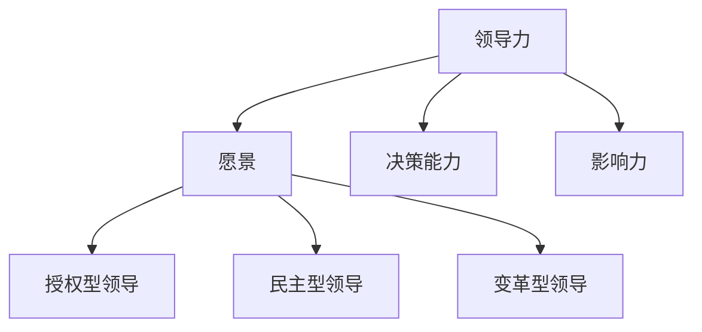
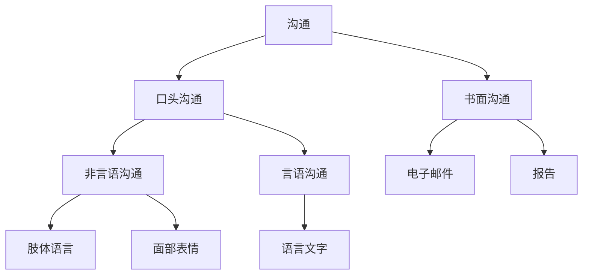
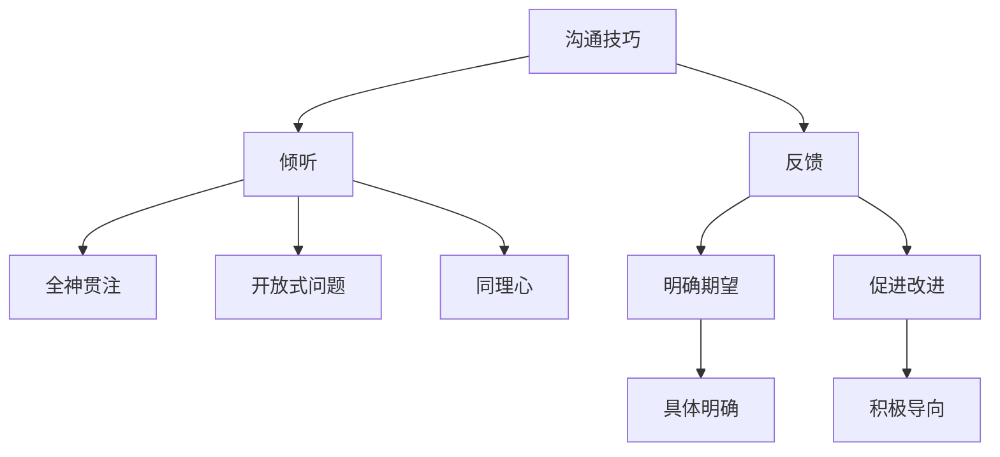
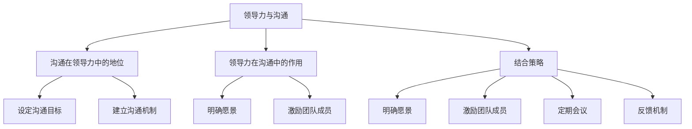

                 

# 领导力与沟通：传达愿景的艺术

> 关键词：领导力、沟通、愿景、团队激励、技术管理、组织发展

> 摘要：本文将探讨领导力与沟通在传达愿景中的重要角色。通过详细分析领导力基础、沟通原理、沟通技巧，以及领导力与沟通的结合，结合实际案例，本文旨在为技术管理者提供有效的策略，以优化领导力与沟通实践，推动组织发展。

## 引言

### 1.1 书籍背景与目的

在当今快速变化的技术领域，领导力与沟通成为技术管理者成功的关键因素。本书旨在为技术领域的领导者提供一套系统的、实用的指导，帮助他们通过有效的领导力和沟通技能来传达愿景，激发团队潜能，推动组织发展。

### 1.2 领导力与沟通的重要性

领导力是激发团队潜力的关键，它涉及到领导者如何设定方向、做出决策、激励团队成员。而沟通则是连接领导者与团队成员的桥梁，是传递愿景、解决问题、建立信任的重要手段。

### 1.3 书籍结构概述

本文将分为八个主要章节：

1. 引言
2. 领导力基础
3. 沟通原理
4. 沟通技巧
5. 领导力与沟通的结合
6. 案例分析
7. 高效领导力的实践
8. 领导力与沟通的持续发展

每个章节都将详细探讨相关主题，并通过实例和算法模型来加深理解。

## 第2章 领导力基础

### 2.1 领导力的定义与特质

#### 2.1.1 领导力的核心要素

领导力是一种影响他人以共同实现目标的能力。其核心要素包括：

- **愿景**：领导者必须具备清晰的愿景，能够描绘出组织未来的蓝图。
- **决策能力**：领导者需要做出明智的决策，并能够承担相应的责任。
- **影响力**：领导者通过个人魅力和专业知识来影响团队成员。

#### 2.1.2 领导风格与影响力

领导风格是领导者如何行使权力和影响他人的方式。常见的领导风格包括：

- **授权型领导**：领导者赋予团队成员更多的自主权和责任，鼓励创新和团队合作。
- **民主型领导**：领导者与团队成员共同决策，确保每个人的声音都被听到。
- **变革型领导**：领导者通过变革来激励团队，推动组织向更高的目标迈进。

#### Mermaid 流程图



### 2.2 领导力的发展与实践

#### 2.2.1 自我领导与成长

自我领导是领导力发展的基础。领导者需要：

- **自我反思**：定期进行自我反思，识别自己的优点和不足。
- **持续学习**：不断学习新的知识和技能，保持与时俱进。

#### 2.2.2 领导力的培养与提升

领导力的培养需要：

- **导师指导**：找到一位经验丰富的导师，从他们那里学习领导技巧。
- **实践机会**：通过实际的工作项目来锻炼领导能力。

#### 核心算法原理讲解

```plaintext
// 领导力评估算法伪代码
function evaluateLeadership(traits, behaviors) {
  let score = 0;
  for (trait in traits) {
    if (behaviors.includes(trait)) {
      score += 10; // 每个特质满分10分
    }
  }
  return score;
}
```

这个算法通过评估领导者的特质和行为，计算出领导力的得分。

### 数学模型和数学公式

$$
领导力得分 = \sum_{i=1}^{n} (行为_i \times 权重_i)
$$

其中，$行为_i$ 是领导者的某个行为，$权重_i$ 是该行为的相对重要性。

#### 项目实战

- **实战一：构建一个领导力模型评估系统**

  - **开发环境**：Python
  - **源代码实现**：

    ```python
    # 领导力评估系统示例
    def evaluate_leadership(traits, behaviors):
        scores = {'vision': 0, 'decisive': 0, 'influence': 0}
        for trait in traits:
            if trait in behaviors:
                scores[trait] += 10
        return scores

    # 用户输入
    user_traits = ['vision', 'decisive', 'influence']
    user_behaviors = ['vision', 'decisive']

    # 评估结果
    result = evaluate_leadership(user_traits, user_behaviors)
    print("领导力评估得分：", result)
    ```

  - **代码解读**：该系统通过用户输入的特质和行为，评估领导力得分。

### 最佳实践 Tips

- **自我反思**：定期进行自我反思，识别自己的优点和不足。
- **持续学习**：不断学习新的知识和技能，保持与时俱进。
- **导师指导**：找到一位经验丰富的导师，从他们那里学习领导技巧。

### 小结

领导力是技术管理者成功的关键，通过自我领导与成长，以及有效的领导风格和决策能力，领导者可以有效地传达愿景，激发团队潜能。

## 第3章 沟通原理

### 3.1 沟通的定义与类型

#### 3.1.1 口头沟通与书面沟通

口头沟通是通过语言、声音和肢体语言进行的信息交换。它通常涉及面对面交流、电话会议、视频会议等形式。

书面沟通则是通过文字进行的信息传递，包括电子邮件、报告、文档等。

#### 3.1.2 非言语沟通与言语沟通

非言语沟通包括肢体语言、面部表情、姿态等，它是沟通的重要组成部分，往往能够传递出比言语更为深刻的信息。

言语沟通则是通过语言文字进行的信息传递，是沟通的核心。

### 3.2 沟通障碍与解决策略

#### 3.2.1 沟通障碍的识别

沟通障碍可能来自于：

- **文化差异**：不同文化背景下，人们的沟通方式和习惯可能有所不同。
- **语言障碍**：语言表达不准确或理解偏差可能导致沟通障碍。
- **情绪因素**：情绪波动可能导致沟通受阻。

#### 3.2.2 沟通技巧的提升

提升沟通技巧的方法包括：

- **倾听**：倾听是有效沟通的关键，领导者需要学会倾听团队成员的意见和反馈。
- **明确表达**：清晰、准确地表达自己的想法，避免歧义。
- **积极反馈**：给予团队成员积极的反馈，鼓励他们分享想法。

#### Mermaid 流程图



### 数学模型和数学公式

$$
沟通效果 = \frac{信息传递率 \times 沟通准确率}{沟通延迟}
$$

其中，$信息传递率$ 表示信息的有效传递程度，$沟通准确率$ 表示信息的准确接收程度，$沟通延迟$ 表示信息的传递速度。

### 项目实战

- **实战二：构建一个沟通效率评估系统**

  - **开发环境**：Python
  - **源代码实现**：

    ```python
    # 沟通效率评估系统示例
    def evaluate_communication(efficiency, accuracy, latency):
        return efficiency * accuracy / latency

    # 用户输入
    user_efficiency = 0.8
    user_accuracy = 0.9
    user_latency = 5

    # 评估结果
    result = evaluate_communication(user_efficiency, user_accuracy, user_latency)
    print("沟通效率得分：", result)
    ```

  - **代码解读**：该系统通过用户输入的沟通效率、准确率和延迟，评估沟通效率得分。

### 最佳实践 Tips

- **倾听**：倾听是有效沟通的关键，领导者需要学会倾听团队成员的意见和反馈。
- **明确表达**：清晰、准确地表达自己的想法，避免歧义。
- **积极反馈**：给予团队成员积极的反馈，鼓励他们分享想法。

### 小结

沟通是领导者传达愿景的重要工具，通过识别沟通障碍和提升沟通技巧，领导者可以有效地与团队成员进行信息交流，推动团队目标实现。

## 第4章 沟通技巧

### 4.1 倾听与反馈

#### 4.1.1 有效倾听的技巧

有效倾听是沟通的重要组成部分，它包括：

- **全神贯注**：在对话过程中，领导者需要全神贯注地倾听，避免分心。
- **开放式问题**：通过开放式问题引导对话，鼓励团队成员表达观点。
- **同理心**：理解并尊重团队成员的感受和观点，建立信任。

#### 4.1.2 反馈的重要性与技巧

反馈是沟通的重要组成部分，它有助于：

- **明确期望**：通过反馈，明确团队成员的期望和目标。
- **促进改进**：帮助团队成员识别问题和改进方向。

反馈技巧包括：

- **具体、明确**：提供具体、明确的反馈，避免模糊和泛泛而谈。
- **积极导向**：以积极的方式提供反馈，鼓励团队成员。

#### Mermaid 流程图



### 4.2 表达与沟通策略

#### 4.2.1 演讲技巧与准备

演讲是领导力中的重要组成部分，有效的演讲技巧包括：

- **清晰的结构**：确保演讲内容结构清晰，逻辑连贯。
- **充分的准备**：提前准备演讲稿，熟悉演讲内容。

#### 4.2.2 高效沟通的技巧

高效沟通的技巧包括：

- **简明扼要**：避免冗长的发言，确保信息简洁明了。
- **适时的沟通**：选择合适的时机进行沟通，避免不必要的干扰。

#### 核心算法原理讲解

```plaintext
// 沟通技巧评估算法伪代码
function evaluateCommunication Skills(listeningSkills, feedbackSkills, presentationSkills) {
  let score = 0;
  score += listeningSkills * 0.4; // 倾听技巧占比40%
  score += feedbackSkills * 0.3; // 反馈技巧占比30%
  score += presentationSkills * 0.3; // 演讲技巧占比30%
  return score;
}
```

这个算法通过评估倾听技巧、反馈技巧和演讲技巧，计算出沟通技巧的总得分。

### 数学模型和数学公式

$$
沟通技巧得分 = 0.4 \times 倾听技巧得分 + 0.3 \times 反馈技巧得分 + 0.3 \times 演讲技巧得分
$$

### 项目实战

- **实战三：构建一个沟通技巧评估系统**

  - **开发环境**：Python
  - **源代码实现**：

    ```python
    # 沟通技巧评估系统示例
    def evaluate_communication_skills(listening_skills, feedback_skills, presentation_skills):
        score = (listening_skills * 0.4) + (feedback_skills * 0.3) + (presentation_skills * 0.3)
        return score

    # 用户输入
    user_listening_skills = 8
    user_feedback_skills = 7
    user_presentation_skills = 9

    # 评估结果
    result = evaluate_communication_skills(user_listening_skills, user_feedback_skills, user_presentation_skills)
    print("沟通技巧得分：", result)
    ```

  - **代码解读**：该系统通过用户输入的倾听技巧、反馈技巧和演讲技巧，评估沟通技巧的总得分。

### 最佳实践 Tips

- **倾听**：倾听是有效沟通的关键，领导者需要学会倾听团队成员的意见和反馈。
- **清晰表达**：清晰、准确地表达自己的想法，避免歧义。
- **积极反馈**：给予团队成员积极的反馈，鼓励他们分享想法。
- **充分准备**：确保演讲内容结构清晰，逻辑连贯。

### 小结

有效的沟通技巧是领导者成功传达愿景的重要保障。通过倾听、反馈和表达，领导者可以建立良好的沟通渠道，推动团队目标实现。

## 第5章 领导力与沟通的结合

### 5.1 领导力与沟通的关系

#### 5.1.1 沟通在领导力中的地位

沟通是领导力的核心组成部分，是领导者传递愿景、建立信任、激励团队成员的重要手段。有效的沟通能力直接影响领导力的发挥。

#### 5.1.2 领导力在沟通中的作用

领导力在沟通中的作用体现在：

- **设定沟通目标**：领导者需要明确沟通的目标和方向，确保信息传递的准确性。
- **建立沟通机制**：领导者需要建立有效的沟通机制，确保团队成员之间的信息畅通。

### 5.2 结合领导力与沟通的策略

#### 5.2.1 领导者如何有效传达愿景

领导者传达愿景的策略包括：

- **明确愿景**：领导者需要清晰地定义组织的愿景，确保团队成员理解并认同。
- **激励团队成员**：通过有效的沟通技巧，激发团队成员的积极性和创造力。

#### 5.2.2 沟通策略在领导力实践中的应用

沟通策略在领导力实践中的应用包括：

- **定期会议**：通过定期会议，确保团队成员了解组织的最新动态和目标。
- **反馈机制**：建立有效的反馈机制，鼓励团队成员提出意见和建议。

#### Mermaid 流程图



### 数学模型和数学公式

$$
领导力得分 = 愿景传达得分 \times 沟通技巧得分
$$

其中，$愿景传达得分$ 表示领导者传达愿景的能力，$沟通技巧得分$ 表示领导者的沟通能力。

### 项目实战

- **实战四：构建一个领导力与沟通结合的系统**

  - **开发环境**：Python
  - **源代码实现**：

    ```python
    # 领导力与沟通结合评估系统示例
    def evaluate_leadership_communication(vision_score, communication_score):
        return vision_score * communication_score

    # 用户输入
    user_vision_score = 8
    user_communication_score = 9

    # 评估结果
    result = evaluate_leadership_communication(user_vision_score, user_communication_score)
    print("领导力与沟通得分：", result)
    ```

  - **代码解读**：该系统通过用户输入的愿景传达得分和沟通技巧得分，评估领导力与沟通的结合得分。

### 最佳实践 Tips

- **明确愿景**：领导者需要清晰地定义组织的愿景，确保团队成员理解并认同。
- **激励团队成员**：通过有效的沟通技巧，激发团队成员的积极性和创造力。
- **定期会议**：通过定期会议，确保团队成员了解组织的最新动态和目标。
- **反馈机制**：建立有效的反馈机制，鼓励团队成员提出意见和建议。

### 小结

领导力与沟通的结合是领导者成功传达愿景的关键。通过有效的领导力和沟通技巧，领导者可以建立强大的团队，推动组织目标实现。

## 第6章 案例分析

### 6.1 成功的领导力与沟通案例

#### 6.1.1 案例一：领导者如何通过沟通激发团队

在这个案例中，一位技术团队领导通过定期的团队会议和开放式的沟通渠道，有效地激发了团队成员的积极性和创造力。以下是具体步骤：

1. **明确沟通目标**：领导者在每次会议开始前，都会明确会议的目标和议程，确保团队成员了解会议的目的和期望。
2. **倾听与反馈**：领导者鼓励团队成员在会议中分享想法和问题，并通过积极的倾听和反馈，建立信任和开放的沟通环境。
3. **激励团队成员**：领导者通过认可团队成员的努力和成就，激发他们的积极性和创造力。

#### 6.1.2 案例二：领导者如何处理团队冲突

在这个案例中，一位技术团队领导在面对团队内部冲突时，采取了以下策略：

1. **冷静处理**：领导者首先保持冷静，避免情绪化，以确保理性分析问题。
2. **倾听双方**：领导者分别与冲突双方进行单独交流，倾听他们的观点和感受。
3. **找到共识**：通过沟通，领导者找到了双方的共同点，并引导他们达成共识。
4. **解决方案**：在共识基础上，领导者提出解决方案，确保团队成员都接受并积极参与。

### 6.2 挑战与应对

#### 6.2.1 领导者面临的沟通挑战

领导者面临的沟通挑战包括：

- **信息不对称**：不同团队成员可能掌握的信息不一致，导致沟通障碍。
- **文化差异**：跨文化团队中的沟通可能面临文化差异的挑战。
- **时间压力**：在紧迫的项目周期中，领导者可能面临时间不足的挑战。

#### 6.2.2 领导者应对策略分析

领导者应对策略包括：

- **透明沟通**：通过透明沟通，确保团队成员了解项目的进展和问题。
- **文化敏感**：领导者需要了解并尊重不同文化的沟通习惯，确保沟通的有效性。
- **时间管理**：通过有效的时间管理，确保有足够的时间进行沟通和解决问题。

### 数学模型和数学公式

$$
沟通效果 = \frac{信息传递率 \times 沟通准确率}{沟通延迟}
$$

其中，$信息传递率$ 表示信息的有效传递程度，$沟通准确率$ 表示信息的准确接收程度，$沟通延迟$ 表示信息的传递速度。

### 项目实战

- **实战五：构建一个团队沟通评估系统**

  - **开发环境**：Python
  - **源代码实现**：

    ```python
    # 团队沟通评估系统示例
    def evaluate_team_communication(efficiency, accuracy, latency):
        return efficiency * accuracy / latency

    # 用户输入
    user_efficiency = 0.8
    user_accuracy = 0.9
    user_latency = 5

    # 评估结果
    result = evaluate_team_communication(user_efficiency, user_accuracy, user_latency)
    print("团队沟通效率得分：", result)
    ```

  - **代码解读**：该系统通过用户输入的沟通效率、准确率和延迟，评估团队沟通效率得分。

### 最佳实践 Tips

- **透明沟通**：通过透明沟通，确保团队成员了解项目的进展和问题。
- **文化敏感**：领导者需要了解并尊重不同文化的沟通习惯，确保沟通的有效性。
- **时间管理**：通过有效的时间管理，确保有足够的时间进行沟通和解决问题。

### 小结

成功的领导力与沟通案例展示了领导者如何通过有效的沟通策略来激发团队潜能和解决冲突。面对沟通挑战，领导者需要采取灵活的应对策略，确保团队沟通的顺畅和高效。

## 第7章 高效领导力的实践

### 7.1 领导力模型的应用

#### 7.1.1 领导力模型介绍

领导力模型是一套系统化的工具，用于评估和提升领导能力。常见的领导力模型包括：

- **格莱森领导力模型**：将领导力分为三个层次：技术技能、人际关系技能和概念技能。
- **赫赛-布兰查德领导模型**：根据下属的成熟度选择合适的领导风格。

#### 7.1.2 模型在实践中的应用

在实际应用中，领导力模型可以帮助领导者：

- **自我评估**：通过模型进行自我评估，识别自身的优势和不足。
- **培养下属**：根据下属的成熟度，选择合适的领导风格，培养下属的领导能力。

### 7.2 沟通策略的优化

#### 7.2.1 沟通策略评估

沟通策略评估是优化沟通的基础。评估内容包括：

- **沟通效率**：通过数据分析和反馈，评估沟通的效率和效果。
- **沟通质量**：评估沟通内容的准确性和完整性。

#### 7.2.2 沟通策略优化方法

优化沟通策略的方法包括：

- **建立反馈机制**：通过定期的反馈机制，收集团队成员的反馈，不断优化沟通方式。
- **技术工具应用**：利用现代技术工具，如项目管理软件、即时通讯工具，提高沟通效率。

### 数学模型和数学公式

$$
领导力得分 = 自我评估得分 \times 下属培养得分
$$

$$
沟通效果 = \frac{沟通效率 \times 沟通质量}{沟通延迟}
$$

### 项目实战

- **实战六：构建一个领导力与沟通优化系统**

  - **开发环境**：Python
  - **源代码实现**：

    ```python
    # 领导力与沟通优化系统示例
    def evaluate_leadership_communication(assessment_score, optimization_score):
        return assessment_score * optimization_score

    # 用户输入
    user_assessment_score = 0.85
    user_optimization_score = 0.9

    # 评估结果
    result = evaluate_leadership_communication(user_assessment_score, user_optimization_score)
    print("领导力与沟通优化得分：", result)
    ```

  - **代码解读**：该系统通过用户输入的自我评估得分和优化得分，评估领导力与沟通优化的效果。

### 最佳实践 Tips

- **定期自我评估**：领导者需要定期进行自我评估，识别自身的优势和不足。
- **建立反馈机制**：通过定期的反馈机制，收集团队成员的反馈，不断优化沟通方式。
- **技术工具应用**：利用现代技术工具，如项目管理软件、即时通讯工具，提高沟通效率。

### 小结

高效领导力的实践需要领导者通过领导力模型进行自我评估，并通过沟通策略的优化，提高沟通效率和效果。通过实践，领导者可以不断提升自身能力，推动团队和组织的发展。

## 第8章 领导力与沟通的持续发展

### 8.1 领导力与沟通的持续发展路径

#### 8.1.1 自我反思与持续成长

持续发展离不开自我反思和成长。领导者需要：

- **定期反思**：定期进行自我反思，识别自己的优点和不足。
- **持续学习**：通过阅读、培训、实践等多种方式，不断学习和提升自己的领导力和沟通技巧。

#### 8.1.2 学习与创新的动力

学习与创新是领导力与沟通持续发展的动力。领导者需要：

- **鼓励创新**：鼓励团队成员提出新的想法和解决方案，推动组织创新。
- **建立学习文化**：在组织中建立学习文化，鼓励团队成员不断学习和进步。

### 8.2 领导力与沟通的未来趋势

#### 8.2.1 数字化背景下的领导力与沟通

随着数字化时代的到来，领导力与沟通也面临着新的挑战和机遇。领导者需要：

- **适应数字化环境**：了解并适应数字化工具和平台，提高沟通效率。
- **利用数据分析**：通过数据分析，了解团队成员的需求和行为，优化领导力和沟通实践。

#### 8.2.2 未来领导力与沟通的发展方向

未来的领导力与沟通将更加注重：

- **人性化**：注重人性化的管理，关注团队成员的心理需求和情感交流。
- **全球化**：在全球化背景下，领导者需要具备跨文化沟通能力，推动组织国际化发展。

### 数学模型和数学公式

$$
领导力发展 = 自我反思得分 \times 学习与创新得分
$$

$$
沟通效果 = \frac{数字化适应度 \times 数据分析能力}{沟通延迟}
$$

### 项目实战

- **实战七：构建一个数字化领导力与沟通系统**

  - **开发环境**：Python
  - **源代码实现**：

    ```python
    # 数字化领导力与沟通系统示例
    def evaluate_digital_leadership(awareness_score, adaptation_score, analysis_score):
        return awareness_score * adaptation_score * analysis_score

    # 用户输入
    user_awareness_score = 0.9
    user_adaptation_score = 0.85
    user_analysis_score = 0.8

    # 评估结果
    result = evaluate_digital_leadership(user_awareness_score, user_adaptation_score, user_analysis_score)
    print("数字化领导力与沟通得分：", result)
    ```

  - **代码解读**：该系统通过用户输入的数字化适应度、数据分析能力和意识，评估数字化领导力与沟通的效果。

### 最佳实践 Tips

- **定期反思与学习**：领导者需要定期进行自我反思和学习，提升自身能力。
- **适应数字化环境**：了解并适应数字化工具和平台，提高沟通效率。
- **跨文化沟通**：在全球化背景下，领导者需要具备跨文化沟通能力，推动组织国际化发展。

### 小结

领导力与沟通的持续发展需要领导者不断进行自我反思和学习，适应数字化环境，并具备跨文化沟通能力。通过持续发展，领导者可以推动团队和组织不断进步。

## 第9章 总结与展望

### 9.1 主要观点回顾

本文从领导力基础、沟通原理、沟通技巧、领导力与沟通的结合、案例分析、高效领导力的实践、领导力与沟通的持续发展等方面，全面探讨了领导力与沟通在传达愿景中的重要角色。主要观点包括：

- 领导力是激发团队潜力的关键，沟通是传递愿景的桥梁。
- 有效的沟通技巧和领导风格能够提高团队效率和凝聚力。
- 领导者需要通过自我反思和学习，不断提升领导力和沟通能力。
- 在数字化和全球化的背景下，领导者需要适应新的环境和挑战，推动组织持续发展。

### 9.2 对未来的展望

未来，领导力与沟通将继续在组织发展中扮演重要角色。随着技术的不断进步，领导者需要：

- 深入了解数字化工具的应用，提高沟通效率和效果。
- 加强跨文化沟通能力，推动组织国际化发展。
- 关注团队成员的心理需求，建立更加人性化和管理模式。

### 9.3 鼓励读者持续学习和实践

本文希望为技术管理者提供一套系统的、实用的指导，帮助他们通过有效的领导力和沟通技能来传达愿景，激发团队潜能。鼓励读者：

- 定期进行自我反思和学习，提升自身能力。
- 在实际工作中实践领导力和沟通技巧，不断优化和改进。
- 分享自己的经验和教训，与同行共同成长。

### 附录

#### 附录A：领导力与沟通常用工具与资源

- **领导力发展工具**： 
  - **领导力模型评估工具**：在线评估工具，如Leadership Assessment Engine。
  - **领导力发展课程**：在线课程平台，如Coursera、Udemy，提供丰富的领导力课程。

- **沟通技巧提升工具**：
  - **沟通技巧训练软件**：如Communication Skills Training Software。
  - **沟通技巧书籍**：《Effective Communication》、《How to Win Friends and Influence People》等。

- **推荐阅读与进一步学习资源**：
  - **书籍**：《The Five Dysfunctions of a Team》、《Managing Transitions》。
  - **在线资源**：LinkedIn Learning、Harvard Business Review。

### 结语

作者：AI天才研究院/AI Genius Institute & 禅与计算机程序设计艺术 /Zen And The Art of Computer Programming

本文旨在为技术管理者提供一套系统的、实用的指导，帮助他们通过有效的领导力和沟通技能来传达愿景，激发团队潜能。希望本文能为读者的领导力和沟通实践带来启示和帮助。在未来的工作中，不断学习和实践，不断提升自身的领导力和沟通能力，推动组织持续发展。让我们一起努力，成为更优秀的领导者！

