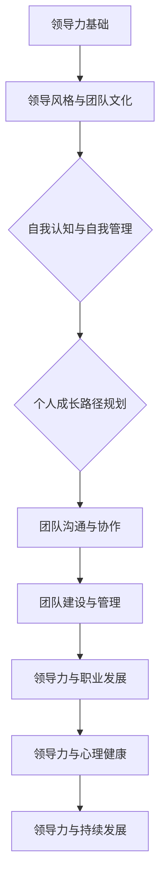

                 

### 文章标题

《领导力与职业发展：助力团队成员成长》

### 关键词

领导力、职业发展、团队管理、个人成长、心理健康、持续发展

### 摘要

本文旨在探讨领导力在职业发展中的重要作用，特别是在助力团队成员成长方面的具体实践。通过对领导力的定义、领导风格、团队沟通与协作、个人成长路径规划等关键主题的深入分析，本文将揭示领导力在职场中的核心价值。此外，文章还将探讨如何利用领导力实现职业晋升，以及如何通过团队建设和管理来促进团队成员的心理健康和持续发展。最终，本文将为读者提供一系列实用的领导力与职业发展建议，助力团队成员在职业生涯中取得成功。

---

### 第一部分：领导力基础

#### 第1章：领导力概述

##### 1.1 领导力的定义与重要性

**领导力是什么？**

领导力是一种能力，它涉及影响、激励和指导他人，以实现共同目标。这种能力不仅包括技术技能，还涉及人际交往、情感智慧和战略思维。

**领导力的本质**

领导力的本质可以概括为以下几个方面：

1. **影响力**：领导者能够影响他人的行为、思维和情感。
2. **愿景**：领导者能够描绘未来的蓝图，激发团队成员的积极性和创造力。
3. **决策**：领导者需要在复杂的环境中做出明智的决策。
4. **沟通**：领导者需要具备出色的沟通技巧，确保信息的有效传递。
5. **激励**：领导者能够激发团队成员的潜力，提高团队的整体绩效。

**领导力在职场中的重要性**

领导力在职场中的重要性不可忽视。以下是几个关键点：

1. **团队协作**：有效的领导力能够促进团队成员之间的协作，提高整体工作效率。
2. **创新能力**：领导者能够推动创新，为组织带来新的发展机遇。
3. **员工满意度**：良好的领导力能够提高员工的满意度和忠诚度，减少员工流失。
4. **组织绩效**：领导力直接影响组织的绩效和长期发展。

##### 1.2 领导风格与团队文化

**领导风格**

领导风格是指领导者在与团队成员互动时所采用的方式。以下是几种常见的领导风格：

1. **权威型**：领导者做出决策，并要求团队成员执行。
2. **民主型**：领导者鼓励团队成员参与决策过程，并尊重团队成员的意见。
3. **支持型**：领导者关心团队成员的情感需求，提供支持和帮助。
4. **变革型**：领导者通过激发团队成员的潜力，推动组织变革。

**团队文化**

团队文化是指团队成员共同遵守的价值观、信仰和行为规范。以下是几种重要的团队文化元素：

1. **信任**：团队成员之间相互信任，愿意分享信息和资源。
2. **开放性**：团队成员愿意接受新想法和不同观点，鼓励创新。
3. **责任感**：团队成员对自己的工作负责，也关心团队的整体绩效。
4. **合作**：团队成员愿意合作，共同实现团队目标。

**如何建立积极向上的团队文化**

1. **明确价值观**：领导者需要明确团队的价值观，并将其融入日常工作中。
2. **树立榜样**：领导者通过自己的行为来树立榜样，影响团队成员。
3. **激励与奖励**：领导者需要通过激励和奖励来鼓励团队成员，保持积极向上的氛围。
4. **沟通与反馈**：领导者需要保持开放的沟通渠道，及时给予团队成员反馈。

#### 第2章：自我管理与提升

##### 2.1 自我认知与自我管理

**自我认知的重要性**

自我认知是指一个人对自己的了解和认识，包括自己的性格、优点、缺点、价值观和目标等。以下是自我认知的重要性：

1. **提高自我效能感**：自我认知有助于个人认识到自己的能力和潜力，从而提高自我效能感。
2. **明确职业目标**：自我认知有助于个人明确自己的职业目标，制定有针对性的职业规划。
3. **提升人际关系**：自我认知有助于个人更好地理解他人，建立良好的人际关系。

**提升自我管理能力的方法**

1. **制定明确的目标**：个人需要明确自己的短期和长期目标，并制定具体的行动计划。
2. **时间管理**：个人需要合理安排时间，提高工作效率，避免拖延。
3. **情绪管理**：个人需要学会控制自己的情绪，保持冷静和理智。
4. **持续学习**：个人需要不断学习新知识和技能，提升自己的竞争力。

##### 2.2 个人成长路径规划

**职业生涯规划的重要性**

职业生涯规划是指个人根据自己的兴趣、能力和发展需求，制定的长期职业发展计划。以下是职业生涯规划的重要性：

1. **明确职业目标**：职业生涯规划有助于个人明确自己的职业目标，从而更有针对性地进行努力。
2. **提高职业满意度**：职业生涯规划有助于提高个人对工作的满意度，减少职业倦怠。
3. **实现职业发展**：职业生涯规划有助于个人在职业生涯中实现持续的发展和进步。

**个人成长路径的制定与调整**

1. **自我评估**：个人需要通过自我评估了解自己的兴趣、能力和价值观，确定适合自己的职业方向。
2. **设定目标**：个人需要设定明确的职业目标，并根据目标制定具体的行动计划。
3. **学习与成长**：个人需要通过不断学习和实践，提升自己的能力和技能。
4. **调整与优化**：个人需要根据实际情况，及时调整和优化自己的职业规划。

#### 第3章：团队沟通与协作

##### 3.1 沟通的重要性

**沟通的定义与分类**

沟通是指信息的传递和理解过程。根据沟通的目的和方式，沟通可以分为以下几类：

1. **单向沟通**：信息由一方传递给另一方，没有反馈。
2. **双向沟通**：信息在双方之间进行交流，有反馈。
3. **正式沟通**：通过正式渠道进行的沟通，如会议、报告等。
4. **非正式沟通**：通过非正式渠道进行的沟通，如聊天、社交活动等。

**提高沟通效果的策略**

1. **明确沟通目标**：在进行沟通之前，明确沟通的目标和目的，有助于提高沟通的效率。
2. **倾听与理解**：倾听他人的意见和需求，理解对方的立场和观点，有助于建立信任和合作。
3. **清晰表达**：用简单、清晰的语言表达自己的想法和意见，避免使用过于复杂的术语。
4. **积极反馈**：及时给予反馈，表达对对方的认同和赞赏，有助于增强沟通效果。

##### 3.2 团队协作技巧

**团队协作的优势与挑战**

**优势：**

1. **资源共享**：团队成员可以共享资源，提高工作效率。
2. **知识互补**：不同成员拥有不同的知识和技能，可以相互补充。
3. **创新思维**：团队成员可以相互启发，产生创新的想法。

**挑战：**

1. **沟通障碍**：团队成员之间可能存在沟通障碍，导致信息传递不畅。
2. **协调困难**：团队成员之间可能存在协调困难，导致工作进展缓慢。
3. **利益冲突**：团队成员之间可能存在利益冲突，导致合作关系紧张。

**如何有效激发团队成员的积极性**

1. **明确目标**：为团队成员设定明确的工作目标，确保他们了解自己的职责和任务。
2. **激励与奖励**：通过激励和奖励来鼓励团队成员，提高他们的工作积极性。
3. **信任与支持**：建立团队成员之间的信任和支持，减少沟通障碍和协调困难。
4. **培养团队精神**：通过团队活动和文化建设，培养团队成员的团队精神，提高合作效率。

#### 第4章：领导力与职业发展

##### 4.1 领导力与职业晋升

**职业晋升中的领导力因素**

领导力在职业晋升中起着至关重要的作用。以下是几个关键因素：

1. **领导能力**：领导者需要具备出色的领导能力，能够带领团队实现目标。
2. **人际关系**：领导者需要建立良好的人际关系，获得他人的认可和支持。
3. **决策能力**：领导者需要具备决策能力，能够在复杂的环境中做出明智的决策。
4. **影响力**：领导者需要具备影响力，能够影响团队成员的行为和思维。

**如何利用领导力实现职业发展**

1. **提升领导能力**：通过学习领导力理论和实践，提升自己的领导能力。
2. **建立人际关系**：通过参加社交活动，建立和维护良好的人际关系。
3. **勇于承担责任**：在工作和项目中，勇于承担责任，展示自己的领导力。
4. **不断学习**：通过不断学习和实践，提升自己的知识和技能。

##### 4.2 职业发展规划与领导力提升

**职业发展规划的重要性**

职业发展规划是指个人根据自己的兴趣、能力和发展需求，制定的长期职业发展计划。以下是职业发展规划的重要性：

1. **明确职业目标**：职业发展规划有助于个人明确自己的职业目标，从而更有针对性地进行努力。
2. **提高职业满意度**：职业发展规划有助于提高个人对工作的满意度，减少职业倦怠。
3. **实现职业发展**：职业发展规划有助于个人在职业生涯中实现持续的发展和进步。

**如何通过领导力提升实现职业发展**

1. **制定明确的职业规划**：根据个人兴趣和能力，制定明确的职业规划，确保自己有清晰的发展方向。
2. **提升领导能力**：通过学习和实践，提升自己的领导能力，为职业晋升奠定基础。
3. **建立人际关系**：通过参加社交活动，建立和维护良好的人际关系，为自己的职业发展创造机会。
4. **勇于承担责任**：在工作中，勇于承担责任，展示自己的领导力，为职业发展积累经验。

#### 第5章：团队建设与管理

##### 5.1 团队建设的重要性

**团队建设的定义与目的**

团队建设是指通过一系列活动和方法，提高团队成员之间的协作能力和团队整体绩效的过程。其目的包括：

1. **增强团队协作**：通过团队建设活动，增强团队成员之间的协作能力，提高团队的整体工作效率。
2. **提高团队凝聚力**：通过团队建设活动，增强团队成员之间的信任和凝聚力，提高团队的士气。
3. **促进个人成长**：通过团队建设活动，帮助团队成员认识到自己的优势和不足，促进个人成长。

**团队建设的方法与策略**

1. **团队活动**：组织团队活动，如户外拓展、团队建设游戏等，增强团队成员之间的互动和协作。
2. **沟通与反馈**：建立有效的沟通渠道，鼓励团队成员之间的沟通与反馈，解决冲突，提高团队协作效率。
3. **培训与发展**：为团队成员提供培训和发展机会，提高团队成员的技能和素质，增强团队的整体实力。
4. **目标设定**：明确团队的目标，为团队成员设定明确的工作任务和目标，激发团队成员的积极性和主动性。

##### 5.2 团队管理技巧

**团队管理的概念与分类**

团队管理是指领导者对团队成员进行组织、协调、激励和控制的过程。根据管理的方式和方法，团队管理可以分为以下几类：

1. **目标管理**：以目标为导向，通过设定和实现团队目标来管理团队。
2. **过程管理**：关注团队的工作过程，通过监控和调整工作过程来提高团队绩效。
3. **人员管理**：关注团队成员的管理和发展，通过激励、培训和发展来提高团队绩效。
4. **沟通管理**：注重团队成员之间的沟通与协作，通过有效的沟通来提高团队绩效。

**提高团队管理效率的技巧**

1. **明确团队目标**：为团队设定明确的目标，确保团队成员了解自己的工作职责和任务。
2. **制定合理的工作计划**：根据团队目标和资源，制定合理的工作计划，确保工作有序进行。
3. **建立有效的沟通渠道**：建立有效的沟通渠道，鼓励团队成员之间的沟通与反馈，解决冲突，提高团队协作效率。
4. **激励与奖励**：通过激励和奖励来鼓励团队成员，提高他们的工作积极性和绩效。
5. **培训与发展**：为团队成员提供培训和发展机会，提高团队成员的技能和素质，增强团队的整体实力。

#### 第6章：领导力与心理健康

##### 6.1 领导力与心理健康的关系

**心理健康对领导力的影响**

心理健康对领导力有着重要的影响。以下是几个关键点：

1. **决策能力**：心理健康良好的领导者能够更好地进行决策，减少错误和失误。
2. **沟通能力**：心理健康良好的领导者能够更好地与他人沟通，建立良好的人际关系。
3. **情绪管理**：心理健康良好的领导者能够更好地控制自己的情绪，保持冷静和理智。
4. **团队合作**：心理健康良好的领导者能够更好地促进团队合作，提高团队的凝聚力和绩效。

**如何保持心理健康**

1. **保持积极心态**：积极的心态有助于减轻压力，提高心理健康水平。
2. **合理安排时间**：合理安排时间，确保工作和生活的平衡，减少工作压力。
3. **保持健康的生活方式**：保持健康的饮食习惯、充足的睡眠和适量的运动，有助于保持身心健康。
4. **寻求专业帮助**：如果感到心理压力过大，可以寻求专业心理咨询师的帮助，缓解心理问题。

##### 6.2 心理健康管理技巧

**心理健康管理的策略**

1. **自我认知**：了解自己的情绪和需求，认识到自己的优点和不足，提高自我认知能力。
2. **情绪调节**：学会调节自己的情绪，保持冷静和理智，避免情绪波动过大。
3. **压力管理**：学会应对压力，通过适当的放松技巧和应对策略，减轻压力对心理健康的影响。
4. **人际关系**：建立良好的人际关系，与他人保持积极互动，提高心理支持水平。

**如何应对工作压力与心理疲劳**

1. **设定合理的目标**：设定合理的工作目标，避免过高的工作压力。
2. **合理安排工作任务**：合理安排工作任务，确保工作与休息时间的平衡。
3. **学会放松**：在工作之余，学会放松自己，进行适当的休闲活动。
4. **寻求支持**：在感到压力过大时，及时寻求家人、朋友或同事的支持和帮助。

#### 第7章：领导力与持续发展

##### 7.1 持续发展的重要性

**持续发展的定义与目标**

持续发展是指在满足当前需求的同时，不损害子孙后代满足其需求的能力。在领导力领域，持续发展的目标包括：

1. **提高领导能力**：通过持续学习和实践，提高领导者的领导能力和管理水平。
2. **促进组织发展**：通过领导者的努力，推动组织实现长期发展，提高组织的竞争力。
3. **实现社会责任**：领导者不仅要关注组织的利益，还要关注社会的利益，实现社会责任。

**如何实现领导力的持续发展**

1. **持续学习**：领导者需要不断学习新知识和技能，保持自己的竞争力。
2. **自我反思**：领导者需要定期进行自我反思，发现自己的不足，并采取改进措施。
3. **培养接班人**：领导者需要培养接班人，确保组织在领导者离开后能够持续发展。
4. **关注员工发展**：领导者需要关注员工的发展，为员工提供成长机会，提高员工的能力和素质。

##### 7.2 持续发展的策略与路径

**个人成长与组织发展的结合**

1. **明确目标**：领导者需要明确个人和组织的共同目标，确保个人成长与组织发展相结合。
2. **制定计划**：领导者需要制定详细的个人成长计划和组织发展计划，确保目标的实现。
3. **持续学习**：领导者需要持续学习，提高自己的领导能力和管理水平。
4. **培养员工**：领导者需要培养员工，提高员工的能力和素质，为组织发展提供人才支持。

**持续发展的实践案例**

**案例一：谷歌的领导力发展计划**

谷歌通过一系列的领导力发展计划，帮助领导者提高领导能力和管理水平。这些计划包括：

1. **领导力培训课程**：为领导者提供各种领导力培训课程，帮助他们学习新知识和技能。
2. **导师制度**：为领导者配备导师，提供指导和支持，帮助他们解决工作中的问题。
3. **领导力反馈**：定期收集领导者的反馈，了解他们的领导风格和能力，并提供改进建议。

**案例二：华为的员工发展计划**

华为通过一系列的员工发展计划，帮助员工提高能力和发展职业生涯。这些计划包括：

1. **内部培训**：为员工提供各种内部培训课程，帮助他们学习新知识和技能。
2. **项目机会**：为员工提供参与项目的机会，让他们在实践中锻炼能力。
3. **职业规划**：为员工提供职业规划指导，帮助他们明确职业目标和发展路径。

**附录A：领导力与职业发展相关书籍推荐**

1. **《领导力五项修炼》**
   - 作者：斯蒂芬·罗宾斯
   - 简介：本书详细介绍了领导力的五个关键领域，包括领导力理论、领导者自我发展、领导力实践等。

2. **《影响力》**
   - 作者：罗伯特·西奥迪尼
   - 简介：本书探讨了影响力的六个原则，帮助领导者更好地影响他人，实现组织目标。

3. **《团队协作的智慧》**
   - 作者：杰瑞·韦斯伯德
   - 简介：本书介绍了团队协作的十个关键要素，包括沟通、合作、信任等，帮助领导者打造高效的团队。

4. **《职业规划》**
   - 作者：大卫·考夫曼
   - 简介：本书提供了实用的职业规划策略，帮助个人明确职业目标，实现职业生涯的成功。

**附录B：领导力与职业发展在线课程推荐**

1. **《领导力基础》**
   - 平台：网易云课堂
   - 简介：本课程介绍了领导力的基本概念和原理，包括领导力模型、领导风格等。

2. **《团队协作与管理》**
   - 平台：Coursera
   - 简介：本课程探讨了团队协作和管理的关键技巧，包括沟通、协调、冲突管理等。

3. **《职业规划与自我发展》**
   - 平台：腾讯课堂
   - 简介：本课程提供了职业规划的理论和实践指导，帮助个人制定有效的职业发展计划。

**附录C：领导力与职业发展社交媒体资源推荐**

1. **LinkedIn**
   - 简介：LinkedIn是一个专业的社交媒体平台，提供丰富的领导力与职业发展相关内容，包括文章、博客、论坛等。

2. **Twitter**
   - 简介：Twitter上有许多知名领导力专家和职业发展顾问的账号，可以关注他们的动态，获取最新资讯。

3. **微信公众号**
   - 简介：许多领导力与职业发展相关的微信公众号提供高质量的文章和教程，可以关注并订阅。

**附录D：领导力与职业发展的 Mermaid 流程图**



**附录E：领导力与核心算法原理讲解**

```python
## 伪代码：领导力评分算法

def leadership_score(personal_skills, team_performance, psychological_health):
    # 定义权重
    skill_weight = 0.5
    performance_weight = 0.3
    health_weight = 0.2
    
    # 计算得分
    score = (personal_skills * skill_weight) + (team_performance * performance_weight) + (psychological_health * health_weight)
    
    return score
```

**附录F：数学模型与公式**

$$
\text{领导力综合得分} = w_1 \times \text{个人技能} + w_2 \times \text{团队表现} + w_3 \times \text{心理健康}
$$

其中，$w_1, w_2, w_3$ 分别为个人技能、团队表现、心理健康的权重。

---

**附录G：项目实战**

**开发环境搭建**

为了实现领导力评分算法，我们需要搭建一个基本的开发环境。以下是一个简单的步骤：

1. 安装 Python 解释器
2. 安装所需的 Python 库，如 NumPy 和 Pandas
3. 创建一个 Python 脚本文件，用于实现评分算法

**源代码实现与解读**

```python
import numpy as np

def leadership_score(personal_skills, team_performance, psychological_health):
    skill_weight = 0.5
    performance_weight = 0.3
    health_weight = 0.2
    
    score = (personal_skills * skill_weight) + (team_performance * performance_weight) + (psychological_health * health_weight)
    
    return score

# 测试评分算法
personal_skills = 8
team_performance = 7
psychological_health = 9

score = leadership_score(personal_skills, team_performance, psychological_health)
print("领导力综合得分：", score)
```

**代码应用解读与分析**

在这个例子中，我们使用了一个简单的评分算法来评估领导力的综合得分。算法中，我们定义了三个关键指标：个人技能、团队表现和心理健康的权重。通过计算这三个指标的加权平均，我们可以得到一个综合得分。

**实际案例分析与详细讲解剖析**

假设我们有三位团队成员，他们的个人技能、团队表现和心理健康的得分如下：

| 姓名 | 个人技能 | 团队表现 | 心理健康 |
| ---- | -------- | -------- | -------- |
| 小明 | 9        | 8        | 7        |
| 小红 | 8        | 9        | 8        |
| 小李 | 7        | 7        | 9        |

使用领导力评分算法，我们可以计算他们的综合得分：

- 小明的领导力综合得分 = (9 * 0.5) + (8 * 0.3) + (7 * 0.2) = 4.5 + 2.4 + 1.4 = 8.3
- 小红的领导力综合得分 = (8 * 0.5) + (9 * 0.3) + (8 * 0.2) = 4 + 2.7 + 1.6 = 8.3
- 小李的领导力综合得分 = (7 * 0.5) + (7 * 0.3) + (9 * 0.2) = 3.5 + 2.1 + 1.8 = 7.4

通过分析得分，我们可以看出，小明和小红的领导力综合得分较高，他们的个人技能、团队表现和心理健康的权重较高。而小李的领导力综合得分较低，需要进一步提升自己的个人技能和心理健康水平。

**项目小结**

通过这个实际案例，我们展示了如何使用领导力评分算法来评估团队成员的领导力综合得分。这个评分算法提供了一个量化的方式来评估领导力，有助于领导者识别和培养具有领导潜力的成员。

**最佳实践 Tips**

1. 在实际应用中，可以根据组织的具体需求和实际情况，调整评分算法的权重，使其更符合组织的价值观和目标。

2. 定期评估团队成员的领导力综合得分，及时识别和解决潜在问题，促进团队成员的持续成长。

3. 结合领导力评分算法，制定针对性的培训和发展计划，提高团队成员的领导力水平。

**注意事项**

1. 领导力评分算法只是一个辅助工具，不能完全代表一个人的领导能力。领导者需要结合实际情况，进行全面评估。

2. 在使用评分算法时，要确保数据的准确性和可靠性，避免因数据问题导致评估结果不准确。

**拓展阅读**

1. **《领导力的五项修炼》**：斯蒂芬·罗宾斯
2. **《影响力》**：罗伯特·西奥迪尼
3. **《团队协作的智慧》**：杰瑞·韦斯伯德

---

### 总结

本文通过深入探讨领导力与职业发展的关系，揭示了领导力在团队管理、个人成长和职业晋升中的重要作用。从领导力的定义、领导风格、团队沟通与协作，到个人成长路径规划、心理健康管理，再到领导力与持续发展，本文提供了全方位的领导力与职业发展指导。希望读者能从中获得启示，提升自己的领导力，实现职业发展的成功。作者：AI天才研究院/AI Genius Institute & 禅与计算机程序设计艺术 /Zen And The Art of Computer Programming。

