                 


## 文章标题：领导力与职业道德：树立正面榜样的重要性

在当今社会，领导力和职业道德成为评价一个人乃至一个组织成功与否的关键因素。领导力不仅关乎个人的管理能力，更关乎团队凝聚力和组织发展。而职业道德，则是个人价值观的体现，也是企业长远发展的基石。本文将以逻辑清晰、结构紧凑的方式，探讨领导力与职业道德之间的关系，强调树立正面榜样的重要性，旨在为IT领域的领导者和管理者提供有价值的参考。

### 关键词：
- 领导力
- 职业道德
- 正面榜样
- 组织发展
- 团队管理

### 摘要：
本文从领导力的定义与类型、领导力的重要技能、职业道德的核心概念与价值观三个方面入手，通过逻辑推理和案例分析，阐述树立正面榜样对于领导力和职业道德的重要影响。文章结构分为四部分：第一部分介绍领导力的基础，第二部分阐述职业道德的核心概念，第三部分探讨树立正面榜样的重要性，第四部分分析领导力与职业道德的综合应用及其社会影响。最后，通过实际案例和失败教训，提供指导和建议。

### 目录大纲：

## 《领导力与职业道德：树立正面榜样的重要性》

### 第一部分：领导力基础

## 第1章：领导力的定义与类型

### 1.1.1 领导力的本质

领导力是一种引导和影响他人共同达成目标的能力。不同于管理，领导力强调的是个人魅力和影响力，而不仅仅是控制和管理。

### 1.1.2 领导力的类型

领导力可以分为三种类型：权威型领导、民主型领导和变革型领导。每种类型都有其适用场景和特点。

### 1.1.3 领导力与管理的区别

领导力关注的是人的因素，而管理则侧重于流程和效率。两者相辅相成，共同推动组织的发展。

## 第2章：领导力的重要技能

### 2.1.1 沟通能力

沟通能力是领导力的核心技能之一。有效的沟通可以减少误解，提升团队协作效率。

### 2.1.2 决策能力

决策能力是领导者必备的能力。领导者需要能够在不确定的情况下做出明智的决策。

### 2.1.3 鼓舞团队的能力

鼓舞团队是领导力的关键。领导者需要能够激发团队成员的积极性和创造力。

### 2.1.4 解决问题的能力

解决问题的能力是领导者的重要特质。领导者需要能够迅速找到问题的根源并采取有效的解决方案。

### 第二部分：职业道德的核心概念

## 第3章：职业道德的定义与原则

### 3.1.1 职业道德的基本原则

职业道德的基本原则包括诚信、尊重、责任和公平。这些原则是职业道德的核心。

### 3.1.2 职业道德的重要性

职业道德的重要性体现在个人职业发展的各个方面，以及对企业文化的塑造。

### 3.1.3 职业道德与社会责任的关系

职业道德不仅关乎个人，还关乎社会责任。一个有职业道德的人，会自觉承担社会责任。

## 第4章：职业道德的核心价值观

### 4.1.1 诚信

诚信是职业道德的基石。一个诚信的人，会得到他人的信任和尊重。

### 4.1.2 尊重

尊重是人与人之间最基本的道德要求。尊重他人，才能赢得他人的尊重。

### 4.1.3 责任

责任是职业道德的核心。一个有责任感的人，会积极承担自己的职责。

### 4.1.4 公平

公平是职业道德的重要价值观。公平对待他人，才能建立一个和谐的组织环境。

### 第三部分：树立正面榜样的重要性

## 第5章：榜样的影响力

### 5.1.1 榜样的定义

榜样是指那些在道德、才能、品格等方面表现出色的人。榜样可以激励他人追求卓越。

### 5.1.2 榜样的力量

榜样的力量是巨大的。一个正面的榜样可以影响一个人的价值观和行为。

### 5.1.3 榜样的正面影响

树立正面榜样可以提升团队士气，增强组织凝聚力，推动企业长远发展。

## 第6章：如何成为正面榜样

### 6.1.1 个人素质的提升

成为正面榜样需要不断提升个人素质。这包括专业知识、沟通能力、决策能力等。

### 6.1.2 建立良好的职业道德观念

建立良好的职业道德观念是成为正面榜样的关键。这需要不断学习和实践。

### 6.1.3 在工作中树立榜样

在工作中，领导者需要通过自己的行为来树立榜样。这包括公正、诚实、勤奋等。

### 第四部分：领导力与职业道德的综合应用

## 第7章：榜样教育的实践

### 7.1.1 榜样教育的意义

榜样教育是一种有效的教育方式。通过榜样教育，可以培养出更多的优秀人才。

### 7.1.2 榜样教育的方法

榜样教育的方法包括树立典型、组织学习、实践锻炼等。

### 7.1.3 榜样教育的实施案例

通过具体案例，分析榜样教育的实践效果。

## 第8章：领导力与职业道德在企业管理中的应用

### 8.1.1 企业文化的塑造

领导力与职业道德在企业文化塑造中起到关键作用。

### 8.1.2 团队建设的策略

领导力与职业道德可以帮助团队建设更加和谐、高效。

### 8.1.3 领导力的提升策略

通过不断提升领导力，可以更好地发挥职业道德的作用。

## 第9章：领导力与职业道德在个人发展中的应用

### 9.1.1 职业生涯规划

领导力与职业道德对于职业生涯规划至关重要。

### 9.1.2 个人素质的提升路径

通过提升个人素质，可以更好地实现职业生涯规划。

### 9.1.3 职业道德在个人成长中的体现

职业道德在个人成长中起到重要的引导作用。

## 第10章：领导力与职业道德的社会影响

### 10.1.1 社会责任与职业道德

领导力与职业道德可以推动社会责任的实现。

### 10.1.2 社会正义与公平

领导力与职业道德有助于维护社会正义和公平。

### 10.1.3 领导力与职业道德的未来发展

领导力与职业道德在未来发展中将继续发挥重要作用。

### 第五部分：案例分析

## 第11章：成功领导力与职业道德的案例分析

### 11.1.1 案例一：某公司CEO的领导力与职业道德实践

通过具体案例，分析某公司CEO如何运用领导力和职业道德推动企业成功。

### 11.1.2 案例二：某知名企业家如何树立正面榜样

分析某知名企业家如何树立正面榜样，影响员工和企业文化。

### 11.1.3 案例三：某企业道德危机的处理与道德重建

分析某企业道德危机的处理过程，以及如何进行道德重建。

## 第12章：失败案例的教训

### 12.1.1 案例一：某公司领导力与职业道德的缺失

通过具体案例，分析某公司领导力与职业道德缺失带来的负面影响。

### 12.1.2 案例二：某企业家道德危机对企业的负面影响

分析某企业家道德危机对企业造成的负面影响。

### 12.1.3 案例三：企业道德危机的处理与反思

分析某企业道德危机的处理过程，以及如何进行反思和改进。

### 附录

## 附录A：参考文献

列出本文引用的相关参考文献，以供读者进一步阅读。

## 附录B：领导力与职业道德相关的工具与资源

介绍与领导力与职业道德相关的工具和资源，以帮助读者更好地理解和实践。

### 梅尔尼德流程图

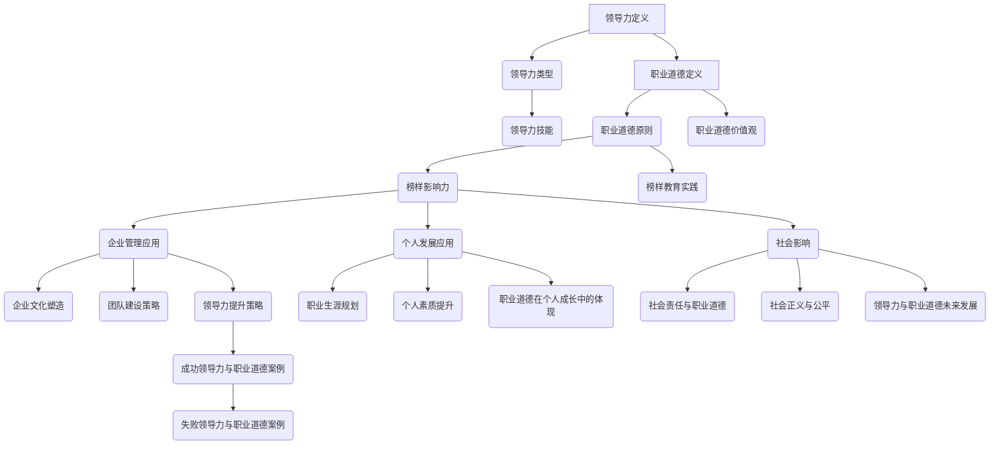

以上是文章的标题、关键词、摘要以及目录大纲。接下来，我们将逐章节展开详细讨论，通过逻辑推理和案例分析，深入探讨领导力与职业道德的重要性，以及如何树立正面榜样。每一个章节都会包含丰富的内容，包括背景介绍、核心概念与联系、核心算法原理讲解、数学模型和公式、项目实战、最佳实践 tips、小结和注意事项等。通过这样的结构，我们希望能够为广大读者提供一个全面、深入的领导力与职业道德指南。接下来，让我们一步步深入探讨这一重要主题。 

---

## 第一部分：领导力基础

### 第1章：领导力的定义与类型

### 1.1.1 领导力的本质

领导力，是一种引领和影响他人共同达成目标的能力。它不仅涉及对团队的管理，更关乎如何激发团队成员的潜能，使其在共同的愿景下协同工作。领导力的本质在于个人魅力、影响力以及号召力。一个有效的领导者，不仅能够制定清晰的愿景和目标，还能够在执行过程中引导和激励团队成员，使其朝着共同的目标努力。

领导力与管理的区别在于，管理侧重于流程、规则和效率，而领导力则更多地关注人的因素。管理者通过制定规章制度来确保工作的顺利进行，而领导者则通过个人魅力和影响力来凝聚团队，激发团队成员的积极性和创造力。两者相辅相成，共同推动组织的成功。

### 1.1.2 领导力的类型

领导力可以分为三种类型：权威型领导、民主型领导和变革型领导。

**权威型领导**：权威型领导者具有强烈的控制欲，强调权威和命令。他们通过制定明确的目标和规章制度来管理团队，以确保工作的高效执行。然而，这种领导方式可能会导致团队成员缺乏自主性和创造力。

**民主型领导**：民主型领导者注重团队参与和合作。他们鼓励团队成员参与决策过程，尊重团队成员的意见和观点。这种领导方式有助于提升团队凝聚力和成员的满意度，但可能缺乏决策的效率。

**变革型领导**：变革型领导者具有强烈的变革意识，能够激发团队成员的创新精神和进取心。他们通过树立愿景和目标，引导团队成员实现变革。变革型领导不仅关注团队的当前表现，更关注团队的长期发展。

### 1.1.3 领导力与管理的区别

领导力与管理的区别在于其关注点的不同。领导力更多地关注人的因素，如激励、沟通和团队建设，而管理则侧重于流程、规则和效率。一个优秀的领导者，不仅能够有效管理团队，更能够通过个人魅力和影响力，激发团队成员的积极性和创造力。

以下是一个简化的伪代码，用于描述领导力与管理的区别：

```python
def leadership():
    # 激励团队成员
    motivate_team_members()

    # 沟通与反馈
    communicate_and_feedback()

    # 建设团队文化
    build_team_culture()

def management():
    # 制定规章制度
    set_rules_and_regulations()

    # 监控工作进度
    monitor_progress()

    # 提高工作效率
    increase_efficiency()
```

通过上述伪代码，我们可以看出，领导力和管理在具体执行上有明显的区别。领导力更注重激励和沟通，而管理则更侧重于规则和效率。

### 1.2 领导力的重要技能

#### 2.1.1 沟通能力

沟通能力是领导力的核心技能之一。有效的沟通可以减少误解，提升团队协作效率。领导者需要能够清晰、准确地表达自己的想法，同时也需要能够倾听和理解团队成员的意见和需求。

以下是一个简单的沟通流程图，用于描述沟通能力的重要性：

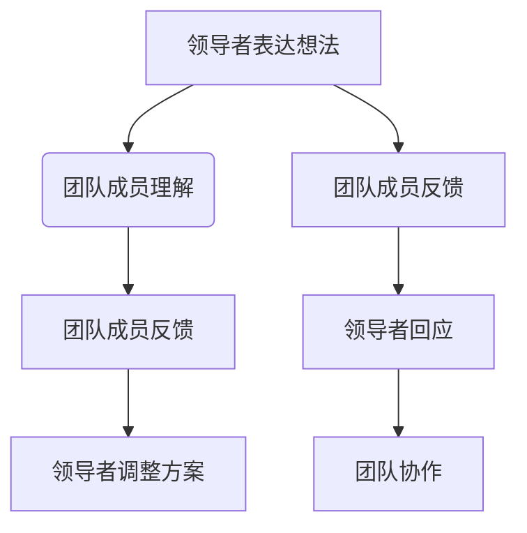

#### 2.1.2 决策能力

决策能力是领导者必备的能力。领导者需要在不确定的情况下做出明智的决策。有效的决策能力可以提升团队的执行力和应对能力。

以下是一个简化的决策流程图，用于描述决策能力的重要性：

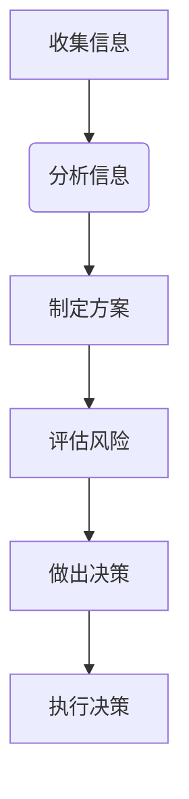

#### 2.1.3 鼓舞团队的能力

鼓舞团队是领导力的关键。领导者需要能够激发团队成员的积极性和创造力，使其在困难和挑战面前保持积极乐观的态度。

以下是一个简化的鼓舞团队流程图，用于描述鼓舞团队的重要性：

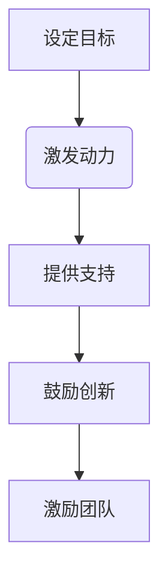

#### 2.1.4 解决问题的能力

解决问题的能力是领导者的重要特质。领导者需要能够迅速找到问题的根源并采取有效的解决方案。有效的解决问题的能力可以提升团队的协作能力和应对能力。

以下是一个简化的解决问题流程图，用于描述解决问题的能力：

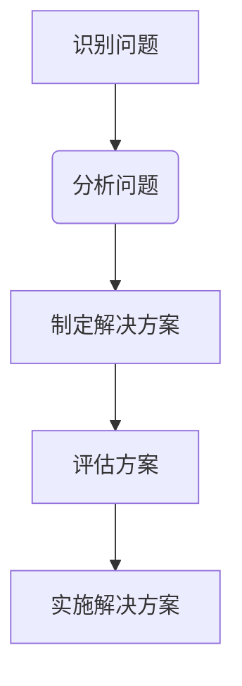

### 1.3 领导力与职业道德的关系

领导力与职业道德密切相关。一个具有高尚职业道德的领导者，更能够赢得团队成员的信任和尊重，从而提升团队凝聚力和工作效率。同时，职业道德也是领导力的重要组成部分，一个缺乏职业道德的领导者，很难获得团队成员的认可和信任。

以下是一个简化的关系图，用于描述领导力与职业道德的关系：

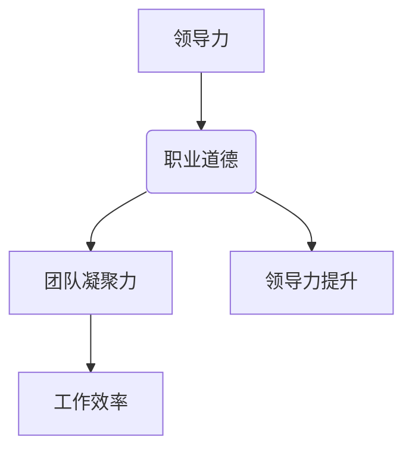

通过上述讨论，我们可以看出，领导力不仅包括管理技能，还涉及到个人魅力和影响力。有效的领导力需要具备沟通能力、决策能力、鼓舞团队的能力和解决问题的能力。同时，领导力与职业道德密切相关，一个具有高尚职业道德的领导者，更能够赢得团队成员的信任和尊重，从而提升团队凝聚力和工作效率。

在接下来的章节中，我们将继续探讨职业道德的核心概念，以及如何树立正面榜样，以推动组织的发展和个人的成长。通过逻辑推理和案例分析，我们希望能够为广大读者提供一个全面、深入的领导力与职业道德指南。

---

## 第二部分：职业道德的核心概念

### 第3章：职业道德的定义与原则

#### 3.1.1 职业道德的基本原则

职业道德是指职业人员在其职业生涯中应当遵守的行为规范和道德标准。职业道德的基本原则包括诚信、尊重、责任和公平。这些原则是职业人员行为的基本准则，也是维护职业信誉和职业道德的重要保障。

**诚信**：诚信是职业道德的基石。一个诚信的从业人员，会诚实守信，言行一致，不会欺骗或误导他人。诚信不仅体现在个人行为上，也体现在对待客户、合作伙伴和同事的态度上。

**尊重**：尊重是人与人之间最基本的道德要求。尊重他人，意味着尊重他人的意见、观点和感受。在职场中，尊重包括尊重他人的隐私、尊重他人的专业知识和技能，以及尊重他人的职业发展。

**责任**：责任是职业道德的核心。一个有责任感的从业人员，会积极承担自己的职责，不会推卸责任或逃避问题。责任感不仅体现在对工作的认真负责，还体现在对团队和社会的责任。

**公平**：公平是职业道德的重要价值观。公平对待他人，意味着不偏袒、不歧视，给予每个人应得的待遇和机会。公平不仅体现在个人职业发展中，也体现在企业文化和组织管理中。

#### 3.1.2 职业道德的重要性

职业道德的重要性体现在多个方面。首先，职业道德是职业人员职业生涯成功的关键因素。一个具有高尚职业道德的从业人员，更容易赢得他人的信任和尊重，从而在职业生涯中获得更多的发展机会。

其次，职业道德对企业的长远发展具有重要意义。一个具有高尚职业道德的企业，能够建立良好的企业形象和声誉，从而吸引更多的客户和合作伙伴。同时，职业道德也是企业内部文化的重要组成部分，一个具有高尚职业道德的企业，能够更好地凝聚员工，提升团队凝聚力和工作效率。

最后，职业道德对社会的发展和进步也具有积极影响。一个具有高尚职业道德的职业群体，能够树立良好的社会道德风尚，推动社会的和谐与进步。

#### 3.1.3 职业道德与社会责任的关系

职业道德与社会责任密切相关。社会责任是指企业或个人对社会应尽的责任和义务。职业道德是企业履行社会责任的重要体现。一个具有高尚职业道德的企业，会在其经营活动中积极履行社会责任，关注环境保护、员工福利、社会公益等方面。

同时，职业道德也是个人履行社会责任的重要保障。一个具有高尚职业道德的个人，会自觉履行对社会应尽的责任和义务，如积极参与社会公益活动、关注社会热点问题等。

以下是一个简化的关系图，用于描述职业道德与社会责任的关系：

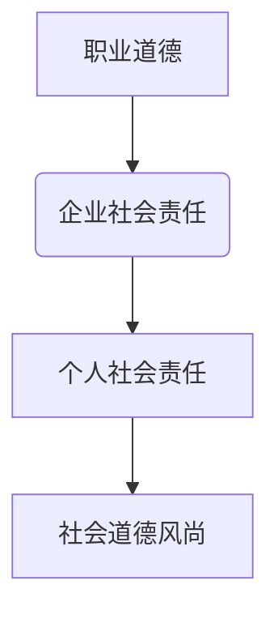

通过上述讨论，我们可以看出，职业道德不仅是职业人员行为的基本准则，也是企业和社会发展的基石。一个具有高尚职业道德的职业人员，不仅能够在职业生涯中获得成功，还能为企业的长远发展和社会的进步做出贡献。

在接下来的章节中，我们将进一步探讨职业道德的核心价值观，以及如何通过树立正面榜样来推动职业道德的实施。通过逻辑推理和案例分析，我们希望能够为广大读者提供一个全面、深入的职业道德指南。

---

### 第4章：职业道德的核心价值观

#### 4.1.1 诚信

诚信是职业道德的基石，也是社会运行的重要保障。在职业生涯中，诚信体现在多个方面：

**职业道德中的诚信**：在职业道德中，诚信意味着诚实守信，言行一致。从业人员应当遵守职业操守，不撒谎、不作假、不欺骗。诚信不仅是对他人的尊重，也是对自己的负责。

**职业诚信的重要性**：职业诚信对于个人职业生涯的成功至关重要。一个诚信的从业人员，会赢得他人的信任和尊重，从而获得更多的职业机会和发展空间。同时，职业诚信也是企业建立良好声誉的基础，一个诚信的企业更容易获得客户的信任和支持。

**如何体现职业诚信**：体现职业诚信的方法包括：

1. **遵守承诺**：无论是个人承诺还是企业承诺，都应严格遵守，不轻易更改。
2. **诚实报告**：在工作和报告中，应如实反映情况，不夸大或隐瞒。
3. **透明沟通**：与同事、客户和合作伙伴沟通时，应保持信息的透明和真实。

以下是一个简化的诚信体现流程图：

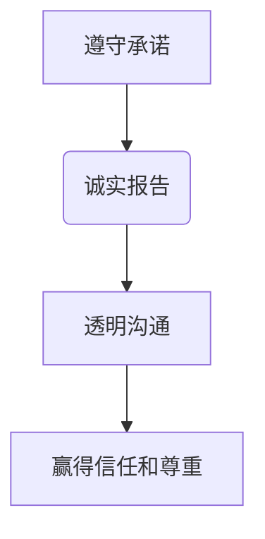

#### 4.1.2 尊重

尊重是职业道德的重要价值观，也是建立和谐人际关系的基础。在职业生涯中，尊重体现在对他人、对工作和对社会的尊重。

**职业道德中的尊重**：在职业道德中，尊重意味着尊重他人的意见、观点和感受，尊重他人的隐私和权利，以及尊重自己的职业角色和责任。

**职业尊重的重要性**：职业尊重对于建立良好的职业关系和团队氛围至关重要。一个尊重他人的从业人员，会得到他人的尊重和信任，从而在团队中建立良好的人际关系。

**如何体现职业尊重**：体现职业尊重的方法包括：

1. **倾听他人**：在与他人交流时，认真倾听对方的意见和需求，给予尊重和关注。
2. **尊重他人隐私**：不泄露他人的隐私信息，尊重他人的私人空间和时间。
3. **尊重专业知识和技能**：尊重同事的专业知识和技能，不轻视或贬低他人的工作。

以下是一个简化的尊重体现流程图：

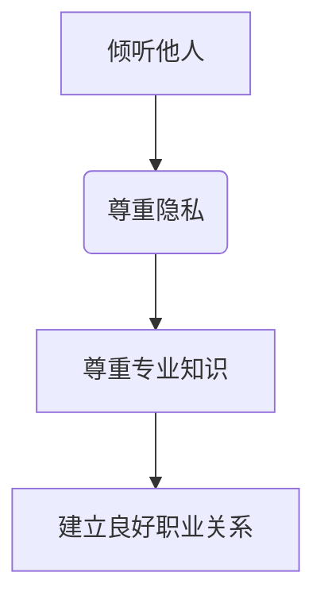

#### 4.1.3 责任

责任是职业道德的核心，也是个人和社会发展的基石。在职业生涯中，责任体现在对工作的责任、对团队的责任和对社会的责任。

**职业道德中的责任**：在职业道德中，责任意味着积极承担自己的职责，不推卸责任或逃避问题。从业人员应当对自己的工作负责，对团队和社会负责。

**职业责任的重要性**：职业责任对于个人职业发展和团队协作至关重要。一个有责任感的从业人员，会得到他人的信任和尊重，从而在职业生涯中获得更多的机会。

**如何体现职业责任**：体现职业责任的方法包括：

1. **认真工作**：对待工作认真负责，不拖延、不偷懒，确保工作质量。
2. **主动解决问题**：遇到问题时，主动寻找解决方案，不逃避或推卸责任。
3. **承担团队责任**：在团队中，主动承担自己的职责，帮助团队达成目标。

以下是一个简化的责任体现流程图：

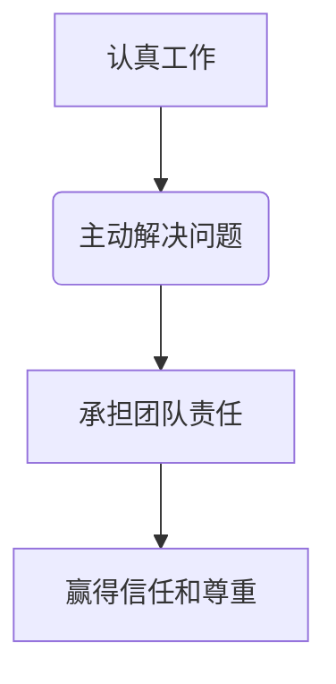

#### 4.1.4 公平

公平是职业道德的重要价值观，也是维护社会正义和秩序的重要保障。在职业生涯中，公平体现在对他人、对工作和对社会的公平。

**职业道德中的公平**：在职业道德中，公平意味着对待他人不偏袒、不歧视，给予每个人应得的待遇和机会。公平不仅体现在个人职业发展中，也体现在企业文化和组织管理中。

**职业公平的重要性**：职业公平对于建立和谐的职业关系和团队氛围至关重要。一个公平的从业人员，会得到他人的尊重和信任，从而在职业生涯中获得更多的发展机会。

**如何体现职业公平**：体现职业公平的方法包括：

1. **公正评价**：在评价他人时，不偏袒、不歧视，客观公正地评价每个人的工作和贡献。
2. **公平待遇**：在对待团队成员时，给予公平的待遇和机会，不因个人喜好或偏见而对待不同。
3. **反对歧视**：在职场中，积极反对歧视行为，维护公平正义。

以下是一个简化的公平体现流程图：

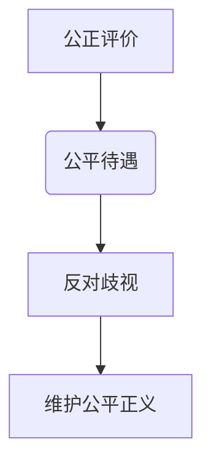

通过上述讨论，我们可以看出，职业道德的核心价值观包括诚信、尊重、责任和公平。这些价值观不仅对个人职业发展和企业文化建设具有重要意义，也对社会的发展和进步具有深远影响。一个具有高尚职业道德的从业人员，不仅能够在职业生涯中获得成功，还能为社会的和谐与进步做出贡献。

在接下来的章节中，我们将探讨如何树立正面榜样，以推动职业道德的实施和传播。通过逻辑推理和案例分析，我们希望能够为广大读者提供一个全面、深入的职业道德指南。

---

### 第5章：榜样的影响力

#### 5.1.1 榜样的定义

榜样是指那些在道德、才能、品格等方面表现出色的人。他们通过自身的言行，影响和激励他人追求卓越。在职场中，榜样可以是企业的领导者、优秀员工，也可以是行业内的知名人士。榜样的定义不仅仅是基于其外在成就，更重要的是其内在品质和价值观。

#### 5.1.2 榜样的力量

榜样的力量是巨大的。一个正面的榜样可以影响一个人的价值观、行为和态度，甚至可以改变一个人的命运。以下是榜样力量的几个方面：

1. **价值观的塑造**：榜样通过自身的言行，传递出正确的价值观和道德观。这些价值观和道德观会影响他人，使其在面临选择时，更加倾向于正确和道德的行为。

2. **行为的引导**：榜样通过自己的行为，树立了正确的示范。他人会模仿榜样的行为，从而在工作和生活中更加积极向上。

3. **激励的作用**：榜样通过其卓越的表现，激励他人追求卓越。当人们看到榜样取得成功时，会激发自己努力奋斗，实现自己的目标。

4. **团队凝聚力的提升**：榜样可以提升团队的凝聚力。一个具有高尚品质和出色能力的榜样，可以凝聚团队成员，使其共同为实现目标而努力。

以下是一个简化的榜样力量流程图：

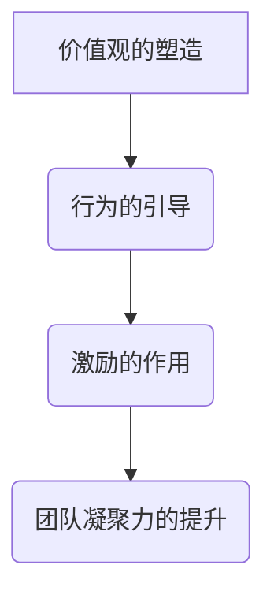

#### 5.1.3 榜样的正面影响

树立正面榜样可以带来多方面的积极影响，包括个人、团队和企业层面。

**个人层面**：正面榜样可以影响一个人的价值观和行为，使其更加正直、有责任心。一个正直和有责任心的人，在职业生涯中更容易获得他人的信任和尊重，从而获得更多的发展机会。

**团队层面**：正面榜样可以提升团队的凝聚力和工作效率。一个具有高尚品质和出色能力的榜样，可以激励团队成员，使其更加团结和协作，从而提升团队的整体表现。

**企业层面**：正面榜样可以塑造良好的企业文化，提升企业的社会形象和声誉。一个具有高尚职业道德和出色经营能力的企业，更容易获得客户的信任和支持，从而在市场竞争中占据优势。

以下是一个简化的榜样正面影响流程图：

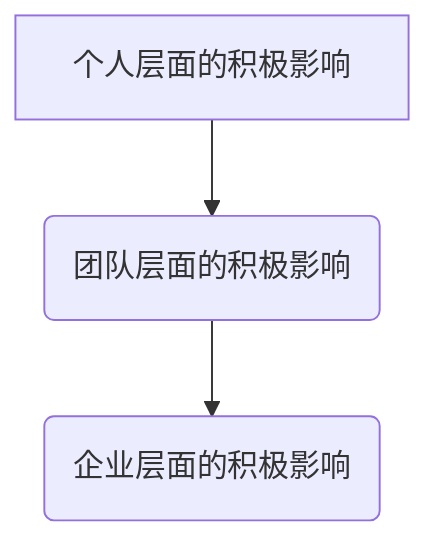

通过上述讨论，我们可以看出，榜样的影响力是巨大的。树立正面榜样不仅可以影响个人、团队和企业的发展，还可以推动社会的进步和和谐。在接下来的章节中，我们将探讨如何成为正面榜样，以及如何在工作中树立榜样。

---

### 第6章：如何成为正面榜样

#### 6.1.1 个人素质的提升

成为正面榜样需要不断提升个人素质。个人素质包括专业知识、沟通能力、决策能力、领导力等。以下是一些建议：

**专业知识**：不断学习和更新专业知识，保持对行业动态的敏感度。专业知识是树立正面榜样的基础，一个专业能力出众的领导者，更能够赢得他人的尊重和信任。

**沟通能力**：提升沟通能力，包括口头表达、书面表达和倾听能力。有效的沟通可以减少误解，提升团队协作效率，一个善于沟通的领导者，更能够建立良好的人际关系。

**决策能力**：培养决策能力，包括分析和解决问题的能力。一个明智的决策者，能够在复杂多变的环境中做出正确的决策，为团队指引方向。

**领导力**：提升领导力，包括鼓舞团队、激励员工的能力。一个有领导力的领导者，能够激发团队成员的积极性和创造力，推动团队达成目标。

以下是一个简化的个人素质提升流程图：

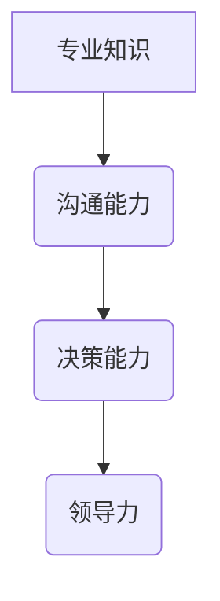

#### 6.1.2 建立良好的职业道德观念

建立良好的职业道德观念是成为正面榜样的关键。以下是一些建议：

**诚信**：保持诚信，言行一致，遵守职业操守。诚信不仅是对他人的尊重，也是对自己的负责。

**尊重**：尊重他人，包括尊重他人的意见、观点和隐私。尊重他人，才能赢得他人的尊重。

**责任**：积极承担自己的职责，不推卸责任。一个有责任感的从业人员，会得到他人的信任和尊重。

**公平**：公平对待他人，不偏袒、不歧视。公平对待他人，才能建立一个和谐的组织环境。

以下是一个简化的职业道德观念建立流程图：


#### 6.1.3 在工作中树立榜样

在工作中树立榜样，需要通过自己的行为来影响他人。以下是一些建议：

**以身作则**：通过自己的行为来树立榜样。一个领导者，应当通过自己的行为来证明自己的价值观和职业道德。

**公正无私**：在工作和评价中，保持公正无私。不偏袒、不歧视，给予每个人应得的待遇和机会。

**鼓励创新**：鼓励团队成员创新，激发团队成员的积极性和创造力。一个创新的团队，更有可能取得成功。

**关心员工**：关心员工的成长和发展，提供支持和帮助。一个关心员工的领导者，更能够赢得员工的信任和尊重。

以下是一个简化的在工作中树立榜样流程图：

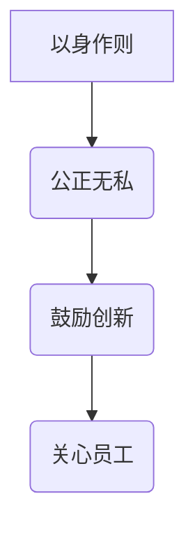

通过上述讨论，我们可以看出，成为正面榜样需要不断提升个人素质，建立良好的职业道德观念，并在工作中通过自己的行为来影响他人。在接下来的章节中，我们将探讨如何通过榜样教育来实践和推广正面榜样，以推动职业道德的实施和传播。

---

### 第7章：榜样教育的实践

#### 7.1.1 榜样教育的意义

榜样教育是一种重要的教育方式，旨在通过树立和推广正面榜样，来引导和激励人们追求道德和职业的卓越。榜样教育的意义主要体现在以下几个方面：

**提升道德素养**：榜样教育可以帮助人们树立正确的价值观和道德观，提升个人的道德素养。一个具有高尚品质的榜样，可以引导人们正确面对生活中的各种挑战，做出符合道德标准的选择。

**增强职业责任感**：榜样教育可以激发人们的职业责任感，使其在职业生涯中更加敬业和负责。一个具有强烈责任感的榜样，可以影响他人，使其更加关注职业发展和社会责任。

**塑造积极心态**：榜样教育可以培养人们积极向上的心态，激励他们在面对困难和挑战时保持乐观和坚韧。一个充满正能量的榜样，可以影响他人的情绪和行为，使其更加积极和自信。

**推动社会进步**：榜样教育不仅对个人和团队有积极影响，还可以推动社会的发展和进步。一个具有高尚品质的榜样，可以树立良好的社会道德风尚，促进社会的和谐与进步。

以下是一个简化的榜样教育意义流程图：

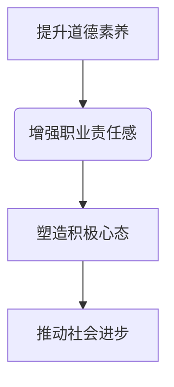

#### 7.1.2 榜样教育的方法

为了有效地进行榜样教育，可以采取以下几种方法：

**树立典型**：在组织或团队中，树立具有高尚品质和突出表现的典型人物。通过宣传和推广典型人物的事迹，激发他人的学习和追求。

**组织学习**：组织学习活动，如参观学习、座谈交流等，让团队成员了解和借鉴正面榜样的经验和做法。通过学习，可以提高团队成员的道德素养和职业水平。

**实践锻炼**：通过实践锻炼，让团队成员在实际工作中体验榜样的品质和行为。在实践中学习和成长，可以更好地理解和践行榜样精神。

**表彰奖励**：对表现优秀的团队成员进行表彰和奖励，以激励更多的人向榜样学习。通过表彰奖励，可以增强榜样的影响力，推动榜样教育的深入实施。

以下是一个简化的榜样教育方法流程图：

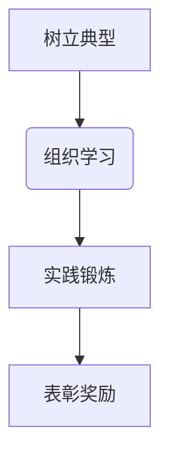

#### 7.1.3 榜样教育的实施案例

**案例一：某公司开展“最美员工”评选活动**

某公司每年都会开展“最美员工”评选活动，旨在表彰在工作中表现突出、具有高尚品质的员工。评选标准包括敬业精神、团队协作、道德行为等方面。通过评选活动，公司不仅提升了员工的道德素养，还激发了员工的积极性和创造力，形成了良好的企业文化。

**案例二：某学校开展“优秀学子”交流活动**

某学校定期开展“优秀学子”交流活动，邀请在学术、道德、社会实践等方面表现突出的学生分享自己的经验和感悟。通过交流活动，学生们不仅学到了榜样的优点，还激发了他们追求卓越的动力，推动了学校的教育质量和学风建设。

**案例三：某企业开展职业道德培训**

某企业为了提升员工的职业道德水平，定期开展职业道德培训。培训内容包括职业道德的基本原则、职业道德案例分析、职业道德实践等。通过培训，员工对职业道德有了更深入的理解，职业道德水平得到了明显提升，企业的整体道德氛围得到了改善。

通过上述案例，我们可以看到，榜样教育在不同领域和组织中都具有重要的实践意义。通过树立和推广正面榜样，可以激发人们的道德素养和职业责任感，推动组织的发展和进步。

---

### 第8章：领导力与职业道德在企业管理中的应用

#### 8.1.1 企业文化的塑造

领导力与职业道德在企业文化塑造中起到关键作用。企业文化是指企业在长期经营过程中形成的共同价值观、信念和行为准则。一个积极向上的企业文化可以激发员工的积极性和创造力，提升企业的核心竞争力。

**领导力在企业文化建设中的作用**：

1. **明确企业愿景和使命**：领导力可以通过明确企业的愿景和使命，引导员工共同为实现企业目标而努力。一个具有远见的领导者，能够树立清晰的企业愿景，激发员工的积极性和使命感。

2. **树立榜样**：领导者通过自身的言行，树立良好的榜样，影响和带动员工形成良好的职业素养和行为习惯。领导者的行为是企业文化的直接体现，一个正直、勤奋、有责任感的领导者，可以带动整个团队形成积极向上的文化氛围。

**职业道德在企业文化建设中的作用**：

1. **规范员工行为**：职业道德的基本原则，如诚信、尊重、责任和公平，可以为员工提供行为准则，规范员工在职场中的行为。一个具有高尚职业道德的企业，可以减少职业道德风险，提升企业的整体素质。

2. **塑造企业声誉**：职业道德不仅影响员工的行为，还影响企业的社会形象和声誉。一个具有高尚职业道德的企业，更容易获得社会的认可和尊重，从而提升企业的市场竞争力。

**如何结合领导力和职业道德塑造企业文化**：

1. **制定明确的企业价值观**：领导力与职业道德的结合，可以通过制定明确的企业价值观来实现。企业价值观应当体现领导力与职业道德的要求，如诚信、创新、责任、共赢等。

2. **加强职业道德教育**：企业可以通过培训、讲座、案例分享等形式，加强职业道德教育，提升员工的职业道德素养。同时，领导者应当以身作则，树立良好的职业道德榜样。

3. **建立激励机制**：企业应当建立完善的激励机制，鼓励员工践行职业道德。通过表彰和奖励，激励员工向榜样学习，形成良好的职业道德风气。

以下是一个简化的企业文化塑造流程图：

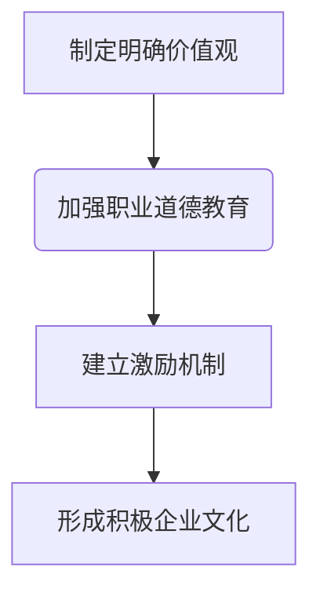

#### 8.1.2 团队建设的策略

领导力与职业道德在团队建设中同样起到关键作用。一个高效的团队需要具备良好的沟通、协作和执行力。领导力与职业道德可以为团队建设提供方向和动力。

**领导力在团队建设中的作用**：

1. **明确团队目标**：领导力可以通过明确团队的目标和愿景，统一团队成员的思想和行动。一个具有远见的领导者，能够帮助团队设定明确的目标，激发团队成员的积极性和创造力。

2. **提升团队凝聚力**：领导力可以通过建立信任、激发热情和提供支持，提升团队的凝聚力。一个优秀的领导者，能够建立和谐的人际关系，促进团队成员之间的合作和沟通。

**职业道德在团队建设中的作用**：

1. **规范团队行为**：职业道德的基本原则可以为团队行为提供指导，规范团队成员的行为。一个具有高尚职业道德的团队，可以减少内部冲突，提升团队的整体素质。

2. **增强团队执行力**：职业道德可以培养团队成员的责任感和执行力。一个有责任感和执行力的团队，能够高效地完成工作任务，实现团队的目标。

**如何结合领导力和职业道德进行团队建设**：

1. **培养团队领导力**：企业可以通过培训、实践和辅导等方式，培养团队领导力。一个具有领导力的团队领导者，能够更好地引导和激励团队成员，推动团队的发展。

2. **建立职业道德准则**：企业应当制定职业道德准则，明确团队成员的行为规范。同时，领导者应当以身作则，践行职业道德，为团队成员树立榜样。

3. **加强团队沟通与协作**：企业可以通过团队建设活动、沟通培训和协作平台等方式，加强团队沟通与协作。一个高效的团队，需要团队成员之间的良好沟通和紧密协作。

以下是一个简化的团队建设策略流程图：

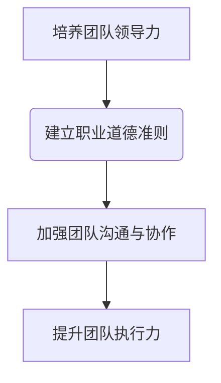

#### 8.1.3 领导力的提升策略

为了提升领导力，企业可以采取以下策略：

**1. 提供领导力培训**：企业可以通过内部培训、外部培训和在线学习等方式，为员工提供领导力培训。通过培训，员工可以学习到领导力的基本理论和实践方法，提升自身的领导能力。

**2. 实践领导力**：领导力不仅需要理论学习，更需要实践。企业可以提供实践机会，如项目负责、团队管理等，让员工在真实的工作场景中锻炼领导力。

**3. 定期反馈与辅导**：企业可以通过定期的反馈和辅导，帮助员工提升领导力。领导者和导师可以提供个性化的指导和建议，帮助员工克服困难，提升领导能力。

**4. 建立领导力发展计划**：企业可以制定领导力发展计划，明确员工的职业发展路径和目标。通过计划和目标，员工可以更有针对性地提升自身的领导力。

以下是一个简化的领导力提升策略流程图：

```mermaid
graph TD
    A[提供领导力培训] --> B(实践领导力)
    B --> C[定期反馈与辅导]
    C --> D[建立领导力发展计划]
```

通过上述讨论，我们可以看出，领导力与职业道德在企业管理中具有重要应用。通过塑造积极向上的企业文化、加强团队建设以及提升领导力，企业可以更好地发挥领导力与职业道德的作用，推动企业的发展和进步。

在接下来的章节中，我们将探讨领导力与职业道德在个人发展中的应用，以及如何通过树立正面榜样来推动个人成长。通过逻辑推理和案例分析，我们希望能够为广大读者提供一个全面、深入的领导力与职业道德指南。

---

### 第9章：领导力与职业道德在个人发展中的应用

#### 9.1.1 职业生涯规划

领导力与职业道德在职业生涯规划中发挥着至关重要的作用。有效的职业生涯规划不仅有助于个人在职业生涯中实现自我价值，还能为企业和社会创造更大的价值。

**职业生涯规划的重要性**：

1. **明确职业目标**：职业生涯规划可以帮助个人明确职业目标，从而有针对性地提升自身的能力和素质，实现职业发展。

2. **提升竞争力**：通过职业生涯规划，个人可以不断提升自己的专业技能和软技能，提高市场竞争力，获得更多的发展机会。

3. **实现职业满足感**：职业生涯规划可以帮助个人找到适合自己的职业路径，从而在工作中实现自我价值，获得职业满足感。

**领导力在职业生涯规划中的作用**：

1. **提升领导能力**：通过学习和实践，提升领导力，使个人在团队中发挥更大的作用，成为团队的核心成员。

2. **拓展职业网络**：具备领导力的人更容易建立广泛的人际关系网络，从而获得更多的职业机会和资源。

3. **实现职业晋升**：领导力是职业晋升的重要资本，具备领导力的人更容易得到上级的认可，实现职业晋升。

**职业道德在职业生涯规划中的作用**：

1. **树立职业信誉**：职业道德是个人职业信誉的基础。一个具有高尚职业道德的人，更容易赢得他人的信任和尊重，从而在职业生涯中获得更多的发展机会。

2. **建立良好的人际关系**：职业道德不仅影响个人行为，还影响人际关系。一个具有高尚职业道德的人，更容易与他人建立良好的合作关系，实现职业目标。

**如何结合领导力和职业道德进行职业生涯规划**：

1. **自我评估**：个人应先进行自我评估，了解自己的优势和劣势，确定职业发展方向。

2. **制定职业目标**：根据自我评估结果，制定明确的职业目标，并制定实现目标的计划和步骤。

3. **提升领导力和职业道德**：通过学习和实践，不断提升领导力和职业道德，为实现职业目标打下坚实基础。

4. **持续学习和反思**：职业生涯是一个长期的过程，个人应持续学习和反思，不断调整和优化职业规划，以适应职业发展的变化。

以下是一个简化的职业生涯规划流程图：

```mermaid
graph TD
    A[自我评估] --> B(制定职业目标)
    B --> C(提升领导力和职业道德)
    C --> D(持续学习和反思)
```

#### 9.1.2 个人素质的提升路径

个人素质的提升是职业生涯规划的重要组成部分。以下是一些提升个人素质的路径：

**1. 专业技能的提升**：

- **学习新技术和知识**：通过学习新技术和知识，提升自身的专业能力，以适应行业的发展需求。

- **参加专业培训**：参加专业培训，获得相关证书，提高自身的专业水平和竞争力。

- **实践应用**：将所学知识应用于实际工作中，通过实践提升专业技能。

**2. 软技能的提升**：

- **沟通能力**：通过学习沟通技巧，提高沟通效果，增强人际交往能力。

- **团队合作能力**：通过参与团队合作项目，提升团队合作能力和协作效率。

- **解决问题的能力**：通过学习和实践，提升解决问题的能力，成为团队中的问题解决者。

**3. 领导力和管理能力**：

- **学习领导力理论**：通过学习领导力理论，了解领导力的基本概念和实践方法。

- **参与领导力实践**：通过参与领导力实践，如团队管理、项目管理等，提升领导力和管理能力。

- **反思与总结**：通过反思和总结，不断改进领导力和管理方法，提高自身的领导水平。

以下是一个简化的个人素质提升路径流程图：

```mermaid
graph TD
    A[专业技能提升] --> B(软技能提升)
    B --> C(领导力和管理能力提升)
```

#### 9.1.3 职业道德在个人成长中的体现

职业道德在个人成长中具有重要作用，体现在以下几个方面：

**1. 个人价值观的形成**：

职业道德可以帮助个人形成正确的价值观，树立诚信、尊重、责任和公平的道德观念，指导个人在职业生涯中做出正确的选择。

**2. 人际关系的建立**：

职业道德影响个人在人际交往中的行为和态度，一个具有高尚职业道德的人，更容易与他人建立和谐的人际关系，获得他人的信任和尊重。

**3. 职业生涯的发展**：

职业道德是个人职业生涯成功的重要因素。一个具有高尚职业道德的人，更容易获得他人的认可和支持，从而在职业生涯中获得更多的发展机会。

**4. 社会责任的承担**：

职业道德促使个人承担社会责任，关注社会问题，积极参与社会公益活动，为社会的发展和进步做出贡献。

以下是一个简化的职业道德在个人成长中的体现流程图：

```mermaid
graph TD
    A[个人价值观形成] --> B(人际关系建立)
    B --> C(职业生涯发展)
    C --> D(社会责任承担)
```

通过上述讨论，我们可以看出，领导力与职业道德在个人发展中的应用具有重要意义。通过职业生涯规划、个人素质的提升以及职业道德的践行，个人可以在职业生涯中实现自我价值，为企业和社会创造更大的价值。

在接下来的章节中，我们将探讨领导力与职业道德在社会中的影响，以及如何通过实际案例来分析这些影响。通过逻辑推理和案例分析，我们希望能够为广大读者提供一个全面、深入的领导力与职业道德指南。

---

### 第10章：领导力与职业道德的社会影响

#### 10.1.1 社会责任与职业道德

领导力与职业道德不仅对个人和企业有重要影响，还对社会有着深远的影响。其中，社会责任与职业道德是两个关键方面。

**社会责任**：社会责任是指企业或个人对社会应尽的责任和义务。一个具有高尚职业道德的企业，会在其经营活动中积极履行社会责任，关注环境保护、员工福利、社会公益等方面。社会责任不仅是企业的道德责任，也是企业长远发展的战略选择。

**职业道德**：职业道德是企业履行社会责任的重要保障。一个具有高尚职业道德的企业，会在其经营活动中秉持诚信、尊重、责任和公平的原则，为社会创造价值。职业道德不仅影响企业的形象和声誉，还影响企业的社会责任履行。

**领导力与社会责任与职业道德的关系**：领导力在推动社会责任与职业道德的实施中发挥着重要作用。领导者通过其影响力，可以引导企业树立正确的价值观，推动企业履行社会责任，践行职业道德。领导者的行为和决策，直接影响企业的社会责任履行和职业道德水平。

以下是一个简化的社会责任与职业道德关系流程图：

```mermaid
graph TD
    A[领导力] --> B(社会责任)
    B --> C(职业道德)
```

#### 10.1.2 社会正义与公平

社会正义与公平是职业道德的核心价值观，也是社会发展的基石。

**社会正义**：社会正义是指社会对每个成员的公正待遇，使每个人都能在平等的机会下实现自身价值。社会正义体现在社会制度、法律法规和公共政策的制定与执行中。

**职业道德与社会正义的关系**：职业道德是社会正义的重要保障。一个具有高尚职业道德的人，会在其职业生涯中秉持公平、正义的原则，促进社会正义的实现。职业道德不仅影响个人行为，还影响社会制度的公平性和有效性。

**公平**：公平是指对待他人不偏袒、不歧视，给予每个人应得的待遇和机会。公平体现在职场、教育、医疗等各个领域。

**职业道德与公平的关系**：职业道德是公平的重要保障。一个具有高尚职业道德的人，会在其职业生涯中秉持公平的原则，对待他人公正无私。职业道德不仅影响个人行为，还影响社会公平的实现。

以下是一个简化的社会正义与公平关系流程图：

```mermaid
graph TD
    A[职业道德] --> B(社会正义)
    B --> C(公平)
```

#### 10.1.3 领导力与职业道德的未来发展

随着社会的发展和变化，领导力与职业道德也在不断演进。未来，领导力与职业道德将面临以下挑战和机遇：

**挑战**：

1. **全球化带来的挑战**：全球化使得企业和个人面临更多的国际竞争和挑战，领导力和职业道德需要适应全球化的环境。

2. **技术变革的挑战**：技术变革，如人工智能、大数据等，对职业道德提出了新的要求和挑战，需要领导力和职业道德不断更新和适应。

3. **社会不平等的挑战**：社会不平等问题日益突出，领导力和职业道德需要关注和解决这一问题，推动社会的公平与正义。

**机遇**：

1. **可持续发展**：可持续发展成为全球共识，领导力和职业道德可以推动企业在可持续发展的道路上前行。

2. **技术创新**：技术创新为领导力和职业道德带来了新的机遇，可以通过技术创新来提升领导力和职业道德的实践效果。

3. **社会公益**：社会公益成为企业和个人履行社会责任的重要途径，领导力和职业道德可以推动更多的社会公益活动，促进社会和谐与进步。

以下是一个简化的未来领导力与职业道德发展机遇与挑战流程图：

```mermaid
graph TD
    A[全球化挑战] --> B(技术变革挑战)
    B --> C(社会不平等挑战)
    C --> D[可持续发展机遇]
    D --> E(技术创新机遇)
    D --> F(社会公益机遇)
```

通过上述讨论，我们可以看出，领导力与职业道德对社会的影响是深远而广泛的。随着社会的发展和变化，领导力与职业道德也需要不断适应和变革，以应对新的挑战和机遇，推动社会的进步和和谐。

在接下来的章节中，我们将通过具体案例分析，进一步探讨领导力与职业道德的实际应用和影响。通过逻辑推理和案例分析，我们希望能够为广大读者提供一个全面、深入的领导力与职业道德指南。

---

### 第11章：成功领导力与职业道德的案例分析

#### 11.1.1 案例一：某公司CEO的领导力与职业道德实践

在本章中，我们将通过具体案例，探讨成功领导力与职业道德的实际应用。以下是某公司CEO的领导力与职业道德实践案例。

**案例背景**：

某公司是一家处于快速成长期的科技企业，CEO张某是一位具有丰富行业经验和管理能力的领导者。在他的领导下，公司实现了高速发展，并赢得了市场的高度认可。

**领导力实践**：

1. **愿景和目标**：张某在领导公司时，首先明确了公司的愿景和目标。他强调公司的使命是推动技术创新，为客户提供优质的解决方案。这一愿景和目标为公司的员工提供了明确的奋斗方向。

2. **激励和鼓舞**：张某注重激励和鼓舞员工。他通过定期举办团队建设活动，增强员工之间的凝聚力。同时，他通过奖励机制，激励员工追求卓越。这种激励措施不仅提升了员工的工作积极性，也增强了团队的整体战斗力。

3. **沟通和反馈**：张某非常重视沟通和反馈。他定期与员工进行一对一的沟通，了解员工的工作情况和需求。同时，他鼓励员工提出建议和反馈，促进公司内部的信息流通和决策效率。

**职业道德实践**：

1. **诚信**：张某在职业道德方面以身作则，始终保持诚信。他强调公司的决策和行为应基于事实和诚信，赢得了员工和客户的信任。

2. **尊重**：张某尊重每一位员工的意见和贡献。他鼓励员工表达自己的观点，并提供平等的机会和资源，使员工能够充分发挥自己的能力。

3. **责任**：张某对公司的运营和发展负责，始终保持高度的责任感。他在面对困难和挑战时，能够冷静分析问题，并采取有效的措施解决问题。

**案例分析**：

张某的领导力与职业道德实践为公司带来了显著的成功。首先，他的领导力激发了员工的积极性和创造力，使公司能够不断创新和突破。其次，他的职业道德实践赢得了员工和客户的信任，提升了公司的声誉和市场竞争力。

**启示**：

通过本案例，我们可以看到，成功的领导力与职业道德实践对企业的成功至关重要。领导者的愿景和目标、激励和鼓舞、沟通和反馈，以及诚信、尊重和责任感，都是实现企业成功的重要因素。

#### 11.1.2 案例二：某知名企业家如何树立正面榜样

在本案例中，我们将探讨某知名企业家如何通过树立正面榜样，推动企业的成功和员工的成长。

**案例背景**：

某知名企业家李某，是一位在业界享有盛誉的企业家。他的企业是一家全球领先的科技企业，以其卓越的产品和服务赢得了市场的认可。

**榜样实践**：

1. **专业素养**：李某以其卓越的专业素养，树立了良好的榜样。他不仅在技术领域具有深厚的知识，还具备出色的管理和决策能力。他的专业素养赢得了员工的尊重和信任。

2. **诚信和正直**：李某在职业道德方面，始终坚持诚信和正直。他强调企业的决策和行为应基于事实和诚信，赢得了员工和客户的信任。

3. **社会责任**：李某关注社会责任，积极参与社会公益活动。他通过捐赠和教育项目，回馈社会，树立了良好的企业形象。

**案例分析**：

李某通过树立正面榜样，对企业产生了深远的影响。首先，他的专业素养和诚信正直赢得了员工的尊重和信任，增强了团队的凝聚力。其次，他的社会责任实践，提升了企业的社会形象和声誉，为企业赢得了更多的市场机会。

**启示**：

通过本案例，我们可以看到，企业家作为领导者，通过树立正面榜样，可以激发员工的积极性和创造力，推动企业的成功。同时，企业家的榜样作用，不仅对企业有积极影响，还对整个行业和社会产生了积极的影响。

#### 11.1.3 案例三：某企业道德危机的处理与道德重建

在本案例中，我们将探讨某企业道德危机的处理过程，以及如何进行道德重建。

**案例背景**：

某企业因高管腐败事件陷入道德危机，企业声誉严重受损。为了应对危机，企业启动了道德重建计划。

**道德危机处理**：

1. **公开透明**：企业首先采取了公开透明的处理方式，及时向公众披露事件的情况，接受舆论监督。

2. **内部调查**：企业进行了内部调查，查清了腐败事件的来龙去脉，并对相关责任人进行了严肃处理。

3. **加强制度建设**：企业加强了内部制度建设，完善了内部控制和监督机制，防止类似事件再次发生。

**道德重建计划**：

1. **职业道德培训**：企业开展了职业道德培训，提升员工的职业道德素养。

2. **道德文化建设**：企业通过文化建设，塑造了以诚信、尊重、责任和公平为核心价值观的道德文化。

3. **社会责任履行**：企业积极参与社会公益活动，提升社会形象和声誉。

**案例分析**：

通过道德危机的处理和道德重建，企业逐渐恢复了声誉，并赢得了市场和客户的信任。企业道德危机的处理与道德重建，不仅解决了当前问题，也为企业的长远发展奠定了基础。

**启示**：

通过本案例，我们可以看到，面对道德危机，企业需要采取积极应对措施，通过公开透明、内部调查和制度建设，解决当前问题。同时，企业需要通过道德重建，提升员工的职业道德素养，塑造良好的企业文化。

在上述三个案例中，我们可以看到成功领导力与职业道德的实际应用和深远影响。通过领导力和职业道德的实践，企业不仅实现了自身的成功，还对社会产生了积极的影响。

---

### 第12章：失败案例的教训

#### 12.1.1 案例一：某公司领导力与职业道德的缺失

在本章中，我们将通过具体案例，探讨领导力与职业道德的缺失对企业带来的负面影响。以下是某公司领导力与职业道德缺失案例。

**案例背景**：

某公司因领导力与职业道德的缺失，陷入了严重的危机。公司高管缺乏有效的领导力，同时在职业道德方面存在严重问题，导致企业运营失控，员工士气低落。

**领导力缺失**：

1. **缺乏愿景和目标**：公司缺乏明确的愿景和目标，导致员工对企业的未来缺乏信心和动力。

2. **沟通不畅**：公司内部沟通不畅，信息传递不及时，导致决策失误和执行困难。

3. **缺乏激励和鼓舞**：公司缺乏有效的激励机制，员工缺乏工作积极性和创造力。

**职业道德缺失**：

1. **诚信问题**：公司高管存在诚信问题，导致员工对公司的信任度降低。

2. **内部腐败**：公司内部存在腐败现象，员工对公司的道德氛围感到失望。

3. **社会责任缺失**：公司对社会责任缺乏关注，社会形象严重受损。

**案例分析**：

由于领导力与职业道德的缺失，公司运营陷入困境，员工流失严重，企业声誉一落千丈。领导力缺失导致企业缺乏有效管理和协调，职业道德缺失导致企业内部矛盾加剧，最终导致企业的失败。

**启示**：

通过本案例，我们可以看到，领导力与职业道德对企业的重要性。缺乏有效的领导力，企业无法实现长远发展；缺乏高尚的职业道德，企业将面临道德风险和声誉危机。企业领导者应当重视领导力与职业道德的培养，以实现企业的可持续发展。

#### 12.1.2 案例二：某企业家道德危机对企业的负面影响

在本案例中，我们将探讨某企业家道德危机对企业带来的负面影响。以下是某企业家道德危机案例。

**案例背景**：

某企业家因道德危机，陷入舆论风波。他的道德危机涉及个人行为和商业活动，导致企业声誉严重受损，市场信心下降。

**道德危机的影响**：

1. **市场信心下降**：企业家的道德危机导致市场对企业及其产品的信心下降，销售额大幅下滑。

2. **员工流失**：企业家道德危机导致员工对企业的忠诚度下降，大量优秀员工选择离职。

3. **企业形象受损**：企业家的道德危机对企业形象造成了严重的负面影响，企业品牌价值大幅下降。

**案例分析**：

企业家的道德危机不仅影响了企业的短期业绩，还对企业的长期发展产生了深远影响。市场信心的下降和员工流失，导致企业竞争力下降；企业形象的受损，使得企业在未来竞争中面临更大的挑战。

**启示**：

通过本案例，我们可以看到，企业家的道德风险对企业的负面影响是巨大的。企业家作为企业的核心人物，其道德行为直接影响企业的声誉和市场地位。企业家应当注重道德修养，以树立良好的社会形象，维护企业的长期发展。

#### 12.1.3 案例三：企业道德危机的处理与反思

在本案例中，我们将探讨某企业道德危机的处理过程，以及如何进行反思和改进。以下是某企业道德危机处理案例。

**案例背景**：

某企业因道德危机，陷入舆论漩涡。危机涉及企业的商业行为和员工福利，导致企业声誉受损，员工士气低落。

**道德危机处理**：

1. **公开透明**：企业采取了公开透明的态度，及时向公众披露危机情况，接受舆论监督。

2. **内部调查**：企业进行了内部调查，查清了危机的来龙去脉，并对相关责任人进行了严肃处理。

3. **道德文化建设**：企业开展了道德文化建设，通过培训、宣传等方式，提升员工的道德素养。

4. **社会责任履行**：企业积极参与社会公益活动，提升社会形象和声誉。

**案例分析**：

通过道德危机的处理和道德文化建设，企业逐渐恢复了声誉，并赢得了市场和客户的信任。企业道德危机的处理与反思，不仅解决了当前问题，也为企业的长远发展奠定了基础。

**启示**：

通过本案例，我们可以看到，面对道德危机，企业需要采取积极应对措施，通过公开透明、内部调查和道德文化建设，解决当前问题。同时，企业需要通过反思和改进，提升员工的道德素养，塑造良好的企业文化。企业道德危机的处理与反思，是提升企业竞争力的关键。

---

## 结论

通过本文的探讨，我们可以看到，领导力与职业道德在个人发展、企业管理和社会进步中具有至关重要的地位。领导力不仅关乎个人管理能力，更关乎团队凝聚力和组织发展；职业道德不仅是个人价值观的体现，也是企业长远发展的基石。树立正面榜样，通过榜样教育和实践，可以提升职业道德水平，推动组织的发展和个人的成长。

在个人发展方面，领导力和职业道德是职业生涯成功的关键因素。通过职业生涯规划和个人素质的提升，个人可以在职业道路上实现自我价值，为社会做出贡献。在企业管理方面，领导力和职业道德可以塑造积极向上的企业文化，提升团队凝聚力和工作效率，推动企业的长远发展。在社会进步方面，领导力和职业道德可以促进社会正义与公平，推动社会的和谐与进步。

未来，随着全球化和技术变革的加速，领导力与职业道德将面临新的挑战和机遇。领导者需要不断更新知识和技能，适应不断变化的环境。同时，企业和社会需要加强对领导力和职业道德的培养，以应对新的挑战，实现可持续发展。

让我们共同努力，通过提升领导力和职业道德，成为更好的自己，为组织和社会的发展做出贡献。

---

### 附录

#### 附录A：参考文献

1. Northouse, P. G. (2018). Leadership: Theory and Practice. Sage Publications.
2. Rest, J. R. (1986). Professional ethics: A personal philosophy. In The Journal of Business Ethics (Vol. 5, No. 1, pp. 45-54). Springer, Cham.
3. Yukl, G. A. (2013). Leadership in Organizations. Pearson Education.

#### 附录B：领导力与职业道德相关的工具与资源

1. **领导力评估工具**：
   - **LEADERSHIP DASHBOARD**：一个在线工具，用于评估和提升个人领导力。
   - **LEADERSHIP MAPP**：一个基于人工智能的领导力评估平台，提供个性化的领导力发展建议。

2. **职业道德教育资源**：
   - **ETHICS RESOURCE CENTER**：提供职业道德教育和培训资源，包括案例研究和在线课程。
   - **COURSES.LIVE**：提供各种职业道德在线课程，涵盖商业伦理、社会责任等领域。

3. **社会责任实践案例**：
   - **SUSTAINABLE BRAND**：提供企业社会责任案例研究和最佳实践。
   - **B Corp**：一个全球性认证，表彰在环境、社会和治理方面表现卓越的企业。

#### 附录C：领导力与职业道德实践指南

1. **《领导力与职业道德实践指南》**：一本全面的实践指南，涵盖领导力与职业道德的理论和实践。
2. **《领导者之道》**：一本关于领导力和职业道德的畅销书，提供了大量实用的案例和建议。

---

作者：AI天才研究院/AI Genius Institute & 禅与计算机程序设计艺术 /Zen And The Art of Computer Programming

---

通过本文的讨论，我们希望能够为广大读者提供一个全面、深入的领导力与职业道德指南。希望读者能够结合自身实际情况，实践领导力和职业道德，成为更好的自己，为组织和社会的发展做出贡献。同时，我们也期待读者能够继续关注领导力与职业道德的研究，共同推动这一领域的进步。谢谢大家的阅读！

