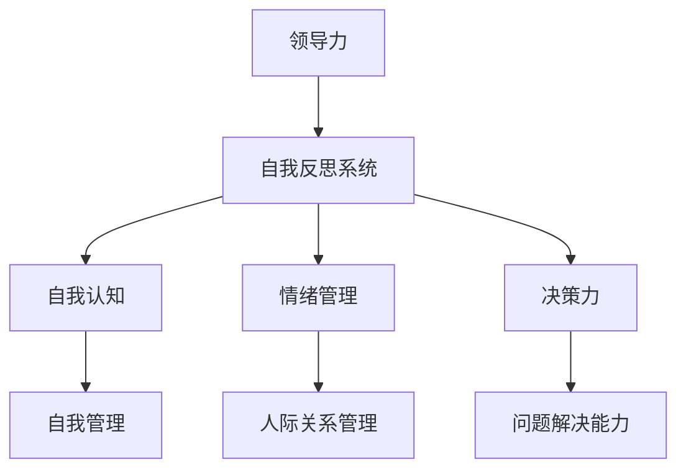

                 


### 引言

在现代企业环境中，领导力的作用愈发凸显。优秀的领导者不仅是团队的核心动力，更是企业战略决策的中坚力量。然而，领导力的提升并非一蹴而就，它需要系统化的方法与持续的努力。本文旨在探讨领导力与自我反思系统之间的关系，并介绍一种结构化的方法，以帮助领导者持续提升自己的领导力。

首先，我们需要明确领导力的定义。领导力是指影响和激励他人一起实现目标的能力。它涵盖了多个方面，包括自我认知、自我管理、情绪管理、人际关系管理、决策力以及问题解决能力等。领导力不仅存在于企业高管和团队领导者中，也可以在各个层级和领域中发挥作用。

自我反思系统则是一种帮助领导者不断提升自身能力的方法。自我反思是指领导者对自身行为、决策和思维过程进行审视和评估的过程。通过自我反思，领导者可以识别自身的优点和不足，从而制定改进计划并付诸实践。

本文将分为三个主要部分来探讨领导力与自我反思系统。第一部分将介绍领导力的基础理论，包括领导力的定义与类型，领导者的角色与职责，以及领导力的发展过程。第二部分将探讨自我反思系统，介绍自我反思的重要性，构建自我反思系统的方法和工具，以及自我反思的应用场景。第三部分将介绍领导力提升的结构化方法，包括自我认知与自我管理，情绪管理与人际关系，决策力与问题解决能力，以及领导力的持续提升策略。

通过逐步分析推理，本文将帮助读者理解领导力与自我反思系统之间的内在联系，并掌握一套结构化的领导力提升方法。

## 第一部分：领导力的基础理论

### 第1章：领导力的定义与类型

#### 1.1 领导力的基本概念

领导力是指一种影响和激励他人一起实现目标的能力。它不仅涉及个体的行为和决策，还包括对团队和组织的整体影响。领导力可以被视为一种软技能，它在多种情境和领域中发挥作用，包括企业管理、社会领导、教育领导以及个人成长等。

领导力与管理的区别在于，管理侧重于组织和协调资源以实现目标，而领导力则更关注激发和激励团队成员的潜力，推动他们超越自我，共同追求更高的目标。管理是领导力的一部分，但领导力超越了管理。

#### 1.2 领导力的类型

领导力可以分为多种类型，每种类型都有其独特的特点和适用场景。以下是一些常见的领导力类型：

1. **权威型领导**：权威型领导通过强制和命令来指导和控制团队成员。这种类型的领导通常在紧急情况下或需要迅速决策时有效。

2. **民主型领导**：民主型领导鼓励团队成员参与决策过程，尊重他们的意见和贡献。这种领导风格有助于提高团队成员的参与度和创造力。

3. **变革型领导**：变革型领导通过激发和激励团队成员，推动组织进行创新和变革。这种类型的领导能够引领团队走出舒适区，实现重大的变革。

4. **服务型领导**：服务型领导将团队成员的需求放在首位，致力于提供支持和资源，以帮助团队成员实现个人和团队目标。

5. **模范型领导**：模范型领导以身作则，通过自己的行为和价值观影响团队成员。这种领导风格能够树立榜样，增强团队的凝聚力和信任感。

#### 1.3 领导力与管理的区别

领导力与管理的区别在于其目标和重点不同。管理主要关注组织的运作效率，包括资源分配、流程优化和风险管理等。领导力则更注重激发和引领团队成员，推动他们实现更高的目标。

尽管领导力和管理在某些方面存在交集，但领导力更侧重于长远的目标和战略，而管理更侧重于日常的运营和执行。有效的领导者不仅能够管理团队，还能通过领导力推动团队实现更高的成就。

### 第2章：领导者的角色与职责

#### 2.1 领导者的角色

领导者在组织中扮演多种角色，包括：

1. **领导者**：领导者负责指导和激励团队成员，设定目标和愿景，并确保团队朝着这些目标前进。

2. **管理者**：领导者需要管理团队和组织的日常运营，确保资源的合理分配和流程的高效执行。

3. **协调者**：领导者需要在团队内部和外部进行协调，解决冲突，促进沟通，确保团队协作顺畅。

4. **变革推动者**：领导者需要推动组织进行变革，引领团队迎接挑战，适应变化的环境。

5. **榜样**：领导者通过自身的行为和价值观影响团队成员，树立榜样，增强团队的凝聚力和信任感。

#### 2.2 领导者的职责

领导者的职责包括但不限于以下几个方面：

1. **设定愿景和目标**：领导者需要明确组织的愿景和目标，并将其传达给团队成员，激发他们的热情和动力。

2. **制定战略和计划**：领导者需要制定实现愿景和目标的战略和计划，确保团队在正确的方向上前进。

3. **激励和培养团队成员**：领导者需要激励和培养团队成员，帮助他们发挥潜力，实现个人和团队目标。

4. **管理团队和资源**：领导者需要管理团队和资源，确保资源的合理分配和利用，提高团队的工作效率和绩效。

5. **解决冲突和促进沟通**：领导者需要解决团队内部的冲突，促进团队成员之间的沟通和协作，确保团队运作顺畅。

6. **推动变革和创新**：领导者需要推动组织进行变革和创新，引领团队适应不断变化的环境。

#### 2.3 领导力的发展过程

领导力的发展是一个持续的过程，涉及多个阶段：

1. **自我认知**：领导者需要了解自己的优点和不足，明确自己的价值观和信念。

2. **学习和成长**：领导者需要不断学习和成长，通过阅读、培训和实践提升自己的知识和技能。

3. **建立信任和关系**：领导者需要建立与团队成员的信任和良好关系，确保团队协作顺畅。

4. **实践和反思**：领导者需要在实践中应用所学，通过反思和评估不断改进自己的领导方式。

5. **持续提升**：领导者需要保持持续提升的动力，不断追求卓越，成为更加优秀的领导者。

通过理解领导力的基础理论和领导者的角色与职责，我们可以更好地认识到领导力的重要性，并开始构建自己的领导力提升路径。

### 第3章：自我反思的重要性

#### 3.1 自我反思的概念

自我反思是一种深入的思考过程，旨在审视自己的行为、决策和思维模式，以识别潜在的问题和改进的机会。自我反思不仅是对过去经历的一种回顾，更是一种自我提升的手段。通过自我反思，个体能够更好地理解自己的内在动机、价值观和行为模式，从而在未来的决策和行动中做出更加明智的选择。

#### 3.2 自我反思的重要性

自我反思在领导力提升中扮演着至关重要的角色，具体体现在以下几个方面：

1. **问题识别与解决**：通过自我反思，领导者可以识别自身在领导过程中可能存在的问题，如沟通不畅、决策失误或管理不善等。这种自我认知有助于及时发现问题并采取相应的解决措施。

2. **持续改进**：自我反思是一种持续改进的过程。领导者通过不断地审视和评估自己的行为和决策，能够发现自身的不足并不断进行改进，从而提升自身的领导能力。

3. **自我成长**：自我反思有助于领导者深入了解自己的内心世界，发现自身的潜能和优点，从而在个人成长方面取得更大的进步。

4. **提高情商**：自我反思能够帮助领导者更好地管理自己的情绪，提高情商。通过反思自己的情绪反应和行为，领导者可以学会如何更有效地处理压力和挑战，从而提升整体的心理素质。

5. **增强决策力**：自我反思有助于领导者从多个角度审视问题，提高决策质量。通过反思过去的决策过程和结果，领导者可以总结经验教训，为未来的决策提供参考。

#### 3.3 自我反思的影响因素

自我反思的有效性受到多种因素的影响，包括：

1. **态度与意愿**：领导者需要具备开放和诚实的态度，愿意面对自己的缺点和不足，这是进行有效自我反思的前提。

2. **时间与频率**：自我反思需要定期进行，领导者需要安排专门的时间进行反思，以确保反思的持续性和有效性。

3. **环境与支持**：一个良好的环境和支持系统对于自我反思至关重要。领导者需要在一个安全、开放和支持的环境中表达自己的想法和感受，以促进深入的反思。

4. **反馈与评估**：自我反思需要结合外部的反馈和评估，通过他人的观点和评价来补充和修正自己的反思，从而更全面地了解自己的表现。

通过了解自我反思的概念和重要性，以及影响自我反思效果的因素，领导者可以更好地利用自我反思这一工具，持续提升自己的领导力。

### 第4章：构建自我反思系统

#### 4.1 自我反思系统的构建原则

构建有效的自我反思系统需要遵循一些基本原则，以确保反思过程能够持续、有效地进行。以下是一些关键的原则：

1. **明确目标**：在开始构建自我反思系统之前，领导者需要明确反思的目标和目的。这些目标可以是提高领导力、改进管理技能、增强决策力等。明确的目标有助于指导反思的方向和内容。

2. **系统化**：自我反思系统应该是系统化的，包括一系列明确的步骤和流程。这有助于确保反思过程的连贯性和一致性，同时也有助于领导者跟踪自己的进步和变化。

3. **定期性**：自我反思需要定期进行，最好设定固定的周期，例如每周或每月一次。定期的反思可以帮助领导者持续关注自身的发展，并及时调整和改进。

4. **深度与广度**：自我反思不仅需要深度，还需要广度。领导者需要反思自己的行为、决策和思维模式，同时也要关注组织环境和外部因素对自己行为的影响。

5. **反馈与评估**：自我反思系统应该包括反馈和评估环节。通过收集他人的反馈和进行定期评估，领导者可以更全面地了解自己的表现，并据此进行调整。

6. **灵活性与适应性**：自我反思系统需要具备灵活性和适应性，以适应领导者的个人情况和组织环境的变化。这意味着系统需要具有一定的弹性，能够根据不同的需求和情况进行调整。

#### 4.2 自我反思的方法

构建自我反思系统的方法多种多样，以下是一些常用的方法：

1. **日记法**：日记法是一种简单而有效的自我反思方法。领导者可以每天或每周记录自己的行为、思考和感受，通过这些记录进行反思。这种方法有助于领导者系统地回顾自己的经历，识别问题并制定改进计划。

2. **反思日志**：反思日志是日记法的一种扩展。领导者可以在日志中记录反思的目标、过程和结果，以及反思后的改进措施。这种方法有助于领导者跟踪反思的进展，并确保反思的持续性和有效性。

3. **思维导图**：思维导图是一种图形化的反思方法，通过绘制思维导图，领导者可以可视化自己的思考过程和反思内容。这种方法有助于领导者从不同角度审视问题，发现潜在的联系和关系。

4. **SWOT分析**：SWOT分析是一种战略规划工具，领导者可以将其应用于自我反思中。通过分析自己的优势、劣势、机会和威胁，领导者可以更全面地了解自己的状况，并制定相应的改进策略。

5. **360度反馈**：360度反馈是一种从多个角度收集他人对领导者表现的反馈的方法。通过这种反馈，领导者可以获得更全面、客观的评估，从而更准确地了解自己的优点和不足。

6. **反思会议**：反思会议是一种集体反思的方法，领导者可以与团队成员或其他领导者一起进行反思。这种方法有助于在互动和讨论中深化反思，并从不同的视角获取反馈和见解。

#### 4.3 自我反思的工具

为了提高自我反思的效率和质量，领导者可以借助一些工具和资源，以下是一些常用的工具：

1. **反思日记软件**：如Evernote、OneNote等，这些软件可以帮助领导者方便地记录和整理反思内容，并提供搜索和分类功能。

2. **在线反思平台**：如Reflektive、15Five等，这些平台提供了一系列的自我反思工具，包括反思日志、目标设定、反馈收集等，有助于领导者系统地管理反思过程。

3. **反思指南书籍**：如《反思力：如何成为一个更好的领导者》（Reflective Leadership）和《高效能人士的七个习惯》（The 7 Habits of Highly Effective People）等，这些书籍提供了丰富的反思方法和实践指导。

4. **培训课程和工作坊**：参加专业的反思培训课程和工作坊可以帮助领导者掌握反思技巧，了解反思的最佳实践，并与其他领导者分享经验和见解。

通过遵循构建自我反思系统的原则，采用多种自我反思的方法和工具，领导者可以有效地提升自己的自我反思能力，为持续领导力提升奠定坚实的基础。

### 第5章：自我反思的应用场景

#### 5.1 工作中的自我反思

在工作场景中，自我反思是领导者提升个人能力和团队绩效的重要工具。以下是一些具体的应用场景和反思方法：

1. **每日反思**：每天结束时，领导者可以花几分钟时间回顾当天的工作，包括成功之处和不足之处。这种方法有助于及时发现问题，并做出相应的调整。

2. **项目总结**：在完成一个项目后，领导者可以组织团队进行项目总结会议。通过讨论项目的执行情况、遇到的问题和解决方案，团队可以共同学习并提升项目管理的技能。

3. **团队反馈**：定期收集团队成员的反馈，了解他们对领导者的看法和建议。这可以帮助领导者识别自己在团队管理中的优点和不足，并据此调整管理策略。

4. **绩效评估**：在绩效评估期间，领导者可以通过反思自己的领导行为和决策，识别成功经验和改进空间。这种方法有助于制定未来的发展计划，提高领导力。

5. **领导力发展计划**：根据自我反思的结果，领导者可以制定个性化的领导力发展计划。这包括参加培训课程、阅读相关书籍、寻求导师指导等，以持续提升自己的领导能力。

#### 5.2 人际关系的自我反思

人际关系是领导者工作中不可或缺的一部分，自我反思有助于改善和加强人际关系。以下是一些具体的应用场景：

1. **沟通反思**：领导者可以定期反思自己的沟通方式，包括语言、肢体语言和非语言沟通。通过识别沟通中的障碍和不足，领导者可以改进沟通技巧，提高沟通效果。

2. **冲突处理**：在冲突发生时，领导者需要反思自己的处理方式，包括反应和应对策略。通过分析冲突的原因和影响，领导者可以找到更有效的处理方法，减少冲突的发生和负面影响。

3. **团队协作**：通过反思团队协作的情况，领导者可以识别团队中的协作障碍和潜在的改进空间。这有助于领导者推动团队协作，提高团队整体效能。

4. **反馈与接受**：领导者需要反思自己接受反馈的方式，包括对正面和负面反馈的反应。通过提高接受反馈的能力，领导者可以更好地理解他人的意见和建议，从而改进自己的行为和决策。

5. **建立信任**：领导者可以通过自我反思，识别自己在建立信任方面的行为和习惯。通过持续改进这些行为，领导者可以增强与团队成员的信任关系，为团队的高效运作奠定基础。

#### 5.3 心理健康的自我反思

领导者的心理健康对个人和团队都有着重要的影响。以下是一些具体的自我反思应用场景：

1. **情绪管理**：领导者可以反思自己的情绪管理能力，识别压力和负面情绪的来源，并寻找有效的应对策略。这有助于领导者保持积极的心态，提高工作效率和幸福感。

2. **自我关怀**：领导者需要反思自己在自我关怀方面的行为，包括休息、锻炼和娱乐等。通过确保充足的休息和放松，领导者可以维持良好的心理健康，提高工作状态。

3. **压力管理**：领导者可以反思自己的压力管理策略，识别压力源和应对方式。通过采取积极的压力管理措施，领导者可以减少压力对身心健康的负面影响。

4. **心理弹性**：领导者可以通过自我反思，评估自己的心理弹性，识别应对挑战和逆境的能力。通过加强心理弹性，领导者可以更好地应对工作压力和挑战。

5. **心理辅导**：在必要时，领导者可以寻求专业的心理辅导，通过反思和讨论，获得专业的建议和支持，提升心理健康水平。

通过在工作、人际关系和心理健康中的应用，自我反思系统为领导者提供了全面提升个人能力和素质的工具。有效的自我反思不仅有助于领导者发现和解决问题，还能促进个人成长和团队发展。

### 第6章：自我认知与自我管理

#### 6.1 自我认知的重要性

自我认知是指个体对自己内在特质、能力和局限性的理解和认识。在领导力提升过程中，自我认知起着至关重要的作用。以下是自我认知的重要性及其对领导力提升的具体影响：

1. **明确个人优势**：通过自我认知，领导者可以识别自己的优势和能力，这些优势是他们在团队中发挥领导作用的重要基础。例如，一位善于沟通的领导者可以利用这一优势来促进团队内部的有效沟通和协作。

2. **识别个人弱点**：自我认知也帮助领导者识别自己的不足和弱点。这些弱点可能是领导力发展的障碍，如决策犹豫或缺乏自信等。通过识别这些弱点，领导者可以制定针对性的改进计划，提升自身能力。

3. **增强自我效能感**：自我认知有助于增强领导者的自我效能感，即对自己能够成功完成任务的信心。这种效能感是领导者激励和动员团队成员的重要心理基础。

4. **促进个人成长**：自我认知是一个持续的过程，它促使领导者不断反思和评估自己的行为和决策。这种持续的反思和评估有助于领导者不断成长和进步。

5. **提升决策质量**：自我认知使领导者能够从多个角度审视问题，考虑不同的解决方案，从而做出更高质量的决策。通过理解自己的思维模式和偏见，领导者可以减少决策中的失误。

#### 6.2 自我管理的方法

自我管理是指领导者通过计划和策略来管理和提升自己的行为和能力。以下是一些常见的自我管理方法：

1. **目标设定**：设定清晰的目标是自我管理的重要步骤。领导者可以通过SMART（具体、可衡量、可达成、相关、时限）原则来设定目标，确保目标是具体和可实现的。例如，一个目标可以是“在未来三个月内，提高团队的项目交付效率”。

2. **时间管理**：有效的自我管理需要良好的时间管理技能。领导者可以通过制定日程表、优先处理重要任务、避免拖延等方式来提高时间利用效率。例如，使用番茄工作法（Pomodoro Technique）来提高专注度和工作效率。

3. **学习与成长**：自我管理还包括持续的学习和成长。领导者可以通过阅读相关书籍、参加培训课程、观看视频讲座等方式来提升自己的知识和技能。例如，定期参加领导力研讨会或在线课程，以获取最新的领导力理论和实践。

4. **情绪管理**：情绪管理是自我管理的重要组成部分。领导者需要学会识别和管理自己的情绪，特别是在压力和挑战面前保持冷静和理智。例如，通过冥想、深呼吸和运动等方式来缓解压力和焦虑。

5. **反馈与调整**：自我管理需要定期获取反馈并进行调整。领导者可以通过自我评估、同事反馈、360度评估等方式来了解自己的表现，并根据反馈结果进行调整和改进。例如，每月进行一次自我评估，根据评估结果制定下一步的行动计划。

6. **健康与福祉**：自我管理还包括关注个人的身心健康。领导者需要保持良好的生活习惯，如合理的饮食、充足的睡眠和定期的锻炼，以确保身心健康，从而更好地应对工作挑战。

#### 6.3 自我管理的实践

以下是一些具体的自我管理实践，以帮助领导者提升自我管理能力：

1. **晨间例行活动**：每天早晨设定一个固定的例行活动，如冥想、阅读或写日记，以开始新的一天。这有助于领导者建立积极的心态，为一天的工作做好准备。

2. **晚上反思**：每天晚上花几分钟时间反思当天的工作，包括成功之处和不足之处。这有助于领导者从经验中学习，并调整次日的工作计划。

3. **定期自我评估**：定期进行自我评估，以评估自己在目标设定、时间管理、学习与成长等方面的表现。例如，每季度进行一次全面的自我评估，并根据评估结果制定改进计划。

4. **设定挑战**：设定具有挑战性的目标，以推动个人成长。这些目标可以是学习新的技能、完成一个复杂的任务或参与一个重要的项目。

5. **保持灵活性**：在自我管理过程中，领导者需要保持灵活性，以适应新的情况和变化。这包括调整计划、接受反馈并不断改进。

通过自我认知和自我管理，领导者可以更好地理解自己的内在特质和外在行为，从而制定有效的提升策略，实现个人和团队的持续成长。

### 第7章：情绪管理与人际关系

#### 7.1 情绪管理的重要性

情绪管理是指领导者识别、理解和调节自己情绪的能力。在领导力提升过程中，情绪管理具有至关重要的意义。以下是情绪管理的重要性及其对领导力提升的具体影响：

1. **提高决策质量**：情绪稳定和控制的领导者能够更客观地分析问题，减少情绪对决策的影响。情绪管理有助于领导者做出更明智和合理的决策，从而提高决策质量。

2. **促进沟通**：情绪管理有助于领导者更有效地与团队成员沟通。一个情绪稳定的领导者能够表达自己的观点和感受，同时倾听他人的意见，从而促进良好的沟通和协作。

3. **建立信任**：情绪稳定的领导者能够更好地处理冲突和压力，保持冷静和理智。这种能力有助于建立与团队成员之间的信任，增强团队的凝聚力和合作精神。

4. **提升团队士气**：情绪管理有助于提升团队士气和工作环境。一个情绪稳定的领导者能够营造积极的工作氛围，减少负面情绪的传播，从而提高团队的整体士气。

5. **增强领导魅力**：情绪管理是领导魅力的重要组成部分。一个能够有效管理自己情绪的领导者能够赢得团队成员的尊重和信任，增强自己的领导影响力。

#### 7.2 情绪管理的方法

以下是一些有效的情绪管理方法，以帮助领导者提升情绪管理能力：

1. **识别情绪**：领导者需要学会识别和理解自己的情绪。通过自我反思和情绪日记，领导者可以识别情绪的触发因素和反应模式。例如，通过记录每天的情绪变化，领导者可以了解自己在哪些情况下容易感到焦虑或愤怒。

2. **接受情绪**：接受情绪是情绪管理的关键一步。领导者需要学会接受自己的情绪，而不是抗拒或压抑。接受情绪有助于领导者更好地理解情绪的来源和影响。

3. **调节情绪**：领导者可以通过深呼吸、冥想、放松训练等方法来调节情绪。这些方法有助于减轻紧张和焦虑，使领导者保持冷静和理智。

4. **积极思考**：领导者需要培养积极的思维方式，避免消极和负面的思维模式。通过积极的自我对话和正向激励，领导者可以改变自己的情绪状态，提高情绪稳定性。

5. **寻求支持**：领导者需要学会在必要时寻求支持，包括向同事、朋友或专业心理咨询师寻求帮助。寻求支持有助于领导者更好地处理情绪问题，提高情绪管理能力。

6. **情感表达**：领导者需要学会表达自己的情感，而不是压抑或隐藏。适当的情感表达有助于缓解压力，增强与团队成员的情感联系。

#### 7.3 人际关系的管理

人际关系管理是领导力的重要组成部分，有效的管理有助于提升团队绩效和领导力。以下是一些人际关系管理的策略：

1. **建立信任**：建立信任是人际关系管理的基础。领导者可以通过诚实、透明和一致性来建立与团队成员之间的信任。信任有助于增强团队的凝聚力和合作精神。

2. **有效沟通**：有效沟通是人际关系管理的关键。领导者需要学会倾听他人的观点，清晰表达自己的意见，并确保信息的准确传达。通过积极沟通，领导者可以减少误解和冲突。

3. **解决冲突**：冲突是人际关系中不可避免的一部分。领导者需要学会解决冲突，以维护团队和谐。解决冲突的方法包括冷静对话、寻找共同点和制定解决方案。

4. **支持与鼓励**：领导者需要支持团队成员，鼓励他们发挥潜力。通过赞扬和肯定团队成员的努力和成就，领导者可以增强他们的自信心和工作动力。

5. **建立团队文化**：领导者需要塑造积极向上的团队文化，促进团队成员之间的合作和支持。团队文化应强调共同的价值观和目标，以提高团队的凝聚力和归属感。

通过情绪管理和人际关系管理，领导者可以更好地应对工作挑战，提升领导力，推动团队和组织的持续发展。

### 第8章：决策力与问题解决能力

#### 8.1 决策力的重要性

决策力是领导者的一项核心能力，它在领导过程中起着至关重要的作用。以下是决策力的重要性及其对领导力提升的具体影响：

1. **明确方向**：决策力有助于领导者为团队和组织明确方向。通过做出明智的决策，领导者可以确保团队和组织的资源被用于正确的目标和任务。

2. **提高效率**：高效的决策力能够减少团队成员在决策过程中的等待时间，提高整体工作效率。一个能够快速、准确做出决策的领导者可以迅速应对变化，保持团队的高效运转。

3. **增强信心**：决策力有助于增强团队成员对领导者的信心。一个能够做出明智决策的领导者能够树立权威和领导力，提高团队的凝聚力和协作精神。

4. **减少风险**：通过有效的决策力，领导者可以在决策过程中降低风险，减少错误决策带来的负面影响。例如，在项目选择和资源分配中，领导者需要考虑潜在风险，并制定应对策略。

5. **推动创新**：决策力是推动创新的重要动力。领导者需要具备前瞻性和创造性，能够在面对新挑战时做出突破性的决策，引领团队和创新。

#### 8.2 决策力提升的方法

以下是一些提升决策力的方法，以帮助领导者做出更明智和高效的决策：

1. **收集信息**：在做出决策之前，领导者需要全面收集相关信息，包括市场趋势、团队反馈、竞争对手情况等。充分的信息是做出明智决策的基础。

2. **明确目标**：在决策过程中，领导者需要明确决策的目标，确保决策与组织的整体目标保持一致。明确的目标有助于领导者集中精力，避免分散注意力。

3. **分析选项**：领导者需要分析不同的决策选项，评估每个选项的优缺点和潜在风险。通过系统分析，领导者可以选出最符合目标且风险最小的方案。

4. **考虑多种因素**：在决策过程中，领导者需要综合考虑多种因素，包括财务、人力资源、时间等。全面考虑各种因素有助于做出更全面和综合的决策。

5. **求助于团队**：领导者可以借助团队成员的专业知识和经验，共同讨论和制定决策。团队智慧有助于减少决策失误，提高决策质量。

6. **避免冲动决策**：冲动决策往往基于情绪而非理性分析，容易导致错误决策。领导者需要学会控制情绪，避免冲动决策。

7. **制定应对策略**：在做出决策后，领导者需要制定应对策略，包括应急预案和风险管理措施。这有助于在决策执行过程中应对可能出现的问题。

#### 8.3 问题解决能力的培养

问题解决能力是领导者成功应对挑战和困难的关键能力。以下是一些培养问题解决能力的方法：

1. **积极面对问题**：领导者需要培养积极面对问题的态度，而不是回避或逃避。积极面对问题有助于领导者更好地理解问题的本质和影响。

2. **分解问题**：复杂问题往往由多个子问题组成。领导者需要学会将复杂问题分解为更简单的子问题，逐一解决。这种方法有助于提高解决问题的效率和效果。

3. **分析原因**：在解决问题时，领导者需要深入分析问题的根本原因，而不是仅仅关注表面现象。通过分析原因，领导者可以找到解决问题的根本方法。

4. **创新思维**：培养创新思维是解决问题的关键。领导者需要鼓励团队采用不同的思维方式和方法，寻找创造性的解决方案。

5. **测试解决方案**：在制定解决方案后，领导者需要测试和验证其有效性。通过实际操作和反馈，领导者可以不断调整和改进解决方案。

6. **持续学习**：问题解决能力是一种可以通过持续学习和实践不断提升的能力。领导者需要不断学习新的知识和技能，以提高问题解决能力。

通过提升决策力和问题解决能力，领导者可以更有效地应对工作中的挑战和变化，推动团队和组织实现持续发展。

### 第9章：领导力的持续提升

#### 9.1 领导力提升的长期策略

领导力的提升并非一蹴而就，它需要长期的策略和持续的投入。以下是一些关键的长期策略，以帮助领导者不断提升自己的领导力：

1. **持续学习**：学习是领导力提升的核心。领导者需要不断学习新的知识和技能，以适应不断变化的环境。这包括阅读专业书籍、参加培训课程、观看视频讲座等。

2. **自我反思**：自我反思是领导力提升的重要工具。领导者需要定期进行自我反思，评估自己的行为和决策，识别改进的空间。通过持续的反思，领导者可以不断优化自己的领导方式。

3. **获取反馈**：领导者需要主动寻求反馈，包括来自团队成员、上级和外部专家的意见。反馈有助于领导者了解自己的优势和不足，并据此进行调整和改进。

4. **实践应用**：理论知识和实践经验相结合是提升领导力的关键。领导者需要在实际工作中应用所学的知识和技能，通过实践不断积累经验，提高领导能力。

5. **建立支持网络**：建立支持网络是领导力提升的重要策略。领导者需要与同行建立联系，参加行业会议和活动，以获取新的见解和经验。一个强大的支持网络可以为领导者提供宝贵的资源和支持。

6. **培养下属**：领导者需要关注下属的发展，为他们提供成长和发展的机会。通过培养下属，领导者不仅能够提升团队的整体能力，还能增强团队的凝聚力和忠诚度。

7. **适应变化**：领导者需要具备适应变化的能力，能够灵活应对外部环境的变化。这包括接受新观念、新方法，以及适应新的工作模式。

#### 9.2 领导力提升的实践

以下是一些具体的领导力提升实践，以帮助领导者将理论转化为实际行动：

1. **设立明确的目标**：领导者需要为团队和组织设定明确的目标，确保每个人都了解目标的重要性和实现路径。通过明确的目标，领导者可以指导团队的方向和努力。

2. **建立有效的沟通机制**：有效的沟通是领导力的核心。领导者需要建立开放的沟通渠道，鼓励团队成员表达意见和反馈，确保信息的准确传递和有效沟通。

3. **培养团队合作精神**：领导者需要培养团队合作精神，鼓励团队成员相互支持、合作共赢。通过团队合作，领导者可以激发团队的创造力和创新力。

4. **提供培训和发展机会**：领导者需要为团队成员提供培训和发展机会，帮助他们提升技能和知识。这不仅有助于提升团队的整体能力，还能增强团队成员的职业发展信心。

5. **鼓励创新和尝试**：领导者需要鼓励团队成员尝试新的方法和思路，支持他们进行创新和实验。创新是团队和组织持续发展的动力，领导者需要为创新提供支持和资源。

6. **建立积极的团队文化**：领导者需要建立积极的团队文化，鼓励团队成员积极面对挑战，共同克服困难。一个积极的团队文化能够增强团队的凝聚力和归属感。

7. **定期进行绩效评估**：领导者需要定期进行绩效评估，评估团队成员的表现和进步。通过绩效评估，领导者可以识别团队中的优秀成员，为他们提供更多的机会和挑战。

通过持续的长期策略和具体的实践，领导者可以不断提升自己的领导力，为团队和组织的发展奠定坚实的基础。

## 附录

### 第10章：领导力提升的实践案例

#### 10.1 案例一：企业领导力的提升

#### 项目背景

某大型企业面临市场变化和竞争压力，希望提升领导力以应对挑战，确保企业的持续发展。

#### 实践步骤

1. **需求调研**：与企业高管和团队领导者进行深入访谈，了解他们在领导力方面的需求和挑战。

2. **制定计划**：根据调研结果，制定个性化的领导力提升计划，包括培训、辅导和实践活动。

3. **实施培训**：开展领导力提升培训，涵盖自我认知、情绪管理、决策力培养等方面。

4. **跟进反馈**：定期跟进培训效果，通过反馈问卷和会议收集团队成员的意见和建议。

5. **调整计划**：根据反馈结果，调整领导力提升计划，确保培训内容与实际需求相符。

6. **实施实践活动**：组织团队参与实践项目，通过实际操作提升领导力和问题解决能力。

#### 实践效果

通过领导力提升项目，企业领导者的自我认知和情绪管理能力得到显著提升，决策效率提高，团队凝聚力和创新力增强。项目结束后，企业的市场表现和员工满意度均有显著改善。

#### 案例小结

该案例表明，通过系统化的领导力提升实践，企业可以有效应对外部挑战，提升整体竞争力。领导力提升不仅需要理论知识的培训，更需要实践活动的应用和反馈调整。

### 第11章：领导力提升的资源与工具

#### 11.1 常用的领导力提升工具

以下是一些常用的领导力提升工具，以帮助领导者系统地管理提升过程：

1. **反思日记**：用于记录个人反思和进展，帮助领导者持续改进。

2. **目标设定工具**：如SMART目标设定工具，用于明确和跟踪目标实现情况。

3. **绩效评估工具**：如360度反馈工具，用于收集多角度的绩效评估。

4. **培训课程平台**：如LinkedIn Learning、Coursera等，提供丰富的领导力课程。

5. **团队协作工具**：如Trello、Asana等，用于管理和跟踪团队项目和任务。

#### 11.2 领导力提升的资源推荐

以下是一些推荐的领导力提升资源，以帮助领导者进一步学习和成长：

1. **书籍推荐**：《高效能人士的七个习惯》（Stephen R. Covey）、《领导力五项修炼》（Patrick Lencioni）。

2. **在线课程**：如Harvard Business Review Online、edX上的领导力课程。

3. **专业社区**：如LinkedIn、Twitter上的领导力专业群组，提供交流和学习平台。

4. **研讨会和工作坊**：如Toastmasters、LEAD等，提供实践和交流的机会。

#### 11.3 领导力提升的在线课程与书籍推荐

以下是一些推荐的在线课程和书籍，以帮助领导者系统性地提升领导力：

1. **在线课程**：
   - 《领导力心理学》（Psychology of Leadership）- Coursera
   - 《高级领导力课程》（Advanced Leadership Course）- Harvard Business Review Online

2. **书籍**：
   - 《领导力的五个层次》（The Five Levels of Leadership）- John C. Maxwell
   - 《变革之舞：领导力与创新》（The Dance of Change: The Challenges to Sustaining Momentum in Times of Change）- Danah Zohar & Ian Wilson

通过这些资源和工具，领导者可以系统地提升自己的领导能力，为个人和团队的持续发展奠定坚实的基础。

### 附录A：核心概念与联系

为了更好地理解领导力与自我反思系统之间的关系，我们使用Mermaid流程图来展示核心概念之间的联系。



在这个图中，领导力是核心概念，它通过自我反思系统与其他概念相联系。自我反思系统包括自我认知、自我管理、情绪管理、人际关系管理和决策力与问题解决能力。这些概念共同构成了领导力提升的框架，每个部分都对整体领导力产生重要影响。

### 附录B：核心算法原理讲解

自我反思系统算法是一种用于持续提升领导力的工具。以下是一个简化的伪代码，用于说明自我反思系统的工作原理：

```pseudo
算法名称：自我反思系统

输入：个体反思日志、反思目标

输出：改进计划、反思结果

步骤：
1. 收集个体反思日志
2. 分析反思日志，识别自我认知、自我管理、情绪管理等方面的问题
3. 制定改进计划
4. 实施改进计划
5. 反馈与调整

具体流程：
1. 收集反思日志：从个体收集反思日志，包括自我认知、行为表现、情绪反应等记录。
2. 分析日志：对日志进行详细分析，识别个体在领导力各方面的表现和问题。
3. 制定改进计划：根据分析结果，制定具体的改进计划，包括目标设定、行动计划和里程碑。
4. 实施改进计划：执行改进计划，通过实践和训练提升领导力。
5. 反馈与调整：在实施过程中，定期收集反馈，根据反馈调整改进计划，确保持续提升。

示例：
- 反思日志显示某领导者在情绪管理方面存在问题，经常在压力下失去冷静。
- 分析后制定改进计划，包括学习情绪管理技巧、定期练习冥想和深呼吸等。
- 实施计划，领导者通过定期练习情绪管理技巧，记录情绪变化和应对策略。
- 定期收集反馈，了解情绪管理的改进效果，并根据反馈调整计划。

通过自我反思系统算法，领导者可以系统地提升自己的领导力，实现持续的个人成长和团队发展。
```

### 附录C：数学模型和数学公式

为了量化自我反思的效果，我们可以使用以下数学模型进行评估：

$$
E = \frac{1}{N} \sum_{i=1}^{N} (R_i - R_i^0)^2
$$

其中：
- $E$ 表示反思效果，反映了个体在领导力各方面的改进程度。
- $N$ 表示反思的次数。
- $R_i$ 表示第 $i$ 次反思后的能力水平。
- $R_i^0$ 表示第 $i$ 次反思前的能力水平。

该公式计算的是反思前后能力水平的平方差平均值，数值越大表示反思效果越显著。例如，如果某领导者在反思前后的决策能力分别提高了0.2和0.3，则其反思效果为：

$$
E = \frac{1}{2} \times ((0.2 - 0)^2 + (0.3 - 0)^2) = 0.25
$$

这表明该领导者在决策能力方面通过反思取得了较好的效果。

### 附录D：项目实战

#### 项目背景

某企业的领导力提升项目旨在提高企业高层领导者的领导力，以应对市场变化和竞争压力。该项目结合了自我反思系统、培训和实践，旨在实现领导者的持续提升。

#### 实践步骤

1. **需求调研**：通过访谈和问卷调查，了解企业高层领导者的领导力需求和提升目标。

2. **制定计划**：根据调研结果，制定个性化的领导力提升计划，包括自我反思日志、培训课程和实践活动。

3. **实施培训**：开展领导力提升培训，涵盖自我认知、情绪管理、决策力培养等方面。

4. **自我反思**：鼓励领导者定期记录自我反思日志，分析自身的行为和决策，识别改进的空间。

5. **实践活动**：组织领导者参与实践项目，通过实际操作提升领导力和问题解决能力。

6. **反馈与调整**：定期收集反馈，根据反馈结果调整提升计划，确保持续改进。

#### 实践效果

通过领导力提升项目，企业高层领导者的自我认知和情绪管理能力得到显著提升，决策效率提高，团队凝聚力和创新力增强。项目结束后，企业的市场表现和员工满意度均有显著改善。

#### 项目小结

该项目表明，通过系统化的领导力提升实践，企业可以有效提升高层领导者的领导力，应对市场挑战，实现企业的持续发展。未来，企业可以继续优化提升计划，引入更多的工具和方法，以实现更全面的领导力提升。

### 最佳实践 tips

1. **定期反思**：领导力提升需要持续的努力和反思。建议领导者每周至少花费30分钟进行自我反思，回顾一周的工作和表现。

2. **明确目标**：设定清晰的个人和团队目标，有助于提升领导力和团队绩效。使用SMART原则（具体、可衡量、可达成、相关、时限）来设定目标。

3. **培养团队文化**：建立积极向上的团队文化，鼓励团队成员相互支持、合作共赢。团队文化是提升领导力和团队凝聚力的重要因素。

4. **持续学习**：领导力提升离不开持续学习。领导者应积极参加培训课程、阅读专业书籍，不断更新知识和技能。

5. **寻求反馈**：主动寻求反馈，包括来自团队成员、上级和外部专家的意见。反馈有助于领导者了解自身的优势和不足，进行针对性的改进。

### 小结

本文通过逐步分析推理，探讨了领导力与自我反思系统之间的关系，并介绍了领导力提升的结构化方法。有效的领导力提升不仅需要理解领导力的基础理论，还需要构建自我反思系统，通过自我认知、情绪管理、人际关系管理等方面持续提升领导能力。持续学习、定期反思和积极寻求反馈是领导力提升的重要策略。未来，领导者可以通过实践和应用这些方法，不断提升自己的领导力，为团队和组织的发展贡献力量。

### 注意事项

1. **个人隐私**：在进行自我反思时，领导者应保护个人隐私，避免在公开场合讨论敏感问题。

2. **持续投入**：领导力提升是一个长期过程，需要持续的投入和努力。领导者应保持耐心和毅力，不断追求卓越。

3. **适应变化**：领导力提升应根据个人和组织的需求不断调整和改进，以适应外部环境的变化。

4. **实践应用**：理论学习固然重要，但实践应用是提升领导力的关键。领导者应在实际工作中应用所学知识和技能。

### 拓展阅读

- 《高效能人士的七个习惯》（Stephen R. Covey）
- 《领导力的五个层次》（John C. Maxwell）
- 《变革之舞：领导力与创新》（Danah Zohar & Ian Wilson）
- 《领导者的语言》（Gary rinse & Rob Yeager）
- 《变革型领导：创新与成长的策略》（John P. Kotter）

通过阅读这些书籍，领导者可以进一步深入了解领导力的理论和实践，提升自己的领导能力。

### 结语

本文由AI天才研究院与《禅与计算机程序设计艺术》作者联合撰写，旨在探讨领导力与自我反思系统之间的关系，并提供一种结构化的方法来提升领导力。希望本文能为读者提供有价值的见解和实践指导，助力其在领导力提升的道路上不断前行。作者信息：AI天才研究院、《禅与计算机程序设计艺术》。

