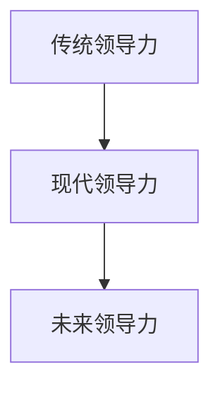
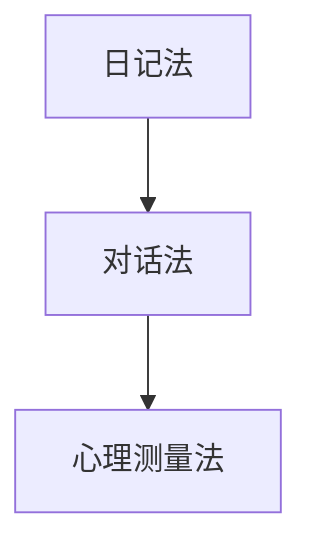
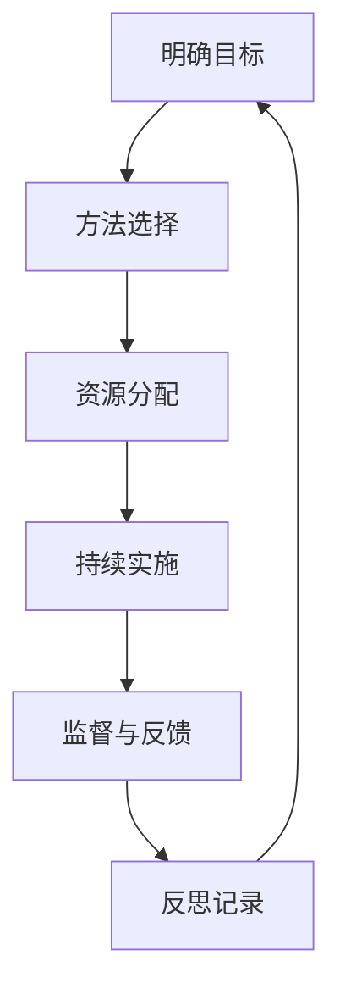
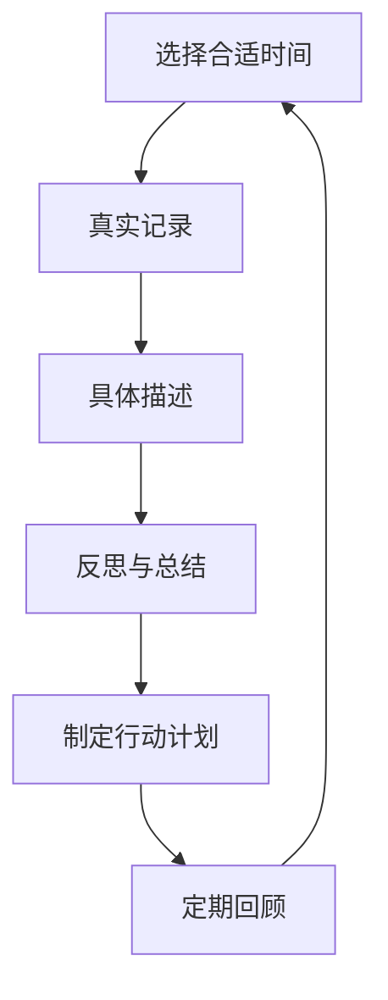
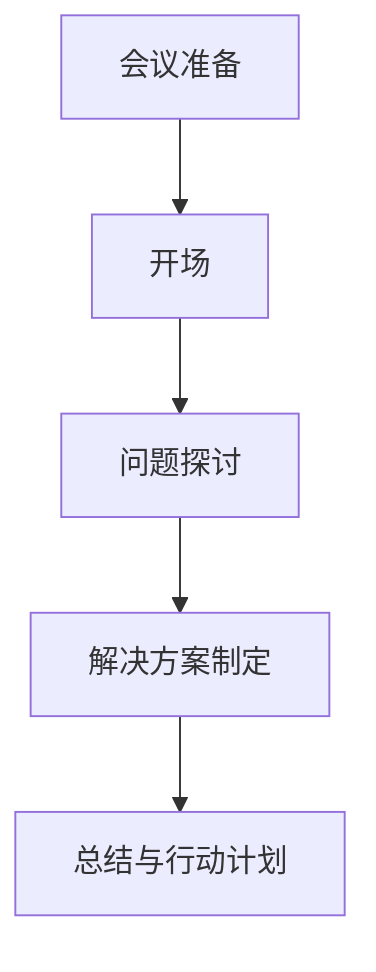

                 

### 文章标题

# 《领导力与自我反思：持续成长的关键》

### 关键词

- **领导力**
- **自我反思**
- **持续成长**
- **领导风格**
- **团队发展**
- **实践案例**

### 摘要

在快速变化的IT行业，领导力与自我反思成为了推动团队和企业持续成长的关键因素。本文旨在探讨领导力的核心概念与理论，以及自我反思在领导力实践中的应用。通过详细的章节内容，我们分析了领导力的定义、发展历程，不同领导风格的特点及其与自我反思的关系。文章还阐述了如何建立自我反思机制，以及自我反思在个人成长和团队发展中的作用。通过实践案例，我们展示了领导力与自我反思如何促进持续成长，并为读者提供了实用的策略和工具。

### 目录

**第一部分：领导力核心概念与理论**

## 第1章：领导力定义与基础理论

### 1.1.1 领导力的定义与内涵

### 1.1.2 领导力与管理的区别

### 1.1.3 领导力的发展历程

## 第2章：领导风格与自我反思

### 2.1.1 领导风格的分类

### 2.1.2 自我反思的概念与重要性

### 2.1.3 自我反思的方法与应用

**第二部分：自我反思在领导力中的应用**

## 第3章：建立自我反思机制

### 3.1.1 自我反思机制的构建

### 3.1.2 自我反思日记的编写

### 3.1.3 自我反思会议的举行

## 第4章：自我反思与个人成长

### 4.1.1 自我反思与自我认知

### 4.1.2 自我反思与情感管理

### 4.1.3 自我反思与行为改进

## 第5章：自我反思与团队发展

### 5.1.1 自我反思与团队沟通

### 5.1.2 自我反思与团队协作

### 5.1.3 自我反思与团队文化构建

**第三部分：领导力与自我反思实践案例**

## 第6章：领导力与自我反思实践案例

### 6.1.1 案例一：如何通过自我反思提升领导力

### 6.1.2 案例二：如何通过团队反思提升团队效能

### 6.1.3 案例三：如何在企业中推广自我反思文化

## 第7章：领导力与自我反思持续成长

### 7.1.1 领导力的持续成长策略

### 7.1.2 自我反思的持续实践

### 7.1.3 领导力与自我反思的持续融合

### 附录

## 附录A：自我反思工具与资源

### A.1.1 自我反思工具推荐

### A.1.2 自我反思相关书籍推荐

### A.1.3 自我反思网络资源推荐

---

### 第1章：领导力定义与基础理论

#### 1.1 领导力的定义与内涵

领导力是一个多维度的概念，涉及个人魅力、影响力、决策能力、团队建设等多个方面。它不仅仅是职位赋予的权威，更是一种能力，是一种通过激励、指导、协调和影响他人来实现共同目标的能力。

- **领导力的定义**：领导力是指个人或组织在特定环境下，通过激励、指导、协调和影响他人，实现组织目标的能力。它不仅仅是权威的体现，更是一种影响力、能力和品德的集合。
  
- **领导力的重要性**：领导力是企业成功的关键因素之一。有效的领导力可以帮助企业应对各种挑战，推动企业持续成长。一个优秀的领导者能够激发团队的潜力，提高团队的绩效，从而实现组织的战略目标。

#### 1.2 领导力与管理的区别

领导力与管理的概念有时被混淆，但它们有本质的区别。管理主要关注资源的分配和协调，而领导力则更注重激励和引导。

- **领导力**：领导力关注如何激发和引导他人的潜能，实现共同的目标。它强调的是人际互动、情感共鸣和价值观的传递。
  
- **管理**：管理则关注如何组织、规划、协调和监督资源的运用，确保目标的有效实现。它侧重于流程、效率和规则的制定。

#### 1.3 领导力的发展历程

领导力的发展历程可以追溯到古代，经过几个阶段的发展，逐步形成了现代的领导力理论。

- **传统领导力**：传统领导力强调权威和指挥控制。领导者通过职位赋予的权力来指导和影响下属。
  
- **现代领导力**：现代领导力强调参与式管理和变革型领导。领导者更加注重与下属的沟通和协作，鼓励员工参与决策，激发团队的创造力。

- **未来领导力**：未来领导力则更加注重持续学习和创新能力。领导者需要具备适应快速变化的能力，能够引领团队不断进步和创新。

#### Mermaid 流程图：领导力发展历程



### 第2章：领导风格与自我反思

#### 2.1 领导风格的分类

不同的领导风格对团队的效能和员工的工作体验有重要影响。常见的领导风格包括专制型领导、民主型领导和变革型领导。

- **专制型领导**：专制型领导强调权威和控制，决策由上级做出。这种领导风格可能导致员工的被动性和依赖性，不利于创新和团队发展。
  
- **民主型领导**：民主型领导鼓励员工参与决策，重视员工的意见和建议。这种领导风格有助于提高员工的积极性和创造性，促进团队的合作和协作。
  
- **变革型领导**：变革型领导通过激励和启发，引导员工实现组织变革。这种领导风格能够激发员工的潜能，推动企业的持续创新和成长。

#### 2.2 自我反思的概念与重要性

自我反思是指领导者对自身行为、态度和决策进行审视和评价的过程。自我反思可以帮助领导者识别自身的问题和不足，提高领导力水平，促进个人和团队的成长。

- **自我反思的重要性**：自我反思是领导者持续成长的关键。通过自我反思，领导者可以更好地理解自己的行为和决策，发现潜在的问题和改进的机会。自我反思有助于提高领导者的自我认知和情感管理能力，增强领导者的决策能力和团队影响力。

#### 2.3 自我反思的方法与应用

自我反思的方法包括日记法、对话法和心理测量法等。

- **日记法**：通过记录每日的经历和感受，进行反思。日记法有助于领导者回顾和总结自己的行为和决策，发现潜在的问题和改进的机会。
  
- **对话法**：与同事、朋友或导师进行深入的讨论，获取反馈。对话法可以帮助领导者从不同的角度看待问题，获取有益的建议和意见。
  
- **心理测量法**：通过心理测试工具，了解自身的性格和优点。心理测量法可以帮助领导者更好地了解自己的优势和不足，制定个性化的成长计划。

#### Mermaid 流程图：自我反思方法



### 第3章：建立自我反思机制

#### 3.1 自我反思机制的构建

建立自我反思机制是企业持续成长的关键。一个有效的自我反思机制可以帮助领导者持续提升自己的领导力水平，推动团队的成长。

- **目标明确**：明确自我反思的目标和意义。企业需要明确自我反思的目标，例如提高领导者的自我认知、增强决策能力、提升团队协作等。
  
- **方法选择**：根据企业的特点和需求，选择合适的自我反思方法。企业可以根据实际情况，选择日记法、对话法或心理测量法等不同的自我反思方法。
  
- **持续实施**：将自我反思作为日常工作的一部分，持续实施。企业需要建立定期反思的制度，确保领导者和员工能够持续地进行自我反思。

#### 3.2 自我反思日记的编写

自我反思日记是领导者进行自我反思的一种重要方法。通过编写日记，领导者可以记录自己的经历和感受，反思自己的行为和决策。

- **日记编写要点**：日记编写时，领导者需要注重以下几点：
  - **真实性**：记录真实的情况和感受，不要刻意美化或掩饰。
  - **具体性**：具体描述事件和行为，避免模糊和抽象的表述。
  - **反思性**：对事件和行为进行反思，思考其背后的原因和影响。
  
- **日记编写范例**：

  ```
  日期：2021年5月10日

  今天与团队成员讨论了项目进展，发现自己在沟通中存在一些问题。例如，我在表达观点时过于直接，导致团队成员感到不舒服。反思自己的行为，我认为需要更加注重沟通技巧，尊重团队成员的意见。

  明天我将尝试使用更多的开放式问题，鼓励团队成员分享他们的想法。同时，我会在表达意见时更加温和，避免直接指责。
  ```

#### 3.3 自我反思会议的举行

自我反思会议是领导者与团队成员共同进行自我反思的一种有效方式。通过会议，领导者可以与团队成员分享自己的反思，获取反馈，共同制定改进计划。

- **会议流程**：自我反思会议的一般流程如下：
  - **开场**：主持人简要介绍会议的目的和流程。
  - **反思分享**：领导者和团队成员依次分享自己的反思，包括成功经验、遇到的问题和改进计划。
  - **讨论反馈**：团队成员对领导者的反思进行讨论，提出建议和意见。
  - **总结共识**：主持人总结会议讨论的内容，达成共识，制定下一步行动计划。

- **会议范例**：

  ```
  会议主题：团队自我反思会议

  开场：欢迎大家参加今天的自我反思会议。我们将在接下来的一个小时里，共同反思过去一个月的工作，分享成功经验和改进计划。

  反思分享：
  - 领导者A：我在过去一个月里，主要精力放在项目规划上，但在执行过程中遇到了一些困难。我发现自己在沟通和协调方面存在一些问题，需要进一步提高。
  - 成员B：我最近在处理客户反馈时，发现自己在情绪管理方面做得不够好。我会在接下来的时间里，加强情绪管理，提高服务质量。

  讨论反馈：
  - 成员C：我认为领导者A在项目规划方面做得很好，但在执行过程中需要更加关注细节。我建议他可以制定更加详细的执行计划。
  - 成员D：成员B在情绪管理方面有困难，我们团队可以提供支持和帮助。例如，我们可以定期进行情绪管理培训。

  总结共识：
  - 领导者A：我会根据大家的建议，制定更加详细的执行计划，并在执行过程中更加注重细节。
  - 成员B：我会积极参加情绪管理培训，提高自己的情绪管理能力。

  下一步行动计划：
  - 领导者A：下周前，制定详细的执行计划，并与团队成员分享。
  - 成员B：下周前，参加情绪管理培训，并在团队内分享学习心得。
  ```

### 第4章：自我反思与个人成长

#### 4.1 自我反思与自我认知

自我反思是个人成长的重要工具，通过自我反思，个人可以更好地了解自己，发现自己的优势和不足，从而制定针对性的成长计划。

- **自我认知的重要性**：自我认知是个人成长的基础。只有深入了解自己，才能发现自己的潜力，找到适合自己的发展方向。
  
- **自我反思的方法**：个人可以通过以下方法进行自我反思：
  - **日记法**：通过记录日常生活中的经历和感受，反思自己的行为和决策。
  - **提问法**：对自己的行为和决策提出问题，思考背后的原因和影响。
  - **反思对话**：与他人进行深入的反思对话，获取不同的观点和建议。

#### 4.2 自我反思与情感管理

情感管理是领导者的重要能力，通过自我反思，领导者可以更好地管理自己的情绪，提高自己的情商。

- **情感管理的重要性**：情感管理能力对领导者的工作效率和人际关系有重要影响。一个情绪稳定的领导者能够更好地应对压力，保持团队的和谐与稳定。
  
- **自我反思在情感管理中的应用**：
  - **识别情绪**：通过自我反思，识别自己的情绪反应，了解情绪背后的原因。
  - **理解情绪**：通过反思，理解情绪对自己的影响，学会调整自己的情绪状态。
  - **表达情绪**：通过自我反思，学会合理表达自己的情绪，避免情绪失控。

#### 4.3 自我反思与行为改进

自我反思可以帮助领导者识别自己的行为问题，并通过改进行为来提高领导力水平。

- **行为改进的重要性**：行为改进是领导者成长的关键。一个优秀的领导者需要不断反思自己的行为，发现并改正不良习惯，提升自己的领导能力。
  
- **自我反思在行为改进中的应用**：
  - **识别问题行为**：通过自我反思，识别自己的问题行为，如沟通障碍、决策犹豫等。
  - **分析原因**：分析问题行为的原因，如环境因素、个人习惯等。
  - **制定改进计划**：根据分析结果，制定具体的改进计划，如提高沟通技巧、加强决策能力等。

### 第5章：自我反思与团队发展

#### 5.1 自我反思与团队沟通

团队沟通是团队协作的基础，通过自我反思，团队可以识别沟通中的问题，提高沟通效果。

- **自我反思在团队沟通中的作用**：
  - **识别沟通问题**：通过自我反思，团队可以识别沟通中的障碍，如信息不对称、沟通渠道不畅等。
  - **改善沟通方式**：通过反思，团队可以找到改善沟通方式的方法，如增加沟通频率、提高信息透明度等。
  - **促进团队协作**：有效的沟通可以促进团队成员之间的协作，提高团队的整体效能。

#### 5.2 自我反思与团队协作

团队协作是实现团队目标的关键，通过自我反思，团队可以识别协作中的问题，提高协作效果。

- **自我反思在团队协作中的作用**：
  - **识别协作问题**：通过自我反思，团队可以识别协作中的问题，如角色冲突、资源分配不均等。
  - **优化协作流程**：通过反思，团队可以找到优化协作流程的方法，如明确角色职责、优化资源分配等。
  - **提高团队效能**：有效的协作可以显著提高团队的效能，实现团队目标。

#### 5.3 自我反思与团队文化构建

团队文化是团队发展的基石，通过自我反思，团队可以构建积极向上的团队文化。

- **自我反思在团队文化构建中的作用**：
  - **识别文化问题**：通过自我反思，团队可以识别团队文化中的问题，如价值观不一致、团队合作氛围差等。
  - **塑造文化价值观**：通过反思，团队可以塑造共同的价值观，如团队合作、创新思维等。
  - **建立团队信任**：通过反思，团队可以建立信任，形成良好的团队氛围，提高团队凝聚力。

### 第6章：领导力与自我反思实践案例

#### 6.1 案例一：如何通过自我反思提升领导力

**案例背景**：某科技公司是一家专注于人工智能应用的创新企业，随着公司规模的扩大，领导层面临了巨大的挑战。公司的创始人，李总，意识到提升领导力对于公司持续发展至关重要。因此，他决定通过自我反思来提升自己的领导力。

**领导力提升策略**：

1. **制定反思计划**：李总每周安排一天时间进行自我反思，包括回顾一周的工作、识别问题、制定改进计划。

2. **日记记录**：李总使用日记法，记录每天的工作经历和反思，尤其是与团队成员的互动和决策过程。

3. **定期会议**：李总每月组织一次团队反思会议，邀请核心团队成员参与，共同讨论团队面临的挑战和改进方案。

**结果**：通过自我反思，李总识别出了自己在沟通和决策方面的不足，并采取了一系列改进措施。他开始更加注重倾听团队成员的意见，提高了决策的透明度。同时，通过团队反思会议，团队凝聚力得到了显著提升，团队成员之间的协作更加顺畅，公司的创新能力和市场竞争力得到了明显增强。

#### 6.2 案例二：如何通过团队反思提升团队效能

**案例背景**：某互联网公司的一个开发团队在项目实施过程中遇到了进度缓慢、质量不稳定的问题。团队负责人张经理意识到，团队效能的提升需要通过集体反思来实现。

**团队反思策略**：

1. **建立反思机制**：张经理制定了每月一次的团队反思会议，确保每个团队成员都有机会表达自己的观点和困惑。

2. **开放讨论**：在反思会议上，张经理鼓励团队成员开放讨论，共同分析问题的原因和解决方案。

3. **制定行动计划**：反思会议结束后，团队会制定具体的行动计划，明确每个人的职责和时间表。

**结果**：通过定期的团队反思，团队识别出了项目中的瓶颈和问题，并采取了有效的改进措施。团队成员开始更加主动地沟通和协作，项目进度和质量得到了显著提升。此外，团队的凝聚力也得到增强，成员之间的信任和合作精神得到了进一步加强。

#### 6.3 案例三：如何在企业中推广自我反思文化

**案例背景**：某大型企业，由于组织结构复杂、沟通不畅，导致内部效率低下。企业高层决定在企业内部推广自我反思文化，以提高整体运营效率。

**推广策略**：

1. **培训与教育**：企业组织了一系列自我反思的培训课程，帮助员工了解自我反思的重要性和方法。

2. **建立反思平台**：企业建立了一个在线反思平台，员工可以随时记录和分享自己的反思，促进知识共享和经验交流。

3. **领导带头示范**：企业高层领导以身作则，积极参与自我反思，并通过内部邮件和会议分享自己的反思过程和成果。

**结果**：通过推广自我反思文化，企业内部的沟通效率显著提高，员工之间的协作更加顺畅。企业高层领导的示范作用激发了员工的积极性，员工开始更加主动地参与反思和改进。企业的运营效率得到了显著提升，员工的工作满意度也相应提高。

### 第7章：领导力与自我反思持续成长

#### 7.1 领导力的持续成长策略

领导力不是一成不变的，而是需要通过持续学习和实践来不断提升。以下是一些领导力持续成长策略：

1. **终身学习**：领导力的发展离不开学习。领导者需要不断学习新的知识和技能，保持自己的竞争力。

2. **实践应用**：理论知识需要通过实践来验证和应用。领导者应该将学到的知识应用到实际工作中，不断实践和改进。

3. **反思与改进**：通过自我反思，领导者可以识别自己的不足，并采取改进措施。反思是领导力成长的重要环节。

4. **建立反馈机制**：领导者需要建立有效的反馈机制，收集团队成员的意见和建议，以便及时调整自己的领导风格和行为。

#### 7.2 自我反思的持续实践

自我反思是一种持续的过程，领导者需要将其融入日常工作和生活中，形成一种习惯。

1. **制度化反思**：企业可以建立定期的反思会议，确保领导者和员工有时间和空间进行反思。

2. **反思日记**：领导者可以坚持写反思日记，记录自己的经历和思考，帮助自己持续成长。

3. **学习与交流**：领导者可以参加相关的培训和学习活动，与同行交流经验，拓宽自己的视野。

#### 7.3 领导力与自我反思的持续融合

领导力与自我反思是相辅相成的，只有将二者持续融合，领导者才能实现真正的成长。

1. **理论联系实际**：领导者需要将自我反思的理论与实践相结合，通过反思来指导实际工作。

2. **不断调整与优化**：领导者需要根据反思的结果，不断调整和优化自己的领导方式和行为。

3. **形成良性循环**：通过持续的自我反思和改进，领导者可以形成一种良性循环，不断提高自己的领导力水平。

### 附录A：自我反思工具与资源

#### A.1.1 自我反思工具推荐

1. **反思日记软件**：如Reflect、Notion等，可以帮助领导者记录和整理反思日记。

2. **反馈工具**：如360度反馈工具，可以帮助领导者收集团队成员的意见和建议。

3. **反思会议模板**：如谷歌文档中的反思会议模板，可以帮助领导者组织有效的反思会议。

#### A.1.2 自我反思相关书籍推荐

1. **《高效能人士的七个习惯》**：史蒂芬·柯维著，提供了关于个人成长和领导力的深刻见解。

2. **《反思日志》**：托马斯·J·麦凯恩著，提供了详细的反思日记写作方法和实践技巧。

3. **《领导者的反思》**：约翰·梅杰著，探讨了领导力与自我反思的紧密关系，以及如何通过反思提升领导力。

#### A.1.3 自我反思网络资源推荐

1. **Leadership Reflections**：提供了一系列关于领导力反思的文章、案例和工具。

2. **MindTools**：提供了丰富的自我反思和领导力提升的资源，包括文章、视频和互动工具。

3. **反思日记社区**：如ReflectCommunity，提供了领导者之间的交流和分享平台，共同探讨反思实践。

---

### 作者信息

- **作者：AI天才研究院/AI Genius Institute & 禅与计算机程序设计艺术 /Zen And The Art of Computer Programming**### 第1章：领导力定义与基础理论

#### 1.1 领导力的定义与内涵

领导力是一个多维度的概念，它不仅仅局限于某一特定的角色或职位，而是涉及个人魅力、影响力、决策能力、团队建设等多个方面。要深入理解领导力的内涵，首先需要明确其定义。

**领导力的定义**：

领导力可以被定义为“在特定环境下，通过激励、指导、协调和影响他人，实现组织目标的能力”。这个定义强调了几个关键点：

1. **环境因素**：领导力是在特定环境下发挥作用的能力，这意味着领导力的运用需要考虑外部环境的因素，如组织文化、市场状况等。

2. **激励与影响**：领导力不仅仅依赖于权威，更重要的是通过激励和影响来引导他人。这意味着领导者需要具备一定的沟通能力和人际交往技巧，以激发团队成员的潜能和动力。

3. **指导与协调**：领导力还包括指导团队成员，协调各种资源，确保团队朝着共同的目标前进。这要求领导者具备战略规划能力和团队管理能力。

4. **实现组织目标**：领导力的最终目标是实现组织的目标。这意味着领导者的工作不仅仅是管理团队，更重要的是推动团队实现组织的战略目标。

**领导力的内涵**：

领导力的内涵非常丰富，主要包括以下几个方面：

1. **个人魅力**：个人魅力是领导力的重要组成部分。一个具有个人魅力的领导者能够吸引和激励团队成员，增强团队的凝聚力和向心力。

2. **影响力**：领导力是一种影响力。领导者通过自己的言行和决策，对团队成员产生积极的影响，推动团队朝着共同的目标前进。

3. **决策能力**：领导力需要强大的决策能力。领导者需要在复杂和不确定的环境中做出正确的决策，确保团队的方向和策略的正确性。

4. **团队建设**：团队建设是领导力的重要方面。领导者需要构建一个高效的团队，确保团队成员能够相互支持，共同实现目标。

5. **持续学习与适应能力**：领导力是一个持续的过程。领导者需要不断学习和适应，以应对不断变化的环境和挑战。

**领导力的重要性**：

领导力是企业成功的关键因素之一。一个有效的领导者能够激发团队的潜力，提高团队的绩效，从而实现组织的战略目标。以下是领导力的重要性的一些体现：

1. **提高团队绩效**：有效的领导力可以激发团队成员的潜力，提高团队的工作效率和绩效。

2. **推动组织变革**：领导者是推动组织变革的关键力量。他们能够引导团队适应变化，实现组织的战略目标。

3. **增强团队凝聚力**：领导力可以增强团队的凝聚力，使团队成员更加团结，共同实现目标。

4. **提升企业竞争力**：领导力是企业竞争力的重要组成部分。一个具有强大领导力的企业能够在激烈的市场竞争中脱颖而出。

**领导力的内涵**：

领导力不仅仅是职位赋予的权威，更是一种能力，是一种通过激励、指导、协调和影响他人来实现组织目标的能力。它涉及多个方面，包括个人魅力、影响力、决策能力、团队建设等。一个成功的领导者需要具备这些能力，并在实践中不断锻炼和提升。

#### 1.2 领导力与管理的区别

领导力与管理是两个相关但不完全相同的概念。虽然它们在很多方面有交集，但它们的核心目标和作用有所不同。

**领导力与管理**：

1. **定义**：

   - **领导力**：领导力是指通过激励、指导和影响他人，实现共同目标的能力。它关注的是如何激发团队的潜力，推动团队前进。

   - **管理**：管理是指组织、规划、协调和监督资源，确保组织目标的实现。它关注的是如何高效地利用资源，确保组织的运营和效率。

2. **区别**：

   - **目标**：领导力的目标是实现共同的目标，激发团队的潜力，推动创新和变革。管理的目标是确保组织的运营高效，资源的有效利用。

   - **方法**：领导力更多地依赖于激励和影响，通过个人魅力和愿景来引导团队。管理则更多地依赖于规划和流程，通过制定目标和监控进度来确保任务的完成。

   - **范围**：领导力关注的是整个团队或组织的方向和目标，强调的是人与人之间的互动和影响。管理则更多地关注组织的内部运营，如资源分配、流程优化等。

3. **关系**：

   - **互补关系**：领导力和管理是互补的。领导力提供方向和动力，管理提供结构和效率。一个成功的组织需要同时具备强大的领导力和有效的管理。

**领导力与管理的关系**：

1. **相互依赖**：领导力和管理相互依赖，共同推动组织的成功。领导力为组织提供愿景和方向，管理则为实现这个愿景提供必要的结构和流程。

2. **协同作用**：领导力和管理的协同作用可以最大限度地发挥团队和组织的能力。有效的领导力可以激发员工的潜能，而有效的管理可以确保这些潜能得以实现。

3. **平衡**：领导力和管理需要平衡。如果一个组织过于强调领导力而忽视管理，可能会导致混乱和无效率。相反，如果过于强调管理而忽视领导力，可能会缺乏创新和动力。

**结论**：

领导力与管理虽然有区别，但它们是相辅相成的。一个成功的领导者需要同时具备领导力和管理的能力，并在实践中找到二者的平衡点。

#### 1.3 领导力的发展历程

领导力的发展历程可以追溯到古代，经历了几个阶段的发展，逐步形成了现代的领导力理论。以下是领导力发展的主要阶段和特点：

**1. 传统领导力**

传统领导力主要强调权威和指挥控制。在这种领导风格下，领导者通过职位赋予的权力来指导和影响下属。传统领导力的特点包括：

- **权威主义**：领导者拥有绝对的权威，下属必须服从领导者的指示。
- **控制导向**：领导者强调对下属行为的控制，以确保工作目标的实现。
- **效率优先**：传统领导力主要关注工作效率和任务完成，对员工个体的发展和需求关注较少。

**2. 现代领导力**

现代领导力强调参与式管理和变革型领导。在这种领导风格下，领导者更加注重与下属的沟通和协作，鼓励员工参与决策，激发团队的创造力。现代领导力的特点包括：

- **参与式管理**：领导者鼓励员工参与决策，尊重员工的意见和建议，增强团队的合作和凝聚力。
- **变革型领导**：领导者通过激励和启发，引导员工实现组织变革，推动创新和持续改进。
- **人本主义**：现代领导力更加注重员工的发展和需求，关注员工的成长和幸福感。

**3. 未来领导力**

未来领导力则更加注重持续学习和创新能力。随着科技和社会的发展，领导者需要具备适应快速变化的能力，能够引领团队不断进步和创新。未来领导力的特点包括：

- **终身学习**：未来领导者需要具备终身学习的能力，不断更新知识和技能，以适应不断变化的环境。
- **数字化转型**：未来领导者需要具备数字化转型的能力，能够利用新技术推动组织的创新和变革。
- **全球视野**：未来领导者需要具备全球视野，能够理解和应对全球化和多文化的挑战。

**领导力发展历程的Mermaid流程图**


**总结**：

领导力的发展历程反映了社会和科技的变化。从传统领导力到现代领导力，再到未来领导力，领导者需要不断适应和提升自己的能力，以应对不断变化的挑战和机遇。

#### 第1章：领导力定义与基础理论

##### 1.1.1 领导力的定义与内涵

领导力是一个多维度的概念，它不仅仅是职位赋予的权威，更是一种能力，一种通过激励、指导、协调和影响他人来实现组织目标的能力。为了更深入地理解领导力的定义和内涵，我们可以将其分为以下几个关键组成部分：

1. **激励**：领导力的一个核心要素是激励。领导者通过激励来调动团队成员的积极性和动力，使他们愿意为实现共同目标而努力。激励可以采取多种形式，包括物质激励（如奖金、晋升等）和精神激励（如认可、培训等）。

2. **指导**：指导是领导力的另一个关键组成部分。领导者不仅需要设定目标，还需要为团队成员提供清晰的指导和方向。这包括明确团队成员的角色和职责，提供必要的资源和支持，确保团队成员能够按照既定的方向前进。

3. **协调**：协调是领导力的重要组成部分，特别是在复杂组织中。领导者需要协调不同部门、团队或个人之间的工作，确保他们能够协同合作，共同实现组织目标。协调包括沟通、冲突解决和资源分配等方面。

4. **影响**：领导力涉及到对他人产生影响。领导者通过自己的行为、决策和价值观，对团队成员产生积极的影响，引导他们朝着共同的目标前进。这种影响不仅限于团队成员，还包括对整个组织文化和社会的影响。

5. **团队发展**：领导力还涉及到团队的发展和成长。一个成功的领导者不仅关注团队的短期绩效，还注重团队的长期发展。这包括培养团队成员的技能和潜力，促进团队的创新和协作，以及提升团队的凝聚力和士气。

**领导力的内涵还包括以下方面**：

- **个人魅力**：个人魅力是领导者的一种特质，它能够吸引和激励团队成员，增强团队的凝聚力和向心力。
- **决策能力**：领导者需要具备强大的决策能力，能够在复杂和不确定的环境中做出明智的决策，确保团队的顺利运行。
- **沟通能力**：沟通能力是领导者成功的关键因素之一。有效的沟通可以增强团队的协作和信任，确保信息的准确传递和目标的明确。
- **战略思维**：领导者需要具备战略思维，能够从长远的角度考虑问题，制定和实现组织的目标。
- **创新能力**：在快速变化的商业环境中，领导者需要具备创新能力，能够带领团队适应变化，推动组织的持续发展。

通过理解领导力的定义和内涵，我们可以看到，领导力不仅仅是一种职位赋予的权力，更是一种综合能力，它涉及到激励、指导、协调、影响和团队发展等多个方面。一个成功的领导者需要在这些方面具备出色的能力和素质。

**伪代码示例**：

```python
class Leadership:
    def __init__(self, motivation, guidance, coordination, influence, team_development):
        self.motivation = motivation
        self.guidance = guidance
        self.coordination = coordination
        self.influence = influence
        self.team_development = team_development

    def inspire_team(self):
        # 激励团队
        print("激励团队，提升动力和士气")

    def provide_guidance(self):
        # 提供指导
        print("明确目标和方向，指导团队成员")

    def coordinate_activities(self):
        # 协调活动
        print("协调不同部门或团队的工作，确保协同合作")

    def exert_influence(self):
        # 施加影响
        print("通过自身行为和价值观影响团队成员")

    def foster_team_growth(self):
        # 促进团队成长
        print("培养团队成员的技能和潜力，提升团队凝聚力")

# 创建一个领导力对象
leader = Leadership(motivation=True, guidance=True, coordination=True, influence=True, team_development=True)

# 调用方法
leader.inspire_team()
leader.provide_guidance()
leader.coordinate_activities()
leader.exert_influence()
leader.foster_team_growth()
```

通过上述伪代码示例，我们可以看到，领导力可以通过一系列的方法和行动来体现。领导者需要不断地激励团队、提供指导、协调活动、施加影响和促进团队成长，以实现组织的共同目标。

##### 1.1.2 领导力与管理的区别

在探讨领导力之前，有必要明确领导力与管理的区别。虽然这两个概念密切相关，但它们的核心目标和方法有所不同。

**定义与管理**：

- **领导力**：领导力是指通过激励、指导和影响他人来实现共同目标的能力。它关注的是如何激发团队的潜能，推动创新和变革。
- **管理**：管理是指组织、规划、协调和监督资源，确保组织目标的实现。它关注的是如何高效地利用资源，确保组织的运营和效率。

**区别**：

1. **目标**：
   - **领导力**：领导力旨在实现组织的战略目标和愿景，激发员工的潜能和创造力，推动组织的长期发展。
   - **管理**：管理旨在确保组织的日常运营和目标的实现，通过制定和执行计划、分配资源、监控进度来保证任务的成功完成。

2. **方法**：
   - **领导力**：领导者通过激励和影响来引导团队成员，建立共同的愿景和价值观，鼓励创新和协作。
   - **管理**：管理者通过制定和执行计划、分配资源、监控进度来确保任务的完成，关注流程的优化和效率的提升。

3. **范围**：
   - **领导力**：领导力关注的是整个组织或团队的方向和目标，以及人与人之间的互动和影响。
   - **管理**：管理关注的是组织的内部运营，如资源分配、流程优化、绩效评估等。

**关系**：

- **互补性**：领导力和管理是互补的。领导力为组织提供方向和动力，管理则为实现这个方向提供必要的结构和效率。
- **协同作用**：一个成功的组织需要同时具备强大的领导力和有效的管理。领导力激发团队的潜能，管理确保这些潜能得以实现。

**结论**：

领导力和管理虽然有区别，但它们是相辅相成的。领导者需要同时具备领导力和管理的技能，以实现组织的长期成功。领导力侧重于激励和创新，而管理侧重于规划和执行。

##### 1.1.3 领导力的发展历程

领导力的发展历程可以追溯到古代，经历了几个阶段的发展，逐步形成了现代的领导力理论。以下是领导力发展的主要阶段和特点：

**1. 传统领导力**

传统领导力主要强调权威和指挥控制。在这种领导风格下，领导者通过职位赋予的权力来指导和影响下属。传统领导力的特点包括：

- **权威主义**：领导者拥有绝对的权威，下属必须服从领导者的指示。
- **控制导向**：领导者强调对下属行为的控制，以确保工作目标的实现。
- **效率优先**：传统领导力主要关注工作效率和任务完成，对员工个体的发展和需求关注较少。

**2. 现代领导力**

现代领导力强调参与式管理和变革型领导。在这种领导风格下，领导者更加注重与下属的沟通和协作，鼓励员工参与决策，激发团队的创造力。现代领导力的特点包括：

- **参与式管理**：领导者鼓励员工参与决策，尊重员工的意见和建议，增强团队的合作和凝聚力。
- **变革型领导**：领导者通过激励和启发，引导员工实现组织变革，推动创新和持续改进。
- **人本主义**：现代领导力更加注重员工的发展和需求，关注员工的成长和幸福感。

**3. 未来领导力**

未来领导力则更加注重持续学习和创新能力。随着科技和社会的发展，领导者需要具备适应快速变化的能力，能够引领团队不断进步和创新。未来领导力的特点包括：

- **终身学习**：未来领导者需要具备终身学习的能力，不断更新知识和技能，以适应不断变化的环境。
- **数字化转型**：未来领导者需要具备数字化转型的能力，能够利用新技术推动组织的创新和变革。
- **全球视野**：未来领导者需要具备全球视野，能够理解和应对全球化和多文化的挑战。

**领导力发展历程的Mermaid流程图**


**总结**：

领导力的发展历程反映了社会和科技的变化。从传统领导力到现代领导力，再到未来领导力，领导者需要不断适应和提升自己的能力，以应对不断变化的挑战和机遇。

### 第2章：领导风格与自我反思

#### 2.1 领导风格的分类

领导风格是指领导者管理团队和指导下属的方式，它对团队的效能和员工的工作体验有重要影响。不同的领导风格适用于不同的情境和团队，领导者需要根据具体情况灵活调整自己的领导风格。

**1. 专制型领导**

专制型领导也被称为权威型领导，这种领导风格强调领导者对下属的控制和命令。专制型领导者的决策权高度集中，下属的参与度较低。

- **优点**：在紧急情况下，专制型领导可以快速做出决策，确保团队迅速响应。
- **缺点**：长期来看，这种领导风格可能导致下属的被动性和依赖性，不利于员工的成长和创新。

**2. 民主型领导**

民主型领导强调领导者与下属的沟通和协作，鼓励团队成员参与决策。民主型领导者重视下属的意见和建议，通过讨论和协商来做出决策。

- **优点**：民主型领导有助于提高团队成员的积极性和创造力，增强团队的凝聚力。
- **缺点**：在决策速度上可能不如专制型领导，特别是在紧急情况下。

**3. 变革型领导**

变革型领导注重激发和引导下属的潜能，通过激励和启发来推动组织变革和创新。变革型领导者具有强烈的愿景和使命感，能够引领团队突破传统思维模式。

- **优点**：变革型领导能够激发团队成员的创造力和创新能力，推动组织的持续发展。
- **缺点**：变革型领导可能需要更多的时间和资源来建立团队信任和协作。

**4. 支持型领导**

支持型领导注重员工的个人成长和发展，为员工提供支持和资源。支持型领导者关心下属的福利和工作环境，致力于创造一个积极的工作氛围。

- **优点**：支持型领导有助于提高员工的工作满意度和忠诚度，增强团队凝聚力。
- **缺点**：在强调个人支持的同时，可能忽视了组织的整体目标和效率。

**5. 教育型领导**

教育型领导注重培养下属的技能和知识，通过指导和培训来提升团队成员的能力。教育型领导者鼓励下属主动学习和探索，以适应不断变化的工作环境。

- **优点**：教育型领导有助于提高团队的专业能力和竞争力，为组织的长期发展奠定基础。
- **缺点**：在短期内可能难以看到明显的效果，需要较长时间的培养和观察。

**6. 训练型领导**

训练型领导注重通过实践和反馈来提升团队成员的技能和表现。训练型领导者提供具体的指导和反馈，帮助下属不断改进和提升。

- **优点**：训练型领导能够快速提升团队成员的能力，确保团队在特定任务上的高效执行。
- **缺点**：在长期项目中，训练型领导可能过于注重技能提升而忽视了其他重要方面。

**结论**：

不同的领导风格适用于不同的情境和团队。领导者需要根据具体情况和团队需求，灵活调整自己的领导风格，以达到最佳的管理效果。

#### 2.2 自我反思的概念与重要性

自我反思是一种通过审视自己的行为、思考、情感和决策，从而提高自我认知和改进个人行为的方法。它不仅适用于个人成长，也是领导力发展的重要组成部分。

**定义**：

自我反思是指个体对自身行为、思维和情感进行审视和评价的过程。通过自我反思，个体可以识别自己的优点和不足，理解自己的行为动机和影响，并制定改进计划。

**重要性**：

1. **提高自我认知**：自我反思有助于个体更好地了解自己，包括自己的价值观、信念、习惯和思维方式。这种自我认知对于个人成长和领导力发展至关重要。

2. **识别问题**：自我反思可以帮助个体识别自己的问题，如行为偏差、决策失误、情感管理不足等。通过识别问题，个体可以采取针对性的改进措施。

3. **促进个人成长**：自我反思是一种自我提升的过程。通过不断地审视和改进，个体可以提升自己的能力，增强自信心，实现个人成长。

4. **提高领导力**：对于领导者来说，自我反思是提升领导力的关键。通过自我反思，领导者可以更好地理解自己的领导风格，识别团队中的问题，并采取有效的改进措施。

5. **增强决策能力**：自我反思可以帮助领导者审视自己的决策过程，识别可能存在的偏见和不足，从而提高决策的质量和效果。

6. **提升团队效能**：自我反思不仅对个人成长有益，还可以提升整个团队的效能。通过团队反思，领导者可以促进团队成员之间的沟通和协作，提高团队的整体表现。

**实践方法**：

1. **日记法**：记录日常行为和思考，定期回顾和反思。这种方法有助于个体系统地记录和反思自己的行为，发现潜在的问题。

2. **提问法**：对自己提出问题，如“我为什么要这样做？”“这样做有什么影响？”等。通过提问，个体可以更深入地思考自己的行为动机和影响。

3. **反馈法**：寻求他人的反馈，如同事、朋友或导师的意见。外部视角可以帮助个体更客观地认识自己，发现自己的盲点。

4. **心理测量法**：使用心理测试工具，如MBTI、DISC等，了解自己的性格特点和优势。这种方法可以提供科学的数据支持，帮助个体更好地理解自己。

**结论**：

自我反思是个人成长和领导力发展的关键。通过自我反思，个体可以不断提高自我认知，识别和解决问题，实现个人成长和提升领导力。领导者应该将自我反思纳入日常工作，以促进个人和团队的持续成长。

#### 2.3 自我反思的方法与应用

自我反思是一种重要的个人成长工具，它可以帮助领导者识别自己的问题、提高自我认知，并采取改进措施。以下是几种常见的自我反思方法及其应用：

**1. 日记法**

日记法是一种传统的自我反思方法，通过记录日常行为、思考和情感，领导者可以系统地回顾自己的经历，发现潜在的问题。以下是日记法的一些步骤：

- **记录真实经历**：每天结束时，写下当天的重要事件、感受和思考。确保记录内容真实，不要刻意美化或掩饰。

- **深入分析**：对记录的事件进行深入分析，思考自己的行为、决策和反应背后的原因和影响。

- **制定改进计划**：根据分析结果，制定具体的改进计划，如改变某个行为习惯或改进决策过程。

**应用示例**：

假设领导者李总在一天的工作中发现自己在团队沟通中过于直接，导致团队成员感到不适。他在日记中记录了这一情况，并深入分析了背后的原因，如工作压力和个人沟通风格。基于这些分析，他制定了改进计划，包括在与团队成员沟通时使用更多的开放式问题，以提高沟通效果。

**2. 对话法**

对话法是通过与他人进行深入的反思对话，获取外部视角和反馈的一种自我反思方法。以下是对话法的一些步骤：

- **选择合适的人**：选择信任的同事、朋友或导师进行对话。这些人可以提供客观的意见和建议。

- **开放提问**：在对话中，领导者可以提出开放性问题，如“我在沟通中有什么问题？”“我如何改进我的决策过程？”等。

- **倾听与反思**：认真倾听对方的意见，并对其进行反思。通过外部视角，领导者可以更全面地了解自己的问题。

- **行动计划**：根据对话结果，制定具体的行动计划，如改进沟通技巧或优化决策流程。

**应用示例**：

假设领导者张经理在与团队反思会议中，通过同事的反馈发现自己在团队决策中缺乏透明度。他选择了两位信任的同事进行反思对话，讨论了这一问题，并制定了改进计划，包括在决策过程中增加透明度，定期与团队成员分享决策过程和理由。

**3. 心理测量法**

心理测量法是通过使用心理测试工具，了解领导者的性格特点、优势与不足的一种自我反思方法。以下是心理测量法的一些步骤：

- **选择合适的测试**：选择适合领导力发展的心理测试，如MBTI、DISC等。

- **进行测试**：按照测试要求，完成测试问卷，获取测试结果。

- **分析结果**：分析测试结果，了解自己的性格特点、优势和不足。

- **制定改进计划**：根据分析结果，制定具体的改进计划，如提高情绪管理能力或改进沟通技巧。

**应用示例**：

假设领导者王总通过MBTI测试了解到自己属于“分析型”性格，倾向于理性思考和逻辑分析。他分析了这一性格特点对自己领导力的影响，并制定了改进计划，如增加情感管理训练，以更好地理解和满足团队成员的情感需求。

**总结**：

自我反思的方法多种多样，领导者可以根据自己的需求和情况选择合适的方法。日记法、对话法和心理测量法都是有效的自我反思工具，可以帮助领导者提高自我认知，识别问题，并采取改进措施。通过持续的自我反思，领导者可以不断提升自己的领导力，实现个人和团队的成长。

### 第3章：建立自我反思机制

#### 3.1 自我反思机制的构建

自我反思机制是领导者持续成长和团队高效运作的重要保障。一个有效的自我反思机制可以帮助领导者识别自身的问题和不足，促进自我提升和团队改进。以下是构建自我反思机制的几个关键步骤：

**1. 明确目标**

构建自我反思机制的第一步是明确目标。企业需要确定自我反思的目的是什么，如提高领导者的自我认知、增强决策能力、提升团队协作等。明确的目标有助于指导整个反思过程，确保反思活动具有实际意义。

**2. 方法选择**

根据企业的特点和需求，选择合适的自我反思方法。常见的方法包括日记法、对话法、心理测量法等。日记法适用于记录和反思个人行为和情感；对话法通过与他人交流获取外部视角；心理测量法通过科学工具了解自身性格特点。企业可以根据实际情况，选择单一或组合使用这些方法。

**3. 资源分配**

确保自我反思活动有足够的资源支持。这包括时间安排、人员配备和工具配备等。企业需要为领导者安排固定的反思时间，提供必要的培训和支持，确保他们能够有效地进行自我反思。

**4. 持续实施**

将自我反思作为日常工作的一部分，持续实施。企业可以通过建立定期反思的制度，确保领导者和团队成员能够持续地进行自我反思。例如，可以设定每周或每月的反思时间，组织定期的反思会议或工作坊。

**5. 监督与反馈**

建立监督与反馈机制，确保自我反思活动得到有效的执行和持续改进。企业可以设立反思监督小组，负责监督反思活动的执行情况，收集反馈意见，并据此调整反思策略。

**6. 反思记录**

建立反思记录系统，记录每次反思的成果和改进措施。反思记录不仅可以帮助企业追踪反思活动的效果，还可以为后续的反思提供参考和借鉴。

**构建自我反思机制的Mermaid流程图**



**结论**：

构建自我反思机制需要明确目标、选择方法、分配资源、持续实施、监督反馈和记录反思。通过这些步骤，企业可以建立起一个有效的自我反思机制，促进领导者成长和团队高效运作。

#### 3.2 自我反思日记的编写

自我反思日记是一种重要的个人成长工具，通过记录和反思日常行为和思考，领导者可以深入理解自己的优点和不足，从而制定改进计划。以下是编写自我反思日记的几个关键步骤：

**1. 选择合适的时间**

选择一个固定的时间进行日记编写，确保反思活动能够持续和系统地进行。建议在每天结束前或第二天开始前进行日记编写，这样可以更好地回顾前一天的行为和思考。

**2. 真实记录**

日记记录要真实，不要刻意美化或掩饰。领导者应该记录自己真实的行为、感受和思考，包括成功和失败的经历。真实的记录有助于发现潜在的问题和改进的机会。

**3. 具体描述**

在日记中，具体描述发生的事件和行为。避免使用模糊和抽象的表述，而是详细描述当时的情境、自己的感受以及行为的影响。具体描述有助于领导者更深入地分析问题，找到解决方案。

**4. 反思与总结**

对记录的事件和行为进行反思和总结。思考自己的行为是否达到了预期的效果，是否有改进的空间。总结自己的收获和不足，并记录下需要改进的具体措施。

**5. 制定行动计划**

根据反思和总结的结果，制定具体的行动计划。这些计划应该具体、可行，并且有明确的时间表。行动计划可以帮助领导者将反思转化为实际的行动，推动个人成长和改进。

**6. 定期回顾**

定期回顾日记，检查自己制定的行动计划是否得到有效执行。通过回顾，领导者可以了解自己的进步，及时发现和解决问题。

**编写自我反思日记的Mermaid流程图**



**实例**：

**日记日期**：2023年4月15日

**事件描述**：今天下午，我在与团队成员讨论项目进度时，发现自己在表达观点时过于直接，导致团队成员显得有些被动。

**反思与总结**：反思自己的行为，我认为自己在沟通时过于强调自己的观点，没有充分倾听团队成员的意见。这种沟通方式可能影响了团队的协作和决策效果。

**行动计划**：从明天开始，我在表达观点前，将先倾听团队成员的意见，使用开放式问题引导讨论，以确保团队成员能够积极参与。

**结论**：

通过编写自我反思日记，领导者可以系统地记录和反思自己的行为和思考，从而发现潜在的问题，制定改进计划，促进个人成长和团队协作。

#### 3.3 自我反思会议的举行

自我反思会议是一种集体反思活动，通过团队领导和成员共同参与，可以深入探讨个人和团队的问题，并提出改进措施。以下是如何有效地举行自我反思会议的步骤：

**1. 会议准备**

在举行自我反思会议前，需要做好充分的准备工作。这包括确定会议的时间、地点、参与人员和议程。

- **时间与地点**：选择一个合适的时间和地点，确保所有参与者能够按时参加会议。建议选择一个安静、不受打扰的环境，以营造良好的反思氛围。

- **参与者**：确定会议的参与人员，包括领导者和团队成员。确保所有相关人员都能参与到会议中，以便全面了解和探讨问题。

- **议程**：提前制定会议议程，明确会议的目的、讨论的主题和流程。议程应该包括开场、问题探讨、解决方案制定和总结等环节。

**2. 开场**

会议开始时，主持人需要简要介绍会议的目的和议程，确保所有参与者都清楚会议的内容和目标。

- **开场致辞**：主持人可以简短地致辞，说明会议的重要性和目的，鼓励参与者积极参与。

- **明确目标**：明确会议的目标，如探讨某个问题、制定改进措施等。

- **提醒规则**：提醒参与者保持开放心态，尊重他人的意见，避免打断他人发言。

**3. 问题探讨**

在问题探讨环节，参与者可以自由发言，分享自己在工作中遇到的问题和挑战。以下是具体步骤：

- **自由发言**：每个参与者都有机会发言，分享自己在工作中的问题和困惑。

- **提问与回应**：其他参与者可以提问或回应，以深入探讨问题，并从不同角度提出解决方案。

- **记录要点**：会议主持人或记录员需要记录关键问题和解决方案，以便后续分析和改进。

**4. 解决方案制定**

在问题探讨后，团队需要共同制定解决方案，以下是一些建议：

- **头脑风暴**：鼓励所有参与者提出可能的解决方案，无论是否可行。头脑风暴有助于激发创意和不同的观点。

- **筛选方案**：根据问题的严重性和可行性，筛选出最具潜力的解决方案。

- **讨论与投票**：对筛选出的解决方案进行讨论，并采取投票或其他方式确定最终的解决方案。

- **行动计划**：明确每个参与者的职责和时间表，确保解决方案能够得到有效执行。

**5. 总结与行动计划**

会议结束时，主持人需要对会议内容和行动计划进行总结，确保所有参与者都清楚下一步的行动。

- **总结要点**：回顾会议讨论的内容，强调关键问题和解决方案。

- **行动计划**：明确每个参与者的职责和时间表，确保解决方案能够得到有效执行。

- **跟进机制**：建立跟进机制，确保会议的成果能够得到持续的关注和改进。

**自我反思会议的Mermaid流程图**



**实例**：

**会议主题**：团队自我反思会议

**会议议程**：

1. 开场致辞
2. 自由发言，分享问题
3. 提问与回应
4. 头脑风暴，提出解决方案
5. 筛选方案，投票确定解决方案
6. 总结与行动计划

**结果**：

通过会议，团队识别出几个关键问题，如项目进度延误、沟通不畅等。团队共同制定了改进方案，包括优化项目进度计划、加强沟通培训等。每个成员都明确了自己的职责和时间表，确保改进措施能够得到有效执行。

**结论**：

自我反思会议是一种有效的集体反思工具，可以帮助团队深入探讨问题，制定改进措施，促进团队协作和成长。通过有效的会议准备和流程管理，团队可以更好地应对挑战，实现持续改进。

### 第4章：自我反思与个人成长

#### 4.1 自我反思与自我认知

自我认知是指个人对自己性格、能力、价值观等方面的理解和认识。自我反思是提升自我认知的重要工具，通过反思，个人可以更深入地了解自己，发现自身的潜力和不足。

**定义与重要性**：

- **自我认知**：自我认知是指个人对自己性格、能力、价值观等方面的理解和认识。它包括对自己的认知、情感、行为等方面的了解。
- **自我反思**：自我反思是指个人对自己的行为、决策、情感反应等进行审视和评价的过程。通过反思，个人可以深入思考自己的行为动机、影响和结果，从而更好地理解自己。

自我反思对于自我认知的重要性体现在以下几个方面：

1. **发现潜在问题**：通过自我反思，个人可以发现自己的潜在问题，如不良习惯、行为偏差等。这些问题的发现是自我成长的第一步。
2. **促进自我提升**：自我反思可以帮助个人识别自己的优势和不足，从而有针对性地进行自我提升，如加强某个领域的知识学习或提高某项技能。
3. **增强自我理解**：自我反思有助于个人更深入地理解自己的行为和情感，从而增强自我理解，减少自我冲突。
4. **提高决策能力**：自我反思可以帮助个人审视自己的决策过程，识别可能的偏见和错误，从而提高决策的质量和效果。

**如何通过自我反思提升自我认知**：

1. **定期记录**：定期记录自己的行为和思考，通过日记或反思笔记的方式，系统地记录自己的经历和感受。这有助于个人回顾和总结，从而更好地理解自己。
2. **开放提问**：对自己的行为和决策提出开放性的问题，如“这个决策背后的动机是什么？”“这个行为对我的团队有什么影响？”等。通过提问，个人可以更深入地思考自己的行为和决策。
3. **外部反馈**：寻求他人的反馈，如同事、朋友或导师的意见。外部反馈可以提供不同的视角，帮助个人更全面地了解自己。
4. **心理测量**：使用心理测量工具，如MBTI、DISC等，了解自己的性格特点和优势。这种科学的方法可以帮助个人更准确地了解自己。

**结论**：

自我反思是提升自我认知的重要工具。通过定期记录、开放提问、外部反馈和心理测量等方法，个人可以更深入地了解自己，发现自己的优势和不足，从而实现自我成长。

#### 4.2 自我反思与情感管理

情感管理是指个体对自己的情感反应进行调节和控制的能力。良好的情感管理能力可以帮助领导者更好地处理工作压力，保持积极的心态，提高工作效率。自我反思在情感管理中起着关键作用，通过反思，领导者可以识别和调整自己的情感反应，从而实现更好的情感管理。

**定义与重要性**：

- **情感管理**：情感管理是指个体对自己的情感反应进行调节和控制的能力。它涉及到如何识别、理解和处理自己的情绪，以及如何在工作和生活中保持积极的心态。
- **自我反思**：自我反思是指领导者对自己的情感反应和行为进行审视和评价的过程。通过反思，领导者可以深入思考自己的情感反应，识别其中的问题，并采取改进措施。

情感管理对领导者的工作生活有着重要的影响：

1. **提高工作效率**：良好的情感管理能力可以帮助领导者更好地处理工作压力，保持专注和高效，从而提高工作效率。
2. **增强决策能力**：情感稳定和理性思考是相辅相成的。良好的情感管理能力可以减少情绪波动对决策的影响，提高决策的质量和效果。
3. **改善人际关系**：情感管理能力可以帮助领导者更好地处理与同事、下属和客户之间的关系，增强团队凝聚力和合作精神。
4. **提升工作满意度**：良好的情感管理能力有助于领导者保持积极的心态，提高工作满意度和幸福感。

**如何通过自我反思提升情感管理**：

1. **记录情感反应**：领导者可以通过记录自己的情感反应，如日记或情感日志，系统地记录自己在工作或生活中的情感波动。这有助于领导者更清晰地了解自己的情感反应模式。
2. **开放提问**：对自己的情感反应提出开放性的问题，如“我为什么会感到愤怒？”“这个情绪背后的原因是什么？”等。通过提问，领导者可以更深入地思考自己的情感反应，识别其中的问题。
3. **外部反馈**：寻求他人的反馈，如同事、朋友或导师的意见。外部反馈可以提供不同的视角，帮助领导者更全面地了解自己的情感管理状况。
4. **情感教育**：参加情感管理相关的培训或阅读相关书籍，学习情感管理的知识和技巧。这有助于领导者更好地理解和应对自己的情感反应。

**结论**：

自我反思是提升情感管理能力的重要工具。通过记录情感反应、开放提问、外部反馈和情感教育等方法，领导者可以更好地了解自己的情感反应，识别和调整问题，从而实现更好的情感管理，提高工作效率和幸福感。

#### 4.3 自我反思与行为改进

自我反思是一种有效的个人成长工具，通过反思自己的行为和决策，领导者可以识别不足，制定改进计划，从而实现个人行为的改进和提升。以下是自我反思在行为改进中的应用和方法。

**定义与重要性**：

- **行为改进**：行为改进是指通过识别和修正不良行为或习惯，提升个人能力和工作效率的过程。行为改进不仅有助于个人成长，还可以提升团队的整体效能。
- **自我反思**：自我反思是指领导者对自己的行为和决策进行审视和评价的过程。通过反思，领导者可以深入理解自己的行为动机、影响和结果，从而发现不足，制定改进计划。

自我反思在行为改进中的重要性体现在以下几个方面：

1. **识别问题行为**：通过自我反思，领导者可以识别出自己在日常行为中存在的不良习惯或问题行为，如决策犹豫、沟通不畅等。
2. **理解问题原因**：自我反思可以帮助领导者理解问题行为背后的原因，如环境因素、个人习惯等。这种理解有助于制定有针对性的改进措施。
3. **制定改进计划**：通过反思，领导者可以制定具体的改进计划，包括改进的目标、措施和时间表。这些计划有助于领导者有针对性地改进行为。
4. **持续跟踪与调整**：自我反思不仅是一次性的过程，而是一种持续的行为。通过定期反思和跟踪，领导者可以及时调整改进计划，确保行为改进的持续性。

**如何通过自我反思实现行为改进**：

1. **记录行为日志**：领导者可以记录自己的行为日志，详细记录每天的行为和决策，包括成功和失败的经历。这有助于领导者系统地回顾和分析自己的行为。
2. **反思行为动机**：对记录的行为进行分析，思考每个行为的动机和影响。领导者可以通过提问的方式，如“这个行为背后的动机是什么？”“这个行为对团队有什么影响？”等，深入理解自己的行为。
3. **制定改进措施**：根据反思结果，制定具体的改进措施。这些措施应该具体、可行，并设定明确的时间表。例如，如果发现自己在决策过程中犹豫不决，可以制定定期进行决策训练的计划。
4. **实践与反馈**：将改进措施付诸实践，并在实践中不断反思和调整。领导者可以定期回顾自己的行为，检查改进措施的效果，并根据反馈进行进一步的调整。

**结论**：

自我反思是实现行为改进的重要工具。通过记录行为日志、反思行为动机、制定改进措施和实践与反馈等方法，领导者可以有效地识别和修正不良行为，提升个人能力和工作效率，实现个人行为的持续改进。

### 第5章：自我反思与团队发展

#### 5.1 自我反思与团队沟通

团队沟通是团队协作和发展的基础，有效的沟通可以促进团队成员之间的理解与合作，提高团队的效率和绩效。自我反思在团队沟通中起着关键作用，通过反思，团队成员可以识别和改进沟通中的问题，从而提升团队沟通的质量。

**重要性**：

团队沟通的重要性体现在以下几个方面：

1. **信息传递**：团队沟通是信息传递的重要渠道，确保团队成员能够及时、准确地了解任务要求、目标变化和资源需求。
2. **协同合作**：有效的沟通可以促进团队成员之间的协同合作，确保每个人都能在正确的方向上努力，共同实现团队目标。
3. **冲突解决**：沟通是解决团队冲突的重要手段。通过开放的沟通，团队成员可以理解对方的观点，找到共同点，化解冲突。
4. **团队凝聚力**：良好的沟通可以提高团队成员之间的信任和凝聚力，增强团队的向心力和归属感。

**如何通过自我反思提升团队沟通**：

1. **反思沟通方式**：团队成员可以定期反思自己的沟通方式，包括口头沟通、书面沟通和肢体语言等。反思自己的沟通方式是否清晰、准确，是否能够有效地传达自己的意图。
2. **识别沟通障碍**：通过自我反思，团队成员可以识别沟通中的障碍，如信息不对称、沟通渠道不畅等。这些障碍可能是因为团队成员之间的沟通方式不同、沟通频率不足或沟通环境不佳等原因。
3. **改进沟通技巧**：针对识别出的沟通障碍，团队成员可以制定具体的改进计划，如增加沟通频率、使用开放式问题等。通过学习和实践沟通技巧，团队成员可以提升沟通效果。
4. **建立反馈机制**：团队成员可以建立定期的反馈机制，如团队会议或反思会议，鼓励成员之间相互反馈沟通效果。通过反馈，团队成员可以了解彼此的沟通需求，进一步提高沟通质量。

**实例**：

在一个项目中，团队成员发现项目进度缓慢，原因是团队内部沟通不畅。通过自我反思，团队成员识别出几个关键问题：项目目标不明确、沟通渠道不畅通、团队成员之间存在信息不对称。针对这些问题，团队成员制定了改进计划：

- **明确项目目标**：重新制定项目目标，确保每个团队成员都清楚项目的最终目标。
- **增加沟通频率**：定期举行项目会议，确保团队成员能够及时了解项目进展和需求变化。
- **优化沟通渠道**：建立邮件群组、即时通讯工具等，确保信息传递的及时性和准确性。

通过这些改进措施，团队沟通变得更加顺畅，项目进度得到了显著提升。

**结论**：

自我反思是提升团队沟通质量的重要工具。通过反思沟通方式、识别沟通障碍、改进沟通技巧和建立反馈机制，团队成员可以提升沟通效果，促进团队协作和项目成功。

#### 5.2 自我反思与团队协作

团队协作是团队高效运作和实现共同目标的关键。自我反思在团队协作中起着至关重要的作用，通过反思，团队成员可以识别和解决协作中的问题，提高团队协作的效能。

**重要性**：

团队协作的重要性体现在以下几个方面：

1. **共同目标实现**：团队协作能够确保团队成员朝着共同的目标努力，通过集体的智慧和力量实现项目的成功。
2. **资源优化**：团队协作可以优化资源的分配和使用，确保每个团队成员都能发挥自己的优势，提高整体效率。
3. **创新能力提升**：团队协作鼓励多样化的观点和思路，有助于激发团队的创新能力，推动项目的创新和进步。
4. **个人成长**：团队协作不仅有助于项目目标的实现，也为团队成员提供了成长和发展的机会，提升了个人的能力和技能。

**如何通过自我反思提升团队协作**：

1. **反思协作流程**：团队成员可以定期反思协作流程，包括任务分配、进度跟踪、沟通方式和决策流程等。通过反思，可以识别流程中的问题和瓶颈，优化协作流程。
2. **识别协作障碍**：通过自我反思，团队成员可以识别协作中的障碍，如角色冲突、职责不明确、沟通不畅等。这些障碍可能影响团队的协作效能。
3. **改进协作方法**：针对识别出的协作障碍，团队成员可以制定具体的改进方法，如明确职责分工、加强沟通协调等。通过改进方法，可以提升团队的协作效能。
4. **建立反馈机制**：团队成员可以建立定期的反馈机制，如团队会议或反思会议，鼓励成员之间相互反馈协作效果。通过反馈，团队成员可以了解彼此的协作需求和改进方向。

**实例**：

在一个软件开发项目中，团队成员发现项目进度缓慢，原因是团队成员之间的协作不畅。通过自我反思，团队成员识别出几个关键问题：角色职责不明确、沟通不畅、任务分配不合理。针对这些问题，团队成员制定了改进计划：

- **明确角色职责**：重新定义每个团队成员的角色和职责，确保每个人都清楚自己的工作内容和目标。
- **加强沟通协调**：定期举行项目会议，确保团队成员能够及时了解项目进展和需求变化。
- **优化任务分配**：根据团队成员的技能和兴趣，合理分配任务，确保任务的执行效率和质量。

通过这些改进措施，团队协作变得更加顺畅，项目进度得到了显著提升。

**结论**：

自我反思是提升团队协作效能的重要工具。通过反思协作流程、识别协作障碍、改进协作方法和建立反馈机制，团队成员可以提升协作效果，实现共同目标，促进团队成长。

#### 5.3 自我反思与团队文化构建

团队文化是团队长期发展的基础，它影响着团队成员的行为、态度和价值观。自我反思在团队文化构建中起着重要作用，通过反思，团队成员可以识别和改进团队文化中的问题，从而建立一个积极向上、健康发展的团队文化。

**重要性**：

团队文化对团队发展的重要性体现在以下几个方面：

1. **团队凝聚力**：积极的团队文化可以增强团队成员之间的凝聚力，使团队成员更加团结，共同面对挑战。
2. **员工满意度**：良好的团队文化可以提高员工的工作满意度和幸福感，减少员工流失，增强团队稳定性。
3. **创新能力**：团队文化鼓励创新和尝试，有助于激发团队成员的创造力和创新能力，推动团队的持续发展。
4. **组织效能**：健康的团队文化可以提高团队的效能，确保团队能够高效地实现组织目标。

**如何通过自我反思构建团队文化**：

1. **反思团队价值观**：团队成员可以定期反思团队的价值观，包括团队成员共同认同的信念和行为准则。通过反思，可以识别团队价值观的一致性和适用性。
2. **识别文化问题**：通过自我反思，团队成员可以识别团队文化中存在的问题，如价值观不一致、团队合作氛围差等。这些问题可能影响团队的文化建设和团队效能。
3. **制定改进计划**：针对识别出的文化问题，团队成员可以制定具体的改进计划，如加强价值观教育、改善团队合作氛围等。通过改进计划，可以逐步解决文化问题，构建积极的团队文化。
4. **建立反馈机制**：团队成员可以建立定期的反馈机制，如团队会议或反思会议，鼓励成员之间相互反馈文化建设的成效。通过反馈，团队成员可以了解彼此的改进需求和方向。

**实例**：

在一个初创公司中，团队成员发现公司文化存在一些问题，如团队成员之间的沟通不畅、合作氛围不和谐等。通过自我反思，团队成员识别出几个关键问题：缺乏明确的沟通渠道、团队成员之间的信任不足、缺乏共同的价值观。针对这些问题，团队成员制定了改进计划：

- **建立沟通渠道**：设立定期的团队会议和沟通渠道，确保团队成员能够及时交流信息和意见。
- **增强团队信任**：通过团队建设活动和团队训练，增强团队成员之间的信任，建立积极和谐的团队氛围。
- **共同价值观教育**：组织团队价值观培训，帮助团队成员理解和认同公司的核心价值观，增强团队的凝聚力和向心力。

通过这些改进措施，公司的团队文化得到了显著改善，团队成员之间的沟通和合作变得更加顺畅，公司的整体效能也得到了提升。

**结论**：

自我反思是构建团队文化的重要工具。通过反思团队价值观、识别文化问题、制定改进计划和建立反馈机制，团队成员可以逐步构建一个积极向上、健康发展的团队文化，促进团队的长期成功和持续发展。

### 第6章：领导力与自我反思实践案例

#### 6.1 案例一：如何通过自我反思提升领导力

**案例背景**：

张伟是一位大型科技公司的项目经理，负责带领一个20人组成的研发团队。随着公司项目的不断增加，张伟感到自己的领导力不足，尤其是在面对复杂问题和团队成员的沟通上。为了提升自己的领导力，张伟决定通过自我反思来改进自己的管理方式。

**反思过程**：

1. **日记记录**：
   张伟开始每天记录自己的工作日志，特别是记录与团队成员的互动和自己的决策过程。他详细描述了每次会议的内容、团队成员的反应、自己的情绪反应以及最终的决策结果。

2. **自我提问**：
   张伟对自己的行为提出了一系列问题，如“我在沟通中是否充分理解了团队成员的需求？”“我的决策是否影响了团队的士气？”“我如何改进与团队成员的互动？”等。

3. **外部反馈**：
   张伟向公司的资深管理者请教，并邀请团队成员匿名提供反馈。通过这些反馈，张伟了解了自己在领导力方面的优势和不足。

4. **行动规划**：
   根据反思结果和反馈，张伟制定了一系列行动计划。例如，他决定定期组织团队建设活动，以增强团队的凝聚力；他开始使用开放式问题来引导团队成员的讨论，以提高沟通效果。

**实践结果**：

通过定期的自我反思和行动规划，张伟的领导力得到了显著提升。团队成员对他的信任感和满意度增加了，团队内部的沟通变得更加顺畅，项目的进度和质量也得到了改善。具体体现在以下几个方面：

- **团队凝聚力**：通过团队建设活动，团队成员之间的信任和合作精神得到了增强，团队凝聚力显著提升。
- **沟通效率**：张伟使用开放式问题引导讨论，团队成员更加积极地参与决策过程，沟通效率显著提高。
- **决策质量**：张伟通过反思自己的决策过程，减少了决策失误，提高了决策的质量和准确性。
- **员工满意度**：团队成员对张伟的领导风格感到满意，员工满意度显著提升。

**结论**：

自我反思是提升领导力的有效方法。通过日记记录、自我提问、外部反馈和行动规划，领导者可以系统地识别和改进自己的领导风格，提高领导效能，促进团队的长期成功。

#### 6.2 案例二：如何通过团队反思提升团队效能

**案例背景**：

某互联网公司的一个开发团队在项目实施过程中遇到了进度缓慢、质量不稳定的问题。团队负责人李经理意识到，团队效能的提升需要通过团队反思来实现。

**反思过程**：

1. **建立反思机制**：
   李经理每月组织一次团队反思会议，会议议程包括回顾过去一个月的工作、识别问题、制定改进计划。

2. **开放讨论**：
   在反思会议上，李经理鼓励团队成员开放讨论，共同分析项目进度缓慢和质量不稳定的原因。团队成员可以自由发言，提出自己的看法和建议。

3. **制定行动计划**：
   反思会议结束后，团队会制定具体的行动计划，明确每个人的职责和时间表。例如，针对项目进度问题，团队成员决定增加每日站会，确保项目进展的透明度和及时沟通。

4. **跟踪与反馈**：
   李经理建立了跟踪机制，定期检查行动计划的执行情况，并在下一次反思会议上反馈执行效果。对于未按计划执行的，团队会讨论原因，并制定新的改进措施。

**实践结果**：

通过定期的团队反思，团队的效能得到了显著提升。具体体现在以下几个方面：

- **项目进度**：通过每日站会和定期反思，项目进度得到了明显改善，项目按时完成的比率提高了30%。
- **质量稳定性**：通过团队成员的共同努力和持续改进，项目的质量稳定性显著提高，缺陷率下降了25%。
- **团队合作**：团队成员之间的沟通和协作更加顺畅，团队的凝聚力得到了增强。
- **员工满意度**：团队成员对项目的进度和质量感到满意，工作积极性提高了，员工满意度显著提升。

**结论**：

团队反思是提升团队效能的有效方法。通过建立反思机制、开放讨论、制定行动计划和跟踪反馈，团队可以系统性地识别和解决工作中的问题，提高项目进度和质量，促进团队的长期发展。

#### 6.3 案例三：如何在企业中推广自我反思文化

**案例背景**：

某大型企业，由于组织结构复杂、沟通不畅，导致内部效率低下。企业高层决定在企业内部推广自我反思文化，以提高整体运营效率。

**推广策略**：

1. **培训与教育**：
   企业组织了一系列关于自我反思的培训课程，帮助员工了解自我反思的重要性和方法。课程内容包括反思日记的编写、如何进行有效的自我反思等。

2. **建立反思平台**：
   企业建立了一个在线反思平台，员工可以随时记录和分享自己的反思，促进知识共享和经验交流。平台提供了多种工具，如反思日志、讨论区等，方便员工进行自我反思和团队讨论。

3. **领导带头示范**：
   企业高层领导以身作则，积极参与自我反思，并通过内部邮件和会议分享自己的反思过程和成果。领导层的示范作用激发了员工的积极性，员工开始更加主动地参与自我反思。

**实践结果**：

通过推广自我反思文化，企业的运营效率得到了显著提升。具体体现在以下几个方面：

- **沟通效率**：员工之间的沟通变得更加畅通，信息传递的及时性和准确性提高了，沟通效率显著提升。
- **问题识别与解决**：通过自我反思，员工能够更早地识别和解决工作中的问题，减少了由于沟通不畅导致的问题积累。
- **创新能力**：自我反思激发了员工的创新思维，团队开始更加积极地探讨和尝试新的解决方案，企业的创新能力得到了显著提升。
- **员工满意度**：员工对企业的运营效率和工作环境感到满意，工作积极性提高，员工满意度显著提升。

**结论**：

在企业中推广自我反思文化是一种有效的管理策略。通过培训与教育、建立反思平台和领导带头示范，企业可以建立一种积极向上的反思文化，提高内部沟通效率，增强创新能力，提升员工满意度，促进企业的长期成功。

### 第7章：领导力与自我反思持续成长

#### 7.1 领导力的持续成长策略

领导力不是一成不变的，而是一个持续成长的过程。一个优秀的领导者需要不断地学习、实践和反思，以应对不断变化的挑战和机遇。以下是几个关键的领导力持续成长策略：

**1. 持续学习**

终身学习是领导者持续成长的重要基石。随着科技和社会的发展，领导者需要不断更新自己的知识和技能，以保持竞争力。以下是一些具体的学习策略：

- **阅读与研究**：定期阅读行业报告、书籍和学术论文，了解最新的趋势和研究成果。
- **参加培训**：参加领导力培训课程和工作坊，学习新的管理技巧和领导理论。
- **实践应用**：将学到的知识和技能应用到实际工作中，通过实践来验证和提升自己的能力。

**2. 反思与自我提升**

自我反思是领导者提升领导力的关键。通过反思，领导者可以识别自己的不足，并采取改进措施。以下是一些反思和自我提升的方法：

- **日记法**：每天记录自己的工作经历和思考，回顾成功和失败的经验，总结教训。
- **反馈法**：定期征求团队成员的反馈，了解自己在团队中的表现，听取不同的意见和建议。
- **行动学习**：通过实际项目或任务，不断实践和改进自己的领导方法，反思实际工作中的表现。

**3. 建立反馈机制**

有效的反馈机制可以帮助领导者及时了解自己的表现，识别问题和改进方向。以下是一些建立反馈机制的建议：

- **360度反馈**：通过同事、下属和上级的反馈，全面了解自己的领导风格和行为。
- **定期的领导力评估**：定期进行领导力评估，评估自己在不同方面的表现，识别需要改进的领域。
- **建立反馈文化**：鼓励团队成员之间相互反馈，建立开放和信任的沟通环境，促进反馈的流动和接受。

**4. 培养他人**

一个优秀的领导者不仅关注自己的成长，还关注团队成员的成长。通过培养他人，领导者可以提升团队的整体能力，实现共同成长。以下是一些培养他人的策略：

- **提供培训和发展机会**：为团队成员提供培训和学习资源，帮助他们提升技能和知识。
- **指导与辅导**：给予团队成员个性化的指导和支持，帮助他们解决工作中的问题和挑战。
- **建立导师制度**：通过建立导师制度，让经验丰富的领导者指导新员工，传授经验和知识。

**5. 适应变化**

在快速变化的环境中，领导者需要具备适应变化的能力。以下是一些适应变化的策略：

- **保持开放心态**：对新事物和不同观点保持开放心态，愿意接受和尝试新的方法。
- **灵活应变**：在面对变化时，能够迅速调整策略和方法，灵活应对。
- **持续学习**：不断学习新的知识和技能，提升自己的适应能力和应变能力。

**结论**：

领导力的持续成长需要通过持续学习、自我反思、建立反馈机制、培养他人和适应变化来实现。通过这些策略，领导者可以不断提升自己的能力，引领团队走向成功。

#### 7.2 自我反思的持续实践

自我反思是一种持续的过程，领导者需要将其融入日常工作和生活中，形成一种习惯。通过持续的自我反思，领导者可以不断识别自己的问题和不足，并采取改进措施，从而实现个人和团队的成长。

**为什么需要持续实践自我反思**：

1. **适应变化**：环境在不断变化，领导者需要不断调整自己的思维和行为，以适应新的挑战和机遇。持续反思可以帮助领导者及时识别变化，并采取相应的行动。
2. **持续成长**：自我反思是一种自我提升的过程。通过持续反思，领导者可以不断发现自己的优点和不足，从而实现个人和领导力的持续成长。
3. **提高效能**：持续反思可以帮助领导者识别和解决工作中的问题，提高工作效率和决策质量，从而提升团队的整体效能。
4. **增强团队凝聚力**：自我反思不仅对个人有益，还可以促进团队成员之间的沟通和理解，增强团队的凝聚力和合作精神。

**如何实现持续实践自我反思**：

1. **建立反思机制**：企业可以建立定期的反思机制，如每周或每月的反思会议，确保领导者和团队成员有时间和空间进行反思。
2. **使用反思工具**：使用反思日记、反馈问卷等工具，帮助领导者记录和反思自己的行为和决策。这些工具可以帮助领导者系统地记录反思过程，便于后续分析和改进。
3. **鼓励反馈**：建立开放的反馈文化，鼓励团队成员和领导层之间相互反馈。通过定期的反馈，领导者可以了解自己的表现，并获取改进的建议。
4. **持续学习与培训**：为领导者提供持续学习和培训的机会，帮助他们掌握自我反思的方法和技巧，提高反思的效果。
5. **制定改进计划**：每次反思后，领导者需要制定具体的改进计划，并将这些计划付诸实践。通过持续的改进，领导者可以不断提升自己的领导能力。

**实例**：

假设一位领导者李总在一个月的反思中发现自己在决策过程中经常犹豫不决，导致决策效率低下。通过定期的反思和反馈，李总识别出了这一问题，并制定了以下改进计划：

1. **定期回顾**：每周花一天时间回顾自己的决策过程，分析决策的依据和结果。
2. **决策训练**：参加决策培训课程，学习如何快速做出有效决策。
3. **建立决策模板**：制定决策模板，确保决策过程标准化，减少犹豫和错误。
4. **实践与反馈**：将决策模板应用于实际工作中，定期检查决策效果，并根据反馈进行调整。

通过持续的自我反思和改进，李总在决策过程中的犹豫情况得到了显著改善，决策效率和质量得到了提升，团队的整体效能也得到了提高。

**结论**：

自我反思的持续实践是领导者持续成长的关键。通过建立反思机制、使用反思工具、鼓励反馈、持续学习和制定改进计划，领导者可以不断提升自己的能力，实现个人和团队的持续成长。

#### 7.3 领导力与自我反思的持续融合

领导力与自我反思是相辅相成的，只有将二者持续融合，领导者才能实现真正的成长。通过自我反思，领导者可以识别自己的不足，而通过领导力实践，领导者可以将这些反思转化为实际行动，从而不断提升自己的领导能力。

**如何实现领导力与自我反思的持续融合**：

1. **制度化反思**：
   企业可以建立制度化的反思机制，如定期的反思会议、反思日志等，确保领导者和团队成员有时间和空间进行反思。通过制度化的反思，领导者可以形成一种持续反思的习惯，从而在领导力的实践中不断改进。

2. **反思与行动的结合**：
   领导者需要在反思后立即采取行动，将反思成果转化为具体的行动计划。例如，如果领导者通过反思发现自己在沟通方面存在问题，可以立即制定改进沟通的计划，如定期进行沟通培训、设立反馈机制等。

3. **持续学习与培训**：
   领导者需要持续学习和接受培训，不断提升自己的领导力和反思能力。通过学习和培训，领导者可以掌握更多的反思工具和方法，提高反思的深度和效果。

4. **建立反馈机制**：
   企业可以建立有效的反馈机制，如360度反馈、定期绩效评估等，帮助领导者及时了解自己的表现和团队的需求。通过反馈，领导者可以更客观地识别自己的不足，并采取改进措施。

5. **培养反思文化**：
   企业需要培养一种反思文化，鼓励领导者和团队成员积极进行自我反思，并相互支持和鼓励。通过反思文化的培养，领导者可以在团队中形成一种积极向上的氛围，促进持续成长。

**实例**：

假设一位领导者王总在一个月的反思中发现自己在决策过程中过于依赖数据，忽视了团队成员的意见和建议。通过反思，王总意识到这种做法可能导致决策的不全面和团队的疏离。

- **反思与行动结合**：王总制定了改进计划，包括增加团队参与度、定期举行头脑风暴会议等，确保团队成员的意见和建议能够得到充分体现。
- **持续学习与培训**：王总参加了领导力培训课程，学习如何更好地平衡数据与团队意见，提升自己的决策能力。
- **建立反馈机制**：王总建立了定期的团队反馈机制，鼓励团队成员提出意见和建议，并对这些建议进行讨论和实施。

通过持续的反思和实践，王总成功改善了决策过程，增强了团队的凝聚力，提高了团队的决策质量和效能。

**结论**：

领导力与自我反思的持续融合是实现领导者持续成长的关键。通过制度化反思、反思与行动的结合、持续学习与培训、建立反馈机制和培养反思文化，领导者可以不断提升自己的领导能力，实现个人和团队的持续成长。只有将反思与实际行动相结合，领导力才能真正发挥作用，推动组织的发展和成功。

### 附录A：自我反思工具与资源

#### A.1.1 自我反思工具推荐

为了有效地进行自我反思，以下是一些推荐的工具：

1. **反思日记软件**：
   - **Reflect**：一款帮助用户记录和反思日常活动的应用，提供模板和指导，方便用户进行反思。
   - **Notion**：一个多功能的信息管理工具，可以用来记录反思日记、管理任务和笔记。

2. **反馈工具**：
   - **SurveyMonkey**：一款强大的调查工具，可以用来收集团队成员的反馈，进行360度评估。
   - **Office 365 Forms**：微软提供的在线调查工具，方便快速创建和分发反馈问卷。

3. **反思会议模板**：
   - **谷歌文档**：提供多种反思会议模板，如SWOT分析、SMART目标设定等，方便团队进行有效的会议反思。

#### A.1.2 自我反思相关书籍推荐

以下是一些关于自我反思的书籍推荐，适合领导者和管理者阅读：

1. **《高效能人士的七个习惯》**：史蒂芬·柯维著，提供了关于个人成长和领导力的深刻见解，有助于领导者提升自我反思能力。
2. **《反思日志》**：托马斯·J·麦凯恩著，详细介绍了如何通过反思日记来提升自我认知和领导力。
3. **《领导者的反思》**：约翰·梅杰著，探讨了领导力与自我反思的紧密关系，以及如何通过反思提升领导力。

#### A.1.3 自我反思网络资源推荐

互联网上有很多关于自我反思的网络资源，以下是一些推荐：

1. **Leadership Reflections**：提供了一系列关于领导力反思的文章、案例和工具，有助于领导者提升反思能力。
2. **MindTools**：提供丰富的自我反思和领导力提升的资源，包括文章、视频和互动工具。
3. **ReflectCommunity**：一个在线社区，领导者可以分享反思经验、获取反馈和建议。

通过这些工具和资源，领导者可以更有效地进行自我反思，提升个人和团队的能力，实现持续成长。

