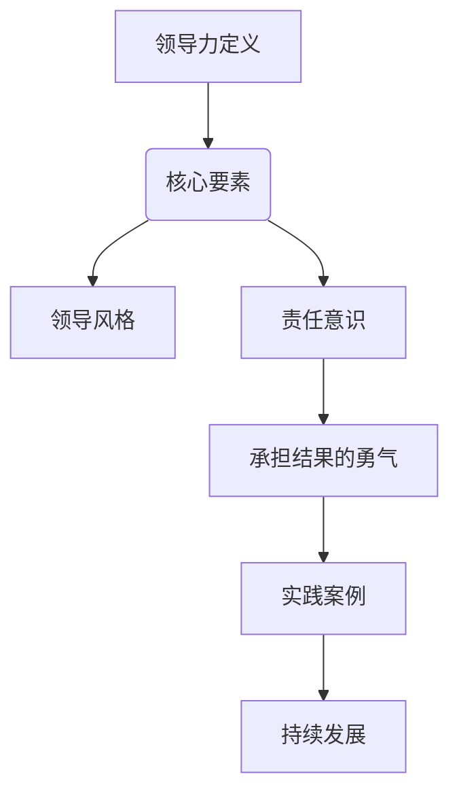

                 

# 领导力与责任：承担结果的勇气

## 关键词

- **领导力**
- **责任意识**
- **承担结果**
- **勇气**
- **组织文化**
- **个人成长**
- **技术进步**

## 摘要

在信息技术迅速发展的今天，领导力与责任意识成为企业成功和个体成长的关键要素。本文从领导力的定义、核心要素、领导风格、责任意识的重要性、培养责任意识的方法、承担结果的勇气等方面进行了详细探讨。通过分析实际案例，总结了领导力与责任的实践策略，并展望了未来发展趋势。文章旨在为IT领域从业者提供理论指导，助力其在职场中更好地发挥领导力与责任意识，实现个人与组织的持续发展。

### 目录

#### 第一部分：领导力基础

- **第1章：领导力定义与核心要素**
  - 1.1 领导力概述
  - 1.1.1 领导力的定义
  - 1.1.2 领导力的重要性
  - 1.1.3 领导力的核心要素
  - 1.2 领导风格与影响
  - 1.2.1 领导风格的分类
  - 1.2.2 领导风格对团队成员的影响
  - 1.2.3 选择合适的领导风格
  - 1.3 领导力的心理基础
  - 1.3.1 自我认知与领导力发展
  - 1.3.2 情绪智力与领导力
  - 1.3.3 团队合作与领导力

- **第2章：责任意识的重要性**
  - 2.1 责任的定义与内涵
  - 2.1.1 责任的概念
  - 2.1.2 责任的重要性
  - 2.1.3 责任与权力的关系
  - 2.2 责任意识的培养
  - 2.2.1 自我驱动与责任感培养
  - 2.2.2 责任感教育的重要性
  - 2.2.3 责任意识在工作中的体现
  - 2.3 责任意识与组织文化
  - 2.3.1 组织文化对责任意识的影响
  - 2.3.2 责任意识与团队合作
  - 2.3.3 责任意识与组织绩效

- **第3章：承担结果的勇气**
  - 3.1 勇气的本质与价值
  - 3.1.1 勇气的定义
  - 3.1.2 勇气的价值
  - 3.1.3 勇气的来源
  - 3.2 如何培养承担结果的勇气
  - 3.2.1 建立积极的思维模式
  - 3.2.2 提高决策能力
  - 3.2.3 增强自信心
  - 3.3 承担结果中的挑战与应对
  - 3.3.1 挑战与困难
  - 3.3.2 应对策略
  - 3.3.3 成功案例分享

- **第4章：领导力与责任的实践案例**
  - 4.1 案例分析
  - 4.1.1 案例介绍
  - 4.1.2 领导力在案例中的体现
  - 4.1.3 责任意识在案例中的体现
  - 4.2 实践建议
  - 4.2.1 领导力提升策略
  - 4.2.2 责任意识培养策略
  - 4.2.3 领导力与责任整合策略

- **第5章：领导力与责任的持续发展**
  - 5.1 持续发展的重要性
  - 5.1.1 持续发展的意义
  - 5.1.2 持续发展的挑战
  - 5.1.3 持续发展的策略
  - 5.2 领导力与责任的个人成长
  - 5.2.1 个人成长的重要性
  - 5.2.2 成长路径与方法
  - 5.2.3 持续学习的价值
  - 5.3 领导力与责任的未来趋势
  - 5.3.1 未来趋势概述
  - 5.3.2 技术进步对领导力的影响
  - 5.3.3 社会变革对责任意识的要求

- **附录**

  - **附录A：领导力与责任相关资源**
    - 1. 领导力书籍推荐
    - 2. 责任意识培养资源
    - 3. 领导力与责任研究机构

  - **附录B：领导力与责任的 Mermaid 流程图**

---

## 第一部分：领导力基础

### 第1章：领导力定义与核心要素

#### 1.1 领导力概述

领导力是指一个人在团队中引导、激励和协调其他成员的能力，是实现组织目标的关键。领导力不仅仅是一种管理技能，更是一种价值观和领导风格的综合体现。

**领导力的定义**

领导力是指通过影响力、领导能力和决策能力，带领团队实现目标的能力。领导力不仅关注个人能力的提升，更强调团队的整体表现。

**领导力的重要性**

领导力在组织中的重要性体现在以下几个方面：

1. **实现目标**：领导力能够帮助团队明确目标，并制定有效的策略实现目标。
2. **激励员工**：优秀的领导力能够激发员工的积极性和创造力，提高工作效率。
3. **促进沟通**：领导力能够促进团队成员之间的沟通，减少误解和冲突。
4. **培养人才**：领导力关注团队成员的成长，为组织培养和储备人才。

#### 1.2 领导力的核心要素

领导力的核心要素包括：

1. **影响力**：领导力是通过影响力来实现的，包括个人魅力、专业知识、沟通能力等。
2. **领导能力**：领导能力是指领导者在团队中发挥的作用，包括决策能力、组织能力、协调能力等。
3. **决策能力**：领导者需要具备快速做出正确决策的能力，以应对复杂多变的局面。
4. **组织能力**：领导者需要能够有效地组织团队资源，实现目标。
5. **沟通能力**：良好的沟通能力是领导者成功的关键，包括倾听、表达、协调等。

#### 1.3 领导风格与影响

领导风格是指领导者在与团队成员互动时所采用的方式和态度。不同的领导风格对团队成员的影响也不同。

**领导风格的分类**

1. **专制型领导**：领导者控制决策过程，团队成员参与度低。
2. **民主型领导**：领导者鼓励团队成员参与决策，提高团队凝聚力。
3. **放任型领导**：领导者对团队成员的决策和行动不加干预，团队成员有较高的自主权。

**领导风格对团队成员的影响**

1. **专制型领导**：可能导致团队成员缺乏主动性和创新精神，但能快速决策。
2. **民主型领导**：能激发团队成员的积极性和创造力，提高团队绩效。
3. **放任型领导**：有助于提高团队成员的自主性和创新能力，但可能缺乏团队协作精神。

#### 1.4 选择合适的领导风格

选择合适的领导风格取决于团队的情况和领导者的个性。在实际工作中，领导者需要根据不同的情境灵活调整领导风格，以达到最佳效果。

- **情境领导理论**：认为领导风格应该根据团队成员的能力和需求进行调整。
- **优势识别理论**：认为领导者应该发挥自己的优势，与团队成员形成互补。

#### 1.5 领导力的心理基础

领导力的心理基础包括自我认知、情绪智力、团队合作等方面。

**自我认知与领导力发展**

自我认知是指领导者对自己的了解和认识，包括自己的优点和不足。自我认知有助于领导者更好地发挥自己的优势，同时认识到自己的不足，不断学习和成长。

**情绪智力与领导力**

情绪智力是指领导者识别、理解和管理自己和他人的情绪的能力。高情绪智力领导者能更好地处理人际关系，提高团队凝聚力。

**团队合作与领导力**

团队合作是领导力的核心要素之一。领导者需要具备团队合作精神，能够有效地协调团队成员之间的关系，共同实现目标。

#### 1.6 小结

领导力是领导者实现组织目标的关键能力。了解领导力的定义、核心要素、领导风格、心理基础等内容，有助于领导者更好地发挥自己的作用，提升团队绩效。

---

## 第二部分：责任意识

### 第2章：责任意识的重要性

#### 2.1 责任的定义与内涵

责任是指一个人因特定身份或角色而承担的义务和任务。责任不仅是对自己行为的约束，也是对他人、团队和组织负责的体现。

**责任的概念**

责任是一个多层次的、多维度的概念。它包括以下几个方面：

1. **个人责任**：指个人对自己行为的约束和负责。
2. **团队责任**：指团队成员对团队整体目标的负责。
3. **组织责任**：指组织对成员、客户、社会等负责。

**责任的重要性**

责任在组织和个人成长中具有重要意义，具体体现在以下几个方面：

1. **确保目标实现**：责任能够确保组织和个人目标得到有效实现。
2. **促进团队合作**：责任能够促进团队成员之间的信任和合作，提高团队绩效。
3. **增强个人能力**：承担责任有助于个人成长，提高解决问题的能力。
4. **塑造组织文化**：责任意识是组织文化的基石，有助于形成积极向上的组织氛围。

#### 2.2 责任意识的培养

责任意识的培养是一个长期的过程，需要从多个方面进行努力。

**自我驱动与责任感培养**

自我驱动是指个人主动承担责任，而不是被动地接受任务。培养自我驱动力有助于提高责任感。

1. **明确责任**：明确个人和团队的责任，有助于提高责任意识。
2. **设定目标**：设定具体、明确的目标，有助于提高责任感。
3. **积极行动**：积极采取行动，实现目标，提高责任感。

**责任感教育的重要性**

责任感教育是培养责任意识的重要途径。通过教育，人们可以更好地理解责任的重要性，以及如何承担责任。

1. **家庭教育**：家庭教育对培养责任意识具有重要作用。
2. **学校教育**：学校教育通过课程设置、实践活动等方式，培养学生的责任意识。
3. **社会教育**：社会教育通过媒体、公益活动等方式，提高公众的责任意识。

**责任意识在工作中的体现**

在工作环境中，责任意识的体现包括：

1. **任务完成**：按时、高质量地完成任务，体现责任意识。
2. **团队合作**：积极参与团队工作，为团队目标负责。
3. **持续改进**：主动寻找问题，并提出改进措施，体现责任意识。

#### 2.3 责任意识与组织文化

组织文化对责任意识的培养具有深远影响。

**组织文化对责任意识的影响**

1. **支持性文化**：支持性的组织文化能够促进员工承担责任，提高工作积极性。
2. **挑战性文化**：挑战性的组织文化能够激发员工的责任感，提高创新能力。
3. **包容性文化**：包容性的组织文化能够营造和谐的工作氛围，提高团队合作精神。

**责任意识与团队合作**

责任意识是团队合作的基础。具有责任意识的团队成员能够更好地协调合作，共同实现目标。

1. **明确责任**：明确团队成员的责任，避免责任模糊。
2. **相互支持**：团队成员之间相互支持，共同承担责任。
3. **积极沟通**：积极沟通有助于解决问题，提高团队绩效。

**责任意识与组织绩效**

责任意识对组织绩效有显著影响。具有责任意识的员工能够提高工作效率，降低错误率，从而提高组织绩效。

1. **提高工作效率**：承担责任有助于提高工作效率，减少拖延。
2. **降低错误率**：承担责任有助于提高工作的准确性和质量，降低错误率。
3. **提升团队士气**：责任意识能够提升团队士气，增强团队凝聚力。

#### 2.4 小结

责任意识是组织和个人成长的关键。通过培养责任意识，可以提高工作效率，促进团队合作，提升组织绩效。组织和个人都应重视责任意识的培养，将其融入日常工作和生活中。

---

## 第三部分：承担结果的勇气

### 第3章：承担结果的勇气

#### 3.1 勇气的本质与价值

勇气是指面对困难和挑战时，敢于承担责任和面对结果的心理素质。勇气不仅仅是一种心理状态，更是一种行为表现。

**勇气的定义**

勇气是指在面对困难和挑战时，不畏惧、不退缩，敢于承担责任和面对结果的品质。勇气包括以下几个方面：

1. **敢于承担责任**：面对任务和挑战，敢于承担结果，不逃避责任。
2. **面对困难**：勇敢地面对困难和挑战，不畏惧失败和挫折。
3. **敢于决策**：在复杂多变的环境中，敢于做出决策，承担责任。

**勇气的价值**

勇气在个人和组织发展中具有重要意义：

1. **促进成长**：勇气能够促进个人成长，提高自信心和决策能力。
2. **提高绩效**：勇气能够提高工作效率，降低错误率，从而提高组织绩效。
3. **塑造文化**：勇气是组织文化的重要组成部分，有助于形成积极向上的组织氛围。

#### 3.2 如何培养承担结果的勇气

培养承担结果的勇气需要从多个方面进行努力：

**建立积极的思维模式**

积极的思维模式有助于培养勇气。领导者应：

1. **鼓励正面思考**：鼓励团队成员积极面对困难和挑战，树立信心。
2. **设立目标**：设定具体、可实现的目标，有助于增强团队勇气。
3. **强调成功**：强调成功案例，激励团队成员勇于面对挑战。

**提高决策能力**

决策能力是勇气的重要体现。领导者应：

1. **培养判断力**：提高判断力，能够做出更明智的决策。
2. **积累经验**：通过实践经验，提高决策能力和勇气。
3. **勇于承担责任**：在决策过程中，勇于承担责任，不畏惧失败。

**增强自信心**

自信心是勇气的基础。领导者应：

1. **培养自信**：通过积极的自我暗示和行动，培养自信心。
2. **建立支持体系**：建立支持体系，帮助团队成员增强自信心。
3. **提供培训**：提供相关培训和资源，提高团队成员的技能和知识。

#### 3.3 承担结果中的挑战与应对

在承担结果的过程中，领导者会面临各种挑战。以下是一些常见的挑战和应对策略：

**挑战与困难**

1. **失败的风险**：决策失败可能带来负面影响，影响团队信心。
2. **责任的承担**：承担责任可能需要付出时间和精力，影响个人生活。
3. **压力和压力**：面对挑战和困难，领导者可能面临巨大的压力。

**应对策略**

1. **风险评估**：在决策前，进行充分的风险评估，制定应对策略。
2. **团队合作**：借助团队力量，共同应对挑战，降低个人压力。
3. **积极沟通**：与团队成员保持积极沟通，共同解决问题。
4. **学习与改进**：从失败中学习，不断改进决策过程，提高勇气。

#### 3.4 成功案例分享

以下是一个成功案例，展示了如何通过勇气和责任意识实现目标：

**案例介绍**

某IT公司在市场竞争中面临巨大压力，领导团队决定推出一款创新产品。在项目开发过程中，团队面临各种挑战，如技术难题、时间压力等。然而，团队领导者凭借勇气和责任意识，带领团队克服了困难，最终成功推出产品，赢得了市场认可。

**领导力在案例中的体现**

1. **明确目标**：团队领导者明确了产品目标，并制定了详细的开发计划。
2. **鼓励创新**：领导者鼓励团队成员提出创新想法，激发团队创造力。
3. **积极沟通**：领导者与团队成员保持积极沟通，及时解决问题。
4. **承担责任**：领导者勇于承担责任，面对困难和挑战，坚定信心。

**责任意识在案例中的体现**

1. **任务分配**：团队成员明确自己的责任，确保任务顺利完成。
2. **相互支持**：团队成员相互支持，共同应对挑战。
3. **持续改进**：团队在项目开发过程中不断学习，改进流程，提高效率。

#### 3.5 小结

承担结果的勇气是领导者必备的品质。通过建立积极的思维模式、提高决策能力和增强自信心，领导者可以培养承担结果的勇气。面对挑战和困难，领导者应积极应对，通过团队合作和学习与改进，实现目标。

---

## 第四部分：领导力与责任的实践

### 第4章：领导力与责任的实践案例

#### 4.1 案例分析

**案例介绍**

某互联网公司计划推出一款社交应用程序，以挑战现有的市场领导者。为了实现这一目标，公司决定成立一个跨部门团队，由一位经验丰富的项目经理领导。该项目经理不仅需要具备出色的领导力，还需要有强烈的责任意识，以确保项目的成功。

**领导力在案例中的体现**

1. **明确目标**：项目经理在项目启动时明确了产品目标，并与团队成员进行了充分的沟通，确保大家理解并认同项目目标。
2. **激励团队**：项目经理通过设置激励机制，鼓励团队成员积极投入工作，提高工作效率。
3. **建立信任**：项目经理通过开放透明的沟通方式，建立了团队成员之间的信任，促进了团队合作。
4. **决策能力**：在项目开发过程中，项目经理面临各种挑战，但他能够迅速做出决策，并承担结果。

**责任意识在案例中的体现**

1. **任务分配**：项目经理明确了团队成员的责任，确保每个人都能清晰了解自己的任务和目标。
2. **跟进与监督**：项目经理定期跟进项目进度，确保任务按时完成，并对出现的问题及时进行解决。
3. **承担责任**：在项目遇到困难时，项目经理勇于承担责任，并带领团队共同解决问题。
4. **持续改进**：项目经理在项目结束后，组织团队进行总结，找出项目中的不足，并制定改进措施。

#### 4.2 实践建议

**领导力提升策略**

1. **培训与学习**：为领导团队提供培训和学习机会，提高领导能力。
2. **角色扮演**：通过角色扮演游戏，帮助领导者了解不同领导风格对团队的影响，选择合适的领导方式。
3. **团队建设**：定期组织团队建设活动，增强团队凝聚力，提高团队协作能力。

**责任意识培养策略**

1. **责任感教育**：通过培训和教育，提高员工的责任意识。
2. **明确责任**：制定明确的责任分配制度，确保每个人都知道自己的职责。
3. **激励机制**：建立激励机制，鼓励员工承担责任，提高工作效率。

**领导力与责任整合策略**

1. **文化建设**：打造积极向上的企业文化，强调领导力和责任意识的重要性。
2. **沟通与反馈**：建立有效的沟通机制，确保团队成员能够及时了解项目进展，并反馈问题。
3. **持续改进**：定期评估领导力和责任意识的实践效果，并制定改进措施。

#### 4.3 小结

通过实际案例，我们可以看到领导力与责任意识在项目成功中的重要作用。领导者需要不断提升自己的领导能力，培养责任意识，并通过有效的实践策略，实现个人与组织的共同发展。

---

## 第五部分：领导力与责任的持续发展

### 第5章：领导力与责任的持续发展

#### 5.1 持续发展的重要性

在快速变化的商业环境中，领导力与责任的持续发展显得尤为重要。持续发展不仅关系到组织的长期成功，也影响着领导者和团队成员的个人成长。

**持续发展的意义**

1. **适应变化**：持续发展有助于组织适应不断变化的外部环境，保持竞争力。
2. **提高效率**：持续发展通过不断学习和改进，提高组织的运作效率。
3. **增强凝聚力**：持续发展有助于增强团队的凝聚力，提高团队成员的归属感和满意度。

**持续发展的挑战**

1. **技术变革**：技术的快速发展对领导力和责任意识提出了新的要求。
2. **人才培养**：培养具备领导力和责任意识的优秀人才是持续发展的关键。
3. **文化传承**：在持续发展的过程中，如何保持组织文化的活力和传承是重要挑战。

**持续发展的策略**

1. **持续学习**：建立学习型组织，鼓励员工不断学习新知识和技能。
2. **激励机制**：建立有效的激励机制，鼓励员工持续发展。
3. **文化塑造**：打造积极向上的组织文化，鼓励领导力和责任意识的实践。

#### 5.2 领导力与责任的个人成长

个人成长是领导力与责任持续发展的基础。以下是一些个人成长的重要方面：

**个人成长的重要性**

1. **自我认知**：了解自己的优点和不足，是个人成长的关键。
2. **持续学习**：学习新知识和技能，不断提升自己的能力和素质。
3. **实践反思**：通过实践反思，不断总结经验教训，提高领导力和责任意识。

**成长路径与方法**

1. **规划职业生涯**：制定明确的职业规划，有针对性地提升自身能力。
2. **参加培训**：参加相关培训课程，学习领导力和责任意识的先进理念。
3. **阅读书籍**：阅读相关书籍，拓展知识面，提升思维深度。

**持续学习的价值**

1. **适应变化**：持续学习有助于适应快速变化的商业环境。
2. **提高竞争力**：持续学习能够提高个人的市场竞争力。
3. **实现价值**：持续学习能够帮助个人实现更高的职业价值。

#### 5.3 领导力与责任的未来趋势

随着技术的不断进步和社会的变革，领导力与责任意识也在不断演变。

**未来趋势概述**

1. **数字化转型**：数字化转型对领导力和责任意识提出了新的要求。
2. **人工智能**：人工智能的发展将改变领导方式，提高决策效率。
3. **可持续发展**：可持续发展成为全球关注焦点，对领导力和责任意识提出了更高的要求。

**技术进步对领导力的影响**

1. **信息透明度**：技术进步提高了信息透明度，领导者需要更加开放和透明。
2. **决策速度**：技术进步提高了决策速度，领导者需要具备快速决策能力。
3. **协作效率**：技术进步提高了协作效率，领导者需要更好地协调团队。

**社会变革对责任意识的要求**

1. **社会责任**：社会变革要求领导者具备更强的社会责任感。
2. **可持续发展**：可持续发展要求领导者关注环境保护和社会责任。
3. **道德规范**：社会变革要求领导者遵守更高的道德规范，确保组织的诚信和合法性。

#### 5.4 小结

领导力与责任的持续发展是组织和个人成长的关键。通过持续学习、实践反思和适应变化，领导者可以不断提升自己的能力，实现组织的长期成功。面对未来的挑战，领导者需要具备前瞻性的眼光和适应能力，引领组织走向未来。

---

### 附录

#### 附录A：领导力与责任相关资源

**1. 领导力书籍推荐**

- **《领导力》（作者：约翰·肯尼迪·格雷厄姆）**
  - 内容简介：本书系统地阐述了领导力的本质、要素和培养方法，是领导力领域的经典之作。
- **《领导者的语言》（作者：马克斯·贝克曼）**
  - 内容简介：本书通过案例分析，探讨了领导者如何通过语言影响团队成员，提升领导力。

**2. 责任意识培养资源**

- **《责任者：如何塑造个人的责任感》（作者：大卫·布鲁克斯）**
  - 内容简介：本书通过丰富的案例，探讨了如何培养个人的责任感，提高工作和生活的质量。
- **《责任管理》（作者：彼得·德鲁克）**
  - 内容简介：本书系统地阐述了责任管理的重要性、方法和实践，是企业管理者的必备读物。

**3. 领导力与责任研究机构**

- **哈佛大学商学院领导力研究中心**
  - 研究领域：领导力理论、领导力培养、领导力实践等。
- **麦肯锡领导力研究中心**
  - 研究领域：领导力与组织绩效、领导力变革等。

#### 附录B：领导力与责任的 Mermaid 流程图

---

### 作者信息

**作者：AI天才研究院/AI Genius Institute & 禅与计算机程序设计艺术 /Zen And The Art of Computer Programming**

