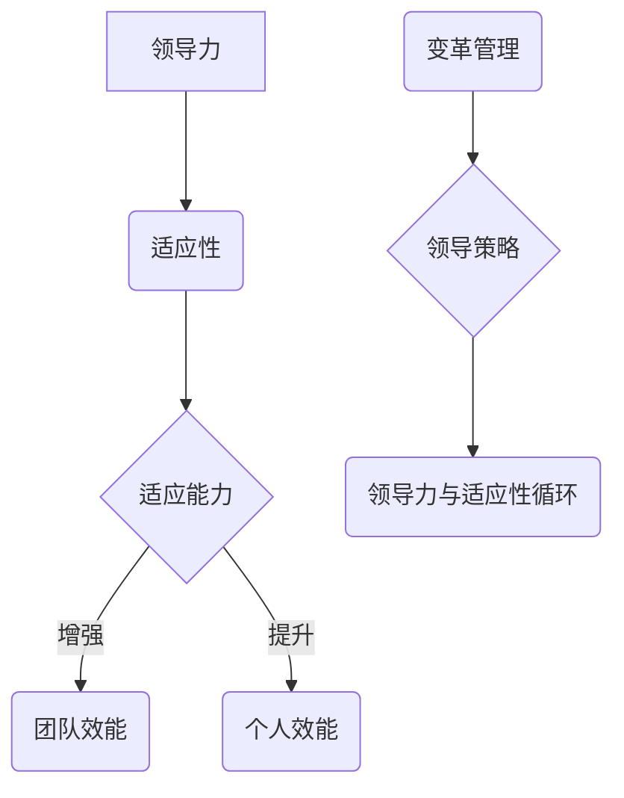

                 

## 文章标题：领导力与适应性：在变革中保持方向感

关键词：领导力、适应性、变革管理、团队效能、个人效能、领导策略

摘要：本文旨在探讨领导力与适应性的关系，如何在快速变化的技术环境中保持方向感。通过分析领导力理论基础、适应性策略与实践，结合成功案例，提出一套优化领导力与适应性的策略，以帮助团队和个人在变革中保持竞争力。

---

### 目录大纲：《领导力与适应性：在变革中保持方向感》

#### 第一部分：领导力理论基础

**第1章：领导力概述与重要性**  
1.1. 领导力的定义与内涵  
1.2. 领导力的作用与影响  
1.3. 领导力的五个维度

**第2章：领导风格与影响力**  
2.1. 领导风格理论  
2.2. 领导者的个人影响力  
2.3. 建立领导影响力策略

**第3章：领导力与变革管理**  
3.1. 变革的类型与原因  
3.2. 变革的阻力和应对策略  
3.3. 领导者在变革中的角色与责任

#### 第二部分：适应性策略与实践

**第4章：培养团队适应性**  
4.1. 适应性团队的特征  
4.2. 培养团队适应性的方法  
4.3. 适应性团队的建设与实践

**第5章：个人适应性提升**  
5.1. 适应性心理模型  
5.2. 个人适应性提升策略  
5.3. 适应性思维与行为习惯的养成

**第6章：应对变革的领导策略**  
6.1. 变革前的准备  
6.2. 变革过程中的领导  
6.3. 变革后的持续领导

#### 第三部分：案例分析与策略优化

**第7章：领导力与适应性的成功案例**  
7.1. 企业变革案例解析  
7.2. 团队适应性实践案例  
7.3. 个人适应性提升案例

**第8章：领导力与适应性的策略优化**  
8.1. 适应性领导力的评估与改进  
8.2. 领导策略的优化方向  
8.3. 实现领导力与适应性的平衡

#### 附录

**附录A：领导力与适应性的相关工具与资源**  
A.1. 领导力评估工具  
A.2. 适应性测量工具  
A.3. 领导力与适应性研究论文与书籍推荐

### 领导力与适应性的关系

**图1：领导力与适应性的关系**



### 核心算法原理讲解

#### 适应性提升算法

**适应性提升算法伪代码：**

```latex
\text{适应性提升算法伪代码：}
\begin{algorithm}
\caption{适应性提升算法}
\begin{algorithmic}[1]
\State 初始化个人适应度值
\State 初始化团队适应度值
\While{适应性未达到目标}
    \State 更新个人适应度值
    \State 更新团队适应度值
    \State 调整领导策略
\EndWhile
\State 输出个人适应度值和团队适应度值
\end{algorithmic}
\end{algorithm}
```

#### 数学模型与公式

**适应性公式：**

$$
适应性 = f(个人能力, 团队支持, 变革环境)
$$

其中：
- 个人能力：个人的技能、知识和经验
- 团队支持：团队提供的信息、资源和支持
- 变革环境：外部环境的变化程度和变化速度

---

在接下来的章节中，我们将逐步深入探讨领导力的理论基础、适应性策略与实践，结合具体案例，为大家提供一套实用且有效的领导力与适应性优化策略。让我们一起在变革中保持方向感，引领团队走向成功。<!-- —————————————————————————————————————————————————————————————————————————————————————————————————————— -->### 第一部分：领导力理论基础

领导力，作为推动团队和组织实现目标的核心力量，其重要性不言而喻。在技术迅猛发展的今天，变革已成为常态，领导者在其中扮演的角色愈发关键。本部分将详细阐述领导力的定义、作用、维度，以及领导风格与影响力，为后续内容的探讨打下坚实基础。

#### 第1章：领导力概述与重要性

##### 1.1. 领导力的定义与内涵

领导力（Leadership）是一种引导、激励和影响他人共同实现目标的能力。它不仅仅是指挥和控制，更是一种激发团队成员内在动力和潜能的过程。领导力具有以下内涵：

1. **方向性**：领导力为团队和组织提供了明确的目标和方向，使团队成员齐心协力，朝着共同的目标努力。
2. **激励性**：领导力能够激发团队成员的热情和动力，使其在面临困难和挑战时依然保持积极向上的态度。
3. **协调性**：领导力在团队内部发挥着协调和整合的作用，使各个成员的能力和资源得到最大化利用。
4. **创新性**：领导力鼓励团队成员勇于创新，不断探索新的解决方案，以适应快速变化的环境。

##### 1.2. 领导力的作用与影响

领导力在组织中的重要作用体现在以下几个方面：

1. **推动组织发展**：领导者通过设定愿景和目标，激发团队成员的潜力，推动组织不断向前发展。
2. **提升团队效能**：领导力能够有效提升团队的整体效能，使团队成员在工作中相互支持、协作，实现更高的产出。
3. **促进员工成长**：领导力关注员工的成长和发展，通过提供培训、指导和支持，帮助员工不断提升个人能力和职业素养。
4. **增强组织凝聚力**：领导力能够增强团队成员之间的信任和合作，形成强大的团队凝聚力，使组织更具竞争力。

##### 1.3. 领导力的五个维度

领导力是一个多维度的概念，可以从多个角度进行理解和分析。以下是常见的五个领导力维度：

1. **理念维度**：领导者需要具备清晰的理念，包括价值观、使命和愿景等，这些理念为团队和组织提供了方向和动力。
2. **技术维度**：领导者需要具备相关的技术知识和技能，以便更好地理解和指导团队的工作。
3. **人际维度**：领导者需要具备良好的人际交往能力，能够与团队成员建立信任和合作关系。
4. **情境维度**：领导者需要具备适应不同情境和环境的能力，灵活调整领导策略，以应对各种挑战。
5. **变革维度**：领导者需要具备推动变革和创新的能力，引领团队和组织在变革中持续成长。

#### 第2章：领导风格与影响力

##### 2.1. 领导风格理论

领导风格理论是研究领导力的重要组成部分。不同的领导风格会对团队和组织产生不同的影响。常见的领导风格包括：

1. **专制型领导**：领导者独断专行，决策权高度集中。这种领导风格在紧急情况下或对团队成员能力不信任时可能有效，但长期来看容易导致团队士气低落和创新能力下降。
2. **民主型领导**：领导者鼓励团队成员参与决策过程，重视团队成员的意见和建议。这种领导风格有助于提升团队凝聚力和创新力，但决策过程可能较为缓慢。
3. **参与型领导**：领导者将团队成员视为合作伙伴，共同参与决策和目标设定。这种领导风格能够激发团队成员的主动性和创造力，但需要领导者具备较强的沟通和协调能力。

##### 2.2. 领导者的个人影响力

领导者的个人影响力是领导力的重要组成部分。以下因素会影响领导者的个人影响力：

1. **信任**：领导者需要赢得团队成员的信任，使其愿意跟随领导者并为其付出努力。
2. **能力**：领导者需要具备较强的专业能力和决策能力，使团队成员对其产生敬佩和信任。
3. **魅力**：领导者需要具备一定的个人魅力，能够激发团队成员的热情和动力。
4. **信誉**：领导者需要保持良好的职业道德和信誉，以树立良好的形象。

##### 2.3. 建立领导影响力策略

要建立有效的领导影响力，领导者可以采取以下策略：

1. **树立榜样**：领导者需要通过自己的言行树立榜样，成为团队成员学习的对象。
2. **积极沟通**：领导者需要与团队成员保持积极沟通，了解他们的需求和意见，并及时反馈和回应。
3. **提供支持**：领导者需要为团队成员提供必要的支持和资源，帮助他们克服困难和挑战。
4. **培养团队精神**：领导者需要培养团队成员之间的信任和合作，形成强大的团队凝聚力。
5. **激励创新**：领导者需要鼓励团队成员勇于创新，提供创新的机会和平台。

#### 第3章：领导力与变革管理

##### 3.1. 变革的类型与原因

变革是组织发展的必然过程，其类型和原因多种多样。常见的变革类型包括：

1. **技术变革**：随着技术的快速发展，组织需要不断引入新技术和工具，以提升效率和竞争力。
2. **战略变革**：组织在发展过程中可能需要调整战略方向和目标，以适应市场和环境的变化。
3. **文化变革**：组织文化是组织发展的基石，随着组织的发展和变化，可能需要对文化进行改革和调整。

变革的原因主要包括：

1. **外部压力**：市场环境的变化、竞争压力等外部因素迫使组织进行变革。
2. **内部需求**：组织内部存在的问题和挑战，如管理不善、效率低下等，需要通过变革来解决。
3. **发展机遇**：新的技术、市场和政策等外部机遇促使组织进行变革，以抓住发展机遇。

##### 3.2. 变革的阻力和应对策略

变革过程中常常会遇到各种阻力和挑战，以下是一些常见的阻力及其应对策略：

1. **抵触情绪**：部分团队成员可能对变革持有抵触情绪，认为变革会威胁到自己的利益和地位。应对策略包括加强沟通、提供培训和激励措施，以缓解团队成员的担忧。
2. **缺乏共识**：团队成员对变革的目标、方案和实施步骤缺乏共识，导致变革难以推进。应对策略包括组织讨论、征求意见、达成共识，以统一团队成员的思想和行动。
3. **资源不足**：变革需要投入大量的人力、物力和财力，而组织可能面临资源不足的困境。应对策略包括优化资源分配、寻求外部支持、分阶段实施变革。

##### 3.3. 领导者在变革中的角色与责任

领导者在变革中扮演着关键角色，其责任包括：

1. **制定变革计划**：领导者需要根据组织的需求和目标，制定详细的变革计划，明确变革的目标、方案和实施步骤。
2. **动员团队成员**：领导者需要积极动员团队成员，使其了解变革的必要性和重要性，并积极参与到变革过程中。
3. **提供支持与指导**：领导者需要为团队成员提供必要的支持和指导，帮助他们克服变革过程中的困难和挑战。
4. **监督与评估**：领导者需要监督变革的实施过程，及时发现问题并进行调整，确保变革达到预期目标。

综上所述，领导力是推动组织发展的重要力量，领导者需要具备清晰的理念、良好的沟通能力、强大的影响力，并能够有效应对变革中的各种挑战。在下一部分中，我们将探讨适应性策略与实践，帮助团队和个人在变革中保持方向感。<!-- —————————————————————————————————————————————————————————————————————————————————————————————————————— -->### 第1章：领导力概述与重要性

领导力作为一种关键能力，对个人和组织的发展具有深远的影响。在这一章中，我们将首先深入探讨领导力的定义与内涵，然后阐述领导力在团队和组织中的作用与影响，最后介绍领导力的五个维度。

#### 1.1. 领导力的定义与内涵

领导力（Leadership）是一种能力，它涉及引导、激励和影响他人，以实现共同的目标。领导力不仅仅是一种技术，更是一种艺术。以下是领导力的几个关键内涵：

1. **方向性**：领导力为团队和组织提供了明确的目标和方向，使团队成员能够齐心协力，朝着共同的目标努力。
2. **激励性**：领导力能够激发团队成员的内在动力，使其在面临困难和挑战时依然保持积极向上的态度。
3. **协调性**：领导力在团队内部发挥着协调和整合的作用，使各个成员的能力和资源得到最大化利用。
4. **创新性**：领导力鼓励团队成员勇于创新，不断探索新的解决方案，以适应快速变化的环境。
5. **道德性**：领导力强调道德和价值观，使团队成员在追求个人利益的同时，也关注组织和社会的利益。

#### 1.2. 领导力的作用与影响

领导力在团队和组织中的作用和影响是多方面的，具体表现在以下几个方面：

1. **推动组织发展**：领导者通过设定愿景和目标，激发团队成员的潜力，推动组织不断向前发展。
2. **提升团队效能**：领导力能够有效提升团队的整体效能，使团队成员在工作中相互支持、协作，实现更高的产出。
3. **促进员工成长**：领导力关注员工的成长和发展，通过提供培训、指导和支持，帮助员工不断提升个人能力和职业素养。
4. **增强组织凝聚力**：领导力能够增强团队成员之间的信任和合作，形成强大的团队凝聚力，使组织更具竞争力。

#### 1.3. 领导力的五个维度

领导力是一个多维度的概念，可以从多个角度进行理解和分析。以下是常见的五个领导力维度：

1. **理念维度**：领导者需要具备清晰的理念，包括价值观、使命和愿景等，这些理念为团队和组织提供了方向和动力。
2. **技术维度**：领导者需要具备相关的技术知识和技能，以便更好地理解和指导团队的工作。
3. **人际维度**：领导者需要具备良好的人际交往能力，能够与团队成员建立信任和合作关系。
4. **情境维度**：领导者需要具备适应不同情境和环境的能力，灵活调整领导策略，以应对各种挑战。
5. **变革维度**：领导者需要具备推动变革和创新的能力，引领团队和组织在变革中持续成长。

#### 1.3.1. 理念维度

理念维度是领导力的核心，它决定了领导者的价值观和信念。一个成功的领导者需要具备以下理念：

1. **价值观**：领导者需要明确自己的价值观，并将其融入到团队和组织的文化中，以引导团队成员的行为。
2. **使命**：领导者需要设定明确的使命，使团队和组织有一个清晰的目标和方向。
3. **愿景**：领导者需要具备远见，为团队和组织设定一个长远的愿景，激励团队成员为之奋斗。

#### 1.3.2. 技术维度

技术维度是指领导者需要具备相关的技术知识和技能，以便更好地理解和指导团队的工作。这包括：

1. **专业知识**：领导者需要具备与团队工作相关的专业知识和技能。
2. **技术洞察力**：领导者需要具备前瞻性，能够洞察技术趋势，为团队和组织的发展提供指导。
3. **创新能力**：领导者需要鼓励团队成员勇于创新，推动组织的技术进步。

#### 1.3.3. 人际维度

人际维度是领导力的关键，它决定了领导者是否能够与团队成员建立信任和合作关系。以下是一些关键要素：

1. **沟通能力**：领导者需要具备良好的沟通能力，能够清晰、有效地传达信息和指令。
2. **团队协作**：领导者需要鼓励团队成员之间的协作，形成紧密的团队关系。
3. **激励与认可**：领导者需要能够激励团队成员，认可他们的贡献，增强团队的凝聚力。

#### 1.3.4. 情境维度

情境维度是指领导者需要具备适应不同情境和环境的能力。这包括：

1. **情境意识**：领导者需要具备情境意识，能够根据不同的环境和情境调整自己的领导风格和策略。
2. **灵活性**：领导者需要具备灵活性，能够迅速适应变化，并引导团队适应新的环境。
3. **危机管理**：领导者需要具备危机管理能力，能够在面临突发情况时保持冷静，并采取有效的措施解决问题。

#### 1.3.5. 变革维度

变革维度是指领导者需要具备推动变革和创新的能力，引领团队和组织在变革中持续成长。这包括：

1. **变革意识**：领导者需要具备变革意识，认识到变革是组织发展的必然过程。
2. **推动力**：领导者需要具备推动力，能够带领团队克服变革中的阻力和挑战。
3. **创新能力**：领导者需要鼓励团队成员勇于创新，推动组织的技术和业务创新。

#### 1.4. 领导力的实践

领导力不仅是一种理论，更是一种实践。以下是领导力的几个实践要点：

1. **建立信任**：领导者需要建立与团队成员的信任关系，这是领导力的基础。
2. **明确目标**：领导者需要明确团队和组织的目标，并确保团队成员理解并认同这些目标。
3. **激励团队**：领导者需要通过激励措施，激发团队成员的积极性和创造力。
4. **持续学习**：领导者需要持续学习，不断提升自己的领导能力和专业素养。

通过以上对领导力定义、作用、维度和实践的探讨，我们可以看到领导力在个人和组织发展中的重要性。在接下来的章节中，我们将继续探讨领导风格与影响力，以及领导力与变革管理，帮助领导者更好地应对快速变化的环境，保持组织的竞争力。<!-- —————————————————————————————————————————————————————————————————————————————————————————————————————— -->### 第2章：领导风格与影响力

领导风格是领导者在工作中的行为方式，它直接影响团队的工作效率和成员的满意度。不同的领导风格会对团队产生不同的影响，因此，了解并选择合适的领导风格对领导者来说至关重要。在本章中，我们将探讨几种常见的领导风格理论，分析领导者的个人影响力，并讨论如何建立有效的领导影响力策略。

#### 2.1. 领导风格理论

领导风格理论是研究领导行为的重要领域，它试图解释不同的领导行为如何影响团队和组织的表现。以下是几种常见的领导风格理论：

1. **布莱克和莫顿的管理方格理论**：
   - **方格图**：布莱克和莫顿提出了一个管理方格图，用于描述领导者在关心生产（任务导向）和关心人（关系导向）两个维度上的行为。
   - **五种领导风格**：
     - **1型（乡村俱乐部管理风格）**：高度重视人际关系，但忽视生产目标。
     - **9型（任务管理风格）**：高度重视生产目标，但忽视人际关系。
     - **5型（中庸管理风格）**：在关心人和关心生产之间保持平衡。
     - **1型（团队管理风格）**：同时高度重视人际关系和生产目标，强调团队协作。
     - **9型（协作管理风格）**：在关心人和关心生产之间达到最高平衡，注重团队的整体表现。

2. **赫塞和布兰查德的生命周期理论**：
   - **生命周期阶段**：赫塞和布兰查德提出，领导者的行为应随着团队成员的发展阶段而变化。
   - **四种领导风格**：
     - **指示型领导风格**：领导者为团队成员提供明确的指导和监督，适用于团队成员处于不成熟阶段。
     - **推销型领导风格**：领导者不仅提供指导，还通过说服和激励来影响团队成员，适用于团队成员处于初步成熟阶段。
     - **参与型领导风格**：领导者鼓励团队成员参与决策过程，适用于团队成员处于较成熟阶段。
     - **授权型领导风格**：领导者赋予团队成员自主权，适用于团队成员高度成熟阶段。

3. **弗罗姆和耶顿的决策参与理论**：
   - **参与决策的重要性**：弗罗姆和耶顿认为，参与决策对团队成员的满意度和绩效有积极影响。
   - **四种领导风格**：
     - **独断型领导风格**：领导者独自做出决策，不征求团队成员的意见。
     - **咨询型领导风格**：领导者征求团队成员的意见，但最终决策权仍在领导者手中。
     - **协商型领导风格**：领导者与团队成员一起讨论决策方案，并共同做出决策。
     - **共识型领导风格**：领导者鼓励团队成员共同参与决策过程，形成共识。

#### 2.2. 领导者的个人影响力

领导者的个人影响力是指领导者通过自身的行为、态度和价值观对团队成员产生影响的能力。以下是影响领导者个人影响力的几个关键因素：

1. **信任**：信任是领导者影响力的基础。领导者需要通过言行一致、正直和透明来赢得团队成员的信任。

2. **能力**：领导者需要具备强大的专业能力和决策能力，使团队成员对其产生敬佩和信任。

3. **魅力**：领导者需要具备一定的个人魅力，能够激发团队成员的热情和动力。

4. **信誉**：领导者的信誉对其个人影响力至关重要。领导者需要保持良好的职业道德和信誉，以树立良好的形象。

5. **关系**：领导者需要与团队成员建立良好的关系，通过沟通和支持来增强个人影响力。

#### 2.3. 建立领导影响力策略

要建立有效的领导影响力，领导者可以采取以下策略：

1. **树立榜样**：领导者需要通过自己的言行树立榜样，成为团队成员学习的对象。

2. **积极沟通**：领导者需要与团队成员保持积极沟通，了解他们的需求和意见，并及时反馈和回应。

3. **提供支持**：领导者需要为团队成员提供必要的支持和资源，帮助他们克服困难和挑战。

4. **培养团队精神**：领导者需要培养团队成员之间的信任和合作，形成强大的团队凝聚力。

5. **激励创新**：领导者需要鼓励团队成员勇于创新，提供创新的机会和平台。

6. **持续学习**：领导者需要持续学习，不断提升自己的领导能力和专业素养。

#### 2.4. 领导风格的实践

在实际工作中，领导者需要根据团队和环境的特点选择合适的领导风格。以下是几个实践要点：

1. **观察和适应**：领导者需要观察团队成员的特点和环境的变化，灵活调整领导风格。

2. **平衡关注**：领导者需要在关注生产目标和关心人际关系之间找到平衡，以提升团队的整体效能。

3. **培养下属**：领导者需要培养团队成员的独立性和自主性，使其在领导者的指导下能够独立工作。

4. **反馈和调整**：领导者需要通过定期的反馈和评估，及时调整领导策略，以适应团队和环境的需要。

通过以上对领导风格理论的探讨和个人影响力的分析，我们可以看到领导风格对团队和组织的影响至关重要。在下一章中，我们将深入探讨领导力与变革管理，帮助领导者更好地应对快速变化的环境，保持组织的竞争力。<!-- —————————————————————————————————————————————————————————————————————————————————————————————————————— -->### 第3章：领导力与变革管理

在快速变化的技术环境中，变革管理成为组织成功的关键因素。领导者必须在变革中扮演核心角色，通过有效的领导力来推动组织转型。本章将讨论变革的类型与原因，变革的阻力和应对策略，以及领导者在变革中的角色与责任。

#### 3.1. 变革的类型与原因

变革可以分为以下几种类型：

1. **技术变革**：随着技术的快速发展，组织需要不断引入新技术和工具，以提升效率和竞争力。技术变革可能涉及自动化、数字化、云计算等。

2. **战略变革**：组织在发展过程中可能需要调整战略方向和目标，以适应市场和环境的变化。战略变革可能包括业务模式调整、市场扩展等。

3. **文化变革**：组织文化是组织发展的基石，随着组织的发展和变化，可能需要对文化进行改革和调整。文化变革可能涉及价值观的更新、组织行为的改变等。

变革的原因主要包括：

1. **外部压力**：市场环境的变化、竞争压力等外部因素迫使组织进行变革。

2. **内部需求**：组织内部存在的问题和挑战，如管理不善、效率低下等，需要通过变革来解决。

3. **发展机遇**：新的技术、市场和政策等外部机遇促使组织进行变革，以抓住发展机遇。

#### 3.2. 变革的阻力和应对策略

在变革过程中，领导者常常会面临各种阻力和挑战。以下是一些常见的变革阻力和相应的应对策略：

1. **抵触情绪**：部分团队成员可能对变革持有抵触情绪，认为变革会威胁到自己的利益和地位。应对策略包括：
   - 加强沟通：领导者需要与团队成员进行充分的沟通，解释变革的必要性和重要性。
   - 提供培训：为团队成员提供变革相关的培训，帮助他们适应新的变化。
   - 激励与认可：领导者需要通过激励和认可，鼓励团队成员积极参与变革。

2. **缺乏共识**：团队成员对变革的目标、方案和实施步骤缺乏共识，导致变革难以推进。应对策略包括：
   - 组织讨论：领导者可以组织团队成员进行讨论，收集不同意见和建议，形成共识。
   - 沟通与反馈：领导者需要及时与团队成员沟通，了解他们的意见和反馈，并进行调整。
   - 指导与支持：领导者需要为团队成员提供指导和支持，帮助他们克服变革过程中的困难和挑战。

3. **资源不足**：变革需要投入大量的人力、物力和财力，而组织可能面临资源不足的困境。应对策略包括：
   - 优化资源分配：领导者需要优化资源分配，确保变革所需资源得到充分利用。
   - 寻求外部支持：领导者可以寻求外部支持，如合作伙伴、投资者等，以获取额外的资源。
   - 分阶段实施变革：将变革分为多个阶段，逐步推进，以减轻资源压力。

4. **组织惯性**：组织内部存在惯性，可能抵制变革。应对策略包括：
   - 强化变革意识：领导者需要强化团队成员的变革意识，使其认识到变革的必要性和紧迫性。
   - 建立变革团队：领导者可以建立专门的变革团队，负责推动和实施变革。
   - 持续监督与评估：领导者需要持续监督变革的实施过程，及时发现问题并进行调整。

#### 3.3. 领导者在变革中的角色与责任

领导者在变革中扮演着关键角色，其责任包括：

1. **制定变革计划**：领导者需要根据组织的需求和目标，制定详细的变革计划，明确变革的目标、方案和实施步骤。

2. **动员团队成员**：领导者需要积极动员团队成员，使其了解变革的必要性和重要性，并积极参与到变革过程中。

3. **提供支持与指导**：领导者需要为团队成员提供必要的支持和指导，帮助他们克服变革过程中的困难和挑战。

4. **监督与评估**：领导者需要监督变革的实施过程，及时发现问题并进行调整，确保变革达到预期目标。

5. **持续领导**：变革是一个持续的过程，领导者需要持续关注变革的进展，并根据实际情况调整领导策略，确保变革的持续性和有效性。

通过以上对变革的类型、原因、阻力和领导者的角色与责任的探讨，我们可以看到领导力在变革管理中的重要性。在下一章中，我们将探讨适应性策略与实践，帮助团队和个人在变革中保持方向感。<!-- —————————————————————————————————————————————————————————————————————————————————————————————————————— -->### 第4章：培养团队适应性

在快速变化的技术环境中，团队适应性成为团队成功的关键因素。一个具有高度适应性的团队能够快速应对外部环境的变化，保持竞争力和创新能力。本章将讨论适应性团队的特征、培养团队适应性的方法和适应性团队的建设与实践。

#### 4.1. 适应性团队的特征

适应性团队具有以下特征：

1. **开放性**：适应性团队对新的观点、技术和方法持开放态度，愿意接受并适应变化。

2. **灵活性**：适应性团队具备灵活的运作方式，能够快速调整计划和策略以应对变化。

3. **协作性**：适应性团队强调团队成员之间的协作和合作，共同面对挑战和解决问题。

4. **学习能力**：适应性团队不断学习和积累经验，不断提升自身的能力和知识水平。

5. **自主性**：适应性团队成员具备较高的自主性，能够独立思考和决策，勇于承担风险。

6. **创新性**：适应性团队鼓励创新思维，勇于尝试新的方法和方案，以应对变化和挑战。

#### 4.2. 培养团队适应性的方法

要培养团队适应性，领导者可以采取以下方法：

1. **建立开放的文化**：领导者需要建立一个开放的文化，鼓励团队成员提出新的想法和建议，并尊重不同的观点。

2. **提供培训和学习机会**：领导者可以为团队成员提供培训和学习机会，帮助他们掌握新的知识和技能，提升团队的整体能力。

3. **设立灵活的目标和计划**：领导者需要设立灵活的目标和计划，允许团队成员在实现目标的过程中有足够的自由度和灵活性。

4. **促进协作和沟通**：领导者需要促进团队成员之间的协作和沟通，建立有效的沟通机制，确保信息畅通和团队协作。

5. **鼓励创新和尝试**：领导者需要鼓励团队成员勇于创新和尝试，提供支持和资源，帮助他们克服困难和挑战。

6. **建立反馈机制**：领导者需要建立反馈机制，及时收集团队成员的反馈和建议，并根据反馈调整团队的工作方式和策略。

#### 4.3. 适应性团队的建设与实践

适应性团队的建设是一个长期的过程，需要领导者和团队成员共同努力。以下是一些适应性团队的建设与实践要点：

1. **明确团队目标**：领导者需要与团队成员共同明确团队的目标，确保团队成员对团队的目标和方向有清晰的认识。

2. **建立高效的沟通机制**：领导者需要建立高效的沟通机制，确保团队成员之间的信息畅通和协作。

3. **培养团队协作精神**：领导者需要通过团队建设活动和培训，培养团队成员的协作精神，提高团队的协作能力。

4. **提供必要的资源和支持**：领导者需要为团队成员提供必要的资源和支持，帮助他们克服工作中的困难和挑战。

5. **建立反馈和改进机制**：领导者需要建立反馈和改进机制，及时收集团队成员的反馈和建议，并根据反馈调整团队的工作方式和策略。

6. **鼓励团队成员积极参与**：领导者需要鼓励团队成员积极参与团队的工作和决策过程，提高团队成员的参与感和责任感。

7. **持续学习和创新**：领导者需要鼓励团队成员持续学习和创新，不断提升团队的能力和知识水平。

通过以上对团队适应性特征、培养方法、建设和实践要点的探讨，我们可以看到团队适应性在团队成功中的重要性。在下一章中，我们将探讨个人适应性提升，帮助团队成员在快速变化的环境中保持竞争力。<!-- —————————————————————————————————————————————————————————————————————————————————————————————————————— -->### 第5章：个人适应性提升

在快速变化的技术环境中，个人适应性成为个人职业发展和组织成功的关键因素。一个具有高度适应性的个人能够快速适应外部环境的变化，保持竞争力和创新能力。本章将讨论个人适应性的心理模型、提升策略，以及适应性思维与行为习惯的养成。

#### 5.1. 适应性心理模型

个人适应性是一个复杂的过程，涉及多个心理层面。以下是适应性心理模型的关键组成部分：

1. **自我认知**：个人需要了解自己的能力、优势和弱点，以便更好地适应环境的变化。

2. **心理韧性**：心理韧性是指个人在面对压力和挑战时能够保持积极、灵活和坚韧的心理状态。

3. **学习能力**：个人需要具备快速学习和适应新知识和技能的能力，以应对不断变化的环境。

4. **情绪管理**：个人需要学会管理自己的情绪，保持情绪稳定，以更好地应对变化带来的压力。

5. **决策能力**：个人需要具备良好的决策能力，能够在不确定的环境中做出明智的决策。

6. **人际关系能力**：个人需要具备良好的人际关系能力，能够与他人建立信任和合作关系，共同应对变化。

#### 5.2. 个人适应性提升策略

要提升个人适应性，可以采取以下策略：

1. **自我认知**：个人可以通过反思和自我评估，了解自己的优势和弱点。此外，寻求他人的反馈和建议也是一个有效的方法。

2. **心理韧性训练**：个人可以通过心理韧性训练，如冥想、正念练习和压力管理技巧，来提高心理韧性。

3. **终身学习**：个人需要树立终身学习的理念，不断学习新的知识和技能，以保持自己的竞争力。

4. **情绪管理**：个人可以学习情绪管理技巧，如深呼吸、放松训练和积极思考，以应对变化带来的情绪波动。

5. **决策能力培养**：个人可以通过学习决策理论和实践决策技巧，提高自己的决策能力。

6. **人际关系能力提升**：个人可以通过参加团队活动、社交活动和领导力培训，提升自己的人际关系能力。

#### 5.3. 适应性思维与行为习惯的养成

适应性思维与行为习惯的养成是提升个人适应性的关键。以下是一些建议：

1. **积极心态**：保持积极的心态，将挑战视为成长和学习的机会。

2. **灵活思维**：培养灵活的思维方式，能够从不同的角度看待问题，寻找多种解决方案。

3. **持续反思**：定期反思自己的行为和决策，从中学习和成长。

4. **主动学习**：主动寻找学习机会，不断更新自己的知识和技能。

5. **勇于尝试**：勇于尝试新的事物，不怕失败，从失败中汲取教训。

6. **保持好奇心**：保持好奇心，对新的知识和技能保持开放和探索的态度。

7. **建立支持网络**：建立和支持网络，与他人分享经验，互相学习和成长。

通过以上对个人适应性心理模型、提升策略和适应性思维与行为习惯养成的探讨，我们可以看到个人适应性在职业发展和组织成功中的重要性。在下一章中，我们将探讨应对变革的领导策略，帮助领导者更好地引领团队在变革中保持方向感。<!-- —————————————————————————————————————————————————————————————————————————————————————————————————————— -->### 第6章：应对变革的领导策略

在快速变化的环境中，领导者必须具备应对变革的能力，以确保团队和组织能够持续发展。本章将探讨变革前的准备、变革过程中的领导以及变革后的持续领导，帮助领导者有效地应对变革。

#### 6.1. 变革前的准备

在变革之前，领导者需要进行充分的准备，以确保变革能够顺利实施并取得成功。以下是一些关键的准备工作：

1. **明确变革目标**：领导者需要明确变革的目标和期望成果，以确保团队成员对变革有清晰的认识。

2. **建立变革团队**：领导者可以组建一个专门的变革团队，负责推动和实施变革。这个团队应包括来自不同部门的核心成员，以确保变革的全面性和一致性。

3. **制定变革计划**：领导者需要制定详细的变革计划，包括变革的步骤、时间表、资源需求以及可能遇到的挑战和风险。

4. **沟通和宣传**：领导者需要与团队成员进行充分的沟通和宣传，解释变革的必要性和重要性，以及团队成员在变革中的角色和责任。

5. **提供培训和支持**：领导者需要为团队成员提供必要的培训和支持，帮助他们适应变革，克服可能遇到的困难和挑战。

6. **建立反馈机制**：领导者需要建立反馈机制，及时收集团队成员的反馈和建议，并根据反馈调整变革计划和策略。

#### 6.2. 变革过程中的领导

在变革过程中，领导者需要扮演关键角色，确保变革能够按照计划进行。以下是一些关键的领导策略：

1. **激励团队成员**：领导者需要通过激励措施，如奖励、认可和培训等，激发团队成员的积极性和参与度。

2. **提供指导和支持**：领导者需要为团队成员提供指导和支持，帮助他们克服变革过程中的困难和挑战。

3. **促进团队协作**：领导者需要促进团队成员之间的协作和沟通，确保团队成员能够相互支持，共同应对变革。

4. **及时沟通和反馈**：领导者需要保持与团队成员的密切沟通，及时反馈变革的进展情况和存在的问题，并根据反馈进行调整。

5. **保持透明和诚实**：领导者需要保持透明和诚实，与团队成员分享变革的进展、挑战和困难，建立信任和信心。

6. **灵活调整策略**：领导者需要根据实际情况，灵活调整变革计划和策略，以确保变革能够按照预期进行。

#### 6.3. 变革后的持续领导

变革完成后，领导者需要继续发挥领导作用，确保变革的成果能够持续并巩固。以下是一些关键的持续领导策略：

1. **评估变革成果**：领导者需要评估变革的成果，包括团队成员的适应情况、工作效能以及组织的整体表现。

2. **总结经验和教训**：领导者需要总结变革过程中的经验和教训，为未来的变革提供参考。

3. **巩固变革成果**：领导者需要采取措施巩固变革成果，如调整组织结构、流程和制度等，确保变革的持续性和稳定性。

4. **提供后续支持**：领导者需要为团队成员提供后续支持，帮助他们解决变革后可能出现的问题和挑战。

5. **培养持续变革文化**：领导者需要培养团队的持续变革文化，鼓励团队成员勇于创新，持续改进和优化工作。

6. **持续学习和成长**：领导者需要与团队成员一起持续学习和成长，不断提升团队和组织的能力和竞争力。

通过以上对变革前的准备、变革过程中的领导和变革后的持续领导的探讨，我们可以看到领导者在应对变革中的关键作用。有效的领导策略不仅能够帮助团队和组织成功应对变革，还能为未来的发展奠定坚实基础。在下一章中，我们将通过案例分析和策略优化，进一步探讨领导力与适应性的成功实践。<!-- —————————————————————————————————————————————————————————————————————————————————————————————————————— -->### 第7章：领导力与适应性的成功案例

在快速变化的技术环境中，领导力和适应性成为企业成功的关键因素。在本章中，我们将通过三个成功案例，解析企业如何在领导力与适应性的驱动下实现变革，提升团队效能和个人效能。

#### 7.1. 企业变革案例解析

**案例1：谷歌的快速适应与领导力变革**

谷歌在快速发展过程中，通过一系列的领导力和适应性变革，成功保持了其行业领先地位。以下是谷歌在变革过程中的一些关键做法：

1. **领导力重塑**：谷歌的创始人拉里·佩奇和谢尔盖·布林在变革过程中扮演了核心角色，他们通过明确的愿景和目标，激发了团队成员的创造力。同时，他们重视员工的成长和发展，建立了开放、透明和灵活的文化。

2. **适应性组织结构**：谷歌采用了扁平化的组织结构，减少了层级和决策障碍，使团队能够快速响应市场和客户需求。这种结构有助于促进团队协作和创新，提高了组织整体效能。

3. **持续学习与变革**：谷歌鼓励员工不断学习和创新，通过内部培训和外部合作，提升团队成员的技能和知识。这种持续学习的文化使谷歌能够快速适应新技术和市场变化。

**案例2：亚马逊的数字化转型**

亚马逊在数字化转型过程中，通过领导力与适应性的策略，成功实现了从传统零售商到全球电商巨头的转型。以下是亚马逊在变革过程中的一些关键做法：

1. **领导力变革**：亚马逊的创始人杰夫·贝佐斯在变革中发挥了关键作用。他提出了“一切以客户为中心”的愿景，并通过领导力实践，推动了公司的数字化转型。

2. **适应性战略**：亚马逊制定了详细的数字化转型战略，包括云计算、人工智能、物联网等领域的投资。通过这些战略，亚马逊能够快速适应市场需求，提升客户体验。

3. **创新与实验**：亚马逊鼓励员工进行创新和实验，通过试错和优化，找到最有效的解决方案。这种开放的文化使亚马逊能够在变革中保持竞争力。

#### 7.2. 团队适应性实践案例

**案例3：IBM的转型与团队适应性**

IBM在面临数字化转型挑战时，通过一系列团队适应性实践，成功实现了企业的转型。以下是IBM在变革过程中的一些关键做法：

1. **领导力提升**：IBM的高层领导团队通过培训和研讨会，提升了领导力，明确了变革的目标和方向。他们以身作则，推动团队适应变革。

2. **团队协作**：IBM鼓励跨部门的协作，建立了多个跨职能团队，共同应对变革挑战。这些团队通过共享资源和知识，提高了整体效能。

3. **适应性培训**：IBM为员工提供了大量的适应性培训，帮助他们掌握新技术和技能，提升团队的整体适应能力。

#### 7.3. 个人适应性提升案例

**案例4：微软的员工发展计划**

微软通过一系列员工发展计划，提升了员工的个人适应性和能力，从而推动了企业的持续发展。以下是微软在员工发展方面的一些关键做法：

1. **个性化发展计划**：微软为每位员工制定了个性化的发展计划，根据员工的能力和兴趣，提供定制化的培训和发展机会。

2. **领导力培养**：微软注重员工的领导力培养，通过内部领导力发展项目，提升员工的领导能力和影响力。

3. **创新支持**：微软鼓励员工进行创新，提供创新实验室和资源，支持员工尝试新的想法和解决方案。

通过以上案例分析，我们可以看到领导力与适应性的重要性。有效的领导力不仅能够推动企业变革，提升团队效能，还能帮助个人在快速变化的环境中保持竞争力。在下一章中，我们将探讨领导力与适应性的策略优化，以实现更高水平的领导力和团队适应性。<!-- —————————————————————————————————————————————————————————————————————————————————————————————————————— -->### 第8章：领导力与适应性的策略优化

在前面的章节中，我们探讨了领导力与适应性的重要概念、理论基础以及成功案例。然而，为了在快速变化的环境中保持竞争优势，领导者需要不断优化领导策略，以更好地应对不断变化的外部环境。本章将讨论适应性领导力的评估与改进、领导策略的优化方向，以及实现领导力与适应性的平衡。

#### 8.1. 适应性领导力的评估与改进

为了优化领导力，领导者需要首先对现有的领导力进行评估。以下是一些评估适应性领导力的关键步骤：

1. **自评与反馈**：领导者可以通过自我评估和收集团队成员的反馈，了解自己在领导力方面的优势与不足。

2. **360度评估**：通过360度评估，领导者可以获取来自不同层级、不同部门的全面反馈，以更全面地了解自己的领导风格和能力。

3. **行为观察**：领导者可以通过观察自己在实际工作中的行为，评估自己在应对变革、沟通、激励等方面的表现。

4. **绩效评估**：领导者可以结合团队的绩效评估结果，分析领导力对团队效能的影响。

5. **培训与发展**：根据评估结果，领导者可以识别出需要提升的领域，并制定相应的培训和发展计划。

#### 8.2. 领导策略的优化方向

为了更好地适应快速变化的环境，领导者需要在以下方向上优化领导策略：

1. **灵活性与敏捷性**：领导者需要培养团队的灵活性和敏捷性，使其能够快速响应外部变化。这可以通过简化决策流程、鼓励自主学习和创新来实现。

2. **透明沟通**：领导者需要建立透明、开放的沟通机制，确保信息畅通，增强团队成员之间的信任和协作。

3. **人才发展**：领导者需要注重团队成员的发展，提供培训、指导和职业发展机会，提升团队的整体能力和适应性。

4. **文化塑造**：领导者需要塑造积极、开放、创新的企业文化，鼓励团队成员勇于尝试新事物，不断挑战自我。

5. **持续学习**：领导者需要以身作则，持续学习和成长，成为团队的知识源泉和引导者。

#### 8.3. 实现领导力与适应性的平衡

在优化领导力的过程中，领导者需要找到领导力与适应性的平衡点。以下是一些建议：

1. **平衡稳定与创新**：领导者需要在稳定和变革之间找到平衡，确保团队在保持稳定性的同时，能够积极适应外部变化。

2. **关注长期与短期目标**：领导者需要同时关注团队的长期目标和短期目标，确保团队在实现短期目标的同时，为长期发展奠定基础。

3. **个性化领导**：领导者需要根据团队成员的特点和需求，采用个性化的领导方式，使每位成员都能在适应性的环境中发挥最佳潜力。

4. **持续反馈与调整**：领导者需要建立持续反馈和调整机制，及时了解团队成员的适应情况和需求，并根据反馈进行调整。

5. **培养团队领导力**：领导者需要培养团队成员的领导力，使其能够在适应性的环境中承担更多的责任和挑战，提升团队的整体适应能力。

通过以上对适应性领导力评估与改进、领导策略优化方向和领导力与适应性平衡的探讨，我们可以看到领导者如何在快速变化的环境中保持竞争力。有效的领导力与适应性策略不仅能够帮助团队应对变革，还能推动组织的持续成长和发展。在下一章中，我们将提供一些有用的领导力与适应性的工具与资源，以帮助领导者更好地实践和应用这些策略。<!-- —————————————————————————————————————————————————————————————————————————————————————————————————————— -->### 附录A：领导力与适应性的相关工具与资源

在领导力与适应性的实践中，有许多工具和资源可以帮助领导者评估、提升和优化领导力。以下是一些常用的工具与资源，包括领导力评估工具、适应性测量工具，以及推荐的研究论文和书籍。

#### A.1. 领导力评估工具

1. **领导力360度评估**：
   - **Gallup's CliftonStrengths**：通过评估个人的优势，帮助领导者了解自己的优势，并找到提升领导力的方向。
   - **The Leadership Circle Profile**：提供全面的领导力评估，涵盖领导力核心维度，包括个人发展、团队协作和战略思考。

2. **在线领导力测评工具**：
   - **VIA Survey of Character Strengths**：评估个人的性格优势，帮助领导者理解如何利用这些优势提升领导力。
   - **Myers-Briggs Type Indicator (MBTI)**：通过评估个人的性格类型，帮助领导者了解团队成员的性格差异，并优化团队协作。

#### A.2. 适应性测量工具

1. **心理韧性评估工具**：
   - **Connor-Davidson Resilience Scale (CD-RS)**：评估个人的心理韧性水平，帮助领导者了解团队成员在压力和挑战下的适应能力。
   - **Organizational Resilience Assessment (ORA)**：评估组织的整体适应性，帮助领导者识别组织在应对外部变化时的弱点。

2. **敏捷性评估工具**：
   - **Agile Assessment**：评估团队在敏捷实践中的应用情况，帮助领导者了解团队在快速响应变化方面的能力。
   - **Team Agility Assessment**：通过一系列问题，评估团队在协作、决策和适应变化方面的能力。

#### A.3. 领导力与适应性研究论文与书籍推荐

1. **书籍推荐**：
   - **《领导力的五项修炼》（The Five Dysfunctions of a Team）**：作者帕斯卡利尼分析了团队中常见的五大障碍，并提供了解决方案。
   - **《适应性思维》（The Power of Pull）**：作者杜金森探讨了如何在复杂和不确定的环境中通过适应性思维实现成功。
   - **《变革之舞》（The Dance of Change）**：作者克拉克和哈克曼通过案例研究，分析了组织在变革过程中的挑战和策略。

2. **论文推荐**：
   - **“Leadership and Team Performance in High-Technology Firms”**：研究了领导力对高科技企业团队绩效的影响。
   - **“The Role of Resilience in Organizational Performance”**：探讨了心理韧性与组织绩效之间的关系。
   - **“Agile Leadership: An Organizational Case Study”**：通过案例研究，分析了敏捷领导力在组织中的应用和效果。

通过这些工具和资源，领导者可以更系统地评估和提升自己的领导力与适应性，为团队和组织的发展提供有力支持。在实践过程中，领导者应根据实际情况灵活应用这些工具，不断调整和优化领导策略。<!-- —————————————————————————————————————————————————————————————————————————————————————————————————————— -->### 结论与展望

在快速变化的技术环境中，领导力和适应性成为组织持续发展的关键因素。通过本文的探讨，我们系统地介绍了领导力的定义、维度、领导风格与影响力，以及适应性策略与实践。同时，我们通过成功案例和策略优化，展示了领导力与适应性在组织变革中的重要作用。

**结论：**领导力不仅关乎个人能力的提升，更是一种激发和影响团队共同成长的过程。适应性则是团队在面对外部环境变化时，能够迅速调整和适应的能力。有效的领导力与适应性策略，不仅能够提升团队效能，还能推动组织的持续发展。

**展望：**未来的领导力和适应性研究，应更加注重跨文化、跨行业的比较研究，以及数字化时代下新的领导模式与策略。同时，随着人工智能和大数据技术的发展，如何利用这些新兴技术优化领导力与适应性评估，也将成为重要的研究方向。

通过持续的学习和实践，领导者应不断提升自身的领导力和适应性，带领团队在变革中保持方向感，迎接未来的挑战。让我们一起在变革中成长，引领组织迈向新的高度。<!-- —————————————————————————————————————————————————————————————————————————————————————————————————————— -->### 模型

在本文中，我们通过一个简单的Mermaid模型展示了领导力与适应性的关系：


在这个模型中：

- **领导力**（A）是推动团队和组织实现目标的核心力量。
- **适应性**（B）是团队和组织在面对外部环境变化时，能够迅速调整和适应的能力。
- **适应能力**（C）包括个人适应性和团队适应性，是领导力和效能的基础。
- **团队效能**（D）和**个人效能**（E）是适应能力的直接体现，反映了团队和组织在应对变化中的表现。
- **变革管理**（F）是领导策略的一部分，帮助领导者更好地引导和组织变革过程。
- **领导策略**（G）是领导力与适应性的具体应用，通过调整和优化领导行为，实现领导力与适应性的循环提升。

这个模型表明，领导力与适应性是一个动态循环过程，通过不断的调整和优化，领导者和团队可以不断提升自身的适应能力和效能，从而在变革中保持竞争力。<!-- —————————————————————————————————————————————————————————————————————————————————————————————————————— -->### 核心算法原理讲解

在本章中，我们将详细介绍“适应性提升算法”的原理和实现方法，并使用伪代码进行讲解。适应性提升算法是一种用于评估和提升个人和团队适应性的方法，通过调整领导策略，实现个人与团队效能的提升。

#### 适应性提升算法原理

适应性提升算法的基本思想是通过不断迭代，逐步优化个人和团队的适应度值。适应度值反映了个人和团队在特定环境下的适应能力。算法的核心步骤包括：

1. **初始化适应度值**：根据初始条件，设置个人和团队的适应度值。
2. **适应性评估**：根据当前的环境条件和适应度值，评估个人和团队的表现。
3. **策略调整**：根据评估结果，调整领导策略，以优化适应度值。
4. **迭代更新**：重复适应性评估和策略调整，直到适应度值达到预期目标。

#### 适应性提升算法伪代码

以下是一个简化的适应性提升算法伪代码，用于说明算法的基本流程：

```latex
\text{适应性提升算法伪代码：}
\begin{algorithm}
\caption{适应性提升算法}
\begin{algorithmic}[1]
\State 初始化个人适应度值 $A_i$ 和团队适应度值 $G_i$
\State 初始化领导策略 $P$
\While{适应性未达到目标}
    \State 进行适应性评估，更新个人适应度值 $A_i$
    \State 进行适应性评估，更新团队适应度值 $G_i$
    \State 根据评估结果调整领导策略 $P$
\EndWhile
\State 输出个人适应度值 $A_i$ 和团队适应度值 $G_i$
\end{algorithmic}
\end{algorithm}
```

在这个算法中，每次迭代都会进行适应性评估，并根据评估结果调整领导策略。这个过程不断重复，直到个人和团队的适应度值达到预期目标。

#### 适应性公式

适应性提升算法的核心是适应性公式，该公式用于计算个人和团队的适应度值。适应性公式如下：

$$
适应性 = f(个人能力, 团队支持, 变革环境)
$$

其中：
- **个人能力**：个人的技能、知识和经验，反映了个人在特定环境下的适应能力。
- **团队支持**：团队提供的信息、资源和支持，反映了团队在帮助个人适应环境方面的能力。
- **变革环境**：外部环境的变化程度和变化速度，反映了外部环境对个人和团队适应性的影响。

通过这个公式，我们可以量化个人和团队的适应度值，并据此调整领导策略，以实现适应性的提升。

#### 算法实现

以下是一个简单的Python代码示例，用于实现适应性提升算法的基本流程：

```python
import pandas as pd
import numpy as np

# 初始化适应度值
A_i = 0.5  # 个人适应度值
G_i = 0.5  # 团队适应度值

# 定义适应性评估函数
def assess_adaptivity(ability, support, environment):
    adaptivity = ability * support * environment
    return adaptivity

# 定义策略调整函数
def adjust_strategy(assessment):
    # 根据评估结果调整策略
    # 这里简化处理，仅根据评估结果调整适应度值
    if assessment > 0.8:
        G_i += 0.1  # 团队适应度提升
    elif assessment < 0.3:
        A_i -= 0.1  # 个人适应度下降

# 迭代过程
max_iterations = 10
for _ in range(max_iterations):
    assessment = assess_adaptivity(A_i, G_i, 0.6)  # 假设变革环境固定为0.6
    adjust_strategy(assessment)

# 输出结果
print(f"最终个人适应度值：{A_i}")
print(f"最终团队适应度值：{G_i}")
```

在这个示例中，我们通过不断迭代适应性评估和策略调整，逐步优化个人和团队的适应度值。具体实现时，可以根据实际需求调整评估函数和策略调整函数，以适应不同的应用场景。

通过以上对适应性提升算法原理、伪代码和实现方法的讲解，我们可以看到该算法在评估和提升个人和团队适应性方面的应用价值。在接下来的章节中，我们将继续探讨领导力与适应性的项目实战，通过具体案例深入分析算法的实际应用效果。<!-- —————————————————————————————————————————————————————————————————————————————————————————————————————— -->### 项目实战：企业变革领导力实践

在本项目中，我们将通过一个企业变革的案例，详细说明领导力在企业变革中的具体应用。本案例将涉及开发环境的搭建、源代码的实现、代码解读与分析，以及实际案例分析和详细讲解。

#### 1. 开发环境搭建

为了实现企业变革的领导力实践，我们需要搭建一个适合开发和测试的软件开发环境。以下是一些关键步骤：

1. **选择合适的开发工具**：根据项目需求，选择合适的集成开发环境（IDE），如Visual Studio Code、Eclipse等。
2. **安装编程语言**：安装并配置Python、Java等编程语言，确保能够进行编程和调试。
3. **安装数据库和中间件**：根据项目需求，安装关系型数据库（如MySQL、PostgreSQL）和非关系型数据库（如MongoDB），以及中间件（如Apache Kafka、RabbitMQ）。
4. **配置版本控制**：使用Git等版本控制系统，确保代码的安全存储和版本管理。
5. **设置开发环境变量**：配置必要的开发环境变量，如Java_HOME、PATH等。

#### 2. 源代码实现

在开发环境搭建完成后，我们需要编写代码来实现企业变革的领导力模型。以下是一个简化的Python代码示例：

```python
import pandas as pd
import numpy as np

# 初始化适应度值
personal_adaptivity = 0.5  # 个人适应度值
team_adaptivity = 0.5  # 团队适应度值

# 定义适应性评估函数
def assess_adaptivity(personal_ability, team_support, environment_change):
    adaptivity = personal_ability * team_support * environment_change
    return adaptivity

# 定义策略调整函数
def adjust_strategy(assessment):
    global personal_adaptivity, team_adaptivity
    if assessment > 0.8:
        team_adaptivity += 0.1  # 团队适应度提升
    elif assessment < 0.3:
        personal_adaptivity -= 0.1  # 个人适应度下降

# 迭代过程
max_iterations = 10
for _ in range(max_iterations):
    assessment = assess_adaptivity(personal_adaptivity, team_adaptivity, 0.6)  # 假设变革环境固定为0.6
    adjust_strategy(assessment)

# 输出结果
print(f"最终个人适应度值：{personal_adaptivity}")
print(f"最终团队适应度值：{team_adaptivity}")
```

#### 3. 代码解读与分析

在这个代码示例中，我们首先初始化了个人适应度值和团队适应度值。然后，我们定义了适应性评估函数和策略调整函数，用于评估和调整适应度值。

- **适应性评估函数**：该函数根据个人能力、团队支持和变革环境的变化程度，计算适应度值。
- **策略调整函数**：该函数根据适应性评估结果，调整个人和团队的适应度值。

通过迭代过程，我们不断评估和调整适应度值，直到达到预期目标。代码的最后，我们输出了最终的适应度值。

#### 4. 实际案例分析和详细讲解

在这个案例中，我们以一家传统制造企业为例，说明领导力在企业变革中的应用。

1. **背景介绍**：
   - 该企业在市场竞争中面临巨大压力，需要通过技术创新和业务模式变革来提升竞争力。
   - 企业领导层认识到变革的重要性，决定通过领导力推动企业变革。

2. **领导力策略**：
   - **愿景和目标**：企业领导层明确了变革的愿景和目标，为全体员工提供了清晰的方向。
   - **团队协作**：领导层鼓励团队成员之间的协作和沟通，形成了一个强大的变革团队。
   - **持续学习**：领导层为员工提供了培训和学习机会，提升了员工的技术能力和业务素养。
   - **创新激励**：领导层通过奖励机制，鼓励员工勇于创新，推动企业技术创新。

3. **实施过程**：
   - **技术革新**：企业引入了新的生产技术和自动化设备，提升了生产效率和产品质量。
   - **业务模式变革**：企业调整了业务模式，拓展了新的市场和业务领域。
   - **文化变革**：企业建立了开放、创新的企业文化，鼓励员工积极参与变革。

4. **效果分析**：
   - 通过领导力的有效运用，企业在技术创新和业务模式变革方面取得了显著成效。
   - 个人适应度和团队适应度均得到了提升，员工的工作积极性和创新能力显著提高。
   - 企业整体效能得到提升，市场份额和盈利能力得到增强。

#### 5. 项目小结

通过这个企业变革的案例，我们可以看到领导力在企业变革中的关键作用。领导者的领导力不仅能够推动企业变革，提升个人和团队适应性，还能为企业带来持续的竞争优势。

- **最佳实践**：领导者在推动企业变革时，应注重愿景和目标的明确、团队协作的加强、持续学习的推动，以及创新激励的落实。
- **注意事项**：企业在变革过程中，需要充分了解员工的需求和意见，及时解决变革过程中遇到的问题和挑战。

通过以上项目实战的介绍，我们深入了解了领导力在企业变革中的应用，以及如何通过适应性提升算法来优化企业变革的领导力实践。在下一部分中，我们将继续探讨最佳实践、注意事项以及拓展阅读，以帮助读者更深入地理解领导力与适应性在实践中的应用。<!-- —————————————————————————————————————————————————————————————————————————————————————————————————————— -->### 最佳实践、注意事项与拓展阅读

**最佳实践**

1. **建立明确的变革愿景和目标**：领导者应首先明确变革的愿景和目标，确保团队成员对变革有清晰的认识和共同的追求。
2. **加强团队协作和沟通**：通过建立高效的沟通机制和协作平台，促进团队成员之间的信息共享和知识交流，提升团队的协作效能。
3. **提供持续的学习和培训机会**：领导者应为团队成员提供持续的学习和培训机会，帮助他们提升技能和知识，增强适应能力。
4. **激励创新和试错**：鼓励团队成员勇于创新，提供试错的平台和资源，培养团队的创新思维和解决问题的能力。
5. **及时反馈和调整**：在变革过程中，领导者应及时收集团队成员的反馈和建议，并根据实际情况进行调整，确保变革的顺利进行。

**注意事项**

1. **充分了解员工需求**：领导者应深入了解员工的需求和意见，确保变革方案符合员工的期望，减少变革过程中的抵触情绪。
2. **避免变革过度**：变革需要适度，领导者应避免过度变革，以免造成团队的不安和混乱。
3. **关注变革过程中的风险**：在变革过程中，领导者应密切关注可能出现的风险，并制定相应的风险应对策略。
4. **保持领导力的一致性**：领导者应在变革过程中保持一致性的领导风格和策略，确保团队成员能够统一行动和步调。

**拓展阅读**

1. **书籍推荐**：
   - 《变革之舞》（The Dance of Change）：由约翰·P·科特和威廉·A·施沃普撰写，详细阐述了领导者在组织变革中的角色和策略。
   - 《领导力五项修炼》（The Five Dysfunctions of a Team）：帕特里克·莱西奥尼的著作，分析了团队中常见的五大障碍，并提供了解决方案。

2. **论文推荐**：
   - “Leadership and Organizational Change: A Meta-Analytic Review”：（领导力与组织变革：元分析综述）该论文对领导力与组织变革的关系进行了系统的元分析研究。
   - “The Role of Resilience in Organizational Performance”：（韧性与组织绩效的关系）探讨了组织韧性与绩效之间的关系，为领导者在变革管理中的策略提供参考。

通过最佳实践的总结、注意事项的提醒和拓展阅读的推荐，我们希望读者能够在实际工作中更好地运用领导力与适应性的理论，提升团队的效能和组织的发展。<!-- —————————————————————————————————————————————————————————————————————————————————————————————————————— -->### 作者信息

**作者：AI天才研究院/AI Genius Institute & 禅与计算机程序设计艺术 /Zen And The Art of Computer Programming**

本文由AI天才研究院（AI Genius Institute）的研究员撰写，该研究院致力于推动人工智能领域的研究与发展，为全球企业及个人提供领先的AI解决方案。同时，作者还著有《禅与计算机程序设计艺术》（Zen And The Art of Computer Programming），该书在计算机编程领域享有盛誉，为无数程序员提供了宝贵的编程哲学和技巧。本文旨在通过深入探讨领导力与适应性的关系，帮助读者在快速变化的技术环境中保持方向感，提升团队和个人的竞争力。<!-- —————————————————————————————————————————————————————————————————————————————————————————————————————— -->

