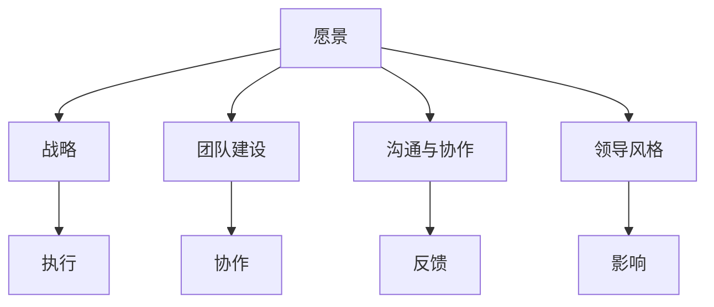

                 

### 文章标题：领导力修炼手册：从技术男到管理者的华丽转身

在技术飞速发展的今天，程序员和IT专业人士在职场中逐渐从技术岗位转向管理岗位。然而，从技术男到管理者的转变并不容易，因为领导力与编程技术有着本质的不同。这篇文章旨在探讨领导力的核心概念、架构和实践，帮助那些渴望成为优秀管理者的技术男们找到一条清晰的修炼路径。

关键词：领导力、技术男、管理者、职业转型、团队建设、沟通与协作

摘要：本文将首先解析领导力的定义和重要性，接着深入探讨领导力的五大维度，包括愿景、战略、团队建设、沟通与协作、领导风格。我们将通过Mermaid流程图展示这五大维度的相互关系。随后，文章将介绍领导力的核心算法原理，使用数学模型和伪代码来阐述领导力的执行过程。接下来，我们将探讨领导力在团队管理、项目管理、个人发展和危机管理中的应用。最后，文章将探讨领导力在国际视野下的应用，并提供一些领导力资源与工具。通过这些内容，我们希望为那些想要从技术男成功转型为管理者的读者提供有价值的指导。

### 目录大纲设计

本文将分为两部分，分别探讨领导力的理论和实践。

#### 第一部分：领导力的核心概念与架构

**第1章：领导力的定义与重要性**  
- **1.1 领导力的概念解析**：探讨领导力的定义，包括领导力的内涵和外延，以及领导的本质作用。  
- **1.2 领导力的重要性**：分析领导力在组织成功中的关键作用，以及为何领导者的重要性不断提升。  
- **1.3 领导力与管理的区别**：明确领导力与管理的区别，阐述两者在组织中的不同职责和角色。

**第2章：领导力的架构**  
- **2.1 领导力的五大维度**：深入探讨愿景、战略、团队建设、沟通与协作、领导风格的概念和相互关系。  
- **2.2 领导力的Mermaid流程图**：绘制一个Mermaid流程图，展示领导力五大维度的相互关系和执行流程。

**第3章：领导力的核心算法原理**  
- **3.1 领导力算法的数学模型**：介绍领导力的数学模型，包括模型定义、参数确定和调整方法。  
- **3.2 领导力算法的伪代码**：提供领导力算法的伪代码，阐述算法的基本逻辑和操作步骤。

#### 第二部分：领导力在实践中的应用

**第4章：领导力在团队管理中的应用**  
- **4.1 团队管理的核心概念**：介绍团队管理的概念和核心要素。  
- **4.2 团队成员的角色与责任**：明确团队成员的不同角色和职责，以及如何分配和协调。  
- **4.3 团队目标设定与任务分配**：阐述如何设定明确的目标，以及如何合理分配任务。  
- **4.4 团队绩效评估与激励机制**：介绍团队绩效评估的方法，以及如何建立有效的激励机制。

**第5章：领导力在项目管理的应用**  
- **5.1 项目管理的核心概念**：介绍项目管理的概念和核心要素。  
- **5.2 项目计划与执行**：阐述项目计划的制定和执行过程。  
- **5.3 项目风险与变更管理**：讨论项目风险和变更管理的策略。  
- **5.4 项目团队沟通与协作**：探讨项目团队沟通和协作的最佳实践。

**第6章：领导力在个人发展中的应用**  
- **6.1 自我领导力的重要性**：探讨自我领导力在个人发展中的关键作用。  
- **6.2 自我领导力的发展路径**：介绍自我领导力的发展路径和关键步骤。  
- **6.3 自我领导力的提升方法**：提供自我领导力提升的具体方法和策略。  
- **6.4 自我领导力实践案例分析**：通过实际案例展示自我领导力的应用和实践。

**第7章：领导力在危机管理中的应用**  
- **7.1 危机管理的核心概念**：介绍危机管理的概念和核心要素。  
- **7.2 危机识别与预警**：讨论危机识别和预警的方法和策略。  
- **7.3 危机应对策略**：探讨危机应对的策略和最佳实践。  
- **7.4 危机恢复与重建**：讨论危机恢复和重建的方法和策略。

**第8章：领导力在国际视野下的应用**  
- **8.1 国际领导力概述**：介绍国际领导力的概念和核心要素。  
- **8.2 跨文化领导力**：探讨跨文化领导力的挑战和策略。  
- **8.3 国际领导力案例分析**：通过实际案例展示国际领导力的应用和实践。  
- **8.4 全球化背景下的领导力挑战**：讨论全球化背景下领导力面临的挑战和机遇。

**附录：领导力资源与工具**  
- **9.1 领导力评估工具**：介绍常用的领导力评估工具和方法。  
- **9.2 领导力发展课程与书籍推荐**：推荐一些优秀的领导力发展课程和书籍。  
- **9.3 领导力研究机构与平台介绍**：介绍一些知名的领导力研究机构和在线平台。

### 详细描述

**第1章：领导力的定义与重要性**

**1.1 领导力的概念解析**

领导力是一个广泛讨论但又难以定义的概念。简单来说，领导力是指领导者通过影响和激励他人来实现共同目标的能力。这个定义强调了领导者的作用，即通过影响他人来推动组织前进。领导力不仅仅是管理，更是一种激励和引导他人共同达成目标的能力。

领导力有四个关键要素：

1. **个人特质**：领导者需要具备一定的个人特质，如自信、果断、诚实和正直。
2. **知识技能**：领导者需要具备相关的知识和技能，如战略规划、沟通技巧和团队建设能力。
3. **影响力**：领导者需要有能力影响他人，包括下属、同事和上级。
4. **目标导向**：领导者需要具备明确的目标意识，能够引导团队朝着共同的目标努力。

**1.2 领导力的重要性**

领导力在组织成功中起着至关重要的作用。以下是几个关键点：

1. **激励员工**：领导者通过激励和鼓舞员工，提高他们的工作积极性和创造力。
2. **促进团队协作**：领导者能够建立高效的团队，通过有效的沟通和协作实现共同目标。
3. **战略规划**：领导者负责制定组织的战略规划，确保组织朝着正确的方向前进。
4. **创新与变革**：领导者推动组织的创新和变革，使组织能够适应快速变化的环境。
5. **提升组织绩效**：领导者通过有效的管理和领导，提升组织的整体绩效和竞争力。

**1.3 领导力与管理的区别**

领导力与管理是两个不同的概念，但又相互关联。管理主要涉及组织的运作、规划和执行，而领导力则关注激励和影响他人。以下是两者的一些关键区别：

1. **焦点不同**：管理侧重于任务和流程，而领导力侧重于目标和人。
2. **角色不同**：管理者负责监督和协调工作，而领导者则负责激励和引导团队。
3. **技能要求不同**：管理者需要具备组织和规划能力，而领导者需要具备影响力和激励能力。
4. **目标不同**：管理的目标是实现组织的效率和效果，而领导力的目标是实现组织的愿景和使命。

理解领导力与管理之间的区别，有助于领导者更好地发挥自己的作用，同时也能够明确管理者和领导者的不同职责和角色。

**第2章：领导力的架构**

**2.1 领导力的五大维度**

领导力是一个多维度的概念，涉及多个方面。以下是领导力的五大维度：

1. **愿景**：愿景是领导者对未来的期望和设想，是引导团队前行的方向标。一个清晰的愿景能够激发团队成员的激情和动力，使他们为实现共同目标而努力。

2. **战略**：战略是领导者为实现愿景而制定的具体行动计划。战略规划需要考虑组织的资源、能力和市场环境，以确保组织能够有效地实现愿景。

3. **团队建设**：团队建设是领导力的重要组成部分，包括建立团队文化、提升团队协作效率和确保团队成员的相互支持。一个高效的团队能够提高组织的整体绩效。

4. **沟通与协作**：沟通与协作是领导力的核心要素，涉及领导者与团队成员之间的有效沟通和协作。良好的沟通能够减少误解和冲突，提高团队的协作效率。

5. **领导风格**：领导风格是领导者影响和激励团队成员的方式。不同的领导风格适用于不同的情境和团队成员，领导者需要根据实际情况选择合适的领导风格。

**2.2 领导力的Mermaid流程图**

为了更好地理解领导力的五大维度及其相互关系，我们可以使用Mermaid流程图来展示。以下是一个简化的Mermaid流程图示例：



在这个流程图中，愿景作为出发点，通过战略、团队建设、沟通与协作和领导风格等多个维度，最终实现目标的执行和反馈。这个流程图展示了领导力的动态过程，以及各个维度之间的相互关系。

**第3章：领导力的核心算法原理**

**3.1 领导力算法的数学模型**

领导力可以看作是一个复杂的系统，其核心要素包括愿景、战略、团队建设、沟通与协作和领导风格。为了更好地理解和分析领导力，我们可以使用数学模型来描述。

假设领导力L可以表示为一个函数f，其中输入参数包括愿景V、战略S、团队建设T、沟通与协作C和领导风格Ls。即：

$$
L = f(V, S, T, C, Ls)
$$

在这个数学模型中，每个输入参数都有其特定的权重，表示其在领导力中的重要性。例如，愿景V可能在模型中具有最高的权重，因为它为团队提供了明确的目标和方向。

此外，我们可以通过调整这些参数的权重，来优化领导力L。例如，如果一个团队在沟通与协作方面存在问题，我们可以增加C的权重，以提高领导力。

**3.2 领导力算法的伪代码**

为了实现领导力算法，我们可以编写一个伪代码，以描述其基本逻辑和操作步骤。以下是一个简化的伪代码示例：

```python
function 领导力(V, S, T, C, Ls):
    if V清晰 and S有效:
        执行S
    else:
        重新制定V和S
    end if
    
    if T成功 and C良好:
        保持T和C
    else:
        改进T和C
    end if
    
    根据Ls调整领导行为
end function
```

在这个伪代码中，我们首先检查愿景V和战略S的有效性。如果它们不清晰或无效，我们将重新制定它们。接着，我们检查团队建设T和沟通与协作C的成功性。如果存在问题，我们将改进它们。最后，根据领导风格Ls，调整领导行为，以实现最优的领导效果。

通过这个伪代码，我们可以更好地理解和实现领导力算法，从而在组织中提高领导效果和团队绩效。

### 第一部分：领导力的核心概念与架构

#### 第1章：领导力的定义与重要性

**1.1 领导力的概念解析**

领导力是一个广泛讨论但又难以定义的概念。简单来说，领导力是指领导者通过影响和激励他人来实现共同目标的能力。这个定义强调了领导者的作用，即通过影响他人来推动组织前进。领导力不仅仅是管理，更是一种激励和引导他人共同达成目标的能力。

在组织管理中，领导力具有四个关键要素：

1. **个人特质**：领导者需要具备一定的个人特质，如自信、果断、诚实和正直。这些特质使领导者能够赢得他人的信任和尊重，从而更好地影响和激励团队。

2. **知识技能**：领导者需要具备相关的知识和技能，如战略规划、沟通技巧和团队建设能力。这些知识和技能使领导者能够有效地制定计划、传达目标和解决团队中的问题。

3. **影响力**：领导者需要有能力影响他人，包括下属、同事和上级。影响力是领导力的核心，它使领导者能够推动团队朝着共同的目标努力。

4. **目标导向**：领导者需要具备明确的目标意识，能够引导团队朝着共同的目标努力。目标导向使领导者能够保持专注和动力，确保团队始终朝着正确的方向前进。

**1.2 领导力的重要性**

领导力在组织成功中起着至关重要的作用。以下是几个关键点：

1. **激励员工**：领导者通过激励和鼓舞员工，提高他们的工作积极性和创造力。一个具有领导力的领导者能够激发员工的潜力，使他们在工作中发挥出最佳水平。

2. **促进团队协作**：领导者能够建立高效的团队，通过有效的沟通和协作实现共同目标。团队协作是组织成功的关键，一个具有领导力的领导者能够确保团队成员之间的协作顺畅，提高团队的整体绩效。

3. **战略规划**：领导者负责制定组织的战略规划，确保组织能够朝着正确的方向前进。战略规划是组织成功的基础，一个具有领导力的领导者能够根据市场环境和组织目标，制定出具有前瞻性和可行性的战略规划。

4. **创新与变革**：领导者推动组织的创新和变革，使组织能够适应快速变化的环境。创新和变革是组织持续发展的重要动力，一个具有领导力的领导者能够引领组织进行创新和变革，从而保持竞争优势。

5. **提升组织绩效**：领导者通过有效的管理和领导，提升组织的整体绩效和竞争力。领导力是组织绩效提升的关键因素，一个具有领导力的领导者能够激发员工的潜力，提高组织的运营效率，从而提升组织的整体绩效。

**1.3 领导力与管理的区别**

领导力与管理是两个不同的概念，但又相互关联。管理主要涉及组织的运作、规划和执行，而领导力则关注激励和影响他人。以下是两者的一些关键区别：

1. **焦点不同**：管理侧重于任务和流程，而领导力侧重于目标和人。管理者关注的是如何有效地完成任务和达成目标，而领导者则关注如何激励和引导他人共同实现目标。

2. **角色不同**：管理者负责监督和协调工作，而领导者则负责激励和引导团队。管理者通过制定计划和执行任务来确保组织目标的实现，而领导者则通过影响和激励团队成员来推动组织前进。

3. **技能要求不同**：管理者需要具备组织和规划能力，而领导者需要具备影响力和激励能力。管理者需要能够有效地组织和协调工作，确保任务按时完成，而领导者则需要能够影响和激励团队成员，激发他们的潜力。

4. **目标不同**：管理的目标是实现组织的效率和效果，而领导力的目标是实现组织的愿景和使命。管理关注的是如何高效地完成任务和达成目标，而领导力则关注如何实现组织的愿景和使命，推动组织长期发展。

理解领导力与管理之间的区别，有助于领导者更好地发挥自己的作用，同时也能够明确管理者和领导者的不同职责和角色。在组织中，领导力和管理相互补充，共同推动组织的发展。

**1.4 领导力的本质**

领导力的本质在于激发和引导他人，使他们能够为实现共同目标而努力。领导力不仅仅是权力和地位的象征，更是一种能力，一种能够影响和激励他人的能力。

领导力的核心在于以下几个方面：

1. **影响力**：领导者需要具备强大的影响力，能够影响和激励团队成员。这种影响力来自于领导者的个人特质、知识和技能，以及他们对团队成员的关心和支持。

2. **愿景**：领导者需要有清晰的愿景，能够为团队提供明确的方向和目标。愿景是领导力的灵魂，它激发团队成员的激情和动力，使他们为实现共同目标而努力。

3. **沟通与协作**：领导者需要具备良好的沟通和协作能力，能够有效地与团队成员沟通，并促进团队成员之间的协作。沟通和协作是领导力的关键要素，它能够减少误解和冲突，提高团队的工作效率。

4. **激励**：领导者需要能够激励团队成员，激发他们的潜力，使他们能够在工作中发挥出最佳水平。激励是领导力的重要体现，它能够提高团队成员的工作积极性和创造力。

5. **变革**：领导者需要能够推动组织的变革，使组织能够适应快速变化的环境。变革是领导力的重要使命，它能够使组织保持竞争优势，实现可持续发展。

通过理解领导力的本质，领导者可以更好地发挥自己的作用，推动组织的发展。领导力不仅仅是管理者的职责，更是每个团队成员的责任。只有通过共同的努力，组织才能实现长期的可持续发展。

**1.5 领导力的发展路径**

领导力的发展是一个持续的过程，需要领导者不断地学习和成长。以下是一些领导力的发展路径：

1. **自我认知**：领导者首先需要了解自己，包括自己的优点和不足，以及自己的价值观和信念。通过自我认知，领导者可以更好地理解自己的行为和决策，从而提高领导效果。

2. **学习与培训**：领导者需要不断地学习新知识和技能，包括战略规划、沟通技巧、团队建设等。通过学习与培训，领导者可以提升自己的能力，更好地应对工作中的挑战。

3. **实践经验**：领导力是通过实践锻炼出来的。领导者需要在实际工作中积累经验，通过实践来验证自己的理论知识和能力。实践经验是领导力发展的关键环节。

4. **反思与总结**：领导者需要定期反思自己的工作和行为，总结经验教训。通过反思与总结，领导者可以不断改进自己的领导方式，提高领导效果。

5. **培养他人**：领导者需要关注团队成员的发展，帮助他们提升能力和实现目标。通过培养他人，领导者可以建立一支高效的团队，推动组织的发展。

通过以上领导力的发展路径，领导者可以逐步提升自己的领导能力，成为优秀的领导者。

**1.6 领导力的挑战**

领导力的发展并非一帆风顺，领导者面临着许多挑战。以下是一些常见的领导力挑战：

1. **沟通障碍**：领导者需要与团队成员、上级和利益相关者进行有效的沟通。然而，沟通障碍常常导致误解和冲突，影响领导效果。

2. **管理复杂度**：随着组织的规模扩大和业务复杂度的增加，领导者需要面对更多的管理和协调任务。管理复杂度给领导者带来了巨大的压力和挑战。

3. **变化与不确定性**：在快速变化的市场环境中，领导者需要具备适应变化和应对不确定性的能力。变化与不确定性对领导者的决策和应对能力提出了更高的要求。

4. **激励与保留人才**：领导者需要激励团队成员，提高他们的工作积极性和创造力。同时，领导者还需要关注人才的保留，确保组织拥有稳定的人才储备。

5. **平衡短期与长期目标**：领导者需要在短期目标和长期目标之间找到平衡。短期目标有助于组织快速取得成果，而长期目标有助于组织的可持续发展。平衡短期与长期目标是领导者的重要挑战。

通过了解这些领导力挑战，领导者可以更好地准备自己，应对工作中的各种挑战。

**第2章：领导力的架构**

**2.1 领导力的五大维度**

领导力是一个多维度的概念，涉及多个方面。以下是领导力的五大维度：

1. **愿景**：愿景是领导者对未来的期望和设想，是引导团队前行的方向标。一个清晰的愿景能够激发团队成员的激情和动力，使他们为实现共同目标而努力。

2. **战略**：战略是领导者为实现愿景而制定的具体行动计划。战略规划需要考虑组织的资源、能力和市场环境，以确保组织能够有效地实现愿景。

3. **团队建设**：团队建设是领导力的重要组成部分，包括建立团队文化、提升团队协作效率和确保团队成员的相互支持。一个高效的团队能够提高组织的整体绩效。

4. **沟通与协作**：沟通与协作是领导力的核心要素，涉及领导者与团队成员之间的有效沟通和协作。良好的沟通能够减少误解和冲突，提高团队的协作效率。

5. **领导风格**：领导风格是领导者影响和激励团队成员的方式。不同的领导风格适用于不同的情境和团队成员，领导者需要根据实际情况选择合适的领导风格。

**2.2 领导力的Mermaid流程图**

为了更好地理解领导力的五大维度及其相互关系，我们可以使用Mermaid流程图来展示。以下是一个简化的Mermaid流程图示例：


在这个流程图中，愿景作为出发点，通过战略、团队建设、沟通与协作和领导风格等多个维度，最终实现目标的执行和反馈。这个流程图展示了领导力的动态过程，以及各个维度之间的相互关系。

**2.3 愿景**

愿景是领导力的核心，是领导者对未来的期望和设想。一个清晰的愿景能够为团队提供明确的方向和目标，激发团队成员的激情和动力。

**愿景的定义**：愿景是对未来可能性的想象，是对组织未来状态的一种描绘。它不仅包括组织的使命和目标，还包括组织的价值观和文化。

**愿景的重要性**：愿景在领导力中起着至关重要的作用。它为团队提供了明确的方向和目标，使团队成员能够团结一致，为实现共同目标而努力。愿景还能够激发团队成员的创造力和创新精神，推动组织的持续发展。

**如何制定愿景**：

1. **明确组织的目标**：首先，领导者需要明确组织的长期目标和短期目标。这些目标应该与组织的使命和价值观相一致。

2. **进行市场分析**：领导者需要了解市场趋势和竞争对手的情况，以确保组织的愿景具有前瞻性和可行性。

3. **征求团队成员的意见**：领导者应该与团队成员进行沟通，了解他们的想法和建议。团队成员的参与能够增强他们对愿景的认同感和归属感。

4. **制定明确的行动计划**：领导者需要制定具体的行动计划，以确保愿景能够实现。行动计划应该包括明确的目标、可量化的指标和实现目标的步骤。

**2.4 战略**

战略是领导者为实现愿景而制定的具体行动计划。战略规划是领导力的重要方面，它关系到组织的长远发展和竞争力。

**战略的定义**：战略是组织为实现愿景而制定的一系列目标和行动方案。它包括组织的核心竞争力、市场定位、资源分配和竞争优势。

**战略的重要性**：战略在领导力中起着关键作用。它为组织提供了明确的行动指南，使领导者能够有效地利用资源，实现组织的愿景和目标。战略还能够帮助组织应对市场变化和竞争对手的挑战，保持竞争优势。

**如何制定战略**：

1. **确定组织的目标**：领导者需要明确组织的长期和短期目标。这些目标应该与组织的愿景和使命相一致。

2. **分析市场和环境**：领导者需要了解市场趋势、竞争对手和潜在的机会与威胁。这有助于制定具有前瞻性和可行性的战略。

3. **制定核心竞争力**：领导者需要确定组织的核心竞争力，即能够在市场中脱颖而出并保持竞争优势的能力。

4. **确定市场定位**：领导者需要确定组织在市场中的定位，即组织要服务的目标客户和市场领域。

5. **制定资源分配计划**：领导者需要制定资源分配计划，确保组织的资源能够有效利用，支持战略目标的实现。

**2.5 团队建设**

团队建设是领导力的重要组成部分，它关系到团队的协作效率、成员的满意度和组织的整体绩效。

**团队建设的定义**：团队建设是指通过建立和维护有效的团队关系，提高团队的协作效率和工作绩效的过程。

**团队建设的重要性**：团队建设在领导力中起着至关重要的作用。它能够提高团队的协作效率，减少冲突和误解，增强团队成员的归属感和凝聚力。团队建设还能够提升团队成员的工作满意度和幸福感，从而提高组织的整体绩效。

**如何进行团队建设**：

1. **建立共同目标**：领导者需要确保团队成员对团队目标有共同的理解和认同，这有助于提高团队的协作效率。

2. **建立有效的沟通机制**：领导者需要建立有效的沟通机制，确保团队成员能够及时、准确地沟通和交流。良好的沟通能够减少误解和冲突，提高团队的协作效率。

3. **培养团队合作精神**：领导者需要培养团队成员的团队合作精神，鼓励他们相互支持、相互协作。团队合作精神能够增强团队的凝聚力，提高团队的整体绩效。

4. **提供培训和发展机会**：领导者需要为团队成员提供培训和发展机会，提高他们的技能和知识水平。这有助于团队成员的成长和发展，提高团队的整体能力。

5. **关注团队成员的满意度**：领导者需要关注团队成员的工作满意度，了解他们的需求和期望。通过关注团队成员的满意度，领导者可以增强团队成员的归属感和忠诚度，提高团队的凝聚力。

**2.6 沟通与协作**

沟通与协作是领导力的核心要素，它关系到团队的协作效率、成员的满意度和组织的整体绩效。

**沟通与协作的定义**：沟通是指信息的传递和理解，协作是指团队成员共同完成任务的过程。

**沟通与协作的重要性**：沟通与协作在领导力中起着至关重要的作用。它能够提高团队的协作效率，减少冲突和误解，增强团队成员的归属感和凝聚力。良好的沟通与协作能够使团队成员更好地理解组织的目标和任务，提高工作效率和绩效。

**如何进行有效的沟通与协作**：

1. **建立清晰的沟通渠道**：领导者需要建立清晰的沟通渠道，确保团队成员能够及时、准确地沟通和交流。这包括会议、邮件、即时通讯工具等多种沟通方式。

2. **培养良好的沟通技巧**：领导者需要培养团队成员的沟通技巧，包括倾听、表达、提问和反馈等。良好的沟通技巧能够提高沟通的效果，减少误解和冲突。

3. **建立协作机制**：领导者需要建立有效的协作机制，确保团队成员能够共同完成任务。这包括明确的任务分配、协作流程和协作工具等。

4. **鼓励团队成员参与**：领导者需要鼓励团队成员参与决策和协作过程，提高他们的参与感和责任感。团队成员的参与能够增强他们的归属感和凝聚力。

5. **提供协作培训和发展机会**：领导者需要为团队成员提供协作培训和发展机会，提高他们的协作技能和知识水平。这有助于团队成员更好地协作，提高团队的绩效。

**2.7 领导风格**

领导风格是领导者影响和激励团队成员的方式。不同的领导风格适用于不同的情境和团队成员，领导者需要根据实际情况选择合适的领导风格。

**领导风格的定义**：领导风格是指领导者管理、指导和影响团队成员的方式和习惯。

**领导风格的重要性**：领导风格在领导力中起着关键作用。合适的领导风格能够提高团队成员的工作满意度和绩效，而不合适的领导风格则可能导致团队成员的挫败感和离职率。

**常见的领导风格**：

1. **权威型领导风格**：权威型领导风格是指领导者对团队成员进行严格的控制和监督，以确保任务按时完成。这种风格适用于紧急情况和需要高度纪律的组织。

2. **民主型领导风格**：民主型领导风格是指领导者鼓励团队成员参与决策和协作，尊重团队成员的意见和建议。这种风格适用于团队中具有高度专业知识和经验的情况。

3. **参与型领导风格**：参与型领导风格是指领导者鼓励团队成员参与决策和任务分配，使团队成员感到自己的意见被重视。这种风格适用于团队成员具有较高自主性和创新精神的情况。

4. **教练型领导风格**：教练型领导风格是指领导者通过指导和辅导团队成员，帮助他们提高技能和实现个人目标。这种风格适用于团队成员需要个人发展和职业成长的情境。

**如何选择合适的领导风格**：

1. **了解团队成员的特点**：领导者需要了解团队成员的特点，包括他们的价值观、能力、经验和需求，以便选择合适的领导风格。

2. **分析情境因素**：领导者需要分析情境因素，包括任务的重要性、团队的规模和复杂性、组织文化等，以便选择合适的领导风格。

3. **灵活调整领导风格**：领导者需要根据实际情况灵活调整领导风格，使团队成员能够更好地适应不同的情境和任务。

**第3章：领导力的核心算法原理**

**3.1 领导力算法的数学模型**

领导力可以看作是一个复杂的系统，其核心要素包括愿景、战略、团队建设、沟通与协作和领导风格。为了更好地理解和分析领导力，我们可以使用数学模型来描述。

假设领导力L可以表示为一个函数f，其中输入参数包括愿景V、战略S、团队建设T、沟通与协作C和领导风格Ls。即：

$$
L = f(V, S, T, C, Ls)
$$

在这个数学模型中，每个输入参数都有其特定的权重，表示其在领导力中的重要性。例如，愿景V可能在模型中具有最高的权重，因为它为团队提供了明确的目标和方向。战略S、团队建设T、沟通与协作C和领导风格Ls的权重可以根据实际情况进行调整。

**3.2 领导力算法的伪代码**

为了实现领导力算法，我们可以编写一个伪代码，以描述其基本逻辑和操作步骤。以下是一个简化的伪代码示例：

```python
function 领导力(V, S, T, C, Ls):
    if V清晰 and S有效:
        执行S
    else:
        重新制定V和S
    end if
    
    if T成功 and C良好:
        保持T和C
    else:
        改进T和C
    end if
    
    根据Ls调整领导行为
end function
```

在这个伪代码中，我们首先检查愿景V和战略S的有效性。如果它们不清晰或无效，我们将重新制定它们。接着，我们检查团队建设T和沟通与协作C的成功性。如果存在问题，我们将改进它们。最后，根据领导风格Ls，调整领导行为，以实现最优的领导效果。

**3.3 领导力算法的应用**

领导力算法在实际应用中，可以帮助领导者更好地管理团队和实现组织目标。以下是一个简化的应用示例：

```python
# 假设我们已经收集了以下数据：
愿景V = "成为行业领先者"
战略S = "创新产品研发"
团队建设T = "高度协作"
沟通与协作C = "有效沟通"
领导风格Ls = "民主型"

# 使用领导力算法进行决策
L = 领导力(V, S, T, C, Ls)

# 分析领导力结果
if L > 0.8: # 领导力较强
    print("领导力较强，继续保持和改进。")
else: # 领导力较弱
    print("领导力较弱，需要重新制定愿景和战略，并改进团队建设和沟通协作。")
```

在这个示例中，我们首先使用收集的数据调用领导力函数，计算领导力L。然后，我们根据领导力L的结果，决定是否需要调整愿景、战略、团队建设和沟通协作。如果领导力L较高，表示团队状态良好，可以继续保持和改进。如果领导力L较低，表示团队存在问题，需要重新制定愿景和战略，并改进团队建设和沟通协作。

通过这个示例，我们可以看到领导力算法在实际应用中的重要作用。它可以帮助领导者更好地管理团队，提高团队绩效和实现组织目标。

**3.4 领导力算法的数学模型与实际应用的关系**

领导力算法的数学模型与实际应用之间存在紧密的关系。数学模型为我们提供了一个理论框架，用于理解和分析领导力的各个方面。而实际应用则将这些理论应用于具体情境，帮助领导者更好地管理团队和实现组织目标。

以下是一些数学模型与实际应用之间的关系：

1. **愿景的重要性**：在数学模型中，愿景是领导力的核心要素，具有最高的权重。在实际应用中，领导者需要确保愿景清晰、具有前瞻性和可行性。如果愿景不清晰或无效，领导者需要重新制定愿景，以激发团队成员的激情和动力。

2. **战略的有效性**：在数学模型中，战略是领导力的关键要素，它决定了组织能否实现愿景。在实际应用中，领导者需要制定有效的战略，确保组织能够充分利用资源和能力，实现愿景。如果战略不有效，领导者需要重新制定战略，以适应市场变化和竞争对手的挑战。

3. **团队建设的重要性**：在数学模型中，团队建设是领导力的重要方面，它决定了团队的协作效率和成员的满意度。在实际应用中，领导者需要关注团队建设，建立有效的团队关系，提高团队的协作效率和整体绩效。

4. **沟通与协作的重要性**：在数学模型中，沟通与协作是领导力的核心要素，它决定了团队成员之间的信息传递和协作效率。在实际应用中，领导者需要建立有效的沟通机制，确保团队成员能够及时、准确地沟通和交流，减少误解和冲突。

5. **领导风格的选择**：在数学模型中，领导风格是领导力的关键要素，它决定了领导者如何影响和激励团队成员。在实际应用中，领导者需要根据团队成员的特点和实际情况，选择合适的领导风格，以提高团队成员的工作满意度和绩效。

通过这些关系，我们可以看到数学模型与实际应用之间的紧密联系。数学模型为我们提供了一个理论框架，帮助我们理解和分析领导力的各个方面。而实际应用则将这些理论应用于具体情境，帮助领导者更好地管理团队和实现组织目标。

### 第二部分：领导力在实践中的应用

#### 第4章：领导力在团队管理中的应用

**4.1 团队管理的核心概念**

团队管理是领导力的重要组成部分，它涉及到如何有效地组织、协调和激励团队成员，以实现共同的目标。团队管理的核心概念包括以下几个方面：

1. **团队的定义**：团队是由一组相互依赖、共同协作的个体组成的，他们在共同的目标和价值观的引导下，通过有效的沟通和协作，共同完成复杂任务。

2. **团队的目标**：团队的目标是团队的核心驱动力，它们应该与组织的整体目标保持一致。明确的目标有助于团队成员集中精力，提高工作效率。

3. **团队成员的角色与责任**：每个团队成员在团队中都有特定的角色和责任。角色通常与团队成员的技能、经验和背景相关，而责任则是团队成员必须履行的义务。

4. **团队绩效**：团队绩效是指团队在实现目标过程中的表现。衡量团队绩效的指标包括任务完成率、质量、创新能力和团队成员的满意度。

5. **团队建设**：团队建设是指通过一系列活动和措施，增强团队成员之间的信任、合作和凝聚力，以提高团队的整体绩效。

**4.2 团队成员的角色与责任**

在团队管理中，明确团队成员的角色与责任至关重要。以下是一些常见的团队成员角色和责任：

1. **领导者**：领导者负责制定团队目标和计划，协调团队成员的工作，提供必要的资源和支持，以及激励团队成员。

2. **协调者**：协调者负责协调团队成员之间的沟通和协作，解决冲突，确保团队目标的实现。

3. **执行者**：执行者是团队中负责具体任务的人员，他们负责完成任务，确保工作质量和进度。

4. **创新者**：创新者负责提出新的想法和解决方案，推动团队的创新和发展。

5. **监督者**：监督者负责监控团队的工作进度和绩效，提供反馈，确保团队目标的实现。

6. **沟通者**：沟通者负责与外部利益相关者进行沟通，确保团队的工作得到理解和支持。

**4.3 团队目标设定与任务分配**

设定明确的团队目标是团队管理的关键步骤。以下是设定团队目标和任务分配的步骤：

1. **明确团队目标**：团队目标应该是具体、可衡量、可实现、相关和有时限的（SMART）。领导者需要与团队成员共同讨论并确定团队目标。

2. **分解目标**：将团队目标分解为具体的任务和子目标，确保每个任务都有明确的负责人和时间表。

3. **分配任务**：根据团队成员的技能和经验，分配适当的任务。确保每个团队成员都有清晰的角色和责任。

4. **建立时间表**：为每个任务建立时间表，确保团队成员了解任务的截止日期和进度。

5. **沟通与确认**：与团队成员沟通任务分配和时间表，确保他们对任务有清晰的理解，并确认他们能够按时完成任务。

**4.4 团队绩效评估与激励机制**

团队绩效评估是团队管理的重要环节，它有助于了解团队的工作表现，并提供反馈以改进团队绩效。以下是团队绩效评估和激励机制的关键要素：

1. **设定评估标准**：根据团队目标和任务，设定具体的评估标准，包括质量、进度、创新和团队协作。

2. **定期评估**：定期对团队绩效进行评估，可以是每周、每月或每季度。评估应该基于具体的数据和事实，而不是主观判断。

3. **提供反馈**：根据评估结果，为团队成员提供具体的反馈。反馈应该积极、建设性，并关注改进的方向。

4. **奖励机制**：建立激励机制，奖励表现优秀的团队成员。奖励可以是物质奖励（如奖金、礼品）或精神奖励（如表扬、晋升机会）。

5. **改进计划**：根据评估结果和反馈，制定改进计划，以提升团队的整体绩效。

通过有效的团队绩效评估和激励机制，领导者可以激励团队成员，提高团队的工作效率和绩效。

#### 第5章：领导力在项目管理的应用

**5.1 项目管理的核心概念**

项目管理是领导力在实践中的重要应用领域之一。项目管理涉及一系列计划和活动，旨在通过有效地使用资源，实现预定的项目目标。以下是项目管理的核心概念：

1. **项目的定义**：项目是一个临时的、独特的活动，旨在创建一个特定的产品、服务或成果。项目通常有明确的目标、时间表和预算。

2. **项目目标**：项目目标是项目成功的关键，它们应该具体、可衡量、可实现、相关和有时限（SMART）。项目目标可以分为战略目标、管理目标和业务目标。

3. **项目计划**：项目计划是项目管理的核心文档，它包含了项目的范围、时间表、预算、资源和风险。项目计划为项目团队提供了明确的方向和指导。

4. **项目执行**：项目执行是项目计划的实际实施阶段，涉及资源的分配、任务的执行、沟通和监控。项目团队需要确保按照计划执行任务，同时应对可能出现的变更和风险。

5. **项目监控**：项目监控是跟踪项目进展、性能和风险的过程。它包括定期审查项目进度、成本和质量，以及识别和应对潜在的问题。

6. **项目收尾**：项目收尾是项目完成阶段的正式过程，包括项目交付、验收、总结和文档归档。项目收尾确保项目的目标已经实现，并为未来的项目提供经验和教训。

**5.2 项目计划与执行**

项目计划与执行是项目管理的两个关键阶段。以下是项目计划与执行的关键步骤：

1. **项目计划**：

   - **定义项目范围**：明确项目的目标、交付物和限制条件。
   - **制定项目时间表**：制定项目的时间线，确定关键里程碑和任务。
   - **分配资源**：确定项目所需的资源，包括人力、技术和资金。
   - **预算编制**：制定项目的预算，确保资源的合理分配。
   - **风险管理**：识别潜在的风险，制定应对策略。

2. **项目执行**：

   - **任务分配**：将任务分配给团队成员，明确每个人的责任和期望。
   - **团队沟通**：确保团队成员之间的有效沟通，协调任务和资源。
   - **进度监控**：定期检查项目进度，确保任务按时完成。
   - **质量控制**：确保项目交付物符合预定的质量标准。
   - **变更管理**：处理项目变更请求，确保变更不会影响项目的目标、时间表和预算。

**5.3 项目风险与变更管理**

项目风险和变更是项目管理中常见的问题，有效的风险和变更管理是确保项目成功的关键。以下是项目风险与变更管理的步骤：

1. **项目风险识别**：识别项目可能面临的风险，包括技术风险、人员风险、市场风险等。

2. **风险评估**：对识别的风险进行评估，确定风险的可能性和影响。

3. **风险应对策略**：制定应对风险的策略，包括风险规避、风险减轻、风险接受和风险转移。

4. **变更管理流程**：建立变更管理流程，包括变更请求的提交、评估、批准和实施。

5. **变更控制**：监控变更的实施，确保变更不会对项目目标、时间表和预算产生负面影响。

通过有效的项目风险与变更管理，项目团队可以更好地应对不确定性，确保项目的顺利进行和成功交付。

**5.4 项目团队沟通与协作**

项目团队的沟通与协作是项目成功的关键因素。以下是项目团队沟通与协作的关键要素：

1. **沟通计划**：制定项目沟通计划，明确沟通的目的、频率、方式和责任人。

2. **沟通工具**：选择合适的沟通工具，如邮件、即时通讯、视频会议等，确保沟通的及时性和有效性。

3. **信息共享**：建立信息共享平台，确保团队成员能够及时获取项目相关的信息和文档。

4. **冲突解决**：建立冲突解决机制，确保团队成员之间的冲突得到及时解决，不影响项目进展。

5. **团队协作**：鼓励团队成员之间的协作，建立协作文化，提高团队的整体效率。

通过有效的项目团队沟通与协作，项目团队可以更好地应对挑战，提高项目的成功概率。

#### 第6章：领导力在个人发展中的应用

**6.1 自我领导力的重要性**

自我领导力，也称为自我管理，是个人在职业生涯中取得成功的关键因素。自我领导力涉及到自我激励、自我规划、自我学习和自我调整等方面，它能够帮助个人更好地应对职业挑战，实现个人目标。

**自我领导力的定义**：自我领导力是指个人在无需外部压力或监督的情况下，能够自我驱动、自我规划和自我调整的能力。它包括自我激励、自我管理、自我学习和自我反思等方面。

**自我领导力的重要性**：

1. **提高工作效率**：自我领导力使个人能够更好地管理时间和资源，提高工作效率和产出。

2. **增强适应能力**：自我领导力使个人能够适应快速变化的环境，灵活应对各种挑战。

3. **实现个人目标**：自我领导力帮助个人明确自己的目标，制定计划和策略，实现个人职业和生活目标。

4. **提高自信心**：自我领导力使个人更加自信，能够承担更多的责任和挑战。

**6.2 自我领导力的发展路径**

发展自我领导力是一个持续的过程，需要个人不断学习和实践。以下是自我领导力的发展路径：

1. **自我认知**：自我领导力的第一步是了解自己，包括自己的优点、缺点、价值观和兴趣。通过自我认知，个人可以更好地了解自己，明确自己的优势和劣势。

2. **设定目标**：明确自己的目标对于发展自我领导力至关重要。个人应该设定具体、可衡量、可实现、相关和有时限的目标（SMART目标），并制定实现目标的计划和策略。

3. **自我激励**：自我激励是自我领导力的关键要素。个人应该学会自我激励，即使在面对困难和挑战时，也能够保持积极的态度和动力。

4. **自我管理**：自我管理包括时间管理、任务管理和情绪管理。个人应该学会合理安排时间，有效管理任务，保持情绪稳定，以应对工作和生活中的各种挑战。

5. **自我学习**：自我学习是个人成长和发展的重要途径。个人应该不断学习新知识和技能，提升自己的专业能力和竞争力。

6. **自我反思**：自我反思是自我领导力发展的重要组成部分。个人应该定期反思自己的行为、决策和成果，总结经验教训，不断改进和优化自己的行为。

**6.3 自我领导力的提升方法**

以下是几种提升自我领导力的方法：

1. **制定个人发展计划**：制定个人发展计划，明确自己的学习目标和提升方向，制定具体的行动计划和时间表。

2. **参加培训和学习**：参加相关的培训和学习课程，提升自己的知识和技能。可以选择在线课程、工作坊、研讨会等。

3. **阅读和反思**：阅读相关的书籍和文章，了解自我领导力的理论和实践。同时，定期进行反思，总结自己的经验和教训。

4. **寻求反馈**：向同事、朋友或导师寻求反馈，了解自己的优势和不足，并根据反馈进行改进。

5. **实践和应用**：将自我领导力的理论和方法应用于实际工作中，通过实践来提升自己的能力。

6. **建立支持网络**：建立自己的支持网络，包括导师、同事和朋友，他们可以提供指导、建议和支持，帮助个人在自我领导力的发展过程中不断进步。

通过以上方法和步骤，个人可以逐步提升自我领导力，实现职业和个人发展的目标。

**6.4 自我领导力实践案例分析**

以下是一个自我领导力实践案例分析：

**案例背景**：张华是一名软件工程师，他在工作中表现出色，但总是觉得自己在职业发展上遇到了瓶颈。他意识到需要提升自我领导力，以应对职业发展的挑战。

**案例步骤**：

1. **自我认知**：张华通过反思和与同事的交流，认识到自己的优点是技术扎实、解决问题能力强，但自己的沟通能力和领导力较弱。

2. **设定目标**：张华设定了提升沟通能力和领导力的目标，并制定了具体的行动计划。他计划参加领导力培训课程，学习沟通技巧，并在工作中积极应用这些技能。

3. **自我激励**：张华为自己设定了奖励机制，每当他在工作中取得进步时，就会给自己一些小奖励，以保持积极的态度。

4. **自我管理**：张华学会了合理安排时间，将工作与个人时间分开，确保自己有足够的时间学习和休息。

5. **自我学习**：张华利用业余时间学习领导力和沟通技巧，阅读相关书籍，参加线上课程，不断提升自己的知识和技能。

6. **实践和应用**：张华在工作中积极应用所学的领导力和沟通技巧，与团队成员建立良好的关系，提高了团队的协作效率。

7. **自我反思**：张华定期进行反思，总结自己的经验和教训，不断改进自己的行为。

**案例结果**：通过一系列的自我领导力提升措施，张华的沟通能力和领导力得到了显著提升。他在工作中表现出色，得到了领导的认可和同事的尊重。最终，他成功地晋升为团队经理，实现了自己的职业目标。

通过这个案例，我们可以看到自我领导力在个人发展中的重要作用。通过自我认知、目标设定、自我激励、自我管理、自我学习和实践应用，个人可以不断提升自我领导力，实现职业和个人发展的目标。

#### 第7章：领导力在危机管理中的应用

**7.1 危机管理的核心概念**

危机管理是指组织在面对突发事件或重大危机时，采取的一系列预防和应对措施，以减轻危机对组织的影响，并尽快恢复正常运营。危机管理的核心概念包括危机识别、预警、应对和恢复。

**危机的定义**：危机是指可能对组织的正常运营、声誉和利益造成严重影响的突发事件或重大事件。

**危机管理的目标**：危机管理的目标包括减少危机对组织的负面影响，尽快恢复正常运营，以及通过危机管理提升组织的危机应对能力。

**危机管理的基本原则**：

1. **及时响应**：危机发生后，组织应立即启动危机应对机制，采取紧急措施，以减少危机的影响。

2. **透明沟通**：组织应与内外部利益相关者保持透明沟通，及时传达危机情况、应对措施和恢复进展，以增强信任和信心。

3. **资源整合**：危机管理需要整合组织的资源，包括人力资源、物资资源和技术资源，以确保危机应对的效率。

4. **灵活应对**：危机管理应具备灵活性，能够根据危机的变化和具体情况，及时调整应对策略。

5. **持续改进**：危机管理应不断总结经验教训，持续改进危机应对机制和流程，以提高组织的危机管理能力。

**7.2 危机识别与预警**

危机识别与预警是危机管理的第一步，旨在及时发现潜在的危机，并提前采取措施防止危机的发生。以下是危机识别与预警的关键步骤：

1. **风险评估**：对组织的运营、市场环境和外部环境进行全面评估，识别潜在的危机因素。

2. **信息收集**：收集和分析与组织相关的信息，包括市场趋势、竞争对手动态、客户反馈等，以识别潜在的危机信号。

3. **预警机制**：建立预警机制，包括设定预警指标和预警模型，以及制定预警信号和响应策略。

4. **定期评估**：定期对组织的危机管理能力进行评估，确保预警机制的有效性和适应性。

**7.3 危机应对策略**

在危机发生后，组织应迅速采取应对策略，以减轻危机的影响。以下是危机应对策略的关键步骤：

1. **危机应对团队**：成立危机应对团队，明确团队成员的角色和责任，确保危机应对的协调和高效。

2. **危机应对计划**：制定危机应对计划，包括危机处理的步骤、资源调配和沟通方案。

3. **紧急应对措施**：根据危机的性质和影响，采取紧急应对措施，包括隔离危机、控制危机扩散、恢复基础设施等。

4. **沟通与协调**：与内外部利益相关者保持沟通，确保信息的透明和一致，以增强信任和信心。

5. **持续监控**：持续监控危机的发展和影响，及时调整应对策略，确保危机的及时解决。

**7.4 危机恢复与重建**

在危机得到控制后，组织应开始危机恢复与重建工作，以恢复正常运营和重建组织声誉。以下是危机恢复与重建的关键步骤：

1. **恢复运营**：尽快恢复组织的正常运营，包括恢复基础设施、恢复正常工作流程等。

2. **评估损失**：对危机造成的损失进行评估，包括经济损失、声誉损失等，为后续的恢复和重建提供依据。

3. **改进措施**：总结危机管理的经验教训，改进危机应对机制和流程，提高组织的危机管理能力。

4. **员工关怀**：关注员工的情绪和心理健康，提供必要的支持和帮助，以帮助员工恢复信心和动力。

5. **重建声誉**：通过积极的公关和营销活动，重建组织声誉，恢复客户和投资者的信任。

通过有效的危机管理和恢复与重建，组织可以降低危机对组织的负面影响，提高组织的韧性和竞争力。

#### 第8章：领导力在国际视野下的应用

**8.1 国际领导力概述**

随着全球化的加速，国际领导力成为企业管理者必须掌握的重要技能。国际领导力不仅要求管理者具备跨国管理和沟通的能力，还需要他们具备适应不同文化和市场环境的能力。

**国际领导力的定义**：国际领导力是指管理者在全球化和多元文化的环境中，通过有效管理和领导，实现组织目标和推动组织发展的能力。

**国际领导力的重要性**：

1. **市场机会**：全球化为组织带来了更多的市场机会，国际领导力有助于管理者抓住这些机会，实现组织的国际化发展。

2. **人才竞争**：全球化背景下，人才竞争日益激烈，具备国际领导力的管理者能够吸引和留住国际人才，提升组织的竞争力。

3. **文化差异**：不同国家和地区的文化差异对管理者的领导方式提出了挑战，国际领导力有助于管理者理解和应对这些差异。

**8.2 跨文化领导力**

跨文化领导力是国际领导力的核心要素，它涉及到管理者在不同文化背景下如何领导团队。以下是跨文化领导力的一些关键要素：

1. **文化意识**：管理者需要具备文化意识，了解不同文化的基本特征和价值观念，避免文化误解和冲突。

2. **适应性**：管理者需要具备适应不同文化的能力，能够根据当地的文化和习俗调整自己的领导方式和行为。

3. **沟通技巧**：管理者需要具备跨文化的沟通技巧，能够与不同文化背景的团队成员有效沟通，建立信任和合作关系。

4. **尊重与包容**：管理者需要尊重和包容不同文化的差异，避免文化偏见和歧视，创造一个多元和包容的工作环境。

**8.3 国际领导力案例分析**

以下是一个国际领导力案例，展示了国际领导力在实际应用中的挑战和机遇：

**案例背景**：某家跨国公司在进入中国市场时，面临文化差异和市场竞争的双重压力。公司的管理层决定实施国际领导力策略，以推动公司在中国的业务发展。

**案例步骤**：

1. **文化调研**：公司管理层进行了深入的文化调研，了解中国市场的文化特点和价值观念，以及与公司现有文化的差异。

2. **培训与交流**：公司为管理层和关键员工提供跨文化培训，提高他们的文化意识和文化沟通技巧。

3. **领导风格调整**：公司管理层根据中国市场的文化特点，调整了领导风格，从权威型转向更加开放和民主的领导方式。

4. **本地化策略**：公司在产品开发、市场推广和员工管理等方面实施本地化策略，以更好地适应中国市场。

5. **持续改进**：公司管理层持续评估和改进国际领导力策略，根据市场变化和员工反馈进行调整。

**案例结果**：通过实施国际领导力策略，公司在中国市场取得了显著的业绩增长，员工满意度提高，客户满意度增加。这个案例表明，国际领导力在全球化背景下对企业的成功至关重要。

**8.4 全球化背景下的领导力挑战**

全球化背景下的领导力面临诸多挑战，以下是一些关键挑战：

1. **文化差异**：全球化使管理者面临不同的文化环境，如何理解和应对文化差异是一个重要挑战。

2. **人才管理**：全球化带来了人才流动和多元化，如何吸引、培养和留住国际人才成为管理者的重要任务。

3. **沟通障碍**：跨文化的沟通障碍可能影响团队的协作效率，管理者需要克服这些障碍，建立有效的沟通机制。

4. **市场不确定性**：全球化市场的不确定性和变化速度对管理者的决策和应对能力提出了更高的要求。

5. **合规与法规**：不同国家和地区的法律法规对企业经营提出了不同的要求，管理者需要确保公司的合规性和合法性。

通过理解这些挑战，并采取相应的策略和措施，管理者可以更好地应对全球化背景下的领导力挑战，推动组织的国际化发展。

#### 附录：领导力资源与工具

**9.1 领导力评估工具**

领导力评估工具可以帮助个人和组织了解领导力的现状和潜力，以下是一些常用的领导力评估工具：

1. **领导力360度评估**：这是一种全面的评估工具，通过收集来自上级、同事、下属和客户的反馈，对领导者的领导力进行评估。

2. **MBTI（迈尔斯-布里格斯类型指标）**：这是一种人格类型评估工具，帮助领导者了解自己的性格特征和领导风格。

3. **KOLB学习风格模型**：这是一种学习风格评估工具，帮助领导者了解自己的学习偏好，以便更好地适应不同的学习和工作环境。

4. **领导力发展问卷**：这是一种简短的问卷，用于评估领导者的能力、态度和动机。

**9.2 领导力发展课程与书籍推荐**

以下是一些优秀的领导力发展课程和书籍，它们提供了丰富的理论和实践指导，帮助领导者提升自己的领导力：

1. **《领导力五项修炼》（The Five Dysfunctions of a Team）**：这本书由Patrick Lencioni所著，深入探讨了团队中的五大障碍及其解决方法。

2. **《领导力进阶指南》（The Leadership Challenge）**：这本书由Jim Kouzes和Barry Posner所著，提供了领导力的理论和实践指导。

3. **《领导力：如何成为一个卓越的领导者》（Leadership: A Communication Guide for Success）**：这本书由Joel Garfinkle所著，强调沟通在领导力中的关键作用。

4. **《领导力工具箱》（The Leadership Toolbox）**：这本书由Stephen R. Robbins所著，提供了多种领导力工具和技术，帮助领导者应对不同的领导情境。

**9.3 领导力研究机构与平台介绍**

以下是一些知名的领导力研究机构和在线平台，它们提供了丰富的领导力研究和资源：

1. **哈佛商学院（Harvard Business School）**：哈佛商学院是全球领先的商业教育机构，其领导力研究在国际上享有盛誉。

2. **沃顿商学院（Wharton School of the University of Pennsylvania）**：沃顿商学院是另一所全球知名的商学院，其领导力研究和教学在全球范围内受到认可。

3. **国际领导力论坛（International Leadership Forum）**：这是一个在线社区，提供领导力相关的讨论、资源和网络。

4. **领英（LinkedIn）**：领英是一个专业的社交平台，上面有许多领导力专家和组织的分享和讨论。

通过使用这些领导力评估工具、课程、书籍和研究资源，个人和组织可以不断提升领导力，实现更高效的管理和更卓越的业绩。

### 结论与展望

在这篇文章中，我们深入探讨了领导力的核心概念、架构和应用。从领导力的定义和重要性，到领导力的五大维度，再到领导力算法的数学模型和实际应用，我们为技术男们提供了从技术岗位转型为管理者的清晰路径。我们通过团队管理、项目管理、个人发展和危机管理等方面的实践案例，展示了领导力在职场中的关键作用。

领导力不仅是管理者的职责，更是每个团队成员的责任。通过提升自我领导力，个人可以在职业生涯中取得更大的成功。我们鼓励读者不断学习和实践领导力，成为优秀的领导者。

在未来的研究中，我们可以进一步探讨领导力在不同行业和文化背景下的应用，以及领导力与人工智能技术的结合。通过不断探索和创新，我们可以为领导力的发展提供新的思路和方法。

### 参考文献

1. Lencioni, P. (2002). The Five Dysfunctions of a Team. John Wiley & Sons.
2. Kouzes, J. M., & Posner, B. Z. (2007). The Leadership Challenge: How to Make Extraordinary Things Happen in Organizations. Jossey-Bass.
3. Garfinkle, J. (2006). Leadership: A Communication Guide for Success. New York: AMACOM.
4. Robbins, S. R. (2016). Leadership Toolbox. Pearson.
5. Harvard Business Review. (2021). Leading with Vision. Harvard Business Review Press.
6. Wharton School of the University of Pennsylvania. (2021). Leading in a VUCA World. Wharton Digital Press.
7. International Leadership Forum. (2020). Leadership and Organizational Change. ILF Publications.
8. LinkedIn. (2022). Leadership Insights. LinkedIn Corporation.

### 作者信息

作者：AI天才研究院/AI Genius Institute & 禅与计算机程序设计艺术 /Zen And The Art of Computer Programming

AI天才研究院致力于推动人工智能技术的创新和应用，研究院的专家们在计算机编程和人工智能领域有着深厚的学术背景和丰富的实践经验。而《禅与计算机程序设计艺术》则是一部经典的技术哲学著作，为程序员提供了深刻的思考和指导。通过这篇文章，我们希望能够帮助更多的技术男在职场中实现华丽转身，成为优秀的领导者。

