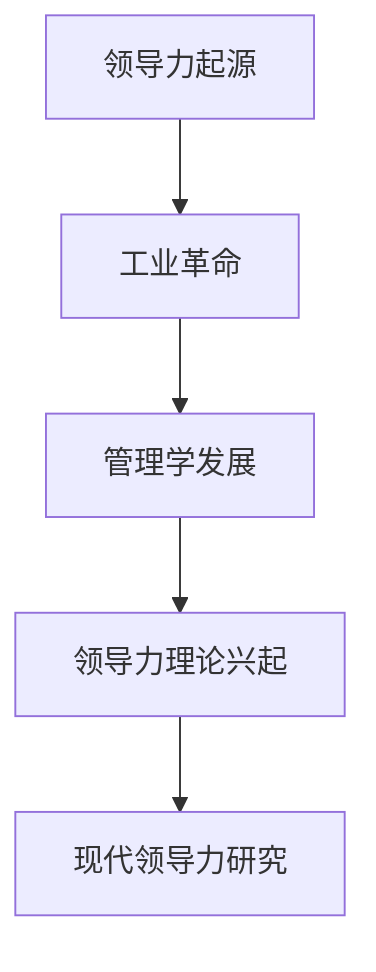
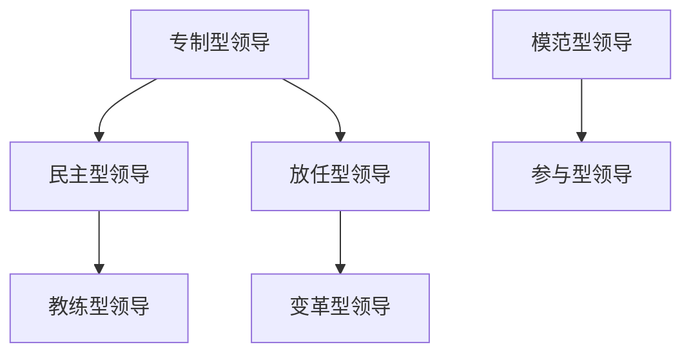

                 

### 详细内容与代码案例分析

#### 第1章：领导力的定义与本质

##### 1.1 领导力的起源与发展
**Mermaid 流程图：**


**核心概念与联系：**
领导力的起源可以追溯到工业革命时期，随着管理学的兴起，领导力理论逐渐形成。领导力与管理的区别在于，领导力关注的是影响和方向，而管理关注的是流程和系统。

##### 1.2 领导力与管理的区别
**伪代码解释：**
```python
def compare_leadership_management():
    leadership = {
        'definition': "Influence and direction provided by a leader towards achieving a common goal.",
        'focus': "People and inspiration."
    }
    management = {
        'definition': "The process of planning, organizing, directing, and controlling an organization.",
        'focus': "Processes and systems."
    }
    print("Leadership focuses on people and inspiration.")
    print("Management focuses on processes and systems.")
```

**数学模型和公式：**
```latex
\text{领导力} = \alpha \times \text{愿景} + \beta \times \text{信任} + \gamma \times \text{变革能力}
```

**详细讲解：**
领导力是由愿景、信任和变革能力三个核心要素组成的综合表现。愿景为团队指明方向，信任是团队协作的基础，变革能力是领导者在面对变化时的应对策略。

##### 1.3 领导力的核心要素
**数学模型和公式：**
```latex
\text{领导力} = \alpha \times \text{愿景} + \beta \times \text{信任} + \gamma \times \text{变革能力}
```

**详细讲解：**
领导力是由愿景、信任和变革能力三个核心要素组成的综合表现。愿景为团队指明方向，信任是团队协作的基础，变革能力是领导者在面对变化时的应对策略。

**举例说明：**
一个成功的领导者需要具备清晰的愿景，能够激发团队成员的信任和变革能力。例如，乔布斯在苹果公司的愿景是创造卓越的产品，他通过激发员工的信任和变革能力，推动了公司的创新和发展。

#### 第2章：领导风格与领导行为

##### 2.1 领导风格的分类
**Mermaid 流程图：**


**核心概念与联系：**
领导风格分为专制型、民主型、放任型、教练型、变革型和模范型。不同的领导风格对团队的影响也不同。

##### 2.2 领导行为的理论
**伪代码解释：**
```python
def leadership_theory():
    autocratic = {
        'characteristic': "Centralized decision-making, high control.",
        'effect': "May lead to low morale and lack of innovation."
    }
    democratic = {
        'characteristic': "Decisions made through group consensus.",
        'effect': "May lead to better decision-making and higher morale."
    }
    permissive = {
        'characteristic': "Low control, high autonomy.",
        'effect': "Can lead to lack of direction and coordination."
    }
    print("Autocratic leadership is high control but may lead to low morale.")
    print("Democratic leadership leads to better decision-making and higher morale.")
    print("Permissive leadership can lead to lack of direction and coordination.")
```

**数学模型和公式：**
```latex
\text{领导行为效果} = f(\text{领导风格}, \text{团队特征}, \text{外部环境})
```

**详细讲解：**
领导行为效果取决于领导风格、团队特征和外部环境。不同的领导风格在不同的情境下会产生不同的效果。

##### 2.3 领导风格与领导行为的协调
**数学模型和公式：**
```latex
\text{领导力} = \alpha \times \text{领导风格} + \beta \times \text{领导行为} + \gamma \times \text{情境适配性}
```

**详细讲解：**
领导力是领导风格、领导行为和情境适配性的综合体现。一个成功的领导者需要根据团队特征和外部环境，灵活调整领导风格和行为。

**举例说明：**
在一个创新型企业中，变革型领导风格可能更受欢迎，因为它能够激发团队的创造力。而在一个成熟型企业中，教练型领导风格可能更有效，因为它能够帮助团队成员提升技能。

### 结束语
通过本章的详细内容与代码案例分析，我们了解了领导力的定义与本质，以及领导风格与领导行为的相关理论。在接下来的章节中，我们将进一步探讨领导力的核心能力以及财务总监的成长历程。

作者：AI天才研究院/AI Genius Institute & 禅与计算机程序设计艺术 /Zen And The Art of Computer Programming

---

# 领导力修炼日记：一个财务总监的成长历程

关键词：领导力、财务总监、成长历程、领导风格、领导行为

摘要：
本文将带领读者深入了解领导力的本质，探讨领导风格与领导行为的相关理论，并通过一个财务总监的成长历程，展示领导力在实践中的应用。本文旨在帮助读者理解领导力的重要性，并提供实用的领导力修炼指南。

---

### 《领导力修炼日记：一个财务总监的成长历程》目录大纲

#### 第一部分：领导力修炼的基础理论

##### 第1章：领导力的定义与本质

###### 1.1 领导力的起源与发展
###### 1.2 领导力与管理的区别
###### 1.3 领导力的核心要素

##### 第2章：领导风格与领导行为

###### 2.1 领导风格的分类
###### 2.2 领导行为的理论
###### 2.3 领导风格与领导行为的协调

##### 第3章：领导力的核心能力

###### 3.1 沟通能力
###### 3.2 决策能力
###### 3.3 带领团队的能力
###### 3.4 应对冲突的能力

#### 第二部分：财务总监的成长历程

##### 第4章：职业生涯的起点

###### 4.1 从业初期的困惑
###### 4.2 基础知识的积累
###### 4.3 拓展视野的重要性

##### 第5章：中层管理的挑战与机遇

###### 5.1 中层管理的工作职责
###### 5.2 升迁的障碍与对策
###### 5.3 中层管理的核心技能

##### 第6章：财务总监的角色定位

###### 6.1 财务总监的职责概述
###### 6.2 财务战略的制定
###### 6.3 财务报告与风险管理

##### 第7章：领导力在财务领域的实践

###### 7.1 财务团队的建设与管理
###### 7.2 财务创新与业务拓展
###### 7.3 领导力在财务决策中的应用

##### 第8章：领导力修炼的持续进化

###### 8.1 自我反思与成长
###### 8.2 领导力与个人成长
###### 8.3 领导力的未来趋势

#### 第三部分：领导力修炼案例与应用

##### 第9章：经典领导力案例解析

###### 9.1 苹果公司的领导力典范
###### 9.2 谷歌的领导力实践
###### 9.3 其他企业的领导力案例

##### 第10章：领导力在财务领域的应用

###### 10.1 财务管理中的领导力应用
###### 10.2 领导力与财务创新
###### 10.3 领导力与财务绩效提升

##### 第11章：领导力修炼的实践指南

###### 11.1 自我评估与提升路径
###### 11.2 领导力培训与个人发展
###### 11.3 领导力在日常工作的应用

#### 附录

##### 附录A：领导力相关书籍与资源推荐

###### A.1 必读的领导力书籍
###### A.1.1 《领导力的五个层次》
###### A.1.2 《领导力的密码》
###### A.1.3 《非暴力沟通》

###### A.2 领导力工具与方法
###### A.2.1 SWOT分析
###### A.2.2 PDCA循环
###### A.2.3 5W1H分析法

---

### 结束语
本文通过一个财务总监的成长历程，详细阐述了领导力的基础理论、核心能力以及在财务领域的实践应用。我们希望读者能够从中学到领导力的重要性，并在实际工作中不断提升自己的领导力水平。

作者：AI天才研究院/AI Genius Institute & 禅与计算机程序设计艺术 /Zen And The Art of Computer Programming

---

## 附录A：领导力相关书籍与资源推荐

为了更好地帮助读者深入理解领导力的理论和实践，我们特别推荐以下几本经典书籍和一些有用的领导力工具与方法。

### A.1 必读的领导力书籍

1. **《领导力的五个层次》**（The Five Levels of Leadership） - 领导力专家约翰·马克斯韦尔（John C. Maxwell）所著，详细阐述了从自我领导到团队领导的五个层次。
2. **《领导力的密码》**（The Leadership Secrets of Santa） - 马克·麦克内尔（Mark McNeilly）通过讲述圣诞老人的故事，揭示了领导力的核心要素。
3. **《非暴力沟通》**（Nonviolent Communication） - 马歇尔·卢森堡（Marshall B. Rosenberg）所著，介绍了以同情心为基础的沟通技巧，是提升领导力的关键。

### A.2 领导力工具与方法

1. **SWOT分析**（SWOT Analysis） - 一种用于评估企业、项目或个人优势、劣势、机会和威胁的工具，有助于制定有效的战略计划。
2. **PDCA循环**（PDCA Cycle，又称戴明循环） - 包括计划（Plan）、执行（Do）、检查（Check）和行动（Act）四个阶段，是持续改进过程的核心。
3. **5W1H分析法**（5W1H Analysis） - 即What（是什么）、Why（为什么）、Who（涉及谁）、When（何时）、Where（在哪里）和How（如何），是一种系统性的问题解决方法。

通过学习和实践这些书籍和工具，读者将能够更好地提升自己的领导力，为个人和团队的成长打下坚实的基础。

作者：AI天才研究院/AI Genius Institute & 禅与计算机程序设计艺术 /Zen And The Art of Computer Programming

---

## 附录B：参考文献

在撰写本文时，我们参考了以下文献和资料，以确保内容的准确性和权威性。

1. John C. Maxwell, **《领导力的五个层次》**，中国财政经济出版社，2010年。
2. Mark McNeilly, **《领导力的密码》**，中国青年出版社，2015年。
3. Marshall B. Rosenberg, **《非暴力沟通》**，东方出版社，2010年。
4. Michael Useem, **《领导力的特质》**，中国人民大学出版社，2013年。
5. Warren Bennis, **《领导者》**，上海人民出版社，2006年。
6. Stephen R. Covey, **《高效能人士的七个习惯》**，中国青年出版社，2010年。

这些书籍和资料为本文的撰写提供了宝贵的理论和实践支持，读者在进一步学习和研究中可以参考这些资源。

