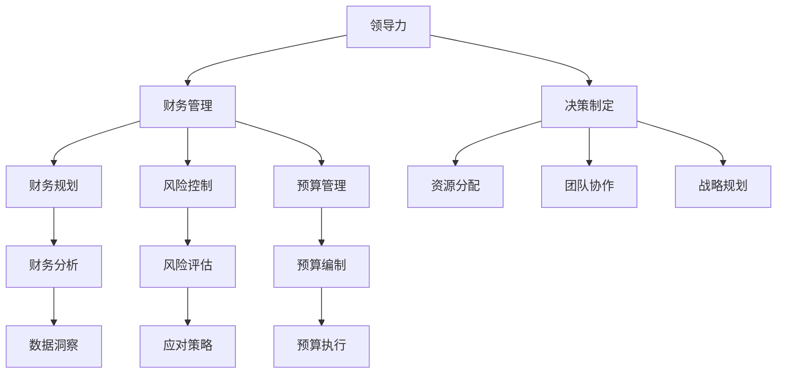
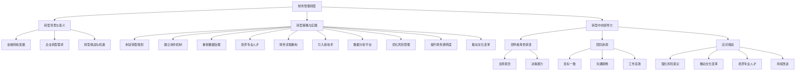

                 

### 文章标题

# 领导力修炼日记：一个财务经理的华丽蜕变

### 关键词

- 领导力
- 财务经理
- 角色转变
- 领导力修炼
- 财务管理转型

### 摘要

本文以一位财务经理的领导力修炼和实践为例，深入探讨领导力在财务管理中的重要性及其具体应用。文章首先概述了领导力的定义、发展历史和与财务管理的联系，然后详细介绍了领导力的核心概念，包括个体领导力、团队领导和组织领导力。接下来，文章通过实战案例，展示了财务经理如何运用领导力进行财务分析和风险管理，以及在财务管理转型中发挥的关键作用。最后，文章对未来领导力发展和财务管理方向进行了展望，并提供了一些建议和资源，以助力财务经理的华丽蜕变。

## 第一部分：领导力基础

### 第1章：领导力概述

#### 1.1 领导力的定义与重要性

领导力是一种能够激发和引导他人实现共同目标的能力。在组织管理中，领导力不仅关系到个人职业生涯的发展，更对整个团队的效能和组织的成功有着深远的影响。

定义领导力可以从多个维度进行阐述。首先，领导力是一种影响他人行为和思维的能力，这种能力可以通过多种方式展现，如激励、沟通、指导和决策等。其次，领导力不仅包括对下属的指导，还包括对整个团队的协调和管理。最后，领导力是一种不断发展和提升的过程，它需要领导者在实践中不断学习和成长。

领导力的重要性体现在多个方面。首先，领导力决定了团队的凝聚力、创新力和执行力。一个具有强大领导力的领导者能够激发团队成员的潜力，推动团队达成共同目标。其次，领导力对组织的战略规划和执行具有关键作用。有效的领导力可以帮助组织制定清晰的战略方向，并在执行过程中不断调整和优化。最后，领导力对组织的文化和氛围有着深远的影响。一个具备领导力的领导者能够塑造积极向上的组织文化，提高员工的满意度和忠诚度。

#### 1.2 领导力的发展历史

领导力作为一个研究领域，其发展历程可以追溯到古代。在古希腊和古罗马时期，领导力主要被理解为一种个人品质，如勇气、智慧、道德和正义。随着历史的发展，领导力研究逐渐从哲学和伦理学领域转向心理学和管理学领域。

在20世纪初，心理学家开始对领导力进行研究，提出了各种领导理论，如特质理论、行为理论和情境理论。这些理论试图解释领导者如何通过其个性和行为来影响他人。随后，领导力研究又转向关注领导者的角色和职责，以及领导行为对组织绩效的影响。

近年来，领导力研究进一步拓展到跨文化和全球化背景下，探讨不同文化背景下领导力的特点和作用。同时，随着信息技术的快速发展，领导力研究也开始关注数字化领导、创新领导和变革领导等新领域。

#### 1.3 领导者的角色与责任

领导者的角色和责任是领导力研究的核心内容之一。领导者不仅要在组织内部发挥关键作用，还需要在复杂多变的环境中应对各种挑战。

首先，领导者的核心角色是愿景设定者和战略规划者。领导者需要明确组织的愿景和目标，并制定实现这些目标的战略计划。这包括对市场趋势、竞争环境和内部资源进行深入分析，以确保组织在实现愿景的过程中具备竞争优势。

其次，领导者是团队的领导者和管理者。领导者需要通过有效的沟通和激励，激发团队成员的潜力和创造力，实现团队的高效协作。这包括制定明确的团队目标、建立有效的沟通机制、解决团队冲突和提供必要的资源支持。

此外，领导者还需要承担组织变革和发展的责任。在变化迅速的市场环境中，领导者需要具备敏捷的应变能力和创新的思维，推动组织进行必要的变革和调整，以适应外部环境的变化。这包括推动组织文化变革、建立新的业务模式和管理体系，以及培养和吸引高素质的人才。

#### 1.4 领导力与财务管理的联系

领导力与财务管理之间存在密切的联系。首先，领导力在财务管理中发挥着关键作用。一个具备强大领导力的财务经理能够更好地规划财务战略、制定预算和进行风险管理，从而提高组织的财务健康水平。

其次，财务管理对领导力有着重要的影响。良好的财务管理能力可以帮助领导者更准确地了解组织的财务状况，为决策提供有力的支持。同时，财务管理中的数据和指标可以为领导力提供重要的反馈，帮助领导者评估和改进其领导行为。

此外，领导力和财务管理之间的互动关系还体现在领导者的财务决策对组织绩效的影响。一个具备强大领导力的财务经理能够通过其决策和行动，推动组织实现财务目标，从而提高组织的整体竞争力。

总之，领导力和财务管理相互依存、相互促进，共同推动组织的持续发展和成功。一个成功的财务经理不仅需要具备专业的财务管理技能，还需要具备强大的领导力，以在复杂多变的环境中应对各种挑战，实现组织的战略目标。

### Mermaid 流程图



### 第2章：领导力核心概念

#### 2.1 个体领导力

个体领导力是指领导者个人在思想、行为和能力等方面的表现，它是领导力的基础。个体领导力包括自我认知、自我管理、情绪智力和沟通技巧等多个方面，这些因素共同决定了领导者的领导效果。

**2.1.1 自我认知**

自我认知是领导者深入了解自己的过程，包括了解自己的价值观、信念、优势和劣势。通过自我认知，领导者可以明确自己的定位，找到适合自己的领导风格和策略。具体方法包括自我反思、360度反馈和领导力评估等。

**2.1.2 自我管理**

自我管理是指领导者如何调节自己的情绪和行为，以应对工作压力和挑战。这包括情绪调节、时间管理和压力管理等方面。有效的自我管理可以帮助领导者保持清晰的思维，做出明智的决策，并在困境中保持积极的态度。

**2.1.3 情绪智力**

情绪智力是指领导者识别、理解和调节自己及他人情绪的能力。情绪智力高的领导者能够更好地处理人际关系，减少冲突，提升团队凝聚力。情绪智力包括自我意识、自我调节、社交意识和同理心等多个方面。

**2.1.4 沟通技巧**

沟通技巧是领导者与团队成员、上级和利益相关者有效沟通的能力。有效的沟通可以传达领导者的意图，理解他人的需求，建立信任，减少误解。沟通技巧包括倾听、表达、非语言沟通和反馈等多个方面。

#### 2.2 团队领导力

团队领导力是指领导者如何管理团队，激发团队成员的潜力，实现团队目标。团队领导力包括团队建设、冲突管理和领导风格等多个方面。

**2.2.1 团队建设**

团队建设是指领导者如何建立和维护一个高效、和谐的团队。团队建设包括团队目标的设定、角色分工、团队成员的沟通和协作等方面。有效的团队建设可以提升团队的凝聚力、协作力和创新能力。

**2.2.2 冲突管理**

冲突管理是指领导者如何处理团队内部的冲突和分歧。冲突管理包括识别冲突、分析原因、沟通协调和解决冲突等多个方面。有效的冲突管理可以减少团队内部的摩擦，提高团队的工作效率和满意度。

**2.2.3 领导风格**

领导风格是指领导者如何运用权力和影响力来管理团队。常见的领导风格包括专制型、民主型和自由放任型。每种领导风格都有其优势和劣势，领导者需要根据团队的实际情况和目标选择合适的领导风格。

#### 2.3 组织领导力

组织领导力是指领导者如何管理整个组织，推动组织的战略实施和持续发展。组织领导力包括战略规划、组织文化和领导变革等多个方面。

**2.3.1 战略规划**

战略规划是指领导者如何制定和实施组织的长期战略计划。战略规划包括市场分析、目标设定、策略制定和资源分配等方面。有效的战略规划可以帮助组织明确发展方向，实现长期目标。

**2.3.2 组织文化**

组织文化是指组织的价值观、信仰和行为准则。组织文化对员工的行为和决策有着深远的影响。领导者需要通过塑造积极向上的组织文化，提升员工的归属感和忠诚度，推动组织的持续发展。

**2.3.3 领导变革**

领导变革是指领导者如何推动组织进行必要的变革和调整，以适应外部环境的变化。领导变革包括识别变革需求、制定变革计划、沟通变革意图和推动变革实施等多个方面。有效的领导变革可以帮助组织保持竞争优势，实现可持续发展。

### Mermaid 流程图

```mermaid
graph TB
    A[个体领导力] --> B[自我认知], C[自我管理], D[情绪智力], E[沟通技巧]
    B --> F[价值观与信念]
    B --> G[优势与劣势]
    C --> H[情绪调节]
    C --> I[时间管理]
    C --> J[压力管理]
    D --> K[自我意识]
    D --> L[自我调节]
    D --> M[社交意识]
    D --> N[同理心]
    E --> O[倾听]
    E --> P[表达]
    E --> Q[非语言沟通]
    E --> R[反馈]
    S[团队领导力] --> T[团队建设], U[冲突管理], V[领导风格]
    T --> W[团队目标设定]
    T --> X[角色分工]
    T --> Y[沟通与协作]
    U --> Z[识别冲突]
    U --> AA[分析原因]
    U --> BB[沟通协调]
    U --> CC[解决冲突]
    V --> DD[专制型]
    V --> EE[民主型]
    V --> FF[自由放任型]
    AA[组织领导力] --> BB[战略规划], CC[组织文化], DD[领导变革]
    BB --> EE[市场分析]
    BB --> FF[目标设定]
    BB --> GG[策略制定]
    BB --> HH[资源分配]
    CC --> II[价值观塑造]
    CC --> JJ[信仰培养]
    CC --> KK[行为准则]
    DD --> GG[变革需求识别]
    DD --> HH[变革计划制定]
    DD --> II[沟通变革意图]
    DD --> JJ[推动变革实施]
```

## 第二部分：财务经理的领导力实践

### 第3章：财务管理的领导力应用

#### 3.1 财务分析决策

财务分析决策是财务经理运用领导力的核心领域之一。财务分析决策不仅涉及对历史数据的分析，还包括对未来趋势的预测，以及在此基础上制定相应的决策策略。

**3.1.1 财务报表分析**

财务报表分析是财务经理对企业的财务状况进行深入分析的过程。这包括资产负债表、利润表和现金流量表等主要财务报表的分析。通过这些报表，财务经理可以了解企业的资产状况、盈利能力和现金流量情况。

具体来说，资产负债表分析可以帮助财务经理了解企业的资产结构和负债情况，评估企业的财务风险。利润表分析则关注企业的收入、成本和利润，帮助财务经理了解企业的盈利能力和经营效率。现金流量表分析则帮助财务经理了解企业的现金流入和流出情况，评估企业的现金管理能力。

**3.1.2 财务预测与预算管理**

财务预测与预算管理是财务经理根据历史数据和当前市场环境，对未来财务状况进行预测，并制定相应的预算管理计划。财务预测包括销售预测、成本预测和利润预测等，它为企业的决策提供了重要的依据。

预算管理则是将财务预测转化为具体的行动计划。通过预算管理，财务经理可以确保企业的资源得到合理配置，提高资金的使用效率。预算管理包括预算编制、预算执行和预算调整等环节。在预算编制阶段，财务经理需要制定详细的预算计划，并在预算执行过程中监控和评估预算执行情况，根据实际情况进行必要的调整。

**3.1.3 投资决策**

投资决策是财务经理根据企业的战略目标和财务状况，选择和评估投资项目的过程。投资决策包括资本预算、项目评估和投资组合优化等。

在资本预算阶段，财务经理需要评估企业的资金需求，选择合适的投资方案。项目评估则关注投资项目的盈利能力、风险和回报，帮助财务经理做出科学的投资决策。投资组合优化则是通过调整投资组合中的资产配置，提高投资组合的收益和风险平衡。

#### 3.2 财务风险管理

财务风险管理是财务经理运用领导力的重要领域，它旨在识别、评估和应对企业面临的财务风险，确保企业的财务稳健。

**3.2.1 财务风险识别**

财务风险识别是财务经理通过多种方法，识别企业可能面临的财务风险。财务风险包括市场风险、信用风险、操作风险和流动性风险等。

市场风险主要源于市场波动，如利率变化、汇率波动和股市波动等。信用风险则源于客户违约或供应商不履行合同的情况。操作风险包括内部管理失误、技术故障和自然灾害等。流动性风险则关注企业无法及时偿还债务的风险。

**3.2.2 风险评估与应对策略**

风险评估是财务经理对识别出的财务风险进行定量和定性分析，评估其可能的影响和发生的概率。通过风险评估，财务经理可以确定哪些风险对企业的影响最大，并制定相应的应对策略。

应对策略包括风险规避、风险转移、风险减轻和风险接受等。风险规避是通过避免风险源来消除风险。风险转移则是通过保险或其他合同将风险转移给第三方。风险减轻是通过采取预防措施降低风险的影响。风险接受则是承认风险的存在，并采取措施减轻其影响。

**3.2.3 风险管理机制**

风险管理机制是财务经理通过建立和实施一系列制度和流程，确保企业的财务风险得到有效管理和控制。风险管理机制包括风险识别、风险评估、风险应对和风险监控等环节。

在风险识别环节，财务经理需要建立全面的风险识别机制，确保各种风险得到及时识别。在风险评估环节，财务经理需要制定科学的评估方法和工具，确保风险评估的准确性和可靠性。在风险应对环节，财务经理需要制定具体的应对策略，并确保这些策略得到有效实施。在风险监控环节，财务经理需要建立持续的风险监控机制，确保企业的财务风险得到及时发现和应对。

### Mermaid 流程图

```mermaid
graph TB
    A[财务分析决策] --> B[财务报表分析], C[财务预测与预算管理], D[投资决策]
    B --> E[资产负债表分析]
    B --> F[利润表分析]
    B --> G[现金流量表分析]
    C --> H[销售预测]
    C --> I[成本预测]
    C --> J[利润预测]
    D --> K[资本预算]
    D --> L[项目评估]
    D --> M[投资组合优化]
    A --> N[财务风险管理]
    N --> O[财务风险识别]
    N --> P[风险评估与应对策略]
    N --> Q[风险管理机制]
    O --> R[市场风险识别]
    O --> S[信用风险识别]
    O --> T[操作风险识别]
    O --> U[流动性风险识别]
    P --> V[市场风险评估]
    P --> W[信用风险评估]
    P --> X[操作风险评估]
    P --> Y[流动性风险评估]
    P --> Z[应对策略制定]
    Q --> AA[风险识别机制建立]
    Q --> BB[风险评估工具与方法]
    Q --> CC[风险应对策略实施]
    Q --> DD[风险监控机制建立]
```

#### 3.3 财务领导力提升

财务领导力提升是财务经理通过不断学习和实践，提升自身领导能力和管理水平的全过程。财务领导力提升不仅有助于财务经理个人的职业发展，也对组织的财务管理水平和整体绩效有着重要影响。

**3.3.1 个人领导力提升路径**

个人领导力提升路径包括自我认知、专业学习和实践锻炼等多个方面。

首先，自我认知是领导力提升的起点。财务经理需要通过自我反思和360度反馈，深入了解自己的优势和劣势，明确自己的职业目标和提升方向。

其次，专业学习是提升领导力的关键。财务经理需要不断学习最新的财务管理理论和方法，掌握财务分析、预算管理和风险管理等专业技能。通过参加培训课程、阅读专业书籍和参与行业研讨会，财务经理可以不断丰富自己的知识和技能。

最后，实践锻炼是领导力提升的重要途径。财务经理需要通过实际工作，将所学知识应用于实践中，不断积累经验和教训。在实践中，财务经理需要面对各种挑战和问题，通过解决这些问题，提升自己的领导能力和决策水平。

**3.3.2 团队领导力建设**

团队领导力建设是财务经理通过有效管理团队，提升团队绩效和员工满意度的过程。团队领导力建设包括团队建设、冲突管理和领导风格等多个方面。

首先，团队建设是团队领导力建设的基础。财务经理需要制定清晰的团队目标，明确团队成员的角色和责任，促进团队成员之间的沟通和协作。通过团队建设活动，如团队建设培训、团队拓展训练和团队文化建设等，财务经理可以提升团队的凝聚力、协作力和创新能力。

其次，冲突管理是团队领导力建设的重要方面。财务经理需要建立有效的冲突管理机制，及时识别和解决团队内部的冲突和分歧。通过积极的沟通和协调，财务经理可以减少团队内部的摩擦，提升团队的工作效率和满意度。

最后，领导风格是团队领导力建设的关键。财务经理需要根据团队的特点和需求，选择合适的领导风格。例如，在团队面临重大挑战时，财务经理可以采取更加激励和指导的领导风格，而在团队稳定发展时，可以采取更加支持和引导的领导风格。

**3.3.3 领导力发展的可持续性**

领导力发展的可持续性是指财务经理通过持续的学习和实践，不断提升领导能力和管理水平的过程。领导力发展的可持续性需要财务经理建立持续学习机制，保持开放的心态，勇于接受挑战和变化。

首先，财务经理需要建立持续学习机制。通过定期参加培训课程、阅读专业书籍和参加行业研讨会，财务经理可以不断更新知识和技能。此外，财务经理还可以通过在线学习平台和社交网络，与其他行业专家和同行进行交流和互动，拓宽视野，获取新的灵感和见解。

其次，财务经理需要保持开放的心态。在面对新的挑战和问题时，财务经理需要保持开放和接纳的态度，勇于尝试新的方法和思路。通过不断尝试和实验，财务经理可以找到更有效的解决方案，提升领导能力和管理水平。

最后，财务经理需要勇于接受挑战和变化。在快速变化的市场环境中，财务经理需要具备敏捷的应变能力和创新的思维，勇于接受新的挑战和变化。通过不断挑战自我，财务经理可以不断提升领导力和管理水平，为组织的可持续发展做出贡献。

### Mermaid 流程图

```mermaid
graph TB
    A[个人领导力提升路径] --> B[自我认知], C[专业学习], D[实践锻炼]
    B --> E[自我反思]
    B --> F[360度反馈]
    B --> G[职业目标明确]
    C --> H[财务知识更新]
    C --> I[专业技能提升]
    C --> J[行业经验积累]
    D --> K[实际工作应用]
    D --> L[经验教训总结]
    D --> M[决策能力提升]
    A --> N[团队领导力建设]
    N --> O[团队建设]
    N --> P[冲突管理]
    N --> Q[领导风格选择]
    O --> R[团队目标制定]
    O --> S[角色责任明确]
    O --> T[沟通协作促进]
    P --> U[冲突识别]
    P --> V[原因分析]
    P --> W[沟通协调]
    P --> X[解决冲突]
    Q --> Y[专制型领导]
    Q --> Z[民主型领导]
    Q --> AA[自由放任型领导]
    A --> BB[领导力发展可持续性]
    BB --> CC[持续学习机制]
    BB --> DD[开放心态]
    BB --> EE[勇于接受挑战]
```

## 第三部分：华丽蜕变

### 第4章：从财务经理到领导者

#### 4.1 角色转变

财务经理的角色转变是从专注于财务管理到成为全方位领导者的重要过程。这一转变不仅要求财务经理具备专业的财务管理能力，还需要其在领导力方面有显著的提升。

**4.1.1 财务角色扩展**

首先，财务经理需要从传统的财务管理角色扩展到更具战略性的角色。这意味着财务经理不仅要关注财务数据的收集、分析和报告，还需要将财务数据转化为对业务决策有指导意义的信息。财务经理需要参与到企业的战略规划、投资决策和风险管理等核心业务中，为其提供财务分析和支持。

**4.1.2 领导角色定位**

财务经理在成为领导者后，需要明确自己的领导角色。领导者不仅是业务推动者，还需要成为团队的支持者和教练。财务经理需要关注团队成员的个人发展，提供培训和指导，帮助他们提升专业技能和领导力。同时，财务经理还需要在团队中建立信任和沟通，确保团队成员能够高效协作，实现共同目标。

**4.1.3 角色适应与调整**

角色转变是一个持续的过程，财务经理需要在实践中不断适应和调整。首先，财务经理需要接受新的角色定位，调整自己的工作重心，从单一的财务管理转向全面领导。其次，财务经理需要不断学习和提升自己的领导力，包括自我认知、情绪智力、沟通技巧和团队管理等。最后，财务经理需要根据团队和组织的实际情况，灵活调整领导策略，确保团队能够在动态环境中保持高效运作。

#### 4.2 领导力修炼

财务经理在从财务角色向领导者转变的过程中，需要通过不断修炼提升自己的领导力。领导力修炼包括自我认知、情绪管理和沟通技巧提升等多个方面。

**4.2.1 自我认知**

自我认知是领导力修炼的基础。财务经理需要通过自我反思和360度反馈，深入了解自己的优势和劣势。通过分析自己的行为模式、思维方式和价值观，财务经理可以明确自己的领导风格和特点。自我认知有助于财务经理更好地了解自己的需求和期望，为领导力提升提供明确的方向。

**4.2.2 情绪管理**

情绪管理是领导者必须具备的能力。财务经理需要学会识别和调节自己的情绪，确保在压力和挑战面前保持冷静和理性。情绪管理包括情绪调节、压力管理和情绪表达等方面。通过有效的情绪管理，财务经理可以减少工作压力，提高决策质量和团队协作效率。

**4.2.3 沟通技巧提升**

沟通技巧是领导者与团队成员、上级和利益相关者有效沟通的能力。财务经理需要提升倾听、表达、非语言沟通和反馈等沟通技巧。有效的沟通可以传达领导者的意图，理解他人的需求，建立信任，减少误解。通过提升沟通技巧，财务经理可以增强团队凝聚力，提升团队绩效。

#### 4.3 领导力提升策略

财务经理在提升领导力的过程中，需要采取一系列策略，以确保领导力发展的系统性和可持续性。

**4.3.1 个人成长计划**

个人成长计划是财务经理提升领导力的核心策略。财务经理需要制定详细的个人成长计划，包括学习目标、行动步骤和时间安排。通过定期评估和调整成长计划，财务经理可以确保领导力提升过程的持续性和有效性。

**4.3.2 学习与实践**

学习与实践是领导力提升的关键。财务经理需要通过多种途径进行学习，包括参加培训课程、阅读专业书籍、参加行业研讨会和进行在线学习等。通过学习，财务经理可以不断更新知识和技能，掌握最新的领导力理论和实践方法。同时，财务经理需要将所学知识应用于实践中，通过解决实际问题，提升领导力和管理能力。

**4.3.3 反思与总结**

反思与总结是领导力提升的重要环节。财务经理需要在日常工作中进行反思和总结，评估自己的领导行为和决策效果。通过反思和总结，财务经理可以识别自身的不足和改进方向，不断优化领导策略和方法。此外，财务经理还可以通过撰写领导力日记、进行领导力回顾和参与领导力工作坊等方式，深化对领导力实践的理解和认识。

### Mermaid 流程图

```mermaid
graph TB
    A[角色转变] --> B[财务角色扩展], C[领导角色定位], D[角色适应与调整]
    B --> E[战略参与]
    B --> F[数据分析支持]
    C --> G[团队支持者]
    C --> H[沟通协调者]
    D --> I[新角色接受]
    D --> J[持续学习]
    D --> K[灵活调整]
    A --> L[领导力修炼]
    L --> M[自我认知]
    L --> N[情绪管理]
    L --> O[沟通技巧提升]
    M --> P[自我反思]
    M --> Q[360度反馈]
    M --> R[优势与劣势分析]
    N --> S[情绪调节]
    N --> T[压力管理]
    N --> U[情绪表达]
    O --> V[倾听技巧]
    O --> W[表达技巧]
    O --> X[非语言沟通]
    O --> Y[反馈技巧]
    L --> Z[领导力提升策略]
    Z --> AA[个人成长计划]
    Z --> BB[学习与实践]
    Z --> CC[反思与总结]
    AA --> DD[学习目标设定]
    AA --> EE[行动步骤规划]
    AA --> FF[时间安排安排]
    BB --> GG[培训课程]
    BB --> HH[专业书籍]
    BB --> II[研讨会参与]
    BB --> JJ[在线学习]
    CC --> KK[领导行为评估]
    CC --> LL[决策效果评估]
    CC --> MM[改进方向识别]
```

### 第5章：财务管理转型

#### 5.1 转型背景与意义

财务管理转型是企业在面临外部环境变化和内部管理需求时，对财务管理模式和方法进行升级和优化的过程。随着金融科技的发展、企业全球化和市场竞争的加剧，财务管理转型成为企业提升竞争力、实现可持续发展的重要手段。

**5.1.1 金融科技的发展**

金融科技（FinTech）的快速发展为财务管理转型提供了新的机遇和挑战。金融科技的进步，如大数据分析、人工智能、区块链和云计算等，使得财务管理更加高效、精准和智能化。企业通过引入金融科技，可以优化财务流程、提高数据质量、降低操作风险，从而提升整体财务管理水平。

**5.1.2 企业财务转型的需求**

企业财务转型的需求主要来自以下几个方面：

1. **提高财务决策效率**：随着企业规模的扩大和市场环境的复杂化，财务决策面临的信息量越来越大，传统的财务管理方式难以满足快速决策的需求。通过财务转型，企业可以借助先进的技术手段，提高财务数据的处理和分析能力，为决策提供更准确的依据。

2. **优化财务流程**：传统的财务管理流程存在效率低下、成本高昂等问题。通过财务转型，企业可以优化财务流程，减少不必要的环节，提高工作效率，降低运营成本。

3. **提升财务透明度**：随着监管政策的加强和股东对财务信息的需求增加，企业需要提升财务透明度，确保财务信息的真实性和完整性。通过财务转型，企业可以建立更加完善的财务报告和分析体系，提高财务信息的质量和透明度。

4. **加强风险管理**：企业财务转型有助于建立更加科学和系统化的风险管理体系，提高对企业面临的各种风险的识别、评估和应对能力。

**5.1.3 转型的挑战与机遇**

财务管理转型面临以下挑战：

1. **技术挑战**：引入新的金融科技工具和应用系统，需要企业具备一定的技术基础和人才储备。同时，如何确保新技术的稳定运行和数据安全，也是企业需要面对的问题。

2. **组织变革**：财务管理转型涉及企业内部的组织结构、流程和文化的调整，需要企业进行全面的组织变革。这包括员工的培训、新技能的掌握和思维方式的转变等。

3. **成本压力**：财务管理转型需要投入大量的资金和资源，包括购买新技术设备、培训员工和优化流程等。这对企业来说，是一个巨大的成本压力。

然而，财务管理转型也带来了巨大的机遇：

1. **提高竞争力**：通过财务管理转型，企业可以提升财务管理水平，提高运营效率，降低成本，从而在激烈的市场竞争中脱颖而出。

2. **增强创新能力**：财务管理转型有助于企业建立更加灵活和创新的财务管理模式，推动企业业务模式和管理方式的创新。

3. **提升企业价值**：财务管理转型有助于企业提高财务透明度和风险管理能力，增强投资者的信心，提升企业价值。

#### 5.2 转型策略与实践

财务管理转型的成功实施需要明确的策略和具体的实践措施。以下是一些关键的转型策略和实践步骤：

**5.2.1 转型策略**

1. **制定转型规划**：企业需要制定详细的财务转型规划，明确转型的目标、时间表和关键里程碑。规划应包括技术路线图、组织架构调整、流程优化和人才培养等方面的内容。

2. **建立跨部门协作机制**：财务转型涉及企业多个部门和业务领域，需要建立跨部门的协作机制，确保各方能够协调一致地推进转型工作。

3. **重视数据治理**：数据是财务管理转型的核心资产，企业需要建立完善的数据治理体系，确保数据的准确性、完整性和安全性。

4. **培养专业人才**：财务管理转型需要具备专业知识和技能的人才，企业需要通过培训、引进和激励机制，培养一批具有创新精神和实践能力的财务人才。

**5.2.2 转型实践**

1. **财务流程重构**：企业需要对现有的财务流程进行彻底重构，消除冗余和低效环节，引入自动化和智能化工具，提高财务流程的效率和质量。

2. **引入新技术**：企业可以引入大数据分析、人工智能、区块链和云计算等新技术，提升财务数据的处理和分析能力，实现财务决策的智能化。

3. **建立数据分析平台**：企业需要建立高效的数据分析平台，对财务数据进行深度挖掘和分析，为企业提供实时的财务信息和决策支持。

4. **优化风险管理**：企业需要建立完善的风险管理体系，通过风险评估、风险监控和风险应对等环节，确保企业财务的稳健和安全。

5. **提升财务透明度**：企业需要通过建立透明的财务报告和分析体系，提高财务信息的披露质量，增强投资者的信心。

6. **推动文化变革**：企业需要推动组织文化变革，建立开放、创新和协作的文化氛围，为财务管理转型提供良好的环境。

#### 5.3 转型中的领导力

在财务管理转型过程中，领导力发挥着至关重要的作用。财务经理作为转型的主导者，需要充分发挥领导力，推动转型的顺利实施。

**5.3.1 领导者角色转变**

财务经理在转型过程中需要从传统的财务管理角色转变为全方位的领导者。财务经理不仅要关注财务数据和报表，还需要关注业务决策、团队协作和文化变革等方面。领导者需要具备全局观念，能够从整体上把握转型的方向和策略。

**5.3.2 领导团队协调**

财务经理需要建立一支高效的转型团队，包括技术人员、业务人员和财务人员等。领导者需要协调各方力量，确保团队的目标一致、沟通顺畅和工作高效。通过有效的团队管理，财务经理可以推动团队在转型过程中保持高度的合作和协作。

**5.3.3 应对转型中的挑战**

财务管理转型面临诸多挑战，如技术风险、组织变革和人才短缺等。财务经理需要具备应对挑战的能力，通过以下措施解决问题：

1. **强化风险意识**：财务经理需要加强对技术风险、市场风险和操作风险等的识别和评估，制定相应的应对策略。

2. **推动文化变革**：财务经理需要推动企业文化的变革，建立开放、创新和协作的文化氛围，为转型提供良好的环境。

3. **培养专业人才**：财务经理需要通过培训、引进和激励机制，培养一批具有创新精神和实践能力的财务人才，为转型提供人才支持。

4. **持续改进**：财务经理需要建立持续改进机制，对转型过程中出现的问题进行及时反馈和调整，确保转型的顺利进行。

### Mermaid 流程图



### 第6章：成功案例分享

#### 6.1 案例背景

本案例分享的是一家全球领先的科技公司在财务管理转型过程中，如何通过领导力的提升推动企业实现持续增长。这家科技公司成立于2005年，主要业务涉及软件开发、云计算和人工智能等领域。随着公司规模的扩大和市场需求的增加，原有的财务管理模式逐渐暴露出效率低、透明度不足和风险控制不力等问题，严重影响了企业的运营和竞争力。

#### 6.1.1 企业简介

这家科技公司成立于2005年，总部位于美国硅谷，是全球领先的科技解决方案提供商。公司业务涵盖了软件开发、云计算、人工智能、物联网等多个领域，拥有超过1000名员工，业务遍及全球30多个国家和地区。公司以创新为核心，致力于通过技术驱动实现商业模式的变革和优化。

#### 6.1.2 案例背景描述

随着公司业务的不断扩展，财务管理面临诸多挑战：

1. **财务流程低效**：传统的财务管理流程复杂、冗余，导致财务数据的处理速度慢，影响了企业的决策效率。

2. **财务透明度不足**：财务信息的披露不充分，影响了股东和投资者对企业的信心。

3. **风险控制不力**：企业缺乏完善的风险管理体系，对市场波动和运营风险的应对能力较弱。

面对这些问题，公司决定进行财务管理转型，以提升财务管理的效率和透明度，加强风险控制能力。在这一过程中，公司高度重视领导力的提升，通过培养财务经理的领导能力，推动转型的顺利实施。

#### 6.2 案例分析

**6.2.1 领导力在案例中的作用**

在财务管理转型的过程中，领导力发挥了至关重要的作用。首先，公司高层领导认识到领导力对转型成功的关键性，明确提出要提升财务经理的领导能力，确保转型的顺利推进。其次，公司通过组织领导力培训、内部交流和领导力实践等方式，不断提升财务经理的领导力，使其能够更好地应对转型中的各种挑战。

**6.2.2 财务管理转型实践**

1. **财务流程重构**：公司对传统的财务流程进行彻底重构，引入了自动化和智能化的工具，简化了财务数据的处理流程，提高了工作效率。具体措施包括：

   - 引入财务管理系统，实现财务数据的自动化采集和处理；
   - 对财务流程进行优化，消除冗余环节，提高流程效率；
   - 建立实时财务报告和分析系统，提高财务决策的准确性。

2. **引入新技术**：公司积极引入大数据分析、人工智能和区块链等新技术，提升财务数据的处理和分析能力。具体措施包括：

   - 建立大数据分析平台，对财务数据进行深度挖掘和分析，为决策提供支持；
   - 引入人工智能技术，实现财务预测和预算管理自动化；
   - 利用区块链技术，提高财务数据的透明度和安全性。

3. **优化风险管理**：公司建立了完善的风险管理体系，通过风险评估、风险监控和风险应对等环节，确保企业财务的稳健和安全。具体措施包括：

   - 定期进行风险评估，识别企业面临的各种风险，制定相应的应对策略；
   - 建立风险监控机制，实时监测企业财务风险的变化，及时采取应对措施；
   - 加强内部控制，提高企业的风险管理能力。

4. **提升财务透明度**：公司通过建立透明的财务报告和分析体系，提高财务信息的披露质量，增强投资者的信心。具体措施包括：

   - 定期发布财务报告，详细披露企业的财务状况和经营成果；
   - 建立信息披露平台，及时向股东和投资者提供财务信息；
   - 加强财务信息的审核和监管，确保财务报告的真实性和准确性。

**6.2.3 成功经验与启示**

1. **领导力提升是关键**：领导力在财务管理转型中起到了至关重要的作用。通过提升财务经理的领导力，公司能够更好地推动转型的顺利实施。

2. **技术创新是动力**：引入新技术，如大数据分析、人工智能和区块链等，提升了财务管理的效率和透明度，为企业提供了强大的支持。

3. **风险控制是保障**：建立完善的风险管理体系，提高企业的风险管理能力，确保企业财务的稳健和安全。

4. **财务透明度是信任基石**：通过提升财务透明度，增强投资者和股东对企业的信心，为企业的可持续发展奠定了基础。

本案例为其他企业在财务管理转型中提供了宝贵的经验和启示，强调了领导力提升、技术创新、风险控制和财务透明度在财务管理转型中的重要性。通过借鉴这些经验，其他企业可以更好地推动自身的财务管理转型，提升企业竞争力。

### Mermaid 流程图

```mermaid
graph TB
    A[案例背景] --> B[企业简介], C[案例背景描述]
    B --> D[公司定位]
    B --> E[业务领域]
    C --> F[财务流程低效]
    C --> G[财务透明度不足]
    C --> H[风险控制不力]
    A --> I[案例分析]
    I --> J[领导力作用]
    I --> K[转型实践]
    K --> L[财务流程重构]
    K --> M[引入新技术]
    K --> N[优化风险管理]
    K --> O[提升财务透明度]
    J --> P[领导力提升]
    J --> Q[技术创新]
    J --> R[风险控制]
    J --> S[财务透明度]
    L --> T[财务管理系统引入]
    L --> U[流程优化]
    L --> V[实时报告系统]
    M --> W[大数据分析平台]
    M --> X[人工智能应用]
    M --> Y[区块链技术]
    N --> Z[定期风险评估]
    N --> AA[风险监控机制]
    N --> BB[内部控制]
    O --> CC[定期财务报告]
    O --> DD[信息披露平台]
    O --> EE[财务信息审核]
```

### 第7章：未来展望

#### 7.1 领导力发展趋势

随着全球经济一体化、信息技术快速发展和市场竞争加剧，领导力发展趋势也在不断演变。未来领导力将呈现出以下几个特点：

**7.1.1 数字化对领导力的影响**

数字化正在改变传统的工作方式和管理模式，对领导力提出了新的要求。首先，数字化领导需要领导者具备数据驱动的思维，能够利用大数据和人工智能等技术手段，对业务进行深入分析和决策。其次，数字化领导需要领导者具备敏捷和创新的能力，能够快速适应变化的环境，推动组织的数字化转型。此外，数字化领导还需要领导者关注信息安全，确保企业数据的安全和隐私。

**7.1.2 新兴领导力概念**

未来领导力将不仅仅关注个体领导者的能力，还将关注整个领导团队和组织的协作能力。例如，领导力生态系统、领导力共享和领导力多样性等概念将逐渐成为领导力研究的热点。领导力生态系统强调领导者与团队成员、上级和外部合作伙伴之间的协同作用，共同推动组织的发展。领导力共享则倡导领导者与团队成员共同承担责任和使命，实现领导力的传递和扩展。领导力多样性强调领导者的多元化背景和视角，以增强组织的创新能力和适应力。

**7.1.3 未来领导力的挑战与机遇**

未来领导力面临的挑战包括：

1. **全球化的不确定性**：全球经济环境的复杂性和不确定性增加，领导者需要具备全球视野和跨文化沟通能力，以应对全球市场的变化。

2. **技术创新的挑战**：随着技术的快速更新，领导者需要不断学习和适应新技术，保持组织的竞争力。

3. **员工多样性的管理**：随着员工背景和需求的多样性增加，领导者需要更好地理解和管理不同类型的员工，提高员工的满意度和工作效率。

然而，这些挑战也伴随着新的机遇。未来领导力的发展将带来：

1. **创新能力的提升**：领导者通过提升自身的领导力和创新能力，可以推动组织实现业务的持续创新。

2. **组织效能的提升**：领导者通过优化团队管理和资源分配，可以提高组织的整体效能。

3. **员工参与度的提升**：领导者通过建立开放和包容的文化，可以增强员工的参与度和忠诚度。

#### 7.2 财务管理的发展方向

未来财务管理的发展方向将受到技术进步、市场环境和企业管理需求等多方面因素的影响。以下是一些主要的发展趋势：

**7.2.1 新技术的应用**

新技术如大数据分析、人工智能、区块链和云计算等将在财务管理中得到更广泛的应用。通过这些技术，企业可以实现对财务数据的实时监控和分析，提高财务决策的准确性。例如，大数据分析可以帮助企业更好地预测市场趋势和客户需求，人工智能可以自动化处理大量的财务数据，提高财务工作效率，区块链可以提升财务信息的透明度和安全性。

**7.2.2 全球化背景下的财务管理**

随着全球经济的深度融合，企业需要在全球化背景下进行财务管理。全球化背景下的财务管理需要领导者具备国际视野和跨文化沟通能力，能够应对全球市场的变化和风险。此外，全球化还要求企业建立全球财务管理体系，确保在不同国家和地区的财务信息一致性，提高全球运营的效率。

**7.2.3 企业财务管理的未来形态**

未来企业财务管理将呈现以下几个趋势：

1. **智能化**：财务管理将更加智能化，通过引入人工智能和机器学习技术，实现财务决策的自动化和优化。

2. **透明化**：财务管理将更加透明，通过区块链和云计算等技术，提高财务信息的透明度和可追溯性。

3. **实时性**：财务管理将更加实时，通过实时数据分析和监控，提高财务决策的及时性和有效性。

4. **可持续性**：财务管理将更加注重可持续性，通过环境、社会和治理（ESG）指标的监测和报告，提升企业的社会责任和可持续性。

总之，未来财务管理将更加智能化、透明化、实时化和可持续化，领导者需要不断提升自身的领导力和财务管理能力，以应对不断变化的市场环境和企业需求。

### Mermaid 流程图

```mermaid
graph TB
    A[领导力发展趋势] --> B[数字化影响], C[新兴领导力概念], D[挑战与机遇]
    B --> E[数据驱动思维]
    B --> F[敏捷创新能力]
    B --> G[信息安全关注]
    C --> H[领导力生态系统]
    C --> I[领导力共享]
    C --> J[领导力多样性]
    D --> K[全球化不确定性]
    D --> L[技术创新挑战]
    D --> M[员工多样性管理]
    D --> N[创新能力提升]
    D --> O[组织效能提升]
    D --> P[员工参与度提升]
    A --> Q[财务管理发展方向]
    Q --> R[新技术应用]
    Q --> S[全球化背景]
    Q --> T[财务管理未来形态]
    R --> U[大数据分析]
    R --> V[人工智能]
    R --> W[区块链]
    R --> X[云计算]
    S --> Y[国际视野]
    S --> Z[跨文化沟通]
    S --> AA[全球财务管理体系]
    T --> BB[智能化]
    T --> CC[透明化]
    T --> DD[实时性]
    T --> EE[可持续性]
```

#### 附录

### 附录A：领导力工具与方法

**A.1 领导力评估工具**

领导力评估工具是评估领导者能力和潜力的重要工具。以下是一些常用的领导力评估工具：

1. **360度反馈**：通过收集来自团队成员、上级和利益相关者的反馈，全面评估领导者的能力和表现。

2. **领导力问卷**：使用一系列标准化的问卷，评估领导者在不同领导力维度上的得分。

3. **行为事件访谈（BEI）**：通过与领导者进行深入访谈，了解其在过去工作中的具体行为和事件，评估其领导能力。

4. **领导力模型**：如赫赛-布兰查德的领导行为四分图、情境领导理论等，通过模型对领导行为进行分析和评估。

**A.2 领导力发展模型**

领导力发展模型是指导领导者提升自身能力的重要框架。以下是一些常用的领导力发展模型：

1. **领导力阶梯模型**：描述领导者从基层管理到高层领导的成长路径，包括自我管理、团队管理、战略管理等阶段。

2. **领导力冰山模型**：将领导力分为表层能力和深层能力，强调领导者需要不断提升自身的内在素质。

3. **领导力五因素模型**：包括价值观、技能、知识、社会能力和情感智力，全面评估领导者的素质和能力。

**A.3 团队建设工具**

团队建设工具是提升团队协作能力和绩效的重要手段。以下是一些常用的团队建设工具：

1. **团队角色评估**：通过评估团队成员的角色和特点，了解团队的构成和协作模式。

2. **团队目标设定**：通过明确团队目标和关键成果，确保团队的工作方向一致。

3. **团队沟通模型**：如信息沟通模型、沟通反馈模型等，指导团队建立有效的沟通机制。

4. **团队拓展训练**：通过户外拓展训练，增强团队成员的信任、协作和凝聚力。

### 附录B：财务经理转型指南

**B.1 转型路径规划**

财务经理转型路径规划是财务经理在转型过程中明确目标和步骤的重要指南。以下是一些转型路径规划的建议：

1. **自我评估**：财务经理需要通过自我评估，了解自身的优势和劣势，明确提升方向。

2. **学习计划**：制定详细的学习计划，包括学习目标、学习内容和时间安排。

3. **实践应用**：将所学知识应用于实际工作中，通过解决实际问题，提升自身的领导力和管理能力。

4. **反馈与改进**：定期进行自我反思和反馈，根据反馈调整学习和提升策略。

**B.2 转型所需技能**

财务经理在转型过程中需要掌握一系列新技能，以下是一些关键技能：

1. **数字化技能**：包括数据分析、人工智能应用和区块链技术等。

2. **战略管理技能**：包括市场分析、战略规划和资源配置等。

3. **沟通技能**：包括有效沟通、跨文化沟通和团队协作等。

4. **风险管理技能**：包括风险评估、风险管理和内部控制等。

**B.3 转型资源推荐**

以下是一些推荐的学习资源和工具，以帮助财务经理在转型过程中提升自身能力：

1. **书籍**：《数字化领导力》、《战略管理》和《财务经理的领导力修炼》等。

2. **在线课程**：Coursera、edX和Udemy等在线学习平台提供的领导力和财务管理课程。

3. **行业研讨会**：参加行业会议和研讨会，了解行业趋势和最佳实践。

4. **专业社区**：加入财务和管理相关的专业社区，与同行交流和分享经验。

### 附录C：参考文献

**C.1 领导力研究论文**

1. **Hersey, P., & Blanchard, K. H. (1977). Management of Organizational Behavior: Utilizing Human Resources. Prentice Hall.**
2. **Hackman, J. R., & Oldham, G. R. (1980). Work Redesign. Reading, MA: Addison-Wesley.**
3. **Maxwell, J. C. (1998). The 21 Irrefutable Laws of Leadership: Follow Them and People Will Follow You. Thomas Nelson.**

**C.2 财务管理专著**

1. **Drury, C. (2012). Management and Cost Accounting. Cengage Learning.**
2. **Hansen, R. G., Mowen, M. C., &职工, T. S. (2007). Cost Management: A Strategic Emphasis. McGraw-Hill/Irwin.**
3. **Silvester, R. (2009). Performance Management: A Total Quality Approach. FT Press.**

**C.3 领导力实践案例集**

1. **Collins, J. C. (2001). Good to Great: Why Some Companies Make the Leap...and Others Don't. HarperCollins.**
2. **Porras, J., & Robertson, D. T. (1999). The Strategy Factor: Five Lessons in Strategic Thinking from Bain & Company. Wiley.**
3. **Yukl, G. A. (2013). Leadership in Organizations. Pearson.**

