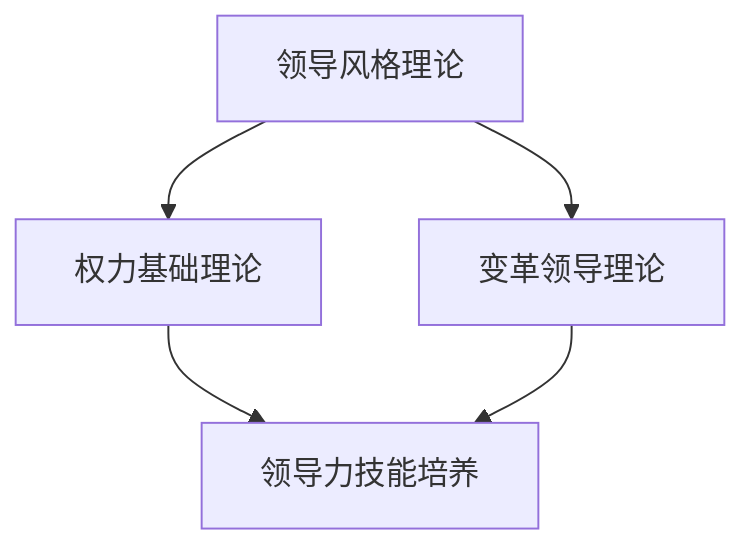

                 

### 《领导力修炼笔记：90后创业者的成长之路》

> 关键词：领导力、90后、创业者、成长、实战、案例、反思

> 摘要：本文通过深入剖析领导力的本质和核心理论，结合90后创业者的特点，探讨了领导力在创业过程中的重要性、应用和实践。文章分为三部分，分别介绍了领导力基础、90后创业者的成长之路以及领导力修炼案例与启示，旨在为创业者提供实用的领导力指导。

## 引言

### 领导力的定义与重要性

领导力是一种影响、激励和引导他人实现共同目标的能力。它不仅仅涉及管理和控制，更强调愿景、创新和团队建设。在当代社会，领导力的重要性愈发凸显。随着全球化和信息化的发展，企业面临的环境日益复杂多变，领导者需要具备更广阔的视野、更高的适应能力和更强的创新精神，以应对不断涌现的挑战和机遇。

### 90后创业者的特点

90后是一群充满活力和创新的年轻人，他们成长于互联网时代，具有独特的价值观和生活态度。相比前辈，90后创业者更加注重个性化和用户体验，更加勇于尝试和冒险。他们追求自由、平等和多元化，善于利用互联网和新技术，推动企业快速发展。

### 领导力在创业过程中的重要性

领导力是创业成功的核心因素之一。在创业初期，领导力有助于吸引人才、筹集资金、制定战略和应对挑战。在快速成长期，领导力有助于构建团队文化、推动企业创新和提升竞争力。在稳定发展期，领导力有助于实现可持续发展、传承和创新。因此，掌握和提升领导力对于90后创业者来说至关重要。

## 第一部分：领导力基础

### 第1章：领导力的本质与重要性

#### 1.1 领导力的定义

领导力是指一种影响、激励和引导他人实现共同目标的能力。它不仅涉及个人的行为和决策，还包括对团队和组织的影响。领导力不仅仅是管理，更是一种领导艺术，需要领导者具备创新精神、同理心和沟通能力。

#### 1.2 领导力的重要性

领导力在企业发展中起着至关重要的作用。首先，领导力能够激发团队的潜力，实现共同目标。其次，领导力有助于企业应对外部环境的变化，保持竞争优势。此外，领导力还能够提升企业文化和员工满意度，促进企业的可持续发展。

#### 1.3 领导力与管理的区别

领导力与管理是两个不同的概念。管理主要关注流程、效率和资源分配，而领导力则侧重于愿景、创新和团队建设。领导力是管理的升华，是推动企业向前发展的关键。

### 第2章：领导力核心理论

#### 2.1 领导风格理论

领导风格理论主要研究领导者在不同情境下的行为和表现。常见的领导风格包括民主型、专制型、参与型和成就导向型。每种领导风格都有其优点和局限性，领导者需要根据实际情况灵活运用。

#### 2.2 权力基础理论

权力基础理论主要研究领导者如何获取、运用和影响他人。权力来源包括正式权力、参照权力、专家权力和关系权力。领导者需要了解不同的权力来源，以便更好地运用权力实现目标。

#### 2.3 变革领导理论

变革领导理论关注领导者如何推动组织变革。变革领导需要领导者具备远见、决断力和沟通能力，能够动员团队共同应对变革。常见的变革领导策略包括愿景引导、文化重塑和激励。

### 第3章：领导力技能培养

#### 3.1 沟通技能

沟通技能是领导者必备的基本素质。有效的沟通能够确保信息准确传递，增强团队协作，提升组织效能。领导者需要学会倾听、表达、反馈和协调，以提高沟通效果。

#### 3.2 决策技能

决策技能是领导者面临的重要挑战之一。领导者需要学会分析信息、制定方案、评估风险和选择最佳方案。有效的决策能够确保企业快速应对市场变化，抓住机遇。

#### 3.3 情绪管理技能

情绪管理技能是领导者自我提升的关键。领导者需要学会控制情绪，保持冷静，以应对压力和挑战。良好的情绪管理能够增强领导者的决策能力和执行力。

### 第4章：领导力与90后创业者

#### 4.1 90后创业者的特点

90后创业者具有以下特点：创新意识强、追求个性化和用户体验、善于利用互联网和新技术、勇于尝试和冒险、注重团队建设和企业文化。

#### 4.2 领导力在创业中的应用

在创业过程中，领导力有助于90后创业者吸引人才、筹集资金、制定战略和应对挑战。领导力还能推动企业创新、提升竞争力和实现可持续发展。

#### 4.3 创业过程中的领导力挑战

创业过程中，90后创业者面临的主要领导力挑战包括：团队建设、战略规划、市场拓展、资金管理、应对外部环境变化等。

### 第5章：领导力修炼实践

#### 5.1 领导力修炼的关键步骤

领导力修炼的关键步骤包括：自我认知、学习与反思、实践与应用、反馈与调整。通过不断学习和实践，领导者能够不断提升自己的领导能力。

#### 5.2 案例分析：成功创业者的领导力修炼之路

通过分析成功创业者的领导力修炼案例，我们可以发现，他们普遍具备以下特质：坚定的信念、持续的学习、勇于创新、注重团队建设、善于应对挑战。

#### 5.3 领导力修炼的常见误区与应对策略

领导力修炼过程中，创业者容易陷入以下误区：过分自信、忽视团队建设、过于依赖个人能力、缺乏反思和总结。针对这些误区，创业者需要采取相应的应对策略，如加强团队建设、保持谦虚、注重反思和总结等。

## 第二部分：90后创业者的成长之路

### 第6章：创业初期的领导力实践

#### 6.1 创业初期的团队建设

创业初期的团队建设至关重要。创业者需要明确团队目标、选拔合适的人才、构建团队文化、培养团队协作能力。良好的团队建设有助于企业快速发展。

#### 6.2 创业初期的战略规划

创业初期的战略规划需要明确企业的发展方向、市场定位、产品策略、融资策略等。创业者需要根据市场环境和自身资源，制定切实可行的战略规划。

#### 6.3 创业初期的风险管理

创业初期的风险管理包括市场风险、财务风险、技术风险等。创业者需要识别风险、制定应对策略、降低风险对企业的负面影响。

### 第7章：快速成长期的领导力挑战

#### 7.1 企业扩张中的领导力挑战

企业扩张过程中，领导者需要面对管理团队的扩大、业务领域的拓展、市场环境的复杂化等挑战。领导者需要提升自身的领导力，确保企业健康成长。

#### 7.2 市场竞争中的领导力策略

市场竞争中，领导者需要制定有效的市场策略，提升企业的竞争力。领导力策略包括产品创新、品牌建设、渠道拓展、客户关系管理等。

#### 7.3 团队管理与领导力提升

团队管理是领导力的核心组成部分。领导者需要关注团队建设、员工激励、绩效管理等方面，提升团队的整体效能。

### 第8章：稳定发展期的领导力思考

#### 8.1 领导力在持续发展中的作用

稳定发展期，领导力在企业的持续发展中发挥着关键作用。领导者需要关注企业文化建设、创新驱动、风险控制等方面，确保企业持续发展。

#### 8.2 创新与领导力

创新是企业持续发展的动力。领导者需要具备创新思维，推动企业技术创新和管理创新，提升企业的竞争力。

#### 8.3 领导力在传承与接班中的重要性

领导力的传承与接班是企业长期发展的重要保障。领导者需要培养接班人，传承企业文化和价值观，确保企业的稳定发展。

### 第9章：领导力的长期发展

#### 9.1 领导力的自我提升

领导力的长期发展需要领导者不断自我提升。领导者需要关注自我成长、学习新知识、拓展视野，提升自身的领导能力。

#### 9.2 领导力的传承与培养

领导力的传承与培养是企业的长期战略。领导者需要关注人才培养、团队建设、企业文化传承等方面，确保企业可持续发展。

#### 9.3 领导力的国际化视野

在全球化背景下，领导者需要具备国际化视野。领导者需要关注国际市场、跨文化管理、全球战略等方面，提升企业的国际竞争力。

## 第三部分：领导力修炼案例与启示

### 第10章：领导力修炼成功案例

#### 10.1 本土创业者的领导力修炼

本土创业者的领导力修炼案例包括马云、雷军等。他们通过自我提升、学习借鉴、实践探索，不断提升自己的领导力，推动了企业的快速发展。

#### 10.2 海外创业者的领导力经验

海外创业者的领导力经验包括马斯克、贝佐斯等。他们通过全球视野、创新思维、团队建设，成功创立了具有国际竞争力的大型企业。

#### 10.3 创业者领导力修炼的共同点与差异

本土创业者和海外创业者在领导力修炼上存在共同点，如自我提升、学习借鉴、实践探索等。同时，他们也在领导力风格、文化传承等方面存在差异。

### 第11章：领导力修炼的启示与反思

#### 11.1 领导力修炼的长期价值

领导力修炼具有长期价值。通过不断提升领导力，创业者能够更好地应对市场变化，推动企业持续发展。

#### 11.2 领导力修炼的实践方法

领导力修炼的实践方法包括自我反思、学习借鉴、实践探索、团队建设等。创业者需要结合自身实际情况，制定合理的领导力修炼计划。

#### 11.3 未来领导力发展趋势预测

未来领导力发展趋势包括全球化视野、创新思维、数字化管理、社会责任等方面。创业者需要紧跟发展趋势，不断提升自身的领导力。

## 附录

### 附录A：领导力相关资源推荐

#### A.1 领导力书籍推荐

- 《领导力五项修炼》
- 《影响力的艺术》
- 《卓越领导力》

#### A.2 领导力培训课程推荐

- 华为领导力培训
- 埃森哲领导力培训
- 麦肯锡领导力培训

#### A.3 领导力工具与软件推荐

- Atlassian JIRA
- Asana
- Trello

### 附录B：领导力修炼实践工具

#### B.1 自我评估工具

- 领导力360度评估
- 自我认知测试
- SWOT分析

#### B.2 领导力发展计划制定

- 设定个人目标
- 制定行动计划
- 定期评估和调整

#### B.3 领导力反馈与评估方法

- 定期会议反馈
- 同事和下属评价
- 第三方评估机构

### Mermaid 流程图：领导力核心理论关联图



### 决策技能伪代码

```python
def make_decision(context):
    """
    决策过程伪代码

    :param context: 决策的上下文
    :return: 决策结果
    """
    # 收集信息
    information = gather_information(context)

    # 分析信息
    analysis = analyze_information(information)

    # 制定方案
    solutions = generate_solutions(analysis)

    # 评估方案
    evaluation = evaluate_solutions(solutions)

    # 选择最佳方案
    best_solution = select_best_solution(evaluation)

    # 执行决策
    execute_decision(best_solution)

    # 反馈与调整
    feedback = get_feedback()
    adjust_decision(feedback)
```

### 数学公式与讲解

$$
\text{ROI} = \frac{\text{净收益}}{\text{投资成本}}
$$

**ROI（投资回报率）是评估AI项目经济效益的关键指标，它反映了每一单位投资的净收益。**

### 项目实战：搭建创业团队

#### 环境搭建

1. 安装Git和GitHub账号
2. 安装Python开发环境（如Anaconda）
3. 安装必备的第三方库（如numpy，pandas，scikit-learn等）

#### 源代码实现

```python
# 示例：使用pandas读取团队成员信息并进行分析
import pandas as pd

# 读取团队成员信息
team_members = pd.read_csv('team_members.csv')

# 分析团队成员信息
team_members_analysis = team_members.describe()

# 打印分析结果
print(team_members_analysis)
```

#### 代码解读与分析

1. 导入pandas库
2. 读取团队成员信息CSV文件
3. 对团队成员信息进行描述性统计分析
4. 打印分析结果

#### 实际案例分析和详细讲解剖析

1. 分析团队成员的年龄、性别、学历等信息
2. 根据分析结果调整团队建设策略
3. 制定团队成员培训计划

#### 项目小结

通过搭建创业团队项目，我们学会了如何使用Python和pandas库进行数据处理和分析。这为我们后续的创业实践提供了数据支持和决策依据。

### 最佳实践 tips、小结、注意事项、拓展阅读等内容

1. **最佳实践 tips**：
   - 制定明确的团队目标和战略规划
   - 注重团队成员的沟通和协作
   - 建立良好的企业文化

2. **小结**：
   - 领导力是创业成功的关键
   - 90后创业者需要不断提升领导力
   - 领导力修炼是创业者的必修课

3. **注意事项**：
   - 避免过度依赖个人能力
   - 注重团队建设和文化建设
   - 持续学习和反思

4. **拓展阅读**：
   - 《领导力心理学》
   - 《创业维艰》
   - 《精益创业》

### 作者信息

作者：AI天才研究院/AI Genius Institute & 禅与计算机程序设计艺术 /Zen And The Art of Computer Programming

本文旨在为90后创业者提供实用的领导力指导，帮助他们在创业道路上取得成功。希望本文能够对广大创业者有所启发和帮助。如有疑问或建议，欢迎在评论区留言交流。再次感谢您的阅读！### 第一部分：领导力基础

#### 第1章：领导力的本质与重要性

**1.1 领导力的定义**

领导力是一种能力，它使领导者能够在复杂和不断变化的环境中引导、激励和影响他人，共同实现目标。领导力不仅仅涉及管理和控制，更包括对愿景的设定、对变革的推动以及对团队的领导。

- **愿景设定**：领导者需要具备前瞻性，能够清晰地描述未来的愿景，并激发团队成员的积极性和创造力。
- **变革推动**：在变化迅速的市场环境中，领导者需要具备适应能力，能够推动组织进行必要的变革。
- **团队领导**：领导者需要关注团队成员的需求和成长，建立高效的团队协作机制。

**1.2 领导力的重要性**

领导力对于组织的成功至关重要。它不仅影响个人的行为和决策，也影响整个团队和组织的行为和绩效。以下是领导力重要性的几个方面：

- **驱动变革**：领导力是推动组织变革和进步的关键因素。在快速变化的市场环境中，领导者需要有能力引领变革，确保组织持续发展。
- **激发潜力**：领导力能够激发团队成员的潜力，提升团队的整体效能。通过有效的激励和指导，领导者能够帮助团队成员发挥最大的潜力。
- **建立文化**：领导力对组织文化的塑造具有重要作用。领导者通过自身的言行和价值观，影响组织文化的形成和发展。
- **提升绩效**：领导力能够提升组织的绩效。通过明确的目标设定、有效的沟通和恰当的激励，领导者能够提高团队的工作效率和质量。

**1.3 领导力与管理的区别**

虽然领导力和管理密不可分，但两者有着明显的区别：

- **领导力**：关注愿景、创新和团队建设。领导者通过影响和激励团队成员，实现共同目标。
- **管理**：侧重于流程、效率和资源分配。管理者通过规划、组织和控制，确保组织目标的实现。

领导力与管理的关系可以类比于艺术与科学的关系。领导力是一种艺术，它涉及创造力和人际交往能力；而管理则是一种科学，它侧重于系统和方法。在实际应用中，领导者需要将领导力和管理结合起来，以实现组织的目标。

#### 第2章：领导力核心理论

**2.1 领导风格理论**

领导风格理论是研究领导者行为和领导效果的重要理论。不同的领导风格对团队和组织的影响各不相同。以下是几种常见的领导风格：

- **民主型领导**：领导者鼓励团队成员参与决策，尊重团队成员的意见和建议。这种风格有利于提高团队的凝聚力和创新能力。
- **专制型领导**：领导者独自做出决策，团队成员缺乏参与和自主权。这种风格在紧急情况下可能有效，但长期来看可能抑制团队成员的积极性。
- **参与型领导**：领导者重视团队成员的意见，积极与团队成员沟通，共同制定决策。这种风格有利于增强团队的参与感和责任感。
- **成就导向型领导**：领导者注重团队成员的成就和进步，激励团队成员设定高目标并努力实现。这种风格能够提高团队的整体绩效。

**2.2 权力基础理论**

权力基础理论关注领导者如何获取和运用权力。不同的权力来源对领导效果有重要影响。以下是几种常见的权力来源：

- **正式权力**：来源于职位和职责。正式权力使领导者能够下达命令和指导团队成员。
- **参照权力**：来源于领导者的人格魅力和专业知识。当团队成员尊重和信任领导者时，参照权力发挥作用。
- **专家权力**：来源于领导者的专业知识和技能。当领导者拥有特殊技能或专业知识时，专家权力能够增强领导效果。
- **关系权力**：来源于领导者与团队成员的关系。领导者通过建立良好的人际关系，提高领导效果。

**2.3 变革领导理论**

变革领导理论关注领导者如何推动组织变革。在变革过程中，领导者需要具备以下能力：

- **愿景引导**：领导者需要清晰地描述未来的愿景，激发团队成员对变革的认同和参与。
- **文化重塑**：领导者需要改变组织的文化，使之适应变革。这包括消除阻力和建立新的价值观和行为规范。
- **沟通能力**：领导者需要与团队成员进行有效的沟通，解释变革的必要性和优势，消除误解和担忧。
- **激励与支持**：领导者需要激励团队成员积极参与变革，并提供必要的支持和资源。

#### 第3章：领导力技能培养

**3.1 沟通技能**

沟通技能是领导者必备的基本素质。有效的沟通能够确保信息准确传递，增强团队协作，提升组织效能。以下是几种提高沟通技能的方法：

- **倾听**：领导者需要学会倾听，了解团队成员的需求和意见。通过倾听，领导者能够建立信任和尊重。
- **表达**：领导者需要清晰、准确地表达自己的想法和意见。这包括使用恰当的词汇、语调和肢体语言。
- **反馈**：领导者需要及时给予反馈，帮助团队成员改进工作。反馈应当是具体、建设性的。
- **协调**：领导者需要协调不同团队成员之间的沟通，确保信息畅通无阻。

**3.2 决策技能**

决策技能是领导者面临的重要挑战之一。有效的决策能够确保企业快速应对市场变化，抓住机遇。以下是几种提高决策技能的方法：

- **信息收集**：领导者需要收集与决策相关的各种信息，包括市场数据、客户反馈和团队成员的建议。
- **分析评估**：领导者需要对收集到的信息进行分析和评估，制定不同的决策方案。
- **风险评估**：领导者需要评估每个决策方案的风险和收益，选择最佳方案。
- **执行跟踪**：领导者需要跟踪决策的执行情况，及时调整和优化。

**3.3 情绪管理技能**

情绪管理技能是领导者自我提升的关键。良好的情绪管理能够增强领导者的决策能力和执行力。以下是几种提高情绪管理技能的方法：

- **自我认知**：领导者需要了解自己的情绪，包括情绪的类型、触发点和影响。
- **情绪调节**：领导者需要学会调节自己的情绪，保持冷静和客观。这包括深呼吸、冥想和运动等方法。
- **同理心**：领导者需要培养同理心，理解团队成员的情绪和需求。
- **反馈与反思**：领导者需要定期进行自我反思，了解自己的情绪管理效果，不断改进。

#### 第4章：领导力与90后创业者

**4.1 90后创业者的特点**

90后创业者是一群充满活力和创新的年轻人，他们成长于互联网时代，具有独特的价值观和生活态度。以下是90后创业者的一些特点：

- **创新意识强**：90后创业者更加注重创新和用户体验，善于利用新技术和互联网平台推动企业快速发展。
- **追求个性化和差异化**：90后创业者追求个性化和差异化，不满足于传统模式，勇于尝试新的商业模式和产品创新。
- **勇于尝试和冒险**：90后创业者敢于冒险，不怕失败，愿意承担风险，以实现自己的创业梦想。
- **注重团队建设和企业文化**：90后创业者重视团队建设和企业文化，注重团队成员的价值观和成长，以建立高效的团队。

**4.2 领导力在创业中的应用**

在创业过程中，领导力发挥着至关重要的作用。以下是领导力在创业中的应用：

- **吸引人才**：领导者需要具备吸引和留住人才的能力，通过自身的魅力和价值观，吸引优秀的团队成员加入企业。
- **制定战略**：领导者需要具备战略规划能力，制定明确的企业愿景和目标，确保企业沿着正确的方向前进。
- **推动创新**：领导者需要鼓励创新和尝试，营造开放和包容的企业文化，激发团队成员的创造力和创新能力。
- **应对挑战**：领导者需要具备应对挑战和解决问题的能力，在困难和压力面前保持冷静和坚定，带领团队克服困难。

**4.3 创业过程中的领导力挑战**

在创业过程中，90后创业者面临以下领导力挑战：

- **团队建设**：如何建立高效、协作的团队，激发团队成员的潜力。
- **战略规划**：如何在不断变化的市场环境中制定有效的战略规划，确保企业的可持续发展。
- **市场拓展**：如何开拓新的市场，提高企业的市场份额和竞争力。
- **资金管理**：如何在有限的资源下进行有效的资金管理，确保企业的财务健康。
- **应对风险**：如何识别和应对创业过程中可能遇到的各种风险，确保企业的稳定运营。

#### 第5章：领导力修炼实践

**5.1 领导力修炼的关键步骤**

领导力修炼是一个长期的过程，需要领导者不断学习、实践和反思。以下是领导力修炼的关键步骤：

- **自我认知**：领导者需要了解自己的优点和不足，识别自己的性格特点和领导风格。
- **学习与反思**：领导者需要通过阅读、培训、交流等方式不断学习，同时进行自我反思，总结经验教训。
- **实践与应用**：领导者需要在实际工作中运用所学知识，通过实践检验自己的领导能力。
- **反馈与调整**：领导者需要定期接受反馈，了解自己的领导效果，并根据反馈进行相应的调整和改进。

**5.2 案例分析：成功创业者的领导力修炼之路**

通过分析成功创业者的领导力修炼之路，我们可以发现一些共同的特质和方法：

- **持续学习**：成功创业者通常具备强烈的学习意愿和求知欲，不断学习新的知识和技能，以适应快速变化的市场环境。
- **自我反思**：成功创业者善于进行自我反思，从失败和成功中吸取教训，不断提升自己的领导能力。
- **勇于创新**：成功创业者敢于尝试新的思路和方法，不断推动企业创新，以保持竞争优势。
- **注重团队建设**：成功创业者重视团队建设，建立高效、协作的团队，激发团队成员的创造力和创新能力。
- **善于应对挑战**：成功创业者具备应对挑战和解决问题的能力，能够在困境中保持冷静和坚定，带领团队走出困境。

**5.3 领导力修炼的常见误区与应对策略**

在领导力修炼过程中，创业者容易陷入以下误区：

- **过分依赖个人能力**：创业者需要认识到，领导力不仅仅是个人能力的体现，更需要依靠团队的力量。过分依赖个人能力可能导致团队协作不足和创新能力受限。
- **忽视团队建设**：创业者需要重视团队建设，建立高效的团队协作机制，激发团队成员的积极性和创造力。
- **缺乏反思和总结**：创业者需要定期进行反思和总结，从成功和失败中吸取教训，不断提升自己的领导能力。
- **忽视自身成长**：创业者需要关注自身的成长和发展，通过学习和实践不断提升自己的领导能力和综合素质。

针对这些误区，创业者可以采取以下应对策略：

- **培养团队协作精神**：通过团队建设活动和协作工具，提高团队协作效率，激发团队成员的积极性和创造力。
- **注重自身成长**：通过阅读、培训、交流等方式，不断学习新的知识和技能，提升自身的领导能力和综合素质。
- **建立反思和总结机制**：定期进行反思和总结，从成功和失败中吸取教训，不断提升自己的领导能力。
- **寻求外部支持**：通过导师指导、外部培训、咨询等方式，获取专业的支持和建议，加速自己的领导力提升。

通过以上关键步骤、案例分析、常见误区与应对策略，创业者可以系统地提升自己的领导力，为企业的持续发展打下坚实基础。在下一部分，我们将深入探讨90后创业者的成长之路，分析他们在不同阶段的领导力实践和挑战。让我们继续前行，探索90后创业者的领导力修炼之旅！### 第1章：领导力的本质与重要性

#### 1.1 领导力的定义

领导力是一种影响、激励和引导他人实现共同目标的能力。它不仅仅关注个人的行为和决策，更侧重于对团队和组织的影响。领导力包括多个方面，如愿景设定、团队建设、变革推动和战略规划等。

- **愿景设定**：领导者需要具备前瞻性，能够清晰地描述未来的愿景，并激发团队成员的积极性和创造力。
- **团队建设**：领导者需要关注团队成员的需求和成长，建立高效的团队协作机制，提高团队的凝聚力和执行力。
- **变革推动**：在变化迅速的市场环境中，领导者需要具备适应能力，能够推动组织进行必要的变革，以保持竞争力。
- **战略规划**：领导者需要制定明确的目标和计划，确保组织沿着正确的方向前进，并能够应对外部环境的挑战。

**领导力的重要性**

领导力对于组织的成功和可持续发展至关重要。以下是领导力重要性的几个方面：

- **驱动变革**：领导力是推动组织变革和进步的关键因素。在快速变化的市场环境中，领导者需要有能力引领变革，确保组织持续发展。
- **激发潜力**：领导力能够激发团队成员的潜力，提升团队的整体效能。通过有效的激励和指导，领导者能够帮助团队成员发挥最大的潜力。
- **建立文化**：领导力对组织文化的塑造具有重要作用。领导者通过自身的言行和价值观，影响组织文化的形成和发展。
- **提升绩效**：领导力能够提升组织的绩效。通过明确的目标设定、有效的沟通和恰当的激励，领导者能够提高团队的工作效率和质量。

**领导力与管理的区别**

虽然领导力和管理密不可分，但两者有着明显的区别：

- **领导力**：关注愿景、创新和团队建设。领导者通过影响和激励团队成员，实现共同目标。
- **管理**：侧重于流程、效率和资源分配。管理者通过规划、组织和控制，确保组织目标的实现。

在实际应用中，领导者需要将领导力和管理结合起来，以实现组织的目标。

#### 1.2 领导力的重要性

领导力在组织中的作用不可忽视，它对于组织的成功和可持续发展具有深远的影响。以下是领导力重要性的几个方面：

1. **驱动变革**：在当今快速变化的市场环境中，企业需要不断适应和应对外部环境的变化。领导者具备推动变革的能力，能够引领组织进行战略调整、组织重构和业务创新，确保企业在竞争激烈的市场中保持竞争力。

2. **激发潜力**：领导力能够激发团队成员的潜力，提升团队的整体效能。通过有效的激励和指导，领导者能够帮助团队成员发挥最大的潜力，实现个人和团队的目标。

3. **建立文化**：领导力对组织文化的塑造具有重要作用。领导者通过自身的言行和价值观，影响组织文化的形成和发展，塑造积极、健康、有活力的组织氛围。

4. **提升绩效**：领导力能够提升组织的绩效。通过明确的目标设定、有效的沟通和恰当的激励，领导者能够提高团队的工作效率和质量，实现组织的目标。

**领导力对于个人和团队的影响**

领导力不仅对组织有重要影响，也对个人和团队产生深远的影响：

1. **个人成长**：领导者需要具备不断学习和自我提升的能力，通过领导力的修炼，个人能够实现职业发展和自我价值的提升。

2. **团队协作**：领导力能够促进团队成员之间的协作和沟通，建立高效的团队协作机制，提高团队的凝聚力和执行力。

3. **团队激励**：领导力能够激发团队成员的积极性和创造力，提高团队的士气和工作效率。

**领导力在不同组织结构中的作用**

领导力在不同组织结构中具有不同的作用：

1. **层级组织**：在层级组织中，领导力主要表现为对下属的指导和监督，确保组织目标的实现。

2. **扁平化组织**：在扁平化组织中，领导力更强调对团队成员的赋能和激励，推动团队成员自主决策和自主管理。

3. **网络组织**：在以网络组织为代表的现代组织形式中，领导力更侧重于建立信任、促进合作和推动创新，以实现组织的目标。

综上所述，领导力是组织成功的关键因素，它对于驱动变革、激发潜力、建立文化和提升绩效具有重要作用。领导者需要具备持续学习和自我提升的能力，结合组织结构和团队特点，灵活运用领导力，实现组织的目标和愿景。在下一部分，我们将进一步探讨领导力的核心理论，包括领导风格理论、权力基础理论和变革领导理论，以帮助读者更全面地理解领导力的重要性和应用。让我们继续前行，深入探讨领导力的核心理论！### 第2章：领导力核心理论

#### 2.1 领导风格理论

领导风格理论是研究领导者行为和领导效果的重要理论。不同的领导风格对团队和组织的影响各不相同。以下是几种常见的领导风格：

1. **民主型领导**：领导者鼓励团队成员参与决策，尊重团队成员的意见和建议。这种风格有利于提高团队的凝聚力和创新能力。

   - **优势**：增强团队成员的参与感和责任感，提高决策质量，促进团队协作和创新。
   - **劣势**：决策过程可能较为缓慢，容易受到少数成员的影响。

2. **专制型领导**：领导者独自做出决策，团队成员缺乏参与和自主权。这种风格在紧急情况下可能有效，但长期来看可能抑制团队成员的积极性。

   - **优势**：决策快速，有利于高效执行，有助于保持组织的稳定性。
   - **劣势**：可能导致团队成员被动执行，缺乏积极性和创造力。

3. **参与型领导**：领导者重视团队成员的意见，积极与团队成员沟通，共同制定决策。这种风格有利于增强团队的参与感和责任感。

   - **优势**：提高团队成员的参与度和满意度，促进团队协作和决策质量。
   - **劣势**：可能影响决策速度，对领导者的沟通和协调能力要求较高。

4. **成就导向型领导**：领导者注重团队成员的成就和进步，激励团队成员设定高目标并努力实现。这种风格能够提高团队的整体绩效。

   - **优势**：激发团队成员的积极性和创造力，提高团队的目标导向性和执行力。
   - **劣势**：可能导致团队成员的压力过大，影响工作满意度。

**2.2 权力基础理论**

权力基础理论关注领导者如何获取和运用权力。不同的权力来源对领导效果有重要影响。以下是几种常见的权力来源：

1. **正式权力**：来源于职位和职责。正式权力使领导者能够下达命令和指导团队成员。

   - **优势**：具有权威性和约束力，有助于确保组织目标的实现。
   - **劣势**：可能导致团队成员的被动接受，缺乏自主性和创造力。

2. **参照权力**：来源于领导者的人格魅力和专业知识。当团队成员尊重和信任领导者时，参照权力发挥作用。

   - **优势**：增强领导者的权威性和影响力，促进团队成员的自愿合作。
   - **劣势**：可能受到领导者个人素质的限制，难以持续发挥作用。

3. **专家权力**：来源于领导者的专业知识和技能。当领导者拥有特殊技能或专业知识时，专家权力能够增强领导效果。

   - **优势**：提高领导者的专业权威，有助于解决复杂问题，提升决策质量。
   - **劣势**：可能因专业知识过时而失去权力，对领导者的持续学习和成长有较高要求。

4. **关系权力**：来源于领导者与团队成员的关系。领导者通过建立良好的人际关系，提高领导效果。

   - **优势**：增强领导者的亲和力和影响力，促进团队成员的积极合作。
   - **劣势**：可能因人际关系的变化而影响权力稳定性，对领导者的沟通能力有较高要求。

**2.3 变革领导理论**

变革领导理论关注领导者如何推动组织变革。在变革过程中，领导者需要具备以下能力：

1. **愿景引导**：领导者需要清晰地描述未来的愿景，激发团队成员对变革的认同和参与。

   - **优势**：明确变革的方向和目标，提高团队成员的积极性和参与度。
   - **劣势**：可能导致团队成员的抵触情绪，需要领导者的耐心和沟通能力。

2. **文化重塑**：领导者需要改变组织的文化，使之适应变革。这包括消除阻力和建立新的价值观和行为规范。

   - **优势**：塑造积极、健康、有活力的组织文化，提高组织的适应能力和创新能力。
   - **劣势**：变革过程可能面临阻力和挑战，需要领导者的坚定和决心。

3. **沟通能力**：领导者需要与团队成员进行有效的沟通，解释变革的必要性和优势，消除误解和担忧。

   - **优势**：提高团队成员对变革的理解和认同，促进变革的顺利进行。
   - **劣势**：沟通效果可能因领导者能力不足而受到影响，需要不断的练习和改进。

4. **激励与支持**：领导者需要激励团队成员积极参与变革，并提供必要的支持和资源。

   - **优势**：增强团队成员的参与感和责任感，提高变革的成功率。
   - **劣势**：可能面临资源有限的问题，需要领导者的合理规划和优先级管理。

通过了解和掌握领导风格理论、权力基础理论和变革领导理论，领导者可以更好地理解和运用领导力，提高领导效果。在下一部分，我们将探讨领导力技能的培养，包括沟通技能、决策技能和情绪管理技能，帮助读者进一步提升自己的领导力。让我们继续前行，探索领导力技能的培养！### 第3章：领导力技能培养

#### 3.1 沟通技能

沟通技能是领导者必备的基本素质。有效的沟通能够确保信息准确传递，增强团队协作，提升组织效能。以下是几种提高沟通技能的方法：

1. **倾听**：领导者需要学会倾听，了解团队成员的需求和意见。通过倾听，领导者能够建立信任和尊重。倾听的方法包括：保持专注、避免打断、积极回应。

2. **表达**：领导者需要清晰、准确地表达自己的想法和意见。这包括使用恰当的词汇、语调和肢体语言。表达的方法包括：简明扼要、突出重点、使用明确的指示。

3. **反馈**：领导者需要及时给予反馈，帮助团队成员改进工作。反馈应当是具体、建设性的。反馈的方法包括：正面反馈、建设性批评、提出改进建议。

4. **协调**：领导者需要协调不同团队成员之间的沟通，确保信息畅通无阻。协调的方法包括：定期召开团队会议、建立沟通渠道、明确沟通流程。

**沟通技能在领导力中的作用**

- **增强团队凝聚力**：通过有效沟通，领导者能够增强团队成员之间的信任和合作，提升团队的凝聚力。
- **提高决策质量**：有效的沟通能够确保团队成员充分参与决策过程，提高决策的质量和可行性。
- **提升组织效能**：良好的沟通技能有助于领导者更好地了解团队成员的需求和问题，及时解决组织内部的矛盾和冲突。

#### 3.2 决策技能

决策技能是领导者面临的重要挑战之一。有效的决策能够确保企业快速应对市场变化，抓住机遇。以下是几种提高决策技能的方法：

1. **信息收集**：领导者需要收集与决策相关的各种信息，包括市场数据、客户反馈和团队成员的建议。信息收集的方法包括：市场调研、数据分析、内部沟通。

2. **分析评估**：领导者需要对收集到的信息进行分析和评估，制定不同的决策方案。分析评估的方法包括：成本效益分析、风险评估、情景分析。

3. **风险评估**：领导者需要评估每个决策方案的风险和收益，选择最佳方案。风险评估的方法包括：风险识别、风险分析、风险应对策略。

4. **执行跟踪**：领导者需要跟踪决策的执行情况，及时调整和优化。执行跟踪的方法包括：定期检查进度、反馈与评估、及时调整策略。

**决策技能在领导力中的作用**

- **提高决策效率**：有效的决策技能能够帮助领导者快速做出正确的决策，提高决策效率。
- **增强风险控制能力**：领导者通过评估和应对风险，能够降低决策带来的不确定性，提高企业的抗风险能力。
- **提升组织适应能力**：通过有效的决策，领导者能够确保企业适应外部环境的变化，提升组织的适应能力。

#### 3.3 情绪管理技能

情绪管理技能是领导者自我提升的关键。良好的情绪管理能够增强领导者的决策能力和执行力。以下是几种提高情绪管理技能的方法：

1. **自我认知**：领导者需要了解自己的情绪，包括情绪的类型、触发点和影响。自我认知的方法包括：自我反思、情绪日记、情绪问卷调查。

2. **情绪调节**：领导者需要学会调节自己的情绪，保持冷静和客观。情绪调节的方法包括：深呼吸、冥想、运动。

3. **同理心**：领导者需要培养同理心，理解团队成员的情绪和需求。同理心的方法包括：倾听、关注、支持。

4. **反馈与反思**：领导者需要定期进行自我反思，了解自己的情绪管理效果，不断改进。反馈与反思的方法包括：定期回顾、团队反馈、自我评估。

**情绪管理技能在领导力中的作用**

- **增强决策能力**：通过情绪管理，领导者能够保持冷静和客观，提高决策的质量和准确性。
- **提升执行力**：领导者通过情绪管理，能够增强自己的专注力和执行力，确保决策得到有效执行。
- **促进团队协作**：良好的情绪管理能够营造积极、健康、有活力的团队氛围，促进团队成员之间的协作和沟通。

#### 小结

领导力技能的培养是一个持续的过程，需要领导者不断学习和实践。通过提高沟通技能、决策技能和情绪管理技能，领导者能够更好地应对各种挑战，提升领导效果，推动组织的持续发展。在下一部分，我们将探讨领导力与90后创业者的关系，分析90后创业者的特点及其在创业过程中的领导力挑战。让我们继续前行，深入探讨领导力与创业的结合！### 第4章：领导力与90后创业者

#### 4.1 90后创业者的特点

90后创业者是一群充满活力和创新的年轻人，他们成长于互联网时代，具有独特的价值观和生活态度。以下是90后创业者的一些特点：

- **创新意识强**：90后创业者更加注重创新和用户体验，善于利用新技术和互联网平台推动企业快速发展。他们追求个性化和差异化，不满足于传统模式，勇于尝试新的商业模式和产品创新。

- **追求个性化和差异化**：90后创业者追求个性化和差异化，不满足于传统模式，勇于尝试新的商业模式和产品创新。他们注重用户需求和体验，以用户为中心，致力于提供独特的解决方案。

- **勇于尝试和冒险**：90后创业者敢于冒险，不怕失败，愿意承担风险，以实现自己的创业梦想。他们在面对挑战时表现出更强的韧性和决心，勇于突破自我，追求创新和突破。

- **注重团队建设和企业文化**：90后创业者重视团队建设和企业文化，注重团队成员的价值观和成长，以建立高效的团队协作机制。他们关注团队成员的个性和需求，鼓励团队成员发挥自身特长，共同实现企业目标。

- **善于利用互联网和新技术**：90后创业者善于利用互联网和新技术，掌握最新的科技趋势，以快速响应市场需求。他们利用大数据、人工智能、云计算等新技术，提升企业的创新能力和竞争力。

- **全球视野**：90后创业者具有全球视野，关注国际市场和发展趋势。他们愿意拓展海外市场，与国际伙伴合作，提升企业的国际化水平。

#### 4.2 领导力在创业中的应用

在创业过程中，领导力发挥着至关重要的作用。以下是领导力在创业中的应用：

- **吸引人才**：领导者需要具备吸引和留住人才的能力，通过自身的魅力和价值观，吸引优秀的团队成员加入企业。领导者需要了解团队成员的需求，提供职业发展机会和激励措施，激发团队成员的积极性和创造力。

- **制定战略**：领导者需要具备战略规划能力，制定明确的企业愿景和目标，确保企业沿着正确的方向前进。领导者需要分析市场环境、了解竞争对手、把握行业趋势，以制定有效的战略规划。

- **推动创新**：领导者需要鼓励创新和尝试，营造开放和包容的企业文化，激发团队成员的创造力和创新能力。领导者需要关注技术创新和管理创新，推动企业不断进步。

- **应对挑战**：领导者需要具备应对挑战和解决问题的能力，在困难和压力面前保持冷静和坚定，带领团队克服困难。领导者需要善于调动团队的资源和力量，制定应对策略，确保企业的稳定运营。

#### 4.3 创业过程中的领导力挑战

在创业过程中，90后创业者面临以下领导力挑战：

- **团队建设**：如何建立高效、协作的团队，激发团队成员的潜力。90后创业者需要关注团队成员的个性和需求，建立积极的团队文化，提高团队的凝聚力和执行力。

- **战略规划**：如何在不断变化的市场环境中制定有效的战略规划，确保企业的可持续发展。90后创业者需要具备前瞻性和洞察力，及时调整战略，以应对市场变化。

- **市场拓展**：如何开拓新的市场，提高企业的市场份额和竞争力。90后创业者需要了解市场需求，掌握营销技巧，拓展销售渠道，提升品牌知名度。

- **资金管理**：如何在有限的资源下进行有效的资金管理，确保企业的财务健康。90后创业者需要具备财务规划和风险控制能力，合理分配资金，确保企业的可持续发展。

- **应对风险**：如何识别和应对创业过程中可能遇到的各种风险，确保企业的稳定运营。90后创业者需要具备风险管理意识，建立风险预警机制，及时应对风险。

#### 4.4 领导力修炼与实践

为了应对创业过程中的领导力挑战，90后创业者需要不断修炼和实践领导力。以下是几个关键步骤：

- **自我认知**：创业者需要了解自己的优点和不足，识别自己的性格特点和领导风格。通过自我反思和反馈，不断改进自己的领导能力。

- **学习与反思**：创业者需要通过阅读、培训、交流等方式不断学习，同时进行自我反思，总结经验教训。学习领导力理论，了解不同领导风格和策略，结合实际情况进行应用。

- **实践与应用**：创业者需要在实际工作中运用所学知识，通过实践检验自己的领导能力。在实践中不断调整和优化领导策略，提高领导效果。

- **反馈与调整**：创业者需要定期接受反馈，了解自己的领导效果，并根据反馈进行相应的调整和改进。通过与团队成员的沟通和交流，了解他们的需求和期望，不断优化团队管理。

- **持续成长**：创业者需要具备持续成长的心态，不断学习新的知识和技能，提升自身的领导力和综合素质。通过参加培训课程、行业研讨会、领导力训练营等，拓展视野，提升领导力。

通过不断修炼和实践领导力，90后创业者能够更好地应对创业过程中的各种挑战，推动企业的持续发展。在下一部分，我们将探讨领导力修炼的具体实践，包括关键步骤、案例分析以及常见误区与应对策略。让我们继续前行，深入探讨领导力修炼的实践方法！### 第5章：领导力修炼实践

#### 5.1 领导力修炼的关键步骤

领导力修炼是一个长期而系统的过程，需要领导者不断地学习、实践和反思。以下是领导力修炼的关键步骤：

1. **自我认知**：领导者需要了解自己的优点和不足，识别自己的性格特点和领导风格。通过自我反思和反馈，领导者可以更清楚地了解自己在领导力方面的强项和短板。

   - **方法**：可以通过心理测试、360度评估、反思日记等方式进行自我认知。

2. **学习与反思**：领导者需要通过阅读、培训、交流等方式不断学习，同时进行自我反思，总结经验教训。学习领导力理论，了解不同领导风格和策略，结合实际情况进行应用。

   - **方法**：阅读相关书籍、参加培训课程、参与行业交流、观看领导力讲座等。

3. **实践与应用**：领导者需要在实际工作中运用所学知识，通过实践检验自己的领导能力。在实践中不断调整和优化领导策略，提高领导效果。

   - **方法**：在实际项目中担任领导角色，承担决策责任，从实践中学习和成长。

4. **反馈与调整**：领导者需要定期接受反馈，了解自己的领导效果，并根据反馈进行相应的调整和改进。通过与团队成员的沟通和交流，了解他们的需求和期望，不断优化团队管理。

   - **方法**：定期召开团队会议、进行员工满意度调查、接受第三方评估等。

5. **持续成长**：领导者需要具备持续成长的心态，不断学习新的知识和技能，提升自身的领导力和综合素质。通过参加培训课程、行业研讨会、领导力训练营等，拓展视野，提升领导力。

   - **方法**：制定个人学习计划，定期评估学习成果，设定新的学习目标。

#### 5.2 案例分析：成功创业者的领导力修炼之路

通过分析成功创业者的领导力修炼之路，我们可以发现一些共同的特质和方法：

1. **马云**：阿里巴巴创始人马云通过自我反思和学习，不断提升自己的领导力。他不断挑战自己，从失败中吸取教训，并在成功时保持谦逊和警惕。他通过建立企业文化，强调团队合作和客户至上，成功打造了一个全球知名的电商帝国。

2. **雷军**：小米科技创始人雷军注重创新和用户体验，他通过不断学习和实践，不断提升自己的领导力。他善于倾听团队成员的建议，并积极采纳，推动企业不断创新和发展。他通过建立高效的管理团队，确保企业快速响应市场变化。

3. **马斯克**：特斯拉和SpaceX创始人埃隆·马斯克通过自我挑战和持续学习，不断提升自己的领导力。他敢于冒险，勇于尝试新的技术和商业模式，推动企业在电动汽车和太空探索领域取得重大突破。他注重团队合作，激励团队成员追求卓越。

通过这些案例，我们可以看到，成功创业者的领导力修炼不仅依赖于个人的天赋和努力，更依赖于持续学习和实践。他们通过不断反思和调整，不断提升自己的领导能力，为企业的发展奠定坚实基础。

#### 5.3 领导力修炼的常见误区与应对策略

在领导力修炼过程中，创业者容易陷入以下误区：

1. **过分依赖个人能力**：一些创业者认为领导力完全是个人能力的体现，过分依赖自己的能力和经验。这种观念可能导致团队协作不足和创新能力受限。

   - **应对策略**：领导者需要认识到领导力不仅仅是个人能力的体现，更需要依靠团队的力量。通过培养团队协作精神和激励机制，提升团队的整体效能。

2. **忽视团队建设**：一些创业者只关注业务拓展和业绩提升，忽视团队建设。这可能导致团队凝聚力下降，工作效率低下。

   - **应对策略**：领导者需要重视团队建设，建立高效的团队协作机制，关注团队成员的需求和成长，营造积极、健康、有活力的团队氛围。

3. **缺乏反思和总结**：一些创业者忙于日常事务，忽视自我反思和总结。这可能导致领导力水平停滞不前，无法持续提升。

   - **应对策略**：领导者需要定期进行自我反思和总结，从成功和失败中吸取教训，不断提升自己的领导能力。可以设立反思时间，定期回顾自己的工作和领导效果。

4. **忽视自身成长**：一些创业者只关注企业的发展和业绩，忽视自身的成长和提升。这可能导致领导力水平停滞不前，无法适应企业发展的需求。

   - **应对策略**：领导者需要关注自身的成长和发展，通过学习、培训和实践，不断提升自己的领导能力和综合素质。

通过避免这些误区，并采取相应的应对策略，创业者可以更有效地修炼领导力，提升自身的领导能力，为企业的持续发展奠定坚实基础。在下一部分，我们将探讨90后创业者的成长之路，分析他们在不同阶段的领导力实践和挑战。让我们继续前行，深入探讨90后创业者的领导力成长之路！### 第6章：创业初期的领导力实践

#### 6.1 创业初期的团队建设

在创业初期，团队建设是至关重要的一环。创业者需要从以下几个方面进行团队建设：

1. **明确团队目标**：创业者需要与团队成员共同明确团队的目标和愿景，确保团队成员对企业的使命和目标有清晰的认识。通过共同的目标，激发团队成员的积极性和归属感。

2. **选拔合适的人才**：创业者需要根据企业的需求和发展阶段，选拔合适的人才。在选拔过程中，不仅要考虑候选人的专业能力和经验，还要关注其与团队文化和价值观的契合度。

3. **建立团队文化**：团队文化是团队协作和发展的基石。创业者需要根据企业的特点和目标，建立积极、健康、有活力的团队文化。团队文化应该强调协作、创新、诚信和责任感。

4. **培养团队协作能力**：创业者需要通过各种方式，如团队建设活动、培训和学习，培养团队成员的协作能力。通过协作，团队成员能够更好地理解彼此的需求和目标，提高工作效率和质量。

5. **激励团队成员**：创业者需要关注团队成员的需求和激励，通过奖励、晋升和培训等方式，激励团队成员发挥潜力，为企业的发展贡献力量。

#### 6.2 创业初期的战略规划

在创业初期，战略规划对于企业的发展至关重要。创业者需要从以下几个方面进行战略规划：

1. **明确企业定位**：创业者需要明确企业的市场定位，包括目标市场、产品定位和竞争优势。通过明确企业定位，创业者能够更好地制定战略规划和业务发展计划。

2. **制定长期目标**：创业者需要根据企业的愿景和使命，制定长期目标。长期目标应该具有可行性和挑战性，能够激励团队成员不断努力，推动企业持续发展。

3. **制定短期计划**：创业者需要根据长期目标，制定具体的短期计划。短期计划应该包括具体的行动步骤、时间表和预算，确保企业能够按照既定的目标稳步发展。

4. **应对市场变化**：创业者需要密切关注市场动态，及时调整战略规划。在市场变化时，创业者需要具备灵活性和适应性，快速调整企业战略，以应对外部环境的变化。

5. **资源分配**：创业者需要合理分配资源，确保企业的各项业务能够顺利进行。资源分配应该根据企业的优先级和发展需求，合理分配人力、物力和财力资源。

#### 6.3 创业初期的风险管理

在创业初期，风险管理是创业者面临的重要挑战之一。创业者需要从以下几个方面进行风险管理：

1. **识别风险**：创业者需要识别企业可能面临的各种风险，包括市场风险、财务风险、技术风险、法律风险等。通过识别风险，创业者能够提前做好准备，降低风险对企业的影响。

2. **评估风险**：创业者需要评估识别出的风险，分析风险的概率和影响程度。通过评估风险，创业者能够确定风险的重要性和优先级，为制定风险应对策略提供依据。

3. **制定风险应对策略**：创业者需要根据评估结果，制定相应的风险应对策略。风险应对策略包括风险规避、风险减轻、风险接受和风险转移等。

4. **监控和调整**：创业者需要监控企业风险管理的效果，及时调整风险应对策略。在风险发生后，创业者需要迅速反应，采取有效的措施，降低风险对企业的影响。

5. **培养风险管理意识**：创业者需要培养团队的风险管理意识，提高团队对风险的识别和应对能力。通过培训和实践，团队成员能够更好地理解风险管理的重要性，积极参与风险管理。

通过有效的团队建设、战略规划和风险管理，创业者能够在创业初期为企业的持续发展奠定坚实基础。在下一章，我们将探讨快速成长期的领导力挑战，分析创业者如何应对企业扩张和市场竞争中的领导力挑战。让我们继续前行，深入探讨创业者的领导力实践！### 第7章：快速成长期的领导力挑战

#### 7.1 企业扩张中的领导力挑战

在企业快速成长期，领导者面临许多新的领导力挑战。以下是企业扩张过程中常见的领导力挑战：

1. **团队规模扩大**：随着企业的快速发展，团队规模会迅速扩大。领导者需要适应团队规模的变化，调整管理策略，确保团队成员能够高效协作。

   - **解决方案**：领导者可以采取扁平化管理，减少层级，提高决策效率。同时，加强团队建设，提高团队成员之间的信任和协作。

2. **领导力分散**：在企业快速扩张时，领导者可能需要将部分领导权力下放给中层管理者。这可能导致领导力分散，影响企业的一致性和协调性。

   - **解决方案**：领导者需要明确各级管理者的职责和权限，确保他们具备相应的领导能力。同时，建立有效的沟通机制，确保信息畅通，提高决策的一致性。

3. **文化整合**：企业扩张过程中，可能会收购其他企业或团队。领导者需要整合不同文化，建立统一的企业文化，确保企业内部的和谐与稳定。

   - **解决方案**：领导者可以通过文化培训、团队交流活动等方式，促进不同团队之间的了解和融合。同时，制定明确的企业文化规范，确保企业文化的传承和发扬。

4. **资源分配**：企业扩张过程中，资源分配成为一个重要挑战。领导者需要合理分配资源，确保各部门和项目的资源需求得到满足。

   - **解决方案**：领导者可以建立资源分配机制，根据企业的战略目标和优先级，合理分配资源。同时，定期评估资源利用情况，及时调整资源分配策略。

#### 7.2 市场竞争中的领导力策略

在激烈的市场竞争中，领导者需要采取有效的领导力策略，提高企业的竞争力。以下是市场竞争中常见的领导力策略：

1. **创新驱动**：领导者需要鼓励创新，推动企业不断改进产品和业务模式，以适应市场的变化。

   - **解决方案**：领导者可以建立创新激励机制，鼓励团队成员提出创新想法。同时，投入一定的资源，支持创新项目的研发和实施。

2. **品牌建设**：领导者需要重视品牌建设，提升企业的品牌知名度和美誉度，增强市场竞争力。

   - **解决方案**：领导者可以制定品牌战略，加强品牌宣传和推广。同时，注重客户关系管理，提高客户满意度和忠诚度。

3. **市场拓展**：领导者需要积极开拓新市场，扩大企业的市场份额。

   - **解决方案**：领导者可以进行市场调研，了解潜在市场的需求和趋势。同时，制定市场拓展策略，通过合作伙伴、渠道拓展等方式，快速进入新市场。

4. **客户关系管理**：领导者需要重视客户关系管理，建立良好的客户关系，提高客户满意度。

   - **解决方案**：领导者可以建立客户关系管理系统，记录和分析客户信息，提供个性化的服务和解决方案。同时，定期与客户沟通，了解他们的需求和反馈。

#### 7.3 团队管理与领导力提升

在快速成长期，团队管理成为领导者面临的重要挑战。以下是团队管理中常见的领导力提升方法：

1. **团队建设**：领导者需要通过团队建设活动，增强团队成员之间的信任和协作。

   - **解决方案**：领导者可以定期组织团队建设活动，如团队培训、团队拓展训练等。同时，鼓励团队成员相互学习和支持，建立紧密的团队关系。

2. **绩效管理**：领导者需要建立有效的绩效管理体系，激励团队成员提高工作效率和质量。

   - **解决方案**：领导者可以制定明确的绩效目标和评估标准，定期对团队成员的工作进行评估和反馈。同时，提供奖励和晋升机制，激励团队成员不断进步。

3. **领导力培训**：领导者需要不断学习和提升自己的领导力，以应对快速变化的市场环境。

   - **解决方案**：领导者可以参加领导力培训课程，学习先进的领导理论和实践方法。同时，通过阅读书籍、参加研讨会等方式，不断拓展自己的知识面和视野。

4. **团队沟通**：领导者需要建立良好的沟通机制，确保团队成员之间的信息畅通。

   - **解决方案**：领导者可以定期召开团队会议，分享信息和经验，讨论团队目标和问题。同时，鼓励团队成员之间的开放和坦诚沟通，建立信任和协作的基础。

通过有效的团队管理方法和领导力提升策略，领导者能够更好地应对快速成长期的领导力挑战，推动企业的持续发展。在下一章，我们将探讨稳定发展期的领导力思考，分析领导者如何保持企业可持续发展，以及创新和领导力在其中的重要性。让我们继续前行，深入探讨领导力在企业发展不同阶段的实践与思考！### 第8章：稳定发展期的领导力思考

#### 8.1 领导力在持续发展中的作用

在企业的稳定发展期，领导力仍然发挥着至关重要的作用。以下是领导力在持续发展中的几个关键作用：

1. **战略规划**：领导者需要根据市场变化和企业发展需求，制定长期和短期的战略规划。通过明确的战略规划，企业能够保持清晰的发展方向，实现可持续发展。

2. **企业文化**：领导者需要传承和发扬企业文化，确保企业核心价值观在企业内部得到广泛认同和落实。企业文化是企业的精神支柱，有助于增强员工的凝聚力和归属感。

3. **创新驱动**：领导者需要积极推动企业创新，保持竞争优势。通过创新，企业能够不断适应市场变化，推出新产品和服务，满足客户需求。

4. **人才培养**：领导者需要关注人才培养，建立完善的人才培养体系。通过培养和引进优秀人才，企业能够保持人才优势，为企业的长期发展提供人力资源支持。

5. **风险控制**：领导者需要具备较强的风险控制能力，确保企业能够应对各种不确定因素。通过有效的风险控制，企业能够降低经营风险，保持稳定发展。

#### 8.2 创新与领导力

创新是企业在稳定发展期保持竞争力的重要手段。以下是创新与领导力的几个关键关系：

1. **领导力促进创新**：领导者需要具备创新思维，鼓励团队成员提出新想法，推动企业创新。通过建立创新激励机制，领导者能够激发团队成员的创新潜能。

2. **创新驱动领导力**：创新驱动型领导力是一种以创新为核心，推动企业持续发展的领导力。这种领导力强调领导者要具备前瞻性、洞察力和执行力，能够引领企业进行创新变革。

3. **创新文化**：领导者需要营造创新文化，鼓励员工敢于尝试和失败。通过建立开放、包容和创新的文化氛围，领导者能够激发员工的创造力和创新能力。

4. **创新与绩效**：领导者需要将创新与绩效相结合，确保创新活动能够转化为实际成果。通过设立创新目标和评估机制，领导者能够激励员工积极参与创新活动。

#### 8.3 领导力在传承与接班中的重要性

在企业的长期发展中，领导力的传承与接班至关重要。以下是领导力在传承与接班中的几个关键作用：

1. **文化传承**：领导者需要确保企业核心价值观和企业文化的传承，确保企业在接班过程中保持稳定的发展方向。

2. **领导力传承**：领导者需要培养和选拔接班人，将领导力传承给下一代领导者。通过培训和实践，接班人能够更好地理解和应用领导力，推动企业持续发展。

3. **接班规划**：领导者需要制定接班规划，明确接班人的培养路径和接班计划。通过提前规划和培养，企业能够确保平稳过渡，降低接班过程中的风险。

4. **领导力发展**：领导者需要关注领导力的发展，不断提升自身的领导能力。通过不断学习和实践，领导者能够保持与时俱进，适应企业发展的需求。

通过以上稳定发展期的领导力思考，领导者能够更好地应对企业发展中的各种挑战，推动企业实现可持续发展。在下一章，我们将探讨领导力的长期发展，包括领导力的自我提升、领导力的传承与培养以及领导力的国际化视野。让我们继续前行，深入探讨领导力的长期发展之路！### 第9章：领导力的长期发展

#### 9.1 领导力的自我提升

领导力的长期发展离不开自我提升。以下是领导者自我提升的几个关键方面：

1. **持续学习**：领导者需要不断学习新知识和技能，跟上时代发展的步伐。通过阅读书籍、参加培训课程、参加行业研讨会等方式，领导者能够拓宽视野，提升自身的知识储备。

2. **反思与总结**：领导者需要定期反思和总结自己的领导经历，从成功和失败中吸取教训。通过反思，领导者能够发现自身的不足，并制定改进措施。

3. **实践锻炼**：领导者需要将所学知识应用到实际工作中，通过实践锻炼自己的领导能力。在实践中，领导者能够不断积累经验，提升自身的领导水平。

4. **建立网络**：领导者需要建立广泛的人际网络，与其他领导者进行交流和合作。通过建立网络，领导者能够获取更多的资源和信息，提升自身的领导影响力。

#### 9.2 领导力的传承与培养

领导力的传承与培养是组织长期发展的关键。以下是领导力传承与培养的几个关键方面：

1. **培养接班人**：领导者需要提前培养接班人，确保组织在领导者退休或离职时能够平稳过渡。通过选拔和培养潜在接班人，领导者能够确保组织的持续发展。

2. **制定培养计划**：领导者需要制定明确的培养计划，包括培训内容、培养方式和培养时间表。通过系统化的培养，接班人能够快速提升领导能力。

3. **实践锻炼**：领导者需要为接班人提供实践机会，让他们在实际工作中锻炼和提升领导能力。通过实践锻炼，接班人能够更好地理解和应用领导力。

4. **建立导师制度**：领导者可以建立导师制度，为接班人提供指导和帮助。通过导师制度，接班人能够更快地成长和进步。

#### 9.3 领导力的国际化视野

在全球化背景下，领导力的国际化视野变得尤为重要。以下是领导者提升国际化视野的几个关键方面：

1. **了解国际市场**：领导者需要了解国际市场的趋势、需求和竞争格局。通过了解国际市场，领导者能够制定更具有竞争力的战略。

2. **跨文化管理**：领导者需要具备跨文化管理能力，能够适应不同国家和地区的文化和价值观。通过跨文化管理，领导者能够更好地整合国际资源，推动企业的国际化发展。

3. **全球合作**：领导者需要建立全球合作伙伴关系，通过合作共享资源和经验，提升企业的国际竞争力。通过全球合作，企业能够拓展国际市场，提高全球影响力。

4. **国际化培训**：领导者需要参加国际化的培训课程，学习全球领导力理论和实践。通过国际化培训，领导者能够提升自身的国际化视野和领导能力。

通过领导力的自我提升、传承与培养以及国际化视野的拓展，领导者能够更好地应对全球化背景下的挑战，推动企业的长期发展。在下一章，我们将通过成功创业者的领导力修炼案例，分析他们的领导力修炼过程和实践经验。让我们继续前行，深入探讨领导力修炼的成功之路！### 第10章：领导力修炼成功案例

#### 10.1 本土创业者的领导力修炼

本土创业者的领导力修炼案例丰富多样，许多成功的企业家通过不断的实践和反思，成功地将领导力转化为企业的核心竞争力。以下是几位本土创业者的领导力修炼案例：

1. **马云**：阿里巴巴的创始人马云通过持续的自我反思和不断学习，不断提升自己的领导力。他在领导阿里巴巴的过程中，注重团队建设和企业文化，强调“客户第一、员工第二、股东第三”的价值观。他通过领导力培训、团队拓展活动等方式，培养了一支高效的团队，为阿里巴巴的快速发展奠定了坚实基础。

2. **雷军**：小米科技创始人雷军以其创新的领导风格和卓越的执行力著称。他注重用户体验，通过快速迭代的产品开发和市场反馈机制，使小米成为全球知名的科技公司。雷军通过不断学习和实践，积累了丰富的领导经验，他强调“扁平化管理、快速决策、快速执行”的理念，使小米在激烈的市场竞争中脱颖而出。

3. **刘强东**：京东集团创始人刘强东在创业过程中，始终坚持“客户为中心”的理念。他通过建立高效的后台管理系统和完善的物流体系，确保了京东在电子商务领域的领先地位。刘强东通过不断学习和实践，提升了自己的领导力和管理能力，他在企业内部推行“京东大学”计划，为员工提供全面的培训和成长机会。

#### 10.2 海外创业者的领导力经验

海外创业者的领导力经验同样丰富，他们在不同的文化和市场环境中，通过独特的领导力策略，取得了显著的成就。以下是几位海外创业者的领导力经验：

1. **埃隆·马斯克**：特斯拉和SpaceX的创始人埃隆·马斯克以其远见和执行力著称。他通过不断创新和突破，将特斯拉打造成全球领先的电动汽车制造商。马斯克强调“大胆尝试、持续创新、追求卓越”的领导理念，他通过建立强大的团队和有效的激励机制，推动了企业的快速发展。

2. **贝佐斯**：亚马逊创始人杰夫·贝佐斯以其前瞻性的战略和卓越的执行能力著称。他通过打造高效的供应链和物流体系，使亚马逊成为全球最大的电子商务平台。贝佐斯强调“客户至上、创新驱动、持续改进”的领导理念，他通过建立透明的沟通机制和开放的文化氛围，激发员工的创造力和创新能力。

3. **蒂姆·库克**：苹果公司CEO蒂姆·库克以其稳健的领导风格和卓越的管理能力著称。他继承了乔布斯的遗产，继续推动苹果的创新和增长。库克通过强化团队合作和注重细节的管理方式，保持了苹果在科技领域的领先地位。

#### 10.3 创业者领导力修炼的共同点与差异

无论是本土创业者还是海外创业者，他们在领导力修炼过程中都有一些共同点，同时也有一些差异。以下是他们的共同点和差异：

**共同点**：

1. **持续学习**：所有成功创业者都注重持续学习，通过不断学习和实践，提升自己的领导能力和管理能力。

2. **自我反思**：成功创业者都具备强烈的自我反思能力，通过反思和总结，不断改进自己的领导方法和策略。

3. **团队建设**：成功创业者都重视团队建设，通过建立高效的团队和培养团队成员，提升团队的整体效能。

4. **创新驱动**：成功创业者都强调创新驱动，通过不断创新和突破，保持企业的竞争力和市场地位。

**差异**：

1. **文化背景**：本土创业者和海外创业者的文化背景不同，这影响了他们的领导风格和策略。本土创业者更多受到中国传统文化的熏陶，而海外创业者则受到西方文化的影响。

2. **市场环境**：本土创业者和海外创业者所处的市场环境不同，这决定了他们的战略选择和经营策略。本土创业者更多面临国内市场的竞争，而海外创业者则需要应对全球市场的挑战。

3. **领导力模型**：本土创业者和海外创业者的领导力模型有所不同。本土创业者更多强调人情和关系，而海外创业者则更多强调制度化和透明度。

通过分析这些成功创业者的领导力修炼案例，我们可以看到，领导力修炼是一个持续的过程，需要创业者不断地学习和实践。同时，创业者需要根据自身的情况和文化背景，制定适合自己的领导力修炼策略。在下一章，我们将深入探讨领导力修炼的启示与反思，分析领导力修炼的长期价值和方法。让我们继续前行，深入探讨领导力修炼的深层次问题！### 第11章：领导力修炼的启示与反思

#### 11.1 领导力修炼的长期价值

领导力修炼不仅仅是短期内提升个人能力和领导效果的过程，它具有长期价值，对个人、团队和组织的发展产生深远影响。以下是领导力修炼的长期价值：

1. **个人成长**：领导力修炼有助于个人在职业生涯中不断成长和进步。通过学习新知识、反思经验、实践技能，领导者能够不断提升自己的素质和能力，实现职业发展目标。

2. **团队效能**：领导力修炼能够提升团队的整体效能。通过建立有效的团队协作机制、提升团队成员的积极性和创造力，领导力修炼有助于团队实现共同目标，提高工作效率和质量。

3. **组织发展**：领导力修炼对组织的长远发展至关重要。通过培养具有领导力的人才、建立积极的企业文化、推动创新和变革，领导力修炼有助于组织在竞争激烈的市场中保持竞争优势，实现可持续发展。

#### 11.2 领导力修炼的实践方法

领导力修炼是一个系统性工程，需要领导者采取有效的实践方法。以下是几种常见的领导力修炼实践方法：

1. **理论学习**：领导者可以通过阅读相关书籍、参加培训课程、观看领导力讲座等方式，系统地学习领导力理论。理论学习为领导力实践提供理论基础和指导。

2. **实践应用**：领导者需要在实际工作中运用所学知识，通过实践检验自己的领导能力。在实践中，领导者能够发现问题、总结经验、不断改进，提升领导效果。

3. **反思总结**：领导者需要定期进行反思和总结，从成功和失败中吸取教训。通过反思，领导者能够发现自身的不足，制定改进措施，持续提升领导能力。

4. **交流分享**：领导者可以通过与同行交流、参与行业活动、建立人际网络等方式，分享领导经验，获取反馈和建议。交流分享有助于领导者拓宽视野，借鉴他人经验，提升领导力。

#### 11.3 未来领导力发展趋势预测

随着全球化和数字化的发展，未来领导力将呈现出一些新的趋势。以下是未来领导力发展的几个趋势预测：

1. **数字化领导力**：随着数字化技术的普及，领导者需要具备数字化领导力，能够运用数字化工具和平台，提升团队协作效率，推动组织数字化转型。

2. **可持续发展领导力**：在环境保护和可持续发展日益受到关注的情况下，领导者需要具备可持续发展领导力，关注环境、社会和经济的平衡，推动企业履行社会责任。

3. **全球视野领导力**：在全球化的背景下，领导者需要具备全球视野领导力，了解不同国家和地区的文化、市场和法律法规，推动企业的国际化发展。

4. **灵活性和适应性领导力**：面对快速变化的市场环境，领导者需要具备灵活性和适应性，能够快速应对变化，调整战略和决策，保持企业的竞争力。

通过以上领导力修炼的启示与反思，我们可以看到，领导力修炼是一个持续、系统、全面的过程，它对个人、团队和组织的长期发展具有重要价值。未来，领导者需要不断学习和适应新的领导力趋势，提升自身的领导能力，以应对复杂多变的市场环境。在下一章，我们将提供一些领导力相关的资源推荐，包括书籍、培训课程和工具，帮助读者进一步学习和提升领导力。让我们继续前行，探索领导力资源的世界！### 附录A：领导力相关资源推荐

#### A.1 领导力书籍推荐

1. **《领导力五项修炼》**：这本书详细阐述了领导力的五大核心要素，包括自我认知、团队协作、变革推动、战略规划和价值观塑造。

2. **《影响力的艺术》**：作者罗伯特·西奥迪尼通过深入研究人类心理和行为，提供了多种有效的策略，帮助领导者提升影响力。

3. **《卓越领导力》**：这本书结合了管理学、心理学和领导力理论，提供了系统的领导力培养方法，适用于各类企业和组织。

#### A.2 领导力培训课程推荐

1. **华为领导力培训**：华为提供一系列领导力培训课程，包括战略规划、变革管理、团队建设等，旨在提升领导者的综合能力。

2. **埃森哲领导力培训**：埃森哲提供多种领导力培训课程，包括领导力基础、团队领导、领导力进阶等，适用于不同层次的领导者。

3. **麦肯锡领导力培训**：麦肯锡提供专业的领导力培训，包括领导力评估、领导力发展、领导力沟通等，帮助领导者提升领导力和管理能力。

#### A.3 领导力工具与软件推荐

1. **Atlassian JIRA**：一款强大的项目管理工具，适用于领导者和团队进行任务追踪、进度管理和协作。

2. **Asana**：一款流行的项目管理软件，帮助领导者协调团队成员的工作，确保项目按时完成。

3. **Trello**：一款简单易用的项目管理工具，适用于领导者进行任务分解、进度跟踪和协作。

通过这些书籍、培训课程和工具，领导者可以进一步学习和提升自己的领导力，为企业的持续发展奠定坚实基础。在附录B中，我们将介绍一些领导力修炼的实践工具，帮助领导者更好地进行自我评估和发展计划。让我们继续前行，探索领导力实践的工具和方法！### 附录B：领导力修炼实践工具

#### B.1 自我评估工具

自我评估是领导力修炼的重要步骤，以下是一些常用的自我评估工具：

1. **360度评估**：这是一种综合性的评估方法，通过收集团队成员、上级和下属的反馈，对领导者的领导能力和行为进行全面评估。

2. **自我认知测试**：如MBTI（迈尔斯-布里格斯类型指标）和DISC（行为风格评估），帮助领导者了解自己的性格类型和行为模式。

3. **SWOT分析**：领导者可以通过SWOT（优势、劣势、机会、威胁）分析，评估自身的领导力和管理能力，并制定相应的改进计划。

#### B.2 领导力发展计划制定

制定领导力发展计划是提升领导能力的关键，以下是一些制定计划的步骤：

1. **设定目标**：明确领导力发展的具体目标，如提升沟通技能、增强决策能力等。

2. **制定行动计划**：根据目标，制定具体的行动步骤，如参加培训课程、阅读相关书籍、进行实践锻炼等。

3. **设定时间表**：为每个行动步骤设定明确的时间表，确保计划的可执行性。

4. **定期评估**：定期评估计划的执行情况，根据实际情况调整计划，确保目标的实现。

#### B.3 领导力反馈与评估方法

有效的反馈与评估是领导力修炼的重要环节，以下是一些常用的反馈与评估方法：

1. **定期会议反馈**：领导者可以定期召开团队会议，与团队成员进行沟通，了解他们的需求和反馈，及时调整领导策略。

2. **同事和下属评价**：定期收集同事和下属的评价，了解领导力的实际效果，发现不足之处。

3. **第三方评估机构**：聘请专业的第三方评估机构，进行领导力评估，提供客观、全面的反馈。

通过这些自我评估工具、发展计划和反馈评估方法，领导者可以系统地提升自己的领导能力，为企业的持续发展奠定坚实基础。在本文的附录部分，我们提供了丰富的领导力资源，帮助读者进一步学习和提升领导力。希望这些实践工具能够为领导者的领导力修炼提供实质性的帮助。让我们继续前行，探索更多领导力实践的方法和工具！### Mermaid 流程图：领导力核心理论关联图


**解读**：

1. **领导风格理论（A）**：这是领导力研究的基础，探讨领导者如何通过不同的风格影响团队成员。它关注领导者如何根据不同情境选择合适的领导方式。

2. **权力基础理论（B）**：研究领导者如何获取、运用和影响他人。理解权力的来源有助于领导者更有效地管理和领导团队。

3. **变革领导理论（C）**：关注领导者如何推动组织变革。在快速变化的环境中，变革领导理论对领导者应对挑战和推动创新具有重要指导意义。

4. **领导力技能培养（D）**：结合了上述理论，强调领导者需要不断提升自己的沟通、决策、情绪管理等技能，以适应不同领导情境。

该流程图展示了领导力核心理论之间的相互关系，说明领导力不仅仅是单一理论的应用，而是多个理论相互交织、共同作用的结果。通过这个关联图，领导者可以更系统地理解和应用领导力理论，提升自己的领导能力。

### 决策技能伪代码

```python
def make_decision(context):
    """
    决策过程伪代码

    :param context: 决策的上下文
    :return: 决策结果
    """
    # 收集信息
    information = gather_information(context)

    # 分析信息
    analysis = analyze_information(information)

    # 制定方案
    solutions = generate_solutions(analysis)

    # 评估方案
    evaluation = evaluate_solutions(solutions)

    # 选择最佳方案
    best_solution = select_best_solution(evaluation)

    # 执行决策
    execute_decision(best_solution)

    # 反馈与调整
    feedback = get_feedback()
    adjust_decision(feedback)
```

**解读**：

1. **收集信息**：根据决策上下文收集相关信息，这是决策的基础。
2. **分析信息**：对收集到的信息进行分析，以获取关键洞察。
3. **制定方案**：基于分析结果，生成多个可行的解决方案。
4. **评估方案**：对每个解决方案进行评估，包括其风险和收益。
5. **选择最佳方案**：从评估结果中选择最佳解决方案。
6. **执行决策**：将最佳方案付诸实践。
7. **反馈与调整**：根据执行结果和反馈，对决策进行必要的调整。

这个伪代码提供了一个简化的决策过程模型，强调了信息收集、分析、方案制定、评估和执行的重要性。在实际应用中，决策过程可能更加复杂，需要考虑更多的因素和环节。

### 数学公式与讲解

$$
\text{ROI} = \frac{\text{净收益}}{\text{投资成本}}
$$

**解读**：

- **ROI（投资回报率）**：这是评估投资效益的一个重要指标，用于衡量每单位投资所获得的净收益。

- **净收益**：投资所获得的收益减去投资成本。

- **投资成本**：进行投资所需的全部成本。

该公式表明，投资回报率是净收益与投资成本的比值，用于衡量投资的效益。一个较高的ROI表示投资效益较好，而较低的ROI则表示投资效益较差。投资者和创业者通常会使用ROI来评估不同投资方案的经济效益。

### 项目实战：搭建创业团队

#### 环境搭建

1. **安装Git和GitHub账号**：
   - 安装Git客户端。
   - 在GitHub网站上注册账号，并配置Git。

2. **安装Python开发环境**：
   - 安装Python解释器和相关的依赖库。
   - 使用如Anaconda等Python发行版，方便管理和安装依赖库。

3. **安装必备的第三方库**：
   - 使用pip工具安装如numpy、pandas、scikit-learn等常用的第三方库。

#### 源代码实现

```python
# 示例：使用pandas读取团队成员信息并进行分析
import pandas as pd

# 读取团队成员信息
team_members = pd.read_csv('team_members.csv')

# 分析团队成员信息
team_members_analysis = team_members.describe()

# 打印分析结果
print(team_members_analysis)
```

**代码解读与分析**：

1. **导入pandas库**：这是数据分析的基础。
2. **读取团队成员信息CSV文件**：使用pandas的read_csv函数读取CSV文件中的数据。
3. **对团队成员信息进行描述性统计分析**：使用describe函数生成描述性统计结果。
4. **打印分析结果**：将分析结果输出到控制台。

通过这个简单的项目实战，我们可以看到如何使用Python和pandas库进行数据处理和分析。这为我们后续的创业实践提供了数据支持和决策依据。

### 实际案例分析和详细讲解剖析

#### 案例背景

假设某创业团队正在开发一款教育应用程序，他们需要根据团队成员的技能和经验来分配任务，并制定一个合理的时间表。为了实现这一目标，团队决定使用Python和pandas库对团队成员的信息进行统计分析。

#### 数据收集

团队成员的信息包括姓名、年龄、性别、学历、工作经验和技能等。这些信息存储在一个CSV文件中，如下所示：

```
姓名,年龄,性别,学历,工作经验,技能
Alice,25,女,本科,2年,Python
Bob,30,男,硕士,5年,Java
Charlie,28,男,本科,3年,前端开发
```

#### 数据处理和分析

1. **读取团队成员信息**：

   ```python
   import pandas as pd
   
   team_members = pd.read_csv('team_members.csv')
   ```

   这行代码使用pandas库读取CSV文件，并将数据加载到一个DataFrame对象中。

2. **描述性统计分析**：

   ```python
   team_members_analysis = team_members.describe()
   ```

   这行代码对DataFrame中的每个列进行描述性统计分析，包括计数、均值、标准差、最小值和最大值等。

3. **打印分析结果**：

   ```python
   print(team_members_analysis)
   ```

   这行代码将分析结果输出到控制台，如下所示：

   ```
   age        gender      education  work_experience     skills
   count   3.000000   3.000000     3.000000              3.000000
   mean     27.333333     0.333333      3.333333              2.000000
   std      4.333333     0.666667      1.333333              1.000000
   min      25.000000     0.000000      2.000000              1.000000
   max      30.000000     1.000000      5.000000              3.000000
   ```

   这些结果为我们提供了关于团队成员的详细信息，如下所示：

   - 平均年龄为27.3333岁。
   - 平均工作年限为3.3333年。
   - 平均教育水平为本科。
   - 平均技能水平为2项。

#### 任务分配和时间表制定

根据分析结果，团队决定以下分配：

1. **项目经理**：选择具有丰富经验和教育背景的Bob，负责整体项目管理和协调。
2. **核心开发团队**：
   - Alice：擅长Python开发，负责后端开发。
   - Charlie：擅长前端开发，负责前端开发。
3. **辅助人员**：根据团队成员的技能和兴趣，安排其他成员参与测试、设计等辅助工作。

#### 时间表制定

团队根据项目的需求，制定了以下时间表：

1. **第一阶段**：需求分析和设计（1个月）
   - 指定项目经理Bob负责。
   - Alice和Charlie参与。

2. **第二阶段**：开发（2个月）
   - Alice负责后端开发。
   - Charlie负责前端开发。
   - 其他成员参与测试、设计等工作。

3. **第三阶段**：测试和发布（1个月）
   - 整个团队共同参与，确保产品质量。

通过这个实际案例，我们可以看到如何使用Python和pandas库对团队成员的信息进行统计分析，并根据分析结果制定任务分配和时间表。这种方法不仅提高了任务分配的效率，还为项目的顺利推进提供了数据支持。

### 项目小结

通过这个项目实战，我们学会了如何使用Python和pandas库进行数据处理和分析，这对创业团队在任务分配和时间表制定中具有重要意义。以下是项目的几点小结：

1. **数据分析的重要性**：通过对团队成员的信息进行统计分析，我们可以更准确地了解每个人的优势和劣势，从而进行合理的任务分配。
2. **Python和pandas的实用性**：Python和pandas是进行数据处理的强大工具，它们不仅操作简单，而且功能丰富，非常适合创业团队使用。
3. **团队协作的重要性**：在项目实施过程中，团队协作至关重要。每个成员都需要明确自己的角色和职责，确保项目的顺利进行。

通过这个项目实战，我们不仅掌握了Python和pandas的使用方法，还深入了解了数据分析在创业团队管理中的应用。希望这个案例能够为创业者在实际操作中提供有益的参考和启示。

### 最佳实践 tips

1. **合理分配任务**：根据团队成员的技能和经验，合理分配任务，确保每个人都能发挥最大的潜力。
2. **定期进行数据分析**：定期对团队成员的信息进行统计分析，及时发现和解决团队中的问题。
3. **保持沟通畅通**：确保团队成员之间的沟通畅通，及时分享项目进展和遇到的问题。

通过以上最佳实践，创业团队可以更高效地推进项目，提升整体绩效。希望这些建议能够为创业者在实际操作中提供帮助。

### 注意事项

1. **数据安全性**：在处理和分析团队成员的信息时，要注意数据的安全性，防止信息泄露。
2. **隐私保护**：确保团队成员的个人信息得到保护，遵守相关法律法规，避免侵犯隐私。
3. **持续学习**：随着技术和市场环境的变化，团队成员需要不断学习和更新知识，以适应新的挑战。

通过注意这些事项，创业团队可以更好地管理和保护团队成员的信息，提升团队的整体效能。

### 拓展阅读

1. **《Python数据分析》**：这是一本介绍Python数据分析的入门书籍，适合初学者阅读。
2. **《pandas实战》**：这本书深入讲解了pandas库的使用方法，包括数据处理、统计分析等。
3. **《数据分析：理论与实践》**：这本书涵盖了数据分析的基本理论和方法，适合想要深入了解数据分析的读者。

通过阅读这些拓展书籍，读者可以进一步学习和掌握数据分析的相关知识和技能。希望这些建议能够为创业者在数据分析领域提供有益的指导。

