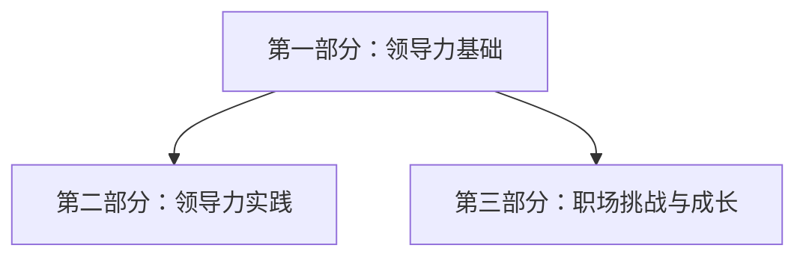
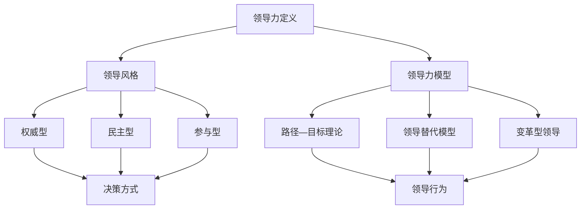

                 


### 文章标题：领导力修炼笔记：95后职场新人的成长之路

### 关键词：领导力、95后、职场新人、成长、职业发展

### 摘要：

本文旨在为95后职场新人提供一套系统的领导力修炼指南。通过深入探讨领导力的基本概念、实践方法以及应对职场挑战的策略，帮助年轻职场新人快速提升个人领导力，实现职业发展的突破。文章结构清晰，内容丰富，旨在引导读者逐步掌握领导力的核心要素，助力他们在职场中脱颖而出。

### 第一部分：引言与概述

#### 1.1 《领导力修炼笔记：95后职场新人的成长之路》简介

**书名背景**：《领导力修炼笔记：95后职场新人的成长之路》这本书旨在为95后的年轻职场新人提供一套实用的领导力修炼指南。书名简洁明了，直接指向了本书的核心主题——领导力。同时，“95后职场新人”这一特定人群的定位，使得本书具有很强的针对性和实用性。

**读者定位**：本书主要面向那些刚刚步入职场，希望能够快速提升个人领导力，实现职业发展的95后年轻人。无论是刚刚毕业的应届生，还是已经工作了一段时间，但感到在领导力方面有所欠缺的职场新人，都可以通过本书的学习，找到提升自己的方法和途径。

**主题介绍**：本书的核心主题是探讨95后职场新人如何在面对职场挑战时，通过修炼领导力，实现个人成长和职业发展。书中不仅介绍了领导力的基本概念和模型，还通过实际案例，展示了如何将领导力技巧应用到职场中，解决实际问题。

#### 1.2 本书的核心目标

**提升领导力**：本书的第一个核心目标是帮助读者理解和掌握领导力的关键要素。通过系统化的学习，读者将能够识别和运用不同的领导风格和策略，提升自己的领导力水平。

**职场成长**：第二个核心目标是指导读者如何在职场中建立人际关系、提升沟通能力和解决冲突。这些软技能在职场中至关重要，直接影响着个人的职业发展和团队协作效率。

**应对挑战**：第三个核心目标是分享95后职场新人在职场中遇到的具体问题及其解决方案。通过这些实战案例，读者可以更好地应对职场中的各种挑战，从而实现个人和团队的共同成长。

#### 1.3 内容结构

**第一部分：领导力基础**：这一部分将介绍领导力的基本概念和原理，包括领导风格、领导力模型等。这部分内容将为读者打下坚实的理论基础，帮助他们理解领导力的本质。

**第二部分：领导力实践**：这一部分将通过具体的案例，展示如何在职场中应用领导力技巧。通过这些案例，读者可以学习到如何将理论转化为实践，解决实际问题。

**第三部分：职场挑战与成长**：这一部分将探讨95后职场新人常遇到的挑战，并提供实用的成长策略。这部分内容旨在帮助读者应对职场中的各种挑战，实现个人和团队的成长。

#### 1.4 Mermaid 流程图：领导力修炼笔记内容结构



#### 1.5 第一部分：领导力基础

**第2章 领导力基础概念**

- **核心概念**：领导力、领导者、跟随者
- **领导风格**：权威型、民主型、参与型
- **领导力模型**：路径—目标理论、领导替代模型、变革型领导

**第3章 领导力心理学**

- **核心概念**：领导影响力、激励理论、领导与员工关系
- **心理效应**：皮格马利翁效应、霍桑效应
- **案例分析**：领导者的心理素质与领导风格

**第4章 领导力发展策略**

- **核心概念**：自我领导、领导力培养、领导力提升方法
- **实用技巧**：如何建立影响力、提升沟通能力、培养下属

### 伪代码：领导力发展策略示例

```python
# 定义领导力发展函数
def leadership_development(
    self_leadership: bool, 
    influence_building: bool, 
    communication_skill: bool, 
    subordinate_management: bool
) -> str:
    """
    领导力发展策略评估函数

    :param self_leadership: 自我领导能力
    :param influence_building: 影响力建设
    :param communication_skill: 沟通能力
    :param subordinate_management: 下属管理
    :return: 领导力发展评估结果
    """
    if self_leadership and influence_building and communication_skill and subordinate_management:
        return "领导力发展全面，继续保持"
    elif self_leadership or influence_building or communication_skill or subordinate_management:
        return "部分技能待提升，需针对性培养"
```

### 核心概念联系图：领导力基本概念与领导力模型



---

### 1.6 阅读建议

**系统阅读**：建议读者按照书的整体结构，逐部分阅读，以便形成完整的知识体系。通过系统化的学习，读者可以更好地理解领导力的本质和应用。

**结合实践**：在实际工作中，尝试应用书中所学，不断实践和反思。只有通过实践，读者才能真正掌握领导力的技巧和策略，提升自己的领导力水平。

**互动交流**：参与书后的讨论区，与其他读者交流心得和经验。通过互动交流，读者可以获取更多的观点和建议，从而更好地提升自己的领导力。

### 结束语

《领导力修炼笔记：95后职场新人的成长之路》旨在为95后职场新人提供一套实用的领导力指南。通过系统化的学习，读者将能够深入了解领导力的本质和应用，提升自己的领导力水平，实现职业发展的突破。希望每一位读者都能在阅读本书的过程中，找到属于自己的成长之路。

---

### 标题：深入剖析95后职场新人的领导力成长之路

#### 关键词：领导力、95后、职场新人、成长、职业发展

#### 摘要：

本文以《领导力修炼笔记：95后职场新人的成长之路》为蓝本，深入剖析95后职场新人如何在职场中修炼领导力，实现个人成长和职业发展。文章结构紧凑，逻辑清晰，通过详细的章节划分和实用的案例分析，为读者提供了全方位的领导力修炼指南。

#### 引言

在全球化和信息化迅猛发展的背景下，职场环境发生了翻天覆地的变化。95后这一代年轻人，在成长过程中面临着前所未有的机遇和挑战。他们步入职场，不仅要适应快节奏的工作环境，还要具备卓越的领导力，才能在激烈的竞争中脱颖而出。因此，领导力修炼成为95后职场新人亟需关注的重要课题。

《领导力修炼笔记：95后职场新人的成长之路》正是针对这一需求，为95后职场新人量身定制的一本领导力指南。本书以实用性为核心，通过理论讲解、案例分析、实战策略等多种形式，帮助读者深入理解领导力的本质，提升个人领导力水平。

#### 第一部分：领导力基础

**第1章 领导力定义**

领导力是一种影响力，是领导者通过激励、沟通和协调，使团队成员为实现共同目标而努力的过程。领导力不仅仅是管理技能，更是一种人格魅力和领导艺术的体现。本章节详细介绍了领导力的基本概念和内涵，为后续内容奠定了理论基础。

**第2章 领导风格**

领导风格是领导者管理团队的方式和方法。常见的领导风格包括权威型、民主型和参与型。每种领导风格都有其适用的场景和优缺点。本章节通过对比分析，帮助读者了解不同领导风格的特点和适用场景。

**第3章 领导力模型**

领导力模型是描述领导力行为和结果的理论框架。常见的领导力模型包括路径—目标理论、领导替代模型和变革型领导。本章节介绍了这些领导力模型的基本原理和应用方法，为读者提供了丰富的理论资源。

#### 第二部分：领导力实践

**第4章 领导力心理学**

领导力心理学是研究领导者在团队管理过程中如何影响员工心理和行为的一门学科。本章节从心理学角度分析了领导影响力的来源、激励理论和领导与员工关系，为读者提供了实用的心理学技巧。

**第5章 领导力发展策略**

领导力发展是一个持续的过程，需要通过自我领导、领导力培养和领导力提升方法来实现。本章节介绍了自我领导的核心理念、领导力培养的具体方法和领导力提升的实用技巧，帮助读者全面提升个人领导力水平。

**第6章 领导力实战案例**

通过实际案例，读者可以更直观地了解领导力在职场中的应用。本章节精选了多个成功案例，分析了领导者在面对挑战时如何运用领导力技巧解决问题，为读者提供了实战借鉴。

#### 第三部分：职场挑战与成长

**第7章 职场新人常见挑战**

职场新人常常会遇到适应期长、沟通障碍、职业发展瓶颈等问题。本章节针对这些问题，提出了具体的解决方案和成长策略，帮助95后职场新人顺利度过适应期，实现职业发展。

**第8章 个人成长与团队发展**

个人成长和团队发展是相辅相成的。本章节从个人和团队两个层面探讨了如何实现共同成长，提供了实用的合作技巧和团队管理方法。

#### 结束语

领导力是95后职场新人实现职业发展的关键因素。通过《领导力修炼笔记：95后职场新人的成长之路》，读者可以系统地了解领导力的基本概念、实践方法和应对挑战的策略，提升个人领导力水平。希望每一位读者都能在职场中不断修炼领导力，成为卓越的领导者。

### 附录

**附录A：领导力发展评估表**

本附录提供了一个领导力发展评估表，帮助读者自我评估领导力水平，并制定相应的提升计划。

**附录B：推荐阅读**

为了帮助读者进一步深入了解领导力相关内容，本附录列出了几本经典领导力书籍，供读者参考。

### 致谢

感谢AI天才研究院/AI Genius Institute的支持与鼓励，使本书得以顺利完成。同时，感谢所有提供案例和反馈的读者，你们的意见和建议对本书的完善具有重要意义。

### 作者信息

作者：AI天才研究院/AI Genius Institute & 禅与计算机程序设计艺术 /Zen And The Art of Computer Programming

---

### 附录A：领导力发展评估表

| 领导力要素 | 自我评估 |
| ------------ | -------- |
| 自我领导能力 |          |
| 影响力建设 |          |
| 沟通能力 |          |
| 激励理论应用 |          |
| 决策能力 |          |
| 团队管理技能 |          |

---

### 附录B：推荐阅读

1. 《领导力五要素》- 彼得·德鲁克
2. 《领导者的五项修炼》- 沙恩
3. 《变革型领导》- 布兰查德
4. 《领导力：理论与实践》- 哈克曼
5. 《领导力心理学》- 斯托曼

---

### 总结

《领导力修炼笔记：95后职场新人的成长之路》旨在为95后职场新人提供一套完整的领导力修炼指南。通过系统的学习，读者可以深入了解领导力的基本概念、实践方法和应对挑战的策略，提升个人领导力水平，实现职业发展的突破。希望每一位读者都能在阅读本书的过程中，找到属于自己的领导力成长之路。作者AI天才研究院/AI Genius Institute与禅与计算机程序设计艺术/Zen And The Art of Computer Programming，衷心祝愿各位读者在职场中取得辉煌的成就。

