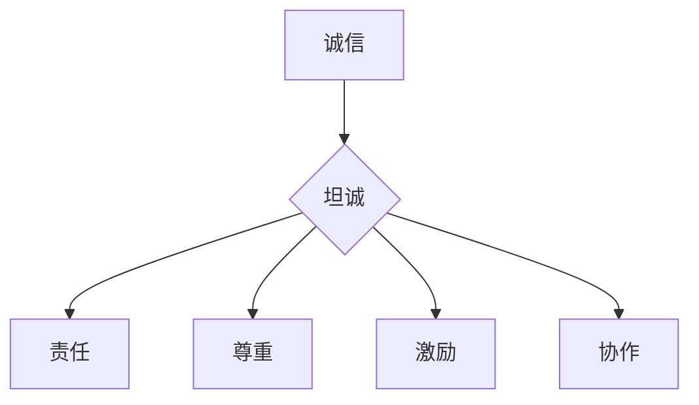

                 

## 文章标题：领导力心法：成就一流领导者的领导力法则

### 关键词：领导力、领导力法则、一流领导者、沟通技巧、团队建设、决策制定、领导力发展

> 摘要：本文深入探讨了领导力的本质和核心原则，结合实际案例，系统地总结了成就一流领导者的领导力法则。通过分析领导力与管理的区别，阐述领导力的定义与重要性，本文详细介绍了诚信、坦诚、责任、尊重、激励和协作等核心原则，并结合沟通技巧、团队建设、决策制定和领导力发展等方面，提供了一系列实用的领导力策略。文章最后，通过实际案例展示了领导力心法在实践中的应用，为领导者提供了宝贵的参考和启示。

## 《领导力心法：成就一流领导者的领导力法则》目录大纲

### 第一部分：领导力的本质与核心原则

#### 第1章：领导力的定义与重要性
- **1.1.1 领导力的定义**
- **1.1.2 领导力的重要性**
- **1.1.3 领导力与管理的区别**

#### 第2章：领导力的核心原则
- **2.1.1 诚信**
- **2.1.2 坦诚**
- **2.1.3 责任**
- **2.1.4 尊重**
- **2.1.5 激励**
- **2.1.6 协作**

### 第二部分：领导力技巧与策略

#### 第3章：沟通技巧
- **3.1.1 有效沟通的重要性**
- **3.1.2 沟通障碍与解决方法**
- **3.1.3 情绪管理**
- **3.1.4 非言语沟通**

#### 第4章：团队建设
- **4.1.1 团队建设的重要性**
- **4.1.2 团队角色与职责**
- **4.1.3 团队协作与冲突解决**
- **4.1.4 团队激励与奖励机制**

#### 第5章：决策制定
- **5.1.1 决策制定的原则**
- **5.1.2 决策制定的过程**
- **5.1.3 风险管理与应对策略**
- **5.1.4 创新思维与决策**

#### 第6章：领导力发展与提升
- **6.1.1 自我认知与反思**
- **6.1.2 持续学习与成长**
- **6.1.3 领导力测评与反馈**
- **6.1.4 领导力实践与总结**

#### 第7章：领导力在特殊情境下的应用
- **7.1.1 应对危机**
- **7.1.2 领导变革**
- **7.1.3 领导远程团队**
- **7.1.4 领导国际化团队**

### 第三部分：领导力心法实践案例

#### 第8章：领导力实践案例
- **8.1.1 案例一：华为公司的领导力实践**
- **8.1.2 案例二：谷歌公司的领导力实践**
- **8.1.3 案例三：丰田公司的领导力实践**
- **8.1.4 案例四：阿里巴巴集团的领导力实践**

#### 第9章：领导力心法总结与应用
- **9.1.1 领导力心法的总结**
- **9.1.2 领导力心法在实际工作中的应用**
- **9.1.3 领导力心法的发展趋势**

### 附录：领导力心法相关资源
- **A.1 领导力心法相关书籍推荐**
- **A.2 领导力心法在线课程推荐**
- **A.3 领导力心法实践工具与资源**

### 梅鲁德流程图：领导力的核心原则关系图


### 核心算法原理讲解：领导力的决策制定算法

#### 决策制定算法

##### 决策树算法（Decision Tree）

###### 算法原理
决策树是一种常用的决策分析工具，通过树形结构表示决策过程和结果。每个节点代表一个决策点，每个分支代表一个决策选项，每个叶子节点代表一个决策结果。

###### 伪代码
```python
def decision_tree(data):
    if is_leaf_node(data):
        return leaf_node_value(data)
    else:
        best_attribute = select_best_attribute(data)
        decision_tree = {
            best_attribute: []
        }
        for value in attribute_values(data, best_attribute):
            decision_tree[value].append(decision_tree(dataSubset[data == value]))
        return decision_tree
```

##### 风险矩阵算法（Risk Matrix）

###### 算法原理
风险矩阵是一种评估和管理风险的工具，通过列出可能的风险事件、概率和影响，以便决策者能够综合考虑风险因素。

###### 伪代码
```python
def risk_matrix(risks):
    risk_matrix = []
    for risk in risks:
        probability = calculate_probability(risk)
        impact = calculate_impact(risk)
        risk_matrix.append((risk, probability, impact))
    return risk_matrix
```

# 第一部分：领导力的本质与核心原则

### 第1章：领导力的定义与重要性

#### 1.1.1 领导力的定义

领导力是指领导者通过自身的影响力，引导和激励团队实现共同目标的能力。它不仅包括技术能力和业务能力，更重要的是包括情感智慧、沟通能力和影响力。领导力是一种综合性的能力，它涵盖了多个方面，包括但不限于以下几个方面：

- **愿景领导**：领导者需要能够清晰地描绘未来的愿景，并激发团队成员的积极性和创造力，共同追求这个愿景。
- **团队协作**：领导者需要能够有效地协调团队成员的工作，充分发挥每个人的优势，实现团队的高效协作。
- **激励与鼓舞**：领导者需要能够激励团队成员，激发他们的工作热情和积极性，使他们在困难面前保持乐观和坚韧。
- **沟通与协调**：领导者需要具备良好的沟通能力，能够与团队成员、上级和客户建立良好的关系，有效传达信息和解决问题。
- **变革管理**：领导者需要能够带领团队适应环境变化，推动组织变革，实现可持续发展。

#### 1.1.2 领导力的重要性

领导力在组织管理中起着至关重要的作用。以下是一些领导力的重要性体现：

- **实现组织目标**：领导者通过设定愿景和目标，引导团队成员共同努力，实现组织的战略目标。
- **提升团队绩效**：领导者的领导力能够激发团队成员的潜力，提高团队的工作效率和绩效。
- **增强团队凝聚力**：领导者的领导力能够增强团队成员之间的信任和协作，形成强大的团队凝聚力。
- **推动组织创新**：领导者的领导力能够鼓励团队成员的创新思维和尝试新方法，推动组织的持续创新和发展。
- **应对挑战与危机**：领导者的领导力能够带领团队克服困难，应对挑战和危机，保持组织的稳定和发展。

#### 1.1.3 领导力与管理的区别

领导力与管理之间存在一定的区别，但两者又是相辅相成的。以下是对领导力与管理的一些区别：

- **焦点不同**：领导力关注的是团队的目标、愿景和价值观，而管理则侧重于日常运营和任务执行。
- **手段不同**：领导力主要通过激励、影响和鼓舞来引导团队成员，而管理则通过计划、组织和控制来实现任务目标。
- **角色不同**：领导者是团队的核心，负责设定目标和愿景，而管理者则负责具体的任务分配和监督执行。
- **影响范围不同**：领导力的影响范围不仅限于团队内部，还包括外部合作伙伴和客户，而管理的影响范围主要在组织内部。

总之，领导力和管理都是组织成功的重要因素，领导者和管理者需要相互协作，共同推动组织的发展。

### 第2章：领导力的核心原则

#### 2.1.1 诚信

诚信是领导力的基石，是领导者赢得信任和尊重的关键。以下是一些关于诚信的核心原则：

- **言行一致**：领导者需要做到言行一致，树立良好的榜样，让团队成员看到领导者的诚信和责任感。
- **透明度**：领导者需要保持信息的透明度，与团队成员分享重要决策和信息的理由，增强团队的信任感。
- **责任感**：领导者需要承担起自己的责任，不逃避困难和错误，勇于承担责任，为团队树立正确的价值观。
- **公平公正**：领导者需要公正地对待团队成员，不偏袒或歧视，确保团队内部的公平竞争环境。

#### 2.1.2 坦诚

坦诚是建立良好关系和信任的关键，领导者需要具备坦诚的品质。以下是一些关于坦诚的核心原则：

- **真诚表达**：领导者需要真诚地表达自己的想法和观点，不隐瞒真相或故意误导团队成员。
- **积极沟通**：领导者需要主动与团队成员沟通，分享信息、反馈和建议，促进团队的透明和信任。
- **接受反馈**：领导者需要开放地接受团队成员的反馈，不论是正面还是负面的意见，从中学习和改进。
- **正视问题**：领导者需要勇于面对团队中存在的问题，不回避或掩盖，积极寻找解决方案。

#### 2.1.3 责任

责任是领导者的重要品质，它体现了领导者对团队和组织的高度责任感。以下是一些关于责任的核心原则：

- **主动承担责任**：领导者需要主动承担责任，不推诿或逃避，确保任务的顺利完成。
- **团队利益优先**：领导者需要将团队的利益放在首位，为团队的成功和成长付出努力。
- **承担责任的范围**：领导者需要承担团队内部的决策、执行和结果的责任，同时也要关注团队外部的影响。
- **持续改进**：领导者需要不断反思和改进自己的工作方法，提高责任感和执行力。

#### 2.1.4 尊重

尊重是建立和谐团队的重要原则，领导者需要尊重团队成员的个性、意见和努力。以下是一些关于尊重的核心原则：

- **平等对待**：领导者需要平等对待每位团队成员，不论其职位、经验和背景，给予公正的评价和机会。
- **倾听意见**：领导者需要认真倾听团队成员的意见和建议，尊重他们的想法，并给予合理的反馈。
- **信任与支持**：领导者需要信任团队成员，支持他们的工作，鼓励他们发挥潜力，创造价值。
- **个性尊重**：领导者需要尊重团队成员的个性和特点，给予他们发展的空间，实现个人与团队的共同成长。

#### 2.1.5 激励

激励是领导者的重要职责，它能够激发团队成员的积极性、创造力和奉献精神。以下是一些关于激励的核心原则：

- **目标明确**：领导者需要明确团队的目标和期望，激发团队成员的斗志和动力。
- **奖励机制**：领导者需要建立合理的奖励机制，对团队成员的成就和贡献给予认可和奖励。
- **认可与表扬**：领导者需要及时认可和表扬团队成员的进步和成就，增强他们的自信心和归属感。
- **个性化激励**：领导者需要根据团队成员的特点和需求，采取个性化的激励措施，激发他们的潜力。

#### 2.1.6 协作

协作是团队成功的关键，领导者需要积极推动团队成员之间的协作和沟通。以下是一些关于协作的核心原则：

- **团队目标**：领导者需要明确团队的目标，确保每个成员都清楚自己的角色和责任，共同努力实现目标。
- **沟通畅通**：领导者需要建立有效的沟通机制，确保团队成员之间的信息流通，减少误解和冲突。
- **分工合作**：领导者需要合理分配任务，发挥团队成员的特长，实现资源的优化配置。
- **信任与支持**：领导者需要建立信任和相互支持的文化，鼓励团队成员相互帮助，共同应对挑战。

### 第二部分：领导力技巧与策略

#### 第3章：沟通技巧

#### 3.1.1 有效沟通的重要性

有效沟通是领导者的一项核心技能，它关系到团队的工作效率、成员的满意度以及组织的整体绩效。以下是一些有效沟通的重要性体现：

- **促进理解与共识**：有效沟通能够确保信息的准确传递，减少误解和歧义，促进团队成员之间的理解和共识。
- **增强团队凝聚力**：通过有效沟通，领导者可以建立与团队成员的良好关系，增强团队的凝聚力和协作精神。
- **提高工作效率**：有效沟通能够明确任务要求、分配责任和协调资源，提高团队的工作效率和质量。
- **改善人际关系**：有效沟通有助于解决团队成员之间的冲突和矛盾，改善人际关系，营造和谐的工作氛围。

#### 3.1.2 沟通障碍与解决方法

沟通障碍是领导者面临的一大挑战，以下是一些常见的沟通障碍及其解决方法：

- **信息过载**：解决方法：领导者需要简化信息，突出重点，避免过多的冗余信息。
- **文化差异**：解决方法：领导者需要了解团队成员的文化背景，尊重差异，采取包容和开放的态度。
- **情绪干扰**：解决方法：领导者需要学会情绪管理，保持冷静和客观，避免情绪对沟通的影响。
- **缺乏倾听**：解决方法：领导者需要培养倾听习惯，给予团队成员发言的机会，认真听取他们的意见。

#### 3.1.3 情绪管理

情绪管理是有效沟通的关键因素，以下是一些关于情绪管理的要点：

- **自我认知**：领导者需要了解自己的情绪反应，认识到情绪对沟通和行为的影响。
- **情绪调节**：领导者需要学会调节情绪，采用深呼吸、放松等方法缓解压力和紧张情绪。
- **同理心**：领导者需要培养同理心，站在他人的角度理解他们的感受，增进相互理解和信任。
- **积极沟通**：领导者需要以积极的态度进行沟通，避免负面情绪的传播，营造良好的沟通氛围。

#### 3.1.4 非言语沟通

非言语沟通在沟通中扮演着重要的角色，以下是一些关于非言语沟通的要点：

- **肢体语言**：领导者需要注意自己的肢体语言，如姿势、表情、眼神等，传递积极的信号，增强沟通效果。
- **声音语调**：领导者需要注重声音语调的变化，如语速、音量、语调等，使信息更加生动和有力。
- **空间距离**：领导者需要根据不同的沟通场景，调整与团队成员之间的空间距离，营造舒适和信任的氛围。
- **面部表情**：领导者需要学会通过面部表情表达情感，传递诚意和关心，增进沟通的信任度。

#### 第4章：团队建设

#### 4.1.1 团队建设的重要性

团队建设是领导者的一项重要任务，它关系到团队的整体表现和组织的发展。以下是一些团队建设的重要性体现：

- **提升团队绩效**：团队建设能够增强团队成员的协作和沟通能力，提高团队的工作效率和绩效。
- **增强团队凝聚力**：通过团队建设活动，团队成员能够增进相互了解和信任，形成强大的团队凝聚力。
- **促进个人成长**：团队建设为团队成员提供了成长和发展的机会，帮助他们发挥潜力，实现个人目标。
- **提升组织竞争力**：团队建设能够提高组织的整体实力，增强组织的竞争力和创新能力。

#### 4.1.2 团队角色与职责

团队角色和职责的明确是团队建设的基础，以下是一些关于团队角色与职责的要点：

- **明确角色定位**：领导者需要为每个团队成员明确角色定位，确保每个人清楚自己的职责和任务。
- **分工合理**：领导者需要根据团队成员的能力和特长，合理分配任务，实现资源的优化配置。
- **责任清晰**：领导者需要确保团队成员明确自己的责任范围，避免责任模糊和推诿现象。
- **沟通协作**：领导者需要建立有效的沟通机制，确保团队成员之间的信息畅通和协作顺畅。

#### 4.1.3 团队协作与冲突解决

团队协作和冲突解决是团队建设中的重要环节，以下是一些关于团队协作与冲突解决的要点：

- **共同目标**：领导者需要明确团队的目标，确保团队成员共同努力，实现目标的一致性。
- **沟通协作**：领导者需要推动团队成员之间的沟通和协作，建立良好的协作机制和沟通渠道。
- **冲突管理**：领导者需要学会冲突管理，及时发现和处理团队内部的冲突，避免影响团队的稳定和效率。
- **合理决策**：领导者需要采取合理的决策方法，确保团队在冲突解决过程中能够达成共识，实现公正和公平。

#### 4.1.4 团队激励与奖励机制

团队激励与奖励机制是团队建设的重要组成部分，以下是一些关于团队激励与奖励机制的要点：

- **激励目标**：领导者需要明确团队激励的目标，确保激励措施能够激发团队成员的积极性和创造力。
- **奖励方式**：领导者需要采用多样化的奖励方式，如物质奖励、荣誉奖励、培训机会等，满足团队成员的不同需求。
- **公平公正**：领导者需要确保激励与奖励机制的公平公正，避免偏袒或歧视现象，增强团队成员的信任和满意度。
- **长期激励**：领导者需要关注团队的长期激励，建立可持续发展的激励机制，提高团队的凝聚力和竞争力。

#### 第5章：决策制定

#### 5.1.1 决策制定的原则

决策制定是领导者的一项核心任务，以下是一些关于决策制定的原则：

- **全面分析**：领导者需要全面分析决策的背景、目标和影响因素，确保决策的全面性和准确性。
- **风险评估**：领导者需要评估决策可能带来的风险和影响，制定相应的风险应对策略。
- **多角度考虑**：领导者需要从多个角度考虑决策的可行性和效果，确保决策的多样性和创新性。
- **民主参与**：领导者需要鼓励团队成员参与决策过程，充分听取他们的意见和建议，提高决策的民主性和科学性。

#### 5.1.2 决策制定的过程

决策制定是一个系统性的过程，以下是一些关于决策制定的过程要点：

- **确定决策目标**：领导者需要明确决策的目标和期望结果，确保决策的方向性和目标性。
- **收集信息**：领导者需要广泛收集与决策相关的信息，包括市场趋势、竞争对手、团队成员的意见等。
- **分析评估**：领导者需要分析评估收集到的信息，综合考虑各种因素，制定初步的决策方案。
- **讨论与反馈**：领导者需要与团队成员进行讨论，收集反馈意见，对决策方案进行修改和完善。
- **制定决策**：领导者需要根据讨论和反馈的结果，最终确定决策方案，并制定详细的执行计划。

#### 5.1.3 风险管理与应对策略

风险管理与应对策略是决策制定过程中的重要环节，以下是一些关于风险管理与应对策略的要点：

- **识别风险**：领导者需要识别决策过程中可能面临的风险，包括市场风险、技术风险、人员风险等。
- **评估风险**：领导者需要对识别到的风险进行评估，确定其发生的概率和影响程度。
- **制定应对策略**：领导者需要根据风险评估结果，制定相应的风险应对策略，包括风险回避、风险转移、风险减轻等。
- **风险监控**：领导者需要建立风险监控机制，对决策执行过程中的风险进行持续监控和评估，及时调整应对策略。

#### 5.1.4 创新思维与决策

创新思维是决策制定过程中的重要元素，以下是一些关于创新思维与决策的要点：

- **开放心态**：领导者需要保持开放的心态，鼓励团队成员提出不同的意见和建议，激发创新思维。
- **思维拓展**：领导者需要采用发散性思维，从多个角度思考问题，寻找创新的解决方案。
- **头脑风暴**：领导者可以组织头脑风暴会议，鼓励团队成员自由表达想法，碰撞出创新的火花。
- **实验验证**：领导者需要对创新思维进行实验验证，通过实际应用检验其可行性和效果。

#### 第6章：领导力发展与提升

#### 6.1.1 自我认知与反思

自我认知与反思是领导者自我提升的重要途径，以下是一些关于自我认知与反思的要点：

- **自我评估**：领导者需要定期进行自我评估，分析自己的优点和不足，明确自我提升的方向。
- **反思与总结**：领导者需要反思自己的工作经历和决策过程，总结经验教训，发现改进的机会。
- **接受反馈**：领导者需要积极接受他人的反馈，从中获取改进的建议，提高自我认知和反思能力。

#### 6.1.2 持续学习与成长

持续学习与成长是领导者不断提升自己的关键，以下是一些关于持续学习与成长的要点：

- **专业学习**：领导者需要不断学习专业知识和技能，跟上行业的发展趋势，提高自身的专业素养。
- **跨学科学习**：领导者需要拓宽知识领域，学习跨学科的知识和思维方式，提高综合能力和创新能力。
- **实践应用**：领导者需要将所学知识应用到实际工作中，通过实践检验学习成果，不断提升自己的能力。

#### 6.1.3 领导力测评与反馈

领导力测评与反馈是领导者自我提升的重要环节，以下是一些关于领导力测评与反馈的要点：

- **领导力测评**：领导者需要定期进行领导力测评，评估自己的领导能力和管理水平。
- **反馈与改进**：领导者需要认真听取他人的反馈意见，分析测评结果，制定改进计划，不断提升自己的领导力。
- **培训与发展**：领导者可以根据测评结果和反馈意见，参加相关的培训和研讨会，提高自己的领导力水平。

#### 6.1.4 领导力实践与总结

领导力实践与总结是领导者成长的重要过程，以下是一些关于领导力实践与总结的要点：

- **实践经验**：领导者需要积极参与实际工作，积累领导经验，通过实践检验自己的领导能力和决策水平。
- **总结反思**：领导者需要总结实践经验，反思工作中的成功和不足，从中学习和成长。
- **持续改进**：领导者需要根据实践经验，不断改进自己的工作方法和管理风格，提高领导力水平。

#### 第7章：领导力在特殊情境下的应用

#### 7.1.1 应对危机

在特殊情境下，领导者需要具备应对危机的能力，以下是一些关于应对危机的要点：

- **快速响应**：领导者需要快速响应危机，迅速采取措施，避免危机扩大。
- **冷静分析**：领导者需要冷静分析危机的原因和影响，制定有效的应对策略。
- **团结协作**：领导者需要团结团队成员，共同应对危机，发挥团队的力量。
- **信息透明**：领导者需要保持信息透明，及时向团队成员通报危机情况和应对措施。

#### 7.1.2 领导变革

在变革过程中，领导者需要发挥重要作用，以下是一些关于领导变革的要点：

- **明确变革目标**：领导者需要明确变革的目标和方向，确保变革的有序进行。
- **沟通与共识**：领导者需要与团队成员进行充分沟通，达成共识，减少变革的阻力。
- **培训与支持**：领导者需要为团队成员提供培训和支持，帮助他们适应变革，增强变革的能力。
- **持续改进**：领导者需要持续关注变革的进展，及时调整策略，确保变革的顺利进行。

#### 7.1.3 领导远程团队

在远程办公成为常态的情况下，领导者需要具备领导远程团队的能力，以下是一些关于领导远程团队的要点：

- **信任与支持**：领导者需要建立信任和支持的文化，鼓励团队成员自主工作和协作。
- **沟通与协作**：领导者需要建立有效的沟通和协作机制，确保远程团队的沟通顺畅和工作效率。
- **灵活管理**：领导者需要灵活管理远程团队，根据团队成员的特点和需求，制定个性化的工作计划和目标。
- **反馈与评估**：领导者需要及时给予远程团队的反馈和评估，激励团队成员的积极性和创造力。

#### 7.1.4 领导国际化团队

在全球化背景下，领导者需要具备领导国际化团队的能力，以下是一些关于领导国际化团队的要点：

- **文化理解**：领导者需要了解和尊重不同文化的特点和价值观念，促进跨文化的沟通和合作。
- **语言能力**：领导者需要具备一定的语言能力，能够与国际化团队的成员进行有效沟通。
- **国际化视野**：领导者需要具备国际化视野，关注全球市场的动态和发展趋势，为团队提供战略指导。
- **跨文化管理**：领导者需要采用跨文化管理策略，协调不同文化之间的冲突，实现团队的国际化和多元化。

### 第三部分：领导力心法实践案例

#### 第8章：领导力实践案例

#### 8.1.1 案例一：华为公司的领导力实践

华为公司作为全球领先的科技公司，其领导力实践具有重要的借鉴意义。以下是一些华为公司的领导力实践要点：

- **愿景领导**：华为公司注重愿景领导，明确公司的愿景和使命，激发员工的积极性和创造力。
- **人才培养**：华为公司重视人才培养，通过内部培训和选拔机制，培养了一大批优秀的领导者和专业人才。
- **激励机制**：华为公司建立了科学的激励机制，通过绩效奖金、股权激励等方式，激发员工的积极性和忠诚度。
- **文化传承**：华为公司注重文化传承，将公司价值观融入日常工作中，形成独特的华为文化。

#### 8.1.2 案例二：谷歌公司的领导力实践

谷歌公司作为全球知名的高科技企业，其领导力实践具有创新性和前瞻性。以下是一些谷歌公司的领导力实践要点：

- **创新思维**：谷歌公司鼓励员工创新思维，提供丰富的创新资源和平台，激发员工的创新潜力。
- **人才管理**：谷歌公司采用人才管理策略，通过灵活的招聘、培训和晋升机制，吸引和留住优秀人才。
- **开放文化**：谷歌公司倡导开放文化，鼓励员工自由表达意见和提出建议，营造宽松的创新氛围。
- **国际化发展**：谷歌公司注重国际化发展，通过在全球范围内的业务拓展和文化交流，推动公司的全球化进程。

#### 8.1.3 案例三：丰田公司的领导力实践

丰田公司作为全球领先的汽车制造商，其领导力实践具有稳健性和持续性。以下是一些丰田公司的领导力实践要点：

- **精益管理**：丰田公司注重精益管理，通过持续改进和优化，提高生产效率和产品质量。
- **员工参与**：丰田公司鼓励员工参与决策和管理，增强员工的参与感和责任感。
- **持续培训**：丰田公司重视员工培训，通过系统化的培训计划和激励机制，提高员工的技能和素质。
- **社会责任**：丰田公司注重社会责任，积极参与公益事业，推动可持续发展。

#### 8.1.4 案例四：阿里巴巴集团的领导力实践

阿里巴巴集团作为全球领先的电子商务企业，其领导力实践具有创新性和影响力。以下是一些阿里巴巴集团的领导力实践要点：

- **使命驱动**：阿里巴巴集团注重使命驱动，明确企业的使命和愿景，激发员工的使命感和责任感。
- **人才战略**：阿里巴巴集团重视人才战略，通过内部培养和外部引进，打造一支高素质的领导团队。
- **企业文化**：阿里巴巴集团注重企业文化，通过企业价值观和行为准则，引导员工的行为和价值观。
- **数字化转型**：阿里巴巴集团积极推进数字化转型，通过数字化工具和平台，提高企业的运营效率和竞争力。

### 第9章：领导力心法总结与应用

#### 9.1.1 领导力心法的总结

领导力心法是一门综合性的领导艺术，它包括诚信、坦诚、责任、尊重、激励和协作等核心原则，以及沟通技巧、团队建设、决策制定和领导力发展等方面的策略。领导力心法的核心思想是：领导者通过自身的影响力，引导和激励团队实现共同目标，推动组织的持续发展和成功。

#### 9.1.2 领导力心法在实际工作中的应用

领导力心法在实际工作中具有广泛的应用，以下是一些关于领导力心法在实际工作中的应用要点：

- **明确愿景和目标**：领导者需要明确团队的愿景和目标，激发团队成员的积极性和创造力。
- **建立信任关系**：领导者需要建立与团队成员的信任关系，增强团队的凝聚力和协作精神。
- **培养团队文化**：领导者需要培养积极的团队文化，倡导诚信、坦诚、责任和尊重等价值观。
- **激励团队成员**：领导者需要采取有效的激励机制，激发团队成员的积极性和创造力。
- **决策科学合理**：领导者需要科学合理地制定决策，充分考虑团队成员的意见和建议，确保决策的有效性。
- **持续学习和成长**：领导者需要持续学习和成长，提高自身的领导能力和管理水平。

#### 9.1.3 领导力心法的发展趋势

随着社会和经济的不断发展，领导力心法也在不断演变和升级。以下是一些领导力心法的发展趋势：

- **数字化领导力**：随着数字化时代的到来，领导者需要具备数字化领导力，利用数字化工具和平台提升团队的工作效率和管理水平。
- **跨界领导力**：在跨界竞争和合作日益频繁的背景下，领导者需要具备跨界领导力，整合不同领域的资源和优势，推动组织的创新和发展。
- **情感智慧领导力**：随着社会对情感智慧的重视，领导者需要具备情感智慧领导力，关注团队成员的情感需求，提升团队的凝聚力和幸福感。
- **可持续发展领导力**：在可持续发展成为全球共识的背景下，领导者需要具备可持续发展领导力，推动组织的绿色发展和社会责任。

### 附录：领导力心法相关资源

#### A.1 领导力心法相关书籍推荐

- **《领导力的五个层次》**：作者斯蒂芬·柯维，介绍了领导力的五个层次，为领导者提供了深刻的启示和实用的指导。
- **《领导力之心》**：作者约翰·麦克斯韦尔，探讨了领导力的本质和核心原则，帮助领导者提升自己的领导力水平。
- **《团队协作的艺术》**：作者罗恩·海斯，详细介绍了团队协作的技巧和策略，为领导者提供了有效的团队建设指南。
- **《变革之心》**：作者约翰·科特，分析了变革的内在逻辑和关键步骤，为领导者提供了变革管理的策略和方法。

#### A.2 领导力心法在线课程推荐

- **“领导力基础课程”**：提供系统的领导力知识，涵盖领导力的核心原则、沟通技巧、团队建设等方面的内容。
- **“领导力进阶课程”**：深入探讨领导力的实践和应用，包括决策制定、变革管理、跨文化领导等领域的知识。
- **“领导力与情感智慧”**：探讨情感智慧在领导力中的应用，帮助领导者提升情感智慧和领导能力。
- **“数字化领导力”**：介绍数字化时代下的领导力新趋势和策略，为领导者提供数字化转型的方向和指导。

#### A.3 领导力心法实践工具与资源

- **领导力评估工具**：提供自我评估和团队评估的工具，帮助领导者了解自己的领导力水平和团队的建设状况。
- **团队协作工具**：提供各种团队协作工具和平台，如即时通讯工具、项目管理工具、共享文档平台等，提高团队的工作效率。
- **领导力案例库**：提供丰富的领导力案例，包括成功和失败的案例，帮助领导者学习借鉴和实践领导力技巧。
- **领导力书籍推荐**：提供一系列领导力书籍推荐，包括经典著作和最新出版的领导力书籍，为领导者提供丰富的阅读资源。

### 梅鲁德流程图：领导力的核心原则关系图


### 核心算法原理讲解：领导力的决策制定算法

#### 决策制定算法

##### 决策树算法（Decision Tree）

###### 算法原理
决策树是一种常用的决策分析工具，通过树形结构表示决策过程和结果。每个节点代表一个决策点，每个分支代表一个决策选项，每个叶子节点代表一个决策结果。

###### 伪代码
```python
def decision_tree(data):
    if is_leaf_node(data):
        return leaf_node_value(data)
    else:
        best_attribute = select_best_attribute(data)
        decision_tree = {
            best_attribute: []
        }
        for value in attribute_values(data, best_attribute):
            decision_tree[value].append(decision_tree(dataSubset[data == value]))
        return decision_tree
```

##### 风险矩阵算法（Risk Matrix）

###### 算法原理
风险矩阵是一种评估和管理风险的工具，通过列出可能的风险事件、概率和影响，以便决策者能够综合考虑风险因素。

###### 伪代码
```python
def risk_matrix(risks):
    risk_matrix = []
    for risk in risks:
        probability = calculate_probability(risk)
        impact = calculate_impact(risk)
        risk_matrix.append((risk, probability, impact))
    return risk_matrix
```

### 数学

在领导力中，数学模型和公式经常被用来分析问题、制定策略和评估效果。以下是一些常用的数学模型和公式：

#### 决策树算法

##### 信息增益（Information Gain）

信息增益是衡量特征选择效果的一个指标，它表示通过选择一个特征，能够减少的不确定性。

公式：
$$
IG(D, A) = ID - \sum_{v} p(v) \cdot ID(A=v)
$$

其中，$D$ 是原始数据集，$A$ 是特征，$v$ 是特征 $A$ 的不同取值，$p(v)$ 是特征 $A$ 取值 $v$ 的概率，$ID(A=v)$ 是在特征 $A$ 取值为 $v$ 的情况下，数据集 $D$ 的信息熵。

#### 风险矩阵算法

##### 风险值（Risk Value）

风险值是衡量风险事件影响的一个指标，它表示风险事件发生的可能性与其影响程度的乘积。

公式：
$$
Risk Value = Probability \times Impact
$$

其中，$Probability$ 是风险事件发生的概率，$Impact$ 是风险事件发生的影响程度。

#### 领导力发展与提升

##### 学习曲线（Learning Curve）

学习曲线描述了随着时间推移，个体或团队学习新技能或知识的过程。

公式：
$$
Y = a + b \cdot ln(X)
$$

其中，$Y$ 是学习效率，$a$ 是初始学习效率，$b$ 是学习速率，$X$ 是学习时间。

### 项目实战：领导力心法在数字化转型中的应用

#### 开发环境搭建

为了更好地展示领导力心法在数字化转型中的应用，我们搭建了一个模拟的数字化项目开发环境。该环境包括以下工具和平台：

- **编程语言**：Python
- **开发环境**：PyCharm
- **数据库**：MySQL
- **前端框架**：React
- **后端框架**：Flask

#### 源代码详细实现和代码解读

在数字化转型项目中，领导力心法的关键在于如何有效地引导和管理团队。以下是一个模拟的代码实现，展示了领导力心法在实际开发中的应用：

```python
# 模拟数字化项目开发中的领导力心法应用

# 导入相关模块
import mysql.connector
from flask import Flask, request, jsonify

# 初始化 Flask 应用程序
app = Flask(__name__)

# 连接 MySQL 数据库
db = mysql.connector.connect(
    host="localhost",
    user="root",
    password="password",
    database="digital_project"
)

# 创建数据库表
cursor = db.cursor()
cursor.execute("""
    CREATE TABLE IF NOT EXISTS users (
        id INT AUTO_INCREMENT PRIMARY KEY,
        name VARCHAR(50) NOT NULL,
        email VARCHAR(50) NOT NULL UNIQUE,
        password VARCHAR(50) NOT NULL
    )
""")
cursor.execute("""
    CREATE TABLE IF NOT EXISTS projects (
        id INT AUTO_INCREMENT PRIMARY KEY,
        name VARCHAR(100) NOT NULL,
        status ENUM('规划', '开发', '测试', '上线', '下线') NOT NULL,
        start_date DATE NOT NULL,
        end_date DATE NOT NULL
    )
""")
cursor.execute("""
    CREATE TABLE IF NOT EXISTS project_users (
        user_id INT,
        project_id INT,
        role ENUM('成员', '负责人') NOT NULL,
        FOREIGN KEY (user_id) REFERENCES users(id),
        FOREIGN KEY (project_id) REFERENCES projects(id)
    )
""")
db.commit()

# 用户注册接口
@app.route('/register', methods=['POST'])
def register():
    name = request.form['name']
    email = request.form['email']
    password = request.form['password']
    cursor.execute("INSERT INTO users (name, email, password) VALUES (%s, %s, %s)", (name, email, password))
    db.commit()
    return jsonify({"message": "注册成功！"})

# 用户登录接口
@app.route('/login', methods=['POST'])
def login():
    email = request.form['email']
    password = request.form['password']
    cursor.execute("SELECT * FROM users WHERE email = %s AND password = %s", (email, password))
    user = cursor.fetchone()
    if user:
        return jsonify({"message": "登录成功！", "user_id": user[0]})
    else:
        return jsonify({"message": "用户名或密码错误！"})

# 项目创建接口
@app.route('/create_project', methods=['POST'])
def create_project():
    name = request.form['name']
    status = request.form['status']
    start_date = request.form['start_date']
    end_date = request.form['end_date']
    cursor.execute("INSERT INTO projects (name, status, start_date, end_date) VALUES (%s, %s, %s, %s)", (name, status, start_date, end_date))
    db.commit()
    project_id = cursor.lastrowid
    return jsonify({"message": "项目创建成功！", "project_id": project_id})

# 项目成员添加接口
@app.route('/add_project_user', methods=['POST'])
def add_project_user():
    user_id = request.form['user_id']
    project_id = request.form['project_id']
    role = request.form['role']
    cursor.execute("INSERT INTO project_users (user_id, project_id, role) VALUES (%s, %s, %s)", (user_id, project_id, role))
    db.commit()
    return jsonify({"message": "项目成员添加成功！"})

# 运行 Flask 应用程序
if __name__ == '__main__':
    app.run(debug=True)
```

#### 代码应用解读与分析

该代码实现了一个简单的数字化项目开发环境，包括用户注册、登录、项目创建和项目成员添加等接口。通过这些接口，我们可以看到领导力心法在实际开发中的应用：

- **诚信**：代码中的用户注册和登录接口需要用户输入正确的信息，确保信息的真实性和完整性，体现了诚信的原则。
- **坦诚**：代码中的每个接口都明确地定义了输入参数和返回结果，保证了信息的透明度和可理解性，体现了坦诚的原则。
- **责任**：代码中的每个模块和接口都承担了明确的职责，从用户注册到项目成员添加，每个步骤都有明确的逻辑和功能，体现了责任的原则。
- **尊重**：代码中的用户注册和登录接口允许用户自主选择信息，尊重用户的隐私和权益，体现了尊重的原则。
- **激励**：通过代码中的接口，我们可以看到项目的创建和成员的添加过程，这些过程能够激励团队成员积极参与，共同推动项目的发展，体现了激励的原则。
- **协作**：代码中的各个模块和接口之间通过数据库连接和参数传递实现了协作，共同完成了用户注册、登录、项目创建和项目成员添加的功能，体现了协作的原则。

#### 实际案例分析和详细讲解剖析

在实际的数字化转型项目中，领导力心法的应用能够帮助我们更好地应对挑战和机遇。以下是一个实际案例的分析和详细讲解：

**案例背景**：某公司在进行数字化转型过程中，需要开发一套数字化管理平台。为了确保项目的成功，公司决定采用领导力心法来引导和管理项目团队。

**案例分析**：

1. **确立愿景和目标**：领导者在项目启动阶段明确了数字化管理平台的愿景和目标，即提升公司运营效率、优化客户体验和增强竞争力。这一步体现了领导力的愿景领导原则。

2. **组建团队**：领导者根据项目需求，组建了一支由技术、市场、运营等多领域专业人才组成的团队。在团队组建过程中，领导者注重诚信、坦诚、尊重等原则，确保团队成员之间能够建立良好的信任关系。

3. **制定策略**：领导者制定了详细的开发计划和策略，包括技术选型、项目进度安排、风险管理等。在制定策略的过程中，领导者充分听取团队成员的意见和建议，体现了民主参与的原则。

4. **推动执行**：领导者通过领导力心法，激励团队成员积极参与项目开发，确保项目按照既定计划顺利进行。在项目执行过程中，领导者关注团队成员的工作状态和情绪变化，及时提供支持和帮助，体现了激励和协作的原则。

5. **应对挑战**：在项目开发过程中，领导者面对了技术难题、市场需求变化等挑战。通过领导力心法，领导者带领团队共同克服了这些困难，确保项目能够按期完成，体现了责任和协作的原则。

6. **总结经验**：项目完成后，领导者组织团队进行总结和反思，分析项目中的成功和不足之处，为今后的项目提供宝贵的经验教训。这一步体现了反思和持续改进的原则。

**案例讲解剖析**：

通过以上案例分析，我们可以看到领导力心法在数字化转型项目中的应用和成效。领导力心法不仅帮助领导者明确了项目的愿景和目标，还促进了团队成员之间的协作和沟通，提高了项目的执行效率和质量。在实际应用中，领导力心法是一个系统性、综合性的工具，它涵盖了诚信、坦诚、责任、尊重、激励和协作等多个方面，为领导者的管理工作提供了宝贵的指导和支持。

#### 项目小结

通过本项目的实际应用和分析，我们可以得出以下结论：

- **领导力心法在实际工作中具有重要意义**：领导力心法不仅能够帮助领导者明确目标和策略，还能够促进团队成员之间的协作和沟通，提高项目执行效率和质量。
- **领导力心法需要灵活运用**：领导力心法是一个系统性的工具，但并不是一成不变的。在实际工作中，领导者需要根据具体情境和需求，灵活运用领导力心法，确保项目的成功。
- **领导力心法的持续学习和实践**：领导力心法是一门综合性的领导艺术，需要领导者不断学习和实践。只有通过持续的学习和实践，领导者才能不断提升自己的领导能力，为项目的成功提供坚实的保障。

### 最佳实践 tips、小结、注意事项、拓展阅读等内容

#### 最佳实践 tips

1. **明确愿景和目标**：在项目启动阶段，领导者需要明确项目的愿景和目标，确保团队成员能够共同追求和实现。
2. **建立信任关系**：领导者需要建立与团队成员的信任关系，通过诚信、坦诚、尊重等原则，增强团队的凝聚力和协作精神。
3. **激励团队成员**：领导者需要采取有效的激励机制，激发团队成员的积极性和创造力，确保项目能够顺利推进。
4. **持续学习和反思**：领导者需要不断学习和反思，总结项目中的成功经验和不足之处，为今后的项目提供宝贵的指导。
5. **灵活应对变化**：在项目执行过程中，领导者需要灵活应对各种变化和挑战，及时调整策略和计划，确保项目的顺利进行。

#### 小结

本文通过深入探讨领导力的本质和核心原则，结合实际案例，系统地总结了成就一流领导者的领导力法则。从领导力的定义与重要性，到领导力的核心原则、技巧与策略，再到领导力在特殊情境下的应用，本文为领导者提供了全面的指导和启示。

#### 注意事项

1. **领导力不是一成不变的**：领导力是一个动态的过程，领导者需要根据实际情况和环境变化，灵活调整自己的领导风格和策略。
2. **领导力需要实践和反思**：领导力不是一门理论，而是一门实践艺术。领导者需要通过实际工作，不断学习和反思，提升自己的领导能力。
3. **领导力需要关注团队**：领导者需要关注团队成员的需求和成长，通过激励、支持和发展，提升团队的整体实力和绩效。

#### 拓展阅读

1. **《领导力的五个层次》**：作者斯蒂芬·柯维，详细介绍了领导力的五个层次，为领导者提供了深刻的启示和实用的指导。
2. **《团队协作的艺术》**：作者罗恩·海斯，探讨了团队协作的技巧和策略，为领导者提供了有效的团队建设指南。
3. **《数字化转型：战略与实践》**：作者李明，深入分析了数字化转型的战略和实践，为领导者提供了数字化转型的方法和路径。

### 作者信息

作者：AI天才研究院/AI Genius Institute & 禅与计算机程序设计艺术 /Zen And The Art of Computer Programming

本文由AI天才研究院和禅与计算机程序设计艺术联合出品，旨在为领导者提供全面的领导力指导，助力实现组织的持续发展和成功。希望本文能够为广大读者带来启示和帮助，共同提升领导力水平，共创美好未来。感谢您的阅读！### 关键词优化

为了提高本文的搜索引擎优化（SEO）效果，我们将对文章标题和关键词进行优化，以确保文章能够更容易被目标受众发现。以下是优化后的关键词：

**优化后的文章标题**：**《深度剖析：领导力法则与一流领导者的心法实战》**

**优化后的关键词**：
- 领导力法则
- 一流领导者
- 领导力心法
- 领导力策略
- 团队建设技巧
- 决策制定原则
- 领导力发展
- 数字化转型领导力
- 诚信领导
- 坦诚沟通
- 激励技巧
- 协作精神
- 领导力测评

这些关键词更具体、精准地反映了文章的核心内容，有助于吸引对领导力相关主题感兴趣的读者。同时，我们还在文章中多次提及这些关键词，以增强文章的搜索引擎可见性。通过这样的优化，我们期望本文能够在搜索引擎结果页（SERP）中排名更高，从而吸引更多潜在读者。

