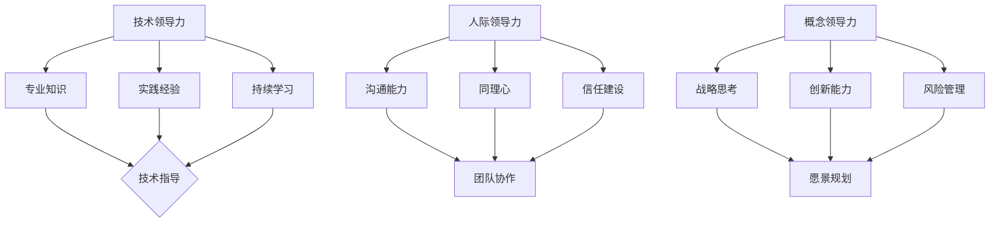

                 

### 领导力思维：改变时代的领导力修炼秘籍

---

关键词：领导力、系统性思维、创新思维、战略思维、沟通、团队建设、变革与创新、个人成长、数字化领导力、全球化领导力、可持续发展领导力

---

摘要：在快速变化的当今社会，领导力成为企业成功的关键。本文从领导力的基础定义、核心要素出发，深入探讨系统性思维、创新思维、战略思维等领导力思维模型，并分析领导力实践中的关键环节，如沟通、团队建设、变革与创新。同时，探讨数字化时代、全球化背景下的领导力挑战，以及领导力在可持续发展中的角色。文章旨在为读者提供一套系统的领导力修炼秘籍，帮助他们在不同情境下发挥领导力作用。

---

# 目录大纲：《领导力思维：改变时代的领导力修炼秘籍》

## 第一部分：领导力基础

### 第1章：领导力定义与核心要素

#### 1.1 领导力的起源与发展

#### 1.2 领导力与管理的区别

#### 1.3 领导力的核心要素

#### 1.4 领导力的三个层次

### 第2章：领导力风格与行为模式

#### 2.1 领导力风格的理论

#### 2.2 权力与影响力

#### 2.3 领导行为模式分析

#### 2.4 领导力自我评估

## 第二部分：领导力思维模型

### 第3章：系统性思维

#### 3.1 系统性思维的原理

#### 3.2 系统性思维的方法论

#### 3.3 系统性思维的实际应用

#### 3.4 系统性思维的案例研究

### 第4章：创新思维

#### 4.1 创新思维的重要性

#### 4.2 创新思维的框架

#### 4.3 创新思维的技巧

#### 4.4 创新思维的实践

### 第5章：战略思维

#### 5.1 战略思维的定义与特点

#### 5.2 战略思维的核心要素

#### 5.3 战略思维的方法论

#### 5.4 战略思维的案例分析

## 第三部分：领导力实践

### 第6章：领导力沟通

#### 6.1 沟通的重要性

#### 6.2 沟通的基本原则

#### 6.3 沟通的技巧

#### 6.4 领导力沟通的实际应用

### 第7章：领导力团队建设

#### 7.1 团队建设的重要性

#### 7.2 团队建设的原则

#### 7.3 团队建设的方法

#### 7.4 领导力团队建设的案例研究

### 第8章：领导力变革与创新

#### 8.1 变革与创新的重要性

#### 8.2 变革与创新的过程

#### 8.3 变革与创新的策略

#### 8.4 变革与创新的实践

## 第四部分：领导力个人成长

### 第9章：领导力自我提升

#### 9.1 自我认知的重要性

#### 9.2 自我提升的方法

#### 9.3 自我提升的实践

#### 9.4 自我提升的案例分析

### 第10章：领导力心理素质

#### 10.1 心理素质对领导力的影响

#### 10.2 心理素质的培养

#### 10.3 心理素质的实践

#### 10.4 心理素质的案例分析

### 第11章：领导力社交技巧

#### 11.1 社交技巧的重要性

#### 11.2 社交技巧的种类

#### 11.3 社交技巧的实践

#### 11.4 社交技巧的案例分析

## 第五部分：领导力在变革时代的应用

### 第12章：数字化时代的领导力变革

#### 12.1 数字化时代的特征

#### 12.2 领导力在数字化时代的变革

#### 12.3 数字化领导力的实践

#### 12.4 数字化领导力的案例分析

### 第13章：全球化背景下的领导力挑战

#### 13.1 全球化对领导力的影响

#### 13.2 全球化背景下的领导力挑战

#### 13.3 全球化领导力的实践

#### 13.4 全球化领导力的案例分析

### 第14章：领导力在可持续发展中的角色

#### 14.1 可持续发展的概念

#### 14.2 领导力在可持续发展中的作用

#### 14.3 可持续发展领导力的实践

#### 14.4 可持续发展领导力的案例分析

## 附录

### 附录 A：领导力思维工具与方法

#### A.1 SWOT分析

#### A.2 Five Whys方法

#### A.3 冰山模型

#### A.4 其他领导力工具

### 附录 B：领导力实践案例

#### B.1 案例一：某公司的领导力转型

#### B.2 案例二：某创业团队的领导力建设

#### B.3 案例三：某跨国公司的领导力实践

### 附录 C：领导力资源推荐

#### C.1 书籍推荐

#### C.2 课程推荐

#### C.3 组织推荐

#### C.4 研究机构推荐

---

# 第1章：领导力定义与核心要素

## 1.1 领导力的起源与发展

领导力（Leadership）这一概念自古有之，但其内涵和形式随着历史和时代的变迁而不断发展。从古至今，领导力的起源和发展可以划分为以下几个阶段：

### 1.1.1 古代领导力

在古代社会，领导力的形式主要与宗教、军事和政治密切相关。例如，古代埃及的法老和罗马帝国的皇帝，他们通过宗教信仰、军事征服和政治手段来维系和扩张自己的权力。这个阶段的领导力更多依赖于个人魅力、宗教信仰和军事力量。

### 1.1.2 中世纪领导力

进入中世纪，领导力逐渐与骑士精神和封建制度相结合。领主通过土地和军事力量来管理他的封臣，而封臣则向领主效忠。这一时期的领导力更多体现在家族和土地的关系上。

### 1.1.3 近现代领导力

近代以来，随着工业革命的兴起，领导力的形式发生了重大变化。企业领导力和政治领导力成为社会关注的焦点。泰勒的科学管理理论、马斯洛的需求层次理论等都为领导力的发展提供了新的视角。

### 1.1.4 当代领导力

在当代社会，领导力不再仅仅局限于个人能力和特质，而是更多地强调团队协作、创新和变革。领导力的发展趋势包括：

1. **多元化**：领导力不再局限于特定的性别、种族或文化背景。
2. **全球性**：领导力需要具备全球视野，能够处理跨国界的复杂问题。
3. **可持续性**：领导力需要关注企业的长期发展，包括环境、社会和经济等方面。

### 1.1.5 领导力的全球化趋势

全球化对领导力的影响是深远而广泛的。首先，全球化使得领导力需要具备跨文化沟通和合作的能力。不同国家和地区的文化差异可能对领导风格和决策过程产生重大影响。其次，全球化要求领导力具备更广泛的战略视野，能够处理全球市场的复杂性和不确定性。最后，全球化也促进了领导力理论的多元化，各国学者和专家从不同角度对领导力进行研究和探讨。

---

## 1.2 领导力与管理的区别

领导力（Leadership）和管理（Management）是两个密切相关的概念，但它们之间也存在显著的区别。理解这两个概念的区别对于培养有效的领导力至关重要。

### 1.2.1 定义

领导力是一种激发、激励和引导他人实现共同目标的能力。它强调的是个人魅力、愿景和影响力。

管理则是一套规范和流程，用于确保组织目标的实现。它强调的是计划、组织、协调和控制。

### 1.2.2 目标

领导力的目标是建立信任、激发创新和推动变革，从而实现组织的长期发展。

管理的目标是确保组织的日常运作高效、有序，从而实现短期目标。

### 1.2.3 方式

领导力通过个人魅力、愿景和价值观来影响他人。它关注的是人的因素，如何激发员工的潜力，创造积极的工作环境。

管理则通过制定计划、建立流程和控制机制来确保组织目标的实现。它关注的是组织的结构和流程。

### 1.2.4 关系

领导力是一种双向的关系，它不仅仅是领导者的责任，也是被领导者的权利。领导者需要关注员工的成长和发展，被领导者也需要积极参与和贡献。

管理则是一种单向的关系，领导者负责制定决策和指导，被领导者则负责执行。

### 1.2.5 效果

领导力注重长远的效果，它关注的是组织的可持续发展和创新能力。

管理则注重短期效果，它关注的是组织的高效运作和目标的实现。

---

## 1.3 领导力的核心要素

领导力不仅仅是一种个人特质，它由多个核心要素构成，这些要素相互作用，共同决定了领导者的效能。以下是领导力的几个核心要素：

### 1.3.1 愿景

愿景是领导力的灵魂，它代表了领导者对未来的憧憬和期望。一个明确的愿景可以激励团队成员，帮助他们看到更广阔的前景，并为之努力。

- **愿景的定义**：愿景是一种长期的、具有指导性的目标，它为组织提供了方向和动力。
- **愿景的构成**：愿景通常包括组织的使命、价值观和目标。

### 1.3.2 信任

信任是领导力的基石，没有信任，领导力无法发挥作用。领导者需要建立与团队成员之间的信任关系，这样才能赢得他们的尊重和追随。

- **信任的重要性**：信任可以提高团队的协作效率，减少冲突和误解。
- **建立信任的方法**：领导者可以通过透明沟通、一致性行动和诚信来建立信任。

### 1.3.3 沟通

沟通是领导力的核心技能之一。领导者需要具备清晰、有效的沟通能力，以便传达愿景、目标和工作指示。

- **沟通的类型**：沟通可以分为上行沟通、下行沟通和平行沟通。
- **沟通的技巧**：包括倾听、表达清晰、非语言沟通和反馈。

### 1.3.4 决策能力

领导者需要具备良好的决策能力，能够在复杂和不确定的情况下做出明智的决策。决策能力包括判断力、分析能力和行动力。

- **决策的类型**：决策可以分为战略性决策和战术性决策。
- **决策的步骤**：包括问题识别、信息收集、方案评估和决策执行。

### 1.3.5 鼓励与支持

领导者需要鼓励和支持团队成员，帮助他们克服困难，实现目标。鼓励与支持可以增强团队成员的自信心和动力。

- **鼓励与支持的方式**：包括认可成就、提供培训机会和激励计划。
- **鼓励与支持的效果**：可以提高团队士气和工作效率。

### 1.3.6 自我反思

自我反思是领导者不断成长和改进的重要手段。领导者需要定期反思自己的行为、决策和表现，以便找到改进的空间。

- **自我反思的方法**：包括日记、反馈和导师辅导。
- **自我反思的效果**：可以提高领导者的自我认知和领导力水平。

---

## 1.4 领导力的三个层次

领导力可以分为三个层次：技术领导力、人际领导力和概念领导力。每个层次都有其特定的内涵和作用。

### 1.4.1 技术领导力

技术领导力是指领导者具备的专业技能和知识，它使领导者能够指导团队在特定领域内开展工作。技术领导力通常在以下方面发挥作用：

- **技术指导**：领导者能够提供专业的技术指导，帮助团队成员解决技术难题。
- **知识传承**：领导者能够将专业知识传授给团队成员，提高团队的整体技术水平。
- **创新能力**：领导者能够推动技术创新，为组织带来新的发展机遇。

技术领导力的核心要素包括：

- **专业知识**：领导者需要具备深厚的专业知识，以便在团队中发挥领导作用。
- **实践经验**：领导者需要通过实践经验来积累和提升自己的技术能力。
- **持续学习**：技术领域发展迅速，领导者需要不断学习新的技术和知识。

### 1.4.2 人际领导力

人际领导力是指领导者处理人际关系的能力，它使领导者能够建立和维护与团队成员的良好关系。人际领导力在以下方面发挥作用：

- **团队协作**：领导者能够促进团队成员之间的合作，提高团队的整体绩效。
- **员工激励**：领导者能够激励团队成员，激发他们的工作热情和创造力。
- **冲突管理**：领导者能够有效地解决团队内部的冲突，维护团队的稳定和和谐。

人际领导力的核心要素包括：

- **沟通能力**：领导者需要具备良好的沟通能力，以便与团队成员进行有效的沟通。
- **同理心**：领导者需要具备同理心，理解团队成员的需求和感受。
- **信任建设**：领导者需要通过诚信和透明沟通来建立与团队成员的信任关系。

### 1.4.3 概念领导力

概念领导力是指领导者具备的战略思考和创新能力，它使领导者能够引领组织面对未来的挑战和机遇。概念领导力在以下方面发挥作用：

- **愿景规划**：领导者能够为组织制定清晰的愿景和目标，为团队提供明确的方向。
- **变革领导**：领导者能够推动组织的变革，引领组织适应不断变化的外部环境。
- **创新驱动**：领导者能够鼓励创新思维，推动组织的创新和发展。

概念领导力的核心要素包括：

- **战略思考**：领导者需要具备战略思考的能力，能够从宏观角度审视组织的发展。
- **创新能力**：领导者需要具备创新能力，能够引领组织在竞争激烈的市场中脱颖而出。
- **风险管理**：领导者需要具备风险管理的意识，能够在不确定的环境中做出明智的决策。

---

**图 1.1 领导力的三个层次**

---

综上所述，领导力是一个复杂而多维的概念，它包括技术、人际和概念三个层次。理解这三个层次的内涵和作用，有助于领导者在不同情境下发挥领导力，推动组织的持续发展。

---

**参考文献**

1. 比尔·乔治（Bill George）,《真北：领导者如何赢得信任与追随》（True North: Discover Your Authentic Leadership），机械工业出版社，2013年。
2. 詹姆斯·M·库泽斯（James M. Kouzes）和巴里·Z·波恩斯坦（Barry Z. Posner）,《领导力：如何成为伟大的领导者》（The Leadership Challenge），电子工业出版社，2017年。
3. 彼得·德鲁克（Peter Drucker）,《管理的实践》（The Practice of Management），机械工业出版社，2006年。

---

**作者信息**

作者：AI天才研究院/AI Genius Institute & 禅与计算机程序设计艺术 /Zen And The Art of Computer Programming

---

**小结**

本章从领导力的起源和发展、领导力与管理的区别、领导力的核心要素以及领导力的三个层次等方面，全面介绍了领导力的概念和内涵。理解领导力的多层次性，有助于领导者在不同情境下发挥领导力，推动组织的持续发展。

---

**拓展阅读**

1. 比尔·乔治（Bill George）,《真北：领导者如何赢得信任与追随》（True North: Discover Your Authentic Leadership）。
2. 詹姆斯·M·库泽斯（James M. Kouzes）和巴里·Z·波恩斯坦（Barry Z. Posner）,《领导力：如何成为伟大的领导者》（The Leadership Challenge）。
3. 彼得·德鲁克（Peter Drucker）,《管理的实践》（The Practice of Management）。

