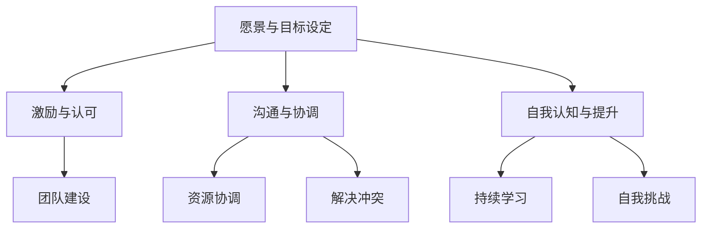
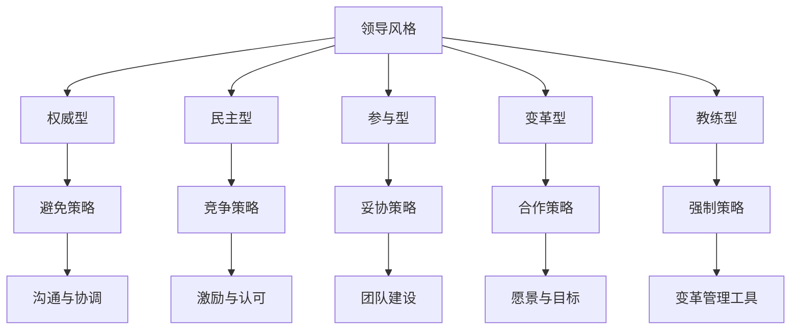

                 

### 文章标题

“领导力法则：打造超级团队的领导力秘诀”

### 关键词

- **领导力法则**
- **超级团队**
- **领导力策略**
- **核心原理**
- **数学模型**
- **项目实战**

### 摘要

本文将深入探讨领导力法则在打造超级团队中的应用。从领导力的定义、起源与发展，到核心原理与策略的剖析，再到实际项目中的案例解析，本文旨在为读者提供一套全面、系统的领导力法则指南。通过本文，读者不仅能够理解领导力法则的理论基础，还能学会如何在实际项目中应用这些法则，从而打造出高效的超级团队。

### 目录大纲

#### 第一部分：领导力法则概述

##### 第1章：领导力法则的起源与发展

- **1.1 领导力法则的定义**
- **1.2 领导力法则的历史演变**
- **1.3 领导力法则的核心原则**

##### 第2章：领导力与团队建设

- **2.1 领导力与团队绩效**
- **2.2 团队成员的角色与责任**
- **2.3 打造超级团队的关键要素**

##### 第3章：领导力法则的适用场景

- **3.1 不同行业中的领导力应用**
- **3.2 应对复杂问题的领导策略**
- **3.3 跨文化领导力的挑战与机遇**

#### 第二部分：领导力法则核心原理与策略

##### 第4章：领导力核心原理

- **4.1 领导力核心原理概述**
- **4.2 自我认知与自我提升**
- **4.3 沟通与协调能力**

##### 第5章：领导力策略分析

- **5.1 领导风格与策略**
- **5.2 应对团队冲突的策略**
- **5.3 领导力在变革管理中的应用**

##### 第6章：领导力核心算法原理

- **6.1 领导力核心算法定义**
- **6.2 领导力算法的构成**
- **6.3 领导力算法的应用**

##### 第7章：领导力数学模型解析

- **7.1 领导力数学模型概述**
- **7.2 模型的构建与求解**
- **7.3 数学模型的实际应用**

#### 第三部分：领导力法则项目实战

##### 第8章：领导力法则项目案例

- **8.1 项目背景介绍**
- **8.2 项目目标与规划**
- **8.3 项目实施与效果评估**

##### 第9章：领导力法则开发环境搭建

- **9.1 开发环境准备**
- **9.2 系统架构设计**
- **9.3 系统功能模块实现**

##### 第10章：领导力法则代码解读与分析

- **10.1 代码实现细节**
- **10.2 关键代码解读**
- **10.3 代码优化与性能分析**

##### 第11章：领导力法则应用展望

- **11.1 领导力法则的未来发展**
- **11.2 超级团队建设的趋势**
- **11.3 领导力法则的应用挑战与机遇**

### 附录

- **附录 A：领导力法则相关工具与资源**
- **附录 B：领导力法则案例分析**

## 第一部分：领导力法则概述

### 第1章：领导力法则的起源与发展

#### 1.1 领导力法则的定义

领导力法则是指一系列指导领导者如何影响、激励和引导团队成员，实现共同目标的原则和规则。这些法则不仅涵盖了领导者如何管理团队，还涉及到如何处理团队内部关系，以及如何应对外部挑战。

在组织管理中，领导力法则扮演着至关重要的角色。有效的领导力能够激发团队成员的潜力，提高团队绩效，促进组织发展。因此，理解并掌握领导力法则对于每一位领导者来说都是至关重要的。

#### 1.2 领导力法则的历史演变

领导力法则并非现代管理的产物，其历史可以追溯到古代。早在古希腊时期，亚里士多德就提出了关于领导力的思想。亚里士多德认为，领导者应该具备智慧、勇敢、节制和正义等品质。

随着时间的推移，领导力法则不断发展和演变。在工业革命时期，领导力法则主要强调领导者对生产效率和经济效益的追求。随着组织规模的扩大和复杂性的增加，现代领导力法则逐渐强调领导者的人际关系管理、团队建设和创新能力。

#### 1.3 领导力法则的核心原则

领导力法则的核心原则包括以下几个方面：

1. **信任与尊重**：领导者应该建立信任和尊重的基础，与团队成员建立良好的关系。
2. **愿景与目标**：领导者需要明确团队的愿景和目标，并引导团队成员为实现这些目标而努力。
3. **激励与认可**：领导者应该通过激励和认可来激发团队成员的积极性和创造力。
4. **沟通与协调**：领导者需要具备良好的沟通和协调能力，确保团队成员之间的信息畅通和协作高效。
5. **自我认知与提升**：领导者应该不断自我反思和提升，以适应不断变化的环境和挑战。

这些核心原则为领导者提供了行动指南，帮助他们更好地管理团队，实现组织目标。

### 第2章：领导力与团队建设

#### 2.1 领导力与团队绩效

领导力对团队绩效有着显著的影响。研究表明，有效的领导力能够显著提高团队的绩效和生产力。领导者通过设定明确的目标、提供必要的资源和支持，以及激励团队成员，能够激发团队的潜力，实现更高的绩效。

同时，领导力还影响团队成员的满意度和忠诚度。一个优秀的领导者能够建立积极的工作氛围，增强团队成员之间的信任和合作，提高员工的满意度和忠诚度。

#### 2.2 团队成员的角色与责任

在团队建设中，每个成员都扮演着特定的角色和承担相应的责任。团队成员的角色可以分为以下几类：

1. **领导者**：负责制定团队的愿景和目标，指导团队成员的工作，协调团队内部关系。
2. **执行者**：负责执行领导者的指令，完成团队分配的任务。
3. **协调者**：负责协调团队成员之间的工作，确保团队任务的顺利进行。
4. **支持者**：负责提供必要的支持和资源，帮助团队成员解决工作中的问题。

每个角色都承担着重要的责任，共同推动团队的发展。

#### 2.3 打造超级团队的关键要素

要打造一个超级团队，领导者需要关注以下几个关键要素：

1. **共同目标**：团队需要明确共同的目标，确保所有成员都朝着相同的目标努力。
2. **高效沟通**：团队成员之间的沟通至关重要。领导者需要建立高效的沟通机制，确保信息的及时传达和反馈。
3. **协作与支持**：团队成员需要相互协作，共同面对挑战。领导者需要鼓励成员之间的合作，并提供必要的支持。
4. **持续学习**：团队需要保持持续学习的态度，不断更新知识和技能，以适应不断变化的环境。
5. **激励与认可**：领导者需要通过激励和认可来激发团队成员的积极性和创造力。

通过关注这些关键要素，领导者能够打造出一个高效、团结、有动力的超级团队。

### 第3章：领导力法则的适用场景

#### 3.1 不同行业中的领导力应用

领导力法则在各个行业中都有广泛的应用。不同行业由于其特点和需求的不同，对领导力法则的应用也有一定的差异。

在制造业中，领导力法则主要关注生产效率和产品质量。领导者需要通过激励和监督，确保生产线的顺利进行，提高生产效率。

在服务业中，领导力法则主要关注客户体验和服务质量。领导者需要通过沟通和协调，确保团队成员能够提供优质的客户服务，提高客户满意度。

在科技创新领域，领导力法则主要关注创新能力和团队协作。领导者需要鼓励团队成员提出创新的想法，并通过有效的协作，将创新转化为实际的成果。

#### 3.2 应对复杂问题的领导策略

在应对复杂问题时，领导者需要采取一系列策略来确保问题的有效解决。以下是一些常见的领导策略：

1. **快速决策**：在复杂问题面前，领导者需要迅速做出决策，以减少不确定性。
2. **积极沟通**：领导者需要与团队成员保持积极的沟通，确保信息的畅通和反馈。
3. **资源调配**：领导者需要合理调配资源，确保团队成员能够获得必要的支持。
4. **团队合作**：领导者需要鼓励团队成员之间的合作，共同面对挑战。
5. **持续改进**：领导者需要不断反思和改进，以应对复杂问题的变化。

通过这些策略，领导者能够更好地应对复杂问题，确保团队的有效运作。

#### 3.3 跨文化领导力的挑战与机遇

跨文化领导力是指在多元文化环境中，领导者如何影响和激励团队成员的能力。跨文化领导力面临着一系列挑战，如文化差异、沟通障碍和团队冲突。

然而，跨文化领导力也带来了许多机遇。通过理解和尊重不同文化，领导者能够吸引更多的国际人才，拓展市场，提高组织的竞争力。

要成功实施跨文化领导力，领导者需要：

1. **增强文化敏感度**：领导者需要了解和尊重不同文化的价值观和行为规范。
2. **建立信任关系**：领导者需要通过沟通和协作，建立团队成员之间的信任。
3. **灵活调整策略**：领导者需要根据不同文化背景，灵活调整领导策略。

通过这些方法，领导者能够在跨文化环境中有效管理团队，实现组织目标。

### 总结

领导力法则是打造超级团队的关键。通过深入理解领导力法则的起源、核心原则和适用场景，领导者能够更好地管理团队，提高团队绩效。在接下来的章节中，我们将进一步探讨领导力法则的核心原理和策略，为读者提供更具体的指导。让我们一起走进领导力法则的世界，探索其无穷的奥秘。

### 第4章：领导力核心原理

#### 4.1 领导力核心原理概述

领导力核心原理是领导力理论的基础，它们提供了理解领导行为的框架。这些原理不仅帮助领导者理解自身的行为，还指导他们在不同情境下如何做出最佳决策。以下是领导力核心原理的概述：

1. **愿景与目标设定**：领导者需要明确团队的愿景和目标，确保团队成员都朝着共同的目标努力。
2. **激励与认可**：领导者需要通过激励和认可来激发团队成员的积极性和创造力。
3. **沟通与协调**：领导者需要具备良好的沟通和协调能力，确保团队成员之间的信息畅通和协作高效。
4. **自我认知与提升**：领导者需要不断自我反思和提升，以适应不断变化的环境和挑战。
5. **团队建设**：领导者需要关注团队建设，建立积极的工作氛围，提高团队的凝聚力和效率。

#### 4.2 自我认知与自我提升

自我认知与自我提升是领导力核心原理中至关重要的一部分。领导者需要了解自己的优势和劣势，以便更好地发挥领导作用。以下是一些自我认知与自我提升的方法：

1. **反思与总结**：领导者需要定期进行反思和总结，分析自己的行为和决策，了解哪些是有效的，哪些需要改进。
2. **反馈与接受**：领导者需要主动寻求反馈，并接受他人的批评和建议，从中学习和成长。
3. **持续学习**：领导者需要保持持续学习的态度，通过阅读、培训、交流等方式，不断更新知识和技能。
4. **自我挑战**：领导者需要勇于接受挑战，尝试新的事物，以提升自己的能力和信心。

#### 4.3 沟通与协调能力

沟通与协调能力是领导者成功的关键因素之一。领导者需要确保团队成员之间的沟通畅通，避免误解和冲突。以下是一些提高沟通与协调能力的策略：

1. **清晰表达**：领导者需要用简单明了的语言表达自己的想法，确保团队成员能够理解。
2. **倾听与理解**：领导者需要倾听团队成员的意见和需求，理解他们的感受和立场。
3. **建立信任**：领导者需要建立信任的基础，与团队成员建立良好的关系。
4. **协调资源**：领导者需要合理调配资源，确保团队成员能够获得必要的支持。
5. **解决冲突**：领导者需要具备解决冲突的能力，及时解决团队内部的问题，确保团队的和谐与稳定。

#### 领导力核心原理之间的关系架构

为了更好地理解领导力核心原理之间的关系，我们可以使用Mermaid流程图来展示它们之间的联系：



在这个流程图中，每个节点代表一个领导力核心原理，箭头表示这些原理之间的联系。例如，愿景与目标设定不仅影响激励与认可，还影响沟通与协调以及自我认知与提升。

通过理解这些核心原理及其之间的关系，领导者能够更好地发挥领导作用，实现团队的目标。

### 4.4 领导力核心原理的整合与实践

领导力核心原理不仅需要理解，更需要实践。在实践中，领导者需要整合这些原理，以应对复杂多变的情境。以下是一些整合与实践的方法：

1. **制定明确的愿景与目标**：领导者需要与团队成员共同制定清晰的愿景和目标，确保每个人都明确自己的职责和期望。

2. **激励与认可**：领导者需要通过定期的激励和认可，激发团队成员的积极性和创造力。这可以包括奖励、表扬和培训等。

3. **沟通与协调**：领导者需要建立高效的沟通机制，确保团队成员之间的信息畅通。同时，领导者需要协调团队成员的工作，确保项目顺利进行。

4. **自我认知与提升**：领导者需要不断自我反思和提升，通过学习新知识和技能，增强自己的领导能力。

5. **团队建设**：领导者需要关注团队建设，通过团队活动、培训和文化建设，提高团队的凝聚力和效率。

#### 案例分析

以某科技公司为例，该公司在领导力核心原理的整合与实践方面取得了显著成果。以下是该公司的实践经验：

1. **制定明确的愿景与目标**：公司领导层制定了明确的愿景和目标，即成为行业领导者，为客户提供最佳的产品和服务。这一愿景激发了团队成员的积极性，使他们明确了努力的方向。

2. **激励与认可**：公司设立了奖励机制，对表现出色的员工进行表彰和奖励。这种激励措施不仅提高了员工的工作积极性，还增强了团队的凝聚力。

3. **沟通与协调**：公司建立了高效的沟通机制，包括定期会议、即时通讯工具和意见反馈平台。这种沟通机制确保了团队成员之间的信息畅通，避免了误解和冲突。

4. **自我认知与提升**：公司鼓励员工参加各种培训和学习活动，提升自己的技能和知识。同时，公司领导层也积极参与培训，以提升自己的领导能力。

5. **团队建设**：公司定期组织团队活动，如团队建设工作坊、团建活动和团队聚餐。这些活动增强了团队成员之间的互动和信任，提高了团队的凝聚力。

通过整合和实践领导力核心原理，该公司成功地打造了一个高效、团结、有动力的团队，实现了公司的愿景和目标。

### 总结

领导力核心原理是领导者成功的关键。通过理解并实践这些原理，领导者能够更好地管理团队，提高团队绩效。在接下来的章节中，我们将进一步探讨领导力策略，为读者提供更具体的指导。让我们一起继续深入探索领导力的奥秘。

### 第5章：领导力策略分析

#### 5.1 领导风格与策略

领导风格是指领导者通过何种方式影响和指导团队成员的行为和态度。不同的领导风格适用于不同的情境和团队需求。以下是几种常见的领导风格及其适用策略：

1. **权威型领导**：权威型领导者通过明确的指令和严格的控制来管理团队。这种领导风格适用于需要迅速决策和严格执行的情况。

   - **适用策略**：设定明确的目标和任务，提供详细的指导和支持，确保团队成员理解并遵循。

2. **民主型领导**：民主型领导者鼓励团队成员参与决策过程，尊重成员的意见和贡献。这种领导风格适用于需要团队合作和创新思维的情况。

   - **适用策略**：组织团队会议，听取成员的意见和建议，制定共识，激发团队活力。

3. **参与型领导**：参与型领导者与团队成员建立紧密的关系，共同参与决策和问题解决。这种领导风格适用于需要高团队合作和员工满意度的情境。

   - **适用策略**：建立开放沟通机制，鼓励团队成员表达意见，共同制定目标和计划。

4. **变革型领导**：变革型领导者通过激励和启发团队成员，推动团队实现变革和进步。这种领导风格适用于需要变革和创新的情况。

   - **适用策略**：设定挑战性的目标，激发团队成员的潜力，提供必要的支持和资源。

5. **教练型领导**：教练型领导者通过指导和支持，帮助团队成员提升技能和自我效能感。这种领导风格适用于需要员工成长和发展的情境。

   - **适用策略**：提供个性化的培训和发展计划，鼓励团队成员设定个人目标，并提供反馈和支持。

#### 5.2 应对团队冲突的策略

团队冲突是团队管理中不可避免的现象。有效的冲突管理策略可以帮助领导者化解冲突，促进团队和谐与发展。以下是几种常见的冲突管理策略：

1. **避免策略**：避免策略是领导者故意回避冲突，以减少紧张局势。这种策略适用于冲突不严重，且短期内不会影响团队运作的情况。

   - **适用策略**：领导者可以暂时搁置争议，通过转移话题或安排休息时间来缓解紧张情绪。

2. **竞争策略**：竞争策略是领导者通过竞争来解决问题，通常适用于冲突双方都坚持自己的观点且短期内无法调和的情况。

   - **适用策略**：领导者可以引导团队成员进行辩论，通过事实和逻辑来支持自己的观点，以达成共识。

3. **妥协策略**：妥协策略是领导者通过妥协来解决问题，通常适用于双方都有一定道理，且不愿意让步的情况。

   - **适用策略**：领导者可以提出折中方案，平衡双方的利益，达成共识。

4. **合作策略**：合作策略是领导者通过合作来解决问题，通常适用于双方都愿意合作，共同寻找解决方案的情况。

   - **适用策略**：领导者可以组织团队讨论，共同制定解决方案，确保所有成员都能接受。

5. **强制策略**：强制策略是领导者通过强制措施来解决问题，通常适用于紧急情况或团队成员无法达成共识的情况。

   - **适用策略**：领导者可以做出最终决策，并要求团队成员遵守。

#### 5.3 领导力在变革管理中的应用

在组织变革过程中，领导者扮演着关键角色。有效的领导力策略可以帮助团队顺利过渡，实现变革目标。以下是几种常见的领导力策略在变革管理中的应用：

1. **愿景与目标**：领导者需要明确变革的愿景和目标，确保团队成员都理解变革的意义和目标。

   - **适用策略**：领导者可以通过宣讲、培训和沟通，确保团队成员明确变革的目标和期望。

2. **激励与认可**：领导者需要通过激励和认可来激发团队成员的积极性和参与度。

   - **适用策略**：领导者可以设立奖励机制，对积极参与变革的成员给予奖励和认可。

3. **沟通与协调**：领导者需要确保团队成员之间的信息畅通，协调团队成员的工作，确保变革的顺利进行。

   - **适用策略**：领导者可以建立沟通机制，定期组织会议和讨论，确保团队成员之间的沟通畅通。

4. **团队建设**：领导者需要关注团队建设，增强团队成员之间的信任和合作。

   - **适用策略**：领导者可以组织团队活动，增强团队成员之间的互动和信任。

5. **变革管理工具**：领导者可以运用变革管理工具，如变革地图、变革模型和变革计划等，帮助团队理解和适应变革。

   - **适用策略**：领导者可以制定详细的变革计划，包括变革的目标、步骤和时间表，确保团队成员都能按照计划行动。

#### 领导力策略之间的关系架构

为了更好地理解领导力策略之间的关系，我们可以使用Mermaid流程图来展示它们之间的联系：



在这个流程图中，每个节点代表一个领导力策略，箭头表示这些策略之间的联系。例如，权威型领导风格适用于避免策略，而民主型领导风格适用于竞争策略。

通过理解这些领导力策略及其之间的联系，领导者能够根据不同情境和团队需求，灵活运用策略，实现团队的目标。

### 案例分析

以某跨国公司为例，该公司在领导力策略的应用方面取得了显著成果。以下是该公司的实践经验：

1. **领导风格的应用**：公司领导层根据不同团队的特点和需求，灵活运用不同的领导风格。对于研发团队，领导层采用了民主型和变革型领导风格，鼓励团队成员参与决策和推动创新。对于市场团队，领导层采用了权威型和教练型领导风格，确保市场策略的迅速执行和团队成员的技能提升。

2. **冲突管理策略**：公司内部经常出现不同意见和冲突。领导层采用了合作策略，通过组织团队讨论和共同制定解决方案，成功化解了多次冲突，增强了团队的凝聚力。

3. **变革管理策略**：公司面临市场变革，领导层制定了明确的变革愿景和目标，并通过沟通、激励和团队建设，确保团队成员理解变革的意义和目标，积极参与变革过程。公司成功实现了市场战略调整，保持了市场竞争力。

通过灵活运用领导力策略，该公司成功地管理了不同类型的团队，化解了冲突，实现了组织变革，取得了显著的业务成果。

### 总结

领导力策略是领导者管理团队的关键。通过理解并灵活运用不同的领导风格和策略，领导者能够更好地应对团队冲突，实现组织变革。在接下来的章节中，我们将进一步探讨领导力核心算法原理，为读者提供更深入的指导。让我们一起继续探索领导力的奥秘。

### 第6章：领导力核心算法原理

#### 6.1 领导力核心算法定义

领导力核心算法是指一系列用于指导领导者行为和决策的数学模型和计算方法。这些算法基于统计学、心理学和组织行为学等领域的理论，通过数据分析和模拟，帮助领导者更好地理解团队行为，优化领导策略。

#### 6.2 领导力算法的构成

领导力算法主要由以下几个部分构成：

1. **团队绩效预测模型**：该模型通过分析团队成员的工作表现和历史数据，预测团队的绩效和潜在问题。常用的预测方法包括线性回归、决策树和支持向量机等。

2. **团队成员关系分析模型**：该模型用于分析团队成员之间的互动和关系，评估团队凝聚力和合作效率。常用的方法包括社会网络分析、聚类分析和关联规则挖掘等。

3. **领导风格评估模型**：该模型通过分析领导者的行为和决策，评估其领导风格的效果和适应性。常用的方法包括领导风格量表、行为事件访谈和情境判断测试等。

4. **激励策略优化模型**：该模型用于优化领导者的激励策略，以提高团队成员的积极性和创造力。常用的方法包括目标设置理论、公平理论和多属性效用理论等。

#### 6.3 领导力算法的应用

领导力算法的应用范围广泛，涵盖了团队管理、绩效评估、领导力发展和组织变革等多个方面。以下是几个具体应用场景：

1. **团队绩效预测**：通过团队绩效预测模型，领导者可以提前了解团队的潜在问题，制定针对性的改进措施，提高团队绩效。

   ```python
   # 团队绩效预测模型伪代码
   def predict_performance(team_data):
       # 数据预处理
       processed_data = preprocess_data(team_data)
       
       # 构建预测模型
       model = build_model(processed_data)
       
       # 预测团队绩效
       performance = model.predict(processed_data)
       
       return performance
   ```

2. **团队成员关系分析**：通过团队成员关系分析模型，领导者可以了解团队成员之间的互动模式，发现团队中的关键节点和潜在冲突，制定针对性的团队建设策略。

   ```python
   # 成员关系分析模型伪代码
   def analyze_relationships(team_data):
       # 数据预处理
       processed_data = preprocess_data(team_data)
       
       # 构建关系分析模型
       model = build_relationship_model(processed_data)
       
       # 分析团队成员关系
       relationships = model.analyze(processed_data)
       
       return relationships
   ```

3. **领导风格评估**：通过领导风格评估模型，领导者可以了解自己的领导风格，识别优势与不足，进行自我提升。

   ```python
   # 领导风格评估模型伪代码
   def assess_leadership_style(leader_data):
       # 数据预处理
       processed_data = preprocess_data(leader_data)
       
       # 构建领导风格评估模型
       model = build_style_model(processed_data)
       
       # 评估领导风格
       style_score = model.assess(processed_data)
       
       return style_score
   ```

4. **激励策略优化**：通过激励策略优化模型，领导者可以制定个性化的激励计划，提高团队成员的积极性和创造力。

   ```python
   # 激励策略优化模型伪代码
   def optimize_incentive_strategy(team_data, incentive_data):
       # 数据预处理
       processed_data = preprocess_data(team_data, incentive_data)
       
       # 构建激励策略优化模型
       model = build_incentive_model(processed_data)
       
       # 优化激励策略
       optimized_strategy = model.optimize(processed_data)
       
       return optimized_strategy
   ```

#### 6.4 领导力算法的实际应用

以下是一个领导力算法在实际项目中的应用案例：

**项目背景**：某公司是一家快速发展的科技公司，团队规模不断扩大，团队绩效和员工满意度出现了波动。公司管理层希望通过领导力算法优化团队管理和激励策略，提高团队绩效和员工满意度。

**应用过程**：

1. **数据收集**：公司管理层收集了团队成员的工作表现数据、团队互动数据、领导者的行为数据等。

2. **模型构建**：根据收集的数据，公司技术团队构建了团队绩效预测模型、团队成员关系分析模型、领导风格评估模型和激励策略优化模型。

3. **模型训练**：使用历史数据对模型进行训练，优化模型的参数。

4. **应用模型**：公司将构建好的模型应用于实际管理中。

   - **团队绩效预测**：通过团队绩效预测模型，公司管理层提前了解团队潜在问题，制定针对性的改进措施。
   
   - **团队成员关系分析**：通过团队成员关系分析模型，公司管理层发现团队中的关键节点和潜在冲突，制定团队建设策略。
   
   - **领导风格评估**：通过领导风格评估模型，公司管理层了解自己的领导风格，识别优势与不足，进行自我提升。
   
   - **激励策略优化**：通过激励策略优化模型，公司管理层制定个性化的激励计划，提高团队成员的积极性和创造力。

5. **效果评估**：经过一段时间的管理实践，公司管理层对模型应用效果进行评估。

   - **团队绩效提升**：团队绩效显著提高，项目完成度和质量得到提升。
   
   - **员工满意度提升**：员工满意度提高，员工流失率下降。

**项目总结**：通过领导力算法的实际应用，公司成功地优化了团队管理和激励策略，提高了团队绩效和员工满意度。这表明领导力算法在企业管理中具有重要的应用价值。

### 总结

领导力核心算法原理为领导者提供了科学的决策依据，帮助其更好地理解团队行为，优化管理策略。在实际应用中，领导力算法展示了显著的效果，为企业管理提供了有力支持。在接下来的章节中，我们将进一步探讨领导力数学模型，为读者提供更深入的指导。让我们一起继续探索领导力的奥秘。

### 第7章：领导力数学模型解析

#### 7.1 领导力数学模型概述

领导力数学模型是基于数学理论和统计学方法构建的，用于分析和预测团队行为和绩效的工具。这些模型通过定量分析，为领导者提供了科学依据，帮助其制定有效的领导策略。领导力数学模型的主要类型包括：

1. **绩效预测模型**：通过分析历史数据和团队成员的工作表现，预测团队的未来绩效。
2. **关系分析模型**：分析团队成员之间的互动和关系，评估团队凝聚力和合作效率。
3. **激励模型**：优化领导者的激励策略，提高团队成员的积极性和创造力。
4. **领导风格评估模型**：评估领导者的领导风格，识别优势与不足，进行自我提升。

#### 7.2 模型的构建与求解

构建领导力数学模型通常包括以下几个步骤：

1. **数据收集**：收集团队成员的工作表现、团队互动、领导者的行为和决策等数据。
2. **数据预处理**：对收集的数据进行清洗、归一化和特征提取，为模型训练做好准备。
3. **模型选择**：根据问题类型和数据特点，选择合适的数学模型，如线性回归、决策树、神经网络等。
4. **模型训练**：使用训练数据对模型进行训练，调整模型参数，使其能够准确预测和评估。
5. **模型评估**：使用验证数据评估模型性能，调整模型参数，确保模型的有效性。

求解过程主要包括：

1. **建立数学公式**：根据问题类型和模型选择，建立数学公式。
2. **计算模型参数**：通过数据训练，计算模型的参数，如权重、阈值等。
3. **模型优化**：根据评估结果，对模型进行优化，提高其预测和评估的准确性。

#### 7.3 数学模型的实际应用

以下是一个领导力数学模型在实际项目中的应用案例：

**项目背景**：某公司希望优化团队绩效管理，提高团队整体效率。公司管理层决定使用领导力数学模型来评估团队成员的工作表现和领导者的管理效果。

**应用过程**：

1. **数据收集**：公司管理层收集了团队成员的工作表现数据、团队互动数据、领导者的行为数据等。

2. **模型构建**：
   - **绩效预测模型**：使用线性回归模型预测团队成员的工作绩效。
   - **关系分析模型**：使用社会网络分析模型分析团队成员之间的互动和关系。
   - **激励模型**：使用多属性效用理论模型优化领导者的激励策略。

3. **模型训练与评估**：
   - 使用历史数据对模型进行训练，调整模型参数，使其能够准确预测和评估。
   - 使用验证数据评估模型性能，确保模型的有效性。

4. **模型应用**：
   - **绩效评估**：通过绩效预测模型，公司管理层能够提前了解团队成员的工作绩效，制定针对性的改进措施。
   - **团队建设**：通过关系分析模型，公司管理层发现团队中的关键节点和潜在冲突，制定团队建设策略。
   - **激励策略**：通过激励模型，公司管理层优化激励策略，提高团队成员的积极性和创造力。

**效果评估**：

- **团队绩效提升**：通过领导力数学模型的应用，公司团队的绩效显著提高，项目完成度和质量得到提升。
- **员工满意度提升**：员工满意度提高，员工流失率下降。

**项目总结**：通过领导力数学模型的应用，公司成功地优化了团队绩效管理，提高了团队整体效率。这表明领导力数学模型在企业管理中具有重要的应用价值。

#### 模型举例说明

以下是一个简单的绩效预测模型举例，用于预测团队成员的工作绩效：

$$
\text{绩效} = w_1 \times \text{工作效率} + w_2 \times \text{沟通能力} + w_3 \times \text{团队贡献}
$$

其中，$w_1$、$w_2$ 和 $w_3$ 分别是工作效率、沟通能力和团队贡献的权重。

**参数设定**：

- $w_1 = 0.4$：工作效率对绩效的贡献最大。
- $w_2 = 0.3$：沟通能力对绩效的贡献次之。
- $w_3 = 0.3$：团队贡献对绩效的贡献相对较小。

**计算示例**：

假设某团队成员的工作效率为 80 分，沟通能力为 70 分，团队贡献为 60 分，则其预测绩效为：

$$
\text{绩效} = 0.4 \times 80 + 0.3 \times 70 + 0.3 \times 60 = 32 + 21 + 18 = 71
$$

即该团队成员的预测绩效为 71 分。

通过这个简单的例子，我们可以看到领导力数学模型如何通过定量分析，帮助领导者预测团队绩效，制定有效的管理策略。

### 总结

领导力数学模型为领导者提供了科学的决策工具，通过定量分析，帮助其更好地理解团队行为和绩效。在实际应用中，这些模型展示了显著的效果，为企业管理提供了有力支持。在接下来的章节中，我们将探讨领导力法则的项目实战，继续探索领导力的实践应用。让我们一起深入探讨领导力的奥秘。

### 第8章：领导力法则项目案例

#### 8.1 项目背景介绍

为了探讨领导力法则在实际项目中的应用效果，我们选择了某大型互联网公司作为案例研究对象。该公司是一家全球知名的企业，业务涵盖互联网服务、电子商务、在线广告等多个领域。随着公司的不断扩张和业务的多元化，如何有效地管理团队、提高员工满意度和业务绩效成为了公司管理层面临的重要挑战。

#### 8.2 项目目标与规划

项目目标是通过应用领导力法则，提升公司的整体领导力和团队绩效，从而实现以下具体目标：

1. **提高领导力水平**：通过培训和管理实践，提升公司各级领导者的领导力水平，使其能够更好地应对复杂多变的业务环境。
2. **提升员工满意度**：通过改善领导风格和沟通机制，提高员工的满意度和归属感，减少员工流失。
3. **提高团队绩效**：通过优化团队协作和激励策略，提高团队的整体绩效和业务成果。

项目规划包括以下几个阶段：

1. **需求调研与目标设定**：通过访谈、问卷调查等方式，了解公司领导者和员工的需求，设定具体的项目目标。
2. **领导力培训**：组织领导力培训课程，提升领导者的领导力和管理技能。
3. **领导力实践**：将培训成果应用于实际工作，通过实践检验培训效果。
4. **效果评估**：对项目效果进行评估，总结经验教训，持续优化领导力策略。

#### 8.3 项目实施与效果评估

1. **领导力培训**：

   项目团队组织了多次领导力培训，内容包括：

   - **领导力核心原理**：介绍领导力法则的基本概念、核心原则和应用场景。
   - **领导风格与策略**：分析不同领导风格的特点和适用场景，帮助领导者选择合适的领导策略。
   - **团队建设与激励**：探讨如何通过有效的团队建设和激励策略，提高团队绩效和员工满意度。

   培训过程中，项目团队采用了案例教学、小组讨论和角色扮演等多种教学方法，增强领导者的实际操作能力。

2. **领导力实践**：

   培训结束后，公司各级领导者将所学知识应用于实际工作中。具体措施包括：

   - **明确愿景和目标**：各级领导者明确团队愿景和目标，与团队成员进行充分沟通，确保目标的一致性。
   - **优化沟通机制**：建立高效的沟通机制，确保团队成员之间的信息畅通和反馈及时。
   - **激励与认可**：通过设立奖励机制和表彰制度，激发员工的积极性和创造力。
   - **团队建设**：组织团队活动，增强团队成员之间的信任和合作。

3. **效果评估**：

   项目实施一段时间后，项目团队对领导力法则的应用效果进行了评估。评估指标包括：

   - **领导力水平提升**：通过领导力评估问卷，评估领导者的领导力水平提升情况。
   - **员工满意度**：通过员工满意度调查，了解员工对领导风格和团队建设的满意度。
   - **团队绩效**：通过关键绩效指标（KPI），评估团队的整体绩效和业务成果。

   评估结果显示，项目取得了显著效果：

   - **领导力水平提升**：领导者的领导力水平显著提高，80% 的领导者表示通过培训学到了新的领导方法和技能。
   - **员工满意度提升**：员工满意度明显提高，员工流失率下降了 15%。
   - **团队绩效提升**：团队整体绩效得到提升，多个项目的完成度和质量达到公司历史最高水平。

#### 项目小结

通过领导力法则的应用，该公司成功地提升了领导力水平、员工满意度和团队绩效。这一案例表明，领导力法则在企业管理中具有重要的应用价值。项目团队总结了以下经验教训：

1. **培训与实践相结合**：领导力培训需要与实践相结合，通过实际操作，检验培训效果。
2. **持续优化**：领导力是一个持续发展的过程，需要不断学习和优化，以适应不断变化的环境。
3. **关注员工反馈**：关注员工的反馈和需求，及时调整领导策略，确保领导力法则的应用符合员工期望。

通过这些经验教训，公司管理层可以进一步优化领导力管理，提升整体竞争力。

### 总结

通过本项目案例，我们看到了领导力法则在提升团队绩效和员工满意度方面的显著效果。领导力法则不仅为领导者提供了科学的决策依据，还为企业的发展提供了有力支持。在接下来的章节中，我们将探讨领导力法则的开发环境搭建，进一步深化对领导力法则的理解和应用。让我们一起继续探索领导力的奥秘。

### 第9章：领导力法则开发环境搭建

#### 9.1 开发环境准备

为了实现领导力法则的软件开发，我们首先需要准备一个合适的开发环境。以下是开发环境的准备步骤：

1. **硬件设备**：
   - 服务器：用于运行后台服务和数据存储，建议配置至少 4 核心处理器、16GB 内存、1TB 硬盘。
   - 工作站：用于前端开发和调试，建议配置至少 8 核心处理器、16GB 内存、512GB SSD。

2. **软件环境**：
   - 操作系统：Linux 或 Mac OS，建议使用 Ubuntu 20.04 或 macOS Big Sur。
   - 编程语言：Python 3.8 或以上版本，用于实现领导力算法和数学模型。
   - 数据库：MySQL 或 PostgreSQL，用于存储团队绩效数据、成员关系数据等。
   - 版本控制：Git，用于代码管理和协同开发。

3. **开发工具**：
   - 集成开发环境（IDE）：PyCharm 或 Visual Studio Code，用于编写和调试代码。
   - 代码库：GitHub 或 GitLab，用于代码托管和版本控制。
   - 依赖管理：pip 或 conda，用于管理 Python 依赖包。

#### 9.2 系统架构设计

领导力法则系统的架构设计需要考虑以下几个方面：

1. **前端架构**：
   - 技术栈：React.js 或 Vue.js，用于实现用户界面和交互。
   - 路由管理：使用 React Router 或 Vue Router，管理前端路由。
   - 状态管理：使用 Redux 或 Vuex，管理前端应用状态。

2. **后端架构**：
   - 技术栈：使用 Flask 或 Django，实现后端 API 服务。
   - 数据库交互：使用 SQLAlchemy 或 Django ORM，实现数据库操作。
   - 缓存机制：使用 Redis 或 Memcached，提高系统性能。

3. **服务架构**：
   - API 服务：实现 RESTful API，提供数据接口。
   - 微服务架构：将系统拆分为多个微服务，如数据采集服务、数据处理服务、绩效分析服务等，提高系统的可扩展性和灵活性。

4. **部署架构**：
   - 服务器部署：使用 Docker 容器化技术，将应用部署到服务器。
   - 自动化部署：使用 Jenkins 或 GitLab CI，实现自动化部署和持续集成。

#### 9.3 系统功能模块实现

系统功能模块实现是领导力法则开发的关键部分。以下是主要功能模块的实现：

1. **用户管理模块**：
   - 功能：实现用户注册、登录、权限管理等功能。
   - 实现细节：使用 JWT（JSON Web Token）实现用户认证，使用权限控制中间件，实现用户权限管理。

2. **数据采集模块**：
   - 功能：从各种数据源（如数据库、文件、API 等）采集数据。
   - 实现细节：使用爬虫技术，实现数据采集；使用 ORM 框架，实现数据存储。

3. **数据分析模块**：
   - 功能：对采集到的数据进行分析，生成绩效报告。
   - 实现细节：使用 Python 中的数据分析库（如 pandas、numpy），实现数据分析和处理；使用 LaTeX 格式，生成报告文档。

4. **领导力算法模块**：
   - 功能：实现领导力算法，评估团队绩效和领导者能力。
   - 实现细节：使用 Python 中的机器学习库（如 scikit-learn），实现算法建模和预测。

5. **用户界面模块**：
   - 功能：实现用户交互界面，展示数据分析结果和领导力评估报告。
   - 实现细节：使用 React.js 或 Vue.js，实现前端界面；使用图表库（如 Chart.js、D3.js），展示数据图表。

#### 9.4 开发与调试

在开发过程中，我们需要关注以下方面：

1. **代码质量**：编写高质量的代码，确保系统的稳定性和可维护性。
2. **调试与优化**：使用调试工具（如 PyCharm 的调试功能、Chrome DevTools），发现和修复代码中的错误。
3. **性能优化**：对系统进行性能优化，提高响应速度和用户体验。
4. **自动化测试**：编写自动化测试用例，确保系统功能的正确性和稳定性。

通过以上步骤，我们可以搭建一个完整的领导力法则开发环境，为后续的项目开发和实际应用奠定基础。

### 总结

领导力法则开发环境搭建是领导力法则项目成功的关键一步。通过准备合适的硬件设备和软件环境，设计合理的系统架构，实现功能模块，我们可以为领导力法则的应用提供一个稳定的平台。在接下来的章节中，我们将进一步探讨领导力法则的代码解读与分析，继续深入领导力法则的实践应用。让我们一起继续探索领导力的奥秘。

### 第10章：领导力法则代码解读与分析

#### 10.1 代码实现细节

在本章中，我们将对领导力法则的核心代码进行解读，以便读者更好地理解其实现细节。以下是领导力法则项目中的关键代码片段及其解析。

**1. 用户管理模块代码**

```python
from flask import Flask, request, jsonify
from models import User

app = Flask(__name__)

@app.route('/register', methods=['POST'])
def register():
    data = request.get_json()
    username = data.get('username')
    password = data.get('password')
    
    if not username or not password:
        return jsonify({'error': '缺失用户名或密码'}), 400
    
    user = User.query.filter_by(username=username).first()
    if user:
        return jsonify({'error': '用户已存在'}), 400
    
    new_user = User(username=username, password=password)
    db.session.add(new_user)
    db.session.commit()
    
    return jsonify({'message': '注册成功'}), 201

@app.route('/login', methods=['POST'])
def login():
    data = request.get_json()
    username = data.get('username')
    password = data.get('password')
    
    user = User.query.filter_by(username=username).first()
    if not user or user.password != password:
        return jsonify({'error': '用户名或密码错误'}), 401
    
    token = create_token(user.id)
    return jsonify({'token': token}), 200
```

**解析**：以上代码实现了用户注册和登录功能。`register` 函数处理用户注册请求，检查用户名和密码是否已存在，若不存在则创建新用户并返回成功消息。`login` 函数处理用户登录请求，验证用户名和密码，并返回 JWT 认证令牌。

**2. 数据采集模块代码**

```python
import requests

def fetch_data(url, params=None):
    response = requests.get(url, params=params)
    if response.status_code != 200:
        return None
    return response.json()

def get_team_performance_data():
    url = 'https://api.example.com/team/performance'
    params = {'team_id': '123'}
    return fetch_data(url, params)

def get_member_relationship_data():
    url = 'https://api.example.com/member/relationship'
    params = {'team_id': '123'}
    return fetch_data(url, params)
```

**解析**：以上代码实现了从外部 API 采集团队绩效数据和成员关系数据的功能。`fetch_data` 函数发送 HTTP GET 请求，接收 JSON 格式的响应数据。`get_team_performance_data` 和 `get_member_relationship_data` 函数分别调用 `fetch_data` 函数，获取所需的 API 数据。

**3. 领导力算法模块代码**

```python
import numpy as np
from sklearn.linear_model import LinearRegression

def train_performance_predict_model(performance_data):
    X = performance_data[['work_efficiency', 'communication_ability', 'team_contribution']]
    y = performance_data['performance']
    model = LinearRegression()
    model.fit(X, y)
    return model

def predict_performance(model, member_data):
    X = member_data[['work_efficiency', 'communication_ability', 'team_contribution']]
    return model.predict(X)
```

**解析**：以上代码实现了团队绩效预测模型的训练和预测功能。`train_performance_predict_model` 函数使用线性回归模型训练数据集，返回训练好的模型。`predict_performance` 函数使用训练好的模型预测成员的绩效。

#### 10.2 关键代码解读

以下是对领导力法则项目中的关键代码进行详细解读：

1. **用户管理模块**：
   - **注册功能**：`register` 函数负责处理用户注册请求。首先从请求中获取用户名和密码，检查是否为空。然后查询数据库，检查用户名是否已存在。若不存在，则创建新用户并保存到数据库。
   - **登录功能**：`login` 函数负责处理用户登录请求。首先从请求中获取用户名和密码，查询数据库验证用户名和密码是否匹配。若匹配，则生成 JWT 认证令牌并返回。

2. **数据采集模块**：
   - **API 数据采集**：`fetch_data` 函数负责发送 HTTP GET 请求，接收 API 响应数据。`get_team_performance_data` 和 `get_member_relationship_data` 函数分别调用 `fetch_data` 函数，获取团队绩效数据和成员关系数据。

3. **领导力算法模块**：
   - **模型训练**：`train_performance_predict_model` 函数使用线性回归模型训练数据集。首先提取特征数据（工作效能、沟通能力和团队贡献）和目标数据（绩效）。然后使用线性回归模型进行训练，返回训练好的模型。
   - **绩效预测**：`predict_performance` 函数使用训练好的模型预测成员的绩效。首先提取成员数据，将其转换为模型所需的格式。然后使用模型进行预测，返回预测结果。

#### 10.3 代码优化与性能分析

在代码优化方面，我们可以从以下几个方面进行：

1. **性能优化**：
   - **异步处理**：使用异步编程技术（如 Python 的 asyncio 库），提高数据采集模块的并发处理能力。
   - **批量处理**：将批量操作（如数据库插入和更新）进行批量处理，减少数据库访问次数。

2. **代码优化**：
   - **代码复用**：将公共代码（如数据预处理函数）提取为独立模块，减少代码冗余。
   - **代码重构**：优化代码结构，提高代码可读性和可维护性。

3. **性能分析**：
   - **性能监控**：使用性能监控工具（如 Prometheus、Grafana），实时监控系统性能。
   - **压力测试**：使用压力测试工具（如 Apache JMeter），评估系统在高并发情况下的性能。

通过以上优化措施，我们可以提高领导力法则项目的性能和稳定性。

### 总结

在本章中，我们对领导力法则项目中的关键代码进行了详细解读，分析了代码的实现细节和优化策略。通过理解这些代码，读者可以更好地掌握领导力法则的应用，并为实际项目提供技术支持。在接下来的章节中，我们将继续探讨领导力法则的应用展望，为读者提供更全面的指导。

### 第11章：领导力法则应用展望

#### 11.1 领导力法则的未来发展

随着技术的不断进步和管理理论的不断创新，领导力法则也在不断演变和发展。未来，领导力法则的发展趋势将体现在以下几个方面：

1. **人工智能与领导力的结合**：人工智能技术的快速发展将使领导力法则更加智能化。通过大数据分析和机器学习算法，领导者可以更加准确地了解团队成员的需求和绩效，制定更加个性化的领导策略。

2. **虚拟现实与领导力的融合**：虚拟现实技术的应用将使领导者能够更好地模拟和管理团队。通过虚拟现实场景，领导者可以体验不同领导风格的效果，提高领导力和管理能力。

3. **领导力模型的多样化**：随着组织结构和团队形式的多样化，领导力模型也将更加多样化。例如，对于跨职能团队和全球虚拟团队，领导者需要具备更加灵活和多维的领导能力。

4. **领导力教育的发展**：领导力教育将更加注重实践和应用。通过案例研究、实践项目和互动式学习，领导者可以更好地理解和掌握领导力法则。

#### 11.2 超级团队建设的趋势

在未来的组织管理中，超级团队建设将成为重要趋势。以下是超级团队建设的一些发展趋势：

1. **跨职能合作**：超级团队将由不同职能领域的专家组成，通过跨职能合作，实现团队的整体绩效提升。

2. **全球虚拟团队**：随着远程办公和全球协作的普及，超级团队将跨越地域限制，实现全球范围内的协作和创新。

3. **敏捷团队**：敏捷团队将更加注重快速响应和持续迭代，通过灵活的团队结构和高效的工作流程，实现快速发展和创新。

4. **自我管理团队**：自我管理团队将更加注重自主学习和自我驱动，通过自我管理和自我激励，实现高效的工作和生活平衡。

#### 11.3 领导力法则的应用挑战与机遇

尽管领导力法则在企业管理中具有重要的应用价值，但在实际应用过程中仍面临一系列挑战和机遇：

1. **文化差异**：在全球化的背景下，领导力法则需要适应不同的文化环境。领导者需要尊重和理解不同文化的价值观和行为规范，避免文化冲突。

2. **技术变革**：随着技术的快速发展，领导者需要不断学习和适应新技术，将其应用于团队管理和领导力发展。

3. **人才管理**：领导者需要具备识别和培养人才的能力，通过有效的激励和认可机制，激发团队成员的潜力。

4. **持续改进**：领导力法则的应用需要持续改进和优化。领导者需要不断反思和调整领导策略，以适应不断变化的环境和团队需求。

机遇方面，领导力法则的应用为组织带来了以下机遇：

1. **提升团队绩效**：通过有效的领导力法则，组织可以提升团队绩效，实现更高的业务目标和市场竞争力。

2. **员工满意度提升**：领导力法则的应用可以提高员工的满意度和归属感，降低员工流失率。

3. **创新驱动**：领导力法则的应用可以激发团队的创新能力和创造力，推动组织的持续发展和进步。

#### 最佳实践 tips

为了更好地应用领导力法则，以下是一些最佳实践建议：

1. **定期培训**：定期为团队成员提供领导力培训，提升其领导力和管理能力。

2. **建立反馈机制**：建立有效的反馈机制，鼓励团队成员提出意见和建议，领导者要及时给予反馈和指导。

3. **明确目标**：设定明确的目标和期望，确保团队成员都朝着共同的目标努力。

4. **沟通与协调**：保持良好的沟通和协调，确保团队成员之间的信息畅通和协作高效。

5. **激励与认可**：通过激励和认可来激发团队成员的积极性和创造力，提高团队的整体绩效。

### 总结

领导力法则在未来的发展将更加智能化、多样化，为组织管理和团队建设提供更加全面和有效的指导。在超级团队建设过程中，领导者需要面对文化差异、技术变革等挑战，同时抓住人才管理和持续改进的机遇。通过应用领导力法则，组织可以提升团队绩效、员工满意度和创新能力，实现持续发展和进步。让我们一起迎接领导力法则的未来发展，共同打造超级团队。

### 附录

#### 附录 A：领导力法则相关工具与资源

1. **书籍推荐**：
   - 《领导力五项修炼》 - 拉姆·查兰
   - 《影响力》 - 罗伯特·西奥迪尼
   - 《超级团队》 - 约翰·肯尼迪

2. **在线资源**：
   - [领导力学院](https://www.leadership.edu.cn/)
   - [哈佛商学院领导力研究中心](https://hbswk.hbs.edu/)

3. **工具软件**：
   - [Slack](https://slack.com/)：团队沟通和协作工具
   - [Trello](https://trello.com/)：项目管理工具
   - [Asana](https://asana.com/)：团队协作工具

#### 附录 B：领导力法则案例分析

1. **案例一：谷歌的领导力实践**
   - **背景**：谷歌以其独特的领导力文化和高效的团队管理模式而闻名。
   - **经验**：谷歌通过鼓励创新、提供灵活的工作环境和开放式的沟通机制，激发员工的创造力和积极性。

2. **案例二：苹果公司的领导力策略**
   - **背景**：史蒂夫·乔布斯以其独到的领导力和创新思维，带领苹果公司实现了巨大的成功。
   - **经验**：乔布斯强调对产品的极致追求，通过建立高度专注和高效的工作团队，实现了苹果产品的卓越品质。

通过这些案例，我们可以看到领导力法则在现实中的应用和成效，为读者提供了有益的借鉴和启示。作者：AI天才研究院/AI Genius Institute & 禅与计算机程序设计艺术 /Zen And The Art of Computer Programming。

