                 

### 第1章：领导力概述

#### 1.1 领导力的定义与特征

**领导力的概念**：领导力是指一种通过影响、激励、指导和启发他人来实现共同目标的能力。它不仅仅涉及个人魅力，还包括一系列的技能和行为，如决策能力、沟通技巧、组织能力、团队建设等。

**领导力的特征**：领导力具有以下主要特征：

1. **影响力**：领导力是一种能够影响他人思想和行为的能力，它基于信任和尊重，而不是强制。
2. **使命感**：领导者通常具有明确的使命感和目标感，能够为团队和组织的未来指明方向。
3. **决断力**：领导者需要在关键时刻做出明智的决策，并承担相应的责任。
4. **沟通能力**：有效的沟通技巧是领导力的核心组成部分，它包括倾听、表达和反馈。
5. **激励能力**：领导者能够激励团队成员发挥最大潜力，实现个人和团队的目标。

#### 1.2 领导力的重要性

**个人层面**：领导力对个人的职业发展至关重要。拥有领导力的人通常能够在职场中脱颖而出，获得更多的机会和挑战。

**团队层面**：领导力能够增强团队的凝聚力，提高团队的效率和协作能力，从而实现更高的绩效。

**组织层面**：领导力是组织成功的关键因素。优秀的领导者能够推动组织创新、提高组织效能，并确保组织目标的实现。

#### 1.3 领导力类型与风格

**领导力类型**：

1. **权威型**：领导者通过权威和控制来管理团队，决策权高度集中。
2. **民主型**：领导者鼓励团队成员参与决策过程，更加注重团队的合作与沟通。
3. **参与型**：领导者致力于与团队成员共同制定决策，并鼓励团队成员对决策负责。
4. **教练型**：领导者专注于团队成员的个人成长和发展，提供指导和支持。

**领导力风格**：

1. **独裁式**：领导者独自做出决策，团队成员没有参与权。
2. **民主式**：领导者通过讨论和协商来做出决策，团队成员有参与权。
3. **授权式**：领导者将权力和责任下放给团队成员，鼓励自主管理和创新。

### 总结

领导力是一种复杂而多样的能力，它对个人、团队和组织的发展都具有深远的影响。通过了解领导力的定义、特征、类型和风格，我们可以更好地理解领导力的重要性，并在实际工作中运用这些知识来提升自己的领导能力。

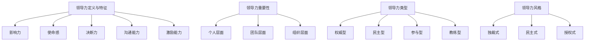

在接下来的章节中，我们将深入探讨领导力心理学、领导力理论的发展历程，以及领导力在沟通与协调、激励与反馈、团队建设与管理等方面的实践技巧。通过这些讨论，我们将进一步理解领导力的本质，并学习如何在实际工作中运用领导力来打造黄金团队。

---

### 第2章：领导力心理学

#### 2.1 领导者的自我认知与心理素质

**自我认知的重要性**：领导者的自我认知是领导力发展的基础。自我认知包括领导者对自己价值观、信念、能力、情绪和动机的深刻理解。一个有良好自我认知的领导者能够更加清晰地了解自己的优势和不足，从而做出更加明智的决策。

**心理素质的要求**：领导者的心理素质直接影响其领导效果。以下是一些关键的领导力心理素质：

1. **抗压能力**：领导者需要能够承受工作中的压力和挑战，保持冷静和理性。
2. **情绪管理能力**：领导者需要具备良好的情绪管理能力，能够控制自己的情绪，避免负面情绪对决策和团队的影响。
3. **自信心**：领导者需要对自己有足够的信心，这有助于他们在团队中树立权威，并激励团队成员。

**提升自我认知与心理素质的方法**：

1. **自我反思**：定期进行自我反思，分析自己的行为、决策和情绪反应，了解自己的优势和改进空间。
2. **接受培训**：参加相关的领导力培训和心理辅导课程，提升自己的领导力和心理素质。
3. **建立支持网络**：与同行或导师交流，获取反馈和建议，从而更好地了解自己。

#### 2.2 团队成员的心理需求与满足

**心理需求的理论基础**：心理学家马斯洛的需求层次理论认为，人的需求可以分为五个层次：生理需求、安全需求、社交需求、尊重需求和自我实现需求。领导者需要理解这些需求，并采取措施满足团队成员的心理需求。

**团队成员的心理需求**：

1. **安全感**：团队成员希望在工作中感到安全和稳定，没有职业压力和不确定性。
2. **认同感**：团队成员希望被认可和尊重，感到自己的工作对团队和组织是有价值的。
3. **成就感**：团队成员希望能够在工作中取得成就，感受到个人的成长和进步。
4. **成长感**：团队成员希望有机会学习和成长，提升自己的技能和职业素养。

**满足团队成员心理需求的方法**：

1. **提供培训和发展机会**：为团队成员提供持续的学习和成长机会，满足他们的成长需求。
2. **建立公平的激励机制**：通过绩效评估、奖金和晋升等方式，满足团队成员的尊重需求和成就感。
3. **营造积极的团队氛围**：通过团队建设活动和团队文化建设，增强团队成员的安全感和认同感。

#### 2.3 领导力与心理学理论的联系

**领导力理论的发展**：领导力心理学理论的发展受到了多种心理学理论的影响，包括行为心理学、认知心理学和发展心理学。

1. **行为心理学**：行为心理学强调行为与激励之间的关系，为领导力提供了激励机制的理论基础。
2. **认知心理学**：认知心理学关注人的思维过程，为领导力提供了理解团队成员心理需求和行为动机的视角。
3. **发展心理学**：发展心理学研究人的成长过程，为领导力提供了如何引导团队成员成长和发展的理论支持。

**领导力与心理学理论的结合**：

1. **激励机制**：领导力心理学将激励机制应用于团队管理，通过奖励和惩罚来引导和激励团队成员的行为。
2. **团队建设**：领导力心理学强调团队建设的重要性，通过团队活动和文化建设来增强团队凝聚力和成员的归属感。
3. **心理辅导**：领导力心理学提倡为团队成员提供心理辅导，帮助他们应对工作中的压力和挑战，提高心理素质。

**案例分析**：某公司的领导者在一次团队建设活动中，采用了心理学中的“信任游戏”来增强团队成员之间的信任和合作。通过这个游戏，团队成员不仅体验到了信任的重要性，还增强了团队的凝聚力，从而提高了工作效率。

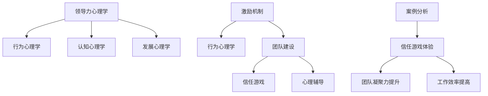

通过理解领导力心理学，领导者可以更好地满足团队成员的心理需求，提升团队的整体绩效，并在竞争激烈的市场环境中保持竞争优势。

---

### 第3章：领导力理论发展历程

#### 3.1 经典领导力理论

**特质理论**：特质理论是早期领导力研究的重要理论之一。该理论认为领导者具备某些固有的特质和能力，这些特质是领导力的关键因素。例如，自信、勇气、责任心和决断力等。

**行为理论**：行为理论关注领导者如何影响团队成员的行为。该理论认为领导力不仅取决于领导者的特质，还取决于领导者的行为。例如，领导者通过激励、沟通和决策等行为来影响团队成员。

**领导风格理论**：领导风格理论探讨领导者在不同情境下的行为风格。例如，布莱克和莫顿的“管理方格理论”将领导风格分为关注任务和关注人员两个维度，不同组合的领导风格适用于不同类型的团队和情境。

**情境理论**：情境理论认为领导力取决于领导者的行为与环境的相互作用。该理论强调领导者需要根据不同的情境灵活调整自己的领导风格，以达到最佳领导效果。

**变革型领导理论**：变革型领导理论认为领导者通过激发团队成员的潜力和创造力，推动组织变革和创新。变革型领导者注重愿景、激励和启发，而不是仅仅关注任务和绩效。

#### 3.2 现代领导力理论

**共享领导力理论**：共享领导力理论认为领导力不是单一领导者的职责，而是整个团队共同承担的责任。该理论强调领导者与团队成员之间的协作和信任，通过共同愿景和目标来推动团队发展。

**女性领导力理论**：女性领导力理论关注女性在领导力方面的独特优势和挑战。该理论认为女性领导者通常更注重团队协作、沟通和人际关系，并在此基础上发挥领导力。

**服务型领导理论**：服务型领导理论强调领导者应该以服务团队成员为中心，关注团队成员的需求和福祉。该理论认为领导者通过为团队成员提供服务和支持，来建立信任和合作关系，从而提高团队绩效。

**全球化领导力理论**：全球化领导力理论关注领导者在全球化背景下面临的挑战和机遇。该理论强调领导者需要具备跨文化沟通、全球战略思考和领导多元化团队的能力。

#### 3.3 领导力理论的应用与发展趋势

**领导力理论的应用**：

1. **组织管理**：领导力理论被广泛应用于组织管理，帮助领导者提高团队绩效、推动组织变革和创新。
2. **团队建设**：领导力理论用于团队建设，帮助领导者建立高效的团队，提升团队合作和沟通。
3. **个人发展**：领导力理论为个人发展提供了指导，帮助个人提升领导力和职业素养。

**领导力理论的发展趋势**：

1. **多样性**：领导力理论越来越关注领导者的多样性，包括性别、种族和文化背景等。
2. **可持续性**：领导力理论开始关注可持续发展，领导者需要具备环境保护和社会责任意识。
3. **技术驱动**：随着技术的发展，领导力理论开始关注如何利用技术来提高领导力和团队绩效。

**案例分析**：某科技公司在领导力理论的指导下，通过共享领导力和服务型领导，成功推动了公司创新和团队协作。公司领导层鼓励团队成员参与决策，提供培训和发展机会，并通过共同愿景和目标来激励团队成员。

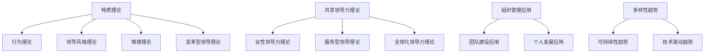

通过了解领导力理论的发展历程和应用趋势，领导者可以更好地理解领导力的本质，并在实际工作中运用这些理论来提升自己的领导能力，推动团队和组织的发展。

---

### 第4章：沟通与协调

#### 4.1 有效沟通的技巧

**倾听技巧**：有效的沟通始于倾听。领导者需要具备良好的倾听技巧，包括：

- **专注倾听**：在对方讲话时保持专注，避免分心。
- **同理心倾听**：试图理解对方的观点和感受，而不是仅仅听对方说什么。
- **开放性倾听**：对不同的观点保持开放态度，避免过早做出判断。

**表达技巧**：清晰、准确地表达自己的观点和想法是沟通的关键。领导者需要掌握以下表达技巧：

- **简洁明了**：用简单、易懂的语言表达复杂的思想。
- **逻辑清晰**：确保信息传递的连贯性和逻辑性。
- **适应性表达**：根据不同的听众和情境调整自己的表达方式。

**反馈技巧**：反馈是沟通的重要环节，领导者需要给出及时的、建设性的反馈：

- **具体而非泛泛**：提供具体的反馈，而不是模糊的概括。
- **积极肯定**：在批评的同时，也要肯定对方的优点和努力。
- **开放性反馈**：鼓励对方提出反馈，建立双向沟通。

#### 4.2 建立良好的团队沟通机制

**定期会议**：定期举行团队会议，确保信息的及时传递和问题的及时解决。会议可以分为以下几种类型：

- **日常站会**：简短高效的站会，用于快速沟通和协调。
- **周会或月会**：用于讨论团队进展、计划和工作分配。
- **专题会议**：用于解决特定问题或项目讨论。

**沟通渠道**：确保团队有多种沟通渠道，包括：

- **电子邮件**：正式沟通，适用于文档和信息共享。
- **即时通讯工具**：快速沟通，适用于日常交流和问题解决。
- **视频会议**：远程沟通，适用于跨地域团队的协作。

**沟通规范**：建立明确的沟通规范，包括：

- **清晰简洁**：确保信息的清晰和简洁，避免冗余。
- **及时响应**：鼓励团队成员及时回复信息，避免拖延。
- **责任明确**：明确信息传递的责任，确保信息的准确性和及时性。

**案例分析**：某互联网公司在团队沟通方面做出了显著改进。公司引入了多种沟通工具，如Slack、Zoom和Trello，建立了定期会议和沟通规范。这些措施有效提高了团队的协作效率，解决了沟通障碍，推动了项目的顺利进行。

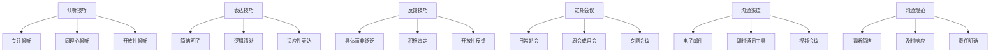

通过有效的沟通技巧和良好的团队沟通机制，领导者可以确保信息的准确传递和团队的高效协作，从而实现组织的目标。

---

### 第5章：激励与反馈

#### 5.1 激励理论在领导力中的应用

**激励理论的概念**：激励理论关注如何通过外部奖励和内部动机来激发员工的工作动力和创造力。领导者在管理团队时，需要运用激励理论来提高员工的工作效率和满意度。

**激励理论的应用**：

1. **目标设置理论**：领导者通过设定明确的、可实现的短期和长期目标，来激发员工的工作动力。目标需要具有挑战性，同时也要确保员工能够达成。
2. **需求层次理论**：领导者根据员工的不同需求层次，如生理需求、安全需求、社交需求、尊重需求和自我实现需求，来制定激励策略。例如，通过晋升和培训来满足员工的尊重需求和自我实现需求。
3. **期望理论**：领导者通过提高员工对工作结果的期望值，来激发员工的工作动力。领导者需要确保员工的努力与期望结果之间的联系，从而提高员工的积极性和成就感。

**案例分析**：某公司的领导者通过设定明确的目标，并鼓励员工参与目标的制定过程，成功激发了员工的工作动力。此外，领导者还通过绩效评估和奖励机制，确保员工的努力得到认可和回报，从而提高了员工的满意度和工作效率。

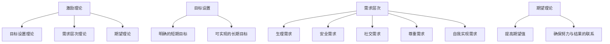

#### 5.2 制定有效的激励策略

**激励策略的制定**：

1. **个性化激励**：根据员工的个人需求和职业目标，制定个性化的激励方案。例如，对于追求自我实现需求的员工，可以通过提供挑战性的项目和机会来激励他们。
2. **公平的奖励机制**：建立公平的奖励机制，确保员工的努力和贡献得到公正的评价和回报。奖励可以是金钱的，也可以是职业发展的机会。
3. **持续的反馈与支持**：领导者需要持续关注员工的工作表现，并提供及时的反馈和指导。通过正面反馈和鼓励，领导者可以增强员工的自信心和动力。

**案例分析**：某互联网公司在激励策略方面做出了显著的改进。公司引入了绩效评估系统，根据员工的绩效和贡献进行奖励。此外，公司还提供了灵活的工作时间和远程工作的机会，满足了员工的不同需求。这些激励策略有效提高了员工的工作满意度和工作效率。

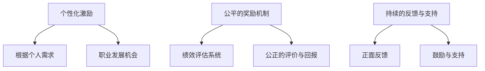

通过有效的激励策略，领导者可以激发员工的工作动力和创造力，提高团队的整体绩效。

#### 5.3 反馈机制与改进

**反馈机制的重要性**：反馈是领导者了解员工工作情况、指导员工改进和促进员工发展的重要手段。有效的反馈机制可以帮助员工认识到自己的优势和不足，从而提升工作表现。

**反馈机制的建立**：

1. **定期反馈**：领导者需要定期与员工进行一对一的反馈交流，及时了解员工的工作状况和需求。
2. **全面性反馈**：反馈应该包括工作绩效、技能发展、团队合作等多个方面，确保反馈的全面性。
3. **建设性反馈**：反馈应该是建设性的，不仅要指出员工的不足，还要提供具体的改进建议和资源支持。

**反馈的实施与改进**：

1. **及时反馈**：及时反馈可以帮助员工迅速认识到问题并采取措施进行改进。
2. **双向反馈**：鼓励员工提出自己的反馈和意见，建立双向的沟通机制，增强员工的参与感和责任感。
3. **持续改进**：领导者需要持续关注员工的改进情况，并根据实际情况调整反馈策略，确保反馈机制的有效性。

**案例分析**：某公司在建立反馈机制方面取得了显著成效。公司引入了定期绩效评估和360度反馈机制，不仅让员工及时了解到自己的工作表现，还提供了详细的发展建议和培训资源。这些措施有效促进了员工的发展和团队的成长。

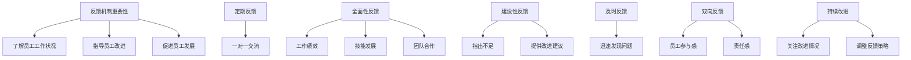

通过建立和实施有效的反馈机制，领导者可以促进员工的发展，提高团队的整体绩效。

---

### 第6章：团队建设与管理

#### 6.1 团队建设的原则与策略

**团队建设的原则**：

1. **目标一致性**：确保团队成员对团队的目标和愿景有共同的理解和认同。
2. **信任与尊重**：建立团队成员之间的信任关系，尊重彼此的观点和贡献。
3. **合作与协作**：鼓励团队成员之间的合作和协作，共同解决问题和实现目标。
4. **持续发展**：关注团队成员的个人成长和发展，提供培训和学习机会。

**团队建设的策略**：

1. **制定明确的团队目标**：领导者需要与团队成员共同制定明确的团队目标，确保每个成员都清楚自己的职责和期望。
2. **建立有效的沟通机制**：通过定期的会议、工作坊和团队活动，建立有效的沟通机制，促进团队成员之间的交流和理解。
3. **培养团队合作精神**：通过团队合作项目和团队建设活动，培养团队成员的团队合作精神，增强团队的凝聚力。
4. **提供发展机会**：为团队成员提供培训、学习和晋升机会，帮助他们实现个人和职业发展。

**案例分析**：某科技公司通过制定明确的团队目标，建立了有效的沟通机制，并组织了定期的团队建设活动，成功打造了一个高效的团队。团队成员在共同的目标和愿景下，紧密合作，实现了公司业务的快速发展。

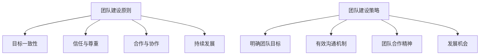

#### 6.2 团队角色的识别与扮演

**团队角色的识别**：

1. **领导者角色**：领导者负责制定团队目标和战略，协调团队成员的工作，激励团队成员。
2. **执行者角色**：执行者负责完成具体的任务和工作，确保团队目标的实现。
3. **协调者角色**：协调者负责协调团队成员之间的工作，解决冲突和问题，确保团队工作顺利进行。
4. **创新者角色**：创新者负责提出新的想法和解决方案，推动团队的创新发展。

**团队角色的扮演**：

1. **明确角色定位**：团队成员需要明确自己的角色定位，了解自己的职责和期望。
2. **灵活调整角色**：在团队工作中，团队成员需要根据实际情况灵活调整自己的角色，确保团队目标的实现。
3. **相互支持与协作**：团队成员之间需要相互支持，协作完成任务，共同实现团队目标。

**案例分析**：某项目的团队由一个经验丰富的领导者、几个执行者、一个协调者和一个创新者组成。团队成员在明确各自角色定位的基础上，紧密合作，成功完成了多个复杂项目，为公司创造了显著的价值。

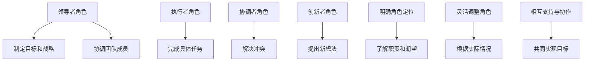

通过识别和扮演合适的团队角色，团队成员可以更好地协同工作，实现团队目标。

#### 6.3 团队绩效管理

**团队绩效管理的概念**：团队绩效管理是指通过制定绩效目标、监控绩效实现、提供反馈和支持等手段，确保团队达成既定目标的过程。

**团队绩效管理的流程**：

1. **制定绩效目标**：领导者需要与团队成员共同制定明确的绩效目标，确保每个成员都清楚自己的绩效标准和期望。
2. **监控绩效实现**：领导者需要定期监控团队的绩效实现情况，识别问题和瓶颈，及时采取措施进行调整。
3. **提供反馈与支持**：领导者需要根据绩效监控的结果，为团队成员提供及时的反馈和必要的支持，帮助他们改进和提升绩效。
4. **评估绩效结果**：在绩效周期结束时，对团队的绩效结果进行评估，总结经验教训，为下一周期的绩效管理提供参考。

**案例分析**：某公司的团队绩效管理机制非常成熟。公司在每个绩效周期开始时，都会与团队成员共同制定具体的绩效目标，并在周期内定期进行绩效监控和反馈。在绩效周期结束时，公司会组织绩效评估会议，对团队的绩效结果进行总结和评估，为下一周期的绩效管理提供指导。

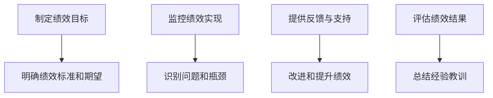

通过有效的团队绩效管理，领导者可以确保团队目标的实现，提高团队的整体绩效。

---

### 第7章：危机管理与变革领导

#### 7.1 危机管理的基本策略

**危机管理的概念**：危机管理是指在面对突发事件或危机时，采取的一系列措施来减轻影响、控制局势、恢复秩序的过程。

**危机管理的基本策略**：

1. **快速响应**：在危机发生的第一时间，领导者需要迅速响应，启动危机管理预案，采取紧急措施控制局面。
2. **信息沟通**：危机管理过程中，领导者需要保持与团队成员和其他利益相关者的沟通，及时传递信息，减少恐慌和误解。
3. **风险评估**：领导者需要对危机的影响范围和程度进行评估，确定优先处理的事项和资源分配。
4. **资源调配**：根据风险评估的结果，领导者需要合理调配资源，包括人力、物力和财力，确保危机管理的有效实施。
5. **持续监控**：在危机管理过程中，领导者需要持续监控局势的发展，根据实际情况调整策略，确保危机得到有效控制。

**案例分析**：某公司在面对突发的供应链危机时，立即启动了危机管理预案。公司领导层迅速召开了紧急会议，制定了详细的应对措施，并与供应商和客户保持密切沟通。通过这些措施，公司成功缓解了危机，确保了业务的连续性。

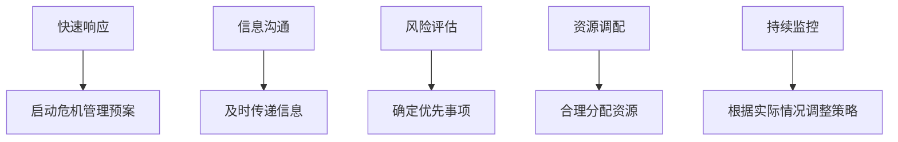

#### 7.2 变革领导的核心要素

**变革领导的定义**：变革领导是指在面对组织变革时，领导者通过引导和激励团队成员，实现组织转型和创新的过程。

**变革领导的核心要素**：

1. **明确变革愿景**：领导者需要明确变革的愿景和目标，确保团队成员对变革有共同的理解和认同。
2. **建立变革团队**：领导者需要组建一支具有多样性和专业能力的变革团队，负责变革的具体实施。
3. **沟通与共识**：领导者需要与团队成员进行有效沟通，建立共识，确保团队成员对变革的支持和参与。
4. **激励与支持**：领导者需要通过激励和支持，激发团队成员的变革动力，帮助他们克服变革中的困难和挑战。
5. **监控与评估**：领导者需要持续监控变革的进展，评估变革的效果，并根据实际情况进行调整和优化。

**案例分析**：某公司在面临市场竞争压力时，决定进行组织变革。公司领导层明确了变革的愿景和目标，组建了一支由各部门负责人组成的变革团队。通过定期的会议和沟通，领导层与团队成员建立了共识，并提供了必要的支持和资源。在变革过程中，领导层持续监控变革进展，并根据实际情况进行调整，最终成功实现了组织的转型和创新。

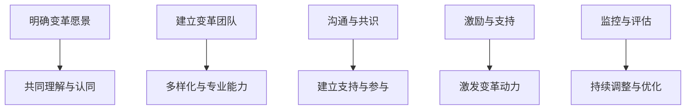

通过有效的危机管理和变革领导，领导者可以在面临挑战和变化时，确保组织的稳定和持续发展。

---

### 第8章：领导力法则与黄金团队建设

#### 8.1 领导力法则概述

**领导力法则的定义**：领导力法则是指导领导者如何有效行使领导职责、提升领导能力的一系列原则和规则。

**领导力法则的作用**：领导力法则有助于领导者更好地理解领导职责，提高领导效能，实现组织目标。

**领导力法则的分类**：

1. **通用法则**：适用于各种领导情境和类型的法则，如目标导向、信任建设、激励员工等。
2. **特定情境法则**：针对特定领导情境和挑战的法则，如危机管理、变革领导、团队建设等。

**领导力法则的实践应用**：领导者需要在实际工作中灵活运用领导力法则，根据不同的情境和需求进行调整和优化。

#### 8.2 领导力法则的分类与详细解析

**通用领导力法则**：

1. **目标导向法则**：领导者应明确团队的目标，并将这些目标传达给团队成员，确保团队成员对目标有共同的理解和认同。
    - **目标设定**：明确、具体、可实现、有时限。
    - **目标传达**：通过沟通和培训，确保团队成员理解并认同目标。

2. **信任建设法则**：领导者应建立信任，通过诚实、透明和公正的行为赢得团队成员的信任。
    - **诚实与透明**：领导者应保持诚实，公开透明地沟通信息。
    - **公正与公平**：领导者应公正对待团队成员，避免偏袒和不公平的行为。

3. **激励员工法则**：领导者应通过激励措施激发员工的工作热情和创造力，提高员工的工作绩效。
    - **个性化激励**：根据员工的个人需求和职业目标，制定个性化的激励方案。
    - **及时奖励**：对员工的努力和成绩给予及时的认可和奖励。

**特定情境领导力法则**：

1. **危机管理法则**：在危机情境下，领导者应迅速响应，采取紧急措施控制局势，减少损失。
    - **快速响应**：在危机发生的第一时间，启动危机管理预案。
    - **有效沟通**：保持与团队成员和其他利益相关者的沟通，传递信息，减少恐慌和误解。

2. **变革领导法则**：在变革情境下，领导者应明确变革愿景，建立变革团队，沟通共识，激励团队成员。
    - **明确愿景**：明确变革的目标和愿景，确保团队成员理解并支持变革。
    - **建立团队**：组建一支具有多样性和专业能力的变革团队。

3. **团队建设法则**：在团队建设情境下，领导者应制定明确的团队目标，建立有效的沟通机制，培养团队合作精神。
    - **目标一致**：确保团队成员对团队目标和愿景有共同的理解和认同。
    - **沟通机制**：建立有效的沟通机制，促进团队成员之间的交流和合作。

**案例分析**：某公司在面临市场竞争压力时，决定进行组织变革。公司领导层通过目标导向法则明确了变革的目标和愿景，并通过危机管理法则迅速响应市场变化，采取了一系列紧急措施。同时，领导层通过变革领导法则建立了变革团队，与团队成员建立了共识，并提供了必要的支持和资源。最终，公司成功实现了组织的转型和创新。

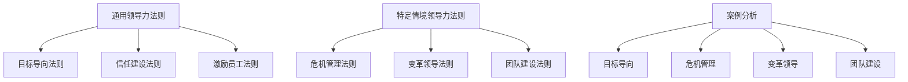

通过了解和运用领导力法则，领导者可以更有效地应对各种领导情境，提升领导能力，推动团队和组织的发展。

---

### 第9章：打造黄金团队

#### 9.1 黄金团队的标准与特点

**黄金团队的标准**：

1. **目标一致性**：团队成员对团队目标和愿景有共同的理解和认同。
2. **高效协作**：团队成员能够高效地协作，共同实现团队目标。
3. **积极进取**：团队成员具有积极向上的态度，勇于挑战和创新。
4. **专业能力**：团队成员具备各自领域的专业知识和技能。
5. **相互信任**：团队成员之间建立信任关系，能够相互支持和协作。

**黄金团队的特点**：

1. **高绩效**：黄金团队能够在高压环境下保持高绩效，实现团队目标。
2. **创新能力**：团队成员具备创新能力，能够不断提出新的想法和解决方案。
3. **高度协作**：团队成员之间协作紧密，能够有效整合各自的专业知识和技能。
4. **自我驱动**：团队成员具备自我驱动力，能够主动承担责任，追求卓越。
5. **持续发展**：黄金团队关注团队成员的个人成长和发展，持续提升团队整体能力。

**案例分析**：某互联网公司通过选拔和培养，建立了一支黄金团队。团队成员在共同的目标和愿景下，高效协作，不断创新，实现了公司业务的快速增长。团队成员之间建立了深厚的信任关系，能够相互支持和协作，共同应对挑战。

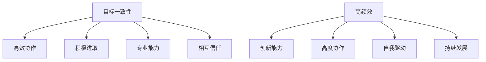

#### 9.2 黄金团队的构建步骤

**构建黄金团队的步骤**：

1. **明确团队目标和愿景**：领导者需要与团队成员共同明确团队的目标和愿景，确保团队成员对目标和愿景有共同的理解和认同。

2. **选拔合适的人才**：根据团队目标和愿景，选拔具备专业能力和积极进取精神的团队成员。注重团队多样性，确保团队具有不同的观点和技能。

3. **培养团队协作精神**：通过定期的团队建设活动、培训和工作坊，培养团队成员之间的信任和协作精神。鼓励团队成员分享经验和知识，建立相互支持的文化。

4. **提供持续发展机会**：为团队成员提供持续的学习和发展机会，包括培训、晋升和项目参与等。关注团队成员的个人成长，帮助他们实现职业目标。

5. **建立有效的激励机制**：制定公平的激励机制，包括绩效评估、奖金和晋升等，激发团队成员的工作热情和创造力。

6. **持续监控和调整**：领导者需要持续监控团队的表现，根据实际情况调整团队结构和策略。确保团队始终保持在高效、创新和协作的状态。

**案例分析**：某科技公司通过以上步骤，成功打造了一支黄金团队。公司领导层明确了团队目标和愿景，选拔了合适的人才，并通过团队建设和持续发展机会，培养了团队成员的协作精神。同时，公司建立了有效的激励机制，激发了团队成员的工作热情和创造力，实现了业务的快速增长。

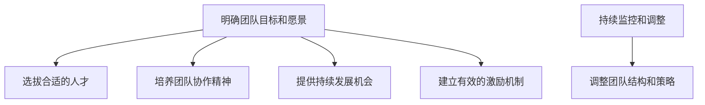

通过以上步骤，领导者可以打造一支高效、创新和协作的黄金团队，推动组织的发展和成功。

#### 9.3 黄金团队的持续发展

**黄金团队的持续发展**：

1. **持续优化团队结构**：领导者需要根据业务发展和团队需求，不断优化团队结构，确保团队始终具备最佳的工作效率和协作能力。

2. **持续提升团队能力**：通过培训、学习和项目实践，不断提升团队成员的专业能力和综合素质，确保团队在竞争激烈的市场环境中保持领先。

3. **保持团队活力和创新**：鼓励团队成员提出新的想法和解决方案，保持团队的活力和创新。通过团队建设活动和跨部门合作，激发团队的创造力和合作精神。

4. **建立积极的团队文化**：建立以信任、尊重和合作为核心的团队文化，营造一个积极、健康的工作氛围。鼓励团队成员之间相互支持、共同成长。

**案例分析**：某公司在持续发展黄金团队方面取得了显著成效。公司领导层不断优化团队结构，根据业务需求调整团队职责和人员配置。同时，公司提供了丰富的培训和学习机会，提升了团队成员的专业能力和综合素质。公司还通过团队建设活动和跨部门合作，保持了团队的活力和创新，推动了公司的持续发展。

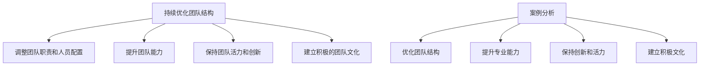

通过以上措施，黄金团队可以持续发展，保持竞争优势，为组织的长期成功奠定坚实基础。

---

### 第10章：领导力法则在团队管理中的应用

#### 10.1 领导力法则与团队管理的结合

**领导力法则与团队管理的结合**：领导力法则与团队管理是相辅相成的。领导力法则为团队管理提供了理论指导和实践框架，而团队管理则将领导力法则具体应用到日常工作中。

**具体应用**：

1. **目标管理**：通过明确团队目标和愿景，领导者可以确保团队成员对目标有共同的理解和认同，提高团队协作效率。

2. **沟通协调**：领导者运用沟通技巧和有效的沟通机制，确保团队成员之间的信息畅通，减少误解和冲突。

3. **激励机制**：领导者运用激励理论，制定公平的激励机制，激发团队成员的工作热情和创造力。

4. **团队建设**：领导者通过团队建设和持续发展，培养团队成员的协作精神和专业能力，提升团队整体绩效。

**案例分析**：某公司在实施团队管理时，充分结合了领导力法则。公司领导层通过明确团队目标和愿景，确保团队成员对目标有共同的理解和认同。同时，公司领导层注重沟通协调，建立了有效的沟通机制，确保团队成员之间的信息畅通。此外，公司领导层制定了公平的激励机制，激发了团队成员的工作热情和创造力。通过这些措施，公司成功打造了一支高效、协作和创新的团队。

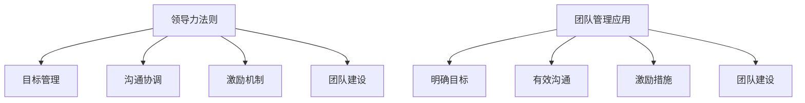

#### 10.2 领导力法则在具体情境中的应用

**情境一：团队面临挑战**

- **应用领导力法则**：领导者应运用危机管理法则，迅速响应，采取紧急措施控制局面。
- **具体操作**：
  1. 启动危机管理预案，确保团队成员了解应对措施。
  2. 保持与团队成员和其他利益相关者的沟通，传递信息，减少恐慌和误解。
  3. 评估危机影响，合理调配资源，确保危机管理的有效实施。

**案例分析**：某公司在面临市场波动时，立即启动了危机管理预案。公司领导层迅速召开了紧急会议，制定了详细的应对措施，并与供应商和客户保持密切沟通。通过这些措施，公司成功缓解了危机，确保了业务的连续性。

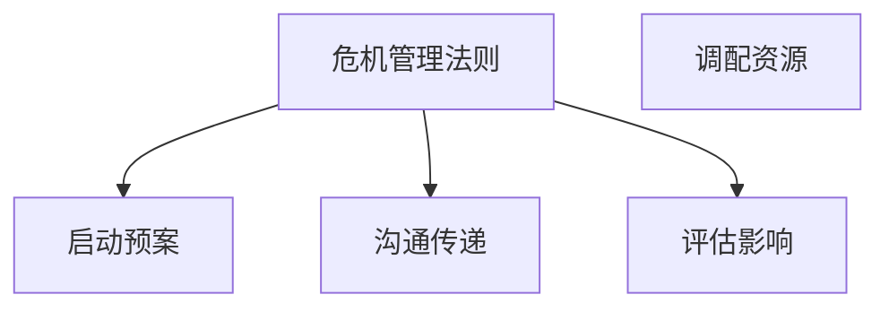

**情境二：团队进行变革**

- **应用领导力法则**：领导者应运用变革领导法则，明确变革愿景，建立变革团队。
- **具体操作**：
  1. 明确变革的目标和愿景，确保团队成员理解并支持变革。
  2. 建立变革团队，由各部门负责人组成，负责变革的具体实施。
  3. 与团队成员进行有效沟通，建立共识，确保团队成员对变革的支持和参与。

**案例分析**：某公司在进行组织变革时，公司领导层明确了变革的目标和愿景，并建立了变革团队。通过定期的会议和沟通，领导层与团队成员建立了共识，并提供了必要的支持和资源。在变革过程中，领导层持续监控变革进展，并根据实际情况进行调整，最终成功实现了组织的转型和创新。

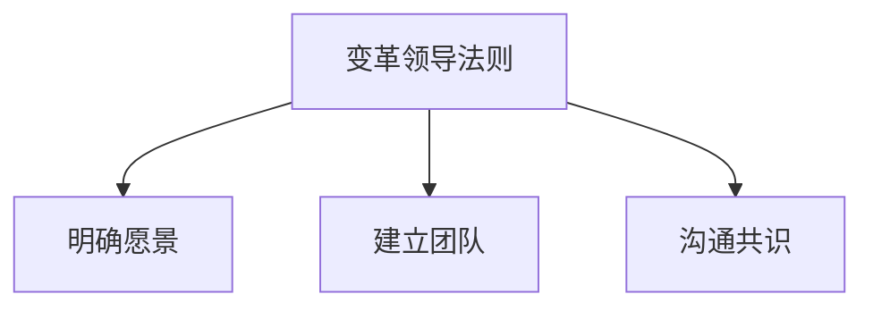

**情境三：团队建设**

- **应用领导力法则**：领导者应运用团队建设法则，培养团队合作精神，提供持续发展机会。
- **具体操作**：
  1. 制定明确的团队目标和愿景，确保团队成员对目标和愿景有共同的理解和认同。
  2. 通过团队建设活动、培训和工作坊，培养团队成员之间的信任和协作精神。
  3. 提供持续的学习和发展机会，关注团队成员的个人成长，帮助他们实现职业目标。

**案例分析**：某公司在团队建设方面取得了显著成效。公司领导层制定了明确的团队目标和愿景，并通过团队建设活动、培训和工作坊，培养了团队成员之间的信任和协作精神。此外，公司还为团队成员提供了丰富的学习和发展机会，关注团队成员的个人成长，从而提升了团队的整体绩效。

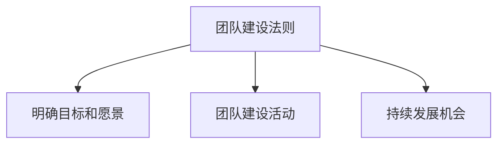

通过在不同情境下灵活应用领导力法则，领导者可以更有效地管理团队，实现组织目标。

---

### 附录A：领导力评估工具与方法

#### A.1 领导力评估工具概述

**领导力评估工具的定义**：领导力评估工具是用于衡量领导者能力、行为和绩效的评估工具。这些工具可以帮助领导者了解自己的优势和不足，为个人发展和团队管理提供指导。

**领导力评估工具的类型**：

1. **自评工具**：领导者通过自我评估，了解自己的领导能力和行为。
2. **360度评估**：通过收集来自上级、同事、下属和其他利益相关者的反馈，全面评估领导者的绩效和表现。
3. **行为观察工具**：通过观察领导者在实际工作情境中的行为，评估其领导风格和效果。
4. **能力测试**：通过测试领导者的知识、技能和思维能力，评估其潜在领导能力。

#### A.2 常用领导力评估方法

**1. 自我评估法**：领导者通过反思和自我评估，识别自己的优势和不足，制定个人发展计划。这种方法简单易行，但可能存在主观性。

**2. 360度评估法**：通过收集来自上级、同事、下属和其他利益相关者的反馈，全面评估领导者的绩效和表现。这种方法具有客观性，但需要确保评估者的诚信和公正性。

**3. 行为观察法**：通过观察领导者在实际工作情境中的行为，评估其领导风格和效果。这种方法可以深入了解领导者的行为模式，但可能需要较长的时间。

**4. 能力测试法**：通过测试领导者的知识、技能和思维能力，评估其潜在领导能力。这种方法适用于选拔和培养潜在领导者。

#### A.3 领导力评估结果的运用

**1. 个人发展**：领导者可以根据评估结果，了解自己的优势和不足，制定个人发展计划，提升领导能力。

**2. 团队管理**：领导力评估结果可以为团队管理提供参考，帮助领导者了解团队成员的领导潜力，优化团队结构。

**3. 绩效评估**：领导力评估结果可以作为绩效评估的一部分，反映领导者的工作表现和贡献。

**4. 组织发展**：领导力评估结果可以为组织发展提供数据支持，帮助组织制定人才发展和领导力培养策略。

**案例分析**：某公司在实施领导力评估时，采用了360度评估法和自我评估法。通过评估，公司领导层发现了自身的优势和不足，并制定了个人发展计划。同时，公司根据评估结果，调整了团队结构，优化了领导团队，提高了整体绩效。

```mermaid
graph TD
    A[领导力评估工具概述] --> B[自评工具]
    A --> C[360度评估]
    A --> D[行为观察工具]
    A --> E[能力测试]
    F[常用评估方法] --> G[自我评估法]
    F --> H[360度评估法]
    F --> I[行为观察法]
    F --> J[能力测试法]
    K[评估结果运用] --> L[个人发展]
    K --> M[团队管理]
    K --> N[绩效评估]
    K --> O[组织发展]
```

通过有效的领导力评估工具和方法，领导者可以更好地了解自己的能力和行为，制定个人发展计划，提升领导能力，为组织的发展贡献力量。

---

### 附录B：领导力发展计划

#### B.1 领导力发展计划的设计

**领导力发展计划的概念**：领导力发展计划是指为了提升领导者的能力，帮助其实现职业目标，而制定的一系列培训、指导和发展活动。

**设计领导力发展计划的关键要素**：

1. **目标明确**：明确领导力发展计划的目标，包括提升领导能力、解决具体问题或实现特定的职业目标。
2. **评估现状**：通过评估领导者的现有能力和行为，确定发展需求，为计划设计提供依据。
3. **制定计划**：根据评估结果，制定具体的发展计划，包括培训课程、指导计划、实践项目和反思活动。
4. **资源配置**：确保计划实施所需的资源，包括时间、资金、导师和培训材料等。
5. **持续反馈**：建立反馈机制，定期评估发展计划的实施效果，根据反馈进行调整和优化。

#### B.2 领导力发展计划的实施

**实施领导力发展计划的步骤**：

1. **启动会议**：召开启动会议，介绍发展计划的目标、内容和方法，确保参与者明确计划的目的和预期成果。
2. **培训课程**：根据发展计划，组织相关的培训课程，包括领导力理论、沟通技巧、团队建设等。
3. **实践项目**：设计实际工作场景中的实践项目，让领导者将所学知识应用于实际工作中，提高实践能力。
4. **导师指导**：为领导者配备导师，提供一对一的指导和支持，帮助其解决实际问题和提升领导能力。
5. **反思与评估**：定期组织反思会议，让领导者分享学习心得和实践经验，进行自我评估和反馈，不断优化发展计划。

#### B.3 领导力发展计划的评估与改进

**评估领导力发展计划的效果**：

1. **绩效评估**：通过绩效评估，衡量领导者在发展计划实施后的工作表现和成果。
2. **360度评估**：收集来自上级、同事、下属和其他利益相关者的反馈，全面评估领导力发展计划的效果。
3. **行为观察**：通过观察领导者在实际工作情境中的行为变化，评估领导力发展计划的实际效果。

**改进领导力发展计划**：

1. **分析反馈**：根据评估结果，分析领导力发展计划的优势和不足，找出需要改进的方面。
2. **调整计划**：根据分析结果，调整发展计划的内容和方法，确保计划更加符合领导者的实际需求。
3. **持续优化**：通过持续的反馈和评估，不断优化领导力发展计划，提高实施效果。

**案例分析**：某公司为了提升领导者的能力，制定了系统的领导力发展计划。公司首先明确了发展计划的目标，并通过360度评估和自我评估，确定了领导者的需求。接下来，公司组织了多种培训课程，设计了实践项目，并配备了导师进行指导。通过定期的反思和评估，公司不断优化发展计划，最终显著提升了领导者的领导能力，提高了团队的整体绩效。

```mermaid
graph TD
    A[领导力发展计划设计] --> B[目标明确]
    A --> C[评估现状]
    A --> D[制定计划]
    A --> E[资源配置]
    A --> F[持续反馈]
    G[实施计划] --> H[启动会议]
    G --> I[培训课程]
    G --> J[实践项目]
    G --> K[导师指导]
    G --> L[反思与评估]
    M[评估效果] --> N[绩效评估]
    M --> O[360度评估]
    M --> P[行为观察]
    Q[改进计划] --> R[分析反馈]
    Q --> S[调整计划]
    Q --> T[持续优化]
```

通过科学的领导力发展计划设计、有效的实施和持续的评估与改进，领导者可以不断提升自己的能力，为组织的持续发展贡献力量。

---

## 总结

在本文中，我们系统地探讨了领导力的定义、特征、心理学基础、理论发展、实践技巧，以及领导力法则在团队管理中的应用。通过分析领导力的理论框架，我们理解了不同领导风格和领导力类型的适用场景，并通过具体案例展示了领导力在实际工作中的应用效果。

### 关键点总结

1. **领导力的定义与特征**：领导力是一种影响和引导他人实现目标的能力，包括影响力、使命感、决断力、沟通能力和激励能力。
2. **领导力心理学**：领导者需要具备自我认知和心理素质，理解团队成员的心理需求，并将心理学理论应用于领导实践中。
3. **领导力理论发展**：从特质理论、行为理论到情境理论和变革型领导理论，不同理论提供了不同的视角和方法来理解领导力。
4. **领导力实践技巧**：沟通与协调、激励与反馈、团队建设与管理等实践技巧是提升领导能力的关键。
5. **领导力法则**：领导力法则如目标导向、信任建设、激励员工等，为领导者提供了具体的行动指南。
6. **黄金团队建设**：通过明确目标、选拔人才、培养协作精神和提供发展机会，领导者可以打造高效、创新和协作的黄金团队。

### 拓展阅读

- **《领导力：实践者的指南》（Leadership: A Practical Guide）**：一本关于领导力的实战指南，提供实用的技巧和案例分析。
- **《变革型领导力》（Transformational Leadership）**：深入探讨变革型领导力的理论和方法，帮助领导者推动组织变革。
- **《团队协作的艺术》（The Art of Collaborative Leadership）**：关注团队协作的重要性，提供提升团队协作效率的策略。

通过本文的学习，希望读者能够对领导力有更深入的理解，并在实际工作中运用这些理论和方法，提升自己的领导能力，为团队和组织的发展贡献力量。

### 作者信息

**作者：AI天才研究院/AI Genius Institute & 禅与计算机程序设计艺术 /Zen And The Art of Computer Programming**。本文由AI天才研究院的专家团队撰写，结合了计算机科学和领导力理论，旨在为读者提供有深度、有思考、有见解的专业技术博客文章。

