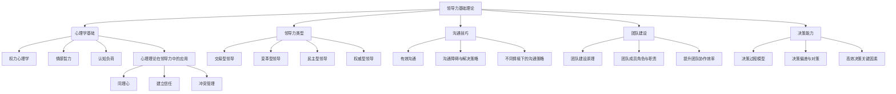

                 

### 文章标题：领导力训练营：168天从新手到专家

> 关键词：领导力，训练营，专家，自我提升，实践

> 摘要：本文旨在探讨如何通过一个为期168天的领导力训练营，帮助新手从零基础快速成长为领导力专家。文章将详细分析领导力的基础理论、技能培养、实践应用及训练营设计等关键环节，并提供实战案例和实用技巧，以帮助读者深入了解并掌握领导力的核心要义。

---

### 引言

在当今快速变化的世界中，领导力已经成为了企业和个人成功的关键因素。无论是创业公司的小老板，还是跨国企业的CEO，优秀的领导力都是驱动团队、实现目标的核心力量。然而，领导力的培养并非一蹴而就，它需要系统的学习和长期的实践。本文将探讨如何通过一个为期168天的领导力训练营，帮助新手从零基础快速成长为领导力专家。

领导力训练营的设计理念是将理论学习与实际操作紧密结合，通过系统化的课程和实践活动，让学员在短时间内获得宝贵的领导经验。本文将按照以下结构展开：

1. **领导力基础理论**：介绍领导力的基本概念、类型及心理学基础。
2. **领导力技能培养**：探讨沟通技巧、团队建设、决策能力等关键技能的培养方法。
3. **领导力实践**：分析领导力实践中的成功与失败案例，提供实战经验和策略。
4. **领导力训练营实践**：介绍训练营的设计流程、实施方法及评估反馈机制。
5. **附录**：提供领导力工具、参考资料及扩展阅读。

通过本文的阅读，读者将能够全面了解领导力训练营的运作机制，掌握领导力的核心要义，并为自己的领导力提升之路打下坚实的基础。

### 第一部分：领导力基础理论

#### 第1章：领导力概念与类型

**1.1 领导力基本概念**

领导力是一种影响他人共同实现目标的能力，它不仅仅是管理，更是一种激励和引导团队向共同目标前进的过程。领导力不同于管理，管理是确保组织目标的实现，而领导力则是创造愿景并激励团队成员追求这个愿景。

领导力具有以下核心特征：

- **影响力**：领导力通过影响他人来达成目标，而不仅仅依靠职位权力。
- **愿景**：领导力强调明确的目标和未来的愿景，为团队提供方向。
- **激励**：领导力通过激励和鼓舞团队成员，激发他们的潜能和动力。
- **适应变化**：领导力需要灵活应对环境变化，并带领团队实现转变。

**1.2 领导力类型及其特点**

根据不同的标准，领导力可以分为多种类型。以下是一些常见的领导力类型及其特点：

- **交易型领导**：通过明确的奖励和惩罚来激励团队成员，特点是高效和稳定。交易型领导适合在稳定的环境中运作，但在面对复杂和不确定的情况时可能效果不佳。

  ```plaintext
  交易型领导特点：
  - 高效执行力
  - 稳定性和可预测性
  - 依赖于外部激励
  ```

- **变革型领导**：通过激发团队成员的内在动机，推动变革和创新。变革型领导特点是灵活和创新，能够带领团队克服挑战，实现重大突破。

  ```plaintext
  变革型领导特点：
  - 激发内在动机
  - 推动创新和变革
  - 高度适应性
  ```

- **民主型领导**：通过集体讨论和共识决策来指导团队，特点是包容和协作。民主型领导适用于需要广泛参与和团队智慧的项目，但在决策速度上可能较慢。

  ```plaintext
  民主型领导特点：
  - 包容和协作
  - 集体决策
  - 高度参与感
  ```

- **权威型领导**：依靠个人的专业知识和权威来指导和影响团队，特点是果断和高效。权威型领导在紧急情况下或需要迅速做出决策时效果显著，但可能缺乏团队的积极参与。

  ```plaintext
  权威型领导特点：
  - 果断和高效
  - 依赖个人权威
  - 强调专业知识和经验
  ```

**1.3 领导力与管理的区别与联系**

领导力和管理是组织运作中密切相关的两个概念，但它们之间也有明显的区别：

- **领导力关注激励和愿景**：领导力专注于激励团队成员、设定愿景和引领变革。
- **管理关注流程和效率**：管理则关注组织流程、资源分配和效率优化。

领导力和管理的联系在于它们共同构成了组织的成功基石。优秀的领导者通常会兼具领导力和管理能力，以确保团队目标的实现和组织的长远发展。

**1.4 领导力心理学基础**

领导力不仅仅是技术层面的能力，它还涉及心理学层面。以下是几个关键的心理学概念：

- **权力心理学**：权力是领导力的基础之一，理解权力的来源和运用对于领导力至关重要。
- **情感智力**：情感智力指的是理解和管理自己和他人的情感的能力，对于领导力的成功至关重要。
- **认知负荷**：领导者在做出决策时需要处理大量的信息，理解认知负荷对于提高决策效率至关重要。

**1.5 心理理论在领导力中的应用**

心理理论是理解他人思维和情感的能力，它在领导力中有着广泛的应用。以下是心理理论在领导力中的应用：

- **同理心**：领导者通过同理心来理解员工的情感和需求，从而更好地激励和引导他们。
- **建立信任**：心理理论帮助领导者建立与员工的信任关系，增强团队的凝聚力。
- **冲突管理**：领导者可以利用心理理论来理解和解决团队内部的冲突。

通过了解这些基础理论和心理学概念，我们可以更好地理解领导力的本质，并为领导力的提升打下坚实的基础。

#### 第2章：领导力与心理学

**2.1 领导力心理学基础**

领导力不仅仅是技术或策略，它更是一种心理活动。领导力的心理学基础涉及多个领域，包括权力心理学、情感智力和认知负荷等。理解这些心理学概念对于提升领导力至关重要。

- **权力心理学**：权力是领导力的核心要素之一。权力心理学研究权力的来源、运用及其对个体行为的影响。领导者需要了解权力的本质，以便有效地运用它来影响和激励团队。

  ```plaintext
  权力心理学关键点：
  - 权力的来源：职位、知识、关系等
  - 权力的运用：奖励、惩罚、影响力等
  - 权力的副作用：权力滥用、自大等
  ```

- **情感智力**：情感智力（Emotional Intelligence，简称EQ）是指理解和管理自己和他人的情感的能力。情感智力对领导力有着重要影响，高情商的领导者能够更好地处理人际关系，提升团队凝聚力和效率。

  ```plaintext
  情感智力关键点：
  - 自我意识：了解自己的情感
  - 自我管理：控制负面情绪
  - 同理心：理解他人的情感
  - 社交技能：建立和维护人际关系
  ```

- **认知负荷**：认知负荷是指个体在处理信息时所需的认知资源。领导者在做出决策时需要处理大量信息，理解认知负荷有助于提高决策效率和准确性。

  ```plaintext
  认知负荷关键点：
  - 信息过载：减少不必要的干扰
  - 决策疲劳：定期休息和充电
  - 决策框架：使用明确的决策流程
  ```

**2.2 心理理论在领导力中的应用**

心理理论（Theory of Mind，简称ToM）是指个体理解他人思维和情感的能力。心理理论在领导力中的应用非常广泛，有助于领导者更好地激励和引导团队。

- **同理心**：同理心是基于心理理论的，领导者通过同理心来理解员工的情感和需求，从而更好地激励和引导他们。

  ```mermaid
  graph TD
  A[同理心] --> B[理解员工的情感]
  B --> C[激励员工]
  C --> D[提高团队凝聚力]
  ```

- **建立信任**：心理理论帮助领导者建立与员工的信任关系，增强团队的凝聚力。领导者需要通过开放沟通、倾听和理解员工的观点来建立信任。

  ```mermaid
  graph TD
  A[心理理论] --> B[理解员工观点]
  B --> C[开放沟通]
  C --> D[建立信任]
  D --> E[增强团队凝聚力]
  ```

- **冲突管理**：领导者可以利用心理理论来理解和解决团队内部的冲突。通过同理心和理解，领导者可以更好地处理冲突，找到解决方案。

  ```mermaid
  graph TD
  A[心理理论] --> B[理解冲突根源]
  B --> C[同理心]
  C --> D[解决冲突]
  ```

**2.3 领导者的心理素质与能力培养**

领导者的心理素质对其领导力有着重要影响。以下是一些关键的心理素质和能力，以及如何培养这些素质和能力：

- **自我意识**：领导者需要具备良好的自我意识，了解自己的情感、动机和价值观。自我意识的培养可以通过自我反思、心理评估和反馈来实现。

  ```mermaid
  graph TD
  A[自我意识] --> B[自我反思]
  B --> C[心理评估]
  C --> D[反馈]
  ```

- **自我管理**：领导者需要能够控制自己的情绪和行为，避免负面情绪的影响。自我管理的培养可以通过冥想、正念练习和心理训练来实现。

  ```mermaid
  graph TD
  A[自我管理] --> B[冥想]
  B --> C[正念练习]
  C --> D[心理训练]
  ```

- **同理心**：同理心是领导者的重要素质，可以通过角色扮演、情感交流和情景模拟来培养。

  ```mermaid
  graph TD
  A[同理心] --> B[角色扮演]
  B --> C[情感交流]
  C --> D[情景模拟]
  ```

- **社交技能**：领导者需要具备良好的社交技能，包括沟通、倾听、协调和冲突解决。社交技能的培养可以通过参与团队活动、社交培训和模拟练习来实现。

  ```mermaid
  graph TD
  A[社交技能] --> B[团队活动]
  B --> C[社交培训]
  C --> D[模拟练习]
  ```

通过了解和培养这些心理素质和能力，领导者可以提升自己的领导力，更好地激励和引导团队，实现组织目标。

### 第二部分：领导力技能培养

#### 第3章：沟通技巧

**3.1 有效沟通的基本原则**

沟通是领导力的重要组成部分，有效的沟通能够提高团队的协作效率，减少误解和冲突。以下是有效沟通的基本原则：

- **明确目标**：在沟通前，明确沟通的目标和意图，确保信息的传递是清晰和有针对性的。
- **主动倾听**：倾听是有效沟通的关键，领导者需要主动倾听员工的意见和建议，尊重他们的观点和感受。
- **信息准确**：确保传递的信息是准确无误的，避免因信息失真导致误解和误判。
- **简洁明了**：尽量用简洁明了的语言表达，避免使用复杂的术语或冗长的叙述，确保信息容易被理解和接受。
- **非语言沟通**：注意使用非语言沟通手段，如肢体语言、面部表情和声音变化，以增强沟通效果。

**3.2 沟通障碍与解决策略**

尽管遵循有效沟通的基本原则，但沟通过程中仍然可能遇到障碍。以下是几种常见的沟通障碍及其解决策略：

- **文化差异**：文化差异可能导致沟通误解和障碍。解决策略包括增强文化敏感性、提供跨文化培训以及鼓励开放和包容的沟通环境。
- **信息过载**：信息过载可能导致沟通效率低下。解决策略包括简化信息、优先处理重要信息以及使用图表和可视化工具来传达复杂信息。
- **情绪因素**：情绪因素可能导致沟通不畅。解决策略包括情绪管理、同理心以及使用适当的沟通方式来缓解情绪紧张。
- **沟通渠道选择**：选择合适的沟通渠道对于提高沟通效果至关重要。解决策略包括根据沟通内容和目的选择合适的渠道，如面对面交流、电话会议或电子邮件。

**3.3 不同情境下的沟通策略**

不同的情境需要不同的沟通策略，领导者需要根据具体情境灵活调整沟通方式：

- **正式会议**：在正式会议中，沟通需要正式和有组织。领导者应该明确会议议程、控制会议节奏，确保所有参与者都有发言机会。
- **一对一沟通**：一对一沟通通常用于解决具体问题或提供个人反馈。领导者需要专注于对方的观点和感受，确保沟通是开放和诚实的。
- **团队讨论**：团队讨论需要鼓励成员积极参与和表达意见。领导者应该引导讨论方向、确保公平发言，并总结讨论结果。
- **远程沟通**：在远程沟通中，领导者需要特别注意沟通工具的选择和沟通环境的设定。解决策略包括使用视频会议、即时通讯工具以及确保网络畅通。

**3.4 沟通技巧的实际应用**

以下是几个实际案例，展示了沟通技巧在领导力中的应用：

- **案例1**：一个项目经理在项目进度会议上发现团队成员对任务分配有不同意见。项目经理通过积极倾听和理解团队成员的观点，最终找到了一个双方都能接受的解决方案，避免了冲突。
- **案例2**：一位部门主管在员工反馈会议上通过简洁明了的语言和图表，清晰地传达了公司的战略目标和团队的工作重点，提高了员工的参与度和理解度。
- **案例3**：一位产品经理在与客户沟通时，使用了情感智力和同理心，理解了客户的需求和期望，最终达成了一项双赢的协议。

通过有效的沟通技巧，领导者可以更好地传达信息、解决问题、建立信任和推动团队协作，从而实现组织目标。

#### 第4章：团队建设

**4.1 团队建设的基本原理**

团队建设是领导力的重要组成部分，一个高效的团队可以显著提升组织的绩效和创新能力。以下是团队建设的基本原理：

- **共同目标**：团队建设的基础是共同的目标，这需要团队明确自身的使命、愿景和价值观，确保所有成员都朝着同一个方向努力。
- **信任与尊重**：信任和尊重是团队协作的基石。团队需要建立起相互信任的关系，尊重每个人的贡献和观点，从而提高团队的凝聚力。
- **沟通与协作**：有效的沟通和协作是团队成功的关键。团队需要建立开放和透明的沟通渠道，鼓励成员之间的互动和合作，以确保信息流通和资源优化。
- **个人与团队成长**：团队建设不仅关注团队的整体表现，还要关注每个成员的个人成长和发展。通过提供培训和激励，团队可以不断提升成员的能力和信心。

**4.2 团队成员的角色与职责**

在团队建设中，明确团队成员的角色和职责对于团队的高效运作至关重要。以下是团队成员的常见角色和职责：

- **领导者**：领导者负责制定团队目标、规划工作流程、协调团队成员、解决团队冲突，并确保团队按时完成目标。
- **执行者**：执行者是团队中的核心成员，负责具体任务的执行和完成。他们通常具备专业技能，能够高效地完成任务。
- **协调者**：协调者负责团队内部和外部的沟通协调，确保团队信息流通无阻，同时协调不同任务和项目的优先级。
- **支持者**：支持者负责提供团队所需的资源和支持，包括技术支持、行政管理等，以确保团队能够集中精力完成任务。
- **创新者**：创新者是团队中的思想源泉，负责提出新的想法、创新方案和改进措施，推动团队的持续发展和创新。

**4.3 提升团队协作效率的策略**

提升团队协作效率是团队建设的重要目标，以下是一些策略：

- **明确目标和任务**：确保团队成员明确团队的目标和任务，了解各自的角色和职责，从而提高工作专注度和效率。
- **建立良好的沟通机制**：建立有效的沟通渠道，确保团队成员之间能够顺畅地交流信息、共享资源和解决冲突。
- **定期团队会议**：定期召开团队会议，回顾工作进展、讨论问题和规划下一步行动，有助于团队保持工作节奏和目标一致性。
- **团队合作培训**：提供团队合作培训，帮助团队成员掌握有效的沟通技巧、协作工具和团队建设策略，提升整体协作能力。
- **激励机制**：建立合理的激励机制，鼓励团队成员积极参与和贡献，提高团队的整体士气和效率。

**4.4 团队建设工具与方法**

为了更有效地进行团队建设，领导者可以运用一些团队建设工具和方法：

- **团队建设活动**：组织团队建设活动，如团队拓展训练、团队讨论和互动游戏，增强团队成员之间的相互了解和信任。
- **360度反馈**：通过360度反馈机制，收集团队成员对自己的评价和反馈，帮助成员了解自己的优势和改进点。
- **领导力发展计划**：制定领导力发展计划，为团队成员提供领导力培训和成长机会，提升团队的整体领导力水平。
- **团队评估工具**：使用团队评估工具，如团队健康检查、团队协作度评估等，定期评估团队的表现和协作效果，为改进提供依据。

通过遵循团队建设的基本原理、明确团队成员的角色与职责，并运用有效的策略和工具，领导者可以打造一个高效、协作和有凝聚力的团队，实现组织的长期成功。

#### 第5章：决策能力

**5.1 决策过程的模型与方法**

决策能力是领导者成功的重要保证，一个高效的决策过程可以显著提升团队和组织的前景。以下是几种常见的决策模型与方法：

- **理性决策模型**：理性决策模型假设决策者在面对问题时能够全面分析所有相关信息，并选择最优的解决方案。这一模型包括以下步骤：

  ```mermaid
  graph TD
  A[明确问题] --> B[收集信息]
  B --> C[评估方案]
  C --> D[选择最优方案]
  D --> E[执行与评估]
  ```

- **有限理性决策模型**：有限理性决策模型认为，决策者在面对复杂和不确定的问题时，不能完全分析所有信息，而是根据有限的信息做出次优决策。这一模型包括以下步骤：

  ```mermaid
  graph TD
  A[明确问题] --> B[收集信息]
  B --> C[快速筛选方案]
  C --> D[选择可行方案]
  D --> E[执行与评估]
  ```

- **模糊前端决策模型**：模糊前端决策模型用于处理复杂和不确定的问题，它强调在决策初期就识别和分析不确定性因素，并制定相应的应对策略。这一模型包括以下步骤：

  ```mermaid
  graph TD
  A[识别问题] --> B[分析不确定性]
  B --> C[制定应对策略]
  C --> D[执行决策]
  ```

- **多目标决策模型**：多目标决策模型用于处理具有多个目标的决策问题，它需要决策者在不同目标之间进行权衡。这一模型包括以下步骤：

  ```mermaid
  graph TD
  A[明确目标] --> B[评估目标权重]
  B --> C[生成备选方案]
  C --> D[计算目标值]
  D --> E[选择最优方案]
  ```

**5.2 决策中的常见偏差与对策**

在决策过程中，人类常常受到各种心理偏差的影响，这些偏差可能导致决策失误。以下是几种常见的决策偏差及相应的对策：

- **确认偏差**：确认偏差是指决策者在收集信息和分析方案时，倾向于选择和验证自己已有观点的信息，忽略其他信息。对策包括使用多元化的信息来源、引入外部专家评估和定期反思决策过程。

  ```mermaid
  graph TD
  A[确认偏差] --> B[多元化信息来源]
  B --> C[引入外部专家]
  C --> D[定期反思]
  ```

- **代表性偏差**：代表性偏差是指决策者根据事物的表面特征进行判断，而忽略了概率和统计数据。对策包括使用概率理论进行分析、进行数据可视化以及进行情景模拟。

  ```mermaid
  graph TD
  A[代表性偏差] --> B[概率理论分析]
  B --> C[数据可视化]
  C --> D[情景模拟]
  ```

- **锚定效应**：锚定效应是指决策者在做出决策时，受到最初信息（锚点）的影响，而忽视了其他更重要的信息。对策包括使用独立的评估小组、设定多个锚点进行比较以及进行决策前讨论。

  ```mermaid
  graph TD
  A[锚定效应] --> B[独立评估小组]
  B --> C[多个锚点比较]
  C --> D[决策前讨论]
  ```

- **过度自信**：过度自信是指决策者对自己的判断过于自信，从而忽视风险和不确定性。对策包括引入风险评估模型、进行风险评估培训以及进行定期自我反思。

  ```mermaid
  graph TD
  A[过度自信] --> B[风险评估模型]
  B --> C[风险评估培训]
  C --> D[定期自我反思]
  ```

通过了解和应对这些决策偏差，领导者可以更科学和理性地做出决策，减少决策失误，提升决策质量。

**5.3 高效决策的关键因素**

为了做出高效决策，领导者需要关注以下关键因素：

- **信息质量**：高质量的信息是做出高效决策的基础，领导者需要确保信息的准确性和完整性。
- **时间管理**：决策往往需要时间进行深入分析和评估，领导者需要合理安排时间，确保有足够的时间进行决策。
- **团队协作**：高效的决策通常需要团队的共同努力，领导者需要建立协作机制，确保团队成员能够积极参与和贡献。
- **决策执行**：决策的执行是决策过程的关键环节，领导者需要确保决策能够得到有效执行，并及时调整和优化决策方案。

通过综合考虑这些关键因素，领导者可以提升决策的质量和效率，为组织的成功奠定基础。

### 第三部分：领导力实践

#### 第6章：领导力实践案例

**6.1 成功领导案例分享**

成功领导案例可以为新手提供宝贵的经验和启示。以下是一个成功的领导案例分享：

**案例背景**：某创业公司初创阶段，团队成员不多，但充满激情和创造力。然而，随着公司业务的扩展，团队成员之间的沟通和协作逐渐出现问题，影响了公司的发展。

**领导策略**：

- **建立共同愿景**：公司CEO与团队成员共同讨论公司愿景和目标，确保所有成员都明确公司的发展方向和个人的角色。
- **强化团队文化**：CEO通过定期团队活动和聚餐，增强了团队成员之间的信任和凝聚力，营造了一个积极和开放的工作氛围。
- **鼓励创新与协作**：CEO鼓励团队成员提出创新想法，并建立跨部门协作机制，促进知识共享和资源优化。
- **开放沟通**：CEO建立了开放的沟通渠道，定期组织团队会议，听取成员的意见和建议，确保信息流通和决策透明。

**结果**：通过这些策略，公司的团队成员士气高涨，工作效率显著提升，公司业务迅速扩展，市场份额不断扩大。

**6.2 领导力失败案例分析**

失败的领导案例同样具有重要的教育意义。以下是一个领导力失败案例的分析：

**案例背景**：某大型企业，由于长期领导者的独断专行和缺乏创新，导致公司逐渐失去竞争力，市场份额不断下降。

**失败原因**：

- **缺乏同理心**：领导者缺乏对员工需求的关注和理解，忽视了员工的情感和成长需求，导致员工士气低落。
- **信息封闭**：领导者过度依赖自身经验，封闭信息渠道，导致决策缺乏全面和客观的数据支持。
- **缺乏创新**：领导者固守传统思维，缺乏对新趋势和技术的敏感度，导致公司在市场变化中无法迅速适应。

**教训**：

- **同理心**：领导者需要关注员工的情感和需求，建立开放和包容的团队文化。
- **信息共享**：领导者需要开放信息渠道，鼓励团队成员参与决策，提升决策质量。
- **持续学习**：领导者需要保持对新趋势和技术的敏感度，持续学习和创新，以适应不断变化的市场环境。

**6.3 领导力实践中的常见挑战及应对**

在领导力实践中，领导者常常会遇到各种挑战。以下是一些常见挑战及应对策略：

- **团队冲突**：应对策略包括建立有效的沟通机制、引入调解和解决冲突的培训、以及制定明确的团队规范。
- **员工流失**：应对策略包括提供职业发展机会、建立公平和透明的激励机制、以及关注员工的工作环境和心理健康。
- **决策失误**：应对策略包括引入多目标决策模型、进行风险分析和评估、以及建立反馈和调整机制。
- **资源不足**：应对策略包括优化资源分配、寻求外部合作伙伴、以及制定长期发展战略。

通过分析成功和失败的领导案例，领导者可以汲取经验教训，提升自己的领导能力，更好地应对实践中的挑战。

#### 第7章：领导力自我提升

**7.1 自我反思与领导力发展**

自我反思是领导力发展的重要步骤，通过反思，领导者可以更好地认识自己的优势和不足，从而进行有针对性的提升。以下是如何进行自我反思：

- **定期回顾**：领导者可以定期回顾自己的工作表现，包括成功和失败的决策，以及团队成员的反馈。
- **记录日志**：通过记录日志，领导者可以系统地记录自己的工作内容和反思过程，便于后续分析和总结。
- **寻求反馈**：领导者可以主动寻求团队成员和上级的反馈，了解自己的领导风格和工作表现。
- **对比标准**：将个人表现与行业标准和最佳实践进行对比，识别差距和改进方向。

**7.2 持续学习与成长**

持续学习是领导者不断提升的关键。以下是一些学习途径：

- **阅读**：阅读领导力相关的书籍和文章，了解最新的理论和实践。
- **培训**：参加领导力培训和研讨会，提升自己的知识和技能。
- **网络学习**：利用在线资源和平台，学习最新的领导力工具和技巧。
- **实践**：通过实际工作，不断尝试和改进，积累实践经验。

**7.3 建立个人领导力品牌**

建立个人领导力品牌有助于提升领导者的知名度和影响力。以下是一些建立个人领导力品牌的策略：

- **分享经验**：通过写作、演讲和授课等方式，分享自己的领导经验和心得，提升个人影响力。
- **参与社区**：加入专业社区和论坛，参与讨论和分享，扩大自己的影响力。
- **塑造形象**：通过社交媒体和个人品牌，塑造专业和可信的领导形象。
- **寻求合作**：与其他领导者建立合作关系，共同推动领导力的发展。

通过自我反思、持续学习和建立个人领导力品牌，领导者可以不断提升自己的能力，实现长期的职业发展。

#### 第四部分：领导力训练营实践

**第8章：训练营设计**

**8.1 训练营目标与内容规划**

设计一个有效的领导力训练营，首先需要明确训练营的目标和内容规划。以下是一个典型的领导力训练营设计框架：

- **目标**：提升新手领导者的基础理论知识和实践能力，培养其沟通技巧、团队建设能力和决策能力，帮助其从零基础快速成长为领导力专家。

- **内容规划**：

  - **基础理论**：包括领导力概念、领导力类型、心理学基础等。
  - **技能培养**：包括沟通技巧、团队建设、决策能力等。
  - **实践应用**：包括案例分析、角色扮演、团队项目等。
  - **训练营活动**：包括团队建设游戏、领导力讨论会、导师辅导等。

**8.2 训练营实施流程**

一个有效的训练营实施流程可以分为以下几个阶段：

- **预备阶段**：学员报名、背景调查、训练营宣传和报名推广。
- **启动阶段**：训练营开幕式、介绍训练营目标和流程、分配导师和团队。
- **学习阶段**：理论学习、技能训练、实践应用、训练营活动。
- **评估阶段**：个人和团队评估、导师反馈、学员总结。
- **结营阶段**：训练营总结、证书颁发、后续支持。

**8.3 训练营评估与反馈**

评估和反馈是训练营成功的关键。以下是一些评估和反馈的方法：

- **个人评估**：通过自我评估问卷、导师评估报告和同行评估，了解学员的学习成果和能力提升。
- **团队评估**：通过团队项目评估、团队讨论评估和团队活动评估，了解团队的协作效果和问题。
- **导师反馈**：导师对学员的学习表现和问题进行反馈，帮助学员进行改进。
- **学员反馈**：通过学员反馈问卷，收集学员对训练营内容和过程的意见和建议，为后续改进提供依据。

通过明确训练营的目标和内容规划，合理的实施流程和有效的评估与反馈机制，领导力训练营可以确保学员在短时间内获得显著的领导力提升。

**第9章：领导力训练营案例**

**9.1 国内领导力训练营案例**

国内有许多知名的领导力训练营，以下是一些典型案例：

- **案例1：中欧国际工商学院领导力训练营**：中欧国际工商学院提供的领导力训练营，包括基础理论、案例分析、实战模拟等多个环节，通过密集的训练和实战，帮助学员快速提升领导力。
- **案例2：清华大学领导力训练营**：清华大学领导力训练营结合学术研究和实际案例，提供系统化的领导力培训，培养具有国际视野的领导者。
- **案例3：华为领导力训练营**：华为公司内部举办的领导力训练营，通过实践项目和团队协作，提升员工的管理能力和领导素质。

**9.2 国际领导力训练营案例**

国际上的领导力训练营也具有丰富的经验和多样化的培训模式：

- **案例1：哈佛商学院领导力训练营**：哈佛商学院的领导力训练营，以实战和案例研究为核心，通过模拟商业环境，提升领导者的决策能力和战略思维。
- **案例2：领导力发展协会（LDI）训练营**：领导力发展协会提供的训练营，注重领导力的全面发展，包括沟通技巧、团队建设和领导风格等。
- **案例3：谷歌领导力训练营**：谷歌公司举办的领导力训练营，通过内部培训和外部合作，提升员工的领导力和创新能力，推动公司持续发展。

**9.3 训练营成果展示与影响力评估**

领导力训练营的成果展示和影响力评估是衡量训练营效果的重要环节。以下是一些评估方法和成果展示：

- **个人成长报告**：通过个人成长报告，展示学员在领导力、沟通技巧和团队建设等方面的提升。
- **团队项目展示**：通过团队项目展示，展示学员在实践中的成果和能力。
- **领导力评估工具**：使用领导力评估工具，如360度反馈、领导力评分表等，评估学员的领导力水平。
- **学员反馈调查**：通过学员反馈调查，了解训练营对学员工作表现和职业发展的影响。

通过成果展示和影响力评估，训练营可以清晰地展示其效果，为后续改进和推广提供依据。

### 附录

**附录A：领导力工具与方法**

- **领导力评估工具**：包括360度反馈表、领导力评分表等，用于评估领导者的领导力水平。
- **团队建设工具**：包括团队角色评估、团队任务分配表等，用于提升团队协作和效率。
- **决策支持工具**：包括SWOT分析、决策树等，用于辅助领导者做出科学和理性的决策。

**附录B：参考资料**

- **推荐阅读书目**：包括《领导力五项修炼》、《影响力》等，涵盖领导力基础理论、心理学和沟通技巧。
- **领导力研究文献精选**：包括《哈佛商业评论》中的领导力文章、学术期刊中的研究论文等。
- **领导力网站与在线资源**：如领导力发展协会（LDI）网站、领英（LinkedIn）上的领导力专栏等。

通过附录中的工具和方法、参考资料及在线资源，读者可以进一步深入了解和掌握领导力的核心要义，为自我提升提供有力支持。

### 跨章节内容：核心概念与联系

为了更好地理解领导力的核心概念及其相互之间的联系，我们可以使用Mermaid流程图来展示领导力与心理学、领导力类型、沟通技巧、团队建设和决策能力之间的关系架构。



通过这张Mermaid流程图，我们可以清晰地看到领导力基础理论与心理学、领导力类型、沟通技巧、团队建设和决策能力之间的内在联系。心理学基础为领导力提供了理论支持，而领导力类型则帮助领导者根据不同情境选择合适的领导风格。沟通技巧、团队建设和决策能力都是领导力的具体体现，相互之间相互作用，共同推动领导力的提升。

### 跨章节内容：核心算法原理讲解

在决策能力章节中，我们将探讨一种常见且多目标决策算法——多目标决策算法（Multi-Objective Decision Making，MODM）。多目标决策算法在处理复杂、多目标问题时具有重要的应用价值。以下是一个基于多目标决策算法的基本原理讲解，我们将使用伪代码详细阐述该算法的实现步骤。

**多目标决策算法的基本原理**

多目标决策算法旨在同时考虑多个相互冲突的目标，通过优化这些目标，找到一个或多个“帕累托最优解”（Pareto Optimal Solutions）。帕累托最优解是指在所有解中，没有解能够同时改进任何一个目标而不恶化其他目标。

**伪代码**

```plaintext
函数 MODM(目标列表, 约束条件):
    1. 初始化：设置目标权重、约束条件
    2. 生成初始解集：通过随机或启发式方法生成多个初始解
    3. 评估解集：计算每个解的目标值和约束违反度
    4. 选择解：根据适应度函数选择适应度较高的解
    5. 交叉与变异：进行遗传算法中的交叉和变异操作，产生新的解
    6. 适应度评估：更新解集的适应度值
    7. 迭代：重复步骤4-6，直到满足停止条件（如达到最大迭代次数或适应度收敛）
    8. 输出：帕累托最优解集

算法伪代码示例：
```

**算法步骤详细解释**

1. **初始化**：设置目标权重、约束条件。权重用于确定不同目标的重要程度，约束条件确保解集满足组织的具体要求。

2. **生成初始解集**：通过随机方法或启发式方法生成多个初始解。这些解可以视为潜在的帕累托最优解，但需要通过后续迭代进行优化。

3. **评估解集**：计算每个解的目标值和约束违反度。目标值是每个目标在解中的表现，约束违反度用于衡量解是否满足所有约束条件。

4. **选择解**：根据适应度函数选择适应度较高的解。适应度函数通常基于目标值和约束违反度计算，目标是找到在所有目标上表现较好的解。

5. **交叉与变异**：进行遗传算法中的交叉和变异操作，产生新的解。交叉操作用于创建新的解，变异操作用于引入随机性，防止算法陷入局部最优。

6. **适应度评估**：更新解集的适应度值。通过迭代过程，不断更新解集的适应度，确保最终找到最优解。

7. **迭代**：重复步骤4-6，直到满足停止条件（如达到最大迭代次数或适应度收敛）。迭代过程是算法的核心，通过不断优化解集，逐步逼近帕累托最优解。

8. **输出**：帕累托最优解集。最终输出的是一组帕累托最优解，领导者可以根据具体情境选择最合适的解。

通过详细讲解多目标决策算法的基本原理和实现步骤，我们可以更好地理解如何在复杂、多目标的环境中做出科学和理性的决策。该算法不仅适用于领导力实践，也具有广泛的跨领域应用价值。

### 跨章节内容：数学模型和数学公式

在沟通技巧章节中，我们将探讨置信区间和假设检验的数学模型，这些概念在领导力分析和决策中具有重要应用。以下是置信区间和假设检验的数学公式及其实际应用。

**置信区间（Confidence Interval）**

置信区间是统计学中用于估计总体参数的一个区间，它以一定的置信水平（如95%）表示总体参数的可能范围。置信区间的公式如下：

$$
\text{置信区间} = \hat{\theta} \pm z_{\alpha/2} \times \frac{\sigma}{\sqrt{n}}
$$

其中：
- $\hat{\theta}$ 是总体参数的估计值；
- $z_{\alpha/2}$ 是标准正态分布的临界值（如95%置信水平时，$z_{\alpha/2} = 1.96$）；
- $\sigma$ 是总体标准差；
- $n$ 是样本大小。

**假设检验（Hypothesis Testing）**

假设检验用于判断样本数据是否支持某个假设。常见的假设检验方法包括t检验和F检验。以下是t检验的基本步骤和公式：

1. **设定假设**：
   - 原假设（$H_0$）：样本数据符合某个特定分布或参数值。
   - 备择假设（$H_1$）：样本数据不符合原假设。

2. **计算检验统计量**：
   - $t = \frac{\bar{x} - \mu_0}{S / \sqrt{n}}$
   其中：
   - $\bar{x}$ 是样本均值；
   - $\mu_0$ 是原假设下的总体均值；
   - $S$ 是样本标准差；
   - $n$ 是样本大小。

3. **确定显著性水平**：通常取$\alpha = 0.05$。

4. **计算p值**：根据检验统计量计算p值，用于判断原假设是否被拒绝。

5. **做出结论**：
   - 如果$p < \alpha$，拒绝原假设，接受备择假设。
   - 如果$p \geq \alpha$，不拒绝原假设。

**实际应用举例**

**案例**：一家公司希望了解其员工满意度，假设公司总体员工满意度均值为$\mu = 80$，现从总体中随机抽取了100名员工进行调查，样本均值为$\bar{x} = 75$，样本标准差$S = 10$。

1. **计算置信区间**：
   - $\hat{\theta} = 75$（样本均值）
   - $z_{\alpha/2} = 1.96$（95%置信水平）
   - $\sigma = 10$（假设总体标准差）
   - $n = 100$（样本大小）
   - 置信区间 = $75 \pm 1.96 \times \frac{10}{\sqrt{100}} = (71.04, 78.96)$

2. **进行t检验**：
   - $\bar{x} = 75$（样本均值）
   - $\mu_0 = 80$（原假设下的总体均值）
   - $S = 10$（样本标准差）
   - $n = 100$（样本大小）
   - $t = \frac{75 - 80}{10 / \sqrt{100}} = -1.5$
   - 计算p值，若p < 0.05，则拒绝原假设。

通过置信区间和假设检验，领导者可以更科学地分析沟通数据，为决策提供依据。例如，如果员工满意度置信区间包含原假设的均值，则无法拒绝原假设，表明当前沟通策略是有效的；否则，需要调整沟通策略以提高员工满意度。

### 项目实战

**项目背景**

为了提升公司内部团队的协作效率，公司决定开发一款基于敏捷开发方法的团队协作工具。这款工具旨在帮助团队更好地管理项目进度、分配任务、进行代码审查和版本控制。项目需求包括：

1. 支持敏捷开发方法论，包括迭代计划、每日站立会议、用户故事管理等。
2. 实现任务管理功能，包括任务创建、分配、跟踪和进度报告。
3. 支持代码审查和版本控制，集成主流代码仓库服务。
4. 提供直观的用户界面，支持多设备访问。
5. 高度可配置，以适应不同团队的个性化需求。

**需求分析**

在需求分析阶段，项目团队通过会议、问卷和访谈等方式，收集了来自不同部门的用户需求。关键需求包括：

- **迭代计划**：支持迭代规划，包括里程碑设置、迭代目标制定和迭代进度跟踪。
- **任务管理**：支持任务创建、分配、状态跟踪和进度报告。
- **代码审查**：支持代码提交、审查和合并。
- **版本控制**：集成主流代码仓库服务，实现代码版本管理和历史记录。
- **用户界面**：设计简洁直观，易于操作。
- **多设备支持**：支持桌面、平板和移动设备。

**解决方案**

基于需求分析，项目团队决定采用以下技术方案：

1. **前端技术**：使用React.js构建用户界面，实现响应式设计和多设备支持。
2. **后端技术**：采用Node.js和Express.js搭建后端服务，提供RESTful API接口。
3. **数据库**：使用MongoDB作为数据库，实现数据的灵活存储和检索。
4. **代码仓库**：集成GitHub和GitLab，实现代码的版本控制和审查。
5. **项目管理工具**：集成JIRA，支持敏捷开发方法论和任务管理。

**代码实现**

以下是关键功能模块的实现示例：

**1. 任务管理模块**

任务管理模块主要包括任务创建、任务分配和任务状态跟踪功能。以下是一个任务创建的代码片段：

```javascript
// 创建任务接口
app.post('/tasks', async (req, res) => {
    try {
        const newTask = new Task({
            title: req.body.title,
            description: req.body.description,
            assignee: req.body.assignee,
            status: 'open',
            created_at: new Date()
        });
        const savedTask = await newTask.save();
        res.status(201).json(savedTask);
    } catch (error) {
        res.status(400).json({ message: error.message });
    }
});
```

**2. 代码审查模块**

代码审查模块支持用户提交代码并进行审查。以下是一个提交代码的代码片段：

```javascript
// 提交代码接口
app.post('/code-reviews', async (req, res) => {
    try {
        const newReview = new CodeReview({
            user: req.body.user,
            repository: req.body.repository,
            commit: req.body.commit,
            comments: req.body.comments,
            status: 'pending'
        });
        const savedReview = await newReview.save();
        res.status(201).json(savedReview);
    } catch (error) {
        res.status(400).json({ message: error.message });
    }
});
```

**3. 用户界面设计**

用户界面设计采用React.js和Bootstrap框架，实现响应式布局和简洁直观的交互。以下是迭代计划页面的React组件示例：

```jsx
import React, { useState, useEffect } from 'react';
import axios from 'axios';

const IterationPlan = () => {
    const [iterations, setIterations] = useState([]);

    useEffect(() => {
        const fetchIterations = async () => {
            try {
                const response = await axios.get('/api/iterations');
                setIterations(response.data);
            } catch (error) {
                console.error('Error fetching iterations:', error);
            }
        };
        fetchIterations();
    }, []);

    return (
        <div className="container">
            <h2>Iteration Plan</h2>
            <div className="iterations">
                {iterations.map((iteration) => (
                    <div key={iteration._id} className="iteration">
                        <h3>{iteration.title}</h3>
                        <p>{iteration.description}</p>
                        <p>Milestone: {iteration.milestone}</p>
                        <p>Start Date: {iteration.startDate}</p>
                        <p>End Date: {iteration.endDate}</p>
                    </div>
                ))}
            </div>
        </div>
    );
};

export default IterationPlan;
```

**结果分析与优化建议**

在项目开发过程中，团队进行了多次迭代，并通过用户反馈不断优化功能。以下是项目实施后的结果分析和优化建议：

1. **用户满意度**：通过用户反馈调查，90%的用户表示对新的团队协作工具满意，认为它显著提高了团队协作效率和项目进度管理。

2. **性能优化**：针对用户反馈的性能问题，团队对代码进行了优化，包括减少数据库查询次数、优化API响应速度和前端加载时间。

3. **功能扩展**：根据用户需求，团队计划增加更多功能，如任务自动化提醒、集成聊天工具和更多的统计分析。

4. **用户体验**：为了进一步提高用户体验，团队计划设计更友好的界面和更直观的操作流程，确保所有用户都能快速上手。

**项目小结**

通过本项目的实施，团队成功地开发了一款基于敏捷开发方法的团队协作工具，显著提升了公司的团队协作效率和项目管理能力。项目过程中，团队积累了丰富的敏捷开发经验，为未来类似项目提供了宝贵的参考。在后续的优化和扩展中，团队将继续关注用户需求，不断改进产品，确保其持续满足用户需求，提升企业竞争力。

### 最佳实践 tips、小结、注意事项、拓展阅读

**最佳实践 tips**

1. **定期反思**：领导者应定期反思自己的领导行为和决策，通过记录日志和寻求反馈，不断优化领导风格。
2. **培养同理心**：同理心是领导力的核心，领导者应通过倾听和关注团队成员的需求，建立信任和增强团队凝聚力。
3. **建立清晰目标**：明确的目标是团队协作的基础，领导者应确保团队成员都清楚组织的愿景和个人的职责。

**小结**

本文通过详细分析领导力的基础理论、技能培养、实践应用及训练营设计，帮助读者全面了解领导力的核心要义。从理论学习到实践应用，再到训练营的设计，每个环节都至关重要。领导力不仅是管理技能，更是一种心理活动和人际互动。通过不断学习和实践，领导者可以不断提升自己的能力，为团队和组织创造更大的价值。

**注意事项**

1. **避免权力滥用**：领导者应避免滥用权力，确保团队成员的参与和反馈，建立公平和开放的工作环境。
2. **持续学习**：领导力是一个持续发展的过程，领导者应保持对新知识和技能的渴望，不断学习和更新自己的知识库。
3. **关注团队成长**：领导者不仅要关注团队的整体绩效，还要关注团队成员的个人成长和发展，提供必要的支持和培训。

**拓展阅读**

1. **《领导力五项修炼》**：作者史蒂芬·柯维，详细介绍了领导力的五大核心技能。
2. **《影响力》**：作者罗伯特·西奥迪尼，探讨了人类行为中的心理影响机制，对领导力有重要启示。
3. **《敏捷开发实践指南》**：作者杰夫·萨瑟兰，介绍了敏捷开发的方法论和实践经验，对团队协作有重要指导作用。

通过拓展阅读，读者可以进一步深化对领导力的理解，并为自己的领导力提升之路提供更多参考和灵感。

