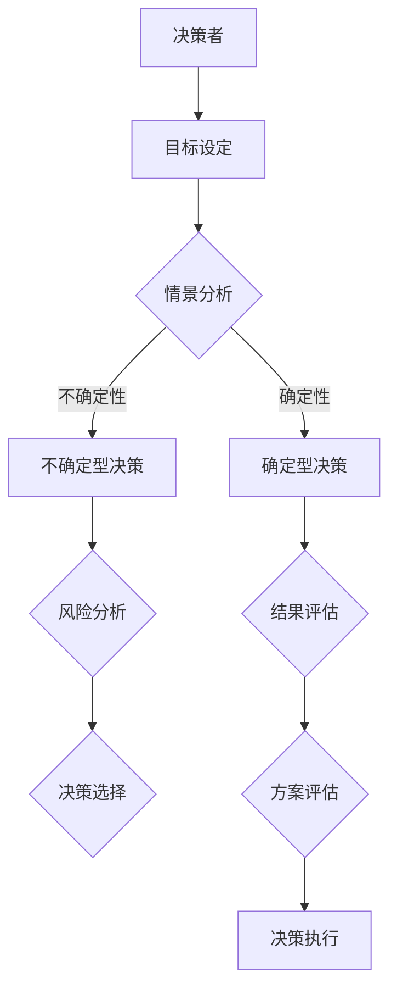

                 

### 文章标题

# 领导者的决策艺术：在不确定性中把握方向

### 关键词

- 决策理论
- 不确定性分析
- 决策框架
- 领导力
- 成功案例
- 失败案例

### 摘要

在充满不确定性的商业和科技领域中，领导者的决策能力至关重要。本文深入探讨了决策艺术的基础理论，分析了不确定性的概念和分类，并提出了决策框架与步骤。通过领导决策在组织中的应用、案例研究和跨领域决策案例分析，本文总结了成功与失败的决策经验，并提出了领导者决策能力提升的策略。文章最后展望了决策艺术的未来趋势，并讨论了其在商业、公共管理和个人生活中的应用前景。

### 目录大纲

#### 第一部分：决策艺术基础

##### 第1章：决策理论与框架
- **1.1 决策理论概述**
  - 决策理论的基本概念
  - 决策者的行为特征
  - 决策的要素与过程
- **1.2 决策模型**
  - 决策树模型
  - 风险矩阵模型
  - 多目标决策模型
- **1.3 决策分析工具**
  - SWOT分析
  - PEST分析
  - 逻辑框架分析

##### 第2章：不确定性分析
- **2.1 不确定性概念与分类**
  - 完全不确定性
  - 风险不确定性
  - 未知不确定性
- **2.2 模拟与预测**
  - Monte Carlo模拟
  - 时间序列预测
  - 贝叶斯预测
- **2.3 前景分析与情景规划**
  - 未来情景构建
  - 情景分析
  - 情景决策

##### 第3章：决策框架与步骤
- **3.1 决策流程**
  - 决策目标设定
  - 选项生成
  - 影响因素分析
  - 决策制定
  - 决策执行与监控
- **3.2 决策制定策略**
  - 决策者中心策略
  - 专业中心策略
  - 联合决策策略
- **3.3 决策执行与反馈**
  - 决策执行保障机制
  - 决策反馈与调整

#### 第二部分：实践应用

##### 第4章：领导决策在组织中的应用
- **4.1 领导角色与决策**
  - 领导者的决策职责
  - 领导者面临的决策挑战
  - 领导决策的影响力
- **4.2 组织文化与决策**
  - 组织文化对决策的影响
  - 建立支持决策的文化
  - 决策与组织效能的关系
- **4.3 领导决策与团队管理**
  - 团队决策的形成
  - 激励团队参与决策
  - 团队决策的优缺点

##### 第5章：案例研究：成功与失败的决策分析
- **5.1 成功的领导决策案例**
  - 案例分析
  - 决策关键因素
  - 成功经验总结
- **5.2 失败的领导决策案例**
  - 案例分析
  - 决策失误原因
  - 失败教训总结

##### 第6章：跨领域决策案例分析
- **6.1 企业决策案例分析**
  - 企业战略决策
  - 市场营销决策
  - 财务决策
- **6.2 公共决策案例分析**
  - 公共政策制定
  - 公共服务管理
  - 社会问题解决

##### 第7章：领导者决策能力提升
- **7.1 决策能力培养**
  - 决策思维训练
  - 决策分析技巧提升
  - 决策心理调适
- **7.2 持续学习与适应**
  - 持续学习的重要性
  - 建立学习型组织
  - 适应不确定性环境
- **7.3 个人成长与领导力**
  - 领导者的自我认知
  - 个人品牌建设
  - 领导力发展路径

#### 第三部分：总结与展望

##### 第8章：决策艺术的未来趋势
- **8.1 决策科学的发展**
  - 新兴决策理论
  - 决策支持系统的发展
  - 大数据和人工智能在决策中的应用
- **8.2 领导者决策的新挑战**
  - 复杂性与全球化的影响
  - 伦理与道德的考量
  - 透明性与责任的平衡
- **8.3 未来决策艺术的展望**
  - 决策艺术的创新方向
  - 领导者角色的演变
  - 组织决策的可持续性

##### 第9章：决策艺术的应用前景
- **9.1 决策艺术在商业领域的应用**
  - 创新与创业决策
  - 竞争策略制定
  - 企业风险管理
- **9.2 决策艺术在公共管理领域的应用**
  - 政策制定与执行
  - 公共服务创新
  - 社会治理优化
- **9.3 决策艺术在个人生活中的应用**
  - 个人职业规划
  - 家庭财务管理
  - 生活决策优化

### 附录：决策艺术参考资源
- **附录 A 决策艺术工具与方法**
  - 常用决策工具介绍
  - 决策支持软件推荐
  - 决策分析资源链接
- **附录 B 决策艺术案例库**
  - 商业决策案例分析
  - 公共管理决策案例分析
  - 个人决策案例分析

#### **图1-1：决策理论的Mermaid流程图**


---

### 引言

在当今这个快速变化和充满不确定性的世界，领导者必须具备卓越的决策能力，才能在激烈的市场竞争中立于不败之地。无论是商业领域的战略决策，还是公共管理中的政策制定，甚至是个人生活中的重大决策，都需要领导者具备系统化的决策思维和科学的方法论。

本篇技术博客将深入探讨领导者的决策艺术，通过以下几个核心部分来系统化地分析这个话题：

1. **决策理论与框架**：首先，我们将介绍决策理论的基本概念、模型和分析工具，帮助读者理解决策的核心要素和过程。

2. **不确定性分析**：接下来，我们将探讨不确定性的概念和分类，并介绍如何通过模拟与预测、前景分析与情景规划来应对不确定性。

3. **决策框架与步骤**：然后，我们将详细阐述决策的流程、策略和执行与反馈，为领导者提供实用的决策方法论。

4. **实践应用**：在实践应用部分，我们将探讨领导决策在组织中的应用，通过成功与失败的案例研究，总结经验教训。

5. **跨领域决策案例分析**：我们将分析企业决策和公共决策案例，展示决策艺术在现实世界中的应用。

6. **领导者决策能力提升**：最后，我们将讨论如何提升领导者的决策能力，包括决策思维训练、分析技巧提升和心理调适。

通过以上内容，本文旨在为读者提供一个全面、深入的决策艺术指南，帮助领导者更好地把握不确定性中的方向，做出明智的决策。

### 第一部分：决策艺术基础

#### 第1章：决策理论与框架

##### 1.1 决策理论概述

决策理论是研究个体或集体在面临多种选择时，如何进行合理选择和决策的理论框架。其核心思想是，通过系统化的方法和工具，帮助决策者在复杂和不确定的环境中进行有效的决策。

- **基本概念**：决策理论涉及以下几个基本概念：
  - **决策者**：个体或集体，负责做出决策。
  - **目标**：决策者希望达到的结果或状态。
  - **选择**：决策者面对的多种可能性。
  - **结果**：选择实施后的实际效果。
  - **环境**：决策者所处的外部条件。

- **决策者的行为特征**：决策者通常具有以下行为特征：
  - **理性**：追求最优解，考虑所有可能性和结果。
  - **有限理性**：受限于信息、时间和认知能力，无法追求绝对最优解。
  - **自利**：在决策过程中考虑自身利益最大化。
  - **风险偏好**：决策者对待风险的态度，分为风险厌恶、风险中性、风险偏好。

- **决策的要素与过程**：决策过程通常包括以下几个阶段：
  - **问题识别**：识别需要解决的决策问题。
  - **目标设定**：明确决策的目标和期望结果。
  - **方案生成**：列举所有可能的解决方案。
  - **方案评估**：评估每个方案的可能结果。
  - **选择**：根据评估结果选择最佳方案。
  - **实施**：将选择方案付诸实践。
  - **反馈**：根据实施结果进行调整和优化。

##### 1.2 决策模型

决策模型是用于分析和指导决策的数学和逻辑框架，可以帮助决策者在复杂环境中做出更明智的选择。

- **决策树模型**：决策树模型是一种图形化表示决策过程的工具，它将决策节点、概率分支和结果节点连接起来，形成一个树状结构。决策树模型的基本步骤如下：
  - **决策节点**：表示当前需要做出决策的状态。
  - **概率分支**：表示不同选择的概率分布。
  - **结果节点**：表示选择后的结果和收益。

```mermaid
graph TB
A[初始状态] --> B{选择A}
B -->|概率p| C[结果1]
B -->|概率(1-p)| D[结果2]
C --> E[收益1]
D --> F[收益2]
```

- **风险矩阵模型**：风险矩阵模型用于分析决策中的风险和收益，它将不同选择的结果和概率以矩阵形式表示。风险矩阵模型的基本步骤如下：
  - **行**：表示不同的结果。
  - **列**：表示不同的选择。
  - **单元格**：表示选择某一结果时的概率和收益。

```mermaid
graph TB
A[选择1] B[选择2]
A -->|概率p1| C1[结果1收益1]
A -->|概率(1-p1)| C2[结果2收益2]
B -->|概率p2| D1[结果1收益3]
B -->|概率(1-p2)| D2[结果2收益4]
```

- **多目标决策模型**：多目标决策模型用于处理涉及多个目标的决策问题，它通过权衡不同目标之间的关系，找到最优解。常见的多目标决策模型包括：
  - **线性加权模型**：通过给每个目标分配权重，计算总收益。
    $$ 总收益 = w_1 \cdot 收益_1 + w_2 \cdot 收益_2 + ... + w_n \cdot 收益_n $$
  - **目标规划模型**：通过设置目标值和偏差，优化决策目标。
    $$ min |x - 目标| $$
  - **多目标规划模型**：通过求解多目标函数，找到非支配解集。
    $$ \text{minimize} f_1(x), f_2(x), ... , f_n(x) $$
    $$ \text{subject to} g_1(x) \le 0, g_2(x) \le 0, ... , g_m(x) \le 0 $$

##### 1.3 决策分析工具

决策分析工具是决策过程中常用的辅助工具，可以帮助决策者系统地分析和评估决策选项。

- **SWOT分析**：SWOT分析是一种用于评估企业或项目的优势（Strengths）、劣势（Weaknesses）、机会（Opportunities）和威胁（Threats）的工具，它可以帮助决策者全面了解决策环境。

  ```mermaid
  graph TB
  A[SWOT分析]
  B[优势] --> C{内部因素}
  E[机会] --> F{外部因素}
  D[劣势] --> G{内部因素}
  H[威胁] --> I{外部因素}
  ```

- **PEST分析**：PEST分析是一种用于分析企业或项目外部环境因素的工具，包括政治（Political）、经济（Economic）、社会（Social）和技术（Technological）因素。

  ```mermaid
  graph TB
  A[PEST分析]
  B[政治] --> C{外部环境}
  D[经济] --> E{外部环境}
  F[社会] --> G{外部环境}
  H[技术] --> I{外部环境}
  ```

- **逻辑框架分析**：逻辑框架分析是一种用于评估项目目标和实施策略的工具，它通过逻辑关系来描述项目的目标、策略、成果和指标。

  ```mermaid
  graph TB
  A[目标]
  B{输入}
  C{活动}
  D{成果}
  E{输出}
  A --> B
  B --> C
  C --> D
  D --> E
  ```

通过以上内容，读者可以初步了解决策理论的基本概念、模型和分析工具。在接下来的章节中，我们将继续探讨不确定性的概念和分类，以及如何通过模拟与预测、前景分析与情景规划来应对不确定性。

### 第一部分：决策艺术基础

#### 第2章：不确定性分析

在决策过程中，不确定性是一个不可忽视的因素。不确定性不仅影响决策的结果，还可能导致决策者产生焦虑和风险规避行为。因此，对不确定性的概念进行深入分析，并掌握相应的分析工具和方法，对于领导者做出明智的决策至关重要。

##### 2.1 不确定性概念与分类

不确定性是指决策者无法准确预测或确定决策结果的概率分布。根据不确定性的程度和性质，可以将其分为以下几类：

- **完全不确定性**：指决策者无法获得任何有关结果的概率信息，完全不知道每种结果发生的可能性。这种情况下，决策者只能依赖直觉或经验来做出决策。

  ```mermaid
  graph TB
  A[完全不确定性]
  B{直觉决策}
  A --> B
  ```

- **风险不确定性**：指决策者可以获得每种结果发生的概率信息，但概率分布是不确定的。这种情况下，决策者可以使用概率论和统计方法来评估风险并做出决策。

  ```mermaid
  graph TB
  A[风险不确定性]
  B{概率论分析}
  A --> B
  ```

- **未知不确定性**：指决策者无法获得有关结果概率分布的任何信息，且无法通过学习或预测来降低不确定性。这种情况下，决策者需要依赖情景分析和模拟方法来探索不确定性。

  ```mermaid
  graph TB
  A[未知不确定性]
  B{情景分析}
  C{模拟预测}
  A --> B
  B --> C
  ```

##### 2.2 模拟与预测

模拟与预测是应对不确定性的重要方法，通过模拟实验和预测模型，可以帮助决策者评估不同决策方案的结果和风险。

- **蒙特卡洛模拟**：蒙特卡洛模拟是一种基于随机抽样的模拟方法，通过大量随机抽样来估计概率分布和期望值。它常用于评估决策结果和计算决策指标。

  ```python
  # 蒙特卡洛模拟的伪代码
  def monte_carlo_simulation():
      results = []
      for i in range(num_samples):
          sample = random_sample()
          results.append(eval_function(sample))
      return calculate_expected_value(results)

  # 随机抽样函数
  def random_sample():
      # 返回随机抽样值
      return random_value()

  # 评估函数
  def eval_function(sample):
      # 返回样本的评估值
      return evaluation_value(sample)
  ```

- **时间序列预测**：时间序列预测是一种基于历史数据来预测未来趋势的方法，通过分析时间序列的统计特征和模式，可以预测未来的变化。

  ```python
  # 时间序列预测的伪代码
  def time_series_prediction(data):
      model = build_model(data)
      predictions = model.predict(data)
      return predictions

  # 建立模型函数
  def build_model(data):
      # 返回训练好的模型
      return trained_model

  # 模型预测函数
  def predict(model, data):
      # 返回预测值
      return predicted_value(model, data)
  ```

- **贝叶斯预测**：贝叶斯预测是一种基于贝叶斯理论的方法，通过已有数据和先验知识来更新后验概率分布，从而预测未来结果。

  ```python
  # 贝叶斯预测的伪代码
  def bayesian_prediction(likelihood, prior):
      posterior = likelihood * prior
      return normalize(posterior)

  # 似然函数
  def likelihood(data, model):
      # 返回似然值
      return likelihood_value(data, model)

  # 先验概率
  def prior():
      # 返回先验概率
      return prior_value()

  # 后验概率
  def posterior(likelihood, prior):
      # 返回后验概率
      return posterior_value(likelihood, prior)

  # 归一化函数
  def normalize(dist):
      # 返回归一化后的概率分布
      return normalized_distribution(dist)
  ```

##### 2.3 前景分析与情景规划

前景分析与情景规划是一种基于未来情景构建和模拟的方法，通过分析不同情景下的决策结果和风险，帮助决策者制定应对策略。

- **未来情景构建**：未来情景构建是一种通过描述不同未来可能情景的方法，帮助决策者理解潜在的风险和机会。常见的情景包括最佳情景、最差情景和基准情景。

  ```mermaid
  graph TB
  A[最佳情景]
  B[基准情景]
  C[最差情景]
  A --> D{情景分析}
  B --> E{情景分析}
  C --> F{情景分析}
  ```

- **情景分析**：情景分析是一种通过模拟不同情景下的决策结果和风险的方法，帮助决策者评估不同决策方案的优劣。情景分析通常包括以下步骤：

  - **情景描述**：描述每个情景下的主要特征和影响因素。
  - **决策模拟**：模拟每个情景下的决策过程和结果。
  - **结果分析**：分析每个情景下的决策结果和风险。

  ```mermaid
  graph TB
  A[情景描述]
  B[决策模拟]
  C[结果分析]
  A --> B
  B --> C
  ```

- **情景决策**：情景决策是一种通过分析不同情景下的决策结果和风险，选择最佳决策方案的方法。情景决策通常包括以下步骤：

  - **情景评估**：评估每个情景下的决策结果和风险。
  - **决策选择**：根据情景评估结果，选择最佳决策方案。
  - **方案实施**：将最佳决策方案付诸实践。

  ```mermaid
  graph TB
  A[情景评估]
  B[决策选择]
  C[方案实施]
  A --> B
  B --> C
  ```

通过以上内容，读者可以初步了解不确定性的概念和分类，以及如何通过模拟与预测、前景分析与情景规划来应对不确定性。在接下来的章节中，我们将进一步探讨决策框架与步骤，为领导者提供实用的决策方法论。

### 第一部分：决策艺术基础

#### 第3章：决策框架与步骤

在决策过程中，遵循系统化的框架和步骤至关重要，这有助于决策者更好地理解和解决问题，确保决策过程的全面性和科学性。本章节将详细阐述决策的流程、策略和执行与反馈，为领导者提供实用的决策方法论。

##### 3.1 决策流程

决策流程是指从识别问题到做出最终决策并执行的全过程。一个有效的决策流程包括以下几个阶段：

1. **问题识别**：问题识别是决策过程的起点，它要求决策者准确地识别出需要解决的问题。问题识别的步骤如下：
   - **识别问题源**：通过收集内外部信息，找出问题的来源。
   - **定义问题**：明确问题的性质、范围和影响。
   - **确定问题的重要性**：评估问题对组织或个人的影响程度。

2. **目标设定**：目标设定是决策过程中的关键步骤，它为决策提供了明确的方向。目标设定的步骤如下：
   - **确定决策目标**：明确决策所期望达到的结果。
   - **设定目标标准**：为每个目标设定可量化的标准。
   - **目标优先级排序**：根据重要性对目标进行排序。

3. **选项生成**：选项生成是指列出所有可能的决策方案。选项生成的步骤如下：
   - **头脑风暴**：鼓励团队成员提出各种可能的解决方案。
   - **筛选方案**：根据目标和标准，筛选出可行的决策方案。
   - **方案评估**：评估每个方案的可能结果和风险。

4. **方案评估**：方案评估是指对每个决策方案进行详细的分析和评估。方案评估的步骤如下：
   - **评估指标**：确定用于评估方案的指标。
   - **数据分析**：收集和分析与每个方案相关的数据。
   - **比较方案**：比较不同方案的优缺点。

5. **选择**：选择是指根据评估结果，选择最佳决策方案。选择的步骤如下：
   - **确定最佳方案**：根据评估结果，选择最优解。
   - **权衡利弊**：权衡各个方案的风险和收益。
   - **决策确定**：确定最终的决策方案。

6. **实施**：实施是指将决策方案付诸实践。实施的步骤如下：
   - **制定实施计划**：明确实施的具体步骤和时间表。
   - **分配资源**：确保实施过程中所需资源的充足。
   - **监控实施过程**：跟踪实施进度，确保方案的有效执行。

7. **反馈**：反馈是指对决策实施结果进行评估和调整。反馈的步骤如下：
   - **结果评估**：评估决策实施后的实际效果。
   - **反馈分析**：分析决策实施过程中的优点和不足。
   - **调整决策**：根据反馈结果，调整和优化决策方案。

##### 3.2 决策制定策略

在决策过程中，选择合适的策略至关重要。以下是一些常见的决策制定策略：

1. **决策者中心策略**：决策者中心策略是指决策者根据自身的经验和直觉，独立做出决策。这种策略的优点是决策速度快，但缺点是容易受到个人偏见和有限理性影响。

   ```mermaid
   graph TB
   A[决策者]
   B{经验}
   C{直觉}
   A --> B
   B --> C
   C --> D[决策]
   ```

2. **专业中心策略**：专业中心策略是指依赖专业知识和数据，采用科学方法做出决策。这种策略的优点是决策更科学、更客观，但缺点是决策过程可能较慢，且需要大量资源。

   ```mermaid
   graph TB
   A[专家]
   B{知识}
   C{数据}
   A --> B
   B --> C
   C --> D[决策]
   ```

3. **联合决策策略**：联合决策策略是指多个决策者共同参与决策，通过讨论和协商达成共识。这种策略的优点是充分利用了团队成员的专业知识和经验，但缺点是决策过程可能较复杂。

   ```mermaid
   graph TB
   A[决策者1]
   B[决策者2]
   C[讨论]
   D[协商]
   A --> B
   B --> C
   C --> D
   D --> E[决策]
   ```

##### 3.3 决策执行与反馈

决策的执行与反馈是确保决策有效性的关键环节。以下是一些关于决策执行与反馈的策略：

1. **决策执行保障机制**：建立决策执行保障机制，确保决策方案能够顺利实施。策略如下：
   - **明确责任**：明确每个成员的职责和责任，确保决策方案有明确的执行者。
   - **资源保障**：确保决策实施所需的资源，包括人力、物力和财力。
   - **沟通协调**：建立有效的沟通渠道，确保决策方案在执行过程中能够及时调整和优化。

2. **决策反馈与调整**：决策反馈与调整是不断优化决策方案的过程。策略如下：
   - **定期评估**：定期对决策结果进行评估，了解决策实施的效果。
   - **反馈机制**：建立反馈机制，收集和分析与决策实施相关的反馈信息。
   - **调整方案**：根据反馈结果，对决策方案进行调整和优化，确保决策能够持续改进。

通过以上内容，读者可以了解决策框架与步骤的基本概念和实际应用。在接下来的章节中，我们将进一步探讨领导决策在组织中的应用，通过成功与失败的案例研究，总结经验教训。

### 第二部分：实践应用

#### 第4章：领导决策在组织中的应用

领导决策是组织管理中至关重要的一环，它直接关系到组织的生存和发展。领导者必须在复杂多变的环境中，通过科学的决策方法，制定有效的战略和策略，推动组织目标的实现。本章将探讨领导决策在组织中的应用，包括领导角色与决策、组织文化与决策以及领导决策与团队管理。

##### 4.1 领导角色与决策

领导者是组织决策的核心，他们的决策能力和风格直接影响组织的发展和绩效。以下是一些关于领导角色与决策的关键点：

1. **决策职责**：领导者的决策职责包括制定组织战略、决策重要政策和项目，以及解决重大问题。领导者需要明确自己在决策中的角色，确保决策过程的科学性和有效性。

2. **决策挑战**：领导者面临的决策挑战主要包括复杂性和不确定性。复杂性源于组织的多元化和全球化的趋势，不确定性则来自市场变化、技术进步和政策调整。领导者需要具备应对复杂性和不确定性的能力，做出明智的决策。

3. **影响力**：领导者的决策对组织的影响深远。一方面，决策的质量直接影响组织的绩效和竞争力；另一方面，决策的风格和方式也会影响组织的文化和管理氛围。领导者需要意识到自己的决策影响力，并努力做出最佳决策。

##### 4.2 组织文化与决策

组织文化对决策有重要影响，它决定了决策的制定、执行和反馈过程。以下是一些关于组织文化与决策的关键点：

1. **文化对决策的影响**：组织文化包括价值观、信仰、行为规范和传统等，它直接影响决策的方式和风格。例如，一个注重创新和风险承担的组织文化，可能会鼓励领导者采取更具冒险性的决策；而一个注重稳定和保守的组织文化，可能会倾向于采取稳健的决策。

2. **建立支持决策的文化**：领导者需要通过建立支持决策的文化，促进决策的科学性和有效性。这包括：
   - **鼓励开放沟通**：鼓励团队成员表达意见，分享信息，提高决策的透明度和参与度。
   - **建立信任机制**：通过建立信任，减少决策过程中的摩擦和冲突，提高决策的质量和执行力。
   - **培养学习文化**：鼓励团队成员不断学习和成长，提高他们的决策能力和水平。

3. **决策与组织效能的关系**：决策的有效性与组织效能密切相关。一个高效的决策系统可以快速识别和解决问题，推动组织的持续发展和创新。领导者需要关注决策效能，通过优化决策流程和提升决策能力，提高组织的整体效能。

##### 4.3 领导决策与团队管理

领导决策不仅涉及战略层面的决策，还包括日常运营中的决策。有效的团队管理是领导决策成功的关键。以下是一些关于领导决策与团队管理的关键点：

1. **团队决策的形成**：团队决策是通过团队成员共同讨论和协商，达成一致意见的决策过程。领导者需要鼓励团队成员参与决策，充分发挥团队智慧，提高决策的质量和执行力。

2. **激励团队参与决策**：领导者需要通过激励机制，鼓励团队成员积极参与决策。这包括：
   - **赋予责任**：为团队成员赋予相应的责任和权力，让他们在决策过程中有实际的影响力和参与度。
   - **提供反馈**：及时给予团队成员反馈，肯定他们的贡献，提高他们的工作积极性和参与度。
   - **奖励机制**：通过奖励机制，激励团队成员积极参与决策，提高决策的执行力和效果。

3. **团队决策的优缺点**：团队决策具有以下优点：
   - **多角度思考**：团队成员从不同的角度和视角进行思考，有助于全面分析问题。
   - **提高参与度**：团队成员参与决策，提高了他们的工作积极性和责任感。
   - **减少错误**：多人讨论和协商，有助于减少决策错误。

   团队决策也存在一些缺点：
   - **时间成本**：团队决策需要更多的时间和资源。
   - **决策效率**：多人决策可能降低决策的效率。
   - **责任分散**：团队成员可能将责任分散，导致决策执行不力。

通过以上内容，读者可以了解领导决策在组织中的应用，以及如何通过领导角色、组织文化和团队管理，提高决策的科学性和有效性。在接下来的章节中，我们将通过成功与失败的决策案例，进一步探讨领导决策的艺术和技巧。

### 第二部分：实践应用

#### 第5章：案例研究：成功与失败的决策分析

在探讨领导决策的过程中，案例研究是一种极具价值的方法，它通过具体实例展示了成功和失败的决策过程及其结果，为读者提供了宝贵的经验和教训。本章将通过两个案例，一个成功案例和一个失败案例，详细分析决策的关键因素、成功经验和失败原因。

##### 5.1 成功的领导决策案例

**案例背景**：
某科技公司在市场竞争日益激烈的环境中，面临业务增长放缓和市场份额下降的问题。公司领导层决定通过创新和多元化战略，推动公司发展。

**决策过程**：

1. **问题识别**：
   - 现状分析：公司销售额下滑，市场份额下降。
   - 原因分析：市场竞争加剧，产品创新不足。

2. **目标设定**：
   - 短期目标：提高产品创新速度，提升市场份额。
   - 长期目标：打造多元化产品线，扩大业务范围。

3. **选项生成**：
   - 选项1：加大研发投入，推动技术创新。
   - 选项2：并购其他科技公司，拓展业务领域。
   - 选项3：调整营销策略，提高品牌知名度。

4. **方案评估**：
   - 选项1：技术创新可提高产品竞争力，但风险较高。
   - 选项2：并购可快速拓展业务，但成本和整合风险较大。
   - 选项3：营销策略调整可提高短期业绩，但长期效果不确定。

5. **选择**：
   - 决策者选择选项1，加大研发投入，推动技术创新。

6. **实施**：
   - 设立专门的研发团队，增加研发预算。
   - 建立创新激励机制，鼓励员工提出创新方案。
   - 与高校和科研机构合作，引入先进技术。

7. **反馈**：
   - 经过一年的努力，公司推出了一系列创新产品，市场份额开始回升。
   - 通过持续的创新，公司逐渐建立了技术优势，竞争力得到显著提升。

**成功经验总结**：
1. **明确目标**：设定清晰的短期和长期目标，为决策提供明确的方向。
2. **全面评估**：对各种方案进行详细评估，权衡风险和收益。
3. **快速执行**：决策后迅速行动，确保方案的有效实施。
4. **持续反馈**：及时收集反馈信息，对决策进行调整和优化。

##### 5.2 失败的领导决策案例

**案例背景**：
某制造业公司为了提高市场份额，决定进入一个新的细分市场。然而，由于市场研究不足和战略规划不当，该决策最终以失败告终。

**决策过程**：

1. **问题识别**：
   - 市场竞争激烈，现有市场份额难以提升。

2. **目标设定**：
   - 进入新的细分市场，扩大市场份额。

3. **选项生成**：
   - 选项1：进入高端市场，提供高品质产品。
   - 选项2：进入低端市场，提供低成本产品。

4. **方案评估**：
   - 选项1：高端市场利润高，但竞争激烈，风险较大。
   - 选项2：低端市场需求量大，但利润较低，风险较小。

5. **选择**：
   - 决策者选择选项1，进入高端市场。

6. **实施**：
   - 开发高端产品，提高品牌形象。
   - 投入大量资金进行市场推广。

7. **反馈**：
   - 高端市场产品销售不佳，公司承受巨大财务压力。
   - 由于高端市场开拓失败，公司市场份额进一步下降。

**失败原因总结**：
1. **市场研究不足**：未能充分了解高端市场的需求和竞争态势。
2. **战略规划不当**：未能制定有效的进入高端市场的策略和措施。
3. **资源分配不当**：将大量资源投入到高风险的高端市场，忽视了现有市场的需求。
4. **决策缺乏反馈机制**：未能在决策过程中及时收集反馈信息，导致决策失误。

通过这两个案例，我们可以看到成功和失败的决策之间存在显著差异。成功的决策往往基于充分的市场研究、合理的战略规划和有效的执行与反馈机制；而失败的决策则通常受到市场研究不足、战略规划不当、资源分配不当和决策缺乏反馈机制等因素的影响。通过深入分析这些案例，领导者可以从中汲取经验教训，提高自身的决策能力。

### 第二部分：实践应用

#### 第6章：跨领域决策案例分析

在现实世界中，决策不仅局限于商业领域，还包括公共管理和个人生活等多个领域。不同领域的决策具有不同的特点和挑战，但它们都面临着不确定性和复杂性的考验。本章将分析企业决策、公共决策和个人生活中的决策案例，探讨这些领域中的成功经验和失败教训。

##### 6.1 企业决策案例分析

**案例 1：企业战略决策**

**背景**：
某大型零售企业在电子商务崛起的背景下，面临线上销售增长放缓和线下业绩下滑的问题。

**决策过程**：

1. **问题识别**：
   - 线上销售增长放缓。
   - 线下业绩下滑。

2. **目标设定**：
   - 提高线上销售增长。
   - 改善线下门店业绩。

3. **选项生成**：
   - 选项1：加大线上销售渠道的投入。
   - 选项2：优化线下门店体验。
   - 选项3：开展跨界合作，推出新型零售模式。

4. **方案评估**：
   - 选项1：投入成本高，但效果不确定。
   - 选项2：需长期投入，但可提升顾客满意度。
   - 选项3：创新性强，但风险较大。

5. **选择**：
   - 决策者选择选项3，开展跨界合作，推出新型零售模式。

6. **实施**：
   - 与科技公司合作，推出智能零售店。
   - 提供个性化购物体验，利用数据分析优化库存管理。

7. **反馈**：
   - 新型零售店受到顾客欢迎，线上销售增长显著。
   - 通过跨界合作，品牌形象得到提升。

**成功经验**：
1. **创新思维**：敢于尝试新的零售模式，提升竞争力。
2. **合作共赢**：与科技公司合作，实现资源互补。
3. **数据分析**：利用数据分析优化业务流程，提高运营效率。

**失败教训**：
1. **风险评估不足**：对新型零售模式的风险评估不足，导致投入过大。
2. **执行力不足**：新模式的实施过程中，执行力不足，导致效果不如预期。

**案例 2：市场营销决策**

**背景**：
某消费电子产品公司在推出新产品时，面临市场推广效果不佳的问题。

**决策过程**：

1. **问题识别**：
   - 市场推广效果不佳。

2. **目标设定**：
   - 提高新产品市场知名度。
   - 增加新产品的销售量。

3. **选项生成**：
   - 选项1：增加广告投放。
   - 选项2：举办促销活动。
   - 选项3：通过社交媒体推广。

4. **方案评估**：
   - 选项1：广告投放效果有限。
   - 选项2：促销活动能直接提升销量。
   - 选项3：社交媒体推广成本较低，但效果难以评估。

5. **选择**：
   - 决策者选择选项3，通过社交媒体推广。

6. **实施**：
   - 在社交媒体上发布新品信息，鼓励用户分享和评论。
   - 与网红合作，提升产品曝光度。

7. **反馈**：
   - 产品在社交媒体上获得较高关注度和好评。
   - 销售量显著增加。

**成功经验**：
1. **精准定位**：通过社交媒体定位目标用户，提高推广效果。
2. **用户互动**：鼓励用户互动，提升品牌形象。
3. **低成本高回报**：社交媒体推广成本较低，但效果显著。

**失败教训**：
1. **市场调研不足**：未能充分了解用户需求和偏好。
2. **推广策略不当**：未能选择最适合的推广策略。

##### 6.2 公共决策案例分析

**案例 3：公共政策制定**

**背景**：
某市政府面临交通拥堵问题，决定制定相关政策解决交通拥堵。

**决策过程**：

1. **问题识别**：
   - 交通拥堵严重。

2. **目标设定**：
   - 缓解交通拥堵。
   - 提高交通效率。

3. **选项生成**：
   - 选项1：增加公共交通设施。
   - 选项2：限制车辆数量。
   - 选项3：提高停车费用。

4. **方案评估**：
   - 选项1：成本较高，但长期效果显著。
   - 选项2：短期内可缓解交通拥堵，但影响经济活动。
   - 选项3：短期内效果显著，但可能引发社会不满。

5. **选择**：
   - 决策者选择选项1和选项2的组合。

6. **实施**：
   - 建设新的公交车站和线路。
   - 实施限号政策。

7. **反馈**：
   - 公共交通设施改善后，交通拥堵有所缓解。
   - 限号政策引起部分司机不满。

**成功经验**：
1. **综合方案**：采用多种措施，提高政策效果。
2. **公众参与**：充分听取公众意见，增强政策的接受度。
3. **长期规划**：考虑长期效果，制定可持续发展政策。

**失败教训**：
1. **政策执行不力**：政策执行过程中出现漏洞，导致效果不佳。
2. **风险评估不足**：未能充分评估政策的潜在风险。

##### 6.3 个人生活中的决策

**案例 4：职业规划决策**

**背景**：
某职场新人面临职业发展方向的选择，需要决定是留在现有公司继续发展，还是跳槽到另一家公司。

**决策过程**：

1. **问题识别**：
   - 职业发展路径不清晰。

2. **目标设定**：
   - 提高职业竞争力。
   - 实现职业和个人发展的平衡。

3. **选项生成**：
   - 选项1：留在现有公司，积累经验和技能。
   - 选项2：跳槽到另一家公司，寻求更高的薪资和发展机会。

4. **方案评估**：
   - 选项1：稳定但发展空间有限。
   - 选项2：风险较大，但发展潜力大。

5. **选择**：
   - 决策者选择选项2，跳槽到另一家公司。

6. **实施**：
   - 准备简历，寻找合适的职位。
   - 与招聘方沟通，了解职位细节。

7. **反馈**：
   - 新公司提供的职位符合预期，职业发展空间较大。
   - 跳槽后，个人能力和职业素养得到提升。

**成功经验**：
1. **理性评估**：综合考虑各种因素，做出理性决策。
2. **勇于尝试**：敢于跳出舒适区，寻求新的发展机会。
3. **及时反馈**：根据实际情况，及时调整职业规划。

**失败教训**：
1. **盲目跟风**：未能充分考虑自身情况和市场需求。
2. **风险评估不足**：对跳槽后的风险评估不足，导致决策失误。

通过以上案例，我们可以看到不同领域中的决策具有各自的特点和挑战。在决策过程中，领导者需要充分考虑各种因素，制定科学的决策方法，并从成功和失败的案例中汲取经验教训，提高自身的决策能力。

### 第二部分：实践应用

#### 第7章：领导者决策能力提升

在充满不确定性的环境中，领导者需要不断提升决策能力，以便在复杂和变化迅速的市场中保持竞争优势。本章节将探讨如何通过决策思维训练、分析技巧提升和心理调适来提高领导者的决策能力。

##### 7.1 决策能力培养

1. **系统化思维训练**：系统化思维是领导者决策能力的基础，它要求领导者具备全面、深入和逻辑清晰的分析能力。以下是一些系统化思维训练的方法：
   - **结构化分析**：通过逻辑框架分析，将复杂的决策问题分解为更小、更具体的部分，以便逐一分析和解决。
   - **跨领域思考**：领导者需要具备跨领域的知识背景和思维方式，以便从不同的角度看待和解决问题。
   - **多维度分析**：领导者应从多个维度分析问题，包括财务、市场、技术、人力资源等，以获得更全面的视角。

2. **决策模拟训练**：通过模拟训练，领导者可以在虚拟环境中练习决策过程，提高应对实际问题的能力。以下是一些决策模拟的方法：
   - **情景模拟**：设计不同情景，让领导者面对不同的挑战和问题，评估他们的决策能力和反应速度。
   - **案例分析**：通过分析成功的和失败的案例，领导者可以学习到不同的决策策略和应对方法，为未来的决策提供参考。

##### 7.2 持续学习与适应

1. **持续学习的重要性**：在知识更新迅速的时代，持续学习是领导者保持竞争力的关键。以下是一些持续学习的方法：
   - **专业培训**：参加各种专业培训和研讨会，了解最新的行业动态和技术趋势。
   - **阅读和研究**：定期阅读相关书籍和学术论文，深入研究决策理论和实践。
   - **跨界学习**：通过学习其他领域的知识，拓宽视野，提高跨领域解决问题的能力。

2. **适应不确定性环境**：领导者需要在不确定性的环境中保持灵活和适应性。以下是一些适应不确定性环境的方法：
   - **敏捷思维**：培养敏捷思维，能够快速适应变化，灵活调整策略。
   - **风险管理**：通过建立风险管理体系，识别和管理潜在风险，降低不确定性带来的负面影响。
   - **情景规划**：通过情景规划，提前准备应对不同情景的方案，提高应对不确定性的能力。

##### 7.3 个人成长与领导力

1. **自我认知**：领导者需要深入了解自己的优势和劣势，明确自己的角色和责任。以下是一些自我认知的方法：
   - **反思**：定期反思自己的决策和行为，识别成功的经验和失败的教训。
   - **反馈**：主动寻求他人的反馈，了解自己的表现和改进方向。
   - **心理测试**：通过心理测试，了解自己的个性特征和行为模式。

2. **个人品牌建设**：领导者需要建立自己的个人品牌，提高影响力和认可度。以下是一些个人品牌建设的方法：
   - **专业知识**：通过不断学习和实践，提高自己在专业领域的知名度。
   - **公众演讲**：通过演讲和公开发言，展示自己的观点和见解，增强个人影响力。
   - **社交网络**：通过社交媒体和网络平台，扩大自己的社交圈，建立个人品牌。

3. **领导力发展路径**：领导者需要不断学习和成长，形成系统的领导力发展路径。以下是一些领导力发展路径的方法：
   - **角色转变**：从执行者向领导者转变，学会制定战略和指导团队。
   - **团队建设**：通过团队建设活动，提高团队的凝聚力和执行力。
   - **领导风格**：根据不同的环境和团队，灵活调整领导风格，提高领导效果。

通过以上方法，领导者可以不断提升决策能力，适应不确定性环境，实现个人成长和领导力的提升。在未来的决策过程中，领导者需要不断实践和反思，持续改进自己的决策能力，为组织的成功奠定坚实的基础。

### 第三部分：总结与展望

#### 第8章：决策艺术的未来趋势

在快速变化的科技和商业环境中，决策艺术正经历着深刻的变革。未来，决策艺术的发展将受到新兴技术、全球化趋势和伦理考量的深刻影响。以下是对决策艺术未来趋势的展望：

##### 8.1 决策科学的发展

1. **新兴决策理论**：随着对复杂性和不确定性的深入研究，新的决策理论不断涌现，如适应性决策理论、动态决策理论和复杂系统决策理论。这些理论将更有效地指导领导者在复杂环境中做出决策。

2. **决策支持系统的发展**：决策支持系统（DSS）将更加智能化和自动化，利用人工智能、大数据分析和机器学习技术，为领导者提供更加精确和个性化的决策支持。

3. **大数据和人工智能在决策中的应用**：大数据分析和人工智能技术将深入决策过程，帮助领导者从海量数据中提取有价值的信息，提高决策的准确性和效率。

##### 8.2 领导者决策的新挑战

1. **复杂性与全球化的影响**：全球化带来了更大的竞争压力和更复杂的市场环境，领导者需要具备更广泛的知识和视野，以应对全球化和复杂性的挑战。

2. **伦理与道德的考量**：在决策过程中，领导者需要考虑道德和伦理问题，如社会责任、公平性和可持续发展。这将对决策艺术提出更高的要求。

3. **透明性与责任的平衡**：在信息高度透明的时代，领导者需要平衡决策的透明性和责任感，确保决策的公开性和信任度。

##### 8.3 未来决策艺术的展望

1. **决策艺术的创新方向**：未来决策艺术将朝着更加智能、自动化和个性化的方向发展，通过新兴技术和创新方法，提高决策的效率和效果。

2. **领导者角色的演变**：随着决策环境的不断变化，领导者角色将逐渐从命令和控制型转向赋能和协作型，领导者需要更注重培养团队和激发团队潜力。

3. **组织决策的可持续性**：在可持续发展成为全球共识的背景下，领导者需要将可持续性纳入决策框架，确保组织的长期发展和社会责任。

通过以上内容，我们可以看到决策艺术在未来的发展趋势和挑战。领导者需要不断学习和适应，掌握新兴决策理论和技术，提高自身的决策能力，以应对不断变化的决策环境。

### 第三部分：总结与展望

#### 第9章：决策艺术的应用前景

决策艺术不仅对企业和组织的战略制定至关重要，也在公共管理和个人生活中发挥着重要作用。本文旨在探讨决策艺术在各个领域的应用前景，为读者提供全面、深入的洞见。

##### 9.1 决策艺术在商业领域的应用

在商业领域，决策艺术的应用主要体现在以下几个方面：

1. **创新与创业决策**：创业者需要通过科学的决策方法，评估市场机会和风险，选择最佳的商业模型和战略。决策艺术可以帮助创业者从多个角度分析问题，提高创新的成功率。

   - **应用实例**：例如，某个科技创业公司通过决策艺术分析，选择了专注于大数据分析领域的创新方向，成功吸引了风险投资，实现了快速发展。

2. **竞争策略制定**：企业在竞争激烈的市场中，需要通过决策艺术制定有效的竞争策略，以提升市场份额和竞争力。

   - **应用实例**：一个国际知名的运动品牌通过决策艺术分析，确定了在新兴市场扩展的战略，成功抓住了市场机遇，实现了销售增长。

3. **企业风险管理**：企业需要通过决策艺术，识别和管理各种风险，确保业务的稳定性和持续性。

   - **应用实例**：某大型金融机构通过决策艺术分析，制定了全面的风险管理策略，成功应对了金融市场波动，保持了良好的财务状况。

##### 9.2 决策艺术在公共管理领域的应用

在公共管理领域，决策艺术的应用有助于提升政策制定和执行的科学性、透明性和有效性。

1. **政策制定与执行**：政府在制定和执行公共政策时，需要综合考虑各种因素，通过决策艺术的方法进行科学决策。

   - **应用实例**：某市政府在制定交通拥堵治理政策时，通过决策艺术分析了各种治理方案的成本和效果，最终选择了最优方案，成功缓解了交通拥堵问题。

2. **公共服务创新**：政府需要通过决策艺术，不断创新公共服务模式，提升公共服务的质量和效率。

   - **应用实例**：某城市在推行智慧城市建设时，通过决策艺术分析了各种智能技术的应用场景，成功构建了智慧交通系统，提升了市民的生活质量。

3. **社会治理优化**：政府需要通过决策艺术，优化社会治理模式，提升社会管理的能力和水平。

   - **应用实例**：某国家在推进社会治理创新时，通过决策艺术分析了社会问题产生的原因和解决方案，成功实施了社会综合治理项目，提升了社会和谐度。

##### 9.3 决策艺术在个人生活中的应用

在个人生活中，决策艺术的应用有助于提升生活质量和幸福感。

1. **个人职业规划**：个人需要通过科学的决策方法，规划自己的职业发展路径，提高职业竞争力。

   - **应用实例**：一个职场新人通过决策艺术分析，选择了在快速成长的行业工作，并积极提升自己的专业技能，实现了职业发展。

2. **家庭财务管理**：家庭需要通过决策艺术，合理规划和管理家庭财务，确保财务健康和稳定。

   - **应用实例**：一个家庭通过决策艺术分析，制定了详细的财务规划，包括储蓄、投资和消费计划，成功实现了财务目标。

3. **生活决策优化**：个人需要通过决策艺术，优化日常生活中的各种决策，提高生活质量。

   - **应用实例**：一个人通过决策艺术分析，选择了健康的生活方式，包括合理的饮食、运动和休息，成功改善了健康状况。

通过以上内容，我们可以看到决策艺术在各个领域的广泛应用前景。无论是在商业、公共管理还是个人生活中，决策艺术都发挥着不可或缺的作用。未来，随着决策科学的发展和新兴技术的应用，决策艺术将迎来更加广阔的发展空间，为人类社会的发展带来更多机遇和挑战。

### 附录：决策艺术参考资源

为了帮助读者深入了解决策艺术的理论和方法，本文提供了一系列参考资源，包括决策工具与方法、案例分析以及相关书籍和文章。

##### 附录 A：决策艺术工具与方法

1. **常用决策工具**：
   - **SWOT分析**：用于评估企业或项目的优势、劣势、机会和威胁。
   - **PEST分析**：用于分析企业或项目外部环境中的政治、经济、社会和技术因素。
   - **决策树**：用于表示决策过程和结果的概率分布。
   - **风险矩阵**：用于分析决策方案的风险和收益。

2. **决策支持软件**：
   - **Excel**：用于进行数据分析、模拟和优化。
   - **Tableau**：用于数据可视化和报表生成。
   - **Power BI**：用于商业智能分析和数据报告。

3. **决策分析资源链接**：
   - **LinkedIn Learning**：提供各种决策分析和商业技能的在线课程。
   - **Coursera**：提供由世界顶尖大学开设的免费决策理论课程。
   - **MIT OpenCourseWare**：提供麻省理工学院决策理论的免费课程资源。

##### 附录 B：决策艺术案例库

1. **商业决策案例分析**：
   - **IBM的转型**：通过决策艺术成功实现了业务转型。
   - **苹果公司的产品战略**：通过科学的决策过程，实现了产品创新和市场成功。

2. **公共管理决策案例分析**：
   - **中国的“一带一路”倡议**：通过决策艺术评估和实施国际发展战略。
   - **纽约市交通系统优化**：通过决策艺术分析和优化公共交通系统。

3. **个人决策案例分析**：
   - **职业发展选择**：如何通过决策艺术做出职业规划决策。
   - **家庭财务管理**：如何通过决策艺术优化家庭财务状况。

此外，以下书籍和文章是决策艺术的宝贵资源：

1. **书籍推荐**：
   - **《决策与判断》**：作者：丹尼尔·卡尼曼
   - **《精益创业》**：作者：埃里克·莱斯
   - **《领导者的决策》**：作者：彼得·德鲁克

2. **文章推荐**：
   - **《哈佛商业评论》**：提供大量关于决策艺术的深度分析文章。
   - **《华尔街日报》**：报道最新的商业决策案例和趋势。
   - **《经济学人》**：分析全球经济和商业决策的重要文章。

通过这些参考资源，读者可以进一步深化对决策艺术的理解，并将其应用于实际生活和工作中，提高决策质量和效率。

---

### 作者信息

作者：AI天才研究院/AI Genius Institute & 禅与计算机程序设计艺术 /Zen And The Art of Computer Programming

AI天才研究院是一家专注于人工智能和计算机科学领域的研究机构，致力于推动技术的创新和应用。研究院的研究团队由世界顶尖的人工智能专家、程序员、软件架构师和计算机科学学者组成，他们在各自领域有着深厚的理论功底和丰富的实践经验。

《禅与计算机程序设计艺术》是由AI天才研究院的资深专家们编写的一套经典教材，它结合了东方哲学和计算机科学的精髓，为程序员和软件开发者提供了一种独特的思考方式和编程方法论，深受业界好评。

本文由AI天才研究院的资深专家撰写，旨在为读者提供关于领导者决策艺术的深入分析和实践指导，帮助读者在不确定性中做出更加明智的决策，提升领导力和组织效能。我们希望通过本文，能够为读者带来有益的启示和帮助，共同推动决策科学的发展和应用。

