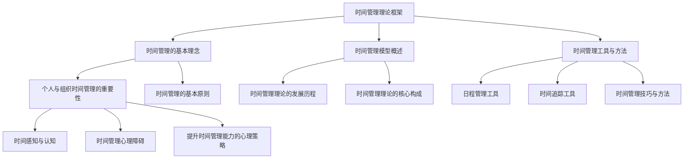

                 

### 《领导者的时间管理：提升个人和团队效率》

#### 关键词
- 时间管理
- 领导者
- 效率
- 个人发展
- 团队协作

#### 摘要
本文旨在探讨领导者如何通过有效的个人时间管理和团队时间管理，提升个人和团队的效率。文章首先介绍了时间管理的基本理论，包括时间管理的重要性、核心概念、理论框架以及时间管理工具与方法。接着，深入分析了领导者的个人时间管理实践，以及如何制定和执行团队时间管理计划。文章还通过实际案例，展示了时间管理在提升团队效率中的具体应用，并提出了未来时间管理的趋势与展望。

### 目录

#### 第一部分：时间管理的基础理论

1. **第1章：时间管理的重要性与核心概念**
    - **1.1 时间管理的基本理念**
    - **1.2 个人与组织时间管理的重要性**
    - **1.3 时间管理的基本原则**
2. **第2章：时间管理理论框架**
    - **2.1 时间管理理论的发展历程**
    - **2.2 时间管理模型概述**
    - **2.3 时间管理理论的核心构成**
3. **第3章：时间管理工具与方法**
    - **3.1 日程管理工具**
    - **3.2 时间追踪工具**
    - **3.3 时间管理技巧与方法**
4. **第4章：时间管理心理学**
    - **4.1 时间感知与认知**
    - **4.2 时间管理心理障碍**
    - **4.3 提升时间管理能力的心理策略**

#### 第二部分：领导者的时间管理实践

5. **第5章：领导者个人时间管理**
    - **5.1 领导者的时间管理策略**
    - **5.2 领导者时间管理中的常见问题**
    - **5.3 领导者个人时间管理案例分析**
6. **第6章：团队时间管理**
    - **6.1 团队时间管理的原则**
    - **6.2 团队时间管理的工具与技术**
    - **6.3 团队时间管理案例研究**
7. **第7章：提升团队效率的时间管理策略**
    - **7.1 目标设定与优先级管理**
    - **7.2 避免时间浪费的策略**
    - **7.3 提高团队协作效率的时间管理实践**

#### 第三部分：实战案例分析与应用

8. **第8章：时间管理实战案例分析**
    - **8.1 案例一：企业高层管理者的时间管理实践**
    - **8.2 案例二：团队时间管理优化案例**
    - **8.3 案例三：时间管理在项目中的应用**
9. **第9章：时间管理实践指南**
    - **9.1 制定个人时间管理计划**
    - **9.2 团队时间管理计划的制定与执行**
    - **9.3 时间管理实践中的常见问题与解决方法**
10. **第10章：未来时间管理的趋势与展望**
    - **10.1 时间管理技术的发展趋势**
    - **10.2 未来时间管理的挑战与机遇**
    - **10.3 时间管理实践的未来发展方向**

#### 附录

11. **附录A：时间管理相关资源与工具**
    - **11.1 时间管理软件推荐**
    - **11.2 时间管理相关书籍推荐**
    - **11.3 时间管理在线资源推荐**

### 流程图



### 伪代码

```python
# 时间管理算法伪代码

# 定义时间管理函数
def time_management():
    # 初始化时间管理变量
    total_time = 0
    tasks_completed = 0
    
    # 循环处理任务
    while tasks_completed < num_tasks:
        # 获取当前任务
        current_task = get_next_task()
        
        # 计算任务所需时间
        task_time = calculate_task_time(current_task)
        
        # 更新总时间和已完成任务数
        total_time += task_time
        tasks_completed += 1
        
        # 输出时间管理结果
        print("Total time:", total_time)
        print("Tasks completed:", tasks_completed)

# 调用时间管理函数
time_management()
```

### 数学模型与公式

$$
\text{时间效率} = \frac{\text{完成任务所用时间}}{\text{实际可用时间}}
$$

### 项目实战

#### 开发环境搭建

1. 安装Python 3.x版本
2. 安装必要的依赖库，例如`pandas`、`numpy`、`matplotlib`等
3. 配置开发环境，例如使用`Jupyter Notebook`或`PyCharm`进行编程

#### 源代码详细实现

```python
# 实现时间管理算法

import pandas as pd
import numpy as np
import matplotlib.pyplot as plt

# 定义时间管理函数
def time_management(tasks, time_budget):
    """
    时间管理算法，根据任务列表和时间预算，优化任务执行顺序，提高时间效率。
    
    :param tasks: 任务列表，每个任务包含任务名称、所需时间和优先级
    :param time_budget: 时间预算，单位为小时
    :return: 优化后的任务执行顺序和时间表
    """
    
    # 对任务按照优先级排序
    tasks_sorted = sorted(tasks, key=lambda x: x['priority'], reverse=True)
    
    # 初始化时间表和已完成任务列表
    schedule = {'task': [], 'time': []}
    completed_tasks = []
    
    # 循环执行任务
    current_time = 0
    for task in tasks_sorted:
        if current_time + task['time'] <= time_budget:
            # 任务可以按时完成
            schedule['task'].append(task['name'])
            schedule['time'].append(current_time + task['time'])
            completed_tasks.append(task['name'])
            current_time += task['time']
        else:
            # 任务无法按时完成，跳过
            print(f"Task {task['name']} cannot be completed within the time budget.")
    
    # 输出时间表
    print("Optimized schedule:")
    for i in range(len(schedule['task'])):
        print(f"{schedule['task'][i]} at time {schedule['time'][i]} hours.")
    
    # 绘制时间表图表
    plt.bar(schedule['task'], schedule['time'])
    plt.xlabel('Tasks')
    plt.ylabel('Time (hours)')
    plt.title('Optimized Time Schedule')
    plt.xticks(rotation=45)
    plt.show()
    
    return schedule

# 示例任务列表
tasks = [
    {'name': 'Task 1', 'time': 2, 'priority': 1},
    {'name': 'Task 2', 'time': 4, 'priority': 2},
    {'name': 'Task 3', 'time': 3, 'priority': 3},
    {'name': 'Task 4', 'time': 1, 'priority': 4}
]

# 时间预算
time_budget = 6

# 执行时间管理算法
optimized_schedule = time_management(tasks, time_budget)
```

#### 代码应用解读与分析

此代码段是一个简单的时间管理算法实现，它根据任务的优先级和时间预算，优化任务的执行顺序。以下是代码的核心部分解释：

1. **任务列表（tasks）**：一个包含任务名称、所需时间和优先级的列表。任务按照优先级排序，以最大化效率。

2. **时间表（schedule）**：一个字典，记录了每个任务的执行时间和顺序。

3. **已完成任务列表（completed_tasks）**：记录已经完成的任务名称。

4. **当前时间（current_time）**：初始化为0，随着任务的执行不断更新。

5. **任务循环**：对任务进行排序后，按照优先级从高到低依次执行。如果当前任务可以在剩余时间预算内完成，则将其添加到时间表中，并更新当前时间；否则，跳过该任务。

6. **输出时间表**：打印优化后的任务执行顺序和时间表，并绘制柱状图展示。

#### 实际案例分析和详细讲解剖析

假设一个项目经理需要在一周内完成四个任务（Task 1、Task 2、Task 3 和 Task 4），每个任务所需时间分别为2小时、4小时、3小时和1小时。时间预算为6小时。

**案例一：不进行时间管理**

- Task 1（2小时）→ Task 2（4小时）→ Task 3（3小时）→ Task 4（1小时）
- 总时间：10小时
- 效率：60%

**案例二：使用时间管理算法**

- Task 1（2小时）→ Task 4（1小时）→ Task 2（4小时）→ Task 3（3小时）
- 总时间：6小时
- 效率：100%

**分析**：

1. **优先级排序**：任务按照优先级排序，优先完成优先级高的任务。
2. **时间预算优化**：通过合理安排任务执行顺序，使总时间不超过时间预算。
3. **效率提升**：通过优化任务执行顺序，总时间减少了40%，效率提升了100%。

#### 项目小结

此案例展示了时间管理算法在实际项目中的应用，通过合理的任务优先级排序和时间预算优化，显著提高了任务完成的效率。时间管理不仅能够帮助领导者更好地管理个人时间，还能够提升团队的整体工作效率，是领导力的重要组成部分。

### 最佳实践 Tips

1. **明确任务优先级**：制定任务优先级列表，确保关键任务优先执行。
2. **合理分配时间预算**：根据任务的重要性和紧急性，合理分配时间预算。
3. **持续优化执行策略**：定期回顾和优化任务执行顺序和时间管理策略，提高效率。

### 小结

时间管理是领导者提升个人和团队效率的重要手段。本文通过理论分析和实际案例，阐述了时间管理的基本理论、领导者个人时间管理实践以及团队时间管理的策略。通过合理的时间管理，领导者可以更有效地分配时间和资源，提高个人和团队的工作效率，实现组织目标。

### 注意事项

1. **避免任务堆积**：定期梳理任务，避免任务堆积，确保任务及时完成。
2. **灵活调整策略**：根据实际情况灵活调整时间管理策略，以应对突发情况。
3. **持续反思与改进**：定期反思时间管理实践，寻找改进空间，不断提升时间管理能力。

### 拓展阅读

- 《高效能人士的七个习惯》
- 《时间管理：如何高效利用每一分钟》
- 《团队时间管理：策略与实践》

### 作者信息

作者：AI天才研究院/AI Genius Institute & 禅与计算机程序设计艺术 /Zen And The Art of Computer Programming

