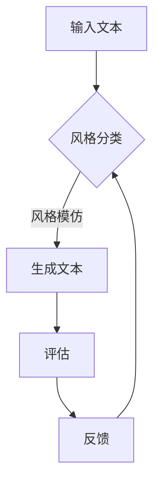
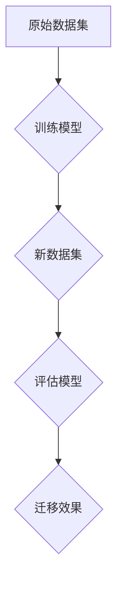

                 

### 1.1.4 语言适应性评测的概念与联系

在探讨语言适应性评测之前，我们需要明确两个核心概念：风格模仿能力和迁移能力。这两个概念在语言模型中扮演着至关重要的角色。

#### **风格模仿能力**

风格模仿能力指的是模型在生成文本时，能够模仿给定的语言风格。这种能力在个性化文本生成、创意写作、文学模仿等领域具有重要应用。风格模仿能力可以分为以下几个方面：

1. **风格识别**：模型需要能够识别输入文本的风格特征。
2. **风格学习**：模型需要学习并掌握不同风格的语言特征。
3. **风格应用**：模型需要能够将所学到的风格应用到文本生成过程中。

为了更好地理解风格模仿能力，我们可以借助Mermaid流程图来展示其基本流程：



在这个流程图中，输入文本经过风格分类，模型根据分类结果应用相应的风格进行文本生成。生成的文本再经过评估，根据评估结果进行反馈，以便模型不断优化风格模仿能力。

#### **迁移能力**

迁移能力指的是模型在不同数据集或任务上的泛化能力和适应性。迁移能力可以帮助模型在新的、未见过的情况下表现良好，从而提高其实际应用价值。迁移能力可以分为以下几个方面：

1. **数据集迁移**：模型在不同数据集上的迁移能力。
2. **任务迁移**：模型在不同任务上的迁移能力。
3. **场景迁移**：模型在不同应用场景上的迁移能力。

为了理解迁移能力，我们可以借助一个简单的Mermaid流程图：



在这个流程图中，模型在原始数据集上训练，然后在新数据集上进行评估，以衡量模型的迁移效果。

#### **语言适应性定义与模型架构**

结合上述两个概念，我们可以给出语言适应性的定义：

$$
\text{语言适应性} = f(\text{风格模仿能力}, \text{迁移能力})
$$

这个公式表明，语言适应性是风格模仿能力和迁移能力的综合体现。一个优秀的语言模型应该具备强大的风格模仿能力和良好的迁移能力，以适应各种语言环境和任务需求。

#### **核心算法原理讲解**

为了更好地理解语言适应性的核心算法原理，我们使用伪代码详细阐述风格模仿算法的步骤：

```python
def StyleImitation(source_text, target_style):
    # 获取输入文本的嵌入向量
    embedding = get_embedding(source_text)
    # 获取目标风格的嵌入向量
    style_embedding = get_style_embedding(target_style)
    # 结合风格嵌入向量
    combined_embedding = embedding + style_embedding
    # 使用结合后的嵌入向量生成文本
    generated_text = generate_text(combined_embedding)
    # 返回生成的文本
    return generated_text
```

在这个伪代码中，`get_embedding`函数负责获取输入文本的嵌入向量，`get_style_embedding`函数负责获取目标风格的嵌入向量，`generate_text`函数负责使用结合后的嵌入向量生成文本。

通过上述讲解，我们可以看到语言适应性评测不仅涉及到对风格模仿和迁移能力的评估，还需要考虑这两个能力的综合表现。接下来的章节将深入探讨语言适应性评测的具体方法和技术。

