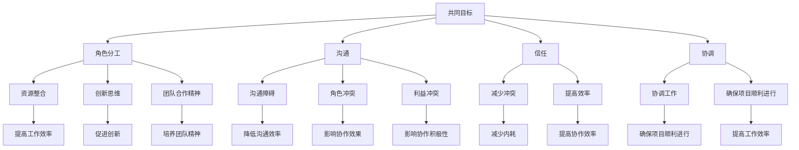

                 

# 高效协作团队打造：从理论到实践

> 关键词：团队协作、团队建设、高效协作、沟通技巧、领导力、冲突管理

在信息技术高速发展的今天，高效协作的团队能够快速响应市场需求，创新解决方案，推动项目成功。然而，团队协作并非易事，它涉及到众多理论和实践层面的挑战。本文将从理论到实践，深入探讨如何打造一个高效协作的团队。

## 摘要

本文旨在为IT从业者提供一个系统化的框架，以帮助他们在团队协作中取得成功。我们将首先介绍团队协作的重要性与挑战，然后深入探讨团队合作模型、沟通技巧、领导力、冲突管理和个人发展等关键要素。在实践篇中，我们将提供团队建设策略、团队协作工具和实践案例，最后通过实际项目实战，总结团队协作的技巧和方法。希望通过本文，读者能够掌握高效协作团队打造的理论与实践。

## 目录

### 第一部分: 团队协作理论基础

1. 团队协作的重要性与挑战  
    1.1 团队协作的定义与核心要素  
    1.2 团队协作的优势与挑战  
    1.3 团队协作的理论基础

2. 团队合作模型与模式  
    2.1 传统团队合作模型  
    2.2 现代团队合作模式  
    2.3 团队合作模式的案例分析

3. 团队协作中的沟通技巧  
    3.1 沟通的重要性与障碍  
    3.2 有效沟通的技巧  
    3.3 非言语沟通与跨文化沟通

4. 团队领导力与影响力  
    4.1 团队领导者的角色与责任  
    4.2 领导力的核心要素  
    4.3 团队领导者的影响力构建

5. 团队协作中的冲突管理  
    5.1 冲突的定义与类型  
    5.2 冲突管理的策略  
    5.3 冲突管理的实践案例

6. 团队合作中的个人发展  
    6.1 个人成长与团队目标的关系  
    6.2 个人技能提升的途径  
    6.3 个人职业规划与团队合作

### 第二部分: 实践篇

7. 高效协作团队建设策略  
    7.1 团队建设的步骤与方法  
    7.2 团队角色的分配与优化  
    7.3 团队文化建设

8. 团队协作工具与实践案例  
    8.1 常用团队协作工具介绍  
    8.2 团队协作工具的应用与实践  
    8.3 团队协作成功的实践案例

9. 从理论到实践：团队协作技巧提升  
    9.1 团队协作中的问题分析与解决  
    9.2 团队协作效率评估与改进  
    9.3 团队协作中的创新思维培养

10. 团队协作中的项目实战  
    10.1 项目实战概述  
    10.2 项目实战准备与实施  
    10.3 项目实战总结与反思

### 第三部分: 案例研究

11. 案例研究一：高效协作团队的成功经验  
    11.1 案例背景与挑战  
    11.2 团队协作策略与实施  
    11.3 案例总结与启示

12. 案例研究二：团队协作中的困境与突破  
    12.1 案例背景与问题  
    12.2 团队协作改进措施  
    12.3 案例总结与反思

### 附录

13. 附录 A: 团队协作工具与资源推荐  
    13.1 常用团队协作工具列表  
    13.2 团队协作资源网站推荐  
    13.3 团队协作书籍推荐## 第一部分: 团队协作理论基础

### 第1章 团队协作的重要性与挑战

#### 1.1 团队协作的定义与核心要素

团队协作是指团队成员为实现共同目标，通过沟通、协调和合作，共同完成任务的过程。它不仅仅是一个简单的合作，更是一种组织行为，涉及到团队内部成员之间的互动和协作。

核心要素包括：

1. **共同目标**：团队协作的基础是共同的目标。没有明确的目标，团队成员将缺乏方向感和动力。
2. **角色分工**：每个团队成员都应该清楚自己的职责和角色，以便在协作中发挥最佳作用。
3. **沟通**：有效的沟通是团队协作的关键。团队成员需要通过沟通了解对方的工作进展、问题和需求。
4. **信任**：信任是团队协作的基石。只有团队成员互相信任，才能在合作中减少冲突，提高效率。
5. **协调**：团队协作中，不同成员的工作往往需要协调，以确保项目顺利进行。

#### 1.2 团队协作的优势与挑战

**优势**：

1. **资源整合**：团队协作可以将不同成员的专业知识和技能整合起来，提高工作效率。
2. **创新思维**：多样化的团队成员可以带来不同的观点和思维方式，促进创新。
3. **团队合作精神**：通过协作，团队成员可以培养团队精神和集体荣誉感。

**挑战**：

1. **沟通障碍**：团队成员之间可能存在沟通不畅的问题，导致误解和冲突。
2. **角色冲突**：不同角色之间可能存在职责重叠或分工不清，影响协作效果。
3. **利益冲突**：团队成员的个人利益可能与团队目标发生冲突，影响协作积极性。

#### 1.3 团队协作的理论基础

**社会心理学理论**：

社会心理学理论认为，个体行为受到社会环境和群体互动的影响。在团队协作中，社会心理学理论可以帮助我们理解团队成员之间的互动关系，如沟通、信任和角色分工等。

**组织行为学理论**：

组织行为学理论关注团队内部的行为和组织结构。它为我们提供了团队协作的框架，如团队角色分工、领导力和冲突管理等。

**沟通理论**：

沟通理论关注信息在团队内部的传递和处理。了解沟通理论可以帮助我们识别沟通障碍，提高沟通效率。

**冲突管理理论**：

冲突管理理论关注如何识别和解决团队内部的冲突。通过有效的冲突管理，团队可以减少内耗，提高协作效率。

#### 1.4 团队协作的核心概念原理之间的关系架构

为了更好地理解团队协作，我们可以使用Mermaid流程图来展示核心概念原理之间的关系。



通过上述流程图，我们可以清晰地看到团队协作中的核心概念和原理之间的相互关系，从而更好地理解团队协作的理论基础。

#### 1.5 团队协作的核心算法原理讲解

团队协作的核心算法原理涉及到如何高效地组织和管理团队活动，以下是一个简化的伪代码来阐述这一过程：

```plaintext
// 团队协作核心算法
function TeamCollaboration() {
    // 初始化团队
    Team members = ["Member1", "Member2", "Member3", ...];
    // 设定共同目标
    Goal = "Develop a new software product";
    // 分配角色
    AssignRoles(members);
    // 建立沟通机制
    SetupCommunication(members);
    // 建立信任
    BuildTrust(members);
    // 协调工作
    CoordinateWork(members);
    // 监控进度
    MonitorProgress(members);
    // 解决冲突
    ResolveConflicts(members);
    // 提升技能
    ImproveSkills(members);
}

// 分配角色
function AssignRoles(members) {
    // 根据成员技能和兴趣分配角色
    Member1.role = "Project Manager";
    Member2.role = "Software Developer";
    Member3.role = "Tester";
    // ...
}

// 建立沟通机制
function SetupCommunication(members) {
    // 使用沟通工具和技巧确保有效沟通
    MeetingSchedule = "Weekly";
    CommunicationTools = ["Chat", "Email", "Video Call"];
    // ...
}

// 建立信任
function BuildTrust(members) {
    // 通过透明度和开放性建立信任
    Transparency = "High";
    Openness = "High";
    // ...
}

// 协调工作
function CoordinateWork(members) {
    // 确保工作协调一致，无重复和遗漏
    TaskAllocation = "Evenly";
    WorkloadBalance = "Optimized";
    // ...
}

// 监控进度
function MonitorProgress(members) {
    // 定期检查项目进度，确保按计划进行
    ProgressCheck = "Bi-weekly";
    Milestones = ["Milestone1", "Milestone2", "Milestone3", ...];
    // ...
}

// 解决冲突
function ResolveConflicts(members) {
    // 使用冲突管理策略解决团队内部冲突
    ConflictManagementStrategy = "Mediation";
    // ...
}

// 提升技能
function ImproveSkills(members) {
    // 提供培训和学习机会，提升团队成员技能
    TrainingSessions = ["Code Review", "Team Building", "Technical Training"];
    // ...
}
```

这个伪代码提供了一个基本的框架，展示了如何通过一系列步骤来实现高效的团队协作。

#### 1.6 数学模型和公式

在团队协作中，一些数学模型和公式可以帮助我们量化协作的效果和效率。以下是一个简单的例子：

**协作效率公式**：

\[ \text{协作效率} = \frac{\text{实际完成工作量}}{\text{预计完成工作量}} \]

**团队成员贡献度公式**：

\[ \text{团队成员贡献度} = \frac{\text{个人贡献量}}{\text{团队总贡献量}} \]

**团队凝聚力公式**：

\[ \text{团队凝聚力} = \frac{\text{团队成员间信任度}}{\text{团队成员间冲突度}} \]

#### 1.7 详细讲解和举例说明

为了更好地理解上述数学模型和公式，我们可以通过具体的例子进行讲解。

**协作效率示例**：

假设一个团队计划在两周内完成一个软件项目的开发，实际完成工作量为80%，则协作效率为0.8。

\[ \text{协作效率} = \frac{80\%}{100\%} = 0.8 \]

这意味着团队在两周内完成了预计工作量的80%。

**团队成员贡献度示例**：

在一个四人团队中，成员A完成了20%的工作量，成员B完成了30%的工作量，成员C完成了25%的工作量，成员D完成了25%的工作量。则每个人的贡献度为：

\[ \text{成员A贡献度} = \frac{20\%}{100\%} = 0.2 \]
\[ \text{成员B贡献度} = \frac{30\%}{100\%} = 0.3 \]
\[ \text{成员C贡献度} = \frac{25\%}{100\%} = 0.25 \]
\[ \text{成员D贡献度} = \frac{25\%}{100\%} = 0.25 \]

**团队凝聚力示例**：

假设团队成员间的信任度为0.8，冲突度为0.2，则团队凝聚力为：

\[ \text{团队凝聚力} = \frac{0.8}{0.2} = 4 \]

这表明团队在信任度方面较强，而冲突度较低，具有较高的凝聚力。

通过这些示例，我们可以看到数学模型和公式在团队协作中的应用，帮助团队量化协作效果和效率，从而优化团队运作。

### 第2章 团队合作模型与模式

#### 2.1 传统团队合作模型

传统团队合作模型主要基于职能分工和垂直管理。在这种模式下，团队成员根据其专业能力和职能被划分为不同的部门或小组，每个部门或小组负责特定的任务。以下是传统团队合作模型的核心特点：

1. **职能分工**：团队成员根据专业背景和技能被分配到不同的部门，如开发部、市场部、技术支持部等。
2. **垂直管理**：团队成员在垂直管理结构中汇报给上级管理者，上级管理者负责决策和资源分配。
3. **任务导向**：团队的工作主要围绕特定任务展开，任务完成后团队解散或重新组建。

传统团队合作模型的优势在于明确的职能分工和高效的任务执行，但也存在一些缺点：

1. **沟通障碍**：由于团队成员被分配到不同的部门，沟通和协作可能受到影响。
2. **创新受限**：垂直管理结构可能导致决策过程缓慢，创新受到限制。
3. **团队凝聚力低**：由于团队工作周期较短，团队成员之间难以建立深厚的信任和关系。

#### 2.2 现代团队合作模式

现代团队合作模式更加注重团队的整体性和灵活性，以适应快速变化的市场环境。以下是现代团队合作模式的几种主要模式：

1. **跨职能团队**：跨职能团队由来自不同部门或领域的成员组成，共同完成一个项目。这种模式的优势在于团队成员可以充分利用各自的专业知识和技能，提高协作效率。

2. **敏捷开发**：敏捷开发是一种以用户需求为导向，通过快速迭代和灵活响应变化的方式完成项目开发的模式。它强调团队成员之间的紧密协作和持续沟通，以提高项目质量和效率。

3. **分布式团队**：分布式团队是指团队成员分布在不同的地理位置，通过互联网和协作工具进行工作。这种模式适用于全球化的企业，可以充分利用全球人力资源。

4. **自组织团队**：自组织团队是一种自我管理和自我组织的模式，团队成员根据项目需求自主分配任务和角色，自行协调和解决问题。这种模式强调团队成员的自主性和创造力。

现代团队合作模式的优势在于：

1. **灵活性**：团队成员可以根据项目需求灵活调整工作内容和角色，提高适应性。
2. **高效协作**：通过紧密的沟通和协作，提高项目完成速度和质量。
3. **创新能力**：多样化的团队成员可以带来不同的观点和思维方式，促进创新。

但现代团队合作模式也面临一些挑战，如：

1. **沟通障碍**：地理分布和时差可能导致沟通不畅，影响协作效果。
2. **团队凝聚力**：远程工作可能导致团队成员之间的信任和关系较弱。
3. **管理复杂度**：自组织团队的管理难度较大，需要管理者具备更高的领导能力和管理水平。

#### 2.3 团队合作模式的案例分析

**案例分析一：跨职能团队**

某大型科技公司采用跨职能团队模式，其项目团队成员来自不同的部门，包括产品经理、设计师、开发人员、测试工程师等。项目启动后，团队成员通过每日站会、周会等会议进行沟通和协作，确保项目顺利进行。

优点：

1. 成员可以充分利用各自的专业知识和技能，提高项目质量。
2. 减少了跨部门沟通的障碍，提高了工作效率。

缺点：

1. 项目管理难度增加，需要协调不同部门之间的工作进度和资源。
2. 可能出现部门利益冲突，影响团队协作。

**案例分析二：敏捷开发**

某互联网公司采用敏捷开发模式，项目团队成员通过迭代的方式进行开发。每个迭代周期为两周，团队成员在每次迭代结束后进行回顾和总结，以便在下一个迭代中进行改进。

优点：

1. 快速响应市场需求，提高产品迭代速度。
2. 通过迭代和回顾，持续优化项目质量和效率。

缺点：

1. 需要团队成员具备较高的自律性和沟通能力。
2. 可能会出现资源分配不均的问题。

**案例分析三：分布式团队**

某跨国科技公司采用分布式团队模式，其团队成员分布在不同的国家和城市。团队成员通过即时通讯工具、视频会议和项目管理软件进行协作。

优点：

1. 充分利用全球人力资源，提高项目完成速度和质量。
2. 成员可以灵活安排工作时间，提高工作效率。

缺点：

1. 沟通障碍和时差问题可能导致协作效率下降。
2. 团队凝聚力较低，需要加强团队成员之间的沟通和互动。

**案例分析四：自组织团队**

某创业公司采用自组织团队模式，团队成员根据项目需求自主分配任务和角色，自行协调和解决问题。团队成员定期进行团队建设和技能培训，以提高团队协作能力和创新能力。

优点：

1. 成员具有自主性和创造力，能够更好地发挥个人潜力。
2. 管理成本较低，提高了团队的灵活性。

缺点：

1. 管理难度较大，需要团队成员具备较高的领导能力和管理水平。
2. 可能会出现团队协作不均的问题。

通过上述案例分析，我们可以看到不同团队合作模式的优势和劣势，以及在实际应用中的效果。选择合适的团队合作模式，需要根据项目特点和企业实际情况进行综合考虑。

#### 2.4 团队协作中的沟通技巧

在团队协作中，沟通是确保项目顺利进行的关键因素。有效的沟通可以减少误解和冲突，提高团队协作效率。以下是一些重要的沟通技巧：

**1. 明确沟通目标**

在每次沟通前，明确沟通的目标和议程，确保所有团队成员都了解沟通的重点和期望结果。这有助于提高沟通的针对性和效率。

**2. 使用简洁明了的语言**

避免使用复杂、模糊或专业术语，尽量使用简单、易懂的语言进行沟通。这有助于确保信息传递的准确性和清晰性。

**3. 主动倾听**

在沟通中，不仅要表达自己的观点，还要主动倾听他人的意见和需求。通过倾听，可以更好地理解团队成员的想法和需求，从而建立更好的信任和合作关系。

**4. 使用多种沟通渠道**

根据沟通的内容和紧急程度，选择合适的沟通渠道。例如，对于重要且紧急的事项，可以采用面对面会议或视频会议；对于日常交流和信息更新，可以采用即时通讯工具或邮件。

**5. 定期进行沟通回顾**

定期进行沟通回顾，评估沟通的效果和效率，发现和解决沟通中的问题。这有助于持续改进沟通流程，提高团队协作效率。

**6. 建立沟通机制**

建立一套完善的沟通机制，确保团队成员在沟通中能够及时、准确地获取所需信息。例如，制定明确的沟通计划、设立沟通渠道和沟通工具，以及设立沟通责任和问责机制。

**7. 跨文化沟通**

在全球化背景下，跨文化沟通变得越来越重要。了解不同文化的沟通习惯和偏好，尊重并适应不同文化背景的团队成员，有助于提高沟通效果。

#### 2.5 非言语沟通与跨文化沟通

非言语沟通在团队协作中同样重要。它包括肢体语言、面部表情、眼神交流、空间距离等非文字表达方式。有效的非言语沟通可以帮助团队成员更好地理解彼此的情绪和意图，减少误解和冲突。

**1. 肢体语言**

肢体语言可以传递大量的信息。例如，点头表示同意，摆手表示拒绝，微笑表示友好。了解和运用肢体语言，可以提高沟通效果。

**2. 面部表情**

面部表情可以传达情绪和态度。例如，微笑表示愉快，皱眉表示不悦。在团队协作中，关注和解读团队成员的面部表情，可以更好地了解他们的情绪和反应。

**3. 眼神交流**

眼神交流可以表达尊重和信任。在沟通中，保持眼神交流可以增强沟通的互动性和参与度，有助于建立更好的团队关系。

**4. 空间距离**

空间距离在不同文化中有着不同的含义。了解并尊重不同文化背景下的空间距离习惯，有助于避免误解和冲突。

**跨文化沟通**

跨文化沟通是团队协作中的重要方面。不同文化背景的团队成员可能在沟通风格、表达方式和行为习惯上存在差异。以下是一些跨文化沟通的建议：

**1. 尊重差异**

尊重不同文化的差异，避免以自己的文化标准去评价他人。了解和尊重不同文化的沟通习惯和价值观，有助于建立和谐的工作关系。

**2. 保持开放心态**

保持开放心态，愿意接受和了解不同文化的观点和方式。这有助于促进跨文化沟通和理解。

**3. 使用明确和具体的语言**

使用明确和具体的语言进行沟通，避免模糊和含糊的表述。这有助于减少误解和冲突。

**4. 提高跨文化沟通技巧**

通过培训和经验积累，提高跨文化沟通技巧。这包括了解不同文化的沟通习惯、行为模式和价值观，以及如何在不同文化背景下进行有效的沟通。

**5. 建立跨文化沟通机制**

建立一套跨文化沟通机制，确保团队成员在不同文化背景下能够有效地沟通和协作。例如，设立跨文化沟通渠道、提供跨文化培训和支持等。

通过上述沟通技巧和非言语沟通与跨文化沟通的建议，团队可以更好地理解和协调团队成员，提高协作效率和团队凝聚力。

### 第3章 团队领导力与影响力

#### 3.1 团队领导者的角色与责任

团队领导者在团队协作中扮演着至关重要的角色。他们的主要职责包括：

1. **明确目标**：领导者需要设定明确的目标，确保团队成员对项目方向和目标有清晰的认识。

2. **规划与组织**：领导者需要制定合理的规划，确保项目按计划进行。同时，他们需要合理组织资源，确保团队成员能够高效地完成任务。

3. **沟通协调**：领导者需要确保团队成员之间的沟通畅通，解决团队内部和外部的冲突，促进协作。

4. **激励与激励**：领导者需要激励团队成员，鼓励他们在项目中发挥最佳作用。同时，他们需要为团队成员提供必要的支持和资源。

5. **监督与评估**：领导者需要监督项目进度，评估团队成员的表现，确保项目按计划完成。

#### 3.2 领导力的核心要素

领导力是一个复杂的概念，它涉及到多个方面的能力和素质。以下是领导力的核心要素：

1. **愿景与远见**：领导者需要具备清晰的愿景和远见，能够为团队指明方向，并激励团队成员为之努力。

2. **决策能力**：领导者需要具备良好的决策能力，能够在复杂和不确定的环境中做出明智的决策。

3. **沟通能力**：领导者需要具备良好的沟通能力，能够有效地与团队成员沟通，理解他们的需求和期望。

4. **团队建设**：领导者需要关注团队建设，促进团队成员之间的协作和信任，提高团队凝聚力。

5. **变革管理**：领导者需要具备变革管理的能力，能够引导团队适应变化，推动创新和发展。

#### 3.3 团队领导者的影响力构建

团队领导者的影响力是团队成功的关键。以下是一些构建团队领导者影响力的策略：

1. **建立信任**：通过诚实、透明和负责任的行为，建立与团队成员之间的信任。

2. **展示领导风格**：领导者需要明确自己的领导风格，并在此基础上进行适当的调整，以适应不同团队成员的需求。

3. **积极倾听**：领导者需要积极倾听团队成员的意见和建议，尊重他们的观点，增强他们的参与感和责任感。

4. **提供反馈**：领导者需要及时、具体地提供反馈，帮助团队成员了解他们的表现，并提供改进的建议。

5. **培养领导者**：领导者需要关注团队成员的领导潜力，提供培训和机会，培养未来的领导者。

通过上述策略，团队领导者可以有效地构建自己的影响力，推动团队协作和项目成功。

### 第4章 团队协作中的冲突管理

#### 4.1 冲突的定义与类型

冲突是团队协作中常见的问题，它指的是团队成员在目标、价值观、资源、方法等方面的不一致。有效的冲突管理是确保团队和谐运作和高效协作的关键。

**冲突的定义**：

冲突是一种行为、情感或思想的矛盾，通常表现为争执、分歧和对抗。

**冲突的类型**：

1. **目标冲突**：团队成员对项目的目标和期望有不同的看法，可能导致工作方向不一致。
2. **价值观冲突**：团队成员的价值观和信仰不同，可能导致工作态度和行为不一致。
3. **资源冲突**：团队内部资源有限，导致争夺资源的情况，如人力、时间和资金等。
4. **方法冲突**：团队成员对解决问题的方法有不同的看法，可能导致工作方式不一致。

#### 4.2 冲突管理的策略

冲突管理是指通过有效的方法和技巧来识别、分析和解决团队内部的冲突。以下是几种常见的冲突管理策略：

**1. 预防策略**：

- **明确目标与责任**：通过明确团队的目标和每个成员的责任，减少因目标不一致而产生的冲突。
- **建立沟通机制**：建立有效的沟通渠道，确保团队成员能够及时表达意见和建议，减少误解和冲突。
- **加强团队建设**：通过团队建设活动，增强团队成员之间的信任和合作关系，减少冲突。

**2. 解决策略**：

- **对话与沟通**：通过对话和沟通，了解冲突的原因和双方的立场，寻找共同点和解决方案。
- **妥协与让步**：在冲突无法通过对话解决时，领导者或团队成员可能需要做出妥协和让步，以达成一致。
- **第三方调解**：在团队内部无法解决冲突时，可以邀请第三方专业人士进行调解，提供中立的意见和建议。

**3. 处理策略**：

- **转移焦点**：将冲突的焦点转移到问题的解决上，而不是个人情绪和态度上。
- **问题解决**：通过分析冲突的原因，寻找解决问题的方法，避免类似冲突的再次发生。
- **接受与适应**：在某些情况下，团队可能需要接受冲突的存在，并寻找适应的方法，以保持团队的和谐运作。

#### 4.3 冲突管理的实践案例

**案例一：目标冲突**

某IT项目团队在项目启动时，对项目的目标和需求存在不同的看法。团队中的开发人员和项目经理认为项目应该优先考虑功能实现，而测试团队则认为项目的质量至关重要。

**解决方案**：

- **对话与沟通**：领导者组织了会议，让团队成员表达各自的看法和担忧。
- **妥协与让步**：双方在讨论中找到了共同点，决定在功能实现和质量保证之间寻找平衡。
- **第三方调解**：引入项目经理作为中立方，帮助双方达成了一致。

**案例二：价值观冲突**

在一个跨文化团队中，成员来自不同的国家，对工作的价值观和态度存在差异。例如，一些成员重视工作的时间和效率，而另一些成员则更注重工作质量和细节。

**解决方案**：

- **加强团队建设**：组织团队建设活动，增强团队成员之间的信任和了解。
- **对话与沟通**：通过对话和沟通，让团队成员表达各自的观点和需求，寻找共同的理解。
- **接受与适应**：团队在沟通中找到了共识，接受了不同价值观的存在，并学会了适应和包容。

通过上述实践案例，我们可以看到冲突管理在不同情境下的应用和效果。有效的冲突管理可以帮助团队克服障碍，提高协作效率，实现项目目标。

### 第5章 团队合作中的个人发展

#### 5.1 个人成长与团队目标的关系

个人成长与团队目标是相辅相成的。个人成长不仅能够提升团队成员的技能和知识，还能为团队带来更多的创新和动力。同时，团队目标的实现也需要团队成员的共同努力和个人成长。

**个人成长对团队目标的积极作用**：

1. **技能提升**：个人成长可以提升团队成员的专业技能和知识，使他们在项目中发挥更大的作用。
2. **创新能力**：个人成长可以激发团队成员的创新思维，为团队带来新的想法和解决方案。
3. **团队合作**：个人成长有助于增强团队成员之间的协作和信任，提高团队的凝聚力。

**团队目标对个人成长的影响**：

1. **明确方向**：团队目标为个人成长提供了明确的方向和目标，帮助团队成员更好地规划自己的职业发展。
2. **提供机会**：团队目标为个人成长提供了实践的机会，使团队成员能够通过实际项目提升自己的能力。
3. **激励和认可**：团队目标的实现会为团队成员带来激励和认可，增强他们的工作动力和成就感。

#### 5.2 个人技能提升的途径

个人技能提升是团队协作中的重要一环。以下是一些有效的途径：

**1. 培训和课程**：

- 参加专业的培训和课程，提升专业技能和知识。这些培训可以是线下的，也可以是线上的，如专业课程、研讨会和工作坊等。

**2. 实践和项目**：

- 通过参与实际项目，将理论知识应用于实际工作中，提升实践能力和解决问题的能力。

**3. 自学和阅读**：

- 利用业余时间自学和阅读，了解最新的技术动态和行业趋势，提升自己的知识储备。

**4. 团队协作**：

- 在团队协作中，通过与团队成员的交流和合作，学习他们的经验和技巧，提高自己的协作能力。

**5. 反馈和总结**：

- 定期接收上级和同事的反馈，了解自己的优势和不足，并加以改进。同时，通过总结项目经验，提升自己的工作经验。

#### 5.3 个人职业规划与团队合作

个人职业规划与团队合作密切相关。以下是一些建议，帮助个人在团队合作中实现职业规划：

**1. 确定职业目标**：

- 根据自己的兴趣和优势，明确自己的职业目标，如晋升、转岗或成为某一领域的专家。

**2. 制定行动计划**：

- 根据职业目标，制定具体的行动计划，包括需要提升的技能、参加的培训和项目等。

**3. 融入团队**：

- 在团队合作中，积极参与项目，融入团队，与团队成员建立良好的关系。

**4. 寻求导师和指导**：

- 寻找一位经验丰富的导师或指导者，向他们请教职业发展和技能提升的建议。

**5. 不断学习和成长**：

- 保持学习的态度，不断提升自己的技能和知识，以适应不断变化的工作环境。

通过以上途径和策略，个人可以在团队合作中实现职业规划，同时为团队目标的实现做出贡献。

### 第7章 高效协作团队建设策略

#### 7.1 团队建设的步骤与方法

高效协作的团队建设需要系统的规划和实施，以下是一些建议的步骤和方法：

**步骤一：明确团队目标**

团队建设的第一步是明确团队的目标和愿景。这包括项目的最终目标、短期目标以及团队的核心价值观。通过明确目标，团队成员可以更好地理解团队的方向和努力的方向。

**方法一：制定团队章程**

制定一份团队章程，明确团队的目标、价值观、行为准则和工作流程。这有助于团队成员在合作中保持一致，并为未来的决策提供依据。

**步骤二：角色分配与职责明确**

在团队中，每个成员都应该明确自己的角色和职责。这有助于提高工作效率，减少混淆和冲突。

**方法二：角色分配会议**

组织一次角色分配会议，让团队成员讨论和确定各自的角色和职责。在会议中，可以采用头脑风暴和角色扮演等方法，确保每个成员都清楚地了解自己的任务和期望。

**步骤三：沟通机制建立**

建立有效的沟通机制是团队协作的关键。这包括沟通工具、沟通频率和沟通方式的选择。

**方法三：沟通计划制定**

制定一个沟通计划，明确沟通的目标、内容、频率和方式。例如，每周举行一次团队会议，每天进行一次站会，以及时交流项目进展和问题。

**步骤四：信任与团队合作文化培养**

建立信任和团队合作文化是团队建设的重要组成部分。这需要时间和努力，但它是高效协作的基础。

**方法四：团队建设活动**

定期组织团队建设活动，如团队聚餐、户外拓展和团队培训等，以增强团队成员之间的信任和团队合作精神。

**步骤五：持续反馈与改进**

团队建设是一个持续的过程，需要不断地反馈和改进。通过定期评估团队的表现和反馈，可以发现问题和不足，并采取相应的措施进行改进。

**方法五：定期回顾会议**

定期举行回顾会议，让团队成员分享经验和反馈，讨论团队表现的优点和改进空间。这有助于团队不断成长和进步。

#### 7.2 团队角色的分配与优化

团队角色的分配和优化是确保团队高效运作的关键。以下是一些原则和方法：

**原则一：能力匹配**

确保团队成员的能力与其分配的角色相匹配。这有助于提高工作效率和质量，减少不必要的重复工作。

**原则二：技能多样化**

团队中的每个角色都应具备多样化的技能，以应对不同的项目需求。这有助于提高团队的适应性和创新能力。

**原则三：互补性**

团队成员之间应具备互补的技能和经验，以便在项目过程中互相支持和协作。

**方法一：角色评估**

定期对团队成员的角色进行评估，了解他们的能力和需求，并根据项目的变化进行相应的调整。

**方法二：技能培训**

为团队成员提供技能培训和发展机会，帮助他们提升自己的能力和知识，以适应团队和项目的发展需求。

**方法三：角色轮换**

适当进行角色轮换，让团队成员有机会尝试不同的角色和工作内容，从而提高他们的技能和适应能力。

**方法四：反馈与改进**

鼓励团队成员提供反馈，关于角色分配的优缺点，并根据反馈进行相应的改进。

通过合理的角色分配和优化，团队可以更好地发挥每个人的优势，提高整体协作效率。

#### 7.3 团队文化建设

团队文化是团队共同价值观和行为准则的体现，它对团队的高效协作和长期发展具有深远影响。以下是一些建议，帮助团队建立积极、健康的文化：

**1. 明确团队价值观**

团队价值观是团队文化的核心，它决定了团队的行为准则和决策方式。明确团队价值观，可以帮助团队成员在合作中保持一致，并为团队的发展提供方向。

**2. 建立开放和透明的沟通机制**

开放和透明的沟通机制有助于增强团队成员之间的信任和合作。这包括鼓励团队成员表达意见和反馈，以及及时分享项目的进展和问题。

**3. 鼓励创新和尝试**

团队文化应该鼓励创新和尝试，为团队成员提供自由发挥的空间。这有助于激发团队成员的创造力和积极性，推动团队的发展。

**4. 奖励和认可**

通过奖励和认可，激励团队成员的积极表现和贡献。这可以增强团队成员的归属感和成就感，提高团队的整体士气。

**5. 团队建设活动**

定期组织团队建设活动，如团队聚餐、户外拓展和团队培训等，以增强团队成员之间的交流和合作。这有助于建立深厚的团队关系和信任。

**6. 反馈和改进**

团队文化是一个持续建设的过程，需要不断地反馈和改进。通过定期评估团队文化的实施效果，可以发现问题和不足，并采取相应的措施进行改进。

通过以上措施，团队可以建立积极、健康的文化，提高团队成员的协作效率和团队凝聚力。

### 第8章 团队协作工具与实践案例

#### 8.1 常用团队协作工具介绍

在高效团队协作中，选择合适的协作工具至关重要。以下是一些常用的团队协作工具及其特点：

**1. Trello**

Trello 是一款基于看板的项目管理工具，适用于小型团队和复杂项目。它通过可视化卡片来展示任务进度，使团队成员能够清晰地了解项目状态。

**特点**：

- 界面直观，易于操作
- 支持多种视图，如列表、看板和地图
- 支持协作，实时更新任务状态

**适用场景**：

- 任务管理
- 项目规划

**2. Slack**

Slack 是一款即时通讯和协作工具，适用于团队内部和跨团队协作。它集成了多种功能，如聊天、文件共享、会议和集成应用。

**特点**：

- 功能丰富，支持多种集成应用
- 界面友好，消息分类清晰
- 支持多种设备，移动端和桌面端

**适用场景**：

- 团队沟通
- 文件共享
- 会议安排

**3. JIRA**

JIRA 是一款功能强大的项目管理工具，适用于软件开发团队。它支持敏捷开发，通过灵活的看板和报告功能，帮助团队跟踪和管理项目进度。

**特点**：

- 支持多种敏捷开发方法
- 强大的报告和统计功能
- 灵活的定制选项

**适用场景**：

- 敏捷开发
- 项目管理

**4. Asana**

Asana 是一款功能全面的团队协作工具，适用于各种类型的项目和团队。它通过任务和项目来组织工作，使团队成员能够清晰地了解自己的任务和项目进度。

**特点**：

- 界面简洁，易于使用
- 支持多种视图，如列表、看板和日历
- 支持协作，实时更新任务状态

**适用场景**：

- 任务管理
- 项目规划
- 团队协作

**5. Zoom**

Zoom 是一款视频会议和在线协作工具，适用于远程工作和跨区域团队。它提供高质量的音频和视频通话，以及屏幕共享和协作功能。

**特点**：

- 高质量视频和音频通话
- 支持多种设备，包括桌面端、移动端和Web端
- 支持在线协作，如文件共享和屏幕共享

**适用场景**：

- 远程工作
- 跨区域团队协作
- 会议和培训

#### 8.2 团队协作工具的应用与实践

**应用一：任务管理**

在任务管理中，Trello 和 Asana 等工具可以有效地帮助团队跟踪和管理任务。通过创建任务卡片，分配任务给团队成员，并设置截止日期和优先级，团队成员可以清晰地了解自己的任务和工作进度。

**实践步骤**：

1. 创建项目板和任务卡片。
2. 分配任务给团队成员。
3. 设置任务的截止日期和优先级。
4. 定期更新任务状态，确保任务按时完成。

**应用二：团队沟通**

Slack 和 Zoom 等工具可以有效地帮助团队进行沟通和协作。通过聊天、视频会议和文件共享等功能，团队成员可以随时交流意见、分享资源和协调工作。

**实践步骤**：

1. 创建团队频道和私人聊天。
2. 使用聊天功能进行日常沟通。
3. 定期举行视频会议，讨论项目进展和问题。
4. 使用文件共享功能，共享文档和工作文件。

**应用三：项目管理**

JIRA 和 Asana 等工具可以有效地帮助团队进行项目管理。通过创建项目、任务和里程碑，团队可以清晰地了解项目进度、任务分配和资源需求。

**实践步骤**：

1. 创建项目板和项目任务。
2. 分配任务给团队成员。
3. 设置项目的里程碑和截止日期。
4. 定期更新项目状态，确保项目按时完成。

**应用四：文档管理**

Google Docs 和 Confluence 等工具可以有效地帮助团队进行文档管理。通过云端存储和实时协作，团队成员可以共同编辑和更新文档，确保信息的一致性和共享。

**实践步骤**：

1. 创建共享文档和工作文件。
2. 使用云端存储，确保文档的安全性和可访问性。
3. 实时协作，编辑和更新文档。
4. 定期备份和更新文档，确保文档的完整性和最新性。

通过上述应用和实践，团队可以有效地利用协作工具，提高工作效率和协作效果，实现项目目标的顺利实现。

#### 8.3 团队协作成功的实践案例

**案例一：敏捷开发团队的成功实践**

某互联网公司采用敏捷开发模式，利用JIRA和Trello进行任务管理和协作。团队每周举行一次站会，使用Trello跟踪任务进度，使用JIRA进行项目规划和报告。

**成功经验**：

1. **明确的任务分配**：团队使用Trello的看板功能，清晰地展示每个任务的状态和责任人，确保任务按时完成。
2. **高效的沟通**：团队使用JIRA的内部讨论功能，及时沟通任务进展和问题，确保团队成员之间的信息同步。
3. **持续迭代**：团队通过定期回顾和总结，不断改进开发流程，提高项目质量和效率。

**案例二：远程团队的成功实践**

某跨国科技公司采用远程办公模式，利用Slack和Zoom进行团队协作。团队每天举行一次视频会议，使用Slack进行日常沟通和协作。

**成功经验**：

1. **高效的沟通**：团队使用Slack的聊天功能和频道，实时分享信息和资源，确保团队成员之间的信息畅通。
2. **灵活的工作时间**：团队成员可以根据自己的时间表安排工作，提高了工作效率和灵活性。
3. **清晰的进度跟踪**：团队使用Trello和JIRA等工具，实时更新项目进度，确保项目按时完成。

**案例三：跨文化团队的成功实践**

某国际咨询公司拥有跨文化的团队成员，利用Asana和Google Docs进行协作。团队定期举行跨文化培训，增强团队成员之间的理解和信任。

**成功经验**：

1. **跨文化培训**：团队定期组织跨文化培训，帮助团队成员了解不同文化的沟通习惯和价值观，减少误解和冲突。
2. **开放的沟通**：团队鼓励成员分享观点和经验，使用Asana的讨论功能，促进团队成员之间的沟通和合作。
3. **灵活的工作安排**：团队根据成员的文化背景和需求，灵活调整工作时间和任务分配，提高团队成员的工作满意度和工作效率。

通过这些实践案例，我们可以看到团队协作工具在提高团队协作效率和项目成功率方面的重要作用。选择合适的协作工具，并结合实际需求进行应用，可以显著提升团队的工作效率和质量。

### 第9章 从理论到实践：团队协作技巧提升

#### 9.1 团队协作中的问题分析与解决

在团队协作中，常见的问题包括沟通障碍、角色冲突、资源分配不均等。以下是对这些问题的分析及解决策略：

**问题一：沟通障碍**

**原因**：团队成员分散在不同地点，时区差异，使用不同的沟通工具，可能导致沟通不畅。

**解决策略**：

1. **统一沟通工具**：选择一款统一的沟通工具，如Slack或Microsoft Teams，确保团队成员使用相同的平台进行交流。
2. **定期会议**：定期举行视频会议，确保团队成员之间的信息同步和沟通。
3. **明确沟通规范**：制定明确的沟通规范，如使用简洁明了的语言，设定回复时间等，提高沟通效率。

**问题二：角色冲突**

**原因**：团队成员的角色和职责不清，可能导致工作重叠或责任不明确，引发冲突。

**解决策略**：

1. **明确角色和职责**：通过角色分配会议，明确每个团队成员的角色和职责，确保工作分工合理。
2. **角色交叉培训**：组织角色交叉培训，帮助团队成员了解其他角色的任务和需求，减少误解和冲突。
3. **建立反馈机制**：建立反馈机制，团队成员可以随时反馈角色冲突的问题，及时调整和解决。

**问题三：资源分配不均**

**原因**：资源分配不均，可能导致部分成员工作负担过重，影响整体协作效率。

**解决策略**：

1. **资源评估**：定期对资源进行评估，了解资源分配的实际情况，发现资源分配不均的问题。
2. **动态调整**：根据项目进展和团队需求，动态调整资源分配，确保工作负荷平衡。
3. **公平竞争**：建立公平的竞争机制，确保团队成员在资源分配上公平竞争，提高工作积极性。

通过上述问题分析和解决策略，团队可以有效地解决协作中的问题，提高协作效率和项目成功率。

#### 9.2 团队协作效率评估与改进

团队协作效率的评估是持续改进团队协作的重要环节。以下是一些评估方法和改进策略：

**评估方法**：

1. **任务完成率**：通过任务完成情况，评估团队的工作效率。
2. **项目进度**：通过项目进度报告，评估团队的整体协作效果。
3. **团队成员反馈**：通过团队成员的反馈，了解协作过程中的问题和不足。

**改进策略**：

1. **定期评估**：定期对团队协作效率进行评估，发现存在的问题和改进空间。
2. **反馈与改进**：根据评估结果，及时调整和改进协作流程和方法，提高团队协作效率。
3. **培训与指导**：为团队成员提供培训，提高他们的协作技能和知识水平，增强团队协作能力。

通过上述评估方法和改进策略，团队可以持续提升协作效率，实现项目目标。

#### 9.3 团队协作中的创新思维培养

创新思维是团队协作中不可或缺的一部分，以下是一些培养创新思维的策略：

**策略一：头脑风暴**

头脑风暴是一种有效的创新思维培养方法。通过集体讨论，团队成员可以自由地提出自己的想法和观点，激发创新灵感。

**策略二：跨学科合作**

跨学科合作可以带来不同的思维方式和观点，促进创新。通过跨领域的合作，团队可以更好地应对复杂的问题和挑战。

**策略三：定期思考**

定期进行思考活动，如创新工作坊、思维导图等，帮助团队成员培养创新思维，提高解决问题的能力。

**策略四：激励与认可**

建立激励和认可机制，鼓励团队成员提出创新想法，并对优秀的创新思维进行奖励和表彰。

通过上述策略，团队可以培养创新思维，提高团队的创造力和竞争力。

### 第10章 团队协作中的项目实战

#### 10.1 项目实战概述

团队协作中的项目实战是验证和应用团队协作理论的重要环节。通过实际项目的实施，团队可以将理论知识转化为实践技能，提高协作效率和项目成功率。

**项目实战目的**：

1. **验证理论**：通过实际项目，验证团队协作理论和方法的有效性，发现和解决协作中的问题。
2. **提高技能**：通过项目实战，团队成员可以学习新的技能和知识，提高个人和团队的整体能力。
3. **培养协作**：通过实际项目，团队成员可以培养团队合作精神，增强团队凝聚力和信任感。

**项目实战流程**：

1. **项目启动**：明确项目目标、需求和预期成果，组建项目团队，制定项目计划和里程碑。
2. **需求分析**：与客户或利益相关者进行沟通，收集需求，分析项目需求，制定详细的需求文档。
3. **设计阶段**：根据需求文档，进行系统设计和技术方案制定，包括架构设计、数据库设计等。
4. **开发阶段**：按照设计方案，进行代码编写和开发，确保代码质量和可维护性。
5. **测试阶段**：进行系统测试和集成测试，确保项目功能的完整性和稳定性。
6. **部署阶段**：将项目部署到生产环境，进行实际应用和运行。
7. **项目总结**：对项目进行总结和反思，分析项目过程中的优点和不足，为未来项目提供经验教训。

#### 10.2 项目实战准备与实施

**准备阶段**：

1. **团队组建**：根据项目需求，组建合适的项目团队，明确团队成员的角色和职责。
2. **工具和环境准备**：准备项目所需的协作工具和环境，如版本控制工具、项目管理工具、开发环境和测试环境等。
3. **需求分析**：与客户或利益相关者进行需求分析，收集详细的需求信息，制定需求文档。
4. **项目计划**：制定项目计划，包括项目目标、里程碑、任务分配和时间安排。

**实施阶段**：

1. **设计阶段**：

   - **系统设计**：根据需求文档，进行系统设计，包括架构设计、模块划分、数据库设计等。
   - **技术方案制定**：制定项目的技术方案，包括技术选型、开发框架、数据库方案等。
   - **设计评审**：组织设计评审会议，对设计方案进行讨论和评审，确保方案的科学性和可行性。

2. **开发阶段**：

   - **代码编写**：按照设计方案，进行代码编写，确保代码的可读性和可维护性。
   - **代码评审**：进行代码评审，发现和解决代码中的问题，确保代码质量。
   - **版本控制**：使用版本控制工具，管理代码版本，确保代码的完整性和一致性。

3. **测试阶段**：

   - **单元测试**：编写单元测试用例，对模块进行功能测试，确保模块功能的正确性。
   - **集成测试**：进行集成测试，确保模块之间的接口和交互正常。
   - **系统测试**：进行系统测试，模拟实际应用场景，确保系统功能的完整性和稳定性。

4. **部署阶段**：

   - **部署环境准备**：准备项目部署的环境，包括服务器、数据库等。
   - **部署实施**：按照部署计划，将项目部署到生产环境，进行实际应用和运行。
   - **监控和优化**：对部署后的项目进行监控和优化，确保系统的稳定性和性能。

#### 10.3 项目实战总结与反思

**总结阶段**：

1. **项目评估**：对项目进行全面的评估，包括项目目标达成情况、任务完成率、项目质量等。
2. **经验教训**：总结项目过程中的优点和不足，分析成功的原因和失败的原因。
3. **改进措施**：根据总结的结果，制定改进措施，为未来的项目提供参考。

**反思阶段**：

1. **团队协作**：反思团队协作中的问题和不足，如沟通不畅、角色冲突、资源分配不均等，并提出改进建议。
2. **个人成长**：反思自己在项目中的表现和成长，分析自己的优势和不足，制定个人成长计划。
3. **持续改进**：将总结和反思的结果应用到未来的项目中，持续改进团队协作和项目实施过程。

通过项目实战，团队可以不断积累经验，提高协作效率，实现项目目标。同时，通过总结和反思，团队可以持续改进，提高整体能力和竞争力。

### 第11章 案例研究一：高效协作团队的成功经验

#### 11.1 案例背景与挑战

某国际知名互联网公司决定开发一款全新的社交媒体应用。这款应用需要处理大量的用户数据，提供丰富的功能和高度的安全性。项目团队由来自不同国家和背景的成员组成，包括前端开发、后端开发、测试工程师、产品经理和设计师等。

**挑战**：

1. **跨地域协作**：团队成员分布在不同的城市和国家，时区差异和沟通不畅可能影响项目进度。
2. **高度安全性需求**：社交媒体应用涉及用户隐私和数据安全，对安全性和稳定性有很高的要求。
3. **快速迭代**：市场需求变化快速，项目需要具备快速响应能力，以适应市场的变化。

#### 11.2 团队协作策略与实施

**策略一：敏捷开发**

团队采用敏捷开发模式，通过快速迭代和频繁的沟通，确保项目能够快速响应市场需求。以下是具体实施步骤：

1. **迭代计划**：每两周进行一次迭代，每个迭代包含需求分析、设计、开发和测试等环节。
2. **每日站会**：每天早晨举行5-10分钟的站会，让团队成员报告工作进展和遇到的问题。
3. **代码审查**：每个迭代结束后，进行代码审查，确保代码质量和安全性。

**策略二：跨地域协作工具**

为了解决跨地域协作的挑战，团队选择了一款支持多时区协作的协作工具，如Slack和Zoom。

1. **统一沟通平台**：所有团队成员都在Slack上进行日常沟通，确保信息同步。
2. **定期视频会议**：每周举行一次视频会议，确保团队成员之间的实时沟通和协作。

**策略三：安全性和稳定性保障**

针对高度安全性和稳定性需求，团队采取了以下措施：

1. **安全培训**：定期进行安全培训，提高团队成员的安全意识和技能。
2. **自动化测试**：引入自动化测试工具，进行持续集成和持续交付，确保代码的质量和安全。
3. **故障演练**：定期进行故障演练，提高团队应对突发情况的能力。

#### 11.3 案例总结与启示

**成功经验**：

1. **敏捷开发**：敏捷开发模式使团队能够快速响应市场需求，提高了项目的灵活性和响应速度。
2. **跨地域协作**：通过统一沟通平台和定期视频会议，团队成功解决了跨地域协作的挑战，保持了高效的沟通和协作。
3. **安全性和稳定性**：通过安全培训、自动化测试和故障演练，团队保障了项目的高安全性和稳定性。

**启示**：

1. **敏捷开发适用于多变的市场环境**：敏捷开发模式可以帮助团队快速适应市场需求，提高项目的成功率。
2. **跨地域协作需要有效的沟通工具**：选择合适的协作工具，如Slack和Zoom，可以解决跨地域协作的沟通问题。
3. **安全性和稳定性是项目成功的关键**：通过定期培训、自动化测试和故障演练，团队可以保障项目的高安全性和稳定性。

通过本案例研究，我们可以看到高效协作团队在项目成功中的关键作用，以及如何通过敏捷开发、跨地域协作和安全保障策略，实现项目目标。

### 第12章 案例研究二：团队协作中的困境与突破

#### 12.1 案例背景与问题

某国内知名软件公司正在开发一款大型企业级管理系统。项目团队由经验丰富的工程师、产品经理和测试人员组成。然而，在项目实施过程中，团队遇到了一系列的困境。

**问题**：

1. **沟通不畅**：由于团队成员分布在不同的城市，且部分成员习惯使用不同的沟通工具，导致信息传递不及时，沟通效率低下。
2. **角色冲突**：开发人员和测试人员之间因对项目质量和进度有不同的看法，导致意见分歧和工作冲突。
3. **资源分配不均**：项目资源有限，导致部分成员工作负担过重，影响整体项目进度。

#### 12.2 团队协作改进措施

**改进措施一：沟通优化**

1. **统一沟通平台**：团队决定采用统一的沟通平台，如Slack，确保所有团队成员使用相同的工具进行沟通，提高信息传递的效率。
2. **定期沟通会议**：团队每周举行一次线上沟通会议，确保团队成员能够及时了解项目进展和问题，进行有效的沟通和协作。

**改进措施二：角色冲突解决**

1. **建立沟通机制**：团队建立了定期沟通的机制，如每周的“质量会议”，让开发人员和测试人员共同讨论项目质量和进度问题，减少意见分歧。
2. **共同目标设定**：团队明确共同的目标，强调项目成功的重要性，促进团队成员之间的合作和理解。

**改进措施三：资源优化**

1. **任务分配调整**：团队根据项目进展和成员的能力，对任务进行重新分配，确保工作负担平衡，提高工作效率。
2. **资源补充**：团队通过外部招聘和内部调动，增加了项目资源，确保项目进度不受影响。

#### 12.3 案例总结与反思

**成功经验**：

1. **沟通优化**：通过统一沟通平台和定期沟通会议，团队成功解决了沟通不畅的问题，提高了信息传递效率。
2. **角色冲突解决**：通过建立沟通机制和共同目标设定，团队成功解决了开发人员和测试人员之间的角色冲突，促进了团队合作。
3. **资源优化**：通过任务分配调整和资源补充，团队成功解决了资源分配不均的问题，提高了整体项目进度。

**反思**：

1. **沟通工具的选择**：在选择沟通工具时，应考虑团队成员的习惯和偏好，确保工具的使用率。
2. **角色分工明确**：在项目初期，应明确团队成员的角色和职责，减少角色冲突的发生。
3. **资源管理**：在项目资源有限时，应提前进行资源评估和调整，确保项目进度不受影响。

通过本案例研究，我们可以看到团队协作中的困境和解决策略。有效的沟通、角色冲突解决和资源优化，是团队成功的关键。同时，我们也应不断反思和改进，以提高团队协作效率。

### 附录 A: 团队协作工具与资源推荐

#### A.1 常用团队协作工具列表

1. **Trello**：一款基于看板的项目管理工具，适用于任务管理和项目规划。
2. **Slack**：一款即时通讯和协作工具，适用于团队沟通和文件共享。
3. **JIRA**：一款功能强大的项目管理工具，适用于软件开发团队的敏捷开发。
4. **Asana**：一款功能全面的团队协作工具，适用于任务管理和项目规划。
5. **Zoom**：一款视频会议和在线协作工具，适用于远程工作和跨区域团队协作。
6. **Google Workspace**：包括Google Docs、Google Sheets、Google Calendar等，适用于文档编辑、日程安排和团队协作。

#### A.2 团队协作资源网站推荐

1. **Atlassian**：提供JIRA、Confluence等协作工具的详细信息和教程。
2. **Trello Help Center**：提供Trello的教程、视频和常见问题解答。
3. **Slack Help Center**：提供Slack的使用指南、教程和最佳实践。
4. **Asana Help Center**：提供Asana的教程、视频和常见问题解答。
5. **Zoom Help Center**：提供Zoom的使用指南、教程和常见问题解答。

#### A.3 团队协作书籍推荐

1. **《敏捷开发实践指南》**：作者：杰夫·萨瑟兰
   - 内容概述：介绍了敏捷开发的原理和实践方法，适用于软件开发团队。
   - 推荐理由：系统全面地介绍了敏捷开发的理念和方法，对实践敏捷开发有很好的指导作用。

2. **《团队协作工具与实践》**：作者：斯蒂芬·罗宾斯
   - 内容概述：介绍了多种团队协作工具的应用和实践，包括Trello、Slack、Asana等。
   - 推荐理由：详细介绍了团队协作工具的使用方法和最佳实践，有助于提升团队协作效率。

3. **《团队协作与领导力》**：作者：安妮·杜克
   - 内容概述：探讨了团队协作和领导力的关系，提供了提高团队协作效率和领导力的策略。
   - 推荐理由：从心理学和管理学的角度，深入分析了团队协作和领导力的关键因素，对团队建设和领导力提升有很好的启示作用。

通过这些工具和资源，团队可以更好地协作，提高工作效率，实现项目目标。希望这些推荐对您有所帮助。

