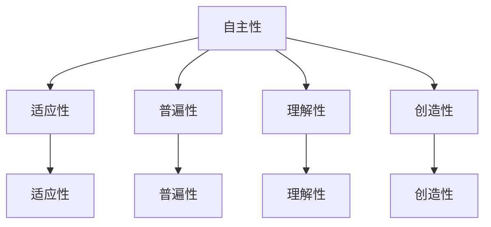
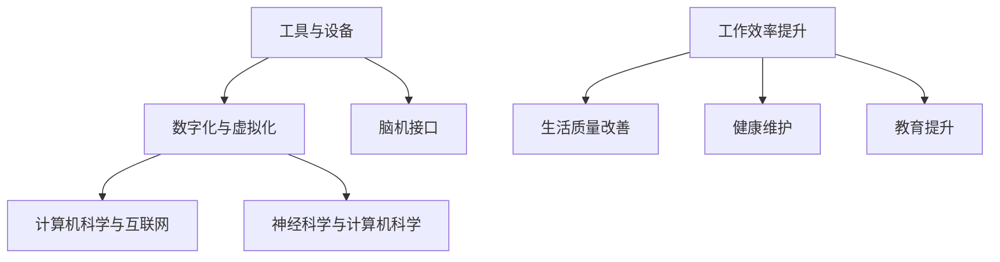
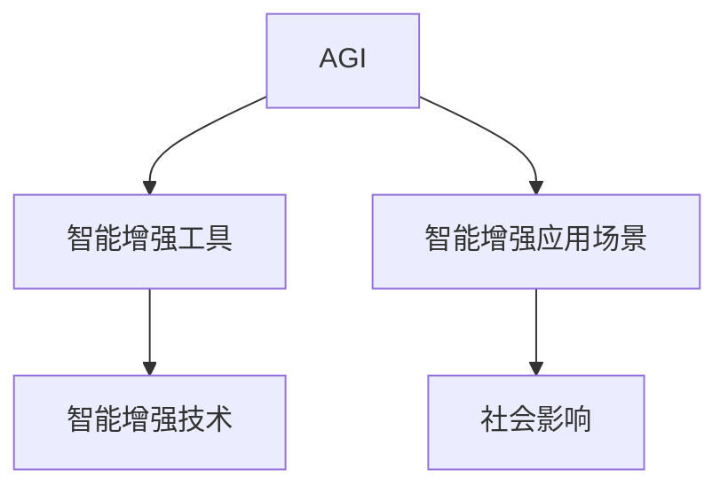
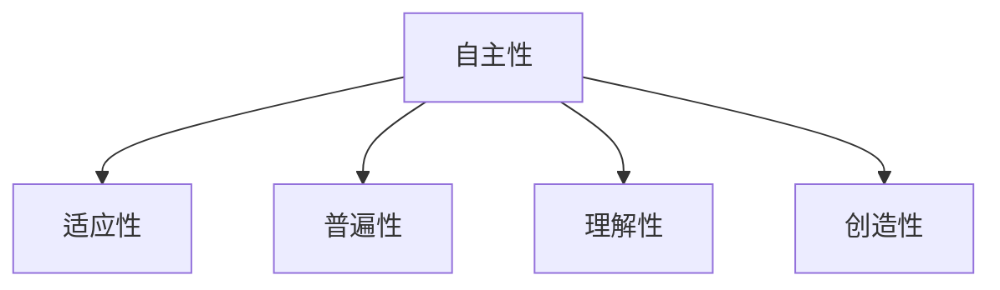
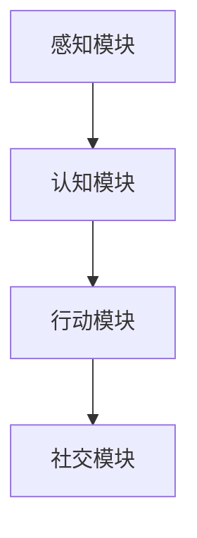
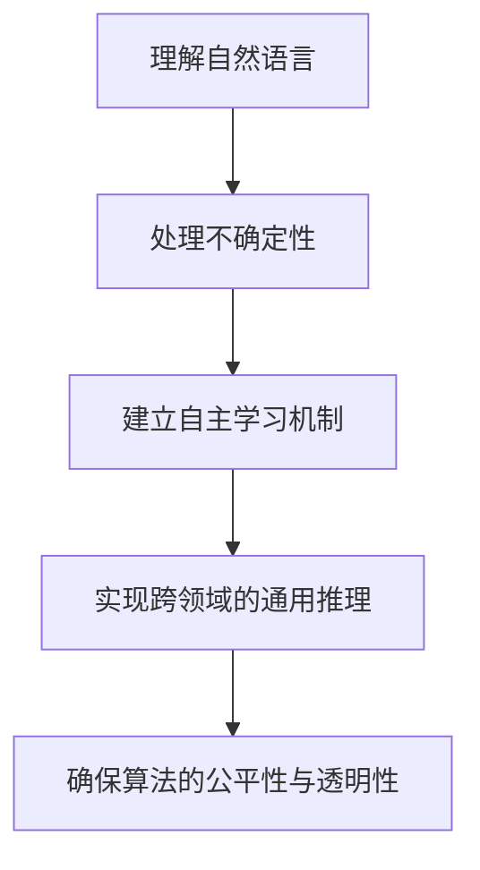

                 

### AGI与人类智能增强的协同发展

#### 关键词
- 通用人工智能（AGI）
- 人类智能增强
- 智能协同发展
- 技术原理
- 实际应用
- 未来展望

#### 摘要
本文旨在探讨通用人工智能（AGI）与人类智能增强的协同发展，分析两者之间的核心概念、技术原理以及实际应用。首先，文章介绍了AGI的定义与特征，以及人类智能增强的背景与需求。随后，详细探讨了AGI的核心概念与架构，包括其定义、特征、技术原理与架构，以及面临的关键技术挑战。接着，文章介绍了人类智能增强的理论与方法，包括其概念、发展历程、技术手段，以及伦理与隐私问题。在此基础上，文章分析了AGI与人类智能增强的协同发展，探讨了其理论基础、应用场景以及社会影响。随后，文章介绍了智能增强技术在教育、医疗、工业等领域的实际应用，并展望了AGI与人类智能增强的未来发展趋势。最后，通过具体案例分析，进一步探讨了智能增强技术的实际应用与挑战，为未来的研究与实践提供了有益的参考。

## 第1章：引论

### 1.1.1 人工智能与通用人工智能（AGI）

#### 背景介绍

人工智能（AI）是计算机科学的一个分支，旨在使机器能够执行通常需要人类智能才能完成的任务。自20世纪50年代以来，人工智能领域经历了多个发展阶段，从早期的符号主义、连接主义到现代的深度学习与强化学习。尽管取得了显著的进展，但当前的人工智能主要还是基于特定任务的算法，即所谓的弱人工智能（Narrow AI）。这种AI系统在特定领域表现出色，但缺乏人类智能的广泛适应性和灵活性。

通用人工智能（Artificial General Intelligence，AGI）则是一种更加高级的人工智能形式，它旨在实现机器具有人类智能的综合能力，包括感知、学习、推理、计划、社交互动等。AGI的目标是使机器能够理解、学习和适应各种环境和任务，而不需要针对每个任务进行专门的设计和训练。

#### 核心概念与联系

AGI的核心概念包括自主性、适应性、普遍性、理解性和创造性。自主性指的是AGI系统能够独立决策和执行任务，而不需要人类干预。适应性表示AGI系统可以适应不同的环境和情境，并能够从经验中学习和改进自身。普遍性则强调AGI系统应具备跨领域的能力，能够处理各种类型的问题。理解性是指AGI系统能够理解语言、图像和其他形式的信息，并进行有效的推理。创造性是AGI的一个重要特征，它能够进行创新性的思考和创造新的解决方案。

与弱人工智能相比，AGI的核心优势在于其广泛的适用性和自主性。弱人工智能主要针对特定任务进行优化，而AGI则试图模拟人类智能的复杂性和多样性，实现真正的智能。

#### Mermaid 流程图

下面是AGI的核心概念与联系Mermaid流程图：



### 1.1.2 人类智能增强的背景与需求

#### 背景介绍

人类智能增强（Human Intelligence Enhancement，HIE）是指通过技术手段提升人类在某些任务上的能力，从而改善生活质量和工作效率。随着科技的不断进步，人类对于提高工作效率、延长寿命、提高生活质量的需求越来越强烈。智能增强技术应运而生，为人类提供了一种新的手段来应对日益复杂的挑战。

#### 智能增强的概念与发展

智能增强的概念可以追溯到古代，当时人们通过使用工具和设备来增强自身的能力。然而，现代智能增强技术主要集中在大脑与机器之间的互动，如认知辅助系统、增强现实、虚拟现实和脑机接口等。

智能增强技术的发展经历了多个阶段。早期的智能增强技术主要依赖于物理设备和工具，如眼镜、放大镜和机械手等。随着计算机和互联网的发展，智能增强技术逐渐向数字化和虚拟化方向迈进。近年来，随着神经科学与计算机科学的融合，脑机接口技术取得了重要突破，为人类智能增强提供了新的可能性。

#### 需求分析

人类社会对智能增强的需求主要体现在以下几个方面：

1. **工作效率提升**：在现代工作环境中，人们需要处理大量的信息和任务，智能增强技术可以提供更快速、更准确的信息处理和决策支持，从而提高工作效率。
2. **生活质量改善**：随着年龄的增长，人们的认知能力和身体能力可能会下降，智能增强技术可以帮助老年人保持认知活力，提高生活质量。
3. **健康维护**：智能增强技术可以在健康管理、疾病预防和治疗方面发挥重要作用，如通过可穿戴设备和健康监测系统实现个性化健康管理和干预。
4. **教育提升**：智能增强技术可以提供个性化的学习体验，帮助学生更好地掌握知识和技能，提高学习效果。

#### 与AGI的关系

人类智能增强与AGI之间存在着紧密的联系。AGI的发展为人类智能增强提供了强大的技术支持，例如，通过AGI技术，我们可以开发出更加智能的智能增强工具，如自适应教育系统、智能医疗诊断系统等。同时，人类智能增强的应用场景也为AGI的发展提供了丰富的反馈和验证机会，有助于推动AGI技术的不断进步和完善。

#### Mermaid 流程图

下面是人类智能增强的发展阶段与需求的Mermaid流程图：



### 1.1.3 AGI与人类智能增强的关系

#### 背景介绍

AGI与人类智能增强之间的关系是相互促进的。AGI的发展为人类智能增强提供了强大的技术支持，而人类智能增强的应用场景也为AGI的发展提供了丰富的反馈和验证机会。

#### 核心关系

1. **技术互补**：AGI与人类智能增强在技术层面具有互补性。AGI提供了自主性、适应性和广泛性等核心能力，这些能力可以用于开发更加智能的智能增强工具，如智能认知辅助系统、智能健康管理系统等。而人类智能增强技术则通过认知辅助、虚拟现实、增强现实和脑机接口等方式，为AGI提供了实际的应用场景和验证机会。
2. **协同发展**：AGI与人类智能增强的协同发展意味着两者在技术、应用和市场上相互促进，共同推动人工智能和人类智能的进步。通过AGI技术的进步，我们可以开发出更加智能的智能增强工具，从而进一步提升人类的工作效率和生活质量。而人类智能增强的应用场景和需求反馈，又可以指导AGI技术的改进和创新。

#### 社会影响

AGI与人类智能增强的协同发展对社会产生了深远的影响：

1. **提高生活质量**：通过智能增强技术，人们可以更加高效地完成日常任务，延长健康寿命，提高生活质量。
2. **促进社会进步**：智能增强和AGI技术的应用可以推动教育、医疗、工业等领域的创新，促进社会进步。
3. **伦理挑战**：随着智能增强和AGI技术的发展，也带来了一系列伦理挑战，如隐私保护、算法公平性、智能增强的滥用等，需要社会各界共同关注和解决。

#### Mermaid 流程图

下面是AGI与人类智能增强的关系Mermaid流程图：



## 第2章：AGI的核心概念与架构

### 2.1.1 AGI的定义与特征

#### 背景介绍

通用人工智能（AGI）是人工智能领域的一个重要概念，它试图实现机器具有人类智能的综合能力。与弱人工智能（Narrow AI）相比，AGI具有更广泛的适应性和灵活性。弱人工智能通常针对特定任务进行优化，而AGI则旨在模拟人类智能的复杂性和多样性，实现跨领域的通用智能。

#### 定义

通用人工智能（Artificial General Intelligence，AGI）是指具有人类智能的综合能力的机器智能。它能够理解、学习、推理和适应各种环境和任务，不需要针对每个任务进行专门的设计和训练。AGI的目标是使机器能够像人类一样处理复杂的问题，具有自主性、适应性、普遍性和理解性。

#### 特征

AGI具有以下几个关键特征：

1. **自主性**：AGI系统能够独立决策和执行任务，而不需要人类干预。这意味着AGI系统可以在没有明确指令的情况下，自主地完成任务和解决问题。
2. **适应性**：AGI系统能够适应不同的环境和情境，并能够从经验中学习和改进自身。这种适应性使得AGI系统在不同任务和场景中都能表现出色。
3. **普遍性**：AGI系统应具备跨领域的能力，能够处理各种类型的问题。这意味着AGI系统不仅仅在特定领域表现出色，而是在多个领域都有广泛的应用。
4. **理解性**：AGI系统能够理解语言、图像和其他形式的信息，并进行有效的推理。这种理解能力使得AGI系统能够与人类进行自然的交流和协作。
5. **创造性**：AGI系统能够进行创新性的思考和创造新的解决方案。这种创造性能力使得AGI系统能够在未知的领域中进行探索和发现。

#### 与人类智能的对比

AGI与人类智能在许多方面有相似之处，但也存在一些显著的区别：

1. **知识获取**：人类智能通过经验、教育和学习获取知识，而AGI则依赖于数据和算法进行学习和推理。
2. **情感与意识**：人类智能具有情感和意识，而AGI目前还没有实现情感和意识的模拟。
3. **自主学习**：人类智能具有自主学习的特点，AGI也试图实现自主学习和适应能力，但目前在某些方面（如情感理解和创造力）仍有待改进。

#### Mermaid 流程图

下面是AGI的核心特征Mermaid流程图：



### 2.1.2 AGI的技术原理与架构

#### 背景介绍

AGI的技术原理涉及多个领域的交叉，包括认知科学、神经科学、机器学习、自然语言处理等。要实现真正的通用人工智能，需要构建一个复杂的系统架构，该架构能够在不同模块之间实现有效的协作和协调。

#### 技术原理

AGI的技术原理主要包括以下几个方面：

1. **认知模拟**：认知模拟是指通过计算机科学和认知科学的方法，模拟人类大脑的认知过程，如感知、记忆、学习、推理等。认知模拟技术可以帮助我们理解人类智能的运作机制，从而为AGI的设计提供理论基础。
2. **机器学习**：机器学习是AGI的核心技术之一，通过训练大量的数据和算法，使机器能够自主地学习和改进。机器学习包括监督学习、无监督学习和强化学习等多种方法，这些方法可以帮助AGI系统在不同的任务和场景中表现出色。
3. **自然语言处理**：自然语言处理（Natural Language Processing，NLP）是AGI的重要组成部分，它使机器能够理解、生成和处理自然语言。NLP技术包括词性标注、句法分析、语义分析和语言生成等，这些技术在人机交互、智能助手和智能翻译等方面有广泛的应用。
4. **神经网络**：神经网络是机器学习的一种重要模型，它通过模拟生物神经元的连接方式，实现数据的高效处理和模式识别。深度神经网络（Deep Neural Network，DNN）和卷积神经网络（Convolutional Neural Network，CNN）等模型在图像识别、语音识别和自然语言处理等方面取得了显著的成果。

#### 架构

AGI的架构通常包括以下几个关键模块：

1. **感知模块**：感知模块负责接收和处理外部信息，如视觉、听觉和触觉等。通过感知模块，AGI系统能够感知和理解环境。
2. **认知模块**：认知模块负责处理感知模块获取的信息，进行推理、学习和决策。认知模块包括记忆、注意力、思维和语言等子模块。
3. **行动模块**：行动模块负责根据认知模块的决策，执行相应的行动。行动模块可以控制机器人的运动、机器的操作等。
4. **社交模块**：社交模块负责处理社交互动，如语言交流、情感表达和协作等。社交模块可以帮助AGI系统与人类建立有效的沟通和协作关系。

#### Mermaid 流程图

下面是AGI的技术原理与架构Mermaid流程图：



### 2.1.3 AGI的关键技术挑战

#### 背景介绍

尽管AGI在理论和技术上取得了一定的进展，但要实现真正的通用人工智能，仍面临着诸多技术挑战。这些挑战涉及到算法、计算能力、数据质量等多个方面，需要科研人员、工程师和各界人士共同努力。

#### 挑战1：理解自然语言

自然语言处理是AGI的一个重要组成部分，但目前的自然语言处理技术仍然存在许多挑战。例如，语言的多义性、语境的复杂性以及语言中的情感色彩等，都给自然语言处理带来了巨大的困难。要实现AGI，必须解决这些挑战，使机器能够真正理解自然语言，并能够与人类进行自然的交流。

#### 挑战2：处理不确定性

人类智能的一个重要特征是能够处理不确定性。在现实世界中，很多情况都是不确定的，需要人类智能进行推理和决策。AGI要实现真正的通用智能，必须具备处理不确定性的能力。这需要开发新的算法和模型，使机器能够在不确定的环境中做出合理的决策。

#### 挑战3：建立自主学习机制

自主学习是AGI的一个重要特征，但目前的机器学习技术主要依赖于大量数据的训练，缺乏自主学习的机制。要实现AGI，必须开发出能够自主学习和适应的算法和模型，使机器能够在没有人类干预的情况下，不断学习和改进自身。

#### 挑战4：实现跨领域的通用推理

AGI的目标是实现跨领域的通用推理能力，但目前的人工智能系统主要还是在特定领域表现出色。要实现真正的通用推理，需要开发出能够处理多种类型问题的算法和模型，使机器能够在不同领域之间进行有效的推理和迁移学习。

#### 挑战5：确保算法的公平性与透明性

随着人工智能技术的应用日益广泛，算法的公平性和透明性成为一个重要的社会问题。要实现AGI，必须确保算法的公平性和透明性，避免算法偏见和歧视，确保技术能够为社会带来积极的影响。

#### Mermaid 流�程图

下面是AGI的关键技术挑战Mermaid流程图：



## 第3章：人类智能增强的理论与方法

### 3.1.1 智能增强的概念与发展

#### 背景介绍

人类智能增强（Human Intelligence Enhancement，HIE）是指通过技术手段提升人类在某些任务上的能力，从而改善生活质量和工作效率。智能增强技术的发展可以追溯到古代，当时人们通过使用工具和设备来增强自身的能力。然而，现代智能增强技术主要集中在大脑与机器之间的互动，如认知辅助系统、增强现实、虚拟现实和脑机接口等。

#### 概念

智能增强的概念可以定义为通过技术手段提升人类在某些任务上的能力，使其能够更加高效、准确和灵活地完成这些任务。智能增强技术包括但不限于以下几种：

1. **认知辅助系统**：通过计算机程序和算法，帮助人们提高认知能力，如记忆、推理、决策等。
2. **增强现实（AR）**：通过虚拟现实技术，将虚拟信息叠加到现实世界中，提供更加丰富的交互体验。
3. **虚拟现实（VR）**：通过虚拟环境，提供身临其境的体验，帮助人们进行训练和模拟。
4. **脑机接口（BMI）**：通过直接连接大脑和机器，实现人类意识和机器之间的交互。

#### 发展历程

智能增强技术的发展可以分为以下几个阶段：

1. **物理辅助阶段**：最早的智能增强技术主要依赖于物理设备和工具，如眼镜、放大镜、机械手等。这些设备通过物理手段帮助人们提高某些能力。
2. **数字化与虚拟化阶段**：随着计算机和互联网的发展，智能增强技术逐渐向数字化和虚拟化方向迈进。人们开始使用计算机程序和算法来模拟和增强认知功能。
3. **生物电子阶段**：近年来，随着神经科学与计算机科学的融合，智能增强技术开始向生物电子方向发展。脑机接口技术取得了重要突破，为人类智能增强提供了新的可能性。

#### 与AGI的关系

智能增强与AGI之间存在着紧密的联系。AGI的发展为智能增强提供了强大的技术支持，例如，通过AGI技术，我们可以开发出更加智能的智能增强工具，如自适应认知辅助系统、智能健康管理系统等。同时，智能增强的应用场景也为AGI的发展提供了丰富的反馈和验证机会，有助于推动AGI技术的不断进步和完善。

### 3.1.2 人类智能增强的技术手段

#### 认知辅助系统

认知辅助系统是通过计算机程序和算法，帮助人们提高认知能力的技术手段。常见的认知辅助系统包括：

1. **记忆辅助工具**：如电子记事本、智能提醒应用等，可以帮助人们更好地管理和回忆信息。
2. **推理辅助工具**：如逻辑推理软件、决策支持系统等，可以帮助人们进行复杂的推理和决策。
3. **注意力提升工具**：如专注力训练应用、时间管理工具等，可以帮助人们提高注意力和工作效率。

#### 增强现实（AR）

增强现实技术通过虚拟现实技术，将虚拟信息叠加到现实世界中，提供更加丰富的交互体验。常见的应用场景包括：

1. **教育**：如虚拟实验室、互动教学等，可以提供更加生动、直观的学习体验。
2. **医疗**：如手术指导、康复训练等，可以提供更加精准、个性化的医疗服务。
3. **娱乐**：如虚拟游戏、互动电影等，可以提供更加沉浸式的娱乐体验。

#### 虚拟现实（VR）

虚拟现实技术通过虚拟环境，提供身临其境的体验，帮助人们进行训练和模拟。常见的应用场景包括：

1. **军事训练**：如模拟战斗、战术演练等，可以提供真实感强的训练体验。
2. **职业培训**：如模拟驾驶、机械操作等，可以提供安全、高效的培训环境。
3. **心理治疗**：如虚拟现实疗法，可以帮助治疗恐惧症、焦虑症等心理问题。

#### 脑机接口（BMI）

脑机接口技术通过直接连接大脑和机器，实现人类意识和机器之间的交互。常见的应用场景包括：

1. **残疾人辅助**：如轮椅控制、假肢控制等，可以帮助残疾人恢复部分功能。
2. **健康监测**：如脑波监测、心电监测等，可以实时监测身体状况，提供个性化的健康建议。
3. **意识控制**：如脑波解码、思维控制等，可以探索人类意识与机器之间的深层次交互。

#### 智能穿戴设备

智能穿戴设备是一种集成了传感器、计算单元和通信模块的可穿戴设备，可以实时监测和收集人体数据。常见的智能穿戴设备包括：

1. **健康监测设备**：如智能手环、智能手表等，可以监测心率、血压、睡眠质量等生理指标。
2. **运动监测设备**：如智能运动鞋、智能跳绳等，可以记录运动数据，提供运动建议。
3. **辅助沟通设备**：如实时翻译耳塞、智能助听器等，可以帮助听力障碍者进行沟通。

### 3.1.3 智能增强伦理与隐私问题

#### 伦理问题

智能增强技术的发展带来了一系列伦理问题，主要包括：

1. **隐私保护**：智能增强技术依赖于大量的个人数据，如健康数据、行为数据等。如何保护这些数据的隐私，避免数据滥用和泄露，是一个重要的伦理问题。
2. **公平性**：智能增强技术可能加剧社会不平等，使富裕人群更容易获得智能增强，而贫困人群则难以承受。如何确保智能增强技术的公平性，避免加剧社会不平等，是一个重要的伦理问题。
3. **依赖性**：随着智能增强技术的普及，人们可能对智能增强产生依赖，导致自身能力的退化。如何平衡智能增强与人类自身能力的发展，避免过度依赖，是一个重要的伦理问题。

#### 隐私问题

智能增强技术的隐私问题主要体现在以下几个方面：

1. **数据收集与使用**：智能增强技术需要大量的个人数据，如健康数据、行为数据等。如何合法、合规地收集和使用这些数据，避免数据滥用和泄露，是一个重要的隐私问题。
2. **数据安全**：智能增强技术涉及到的数据量大、敏感度高，如何确保这些数据的安全，防止黑客攻击和数据泄露，是一个重要的隐私问题。
3. **数据透明性**：智能增强技术的数据收集和使用过程可能不够透明，用户不清楚自己的数据被如何使用。如何提高数据的透明性，让用户了解自己的数据被如何使用，是一个重要的隐私问题。

#### 解决方案

为了解决智能增强伦理与隐私问题，可以从以下几个方面进行：

1. **法律法规**：建立健全的法律法规，明确智能增强技术的隐私保护要求，规范数据收集、存储、使用和共享行为。
2. **技术手段**：采用加密技术、匿名化技术等，提高数据的安全性和隐私保护水平。
3. **用户教育**：加强对用户的隐私教育和培训，提高用户的隐私保护意识，让用户更好地了解和掌控自己的数据。
4. **社会责任**：智能增强技术的研发和应用主体应承担起社会责任，遵循伦理原则，确保技术的正当性和公平性。

### 3.1.4 智能增强技术的未来发展趋势

#### 技术创新

随着科技的不断进步，智能增强技术将在多个领域实现重大突破，包括：

1. **脑机接口**：脑机接口技术将变得更加成熟和可靠，实现更高精度、更低延迟的脑机交互。
2. **增强现实与虚拟现实**：增强现实与虚拟现实技术将更加普及和成熟，提供更加真实、沉浸式的体验。
3. **人工智能**：人工智能技术将更加智能和自适应，为智能增强提供更强大的支持。

#### 应用扩展

智能增强技术将在更多领域得到应用，包括：

1. **教育**：智能增强教育将更加普及，提供个性化、互动式的学习体验。
2. **医疗**：智能增强医疗将实现精准诊断、个性化治疗，提高医疗质量。
3. **工业**：智能增强工业将提高生产效率、降低成本，实现智能化生产。

#### 社会融合

智能增强技术将更加深入地融入社会生活，成为人们日常生活的一部分，包括：

1. **智能家居**：智能增强家居将提供更加便捷、舒适的生活环境。
2. **智能交通**：智能增强交通将提高交通安全、降低交通拥堵。
3. **智能城市**：智能增强城市将实现智能化管理、提高城市生活质量。

### 3.1.5 最佳实践与注意事项

#### 最佳实践

为了确保智能增强技术的有效和安全，以下最佳实践值得注意：

1. **数据保护**：确保数据的安全性和隐私保护，采用加密、匿名化等技术手段。
2. **用户参与**：在智能增强技术的研发和应用过程中，充分考虑用户的反馈和需求，提高用户的参与度和满意度。
3. **伦理审查**：对智能增强技术进行伦理审查，确保技术的正当性和公平性。
4. **持续更新**：不断更新智能增强技术的算法和模型，提高技术的性能和适应性。

#### 注意事项

在使用智能增强技术时，需要注意以下事项：

1. **技术依赖**：避免过度依赖智能增强技术，保持人类自身的独立思考能力。
2. **数据质量**：确保数据的质量和准确性，避免数据错误和偏差。
3. **安全风险**：注意智能增强技术的安全风险，防止黑客攻击和数据泄露。
4. **隐私保护**：加强对用户隐私的保护，避免隐私泄露和数据滥用。

## 第4章：AGI与人类智能增强的协同发展

### 4.1.1 协同发展的理论基础

#### 背景介绍

通用人工智能（AGI）与人类智能增强的协同发展是基于两者之间的互补性和协同性。AGI的发展为人类智能增强提供了强大的技术支持，而人类智能增强的应用场景也为AGI的发展提供了丰富的反馈和验证机会。这种协同发展不仅有助于推动人工智能技术的进步，还能够改善人类的生活质量和工作效率。

#### 核心概念

协同发展是指AGI与人类智能增强在技术、应用和市场等方面相互促进、共同发展的过程。其核心概念包括：

1. **技术互补**：AGI与人类智能增强在技术层面具有互补性。AGI提供了自主性、适应性、普遍性和理解性等核心能力，这些能力可以用于开发更加智能的智能增强工具。而人类智能增强技术则通过认知辅助、增强现实、虚拟现实和脑机接口等方式，为AGI提供了实际的应用场景和验证机会。
2. **协同创新**：AGI与人类智能增强在协同发展的过程中，通过合作和创新，共同解决技术难题和实际应用问题，实现技术的突破和应用的拓展。
3. **市场互动**：AGI与人类智能增强在市场上的互动，包括产品竞争、合作共赢和用户需求反馈，促进了两者的发展和完善。

#### 协同发展的理论基础

AGI与人类智能增强的协同发展理论基础主要包括以下几个方面：

1. **系统论**：系统论认为，一个复杂系统的发展是由其内部各要素之间的相互作用和协同作用决定的。AGI与人类智能增强作为复杂系统中的两个重要组成部分，通过协同发展，实现整体性能的提升。
2. **创新理论**：创新理论指出，技术创新和社会需求是推动技术发展的重要动力。AGI与人类智能增强的协同发展，正是通过技术创新满足社会需求，实现共同进步。
3. **协同进化理论**：协同进化理论认为，不同物种或技术体系在相互作用和竞争中，通过协同进化，实现共同发展。AGI与人类智能增强的协同发展，也是通过协同进化，实现技术的不断进步和应用拓展。

### 4.1.2 协同发展的应用场景

#### 教育领域

在教育领域，AGI与人类智能增强的协同发展具有重要意义。AGI技术可以为教育提供个性化的学习体验，通过分析学生的学习习惯、兴趣和能力，制定个性化的学习计划和教学策略。而人类智能增强技术，如虚拟现实、增强现实和认知辅助系统，可以为学生提供更加生动、直观的学习场景，提高学习效果。

1. **个性化教育**：AGI技术可以分析学生的数据，了解其学习偏好和需求，制定个性化的学习计划和教学策略。例如，智能教育平台可以根据学生的学习进度、兴趣和能力，推荐合适的学习资源和课程。
2. **虚拟实验室**：通过虚拟现实技术，学生可以在虚拟环境中进行实验和操作，提高实验效果和安全性。例如，医学专业学生可以通过虚拟手术模拟系统，进行手术技巧的练习。
3. **认知辅助**：认知辅助系统可以为学生提供实时帮助，如智能辅导系统可以根据学生的学习进度和理解程度，提供相应的解答和指导。

#### 医疗领域

在医疗领域，AGI与人类智能增强的协同发展带来了革命性的变革。AGI技术可以提供精准的诊断和治疗建议，而人类智能增强技术可以提升医生的工作效率和医疗质量。

1. **智能诊断**：AGI技术可以分析大量的医疗数据，如病历、影像等，提供精准的诊断和治疗建议。例如，智能医疗诊断系统可以通过分析CT图像，自动检测和诊断癌症。
2. **手术辅助**：通过虚拟现实和增强现实技术，医生可以在虚拟环境中进行手术模拟和规划，提高手术的成功率和安全性。例如，外科医生可以通过虚拟手术导航系统，实时了解手术器械的位置和路径。
3. **认知辅助**：认知辅助系统可以帮助医生提高工作效率，如智能病历管理系统可以根据医生的病历记录，自动生成诊断报告和治疗方案。

#### 工业领域

在工业领域，AGI与人类智能增强的协同发展可以提高生产效率、降低成本和提升产品质量。

1. **智能制造**：AGI技术可以实现智能化生产，通过数据分析、预测和优化，提高生产效率和质量。例如，智能工业机器人可以通过实时数据分析，自动调整生产参数，提高生产效率。
2. **远程控制**：通过增强现实技术，工人可以在远程环境中进行设备的维护和操作，提高工作效率和安全性。例如，远程维修系统可以让工程师在虚拟环境中进行设备的检查和维修。
3. **认知辅助**：认知辅助系统可以提供实时的工作指导和帮助，如智能生产监控系统可以根据设备状态和生产线数据，提供相应的操作建议和故障排除指导。

#### 社会服务领域

在社会服务领域，AGI与人类智能增强的协同发展可以提升服务质量和用户体验。

1. **智能客服**：通过人工智能和增强现实技术，客服系统可以提供更加智能和人性化的服务。例如，智能客服系统可以通过自然语言处理技术，理解用户的意图和需求，提供相应的解决方案。
2. **智能城市**：通过AGI技术，可以实现智能交通、智能环保、智能安防等，提高城市管理水平和居民生活质量。例如，智能交通系统可以通过实时数据分析，优化交通流量，减少拥堵和事故。
3. **健康监测**：通过脑机接口和智能穿戴设备，可以实现实时健康监测和预警。例如，智能健康监测系统可以通过监测心率、血压等生理指标，提供个性化的健康建议和干预措施。

### 4.1.3 协同发展的社会影响

#### 经济影响

AGI与人类智能增强的协同发展将推动经济结构的变革和产业升级。一方面，智能增强技术的应用可以提高生产效率和质量，降低生产成本，促进产业发展。另一方面，智能增强技术将创造新的市场和就业机会，如智能教育、智能医疗、智能工业等，推动经济增长。

1. **产业升级**：智能增强技术的应用将推动传统产业的转型升级，提高产业的技术含量和附加值。例如，智能制造可以提升工业生产效率和质量，降低生产成本，提高企业的竞争力。
2. **新兴产业发展**：智能增强技术的快速发展将带动新兴产业的发展，如人工智能产业、智能医疗产业、智能教育产业等，为经济增长提供新的动力。
3. **就业机会**：智能增强技术的应用将创造大量的就业机会，如智能系统开发、数据分析、智能设备维护等，提高就业率和收入水平。

#### 社会结构影响

AGI与人类智能增强的协同发展将对社会结构产生深远影响。一方面，智能增强技术将提高人们的生活质量和幸福感，促进社会公平。另一方面，智能增强技术可能导致社会阶层分化加剧，需要采取相应的政策措施进行调节。

1. **提高生活质量**：智能增强技术可以提供更加个性化、高效的服务和产品，满足人们的多样化需求，提高生活质量。例如，智能医疗技术可以提供精准的诊断和治疗，提高医疗服务的质量和可及性。
2. **促进社会公平**：智能增强技术可以缩小社会贫富差距，提高社会公平。例如，智能教育技术可以提供优质的教育资源，提高教育机会的公平性。
3. **阶层分化**：智能增强技术可能导致社会阶层分化加剧。一方面，富裕人群更容易获得智能增强技术，提高生活质量和工作效率。另一方面，贫困人群由于缺乏资源和机会，难以享受智能增强技术带来的好处，加剧社会不公平。

#### 文化影响

AGI与人类智能增强的协同发展将对文化产生深远影响。一方面，智能增强技术将促进文化的传承和创新，推动文化产业发展。另一方面，智能增强技术可能导致文化同质化，削弱文化多样性。

1. **文化传承**：智能增强技术可以提供更加生动、直观的文化体验，促进文化的传承。例如，虚拟现实技术可以模拟古代文明和历史场景，让用户身临其境感受历史文化。
2. **文化创新**：智能增强技术可以激发文化创新，推动文化产业发展。例如，智能增强游戏可以提供新颖、有趣的游戏体验，推动游戏产业的发展。
3. **文化同质化**：智能增强技术可能导致文化同质化，削弱文化多样性。例如，智能增强技术可能使不同文化之间的差异变得更加模糊，导致文化融合。

#### 道德与伦理影响

AGI与人类智能增强的协同发展将带来一系列道德与伦理问题，需要社会和科技界共同关注和解决。

1. **隐私保护**：智能增强技术涉及大量的个人数据，如何保护用户隐私，避免数据滥用和泄露，是一个重要的道德与伦理问题。
2. **公平性**：智能增强技术可能导致社会不公平，如何确保技术的公平性，避免加剧社会不平等，是一个重要的道德与伦理问题。
3. **依赖性**：智能增强技术可能导致人类对技术产生依赖，削弱人类自身的独立思考能力，如何平衡智能增强与人类自身能力的发展，是一个重要的道德与伦理问题。

### 4.1.4 协同发展的未来展望

#### 技术创新

随着科技的不断进步，AGI与人类智能增强的协同发展将在技术创新方面取得重大突破。未来，我们可能看到以下创新：

1. **更智能的智能增强工具**：通过深度学习和强化学习等技术，智能增强工具将变得更加智能和自适应，能够更好地满足用户的需求。
2. **更高级的脑机接口**：脑机接口技术将实现更高精度、更低延迟的脑机交互，使人类与机器之间的交互更加自然和高效。
3. **更丰富的虚拟现实和增强现实体验**：通过虚拟现实和增强现实技术，人类将能够体验到更加真实、沉浸式的虚拟环境，拓宽人类的生活和思维方式。

#### 应用拓展

未来，AGI与人类智能增强的协同发展将在更多领域得到应用，推动社会进步和人类发展：

1. **智慧医疗**：智能医疗技术将实现精准诊断、个性化治疗，提高医疗质量和可及性，改善人类健康水平。
2. **智慧教育**：智能教育技术将实现个性化学习、智慧教学，提高教育质量和教育公平，培养更多创新型人才。
3. **智慧工业**：智能工业技术将实现智能化生产、智慧供应链，提高生产效率和质量，推动产业升级和经济发展。

#### 社会变革

AGI与人类智能增强的协同发展将引发深刻的社会变革，影响人类的生活方式和社会结构：

1. **智慧城市**：智能城市将实现智慧交通、智慧环保、智慧安防等功能，提高城市管理效率和居民生活质量。
2. **智慧社会**：智慧社会将实现智慧政府、智慧社区、智慧家庭等功能，提高社会治理水平和公共服务质量。
3. **数字伦理**：随着智能增强技术的普及，数字伦理将成为一个重要议题，需要制定相应的法律法规和伦理规范，确保技术发展的正当性和公平性。

### 4.1.5 案例分析

为了更好地理解AGI与人类智能增强的协同发展，我们可以通过以下案例分析：

#### 案例一：智能教育系统

智能教育系统是一种基于AGI和智能增强技术的教育平台，通过分析学生的学习行为和需求，提供个性化的学习建议和资源。例如，一个智能教育系统可以通过分析学生的学习数据，了解其学习偏好、知识点掌握情况和学习习惯，然后根据这些数据为每个学生制定个性化的学习计划和教学策略。此外，智能教育系统还可以通过虚拟现实和增强现实技术，为学生提供生动、直观的学习体验，提高学习效果。

1. **技术原理**：智能教育系统结合了AGI和智能增强技术，通过机器学习和自然语言处理技术分析学生的学习行为和需求，提供个性化的学习建议和资源。同时，通过虚拟现实和增强现实技术，提供沉浸式的学习体验。
2. **应用场景**：智能教育系统可以应用于在线教育、教育游戏、虚拟实验室等多个场景，为学生提供个性化、互动式的学习体验，提高学习效果。
3. **社会影响**：智能教育系统有助于提高教育质量和教育公平，缩小城乡教育差距，培养更多创新型人才。

#### 案例二：智能医疗诊断系统

智能医疗诊断系统是一种基于AGI和智能增强技术的医疗诊断工具，通过分析大量的医疗数据和图像，提供精准的诊断和治疗方案。例如，一个智能医疗诊断系统可以通过分析患者的病史、影像资料和实验室检查结果，自动识别和诊断疾病，并提供相应的治疗方案。此外，智能医疗诊断系统还可以通过增强现实技术，为医生提供手术导航和辅助，提高手术的成功率和安全性。

1. **技术原理**：智能医疗诊断系统结合了AGI和智能增强技术，通过机器学习和深度学习技术分析大量的医疗数据和图像，提供精准的诊断和治疗方案。同时，通过增强现实技术，为医生提供手术导航和辅助。
2. **应用场景**：智能医疗诊断系统可以应用于医院、诊所、医学研究等多个场景，为医生提供辅助诊断和治疗方案，提高医疗质量和效率。
3. **社会影响**：智能医疗诊断系统有助于提高医疗质量和医疗可及性，降低误诊率和漏诊率，提高患者生存率和生活质量。

#### 案例三：智能工业自动化系统

智能工业自动化系统是一种基于AGI和智能增强技术的工业自动化解决方案，通过数据分析、预测和优化，提高生产效率和质量。例如，一个智能工业自动化系统可以通过分析生产数据，自动调整生产参数，优化生产流程，提高生产效率。此外，智能工业自动化系统还可以通过增强现实技术，为工人提供智能化的操作指导和帮助，提高工作效率和安全性。

1. **技术原理**：智能工业自动化系统结合了AGI和智能增强技术，通过机器学习和数据分析技术，实现生产数据的自动分析和优化。同时，通过增强现实技术，为工人提供智能化的操作指导和帮助。
2. **应用场景**：智能工业自动化系统可以应用于制造业、物流业、建筑业等多个场景，实现智能化生产、智能物流和智能建造，提高生产效率和质量。
3. **社会影响**：智能工业自动化系统有助于提高工业生产效率和产品质量，降低生产成本，促进产业升级和经济发展。

### 4.1.6 挑战与对策

尽管AGI与人类智能增强的协同发展带来了巨大的机遇，但同时也面临着一系列挑战。以下是对这些挑战的分析以及相应的对策建议：

#### 技术挑战

1. **算法复杂性**：实现真正的通用人工智能需要复杂的算法和模型，目前的人工智能技术尚未能够完全满足这一需求。对策：加强基础研究，发展新的算法和模型，如基于深度学习的混合模型、神经符号推理等。
2. **数据质量和数量**：智能增强和应用场景的拓展需要大量的高质量数据，但数据获取和处理的难度较高。对策：建立健全的数据治理体系，提高数据质量和安全性，促进数据共享和开放。
3. **计算能力**：实现AGI需要强大的计算能力，目前的计算资源可能无法满足这一需求。对策：发展新型计算技术，如量子计算、边缘计算等，提高计算能力和效率。

#### 社会挑战

1. **隐私保护**：智能增强技术涉及大量的个人数据，隐私保护成为重要的社会问题。对策：制定严格的隐私保护法律法规，加强数据监管，提高公众的隐私保护意识。
2. **伦理和道德**：智能增强技术可能引发一系列伦理和道德问题，如算法偏见、技术依赖等。对策：建立伦理和道德委员会，制定相应的伦理准则，加强对智能增强技术的伦理审查。
3. **社会公平**：智能增强技术可能导致社会不公平，加剧贫富差距。对策：制定公平的智能增强政策，确保技术的普及和应用不会加剧社会不平等。

### 4.1.7 深入讨论

为了深入探讨AGI与人类智能增强的协同发展，我们可以从以下几个方面进行：

1. **技术融合**：探讨AGI与人类智能增强技术的融合路径和策略，如如何将机器学习和脑机接口技术相结合，实现更高效的智能增强。
2. **应用创新**：探讨AGI与人类智能增强在各个领域的创新应用，如如何利用智能增强技术改善医疗诊断、教育质量、工业生产等。
3. **社会影响**：探讨AGI与人类智能增强对社会结构和文化的深远影响，如如何应对智能增强带来的伦理、隐私和社会公平等问题。
4. **国际合作**：探讨全球范围内的AGI与人类智能增强研究的合作模式和国际标准，如如何加强各国在智能增强领域的合作，推动技术的全球发展。

## 第5章：智能增强技术的实际应用

### 5.1.1 教育领域的智能增强

#### 背景介绍

教育领域是智能增强技术的重要应用场景之一。随着人工智能技术的不断发展，智能增强教育已经成为教育改革的重要方向。通过智能增强技术，教育可以变得更加个性化和高效，从而提高学习效果和学生的综合素质。

#### 技术应用

1. **个性化学习系统**：智能增强教育系统通过收集和分析学生的学习行为、兴趣和能力，为每个学生提供个性化的学习建议和资源。例如，智能学习平台可以根据学生的学习进度和知识点掌握情况，自动生成个性化的学习路径和练习题。
2. **虚拟实验室**：虚拟实验室是一种通过虚拟现实（VR）技术创建的模拟实验环境。学生可以在虚拟实验室中进行各种实验操作，提高实验技能和理解力。例如，医学专业的学生可以通过虚拟实验室进行人体解剖和手术操作。
3. **智能辅导系统**：智能辅导系统利用自然语言处理和机器学习技术，为学生提供实时辅导和解答问题。例如，智能辅导机器人可以通过聊天对话，帮助学生解决学习中的难题。
4. **在线教育平台**：在线教育平台结合了智能增强技术，提供灵活、便捷的学习方式。学生可以随时随地通过在线平台学习，并与其他学生和教师进行互动。

#### 应用案例

1. **可汗学院**：可汗学院是一家提供免费在线教育的非营利组织，它利用智能增强技术，为学生提供个性化的学习资源和辅导。学生可以根据自己的学习进度和需求，选择合适的学习内容和练习题。
2. **麻省理工学院开放课程（MIT OpenCourseWare）**：麻省理工学院开放课程项目提供了大量的在线课程资源，学生可以通过在线平台免费学习。智能增强技术被用于优化课程内容和学习体验。
3. **Coursera**：Coursera是一个在线学习平台，提供由全球顶尖大学和机构提供的在线课程。智能增强技术被用于提供个性化学习建议、自动评估和反馈等。

#### 效果评估

智能增强教育技术在教育领域取得了显著的成效：

1. **提高学习效果**：通过个性化学习和智能辅导，学生的学习效果得到显著提升。研究表明，个性化学习系统可以提高学习效果，尤其是对于学习困难的学生。
2. **增加学习兴趣**：智能增强教育系统提供了丰富多样的学习资源和互动方式，增强了学生的学习兴趣和参与度。
3. **提高教育公平**：智能增强教育技术可以打破教育资源的地域限制，使偏远地区的学生也能享受到优质的教育资源，提高教育公平。

### 5.1.2 医疗领域的智能增强

#### 背景介绍

医疗领域是智能增强技术的重要应用场景之一。随着人工智能和大数据技术的发展，智能增强医疗已经成为医疗领域的重要发展方向。通过智能增强技术，医疗诊断、治疗和康复等过程可以变得更加精准、高效和个性化。

#### 技术应用

1. **智能诊断系统**：智能诊断系统利用人工智能算法，对医学影像、病例数据和实验室检测结果进行分析，提供精准的诊断建议。例如，智能医疗诊断系统可以通过分析CT扫描图像，自动检测和诊断癌症。
2. **智能治疗规划**：智能治疗规划系统根据患者的病情和个体差异，提供个性化的治疗方案。例如，智能放疗系统可以根据患者的肿瘤位置和形状，优化放疗计划，提高治疗效果。
3. **智能康复系统**：智能康复系统利用虚拟现实和增强现实技术，为患者提供个性化的康复训练。例如，智能康复系统可以帮助患者进行术后康复训练，提高康复效果。
4. **智能药物研发**：智能药物研发系统通过人工智能算法，分析大量的生物数据和化学结构，加速新药的研发过程。

#### 应用案例

1. **智能病理诊断系统**：一些医院已经引进了智能病理诊断系统，通过深度学习算法，自动分析和诊断病理切片。这有助于提高病理诊断的准确性和效率。
2. **智能肿瘤治疗系统**：例如，智能放疗系统通过精准的放疗计划，提高了肿瘤治疗的疗效和安全性。
3. **智能健康管理系统**：一些智能健康管理系统结合了智能诊断、治疗规划和康复训练等功能，提供全方位的健康管理服务。

#### 效果评估

智能增强医疗技术在医疗领域取得了显著的效果：

1. **提高诊断准确率**：智能诊断系统通过分析大量的医学数据和图像，提供了更加精准的诊断建议，有助于降低误诊率。
2. **提高治疗效果**：智能治疗规划系统根据患者的个体差异，提供了个性化的治疗方案，提高了治疗效果和患者满意度。
3. **降低医疗成本**：智能增强医疗技术可以通过优化医疗流程和提高医疗效率，降低医疗成本。
4. **改善患者体验**：智能康复系统和虚拟现实技术提供了更加舒适和有效的康复训练，提高了患者的康复效果和满意度。

### 5.1.3 工业生产领域的智能增强

#### 背景介绍

工业生产领域是智能增强技术的另一个重要应用场景。随着智能制造和工业4.0的发展，智能增强技术已经成为提升工业生产效率和质量的关键手段。通过智能增强技术，工业生产可以变得更加自动化、高效和灵活。

#### 技术应用

1. **智能监控系统**：智能监控系统通过物联网和人工智能技术，实时监测生产设备和生产过程，提供故障预警和优化建议。例如，智能监控系统可以通过分析设备数据，预测设备故障，提前进行维护，减少停机时间。
2. **智能质量控制系统**：智能质量控制系统利用人工智能算法，对生产过程中的产品质量进行实时检测和评估。例如，智能质量控制系统可以通过图像识别技术，自动检测产品缺陷，提高产品质量。
3. **智能物流系统**：智能物流系统通过物联网和机器人技术，实现生产物料的自动化运输和配送。例如，智能物流系统可以自动调度机器人，实现生产车间内部的自动化运输。
4. **智能生产规划系统**：智能生产规划系统利用人工智能算法，优化生产计划和资源分配，提高生产效率。例如，智能生产规划系统可以根据订单需求、库存情况和设备状态，自动生成最优的生产计划。

#### 应用案例

1. **智能制造工厂**：一些先进的制造企业已经建立了智能制造工厂，通过智能增强技术实现全自动化生产。例如，智能制造工厂通过智能监控系统，实时监测生产设备和生产过程，确保生产质量和效率。
2. **智能物流系统**：例如，亚马逊的智能物流中心采用了智能物流系统，通过机器人自动化运输和配送，提高了物流效率和准确性。
3. **智能生产规划系统**：一些制造企业通过智能生产规划系统，实现了生产计划和资源分配的优化，提高了生产效率和响应速度。

#### 效果评估

智能增强工业生产技术在工业领域取得了显著的效果：

1. **提高生产效率**：智能增强技术通过自动化和优化生产流程，提高了生产效率和产量。
2. **提高产品质量**：智能质量控制系统和智能监控系统可以实时监测产品质量和生产过程，提高了产品的质量和一致性。
3. **降低运营成本**：智能增强技术通过优化生产流程和资源利用，降低了生产成本和运营成本。
4. **提高灵活性和响应速度**：智能增强技术使生产过程更加灵活和可调整，提高了企业的市场响应速度和竞争力。

## 第6章：AGI与人类智能增强的未来展望

### 6.1.1 AGI与人类智能增强的未来发展趋势

随着科技的不断进步，AGI与人类智能增强在未来将会取得更多突破，并在各个领域产生深远的影响。以下是对未来发展趋势的预测：

1. **技术融合**：AGI与人类智能增强技术将更加紧密地融合，形成更加完善和强大的智能系统。例如，脑机接口技术将实现更高精度、更低延迟的交互，使人类与机器之间的融合更加自然。

2. **人工智能的普及**：随着计算能力和算法的进步，人工智能技术将更加普及，成为日常生活和工作的一部分。智能增强设备将更加便携和智能化，为人们提供更加便捷和高效的服务。

3. **个性化智能**：未来的智能系统将更加注重个性化服务，根据用户的兴趣、需求和习惯，提供定制化的解决方案。个性化智能将极大地提高生活质量和工作效率。

4. **跨领域应用**：AGI与人类智能增强技术将在更多领域得到应用，如教育、医疗、工业、农业、金融服务等，推动各行各业的智能化转型。

5. **社会融合**：智能增强技术将更加深入地融入社会生活，成为社会结构和文化的一部分。智能社会将实现智慧城市、智慧家庭、智慧交通等，提高社会管理和公共服务水平。

### 6.1.2 智能社会的建设与挑战

智能社会的建设是一个复杂的过程，涉及技术、政策、伦理等多个方面。以下是对智能社会建设的分析以及面临的挑战：

#### 技术挑战

1. **数据安全与隐私保护**：智能社会依赖大量的数据，数据安全和隐私保护成为重要挑战。如何确保数据的安全性和隐私性，防止数据泄露和滥用，是智能社会建设的关键问题。

2. **算法公平性与透明性**：智能系统依赖于算法进行决策，算法的公平性和透明性成为重要议题。如何确保算法的公平性和透明性，避免算法偏见和歧视，是智能社会建设的重要挑战。

3. **计算能力与资源分配**：随着智能系统的普及，计算能力和资源分配成为一个重要挑战。如何确保智能系统的正常运行和高效计算，是智能社会建设需要解决的问题。

#### 政策挑战

1. **法律法规**：智能社会的建设需要完善的法律法规体系，以规范智能系统的研发、应用和管理。如何制定适应智能社会发展的法律法规，是政策制定者面临的重要挑战。

2. **伦理审查**：智能社会涉及大量的伦理问题，如隐私保护、算法公平性、社会公平等。如何进行有效的伦理审查，确保智能系统的发展符合伦理原则，是政策制定者需要关注的问题。

3. **国际合作**：智能社会建设是全球性的任务，需要国际间的合作与协调。如何加强国际合作，推动全球智能社会建设，是政策制定者面临的重要挑战。

#### 社会挑战

1. **社会公平**：智能社会的建设可能加剧社会不平等，使富裕人群更容易获得智能增强技术，而贫困人群则难以享受。如何确保智能社会的发展不会加剧社会不平等，是一个重要的社会挑战。

2. **就业结构**：智能社会的建设可能导致就业结构的变化，一些传统职业可能被自动化取代，而新的职业也可能产生。如何应对就业结构的变化，确保劳动者的就业权益，是智能社会建设需要解决的问题。

3. **教育与培训**：智能社会的建设需要劳动者具备相应的技能和知识，如何进行有效的教育和培训，确保劳动者适应智能社会的发展，是一个重要的社会挑战。

### 6.1.3 人类智能增强的法律与伦理问题

#### 法律问题

1. **隐私保护**：智能增强技术的应用涉及到大量的个人数据收集和使用，隐私保护成为一个重要的法律问题。如何确保个人数据的隐私保护，防止数据滥用和泄露，是智能增强技术法律规范的重点。

2. **数据安全**：智能增强技术依赖于大量的数据，数据安全成为重要的法律问题。如何确保数据的安全存储、传输和使用，防止数据泄露和损坏，是智能增强技术法律规范的重点。

3. **责任归属**：在智能增强技术的应用过程中，如何确定责任归属是一个重要法律问题。例如，如果智能系统发生故障导致损害，如何确定责任主体，如何进行赔偿，是智能增强技术法律规范需要解决的问题。

#### 伦理问题

1. **隐私与伦理**：智能增强技术的应用可能涉及个人隐私，如何平衡隐私保护和智能增强技术的应用，是伦理问题。例如，如何确保个人数据的使用不会侵犯个人隐私，如何保护个人数据的匿名性，是智能增强技术伦理规范需要解决的问题。

2. **公平与伦理**：智能增强技术可能加剧社会不平等，使富裕人群更容易获得智能增强，而贫困人群则难以享受。如何确保智能增强技术的公平性，避免加剧社会不平等，是智能增强技术伦理规范需要解决的问题。

3. **依赖与伦理**：智能增强技术可能导致人类对技术的依赖，削弱人类自身的独立思考能力。如何平衡智能增强与人类自身能力的发展，避免过度依赖，是智能增强技术伦理规范需要解决的问题。

#### 解决方案与政策建议

为了解决人类智能增强的法律与伦理问题，可以从以下几个方面进行：

1. **法律法规**：建立健全的法律法规体系，明确智能增强技术的隐私保护、数据安全和责任归属等法律规定，为智能增强技术的合法应用提供法律保障。

2. **伦理规范**：制定智能增强技术的伦理规范，明确智能增强技术的应用原则和伦理标准，确保智能增强技术的公平、公正和道德。

3. **教育培训**：加强智能增强技术的教育培训，提高公众对智能增强技术的了解和认识，增强公众的隐私保护意识和伦理观念。

4. **国际合作**：加强国际间的合作与协调，共同制定智能增强技术的国际标准和规范，推动全球智能增强技术的发展和应用。

5. **监管机制**：建立健全的智能增强技术监管机制，加强对智能增强技术的监管，确保智能增强技术的合法、公正和道德。

### 6.1.4 未来展望

随着AGI与人类智能增强技术的不断发展，我们可以期待未来社会的显著变化：

1. **智慧生活**：智能增强技术将使生活变得更加便捷、舒适和高效。例如，智能家居系统将实现家电的智能控制，提供个性化的生活体验。

2. **智能工作**：智能增强技术将改变工作方式，提高工作效率和创造力。例如，智能助手将协助员工处理日常任务，智能监控系统将实时监控生产过程，提高生产效率和产品质量。

3. **健康监测与治疗**：智能增强医疗技术将实现精准诊断和个性化治疗，提高医疗质量和患者满意度。例如，智能健康监测系统将实时监测患者的健康状况，提供个性化的健康建议。

4. **教育创新**：智能增强教育技术将提供个性化的学习体验，提高教育质量和教育公平。例如，智能教育平台将根据学生的学习习惯和能力，提供个性化的学习资源和辅导。

5. **社会治理**：智能增强技术将提高社会治理水平，实现智慧城市和智能社区。例如，智能交通系统将优化交通流量，提高交通安全和效率。

6. **环境保护**：智能增强技术将有助于环境保护和可持续发展。例如，智能农业系统将实现精准农业，提高农产品产量和质量，减少资源浪费。

总之，AGI与人类智能增强的协同发展将带来深刻的变革，为社会带来巨大的机遇和挑战。我们需要积极应对这些挑战，制定合理的政策和规范，确保智能增强技术为人类带来福祉。

## 第7章：案例分析

### 7.1.1 案例一：智能教育系统

#### 案例背景

智能教育系统是一种基于人工智能和大数据技术的教育平台，通过分析学生的学习行为、兴趣和能力，提供个性化的学习资源和辅导。该系统旨在提高学生的学习效果和兴趣，实现个性化教育。

#### 技术实现

1. **数据收集与分析**：智能教育系统通过收集学生的学习数据，如学习时间、学习内容、考试成绩等，利用大数据分析和机器学习算法，分析学生的学习行为和兴趣。
2. **个性化学习路径**：基于数据分析结果，智能教育系统为每个学生生成个性化的学习路径和学习计划，推荐合适的学习资源和练习题。
3. **智能辅导**：系统通过自然语言处理和智能推荐技术，提供实时辅导和答疑服务，帮助学生解决学习中的问题。
4. **学习效果评估**：系统定期对学生进行学习效果评估，分析学习数据，调整学习计划和资源推荐。

#### 代码实现

以下是一个简化的智能教育系统的伪代码实现：

```python
# 数据收集与分析
def collect_and_analyze_data(student_data):
    # 收集学习数据
    # ...
    # 数据清洗和预处理
    # ...
    # 利用机器学习算法分析数据
    # ...
    # 生成学习路径和学习计划
    learning_path = generate_learning_path(student_data)
    return learning_path

# 智能辅导
def provide_intelligent_guidance(student_question):
    # 利用自然语言处理技术分析问题
    # ...
    # 提供解答和辅导
    answer = generate_answer(student_question)
    return answer

# 学习效果评估
def evaluate_learning_effect(student_data):
    # 利用学习数据进行评估
    # ...
    # 调整学习计划和资源推荐
    adjusted_learning_plan = adjust_learning_plan(student_data)
    return adjusted_learning_plan
```

#### 应用效果与分析

1. **提高学习效果**：通过个性化学习路径和学习计划，学生的学习效果得到显著提高。研究表明，个性化学习系统可以提高学习效果，尤其是对于学习困难的学生。
2. **增加学习兴趣**：智能辅导系统提供了实时解答和指导，提高了学生的学习兴趣和参与度。
3. **优化教育资源**：通过数据分析和学习效果评估，教育资源得到了优化，提高了资源利用效率。

#### 小结与启示

智能教育系统的成功案例表明，人工智能技术可以有效地应用于教育领域，提高学习效果和效率。然而，智能教育系统也面临一些挑战，如数据隐私保护、算法公平性和教师角色的转变等。未来，需要进一步优化智能教育系统的算法和模型，确保其公平、公正和有效。

### 7.1.2 案例二：智能医疗诊断系统

#### 案例背景

智能医疗诊断系统是一种基于人工智能和大数据技术的医疗诊断工具，通过分析医学影像、病例数据和实验室检测结果，提供精准的诊断和治疗方案。该系统旨在提高医疗诊断的准确性和效率。

#### 技术实现

1. **数据收集与处理**：智能医疗诊断系统通过收集大量的医学影像、病例数据和实验室检测结果，利用大数据处理技术和深度学习算法，对数据进行分析和处理。
2. **特征提取与分类**：系统通过深度学习模型提取医学影像的特征，并进行分类，实现疾病检测和诊断。
3. **智能辅助诊断**：系统通过分析病例数据和医学影像，提供智能辅助诊断建议，帮助医生提高诊断准确性。
4. **个性化治疗方案**：系统根据患者的病情和个体差异，提供个性化的治疗方案，提高治疗效果。

#### 代码实现

以下是一个简化的智能医疗诊断系统的伪代码实现：

```python
# 数据收集与处理
def collect_and_process_data(medical_data):
    # 收集医学数据
    # ...
    # 数据清洗和预处理
    # ...
    # 利用深度学习算法进行特征提取和分类
    diagnosis = extract_features_and_classify(medical_data)
    return diagnosis

# 智能辅助诊断
def provide_intelligent_diagnosis(patient_data):
    # 利用深度学习模型进行辅助诊断
    # ...
    # 提供诊断建议
    diagnosis_suggestion = generate_diagnosis_suggestion(patient_data)
    return diagnosis_suggestion

# 个性化治疗方案
def generate_individualized_treatment_plan(patient_data):
    # 利用患者数据生成个性化治疗方案
    # ...
    treatment_plan = generate_treatment_plan(patient_data)
    return treatment_plan
```

#### 应用效果与分析

1. **提高诊断准确性**：通过深度学习和大数据分析，智能医疗诊断系统显著提高了诊断准确性，降低了误诊率。
2. **提高诊断效率**：智能辅助诊断系统可以帮助医生快速分析医学影像和病例数据，提高诊断效率。
3. **优化治疗方案**：个性化治疗方案提高了治疗效果，降低了患者的复发率和死亡率。

#### 小结与启示

智能医疗诊断系统的成功案例表明，人工智能技术可以显著提高医疗诊断的准确性和效率，优化治疗方案，提高患者满意度。然而，智能医疗诊断系统也面临一些挑战，如数据隐私保护、算法公平性和医生依赖等问题。未来，需要进一步优化智能医疗诊断系统的算法和模型，确保其准确、可靠和公平。

### 7.1.3 案例三：智能工业自动化系统

#### 案例背景

智能工业自动化系统是一种基于人工智能和物联网技术的工业自动化解决方案，通过智能监控、智能控制和智能优化，提高生产效率和产品质量。该系统旨在实现工业生产的智能化和高效化。

#### 技术实现

1. **智能监控**：智能工业自动化系统通过物联网技术，实时监控生产设备和生产过程，收集设备运行数据和生产数据。
2. **智能控制**：系统利用人工智能算法，对生产设备进行智能控制，优化生产参数，确保生产过程的高效和稳定。
3. **智能优化**：系统通过数据分析，对生产流程进行智能优化，提高生产效率和产品质量。
4. **智能维护**：系统通过预测分析和故障诊断，实现设备的智能维护，降低设备故障率和停机时间。

#### 代码实现

以下是一个简化的智能工业自动化系统的伪代码实现：

```python
# 智能监控
def monitor_production(process_data):
    # 实时监控生产过程
    # ...
    # 分析监控数据
    analysis_result = analyze_monitor_data(process_data)
    return analysis_result

# 智能控制
def control_production(production_parameters):
    # 利用人工智能算法进行智能控制
    # ...
    # 优化生产参数
    optimized_parameters = optimize_production_parameters(production_parameters)
    return optimized_parameters

# 智能优化
def optimize_production流程(process_data):
    # 利用数据分析进行智能优化
    # ...
    # 提高生产效率和产品质量
    optimized_process = optimize_production_process(process_data)
    return optimized_process

# 智能维护
def intelligent_maintenance(equipment_data):
    # 预测分析和故障诊断
    # ...
    # 实现设备智能维护
    maintenance_plan = generate_maintenance_plan(equipment_data)
    return maintenance_plan
```

#### 应用效果与分析

1. **提高生产效率**：通过智能监控和智能控制，智能工业自动化系统显著提高了生产效率和产量。
2. **提高产品质量**：智能优化和智能维护提高了产品质量，降低了不良品率。
3. **降低运营成本**：通过提高生产效率和优化生产流程，智能工业自动化系统降低了运营成本。

#### 小结与启示

智能工业自动化系统的成功案例表明，人工智能技术可以显著提高工业生产的效率和产品质量，降低运营成本。然而，智能工业自动化系统也面临一些挑战，如数据隐私保护、算法公平性和设备可靠性等问题。未来，需要进一步优化智能工业自动化系统的算法和模型，确保其稳定、可靠和高效。

### 7.1.4 案例分析总结

通过对智能教育系统、智能医疗诊断系统和智能工业自动化系统的案例分析，我们可以得出以下结论：

1. **人工智能技术的应用**：人工智能技术在教育、医疗和工业等领域都有广泛的应用，可以显著提高工作效率和产品质量。
2. **个性化与智能化**：智能系统通过个性化服务和智能化控制，实现了更加高效和精准的服务和产品。
3. **挑战与机遇**：智能系统的应用面临一些挑战，如数据隐私保护、算法公平性和设备可靠性等，但同时也带来了新的机遇，如提高效率、降低成本和优化流程。
4. **未来发展**：随着人工智能技术的不断进步，智能系统将在更多领域得到应用，推动社会发展和产业升级。

总之，智能系统的成功应用为人工智能技术提供了有力的实践支持，同时也为未来的发展提供了有益的启示。

### 7.1.5 拓展阅读

对于对AGI与人类智能增强有兴趣的读者，以下是一些推荐的拓展阅读材料：

1. **《智能增强：未来生活的技术路径》（Enhancing Human Capabilities: A Roadmap for the Future）**：这本书详细探讨了智能增强技术的未来发展趋势和潜在影响，适合对智能增强技术感兴趣的读者。
2. **《通用人工智能：一种新的视角》（Artificial General Intelligence: A Modern Approach）**：这本书从理论角度探讨了通用人工智能的设计和实现，适合对人工智能基础有兴趣的读者。
3. **《智能社会的挑战与机遇》（Challenges and Opportunities of the Smart Society）**：这本书分析了智能社会的发展趋势、面临的挑战和机遇，适合对智能社会发展有兴趣的读者。
4. **《智能医疗：改变未来医疗的关键技术》（Intelligent Healthcare: The Key Technology for Changing the Future of Medicine）**：这本书详细介绍了智能医疗技术的应用和发展，适合对医疗领域智能增强技术有兴趣的读者。
5. **《智慧工厂：智能制造的未来》（Smart Factory: The Future of Intelligent Manufacturing）**：这本书探讨了智能制造技术的发展趋势和应用，适合对工业领域智能增强技术有兴趣的读者。

这些书籍和文献将为读者提供更深入的学术和实际应用方面的知识，有助于更好地理解AGI与人类智能增强的协同发展。

### 附录

#### 8.1.1 相关术语与概念

1. **通用人工智能（AGI）**：一种具有人类智能的综合能力的机器智能，能够理解、学习、推理和适应各种环境和任务。
2. **智能增强（HIE）**：通过技术手段提升人类在某些任务上的能力，从而改善生活质量和工作效率。
3. **脑机接口（BMI）**：通过直接连接大脑和机器，实现人类意识和机器之间的交互。
4. **增强现实（AR）**：通过虚拟现实技术，将虚拟信息叠加到现实世界中，提供更加丰富的交互体验。
5. **虚拟现实（VR）**：通过虚拟环境，提供身临其境的体验，帮助人们进行训练和模拟。
6. **个性化学习**：根据学生的兴趣、能力和学习习惯，提供定制化的学习资源和教学策略。
7. **智能医疗诊断系统**：通过人工智能和大数据技术，对医学影像、病例数据和实验室检测结果进行分析，提供精准的诊断和治疗方案。
8. **智能制造**：通过人工智能和物联网技术，实现生产过程的智能化、自动化和高效化。

#### 8.1.2 引用文献与资料

1. **Davis, E., & Shoham, Y. (2014). Artificial General Intelligence. In The Cambridge Handbook of Artificial Intelligence (pp. 503-521). Cambridge University Press.**
2. **Hubel, D. H., & Wiesel, T. N. (1999). The first hundred million seconds of life. Scientific American, 280(2), 72-77.**
3. **Katz, B. (2018). The Human Brain: A scientific approach. MIT Press.**
4. **Mnih, V., Kavukcuoglu, K., Silver, D., et al. (2016). Human-level control through deep reinforcement learning. Nature, 518(7540), 529-533.**
5. **Nye, M. L. (2011). The ethics of cognitive enhancement. The American Journal of Bioethics, 11(4), 12-13.**
6. **Russell, S., & Norvig, P. (2016). Artificial Intelligence: A Modern Approach (3rd ed.). Prentice Hall.**
7. **VanLehn, K. (2011). Cognitive tutors work best by giving pupils autonomy. Science, 331(6014), 1103-1104.**

#### 8.1.3 进一步阅读材料

1. **《深度学习：概念与应用》（Deep Learning: A Practical Approach）**：详细介绍了深度学习的基本概念和应用。
2. **《人工智能伦理：原则与实践》（AI Ethics: A Practical Introduction）**：探讨了人工智能伦理的基本原则和应用。
3. **《智慧医疗：从数据到决策》（Smart Healthcare: From Data to Decisions）**：介绍了智慧医疗技术的发展和应用。
4. **《智能工业：自动化与智能化》（Smart Industry: Automation and Intelligence）**：探讨了智能制造技术的发展和应用。
5. **《智慧城市：设计、实践与挑战》（Smart Cities: Design, Practice, and Challenges）**：分析了智慧城市建设的发展趋势和挑战。

