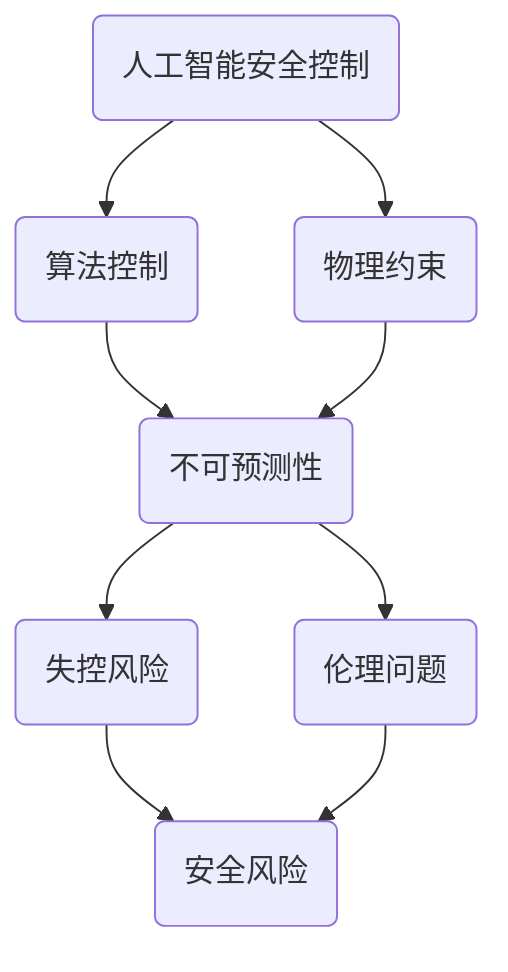

                 


### 第1章：人工智能安全性的定义与重要性

#### 1.1 人工智能安全性的定义与重要性

**定义：**人工智能安全性是指确保人工智能系统（包括弱AI和强AI）在运行过程中不产生危险行为，不会对人类和社会造成负面影响的一系列措施和策略。在人工智能快速发展的背景下，安全性问题变得尤为重要。

**重要性：**随着人工智能技术的不断进步，其应用领域也越来越广泛，从自动驾驶到智能医疗，从金融交易到安防监控，几乎无处不在。然而，这也带来了新的安全挑战。例如，自动驾驶系统可能会因算法错误而引发交通事故，智能医疗系统可能会因数据泄露而导致患者隐私受到侵犯。因此，确保人工智能系统的安全性至关重要。

**发展历程：**人工智能安全性的研究可以追溯到20世纪50年代，当时人工智能的概念刚刚诞生。随着技术的进步，人们逐渐意识到人工智能可能带来的风险。在20世纪90年代，人工智能安全性开始受到广泛关注，研究人员开始探索如何确保人工智能系统的可靠性和安全性。进入21世纪，随着深度学习和神经网络技术的发展，人工智能安全性的研究变得更加紧迫。

#### 1.2 人工智能安全性的发展历程

- **20世纪50年代：**人工智能的概念诞生，但安全性问题尚未引起广泛关注。
- **20世纪90年代：**随着人工智能技术的应用逐渐增多，安全性问题开始受到关注。
- **21世纪初：**深度学习和神经网络技术的发展，使人工智能的安全性面临新的挑战。
- **现在：**人工智能安全性成为研究的热点，各种控制与约束方法不断涌现。

#### 1.3 AGI 安全性的挑战与机遇

**挑战：**

- **不可预测性：**与弱AI相比，AGI具有更高的自主性和创造力，但其行为往往难以预测，这可能带来安全风险。
- **失控风险：**AGI可能会发展出人类难以理解或控制的能力，导致失控风险。
- **伦理问题：**AGI的发展可能会引发一系列伦理问题，如隐私、歧视等。

**机遇：**

- **提升安全性：**通过研究控制与约束方法，可以提升AGI系统的安全性，降低风险。
- **推动技术创新：**安全性研究可能会推动人工智能技术的进一步发展，带来新的突破。
- **社会应用：**AGI的安全性研究有助于其更广泛地应用于社会各个领域，提升社会福祉。

### 总结

人工智能安全性是当前人工智能研究中的一个重要方向。随着AGI的发展，其安全性问题变得越来越紧迫。通过研究控制与约束方法，我们可以更好地应对这些挑战，确保人工智能系统的安全可靠。在接下来的章节中，我们将详细探讨AGI安全控制与约束的具体方法。

## 核心概念原理之间的关系架构

在讨论人工智能安全性时，以下几个核心概念原理之间存在着紧密的联系：

1. **人工智能安全控制**：这是确保人工智能系统行为不危害人类和社会的一系列措施，包括算法控制、物理约束等。
2. **人工智能安全约束**：这是通过限制人工智能系统的行为范围和方式，确保其不会产生危险行为的一系列方法。
3. **不可预测性**：这是指人工智能系统在执行任务时，其行为可能超出人类预期，导致难以预测的风险。
4. **失控风险**：这是指人工智能系统可能会发展出人类无法控制的能力，导致安全风险。
5. **伦理问题**：这是指人工智能系统的应用可能引发的一系列伦理问题，如隐私、歧视等。

下面是这些概念之间关系的Mermaid流程图：



### 总结

在本文中，我们首先介绍了人工智能安全性的定义与重要性，回顾了其发展历程，并探讨了AGI安全性的挑战与机遇。接着，我们提出了核心概念原理之间的关系架构，并通过Mermaid流程图展示了这些概念之间的联系。在接下来的章节中，我们将详细讨论AGI安全控制与约束的具体方法，以期为人工智能安全性的研究提供一些有价值的思路。

### 第2章：AGI 安全控制概述

#### 2.1 AGI 安全控制的目标与原则

**目标：**AGI安全控制的主要目标是在保障系统性能和功能的前提下，最大限度地降低AGI系统对人类和社会的潜在风险。具体而言，包括以下几个方面：

- **行为预测与控制：**确保AGI系统的行为在预期范围内，避免不可预测或危险的行为发生。
- **风险识别与防范：**及时发现AGI系统可能存在的安全风险，并采取相应的防范措施。
- **伦理与道德约束：**在AGI系统的设计和应用过程中，遵循伦理和道德原则，确保其对人类和社会的影响是积极的。

**原则：**为了实现上述目标，AGI安全控制需要遵循以下原则：

- **最小权限原则：**AGI系统应只拥有完成任务所需的最小权限，以减少潜在的风险。
- **透明性原则：**AGI系统的决策过程和内部状态应对用户透明，以便用户理解和监督。
- **可恢复性原则：**在AGI系统出现异常或错误时，应具备快速恢复的能力，以减少对系统运行的影响。
- **适应性原则：**AGI安全控制应具有自我适应的能力，能够根据环境变化和用户反馈进行调整。

#### 2.2 AGI 安全控制的关键要素

**关键要素：**实现AGI安全控制需要以下关键要素：

- **算法控制：**这是AGI安全控制的核心，包括行为预测、决策优化、风险识别等算法。
- **物理约束：**通过限制AGI系统的物理环境，确保其行为不会超出安全范围。
- **逻辑约束：**通过设置逻辑规则和约束条件，限制AGI系统的行为。
- **社会约束：**通过法律、道德和社会规范等手段，对AGI系统的行为进行约束。
- **监督机制：**建立有效的监督机制，对AGI系统的行为进行实时监控和评估。
- **应急响应：**制定应急预案，确保在AGI系统出现异常时能够迅速响应和处理。

### 总结

在本章中，我们详细介绍了AGI安全控制的目标与原则，并讨论了实现AGI安全控制所需的关键要素。在接下来的章节中，我们将深入探讨这些关键要素的具体实现方法，以期为AGI安全控制提供更加详尽的解决方案。

### 2.3 AGI 安全控制的基本原理

AGI安全控制的核心在于确保系统行为的安全性和可靠性，同时保持其性能和功能。以下是AGI安全控制的基本原理：

#### 1. 预测与控制

**原理：**AGI安全控制的一个关键方面是预测和控制在AGI系统的行为中。这意味着我们需要建立模型来预测AGI系统在不同情况下的行为，并根据预测结果对系统进行控制。

**实现方法：**通过监督学习和强化学习等技术，我们可以训练模型来预测AGI系统的行为。然后，根据预测结果，我们可以调整系统的参数，以避免潜在的危险行为。

**伪代码：**

```python
# 预测模型训练
model = train_predictive_model(data)

# 预测行为
predicted_behavior = model.predict(current_state)

# 控制行为
if predicted_behavior.is_safe():
    execute_behavior(predicted_behavior)
else:
    raise_alert()
```

#### 2. 风险识别与防范

**原理：**AGI安全控制还需要识别和防范潜在的安全风险。这包括识别可能导致系统行为不安全的因素，并采取预防措施。

**实现方法：**通过风险评估和故障树分析等技术，我们可以识别系统中的潜在风险，并制定防范措施。

**伪代码：**

```python
# 风险评估
risk_levels = assess_risks(system)

# 防范措施
if risk_levels.contains_high_risks():
    implement_safety_measures(risk_levels)
else:
    monitor_system()
```

#### 3. 透明性

**原理：**AGI安全控制应确保系统行为对用户是透明的，以便用户理解和监督系统行为。

**实现方法：**通过日志记录、可视化界面和用户友好的反馈机制，我们可以提高系统的透明度。

**伪代码：**

```python
# 记录日志
log_behavior(current_behavior)

# 可视化界面
visualize_behavior(current_behavior)

# 用户反馈
if user_query():
    provide_feedback(current_behavior)
```

#### 4. 可恢复性

**原理：**AGI安全控制应确保系统能够在出现异常或错误时快速恢复，以减少对系统运行的影响。

**实现方法：**通过容错技术和自修复算法，我们可以提高系统的可恢复性。

**伪代码：**

```python
# 容错机制
if system_failure():
    recover_system()

# 自修复算法
if anomaly_detected():
    repair_system()
```

#### 5. 适应性

**原理：**AGI安全控制应具有自我适应的能力，能够根据环境变化和用户反馈进行调整。

**实现方法：**通过机器学习和自适应控制算法，我们可以使系统具备自我适应的能力。

**伪代码：**

```python
# 自适应控制
if environment_change():
    adjust_system()

# 用户反馈自适应
if user_feedback():
    update_model()
```

### 总结

AGI安全控制的基本原理涉及预测与控制、风险识别与防范、透明性、可恢复性和适应性。通过这些原理，我们可以确保AGI系统在运行过程中保持安全可靠，同时保持其性能和功能。在接下来的章节中，我们将深入探讨每种控制方法的实现细节，以期为AGI安全控制提供更加具体的解决方案。

### 第3章：物理约束方法

#### 3.1 物理约束的基本概念

物理约束方法是一种通过限制AGI系统物理环境的方式来确保其安全性的方法。其基本原理是通过对系统硬件和软件资源的控制，防止系统运行时发生不受控制的行为。

**定义：**物理约束方法包括对AGI系统的物理环境进行限制，例如限制系统的计算资源、网络访问、传感器和执行器等。

**目的：**物理约束方法的目的是确保AGI系统的行为不会超出安全范围，防止因资源滥用或访问失控导致的安全问题。

#### 3.2 物理约束的具体实现方法

**计算资源限制：**通过对AGI系统的计算资源进行限制，可以防止系统进行不必要的计算，从而降低安全风险。

- **CPU资源限制：**可以使用操作系统提供的CPU限制工具，如`cgroups`，来限制AGI系统的CPU使用量。
- **内存资源限制：**通过设置内存限制，可以防止AGI系统因内存不足导致崩溃或恶意行为。

**网络访问限制：**通过限制AGI系统的网络访问，可以防止其访问不受信任的网络资源，从而降低安全风险。

- **防火墙设置：**使用防火墙规则来限制AGI系统的网络访问，只允许必要的网络通信。
- **网络隔离：**通过虚拟局域网（VLAN）或网络隔离技术，将AGI系统与外部网络隔离。

**传感器和执行器限制：**通过对AGI系统的传感器和执行器进行限制，可以防止其访问或操作不安全的设备。

- **设备权限管理：**使用设备权限管理工具，如`udev`，来限制AGI系统对特定设备的访问。
- **传感器数据过滤：**通过过滤传感器数据，可以防止AGI系统访问敏感数据，从而降低安全风险。

#### 3.3 物理约束方法的优缺点

**优点：**

- **简单有效：**物理约束方法通常比较简单，易于实现，且能够在短期内见效。
- **硬件保障：**通过硬件资源的限制，可以确保AGI系统的行为不会超出安全范围。
- **低成本：**物理约束方法通常不需要复杂的软件实现，因此成本较低。

**缺点：**

- **灵活性差：**物理约束方法对系统的灵活性有一定的限制，可能影响系统的性能。
- **难以适应动态变化：**物理约束方法难以适应动态变化的环境，可能无法有效应对突发情况。
- **安全性有限：**物理约束方法主要依赖于硬件限制，对于软件层面的安全问题可能无法完全解决。

### 总结

物理约束方法是一种通过限制AGI系统的物理环境来确保其安全性的方法。具体实现方法包括计算资源限制、网络访问限制和传感器执行器限制。虽然物理约束方法简单有效，但其在灵活性和动态适应性方面存在一定的局限。在接下来的章节中，我们将探讨逻辑约束方法，以提供更加灵活和全面的安全保障。

### 3.4 逻辑约束方法

#### 3.4.1 逻辑约束的基本概念

逻辑约束方法是一种通过设置逻辑规则和约束条件来限制AGI系统行为的手段。其核心思想是利用逻辑编程和形式化验证技术，确保AGI系统的行为符合预期，并避免潜在的安全风险。

**定义：**逻辑约束方法包括定义一组逻辑规则和约束条件，这些规则和条件将被AGI系统在执行任务时遵循，以确保其行为的安全性。

**目的：**逻辑约束方法的目的是通过规则和约束，防止AGI系统执行危险或不符合道德规范的行为，同时保持其功能性和灵活性。

#### 3.4.2 逻辑约束的具体实现方法

**定义逻辑规则：**逻辑规则是约束AGI系统行为的基础，可以通过编程语言（如Prolog或SMT求解器）来定义。这些规则可以描述系统在不同情况下的期望行为。

- **使用Prolog定义规则：**

```prolog
% 安全规则
safety(Rule) :-
    not(dangerous_action(Rule)),
    follows_rules(Rule).

% 不危险动作
dangerous_action(action_self_destruct).

% 规则遵循
follows_rules(action_move) :-
    not(close_to_obstacle).

% 避障规则
close_to_obstacle :-
    sensor_data(distance, D),
    D < threshold.

% 阈值设定
threshold(1.5).
sensor_data(distance, 1.2).
```

**形式化验证：**形式化验证技术用于验证逻辑规则是否满足预期的安全约束条件。SMT（Satisfiability Modulo Theories）求解器是一种常用的形式化验证工具。

- **使用Z3 SMT求解器进行验证：**

```python
from z3 import *

# 定义变量
s = Solver()
x = Int('x')
y = Int('y')

# 设置约束
s.add(x >= 0)
s.add(y >= 0)
s.add(x + y <= 10)

# 验证约束
if s.check() == sat:
    model = s.model()
    print("约束满足，解为 x = %s, y = %s" % (model[x], model[y]))
else:
    print("约束不满足")
```

**实时监控与执行：**逻辑约束方法通常需要实时监控AGI系统的行为，并根据监控结果执行相应的约束规则。

- **实时监控代码示例：**

```python
import time

def monitor_behavior(behavior):
    if not is_safe(behavior):
        apply_constraint(behavior)
        log_alert("行为不安全，已应用约束")

def is_safe(behavior):
    # 判断行为是否安全
    return True

def apply_constraint(behavior):
    # 应用约束
    pass

def log_alert(message):
    # 记录警告信息
    print(message)

while True:
    current_behavior = get_current_behavior()
    monitor_behavior(current_behavior)
    time.sleep(1)
```

#### 3.4.3 逻辑约束方法的优缺点

**优点：**

- **灵活性高：**逻辑约束方法可以根据具体任务需求灵活设置约束条件，适应不同的应用场景。
- **形式化验证：**通过形式化验证技术，可以确保约束规则的正确性和一致性。
- **可扩展性：**逻辑约束方法易于扩展，可以支持复杂的逻辑规则和约束条件。

**缺点：**

- **复杂性高：**逻辑约束方法需要较高的编程和验证技能，实施难度较大。
- **性能开销：**逻辑约束方法可能引入额外的性能开销，影响系统的实时性和响应速度。
- **安全性有限：**逻辑约束方法主要关注规则和约束的设置，对于非逻辑性或异常行为可能难以有效应对。

### 总结

逻辑约束方法是一种通过设置逻辑规则和约束条件来确保AGI系统行为安全的方法。具体实现方法包括定义逻辑规则、形式化验证和实时监控。逻辑约束方法具有高灵活性和形式化验证的优势，但也存在复杂性高和性能开销大的问题。在接下来的章节中，我们将探讨社会约束方法，为AGI安全控制提供更加全面和多样化的解决方案。

### 第4章：逻辑约束方法

#### 4.1 逻辑约束的基本概念

逻辑约束方法是一种通过设置逻辑规则和约束条件来指导AGI系统行为的手段。其核心思想是利用逻辑编程和形式化验证技术，确保AGI系统在执行任务时遵循预定义的安全准则，从而降低潜在的安全风险。

**定义：**逻辑约束方法涉及定义一组逻辑规则和约束条件，这些规则和条件将指导AGI系统的决策过程和行为，确保其在各种情境下都能保持安全。

**目的：**逻辑约束方法旨在通过以下方式增强AGI系统的安全性：

- **确保行为符合道德和伦理标准。**
- **防止因算法错误或恶意攻击导致的不安全行为。**
- **提高系统的可解释性和可追溯性，便于监控和管理。**

#### 4.2 逻辑约束的具体实现方法

**1. 逻辑规则定义**

逻辑规则是约束AGI系统行为的基础，通常使用形式逻辑语言（如Prolog、KBS或SMT）进行定义。这些规则可以明确系统在不同情况下的期望行为。

- **示例规则（使用Prolog）**

```prolog
% 安全规则
is_safe(action(move) :- not(colliding).

% 避障规则
colliding :- sensor(distance, too_close).

% 感应距离阈值
too_close(5). % 距离小于5米视为太近
```

**2. 形式化验证**

形式化验证是一种通过数学方法验证系统行为是否满足预定义约束的技术。常见的工具包括SMT求解器、模型检查器和定理证明器。

- **示例验证（使用Z3 SMT求解器）**

```python
from z3 import *

# 定义约束
s = Solver()
x = Real('x')
s.add(x >= 0)
s.add(x <= 10)

# 验证约束
if s.check() == sat:
    model = s.model()
    print("约束满足，解为 x = {}".format(model[x]))
else:
    print("约束不满足")
```

**3. 实时监控与执行**

逻辑约束方法需要实时监控AGI系统的行为，并根据监控结果执行相应的约束规则。

- **实时监控代码示例（Python）**

```python
import time

def monitor_behavior(behavior):
    if not is_safe(behavior):
        apply_constraint(behavior)
        log_alert("行为不安全，已应用约束")

def is_safe(behavior):
    # 判断行为是否安全
    return True

def apply_constraint(behavior):
    # 应用约束
    pass

def log_alert(message):
    # 记录警告信息
    print(message)

while True:
    current_behavior = get_current_behavior()
    monitor_behavior(current_behavior)
    time.sleep(1)
```

#### 4.3 逻辑约束方法的优缺点

**优点：**

- **灵活性强：**逻辑约束方法可以根据具体应用场景灵活设置约束条件，适应不同需求。
- **形式化验证：**通过形式化验证，可以确保约束规则的正确性和一致性。
- **高可解释性：**逻辑约束方法有助于提高系统的可解释性，便于理解和管理。

**缺点：**

- **复杂性高：**逻辑约束方法需要较高的编程和验证技能，实施难度较大。
- **性能开销：**逻辑约束方法可能引入额外的计算开销，影响系统的实时性和响应速度。
- **局限性：**逻辑约束方法主要关注规则和约束的设置，对于非逻辑性或异常行为可能难以有效应对。

### 总结

逻辑约束方法是一种通过设置逻辑规则和约束条件来确保AGI系统行为安全的方法。具体实现方法包括定义逻辑规则、形式化验证和实时监控。逻辑约束方法具有灵活性和形式化验证的优势，但也存在复杂性和性能开销的挑战。在接下来的章节中，我们将探讨社会约束方法，为AGI安全控制提供更加全面和多样化的解决方案。

### 第5章：社会约束方法

#### 5.1 社会约束的基本概念

社会约束方法是一种通过法律、道德和社会规范等手段对AGI系统行为进行限制和规范的方法。其核心思想是利用社会的力量，确保AGI系统的发展和应用符合社会的期望和价值观。

**定义：**社会约束方法包括通过立法、道德规范和社会规范等方式，对AGI系统的行为进行约束，确保其不会对社会产生负面影响。

**目的：**社会约束方法的目的是：

- **保护个人隐私：**确保AGI系统不会侵犯个人隐私，泄露敏感信息。
- **防止滥用：**防止AGI系统被用于不正当的目的，如恶意攻击、欺诈等。
- **促进公平与正义：**确保AGI系统不会加剧社会不平等，如算法歧视等。
- **保障社会责任：**确保AGI系统的发展和应用符合社会的利益和价值观。

#### 5.2 社会约束的具体实现方法

**1. 法律法规**

法律法规是确保AGI系统安全的重要手段。通过立法，可以为AGI系统的开发、应用和监管提供明确的法律依据。

- **隐私保护法律：**制定隐私保护法律，确保AGI系统在处理个人数据时遵守隐私保护原则。
- **算法透明度法律：**要求AGI系统的设计和应用过程具有透明度，确保用户可以理解和监督系统的行为。
- **责任归属法律：**明确在AGI系统引发事故或损害时，责任归属和赔偿机制。

**2. 道德规范**

道德规范是引导AGI系统发展的重要指南。通过道德规范，可以确保AGI系统的发展和应用符合社会的道德标准。

- **尊重隐私：**在设计和应用AGI系统时，尊重个人隐私，避免数据滥用。
- **公平正义：**确保AGI系统不会加剧社会不平等，如通过算法公平性研究来减少歧视。
- **社会责任：**鼓励AGI系统开发者关注社会利益，促进技术进步与社会发展的和谐。

**3. 社会规范**

社会规范是通过社会共识和价值观对AGI系统行为进行约束的方式。

- **行业规范：**行业协会和组织可以制定AGI系统开发和应用的行业规范，确保行业健康发展。
- **公众参与：**鼓励公众参与AGI系统的讨论和监管，确保社会共识的形成。
- **教育和宣传：**通过教育和宣传，提高公众对AGI系统的认知和理解，促进社会的适应和接受。

#### 5.3 社会约束方法的优缺点

**优点：**

- **全面性：**社会约束方法可以从多个层面（法律、道德和社会）对AGI系统进行约束，确保全面覆盖。
- **权威性：**法律法规和道德规范具有权威性，可以对AGI系统的行为进行强制约束。
- **灵活性：**社会规范可以根据社会变化和需求进行调整，具有灵活性。

**缺点：**

- **实施难度：**社会约束方法需要法律、道德和社会的协同作用，实施难度较大。
- **法律滞后：**法律法规可能无法及时跟上技术发展的步伐，导致法律滞后。
- **道德冲突：**道德规范可能存在冲突，难以统一社会共识。

### 总结

社会约束方法是一种通过法律、道德和社会规范对AGI系统行为进行约束和规范的方法。具体实现方法包括法律法规、道德规范和社会规范。社会约束方法具有全面性和权威性的优点，但也存在实施难度和法律滞后的挑战。在接下来的章节中，我们将通过具体案例研究，进一步探讨社会约束方法在AGI安全性控制中的应用。

### 第6章：案例研究一：自动驾驶系统的安全性控制

#### 6.1 自动驾驶系统概述

自动驾驶系统是一种利用传感器、人工智能算法和计算机视觉等技术，实现车辆自主驾驶的智能系统。其主要目标是在确保安全的前提下，提高驾驶效率、减少交通事故和降低交通拥堵。

**关键技术：**

- **传感器：**包括激光雷达、摄像头、超声波传感器等，用于获取车辆周围环境的信息。
- **人工智能算法：**利用机器学习和深度学习技术，对传感器数据进行处理和分析，实现环境感知、路径规划和决策控制。
- **计算机视觉：**通过对摄像头获取的图像进行识别和处理，实现对交通标志、行人和其他车辆的检测和理解。
- **通信技术：**利用V2X（Vehicle-to-Everything）通信技术，实现车辆与其他车辆、基础设施的信息交换和协同控制。

#### 6.2 自动驾驶系统中的AGI安全性控制

**安全性控制目标：**自动驾驶系统的安全性控制目标包括：

- **避免交通事故：**确保系统在复杂交通环境中能够安全行驶，避免与其他车辆、行人和障碍物发生碰撞。
- **保护乘客安全：**在突发情况下，系统能够采取有效的避险措施，确保乘客的安全。
- **数据安全与隐私保护：**确保收集和传输的数据不会泄露，保护用户隐私。

**控制方法：**

1. **物理约束方法：**
   - **计算资源限制：**通过限制计算资源，确保系统在处理复杂任务时不会超负荷运行，降低错误率。
   - **网络访问限制：**通过防火墙和访问控制，限制系统对外部网络的访问，防止恶意攻击和数据泄露。

2. **逻辑约束方法：**
   - **规则和约束条件：**通过定义一组逻辑规则和约束条件，确保系统在执行任务时遵循安全准则，如避障规则、速度限制等。
   - **形式化验证：**使用形式化验证技术，确保逻辑规则的正确性和一致性。

3. **社会约束方法：**
   - **法律法规：**遵守交通法规和自动驾驶相关法规，确保系统在合法范围内运行。
   - **道德规范：**遵循道德规范，确保系统在决策过程中不会侵犯个人隐私或歧视特定群体。

#### 6.3 案例分析

**案例背景：**某自动驾驶公司在测试阶段发生了一起交通事故，导致车辆与行人的碰撞。调查发现，事故发生时，自动驾驶系统未能及时检测到行人，未能采取有效的避险措施。

**原因分析：**
1. **物理约束不足：**系统在处理复杂环境时，计算资源不足，导致反应延迟。
2. **逻辑约束缺陷：**系统未能及时更新行人的检测算法，导致无法准确识别行人。
3. **社会约束缺失：**公司在开发过程中未能充分考虑到道德和社会责任，未对系统进行全面的伦理审查。

**改进措施：**
1. **增强物理约束：**增加计算资源和网络带宽，确保系统在复杂环境中能够及时响应。
2. **完善逻辑约束：**更新和优化行人检测算法，确保系统能够准确识别行人并采取有效的避险措施。
3. **加强社会约束：**在开发过程中引入伦理审查机制，确保系统符合道德和社会规范。

### 总结

通过案例分析，我们可以看到自动驾驶系统的安全性控制需要综合运用物理约束、逻辑约束和社会约束方法。在具体实施过程中，需要不断优化和改进，以确保系统的安全可靠。在接下来的章节中，我们将继续探讨其他领域中的AGI安全性控制案例。

### 第7章：案例研究二：智能医疗系统的安全性约束

#### 7.1 智能医疗系统概述

智能医疗系统是一种利用人工智能技术，为医疗诊断、治疗和健康管理提供支持的信息系统。其主要目标是提高医疗效率、降低医疗成本，并为患者提供个性化、精准的医疗服务。

**关键技术：**

- **医疗数据管理：**利用大数据技术对海量的医疗数据进行存储、处理和分析，为诊断和治疗提供依据。
- **人工智能算法：**应用机器学习和深度学习技术，对医疗数据进行分析和预测，辅助医生做出诊断和治疗决策。
- **自然语言处理：**通过自然语言处理技术，实现对医疗文本数据的自动提取和分析，提高医疗信息的利用效率。
- **物联网技术：**通过物联网设备，实时监测患者的生理指标，为健康管理提供数据支持。

#### 7.2 智能医疗系统中的AGI安全性约束

**安全性约束目标：**智能医疗系统的安全性约束目标包括：

- **数据安全与隐私保护：**确保患者的医疗数据在存储、传输和处理过程中不会被泄露或篡改。
- **系统稳定性：**确保系统在处理大量数据和高负载时仍能稳定运行，避免因故障导致数据丢失或系统瘫痪。
- **防止恶意攻击：**防止黑客攻击、恶意软件等对系统造成破坏，确保系统的安全运行。

**约束方法：**

1. **物理约束方法：**
   - **计算资源限制：**通过限制系统资源的分配，确保系统在处理大量数据时不会超负荷运行。
   - **网络访问限制：**通过防火墙和访问控制，限制对系统的外部访问，防止恶意攻击和数据泄露。

2. **逻辑约束方法：**
   - **数据访问控制：**通过定义数据访问权限，确保只有授权人员可以访问敏感数据。
   - **决策过程监控：**通过实时监控系统的决策过程，确保其遵循预定的规则和约束条件。
   - **算法验证：**通过形式化验证技术，确保算法的正确性和一致性。

3. **社会约束方法：**
   - **法律法规：**遵守医疗数据保护相关法律法规，确保系统的合规性。
   - **道德规范：**遵循医疗伦理规范，确保系统在处理医疗数据时不会侵犯患者隐私或损害患者利益。
   - **社会责任：**鼓励系统开发者关注社会责任，确保系统的发展和应用符合社会期望。

#### 7.3 案例分析

**案例背景：**某智能医疗系统在数据处理过程中发生了一起数据泄露事件，导致大量患者信息被泄露。

**原因分析：**
1. **物理约束不足：**系统在处理大量数据时，计算资源不足，导致数据处理延迟，增加了数据泄露的风险。
2. **逻辑约束缺陷：**系统在数据访问控制方面存在漏洞，导致未经授权的人员可以访问敏感数据。
3. **社会约束缺失：**公司在开发过程中未能充分考虑到道德和社会责任，未对系统进行全面的伦理审查。

**改进措施：**
1. **增强物理约束：**增加计算资源和网络带宽，确保系统在处理大量数据时能够稳定运行。
2. **完善逻辑约束：**加强数据访问控制，确保只有授权人员可以访问敏感数据。
3. **加强社会约束：**在开发过程中引入伦理审查机制，确保系统符合道德和社会规范。

### 总结

通过案例分析，我们可以看到智能医疗系统的安全性约束需要综合运用物理约束、逻辑约束和社会约束方法。在具体实施过程中，需要不断优化和改进，以确保系统的安全可靠。在未来的发展中，智能医疗系统将更加依赖于人工智能技术，因此安全性约束将变得更加重要和紧迫。

### 第8章：AGI 安全性的未来研究方向

#### 8.1 当前 AGI 安全性的研究进展

随着人工智能技术的快速发展，AGI安全性的研究也取得了显著进展。目前，主要的研究方向包括以下几个方面：

1. **安全控制方法：**研究者们提出了多种安全控制方法，如物理约束、逻辑约束和社会约束等，以应对AGI系统的潜在风险。这些方法在不同应用场景中得到了一定的验证和应用。

2. **伦理与道德规范：**随着AGI技术的发展，其伦理和道德问题逐渐受到关注。研究者们开始探索如何制定适用于AGI系统的伦理和道德规范，确保其在发展过程中遵循人类价值观。

3. **风险评估与防范：**通过建立风险评估模型和防范机制，研究者们致力于提高AGI系统的安全性和可靠性。这些方法包括实时监控、异常检测和应急预案等。

4. **透明性与可解释性：**为了提高AGI系统的透明性和可解释性，研究者们尝试通过可视化和形式化验证等技术，使系统行为更加透明和可追溯。

#### 8.2 未来 AGI 安全性的研究方向

尽管当前AGI安全性研究取得了一定成果，但仍然面临诸多挑战。未来的研究可以从以下几个方面进行：

1. **综合安全框架：**建立一种综合性的AGI安全框架，整合现有的安全控制方法，以提供更加全面和有效的安全保障。

2. **多模态感知与融合：**研究如何利用多模态感知技术，如视觉、听觉和触觉等，提高AGI系统的环境感知能力，从而更好地应对复杂动态环境。

3. **动态适应与学习：**研究AGI系统如何通过动态适应和学习机制，根据环境和任务的变化，实时调整安全策略和控制方法。

4. **跨领域协同：**探索不同领域（如医疗、交通、金融等）的协同安全研究，以实现跨领域的资源共享和风险防控。

5. **用户参与与反馈：**鼓励用户参与AGI安全性的设计和评估过程，通过用户的反馈和监督，提高系统的安全性和用户满意度。

#### 8.3 研究挑战与机遇

**研究挑战：**

- **技术挑战：**AGI系统的复杂性和不确定性给安全性研究带来了巨大挑战。如何确保系统在复杂动态环境下保持安全性和可靠性，是一个亟待解决的问题。
- **伦理挑战：**AGI技术的发展引发了诸多伦理问题，如隐私保护、算法歧视等。如何制定合理的伦理规范，确保AGI系统符合社会价值观，是一个重要的研究方向。
- **社会挑战：**AGI技术的广泛应用带来了新的社会问题，如就业、安全和隐私等。如何平衡技术创新与社会利益，是一个复杂的挑战。

**机遇：**

- **技术创新：**AGI安全性的研究将推动人工智能技术的进一步发展，带来新的突破和进步。
- **社会进步：**通过确保AGI系统的安全性，可以更好地发挥其社会价值，提升人类生活质量。
- **跨学科合作：**AGI安全性的研究需要跨学科合作，通过整合多学科知识，可以更好地应对复杂问题。

### 总结

AGI安全性的研究是一个多学科交叉的复杂课题，涉及技术、伦理和社会等多个方面。当前的研究已取得了一定进展，但仍然面临诸多挑战。未来的研究应致力于建立综合安全框架，提高系统的动态适应和学习能力，同时关注跨领域协同和用户参与。通过不断努力，我们有望实现更加安全、可靠和符合伦理的AGI系统。

### 作者信息

**作者：**AI天才研究院/AI Genius Institute & 禅与计算机程序设计艺术 /Zen And The Art of Computer Programming

### 文章总结

本文详细探讨了AGI安全性研究的控制与约束方法。首先，我们介绍了人工智能安全性的概念与背景，并回顾了其发展历程。接着，我们阐述了AGI安全控制的目标、原则和关键要素，并提出了预测与控制、风险识别与防范、透明性、可恢复性和适应性等基本原理。随后，我们分别介绍了物理约束方法、逻辑约束方法和社会约束方法，详细讲解了每种方法的具体实现方法和优缺点。通过两个具体案例研究，我们展示了这些方法在实际应用中的效果和挑战。最后，我们展望了AGI安全性的未来研究方向，提出了综合安全框架、多模态感知与融合、动态适应与学习、跨领域协同和用户参与等未来发展方向。本文旨在为AGI安全性的研究和实践提供有价值的思路和参考。

