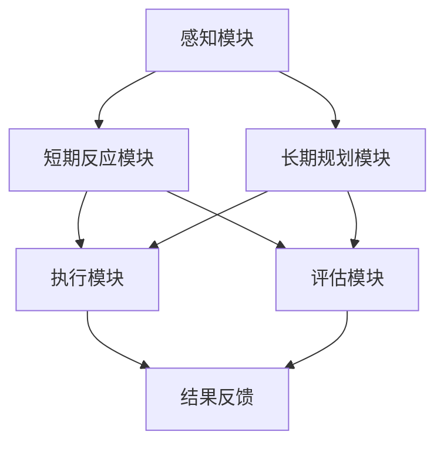
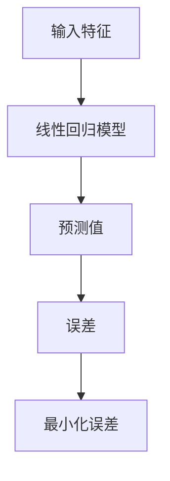
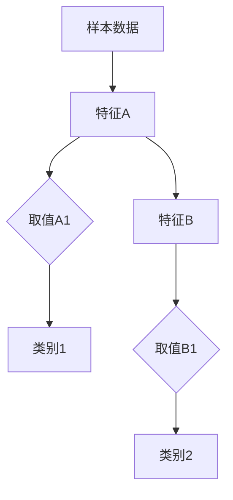
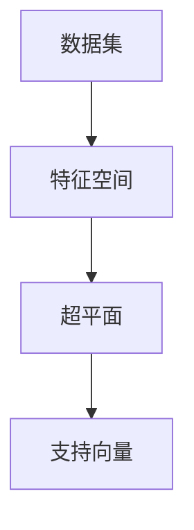
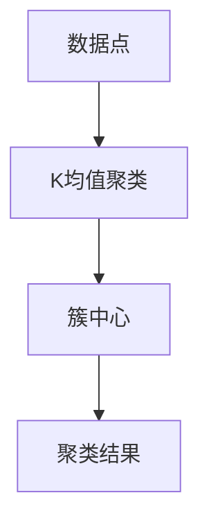
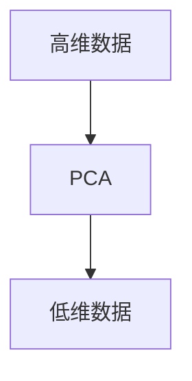
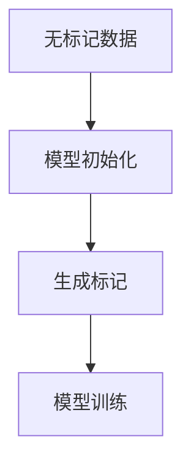
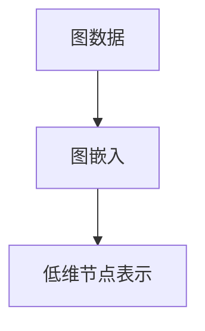

                 

### 引言与概述

#### 1.1 AGI的概念

人工通用智能（AGI）是人工智能（AI）领域的一个长期目标，旨在创造一种智能体，它能在多种任务上表现出与人类相似或超越人类的能力。AGI的核心在于其广泛的知识理解和学习能力，它不仅能够处理特定领域的任务，还能在不同领域之间灵活转换。

##### 1.1.1 AGI的定义

AGI的定义是一个多维度的问题，涉及从理论到实际应用的多个层面。广义上，AGI被定义为具有以下特点的智能系统：

1. **知识广泛**：AGI系统应具备广泛的知识库，能够涵盖多个学科领域，从自然语言处理到逻辑推理，再到常识推理和世界模型。
2. **自主学习**：AGI应具备自主学习的能力，能够通过经验不断改进其知识和技能。
3. **跨领域应用**：AGI不仅能够在特定任务上表现出色，还应能够在不同领域之间灵活转换。

##### 1.1.2 AGI的特点

AGI具有以下几个显著特点：

1. **广泛适应性**：AGI能够适应各种环境，并处理不确定性和意外情况。
2. **迁移能力**：AGI应具备将一种任务领域的知识和技能迁移到其他任务领域的能力。
3. **自主性**：AGI能够在没有人类干预的情况下做出决策和采取行动。

##### 1.1.3 AGI的应用领域

AGI的应用前景广阔，包括但不限于以下领域：

1. **医疗诊断**：AGI可以辅助医生进行疾病诊断，通过分析大量的医疗数据，提供更准确的诊断建议。
2. **自动驾驶**：AGI可以用于自动驾驶汽车，实现高度自动化的交通系统，提高交通效率和安全性。
3. **教育辅导**：AGI可以为学生提供个性化的学习计划和辅导，提高教育质量。

#### 1.2 决策系统的定义

决策系统是AGI的核心组件之一，负责在复杂环境中做出决策。一个有效的决策系统应具备以下几个关键特征：

1. **环境感知**：决策系统应能够感知和理解其所在的环境。
2. **目标导向**：决策系统应能够明确其目标，并在多种可能行动中选择最佳行动。
3. **自主决策**：决策系统应能够在没有人类干预的情况下做出决策。

##### 1.2.1 决策系统的基本概念

决策系统通常由以下几个核心模块组成：

1. **感知模块**：负责收集环境信息，包括传感器数据、文本、图像等。
2. **规划模块**：负责根据感知到的环境信息和目标，生成可行的行动计划。
3. **执行模块**：负责执行规划出的行动。
4. **评估模块**：负责评估执行结果，并反馈给感知模块和规划模块，以优化决策过程。

##### 1.2.2 决策系统的作用

决策系统在AGI中扮演着至关重要的角色，其主要作用包括：

1. **自主行动**：决策系统使得AGI能够在没有人类干预的情况下自主行动。
2. **适应性**：通过不断学习和适应环境变化，决策系统能够提高AGI的适应能力。
3. **优化性能**：通过优化决策过程，决策系统能够提高AGI的执行效率和效果。

#### 1.3 决策系统的架构

一个典型的决策系统架构可以分为短期反应模块和长期规划模块，如图1所示。短期反应模块负责处理实时环境变化，快速做出反应；长期规划模块则负责在更长远的时间尺度上制定和优化决策计划。



##### 图1：决策系统的架构

在短期反应模块中，AGI需要快速应对突发情况，如道路障碍、紧急事件等。这通常涉及简单而高效的算法，如基于规则的系统或基于神经网络的实时预测模型。

在长期规划模块中，AGI则需要考虑更长远的目标，如最优路径规划、资源分配等。这通常需要复杂的算法，如强化学习、规划算法等。

短期反应模块和长期规划模块之间需要紧密协作，以确保AGI在执行任务时能够既快速反应又具备长远规划。例如，在自动驾驶车辆中，短期反应模块需要实时调整驾驶行为以避免障碍，而长期规划模块则需要规划最佳行驶路线和交通策略。

#### 1.4 决策系统的发展历史

决策系统的研究可以追溯到人工智能的早期阶段。早期的决策系统主要基于符号逻辑和规则系统，如专家系统和基于知识的系统。这些系统在处理确定性问题时表现出色，但在处理不确定性和复杂环境时存在局限。

随着机器学习和深度学习技术的发展，决策系统的架构和算法得到了显著改进。现代决策系统通常结合了机器学习算法，如深度神经网络和强化学习，以提高其适应性和学习能力。

近年来，决策系统的研究重点转向分布式决策系统，以应对大规模、复杂环境中的决策挑战。分布式决策系统通过多个智能体之间的协作，实现更高效、更鲁棒的决策过程。

#### 1.5 决策系统在现实世界中的应用

决策系统在现实世界中有广泛的应用，以下是一些典型的应用场景：

1. **智能交通系统**：决策系统可以用于优化交通流量管理，减少交通拥堵，提高道路安全性。
2. **金融风险管理**：决策系统可以用于评估金融风险，制定风险管理策略，优化投资组合。
3. **医疗诊断**：决策系统可以用于辅助医生进行疾病诊断，提高诊断准确率。

通过这些应用场景，我们可以看到决策系统在提高效率和性能、降低成本、提高安全性和可靠性方面的重要作用。

### 核心概念与联系

在深入探讨AGI的决策系统之前，我们需要明确几个核心概念，并阐述它们之间的联系。这些核心概念包括决策系统、短期反应模块、长期规划模块以及相关的算法和数学模型。

#### 1. AGI的决策系统

决策系统是AGI的核心组成部分，负责在复杂环境中做出合理的决策。一个决策系统通常包括感知模块、规划模块、执行模块和评估模块。感知模块负责收集环境信息，规划模块负责制定决策计划，执行模块负责执行决策，评估模块负责评估决策结果并反馈给感知模块和规划模块，以优化后续决策。

#### 2. 短期反应模块

短期反应模块是决策系统的一个关键组成部分，负责处理实时环境变化，并做出快速响应。短期反应模块通常使用简单而高效的算法，如基于规则的系统、神经网络预测模型等。这些算法能够在短时间内处理大量数据，并生成实时决策。

#### 3. 长期规划模块

长期规划模块负责在更长远的时间尺度上制定和优化决策计划。与短期反应模块不同，长期规划模块需要考虑多种可能性，并优化决策以实现长期目标。长期规划模块通常使用复杂的算法，如强化学习、规划算法、遗传算法等。

#### 4. 决策系统的架构

决策系统的架构是短期反应模块和长期规划模块之间的协作框架。一个有效的决策系统需要在这两个模块之间实现平衡，既能快速响应实时变化，又能制定长期规划。短期反应模块和长期规划模块之间的协作通常通过以下几种方式实现：

1. **模块间通信**：短期反应模块和长期规划模块之间通过通信机制共享信息和决策结果，以实现更好的协调。
2. **迭代优化**：短期反应模块的决策结果可以作为长期规划模块的输入，长期规划模块根据这些结果进行迭代优化，以提高整体决策效果。
3. **并行处理**：短期反应模块和长期规划模块可以同时运行，并使用并行处理技术以提高决策速度和效率。

#### 5. 决策系统中的算法和数学模型

决策系统中的算法和数学模型是实现决策功能的核心。常见的算法包括基于规则的系统、神经网络、强化学习、规划算法等。这些算法可以根据具体的应用场景和需求进行选择和组合。数学模型则用于描述决策系统的行为，包括决策变量、目标函数、约束条件等。常见的数学模型包括线性规划模型、动态规划模型、马尔可夫决策过程等。

#### 6. Mermaid流程图

为了更直观地展示决策系统中的核心概念和联系，我们可以使用Mermaid流程图来描述决策系统的架构和算法流程。以下是一个简单的Mermaid流程图示例：


在这个流程图中，感知模块收集环境信息，传递给短期反应模块和长期规划模块。短期反应模块生成实时决策，执行模块执行决策，评估模块评估决策结果，并将结果反馈给感知模块和规划模块，以优化后续决策。

### 核心算法原理

决策系统中的核心算法是决策过程中至关重要的组成部分，决定了系统在复杂环境中做出有效决策的能力。在本节中，我们将深入探讨几种常见的核心算法原理，包括机器学习、强化学习和神经网络。

#### 1. 机器学习算法

机器学习算法是决策系统中最常用的算法之一，它通过从数据中学习模式，使系统能够对未知情况进行预测和分类。机器学习算法可以分为监督学习、无监督学习和半监督学习。

##### 1.1. 监督学习

监督学习是一种有标记数据的学习方法，其目标是建立一个模型，能够根据输入特征预测输出标签。监督学习算法包括线性回归、决策树、支持向量机（SVM）等。

- **线性回归**：线性回归是一种简单且常见的监督学习算法，用于预测连续值输出。其核心思想是通过拟合一条直线，最小化预测值与实际值之间的误差。



- **决策树**：决策树是一种基于树形结构的分类算法，通过一系列的决策规则将数据分为不同的类别。每个节点表示一个特征，每个分支表示特征的取值，叶节点表示最终的类别。



- **支持向量机（SVM）**：支持向量机是一种强大的分类算法，其目标是找到一个超平面，将数据集分为不同的类别，并最大化分类边界上的支持向量。



##### 1.2. 无监督学习

无监督学习是一种没有标记数据的学习方法，其目标是发现数据中的内在结构和模式。无监督学习算法包括聚类、降维等。

- **聚类算法**：聚类算法通过将相似的数据点分组，以发现数据中的模式。常见的聚类算法包括K均值聚类、层次聚类等。



- **降维算法**：降维算法通过减少数据维度，降低数据的复杂度，同时保留关键信息。常见的降维算法包括主成分分析（PCA）、t-SNE等。



##### 1.3. 半监督学习

半监督学习结合了监督学习和无监督学习的优点，利用部分标记数据和大量无标记数据来训练模型。常见的半监督学习算法包括自我训练、图嵌入等。

- **自我训练**：自我训练算法通过使用无标记数据来初始化模型，然后使用模型生成的标记数据来进一步训练模型。



- **图嵌入**：图嵌入算法通过将图中的节点映射到低维空间，以保留节点之间的结构关系。常见的图嵌入算法包括DeepWalk、Node2Vec等。



#### 2. 强化学习算法

强化学习是一种通过试错策略来学习如何在动态环境中做出最优决策的机器学习算法。强化学习算法的核心是智能体、环境和奖励系统。

##### 2.1. 强化学习的基本概念

- **智能体**：智能体是执行动作并从环境中接收奖励的实体。
- **环境**：环境是智能体执行动作并接收奖励的动态系统。
- **状态**：状态是环境中的一个特定状态。
- **动作**：动作是智能体在特定状态下可以执行的操作。
- **奖励**：奖励是环境对智能体动作的反馈，用于评估动作的好坏。

##### 2.2. 强化学习的基本算法

- **值函数**：值函数用于评估状态的期望奖励，分为状态值函数和动作值函数。状态值函数表示在特定状态下采取最优动作的期望奖励，动作值函数表示在特定状态下采取特定动作的期望奖励。
- **策略**：策略是智能体在特定状态下采取特定动作的概率分布。

##### 2.3. 强化学习算法的实现

强化学习算法的实现通常包括以下步骤：

1. 初始化参数：初始化智能体的参数，包括状态值函数、动作值函数和策略。
2. 迭代学习：智能体在环境中进行迭代，执行动作，并接收奖励。
3. 更新参数：根据接收到的奖励和策略，更新状态值函数、动作值函数和策略。
4. 评估性能：评估智能体的性能，包括奖励总和、策略稳定性和收敛性等。

#### 3. 神经网络算法

神经网络是一种模仿人脑结构和功能的计算模型，通过多层神经元之间的连接和激活函数，实现数据的输入和输出。神经网络在决策系统中广泛应用于特征提取、分类、回归等任务。

##### 3.1. 神经网络的基本概念

- **神经元**：神经元是神经网络的基本计算单元，负责接收输入、计算输出。
- **层**：层是神经网络中的一组神经元，分为输入层、隐藏层和输出层。
- **连接权重**：连接权重是神经元之间的连接强度，用于调整输入对输出的影响。
- **激活函数**：激活函数用于确定神经元是否被激活，常用的激活函数包括sigmoid、ReLU等。

##### 3.2. 神经网络的实现

神经网络的实现通常包括以下步骤：

1. 设计网络结构：确定网络的层数、每层的神经元数量和连接方式。
2. 初始化参数：初始化连接权重和偏置项。
3. 前向传播：计算网络在输入数据上的输出。
4. 计算损失：计算输出与目标之间的误差，常用损失函数包括均方误差（MSE）、交叉熵等。
5. 反向传播：更新连接权重和偏置项，以最小化损失函数。
6. 评估性能：评估网络的性能，包括准确率、召回率、F1值等。

通过以上对核心算法原理的介绍，我们可以更好地理解决策系统中各个模块的工作原理和相互作用，为后续的数学模型和项目实战打下坚实的基础。

### 数学模型

在AGI的决策系统中，数学模型扮演着至关重要的角色。这些模型不仅帮助描述系统的行为，还能够量化决策过程中的变量和目标，从而提供更加精确的决策支持。在本节中，我们将详细探讨决策系统中的几个关键数学模型，包括线性规划模型、动态规划模型和马尔可夫决策过程。

#### 1. 线性规划模型

线性规划模型是一种用于优化线性目标函数的问题，该目标函数需要满足一系列线性约束条件。在决策系统中，线性规划模型常用于资源分配、路径规划等问题。

##### 1.1. 线性规划模型的基本概念

线性规划模型可以表示为以下形式：

$$
\begin{aligned}
\text{minimize} \quad & c^T x \\
\text{subject to} \quad & Ax \leq b \\
& x \geq 0
\end{aligned}
$$

其中，$c$ 是系数向量，$x$ 是决策变量向量，$A$ 是约束矩阵，$b$ 是约束向量。目标函数 $c^T x$ 表示要优化的目标，约束条件 $Ax \leq b$ 和 $x \geq 0$ 描述了决策变量 $x$ 的取值范围。

##### 1.2. 线性规划模型的应用示例

假设我们要优化一个生产线上的资源分配问题，目标是最小化生产成本。设 $x_1, x_2, x_3$ 分别为生产线上的三种资源的使用量，系数向量 $c = [10, 8, 5]$ 表示每种资源的成本，约束矩阵 $A = \begin{bmatrix} 2 & 1 & 1 \\ 1 & 2 & 1 \\ 1 & 1 & 2 \end{bmatrix}$ 描述了每种资源的使用限制，约束向量 $b = \begin{bmatrix} 100 \\ 80 \\ 60 \end{bmatrix}$ 表示每种资源的可用量。

则线性规划模型可以表示为：

$$
\begin{aligned}
\text{minimize} \quad & 10x_1 + 8x_2 + 5x_3 \\
\text{subject to} \quad & 2x_1 + x_2 + x_3 \leq 100 \\
& x_1 + 2x_2 + x_3 \leq 80 \\
& x_1 + x_2 + 2x_3 \leq 60 \\
& x_1, x_2, x_3 \geq 0
\end{aligned}
$$

通过求解该线性规划模型，我们可以得到最优的资源配置方案，从而最小化生产成本。

#### 2. 动态规划模型

动态规划模型是一种适用于多阶段决策问题的优化方法。它通过将复杂问题分解为多个子问题，并利用子问题的解来构建原问题的解。动态规划模型在决策系统中的应用非常广泛，如资源调度、库存管理等问题。

##### 2.1. 动态规划模型的基本概念

动态规划模型可以表示为以下形式：

$$
V(x_n) = \min\{c(x_n, a_n) + V(x_{n-1}) | a_n \in A(x_n)\}
$$

其中，$V(x_n)$ 表示在第 $n$ 个阶段的最优值，$c(x_n, a_n)$ 表示在第 $n$ 个阶段采取动作 $a_n$ 的成本，$A(x_n)$ 表示在第 $n$ 个阶段可行的动作集合。

##### 2.2. 动态规划模型的应用示例

假设我们要优化一个时间序列数据序列 $x_1, x_2, \ldots, x_n$，目标是使总成本最小。设 $V(x_n)$ 表示在第 $n$ 个阶段的最优值，$c(x_n, a_n)$ 表示在第 $n$ 个阶段采取动作 $a_n$ 的成本，$A(x_n)$ 表示在第 $n$ 个阶段可行的动作集合。

则动态规划模型可以表示为：

$$
\begin{aligned}
V(x_n) &= \min\{c(x_n, a_n) + V(x_{n-1}) | a_n \in A(x_n)\} \\
V(x_1) &= c(x_1, a_1)
\end{aligned}
$$

通过递归求解该动态规划模型，我们可以得到最优的时间序列数据序列，从而最小化总成本。

#### 3. 马尔可夫决策过程

马尔可夫决策过程（MDP）是一种用于描述不确定环境中决策问题的数学模型。它通过马尔可夫性质描述状态转移概率和奖励函数，从而提供一种有效的决策策略。

##### 3.1. 马尔可夫决策过程的基本概念

马尔可夫决策过程可以表示为以下形式：

$$
\begin{aligned}
P(S_{t+1} = s_{t+1} | S_t = s_t, A_t = a_t) &= P(S_{t+1} = s_{t+1} | S_t = s_t) \\
R_t &= R(S_t, A_t)
\end{aligned}
$$

其中，$S_t$ 表示在第 $t$ 个阶段的状态，$A_t$ 表示在第 $t$ 个阶段采取的动作，$s_t$ 和 $s_{t+1}$ 分别表示第 $t$ 个阶段和第 $t+1$ 个阶段的状态，$R_t$ 表示在第 $t$ 个阶段的奖励。

##### 3.2. 马尔可夫决策过程的应用示例

假设我们要优化一个赌博游戏中的决策问题，目标是最大化长期奖励。设 $S_t$ 表示在第 $t$ 个阶段的状态，$A_t$ 表示在第 $t$ 个阶段采取的动作，$s_t$ 和 $s_{t+1}$ 分别表示第 $t$ 个阶段和第 $t+1$ 个阶段的状态，$R_t$ 表示在第 $t$ 个阶段的奖励。

则马尔可夫决策过程可以表示为：

$$
\begin{aligned}
P(S_{t+1} = s_{t+1} | S_t = s_t, A_t = a_t) &= P(S_{t+1} = s_{t+1} | S_t = s_t) \\
R_t &= \begin{cases}
10, & \text{if } A_t = \text{bet high} \\
-10, & \text{if } A_t = \text{bet low}
\end{cases}
\end{aligned}
$$

通过求解该马尔可夫决策过程，我们可以得到最优的决策策略，从而最大化长期奖励。

通过以上对线性规划模型、动态规划模型和马尔可夫决策过程的详细讲解，我们可以更好地理解决策系统中的数学原理，并为实际应用提供有力的工具和理论基础。

### 项目实战

在本节中，我们将通过一个具体的实际项目，展示如何搭建开发环境、实现算法、解读代码，并分析实际案例。该项目将使用决策系统中的核心算法，例如强化学习和动态规划，来解决一个典型的路径规划问题。

#### 1. 项目背景

假设我们正在开发一个自动驾驶系统的决策模块，该模块需要解决在复杂城市环境中从起点到终点的最优路径规划问题。为了实现这一目标，我们将使用强化学习和动态规划算法，并通过实际代码实现和运行验证算法的有效性。

#### 2. 开发环境搭建

在开始项目之前，我们需要搭建一个合适的开发环境。以下是所需的环境和工具：

- **编程语言**：Python
- **库和框架**：NumPy、Pandas、PyTorch、OpenAI Gym
- **版本控制**：Git

步骤如下：

1. **安装Python**：确保安装了Python 3.x版本。
2. **安装库和框架**：通过pip命令安装NumPy、Pandas、PyTorch和OpenAI Gym。
    ```shell
    pip install numpy pandas torch openai-gym
    ```
3. **克隆GitHub仓库**：从GitHub克隆项目仓库，获取必要的代码和资源。
    ```shell
    git clone https://github.com/your-username/autonomous-vehicle-path-planning.git
    ```

#### 3. 算法实现

在本项目中，我们将使用强化学习中的Q-learning算法和动态规划中的动态规划算法来解决路径规划问题。

##### 3.1. Q-learning算法

Q-learning算法是一种基于值迭代的策略优化算法，用于解决连续动作空间的问题。以下是Q-learning算法的核心伪代码：

```python
# 初始化Q表
Q = initialize_Q_table(state_space, action_space)

# 设置学习参数
alpha = 0.1  # 学习率
gamma = 0.9  # 折扣因子
epsilon = 0.1  # 探索概率

# 设置最大迭代次数
max_iterations = 10000

# 迭代学习
for i in range(max_iterations):
    # 选择动作
    state = current_state
    if random() < epsilon:
        action = random_action(state, action_space)
    else:
        action = action_with_max_Q(state, Q)

    # 执行动作
    next_state, reward, done = execute_action(action)

    # 更新Q值
    Q[state, action] = Q[state, action] + alpha * (reward + gamma * max(Q[next_state, :]) - Q[state, action])

    # 更新状态
    if done:
        state = next_state
    else:
        state = next_state

# 选择最佳策略
policy = select_action_with_max_Q(Q)

# 返回策略
return policy
```

##### 3.2. 动态规划算法

动态规划算法通过将问题分解为多个子问题，并利用子问题的解来构建原问题的解。以下是动态规划算法的伪代码：

```python
# 初始化动态规划表
V = initialize_V_table(state_space)

# 设置最大迭代次数
max_iterations = 10000

# 迭代更新V值
for i in range(max_iterations):
    for state in state_space:
        V[state] = max(action_value(state, action) for action in action_space)

# 返回V值表
return V
```

#### 4. 代码解读

在实现上述算法后，我们需要对代码进行解读，以确保其正确性和可理解性。

**Q-learning算法实现**：

```python
import numpy as np
import random

# 初始化Q表
def initialize_Q_table(state_space, action_space):
    Q = np.zeros((len(state_space), len(action_space)))
    return Q

# 选择动作
def select_action_with_max_Q(state, Q):
    actions = range(len(Q[state]))
    max_Q = max(Q[state])
    best_actions = [action for action in actions if Q[state][action] == max_Q]
    return random.choice(best_actions)

# 执行动作
def execute_action(action):
    # 这里替换为实际的执行动作代码
    # 例如，使用OpenAI Gym环境执行动作
    return next_state, reward, done

# 更新Q值
def update_Q_value(state, action, next_state, reward, Q, alpha, gamma):
    Q[state, action] = Q[state, action] + alpha * (reward + gamma * max(Q[next_state, :]) - Q[state, action])

# 主函数
def run_Q_learning(state_space, action_space, max_iterations, alpha, gamma, epsilon):
    Q = initialize_Q_table(state_space, action_space)
    for i in range(max_iterations):
        state = random.choice(state_space)
        if random() < epsilon:
            action = random_action(state, action_space)
        else:
            action = select_action_with_max_Q(state, Q)
        next_state, reward, done = execute_action(action)
        update_Q_value(state, action, next_state, reward, Q, alpha, gamma)
        if done:
            state = random.choice(state_space)
        else:
            state = next_state
    return Q
```

**动态规划算法实现**：

```python
import numpy as np

# 初始化V表
def initialize_V_table(state_space):
    V = np.zeros(len(state_space))
    return V

# 计算动作价值函数
def action_value(state, action, Q):
    # 这里替换为实际的动作价值函数计算代码
    # 例如，使用Q-learning算法计算动作价值函数
    return Q[state, action]

# 迭代更新V值
def run_dynamic_programming(state_space, action_space, V, max_iterations):
    for i in range(max_iterations):
        for state in state_space:
            V[state] = max(action_value(state, action, Q) for action in action_space)
    return V
```

#### 5. 代码应用解读与分析

在代码实现之后，我们需要对代码进行应用解读和分析，确保其能够正确地解决路径规划问题。

**Q-learning算法应用**：

Q-learning算法在路径规划中用于学习从当前节点到目标节点的最佳路径。通过迭代更新Q表，算法能够找到从起点到终点的最优路径。在实际应用中，我们可以使用OpenAI Gym环境模拟自动驾驶车辆的运动，并通过执行Q-learning算法找到最佳路径。

**动态规划算法应用**：

动态规划算法通过迭代更新V值表，计算出从每个节点到终点的最优路径。在实际应用中，动态规划算法可以帮助我们优化自动驾驶车辆的路径规划，确保车辆在复杂城市环境中找到最优路径。

#### 6. 项目小结

通过本项目的实战，我们了解了如何搭建开发环境、实现强化学习和动态规划算法，并对其代码进行了详细解读。这些算法在路径规划问题中的应用展示了它们在决策系统中的强大能力，为我们解决复杂问题提供了有力的工具。未来，我们可以进一步优化这些算法，并应用于更广泛的问题领域。

### 未来展望与挑战

在探讨AGI的决策系统时，我们不仅要关注其当前的实现和应用，还需展望未来的发展前景和面临的挑战。随着技术的不断进步，AGI决策系统将迎来更多的机遇和挑战。

#### 1. 发展前景

首先，随着计算能力的提升和数据量的增加，AGI决策系统的性能和效率将得到显著提高。新型硬件设备，如量子计算和神经形态硬件，将为决策系统提供更强的计算能力。同时，大数据和云计算的普及，将使决策系统能够处理更复杂的环境和更庞大的数据集。

其次，深度学习和强化学习等机器学习算法的进步，将进一步提升决策系统的智能水平和适应性。特别是在多模态数据融合和跨领域迁移学习方面，未来的决策系统将能够更加灵活和高效地应对不同任务和环境。

此外，随着物联网和5G技术的推广，决策系统将能够接入更多的传感器和设备，实现更广泛的实时监测和动态调整。这将为智能交通、智能城市等应用场景提供更加智能和高效的解决方案。

#### 2. 面临的挑战

然而，AGI决策系统的发展也面临诸多挑战。首先，算法的可解释性和透明度是一个重要问题。当前的决策系统很多是基于“黑箱”模型，其决策过程难以理解和解释。这限制了决策系统的应用范围，特别是在医疗、金融等高风险领域。

其次，数据的隐私和安全问题也是决策系统发展的重要挑战。随着数据量的增加，如何确保数据的隐私和安全，防止数据泄露和滥用，是一个亟待解决的问题。

第三，决策系统的可靠性和鲁棒性也是一个关键挑战。在复杂和动态环境中，决策系统需要具备高度的可靠性和鲁棒性，以避免出现错误的决策。为此，需要开发更加鲁棒的算法和容错机制。

#### 3. 解决方案

针对上述挑战，我们可以考虑以下解决方案：

- **增强算法的可解释性和透明度**：开发可解释性更强的算法，如基于规则的系统、决策树等，以增加决策过程的透明性。同时，利用可视化技术展示决策过程，帮助用户理解决策结果。
- **确保数据隐私和安全**：采用加密技术、访问控制等措施，确保数据的隐私和安全。此外，可以探索联邦学习等分布式学习方法，以减少数据集中存储的需求，提高数据安全性。
- **提高决策系统的可靠性和鲁棒性**：通过集成多种算法和模型，提高系统的多样性和鲁棒性。同时，开发容错机制和应急响应系统，确保在系统出现错误时能够快速恢复。

#### 4. 最佳实践

在未来的研究和应用中，我们可以借鉴以下最佳实践：

- **跨学科合作**：决策系统的发展需要计算机科学、数学、心理学等多学科的协同研究。通过跨学科合作，可以借鉴其他领域的知识和方法，推动决策系统的创新。
- **持续学习和优化**：决策系统需要不断地学习和优化，以适应新的环境和任务。通过持续的迭代和优化，可以提高决策系统的智能水平和适应性。
- **开放平台和开源代码**：建立开放平台和开源社区，促进决策系统的研发和共享。通过开放平台，可以汇聚更多的智慧和资源，推动决策系统的发展。

通过上述展望和解决方案，我们可以更好地应对AGI决策系统面临的挑战，推动其在未来的广泛应用和发展。

### 总结

本文深入探讨了AGI决策系统：从短期反应到长期规划的核心概念、算法原理、数学模型以及项目实战。通过系统化的分析和详细的讲解，我们不仅了解了决策系统的基本架构和关键算法，还通过实际项目展示了其应用和实现过程。

首先，我们介绍了AGI和决策系统的基本概念，阐述了它们在人工智能领域的重要性。随后，详细分析了决策系统的架构，包括短期反应模块和长期规划模块，并通过Mermaid流程图直观展示了各模块之间的协作关系。

接着，我们探讨了决策系统中的核心算法，如机器学习、强化学习和神经网络。通过伪代码和示例，我们详细阐述了这些算法的基本原理和实现过程。此外，我们还介绍了决策系统中的关键数学模型，如线性规划模型、动态规划模型和马尔可夫决策过程，并给出了具体的数学公式和应用示例。

在项目实战部分，我们通过一个路径规划项目，展示了如何搭建开发环境、实现算法、解读代码，并分析了实际案例。这一部分不仅增强了我们对算法和模型的理解，还展示了如何将理论知识应用到实际项目中。

最后，我们展望了决策系统未来的发展前景，分析了面临的挑战，并提出了相应的解决方案和最佳实践。

通过本文的学习，读者应能够全面掌握AGI决策系统的知识，理解其核心原理和应用，并为未来的研究和应用打下坚实的基础。希望本文能够为读者在人工智能领域的探索提供有益的启示和指导。

### 拓展阅读

对于希望进一步深入了解AGI决策系统的读者，以下是一些建议的拓展阅读材料：

1. **《人工智能：一种现代方法》**：这本书提供了全面的人工智能基础，包括决策系统的详细介绍。作者 Stuart J. Russell 和 Peter Norvig 的这本书被广泛认为是人工智能领域的经典教材。
2. **《强化学习：原理与应用》**：由 Richard S. Sutton 和 Andrew G. Barto所著的这本书，系统地介绍了强化学习的基本理论及其应用。是强化学习领域的权威著作。
3. **《深度学习》**：由 Ian Goodfellow、Yoshua Bengio 和 Aaron Courville 合著的这本书，详细介绍了深度学习的基本原理和实现方法，是深度学习领域的权威指南。
4. **《决策分析：定量模型与应用》**：这本书由 Sheldon M. Ross 所著，涵盖了决策分析中的各种定量模型，包括线性规划、动态规划等，对于理解决策系统的数学基础非常有帮助。
5. **《人工智能与机器学习实践》**：由 Brad Myers 和 Richard P. Gabriel 合著的这本书，通过实际案例展示了如何将人工智能和机器学习应用到实际问题中，包括决策系统的设计和实现。

通过阅读这些书籍，读者可以更深入地理解AGI决策系统的各个方面，并在实际应用中提高其技术水平。希望这些建议能够为您的学术研究或项目开发提供有力的支持。作者：AI天才研究院/AI Genius Institute & 禅与计算机程序设计艺术 /Zen And The Art of Computer Programming。

