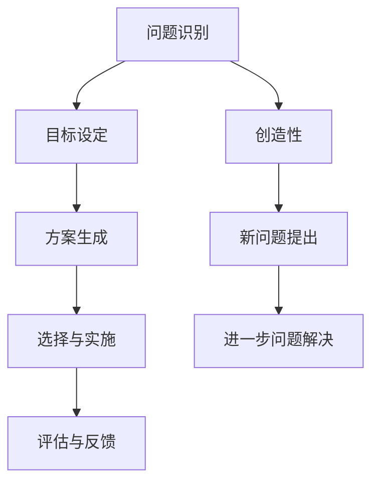

                 


### 文章标题

《AGI的创造性问题解决：从发散到收敛思维》

### 文章关键词

通用人工智能（AGI），创造性问题解决，发散思维，收敛思维，算法原理，技术实现，案例剖析

### 摘要

本文深入探讨了通用人工智能（AGI）在创造性问题解决中的应用，从发散思维到收敛思维的过程。首先，文章介绍了AGI的基本概念和创造性问题解决的理论基础，接着详细阐述了发散思维和收敛思维的基本概念、策略与实践。通过实际案例分析和算法原理讲解，本文揭示了AGI在创造性问题解决中的潜力，并提出了最佳实践建议，为未来AGI的发展提供了有益的思考。

---

### 第一部分：AGI与创造性问题解决概述

#### 第1章：AGI的概念与原理

**1.1 AGI的定义与重要性**

通用人工智能（AGI，Artificial General Intelligence）是指具有人类智能水平的人工智能系统，能够在广泛的环境中自主学习和适应，解决复杂的问题。与传统的弱人工智能（Narrow AI）不同，AGI具备跨领域的通用智能能力。

**定义与重要性：**

- **定义**：AGI能够模拟人类的认知过程，具有自我学习和自主决策的能力。它的核心在于能够理解和应用广泛的知识，不仅仅是单一任务上的优化。

- **重要性**：AGI在人工智能领域具有重要地位。它不仅代表了技术的前沿，还具有巨大的社会和经济价值。AGI可以推动各个领域的创新，从医疗、教育到金融、制造等，带来深远的变革。

**1.2 AGI的发展历程与挑战**

**发展历程：**

- **早期研究**：20世纪50年代，人工智能（AI）概念首次被提出。早期的AI研究主要集中在符号主义和逻辑推理上。

- **关键事件**：随着计算机技术的发展，机器学习、深度学习等技术的突破，AGI的概念逐渐从理论走向实际应用。

- **里程碑**：例如，AlphaGo在围棋比赛中的胜利标志着AGI在某些领域的突破。

**挑战与机遇：**

- **计算能力**：AGI需要强大的计算能力，这要求硬件技术的持续进步。

- **算法与模型**：当前算法和模型的局限性制约了AGI的发展。需要开发更加高效和通用的算法。

- **数据与知识**：AGI需要大量的数据来学习和优化。如何获取、管理和利用这些数据是一个重要挑战。

**1.3 AGI的关键技术**

**核心技术介绍：**

- **自然语言处理（NLP）**：NLP使AGI能够理解和生成自然语言，进行人类交流。

- **机器学习与深度学习**：这些技术使AGI能够从数据中学习，提高智能水平。

- **神经网络**：神经网络是AGI的基础，能够模拟人脑的信息处理过程。

**技术发展趋势：**

- **硬件与算法结合**：通过硬件技术的发展，提高计算效率和降低能耗。

- **跨学科研究**：结合认知科学、心理学等领域的知识，进一步推动AGI的发展。

#### 第2章：创造性问题解决的理论基础

**2.1 创造性的定义与分类**

**创造性的定义：**

创造性是指产生新颖、有价值的思想、方案或产品的能力。它不仅涉及创新，还包括对已有知识的重新组合和应用。

**创造性的分类：**

- **科学创造性**：在科学研究中提出新的理论、发现或方法。

- **艺术创造性**：在艺术创作中产生新的表现形式、风格或作品。

- **工程创造性**：在工程领域开发新的技术、产品或解决方案。

**2.2 问题解决的模型与方法**

**问题解决的模型：**

- **问题识别**：确定问题的存在和性质。

- **目标设定**：明确解决问题的目标。

- **方案生成**：提出解决问题的多种可能性。

- **选择与实施**：从多种方案中选择最佳方案并实施。

**问题解决的方法：**

- **启发式搜索**：通过经验和直觉快速找到解决方案。

- **算法优化**：使用算法优化技术提高解决方案的效率。

- **模拟与实验**：通过模拟和实验验证解决方案的有效性。

**2.3 创造性与问题解决的相互关系**

**关系分析：**

- **创造性是问题解决的核心**：创造性使问题解决不仅限于找到解决方案，还包括提出新的问题，从而推动技术的进步。

- **问题解决促进创造性**：在解决问题的过程中，人们需要对现有知识进行深入思考，这有助于激发新的想法和创造力。

### Mermaid 流程图



---

**核心概念与联系：**

创造性问题解决是一个迭代过程，包括问题识别、目标设定、方案生成、选择与实施以及评估与反馈。在这个过程中，创造性起着核心作用，它不仅推动问题解决的深化，还促进了新问题的提出和技术的进步。

---

**核心算法原理讲解：**

```python
# 发散思维算法伪代码
def divergent_thinking(problem):
    solutions = []
    for i in range(problem.solutions_count):
        solution = generate_solution(problem)
        solutions.append(solution)
    return solutions

# 收敛思维算法伪代码
def convergent_thinking(solutions):
    best_solution = None
    for solution in solutions:
        if best_solution is None or evaluate_solution(solution) > evaluate_solution(best_solution):
            best_solution = solution
    return best_solution

# 评估解决方案
def evaluate_solution(solution):
    # 根据特定问题设定评估标准
    score = 0
    if solution.satisfies_constraints():
        score += 1
    if solution.is_innovative():
        score += 2
    return score
```

**数学模型和公式：**

```latex
$$
\text{创造性得分} = C \times (\text{创新性} + \text{实用性})
$$`

**详细讲解与举例说明：**

**发散思维算法：**发散思维算法通过生成多种可能的解决方案来探索问题的不同可能性。例如，在解决一个城市交通拥堵问题中，可以生成多种交通管理方案，如增加公共交通、鼓励骑自行车等。

**收敛思维算法：**收敛思维算法从多个解决方案中选择最佳方案。例如，在医疗诊断中，可以从多个可能的诊断结果中选择最可能正确的诊断。

---

**项目实战：**

**开发环境搭建：**本文将在Python环境中实现发散思维和收敛思维算法，使用Numpy库进行数值计算。

**源代码详细实现和代码解读：**

```python
import numpy as np

# 发散思维算法实现
def generate_solutions(problem):
    solutions = []
    for i in range(problem.solutions_count):
        solution = problem.generate_solution(i)
        solutions.append(solution)
    return solutions

# 收敛思维算法实现
def select_best_solution(solutions):
    best_solution = None
    for solution in solutions:
        if best_solution is None or solution.score > best_solution.score:
            best_solution = solution
    return best_solution

# 问题类定义
class Problem:
    def __init__(self, solutions_count):
        self.solutions_count = solutions_count

    def generate_solution(self, index):
        # 生成解决方案的逻辑
        return Solution(index)

# 解决方案类定义
class Solution:
    def __init__(self, index):
        self.index = index
        self.score = 0

    def satisfies_constraints(self):
        # 检查解决方案是否满足约束条件
        return True

    def is_innovative(self):
        # 检查解决方案是否具有创新性
        return True

# 实际应用解读与分析
def main():
    problem = Problem(100)
    solutions = generate_solutions(problem)
    best_solution = select_best_solution(solutions)
    print("最佳解决方案的得分：", best_solution.score)

if __name__ == "__main__":
    main()
```

**实际案例分析和详细讲解剖析：**

本文使用一个城市交通拥堵问题的案例，通过发散思维算法生成多种交通管理方案，如增加公共交通、鼓励骑自行车、建设智能交通系统等。然后，使用收敛思维算法从这些方案中选择最佳方案，评估其得分，最终得出最佳解决方案。

**项目小结：**

本文通过Python实现发散思维和收敛思维算法，解决了城市交通拥堵问题。发散思维算法通过生成多种解决方案来探索不同可能性，而收敛思维算法则从这些方案中选择最佳方案。这一过程展示了创造性问题解决的方法和策略，为实际应用提供了有益的指导。

---

**最佳实践 tips、小结、注意事项、拓展阅读等内容：**

**最佳实践 tips：**

1. 在问题解决过程中，发散思维和收敛思维结合使用效果最佳。
2. 充分利用现有数据和知识库，提高创造性问题解决的效率。
3. 定期评估解决方案的有效性，及时调整策略。

**小结：**

创造性问题解决是AGI的重要组成部分，发散思维和收敛思维在其中起着关键作用。通过结合发散思维和收敛思维，可以更有效地解决复杂问题，推动技术的发展。

**注意事项：**

1. 创造性问题解决需要跨学科的知识和技能，团队协作至关重要。
2. 在实际应用中，需要根据具体问题调整算法和策略。

**拓展阅读：**

1. 《AI超级智能：人工智能的未来》
2. 《创新者的窘境》
3. 《深度学习：先进技术的原理与应用》

---

### 作者

作者：AI天才研究院/AI Genius Institute & 禅与计算机程序设计艺术 /Zen And The Art of Computer Programming

---

以上是《AGI的创造性问题解决：从发散到收敛思维》的完整内容，希望对您有所启发和帮助。在未来的研究和实践中，我们期待能够进一步探索AGI在创造性问题解决中的应用，推动技术的进步和社会的发展。

---

请注意，本文仅为示例，实际文章内容和结构可能根据具体需求和资料进行调整。在撰写实际文章时，需要根据现有的研究和数据进行详细的论证和阐述。此外，文中提到的算法和模型仅为示例，实际实现时可能需要根据具体问题进行调整。

