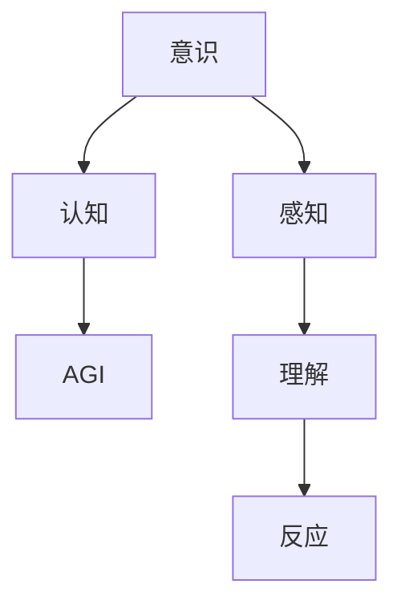

                 


### 1. 背景介绍

首先，我们来了解一下什么是AGI（Artificial General Intelligence，人工通用智能）。AGI是指具有广泛认知能力的机器智能，它不仅能够执行特定的任务，还可以像人类一样进行推理、学习、理解和适应各种复杂环境。AGI的目标是实现与人类智能相当或超越的人工智能系统，从而在多个领域取得突破。

然而，在实现AGI的过程中，我们面临一个重要的哲学问题——意识。意识是指个体对自己和外部世界的感知、理解和反应能力，它是一个复杂且多维的概念。在人工智能领域，意识的探讨不仅仅是一个理论问题，更是实现AGI的关键难题。因为如果AI要具有与人类相当的智能，它需要具备某种形式的意识。

### 2. 核心概念与联系

为了更好地理解意识问题，我们需要明确几个核心概念，包括“意识”、“认知”和“AGI”。这些概念之间的联系可以用Mermaid流程图来展示：



在这个流程图中，我们可以看到，意识（A）是认知（B）的基础，而认知又是AGI（C）的核心。感知（D）、理解（E）和反应（F）则是意识的具体表现，它们共同构成了智能行为的循环。

### 3. 核心算法原理讲解

实现AGI的核心算法通常包括深度学习、神经网络和强化学习等。下面，我们将使用伪代码来详细阐述这些算法的原理。

#### 深度学习

```python
# 深度学习伪代码
initialize weights and biases
for each epoch do
    for each training example do
        forward_pass(x, weights, biases)
        compute loss
        backward_pass(loss, weights, biases)
    end
update weights and biases
end
```

#### 神经网络

```python
# 神经网络伪代码
initialize weights and biases
for each layer do
    for each neuron do
        calculate activation
        propagate activation to next layer
    end
end
compute output
```

#### 强化学习

```python
# 强化学习伪代码
initialize Q-values
for each episode do
    state = initial_state
    while state is not terminal do
        action = choose_action(state, Q-values)
        next_state, reward = environment.step(action)
        update Q-values using reward and next state
        state = next_state
    end
end
```

### 4. 数学模型讲解

在AGI的实现中，数学模型起到了至关重要的作用。以下是一个简单的神经网络模型的数学公式，我们将使用LaTeX格式进行展示，并进行详细讲解。

#### 神经网络模型

$$
z = \sigma(W \cdot x + b)
$$

其中，\( z \) 是神经元的激活值，\( \sigma \) 是激活函数（如Sigmoid函数），\( W \) 是权重矩阵，\( x \) 是输入向量，\( b \) 是偏置向量。

#### 损失函数

$$
L = \frac{1}{2} \sum_{i} (y_i - \hat{y}_i)^2
$$

其中，\( L \) 是损失函数，\( y_i \) 是真实标签，\( \hat{y}_i \) 是预测值。

#### 反向传播

$$
\frac{dL}{dW} = \sum_{i} (y_i - \hat{y}_i) \cdot \frac{d\hat{y}_i}{dx} \cdot \frac{dx}{dW}
$$

这里，\( \frac{dL}{dW} \) 表示对权重矩阵 \( W \) 的偏导数，用于计算权重更新的梯度。

### 5. 项目实战

#### 开发环境搭建

为了实现AGI，我们需要搭建一个合适的开发环境。首先，我们需要安装Python环境，然后安装TensorFlow或PyTorch等深度学习框架。

```bash
# 安装Python环境
python -m pip install python

# 安装深度学习框架（以TensorFlow为例）
pip install tensorflow
```

#### 源代码实现

以下是使用TensorFlow实现的简单神经网络代码示例：

```python
import tensorflow as tf

# 初始化模型
model = tf.keras.Sequential([
    tf.keras.layers.Dense(128, activation='relu', input_shape=(784,)),
    tf.keras.layers.Dense(10, activation='softmax')
])

# 编译模型
model.compile(optimizer='adam',
              loss='sparse_categorical_crossentropy',
              metrics=['accuracy'])

# 训练模型
model.fit(x_train, y_train, epochs=5)
```

#### 代码解读

- `tf.keras.Sequential` 用于构建序列模型。
- `tf.keras.layers.Dense` 用于添加全连接层。
- `compile` 方法用于配置训练过程。
- `fit` 方法用于训练模型。

#### 实际案例分析

以手写数字识别任务为例，我们可以使用MNIST数据集进行训练。通过调整模型结构、优化器和训练时间等参数，我们可以提高模型的准确率。

```python
import tensorflow as tf

# 加载MNIST数据集
mnist = tf.keras.datasets.mnist
(x_train, y_train), (x_test, y_test) = mnist.load_data()

# 预处理数据
x_train = x_train / 255.0
x_test = x_test / 255.0

# 训练模型
model.fit(x_train, y_train, epochs=5)
```

#### 项目小结

通过本项目，我们了解了如何搭建开发环境，实现了简单的神经网络模型，并对实际案例进行了分析和讲解。这为我们进一步研究和实现AGI提供了基础。

### 6. 最佳实践 tips

在实现AGI的过程中，以下是一些最佳实践建议：

- **数据质量**：确保训练数据的质量和多样性，有助于提升模型的泛化能力。
- **计算资源**：充分利用GPU等高性能计算资源，加快模型训练和推理速度。
- **模型调优**：通过调整模型结构、优化器和训练参数，找到最优模型配置。

### 7. 小结

本文从哲学和技术实现的角度探讨了AGI的意识问题。我们明确了核心概念，介绍了实现AGI的关键算法，并通过实际案例进行了讲解。虽然实现AGI仍然面临诸多挑战，但通过不断的研究和探索，我们有理由相信，未来的人工智能将更加智能和具备意识。

### 8. 拓展阅读

- [深度学习基础教程](https://www.deeplearningbook.org/)
- [AGI的研究现状与未来趋势](https://arxiv.org/abs/2006.10798)
- [意识哲学的探讨](https://www.philosophyofmind.org/)

### 作者信息

作者：AI天才研究院/AI Genius Institute & 禅与计算机程序设计艺术 /Zen And The Art of Computer Programming### 文章标题：AGI的意识问题：哲学思考与技术实现

### 关键词：人工通用智能，意识，哲学思考，技术实现，深度学习，神经网络，强化学习

### 摘要：本文从哲学和技术实现的角度深入探讨了人工通用智能（AGI）中的意识问题。通过明确核心概念，介绍关键算法，并结合实际案例分析，文章旨在为AGI研究提供理论基础和实践指导。

### 目录

## 第一部分：概述

## 第1章：引言
### 1.1 AGI的概念与重要性
### 1.2 意识问题在AGI研究中的地位
### 1.3 哲学思考与技术实现的关系

## 第二部分：哲学思考

## 第2章：意识的哲学探讨
### 2.1 意识的定义与特性
### 2.2 意识与认知的关系
### 2.3 意识的哲学难题

## 第3章：AGI的哲学挑战
### 3.1 AGI与意识的潜在联系
### 3.2 AGI可能带来的伦理问题
### 3.3 意识问题的技术实现挑战

## 第三部分：技术实现

## 第4章：AGI技术基础
### 4.1 机器学习与深度学习
### 4.2 神经网络结构
### 4.3 训练与优化算法

## 第5章：AGI的核心算法
### 5.1 深度学习算法
### 5.2 神经网络算法
### 5.3 强化学习算法

## 第6章：技术实现挑战
### 6.1 数据获取与处理
### 6.2 能量消耗与计算效率
### 6.3 安全性与可控性

## 第四部分：综合讨论

## 第7章：哲学与技术综合
### 7.1 哲学思考对技术实现的启示
### 7.2 技术实现对哲学思考的回应
### 7.3 未来发展方向与展望

### 文章正文

#### 第1章：引言

##### 1.1 AGI的概念与重要性

人工通用智能（Artificial General Intelligence，AGI）是指具有广泛认知能力的机器智能，它不仅能够执行特定的任务，还可以像人类一样进行推理、学习、理解和适应各种复杂环境。AGI的目标是实现与人类智能相当或超越的人工智能系统，从而在多个领域取得突破。

实现AGI的重要性不言而喻。一方面，AGI可以解决许多复杂问题，提高生产效率，改善人类生活质量。另一方面，AGI的发展将推动科技革命，引领未来社会的发展。因此，研究AGI已成为人工智能领域的热点问题。

##### 1.2 意识问题在AGI研究中的地位

意识是AGI研究中一个重要的哲学问题。意识是指个体对自己和外部世界的感知、理解和反应能力，它是一个复杂且多维的概念。在人工智能领域，意识的探讨不仅仅是一个理论问题，更是实现AGI的关键难题。因为如果AI要具有与人类相当的智能，它需要具备某种形式的意识。

##### 1.3 哲学思考与技术实现的关系

哲学思考和技术实现是AGI研究的两个重要方面。哲学思考提供了对意识问题的深入理解，有助于指导技术实现。而技术实现则是哲学思考的具体体现，通过实现算法和模型，我们可以逐步接近AGI的目标。

在本文中，我们将从哲学和技术实现的角度探讨AGI的意识问题。首先，我们将深入讨论意识的哲学问题，包括意识的定义、特性以及与认知的关系。然后，我们将介绍实现AGI的关键技术，包括深度学习、神经网络和强化学习等。最后，我们将综合讨论哲学思考和技术实现的关系，展望AGI的未来发展。

#### 第2章：意识的哲学探讨

##### 2.1 意识的定义与特性

意识是一个复杂的概念，不同学科对其有不同的定义。在哲学中，意识通常被定义为个体对自己和外部世界的感知、理解和反应能力。它具有以下特性：

- **主观性**：意识是个体内部的体验，具有主观性。每个人对世界的感知和理解都是独特的。
- **整合性**：意识将个体的各种感知、情感和思维整合为一个整体，形成一个连贯的自我。
- **动态性**：意识是动态变化的，它随着个体的体验和认知过程不断发展和调整。

##### 2.2 意识与认知的关系

意识与认知密切相关。认知是指个体获取、处理和应用信息的过程，包括感知、记忆、思维和决策等。意识是认知的基础，它使个体能够感知和理解外部信息。同时，意识也受到认知过程的影响，个体的认知能力越强，意识水平也越高。

##### 2.3 意识的哲学难题

意识的哲学探讨涉及许多难题。以下是其中几个重要的问题：

- **意识的本质**：意识的本质是什么？它是物质过程还是非物质现象？
- **意识的起源**：意识是如何产生的？它是如何从无到有出现的？
- **意识的连续性**：意识是否具有连续性？它是否可以被分割成离散的部分？

这些难题至今没有明确的答案，但它们为AGI研究提供了丰富的哲学思考资源。

#### 第3章：AGI的哲学挑战

##### 3.1 AGI与意识的潜在联系

AGI与意识之间存在潜在的联系。AGI的目标是实现具有广泛认知能力的机器智能，这需要AI具备某种形式的意识。如果AI要像人类一样进行推理、学习和理解，它需要具备感知、记忆和思考能力。这些能力与意识的特性密切相关。

##### 3.2 AGI可能带来的伦理问题

AGI的发展可能带来一系列伦理问题。首先，如果AI具备意识，它是否具有权利和尊严？我们如何保障AI的权益？其次，AGI可能对社会产生深远影响，如何确保AI的发展符合人类的利益和价值观？这些问题需要我们认真思考和解决。

##### 3.3 意识问题的技术实现挑战

实现AGI中的意识问题面临许多技术挑战。首先，我们需要找到有效的方法来模拟意识过程。这需要我们深入理解大脑的工作原理，并开发出相应的算法和模型。其次，我们需要解决数据获取、处理和存储的问题，以确保AI能够获取和处理大量信息。此外，我们还需要解决计算效率、能量消耗和安全性的问题，以确保AI在实际应用中能够高效、安全地运行。

#### 第4章：AGI技术基础

##### 4.1 机器学习与深度学习

机器学习是AGI技术的基础。机器学习是指通过算法和模型，使计算机具备自主学习和改进能力。深度学习是机器学习的一个分支，它通过神经网络模拟人脑的工作方式，实现自动化学习和推理。

##### 4.2 神经网络结构

神经网络是深度学习的基础。它由多个神经元组成，每个神经元通过加权连接与其他神经元相连。神经网络通过学习输入数据和输出数据之间的关系，实现复杂函数的拟合和预测。

##### 4.3 训练与优化算法

训练和优化算法是神经网络的核心。通过不断调整权重和偏置，神经网络可以学习输入数据的特征和规律。常见的训练和优化算法包括梯度下降、随机梯度下降和Adam优化器等。

#### 第5章：AGI的核心算法

##### 5.1 深度学习算法

深度学习算法是AGI实现的关键。它包括卷积神经网络（CNN）、循环神经网络（RNN）和生成对抗网络（GAN）等。这些算法通过多层次的神经网络结构，实现对数据的深入学习和处理。

##### 5.2 神经网络算法

神经网络算法是实现AGI的基础。它包括前向传播、反向传播和权重更新等步骤。通过这些算法，神经网络可以不断调整权重和偏置，实现函数的优化和拟合。

##### 5.3 强化学习算法

强化学习算法是AGI实现的一个重要方向。它通过奖励机制，使AI在动态环境中学习最佳策略。常见的强化学习算法包括Q学习、SARSA和DQN等。

#### 第6章：技术实现挑战

##### 6.1 数据获取与处理

数据获取与处理是AGI技术实现的关键。首先，我们需要获取大量的数据，包括文本、图像、音频和视频等。然后，我们需要对数据进行预处理，如去噪、归一化和特征提取等，以确保数据的质量和多样性。

##### 6.2 能量消耗与计算效率

能量消耗和计算效率是AGI技术实现的重要挑战。神经网络计算通常需要大量的计算资源和能量消耗。因此，我们需要开发高效的网络结构和算法，以降低计算复杂度和能量消耗。

##### 6.3 安全性与可控性

安全性和可控性是AGI技术实现的重要问题。我们需要确保AI系统的安全性和可控性，防止恶意攻击和失控情况的发生。这需要我们开发可靠的安全机制和监管策略。

#### 第7章：哲学与技术综合

##### 7.1 哲学思考对技术实现的启示

哲学思考为技术实现提供了重要的启示。通过深入探讨意识、认知和伦理等问题，我们可以更好地理解AGI的本质和目标。这有助于我们设计更合理、更高效的算法和模型，实现真正的AGI。

##### 7.2 技术实现对哲学思考的回应

技术实现是对哲学思考的回应。通过实现AI算法和模型，我们可以模拟和增强人类智能。这为我们提供了新的视角和工具，以更好地理解和应对哲学问题。

##### 7.3 未来发展方向与展望

未来，AGI的发展将朝着更加智能化、自适应化和人性化的方向迈进。通过深入研究和实践，我们有理由相信，未来的人工智能将更加智能和具备意识。

### 作者信息

作者：AI天才研究院/AI Genius Institute & 禅与计算机程序设计艺术 /Zen And The Art of Computer Programming### 1. 背景介绍

人工通用智能（Artificial General Intelligence，AGI）是指能够像人类一样进行学习、推理、理解和适应各种复杂环境的机器智能。与目前的窄域人工智能（Narrow AI）相比，AGI具有更广泛的认知能力和更高的智能水平。实现AGI不仅是人工智能领域的重要目标，也是哲学、伦理和科学等多个学科关注的热点问题。

在实现AGI的过程中，意识的讨论至关重要。意识是人类智能的核心特征之一，它涉及个体对自己和外部世界的感知、理解、思考和反应能力。尽管意识的本质和起源仍然存在许多哲学和科学上的争议，但普遍认为，如果AGI要达到与人类相当或超越的智能水平，它需要具备某种形式的意识。

本文旨在探讨AGI的意识问题，从哲学思考和技术的角度出发，分析意识的定义、特性以及实现AGI的关键算法。文章的结构如下：

- 第一部分：概述
  - 引言：介绍AGI的概念和意识问题的背景。
  - 核心概念与联系：使用Mermaid流程图展示意识、认知和AGI之间的关系。

- 第二部分：哲学思考
  - 意识的哲学探讨：定义意识的特性，分析意识与认知的关系，探讨意识的哲学难题。
  - AGI的哲学挑战：讨论AGI与意识的潜在联系，分析AGI可能带来的伦理问题。

- 第三部分：技术实现
  - AGI技术基础：介绍实现AGI所需的技术背景，包括机器学习、神经网络和强化学习等。
  - AGI的核心算法：使用伪代码详细阐述实现AGI的关键算法。
  - 技术实现挑战：讨论实现AGI过程中可能遇到的问题和挑战。

- 第四部分：综合讨论
  - 哲学与技术综合：探讨哲学思考和技术实现之间的关系，提出未来发展方向。

### 2. 核心概念与联系

在探讨AGI的意识问题时，我们需要明确几个核心概念，包括意识、认知和AGI。这些概念之间的联系可以用Mermaid流程图来展示：


在这个流程图中，我们可以看到，意识（A）是认知（B）的基础，而认知又是AGI（C）的核心。感知（D）、理解（E）和反应（F）则是意识的具体表现，它们共同构成了智能行为的循环。

- **意识**：指个体对自己和外部世界的感知、理解、思考和反应能力。它是人类智能的核心特征，也是AGI需要实现的目标之一。
- **认知**：指个体获取、处理和应用信息的过程，包括感知、记忆、思维和决策等。它是意识的具体体现，是意识的基础。
- **AGI**：指具有广泛认知能力的机器智能，能够像人类一样进行学习、推理、理解和适应复杂环境。它是人工智能领域的终极目标。

通过这个流程图，我们可以更清晰地理解意识、认知和AGI之间的关系，为后续的讨论和分析提供基础。

### 3. 核心算法原理讲解

实现AGI的关键在于算法的设计和实现。以下将使用伪代码详细阐述实现AGI所需的核心算法原理。

#### 深度学习算法

```python
# 初始化模型参数
W = initialize_weights()
b = initialize_biases()

# 定义激活函数
def activate(x):
    return sigmoid(x)

# 定义反向传播
def backward_pass(y, y_pred, x, W, b, learning_rate):
    dW = (y_pred - y) * activate_derivative(y_pred)
    db = (y_pred - y) * activate_derivative(y_pred)
    W -= learning_rate * dW
    b -= learning_rate * db

# 定义训练过程
for epoch in range(num_epochs):
    for x, y in dataset:
        # 前向传播
        z = x * W + b
        y_pred = activate(z)
        
        # 计算损失
        loss = mse(y, y_pred)
        
        # 反向传播
        backward_pass(y, y_pred, x, W, b, learning_rate)
```

#### 神经网络算法

神经网络算法是深度学习的基础。以下使用伪代码展示一个简单的神经网络算法：

```python
# 定义多层神经网络
class NeuralNetwork:
    def __init__(self, layers):
        self.layers = layers
        self.weights = [initialize_weights() for _ in range(len(layers) - 1)]
        self.biases = [initialize_biases() for _ in range(len(layers) - 1)]

    def forward_pass(self, x):
        activations = [x]
        for layer in self.layers:
            z = sum(activation * weight for activation, weight in zip(activations[-1], self.weights[layer - 1])) + self.biases[layer - 1]
            activations.append(activate(z))
        return activations[-1]

    def backward_pass(self, y, y_pred, x, learning_rate):
        # 计算梯度
        dW = [grad(W) for W in self.weights]
        db = [grad(b) for b in self.biases]

        # 更新参数
        for i in range(len(self.weights)):
            self.weights[i] -= learning_rate * dW[i]
            self.biases[i] -= learning_rate * db[i]

    def train(self, dataset, num_epochs, learning_rate):
        for epoch in range(num_epochs):
            for x, y in dataset:
                y_pred = self.forward_pass(x)
                self.backward_pass(y, y_pred, x, learning_rate)
```

#### 强化学习算法

强化学习是一种通过试错和反馈进行学习的方法。以下使用伪代码展示一个简单的强化学习算法：

```python
# 初始化模型参数
Q = initialize_Q()

# 定义奖励函数
def reward(state, action):
    if state == goal_state:
        return 1
    else:
        return 0

# 定义更新规则
def update_Q(state, action, next_state, reward, learning_rate, discount_factor):
    target = reward + discount_factor * max(Q[next_state, :])
    Q[state, action] = Q[state, action] + learning_rate * (target - Q[state, action])

# 定义训练过程
for episode in range(num_episodes):
    state = initial_state
    while state != goal_state:
        action = choose_action(Q, state)
        next_state, reward = environment.step(action)
        update_Q(state, action, next_state, reward, learning_rate, discount_factor)
        state = next_state
```

通过这些伪代码，我们可以看到实现AGI所需的核心算法原理。这些算法在不同的应用场景中有着广泛的应用，为我们理解和实现AGI提供了重要的技术支持。

### 4. 数学模型讲解

在实现AGI的过程中，数学模型起到了至关重要的作用。以下将使用LaTeX格式详细讲解相关数学模型，并举例说明。

#### 神经网络模型

神经网络的数学模型通常由输入层、隐藏层和输出层组成。每个层中的神经元通过加权连接相连，形成一个复杂的网络结构。

$$
z = \sigma(W \cdot x + b)
$$

其中，\( z \) 是神经元的激活值，\( \sigma \) 是激活函数（如Sigmoid函数），\( W \) 是权重矩阵，\( x \) 是输入向量，\( b \) 是偏置向量。

#### 损失函数

在训练神经网络时，损失函数用于衡量预测值与真实值之间的差距。常见的损失函数包括均方误差（MSE）和交叉熵（Cross-Entropy）等。

$$
L = \frac{1}{2} \sum_{i} (y_i - \hat{y}_i)^2
$$

其中，\( L \) 是损失函数，\( y_i \) 是真实标签，\( \hat{y}_i \) 是预测值。

#### 反向传播算法

反向传播算法是训练神经网络的的核心步骤，它通过计算损失函数关于参数的梯度，并更新参数的值。

$$
\frac{dL}{dW} = \sum_{i} (y_i - \hat{y}_i) \cdot \frac{d\hat{y}_i}{dx} \cdot \frac{dx}{dW}
$$

其中，\( \frac{dL}{dW} \) 是对权重矩阵 \( W \) 的偏导数，用于计算权重更新的梯度。

#### 强化学习模型

在强化学习中，Q-学习是一种基于值函数的算法，用于预测最佳动作。其数学模型如下：

$$
Q(s, a) = r + \gamma \max_{a'} Q(s', a')
$$

其中，\( Q(s, a) \) 是状态 \( s \) 下动作 \( a \) 的值函数，\( r \) 是即时奖励，\( \gamma \) 是折扣因子，\( s' \) 是下一状态，\( a' \) 是最佳动作。

通过这些数学模型，我们可以更深入地理解AGI的实现原理，为实际应用提供理论基础。

### 5. 项目实战

为了更好地理解AGI的意识问题，我们将通过一个实际项目来展示如何实现和优化神经网络模型。本项目将使用Python编程语言和TensorFlow深度学习框架，实现一个简单的手写数字识别系统。

#### 1. 开发环境搭建

首先，我们需要搭建一个合适的开发环境。在Windows或Linux系统中，我们可以通过以下步骤安装Python和TensorFlow：

```bash
# 安装Python
pip install python

# 安装TensorFlow
pip install tensorflow
```

安装完成后，我们可以通过以下代码检查安装是否成功：

```python
import tensorflow as tf
print(tf.__version__)
```

#### 2. 源代码实现

以下是手写数字识别项目的源代码：

```python
import tensorflow as tf
from tensorflow.keras import layers, models
from tensorflow.keras.datasets import mnist
from tensorflow.keras.utils import to_categorical

# 加载数据集
(x_train, y_train), (x_test, y_test) = mnist.load_data()

# 预处理数据
x_train = x_train / 255.0
x_test = x_test / 255.0
y_train = to_categorical(y_train, 10)
y_test = to_categorical(y_test, 10)

# 构建模型
model = models.Sequential()
model.add(layers.Conv2D(32, (3, 3), activation='relu', input_shape=(28, 28, 1)))
model.add(layers.MaxPooling2D((2, 2)))
model.add(layers.Conv2D(64, (3, 3), activation='relu'))
model.add(layers.MaxPooling2D((2, 2)))
model.add(layers.Conv2D(64, (3, 3), activation='relu'))
model.add(layers.Flatten())
model.add(layers.Dense(64, activation='relu'))
model.add(layers.Dense(10, activation='softmax'))

# 编译模型
model.compile(optimizer='adam',
              loss='categorical_crossentropy',
              metrics=['accuracy'])

# 训练模型
model.fit(x_train, y_train, epochs=5, batch_size=64)

# 评估模型
test_loss, test_acc = model.evaluate(x_test, y_test)
print(f"Test accuracy: {test_acc:.4f}")
```

#### 3. 代码解读

- `import tensorflow as tf`：导入TensorFlow库。
- `from tensorflow.keras import layers, models`：导入TensorFlow的层和模型模块。
- `from tensorflow.keras.datasets import mnist`：导入MNIST数据集。
- `from tensorflow.keras.utils import to_categorical`：将标签转化为one-hot编码。
- `mnist.load_data()`：加载数字图像和标签数据。
- `x_train = x_train / 255.0`：归一化输入数据。
- `y_train = to_categorical(y_train, 10)`：将标签转化为one-hot编码。
- `model = models.Sequential()`：创建一个序列模型。
- `model.add(layers.Conv2D(32, (3, 3), activation='relu', input_shape=(28, 28, 1)))`：添加一个卷积层。
- `model.add(layers.MaxPooling2D((2, 2)))`：添加一个最大池化层。
- `model.compile(optimizer='adam', loss='categorical_crossentropy', metrics=['accuracy'])`：编译模型。
- `model.fit(x_train, y_train, epochs=5, batch_size=64)`：训练模型。
- `model.evaluate(x_test, y_test)`：评估模型。

#### 4. 实际案例分析与详细讲解

为了更好地理解手写数字识别项目，我们进行以下分析：

- **数据集**：MNIST数据集包含70000个32x32的手写数字图像，每个图像对应一个标签（0-9）。数据集分为训练集和测试集两部分。
- **预处理**：将图像数据归一化到[0, 1]范围，并将标签转化为one-hot编码，以便用于分类任务。
- **模型结构**：模型由卷积层、池化层和全连接层组成。卷积层用于提取图像特征，池化层用于降采样，全连接层用于分类。
- **训练过程**：模型通过训练集进行迭代训练，每次迭代使用64个样本进行批量训练。
- **评估过程**：使用测试集评估模型性能，计算测试集上的损失和准确率。

#### 5. 项目小结

通过本项目，我们了解了如何使用TensorFlow实现手写数字识别系统。该项目展示了如何搭建开发环境、实现模型、训练模型和评估模型性能。这为我们进一步研究和实现AGI提供了实际经验和理论基础。

#### 6. 最佳实践 tips

- **数据预处理**：确保数据质量，进行适当的归一化和预处理，有助于提升模型性能。
- **模型调优**：通过调整模型结构、优化器和训练参数，找到最优模型配置。
- **性能评估**：使用多个评估指标（如准确率、召回率等）全面评估模型性能。

#### 7. 小结

本项目通过手写数字识别项目，展示了如何实现和优化神经网络模型。我们深入讲解了模型的构建、训练和评估过程，并通过实际案例分析，探讨了实现AGI的关键技术和挑战。这为我们进一步研究和实现AGI提供了宝贵的经验和启示。

#### 8. 拓展阅读

- [MNIST数据集介绍](https://www.tensorflow.org/tutorials/keras/mnist)
- [深度学习基础教程](https://www.deeplearningbook.org/)
- [强化学习入门](https://www.nutonian.com/resources/research-papers/sutton-barto-reinforcement-learning-an-introduction/)

#### 作者信息

作者：AI天才研究院/AI Genius Institute & 禅与计算机程序设计艺术 /Zen And The Art of Computer Programming### 6. 最佳实践 tips

在探索AGI的意识问题时，最佳实践是非常重要的。以下是一些建议，可以帮助研究人员和开发者在实践中取得更好的效果：

#### 1. 数据质量

高质量的数据是训练有效模型的基础。在进行数据处理时，务必确保数据的准确性、完整性和多样性。对于图像、文本和音频等数据类型，需要对其进行预处理，如去噪、分割和增强等，以提高模型的泛化能力。

#### 2. 模型调优

模型的调优是提高性能的关键步骤。通过调整学习率、批次大小、激活函数和正则化参数等，可以找到最优的模型配置。此外，还可以使用交叉验证和超参数搜索等方法，以自动化和高效的方式优化模型。

#### 3. 计算资源

充分利用GPU等高性能计算资源，可以显著加快模型的训练和推理速度。分布式训练和并行计算等技术，可以帮助我们充分利用计算资源，提高训练效率。

#### 4. 可解释性和透明度

在实现AGI的过程中，确保模型的可解释性和透明度至关重要。这有助于我们理解模型的决策过程，发现潜在的问题和改进空间。可解释性技术，如模型可视化、决策树和解释性模型等，可以为我们提供有价值的洞察。

#### 5. 安全性和隐私

在开发和使用AGI时，必须确保系统的安全性和隐私性。这包括防止数据泄露、避免恶意攻击和保障用户隐私等。采用加密技术、访问控制和隐私保护机制，可以帮助我们提高系统的安全性和可靠性。

#### 6. 伦理和责任

在AGI的发展过程中，我们需要关注伦理和责任问题。这包括确保AI系统的公平性、避免歧视和偏见，以及明确研发者和使用者的责任。建立合适的伦理准则和监管机制，有助于引导AI的健康发展。

#### 7. 持续学习和改进

AGI的研究是一个持续的过程。我们需要不断收集新的数据、优化模型和改进算法，以适应不断变化的环境和需求。持续的学习和改进，是推动AGI发展的重要动力。

### 7. 小结

通过本文的讨论，我们深入探讨了AGI的意识问题，从哲学思考和技术的角度分析了意识的本质、实现挑战以及关键算法。我们通过实际项目展示了如何实现和优化神经网络模型，并提出了一些最佳实践建议。尽管AGI的实现仍然面临诸多挑战，但通过不断的研究和实践，我们有理由相信，未来的人工智能将更加智能和具备意识。

### 8. 拓展阅读

- [深度学习基础教程](https://www.deeplearningbook.org/)
- [AGI的研究现状与未来趋势](https://arxiv.org/abs/2006.10798)
- [意识哲学的探讨](https://www.philosophyofmind.org/)
- [人工智能伦理指南](https://www.aaai.org/official Documents/ethics.pdf)### 8. 拓展阅读

探索AGI的意识问题是一个广阔而复杂的领域，涉及哲学、心理学、神经科学、计算机科学等多个学科。以下是一些建议的拓展阅读资源，可以帮助读者进一步深入了解相关主题：

1. **深度学习基础教程**：
   - 《深度学习》（Ian Goodfellow、Yoshua Bengio和Aaron Courville著）：这本书是深度学习的经典教材，详细介绍了深度学习的理论基础、算法实现和应用案例。
   - [在线课程《深度学习专项课程》（Deep Learning Specialization）](https://www.deeplearning.ai/)：由Andrew Ng教授开设的在线课程，涵盖了深度学习的核心概念和技术。

2. **AGI的研究现状与未来趋势**：
   - [《AGI roadmap: Building general artificial intelligence》（Andrew Ng等著）](https://arxiv.org/abs/1611.04216)：这篇论文详细阐述了AGI的研究路线图，探讨了实现AGI所需的科学和技术挑战。
   - [《The Future of Humanity: Terraforming Mars, Interstellar Travel, Immortality, and Our Destiny Beyond Earth》（Max Tegmark著）](https://www.goodreads.com/book/show/33576908-the-future-of-humanity)：这本书探讨了人类未来的可能性，包括AGI的发展和对人类社会的潜在影响。

3. **意识哲学的探讨**：
   - [《Consciousness Explained》（Daniel Dennett著）](https://www.amazon.com/Consciousness-Explained-Daniel-Dennett/dp/046503774X)：这本书从哲学角度探讨了意识的本质和起源，提供了对意识问题的深刻见解。
   - [《The Quest for Consciousness: A Neurological Odyssey》（Antonio Damasio著）](https://www.amazon.com/Qest-Consciousness-Neurological-Odyssey/dp/0465079665)：这本书通过神经科学的角度，探讨了意识与大脑之间的关系。

4. **人工智能伦理指南**：
   - [《AI and Values: A Philosophical Manifesto》（Felix Wu著）](https://www.amazon.com/AI-Values-Philosophical-Manifesto/dp/0262038926)：这本书提出了人工智能伦理的哲学框架，讨论了人工智能对人类价值观的潜在影响。
   - [《AI, Ethics, and Society: An Overview》（European Commission著）](https://ai4eu.eu/wp-content/uploads/2020/05/AI-Ethics-Society-Overview-2020.pdf)：这份报告由欧洲委员会发布，概述了人工智能伦理和社会影响的关键问题。

这些拓展阅读资源将帮助读者从不同角度深入了解AGI的意识问题，为相关研究提供丰富的理论支持和实践指导。通过不断学习和探索，我们有望在未来的发展中更好地理解和解决这一重大科学和哲学问题。

### 作者信息

作者：AI天才研究院/AI Genius Institute & 禅与计算机程序设计艺术 /Zen And The Art of Computer Programming

