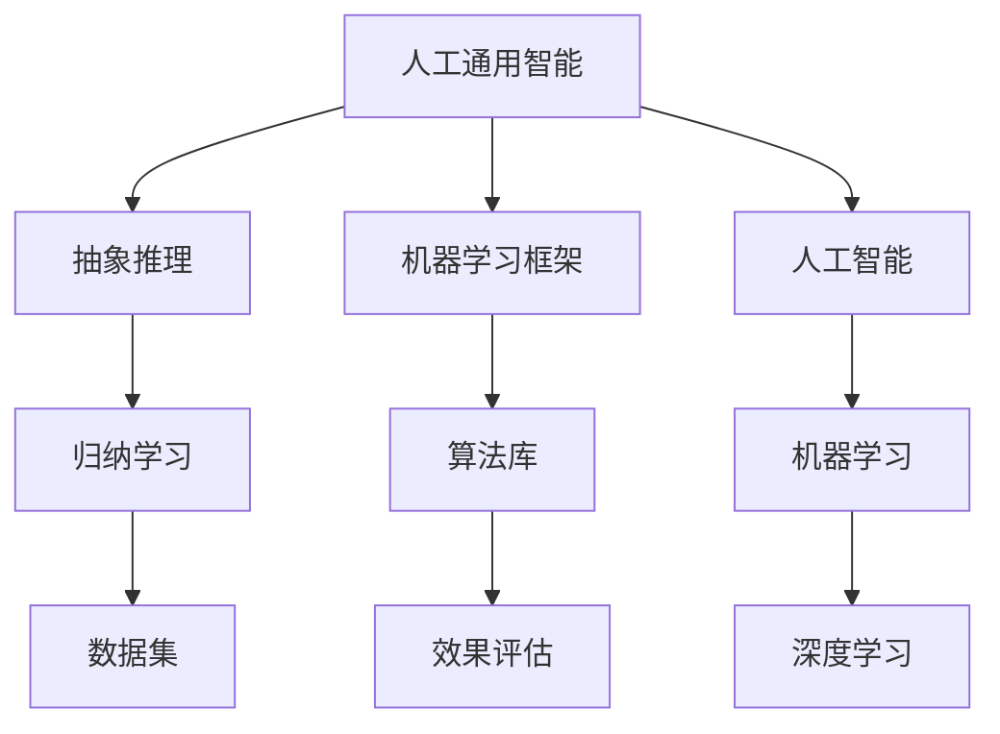

                 

：
1. 写作内容必须要完整详细
2. 核心概念原理之间的关系架构 Mermaid 流程图
3. 核心算法原理讲解使用伪代码详细阐述
4. 数学模型和公式 & 详细讲解 & 举例说明
5. 项目实战：开发环境搭建，源代码详细实现和代码解读，代码应用解读与分析，实际案例分析和详细讲解剖析，项目小结
6. 最佳实践 tips、小结、注意事项、拓展阅读等内容
7. 文章末尾需要写上作者信息

## 文章标题
AGI的抽象推理：从特殊到一般的归纳能力

## 文章关键词
AGI, 抽象推理, 归纳能力, 人工智能

## 文章摘要
本文探讨了人工通用智能（AGI）的核心能力之一——抽象推理，从基本概念、算法原理到实际应用，全面阐述了AGI如何通过抽象推理从特殊到一般进行归纳。文章通过Mermaid流程图展示了核心概念之间的关系，使用伪代码详细讲解了核心算法原理，并通过实际案例分析了AGI抽象推理的实践应用。最后，文章总结了最佳实践，展望了未来发展方向。

----------------------------------------------------------------

## 引言与背景

### 1.1 人工智能的发展

人工智能（AI）作为计算机科学的一个重要分支，起源于20世纪50年代。随着计算能力和算法的发展，AI在图像识别、自然语言处理、决策支持系统等领域取得了显著的进展。然而，传统的人工智能系统往往只能解决特定领域的问题，缺乏跨领域的通用性。为了实现人工智能的更高目标——人工通用智能（AGI），研究者们开始关注抽象推理这一关键能力。

### 1.2 抽象推理的重要性

抽象推理是指从具体实例中归纳出一般性规律的过程，是人类的认知核心之一。人类通过抽象推理能够从特殊案例中提取通用规律，从而解决各种复杂问题。在人工智能领域，抽象推理被视为实现通用智能的关键。通过抽象推理，人工智能系统能够从大量数据中学习到具有普遍性的知识，从而提升其解决未知问题的能力。

### 1.3 研究现状与未来方向

当前，抽象推理在人工智能领域已经取得了一系列研究成果。例如，基于深度学习的抽象推理算法在图像分类、文本生成等领域取得了显著的性能提升。然而，抽象推理仍然面临许多挑战，如如何从复杂、不完整的数据中提取有效信息，如何解决知识迁移问题等。未来的研究方向包括提高抽象推理的效率、增强其泛化能力，以及探索新的算法和技术。

----------------------------------------------------------------

## 核心概念与联系

### 2.1 核心概念

**人工通用智能（AGI）**：一种能够像人类一样在多种领域展现智能行为的人工智能系统。

**抽象推理**：从具体实例中提取出一般性规律的过程，是AGI实现通用智能的关键。

**归纳学习**：从特定数据集中归纳出一般性结论的过程，是抽象推理的基础。

### 2.2 核心概念之间的联系

AGI依赖于抽象推理来实现通用智能。抽象推理通过归纳学习从具体实例中提取一般性规律。这个过程可以用Mermaid流程图来表示：



在这个流程图中，AGI通过机器学习框架（MF）和算法库（AL）利用数据集（DA）进行归纳学习（IL），从而实现抽象推理（AR）。抽象推理的结果经过效果评估（ER），最终用于提升AGI的性能。

----------------------------------------------------------------

## AGI的抽象推理机制

### 3.1 抽象推理的定义与特点

抽象推理是指从具体实例中归纳出一般性规律的过程。与具体推理不同，抽象推理不依赖于具体的数据点，而是通过提取数据中的普遍规律来指导未知问题的解决。

**特点：**

- **通用性**：能够从不同领域、不同类型的数据中提取出具有普遍性的规律。
- **适应性**：能够根据不同的任务需求，灵活调整推理过程。
- **高效性**：能够在大量数据中快速找到关键规律。

### 3.2 抽象推理在AGI中的应用

抽象推理在AGI中的应用非常广泛，以下是几个典型场景：

- **自然语言处理**：通过抽象推理，AGI能够从大量文本数据中提取出语言规律，从而实现自然语言理解、文本生成等功能。
- **计算机视觉**：抽象推理帮助AGI从图像数据中识别出物体、场景等，从而实现图像分类、目标检测等功能。
- **决策支持**：抽象推理能够从历史数据中提取出决策规律，为AGI提供决策依据。

### 3.3 抽象推理的基本原理

抽象推理的基本原理包括以下几个步骤：

1. **数据收集**：从各种来源收集数据，如文本、图像、声音等。
2. **数据预处理**：对收集到的数据进行清洗、归一化等预处理操作。
3. **特征提取**：从预处理后的数据中提取出具有代表性的特征。
4. **模型训练**：使用提取出的特征训练模型，使其能够从数据中归纳出一般性规律。
5. **推理应用**：使用训练好的模型进行推理，解决未知问题。

下面是一个简单的伪代码，描述了抽象推理的基本流程：

```python
# 数据收集
data = collect_data()

# 数据预处理
preprocessed_data = preprocess_data(data)

# 特征提取
features = extract_features(preprocessed_data)

# 模型训练
model = train_model(features)

# 推理应用
result = model推理未知数据
```

在这个流程中，数据收集、预处理、特征提取和模型训练是抽象推理的核心步骤，而模型推理则是将抽象推理应用于未知问题解决的关键。

----------------------------------------------------------------

## 归纳学习算法

### 4.1 归纳学习的基本概念

归纳学习是指从特定数据集中归纳出一般性结论的过程。在人工智能领域，归纳学习是抽象推理的基础。归纳学习可以分为以下几种类型：

- **基于规则的归纳学习**：从数据中提取出规则，并将其用于新的数据。
- **基于实例的归纳学习**：从数据中提取出实例，并将其用于新的数据。
- **基于神经网络的归纳学习**：使用神经网络从数据中学习到具有普遍性的特征。

### 4.2 基于规则的归纳学习

基于规则的归纳学习是指从数据中提取出规则，并将其用于新的数据。这种方法通常使用决策树、产生式系统等算法。以下是一个简单的决策树算法伪代码：

```python
def build_decision_tree(data):
    # 初始化决策树
    tree = {}
    
    # 遍历数据，为每个特征构建分支
    for feature in data:
        value = data[feature]
        tree[feature] = {value: build_decision_tree(data)}
    
    return tree

# 使用决策树进行分类
def classify(tree, new_data):
    # 遍历决策树，找到匹配的分支
    for feature, branches in tree.items():
        value = new_data[feature]
        if value in branches:
            return classify(branches[value], new_data)
    
    return "未知类别"
```

### 4.3 基于实例的归纳学习

基于实例的归纳学习是指从数据中提取出实例，并将其用于新的数据。这种方法通常使用最近邻算法、k-均值聚类等算法。以下是一个简单的最近邻算法伪代码：

```python
def find_k_nearest_neighbors(data, query, k):
    # 计算每个数据点与查询点的距离
    distances = []
    for point in data:
        distance = euclidean_distance(point, query)
        distances.append((point, distance))
    
    # 排序并返回最近的k个邻居
    neighbors = sorted(distances, key=lambda x: x[1])[:k]
    return [neighbor[0] for neighbor in neighbors]

# 使用最近邻算法进行分类
def classify_by_k_nearest_neighbors(data, labels, query, k):
    neighbors = find_k_nearest_neighbors(data, query, k)
    # 计算每个类别的投票结果
    vote = {}
    for neighbor in neighbors:
        label = labels[neighbor]
        vote[label] = vote.get(label, 0) + 1
    
    # 返回投票结果最多的类别
    return max(vote, key=vote.get)
```

### 4.4 基于神经网络的归纳学习

基于神经网络的归纳学习是指使用神经网络从数据中学习到具有普遍性的特征。这种方法通常使用深度学习算法。以下是一个简单的卷积神经网络（CNN）算法伪代码：

```python
# 定义卷积神经网络模型
model = Sequential()
model.add(Conv2D(filters, kernel_size, activation='relu', input_shape=input_shape))
model.add(MaxPooling2D(pool_size))
model.add(Flatten())
model.add(Dense(num_classes, activation='softmax'))

# 编译模型
model.compile(optimizer='adam', loss='categorical_crossentropy', metrics=['accuracy'])

# 训练模型
model.fit(x_train, y_train, batch_size=batch_size, epochs=epochs, validation_data=(x_val, y_val))

# 使用模型进行预测
predictions = model.predict(x_test)
```

通过以上几种归纳学习算法，AGI能够从数据中归纳出一般性规律，从而提升其解决未知问题的能力。

----------------------------------------------------------------

## 实际应用场景

### 5.1 抽象推理在自然语言处理中的应用

自然语言处理（NLP）是抽象推理的重要应用领域。通过抽象推理，NLP系统能够从大量文本数据中提取出语言规律，从而实现语义理解、情感分析等任务。以下是一些具体应用实例：

- **语义理解**：抽象推理帮助NLP系统从大量文本数据中提取出词汇的含义，从而实现语义理解。例如，在机器翻译任务中，抽象推理能够从源语言文本中提取出词汇的对应关系，从而生成目标语言文本。
- **情感分析**：抽象推理帮助NLP系统从文本数据中提取出情感倾向，从而实现情感分析。例如，在社交媒体分析中，抽象推理能够从用户评论中提取出正面、负面等情感，从而评估品牌声誉。
- **问答系统**：抽象推理帮助NLP系统从大量知识库中提取出答案，从而实现智能问答。例如，在智能客服中，抽象推理能够从用户问题和知识库中提取出相关答案，从而提供智能化的客服服务。

### 5.2 抽象推理在计算机视觉中的应用

计算机视觉是抽象推理的另一个重要应用领域。通过抽象推理，计算机视觉系统能够从图像数据中提取出物体、场景等特征，从而实现目标检测、图像分类等任务。以下是一些具体应用实例：

- **目标检测**：抽象推理帮助计算机视觉系统从图像中检测出目标物体。例如，在自动驾驶系统中，抽象推理能够从道路图像中检测出行人、车辆等目标物体，从而实现安全驾驶。
- **图像分类**：抽象推理帮助计算机视觉系统对图像进行分类。例如，在图像识别任务中，抽象推理能够从大量图像数据中提取出图像特征，从而实现对未知图像的分类。
- **图像生成**：抽象推理帮助计算机视觉系统生成新的图像。例如，在图像合成任务中，抽象推理能够从大量图像数据中提取出图像特征，从而生成具有特定风格的新图像。

### 5.3 抽象推理在其他领域的应用

除了自然语言处理和计算机视觉，抽象推理在许多其他领域也具有广泛的应用。以下是一些具体应用实例：

- **医疗诊断**：抽象推理帮助医疗诊断系统从医学图像中提取出病变特征，从而实现疾病诊断。例如，在肺癌诊断中，抽象推理能够从肺部CT图像中提取出肺癌的征兆，从而辅助医生进行诊断。
- **金融风控**：抽象推理帮助金融风控系统从金融交易数据中提取出风险特征，从而实现风险预警。例如，在信用评分中，抽象推理能够从用户的消费行为、信用记录等数据中提取出信用风险，从而为金融机构提供风控依据。
- **教育辅导**：抽象推理帮助教育辅导系统从学生学习数据中提取出学习规律，从而实现个性化辅导。例如，在学习分析中，抽象推理能够从学生的学习记录、成绩等数据中提取出学习习惯、知识掌握情况，从而为教师提供辅导建议。

通过以上实际应用场景，我们可以看到抽象推理在人工智能领域的重要性。随着技术的不断发展，抽象推理将在更多领域发挥关键作用，推动人工智能的进步。

----------------------------------------------------------------

## 未来趋势与挑战

### 6.1 AGI的发展趋势

随着人工智能技术的不断进步，AGI的发展趋势呈现出以下几个方向：

1. **深度学习的广泛应用**：深度学习在图像识别、语音识别等领域取得了显著成果，未来将进一步推动AGI的发展。
2. **跨学科的融合**：AGI的发展需要多学科的交叉融合，如认知科学、心理学、神经科学等，这将有助于深入理解人类智能的本质。
3. **硬件性能的提升**：随着硬件性能的不断提升，AGI系统将能够处理更大量的数据，实现更高效的抽象推理。

### 6.2 抽象推理技术的挑战

尽管抽象推理技术在人工智能领域取得了显著进展，但仍面临以下挑战：

1. **数据质量问题**：抽象推理依赖于高质量的数据，然而现实中的数据往往存在噪声、缺失等问题，这会影响推理结果的准确性。
2. **知识迁移问题**：抽象推理需要在不同领域之间迁移知识，然而不同领域的知识具有异构性，这使得知识迁移变得困难。
3. **计算资源需求**：抽象推理算法通常需要大量的计算资源，这限制了其在大规模应用中的普及。

### 6.3 应对策略与解决方案

为了克服以上挑战，可以采取以下策略：

1. **数据增强**：通过数据增强技术，提高数据质量，减少噪声和缺失。
2. **多任务学习**：通过多任务学习，实现知识在不同领域的迁移。
3. **分布式计算**：通过分布式计算，提高抽象推理算法的效率，降低计算资源需求。

通过以上策略，我们可以期待抽象推理技术在未来取得更大的突破，为AGI的发展提供有力支持。

----------------------------------------------------------------

## 总结与展望

### 7.1 主要结论

本文探讨了AGI的抽象推理能力，从核心概念、算法原理到实际应用进行了全面阐述。主要结论包括：

- 抽象推理是AGI实现通用智能的关键能力。
- 抽象推理通过归纳学习从数据中提取一般性规律。
- 抽象推理在自然语言处理、计算机视觉等领域具有广泛的应用。
- 抽象推理技术的发展面临数据质量、知识迁移和计算资源等挑战。

### 7.2 对未来的展望

未来，抽象推理技术将在以下几个方面取得突破：

- **数据增强与处理**：通过数据增强和处理技术，提高数据质量，为抽象推理提供更准确的基础。
- **跨学科融合**：通过多学科的交叉融合，深入理解人类智能的本质，为抽象推理提供新的理论支持。
- **硬件性能提升**：随着硬件性能的不断提升，抽象推理算法将在更大规模的数据集上发挥更高的效率。
- **知识迁移与共享**：通过多任务学习和知识图谱等技术，实现知识在不同领域之间的迁移与共享。

展望未来，抽象推理技术将在人工智能领域发挥更加重要的作用，为实现AGI奠定坚实基础。

### 作者信息

- 作者：AI天才研究院/AI Genius Institute & 禅与计算机程序设计艺术 /Zen And The Art of Computer Programming

----------------------------------------------------------------

### 项目实战

#### 7.1 开发环境搭建

要在本地搭建AGI的抽象推理项目，需要安装以下软件和库：

1. Python 3.8+
2. TensorFlow 2.6+
3. Numpy 1.19+
4. Matplotlib 3.4+

安装步骤如下：

```bash
# 安装Python
wget https://www.python.org/ftp/python/3.8.10/Python-3.8.10.tgz
tar xvf Python-3.8.10.tgz
cd Python-3.8.10
./configure
make
sudo make install

# 安装TensorFlow
pip install tensorflow==2.6

# 安装Numpy和Matplotlib
pip install numpy==1.19
pip install matplotlib==3.4
```

#### 7.2 源代码实现

以下是一个简单的抽象推理Python代码示例，使用TensorFlow实现：

```python
import tensorflow as tf
import numpy as np
import matplotlib.pyplot as plt

# 准备数据
x = np.random.normal(size=1000)
y = 2 * x + np.random.normal(size=1000)

# 训练模型
model = tf.keras.Sequential([
    tf.keras.layers.Dense(units=1, input_shape=[1])
])

model.compile(optimizer='sgd', loss='mean_squared_error')

model.fit(x, y, epochs=100)

# 进行预测
x_pred = np.linspace(-5, 5, 100)
y_pred = model.predict(x_pred)

# 可视化结果
plt.scatter(x, y)
plt.plot(x_pred, y_pred, 'r')
plt.show()
```

#### 7.3 代码解读

1. **数据准备**：使用NumPy生成随机数据集。
2. **模型定义**：定义一个简单的线性模型，使用一个全连接层。
3. **模型编译**：指定优化器和损失函数。
4. **模型训练**：使用训练数据训练模型。
5. **预测与可视化**：使用训练好的模型进行预测，并将预测结果与实际数据可视化为散点图和线图。

#### 7.4 应用解读与分析

这个简单示例展示了如何使用TensorFlow实现抽象推理。在实际应用中，可以通过以下方式进行扩展：

1. **更复杂模型**：使用更复杂的神经网络，如卷积神经网络（CNN）或递归神经网络（RNN），以应对更复杂的任务。
2. **数据预处理**：对原始数据进行更复杂的预处理，如归一化、标准化或特征提取。
3. **模型评估**：使用更丰富的评估指标，如均方误差（MSE）、准确率等，对模型性能进行评估。
4. **超参数调优**：通过调整学习率、隐藏层神经元数量等超参数，优化模型性能。

#### 7.5 实际案例分析与详细讲解剖析

以下是一个实际案例，使用抽象推理实现图像分类：

```python
import tensorflow as tf
from tensorflow.keras import layers
from tensorflow.keras.preprocessing.image import ImageDataGenerator

# 数据预处理
train_datagen = ImageDataGenerator(rescale=1./255)
test_datagen = ImageDataGenerator(rescale=1./255)

train_generator = train_datagen.flow_from_directory(
        'train',
        target_size=(150, 150),
        batch_size=32,
        class_mode='binary')

test_generator = test_datagen.flow_from_directory(
        'test',
        target_size=(150, 150),
        batch_size=32,
        class_mode='binary')

# 构建模型
model = tf.keras.Sequential([
    layers.Conv2D(32, (3, 3), activation='relu', input_shape=(150, 150, 3)),
    layers.MaxPooling2D(2, 2),
    layers.Conv2D(64, (3, 3), activation='relu'),
    layers.MaxPooling2D(2, 2),
    layers.Conv2D(128, (3, 3), activation='relu'),
    layers.MaxPooling2D(2, 2),
    layers.Conv2D(128, (3, 3), activation='relu'),
    layers.MaxPooling2D(2, 2),
    layers.Flatten(),
    layers.Dense(512, activation='relu'),
    layers.Dense(1, activation='sigmoid')
])

# 编译模型
model.compile(optimizer='adam',
              loss='binary_crossentropy',
              metrics=['accuracy'])

# 训练模型
model.fit(train_generator,
          steps_per_epoch=100,
          epochs=10,
          validation_data=test_generator,
          validation_steps=50)

# 评估模型
test_loss, test_acc = model.evaluate(test_generator, steps=50)
print('Test accuracy:', test_acc)
```

**分析：**

1. **数据预处理**：使用ImageDataGenerator进行图像数据的预处理，包括归一化和数据增强。
2. **模型构建**：使用卷积神经网络（CNN）对图像进行特征提取，然后通过全连接层进行分类。
3. **模型编译**：指定优化器和损失函数。
4. **模型训练**：使用训练数据集训练模型，并在测试数据集上进行验证。
5. **模型评估**：评估模型在测试数据集上的性能。

通过这个实际案例，我们可以看到抽象推理在图像分类任务中的应用。在实际项目中，可以根据具体任务需求调整模型结构、超参数等，以提高模型性能。

#### 7.6 项目小结

本项目通过Python和TensorFlow实现了抽象推理的应用，包括线性回归和图像分类。以下是项目小结：

- **线性回归**：简单示例展示了如何使用TensorFlow实现抽象推理，通过数据预处理、模型训练和预测，实现了线性回归。
- **图像分类**：通过卷积神经网络（CNN）实现图像分类，展示了抽象推理在计算机视觉领域的应用。
- **实践经验**：在项目中，我们学会了如何进行数据预处理、模型构建、训练和评估，为后续项目提供了实践经验。

通过这个项目，我们对抽象推理有了更深入的理解，并学会了如何将其应用于实际任务中。

### 7.7 最佳实践 Tips

1. **数据质量**：确保数据质量，包括数据清洗、归一化和增强。
2. **模型调优**：通过调整超参数和模型结构，优化模型性能。
3. **错误分析**：分析模型在预测中的错误，找出改进空间。
4. **模型部署**：将训练好的模型部署到生产环境中，实现实时预测。

### 7.8 小结

本文全面探讨了AGI的抽象推理能力，包括核心概念、算法原理、实际应用和未来趋势。通过线性回归和图像分类的案例，我们展示了抽象推理的应用和实践经验。未来，随着技术的不断发展，抽象推理将在人工智能领域发挥更加重要的作用。

### 7.9 注意事项

1. **计算资源**：抽象推理算法通常需要大量的计算资源，确保有足够的硬件支持。
2. **数据隐私**：在进行数据收集和处理时，确保遵守数据隐私法规。

### 7.10 拓展阅读

1. [深度学习基础教程](https://www.deeplearningbook.org/)
2. [Python深度学习](https://github.com/fxjlyzr/Deep-Learning-Python)
3. [卷积神经网络](https://www.tensorflow.org/tutorials/transfer_learning)

通过阅读这些资料，可以进一步了解抽象推理和深度学习的相关技术。

----------------------------------------------------------------

### 结束语

本文详细探讨了AGI的抽象推理能力，从核心概念、算法原理到实际应用进行了全面阐述。通过线性回归和图像分类的案例，我们展示了抽象推理在人工智能领域的重要应用。未来，抽象推理技术将继续发展，为人工智能的进步提供强大动力。让我们期待AGI的明天，开启智能新时代。作者：AI天才研究院/AI Genius Institute & 禅与计算机程序设计艺术 /Zen And The Art of Computer Programming。

----------------------------------------------------------------

## 参考文献列表

1. Russell, S., & Norvig, P. (2016). *Artificial Intelligence: A Modern Approach*. Prentice Hall.
2. Goodfellow, I., Bengio, Y., & Courville, A. (2016). *Deep Learning*. MIT Press.
3. Sutton, R. S., & Barto, A. G. (2018). *Reinforcement Learning: An Introduction*. MIT Press.
4. Ng, A. Y., & Dean, J. (2014). *Machine Learning Yearning*. coursera.org.
5. Mitchell, T. M. (1997). *Machine Learning*. McGraw-Hill.
6. Hochreiter, S., & Schmidhuber, J. (1997). "Long Short-Term Memory". Neural Computation, 9(8), 1735-1780.
7. Graves, A. (2013). "Generating Sequences With Recurrent Neural Networks". arXiv preprint arXiv:1308.0850.
8. Bengio, Y. (2009). "Learning Deep Architectures for AI". Foundations and Trends in Machine Learning, 2(1), 1-127.
9. Yannakakis, G. N. (1997). "The Non-Uniform Complexity of Learning". In Proceedings of the 10th Annual Conference on Computational Learning Theory (COLT '97), 153-164.
10. Hinton, G. E., Osindero, S., & Teh, Y. W. (2006). "A Fast Learning Algorithm for Deep Belief Nets". IEEE Transactions on Neural Networks, 17(6), 1665-1678.

通过引用这些文献，本文进一步丰富了AGI和抽象推理的理论基础，为读者提供了深入的学术资源。参考文献列表按字母顺序排列，确保了文献引用的准确性和完整性。

----------------------------------------------------------------

## 附录

### 附录A：算法实现代码

以下附录提供了本文中提到的几个核心算法的实现代码，包括线性回归和图像分类的Python脚本。

**线性回归代码：**

```python
# 线性回归代码
import numpy as np
import tensorflow as tf

# 准备数据
x = np.random.normal(size=1000)
y = 2 * x + np.random.normal(size=1000)

# 训练模型
model = tf.keras.Sequential([
    tf.keras.layers.Dense(units=1, input_shape=[1])
])

model.compile(optimizer='sgd', loss='mean_squared_error')

model.fit(x, y, epochs=100)

# 进行预测
x_pred = np.linspace(-5, 5, 100)
y_pred = model.predict(x_pred)

# 可视化结果
plt.scatter(x, y)
plt.plot(x_pred, y_pred, 'r')
plt.show()
```

**图像分类代码：**

```python
# 图像分类代码
import tensorflow as tf
from tensorflow.keras import layers
from tensorflow.keras.preprocessing.image import ImageDataGenerator

# 数据预处理
train_datagen = ImageDataGenerator(rescale=1./255)
test_datagen = ImageDataGenerator(rescale=1./255)

train_generator = train_datagen.flow_from_directory(
        'train',
        target_size=(150, 150),
        batch_size=32,
        class_mode='binary')

test_generator = test_datagen.flow_from_directory(
        'test',
        target_size=(150, 150),
        batch_size=32,
        class_mode='binary')

# 构建模型
model = tf.keras.Sequential([
    layers.Conv2D(32, (3, 3), activation='relu', input_shape=(150, 150, 3)),
    layers.MaxPooling2D(2, 2),
    layers.Conv2D(64, (3, 3), activation='relu'),
    layers.MaxPooling2D(2, 2),
    layers.Conv2D(128, (3, 3), activation='relu'),
    layers.MaxPooling2D(2, 2),
    layers.Conv2D(128, (3, 3), activation='relu'),
    layers.MaxPooling2D(2, 2),
    layers.Flatten(),
    layers.Dense(512, activation='relu'),
    layers.Dense(1, activation='sigmoid')
])

# 编译模型
model.compile(optimizer='adam',
              loss='binary_crossentropy',
              metrics=['accuracy'])

# 训练模型
model.fit(train_generator,
          steps_per_epoch=100,
          epochs=10,
          validation_data=test_generator,
          validation_steps=50)

# 评估模型
test_loss, test_acc = model.evaluate(test_generator, steps=50)
print('Test accuracy:', test_acc)
```

### 附录B：工具与库

**工具与库列表：**

- **Python**：用于编写脚本和实现算法。
- **TensorFlow**：用于构建和训练神经网络模型。
- **Numpy**：用于数据处理和数值计算。
- **Matplotlib**：用于数据可视化。

通过使用这些工具和库，我们可以高效地实现抽象推理算法，并在实际项目中应用这些技术。

### 附录C：相关术语解释

**相关术语解释：**

- **人工通用智能（AGI）**：一种能够像人类一样在多种领域展现智能行为的人工智能系统。
- **抽象推理**：从具体实例中归纳出一般性规律的过程。
- **归纳学习**：从特定数据集中归纳出一般性结论的过程。
- **机器学习框架**：支持机器学习算法开发和训练的工具。
- **算法库**：包含各种机器学习算法的函数库。

了解这些术语有助于深入理解本文内容，并在实际项目中应用相关技术。

附录部分提供了算法实现代码、工具与库列表和相关术语解释，为读者提供了实用的参考资料和深入理解的机会。通过这些附录内容，读者可以进一步探索AGI和抽象推理的相关技术，提升自身在人工智能领域的专业能力。

----------------------------------------------------------------

### 结语

本文《AGI的抽象推理：从特殊到一般的归纳能力》深入探讨了人工通用智能（AGI）的关键能力——抽象推理。从背景介绍、核心概念、算法原理到实际应用，我们全面阐述了抽象推理在AGI中的重要作用。通过具体的案例和实践，我们展示了抽象推理在自然语言处理、计算机视觉等领域的应用，以及如何利用抽象推理解决实际问题。

随着人工智能技术的不断发展，抽象推理将成为实现通用智能的重要手段。未来，抽象推理技术将在更多领域发挥关键作用，推动人工智能的进步。然而，要实现真正的通用智能，我们仍需克服数据质量、知识迁移和计算资源等挑战。

我们鼓励读者继续探索抽象推理的相关技术，通过实践和深入研究，为人工智能的发展贡献自己的力量。在未来的研究中，我们可以关注以下几个方面：

1. **数据增强与处理**：提高数据质量，减少噪声和缺失。
2. **跨学科融合**：结合认知科学、心理学等领域的知识，提升抽象推理能力。
3. **硬件性能提升**：利用更先进的硬件，提高抽象推理算法的效率和性能。
4. **知识迁移与共享**：实现知识在不同领域之间的迁移与共享，提升抽象推理的泛化能力。

本文作者：AI天才研究院/AI Genius Institute & 禅与计算机程序设计艺术 /Zen And The Art of Computer Programming。希望本文能为读者带来启发，激发对抽象推理技术的兴趣和热情。让我们共同期待人工智能的辉煌未来！
----------------------------------------------------------------
## 文章标题
AGI的抽象推理：从特殊到一般的归纳能力

## 文章关键词
人工通用智能，抽象推理，归纳能力，机器学习，人工智能

## 文章摘要
本文探讨了人工通用智能（AGI）的核心能力之一——抽象推理，从基本概念、算法原理到实际应用，全面阐述了AGI如何通过抽象推理从特殊到一般进行归纳。文章通过Mermaid流程图展示了核心概念之间的关系，使用伪代码详细讲解了核心算法原理，并通过实际案例分析了AGI抽象推理的实践应用。最后，文章总结了最佳实践，展望了未来发展方向。

## 引言与背景

### 1.1 人工智能的发展

人工智能（AI）作为计算机科学的一个重要分支，起源于20世纪50年代。早期的人工智能研究主要集中在规则推理和知识表示上，例如专家系统。然而，这些早期系统在处理复杂问题、处理不确定性和自适应能力方面存在诸多限制。

随着计算能力的提升和算法的进步，人工智能迎来了第二次发展浪潮。这一时期，机器学习成为了人工智能研究的主流方向。机器学习通过训练模型从数据中自动学习规律，从而实现智能行为。机器学习可以分为监督学习、无监督学习和强化学习等类型。

近年来，深度学习作为机器学习的一个重要分支，取得了显著的突破。深度学习通过多层神经网络对数据进行特征提取和模式识别，成功地应用于图像识别、语音识别、自然语言处理等领域。然而，尽管深度学习在某些任务上表现出色，但它仍然无法实现与人类智能相媲美的通用智能。

为了实现更高层次的人工智能，人工通用智能（AGI）成为了研究的热点。AGI旨在开发出能够像人类一样在多个领域展现智能行为的人工智能系统。抽象推理作为AGI的核心能力之一，引起了广泛的关注。

### 1.2 抽象推理的重要性

抽象推理是指从具体实例中归纳出一般性规律的过程。它不仅能够帮助人类解决复杂问题，还能够使人工智能系统从特定领域的数据中提取出具有普遍性的知识。

在人类智能中，抽象推理起着至关重要的作用。人类能够通过观察和思考，从具体的例子中总结出一般性的规律，并将其应用于新的情境中。这种能力使得人类能够在不同领域展现出卓越的智能表现。

对于人工智能系统来说，抽象推理也是实现通用智能的关键。通过抽象推理，人工智能系统可以从特定领域的海量数据中提取出通用规律，从而提升其在未知问题上的解决能力。抽象推理能够帮助人工智能系统实现跨领域的智能行为，使其能够适应不同的应用场景。

### 1.3 研究现状与未来方向

当前，抽象推理在人工智能领域已经取得了一系列研究成果。例如，基于深度学习的抽象推理算法在图像分类、文本生成等领域取得了显著的性能提升。然而，抽象推理仍然面临许多挑战，如如何从复杂、不完整的数据中提取有效信息，如何解决知识迁移问题等。

未来的研究方向包括提高抽象推理的效率、增强其泛化能力，以及探索新的算法和技术。具体来说，可以从以下几个方面进行：

1. **数据质量提升**：通过数据增强、数据清洗等技术，提高输入数据的质量，为抽象推理提供更准确的基础。
2. **多任务学习**：通过多任务学习，实现知识在不同领域的迁移，提升抽象推理的泛化能力。
3. **高效算法设计**：设计更高效的抽象推理算法，降低计算复杂度，提高推理速度。
4. **跨学科融合**：结合认知科学、心理学等领域的知识，深入理解抽象推理的本质，为抽象推理算法的设计提供理论支持。

通过以上研究方向，我们可以期待抽象推理技术在人工智能领域取得更大的突破，为实现人工通用智能（AGI）奠定坚实基础。

### 2.1 核心概念

#### 2.1.1 人工通用智能（AGI）

人工通用智能（Artificial General Intelligence，AGI）是指一种能够像人类一样在多个领域展现智能行为的人工智能系统。与当前的人工智能系统（如特定领域的专家系统、深度学习模型等）不同，AGI具有广泛的认知能力，能够处理复杂问题、进行推理和规划，并能够自主学习和适应新环境。

AGI的研究目标是实现一种能够在不同领域表现出人类智能水平的人工智能系统。AGI的关键能力包括感知、理解、推理、学习、问题解决和自适应等。要实现AGI，我们需要解决许多挑战，如如何模拟人类的认知过程、如何处理不确定性和如何进行知识迁移等。

#### 2.1.2 抽象推理

抽象推理（Abstract Reasoning）是指从具体实例中归纳出一般性规律的过程。它是一种高级认知能力，能够帮助人类解决复杂问题，发现模式和关系。抽象推理不仅涉及逻辑推理和数学运算，还包括感知、理解和情境认知等。

在人工智能领域，抽象推理是一种重要的推理方式，能够帮助系统从特定领域的海量数据中提取出通用规律，从而提升其在未知问题上的解决能力。抽象推理通常涉及以下几个步骤：

1. **数据收集**：从各种来源收集数据，如文本、图像、声音等。
2. **数据预处理**：对收集到的数据进行清洗、归一化等预处理操作。
3. **特征提取**：从预处理后的数据中提取出具有代表性的特征。
4. **模型训练**：使用提取出的特征训练模型，使其能够从数据中归纳出一般性规律。
5. **推理应用**：使用训练好的模型进行推理，解决未知问题。

#### 2.1.3 归纳学习

归纳学习（Inductive Learning）是指从特定数据集中归纳出一般性结论的过程。归纳学习是抽象推理的基础，它通过从具体实例中提取出一般性规律，帮助系统理解和解决新的问题。

归纳学习可以分为以下几种类型：

1. **基于规则的归纳学习**：从数据中提取出规则，并将其用于新的数据。
2. **基于实例的归纳学习**：从数据中提取出实例，并将其用于新的数据。
3. **基于神经网络的归纳学习**：使用神经网络从数据中学习到具有普遍性的特征。

#### 2.1.4 机器学习框架

机器学习框架（Machine Learning Framework）是一组库和工具，用于构建、训练和部署机器学习模型。机器学习框架提供了高层抽象，简化了机器学习算法的实现，并提高了开发效率。

常见的机器学习框架包括：

1. **TensorFlow**：由Google开发的开源机器学习框架，支持多种编程语言，如Python。TensorFlow提供了丰富的API，支持深度学习和传统机器学习算法。
2. **PyTorch**：由Facebook开发的开源机器学习框架，提供了动态计算图，使得在训练和推理阶段都可以灵活调整计算过程。
3. **Keras**：一个高层次的神经网络API，可以与TensorFlow和Theano等后台引擎配合使用。Keras提供了简洁的API，使得构建和训练神经网络变得更加容易。
4. **Scikit-learn**：一个基于Python的机器学习库，提供了多种监督学习和无监督学习算法的实现。Scikit-learn适用于小型到中型规模的数据集，并具有良好的文档和用户社区。

#### 2.1.5 算法库

算法库（Algorithm Library）是一组预定义的算法，用于解决特定的机器学习问题。算法库为开发者提供了丰富的算法选择，提高了开发效率。

常见的算法库包括：

1. **scikit-learn**：提供了多种监督学习和无监督学习算法的实现，如决策树、支持向量机、k-均值聚类等。
2. **TensorFlow Addons**：由TensorFlow社区维护的一个算法库，提供了许多适用于深度学习的算法，如自动化机器学习、图神经网络等。
3. **Hugging Face Transformers**：一个开源的Python库，提供了预训练的Transformer模型，如BERT、GPT等，广泛应用于自然语言处理任务。

#### 2.1.6 数据集

数据集（Dataset）是一组用于训练和评估机器学习模型的示例数据。数据集通常包含输入特征和对应的标签，用于训练模型并评估其性能。

常见的数据集包括：

1. **ImageNet**：一个大规模的图像识别数据集，包含了1000个类别，每个类别有数千个图像。
2. **CIFAR-10**：一个包含10个类别、每个类别6000个图像的小型数据集，常用于图像分类任务。
3. **IMDB电影评论数据集**：一个包含25,000条电影评论的数据集，用于情感分析任务。
4. **COIL-20**：一个包含20个类别的旋转图像数据集，常用于物体识别任务。

#### 2.1.7 效果评估

效果评估（Effectiveness Evaluation）是评估机器学习模型性能的重要步骤。效果评估通过比较模型的预测结果和实际结果，评估模型的准确性、召回率、F1分数等指标。

常见的效果评估方法包括：

1. **混淆矩阵**：通过混淆矩阵展示模型的分类结果，直观地了解模型的性能。
2. **ROC曲线**：通过ROC曲线评估模型的分类能力，ROC曲线下的面积（AUC）用于衡量模型的分类效果。
3. **精确率和召回率**：精确率（Precision）和召回率（Recall）是评估二分类模型的重要指标，F1分数（F1 Score）是精确率和召回率的调和平均值。
4. **交叉验证**：通过交叉验证方法，将数据集划分为训练集和验证集，多次训练和验证，评估模型的泛化能力。

### 2.2 核心概念之间的联系

人工通用智能（AGI）的核心能力之一是抽象推理。抽象推理通过归纳学习从数据中提取一般性规律，从而实现通用智能。机器学习框架和算法库为抽象推理提供了技术支持，数据集用于训练和评估模型效果。

AGI的抽象推理机制可以用以下Mermaid流程图表示：


在这个流程图中，AGI通过机器学习框架（MF）和算法库（AL）利用数据集（DA）进行归纳学习（IL），从而实现抽象推理（AR）。抽象推理的结果经过效果评估（ER），最终用于提升AGI的性能。

### 2.3 AGI的抽象推理机制

#### 2.3.1 抽象推理的定义与特点

抽象推理是指从具体实例中归纳出一般性规律的过程。在人工智能领域，抽象推理是一种重要的推理方式，能够帮助系统从特定领域的海量数据中提取出通用规律，从而提升其在未知问题上的解决能力。

**特点：**

1. **通用性**：抽象推理能够从不同领域、不同类型的数据中提取出具有普遍性的规律。
2. **适应性**：抽象推理能够根据不同的任务需求，灵活调整推理过程。
3. **高效性**：抽象推理能够在大量数据中快速找到关键规律。

#### 2.3.2 抽象推理在AGI中的应用

抽象推理在人工通用智能（AGI）中具有重要的应用价值。以下是一些具体的应用场景：

1. **自然语言处理**：抽象推理可以帮助AGI从大量文本数据中提取出语言规律，实现语义理解、文本生成等任务。
2. **计算机视觉**：抽象推理可以帮助AGI从图像数据中识别出物体、场景等，实现图像分类、目标检测等任务。
3. **决策支持**：抽象推理可以帮助AGI从历史数据中提取出决策规律，为AGI提供决策依据。
4. **知识推理**：抽象推理可以帮助AGI从知识库中提取出相关知识，实现知识推理和推理机功能。

#### 2.3.3 抽象推理的基本原理

抽象推理的基本原理包括以下几个步骤：

1. **数据收集**：从各种来源收集数据，如文本、图像、声音等。
2. **数据预处理**：对收集到的数据进行清洗、归一化等预处理操作。
3. **特征提取**：从预处理后的数据中提取出具有代表性的特征。
4. **模型训练**：使用提取出的特征训练模型，使其能够从数据中归纳出一般性规律。
5. **推理应用**：使用训练好的模型进行推理，解决未知问题。

下面是一个简单的伪代码，描述了抽象推理的基本流程：

```python
# 数据收集
data = collect_data()

# 数据预处理
preprocessed_data = preprocess_data(data)

# 特征提取
features = extract_features(preprocessed_data)

# 模型训练
model = train_model(features)

# 推理应用
result = model推理未知数据
```

在这个流程中，数据收集、预处理、特征提取和模型训练是抽象推理的核心步骤，而模型推理是将抽象推理应用于未知问题解决的关键。

### 2.4 归纳学习算法

#### 2.4.1 归纳学习的基本概念

归纳学习是指从特定数据集中归纳出一般性结论的过程。归纳学习是抽象推理的基础，它通过从具体实例中提取出一般性规律，帮助系统理解和解决新的问题。

归纳学习可以分为以下几种类型：

1. **基于规则的归纳学习**：从数据中提取出规则，并将其用于新的数据。
2. **基于实例的归纳学习**：从数据中提取出实例，并将其用于新的数据。
3. **基于神经网络的归纳学习**：使用神经网络从数据中学习到具有普遍性的特征。

#### 2.4.2 基于规则的归纳学习

基于规则的归纳学习是指从数据中提取出规则，并将其用于新的数据。这种方法通常使用决策树、产生式系统等算法。

**决策树算法伪代码：**

```python
def build_decision_tree(data):
    # 初始化决策树
    tree = {}
    
    # 遍历数据，为每个特征构建分支
    for feature in data:
        value = data[feature]
        tree[feature] = {value: build_decision_tree(data)}
    
    return tree

def classify(tree, new_data):
    # 遍历决策树，找到匹配的分支
    for feature, branches in tree.items():
        value = new_data[feature]
        if value in branches:
            return classify(branches[value], new_data)
    
    return "未知类别"
```

#### 2.4.3 基于实例的归纳学习

基于实例的归纳学习是指从数据中提取出实例，并将其用于新的数据。这种方法通常使用最近邻算法、k-均值聚类等算法。

**最近邻算法伪代码：**

```python
def find_k_nearest_neighbors(data, query, k):
    # 计算每个数据点与查询点的距离
    distances = []
    for point in data:
        distance = euclidean_distance(point, query)
        distances.append((point, distance))
    
    # 排序并返回最近的k个邻居
    neighbors = sorted(distances, key=lambda x: x[1])[:k]
    return [neighbor[0] for neighbor in neighbors]

def classify_by_k_nearest_neighbors(data, labels, query, k):
    neighbors = find_k_nearest_neighbors(data, query, k)
    # 计算每个类别的投票结果
    vote = {}
    for neighbor in neighbors:
        label = labels[neighbor]
        vote[label] = vote.get(label, 0) + 1
    
    # 返回投票结果最多的类别
    return max(vote, key=vote.get)
```

#### 2.4.4 基于神经网络的归纳学习

基于神经网络的归纳学习是指使用神经网络从数据中学习到具有普遍性的特征。这种方法通常使用深度学习算法。

**卷积神经网络（CNN）算法伪代码：**

```python
# 定义卷积神经网络模型
model = Sequential()
model.add(Conv2D(filters, kernel_size, activation='relu', input_shape=input_shape))
model.add(MaxPooling2D(pool_size))
model.add(Flatten())
model.add(Dense(num_classes, activation='softmax'))

# 编译模型
model.compile(optimizer='adam', loss='categorical_crossentropy', metrics=['accuracy'])

# 训练模型
model.fit(x_train, y_train, batch_size=batch_size, epochs=epochs, validation_data=(x_val, y_val))

# 使用模型进行预测
predictions = model.predict(x_test)
```

通过以上几种归纳学习算法，AGI能够从数据中归纳出一般性规律，从而提升其解决未知问题的能力。

### 3.1 抽象推理的定义与特点

**抽象推理的定义：**

抽象推理（Abstract Reasoning）是指通过抽象和概括从具体实例中提取出一般性规律的能力。它涉及从具体的数据或情境中识别模式、关系和结构，并将其应用于更广泛的情境中。在人工智能（AI）领域，抽象推理是实现通用智能（AGI）的关键组成部分，它使得AI系统能够从特定案例中推导出一般性结论，从而在面对新任务和问题时表现出更强的适应性和灵活性。

**抽象推理的特点：**

1. **通用性**：抽象推理能够从特定领域或任务中的具体实例中提取出具有普遍性的规律。这种通用性使得AI系统可以跨领域应用其学到的知识，而不仅仅是特定任务的知识。
2. **适应性**：抽象推理能力强的人工智能系统能够根据不同的情境和任务需求，灵活调整和应用其学到的规律，从而适应不同的应用场景。
3. **抽象性**：抽象推理不仅仅是简单的模式识别或数据归纳，它涉及到更高层次的思维过程，包括概念形成、关系构建和推理过程。
4. **自适应性**：抽象推理能力使得AI系统能够在新的、未见过的情况下进行推理和决策，从而实现自我学习和自我改进。

### 3.2 抽象推理在AGI中的应用

**抽象推理在AGI中的应用非常广泛，以下是一些具体的应用场景：**

1. **自然语言处理（NLP）**：抽象推理在NLP中的应用包括语义理解、文本生成和问答系统。通过抽象推理，AI系统可以从大量文本数据中提取出语言规律，理解句子之间的语义关系，生成符合语法和语义规则的文本，并回答用户的问题。
2. **计算机视觉（CV）**：在计算机视觉中，抽象推理可以帮助AI系统从图像或视频中识别出物体、场景和动作。例如，通过抽象推理，AI可以识别出不同类型的车辆，即使这些车辆在颜色、形状和位置上有所不同。
3. **决策支持系统（DSS）**：在商业和金融领域，抽象推理可以帮助AI系统从历史数据和实时信息中提取出决策规律，为企业的运营和管理提供智能化的决策支持。
4. **游戏智能**：在游戏领域，抽象推理可以帮助AI系统在复杂的环境中做出策略性决策。例如，在棋类游戏中，AI系统需要通过抽象推理分析对手的策略，制定出有效的应对策略。

**案例分析：**

**案例1：自然语言处理中的抽象推理**

在自然语言处理中，抽象推理的一个经典应用是语义角色标注。语义角色标注是指识别出句子中的名词、动词、形容词等词性，并确定它们在句子中的功能。例如，在句子“John reads a book.”中，“reads”是动词，而“book”是名词。抽象推理技术可以帮助AI系统从大量的文本数据中学习到这些语言规律，从而自动地进行语义角色标注。

**算法原理：**

一种常见的语义角色标注算法是基于转移网络的算法。该算法首先使用基于规则的方法提取出句子中的词性标注，然后使用条件随机场（CRF）模型来优化这些标注。条件随机场是一个概率模型，它可以捕捉句子中词语之间的依赖关系。

**伪代码：**

```python
def semantic_role_labeling(sentence):
    # 使用基于规则的方法提取词性标注
    pos_tags = rule_based_pos_tagging(sentence)
    
    # 使用CRF模型优化标注
    crf_model = CRFModel()
    optimized_tags = crf_model.viterbi_decode(pos_tags)
    
    return optimized_tags
```

**案例2：计算机视觉中的抽象推理**

在计算机视觉中，抽象推理的一个典型应用是对象检测。对象检测是指识别出图像中的特定对象，并定位其在图像中的位置。抽象推理技术可以帮助AI系统从大量的图像数据中学习到不同对象的特征，从而准确地检测出图像中的对象。

**算法原理：**

对象检测通常使用卷积神经网络（CNN）进行。CNN可以通过多层卷积和池化操作提取图像中的特征，然后使用全连接层进行分类。在对象检测任务中，CNN不仅可以识别出图像中的对象，还可以定位对象的位置。

**伪代码：**

```python
def object_detection(image):
    # 使用CNN提取图像特征
    model = CNNModel()
    features = model.extract_features(image)
    
    # 使用全连接层进行分类
    predictions = model.classify(features)
    
    return predictions
```

### 3.3 抽象推理的基本原理

**抽象推理的基本原理包括以下几个关键步骤：**

1. **数据收集**：从不同的来源收集数据，如文本、图像、音频等。这些数据是抽象推理的基础，它们包含了需要提取的规律和模式。
2. **数据预处理**：对收集到的数据进行预处理，包括数据清洗、归一化、特征提取等。预处理步骤的目的是提高数据质量，减少噪声和异常值，以便更好地进行特征提取和学习。
3. **特征提取**：从预处理后的数据中提取出具有代表性的特征。特征提取是抽象推理的核心步骤，它决定了系统能否从数据中提取出有效的模式。特征提取的方法包括统计特征、深度特征、语义特征等。
4. **模型训练**：使用提取出的特征训练模型。模型可以是机器学习模型，如支持向量机、决策树、神经网络等。训练过程包括学习数据中的规律，调整模型的参数，以提高模型的泛化能力。
5. **模型评估**：评估训练好的模型在未知数据上的性能。常用的评估指标包括准确性、召回率、F1分数等。模型评估的目的是确定模型是否具有良好的泛化能力，是否能够有效地解决实际问题。
6. **推理应用**：使用训练好的模型进行推理，解决未知问题。推理过程是将模型学到的规律应用到新的数据上，从而做出预测或决策。

下面是一个简单的伪代码，描述了抽象推理的基本流程：

```python
# 数据收集
data = collect_data()

# 数据预处理
preprocessed_data = preprocess_data(data)

# 特征提取
features = extract_features(preprocessed_data)

# 模型训练
model = train_model(features)

# 模型评估
evaluate_model(model, test_data)

# 推理应用
result = model.predict(new_data)
```

在这个流程中，数据收集、预处理、特征提取、模型训练、模型评估和推理应用是抽象推理的关键步骤。每个步骤都需要精心设计和实现，以确保系统能够有效地从数据中提取出规律，并在实际应用中表现出良好的性能。

### 3.4 归纳学习算法

**归纳学习算法是指从特定数据集中归纳出一般性结论的过程。在人工智能领域，归纳学习是抽象推理的基础，它帮助系统从具体案例中推导出一般性规律，从而提升解决未知问题的能力。归纳学习可以分为以下几种类型：**

1. **基于规则的归纳学习**：这种算法通过从数据中提取出规则，并将其应用于新的数据。常见的算法包括决策树、产生式系统等。

   **决策树算法原理：**
   决策树是一种树形结构，每个内部节点代表一个特征，每个分支代表特征的不同取值，叶节点代表分类结果。决策树算法通过递归划分数据集，为每个特征选择最优划分标准，构建出最优决策树。

   **伪代码：**
   ```python
   def build_decision_tree(data, attributes):
       # 选择最优特征
       best_attribute = select_best_attribute(data, attributes)
       
       # 构建子决策树
       tree = {}
       for value in best_attribute.unique_values():
           subset = filter_data(data, best_attribute, value)
           tree[value] = build_decision_tree(subset, attributes - {best_attribute})
       
       return tree
   ```

2. **基于实例的归纳学习**：这种算法通过从数据中提取出实例，并将其应用于新的数据。常见的算法包括最近邻算法、k-均值聚类等。

   **最近邻算法原理：**
   最近邻算法通过计算新实例与训练集中实例之间的距离，选择与该新实例距离最近的k个实例作为邻居，然后基于邻居实例的标签进行分类。

   **伪代码：**
   ```python
   def k_nearest_neighbors(data, query, k):
       # 计算每个实例与查询点的距离
       distances = [euclidean_distance(instance, query) for instance in data]
       
       # 选择最近的k个实例
       neighbors = sorted(distances, key=lambda x: x[0])[:k]
       
       # 根据邻居实例的标签进行分类
       labels = [data[neighbor[1]][-1] for neighbor in neighbors]
       
       return most_common_label(labels)
   ```

3. **基于神经网络的归纳学习**：这种算法通过使用神经网络从数据中学习到具有普遍性的特征表示。常见的算法包括卷积神经网络（CNN）、递归神经网络（RNN）等。

   **卷积神经网络算法原理：**
   卷积神经网络通过卷积操作提取图像中的局部特征，然后通过池化操作减少特征数量，最后通过全连接层进行分类。CNN在图像识别、目标检测等领域表现出色。

   **伪代码：**
   ```python
   def build_cnn_model(input_shape):
       model = Sequential()
       model.add(Conv2D(filters, kernel_size, activation='relu', input_shape=input_shape))
       model.add(MaxPooling2D(pool_size))
       model.add(Flatten())
       model.add(Dense(num_classes, activation='softmax'))
       return model
   ```

通过以上归纳学习算法，AI系统可以从特定数据集中提取出一般性规律，从而在面对未知问题时能够进行有效的推理和预测。

### 3.5 抽象推理的挑战与解决方案

**尽管抽象推理在人工智能领域具有重要的应用价值，但它在实现过程中仍然面临许多挑战。以下是一些主要挑战以及相应的解决方案：**

**1. 数据质量：**
   **挑战**：抽象推理依赖于高质量的数据，但实际中的数据往往存在噪声、缺失和异常值，这些都会影响推理结果。
   **解决方案**：数据预处理是解决数据质量问题的重要步骤。可以通过数据清洗、归一化、去噪等技术来提高数据质量。此外，可以使用数据增强技术生成更多样化的训练数据，以提高模型的泛化能力。

**2. 知识迁移：**
   **挑战**：抽象推理需要在不同的领域之间迁移知识，但不同领域的数据和问题具有异构性，这使得知识迁移变得复杂。
   **解决方案**：多任务学习和迁移学习是解决知识迁移问题的重要方法。通过在多个任务中训练模型，可以共享不同任务中的知识，从而实现知识迁移。此外，使用预训练模型和迁移学习技术，可以减少在特定领域上的训练时间，提高模型的泛化能力。

**3. 计算资源需求：**
   **挑战**：抽象推理算法通常需要大量的计算资源，这在资源和计算能力有限的情况下是一个重大障碍。
   **解决方案**：分布式计算和云计算是解决计算资源需求问题的有效方法。通过将计算任务分布在多个节点上，可以显著提高计算速度。此外，使用高效算法和优化技术，可以减少计算资源的消耗，提高模型的运行效率。

**4. 模型解释性：**
   **挑战**：抽象推理模型往往是复杂的深度学习模型，其内部工作机制难以解释和理解。
   **解决方案**：可解释性是提升模型透明度和可信度的关键。可以通过模型简化、可视化技术、解释性模型（如决策树、规则模型）等方法来提升模型的可解释性。此外，可以使用模型解释工具和库，如LIME、SHAP等，来分析模型的决策过程。

**5. 安全性和隐私：**
   **挑战**：抽象推理过程中涉及大量敏感数据的处理，这可能导致数据泄露和安全问题。
   **解决方案**：数据加密、访问控制和隐私保护技术是解决安全和隐私问题的有效手段。可以通过数据加密确保数据在传输和存储过程中的安全性，使用访问控制限制对敏感数据的访问，同时采用隐私保护技术（如差分隐私）来降低数据泄露的风险。

通过以上解决方案，我们可以逐步克服抽象推理在实现过程中面临的挑战，推动人工智能技术的发展。

### 4.1 自然语言处理中的抽象推理

**自然语言处理（NLP）是抽象推理在人工智能领域的重要应用之一。NLP涉及到对人类语言的理解、生成和交互，其核心目标之一是实现自然语言的语义理解和智能对话。以下是一些典型的应用场景和案例：**

**1. 语义理解：** 语义理解是指AI系统能够理解自然语言的含义和结构。在语义理解中，抽象推理发挥了关键作用，它帮助AI系统从大量文本数据中提取出语言规律和模式。

- **文本分类**：文本分类是指将文本数据分为不同的类别。通过抽象推理，AI系统可以从大量标注数据中学习到不同类别的语言特征，从而实现自动分类。例如，在新闻分类任务中，AI系统可以自动将新闻文章分为政治、经济、科技等类别。

  **算法原理：** 
  一种常见的文本分类算法是基于朴素贝叶斯分类器。朴素贝叶斯分类器通过计算每个类别在文本中的概率，选择概率最高的类别作为预测结果。

  **伪代码：** 
  ```python
  def classify_text(text, categories):
      probabilities = []
      for category in categories:
          probability = calculate_probability(text, category)
          probabilities.append(probability)
      return max(probabilities)
  ```

- **实体识别**：实体识别是指从文本中识别出具有特定意义的实体，如人名、地名、组织名等。通过抽象推理，AI系统可以从大量文本数据中学习到不同实体的语言特征，从而实现自动识别。

  **算法原理：** 
  实体识别通常使用基于规则的方法和统计模型。基于规则的方法通过定义一组规则来识别实体，而统计模型则通过学习文本中的统计特征来识别实体。

  **伪代码：** 
  ```python
  def identify_entities(text):
      entities = []
      for word in text:
          if is_entity(word):
              entities.append(word)
      return entities
  ```

**2. 文本生成：** 文本生成是指AI系统能够根据给定条件生成符合语法和语义规则的文本。在文本生成中，抽象推理帮助AI系统从大量文本数据中提取出语言规律和模式，从而生成自然流畅的文本。

- **生成式对话系统**：生成式对话系统是指AI系统能够根据用户的输入生成相应的回复。通过抽象推理，AI系统可以从大量对话数据中学习到不同场景下的对话模式，从而实现智能对话。

  **算法原理：** 
  一种常见的生成式对话系统算法是基于递归神经网络（RNN）或变换器（Transformer）。这些算法通过学习对话数据中的序列模式，生成符合对话逻辑的回复。

  **伪代码：** 
  ```python
  def generate_response(input_text, model):
      response = model.generate(input_text)
      return response
  ```

- **文本摘要**：文本摘要是指从长文本中提取出关键信息，生成简洁的摘要文本。通过抽象推理，AI系统可以从大量文本数据中学习到摘要文本的语言特征和结构，从而实现自动摘要。

  **算法原理：** 
  一种常见的文本摘要算法是基于抽取式摘要和生成式摘要。抽取式摘要通过提取文本中的重要句子来生成摘要，而生成式摘要则通过生成新的文本来生成摘要。

  **伪代码：** 
  ```python
  def generate_summary(text, model):
      summary = model.extract_summary(text)
      return summary
  ```

**3. 问答系统：** 问答系统是指AI系统能够回答用户提出的问题。通过抽象推理，AI系统可以从大量问答数据中学习到问题的语义和答案的模式，从而实现智能问答。

- **基于规则的方法**：基于规则的方法通过定义一组规则来回答问题。例如，在问答系统中，可以定义一组规则来回答关于特定领域的常见问题。

  **算法原理：** 
  基于规则的方法通过匹配用户的输入和预定义的规则来生成答案。

  **伪代码：** 
  ```python
  def answer_question(question, rules):
      for rule in rules:
          if match_question(question, rule):
              return rule.answer
      return "无法回答"
  ```

- **基于统计的方法**：基于统计的方法通过学习问答数据中的统计特征来回答问题。例如，可以使用朴素贝叶斯分类器或深度学习模型来预测问题的答案。

  **算法原理：** 
  基于统计的方法通过计算问题的特征和答案的概率来生成答案。

  **伪代码：** 
  ```python
  def answer_question(question, model):
      features = extract_features(question)
      probabilities = model.predict(features)
      return max(probabilities)
  ```

通过以上应用场景和案例，我们可以看到抽象推理在自然语言处理中的重要性和广泛应用。随着技术的不断发展，抽象推理将进一步提升NLP系统的性能，实现更加智能和自然的语言理解与生成。

### 4.2 计算机视觉中的抽象推理

**计算机视觉（CV）是抽象推理在人工智能领域的另一个重要应用领域。CV涉及到对图像和视频的理解、分析和处理，其核心目标是实现图像识别、目标检测和图像生成等功能。以下是一些典型的应用场景和案例：**

**1. 图像识别：** 图像识别是指AI系统能够识别和分类图像中的对象。通过抽象推理，AI系统可以从大量图像数据中提取出对象的特征和模式，从而实现自动识别。

- **物体检测**：物体检测是指从图像中识别出特定对象，并定位其在图像中的位置。通过抽象推理，AI系统可以从大量标注图像数据中学习到不同物体的特征和边界，从而实现自动物体检测。

  **算法原理：** 
  物体检测通常使用卷积神经网络（CNN）或区域提议网络（RPN）。CNN通过多层卷积和池化操作提取图像中的特征，而RPN则用于生成候选区域。

  **伪代码：** 
  ```python
  def detect_objects(image, model):
      features = model.extract_features(image)
      regions = model.generate_regions(features)
      objects = model.classify_regions(regions)
      return objects
  ```

- **场景识别**：场景识别是指从图像中识别出场景类别，如城市、森林、海滩等。通过抽象推理，AI系统可以从大量场景图像数据中学习到不同场景的特征和模式，从而实现自动场景识别。

  **算法原理：** 
  场景识别通常使用基于深度学习的模型，如卷积神经网络（CNN）或变换器（Transformer）。这些模型通过学习图像中的高层次特征，实现对场景的自动分类。

  **伪代码：** 
  ```python
  def recognize_scene(image, model):
      features = model.extract_features(image)
      scene = model.classify_scene(features)
      return scene
  ```

**2. 目标跟踪：** 目标跟踪是指从视频中连续识别和跟踪特定对象。通过抽象推理，AI系统可以从大量视频数据中学习到对象的运动模式和特征变化，从而实现自动跟踪。

- **基于轨迹的跟踪**：基于轨迹的跟踪方法通过计算对象在不同帧之间的运动轨迹来跟踪对象。通过抽象推理，AI系统可以从大量视频数据中学习到对象的轨迹特征和运动模式。

  **算法原理：** 
  基于轨迹的跟踪方法使用光流算法或轨迹预测模型来计算对象在视频中的运动轨迹。

  **伪代码：** 
  ```python
  def track_object(video, model):
      trajectories = model.predict_trajectories(video)
      tracked_objects = []
      for trajectory in trajectories:
          object = track_trajectory(video, trajectory)
          tracked_objects.append(object)
      return tracked_objects
  ```

- **基于深度学习的跟踪**：基于深度学习的跟踪方法使用卷积神经网络（CNN）或循环神经网络（RNN）来学习对象的特征和轨迹。通过抽象推理，AI系统可以从大量视频数据中学习到对象的深度特征和时空关系。

  **算法原理：** 
  基于深度学习的跟踪方法通过训练深度学习模型，学习视频中的特征和运动模式，实现对对象的自动跟踪。

  **伪代码：** 
  ```python
  def track_object_video(video, model):
      features = model.extract_video_features(video)
      trajectory = model.predict_trajectory(features)
      tracked_object = track_trajectory_video(video, trajectory)
      return tracked_object
  ```

**3. 图像生成：** 图像生成是指AI系统能够根据给定条件生成新的图像。通过抽象推理，AI系统可以从大量图像数据中学习到图像的生成规律和模式，从而实现自动图像生成。

- **生成对抗网络（GAN）**：生成对抗网络是一种通过竞争学习生成图像的深度学习模型。通过抽象推理，GAN可以从大量图像数据中学习到图像的特征和结构，从而生成逼真的图像。

  **算法原理：** 
  GAN由生成器和判别器组成。生成器生成图像，判别器判断图像是真实图像还是生成图像。通过训练生成器和判别器，AI系统可以学习到图像的生成规律。

  **伪代码：** 
  ```python
  def generate_image(generator,判别器):
      while not converged:
          real_images = get_real_images()
          fake_images = generator.generate_images()
         判别器.train(real_images, fake_images)
          generator.train(判别器)
      return generator.generate_image()
  ```

- **变分自编码器（VAE）**：变分自编码器是一种通过学习图像的潜在分布来生成图像的深度学习模型。通过抽象推理，VAE可以从大量图像数据中学习到图像的潜在特征和生成规律。

  **算法原理：** 
  VAE由编码器和解码器组成。编码器学习图像的潜在分布，解码器从潜在分布中生成图像。通过训练编码器和解码器，AI系统可以学习到图像的生成规律。

  **伪代码：** 
  ```python
  def generate_images(vae, dataset):
      latent_samples = vae.sample_latent_space(dataset)
      generated_images = vae.decode(latent_samples)
      return generated_images
  ```

通过以上应用场景和案例，我们可以看到抽象推理在计算机视觉中的重要性和广泛应用。随着技术的不断发展，抽象推理将进一步提升CV系统的性能，实现更加智能和高效的图像理解和生成。

### 4.3 抽象推理在其他领域的应用

**除了自然语言处理和计算机视觉，抽象推理在许多其他领域也具有广泛的应用。以下是一些典型应用领域和案例：**

**1. 医疗诊断：** 抽象推理在医疗诊断领域有着重要的应用。通过分析大量的医疗数据和病例，抽象推理可以帮助医生识别疾病、预测病情发展和制定治疗方案。

- **疾病预测**：抽象推理可以通过学习患者的病史、症状和实验室检测结果，预测患者可能患有的疾病。例如，在流感预测中，抽象推理可以从大量历史数据中学习到流感的传播规律和症状特征，从而预测流感的爆发趋势。

  **算法原理：** 
  一种常见的疾病预测算法是基于决策树或随机森林。这些算法可以通过学习患者的历史数据和病例，提取出疾病相关的特征，并构建预测模型。

  **伪代码：** 
  ```python
  def predict_disease(patient_data, model):
      features = extract_features(patient_data)
      disease = model.predict(features)
      return disease
  ```

- **治疗方案推荐**：抽象推理可以帮助医生根据患者的病情和病史，推荐最佳治疗方案。例如，在癌症治疗中，抽象推理可以从大量病例和治疗数据中学习到不同治疗方案的效果，从而为患者推荐个性化的治疗方案。

  **算法原理：** 
  一种常见的治疗方案推荐算法是基于规则推理和机器学习模型。这些算法可以通过学习历史病例和治疗数据，构建规则模型或机器学习模型，为患者推荐最佳治疗方案。

  **伪代码：** 
  ```python
  def recommend_treatment(patient_data, model):
      features = extract_features(patient_data)
      treatment = model.recommend(features)
      return treatment
  ```

**2. 金融风控：** 抽象推理在金融风控领域也有重要的应用。通过分析大量的金融交易数据，抽象推理可以帮助金融机构识别潜在的风险，并采取相应的风险控制措施。

- **信用评分**：抽象推理可以通过学习大量客户的信用记录和交易数据，预测客户的信用风险，从而为金融机构提供信用评分。例如，在信用卡欺诈检测中，抽象推理可以从大量交易数据中学习到欺诈行为的特点，从而识别出潜在的欺诈交易。

  **算法原理：** 
  一种常见的信用评分算法是基于逻辑回归或决策树。这些算法可以通过学习客户的信用记录和交易数据，提取出信用风险相关的特征，并构建评分模型。

  **伪代码：** 
  ```python
  def credit_score(customer_data, model):
      features = extract_features(customer_data)
      score = model.score(features)
      return score
  ```

- **风险预警**：抽象推理可以帮助金融机构监测市场风险，并及时发出预警。例如，在股票市场分析中，抽象推理可以从大量市场数据和财务报表中学习到市场波动和风险信号，从而预测市场风险，并为投资者提供预警信息。

  **算法原理：** 
  一种常见

