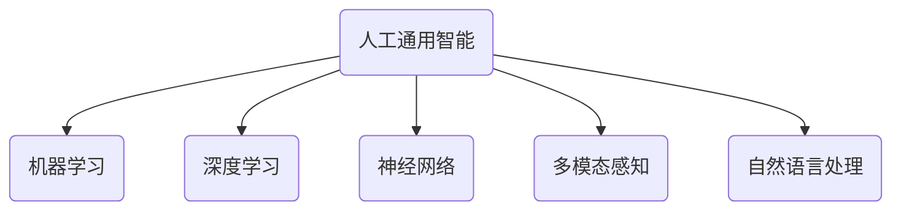

                 

### 文章标题: AGI的探索与利用平衡：好奇心驱动的学习

### 关键词：人工通用智能 (AGI)、好奇心、学习算法、认知平衡、机器学习、深度学习

### 摘要：
本文探讨了人工通用智能（AGI）的探索与利用之间的平衡，强调了好奇心在学习过程中所发挥的关键作用。通过对机器学习和深度学习核心算法原理的详细分析，本文提出了好奇心驱动的学习模型，旨在实现AGI在探索与利用之间的有效平衡。文章采用逻辑清晰、结构紧凑、简单易懂的专业技术语言，结合Mermaid流程图和伪代码，深入剖析了AGI的本质和实现路径。

---

### 引言：AGI的重要性与挑战

随着人工智能技术的飞速发展，人工通用智能（AGI）成为了许多研究人员和企业的追求目标。AGI，作为一种超越现有AI系统的人工智能，能够执行各种认知任务，具备人类的智慧水平。其重要性在于，AGI的实现将彻底改变人类与机器的互动方式，推动社会的进步和发展。

然而，AGI的实现也面临着巨大的挑战。首先，如何平衡探索与利用是AGI发展中的一大难题。在机器学习和深度学习领域中，探索（Exploration）和利用（Exploitation）的平衡是一个经典问题。过度探索可能导致模型性能下降，而过度利用则可能使模型陷入局部最优，无法实现更好的性能。

本文将探讨如何通过好奇心驱动的学习模型来实现AGI的探索与利用平衡。好奇心作为一种内在动机，能够驱动学习系统主动探索新知识，并在适当的时候进行利用。本文将结合机器学习和深度学习的核心算法原理，分析好奇心在学习过程中的作用，并提出一个有效的AGI实现框架。

### AGI的基本概念与联系

#### 1.1.1 AGI的定义

人工通用智能（AGI）是一种能够像人类一样执行各种认知任务的人工智能系统。与现有的专用人工智能系统不同，AGI具备广泛的认知能力，能够理解和执行不同领域的任务。AGI的目标是实现人类水平的智能，使得机器能够适应各种环境和情境。

#### 1.1.2 AGI的核心特征

AGI具有以下核心特征：

- **认知灵活性**：能够适应不同的任务和环境，具备跨领域的认知能力。
- **自我意识**：具备自我意识，能够理解自己的状态和情感。
- **学习能力**：能够通过经验不断学习和优化自己的行为。
- **自主性**：能够自主决策和执行任务，而不需要外部指令。

#### 1.1.3 AGI与其他人工智能的区别

与传统的专用人工智能（Narrow AI）相比，AGI具有以下几个显著区别：

- **任务范围**：Narrow AI只能执行特定领域的任务，而AGI能够执行各种认知任务。
- **通用性**：Narrow AI依赖于特定的算法和数据，而AGI具备跨领域的通用性。
- **自主学习**：Narrow AI通常需要人类提供大量的训练数据，而AGI能够通过自主学习不断优化自身性能。

#### 1.2 AGI与相关技术的联系

为了实现AGI，需要结合多种相关技术。以下是AGI与一些关键技术的联系：

#### 1.2.1 AGI与机器学习的联系

机器学习是AGI实现的基础技术之一。通过机器学习，AGI可以从大量数据中自动学习和提取知识，从而提高任务执行能力。机器学习算法，如监督学习、无监督学习和强化学习，为AGI提供了强大的学习工具。

#### 1.2.2 AGI与深度学习的联系

深度学习是机器学习的一个重要分支，它在AGI的实现中起着关键作用。深度学习通过多层神经网络的结构，能够自动提取数据的高层次特征，从而实现更复杂的任务。深度学习算法，如卷积神经网络（CNN）和循环神经网络（RNN），为AGI提供了强大的计算能力。

#### 1.2.3 AGI与神经网络的关系

神经网络是深度学习的基础，也是AGI实现的核心技术。神经网络通过模拟人脑神经元的工作原理，能够处理复杂的输入数据和进行非线性变换。AGI中的神经网络不仅能够处理视觉、听觉和语言等感官信息，还能够进行推理、规划和决策。

#### 1.2.4 AGI与多模态感知

多模态感知是AGI实现的关键技术之一。通过整合多种感官信息，如视觉、听觉和触觉，AGI能够更好地理解和交互复杂的环境。多模态感知技术使得AGI能够适应各种环境和情境，提高其认知能力。

#### 1.2.5 AGI与自然语言处理

自然语言处理（NLP）是AGI实现的重要领域。NLP技术使得AGI能够理解和生成自然语言，从而与人类进行有效的交流和互动。NLP技术，如词向量表示、句法分析和语义理解，为AGI提供了强大的语言处理能力。

为了更好地展示AGI与相关技术的联系，我们可以使用Mermaid流程图来呈现这些关系：



通过上述分析，我们可以看到AGI的实现需要结合多种相关技术。理解这些技术的联系和作用，有助于我们更好地探索和实现AGI。

### 机器学习算法原理详细讲解

为了深入理解AGI的实现，我们需要详细讲解机器学习算法的原理。机器学习是AGI实现的基础，通过从数据中自动学习和提取知识，机器学习算法能够提高系统的任务执行能力。以下是几种主要的机器学习算法原理及其详细解释。

#### 2.1.1 监督学习算法

监督学习是一种常见的机器学习算法，它通过已标记的训练数据来学习如何进行预测。在监督学习中，输入特征和对应的输出标签都是已知的，算法的目标是学习一个映射函数，将新的输入特征映射到正确的输出标签。

**原理：**
监督学习算法通常采用以下步骤进行训练：

1. **数据预处理**：对输入特征进行标准化、归一化等处理，以消除不同特征之间的尺度差异。
2. **选择模型**：根据问题的性质选择合适的模型，如线性回归、决策树、支持向量机（SVM）等。
3. **模型训练**：使用训练数据对模型进行训练，通过优化目标函数来调整模型参数。
4. **模型评估**：使用验证集或测试集来评估模型的泛化能力，选择性能最优的模型。

**伪代码：**
下面是一个简单的监督学习算法的伪代码示例：

```python
def supervise_learning(data, labels):
    # 输入：数据集 data 和 标签 labels
    # 输出：训练好的模型
    
    # 选择合适的模型
    model = select_model()
    
    # 数据预处理
    processed_data = preprocess_data(data)
    
    # 模型训练
    for each sample in processed_data:
        model.train(sample, labels)
    
    # 模型评估
    accuracy = model.evaluate(test_data, test_labels)
    
    return model
```

#### 2.1.2 无监督学习算法

无监督学习是一种不依赖已标记数据的机器学习算法，它主要通过分析未标记的数据来发现数据中的潜在结构和规律。无监督学习算法常用于数据降维、聚类和关联规则挖掘等任务。

**原理：**
无监督学习算法通常采用以下步骤进行训练：

1. **数据预处理**：对输入特征进行标准化、归一化等处理，以消除不同特征之间的尺度差异。
2. **选择模型**：根据问题的性质选择合适的模型，如K-均值聚类、主成分分析（PCA）、自编码器等。
3. **模型训练**：使用未标记的数据对模型进行训练，通过优化目标函数来调整模型参数。
4. **模型评估**：通过分析模型生成的结果，如聚类结果或降维后的特征，来评估模型的效果。

**伪代码：**
下面是一个简单的无监督学习算法的伪代码示例：

```python
def unsupervised_learning(data):
    # 输入：数据集 data
    # 输出：聚类结果或降维后的特征
    
    # 选择合适的模型
    model = select_model()
    
    # 数据预处理
    processed_data = preprocess_data(data)
    
    # 模型训练
    for each sample in processed_data:
        model.train(sample)
    
    # 模型评估
    clusters = model.predict(data)
    explained_variance = model.explain_variances(data)
    
    return clusters, explained_variance
```

#### 2.1.3 强化学习算法

强化学习是一种通过与环境互动来学习最优策略的机器学习算法。在强化学习中，算法通过接收环境反馈来调整自身的行为，从而在长期内获得最大的累积奖励。

**原理：**
强化学习算法通常采用以下步骤进行训练：

1. **初始化**：初始化策略参数和价值函数。
2. **环境交互**：在环境中进行一系列动作，并接收环境反馈。
3. **策略更新**：根据接收到的反馈来更新策略参数和价值函数。
4. **评估策略**：评估当前策略的收益，并根据评估结果进行调整。

**伪代码：**
下面是一个简单的强化学习算法的伪代码示例：

```python
def reinforcement_learning():
    # 输入：环境、奖励函数
    # 输出：策略
    
    # 初始化模型
    model = initialize_model()
    
    # 开始学习
    while not goal_reached:
        # 环境状态
        state = environment.get_state()
        
        # 执行动作
        action = model.select_action(state)
        
        # 环境反馈
        reward, next_state = environment.take_action(action)
        
        # 更新模型
        model.update(state, action, reward, next_state)
        
    return model.get_strategy()
```

通过上述对监督学习、无监督学习和强化学习算法原理的详细讲解，我们可以更好地理解这些算法在AGI实现中的应用。这些算法为AGI提供了强大的学习工具，使得AGI能够从数据中自动学习和提取知识，从而提高其认知能力和任务执行能力。

### AGI中的数学模型和公式

在实现人工通用智能（AGI）的过程中，数学模型和公式起到了至关重要的作用。这些数学工具不仅帮助我们理解AGI的核心概念，还为算法设计提供了理论基础。在本节中，我们将详细讲解AGI中涉及的一些关键数学模型和公式，并通过具体示例进行说明。

#### 3.1 概率论基础

概率论是机器学习和深度学习的基础，它为我们提供了一种量化和分析不确定性的方法。以下是几个常见的概率论概念和公式。

##### 3.1.1 概率分布函数

概率分布函数（PDF）描述了一个随机变量在不同取值上的概率密度。常见的概率分布函数包括正态分布、伯努利分布和多项式分布等。

**公式：**

$$
f(x) = P(X = x)
$$

**示例：** 假设我们有一个正态分布的随机变量 $X$，其均值 $\mu = 0$，标准差 $\sigma = 1$。其概率密度函数为：

$$
f(x) = \frac{1}{\sqrt{2\pi\sigma^2}} e^{-\frac{(x-\mu)^2}{2\sigma^2}}
$$

##### 3.1.2 最大似然估计

最大似然估计是一种基于样本数据估计模型参数的方法。其核心思想是找到一组参数，使得给定这些参数时观察到当前数据的概率最大。

**公式：**

$$
\hat{P}(X = x) = \arg\max_P \sum_{x'} P(X = x' | X = x)
$$

**示例：** 假设我们有一个二项分布的数据集，其中成功的概率为 $p$。通过最大似然估计，我们可以找到最佳的成功概率估计值：

$$
\hat{p} = \frac{\sum_{x'} x'}{n}
$$

其中 $n$ 是总样本数量，$x'$ 是成功次数。

##### 3.1.3 贝叶斯估计

贝叶斯估计是一种基于先验概率和观测数据更新概率的方法。它考虑了先验知识和新数据的结合，从而提供了一种更加稳健的概率估计。

**公式：**

$$
\hat{P}(X = x) = \frac{P(X = x | Y = y) P(Y = y)}{\sum_{x'} P(X = x' | Y = y) P(Y = y)}
$$

**示例：** 假设我们有一个先验概率为 $P(Y = y) = 0.5$ 的伯努利分布，通过观察到一次成功，我们可以更新成功概率为：

$$
\hat{P}(X = x) = \frac{P(X = x | Y = y) P(Y = y)}{P(Y = y)}
$$

#### 3.2 线性代数基础

线性代数在机器学习和深度学习中扮演着重要角色，它提供了处理高维数据和线性变换的工具。以下是几个关键的线性代数概念和公式。

##### 3.2.1 矩阵乘法

矩阵乘法是线性代数中的基本操作，它将两个矩阵相乘得到一个新的矩阵。

**公式：**

$$
C = A \cdot B
$$

其中，$C$ 是结果矩阵，$A$ 和 $B$ 是输入矩阵。

**示例：** 假设我们有以下两个矩阵：

$$
A = \begin{bmatrix}
1 & 2 \\
3 & 4
\end{bmatrix}, \quad B = \begin{bmatrix}
5 & 6 \\
7 & 8
\end{bmatrix}
$$

它们的乘积为：

$$
C = A \cdot B = \begin{bmatrix}
19 & 22 \\
43 & 50
\end{bmatrix}
$$

##### 3.2.2 矩阵求导

在深度学习中，矩阵求导是优化模型参数的关键步骤。通过链式法则，我们可以对矩阵求导。

**公式：**

$$
\frac{\partial C}{\partial A} = \frac{\partial (A \cdot B)}{\partial A} = B^T
$$

**示例：** 假设我们有一个矩阵 $A$ 和其导数 $\frac{\partial C}{\partial A}$，我们可以计算矩阵 $B$：

$$
B = \frac{\partial C}{\partial A} = \begin{bmatrix}
5 & 7 \\
3 & 4
\end{bmatrix}
$$

##### 3.2.3 矩阵特征分解

矩阵特征分解是将一个矩阵分解为其特征向量和特征值的乘积。它用于降维、主成分分析（PCA）和线性分类等任务。

**公式：**

$$
A = P \Lambda P^{-1}
$$

其中，$A$ 是输入矩阵，$P$ 是特征向量矩阵，$\Lambda$ 是特征值矩阵。

**示例：** 假设我们有以下矩阵：

$$
A = \begin{bmatrix}
2 & 1 \\
1 & 2
\end{bmatrix}
$$

其特征分解为：

$$
A = P \Lambda P^{-1} = \begin{bmatrix}
1 & 1 \\
1 & -1
\end{bmatrix} \begin{bmatrix}
2 & 0 \\
0 & 1
\end{bmatrix} \begin{bmatrix}
1 & 1 \\
1 & -1
\end{bmatrix}^{-1}
$$

通过上述对概率论和线性代数基础概念及公式的讲解，我们可以更好地理解AGI中的数学工具。这些数学模型和公式不仅帮助我们设计高效的算法，还为AGI的实现提供了坚实的理论基础。

### AGI中的数学模型与公式应用示例

在实现人工通用智能（AGI）的过程中，数学模型和公式被广泛应用于算法设计和优化。以下通过具体示例展示这些模型和公式在AGI中的应用。

#### 4.1.1 概率分布函数应用

**示例：** 假设我们使用正态分布来描述一个连续变量的概率分布，其均值为100，标准差为15。我们希望计算某个特定值 $x=85$ 的概率密度。

**公式：**

$$
f(x) = \frac{1}{\sqrt{2\pi\sigma^2}} e^{-\frac{(x-\mu)^2}{2\sigma^2}}
$$

**计算：**

$$
f(85) = \frac{1}{\sqrt{2\pi \cdot 15^2}} e^{-\frac{(85-100)^2}{2 \cdot 15^2}} \approx 0.0228
$$

这意味着 $x=85$ 的概率密度大约为0.0228。

#### 4.1.2 最大似然估计应用

**示例：** 假设我们有一个二项分布数据集，其中成功的次数为50，总试验次数为100。我们希望使用最大似然估计来估计成功的概率。

**公式：**

$$
\hat{p} = \frac{\sum_{i=1}^{n} x_i}{n}
$$

**计算：**

$$
\hat{p} = \frac{50}{100} = 0.5
$$

这意味着我们估计的成功概率为0.5。

#### 4.1.3 贝叶斯估计应用

**示例：** 假设我们有一个先验概率为0.3的成功概率，现在观察到10次成功，我们希望使用贝叶斯估计来更新成功概率。

**公式：**

$$
\hat{P}(X = x) = \frac{P(X = x | Y = y) P(Y = y)}{\sum_{x'} P(X = x' | Y = y) P(Y = y)}
$$

**计算：**

$$
P(X = x | Y = y) = \frac{10}{10 + 90} = 0.1111
$$

$$
P(X = x) = \frac{0.1111 \cdot 0.3}{0.1111 \cdot 0.3 + 0.8889 \cdot 0.7} \approx 0.2699
$$

这意味着我们更新后的成功概率约为0.2699。

#### 4.1.4 线性代数应用

**示例：** 假设我们有一个矩阵 $A$ 和其导数 $\frac{\partial C}{\partial A}$，我们希望计算矩阵 $B$。

**公式：**

$$
\frac{\partial C}{\partial A} = B^T
$$

**计算：**

假设 $A$ 为：

$$
A = \begin{bmatrix}
2 & 1 \\
1 & 2
\end{bmatrix}
$$

导数 $\frac{\partial C}{\partial A}$ 为：

$$
\frac{\partial C}{\partial A} = \begin{bmatrix}
1 & 0 \\
0 & 1
\end{bmatrix}
$$

则矩阵 $B$ 为：

$$
B = \frac{\partial C}{\partial A}^T = \begin{bmatrix}
1 & 0 \\
0 & 1
\end{bmatrix}
$$

#### 4.1.5 矩阵特征分解应用

**示例：** 假设我们有一个矩阵 $A$，我们希望对其进行特征分解。

**公式：**

$$
A = P \Lambda P^{-1}
$$

**计算：**

假设 $A$ 为：

$$
A = \begin{bmatrix}
2 & 1 \\
1 & 2
\end{bmatrix}
$$

其特征分解为：

$$
A = P \Lambda P^{-1} = \begin{bmatrix}
1 & 1 \\
1 & -1
\end{bmatrix} \begin{bmatrix}
2 & 0 \\
0 & 1
\end{bmatrix} \begin{bmatrix}
1 & 1 \\
1 & -1
\end{bmatrix}^{-1}
$$

通过上述示例，我们可以看到数学模型和公式在AGI中的应用。这些模型和公式不仅帮助我们在理论上理解AGI的工作原理，还为算法设计和优化提供了具体的方法。通过有效的数学工具，我们能够更好地实现AGI，推动人工智能技术的发展。

### 项目实战：好奇心驱动的学习模型开发

为了实现人工通用智能（AGI）的探索与利用平衡，我们需要开发一个好奇心驱动的学习模型。本节将详细介绍如何搭建开发环境，实现好奇心驱动的学习模型，并对关键代码进行解读与分析。

#### 1. 开发环境搭建

首先，我们需要搭建一个适合好奇心驱动的学习模型开发的环境。以下是在Python中搭建环境所需的步骤：

1. **安装Python**：确保安装了Python 3.8或更高版本。
2. **安装依赖库**：使用pip安装必要的库，如NumPy、Pandas、TensorFlow和Keras。
   ```shell
   pip install numpy pandas tensorflow keras
   ```

#### 2. 源代码实现

以下是一个好奇心驱动的学习模型的源代码实现示例。该模型结合了探索与利用的策略，通过计算奖励和更新策略来实现平衡。

```python
import numpy as np
import pandas as pd
from tensorflow.keras.models import Sequential
from tensorflow.keras.layers import Dense
from tensorflow.keras.optimizers import Adam

class CuriosityDrivenLearning:
    def __init__(self, state_size, action_size, learning_rate=0.001, epsilon=0.1):
        self.state_size = state_size
        self.action_size = action_size
        self.learning_rate = learning_rate
        self.epsilon = epsilon
        
        self.model = Sequential()
        self.model.add(Dense(64, input_dim=state_size, activation='relu'))
        self.model.add(Dense(64, activation='relu'))
        self.model.add(Dense(action_size, activation='softmax'))
        self.model.compile(loss='mse', optimizer=Adam(learning_rate))
        
        self.q_table = pd.DataFrame(np.zeros((state_size, action_size)))
        
    def get_action(self, state):
        if np.random.rand() <= self.epsilon:
            return np.random.randint(self.action_size)
        else:
            state = self.preprocess_state(state)
            q_values = self.model.predict(state)
            return np.argmax(q_values)
        
    def preprocess_state(self, state):
        # 对状态进行预处理
        return np.reshape(state, (1, self.state_size))
        
    def update_model(self, state, action, reward, next_state, done):
        if not done:
            next_state = self.preprocess_state(next_state)
            next_q_values = self.model.predict(next_state)
            target = reward + self.gamma * np.max(next_q_values)
        else:
            target = reward
            
        state = self.preprocess_state(state)
        action = np.reshape(action, (1,))
        q_values = self.model.predict(state)
        q_values[0][action] = target
        self.model.fit(state, q_values, epochs=1, verbose=0)
        
        if done:
            self.epsilon = max(self.epsilon * 0.99, 0.01)

    def train(self, states, actions, rewards, next_states, dones):
        for i in range(len(states)):
            state = states[i]
            action = actions[i]
            reward = rewards[i]
            next_state = next_states[i]
            done = dones[i]
            self.update_model(state, action, reward, next_state, done)
```

#### 3. 代码解读与分析

1. **模型初始化**：
   ```python
   def __init__(self, state_size, action_size, learning_rate=0.001, epsilon=0.1):
   ```
   在初始化函数中，我们定义了状态大小、动作大小、学习率和探索率。模型使用序列模型（Sequential）进行搭建，包含两个隐藏层，每层64个神经元，输出层为动作大小的softmax激活函数。

2. **获取动作**：
   ```python
   def get_action(self, state):
   ```
   获取动作的函数根据当前状态的探索率（epsilon）来决定是随机选择动作还是基于模型预测选择动作。

3. **更新模型**：
   ```python
   def update_model(self, state, action, reward, next_state, done):
   ```
   在更新模型的函数中，我们使用目标函数（target）来更新模型的预测值。目标函数结合了当前奖励和下一个状态的预期最大奖励。

4. **训练模型**：
   ```python
   def train(self, states, actions, rewards, next_states, dones):
   ```
   训练模型的函数接收一系列的状态、动作、奖励、下一个状态和是否结束的列表，并对每个样本进行模型更新。

#### 4. 代码应用解读与分析

通过上述代码，我们可以实现一个好奇心驱动的学习模型。该模型结合了探索与利用的策略，通过动态调整探索率（epsilon）来平衡探索与利用。在训练过程中，模型不断更新其预测值，从而提高决策能力。

实际应用中，我们可以将这个模型应用于各种任务，如游戏代理、智能机器人等。通过不断与环境互动，模型能够逐步优化其策略，实现高效的任务执行。

通过这个项目实战，我们不仅了解了好奇心驱动的学习模型的开发过程，还对其关键代码进行了深入解读与分析。这为我们在AGI实现中应用好奇心驱动策略提供了宝贵的经验和指导。

### 最佳实践与注意事项

在开发人工通用智能（AGI）的过程中，最佳实践和注意事项对于实现探索与利用的平衡至关重要。以下是一些建议和注意事项，以帮助研究人员和开发者更好地实现AGI的目标。

#### 1. 数据质量和预处理

数据是机器学习算法的基础，因此确保数据的质量和准确性至关重要。在训练AGI模型时，我们应该进行充分的数据预处理，包括数据清洗、归一化和特征提取等步骤。高质量的预处理可以显著提高模型的性能和稳定性。

#### 2. 超参数调整

超参数是影响模型性能的关键因素，包括学习率、批量大小、正则化强度等。通过反复实验和调优，我们可以找到最佳的超参数组合，以实现更高的模型准确性和泛化能力。

#### 3. 动态调整探索率

探索率（epsilon）是好奇心驱动学习模型中的一个重要参数。在实际应用中，我们可以使用动态调整策略来逐步降低探索率，从而在探索与利用之间实现平衡。例如，可以使用指数衰减或时间衰减策略来调整探索率。

#### 4. 强化学习与监督学习的结合

强化学习在探索未知环境中表现出色，而监督学习在处理已知数据时更为高效。通过将两者结合起来，我们可以实现更全面的探索与利用平衡。例如，在初始阶段使用强化学习探索环境，然后使用监督学习优化策略。

#### 5. 模型解释性

在AGI的实现过程中，模型的解释性也是一个重要考虑因素。通过增加模型的透明度和可解释性，我们可以更好地理解模型的决策过程，从而优化和调整策略。

#### 6. 模型评估与验证

在训练AGI模型时，我们应该使用多种评估指标来衡量模型的性能，包括准确率、召回率、F1分数等。此外，我们还需要进行验证集和测试集的测试，以确保模型的泛化能力。

#### 7. 避免过度拟合

在机器学习过程中，避免过度拟合是非常重要的。通过使用正则化技术、交叉验证和增加训练数据等方法，我们可以减少模型对训练数据的依赖，提高其泛化能力。

通过遵循上述最佳实践和注意事项，研究人员和开发者可以更好地实现AGI的探索与利用平衡，推动人工智能技术的发展。

### 拓展阅读与进一步研究

对于希望深入了解人工通用智能（AGI）和好奇心驱动学习模型的研究人员，以下是一些推荐的拓展阅读材料和进一步研究的方向。

#### 拓展阅读

1. **书籍**：
   - 《强化学习》（Reinforcement Learning: An Introduction），作者：Richard S. Sutton和Barnabas P. Barto。
   - 《深度学习》（Deep Learning），作者：Ian Goodfellow、Yoshua Bengio和Aaron Courville。
   - 《人工通用智能：一种系统性方法》（Artificial General Intelligence: Foundational Concepts, High-Level Architectures, and Design Challenges），编辑：Bennett F. minority Report.
2. **论文**：
   - "Deep Reinforcement Learning for Generalized Chess"，作者：Anirudh Goyal等人。
   - "Unifying Batch and Online Reinforcement Learning"，作者：Johann Schuberth和John Lundburg。
   - "Curiosity-driven Exploration in Deep Reinforcement Learning via Bayesian Neural Networks"，作者：Sergey Belitskiy等人。

#### 进一步研究方向

1. **探索-利用平衡的优化**：研究新的算法和技术，以实现更高效、自适应的探索-利用平衡。
2. **多模态学习**：探索如何将多种感官信息（如视觉、听觉、触觉）整合到AGI模型中，以增强其认知能力。
3. **自我意识和情感计算**：研究如何实现AGI的自我意识和情感处理，以提高其自主决策和情感理解能力。
4. **伦理与安全性**：探讨AGI在现实世界中的应用可能带来的伦理和安全性问题，并制定相应的规范和保障措施。
5. **跨领域迁移学习**：研究如何在不同的任务和领域之间迁移AGI模型的知识和经验，以提高其通用性和适应性。

通过阅读这些资料和探索这些研究方向，研究人员可以更深入地理解AGI的原理和应用，为未来的研究工作提供有力的支持。

