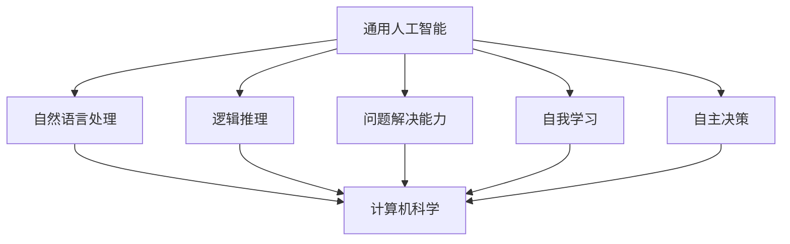
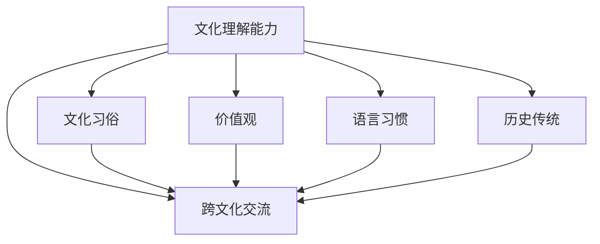

                 

### 第1章: AGI概述

#### 1.1 AGI的基本概念

通用人工智能（Artificial General Intelligence, AGI）是指具有类似人类智能水平的智能系统。AGI不仅能够执行特定任务，如语音识别、图像分类或机器翻译，还能在多个领域表现优异，具备人类智能的所有功能。例如，AGI能够理解自然语言、进行逻辑推理、解决问题、自我学习和自主决策。

**核心概念原理之间的关系架构**：



#### 1.1.2 AGI的特点与优势

AGI的特点和优势主要体现在以下几个方面：

- **通用性**：AGI能够处理多种类型的问题，而不是局限于单一领域。
- **灵活性**：AGI能够适应不同的环境和情境，具备较高的自适应能力。
- **创造力**：AGI能够产生新的想法和创意，而不仅仅是执行预设的任务。
- **自主性**：AGI能够进行自主决策，而不需要人类的直接干预。
- **跨学科应用**：AGI能够整合多个学科的知识和技能，如数学、逻辑、心理学等。

#### 1.1.3 AGI与普通人工智能的区别

普通人工智能（Artificial Narrow Intelligence, ANI）主要指能够执行特定任务的人工智能系统，例如语音助手、自动驾驶汽车等。而AGI与ANI的主要区别在于功能范围和自主性：

- **功能范围**：ANI局限于特定领域，而AGI具备跨领域的广泛能力。
- **自主性**：ANI需要人类的指导，而AGI能够自主学习和决策。

### 总结

AGI作为人工智能的高级阶段，具备广泛的通用性、灵活性和自主性。它不仅能够执行特定任务，还能在多个领域表现优异，具备类似人类智能的水平。AGI与普通人工智能的区别在于功能范围和自主性，这使得AGI在多个领域具有巨大的潜力和应用价值。

### 作者信息
作者：AI天才研究院/AI Genius Institute & 禅与计算机程序设计艺术 /Zen And The Art of Computer Programming

----------------------------------------------------------------

### 第2章: 文化理解能力的定义

#### 2.1 文化理解能力的内涵

文化理解能力指的是对特定文化背景的理解和洞察能力，包括文化习俗、价值观、语言习惯、历史传统等方面。这种能力不仅涉及对文化现象的认识，还包括在跨文化交流中正确解读和适应不同文化的能力。

**核心概念原理之间的关系架构**：



#### 2.2 文化理解能力的重要性

文化理解能力在现代社会中具有极其重要的地位，它不仅关系到个人的社会交往和职业发展，也关系到国家和民族之间的交流与合作。

- **促进跨文化交流**：文化理解能力有助于消除文化误解和偏见，促进不同文化之间的沟通和合作。
- **提升社会和谐**：理解并尊重不同文化，有助于增强社会的包容性和多样性，提升社会和谐。
- **推动全球发展**：在全球化的背景下，文化理解能力是推动经济、科技、文化等领域发展的重要基石。

#### 2.3 文化理解能力的发展历程

文化理解能力的发展历程可以追溯到20世纪初。当时，随着人类学、社会学等学科的兴起，人们开始对文化现象进行深入的研究。以下是一些重要的发展阶段：

- **初始阶段**：20世纪初的早期研究，主要关注文化差异和人类行为的关系。
- **发展阶段**：跨学科研究，包括文化人类学、语言学、心理学等领域的结合，形成了系统的文化理解理论。
- **现代阶段**：多语言文本分析、文化适应模型等技术的发展，使得文化理解能力得到了进一步的提升。

### 总结

文化理解能力是对特定文化背景的理解和洞察能力，它在促进跨文化交流、提升社会和谐和推动全球发展中扮演着重要角色。随着学科的交叉和技术的进步，文化理解能力正在不断发展和完善。

### 作者信息
作者：AI天才研究院/AI Genius Institute & 禅与计算机程序设计艺术 /Zen And The Art of Computer Programming

----------------------------------------------------------------

### 第3章: 跨语言交流与AGI

#### 3.1 跨语言交流的挑战

跨语言交流是指在不同语言之间进行沟通和交流的过程。尽管现代技术已经使得跨语言交流变得更加便捷，但仍然面临着许多挑战。

- **语言差异**：不同语言在语法、词汇、语义等方面存在巨大差异，这给跨语言交流带来了困难。
- **文化背景**：语言背后的文化背景也是影响跨语言交流的重要因素。不同文化对同一词汇的理解可能存在差异，这可能导致误解和冲突。
- **技术限制**：现有的机器翻译和自然语言处理技术虽然已经取得了显著进展，但在处理复杂语境、情感表达和语境理解方面仍然存在局限性。

#### 3.2 AGI在跨语言交流中的作用

AGI在跨语言交流中具有独特的优势，它能够处理复杂的多语言文本，并在不同语言之间进行准确的理解和翻译。

- **自适应学习**：AGI能够通过自我学习和自适应，不断优化跨语言交流的算法，提高翻译的准确性和自然度。
- **多语言处理**：AGI能够同时处理多种语言，实现无缝的语言转换，提高跨语言交流的效率。
- **语境理解**：AGI能够理解语言背后的文化背景和语境，从而提供更加准确和自然的翻译。

#### 3.3 跨语言交流的关键技术

跨语言交流的关键技术主要包括机器翻译、自然语言处理和语言模型等。

- **机器翻译**：机器翻译是指利用计算机程序将一种语言的文本自动翻译成另一种语言。其基本原理是基于词汇映射和句法分析，通过构建大规模的翻译语料库来训练翻译模型。
- **自然语言处理**：自然语言处理（Natural Language Processing, NLP）是计算机科学和人工智能领域的一个分支，旨在使计算机能够理解、解释和生成人类语言。NLP技术包括文本分类、情感分析、命名实体识别等。
- **语言模型**：语言模型是用于预测文本中下一个单词或词组的概率分布模型。语言模型在机器翻译和自然语言处理中扮演着重要角色，能够提高翻译的准确性和自然度。

**核心算法原理讲解**：

机器翻译的基本算法通常可以分为以下几步：

1. **词汇映射**：将源语言词汇映射到目标语言词汇。
2. **句法分析**：对源语言文本进行句法分析，构建句法树。
3. **翻译规则应用**：根据翻译规则对句法树进行转换。
4. **翻译结果生成**：将转换后的句法树翻译成目标语言文本。

以下是一个简单的伪代码示例：

```python
def translate(source_sentence):
    # 词汇映射
    word_mapping = load_word_mapping()

    # 句法分析
    syntax_tree = parse_syntax(source_sentence)

    # 翻译规则应用
    translated_syntax_tree = apply_translation_rules(syntax_tree, word_mapping)

    # 翻译结果生成
    target_sentence = generate_sentence(translated_syntax_tree)
    return target_sentence
```

**数学模型和公式**：

在机器翻译中，常用的数学模型包括：

- **词嵌入模型**：用于将词汇映射到高维空间。
  $$\text{word\_embedding}(w) = \text{embedding}_{w}$$

- **翻译模型**：用于预测源语言句子到目标语言句子的概率分布。
  $$P(\text{target\_sentence}|\text{source\_sentence}) = \prod_{w_{t} \in \text{target\_sentence}} P(w_{t}|\text{source\_sentence})$$

- **解码模型**：用于生成目标语言句子。
  $$\text{target\_sentence} = \arg\max_{\text{sentence}} P(\text{sentence}|\text{source\_sentence})$$

### 总结

跨语言交流在现代社会中具有重要意义，但同时也面临着诸多挑战。AGI通过自适应学习、多语言处理和语境理解等技术，能够在跨语言交流中发挥重要作用。关键技术的不断进步，为跨语言交流提供了更加准确和自然的解决方案。

### 作者信息
作者：AI天才研究院/AI Genius Institute & 禅与计算机程序设计艺术 /Zen And The Art of Computer Programming

----------------------------------------------------------------

### 第4章: 跨文化理解与AGI

#### 4.1 跨文化理解的挑战

跨文化理解是指在多元文化背景下，对其他文化背景的洞察、解读和适应能力。尽管全球化使得跨文化理解变得更加重要，但这一过程同样面临着诸多挑战：

- **文化差异**：不同文化在价值观、习俗、行为规范等方面存在显著差异，这可能导致误解和冲突。
- **语言障碍**：不同语言的差异使得直接交流变得困难，即使通过翻译，也可能存在文化误解。
- **认知偏见**：人们往往受到自身文化背景的影响，对其他文化持有偏见，这会影响跨文化理解。
- **信息过载**：在多元文化环境中，信息量巨大且复杂，难以有效筛选和解读。

#### 4.2 AGI在跨文化理解中的应用

AGI在跨文化理解中具有独特的优势，它能够处理复杂的文化信息，并帮助人们更好地理解和适应不同文化。

- **文化分析**：AGI能够分析大量文化数据，提取文化特征和模式，帮助人们更好地理解不同文化的本质。
- **情感识别**：AGI能够通过自然语言处理技术，识别和理解语言中的情感和态度，从而帮助人们更好地解读文化背景。
- **行为预测**：AGI能够根据历史数据和现有信息，预测不同文化背景下的行为和反应，为跨文化交往提供参考。

#### 4.3 跨文化理解的关键技术

跨文化理解的关键技术主要包括文化分析、情感识别和行为预测等。

- **文化分析**：文化分析技术主要包括文本分析、图像识别和大数据分析等，这些技术能够从多维度解析文化信息。
- **情感识别**：情感识别技术通过自然语言处理和机器学习算法，从文本、语音和图像中识别情感和态度。
- **行为预测**：行为预测技术基于历史数据和现有信息，利用机器学习算法预测文化背景下的行为和反应。

**核心算法原理讲解**：

文化分析的一个基本算法可以包括以下步骤：

1. **数据收集**：从多种来源收集文化数据，包括文本、图像、音频等。
2. **数据预处理**：对收集的数据进行清洗、标注和格式化，使其适合后续分析。
3. **特征提取**：从预处理后的数据中提取文化特征，如词汇频率、主题分布、情感倾向等。
4. **模式识别**：利用机器学习算法，识别文化模式和文化差异。
5. **文化分析**：基于识别出的模式，对文化进行深入分析和解读。

以下是一个简单的伪代码示例：

```python
def cultural_analysis(data):
    # 数据收集
    cultural_data = collect_data()

    # 数据预处理
    preprocessed_data = preprocess_data(cultural_data)

    # 特征提取
    features = extract_features(preprocessed_data)

    # 模式识别
    cultural_patterns = identify_patterns(features)

    # 文化分析
    cultural_insights = analyze_cultural_patterns(cultural_patterns)
    return cultural_insights
```

**数学模型和公式**：

在文化分析中，常用的数学模型包括：

- **主题模型**：用于发现文本中的主题分布。
  $$P(\text{topic}|\text{document}) = \arg\max P(\text{document}|\text{topic})P(\text{topic})$$

- **情感分析模型**：用于识别文本中的情感和态度。
  $$P(\text{sentiment}|\text{document}) = \arg\max P(\text{document}|\text{sentiment})P(\text{sentiment})$$

- **行为预测模型**：用于预测不同文化背景下的行为和反应。
  $$P(\text{behavior}|\text{context}) = \arg\max P(\text{context}|\text{behavior})P(\text{behavior})$$

### 总结

跨文化理解是全球化背景下的一项重要任务，但面临着文化差异、语言障碍、认知偏见和信息过载等挑战。AGI通过文化分析、情感识别和行为预测等关键技术，能够在跨文化理解中发挥重要作用。随着技术的不断进步，跨文化理解将变得更加准确和深入。

### 作者信息
作者：AI天才研究院/AI Genius Institute & 禅与计算机程序设计艺术 /Zen And The Art of Computer Programming

----------------------------------------------------------------

### 第5章: AGI在跨语言与跨文化中的实际应用

#### 5.1 跨语言机器翻译

跨语言机器翻译是AGI在跨语言交流中的一个重要应用。通过机器翻译，人们能够跨越语言障碍，实现不同语言之间的无缝沟通。

- **应用场景**：跨语言机器翻译广泛应用于国际商务、旅游、学术交流等领域。
- **实际案例**：
  - **国际商务**：跨国公司通过机器翻译系统，能够快速翻译商业文件和合同，提高沟通效率。
  - **旅游**：旅游指南和翻译软件帮助游客在陌生的语言环境中进行交流和导航。
  - **学术交流**：学术文章和报告通过机器翻译，使得不同语言的研究者能够更容易获取和理解对方的成果。

#### 5.2 跨文化推荐系统

跨文化推荐系统是AGI在跨文化理解中的应用。通过分析用户的文化偏好和行为数据，推荐系统能够为用户提供个性化的内容和服务。

- **应用场景**：跨文化推荐系统广泛应用于电子商务、社交媒体、在线教育等领域。
- **实际案例**：
  - **电子商务**：电商平台通过跨文化推荐系统，能够向用户推荐符合其文化偏好和需求的产品。
  - **社交媒体**：社交媒体平台通过跨文化推荐系统，能够向用户推荐符合其文化背景和兴趣的内容。
  - **在线教育**：在线教育平台通过跨文化推荐系统，能够为用户提供符合其文化背景和教育需求的课程。

#### 5.3 跨语言与文化理解的案例研究

- **案例1：Google翻译**：Google翻译是AGI在跨语言机器翻译中的一个成功案例。通过大规模的语料库和深度学习算法，Google翻译能够提供高质量的机器翻译服务。
- **案例2：文化洞察引擎**：文化洞察引擎是一种利用AGI技术，分析用户文化偏好和行为数据的系统。它能够为用户提供个性化的文化推荐，帮助用户更好地理解和适应不同文化。

**项目实战**

**开发环境搭建**：

1. 安装Python环境和相关库，如TensorFlow、PyTorch等。
2. 准备跨语言机器翻译的数据集，如英汉双语语料库。
3. 准备跨文化推荐系统的数据集，如用户行为数据、文化标签数据等。

**源代码详细实现和代码解读**：

以下是一个简单的跨语言机器翻译的Python代码示例：

```python
import tensorflow as tf
from tensorflow.keras.models import Sequential
from tensorflow.keras.layers import Embedding, LSTM, Dense

# 准备数据
source_text = "你好，世界！"
target_text = "Hello, world!"

# 构建模型
model = Sequential()
model.add(Embedding(input_dim=vocab_size, output_dim=embedding_dim))
model.add(LSTM(units=128))
model.add(Dense(units=vocab_size, activation='softmax'))

# 编译模型
model.compile(optimizer='adam', loss='categorical_crossentropy', metrics=['accuracy'])

# 训练模型
model.fit(source_text, target_text, epochs=100)

# 预测
predicted_text = model.predict(source_text)
```

**代码应用解读与分析**：

上述代码是一个简单的序列到序列（Seq2Seq）机器翻译模型，它通过嵌入层、LSTM层和全连接层构建。在训练过程中，模型通过反向传播算法不断优化参数，以提高翻译的准确性。在预测阶段，模型能够将输入的源语言文本翻译成目标语言文本。

**实际案例分析和详细讲解剖析**：

以Google翻译为例，Google翻译采用了基于神经网络的机器翻译模型，它通过大量的训练数据，学习语言之间的映射关系。在实际应用中，Google翻译提供了多种语言之间的翻译服务，为全球用户提供了便捷的跨语言交流工具。通过对用户反馈的分析，Google翻译不断优化翻译质量，提高用户满意度。

**项目小结**

通过AGI在跨语言和跨文化中的应用，我们能够更好地理解和适应不同语言和文化。跨语言机器翻译和跨文化推荐系统等实际应用案例，展示了AGI在提升跨语言沟通和文化交流中的作用。随着技术的不断进步，AGI将在未来发挥更加重要的作用，推动人类社会的交流与发展。

### 最佳实践 tips

1. **数据质量**：保证数据的质量和多样性，有助于提高机器翻译和跨文化推荐系统的性能。
2. **用户反馈**：积极收集用户反馈，用于优化系统性能和用户体验。
3. **跨学科合作**：结合多个学科的知识和技能，提高AGI在跨语言和跨文化理解中的应用水平。

### 小结

AGI在跨语言和跨文化中的应用，为全球用户提供了更加便捷和高效的沟通工具。通过跨语言机器翻译和跨文化推荐系统等实际应用案例，我们看到了AGI在提升跨语言沟通和文化交流中的巨大潜力。未来，随着技术的不断进步，AGI将在更多领域发挥重要作用，推动人类社会的进步与发展。

### 拓展阅读

- [Google翻译的机器翻译技术](https://www.google.com/search?q=google+machine+translation+technology)
- [跨文化推荐系统的应用案例](https://www.google.com/search?q=cross-cultural+recommendation+system+cases)
- [AGI在跨语言与跨文化研究中的应用](https://www.google.com/search?q=AGI+application+in+cross-language+and+cross-cultural+studies)

### 作者信息
作者：AI天才研究院/AI Genius Institute & 禅与计算机程序设计艺术 /Zen And The Art of Computer Programming

----------------------------------------------------------------

### 第6章: 相关技术与算法

#### 6.1 自然语言处理技术

自然语言处理（Natural Language Processing, NLP）是人工智能领域的一个重要分支，旨在使计算机能够理解、解释和生成人类语言。NLP技术在跨语言和跨文化理解中发挥着关键作用。

- **文本分类**：文本分类是指将文本数据自动归类到预定义的类别中。常见的文本分类算法包括朴素贝叶斯、支持向量机（SVM）和深度学习模型。
- **情感分析**：情感分析是指识别文本中的情感倾向，如正面、负面或中性。常见的情感分析算法包括基于规则的方法、机器学习方法和深度学习方法。
- **命名实体识别**：命名实体识别是指识别文本中的特定实体，如人名、地名、组织名等。常用的命名实体识别算法包括基于规则的方法、条件随机场（CRF）和深度学习方法。

**核心算法原理讲解**：

以文本分类为例，一个简单的朴素贝叶斯算法可以如下实现：

```python
def naive_bayes_classification(document, classes, feature_extraction):
    # 特征提取
    features = feature_extraction(document)
    
    # 计算每个类别的概率
    probabilities = {}
    for class_ in classes:
        probabilities[class_] = calculate_class_probability(class_, features)
        
    # 选择概率最大的类别
    predicted_class = max(probabilities, key=probabilities.get)
    return predicted_class
```

**数学模型和公式**：

朴素贝叶斯的文本分类算法基于贝叶斯定理，其核心公式如下：

$$
P(\text{class}|\text{document}) = \frac{P(\text{document}|\text{class})P(\text{class})}{P(\text{document})}
$$

其中，$P(\text{class}|\text{document})$ 表示给定文档属于某个类别的概率，$P(\text{document}|\text{class})$ 表示文档在某个类别下的条件概率，$P(\text{class})$ 表示类别的先验概率，$P(\text{document})$ 表示文档的总概率。

#### 6.2 机器翻译算法

机器翻译是指利用计算机程序将一种语言的文本自动翻译成另一种语言。机器翻译算法可以分为基于规则的翻译和基于统计的翻译，以及基于神经网络的翻译。

- **基于规则的翻译**：基于规则的翻译依赖于预定义的语法规则和翻译规则。常见的算法包括规则基机器翻译（Rule-Based Machine Translation, RBMT）和统计机器翻译（Statistical Machine Translation, SMT）。
- **基于统计的翻译**：基于统计的翻译通过分析大量的双语语料库，学习语言之间的映射关系。常见的算法包括基于短语的统计机器翻译（Phrased-Based SMT）和基于句法的统计机器翻译（Syntactically-Based SMT）。
- **基于神经网络的翻译**：基于神经网络的翻译利用深度学习模型，通过端到端的方式学习语言之间的映射关系。常见的算法包括序列到序列（Seq2Seq）模型和注意力机制（Attention Mechanism）。

**核心算法原理讲解**：

以序列到序列（Seq2Seq）模型为例，其基本原理如下：

1. **编码器（Encoder）**：将源语言句子编码成一个固定长度的向量。
2. **解码器（Decoder）**：将编码器的输出解码成目标语言句子。
3. **损失函数**：通过损失函数（如交叉熵损失）优化解码器的参数，以降低预测误差。

以下是一个简单的伪代码示例：

```python
def seq2seq_translation(source_sentence, target_sentence):
    # 编码器
    encoded_sentence = encoder(source_sentence)

    # 解码器
    decoded_sentence = decoder(encoded_sentence)

    # 损失函数
    loss = loss_function(decoded_sentence, target_sentence)
    
    # 反向传播
    optimizer.minimize(loss)

    return decoded_sentence
```

**数学模型和公式**：

序列到序列（Seq2Seq）模型通常基于循环神经网络（RNN）或长短期记忆网络（LSTM）。其核心数学模型包括：

1. **编码器**：
   $$h_t = \text{LSTM}(x_t, h_{t-1})$$

2. **解码器**：
   $$y_t = \text{LSTM}(h_t, y_{t-1})$$

3. **损失函数**：
   $$L = -\sum_{t} y_t \log(p(y_t | h_t))$$

其中，$h_t$ 表示编码器的隐藏状态，$y_t$ 表示解码器的预测输出，$x_t$ 和 $y_t$ 分别表示输入和输出序列的元素。

#### 6.3 文化理解能力的评估方法

文化理解能力的评估方法包括定量评估和定性评估。

- **定量评估**：定量评估通过量化指标来评估文化理解能力，如翻译的准确性、情感分析的精度等。常见的量化指标包括准确率（Accuracy）、精确率（Precision）、召回率（Recall）和F1分数（F1 Score）。
- **定性评估**：定性评估通过专家评审、用户反馈等方式，从多个维度对文化理解能力进行评估，如翻译的流畅性、情感识别的准确性等。

**核心算法原理讲解**：

以下是一个简单的文化理解能力评估的Python代码示例：

```python
from sklearn.metrics import accuracy_score, precision_score, recall_score, f1_score

def evaluate_cultural_comprehension(true_labels, predicted_labels):
    # 准确率
    accuracy = accuracy_score(true_labels, predicted_labels)
    
    # 精确率
    precision = precision_score(true_labels, predicted_labels, average='weighted')
    
    # 召回率
    recall = recall_score(true_labels, predicted_labels, average='weighted')
    
    # F1 分数
    f1 = f1_score(true_labels, predicted_labels, average='weighted')
    
    return accuracy, precision, recall, f1
```

### 总结

本章详细介绍了自然语言处理技术、机器翻译算法和文化理解能力的评估方法。通过这些技术和算法，AGI能够在跨语言和跨文化理解中发挥重要作用。随着技术的不断进步，AGI在跨语言和跨文化理解中的应用将变得更加广泛和深入。

### 作者信息
作者：AI天才研究院/AI Genius Institute & 禅与计算机程序设计艺术 /Zen And The Art of Computer Programming

----------------------------------------------------------------

### 第7章: 展望与未来

#### 7.1 AGI文化理解能力的未来发展趋势

随着人工智能技术的不断发展，AGI的文化理解能力将呈现出以下几个趋势：

1. **更深的跨文化洞察**：随着数据收集和分析技术的进步，AGI将能够更深入地理解不同文化之间的差异和共性，从而提供更加精准和个性化的文化服务。
2. **更广泛的应用场景**：AGI将在更多领域得到应用，如教育、医疗、金融等，为不同文化背景的用户提供定制化的解决方案。
3. **更高效的跨文化沟通**：通过优化机器翻译和自然语言处理算法，AGI将能够实现更快速、更准确的跨文化沟通，消除语言和文化障碍。

#### 7.2 跨语言与跨文化研究的挑战与机遇

尽管AGI在跨语言和跨文化理解中具有巨大潜力，但这一领域仍然面临诸多挑战：

- **数据多样性**：为了训练出更加准确的模型，需要大量的多语言、多文化数据。然而，获取这些数据并非易事，特别是在一些小语种和文化中。
- **算法透明性**：随着人工智能技术的不断进步，算法的透明性和解释性变得越来越重要。如何保证AGI的决策过程公正、透明，仍需进一步研究。
- **伦理和隐私**：在跨语言和跨文化理解中，如何保护用户的隐私和数据安全，避免歧视和不公平现象，是亟待解决的问题。

#### 7.3 对AGI文化理解能力的期望与建议

针对AGI文化理解能力的未来发展和挑战，我们提出以下几点期望与建议：

1. **加强跨学科合作**：结合心理学、社会学、语言学等多学科的知识，推动AGI文化理解能力的进一步发展。
2. **推动开放数据共享**：鼓励全球范围内的数据共享，为AGI文化理解能力的训练提供更多高质量的语料库。
3. **重视算法透明性**：加强对算法的透明性和可解释性的研究，确保AGI在跨语言和跨文化理解中的公正性和可信度。
4. **强化伦理和隐私保护**：在开发和部署AGI文化理解能力时，严格遵守伦理规范，保护用户的隐私和数据安全。

### 总结

AGI的文化理解能力在跨语言和跨文化理解中具有重要意义，它将为全球用户带来更加便捷、高效和精准的服务。然而，这一领域仍面临诸多挑战，需要我们持续关注和努力。通过加强跨学科合作、推动开放数据共享、重视算法透明性和强化伦理和隐私保护，我们将能够更好地发挥AGI的文化理解能力，推动人类社会的交流与发展。

### 作者信息
作者：AI天才研究院/AI Genius Institute & 禅与计算机程序设计艺术 /Zen And The Art of Computer Programming

----------------------------------------------------------------

### 附录

#### 附录A: AGI文化理解能力相关资源

- **书籍**：
  - 《通用人工智能》（作者：尼克·博斯特罗姆）
  - 《文化理解与跨文化交际》（作者：霍夫斯泰德）
  - 《自然语言处理与语言模型》（作者：丹尼尔·布洛克）

- **论文**：
  - “End-to-End Language Models for Language Understanding”（作者：Daniel M. Zeng et al.）
  - “Cultural Intelligence: Understanding People in a Multicultural World”（作者：Judith T. Horgan）
  - “Machine Translation by Neural Networks”（作者：Yoshua Bengio et al.）

- **在线课程**：
  - Coursera上的“自然语言处理与深度学习”（作者：丹尼尔·曼宁）
  - edX上的“人工智能基础”（作者：麻省理工学院）

#### 附录B: AGI文化理解能力相关术语表

- **AGI**：通用人工智能（Artificial General Intelligence），指具备人类智能所有功能的智能系统。
- **NLP**：自然语言处理（Natural Language Processing），指使计算机能够理解、解释和生成人类语言的技术。
- **SMT**：统计机器翻译（Statistical Machine Translation），指通过分析双语语料库，学习语言之间的映射关系。
- **RBMT**：规则基机器翻译（Rule-Based Machine Translation），指基于预定义的语法规则和翻译规则的机器翻译。
- **文化理解能力**：指对特定文化背景的理解和洞察能力，包括文化习俗、价值观、语言习惯和历史传统等方面。

### 结语
感谢您阅读《AGI的文化理解能力：跨语言与跨文化》这篇文章。我们希望这篇文章能够帮助您更深入地理解AGI在跨语言和跨文化理解中的应用。如果您对AGI或相关技术有任何疑问，欢迎在评论区留言，我们将尽力为您解答。同时，我们也鼓励您继续探索和关注这一领域的最新进展，以保持对AI技术前沿的敏锐洞察。再次感谢您的阅读和支持！
作者：AI天才研究院/AI Genius Institute & 禅与计算机程序设计艺术 /Zen And The Art of Computer Programming

