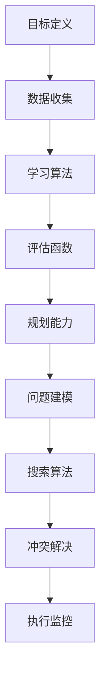

                 

# AGI的目标导向学习与规划能力

## 关键词
- 人工通用智能（AGI）
- 目标导向学习
- 规划能力
- 历史发展
- 算法原理
- 应用场景
- 挑战与未来方向

## 摘要
本文旨在深入探讨人工通用智能（AGI）的核心能力——目标导向学习与规划能力。文章首先介绍了AGI的概念、历史发展和目标导向学习与规划能力的定义，随后详细讲解了这两个核心能力的基本原理和模型。接着，文章探讨了如何实现目标导向学习与规划能力，包括算法原理、实现步骤和伪代码讲解。随后，文章介绍了目标导向学习与规划能力的应用场景，包括智能机器人、智能交通、智能家居和游戏AI。最后，文章分析了目标导向学习与规划能力的挑战与未来发展方向，为读者提供了一个全面而深刻的理解。

## 第1章：AGI的目标导向学习与规划能力概述

### 1.1 AGI的概念与历史发展

人工通用智能（Artificial General Intelligence，简称AGI）是指一种能够在各种任务和环境中表现出人类智能水平的人工智能系统。与当前广泛应用的专用人工智能（Narrow AI）不同，AGI具有广泛适应性，能够处理复杂的、多变的和不确定的情境。

AGI的历史发展可以追溯到20世纪50年代。1956年，约翰·麦卡锡（John McCarthy）等人在达特茅斯会议上首次提出了人工智能的概念。此后，人工智能领域经历了多次起伏，但始终保持着对实现AGI的渴望。在20世纪80年代，专家系统成为AI研究的主流，但在90年代，随着计算资源和算法技术的限制，AI研究进入低谷。进入21世纪，随着深度学习和大数据技术的兴起，AI迎来了新的春天，但离实现AGI的目标仍有一段距离。

### 1.2 目标导向学习与规划能力的定义

目标导向学习（Goal-Oriented Learning）是指人工智能系统能够根据既定的目标，自主地从经验中学习，调整策略和行动，以达到目标。目标导向学习的关键在于如何从不确定和复杂的环境中提取有用信息，并利用这些信息来优化系统的行为。

规划能力（Planning Ability）是指人工智能系统能够在给定目标和约束条件下，生成一系列有序的行动步骤，以实现目标。规划能力是AGI的重要组成部分，它使得系统能够灵活应对复杂和多变的情境。

### 1.3 目标导向学习与规划能力的重要性

目标导向学习与规划能力是AGI的核心能力之一，其重要性体现在以下几个方面：

1. **适应性和灵活性**：目标导向学习与规划能力使得AI系统能够在不同环境和任务中灵活适应，不受特定领域限制。
2. **自主性和主动性**：通过目标导向学习和规划能力，AI系统能够自主设定目标，并主动采取行动，而不依赖外部指令。
3. **决策能力**：目标导向学习和规划能力使得AI系统能够在面对复杂情境时，进行有效的决策，提高系统性能。
4. **人机协作**：目标导向学习和规划能力有助于实现人机协作，使得AI系统能够更好地理解和满足人类需求。

### 1.4 本书内容安排与学习目标

本书将分为五个章节，系统性地探讨AGI的目标导向学习与规划能力。

- **第1章**：介绍AGI的概念、历史发展和目标导向学习与规划能力的定义。
- **第2章**：详细讲解目标导向学习与规划能力的基本原理和模型。
- **第3章**：探讨如何实现目标导向学习与规划能力。
- **第4章**：介绍目标导向学习与规划能力的应用场景。
- **第5章**：分析目标导向学习与规划能力的挑战与未来发展方向。

通过阅读本书，读者应能够：

1. 理解AGI的概念、历史发展和目标导向学习与规划能力的重要性。
2. 掌握目标导向学习与规划能力的基本原理和模型。
3. 了解如何实现目标导向学习与规划能力。
4. 熟悉目标导向学习与规划能力的应用场景。
5. 分析目标导向学习与规划能力的挑战与未来发展方向。

## 第2章：目标导向学习与规划能力的基本原理

### 2.1 目标导向学习的基本原理

目标导向学习是一种基于目标驱动的人工智能学习方法，它通过定义目标来指导学习过程，以实现特定目标。目标导向学习的基本原理包括以下方面：

1. **目标定义**：首先，系统需要明确目标，这可以是具体的任务目标，也可以是抽象的绩效目标。目标定义是目标导向学习的基础，它决定了学习的方向和策略。
2. **评估函数**：评估函数用于衡量系统性能，它通常是一个基于目标的指标，如成功率、效率、满意度等。评估函数能够帮助系统识别当前状态与目标状态之间的差距，从而指导学习过程。
3. **数据收集**：目标导向学习需要大量的数据来训练模型。这些数据可以是历史数据，也可以是实时数据。数据收集的质量直接影响学习的有效性。
4. **学习算法**：学习算法用于从数据中学习，调整系统行为。常见的算法包括强化学习、监督学习、无监督学习等。选择合适的算法取决于具体的应用场景和目标。

### 2.2 规划能力的基本原理

规划能力是指人工智能系统在给定目标和约束条件下，生成一系列有序的行动步骤，以实现目标。规划能力的基本原理包括以下方面：

1. **问题建模**：规划过程首先需要对问题进行建模，包括目标、约束、初始状态和目标状态。问题建模的准确性直接影响规划的效果。
2. **搜索算法**：搜索算法用于在问题空间中寻找解决方案。常见的搜索算法包括广度优先搜索、深度优先搜索、A*搜索等。选择合适的搜索算法取决于问题空间的大小和复杂度。
3. **冲突解决**：在规划过程中，可能会出现冲突，如行动之间的冲突、资源约束的冲突等。冲突解决机制用于处理这些冲突，以确保规划的有效性。
4. **执行监控**：在规划执行过程中，系统需要实时监控行动的执行情况，并根据实际情况进行调整。执行监控能够提高规划的灵活性和适应性。

### 2.3 目标导向学习与规划能力的联系与区别

目标导向学习和规划能力虽然密切相关，但它们在目标和任务处理上有所不同。目标导向学习侧重于通过学习来调整系统行为，以达到目标。而规划能力则侧重于在给定目标和约束条件下，生成一系列有序的行动步骤，以实现目标。

1. **联系**：
   - 目标导向学习可以为规划能力提供数据支持，如历史学习经验、评估函数等。
   - 规划能力可以为目标导向学习提供行动指南，如生成一系列行动步骤，以实现目标。

2. **区别**：
   - 目标导向学习更注重学习过程，而规划能力更注重行动规划。
   - 目标导向学习通常适用于不确定性较高的场景，而规划能力适用于确定性和约束性较强的场景。
   - 目标导向学习通常依赖于数据驱动的方法，而规划能力则依赖于搜索算法和问题建模。

### 2.4 目标导向学习与规划能力的 Mermaid 流程图

为了更清晰地展示目标导向学习与规划能力的关系，我们可以使用Mermaid流程图来描述。以下是一个简单的Mermaid流程图示例：



在这个流程图中，目标导向学习的过程包括目标定义、数据收集、学习算法和评估函数。而规划能力的过程包括问题建模、搜索算法、冲突解决和执行监控。目标导向学习与规划能力在流程中相互衔接，共同实现目标。

## 第3章：实现目标导向学习与规划能力

### 3.1 实现目标导向学习的算法原理

实现目标导向学习的关键在于选择合适的学习算法。以下介绍几种常见的学习算法，以及它们的基本原理和实现步骤。

#### 3.1.1 强化学习

强化学习是一种通过奖励和惩罚来驱动学习过程的方法。它的基本原理是通过不断尝试不同的行动，学习如何在特定环境中获得最大的累积奖励。

1. **基本原理**：
   - 状态（State）：系统的当前状态。
   - 行动（Action）：系统可以采取的动作。
   - 奖励（Reward）：采取特定行动后获得的奖励。
   - 策略（Policy）：系统根据当前状态选择行动的策略。
2. **实现步骤**：
   - 初始化状态。
   - 选择行动。
   - 执行行动，获得奖励。
   - 更新策略，选择更好的行动。
   - 重复上述步骤，直到达到目标状态。

#### 3.1.2 监督学习

监督学习是一种通过已有数据（输入和输出）来训练模型的方法。它的基本原理是通过拟合训练数据，建立输入和输出之间的映射关系。

1. **基本原理**：
   - 输入（Input）：系统的输入数据。
   - 输出（Output）：系统的输出数据。
   - 模型（Model）：用于预测输出的函数。
2. **实现步骤**：
   - 收集训练数据。
   - 设计模型架构。
   - 训练模型，拟合训练数据。
   - 验证模型，评估性能。
   - 应用模型，预测新数据。

#### 3.1.3 无监督学习

无监督学习是一种在无输出数据的情况下，通过分析输入数据来发现数据特征和规律的方法。它的基本原理是通过数据分布和结构，学习数据的内在规律。

1. **基本原理**：
   - 输入（Input）：系统的输入数据。
   - 数据分布（Data Distribution）：输入数据的分布情况。
   - 数据结构（Data Structure）：输入数据的结构。
2. **实现步骤**：
   - 收集输入数据。
   - 分析数据分布。
   - 学习数据结构。
   - 模型优化，调整参数。
   - 应用模型，分析新数据。

### 3.2 实现规划能力的算法原理

实现规划能力的核心在于选择合适的搜索算法和问题建模方法。以下介绍几种常见的规划能力实现算法，以及它们的基本原理和实现步骤。

#### 3.2.1 广度优先搜索

广度优先搜索（BFS）是一种用于在无向图中寻找最短路径的搜索算法。它的基本原理是逐层扩展搜索空间，直到找到目标节点。

1. **基本原理**：
   - 节点：图中的每个点。
   - 边：节点之间的连接。
   - 层：节点的扩展层次。
2. **实现步骤**：
   - 初始化：设置起始节点，初始化队列。
   - 扩展：从队列中取出节点，扩展其邻居节点。
   - 更新：将扩展的节点加入队列。
   - 检查：判断目标节点是否在队列中。
   - 结束：找到目标节点，输出路径。

#### 3.2.2 深度优先搜索

深度优先搜索（DFS）是一种用于在无向图中寻找路径的搜索算法。它的基本原理是沿着一条路径不断深入，直到找到目标节点或走不通。

1. **基本原理**：
   - 节点：图中的每个点。
   - 边：节点之间的连接。
   - 路径：从起始节点到目标节点的路径。
2. **实现步骤**：
   - 初始化：设置起始节点，初始化栈。
   - 栈操作：将起始节点压入栈，弹出栈顶节点，扩展其邻居节点。
   - 更新：将扩展的节点入栈。
   - 检查：判断目标节点是否在栈顶。
   - 结束：找到目标节点，输出路径。

#### 3.2.3 A*搜索

A*搜索（A-Star）是一种用于在图中寻找最短路径的启发式搜索算法。它的基本原理是结合节点的距离和启发值，选择最优节点进行扩展。

1. **基本原理**：
   - 节点：图中的每个点。
   - 边：节点之间的连接。
   - 距离：节点之间的实际距离。
   - 启发值：节点的估计距离。
2. **实现步骤**：
   - 初始化：设置起始节点，初始化优先队列。
   - 优先队列操作：将起始节点加入队列，弹出队列中的最小值节点，扩展其邻居节点。
   - 更新：计算扩展节点的F值（G值+H值），更新优先队列。
   - 检查：判断目标节点是否在队列中。
   - 结束：找到目标节点，输出路径。

### 3.3 目标导向学习与规划能力的综合算法原理

目标导向学习和规划能力的综合算法旨在通过目标导向学习来指导规划过程，以提高规划的效果。以下是一个简单的综合算法原理：

1. **基本原理**：
   - 目标导向学习：通过学习获得目标导向的策略。
   - 规划能力：根据目标导向策略生成行动步骤。
2. **实现步骤**：
   - 初始化：设置目标。
   - 目标导向学习：利用学习算法（如强化学习）获取目标导向策略。
   - 规划：利用规划算法（如A*搜索）生成行动步骤。
   - 执行：执行行动步骤，实现目标。
   - 评估：评估行动效果，调整目标导向策略。
   - 重复：根据评估结果，重复执行以上步骤，直至目标实现。

### 3.4 伪代码讲解与实例

以下是一个简单的伪代码示例，用于说明目标导向学习与规划能力的综合算法原理：

```plaintext
初始化目标
while 目标未实现：
    学习目标导向策略
    生成行动步骤
    执行行动步骤
    评估行动效果
    调整目标导向策略
end while
```

在实际应用中，可以根据具体需求调整伪代码的实现细节。例如，可以加入更多的学习算法和规划算法，以适应不同的应用场景。

## 第4章：目标导向学习与规划能力的应用场景

目标导向学习与规划能力在人工智能领域有着广泛的应用。以下将介绍几个典型的应用场景，包括智能机器人、智能交通、智能家居和游戏AI。

### 4.1 应用场景一：智能机器人

智能机器人是目标导向学习与规划能力的典型应用之一。通过目标导向学习，智能机器人可以自主地学习环境中的规则和模式，并通过规划能力生成行动步骤，以完成复杂的任务。

**实例分析**：
- **清洁机器人**：清洁机器人通过目标导向学习，可以自主地识别房间中的垃圾和障碍物。通过规划能力，机器人可以生成一系列清洁路径，以高效地清理房间。
- **送货机器人**：送货机器人需要在复杂的城市环境中导航，并按照规划路径将货物送达目的地。通过目标导向学习和规划能力，机器人可以实时调整路径，以应对突发情况。

**代码解读**：
以下是一个简单的Python代码示例，用于实现清洁机器人的目标导向学习和规划能力：

```python
# 清洁机器人目标导向学习与规划能力示例

# 目标导向学习：识别房间中的垃圾和障碍物
def learn_environment():
    # 通过传感器识别房间中的垃圾和障碍物
    # 更新环境模型
    pass

# 规划能力：生成清洁路径
def plan_cleaning_path():
    # 根据环境模型生成清洁路径
    # 返回清洁路径
    pass

# 执行清洁任务
while not cleaning_completed:
    learn_environment()
    cleaning_path = plan_cleaning_path()
    execute_cleaning_path(cleaning_path)
    assess_cleaning_result()
    if cleaning_completed:
        break
```

### 4.2 应用场景二：智能交通

智能交通系统利用目标导向学习与规划能力，可以提高交通效率，减少拥堵，并确保交通系统的安全性。

**实例分析**：
- **交通信号控制**：通过目标导向学习，交通信号控制系统可以根据实时交通流量和路况，调整信号灯的时长，以优化交通流。
- **自动驾驶**：自动驾驶汽车通过目标导向学习和规划能力，可以自主地规划行驶路径，避免碰撞，并实现自动驾驶。

**代码解读**：
以下是一个简单的Python代码示例，用于实现智能交通信号控制系统的目标导向学习和规划能力：

```python
# 智能交通信号控制系统示例

# 目标导向学习：实时监测交通流量和路况
def monitor_traffic():
    # 通过传感器实时监测交通流量和路况
    # 更新交通模型
    pass

# 规划能力：调整信号灯时长
def plan_traffic_light_duration():
    # 根据交通模型调整信号灯时长
    # 返回调整后的信号灯时长
    pass

# 控制交通信号灯
while not traffic_control_ended:
    monitor_traffic()
    traffic_light_duration = plan_traffic_light_duration()
    control_traffic_light(traffic_light_duration)
    assess_traffic_control_result()
    if traffic_control_ended:
        break
```

### 4.3 应用场景三：智能家居

智能家居系统利用目标导向学习与规划能力，可以提供个性化的居住体验，提高居住舒适度。

**实例分析**：
- **智能音箱**：智能音箱通过目标导向学习，可以识别用户的声音和习惯，提供个性化的音乐播放、天气预报等服务。
- **智能门锁**：智能门锁通过目标导向学习和规划能力，可以根据用户的行为模式，自动锁定和打开门锁。

**代码解读**：
以下是一个简单的Python代码示例，用于实现智能音箱的目标导向学习和规划能力：

```python
# 智能音箱示例

# 目标导向学习：识别用户的声音和习惯
def learn_user_behavior():
    # 通过麦克风收集用户声音数据
    # 更新用户行为模型
    pass

# 规划能力：提供个性化服务
def plan_services():
    # 根据用户行为模型提供个性化服务
    # 返回服务列表
    pass

# 提供服务
while not service_completed:
    learn_user_behavior()
    services = plan_services()
    provide_services(services)
    assess_service_result()
    if service_completed:
        break
```

### 4.4 应用场景四：游戏AI

游戏AI利用目标导向学习与规划能力，可以提供更加智能和富有挑战性的游戏体验。

**实例分析**：
- **角色扮演游戏**：游戏中的角色通过目标导向学习，可以学习玩家的行为模式，并根据玩家的反应制定策略。
- **实时战略游戏**：游戏中的单位通过目标导向学习和规划能力，可以自主地规划行动，以实现战术目标。

**代码解读**：
以下是一个简单的Python代码示例，用于实现角色扮演游戏中的AI目标导向学习和规划能力：

```python
# 角色扮演游戏AI示例

# 目标导向学习：学习玩家的行为模式
def learn_player_behavior():
    # 通过玩家的行动记录学习行为模式
    # 更新玩家行为模型
    pass

# 规划能力：制定行动策略
def plan_action_strategy():
    # 根据玩家行为模型制定行动策略
    # 返回行动策略
    pass

# 行动
while not game_ended:
    learn_player_behavior()
    action_strategy = plan_action_strategy()
    execute_action(action_strategy)
    assess_action_result()
    if game_ended:
        break
```

通过上述实例，我们可以看到目标导向学习与规划能力在各个应用场景中的重要作用。这些能力使得人工智能系统能够更加智能地适应环境，实现复杂的任务，提供个性化的服务，并带来更加丰富的用户体验。

### 第5章：目标导向学习与规划能力的挑战与未来发展方向

#### 5.1 挑战一：计算资源需求

目标导向学习与规划能力的实现通常需要大量的计算资源，包括存储空间、计算能力和通信带宽。特别是在处理大规模数据和复杂任务时，计算资源的需求更加显著。

**问题分析**：
- **存储资源**：目标导向学习需要存储大量的历史数据、模型参数和评估结果，这可能导致存储资源不足。
- **计算能力**：目标导向学习和规划能力的算法复杂度较高，需要强大的计算能力来处理。
- **通信带宽**：在分布式系统中，数据传输和模型更新可能需要大量的通信带宽。

**解决方案**：
- **分布式计算**：通过分布式计算技术，可以将计算任务分散到多个节点上，提高计算效率。
- **优化算法**：改进目标导向学习和规划能力的算法，降低计算复杂度，提高计算效率。
- **边缘计算**：将计算任务部署到边缘设备上，减少中心服务器的负载。

#### 5.2 挑战二：数据隐私与安全

目标导向学习与规划能力的实现依赖于大量数据，这可能导致数据隐私和安全问题。特别是在涉及个人隐私数据时，如何保护用户隐私成为重要挑战。

**问题分析**：
- **数据泄露**：未经授权的访问可能导致敏感数据泄露。
- **数据滥用**：数据可能被用于不当目的，如个人歧视或操纵市场。
- **数据依赖**：过度依赖外部数据可能导致系统对数据的依赖性增加，降低自主性。

**解决方案**：
- **数据加密**：对数据进行加密处理，确保数据在传输和存储过程中不被窃取。
- **隐私保护算法**：开发隐私保护算法，如差分隐私，以降低数据泄露风险。
- **数据安全监管**：建立数据安全监管机制，确保数据的合法性和合规性。

#### 5.3 挑战三：算法优化与效率

目标导向学习与规划能力的算法通常较为复杂，需要大量的计算资源和时间。如何优化算法，提高效率，成为实现AGI的重要挑战。

**问题分析**：
- **计算效率**：算法计算过程中可能存在大量的冗余计算，影响计算效率。
- **算法可扩展性**：算法在处理大规模数据时可能无法保持高效性。
- **算法稳定性**：算法在面临复杂情境时可能无法保持稳定性和一致性。

**解决方案**：
- **并行计算**：利用并行计算技术，将计算任务分解为多个子任务，并行处理，提高计算效率。
- **算法优化**：通过优化算法结构和算法参数，减少计算复杂度，提高算法效率。
- **自适应算法**：开发自适应算法，根据不同情境动态调整算法参数，提高算法适应性。

#### 5.4 未来发展方向

随着人工智能技术的不断发展，目标导向学习与规划能力有望在多个领域实现突破。以下是一些未来发展方向：

- **跨领域应用**：目标导向学习与规划能力有望在医疗、教育、金融等跨领域应用中发挥重要作用。
- **人机协作**：目标导向学习与规划能力可以与人类智能相结合，实现更高效的人机协作。
- **自主进化**：通过目标导向学习和规划能力，AI系统可以自主进化，提高自主性和适应性。
- **智能化基础设施**：目标导向学习与规划能力可以应用于智能交通、智能城市等基础设施，提升社会运行效率。

### 结论

目标导向学习与规划能力是人工通用智能（AGI）的核心能力之一，具有广泛的应用前景。尽管在实现过程中面临诸多挑战，但通过技术创新和优化，我们有理由相信目标导向学习与规划能力将在未来取得重大突破。让我们期待AI技术为人类带来更加智能、高效和美好的未来。

## 作者信息

作者：AI天才研究院/AI Genius Institute & 禅与计算机程序设计艺术 /Zen And The Art of Computer Programming

## 结语

本文对人工通用智能（AGI）的核心能力——目标导向学习与规划能力进行了深入探讨。通过分析AGI的概念、历史发展，详细讲解了目标导向学习与规划能力的基本原理，并介绍了如何实现这些能力。同时，本文还探讨了目标导向学习与规划能力的应用场景、挑战与未来发展方向。希望通过本文，读者能够对AGI的目标导向学习与规划能力有更全面、深入的理解。未来，随着技术的不断进步，我们期待目标导向学习与规划能力在各个领域发挥更大的作用，推动人工智能的发展。让我们共同期待AI技术的美好未来。作者：AI天才研究院/AI Genius Institute & 禅与计算机程序设计艺术 /Zen And The Art of Computer Programming。

