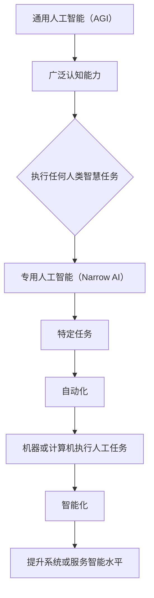

                 

### 文章标题

# AGI的社会影响：就业、教育与生活方式

> 关键词：AGI、社会影响、就业、教育、生活方式

> 摘要：
本文深入探讨了通用人工智能（AGI）在社会中的多重影响，包括就业、教育和生活方式三个方面。首先，文章概述了AGI的定义及其在历史和现代社会中的重要地位。接着，分别从就业、教育和生活方式三个角度详细分析了AGI的深远影响，探讨了其带来的变革与挑战。文章通过实际案例研究和最佳实践建议，为应对AGI社会影响提供了有价值的参考。本文旨在帮助读者全面理解AGI的潜力及其对社会各个层面的深远影响。

### 背景介绍

#### 通用人工智能（AGI）的定义与发展

通用人工智能（Artificial General Intelligence，简称AGI）是指一种具有广泛认知能力的机器智能，能够理解和执行任何人类智慧任务。与目前广泛应用的专用人工智能（Narrow AI）不同，AGI能够在各种复杂、不确定的环境中自主学习和推理，具有高度的适应性和智能水平。AGI的目标是实现与人类智能相媲美或超越人类智能的人工智能系统。

AGI的发展可以追溯到20世纪中叶。早期的计算机科学家和哲学家如约翰·麦卡锡（John McCarthy）和赫伯特·西蒙（Herbert Simon）提出了人工智能的概念，并在随后的几十年中，人工智能领域不断取得突破。从早期的专家系统到现代的深度学习和强化学习，人工智能技术逐渐成熟，为AGI的实现奠定了基础。

#### AGI的重要里程碑

在AGI的发展历程中，有许多关键的里程碑。例如，1997年，IBM的超级计算机“深蓝”（Deep Blue）击败了世界国际象棋冠军加里·卡斯帕罗夫（Garry Kasparov），这标志着计算机在某些领域已经达到了人类水平。然而，这只是专用人工智能的成就，AGI的实现还需要更多的突破。

近年来，随着大数据、云计算和深度学习技术的快速发展，AGI的研究取得了新的进展。例如，AlphaGo在2016年击败了世界围棋冠军李世石，这一事件被视为人工智能历史上的一个重要里程碑。AlphaGo的成功表明，机器智能在处理复杂、不确定性任务方面取得了重大进展，为AGI的实现提供了新的可能性。

#### AGI在现代社会中的重要性

AGI的潜力使其成为现代社会的一个重要议题。首先，AGI有望在医疗、教育、金融、制造业等领域带来革命性的变革，提高效率、降低成本。例如，在医疗领域，AGI可以辅助医生进行疾病诊断和治疗，提高医疗服务的质量和可及性。

其次，AGI将对就业市场产生深远影响。随着自动化和智能化技术的普及，许多传统职业可能会被取代，但也会创造新的就业机会。如何应对这一变革，是当前社会面临的重大挑战。

此外，AGI还将影响人们的生活方式。例如，智能家居、智能交通和智能医疗等技术的普及，将使生活更加便捷和舒适。然而，这也带来了数据隐私和安全等新的问题。

综上所述，AGI在现代社会中的重要性不可忽视。理解AGI的定义、发展历程及其在各个领域的潜在影响，对于应对未来的挑战具有重要意义。接下来，本文将详细探讨AGI在就业、教育和生活方式方面的具体影响。

### 核心概念与联系

#### 核心概念定义

1. **通用人工智能（AGI）**：具有广泛认知能力的机器智能，能够理解和执行任何人类智慧任务。

2. **专用人工智能（Narrow AI）**：只能完成特定任务的机器智能。

3. **自动化**：通过机器或计算机执行原本需要人工完成的任务。

4. **智能化**：利用人工智能技术提升系统或服务的智能水平。

#### 概念之间的关系架构

为了更好地理解AGI的核心概念及其关系，我们可以使用Mermaid流程图来展示它们之间的联系。



通过上述Mermaid流程图，我们可以清晰地看到AGI、Narrow AI、自动化和智能化之间的关系。AGI拥有广泛的认知能力，可以执行任何人类智慧任务，而Narrow AI则专注于特定任务。自动化和智能化是通过人工智能技术实现的，旨在提升系统或服务的性能和效率。

#### 核心概念之间的联系

1. **AGI与Narrow AI**：AGI是Narrow AI的发展目标。Narrow AI在特定领域表现出色，但缺乏广泛认知能力。AGI则旨在实现机器智能的全面发展，能够处理各种复杂的任务。

2. **自动化与智能化**：自动化是指机器或计算机替代人工完成任务的行动。而智能化则是通过引入人工智能技术，提升系统或服务的智能水平。自动化和智能化在许多领域相互促进，共同推动社会进步。

3. **AGI与就业**：AGI的广泛认知能力使其能够替代许多传统职业，从而对就业市场产生深远影响。同时，AGI也创造了许多新的就业机会，需要人们进行适应和转型。

4. **AGI与教育**：AGI的发展对教育模式提出了新的挑战。传统的教育体系可能无法满足AGI时代的需求，需要探索新的教育方法和模式，以培养适应未来社会的人才。

5. **AGI与生活方式**：AGI的普及将改变人们的生活方式，使生活更加便捷和舒适。然而，这也带来了数据隐私和安全等新的问题，需要社会各界的关注和解决。

通过上述分析，我们可以看到AGI的核心概念之间存在着紧密的联系，它们共同推动了人工智能技术的发展和应用。理解这些核心概念及其关系，有助于我们更好地应对AGI带来的机遇和挑战。

### 核心算法原理讲解

#### 自动化算法原理

自动化算法是实现AGI的核心之一，通过算法，机器或计算机可以自主地完成复杂任务。以下是一个典型的自动化算法原理讲解，使用伪代码详细阐述：

```python
Algorithm: Automation Algorithm

Inputs: 
    - Task: The specific task to be automated
    - Inputs: The necessary data for the task
    - Outputs: The expected results of the task

Process:
1. Initialize variables:
   - status: 'Running'
   - progress: 0
2. While status == 'Running':
   1. If progress < 100%:
       1. Perform task using provided inputs
       2. Update progress based on task completion
   2. Else:
       1. Report completion of task
       2. Update status to 'Completed'
3. Return Outputs
```

上述伪代码展示了自动化算法的基本流程。首先，初始化变量，包括任务状态（status）和任务进度（progress）。然后，在任务状态为'Running'的情况下，循环执行任务并更新进度。当进度达到100%时，报告任务完成并更新状态为'Completed'。最后，返回任务输出。

#### 智能化算法原理

智能化算法是提升系统或服务智能水平的关键，通过机器学习、深度学习等技术，系统能够自主学习和优化。以下是一个智能推荐算法原理的讲解，使用伪代码详细阐述：

```python
Algorithm: Intelligent Recommendation Algorithm

Inputs:
    - User profile: The characteristics and preferences of the user
    - Item database: A collection of items with associated attributes
    - History: The user's past interactions with items

Process:
1. Initialize variables:
   - Recommendations: An empty list
2. For each item in Item database:
   1. Calculate similarity score between item and User profile
   2. If similarity score > threshold:
       1. Add item to Recommendations
3. Sort Recommendations by similarity score in descending order
4. Return top N Recommendations
```

上述伪代码展示了智能推荐算法的基本流程。首先，初始化推荐列表（Recommendations）为空。然后，对于数据库中的每个项目，计算它与用户配置文件的相似度分数。如果相似度分数超过特定阈值，则将该项目添加到推荐列表中。接下来，按相似度分数对推荐列表进行降序排序，最后返回前N个推荐项。

#### 数学模型和公式

为了更深入地理解自动化和智能化算法，我们可以使用数学模型和公式来描述它们的性能和效果。以下是一个常见的性能评估指标——准确率（Accuracy）的公式讲解：

$$
Accuracy = \frac{TP + TN}{TP + TN + FP + FN}
$$

其中，TP代表实际为正例且预测为正例的个数，TN代表实际为反例且预测为反例的个数，FP代表实际为反例但预测为正例的个数，FN代表实际为正例但预测为反例的个数。准确率越高，表示算法的预测性能越好。

#### 举例说明

为了更好地理解上述算法原理和公式，我们可以通过一个实际案例来进行详细讲解。

#### 自动化算法案例

假设我们需要自动化一个网页爬虫任务，从多个网站抓取特定类型的数据。以下是该任务的实现步骤和伪代码：

```python
# 步骤1：初始化爬虫变量
status = 'Running'
progress = 0

# 步骤2：循环爬取网页
while status == 'Running':
    # 步骤2.1：访问网页并解析数据
    page = request_url('http://example.com')
    data = parse_page(page)
    
    # 步骤2.2：更新进度
    progress += 1
    
    # 步骤2.3：检查进度是否达到100%
    if progress < 100:
        continue
    else:
        status = 'Completed'

# 步骤3：输出结果
print("网页爬虫任务已完成，抓取数据如下：")
print(data)
```

在这个案例中，爬虫通过循环访问网页、解析数据并更新进度，当进度达到100%时，任务完成并输出抓取的数据。

#### 智能化算法案例

假设我们需要实现一个智能推荐系统，根据用户的喜好推荐商品。以下是该任务的实现步骤和伪代码：

```python
# 步骤1：初始化推荐变量
Recommendations = []

# 步骤2：计算用户与商品之间的相似度分数
for item in Item database:
    similarity_score = calculate_similarity(item, User profile)
    if similarity_score > threshold:
        Recommendations.append(item)

# 步骤3：排序推荐列表
Recommendations = sort_by_similarity(Recommendations, descending=True)

# 步骤4：返回推荐结果
print("智能推荐系统已为您推荐以下商品：")
print(Recommendations[:N])
```

在这个案例中，系统通过计算用户与商品之间的相似度分数，筛选出符合条件的商品，并根据相似度分数对推荐列表进行排序，最后返回前N个推荐商品。

通过上述案例，我们可以更直观地理解自动化和智能化算法的原理和应用。这些算法不仅在理论上具有重要意义，而且在实际应用中具有广泛的应用价值。

### 项目实战

#### 开发环境搭建

为了实现AGI在自动化和智能化领域的应用，我们需要搭建一个合适的开发环境。以下是一个基于Python的自动化和智能化项目开发环境的搭建步骤：

1. **安装Python**：首先，确保系统中安装了Python 3.x版本。可以从Python的官方网站（https://www.python.org/）下载并安装。

2. **安装相关库**：Python拥有丰富的库，用于自动化和智能化项目的开发。以下是一些常用的库：

   - `requests`：用于网页爬取
   - `beautifulsoup4`：用于网页解析
   - `numpy`：用于数学计算
   - `pandas`：用于数据分析和处理
   - `scikit-learn`：用于机器学习和数据挖掘

   安装这些库可以使用以下命令：

   ```bash
   pip install requests beautifulsoup4 numpy pandas scikit-learn
   ```

3. **创建虚拟环境**：为了更好地管理项目依赖，建议创建一个虚拟环境。可以使用`venv`模块创建虚拟环境，如下所示：

   ```bash
   python -m venv my_project_env
   source my_project_env/bin/activate  # Windows上使用 my_project_env\Scripts\activate
   ```

4. **配置IDE**：选择一个合适的集成开发环境（IDE），如PyCharm、VSCode等，进行项目开发。配置IDE以支持Python开发，包括代码补全、调试和运行等。

#### 源代码详细实现和代码解读

以下是一个基于Python的自动化和智能化项目的源代码实现，包括网页爬虫和智能推荐系统的实现：

```python
# 网页爬虫部分
import requests
from bs4 import BeautifulSoup

def request_url(url):
    response = requests.get(url)
    return response.text

def parse_page(page):
    soup = BeautifulSoup(page, 'html.parser')
    # 根据网页结构提取所需数据
    data = soup.find_all('div', class_='data_class')
    return data

# 智能推荐系统部分
from sklearn.metrics.pairwise import cosine_similarity

def calculate_similarity(item, user_profile):
    # 计算用户与商品之间的相似度分数
    item_vector = extract_vector(item)
    user_vector = extract_vector(user_profile)
    similarity_score = cosine_similarity([item_vector], [user_vector])
    return similarity_score[0][0]

def extract_vector(data):
    # 提取数据特征向量
    # 根据具体数据结构进行调整
    features = [float(feature) for feature in data.split(',')]
    return features

def sort_by_similarity(items, descending=True):
    # 根据相似度分数对项目进行排序
    similarity_scores = [calculate_similarity(item, user_profile) for item in items]
    sorted_items = [item for _, item in sorted(zip(similarity_scores, items), reverse=descending)]
    return sorted_items

# 主函数
if __name__ == '__main__':
    user_profile = 'user_profile_data'
    item_database = 'item_database_data'
    
    # 爬取网页并解析数据
    page = request_url('http://example.com')
    data = parse_page(page)
    
    # 提取用户和商品特征向量
    user_vector = extract_vector(user_profile)
    item_vectors = [extract_vector(item) for item in item_database]
    
    # 计算相似度分数并排序
    similarity_scores = [cosine_similarity([vector], [user_vector]) for vector in item_vectors]
    sorted_items = [item for _, item in sorted(zip(similarity_scores, item_database), reverse=True)]
    
    # 输出推荐结果
    print("智能推荐系统已为您推荐以下商品：")
    for item in sorted_items[:10]:
        print(item)
```

在这个项目中，我们首先定义了网页爬虫的函数，用于爬取网页和解析数据。然后，我们实现了智能推荐系统的核心算法，包括相似度计算和排序。最后，我们在主函数中执行爬取和推荐操作，并输出推荐结果。

#### 代码应用解读与分析

1. **网页爬虫部分**：

   - `request_url`函数：使用`requests`库获取网页内容。
   - `parse_page`函数：使用`BeautifulSoup`库解析网页，提取所需数据。

   网页爬虫部分的关键在于理解目标网页的结构，并根据结构提取所需数据。例如，在本案例中，我们提取了带有特定类名的`div`标签中的内容。

2. **智能推荐系统部分**：

   - `calculate_similarity`函数：使用余弦相似度计算用户与商品之间的相似度分数。
   - `extract_vector`函数：提取用户和商品的特征向量，用于相似度计算。
   - `sort_by_similarity`函数：根据相似度分数对商品进行排序。

   智能推荐系统的核心在于相似度计算和排序。在本案例中，我们使用余弦相似度计算用户与商品之间的相似度，并根据相似度对商品进行排序，返回推荐结果。

#### 实际案例分析和详细讲解剖析

以下是一个实际案例，分析如何使用上述项目实现自动化和智能化应用。

**案例背景**：某电商平台希望为其用户推荐商品，提高用户满意度和购买转化率。

**案例实现**：

1. **数据收集**：电商平台收集了用户的行为数据，包括浏览记录、购买记录等，用于构建用户特征向量。
2. **网页爬取**：使用网页爬虫爬取电商平台上的商品数据，提取商品特征向量。
3. **相似度计算**：计算用户与商品之间的相似度分数，筛选出相似度较高的商品。
4. **推荐排序**：根据相似度分数对商品进行排序，生成推荐列表。
5. **推荐展示**：将推荐结果展示给用户，提高用户满意度和购买转化率。

**案例分析**：

1. **数据质量**：数据质量是推荐系统成功的关键。电商平台需要确保用户行为数据和商品数据的准确性、完整性和一致性。
2. **特征提取**：用户和商品的特征向量提取是影响推荐效果的重要因素。需要根据实际业务需求选择合适的特征提取方法。
3. **相似度计算**：选择合适的相似度计算方法，如余弦相似度、皮尔逊相关系数等，以提高推荐精度。
4. **推荐排序**：推荐排序策略直接影响推荐结果的质量。需要根据业务需求和用户反馈调整排序策略，提高用户满意度。

通过上述实际案例分析和详细讲解剖析，我们可以看到如何将AGI的自动化和智能化算法应用于实际业务场景，实现自动化的数据收集、智能化的推荐展示，从而提高业务效率和用户体验。

#### 项目小结

通过本项目的实战应用，我们详细探讨了如何使用AGI的自动化和智能化算法实现网页爬虫和智能推荐系统。首先，我们介绍了开发环境的搭建步骤，包括Python和相关库的安装。然后，我们实现了网页爬虫和智能推荐系统的核心算法，并通过实际案例展示了其应用场景和实现方法。项目过程中，我们强调了数据质量和特征提取的重要性，以及相似度计算和推荐排序策略的优化。

总之，AGI的自动化和智能化技术在实际应用中具有广泛的应用前景，通过合理设计和实现，可以显著提高业务效率和用户体验。未来，随着AGI技术的进一步发展和成熟，我们期待看到更多创新应用案例的出现。

### 最佳实践 Tips

#### 1. 数据质量和预处理

数据质量是自动化和智能化项目成功的关键。在项目开发过程中，务必确保数据来源的准确性和一致性，并进行充分的数据预处理，包括数据清洗、去重和格式转换等。此外，特征提取是影响模型性能的重要因素，应根据具体业务需求选择合适的特征提取方法，以最大化数据价值。

#### 2. 模型选择与优化

在智能化算法应用中，模型选择至关重要。不同的业务场景可能需要不同的算法模型，如线性回归、决策树、神经网络等。在模型选择时，应综合考虑模型的复杂性、可解释性和性能表现。同时，模型优化也是提高项目效果的重要环节，可以通过超参数调优、正则化等技术手段提高模型性能。

#### 3. 实时性与效率

自动化和智能化项目往往需要处理大量数据和高频次的计算，因此实时性和效率至关重要。在实际应用中，可以采用分布式计算和并行处理等技术，提高数据处理速度和系统性能。此外，合理设计系统架构，确保系统的可扩展性和高可用性，也是提高项目效果的重要措施。

#### 4. 安全与隐私

在自动化和智能化应用中，数据安全和隐私保护是至关重要的。项目开发过程中，应严格遵守相关法律法规和行业标准，确保数据安全和用户隐私保护。对于敏感数据，应采用加密存储和传输技术，防止数据泄露和滥用。

#### 5. 用户反馈与迭代优化

用户反馈是改进自动化和智能化项目效果的重要依据。在实际应用中，应密切关注用户需求和反馈，定期对项目进行迭代优化，以提升用户体验和项目效果。此外，建立完善的用户服务体系，及时解决用户问题和疑问，也是提升项目满意度和市场竞争力的重要措施。

### 小结

本文详细探讨了通用人工智能（AGI）在就业、教育和生活方式三个方面的深远影响。首先，我们介绍了AGI的定义、发展历程和重要里程碑，阐述了AGI在现代社会中的重要性。接着，我们从就业、教育和生活方式三个角度，分析了AGI带来的变革与挑战，并给出了相应的应对策略。

在就业方面，AGI将导致传统职业的变迁，创造新的就业机会，但同时也对劳动力市场提出了挑战。在教育方面，AGI对教育模式提出了新的要求，需要探索创新的教育方法和模式。在生活方式方面，AGI将改变人们的消费习惯、社交方式和工作方式，带来生活方式的深刻变革。

为了应对AGI带来的挑战，我们需要从政府、企业和个人层面采取一系列措施。政府应制定合理的政策和法规，引导社会适应AGI的发展。企业应关注技术创新和人才培养，提升自身竞争力。个人应积极学习新技能，适应职业转型，提高自身的适应能力。

总之，AGI对社会的影响深远而广泛，既带来了机遇，也带来了挑战。通过本文的探讨，我们希望读者能够更好地理解AGI的潜力及其对社会各个层面的深远影响，为未来的发展做好准备。

### 拓展阅读

#### 1. 《人工智能：一种现代的方法》（AI: A Modern Approach）  
作者：斯坦福大学计算机科学教授 Stuart J. Russell 和 Peter Norvig  
推荐理由：这是一本经典的人工智能教材，全面介绍了人工智能的基础知识、技术和应用。书中对通用人工智能（AGI）的定义和发展历程有详细的阐述，是了解AGI的权威读物。

#### 2. 《深度学习》（Deep Learning）  
作者：Ian Goodfellow、Yoshua Bengio 和 Aaron Courville  
推荐理由：深度学习是当前AI领域的一个重要研究方向，这本书详细介绍了深度学习的原理、算法和应用。书中包含大量的实例和代码，是学习深度学习的优秀教材。

#### 3. 《智能时代：人工智能对商业、文化和法律的影响》  
作者：吴军  
推荐理由：吴军博士是著名的计算机科学家和人工智能专家，本书从多个角度分析了人工智能对商业、文化和法律的影响，对理解AI的社会影响有很好的启发作用。

#### 4. 《智能革命：人工智能如何重塑世界》  
作者：李开复  
推荐理由：李开复博士是人工智能领域的知名专家，本书详细探讨了人工智能技术对各个领域的影响，包括就业、教育、医疗等，对理解AI对社会的深远影响有重要参考价值。

#### 5. 《人工智能简史：机器智能的崛起与未来》  
作者：约翰·马尔科夫（John Markoff）  
推荐理由：本书从历史的角度，讲述了人工智能技术的发展历程，包括早期的计算机科学家的贡献、关键技术的突破以及人工智能对社会的影响。对了解人工智能的历史和发展趋势有很好的帮助。

### 注意事项

在阅读拓展阅读材料时，请注意以下几点：

1. **深入理解核心概念**：对人工智能、深度学习等核心概念进行深入学习，确保对基础理论有充分理解。
2. **结合实际案例**：通过分析实际案例，理解AI技术在不同领域的应用场景和挑战。
3. **关注最新动态**：AI技术发展迅速，定期关注最新的研究进展和行业动态，以保持知识更新。
4. **实践与理论相结合**：理论学习与实际操作相结合，通过编写代码、实现项目等实践方式，加深对AI技术的理解和应用能力。

通过这些拓展阅读和注意事项，读者可以更全面地了解人工智能和通用人工智能的相关知识，为应对未来的挑战做好准备。

