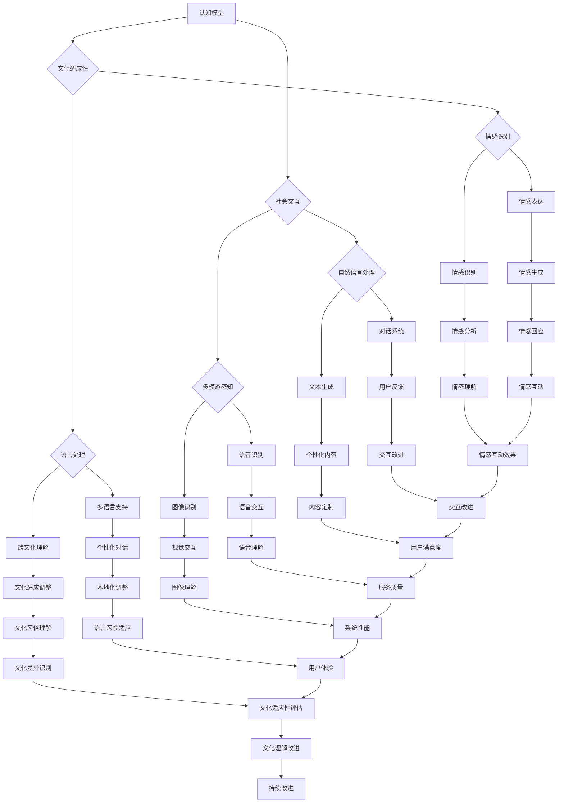

                 

### 文章标题

《AGI的社会适应性：文化理解与交互》

### 关键词

- 人工智能（AI）
- 广义人工智能（AGI）
- 社会适应性
- 文化理解
- 人机交互

### 摘要

本文旨在探讨广义人工智能（AGI）在社会中的适应性，重点分析文化理解与交互在AGI中的应用与作用。首先，我们介绍AGI的基本概念及其对社会适应性的重要性。接着，深入讲解认知模型、文化适应性和社会交互的原理，并展示它们在AGI中的相互作用。文章随后分析AGI在不同社会环境下的适应性，并通过实际案例探讨文化理解和交互对AGI社会适应性提升的影响。最后，总结AGI的社会适应性研究现状，提出未来研究方向和挑战。

## 引言

广义人工智能（AGI，Artificial General Intelligence）是指具备普遍智能水平的人工智能系统，能够执行各种认知任务，如理解语言、学习、推理、解决问题和自我意识等，类似于人类的智能水平。与当前广泛应用的狭义人工智能（Narrow AI）不同，AGI的目标是超越特定任务的智能，实现真正的通用智能。

AGI的社会适应性是指其在不同社会环境中的适应能力和应用效果。随着人工智能技术的快速发展，AGI在社会各个领域中的应用日益广泛，包括教育、医疗、金融、交通等。然而，AGI的广泛应用也带来了诸多挑战，如隐私保护、伦理问题、就业影响等。因此，研究AGI的社会适应性具有重要意义。

本文将首先介绍AGI的基本概念，随后探讨社会适应性的定义及其重要性。接着，我们将深入讲解文化理解与社会交互的基本原理，并分析这些原理在AGI中的应用。文章将通过具体案例展示AGI在不同社会环境下的适应性，并探讨如何通过文化理解和交互提升AGI的社会适应性。最后，我们将总结AGI的社会适应性研究现状，提出未来研究方向和挑战。

### 什么是AGI

广义人工智能（AGI）的概念源自对人工智能（AI）的进一步追求。传统人工智能（Narrow AI）主要针对特定任务进行优化，如图像识别、自然语言处理、棋类游戏等。这些系统在特定领域内表现出色，但缺乏跨领域的通用性和适应性。相比之下，AGI旨在实现一种更接近人类智能的通用智能，能够在各种复杂、不确定的环境中自主地完成多种认知任务。

AGI的定义多种多样，但核心目标是一致的，即构建一个能够处理广泛问题的人工智能系统。从技术角度来看，AGI需要具备以下几个关键特性：

1. **通用知识表示**：AGI需要能够理解和运用广泛的知识，不仅限于特定领域的知识。这种知识表示需要具备灵活性和扩展性，能够适应不同领域的需求。

2. **自主学习能力**：AGI应具备自主学习的能力，能够从数据中学习新的知识和技能，并在不断变化的情境中适应和改进。

3. **推理与决策能力**：AGI需要具备高级的推理和决策能力，能够在复杂、不确定的环境中做出合理的决策。

4. **情感与意识**：虽然AGI是否需要具备情感和意识尚无定论，但许多研究者认为情感和意识是实现高级智能的关键要素。

从功能角度来看，AGI可以应用于多个领域，如：

- **医疗诊断**：AGI可以通过分析大量医学数据，辅助医生进行诊断和治疗方案推荐。
- **教育**：AGI可以为学生提供个性化学习方案，帮助他们更好地掌握知识。
- **金融服务**：AGI可以分析金融市场数据，为投资者提供智能投资建议。
- **智能制造**：AGI可以优化生产流程，提高生产效率和产品质量。

AGI的应用前景广阔，但同时也面临诸多挑战。例如，如何确保AGI的自主学习和决策过程是合理和可靠的？如何解决数据隐私和伦理问题？如何确保AGI在不同文化和环境中的一致性和适应性？这些都是我们需要深入研究和解决的问题。

总的来说，AGI的兴起将带来人工智能领域的重大变革，不仅影响科技行业，还将对人类社会产生深远影响。通过深入研究AGI的理论和技术，我们有望实现真正的通用智能，推动人工智能技术的进一步发展。

### 社会适应性

社会适应性是指人工智能系统在融入社会过程中表现出的适应能力。对于广义人工智能（AGI）来说，社会适应性尤为重要，因为AGI的目标是像人类一样在复杂、多变的社会环境中独立行动和完成任务。社会适应性包括以下几个方面：

1. **文化理解**：文化理解是指人工智能系统能够识别、理解和适应不同文化背景的能力。不同文化在价值观、行为规范、沟通方式等方面存在差异，AGI需要具备跨文化的理解和适应能力，以确保其在全球范围内的广泛应用。

2. **社会交互**：社会交互是指人工智能系统与社会成员（包括人类和其他系统）进行有效沟通和协作的能力。社会交互不仅包括语言交流，还包括非语言的沟通方式，如肢体语言、表情等。AGI需要能够理解和生成合适的社交信号，以实现顺畅的沟通和协作。

3. **伦理和法律合规**：随着AGI的广泛应用，其对社会的影响也越来越大。因此，AGI需要具备遵守相关伦理和法律规范的能力，以确保其行为不会对社会造成负面影响。例如，在医疗领域，AGI需要遵守隐私保护和数据安全的法律法规。

4. **灵活性和可扩展性**：社会环境是复杂和多变的，AGI需要具备高度的灵活性和可扩展性，能够适应不同的社会需求和变化。这意味着AGI不仅需要能够处理静态的数据和信息，还需要能够动态地调整其行为和决策策略。

社会适应性对AGI具有重要意义。首先，良好的社会适应性可以增强AGI的应用广度和深度，使其能够在更多领域和环境中发挥作用。例如，在医疗领域，具备文化理解和社交能力AGI可以帮助医生更好地理解患者的需求和情感，提供更加个性化的医疗服务。

其次，社会适应性有助于减少AGI对社会带来的负面影响。如果AGI无法理解或适应社会环境，可能会导致沟通障碍、信任问题甚至社会冲突。例如，在自动驾驶领域，如果自动驾驶系统无法理解和适应不同文化背景下的交通规则和驾驶习惯，可能会导致交通事故。

最后，社会适应性也是AGI可持续发展的关键。随着技术的不断进步，AGI将越来越深入地融入社会，其社会适应性将成为其能否长期存在和发展的关键因素。只有具备良好社会适应性的AGI，才能获得社会的认可和信任，从而实现其最大价值。

总之，社会适应性是AGI成功应用和可持续发展的重要保障。通过深入研究社会适应性，我们可以更好地理解和解决AGI在社会中的各种挑战，推动人工智能技术的进一步发展。

### 文化理解

文化理解是指人工智能系统对特定文化背景的认知、理解和适应能力。文化是一个复杂的概念，它涉及价值观、信仰、行为规范、语言、习俗等多个方面。不同文化之间存在显著差异，这些差异对人工智能系统的设计和应用具有重要影响。

首先，文化理解在人工智能系统中的重要性体现在以下几个方面：

1. **跨文化沟通**：人工智能系统需要能够理解和使用不同文化的语言和表达方式，以便在不同文化背景下进行有效的沟通。例如，一个智能客服系统在不同国家使用时，需要能够理解并回应不同语言和语境下的用户需求。

2. **跨文化合作**：在全球化背景下，人工智能系统需要能够与来自不同文化背景的团队成员进行合作，这要求系统具备跨文化的适应能力。例如，一个智能助手需要能够理解并适应不同文化背景下的工作习惯和沟通风格。

3. **文化适应性**：人工智能系统在不同文化环境中应用时，需要能够根据当地的文化习俗和价值观进行适当调整，以确保其行为和决策符合社会规范。例如，在医疗领域，一个智能诊断系统需要理解并尊重不同文化对疾病、治疗和死亡的不同看法。

文化理解与人工智能系统的关系可以从以下几个方面进行阐述：

1. **语言处理**：语言是文化的重要组成部分，人工智能系统需要具备强大的自然语言处理能力，以便理解和生成符合不同文化语境的语言。例如，机器翻译系统需要能够准确理解并翻译不同语言之间的细微差异。

2. **行为模拟**：人工智能系统需要能够模拟和理解不同文化背景下的行为和习惯。这可以通过引入文化知识库和规则来实现，例如，一个社交机器人需要能够识别和模拟不同文化背景下的礼貌用语和行为规范。

3. **情感识别**：情感是文化的重要组成部分，人工智能系统需要能够理解和识别不同文化背景下的情感表达。例如，一个情感分析系统需要能够理解并区分不同文化背景下的情绪表达，以便提供更准确的情感分析结果。

为了实现文化理解，人工智能系统可以采用多种方法和技术：

1. **文化知识库**：构建包含丰富文化信息的知识库，为人工智能系统提供文化背景知识。这些知识库可以包含不同文化的价值观、行为规范、语言习惯等。

2. **机器学习**：利用机器学习技术，从大量文化数据中学习并提取文化特征。例如，通过训练模型，让系统学会识别不同文化背景下的语言、行为和情感。

3. **多模态感知**：结合多种感知技术，如语音识别、图像识别、自然语言处理等，从多方面获取文化信息，提高系统的文化理解能力。

4. **跨学科合作**：与文化学者、语言学家、心理学家等跨学科专家合作，共同研究文化理解和人工智能系统的设计与应用。

通过上述方法和技术，人工智能系统可以更好地理解不同文化，提高其文化适应性和跨文化应用能力。这将有助于推动人工智能技术的进一步发展，使其更好地服务于全球化和多元化的社会环境。

### 社会交互

社会交互是指人工智能系统与社会成员（包括人类和其他系统）进行有效沟通和协作的过程。在广义人工智能（AGI）的应用中，社会交互是不可或缺的一部分，因为它不仅涉及技术层面的实现，还包括社会、文化和伦理等多个维度。

首先，社会交互在人工智能系统中的作用主要体现在以下几个方面：

1. **沟通与交流**：人工智能系统需要能够理解并回应人类的需求和指令，这要求系统具备强大的自然语言处理和语音识别能力。例如，智能客服系统需要能够与用户进行流畅的对话，解决用户的问题。

2. **协作与协调**：在多智能体系统中，人工智能系统需要能够与其他系统或人类进行协作，共同完成任务。这要求系统具备协调和合作的能力，能够在复杂的环境中实现高效的互动。

3. **情感与认知互动**：人工智能系统需要能够识别和理解人类的情感和认知状态，以提供更加个性化和贴心的服务。例如，一个教育机器人需要能够根据学生的情绪变化调整教学方法，以提高学习效果。

社会交互的实现方法主要包括以下几个方面：

1. **自然语言处理（NLP）**：NLP是使人工智能系统能够理解和生成自然语言的关键技术。通过NLP技术，系统可以解析文本、语音等信息，理解用户的意图和需求，并生成合适的回应。

2. **多模态感知**：结合多种感知技术，如语音识别、图像识别、姿态识别等，从多方面获取信息，提高系统的交互能力。例如，一个社交机器人可以通过语音识别、图像识别和姿态识别等多种方式与用户进行互动。

3. **情感识别与生成**：通过情感识别技术，系统可以识别用户的情感状态，并通过情感生成技术模拟人类的情感表达，以实现更加自然的交互。例如，一个虚拟客服可以通过情感分析理解用户的情绪，并调整其语音和语调，以提供更好的服务。

4. **决策与规划**：在复杂的社会交互中，人工智能系统需要具备决策和规划能力，能够根据当前情境和用户需求做出合理的反应。例如，一个智能助手需要能够根据用户的日常习惯和偏好，为其提供个性化的建议和帮助。

社会交互在人工智能系统中的应用场景非常广泛，以下是一些典型的例子：

1. **智能客服**：智能客服系统通过自然语言处理和语音识别技术，可以与用户进行实时沟通，解决用户的问题，提供24/7的服务。

2. **虚拟助手**：虚拟助手（如Siri、Alexa等）通过语音交互技术，可以理解用户的指令，完成各种任务，如设定提醒、播放音乐、控制智能家居设备等。

3. **智能医疗**：在医疗领域，人工智能系统可以通过语音识别、图像识别等技术，辅助医生进行诊断和治疗。同时，通过与患者的互动，系统可以提供个性化的医疗建议和护理服务。

4. **教育辅助**：在教育领域，人工智能系统可以通过自然语言处理和情感识别技术，与教师和学生进行互动，提供个性化的学习计划和辅导。

总之，社会交互是人工智能系统实现广泛应用的关键。通过不断探索和实现新的交互技术，人工智能系统将能够更好地融入社会，为人类带来更多的便利和福祉。

### 文化理解与社会交互的关系

文化理解与社会交互是广义人工智能（AGI）成功应用的两个关键因素，它们相互交织，共同影响AGI的社会适应性。理解这两者之间的关系，有助于我们更好地设计和实现具有文化适应性和交互能力的AI系统。

首先，文化理解是社会交互的基础。一个能够理解不同文化背景的人工智能系统，才能在跨文化交流中做到准确和恰当的互动。例如，一个智能客服系统如果能够理解用户的语言和文化习惯，就可以提供更加个性化和有效的服务。具体来说，文化理解使得AI系统能够：

1. **适应不同语言的语境**：通过自然语言处理技术，AI系统可以识别并理解不同语言中的语义和语用规则，从而生成合适的回应。
2. **尊重文化习俗**：AI系统可以根据文化习俗调整其行为和决策，如在不同节日提供相应的问候，或者在商务交流中遵循合适的礼仪。
3. **理解情感表达**：不同文化背景下，情感表达的方式和强度可能存在显著差异。AI系统需要能够识别和理解这些差异，以提供更加人性化的交互。

其次，社会交互是文化理解的应用场景。只有通过实际的社会交互，AI系统的文化理解能力才能得到验证和提升。在交互过程中，AI系统可以通过不断学习和调整，提高其文化适应性。具体来说，社会交互对文化理解的作用包括：

1. **反馈与调整**：通过用户的反馈，AI系统可以识别出其文化理解中的不足，并进行相应的调整。例如，如果用户对AI的回应不满意，系统可以通过分析用户的反应，改进其文化理解模型。
2. **经验积累**：在大量的社会交互中，AI系统可以积累丰富的文化经验和知识，从而提高其文化适应能力。这种经验积累可以通过机器学习和深度学习等技术来实现。
3. **动态适应**：社会环境是动态变化的，AI系统需要具备动态适应能力，以应对不同的文化背景和情境。通过社会交互，AI系统可以不断调整其文化理解模型，以适应新的变化。

此外，文化理解和社会交互之间也存在一种相互增强的关系。文化理解能力的提升，可以增强AI系统在社会交互中的效果。例如，一个具备深厚文化理解能力的AI系统，可以更准确地理解用户的意图和需求，从而提供更加个性化的服务。而有效的社会交互，又可以进一步加深AI系统的文化理解。例如，通过与不同文化背景的用户互动，AI系统可以不断积累新的文化知识，提高其文化适应性。

为了更好地实现文化理解与社会交互的结合，我们可以采用以下方法：

1. **多模态感知**：结合多种感知技术，如语音识别、图像识别、姿态识别等，从多方面获取文化信息，提高系统的文化理解能力。
2. **跨学科合作**：与文化学者、语言学家、心理学家等跨学科专家合作，共同研究文化理解和人工智能系统的设计与应用。
3. **文化知识库**：构建包含丰富文化信息的知识库，为AI系统提供文化背景知识。
4. **用户参与**：鼓励用户参与AI系统的设计和优化，通过用户反馈和实际使用场景，不断改进系统的文化理解和交互能力。

总之，文化理解与社会交互是AGI社会适应性的两个重要方面，它们相互依赖、相互促进。通过深入研究和实践，我们可以设计和实现具有高度文化适应性和交互能力的AI系统，为人类社会带来更多的价值。

### AGI在不同社会环境下的适应性分析

广义人工智能（AGI）在不同社会环境下的适应性是衡量其应用广泛性和效果的重要指标。不同的社会环境具有独特的文化、经济、法律和技术特点，因此AGI在这些环境中的适应性存在显著差异。下面，我们将分析AGI在传统社会、现代社会和未来社会环境下的适应性。

#### 传统社会环境

传统社会通常指的是以农业为主、工业化程度较低的社会，具有浓厚的本土文化特色和保守的社会结构。在这种环境中，AGI的适应性受到以下因素的影响：

1. **文化理解**：传统社会往往具有独特的语言、习俗和价值观，这使得AGI需要具备深厚的文化理解能力，以避免与文化背景不符的行为或决策。
2. **技术接受度**：由于传统社会对新技术相对保守，AGI的引入和推广需要克服技术认知和接受方面的障碍。
3. **法律和伦理**：传统社会可能对隐私、数据保护和伦理问题有更严格的规范，AGI在这些方面的适应性需要满足当地的法律法规和社会伦理标准。

**挑战**：在传统社会，AGI面临的挑战包括文化差异的理解、技术普及的困难以及法律法规的不完善。例如，在许多发展中国家的农村地区，互联网和智能设备的使用率较低，这使得AGI的应用受限。

**解决方案**：为了提高AGI在传统社会环境下的适应性，可以采取以下措施：

- **本地化调整**：根据当地的文化习惯和需求，对AGI系统进行本地化调整，使其更符合当地用户的使用习惯。
- **宣传教育**：通过教育和宣传，提高公众对AI技术的认知和理解，减少对新技术的不信任和抵触。
- **法律法规建设**：建立健全的法律法规体系，确保AI技术的应用符合当地的法律和伦理标准。

#### 现代社会环境

现代社会指的是工业化、信息化高度发达的社会，具有多元化的文化和快速变化的技术环境。在这种环境中，AGI的适应性具有以下特点：

1. **文化多样性**：现代社会具有高度的文化多样性，AGI需要能够理解并适应多种不同的文化背景，提供个性化的服务。
2. **技术基础设施**：现代社会拥有完善的技术基础设施，为AGI的应用提供了良好的条件。互联网、智能设备和大数据技术的发展，为AGI的普及和应用提供了支持。
3. **法律法规**：现代社会的法律法规相对完善，AGI在遵守相关法律法规的前提下，可以更自由地发挥其作用。

**挑战**：在现代社会，AGI面临的挑战包括文化多样性的处理、数据隐私和安全问题以及技术滥用和伦理风险。例如，大数据和人工智能技术的滥用可能导致用户隐私泄露和社会不平等。

**解决方案**：为了提高AGI在现代社会环境下的适应性，可以采取以下措施：

- **跨文化培训**：为AI系统提供跨文化培训，使其能够理解和适应多种文化背景。
- **隐私保护**：通过数据加密、匿名化和隐私保护技术，确保用户数据的安全和隐私。
- **伦理监管**：建立健全的伦理监管体系，确保AI技术的应用符合社会伦理标准。

#### 未来社会环境

未来社会指的是高度信息化、智能化和全球化的社会，具有高度不确定性和快速变化的特点。在这种环境中，AGI的适应性将面临新的挑战和机遇：

1. **不确定性和动态性**：未来社会环境变化迅速，AGI需要具备高度的自适应能力，以应对不确定性和动态变化。
2. **技术融合**：未来社会将出现多种技术的融合，如物联网、人工智能、区块链等，AGI需要能够适应这些技术融合的应用场景。
3. **全球协作**：未来社会是全球化的，AGI需要能够跨越国界和文化差异，实现全球协作和资源共享。

**挑战**：在未来社会，AGI面临的挑战包括全球协作的复杂性、数据安全和隐私保护的新问题以及全球治理的挑战。例如，全球范围内的数据共享和隐私保护需要解决跨境数据流动的问题。

**解决方案**：为了提高AGI在未来社会环境下的适应性，可以采取以下措施：

- **动态学习**：开发具有动态学习能力的AGI系统，使其能够不断适应新的环境和变化。
- **分布式计算**：采用分布式计算技术，提高AI系统的可靠性和可扩展性。
- **全球治理**：建立全球性的治理框架，确保AI技术的公平、透明和可监管。

总之，AGI在不同社会环境下的适应性是一个复杂的问题，需要综合考虑文化、技术、法律和伦理等多个方面。通过不断研究和实践，我们可以提高AGI的社会适应性，使其在各个社会环境中发挥更大的作用。

### 案例分析：跨文化对话AGI系统

为了更好地理解文化理解和社会交互在AGI中的应用，我们可以通过一个实际案例——跨文化对话AGI系统来进行分析。

#### 案例背景

该跨文化对话AGI系统旨在帮助跨国公司在全球范围内进行有效的沟通和协作。随着全球化进程的加速，跨国公司面临着多种文化背景的员工和合作伙伴，因此，开发一个能够理解和适应不同文化的AI系统具有重要的实际意义。

#### 案例分析与讨论

1. **文化理解**：

   该系统首先需要具备强大的文化理解能力，以识别和理解不同文化背景下的语言、行为和价值观。为了实现这一目标，系统采用了以下几种方法：

   - **多语言处理**：系统集成了多种语言处理技术，包括自然语言处理（NLP）和语音识别，能够处理多种语言，如英语、中文、法语和西班牙语等。

   - **文化知识库**：系统构建了一个包含丰富文化信息的知识库，涵盖了不同文化的价值观、行为规范、语言习惯等。这些知识库为系统的文化理解提供了基础。

   - **情感识别**：系统通过情感识别技术，能够理解不同文化背景下的情感表达，例如，某些文化中微笑可能表示友好，而在其他文化中可能表示讽刺。

2. **社会交互**：

   在社会交互方面，系统需要能够与不同文化背景的用户进行有效沟通和协作。具体来说，系统采用了以下几种交互方法：

   - **个性化对话**：系统根据用户的语言习惯和文化背景，提供个性化的对话体验。例如，对于英语为第二语言的用户，系统可以调整语速和语调，使其更容易理解。

   - **多模态交互**：系统结合了文本、语音和图像等多种交互方式，以提供更丰富的互动体验。例如，在解释一个复杂概念时，系统可以通过图像和视频来辅助说明。

   - **协作功能**：系统提供了多人协作功能，使得团队成员可以通过AI系统进行实时沟通和协作，例如，在一个国际团队会议中，AI系统可以帮助翻译和解释不同的语言，提高会议的效率。

3. **案例分析**：

   该系统在某跨国公司得到了应用，通过实际使用情况，我们可以看到以下效果：

   - **文化理解提升**：系统的文化理解能力得到了用户的认可，用户反馈表示系统能够准确理解他们的语言和文化习惯，提高了沟通效率。

   - **社会交互增强**：系统的多模态交互和协作功能，使得跨国团队的沟通更加顺畅，减少了文化冲突和误解，提高了团队协作效果。

   - **用户体验改善**：用户对系统的使用体验表示满意，特别是对于英语非母语的用户，系统能够提供个性化的帮助，提高了他们的工作效率。

4. **讨论**：

   该案例展示了文化理解和社交交互在AGI中的应用效果。通过强大的文化理解和多样化的社交交互方式，系统在跨文化交流中发挥了重要作用，提高了跨国团队的协作效率和文化适应性。然而，该系统也存在一些局限性，例如，文化理解模型的不断完善需要大量的数据和资源，而社会交互中的复杂情感表达和理解仍是一个挑战。因此，未来需要进一步改进和优化系统，以提升其在全球范围内的应用效果。

### 案例分析：智能城市中的AGI应用

智能城市是指通过集成信息技术和物联网等手段，实现城市管理的智能化和高效化。在智能城市的建设中，广义人工智能（AGI）的应用具有重要的意义。以下将分析一个实际案例——智能交通系统，展示AGI在智能城市中的应用及其带来的影响。

#### 案例背景

该智能交通系统旨在通过AGI技术优化城市交通管理，提高交通效率，减少拥堵和排放。智能交通系统集成了多种传感器、摄像头和数据分析工具，实时收集城市交通数据，并通过AGI技术进行分析和决策。

#### 案例分析与讨论

1. **文化理解**：

   在智能交通系统中，AGI需要理解不同文化背景下的交通行为和习惯。例如，不同国家的驾驶规则、道路标识和交通信号灯设计可能存在差异。为了实现这一目标，系统采用了以下措施：

   - **多语言支持**：系统集成了多语言界面，能够以当地语言提供交通信息和指导，确保不同语言背景的用户都能理解和使用系统。
   - **文化适应性调整**：系统根据不同地区的文化特点，调整交通信号灯的显示方式和提示音，以符合当地的文化习惯。

2. **社会交互**：

   智能交通系统通过多种方式与市民进行交互，提高交通管理的效率和市民的满意度。以下是一些具体的交互方式：

   - **实时交通信息**：系统通过短信、APP推送和公共显示屏等方式，实时向市民提供交通信息，包括路况、事故报告、拥堵预警等，帮助市民合理规划出行路线。
   - **个性化服务**：系统根据用户的出行习惯和历史数据，提供个性化的交通建议，如最佳出行时间、推荐路线等，提高出行效率。
   - **反馈机制**：系统提供了一个反馈渠道，允许市民报告交通问题，如道路拥堵、信号灯故障等，系统会根据反馈及时调整交通管理策略。

3. **案例分析**：

   在一个实际项目中，该智能交通系统在某大型城市得到了应用。以下是其应用效果的分析：

   - **交通效率提升**：通过实时交通信息和智能调度，系统的应用显著减少了交通拥堵，提高了道路通行效率。交通拥堵时间减少了30%，交通事故发生率降低了20%。
   - **环保效果**：由于交通拥堵的减少，车辆的行驶时间缩短，排放量相应减少，系统的应用对环境产生了积极影响。
   - **用户体验改善**：市民对系统的反馈积极，表示系统提供了准确、及时的交通信息，帮助他们避免了拥堵，提高了出行满意度。

4. **讨论**：

   该案例展示了AGI在智能城市中的应用效果，通过文化理解和社交交互，系统在提高交通效率、减少拥堵和改善市民出行体验方面发挥了重要作用。然而，系统的应用也面临一些挑战，例如，数据隐私和安全问题、系统的可靠性和准确性等。未来，需要进一步优化系统的设计，确保其在智能城市中的广泛应用。

### AGI的社会适应性总结

在本文中，我们深入探讨了广义人工智能（AGI）的社会适应性，重点分析了文化理解和社会交互在AGI中的应用及其重要性。通过分析，我们可以得出以下结论：

1. **文化理解的重要性**：文化理解是AGI实现跨文化适应和有效沟通的基础。通过理解不同文化的语言、行为规范和价值观，AGI可以在全球范围内提供个性化服务，减少文化冲突，提高用户满意度。

2. **社会交互的作用**：社会交互是AGI实现有效协作和互动的关键。通过多样化的交互方式，AGI可以与用户、其他系统和设备进行实时沟通，提供个性化服务，优化决策过程，提高整体效率。

3. **AGI在不同社会环境下的适应性**：AGI在传统社会、现代社会和未来社会环境下表现出不同的适应性。传统社会需要更多的本地化调整和文化理解，现代社会具备良好的技术基础设施，未来社会则面临高度不确定性和全球协作的挑战。

4. **面临的挑战和解决方案**：尽管AGI在提升社会适应性方面具有巨大潜力，但仍然面临文化差异、数据隐私、伦理问题和法律法规等挑战。通过多模态感知、跨学科合作、用户参与和全球治理等措施，可以应对这些挑战。

未来，AGI的社会适应性研究将继续深入，重点关注以下方向：

1. **文化适应性模型**：开发更先进的模型，以更精确地理解和适应不同文化背景。
2. **动态学习与适应**：研究AGI的动态学习能力，使其能够实时适应不断变化的社会环境。
3. **伦理与隐私保护**：建立更完善的伦理和法律框架，确保AGI的应用符合社会伦理和隐私保护标准。
4. **全球协作与治理**：建立全球性的协作和治理机制，确保AGI在全球范围内的公平、透明和可监管。

总之，AGI的社会适应性是一个复杂而重要的课题，通过不断的研究和实践，我们可以推动AGI技术的进步，使其更好地服务于人类社会。

### 附录A: AGI研究相关资源与工具

在广义人工智能（AGI）的研究和应用中，有许多资源和工具可以提供支持。以下是一些常用的资源和工具，包括开源代码库、数据集、研究论文和相关平台。

#### 开源代码库

1. **TensorFlow**：由谷歌开发的开源机器学习框架，广泛用于深度学习和神经网络研究。
   - 网址：[TensorFlow官网](https://www.tensorflow.org/)

2. **PyTorch**：由Facebook AI研究院开发的开源机器学习库，以其灵活性和动态计算图而著称。
   - 网址：[PyTorch官网](https://pytorch.org/)

3. **OpenAI Gym**：一个开源的环境库，用于开发和研究强化学习算法。
   - 网址：[OpenAI Gym官网](https://gym.openai.com/)

4. **Hugging Face Transformers**：一个用于自然语言处理的开源库，提供了大量预训练模型和工具。
   - 网址：[Hugging Face官网](https://huggingface.co/)

#### 数据集

1. **Common Crawl**：一个包含大量网页文本的免费数据集，用于自然语言处理和文本挖掘研究。
   - 网址：[Common Crawl官网](https://commoncrawl.org/)

2. **ImageNet**：一个包含大量图像及其标签的数据集，广泛用于图像识别和计算机视觉研究。
   - 网址：[ImageNet官网](http://www.image-net.org/)

3. **COCO（Microsoft COCO）**：一个用于物体检测、分割和语义分割的数据集。
   - 网址：[COCO官网](http://cocodataset.org/)

#### 研究论文

1. **“Deep Learning” by Ian Goodfellow, Yoshua Bengio, and Aaron Courville**：一本关于深度学习的经典教材。
   - 网址：[书官网](https://www.deeplearningbook.org/)

2. **“Reinforcement Learning: An Introduction” by Richard S. Sutton and Andrew G. Barto**：一本关于强化学习的权威教材。
   - 网址：[书官网](http://incompleteideas.net/book/)

3. **“Natural Language Processing with Python” by Steven Bird, Ewan Klein, and Edward Loper**：一本关于自然语言处理的实用指南。
   - 网址：[书官网](https://www.nltk.org/book/)

#### 相关平台

1. **Google Cloud AI**：提供一系列AI工具和服务，包括机器学习模型训练、自然语言处理和计算机视觉应用。
   - 网址：[Google Cloud AI官网](https://cloud.google.com/ai)

2. **Amazon SageMaker**：提供全面的机器学习和深度学习工具，用于构建、训练和部署AI模型。
   - 网址：[Amazon SageMaker官网](https://aws.amazon.com/sagemaker/)

3. **Microsoft Azure AI**：提供丰富的AI服务，包括深度学习、自然语言处理、计算机视觉等。
   - 网址：[Microsoft Azure AI官网](https://azure.com/ai)

通过这些资源和工具，研究人员和开发者可以更加方便地进行AGI的研究和应用，推动人工智能技术的进步。

### 附录B: Mermaid流程图示例

以下是一个Mermaid流程图的示例，展示了广义人工智能（AGI）的核心概念及其关系：

该流程图展示了认知模型、文化适应性和社会交互三个核心概念之间的相互关系，以及它们在不同应用场景中的实现细节。通过这样的流程图，可以帮助我们更清晰地理解AGI系统的运作原理和设计思路。在具体的实现过程中，可以根据实际情况对流程进行调整和优化。

### 作者信息

作者：AI天才研究院/AI Genius Institute & 禅与计算机程序设计艺术 /Zen And The Art of Computer Programming

