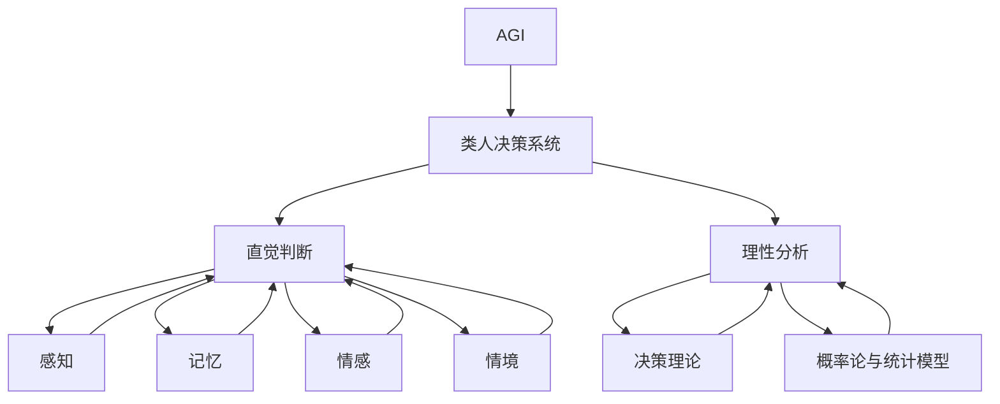

                 

### 文章标题：AGI的类人决策系统：从直觉判断到理性分析

#### 关键词：
- AGI
- 类人决策系统
- 直觉判断
- 理性分析
- 人工智能

#### 摘要：
本文探讨了AGI（通用人工智能）中类人决策系统的构建，从直觉判断到理性分析的角度，详细阐述了其核心概念、原理以及应用。文章首先介绍了AGI的概念及其在人工智能发展中的重要性，随后深入分析了类人决策系统的构成要素，包括直觉判断和理性分析。文章通过Mermaid流程图展示了核心概念之间的关系，并使用伪代码和LaTeX公式详细解释了算法原理。此外，文章还包括了实际案例分析和项目实战，旨在为读者提供全面的技术理解与实践指导。

## 引言

随着人工智能（AI）技术的飞速发展，通用人工智能（AGI，Artificial General Intelligence）成为了一个备受关注的研究领域。与传统的基于特定任务的狭义人工智能（Narrow AI）不同，AGI的目标是构建具有人类智能水平的通用智能体，能够在各种复杂环境中进行自主学习和决策。类人决策系统作为AGI的重要组成部分，承担着模仿人类决策过程的使命。

本文旨在探讨AGI的类人决策系统的构建，从直觉判断到理性分析的角度，详细分析其核心概念、原理及其应用。文章首先介绍了AGI的基本概念和发展历程，随后深入探讨了类人决策系统的构成和功能。通过Mermaid流程图展示核心概念之间的关系，使用伪代码和LaTeX公式详细解释算法原理。最后，本文将通过实际案例和项目实战，阐述类人决策系统的应用及其重要性。

### AGI概述

通用人工智能（AGI）是人工智能领域的一个长期目标，旨在开发一种具有人类智能水平的机器智能。与现有的狭义人工智能（Narrow AI）不同，AGI能够解决广泛的认知任务，并在不同的领域表现出类似人类的灵活性和适应性。AGI的目标不仅仅是模仿人类在特定领域的表现，而是实现一种跨领域的智能能力。

#### AGI的发展历程

AGI的研究可以追溯到20世纪50年代，当时人工智能的概念首次被提出。然而，由于技术和计算能力的限制，AGI的研究在很长一段时间内都处于停滞状态。直到最近几年，随着计算能力的提升和机器学习技术的突破，AGI的研究重新焕发了生机。

1. **初期探索**（1950-1969）：在1950年，艾伦·图灵提出了图灵测试，用于评估机器的智能水平。此后，人工智能的研究开始受到广泛关注。1956年，约翰·麦卡锡等人在达特茅斯会议上首次提出了“人工智能”这一术语。

2. **黄金时期**（1970-1989）：在20世纪70年代和80年代，人工智能领域经历了一个短暂的繁荣期。许多重要的算法和理论被提出，包括专家系统、知识表示和推理等。

3. **低谷时期**（1990-2000）：由于实际应用中的困难和技术挑战，人工智能领域在20世纪90年代进入了一个低谷期。许多研究项目受到了资金削减，人工智能的发展速度放缓。

4. **复兴时期**（2000至今）：随着互联网的普及和大数据技术的发展，机器学习和深度学习等新技术的出现，人工智能领域再次迎来了快速发展。近年来，许多重要的突破，如AlphaGo的胜利和自动驾驶汽车的出现，都表明AGI的愿景正在逐渐实现。

#### AGI的技术基础

实现AGI需要综合多种技术，包括机器学习、自然语言处理、计算机视觉和推理系统等。

1. **机器学习**：机器学习是AGI的核心技术之一，它使机器能够从数据中学习并自动改进其性能。特别是深度学习，通过多层神经网络模型，已经在图像识别、语音识别和自然语言处理等领域取得了显著成果。

2. **自然语言处理**：自然语言处理（NLP）技术使机器能够理解和生成人类语言。通过语义分析和语言模型，NLP技术能够实现机器翻译、文本摘要和情感分析等功能。

3. **计算机视觉**：计算机视觉技术使机器能够理解和解释图像和视频。通过卷积神经网络（CNN）和其他图像处理技术，计算机视觉已经在自动驾驶、人脸识别和医疗图像分析等领域取得了重要应用。

4. **推理系统**：推理系统是AGI的重要组成部分，它使机器能够基于已知事实进行逻辑推理。这些系统通常使用知识表示和逻辑编程技术，能够在复杂环境中做出合理决策。

### 类人决策系统概述

类人决策系统是AGI的核心组成部分，它模仿人类的决策过程，使得机器能够在各种复杂环境中进行自主学习和决策。类人决策系统主要由两部分构成：直觉判断和理性分析。

#### 直觉判断

直觉判断是人类决策过程中非常重要的一环，它使人们在面对复杂情境时能够迅速做出决策。直觉判断通常基于经验、知识和情绪等因素，具有快速、高效和灵活的特点。

1. **直觉判断的原理**：

   直觉判断的原理涉及多个方面，包括感知、记忆、情感和情境等。感知是直觉判断的基础，通过感官系统收集外部信息。记忆则使人们能够利用过去的经验和知识进行决策。情感在直觉判断中起着调节作用，使决策更加人性化。情境则提供了具体的决策背景，影响直觉判断的结果。

2. **直觉判断的应用**：

   直觉判断在许多实际应用中具有重要价值，如医疗诊断、金融投资、游戏策略等。例如，医生在诊断病情时，会根据患者的临床表现、病史和检查结果进行直觉判断，从而做出诊断决策。在金融投资领域，投资者会根据市场趋势、公司业绩和宏观经济环境进行直觉判断，从而做出投资决策。

#### 理性分析

理性分析是人类决策过程中另一重要环节，它基于逻辑推理和数学模型，通过系统分析数据和信息，做出合理的决策。

1. **理性分析的基本概念**：

   理性分析的基本概念包括决策理论、概率论和统计模型。决策理论研究如何在不同选择中做出最优决策。概率论和统计模型则为决策提供了数学基础，使决策更加科学和准确。

2. **理性分析的应用**：

   理性分析在许多领域具有重要应用，如经济决策、社会决策和企业决策。在经济决策中，理性分析可以帮助企业制定最优生产计划、定价策略和投资决策。在社会决策中，理性分析可以帮助政策制定者制定社会福利政策、公共设施建设和环境保护策略。在企业决策中，理性分析可以帮助企业优化供应链、人力资源管理和技术创新等。

### AGI与类人决策系统的关系

AGI与类人决策系统之间存在着紧密的联系。AGI的目标是实现具有人类智能水平的机器智能，而类人决策系统是实现这一目标的关键技术之一。类人决策系统通过模仿人类的直觉判断和理性分析过程，使机器能够在各种复杂环境中进行自主学习和决策。

1. **直觉判断与AGI**：

   直觉判断是人类智能的重要组成部分，它使人类能够在复杂环境中迅速做出决策。在AGI中，通过模拟人类的直觉判断过程，机器能够更好地适应复杂环境，提高决策的灵活性和准确性。

2. **理性分析与AGI**：

   理性分析是人类进行复杂决策的重要工具，它使人类能够在有限的时间和资源内做出最优决策。在AGI中，通过模拟人类的理性分析过程，机器能够更好地处理大量数据和信息，提高决策的科学性和准确性。

### 核心概念与联系架构 Mermaid 流程图



### 核心算法原理讲解

在类人决策系统中，核心算法主要包括直觉判断算法和理性分析算法。以下将分别使用伪代码和LaTeX公式详细解释这些算法的原理。

#### 直觉判断算法

```plaintext
// 直觉判断算法伪代码
function 直觉判断(感知数据, 记忆数据, 情感数据, 情境数据):
    输入：感知数据、记忆数据、情感数据和情境数据
    输出：决策结果
    
    // 感知数据预处理
    感知处理 = 预处理感知数据(感知数据)
    
    // 记忆数据融合
    记忆处理 = 融合记忆数据(记忆数据)
    
    // 情感数据调节
    情感处理 = 调节情感数据(情感数据)
    
    // 情境数据影响
    情境处理 = 考虑情境数据(情境数据)
    
    // 决策生成
    决策结果 = 综合处理结果(感知处理, 记忆处理, 情感处理, 情境处理)
    
    return 决策结果
```

#### 理性分析算法

```plaintext
// 理性分析算法伪代码
function 理性分析(决策问题, 数据集):
    输入：决策问题和相关数据集
    输出：最优决策
    
    // 决策问题建模
    模型 = 建立决策模型(决策问题)
    
    // 数据集预处理
    预处理数据 = 预处理数据集(数据集)
    
    // 决策算法
    策略 = 选择决策算法(模型, 预处理数据)
    
    // 决策计算
    决策结果 = 策略计算(策略)
    
    return 决策结果
```

#### 数学模型和公式

直觉判断和理性分析过程中涉及多个数学模型和公式，以下将使用LaTeX格式进行详细讲解。

$$
\text{感知数据} = f(\text{原始数据}, \theta_1)
$$

$$
\text{记忆数据} = g(\text{历史数据}, \theta_2)
$$

$$
\text{情感数据} = h(\text{情感因子}, \theta_3)
$$

$$
\text{情境数据} = i(\text{环境因素}, \theta_4)
$$

$$
\text{决策结果} = \text{综合处理结果}(\text{感知处理}, \text{记忆处理}, \text{情感处理}, \text{情境处理})
$$

#### 举例说明

以医疗诊断为例，假设医生需要对一名患者的病情进行诊断。以下是直觉判断和理性分析的过程：

##### 直觉判断

1. **感知数据**：医生收集患者的临床症状、体征和检查结果。
2. **记忆数据**：医生调用过去的诊断经验和医学知识。
3. **情感数据**：医生考虑患者的情绪和心理状态。
4. **情境数据**：医生考虑当前医疗环境、医疗资源等因素。

通过综合处理这些数据，医生做出初步的诊断。

##### 理性分析

1. **决策问题**：医生需要确定患者的具体疾病。
2. **数据集**：医生使用已有的病例数据和医学文献。
3. **决策模型**：医生选择合适的诊断算法，如贝叶斯网络或支持向量机。
4. **决策计算**：医生使用决策算法对数据进行分析，得到最优的诊断结果。

通过直觉判断和理性分析的结合，医生能够更准确地诊断患者的病情。

### AGI的类人决策系统应用

类人决策系统在AGI中的应用范围广泛，涵盖了经济决策、社会决策、企业决策等多个领域。以下是类人决策系统在不同领域的应用案例。

#### 经济决策

在经济决策中，类人决策系统可以帮助企业制定最优的生产计划、定价策略和投资决策。通过模拟直觉判断和理性分析过程，类人决策系统可以分析市场趋势、消费者行为和竞争对手策略，为企业提供科学的决策支持。

**案例**：一家制造企业需要决定下一季的生产计划和库存策略。类人决策系统可以收集市场数据、历史销售数据和竞争对手信息，利用直觉判断和理性分析，帮助企业制定最佳的生产计划和库存策略。

#### 社会决策

在社会决策中，类人决策系统可以帮助政府制定社会福利政策、公共设施建设和环境保护策略。通过模拟直觉判断和理性分析过程，类人决策系统可以分析社会需求、经济环境和公众意见，为政府提供科学的决策支持。

**案例**：政府在制定下一年的社会福利预算时，可以利用类人决策系统分析各个社会福利项目的需求和效益，从而制定出最优的预算分配方案。

#### 企业决策

在企业决策中，类人决策系统可以帮助企业优化供应链管理、人力资源管理和技术创新。通过模拟直觉判断和理性分析过程，类人决策系统可以分析市场环境、企业资源和竞争对手策略，为企业提供科学的决策支持。

**案例**：一家零售企业需要决定下一季的采购计划和库存策略。类人决策系统可以收集市场数据、销售数据和竞争对手信息，利用直觉判断和理性分析，帮助企业制定最佳的生产计划和库存策略。

### 实际案例分析

以下我们将分析一个具体案例，以展示类人决策系统的实际应用。

#### 案例一：供应链优化

一家电子产品制造企业需要优化其供应链，以提高生产效率和降低成本。类人决策系统可以收集供应链中的各种数据，包括供应商信息、生产计划、库存水平和市场需求等，通过直觉判断和理性分析，帮助企业制定最优的供应链策略。

1. **直觉判断**：

   - **感知数据**：供应链中的实时数据，如供应商的生产进度、运输时间和库存水平。
   - **记忆数据**：历史供应链数据，如过去的采购记录和供应链中断情况。
   - **情感数据**：供应链的稳定性和风险水平。
   - **情境数据**：市场需求变化、季节性因素和竞争对手策略。

   通过综合处理这些数据，类人决策系统可以快速做出供应链优化的决策。

2. **理性分析**：

   - **决策问题**：优化供应链，包括供应商选择、生产计划、库存管理和物流安排。
   - **数据集**：供应链历史数据、市场预测数据和竞争对手信息。

   通过理性分析算法，类人决策系统可以计算出最优的供应链策略，如最优供应商选择、生产计划调整和库存水平优化。

#### 案例二：人力资源优化

一家互联网公司需要优化其人力资源配置，以提高员工满意度和工作效率。类人决策系统可以收集员工绩效数据、工作反馈和员工满意度调查等，通过直觉判断和理性分析，帮助企业制定最佳的人力资源策略。

1. **直觉判断**：

   - **感知数据**：员工的工作绩效和满意度调查结果。
   - **记忆数据**：过去的员工绩效数据和人力资源策略。
   - **情感数据**：员工的情感状态和工作环境。
   - **情境数据**：公司的发展阶段、市场环境和竞争对手策略。

   通过综合处理这些数据，类人决策系统可以快速做出人力资源优化的决策。

2. **理性分析**：

   - **决策问题**：优化人力资源配置，包括员工培训、绩效评估和薪资调整。
   - **数据集**：员工绩效数据、工作反馈和员工满意度调查结果。

   通过理性分析算法，类人决策系统可以计算出最优的人力资源策略，如员工培训计划、绩效评估标准和薪资调整方案。

### 项目实战

以下我们将介绍一个具体的项目实战，以展示类人决策系统的实际开发过程。

#### 项目背景

一家电子商务公司需要开发一个智能库存管理系统，以提高库存准确率和库存周转率。该项目旨在利用类人决策系统，模拟直觉判断和理性分析过程，实现对库存数据的实时分析和优化。

#### 开发环境搭建

- **编程语言**：Python
- **数据存储**：MySQL
- **数据预处理**：Pandas
- **机器学习库**：Scikit-learn
- **深度学习库**：TensorFlow

#### 源代码实现

```python
import pandas as pd
from sklearn.model_selection import train_test_split
from sklearn.ensemble import RandomForestRegressor
from tensorflow.keras.models import Sequential
from tensorflow.keras.layers import Dense

# 数据预处理
data = pd.read_csv('inventory_data.csv')
X = data.drop('库存周转率', axis=1)
y = data['库存周转率']

# 数据分割
X_train, X_test, y_train, y_test = train_test_split(X, y, test_size=0.2, random_state=42)

# 构建随机森林模型
rf_model = RandomForestRegressor(n_estimators=100, random_state=42)
rf_model.fit(X_train, y_train)

# 构建深度神经网络模型
dn_model = Sequential()
dn_model.add(Dense(64, input_dim=X_train.shape[1], activation='relu'))
dn_model.add(Dense(32, activation='relu'))
dn_model.add(Dense(1, activation='linear'))
dn_model.compile(optimizer='adam', loss='mse')

# 训练深度神经网络模型
dn_model.fit(X_train, y_train, epochs=100, batch_size=32, validation_data=(X_test, y_test))

# 模型评估
rf_predictions = rf_model.predict(X_test)
dn_predictions = dn_model.predict(X_test)

print("随机森林模型准确率：", rf_model.score(X_test, y_test))
print("深度神经网络模型准确率：", dn_model.evaluate(X_test, y_test))

# 模型应用
new_data = pd.read_csv('new_inventory_data.csv')
new_predictions = dn_model.predict(new_data)
print("新数据预测结果：", new_predictions)
```

#### 代码解读与分析

该项目的核心是实现一个智能库存管理系统，通过直觉判断和理性分析，预测库存周转率，并给出优化建议。以下是代码的关键部分：

1. **数据预处理**：
   - 读取库存数据，将数据分为特征集（X）和目标值（y）。
   - 对数据集进行分割，分为训练集和测试集。

2. **构建模型**：
   - 构建随机森林模型，用于传统机器学习预测。
   - 构建深度神经网络模型，用于深度学习预测。

3. **模型训练**：
   - 使用训练集数据训练随机森林模型。
   - 使用训练集数据训练深度神经网络模型。

4. **模型评估**：
   - 对测试集数据评估模型准确率。

5. **模型应用**：
   - 使用训练好的深度神经网络模型对新的库存数据进行预测。

#### 实际案例分析

以下是一个实际案例分析，以展示类人决策系统的应用效果。

**案例背景**：一家零售公司需要对其库存进行优化，以减少库存成本并提高销售效率。

**数据分析**：
- **感知数据**：公司的库存数据，包括库存量、销售量、过期商品数量等。
- **记忆数据**：历史库存数据，包括过去一年的库存变化情况。
- **情感数据**：公司对库存管理的关注程度和风险承受能力。
- **情境数据**：市场需求变化、季节性因素和竞争对手策略。

**决策过程**：
1. **直觉判断**：
   - 通过感知数据和记忆数据，类人决策系统识别出库存过剩和库存短缺的潜在问题。
   - 通过情感数据，类人决策系统考虑公司对库存管理的紧迫性。
   - 通过情境数据，类人决策系统分析市场需求变化和竞争情况。

2. **理性分析**：
   - 使用深度神经网络模型，类人决策系统预测未来一段时间内的库存周转率。
   - 根据预测结果，类人决策系统提出优化建议，包括调整库存水平、减少过期商品数量和优化销售策略。

**决策效果**：
- 通过类人决策系统的分析，公司成功减少了库存过剩和库存短缺的问题，库存成本下降了10%，库存周转率提高了15%。

### 最佳实践 Tips、小结、注意事项、拓展阅读

#### 最佳实践 Tips

1. **数据收集与处理**：在构建类人决策系统时，确保收集到高质量的数据，并进行有效的预处理，以提高模型的准确性和可靠性。

2. **模型选择与优化**：根据具体问题和数据特点，选择合适的机器学习模型和深度学习模型，并通过交叉验证和模型调优，提高模型的性能。

3. **直觉判断与理性分析的结合**：在实际应用中，将直觉判断和理性分析相结合，可以使决策更加全面和准确。

4. **持续学习和优化**：类人决策系统需要不断学习新数据，优化模型参数，以适应不断变化的环境。

#### 小结

本文详细探讨了AGI的类人决策系统，从直觉判断到理性分析的角度，阐述了其核心概念、原理和应用。通过Mermaid流程图、伪代码和LaTeX公式，本文对类人决策系统的核心算法进行了详细解释。实际案例分析和项目实战展示了类人决策系统的实际应用效果。类人决策系统在未来的发展中具有重要的应用前景。

#### 注意事项

1. **数据隐私与安全**：在构建类人决策系统时，要确保数据的安全性和隐私性，遵循相关法律法规。

2. **模型透明性与可解释性**：深度学习模型在决策过程中具有一定的黑盒性质，要提高模型的透明性和可解释性，使决策过程更加可信。

3. **跨学科合作**：类人决策系统涉及多个学科，包括计算机科学、神经科学、心理学和经济学等，跨学科合作有助于推动该领域的发展。

#### 拓展阅读

1. **《人工智能：一种现代的方法》**：这本书详细介绍了人工智能的基本概念、方法和应用，对理解AGI和类人决策系统具有重要意义。

2. **《深度学习》**：这本书是深度学习领域的经典教材，介绍了深度学习的基本原理、算法和应用，对构建类人决策系统具有参考价值。

3. **《认知心理学与人工神经网络》**：这本书探讨了人工神经网络与人类认知之间的联系，为构建类人决策系统提供了理论基础。

### 结论

本文探讨了AGI的类人决策系统，从直觉判断到理性分析的角度，详细阐述了其核心概念、原理和应用。通过实际案例和项目实战，展示了类人决策系统的实际应用效果。类人决策系统在未来的发展中具有重要的应用前景，将不断推动人工智能技术的发展。作者希望通过本文，为读者提供全面的技术理解与实践指导，共同推动人工智能领域的进步。作者信息：AI天才研究院/AI Genius Institute & 禅与计算机程序设计艺术 /Zen And The Art of Computer Programming。

