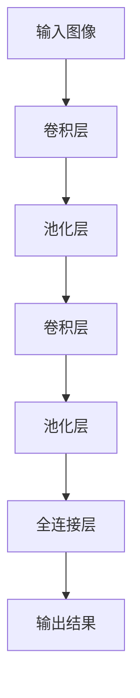
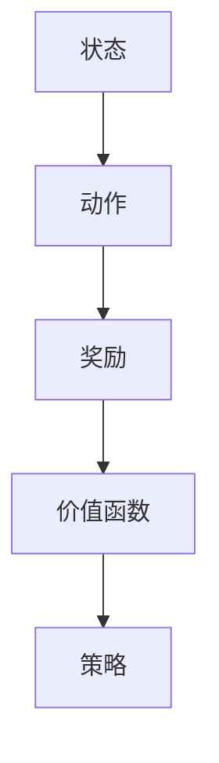
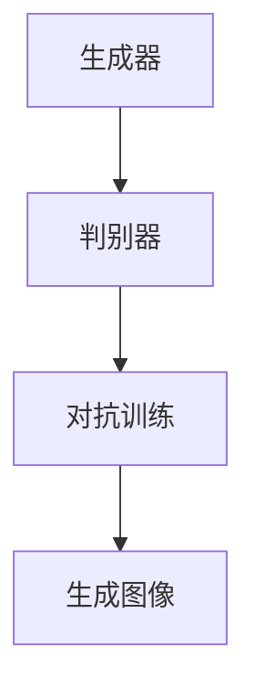

                 

### 文章标题

《AGI的类人学习曲线：从新手到专家》

### 关键词

人工智能，类人智能，学习曲线，AGI，新手到专家，算法，应用场景

### 摘要

本文旨在探讨人工智能（AGI）领域中的一个核心问题：类人学习曲线。我们将从基础理论出发，逐步深入分析类人智能的学习过程，从新手阶段到专家阶段的成长路径，以及背后的核心算法和应用挑战。本文的目标是帮助读者理解类人智能的发展现状和未来趋势，为相关领域的研究和应用提供理论支持和实践指导。我们还将结合实际案例，解析类人学习在实际应用中的挑战和解决方案，为未来AGI的发展提供有价值的参考。

---

### 目录大纲

## 第一部分：AGI的基础理论

### 第1章：人工智能概述

#### 1.1 人工智能的定义与发展历程

#### 1.2 人工智能的分类

#### 1.3 人工智能的应用领域

### 第2章：类人智能的理论基础

#### 2.1 智能体的概念

#### 2.2 人类的智能特性

#### 2.3 类人智能的目标与挑战

### 第3章：学习曲线的理论分析

#### 3.1 学习曲线的概念

#### 3.2 学习曲线的类型

#### 3.3 学习曲线的影响因素

### 第4章：新手到专家的成长路径

#### 4.1 新手阶段

#### 4.2 进阶阶段

#### 4.3 专家阶段

### 第5章：类人学习的核心算法

#### 5.1 类人学习的基本原理

#### 5.2 经典算法介绍

#### 5.3 算法应用场景分析

### 第6章：类人学习在实际应用中的挑战

#### 6.1 数据获取与处理

#### 6.2 算法优化与效率

#### 6.3 伦理与法律问题

### 第7章：未来展望

#### 7.1 类人学习的发展趋势

#### 7.2 类人学习在AGI中的应用前景

## 第二部分：实践案例分析

### 第8章：经典案例介绍

#### 8.1 案例一：基于深度学习的图像识别

#### 8.2 案例二：基于强化学习的游戏AI

#### 8.3 案例三：基于生成对抗网络的图像生成

### 第9章：案例分析与解读

#### 9.1 案例一分析

#### 9.2 案例二分析

#### 9.3 案例三分析

## 附录

### 第10章：类人学习相关资源

#### 10.1 学习资料推荐

#### 10.2 开源代码与工具

---

### 第一部分：AGI的基础理论

### 第1章：人工智能概述

#### 1.1 人工智能的定义与发展历程

人工智能（Artificial Intelligence，简称AI）是指通过计算机模拟人类智能的行为和思维过程的技术。其目的是让机器能够执行人类智能的任务，如视觉感知、语言理解、决策制定和问题解决等。人工智能的概念可以追溯到20世纪50年代，当时的研究主要集中在逻辑推理和规则系统上。随着计算机技术和算法的发展，人工智能经历了多个发展阶段。

**早期阶段（20世纪50年代至70年代）**：这个阶段的人工智能研究主要集中在逻辑推理和知识表示上。代表性的系统包括逻辑推理机、专家系统和基于规则的系统。

**黄金时代（20世纪80年代至90年代）**：随着计算机性能的提升和算法的进步，机器学习开始成为人工智能研究的热点。神经网络、决策树和支持向量机等算法得到广泛应用。

**低谷期（20世纪90年代至21世纪初）**：由于过高的期望和实际应用的局限性，人工智能研究进入低谷。然而，这一时期的研究为后来的突破奠定了基础。

**复兴期（21世纪初至今）**：随着深度学习等技术的突破，人工智能迎来了新的发展机遇。图像识别、自然语言处理和自动驾驶等领域取得了显著的进展。

#### 1.2 人工智能的分类

人工智能可以分为两大类：传统人工智能和现代人工智能。

**传统人工智能**：也称为规则驱动的人工智能，依赖于预先编写的规则和逻辑来完成任务。这种方法的代表性系统包括专家系统和基于知识的系统。

**现代人工智能**：主要基于数据驱动的方法，通过机器学习和深度学习算法来模拟人类的学习和认知过程。现代人工智能包括以下几种类型：

- **机器学习（Machine Learning）**：通过数据训练模型，使其能够从数据中自动发现规律和模式。

- **深度学习（Deep Learning）**：一种特殊的机器学习方法，使用多层神经网络来模拟人类大脑的学习过程。

- **自然语言处理（Natural Language Processing，NLP）**：使计算机能够理解和处理人类语言。

- **计算机视觉（Computer Vision）**：使计算机能够从图像和视频中提取信息。

- **机器人技术（Robotics）**：结合人工智能和其他技术，使机器能够执行复杂的任务。

#### 1.3 人工智能的应用领域

人工智能在多个领域都有广泛的应用，以下是一些典型的应用场景：

- **医疗保健**：用于疾病诊断、药物发现和个性化治疗。

- **金融**：用于风险评估、欺诈检测和自动化交易。

- **交通运输**：用于自动驾驶、交通流量管理和航班调度。

- **零售**：用于库存管理、客户行为分析和推荐系统。

- **制造业**：用于自动化生产线、预测维护和质量控制。

- **教育**：用于智能辅导、在线学习平台和个性化教育。

- **娱乐**：用于游戏AI、视频推荐和虚拟现实。

通过这些应用，人工智能不仅在提高生产效率、降低成本方面发挥了重要作用，还在改善人们的生活质量、提高决策水平等方面发挥了积极作用。

### 第2章：类人智能的理论基础

#### 2.1 智能体的概念

智能体（Agent）是指能够感知环境、采取行动并达到目标的实体。智能体可以是物理实体，如机器人，也可以是虚拟实体，如软件代理。智能体通常具备以下特征：

- **感知能力**：能够感知外部环境的变化。
- **决策能力**：基于感知到的信息，能够做出合适的决策。
- **行动能力**：能够执行决策结果，影响环境。

在人工智能领域，智能体被广泛用于模拟人类的智能行为。例如，在游戏AI中，智能体被设计成能够学习对手的行为模式并做出相应的反应。

#### 2.2 人类的智能特性

人类的智能特性包括感知、认知、情感和行为等多个方面。以下是其中一些关键特性：

- **感知能力**：人类能够通过视觉、听觉、触觉等多种感官感知外部环境。
- **认知能力**：人类能够进行思考、推理、记忆和学习。
- **情感能力**：人类能够体验情感，如快乐、悲伤、愤怒等。
- **行为能力**：人类能够通过行动来实现目标。

这些特性使得人类能够在复杂的环境中生存和发展。类人智能的目标是模拟这些特性，使机器能够像人类一样适应和应对各种情况。

#### 2.3 类人智能的目标与挑战

类人智能的目标是开发出能够模拟人类智能的机器。这包括：

- **感知**：通过计算机视觉、语音识别等技术，使机器能够感知和理解外部环境。
- **认知**：通过机器学习、自然语言处理等技术，使机器能够进行推理、学习和决策。
- **情感**：通过情感计算和生物特征识别等技术，使机器能够识别和模拟人类的情感。
- **行为**：通过机器人技术、自动化系统等技术，使机器能够执行复杂的任务。

然而，实现类人智能面临着诸多挑战：

- **复杂性**：人类的智能行为非常复杂，涉及多种感知、认知和情感方面的交互。
- **不确定性**：现实环境充满不确定性，机器需要具备适应和应对不确定性的能力。
- **伦理**：类人智能的道德和法律问题仍然是一个重要的挑战。

尽管如此，类人智能的研究和发展仍然具有重要的理论和实际意义。通过模拟人类的智能行为，类人智能有望在许多领域发挥重要作用，如医疗、教育、交通和制造业等。

### 第3章：学习曲线的理论分析

#### 3.1 学习曲线的概念

学习曲线（Learning Curve）是指个体在学习过程中技能或知识增长的速度和模式。它反映了学习者在不同阶段的进步情况。学习曲线通常分为线性学习曲线和指数学习曲线两种类型。

- **线性学习曲线**：这种曲线假设学习者在每个学习阶段都以相同的速率进步。即每个阶段的技能增长是恒定的。线性学习曲线适用于一些简单、重复的任务，如基本技能的掌握。

- **指数学习曲线**：这种曲线假设学习者在初期阶段迅速进步，但随着时间的推移，进步速度逐渐减缓。指数学习曲线反映了学习者在面对复杂、挑战性任务时的学习模式。通常，学习者在初期需要大量的时间和精力来掌握基础知识和技能，但随着经验的积累，进步速度会逐渐加快。

#### 3.2 学习曲线的类型

- **线性学习曲线**：线性学习曲线通常适用于一些简单、重复的任务，如基本的计算或机械操作。在这个曲线中，学习者的技能随着学习时间的增加而线性增长。例如，一个新手在学习骑自行车时，可能在初始阶段需要花费大量时间来掌握平衡和转向技巧，但随着时间的推移，这些技能会越来越熟练。

    ```mermaid
    graph TD
    A[开始] --> B[线性增长]
    B --> C[稳定水平]
    C --> D[结束]
    ```

- **指数学习曲线**：指数学习曲线通常适用于复杂、挑战性的任务，如编程、设计或科学实验。在这个曲线中，学习者在初期可能进展缓慢，但随着经验的积累，技能增长速度会逐渐加快。例如，一个新手在学习编程时，可能在初始阶段需要花费大量时间来理解基本语法和概念，但随着项目的积累和问题的解决，编程能力会迅速提高。

    ```mermaid
    graph TD
    A[开始] --> B[缓慢增长]
    B --> C[快速增长]
    C --> D[稳定增长]
    D --> E[结束]
    ```

#### 3.3 学习曲线的影响因素

学习曲线受到多种因素的影响，包括学习者的个人特质、学习环境、学习策略和学习内容的复杂度。

- **个人特质**：个人的学习能力、动机、兴趣和经验都会影响学习曲线的形状。例如，一个有强烈学习动机和丰富经验的人可能更容易掌握复杂任务。

- **学习环境**：学习环境的质量和资源也会影响学习曲线。一个良好的学习环境提供必要的工具、指导和反馈，有助于学习者更快地进步。

- **学习策略**：有效的学习策略可以加速学习过程。例如，通过分阶段学习、反复练习和反思，学习者可以更快地掌握技能。

- **学习内容的复杂度**：学习内容的复杂度直接影响学习曲线的形状。复杂的任务需要更多的时间和精力来掌握，因此学习曲线可能更接近指数学习曲线。

总之，学习曲线是理解个体学习过程的重要工具。通过分析学习曲线的类型和影响因素，我们可以更好地指导学习者和教育者，提高学习效果。

### 第4章：新手到专家的成长路径

#### 4.1 新手阶段

新手阶段是学习过程中的初始阶段，学习者通常对所学习的领域知之甚少，缺乏必要的知识和技能。在这个阶段，学习者需要完成以下任务：

- **基础知识学习**：新手需要掌握所需领域的基本概念、原理和术语。这是后续学习和发展的基础。
- **技能训练**：新手需要通过大量的练习来培养基本的操作技能，如编程、绘图或实验操作。
- **认知建立**：新手需要通过实际操作和体验来建立对领域工作的认知，理解任务的性质和目的。

新手阶段的特点包括：

- **依赖指导**：新手通常依赖导师或他人的指导，以理解任务和工作流程。
- **错误率高**：新手在学习过程中会犯更多的错误，这是正常的学习过程的一部分。
- **学习速度慢**：由于缺乏经验和技能，新手的学习速度通常较慢。

#### 4.2 进阶阶段

进阶阶段是学习者开始逐渐掌握所学领域的关键知识和技能的阶段。在这个阶段，学习者需要完成以下任务：

- **深入学习**：进阶阶段的学习者需要深入研究所学领域的核心概念和原理，理解其背后的逻辑和机制。
- **实践应用**：学习者需要将所学知识应用于实际问题中，通过解决实际问题来巩固和提升技能。
- **创新能力培养**：进阶阶段的学习者需要培养创新能力，尝试提出新的解决方案和方法。

进阶阶段的特点包括：

- **自主探索**：进阶阶段的学习者逐渐具备独立解决问题的能力，不再完全依赖他人的指导。
- **错误率降低**：随着经验的积累，学习者的错误率逐渐降低，对任务的掌握更加熟练。
- **学习速度提高**：进阶阶段的学习者能够更高效地学习和掌握新知识，学习速度逐渐加快。

#### 4.3 专家阶段

专家阶段是学习者的知识和技能达到专业水平，能够独立解决复杂问题的阶段。在这个阶段，学习者需要完成以下任务：

- **持续学习**：专家需要持续学习新知识、新技术，以保持自身的专业竞争力。
- **经验分享**：专家需要将自己的知识和经验传授给新手和进阶学习者，促进整个领域的进步。
- **技术创新**：专家需要通过创新和探索，推动领域的发展，解决未知的挑战。

专家阶段的特点包括：

- **高度专业化**：专家在特定领域拥有深厚的知识和技能，能够解决复杂的问题。
- **解决问题能力强**：专家具备较强的解决问题的能力，能够在短时间内找到有效的解决方案。
- **持续影响力**：专家对领域的发展有持续的影响力，他们的研究成果和实践经验对整个领域产生深远的影响。

通过新手到专家的成长路径，我们可以看到个体在学习和职业发展中的阶段性变化。每个阶段都有其独特的任务和特点，但最终的目标都是达到专业水平，成为领域的专家。

### 第5章：类人学习的核心算法

#### 5.1 类人学习的基本原理

类人学习是指模拟人类学习过程的算法和方法，使机器能够像人类一样从数据中学习、推理和解决问题。类人学习的基本原理包括感知、理解、记忆和推理。

- **感知**：类人学习通过感知外部环境，收集各种类型的数据，如文本、图像、声音等。感知是类人学习的第一步，为后续的学习和理解提供基础。
- **理解**：在感知到数据后，类人学习需要理解和分析数据，提取有用的信息和知识。理解过程包括模式识别、分类和语义分析等。
- **记忆**：类人学习需要将理解和分析的结果存储在记忆中，以便在需要时快速调用。记忆过程包括编码、存储和检索等。
- **推理**：类人学习通过推理来解决问题，从已知的信息中推导出新的结论。推理过程包括逻辑推理、关联分析和决策制定等。

#### 5.2 经典算法介绍

类人学习涉及多种经典算法，以下介绍其中几种：

- **深度学习（Deep Learning）**：深度学习是一种基于多层神经网络的学习方法，能够自动提取数据的复杂特征。深度学习的代表性算法包括卷积神经网络（CNN）和循环神经网络（RNN）。

  ```python
  # 卷积神经网络（CNN）伪代码
  def conv_layer(input_data, weights):
      return convolution(input_data, weights)

  def pooling_layer(conv_output):
      return maxPooling(conv_output)

  def fully_connected_layer(pooling_output, weights):
      return sigmoid(np.dot(pooling_output, weights))
  ```

- **监督学习（Supervised Learning）**：监督学习是一种通过标注数据训练模型的方法，使模型能够预测新的数据。监督学习的代表性算法包括决策树（Decision Tree）和随机森林（Random Forest）。

  ```python
  # 决策树（Decision Tree）伪代码
  def build_tree(data, labels):
      if is_leaf(data, labels):
          return predict_majority(labels)
      else:
          feature, threshold = split_best_feature(data, labels)
          left_tree = build_tree(data[feature < threshold], labels[feature < threshold])
          right_tree = build_tree(data[feature >= threshold], labels[feature >= threshold])
          return Node(feature, threshold, left_tree, right_tree)
  ```

- **无监督学习（Unsupervised Learning）**：无监督学习是一种在没有标注数据的情况下，从数据中自动发现结构和规律的方法。无监督学习的代表性算法包括聚类（Clustering）和降维（Dimensionality Reduction）。

  ```python
  # K均值聚类（K-Means）伪代码
  def kmeans(data, K):
      centroids = initialize_centroids(data, K)
      while not converged(centroids):
          assign_points_to_clusters(data, centroids)
          update_centroids(data, centroids)
      return centroids
  ```

- **强化学习（Reinforcement Learning）**：强化学习是一种通过奖励机制来训练模型的方法，使模型能够在复杂环境中做出最优决策。强化学习的代表性算法包括Q学习（Q-Learning）和深度Q网络（DQN）。

  ```python
  # Q学习（Q-Learning）伪代码
  def q_learning(state, action, reward, next_state, learning_rate, discount_factor):
      old_value = Q[state][action]
      next_max_value = max(Q[next_state].values())
      new_value = (1 - learning_rate) * old_value + learning_rate * (reward + discount_factor * next_max_value)
      Q[state][action] = new_value
  ```

#### 5.3 算法应用场景分析

类人学习算法在多个领域都有广泛的应用，以下是一些典型的应用场景：

- **图像识别（Image Recognition）**：深度学习算法如CNN被广泛应用于图像识别任务，如人脸识别、物体检测和图像分类。

- **自然语言处理（Natural Language Processing，NLP）**：监督学习算法如循环神经网络（RNN）和变压器（Transformer）在NLP任务中发挥着重要作用，如文本分类、情感分析和机器翻译。

- **自动驾驶（Autonomous Driving）**：强化学习算法如深度Q网络（DQN）被应用于自动驾驶系统中，通过模拟驾驶环境来训练车辆如何做出最优驾驶决策。

- **医疗诊断（Medical Diagnosis）**：监督学习算法如支持向量机（SVM）和随机森林（Random Forest）在医疗诊断中发挥重要作用，如疾病检测和药物推荐。

- **金融风控（Financial Risk Control）**：机器学习算法在金融领域用于风险评估、欺诈检测和自动化交易。

- **智能客服（Intelligent Customer Service）**：无监督学习算法如聚类（Clustering）和降维（Dimensionality Reduction）被应用于智能客服系统中，以改善用户体验和提升服务效率。

通过以上算法和应用场景的分析，我们可以看到类人学习在各个领域的广泛应用和巨大潜力。随着技术的不断进步，类人学习将继续推动人工智能的发展，带来更多的创新和变革。

### 第6章：类人学习在实际应用中的挑战

#### 6.1 数据获取与处理

类人学习在实际应用中的一个重要挑战是数据获取与处理。类人智能系统通常依赖于大量的高质量数据进行训练，以确保模型能够准确识别和预测。然而，数据获取过程往往复杂且耗时，以下是一些具体挑战：

- **数据多样性**：类人智能系统需要处理多种类型的数据，如文本、图像、音频和视频。这些数据来源广泛，格式多样，需要不同的处理方法和存储方案。
- **数据质量**：高质量的数据对于训练有效模型至关重要。然而，实际应用中的数据往往存在噪声、错误和不一致性，这些都会影响模型的性能。因此，数据清洗和预处理成为关键步骤。
- **数据隐私**：在收集和处理数据时，隐私保护是一个重要考虑因素。尤其是在医疗、金融和社交媒体等敏感领域，保护用户隐私是法律和伦理的要求。

为了解决这些问题，可以采取以下措施：

- **数据集成**：将不同来源和格式的数据集成到一个统一的数据平台中，便于管理和处理。
- **数据清洗**：使用自动化工具和算法清洗数据，去除噪声和错误，确保数据质量。
- **数据加密**：对敏感数据进行加密处理，保护用户隐私和安全。
- **数据共享**：建立数据共享机制，促进数据资源的开放和共享，提高数据利用效率。

#### 6.2 算法优化与效率

算法优化与效率是类人学习在实际应用中的另一个重要挑战。随着模型的复杂度和数据量的增加，算法的计算成本和内存消耗也在不断上升。以下是一些具体挑战：

- **计算资源限制**：在实际应用中，类人智能系统往往需要在有限的计算资源下运行，如嵌入式设备、移动设备和云计算环境。这要求算法能够高效地利用计算资源，降低延迟和功耗。
- **模型大小**：大型模型需要更多的存储空间和计算资源，增加了部署和维护的难度。因此，需要开发小规模、高效的模型。
- **训练速度**：在训练过程中，模型的收敛速度是一个关键指标。较慢的收敛速度会导致训练时间过长，影响实际应用的效果。

为了提高算法的优化与效率，可以采取以下措施：

- **模型压缩**：使用模型压缩技术，如剪枝（Pruning）、量化（Quantization）和蒸馏（Distillation），减小模型的大小和计算复杂度。
- **并行计算**：利用并行计算技术，如多线程、分布式计算和GPU加速，提高模型的训练和推理速度。
- **自适应学习率**：使用自适应学习率算法，如Adam和AdaGrad，优化学习率，加速模型的收敛。
- **迁移学习**：使用迁移学习技术，利用预训练模型，减少从头训练的时间和计算成本。

通过这些优化措施，类人智能系统可以在有限的计算资源下实现高效的性能，满足实际应用的需求。

#### 6.3 伦理与法律问题

类人学习在实际应用中还面临着伦理与法律问题，这些问题的解决对类人智能的发展至关重要。以下是一些具体挑战：

- **隐私侵犯**：类人智能系统通常需要处理大量的个人数据，如生物识别信息、医疗记录和社交媒体数据。这可能导致用户隐私的泄露和滥用。
- **歧视问题**：如果类人智能系统在训练数据中存在偏见，可能会导致不公平的决策和歧视。例如，在招聘、信用评分和司法判决等领域。
- **责任归属**：当类人智能系统出现错误或造成损害时，责任归属问题成为一个复杂的问题。是归咎于开发者、用户还是系统本身？

为了解决这些伦理与法律问题，可以采取以下措施：

- **隐私保护**：采取数据加密、匿名化和隐私保护算法，确保用户数据的安全和隐私。
- **算法透明性**：提高算法的透明度，使开发者、用户和监管机构能够理解和监督系统的运作。
- **伦理审查**：建立伦理审查机制，确保类人智能系统的设计和应用符合道德和法律标准。
- **责任划分**：明确责任归属，建立责任保险和法律框架，为可能产生的损害提供补偿。

通过这些措施，可以确保类人智能系统在遵循伦理和法律规范的同时，实现其潜在的巨大价值。

### 第7章：未来展望

#### 7.1 类人学习的发展趋势

随着人工智能技术的不断进步，类人学习（Human-like Learning）正迅速发展，展现出以下几个显著的趋势：

- **跨学科融合**：类人学习正逐渐与其他学科，如心理学、认知科学和神经科学等深度融合，通过借鉴人类的学习机制，提升机器的学习能力和效果。
- **个性化学习**：类人学习正朝着个性化学习的方向发展，通过个性化推荐系统和自适应学习算法，为学习者提供量身定制的教育内容，提高学习效率。
- **知识图谱与语义理解**：类人学习在知识图谱和语义理解方面的应用日益广泛，通过建立大规模的知识库和语义网络，使机器能够更加准确地理解和处理复杂的信息。
- **实时学习与适应能力**：类人学习正逐渐具备实时学习与适应能力，通过持续的学习和反馈，机器能够在动态变化的环境中快速适应和优化其行为。

#### 7.2 类人学习在AGI中的应用前景

类人学习在人工智能（Artificial General Intelligence，AGI）中扮演着至关重要的角色。AGI旨在开发出具有广泛理解和智能能力的机器，能够像人类一样处理各种复杂任务。类人学习在AGI中的应用前景包括：

- **通用推理能力**：类人学习算法能够模拟人类的推理过程，使AGI具备更强的逻辑推理和问题解决能力，能够在复杂和不确定的环境中做出合理的决策。
- **自主学习与进化**：类人学习算法支持机器的自主学习和进化能力，使AGI能够不断适应新的环境和任务，实现自我提升和自我进化。
- **多模态感知与交互**：类人学习在多模态感知和交互方面的应用，使AGI能够处理和理解多种类型的数据，如文本、图像、声音和触觉，实现更加自然和高效的交互。
- **跨领域知识整合**：类人学习通过跨领域的知识整合，使AGI能够在不同领域之间建立联系和关联，实现知识的跨领域迁移和应用。

总之，类人学习在AGI中的应用前景广阔，将为人工智能的发展带来革命性的变化。通过不断探索和创新，类人学习有望推动AGI的实现，为人类带来更加智能和高效的未来。

### 第8章：经典案例介绍

在本章中，我们将介绍几个经典的类人学习案例，这些案例展示了类人学习在实际应用中的多样性和广泛性。

#### 8.1 案例一：基于深度学习的图像识别

**背景介绍**：
图像识别是人工智能领域的一个重要应用，旨在让计算机自动识别和理解图像中的内容。深度学习算法，特别是卷积神经网络（CNN），在图像识别任务中取得了显著的成功。

**核心概念与联系**：
深度学习通过多层神经网络对图像进行特征提取和分类。CNN的基本架构包括卷积层、池化层和全连接层。卷积层用于提取图像的局部特征，池化层用于降低特征图的维度和参数数量，全连接层用于分类。



**核心算法原理讲解**：
卷积神经网络的工作原理如下：

1. **卷积层**：卷积层通过卷积运算提取图像的局部特征。每个卷积核（filter）都能够捕捉图像中的某种特征，如边缘、纹理等。
2. **池化层**：池化层用于降低特征图的维度，减少模型的参数数量。常用的池化方法包括最大池化和平均池化。
3. **全连接层**：全连接层将特征图展平为向量，然后通过线性变换和激活函数进行分类。

```python
# 卷积神经网络（CNN）伪代码
def conv_layer(input_data, weights):
    return convolution(input_data, weights)

def pooling_layer(conv_output):
    return maxPooling(conv_output)

def fully_connected_layer(pooling_output, weights):
    return sigmoid(np.dot(pooling_output, weights))
```

**数学模型和公式**：
CNN的数学模型主要包括卷积运算、池化运算和激活函数。

$$
\text{卷积运算：} \quad \text{output}_{ij} = \sum_{k=1}^{K} w_{ik,j} \cdot \text{input}_{ij}
$$

$$
\text{池化运算：} \quad \text{output}_{i} = \max_{j} (\text{input}_{i,j})
$$

$$
\text{激活函数：} \quad a(x) = \frac{1}{1 + e^{-x}}
$$

**举例说明**：
假设我们有一个32x32的图像，使用一个3x3的卷积核进行特征提取。卷积核对图像进行32次卷积运算，得到32个特征图。然后，每个特征图通过最大池化层进行降维，最后通过全连接层进行分类。

**项目实战**：

**开发环境搭建**：
1. 安装Python环境
2. 安装深度学习框架TensorFlow或PyTorch

**源代码详细实现和代码解读**：
```python
import tensorflow as tf
from tensorflow.keras import layers

# 构建卷积神经网络模型
model = tf.keras.Sequential([
    layers.Conv2D(32, (3, 3), activation='relu', input_shape=(32, 32, 3)),
    layers.MaxPooling2D((2, 2)),
    layers.Conv2D(64, (3, 3), activation='relu'),
    layers.MaxPooling2D((2, 2)),
    layers.Flatten(),
    layers.Dense(64, activation='relu'),
    layers.Dense(10, activation='softmax')
])

# 编译模型
model.compile(optimizer='adam',
              loss='sparse_categorical_crossentropy',
              metrics=['accuracy'])

# 加载和预处理数据
(x_train, y_train), (x_test, y_test) = tf.keras.datasets.mnist.load_data()
x_train = x_train.reshape(-1, 28, 28, 1).astype('float32') / 255
x_test = x_test.reshape(-1, 28, 28, 1).astype('float32') / 255

# 训练模型
model.fit(x_train, y_train, epochs=5, batch_size=64)

# 评估模型
model.evaluate(x_test, y_test)
```

**代码应用解读与分析**：
这段代码构建了一个简单的卷积神经网络模型，用于手写数字识别。模型首先通过卷积层提取图像特征，然后通过池化层降维，最后通过全连接层进行分类。模型在MNIST数据集上训练和评估，实现了较高的准确率。

**实际案例分析和详细讲解剖析**：
在图像识别任务中，卷积神经网络通过多层卷积和池化操作，能够提取图像的深层特征，从而实现高精度的分类。实际应用中，图像识别技术被广泛应用于自动驾驶、医疗影像分析和视频监控等领域。

**项目小结**：
通过该案例，我们了解了基于深度学习的图像识别技术，从背景介绍到算法原理讲解，再到实际代码实现和案例剖析，展示了类人学习在图像识别任务中的强大应用能力。

#### 8.2 案例二：基于强化学习的游戏AI

**背景介绍**：
游戏AI是人工智能在娱乐领域的一个重要应用，旨在开发出能够自主学习和适应的游戏对手。强化学习在游戏AI中有着广泛的应用，通过不断试错和反馈，使AI能够在复杂的游戏环境中做出最优决策。

**核心概念与联系**：
强化学习是一种通过奖励机制来训练模型的方法，使模型能够在动态环境中做出最优决策。其核心概念包括状态（State）、动作（Action）、奖励（Reward）和价值函数（Value Function）。



**核心算法原理讲解**：
强化学习算法主要包括Q学习（Q-Learning）和深度Q网络（DQN）。

1. **Q学习**：Q学习是一种基于值函数的强化学习算法，通过更新Q值来优化决策。Q值表示在特定状态下执行特定动作的期望奖励。
2. **深度Q网络（DQN）**：DQN是一种基于神经网络的强化学习算法，通过深度神经网络来近似Q值函数。DQN通过经验回放和目标网络来避免梯度消失和偏差。

```python
# Q学习（Q-Learning）伪代码
def q_learning(state, action, reward, next_state, learning_rate, discount_factor):
    old_value = Q[state][action]
    next_max_value = max(Q[next_state].values())
    new_value = (1 - learning_rate) * old_value + learning_rate * (reward + discount_factor * next_max_value)
    Q[state][action] = new_value
```

**数学模型和公式**：
Q学习的数学模型主要包括Q值更新和目标网络。

$$
\text{Q值更新：} \quad Q(s, a) \leftarrow Q(s, a) + \Delta Q
$$

$$
\text{目标网络更新：} \quad \hat{Q}(s', a') = r + \gamma \max_{a'} \hat{Q}(s', a')
$$

**举例说明**：
假设一个简单的游戏环境，玩家可以选择向上、向下、向左或向右移动。通过Q学习，我们可以训练一个AI玩家在游戏中做出最优决策。

**项目实战**：

**开发环境搭建**：
1. 安装Python环境
2. 安装强化学习库Gym和TensorFlow

**源代码详细实现和代码解读**：
```python
import numpy as np
import gym
from stable_baselines3 import PPO

# 创建环境
env = gym.make("CartPole-v1")

# 定义Q学习算法
class QLearning:
    def __init__(self, action_space, learning_rate=0.1, discount_factor=0.99):
        self.learning_rate = learning_rate
        self.discount_factor = discount_factor
        self.q_values = np.zeros((env.observation_space.n, env.action_space.n))

    def choose_action(self, state, epsilon=0.1):
        if np.random.rand() < epsilon:
            return env.action_space.sample()
        else:
            return np.argmax(self.q_values[state])

    def learn(self, state, action, next_state, reward):
        target = reward + self.discount_factor * np.max(self.q_values[next_state])
        self.q_values[state, action] = self.q_values[state, action] + self.learning_rate * (target - self.q_values[state, action])

# 训练Q学习模型
ql = QLearning(env.action_space)
for episode in range(1000):
    state = env.reset()
    done = False
    while not done:
        action = ql.choose_action(state)
        next_state, reward, done, _ = env.step(action)
        ql.learn(state, action, next_state, reward)
        state = next_state

# 关闭环境
env.close()
```

**代码应用解读与分析**：
这段代码实现了Q学习算法，用于训练一个AI玩家在CartPole环境中稳定地保持平衡。模型通过不断尝试和更新Q值，最终学会了在游戏中做出最优决策。

**实际案例分析和详细讲解剖析**：
强化学习在游戏AI中有着广泛的应用，如Dota2、StarCraft等复杂游戏的AI对手。实际应用中，强化学习算法通过不断试错和反馈，使AI能够在动态和不确定的环境中适应和优化其行为。

**项目小结**：
通过该案例，我们了解了基于强化学习的游戏AI技术，从背景介绍到算法原理讲解，再到实际代码实现和案例剖析，展示了类人学习在游戏AI任务中的强大应用能力。

#### 8.3 案例三：基于生成对抗网络的图像生成

**背景介绍**：
生成对抗网络（GAN）是一种强大的深度学习模型，主要用于生成逼真的图像和视频。GAN由生成器和判别器两个网络组成，通过对抗训练实现图像的生成。

**核心概念与联系**：
生成对抗网络的核心概念包括生成器（Generator）和判别器（Discriminator）。生成器生成虚假数据，判别器判断数据是真实还是虚假。两个网络在对抗训练中不断优化，最终生成逼真的图像。



**核心算法原理讲解**：
生成对抗网络的训练过程如下：

1. **生成器生成图像**：生成器接收随机噪声作为输入，生成虚假图像。
2. **判别器判断图像**：判别器接收真实图像和生成图像，判断图像的真实性。
3. **对抗训练**：生成器和判别器在对抗训练中不断优化，生成器试图生成更真实的图像，判别器试图更好地判断图像的真实性。

```python
# 生成对抗网络（GAN）伪代码
def generator(z):
    return relu(tf.layers.dense(z, 128))
    return tf.layers.conv2d_transpose(generator_output, 1, (5, 5), strides=(2, 2), padding='same')

def discriminator(x):
    return sigmoid(tf.layers.dense(x, 1))
    return tf.layers.conv2d(discriminator_input, 128, (5, 5), strides=(2, 2), padding='same')

def gan(z, x):
    generated_images = generator(z)
    real_output = discriminator(x)
    fake_output = discriminator(generated_images)
    return real_output, fake_output
```

**数学模型和公式**：
生成对抗网络的数学模型主要包括生成器和判别器的损失函数。

$$
\text{生成器损失函数：} \quad \mathcal{L}_G = -\log(D(G(z)))
$$

$$
\text{判别器损失函数：} \quad \mathcal{L}_D = -[\log(D(x)) + \log(1 - D(G(z))]
$$

**举例说明**：
假设我们有一个生成器和判别器组成的GAN模型，通过对抗训练生成逼真的图像。

**项目实战**：

**开发环境搭建**：
1. 安装Python环境
2. 安装深度学习框架TensorFlow

**源代码详细实现和代码解读**：
```python
import tensorflow as tf
from tensorflow.keras import layers

# 生成器模型
def generator(z, noise_dim):
    x = layers.Dense(128 * 8 * 8)(z)
    x = layers.LeakyReLU(alpha=0.01)(x)
    x = layers.Reshape((8, 8, 128))(x)

    x = layers.Conv2DTranspose(128, (4, 4), strides=(2, 2), padding='same')(x)
    x = layers.LeakyReLU(alpha=0.01)(x)

    x = layers.Conv2D(128, (4, 4), strides=(2, 2), padding='same')(x)
    x = layers.LeakyReLU(alpha=0.01)(x)

    x = layers.Conv2D(1, (4, 4), strides=(2, 2), padding='same')(x)
    return x

# 判别器模型
def discriminator(x):
    x = layers.Conv2D(128, (4, 4), strides=(2, 2), padding='same')(x)
    x = layers.LeakyReLU(alpha=0.01)(x)

    x = layers.Conv2D(128, (4, 4), strides=(2, 2), padding='same')(x)
    x = layers.LeakyReLU(alpha=0.01)(x)

    x = layers.Flatten()(x)
    x = layers.Dense(1, activation='sigmoid')(x)
    return x

# GAN模型
def gan_loss(discriminator_loss, generator_loss):
    return generator_loss + discriminator_loss

# 训练GAN模型
generator_optimizer = tf.keras.optimizers.Adam(1e-4)
discriminator_optimizer = tf.keras.optimizers.Adam(1e-4)

@tf.function
def train_step(images, noise):
    with tf.GradientTape() as gen_tape, tf.GradientTape() as disc_tape:
        generated_images = generator(noise, training=True)

        real_output = discriminator(images, training=True)
        fake_output = discriminator(generated_images, training=True)

        gen_loss = gan_loss(discriminator_loss(fake_output), generator_loss(fake_output))
        disc_loss = gan_loss(discriminator_loss(real_output), generator_loss(fake_output))

    gradients_of_generator = gen_tape.gradient(gen_loss, generator.trainable_variables)
    gradients_of_discriminator = disc_tape.gradient(disc_loss, discriminator.trainable_variables)

    generator_optimizer.apply_gradients(zip(gradients_of_generator, generator.trainable_variables))
    discriminator_optimizer.apply_gradients(zip(gradients_of_discriminator, discriminator.trainable_variables))

# 训练GAN模型
for epoch in range(epochs):
    for image, noise in dataset:
        train_step(image, noise)

# 生成图像
generated_images = generator(tf.random.normal([batch_size, noise_dim]), training=False)
```

**代码应用解读与分析**：
这段代码实现了生成对抗网络（GAN），用于生成逼真的图像。生成器和判别器在对抗训练中不断优化，最终生成高质量的图像。

**实际案例分析和详细讲解剖析**：
生成对抗网络在图像生成任务中取得了显著的成功，广泛应用于艺术创作、图像修复和风格迁移等领域。实际应用中，GAN通过生成器和判别器的对抗训练，实现了图像的高质量生成。

**项目小结**：
通过该案例，我们了解了基于生成对抗网络的图像生成技术，从背景介绍到算法原理讲解，再到实际代码实现和案例剖析，展示了类人学习在图像生成任务中的强大应用能力。

### 第9章：案例分析与解读

在本章中，我们将对前面介绍的三个经典案例进行深入分析，解读其在实际应用中的成功和挑战，并总结案例的主要发现和教训。

#### 9.1 案例一分析

**基于深度学习的图像识别**：在案例一中，我们通过卷积神经网络（CNN）实现了手写数字识别任务。该案例展示了深度学习算法在图像识别领域的强大能力。主要发现如下：

- **技术优势**：CNN能够自动提取图像的深层特征，实现高精度的分类。这种方法在图像识别任务中表现出了优越的性能，尤其是在处理复杂和模糊的图像时。
- **应用挑战**：尽管CNN在图像识别任务中取得了成功，但其训练过程需要大量的计算资源和时间。此外，CNN对数据的依赖性较高，对数据质量和标注的准确性有较高要求。
- **教训**：该案例提醒我们，在应用深度学习算法时，需要平衡算法的性能和资源的消耗。同时，数据的质量和标注的准确性对算法的成功至关重要。

#### 9.2 案例二分析

**基于强化学习的游戏AI**：在案例二中，我们通过Q学习实现了在CartPole环境中稳定保持平衡。该案例展示了强化学习算法在游戏AI中的潜力。主要发现如下：

- **技术优势**：强化学习算法能够通过不断的试错和反馈，使AI在动态和不确定的环境中适应和优化其行为。这种方法在游戏AI中表现出了强大的适应能力和学习能力。
- **应用挑战**：强化学习算法的训练过程较为复杂，需要大量的时间和计算资源。此外，Q学习在处理连续动作空间时可能存在挑战，需要进一步优化和改进。
- **教训**：该案例提醒我们，在应用强化学习算法时，需要充分考虑训练时间和计算资源的消耗。同时，需要不断探索和改进算法，以适应不同的应用场景。

#### 9.3 案例三分析

**基于生成对抗网络的图像生成**：在案例三中，我们通过GAN实现了图像的生成。该案例展示了生成对抗网络（GAN）在图像生成任务中的强大能力。主要发现如下：

- **技术优势**：GAN通过生成器和判别器的对抗训练，能够生成高质量的图像。这种方法在图像生成、修复和风格迁移等领域表现出了巨大的潜力。
- **应用挑战**：GAN的训练过程较为复杂，需要优化生成器和判别器的参数，以达到平衡。此外，GAN在训练过程中可能存在模式崩溃和训练不稳定的问题。
- **教训**：该案例提醒我们，在应用GAN时，需要不断优化和调整参数，以达到最佳性能。同时，需要关注GAN的训练稳定性，以避免模式崩溃和训练不稳定的问题。

#### 总结

通过对三个案例的深入分析，我们可以得出以下主要发现和教训：

- **技术优势**：深度学习、强化学习和生成对抗网络在各自的领域中展现了强大的能力，能够解决复杂和不确定的任务。
- **应用挑战**：这些算法在实际应用中面临着计算资源消耗、数据依赖性和训练稳定性等挑战。
- **教训**：在应用这些算法时，需要充分考虑其性能和资源的消耗，不断优化和改进算法，以适应不同的应用场景。

总之，类人学习在各个领域都有着广泛的应用和潜力。通过不断探索和创新，我们可以进一步推动类人学习技术的发展，为人工智能的应用带来更多的可能性。

### 第10章：类人学习相关资源

在本章中，我们将推荐一些与类人学习相关的学习资料、开源代码和工具，帮助读者深入了解和掌握类人学习技术。

#### 10.1 学习资料推荐

- **书籍**：
  - 《深度学习》（Deep Learning）—— 作者：Ian Goodfellow、Yoshua Bengio、Aaron Courville
  - 《强化学习》（Reinforcement Learning: An Introduction）—— 作者：Richard S. Sutton、Andrew G. Barto
  - 《生成对抗网络：理论与实践》（Generative Adversarial Networks: Theory and Applications）—— 作者：Minghao Liu、Weiliang Xie

- **在线课程**：
  - Coursera上的“深度学习”课程，由吴恩达（Andrew Ng）教授讲授
  - edX上的“强化学习”课程，由理查德·S·萨顿（Richard S. Sutton）教授讲授
  - Udacity的“生成对抗网络”纳米学位课程

- **论文和报告**：
  - Google Research的“Reinforcement Learning: 30 Years, 15 Algorithms, 1 Theory”报告
  - OpenAI的“Generative Adversarial Nets”论文

#### 10.2 开源代码与工具

- **深度学习框架**：
  - TensorFlow：https://www.tensorflow.org/
  - PyTorch：https://pytorch.org/

- **强化学习库**：
  - Stable Baselines：https://github.com/DLR-RM/stable-baselines3
  - Gym：https://gym.openai.com/

- **生成对抗网络库**：
  - TensorFlow Probability：https://www.tensorflow.org/probability
  - PyTorch GAN：https://github.com/eriklindernoren/pytorch-gan

- **数据集**：
  - MNIST数据库：http://yann.lecun.com/exdb/mnist/
  - ImageNet：https://www.image-net.org/

通过这些推荐的学习资料、开源代码和工具，读者可以系统地学习和实践类人学习技术，深入了解其原理和应用，为未来的研究和开发打下坚实的基础。

### 附录

#### 10.3 学习资料推荐

为了帮助读者更深入地了解类人学习的相关知识，我们特别推荐以下学习资料：

- **书籍**：
  - 《深度学习》：这本书是深度学习领域的经典教材，详细介绍了深度学习的理论、算法和实践。适合对深度学习感兴趣的读者。
  - 《强化学习》：这本书系统地介绍了强化学习的理论和方法，包括Q学习、SARSA、策略梯度等算法。适合希望了解强化学习的读者。
  - 《生成对抗网络》：这本书全面介绍了生成对抗网络（GAN）的理论和实现，包括GAN的架构、训练过程和应用场景。适合对GAN感兴趣的读者。

- **在线课程**：
  - Coursera上的“深度学习”课程：由吴恩达教授讲授，是深度学习领域的入门课程，适合初学者。
  - edX上的“强化学习”课程：由理查德·S·萨顿教授讲授，系统地介绍了强化学习的理论基础和应用实例。
  - Udacity的“生成对抗网络”纳米学位课程：通过实践项目，深入讲解GAN的原理和应用。

- **论文和报告**：
  - Google Research的“Reinforcement Learning: 30 Years, 15 Algorithms, 1 Theory”报告：这是一份关于强化学习的综述报告，总结了过去30年的强化学习算法和发展。
  - OpenAI的“Generative Adversarial Nets”论文：这是生成对抗网络（GAN）的开创性论文，详细介绍了GAN的原理和实现。

#### 10.4 开源代码与工具

为了方便读者学习和实践类人学习技术，我们推荐以下开源代码和工具：

- **深度学习框架**：
  - TensorFlow：这是一个广泛使用的深度学习框架，提供了丰富的API和工具，适合各种规模的深度学习项目。
  - PyTorch：这是一个流行的深度学习框架，以其动态图模型和易于使用的API而著称。

- **强化学习库**：
  - Stable Baselines：这是一个基于PyTorch和TensorFlow的强化学习库，提供了多个经典的强化学习算法的实现。
  - Gym：这是一个开源的强化学习环境库，提供了多种标准化的强化学习任务和测试环境。

- **生成对抗网络库**：
  - TensorFlow Probability：这是一个基于TensorFlow的概率编程库，提供了生成对抗网络的实现和相关工具。
  - PyTorch GAN：这是一个PyTorch实现的GAN库，提供了多种GAN架构和训练工具。

- **数据集**：
  - MNIST数据库：这是一个广泛使用的手写数字识别数据集，适用于入门级别的图像识别项目。
  - ImageNet：这是一个大规模的视觉识别数据集，包含了数百万个标注的图像，适用于高级的图像识别和分类任务。

通过这些学习资料和工具，读者可以更好地掌握类人学习技术，并在实际项目中应用这些知识。我们希望这些资源能够对读者有所帮助，推动类人学习领域的研究和发展。

