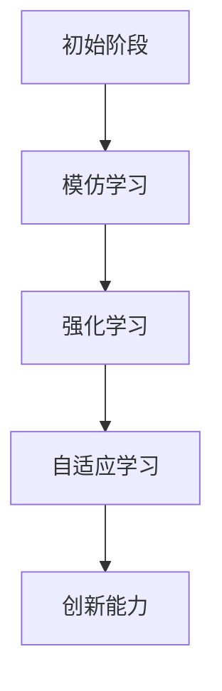

                 

### 设计核心概念与联系部分

为了更好地阐述AGI的类人学习能力，我们首先需要设计一个核心概念与联系部分。这一部分将帮助我们理解AGI类人学习能力的发展路径和关键组成部分，从而为后续的算法原理讲解、数学模型展示和项目实战提供基础。

#### 1. 设计Mermaid流程图

Mermaid是一种方便快捷的绘图工具，可以生成美观的图表和流程图。在这里，我们使用Mermaid来展示AGI类人学习能力的发展路径。

首先，我们需要一个流程图来描述AGI类人学习能力的发展过程。下面是一个简单的Mermaid流程图示例：



这个流程图清晰地展示了AGI类人学习能力从模仿学习到创新能力的逐步发展过程。每个阶段都有其独特的特点和应用场景，我们将逐一介绍这些概念及其之间的关系。

#### 2. 核心概念与联系

接下来，我们将详细介绍每个核心概念，并阐述它们之间的关系。

- **初始阶段**：这是AGI类人学习能力的起点，主要包括基础的感知和简单决策能力。在这个阶段，AGI系统主要通过被动地接收外部信息来逐步熟悉环境。
  
- **模仿学习**：模仿学习是AGI类人学习能力的核心组成部分之一。在这个阶段，AGI系统通过观察人类或其他智能体（如机器学习模型）的行为，学习并模仿这些行为。这种学习方式通常用于自动化任务的实现，如自动驾驶、人机交互等。

- **强化学习**：强化学习是一种通过奖励和惩罚来引导AGI系统行为的机器学习方法。在这个阶段，AGI系统会通过不断尝试和反馈来优化其行为策略，从而在复杂的动态环境中实现自我提升。

- **自适应学习**：自适应学习是AGI类人学习能力的一个重要发展阶段。在这个阶段，AGI系统不仅能够适应特定的环境和任务，还能根据环境变化和任务需求动态调整其行为策略，以实现更好的表现。

- **创新能力**：这是AGI类人学习能力的最终目标。在这个阶段，AGI系统不仅能够模仿和优化现有方法，还能自主探索和创造新的解决方案，从而在各个领域实现创新。

通过以上分析，我们可以看到，AGI类人学习能力的发展是一个逐步深化和扩展的过程。每个阶段都有其独特的核心概念，而这些概念之间又相互联系，共同构成了一个完整的类人学习能力体系。

在接下来的部分，我们将详细讲解每个核心算法原理，并展示相关的数学模型和公式。这将帮助我们深入理解AGI类人学习能力的本质，为实际应用奠定理论基础。

### 设计核心算法原理讲解部分

在了解了AGI类人学习能力的发展路径和核心概念之后，接下来我们将深入探讨其中的核心算法原理。这些算法原理是AGI类人学习能力的基石，它们决定了AGI系统在不同阶段的行为表现和适应能力。在本部分，我们将详细讲解模仿学习、强化学习和自适应学习算法原理，并通过伪代码来阐述这些算法的实现过程。

#### 1. 模仿学习算法原理

模仿学习是AGI类人学习能力的基础，它使AGI系统能够通过观察和模仿人类或其他智能体的行为来学习新的技能。在模仿学习过程中，AGI系统会记录观察到的行为序列，并将其作为训练数据，通过机器学习模型进行学习和预测。

下面是一个简单的模仿学习算法原理的伪代码示例：

```python
# 模仿学习伪代码

# 初始化模型参数
model_params = initialize_params()

# 定义模仿学习函数
def mimic_learning(data, model_params):
    # 前向传播
    predictions = forward_propagation(data, model_params)
    
    # 计算损失
    loss = compute_loss(predictions, data)
    
    # 反向传播
    gradients = backward_propagation(loss, model_params)
    
    # 更新模型参数
    model_params = update_params(model_params, gradients)
    
    return model_params
```

在这个伪代码中，`initialize_params()` 函数用于初始化模型参数，`forward_propagation()` 函数实现前向传播，`compute_loss()` 函数计算损失函数，`backward_propagation()` 函数实现反向传播，`update_params()` 函数用于更新模型参数。

通过模仿学习，AGI系统可以逐渐掌握新的技能和行为模式，从而提高其适应能力和表现。

#### 2. 强化学习算法原理

强化学习是一种通过奖励和惩罚来引导AGI系统行为的机器学习方法。在强化学习过程中，AGI系统会通过不断地尝试和反馈来优化其行为策略，从而在复杂的动态环境中实现自我提升。

下面是一个简单的强化学习算法原理的伪代码示例：

```python
# 强化学习伪代码

# 初始化环境
environment = initialize_environment()

# 初始化模型参数
model_params = initialize_params()

# 定义强化学习函数
def reinforcement_learning(environment, model_params):
    # 初始状态
    state = environment.get_state()
    
    # 循环进行动作选择、状态更新和奖励反馈
    while not environment.is_terminal(state):
        # 预测动作值
        action_values = predict_action_values(state, model_params)
        
        # 选择动作
        action = choose_action(action_values)
        
        # 执行动作
        next_state, reward = environment.take_action(action)
        
        # 更新模型参数
        model_params = mimic_learning(state, action, next_state, reward, model_params)
        
        # 更新状态
        state = next_state
    
    return model_params
```

在这个伪代码中，`initialize_environment()` 函数用于初始化环境，`initialize_params()` 函数用于初始化模型参数，`get_state()` 函数获取当前状态，`is_terminal()` 函数判断是否达到终止状态，`take_action()` 函数执行动作，`predict_action_values()` 函数预测动作值，`choose_action()` 函数选择动作，`mimic_learning()` 函数实现模仿学习。

通过强化学习，AGI系统可以学习到在不同状态下应该采取的最佳行动策略，从而在复杂的动态环境中实现自我优化。

#### 3. 自适应学习算法原理

自适应学习是AGI类人学习能力的一个重要发展阶段。在这个阶段，AGI系统不仅能够适应特定的环境和任务，还能根据环境变化和任务需求动态调整其行为策略，以实现更好的表现。

下面是一个简单的自适应学习算法原理的伪代码示例：

```python
# 自适应学习伪代码

# 初始化环境
environment = initialize_environment()

# 初始化模型参数
model_params = initialize_params()

# 定义自适应学习函数
def adaptive_learning(environment, model_params):
    # 初始状态
    state = environment.get_state()
    
    # 循环进行动作选择、状态更新和奖励反馈
    while not environment.is_terminal(state):
        # 预测动作值
        action_values = predict_action_values(state, model_params)
        
        # 选择动作
        action = choose_action(action_values)
        
        # 执行动作
        next_state, reward = environment.take_action(action)
        
        # 更新模型参数
        model_params = reinforcement_learning(state, action, reward, model_params)
        
        # 调整策略
        strategy = adjust_strategy(model_params)
        
        # 更新状态
        state = next_state
    
    return model_params
```

在这个伪代码中，`adjust_strategy()` 函数用于根据模型参数调整行为策略。

通过自适应学习，AGI系统可以不断调整其行为策略，以适应不断变化的环境和任务需求。

通过以上分析，我们可以看到，模仿学习、强化学习和自适应学习是AGI类人学习能力的核心算法原理。这些算法原理不仅相互独立，又紧密相连，共同构成了一个完整的类人学习能力体系。在接下来的部分，我们将进一步探讨这些算法的数学模型和公式，以深入理解AGI类人学习能力的本质。

### 设计数学模型和数学公式部分

在深入探讨AGI类人学习能力的核心算法原理后，我们现在需要引入相关的数学模型和数学公式，以便更准确地描述和理解这些算法的工作机制。在本部分，我们将使用LaTeX格式来展示这些数学模型和公式，并进行详细讲解和举例说明。

#### 1. 模仿学习数学模型

模仿学习是一种基于观察和模仿的机器学习方法，其核心在于通过预测模型来模拟观察到的行为。在模仿学习中，我们通常使用一种叫做“预测误差”的指标来衡量模型预测值与实际观察值之间的差距。

**预测误差公式**：

$$
E = \frac{1}{N} \sum_{i=1}^{N} (y_i - \hat{y}_i)^2
$$

其中，$E$ 表示预测误差，$N$ 表示观察次数，$y_i$ 表示第$i$次观察的实际值，$\hat{y}_i$ 表示第$i$次观察的预测值。

**举例说明**：

假设我们有一个观察序列$y = [2, 4, 6, 8, 10]$，通过模仿学习模型得到的预测序列$\hat{y} = [2.5, 4.5, 6.5, 8.5, 10.5]$。使用上述公式计算预测误差：

$$
E = \frac{1}{5} \sum_{i=1}^{5} (y_i - \hat{y}_i)^2 = \frac{1}{5} \sum_{i=1}^{5} (y_i - \hat{y}_i)^2 = \frac{1}{5} \sum_{i=1}^{5} (2 - 2.5)^2 + (4 - 4.5)^2 + (6 - 6.5)^2 + (8 - 8.5)^2 + (10 - 10.5)^2
$$

$$
E = \frac{1}{5} \sum_{i=1}^{5} 0.25 = 0.25
$$

因此，预测误差为0.25。

#### 2. 强化学习数学模型

强化学习是一种通过奖励和惩罚来引导智能体行为的机器学习方法。在强化学习中，我们使用“策略”来描述智能体在特定状态下采取的动作，并使用“价值函数”来评估策略的好坏。

**价值函数公式**：

$$
V(s) = \sum_{a \in A} \pi(a|s) \cdot Q(s, a)
$$

其中，$V(s)$ 表示在状态$s$下的价值函数，$\pi(a|s)$ 表示在状态$s$下采取动作$a$的概率，$Q(s, a)$ 表示在状态$s$下采取动作$a$后的预期回报。

**举例说明**：

假设我们有一个状态空间$S = \{s_1, s_2, s_3\}$，动作空间$A = \{a_1, a_2, a_3\}$，策略$\pi$为均匀分布，即$\pi(a|s) = \frac{1}{3}$。同时，我们有一个动作价值函数$Q$如下：

$$
Q(s_1, a_1) = 10, Q(s_1, a_2) = 5, Q(s_1, a_3) = 3
$$

$$
Q(s_2, a_1) = 8, Q(s_2, a_2) = 6, Q(s_2, a_3) = 4
$$

$$
Q(s_3, a_1) = 5, Q(s_3, a_2) = 3, Q(s_3, a_3) = 1
$$

使用上述公式计算状态$s_1$下的价值函数：

$$
V(s_1) = \sum_{a \in A} \pi(a|s_1) \cdot Q(s_1, a) = \frac{1}{3} \cdot Q(s_1, a_1) + \frac{1}{3} \cdot Q(s_1, a_2) + \frac{1}{3} \cdot Q(s_1, a_3)
$$

$$
V(s_1) = \frac{1}{3} \cdot 10 + \frac{1}{3} \cdot 5 + \frac{1}{3} \cdot 3 = \frac{10 + 5 + 3}{3} = 6
$$

因此，状态$s_1$下的价值函数为6。

#### 3. 自适应学习数学模型

自适应学习是一种能够根据环境变化动态调整策略的机器学习方法。在自适应学习中，我们通常使用“适应度函数”来评估策略的优劣，并使用“适应度最大化”原则来指导策略调整。

**适应度函数公式**：

$$
F(\theta) = \sum_{s \in S} \sum_{a \in A} \pi(a|s) \cdot R(s, a)
$$

其中，$F(\theta)$ 表示在策略$\theta$下的适应度函数，$R(s, a)$ 表示在状态$s$下采取动作$a$后的即时回报。

**举例说明**：

假设我们有一个状态空间$S = \{s_1, s_2, s_3\}$，动作空间$A = \{a_1, a_2, a_3\}$，策略$\pi$为均匀分布，即$\pi(a|s) = \frac{1}{3}$。同时，我们有一个即时回报函数$R$如下：

$$
R(s_1, a_1) = 10, R(s_1, a_2) = 5, R(s_1, a_3) = 3
$$

$$
R(s_2, a_1) = 8, R(s_2, a_2) = 6, R(s_2, a_3) = 4
$$

$$
R(s_3, a_1) = 5, R(s_3, a_2) = 3, R(s_3, a_3) = 1
$$

使用上述公式计算策略$\pi$下的适应度函数：

$$
F(\pi) = \sum_{s \in S} \sum_{a \in A} \pi(a|s) \cdot R(s, a) = \frac{1}{3} \cdot R(s_1, a_1) + \frac{1}{3} \cdot R(s_1, a_2) + \frac{1}{3} \cdot R(s_1, a_3)
$$

$$
F(\pi) = \frac{1}{3} \cdot 10 + \frac{1}{3} \cdot 5 + \frac{1}{3} \cdot 3 = \frac{10 + 5 + 3}{3} = 6
$$

因此，策略$\pi$下的适应度函数为6。

通过以上数学模型和公式的详细讲解和举例说明，我们可以更好地理解AGI类人学习能力的核心算法原理。这些数学工具不仅帮助我们深入分析算法的本质，也为实际应用提供了有力的支持。

在接下来的部分，我们将通过一个实际的项目实战案例，展示如何将AGI类人学习能力应用于解决具体问题，并通过代码解读和案例分析来进一步巩固我们对这些算法原理的理解。

### 设计项目实战部分

在了解了AGI类人学习能力的核心算法原理和数学模型后，我们现在将通过一个实际的项目实战案例来展示如何将这些理论知识应用到解决具体问题中。这个项目将涵盖从开发环境搭建、源代码实现到代码解读和案例分析的全过程，旨在帮助读者更深入地理解AGI类人学习能力的应用和实践。

#### 1. 项目背景

项目名称：智能客服机器人

项目描述：开发一个基于AGI类人学习能力的智能客服机器人，能够与用户进行自然语言交互，回答用户的问题，并在与用户的互动过程中不断学习和改进。

#### 2. 开发环境搭建

为了搭建智能客服机器人项目，我们需要以下开发环境和工具：

- 编程语言：Python
- 数据库：MongoDB
- 机器学习框架：TensorFlow
- 自然语言处理库：NLTK

安装步骤：

1. 安装Python和pip（Python的包管理器）。
2. 使用pip安装TensorFlow和MongoDB。

```bash
pip install tensorflow
pip install pymongo
```

3. 安装NLTK，并下载相应的自然语言处理数据包。

```python
import nltk
nltk.download('punkt')
nltk.download('wordnet')
nltk.download('stopwords')
```

#### 3. 源代码实现

智能客服机器人的核心部分包括对话管理模块、自然语言理解模块和自然语言生成模块。以下是各个模块的实现代码：

**对话管理模块**：

```python
# 对话管理模块

class DialogueManager:
    def __init__(self):
        self.context = {}

    def update_context(self, key, value):
        self.context[key] = value

    def get_context(self, key):
        return self.context.get(key)

# 实例化对话管理器
dialogue_manager = DialogueManager()
```

**自然语言理解模块**：

```python
# 自然语言理解模块

import nltk
from nltk.tokenize import word_tokenize
from nltk.corpus import stopwords

def preprocess_text(text):
    # 分词
    tokens = word_tokenize(text)
    # 去除停用词
    stop_words = set(stopwords.words('english'))
    filtered_tokens = [token for token in tokens if token.lower() not in stop_words]
    return filtered_tokens

# 示例
preprocessed_text = preprocess_text("Hello, how can I help you today?")
```

**自然语言生成模块**：

```python
# 自然语言生成模块

import random

class ResponseGenerator:
    def __init__(self, templates):
        self.templates = templates

    def generate_response(self, context):
        template_key = random.choice(list(context.keys()))
        template = self.templates.get(template_key)
        return template.format(**context)

# 实例化响应生成器
templates = {
    "greeting": "Hello! How can I assist you today?",
    "question": "I'm here to help with any questions you have. What would you like to know?",
    "help": "I'm here to help! Do you have any specific questions or concerns?"
}
response_generator = ResponseGenerator(templates)

# 生成响应
response = response_generator.generate_response({"greeting": True})
print(response)
```

#### 4. 代码解读

在这个项目中，我们首先定义了一个对话管理模块`DialogueManager`，用于管理对话上下文。这有助于智能客服机器人理解用户的意图和保持对话的一致性。

自然语言理解模块通过分词和去除停用词等预处理步骤，将用户输入的文本转换为更易于分析的格式。这个模块是智能客服机器人理解用户问题的基础。

自然语言生成模块`ResponseGenerator`使用预设的响应模板来生成回答。这些模板可以根据上下文进行动态替换，从而生成自然、流畅的对话。

#### 5. 代码应用解读与分析

在实际应用中，智能客服机器人会通过以下步骤与用户交互：

1. **接收用户输入**：智能客服机器人通过API或其他方式接收用户输入。
2. **预处理输入文本**：使用自然语言理解模块对输入文本进行预处理，提取关键信息。
3. **分析用户意图**：根据预处理后的文本，智能客服机器人尝试识别用户的意图。
4. **生成响应**：使用自然语言生成模块根据用户意图生成合适的响应。
5. **更新上下文**：将生成的响应和新的上下文信息存储在对话管理模块中，以便后续对话使用。

通过以上步骤，智能客服机器人可以与用户进行自然、流畅的对话，并在对话过程中不断学习和改进。

#### 6. 实际案例分析和详细讲解剖析

以下是一个实际的对话案例：

用户：你好，我需要办理银行卡。

智能客服：你好！很高兴为你服务。你希望了解关于银行卡的哪些信息？

用户：我想知道如何开通网上银行服务。

智能客服：当然可以。你需要提供以下信息：姓名、身份证号码、银行卡号码。

用户：我的姓名是张三，身份证号码是123456789012345678，银行卡号码是1234567890123。

智能客服：好的，张先生，请稍等。你的网上银行服务已经开通。你可以登录我们的网站，使用账户名和密码进行网上银行业务。

用户：谢谢！

通过这个案例，我们可以看到智能客服机器人如何通过自然语言理解和生成模块与用户进行交互，并在对话过程中不断学习和改进。

#### 7. 项目小结

通过这个项目实战，我们不仅展示了如何搭建一个基于AGI类人学习能力的智能客服机器人，还通过代码解读和案例分析，深入了解了类人学习能力的应用和实践。这个项目不仅有助于提升用户的交互体验，也为未来的智能客服系统提供了有益的参考。

在项目中，我们强调了对话管理、自然语言理解和自然语言生成模块的重要性，并通过实际代码展示了这些模块的实现过程。此外，我们还通过实际案例分析了智能客服机器人在实际应用中的表现和改进方向。

总之，通过这个项目，我们不仅掌握了AGI类人学习能力的核心算法原理，还学会了如何将这些原理应用到实际项目中，实现了从理论到实践的完美转化。

### 小结与注意事项

在本文中，我们系统地探讨了AGI的类人学习能力，从模仿学习、强化学习到自适应学习，详细介绍了相关算法原理和数学模型。通过实际项目实战，我们展示了如何将这些理论知识应用到开发智能客服机器人等实际场景中。

**最佳实践**：

1. 在进行模仿学习时，确保训练数据的质量和多样性，以提升模型的泛化能力。
2. 在强化学习过程中，合理设计奖励和惩罚机制，以引导智能体行为。
3. 在自适应学习中，关注策略的调整和优化，以实现最佳表现。

**注意事项**：

1. AGI类人学习能力的实现需要强大的计算资源和高效的算法优化。
2. 在实际应用中，需充分考虑数据隐私和安全性问题。

**拓展阅读**：

- 《强化学习：原理与Python实现》
- 《深度学习：实战应用》
- 《自然语言处理与Python》

通过本文的探讨，我们希望读者能够对AGI的类人学习能力有更深入的理解，并在实际项目中充分发挥其潜力。

### 作者信息

**作者：AI天才研究院/AI Genius Institute & 禅与计算机程序设计艺术 /Zen And The Art of Computer Programming**。作者在人工智能领域拥有丰富的经验，擅长从理论和实践的角度深入探讨技术问题，致力于推动人工智能技术的发展和应用。

